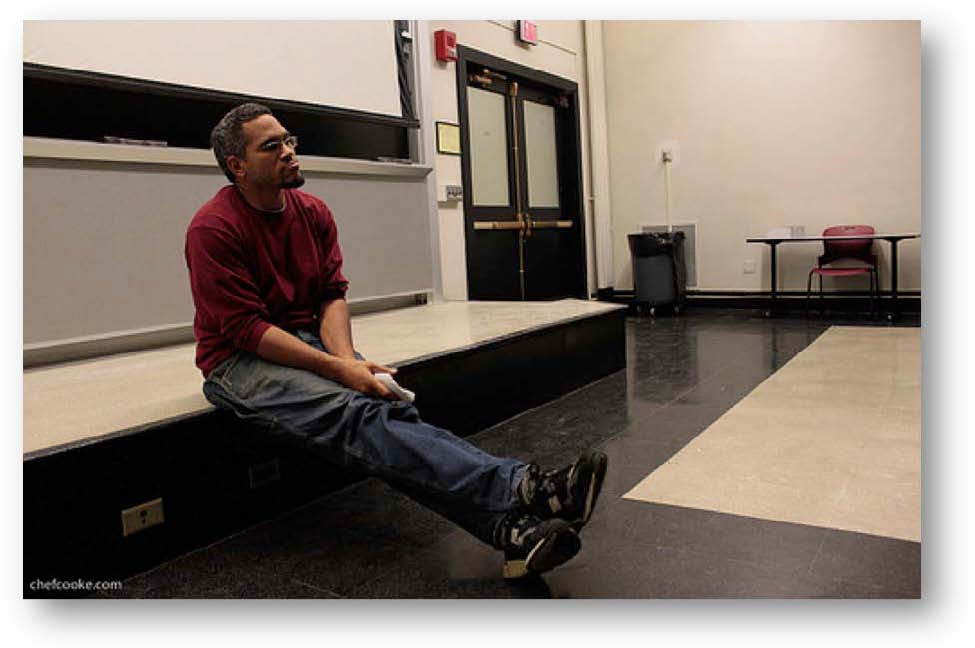

# Lecture 11 Agricultural Focus Groups 

|c1|c2|
|---|---|
|100|10|

Class Outline for October 2, 2009: 

- Agriculture Focus Groups 

The annual International Development Fair at MIT took place from 1-3pm this afternoon, which provides incoming and continuing MIT students, recent graduates and members of the MIT community an opportunity to learn about ways that they can become engaged in international development through student groups, non-profit organizations, academic course offerings and other activities on and around MIT's campus. Groups and organizations of all types set up booths to display their development projects and enlist the interested individuals who pass through the fair grounds. The annual Fair is organized by the MIT International Development Network (IDN), a community network developed to promote and share information about activities, programs, events, and formal academic offerings related to international development. 

## Agriculture Focus Groups: 

In preparation for today’s class, students read articles and thought pieces on different topics in agriculture. During class, the students split up into focus groups to discuss the following: 

- Agriculture and Human Rights 
- Agriculture and Structural Readjustment 
- The Green Revolution 

Kofi Taha leads a group discussion on agriculture and human rights. 

## Discussion on Agriculture and Human Rights: 

This session began with students identifying some basic rights in life that they wanted to see enforced by international law: 

- Work • Safe Working Conditions 
- Education • Health 
- Food • Freedom 
- Housing 

Subsistence-level farmers who depend on their crop entirely for food and income generation are vulnerable not only to extreme weather such as floods and drought, but also to price fluctuations in the market. Major exports from developing countries include coffee, sugar, and cacao (chocolate). With these commodities, the practice of “dumping” surplus production into the market can have very serious impacts on farmers producing at a small-scale on sub-acre plots. How would these farmers be affected if imports became cheaper? What if 10% of what is grown was exported? Even when the market is strong, local farmers often receive the smallest portion of the profit, despite doing the lion’s share of the work. You may pay $3.25 for a Frappuccino at Starbucks, but realize that only $0.02 may actually reach the local grower. At Target, you can buy 6 pairs of socks for $3.99. Inputs include cotton, manufacturing labor (most likely from China), and plastic packaging. Are we concerned about the cotton picker? The packer? 

What is the difference between “free” trade and “fair” trade? “Free” trade has been the approach of the World Trade Organization, which has been championing an open market with no tariffs or subsidies since 1995. The International Monetary Fund and World Bank function on a similar framework. Products and prices are often driven by consumer demand. “Fair” trade, in contrast, sets floors or guaranteed prices for producers and is more of a social investment. Producers can make use of waivers or form cooperatives for better protection. 

Is globalization truly better for everyone? The current system supports maximizing profits first, which can produce inhumane conditions. Can there be agreements between “free” trade and “fair” trade where profits are maximized, but not purely with monetary units? Consumers may decide to pay a premium for something they value – the moral premium for knowing that something is fair of “sweat-free.” People may even pay more to fund an initiative, which is what the Red Campaign and Ethos Water rely on. 

The class engaged in a discussion on language choice, since they noticed that debates on this topic sometimes use terminology with strong connotations such as “backward” and “modern economic activity.” Is the term “fair trade” becoming like the term “sustainability,” which is getting a lot of use but does not always have much meaning anymore? In the international human rights paradigm, the weakest link has not been building awareness, but implementation. 

Some documentaries recommended by the group include “The Corporation,” “Price of Sugar” on sugarcane production in Haiti, and “Life and Debt,” which gives an introduction to “dumping” and how local industries are affected. Interested students may also wish to check out the Fair Trade Campaign advert by Oxfam or the Milton Friedman Institute, which is a think tank in Chicago. 

