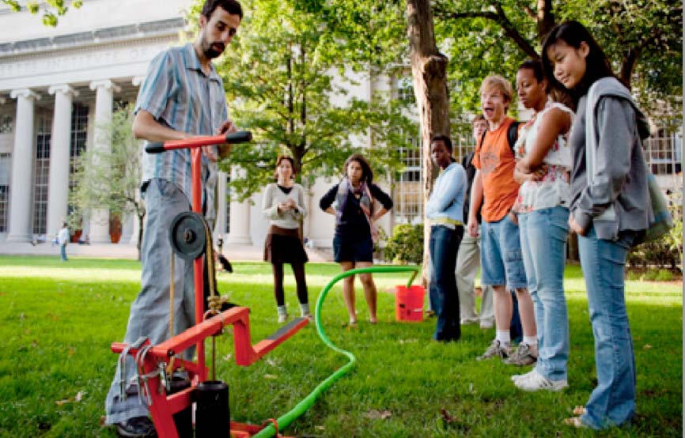
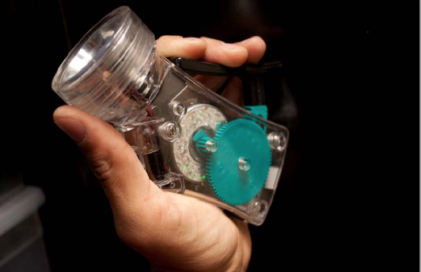
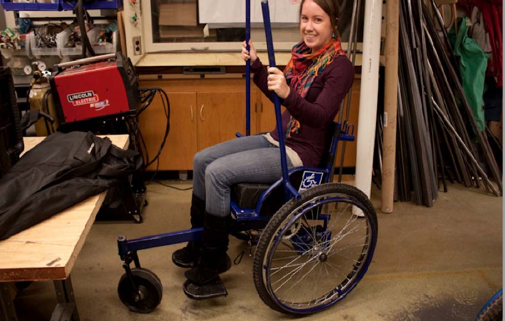
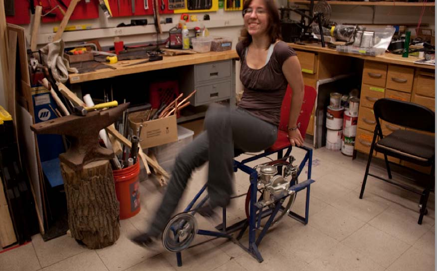

# Lecture 14 Hands-On Human Power 

Class Outline for October 9, 2009: 

- Treadle Pump (Leg Power) Exercise 
- Flashlight (Hand Power) Exercise 
- Wheelchair (Arm Power) Exercise 
- Bicimolino (Leg Power) Exercise 

The following four activities are run in rotation so students have an opportunity to see how different parts of their body – the hand, the arms and the legs – compare in power output. Most students are surprised to see how much stronger their legs are than their arms. 

## Treadle Pump Exercise: 

In this activity, students make a rough estimate of the power they use to pump water up to a certain height. To do this, they use p = ρ x g x h to find the pressure (where ρ is water density, g is acceleration due to gravity and h is the height). Then the students estimate the power by using P = p x Q, where p is the pressure from earlier and Q is the volumetric flow rate of the water being pumped. 

## Flashlight Exercise: 

The students in this module are given two hand pumped LED lights. Each squeeze produces a certain amount of energy that is then used to charge the light. One light is fully assembled for students to see how it works. The other light has the LEDs removed, and bare wires in their place. With some alligator clips and a multi-meter, students are asked to measure how much energy a person could produce from the light pump. The students estimate the power using P = V² / R. The value of R, the resistance, is known because the students use a set resistor. Students then measure their voltage output, or V, using the multi-meter. Since people tire over time, students are asked to average V over one minute to get a more consistent period of power production. 

## Wheelchair Exercise: 

This activity has been designed by Amos Winters, Instructor of the D-Lab: Wheelchairs for the Developing World class. Students estimate the output of human power while using a wheelchair. The students break into small groups and start by using a spring scale to measure the force needed to overcome the rolling resistance, Fpull. To do this, one person sits on the wheelchair and holds the end of the scale while someone else pulls them at a constant velocity. The students then estimate their average velocity when rolling a wheelchair, V, by using a measuring tape and stopwatch to figure out how long it takes them to traverse a certain distance. Students then calculate the power using P = Fpull x V (neglecting air resistance). Each group uses a different type of wheelchair – regular or lever – so the students can compare their outputs. If time allows, students can also measure their power output on a hill using P = [Fpull + mgsinθ] x V or P = mg x Vvertical (where m is the total mass of the chair and the person, g is acceleration due to gravity, θ is the angle of the slope, and Vvertical is the vertical velocity). Students are able to experience how one can get more power on a lever chair with a steeper slope, especially when they push the levers further from the wheels to get more torque. Measuring the efficiency of the wheelchair is a little more challenging and is not done in this activity. The process usually involves measuring the user’s heart rate to see how hard they are working and comparing to their resting heart rate. 

## Bicimolino Exercise: 

This activity involves measuring the power used to grind corn in a pedal powered grain mill. The bicimolino drives an inexpensive hand-crank grain mill with a sprocket taking power from a bicycle drive train.  For power measurement, the hand-crank grain mill is mounted on a bearing concentric with the drive sprocket.  Rotation of the whole mill is prevented by an arm connected to a force sensor. The length of the arm times the force at the end provides a torque reading, τ. 
Counting of pedal strokes gives the speed at the pedals, and multiplying this by the ratios of the sprockets in the drive train gives revolutions per minute, or rpm, of the mill. Students then estimate power by using P = F x V (where F is force and V is velocity) = τ x ω (where ω is the angular velocity). 

. 
