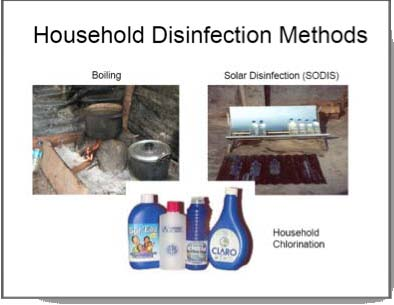
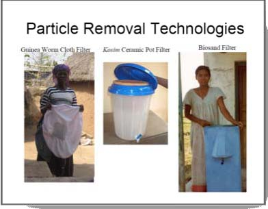
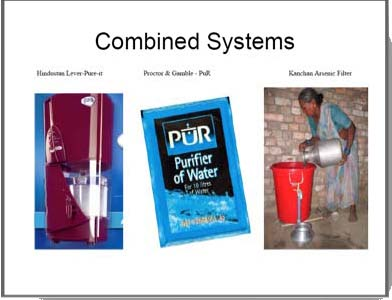
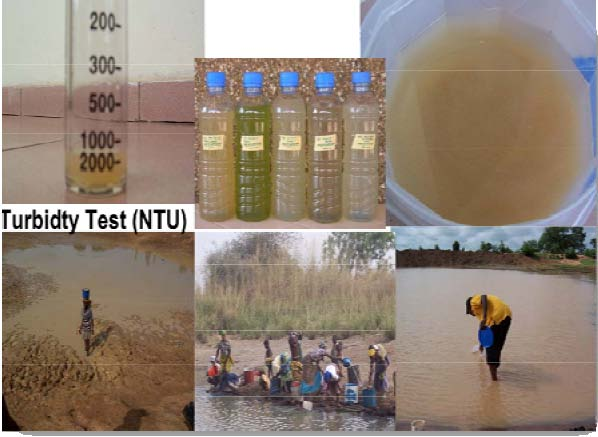
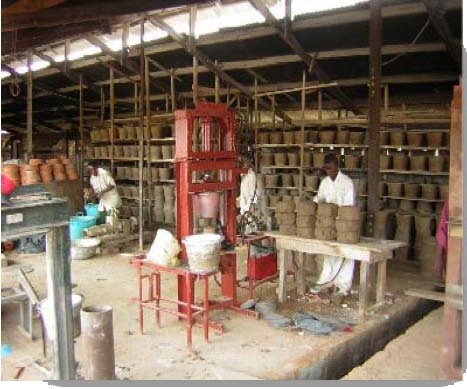

# Lecture 18 Water Issues in the Developing World 

Class Outline for October 19, 2009: 

- Presentation by Susan Murcott 
- Citizen Water EC Kit Demonstration 

## Presentation by Susan Murcott: 

[Please Note: The opinions expressed here are the views of the guest speaker and do not necessarily reflect the views and opinions of D-Lab.] 

Susan Murcott is a senior lecturer in civil and environmental engineering who works on water and wastewater treatment technologies in developing countries. During the 1990s, her research and professional consulting practice focused on innovations in wastewater treatment for megacities in Mexico, Brazil, Eastern Europe and China. Since 1998, she has led multi-disciplinary teams on household water treatment and safe storage projects in Nepal, Haiti, Nicaragua, Dominican Republic, Brazil, Peru, Kenya, Ghana, Bangladesh and Cambodia through the MIT Civil and Environmental Engineering Masters of Engineering Program. These initiatives are part of her larger effort to train MIT students as water professionals and global citizens and to assist in bringing safe drinking water and sanitation to the developing world through “Safe Water for 1 Billion People” (http://web.mit.edu/watsan).  

How many people lack safe water in the world? Students in the class guessed 2 billion, 1 billion, and 1.1 billion, but we really do not know the exact number. We are from the water rich world, but even our part of the world has historically faced water-borne diseases. Susan’s grandmother was born in 1890 and contracted polio when she was in her teens, becoming paralyzed from the waist down. This lecture will be more about the water poor regions of the world. According to the United Nations, “1.1 billion people lack access to an improved water supply.” Improved supply in this case means piped water, public taps, tube wells/boreholes, protected dug wells/springs, or rainwater harvesting. It refers to infrastructure improvements as a step towards safe water. The UN keeps its statistics this way because water testing has been traditionally costly, so it is easier to measure infrastructure over water quality. 

On the other hand, unimproved water supply refers to surface water, unprotected dug wells/springs, tanker trucks/carts and other vended water. Unprotected water sources such as dug wells risk contamination from surface run-off, animal feces, and contact with contaminated containers. Does an improved water supply necessarily provide safe water? Would you drink the tap water from a major city in the developing world such Nairobi or Mexico City, even though it is piped water? Foreigners, the sick, the young and the elderly are especially vulnerable to bacteria in piped water, even if it is technically an “improved supply.” What is the biggest issue with distribution? Contamination is an issue, because water can leave the treatment center clean enough and then get contaminated via infiltration into the piped system. Contamination can also be an issue during animal/human distribution with non-piped systems. 

When it comes to water quality, water can be contaminated in 4 broad categories: 

- Microbiological 
- Chemical 
- Physical/Aesthetic 
- Radionuclides 

Microbiological contamination is the most serious because it can kill you faster and leads to the most widespread infectious diseases. Chemical contamination is the second most serious issue. These primary contaminants have a direct impact on your health. 

The latest data shows that about 0.9 billion people lack access to improved water supplies, with over 746 million living in rural areas and urban/peri-urban slums. Women and children are most profoundly impacted by water quality and water scarcity. Women shoulder the largest burden in collecting water, and are also the primary caretaker when children or other family members suffer from water-borne diseases. The leading infectious killers are lower respiratory infections, HIV/AIDS and diarrheal diseases. Diarrheal diseases mostly affect children under 5, affecting almost as many children as lower respiratory infections and many more than HIV/AIDS. Diarrhea causes 20% of all mortalities for young children and can lead to stunting and malnourishment. 

There is an environmental disease burden: 24% of the global disease burden and 23% of all deaths are attributed to environmental factors. This is why environmental engineers are so important. Diarrhea is overwhelming caused by environmental factors. The 4 major categories of environmental interventions to address water-related disease are: 

- Quantity: ex. if you have enough to cleanse your hands before eating 
- Quality: ex. treating pathogens in water 
- Sanitation: ex. reducing the amount of human/animal feces that contaminate the water 
- Hygiene: ex. washing hands and vegetables before eating 

All of these can make an impact on environmental causes of disease. 

Susan began her training by working in megacities of the world, such as Beijing and Mexico City, but in the last 12 years, she has mostly been working on small scale systems with the M.Eng. program. Through her experience as a consultant in Myanmar, Susan realized that systems need to be community or household scale because it could be costly to implement a large system in rural areas. This is especially true where there may not be the necessary infrastructure, such as electricity needed to power pumps in large systems. For example, it cost $1 billion just to upgrade a water system for 2.9 million people in Boston, Massachusetts. Imagine how costly it would be to provide water to a large number of people in a rural area of a developing country. 

What are some small-scale drinking water treatment and safe storage technologies? A cluster of innovative technologies have been invented and disseminated within the last 15 years. These are distinct from first world post-tap technologies like the Brita Filter because those usually start with safe water as an input and improve aesthetic quality, such as appearance and taste by removing chlorine. There are many known methods of household water disinfection, such as solar disinfection, chlorination, and boiling, which people started advocating worldwide in the 1950s. Boiling only addresses microbiological contamination threats, however, so Susan has invented the Kanchan filter, which can remove chemical contaminants such as arsenic and is being disseminated in Southern Nepal. 

To remove particles, we can use ceramic water filters, biosand filters and coagulation/precipitation methods. Several traditional practices are effective, such as stone filters that have been used in Peru since the 1600s, but it is a relatively new practice to study traditional practices for designing water treatment technologies. Another example is the cloth filter. Sari cloth has been used in India since 500 B.C. and is effective against cholera and guinea worm. Guinea worm is now only endemic to 5 countries but started off affecting more than 26 million people.  

It is hard to come up with a one-size-fits-all treatment because of the many different characteristics of water, such as temperature, pH and geologies of water basins. There are many combined systems out there, such as the PUR water packet designed by Proctor &amp; Gamble (P&amp;G) for the developing world. It is called a treatment plant in a packet because it has a coagulant and chlorine as a disinfectant, but some still consider it a little costly. To use it, you pour the packet contents in a 10L bucket and then rapidly mix it. P&amp;G has a safe water foundation because they found that these products do not make much money but still wanted to provide them. D-Lab teams will get a chance to try out PUR packets on Charles River water at the next meeting. Beyond treatment, safe storage is also very important because water can become re-contaminated through unhygienic behaviors or other exposure to contaminants during transport and storage. Some examples of small-scale safe storage technologies include lidded plastic and clay pots. 

Susan passes several water technologies around the room, including the ceramic water filter and PUR packets, while sharing how she realized that there are many technologies that work but there is no silver bullet. There are also less effective small-scale technologies out there, such as the LifeStraw, which often clogs and is very costly but has been distributed for free. The biggest challenge has been establishing the right network to get the appropriate devices implemented. Susan is now working with the International Network to Promote Safe Household Water Treatment and Storage (HWTS), a public-private partnership hosted by the World Health Organization (WHO). 

Recently, Susan has founded a social enterprise called Pure Home Water in Ghana, after she was not allowed to take students to Nepal in 2003 for safety and stability reasons. Her team is based outside of Tamale, the capital of a northern state in Ghana, where the average turbidity of the water is 690 NTU. For comparison, many professionals have never encountered above 100 NTU. The water is hard to treat since the turbidity is off the chart and the particles protect microbes from being disinfected by chlorine. The team tried several water treatment products but many didn’t work because of high turbidity or were difficult to market well. They ended up choosing ceramic pot filters because of their effectiveness in high turbidity and the clean appearance of the outputted water, which also tested clean. The team currently uses different sales strategies in rural and urban areas, ranging from direct sales to emergency distributions with UNICEF in response to floods and guinea worm outbreaks. The plan is to reach 1 million people in 5 years and have their own factory to manufacture the filters locally, which would reduce the cost from $15 per pot and improve quality control. The current supplier is in construction materials, so filters are only a side business for them. Monitoring is difficult and it is hard to learn the true situation, but at least the monitoring process allows the team to learn more than if they had never showed up. Producing locally also helps address the breakage issue, which often happens during transport from the national capital city of Accra (40% of 500 pots broke during the first time and people even bike the filters right now). The “flowerpot” shape is standard for ceramic water filters, but the team is also testing a “salad bowl” shape which may be harder to break and easier to stack. 

 

## Citizen Water EC Kit Demonstration: 

Susan has also brought in an EC Kit to show the class. The kit facilitates water testing for bacterial contamination in the field and is made and sold by Citizen Water, an initiative that emerged from her work and the work of her students. The kit includes Colilert, a presence-absence test for coliforms and fecal coliforms, and quantitative Petrifilm coliform count plates for people to get a sense of how contaminated the water may be. Both tests can be incubated at human body temperature by wearing them in cloth belt with built-in pockets.  

Citizen Water has since evolved into a business after going through the Development Ventures class and entering into the MIT $100K competition. Another major project of theirs is global mapping of water systems, including source upgrades as well as treatment solutions, using Google Earth. You can check out their page on Facebook. They are currently looking for people to help improve their website interface before the January IAP session. 

