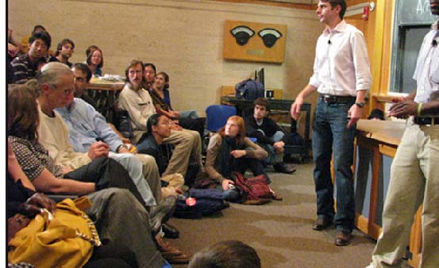
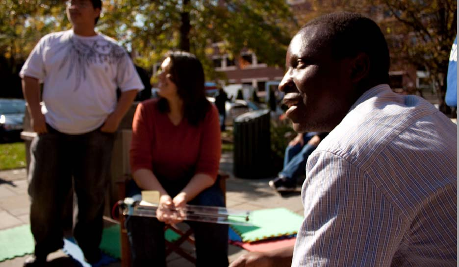

# Lecture 19 Harnessing the Wind 

Class Outline for October 21, 2009: 

- Announcements for “Elegant Design Out of Junk and Spare Parts” 
- Presentation by William Kamkwamba with Bryan Mealer 

## Announcements: 

Tonight, there will be a special Technology and Culture Forum event featuring William Kamkwamba. The talk, titled “The Boy Who Harnessed the Wind: Elegant Design Out of Junk and Spare Parts,” will start at 7:00PM in Room 6-120 . 

Joining us in class today are William Kamkwamba and Bryan Mealer, as well as the D-Lab: Cycle Ventures class taught by Gwyn Jones. Bryan Mealer and “Windmill Bill” have been on a whirlwind tour to promote their new book, The Boy Who Harnessed the Wind, at venues ranging from “The Daily Show” to universities that William is thinking about applying to next year. 

## Presentation by William Kamkwamba with Bryan Mealer: 

[Please Note: The opinions expressed here are the views of the guest speaker and do not necessarily reflect the views and opinions of D-Lab.] 

William Kamkwamba and Bryan Mealer speaking at MIT.Photo courtesy of connors934 on Flickr.

Bryan Mealer is a journalist working in Africa. He started working in New York for a magazine, but wanted to do more so he decided to move to Nairobi, Kenya. He covered war in the Congo, where 5 million people died in 10 years, and wrote a book about it that was published last year. Afterward, he was asked by people in Africa why he only focused on negative stories rather than positive stories. When he read about William, he was impressed that this boy took the initiative to address a need in his community, without waiting for government support, external aid, or any acknowledgement. Bryan wanted to share William’s story with the world so in 2008, they met and wrote a book together. 

William Kamkwamba is an inventor from Malawi. When he was 14, he built an electricity-producing windmill from spare parts and scrap by modifying plans from a library book called Using Energy to fit his needs. The windmill he built powers four lights and two radios in his family home.  William was invited to attend TEDGlobal on a fellowship, where his presentation gained an outpouring of support for his work. Subsequent projects have included a deep well with a solar-powered pump for clean water, malaria prevention, solar power and lighting for six homes in his family compound, and a drip irrigation system. He is currently busy studying for his SATs as a student at the African Leadership Academy, a new pan-African preparatory school outside of Johannesburg, South Africa. He has learned English in just a few years and would like to study engineering in the US. He is particularly interested in programs that emphasize hands-on education, like MIT. After university, he would like to return to Malawi to build technologies for rural communities. 

William grew up with many sisters in Malawi, where many subsistence farmers grow maize, typically 1.5 acres worth. If farmers have access to more land, they may also grow tobacco as a cash crop. It is a precarious existence dependent on weather patterns, market prices and other factors. William was about 12-13 years old when there was a major famine. His father, a strong man, lost about 50 pounds skipping meals so that William and his sisters could eat. William had to drop out of school because they did not have enough money to pay for school fees. At the time, he was very upset and decided to continue his education on his own by going to the library, which was funded by the US government and operated by local non-governmental organizations. He was motivated to study because he didn’t want to fall behind; he wanted to be able to join the same grade as his friends when his family situation would allow him to return to school. William’s father always believed in education and let him read in a hammock and self-study at the library, but his sisters did not get the same support because their father believed they would get married and live with their husband’s family. At the library, William especially enjoyed reading science books because he is interested in how things work. He found books on topics including bicycle dynamos and windmills. 

Both William and his cousin like tinkering around with radios. When William was younger, he thought there were small people inside the radio. He wanted to open a radio up to see how it worked. He later realized that he could power the radio with a bicycle dynamo and when he demonstrated this, people didn’t want him to stop pedaling the bike when they liked the song that was playing. He wanted to make something that could spin the bicycle dynamo on its own, so that he could also dance to the music instead of having to pedal. He then realized that he could make a windmill – wind makes pinwheels spin, and dynamos can produce power from spinning motion. William decided to build a windmill to produce electricity and pump water for his family and his community. He learned how to make one by studying figures in a book from the library, even though he couldn’t really read English at the time. 

It was a long process. William started by making a small prototype that could power a radio using a tractor fan and shock absorber for the shaft. For the larger windmill, he built the frame and blades out of PVC. He did not have any money for parts, so he sourced everything from a junkyard. While he was searching for materials, a lot of people laughed at him and said he was crazy or smoked too much marijuana. His parents were worried about him not being able to find a wife if he continued to drag around all this garbage. Undaunted, William collected materials for the windmill but he was still missing a generator for a long time. He also had to adapt his own tools, such as melting and reforming the handle of a screwdriver to pry open a radio and heating a wire to melt holes in plastic since he did not have a drill. When the windmill was finally completed, it produced 14 volts and could provide light to his home as well as charge other people’s cell phones. Afterward, he still had to spend time troubleshooting issues, such as the bicycle chain coming off when the wind speed was too high. William even built his own step-up transformer, by copying a radio transformer, to increase the voltage to 20V. He also built a circuit breaker and converted the dynamo output to direct current in order to charge a car battery that his cousin gave him. He learned most of the electronics he used on his own, as basic electronics was not a topic being taught at his school. William also taught his cousin how to build and repair the windmill, so it could be maintained when William was gone. 

William admits that he has also failed in his attempts to make things. One time, he tried to produce biogas from animal waste because he lives in a deforested area and he saw that his mother had to travel far to collect firewood for cooking. William likes to see results right away, so he did not want to wait and thought that applying heat could make the process faster. He took his mother’s best pot, put animal waste inside, sealed it with a plastic bag and used an antenna, which has a small hole in it, to collect the gas. He experimented in secret when his mom was away, but she came back unexpectedly. She asked what he was cooking and he said it was sweet potatoes, but she did not believe him because of the smell. After she found out what he was doing, she was furious that he ruined her pot. William wanted her to stand away because he was afraid the gas would explode. When he took the gas far away to try lighting it, however, nothing happened. 

After the windmill was completed, William says he felt like a reggae star releasing his first big album, with everyone waiting for his second album. He still couldn’t return to school for 4 years, however, because his family was trying to pay back their debt and he had to help out in the field. The school was also requesting that William’s family pay for 2 terms before he could return to classes, the new term as well as a previous term where William was only able to attend 2 weeks before dropping out. William continued working on other things, such as fixing water pumps for wells in his area when they broke down. 

Everything changed when a visitor at the library found out about William’s windmill from the librarian. The visitor was wanted William’s story to be heard, so he invited journalists to come and see the windmill. People in the capital city read the news and blogged about the windmill. From there, everything snowballed until William was eventually invited to the TED conference. It was a new and exciting experience for William. At first, he was worried that he did not have anything appropriate to wear. William heard that one should not eat before flying to avoid vomiting on the plane, only to be surprised when food was served on board. He learned about computers and Google, which he expected to be some sort of animal. His first response was to do an online search for windmills and he was blown away by the amount of information that came up. William says that he wish he knew about Google earlier and had access to it in Malawi, as it would have made his life much easier. 

William was worried about his English not being at the right level back then, but is glad that he tried speaking at the conference anyways because it has brought him this far. Many people at TED were moved by his talk and wanted to support him in going back to school and doing more work for his community. Donations went towards school fees, corrugated metal roofs and other supplies for William’s projects. William saw that his mom had to travel far and spend a long time gathering clean water, since the shallow well near his house did not have water suitable for drinking. In response, William wanted to build another windmill that could pump water. William also founded and manages a soccer team, which is now the best team in the area. The members even have windmills on their jerseys. The team brings high school drop outs together to keep them engaged. The team also brought the community together and many local women have since become entrepreneurs, selling peanuts and snacks at games. The media may make the story sound like a windfall, but it has taken many years of hard work for William to get to where he is today. Through creativity and sheer determination, William has been able to achieve his dream of bringing electricity to his home and bettering his community. 

During his visit to the MIT D-Lab, William makes a wind belt with local high school students. 

