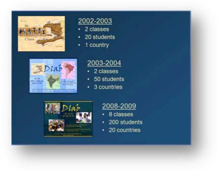
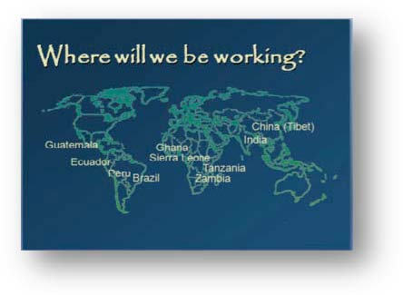
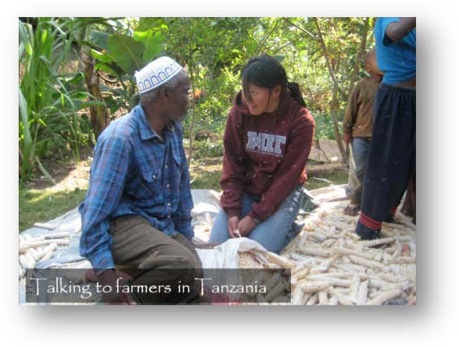

# Lecture 1 Introduction &amp; World Facts Quiz

Class Outline for September 9, 2009: 

- Introduction 
- Course Overview 
- Examples of D-Lab Projects 
- World Facts Quiz 

## Staff Introductions: 

**Amy Smith** is the instructor and founder of D-Lab. She majored in mechanical engineering at MIT as an undergraduate, but felt unsatisfied learning mostly about cars and bombs. After graduation, she joined the Peace Corps in Botswana for 4 years, serving as a teacher and beekeeper. Amy realized that she missed design and engineering, however, so she returned to MIT to study and teach design for development. She believes that what underlies design for the developing world – simplicity, reliability, low-cost, ease of use – is true of all good engineering. Amy feels lucky to be teaching the class she always wished she could take when she was a student at MIT. In this class, she will share things she learned over the years and things she wished she knew while she was in the Peace Corps and doing other fieldwork. 

**Professor Bish Sanyal** joined D-Lab 3 years ago, when he first heard about Amy in a New York Times article. He is from the Department of Urban Studies and Planning (DUSP), where the approach is more theoretical. DUSP looks at technological change on a macro level, so he appreciates D-Lab’s grassroots approach. Many in this field were disenfranchised with theory and how things were not happening on the ground, which led to the early movement for appropriate technology. Bish grew up in India and was trained in architecture, eventually working for his dad as a project manager building bridges in Asia. When he saw that construction workers were men, women and even children with volatile lives where they sometimes did not receive pay, he lost interest in this work and turned to economic development, focusing on how to provide jobs, housing and other necessities. Around this time was the Leftist movement in India and a major strike, so it was a good time to go to graduate school. One of his projects was in Zambia, where his first assignment was to figure out why people were not paying for housing sponsored by World Bank loans. Bish became interested in urban planning and joined MIT as an assistant professor in 1984, eventually rising to department head and chair of faculty. Now he is teaching with Amy and will be bringing a little development theory to help the class consider the larger scope of development. 

**Victor Grau Serrat** is a D-Lab instructor who co-teaches *D-Lab: Development, D-Lab: Design and D-Lab: ICT* (information and communication technologies). His undergraduate studies were in electrical engineering and computer science in Spain. Victor then came to the US for a Master’s degree at the University of Maryland, completing a thesis on a very theoretical topic. He wanted to be more hands-on, so then he went to teach and live in a poor neighborhood of the 2nd largest city in Bolivia. This is where he realized he could combine his skills and interests to work on ICTs for the developing world. Victor worked at one of his dream jobs, doing projects all over the world, and is now teaching with Amy. He has also started his own class on ICTs for development. 

**Derek Brine** is the Teaching Assistant and resident environmental engineer. He has worked in Kenya, Ghana, Uganda, Tanzania, and China. He will be leading an IAP trip and will be in charge of grades. 

Dennis Nagle is the D-Lab workshop manager. He teaches appropriate tools for appropriate technology, such as how to use a hammer, chisel and hacksaw. 

Nate &amp; Jess are the newest members of the D-Lab staff. Nate studied product design at the Art Center College of Design in Pasadena, while Jess studied civil engineering and business at the University of California, Berkeley. They will be taking notes in class for Open Course Ware and leading IAP trips in January. 

Paula Cogliano is the course administrator. 

## History of D-Lab: 

The program started in 2002 with only 10 students. The first class, called The Haiti Class, was (not surprisingly) focused on Haiti and taught in collaboration with the Haitian Students Alliance, who wanted to work on projects in their home country but involve more of the MIT community. Prior to The Haiti Class, Amy had been teaching on Designs for Developing Countries, but without a particular geographical focus. The next year, students from India and Brazil became interested in being part of the class, but they couldn’t call it The Haiti-India-Brazil Class, so they came up with the name of D-Lab. There happen to be many words starting with the letter “d” that reflect the spirit of our program, such as development, design, dissemination, dialogue, and discovery. D-Lab has since grown to reaching over 200 students a year and deploying projects in over 20 countries. By the 2010-11 academic year, D-Lab will have a suite of over 12 class offerings. 

Since the class is oversubscribed, students that do not make it into this class by lottery may consider taking another class in the D-Lab family being offered this fall, such as Development Ventures, D-Lab: ICT, or D-Lab: Cycle Ventures. There are another 6 D-Lab classes offered in the spring (D-Lab: Design, D-Lab: Dissemination, D-Lab: Health, D-Lab: Energy, Wheelchair Design for Developing Countries, and Developing World Prosthetics). 

## Course Overview: 

This course aims to build awareness of development issues and appropriate technologies, developing both hands-on skills and theoretical background. A unique part of the course is an optional fieldwork trip over the January IAP session, where students have an opportunity to work on a variety of projects, learn from rural communities firsthand and engage in cultural sharing. 

The class will consist of lectures, guest speakers (including William Kamkwamba, a self-taught windmill maker from Malawi, and world experts in a variety of fields), hands-on activities and lab sessions (such as using agricultural processing equipment, testing water for contaminants and building a concrete latrine slab), team projects, and area studies to prepare for the trips. Class topics, ranging from energy to microfinance, will be divided into short modules, with dual foci on theory and practical solutions. 

D-Lab has a strong emphasis on experiential learning. Students will be building skills that enable them to do something practical and enact real change over the IAP trip, like building a water treatment system for a community. Amy jokes that if anyone dislikes working with charcoal, he or she should think about dropping the class as D-Lab does a lot work on making charcoal out of agricultural waste. 

Projects do not all require engineering, and often involve 
work in education, health and nutrition, microenterprise, 

and other fields. Students will be forming country teams in 
a few weeks and will choose projects with their team and 
community partners. The team may choose to focus on 
one project or split up to work on multiple projects. Each 
student will bring their own expertise, but everyone needs 
to be careful not to force their interest if it has no 
application to the partner community. Most importantly, 
students are encouraged to be personally engaged. Many 
students will bring their own passion and do projects 
based on personal interest, in addition to class projects. 

**Q: Does D-Lab go back to the same work sites every year?** 

**A**: D-Lab does often return to the same community site but with evolved projects. Students may continue working on their project through another D-Lab class or a fellowship to work with the community partner over the summer. Often the community partners learn more about what D-Lab is capable of and will ask for assistance with different projects. For example, Victor worked with an organization in Honduras that was mostly focused on building techniques, but they wanted to learn more about biogas so they requested that MIT students help with the research for a pilot. 

## Examples of D-Lab Projects: 

Perhaps one of the most successful examples is a pedal power project that has grown into a viable company, Global Cycle Solutions (GCS). GCS was founded by D-Lab student Jodie Wu, who took several classes from the D-Lab family suite of classes and developed a pedal-powered maize sheller and grinder. Jodie was introduced to D-Lab through the Wheelchair Design for Developing Countries. In January 2008, after being inspired by Maya Pedal’s pedal-powered technologies in Guatemala, she traveled to Tanzania as part of D-Lab: Development with a vision to bring adapted pedal-power technologies to communities that could use them. She expected wide impact with these devices, but upon reaching the field, she realized that the stationary technology she brought was designed for another context and she needed to make it more affordable and portable in order to reach the rural communities who needed it most. Jodie wanted to make a pedal-powered sheller that was accessible to the many villagers who were still shelling maize by hand, a process that typically takes weeks, pulling children out of school as food for the family often takesprecedence over education. 

In response to these challenges, in spring 2008, Jodie worked on a team in D-Lab: Design to develop a modified maize sheller peripheral that attaches to a bicycle without altering its functionality. That summer, Jodie traveled to farms and villages in Arusha, Tanzania and watched as this novel implementation of a simple yet valuable technology became a powerful income generation opportunity for the entrepreneur, earning positive returns within one week. The device not only shelled maize 40 times faster than by hand, but it also brought an affordable service that saved rural villagers from arduous manual labor. A formerly unaffordabledevice became an opportunity for enterprise. Jodie worked with teams in D-Lab: Dissemination and Development Ventures to develop the business model for Global Cycle Solutions, a company that would produce and sell the pedal-powered devices to get them into the hands of as many users as possible. 

Today, GCS is continuing to develop its universal adapter and bicycle peripheral devices, and creating a sustainable business model to disseminate their family of technologies to rural communities all over the world. GCS has since won several competitions, including the Development Track and Audience Choice Award at the MIT $100K Business Plan Competition, and successfully fundraised over $200,000 for their operations. Jodie has deferred a full scholarship to graduate school at Berkeley to launch GCS in Tanzania. 

## World Facts Quiz: 

This in-class exercise is an interactive introduction to international development. Students are usually shocked to find out the statistics representing conditions today. 

At the end of class, interested students can fill in application forms to enter the class lottery system. The MIT Service Fair is taking place immediately afterward from 5-6:30pm in Lobby 13, where students will be able to explore additional local and international service opportunities. 

