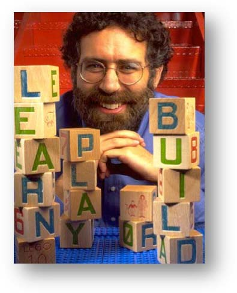
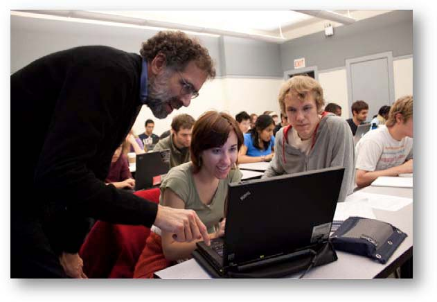

# Lecture 27 ICT in Creativity 

Class Outline for November 9, 2009: 

- Presentation by Mitch Resnick 
- Hands-On Scratch Activity 
- Logistical Announcements 

## Presentation by Mitch Resnick: 

[Please Note: The opinions expressed here are the views of the guest speaker and do not necessarily reflect the views and opinions of D-Lab.] 

Mitch Resnick directs the Lifelong Kindergarten group at the MIT Media Lab and is the LEGO Professor of Learning Research. He works on technologies to engage people, particularly children and youth, in creative learning experiences. Mitch’s research group developed the “programmable brick” technology that insipired the LEGO MindStorms robotics kit. He co-founded the Computer Clubhouse project, a worldwide network of after-school centers where youth from low-income communities learn to express themselves creatively with new technologies. Recently, Mitch’s group developed Scratch, an online community where children program and share interactive stories, games, and animations. In addition to being a professor of MIT, Mitch has worked as a science-technology journalist and consulted throughout the world on creative uses of computers in education. Mitch spoke earlier in the semester and his biography is repeated here for convenient reference. He will be giving a lecture today on ICT (information and communication technologies) in creativity. 

> “We want an economy that’s fueled by what we invent and what we build. We’re going back to Thomas Edison’s principles. We’re going to build stuff and invent stuff.” 
      - **President Barack Obama** 

How can we help people become risk-takers, doers, and makers of things? Obama has stressed that we live in a society where it is important for people to be creating, building and inventing, no matter what part of the world we are in. Unfortunately, if you look at the education system, it does not tend to encourage people to become makers of things. Why has education not embraced this yet? The model of education today is much like the model of development today, where people are given information. We have a chance to move away from the model of the information society and the knowledge society, and into the creative society. Knowledge is important, but just having the knowledge isn’t good enough. How can we use technology to not just distribute information, but help people become creative citizens? 

ICT currently stands for information &amp; communication technologies, but maybe we need a new type of ICT: innovation &amp; creativity technologies. Kids in kindergarten are always creating things, such as making towers out of wooden blocks and or making pictures out of finger painting. How can we use technology in this same spirit? It is fine to have kids making robots, but how can we support them in making something that is more meaningful and useful to them? 

The class was shown a video of students from a workshop that Mitch ran. In the workshop, one girl made a house for her pet gerbil with an automatic door. She really cared and wanted to know what her gerbil did at night, so she even recorded data on how often the door was opened. Another girl loves rollerblading and wanted to know how fast she went, so she put a sensor on the wheels to record how many revolutions per second and converted it to miles per hour. She did math that she wouldn’t have done at school because she was motivated to learn and figure out something she was curious about. 

The Lifelong Kindergarten group that Mitch leads has created a YouTube-like website called Scratch, for children to upload projects to express themselves creatively. To date, nearly 600,000 videos have been uploaded. The class watches a Scratch project done by a 13-yearold in Bangalore. It is about the layers of the Earth and has basic animation as well as sound effects. The narrative is done in his local language. Scratch provides basic tools, such as sound, images and animation, for youth to snap together like building bricks as they create their project. 

Another video of a Scratch project was played, this time featuring the work of a girl with the username MyRedNeptune. Most sites for sending electronic cards only allow people to choose from existing designs. MyRedNeptune decided to make her own interactive holiday musical card that she could send to family and friends. MyRedNeptune has also started collaborating with other Scratch users. For example, she has made tools for others to use, like an animation of a running cheetah based off National Geographic, and she has worked on a game with 4 other kids from 3 different countries. 

Mitch went on to share photos and videos from Bangalore, where an MIT student traveled to run a weeklong workshop to support students in exploring the local ecology of their community. The students did a community mapping exercise where they used phones to take photos of local animals and plants, as well as their water pump and sewage area. They used their own bodies to measure distances. After making a 3-D paper map, students used Scratch to make videos that show how dynamic the natural interactions of their region can be. The videos were downloaded onto handheld devices, and the handheld devices were embedded into the paper map. The students then took the map around the community to show people what they had learned. In this workshop, students used ICT like craft materials, analogous to paper and markers and glue sticks. Mitch wants to see more people using ICT to get his or her own message across, rather than just listening to other people’s messages. 

Mitch’s research group is now creating kits for students to design physical interfaces, such as steering wheels, to go along with the games that they create. The goal is to give students the experience to develop practical skills for thinking creatively, reasoning systematically and working collaboratively. The instructors note that today’s lecture could be especially useful for teams interested in doing educational projects during their IAP trips. More educational resources are also available from the Edgerton Center’s outreach initiative, run by Amy Fitzgerald, at  http://web.mit.edu/edgerton/outreach/

. 

## Hands-On Scratch Activity: 

The students spent the rest of the class doing a hands-on activity in collaborative storytelling with Scratch, an interactive program for creative expression. In this activity, students attempt to make their own video project, but shift computers before they finish so that they can work on someone else’s project while another student completes the project they started. Anyone can try Scratch out at http://scratch.mit.edu/

. 

## Logistical Announcements: 

A movie called Living with AIDS will be shown in class next Wednesday. It is a difficult movie to watch about HIV/AIDS in Zambia, but it is important to learn about this issue that so many people face, particularly in Southern Africa. 

There will also be a concrete lab this Friday. In order for each country team to learn different technologies, team members should choose to attend different sessions out of the four being offered. One group will make a peanut sheller. Another group will learn how to make a reinforced latrine slab. A third group will be making porous blocks for an infiltration well, and the last group will be making a charcoal crusher to crush carbonized corn cobs into powder for making briquettes. 

The assignment this week is to live on $2/day for 7 days. Half of the world does it every day. The budget is meant to cover all food, transportation and entertainment – students can rest assured that the assignment is not meant to limit anything required for their health or their academic careers, such as medicine or bus fare to get to a class at Harvard on time. To keep the assignment simple, students are not required to pro-rate their rent payments, toiletries and utility bills. Several students in the class had some clarifying questions about the rules and the possibility of bending them. While students are free to be creative, the point is not to be eating free food at MIT events, but to really try living on $2/day in an attempt to begin understanding some challenges that are faced by people living in poverty. Students will have to consider the trade-offs involved and make tough decisions, because taking a bus instead of walking in order to get somewhere faster would mean less money for food. Choosing to buy more varied and nutritious foods, such as vegetables and dairy, can be more expensive and mean much less quantity of food compared to buying grains and starches in bulk, like a bag of rice or potatoes. For this assignment, students are expected to keep a record of everything they spend and reflect on insights gained from this experience afterward. This is not an exact duplication of the experience of people living in poverty, but the idea is to have the students learn to appreciate what people go through when living on $2/day. It is important to recognize that people in developing regions would also have to stretch this income to cover healthcare, education and other expenses such as soap, lighting and cooking fuel. 

