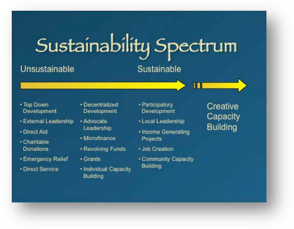
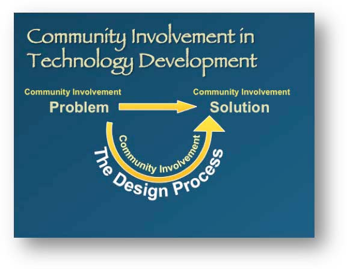
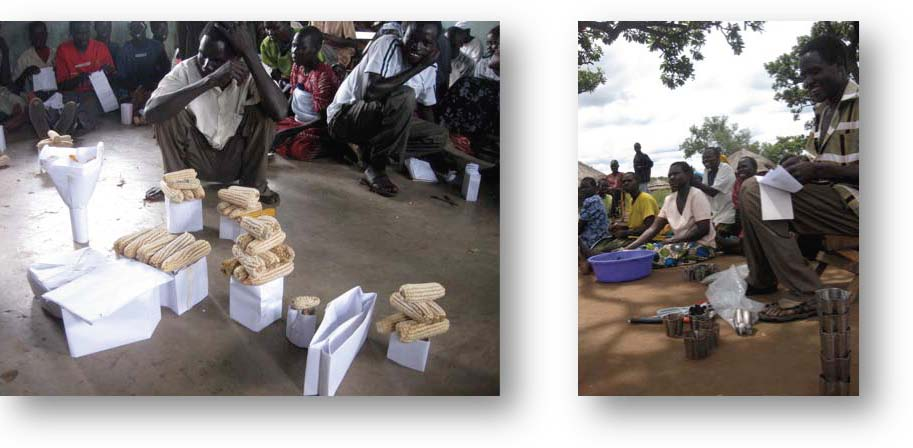
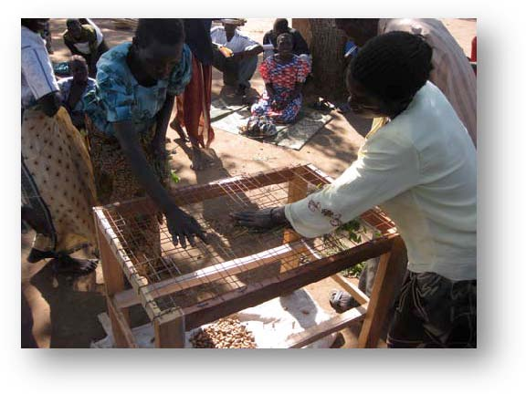

# Lecture 28 Creative Capacity Building &amp; Concrete 

Class Outline for November 13, 2009: 

- Announcements 
- Update from Uganda – Creative Capacity Building Workshop 
- Concrete Lab 

## Announcements: 

There will be a discussion next Monday to reflect on our experiences during the $2 a day activity this week. It is good to try to understand what other people go through when they struggle to meet their daily needs or go hungry (for example, Amy periodically fasts for Ramadan even though she isn’t of the Islamic faith). In today’s class, one of the D-Lab students from the Zambia team, Tim, made pancakes that he will be selling for a nickel each as part of his microenterprise. He said he is excited, because if he makes enough money he may even be able to afford milk! 

## Update from Uganda – Creative Capacity Building Workshop: 

Amy has been in Uganda that past two weeks, running a community workshop. It is best to start her update by reviewing the ethos of D-Lab, which has been shaped by 3 movements in development: Appropriate Technology, Participatory Development, and Creative Capacity Building. If Appropriate Technology is the “what” of development and Participatory Development is the “how,” then Creative Capacity Building (CCB) addresses the “who” by seeking to empower communities through training people in the design process so that they become active creators of technology, not just users or recipients of technology. 

In a spectrum of sustainability, charitable aid and external donations are not sustainable. This is not to say that they are necessarily good or bad and it is important to recognize that they are sometimes needed in times of crisis. Microfinance and external loans fall around the middle of the spectrum, as they help build individual capacity and are moving toward sustainability. On the more sustainable end, we have local leadership and job creation. CCB on a community level would be very sustainable, as it shifts people’s mindsets so they can feel empowered to become creators and solve their own problems, without waiting for external intervention or aid. 

CCB is a concept that crystallized when Amy was working last year with graduate student Kofi Taha in Northern Uganda, where there was a long and brutal intertribal war in which children were kidnapped and forced to fight against their own village. In this region, people are just beginning to move back to their homes after several years of being displaced and living in relief camps. There is a great need for technologies that can ease the transition from the dependence of a refugee camp to a sustainable livelihood in the village. Another concern is that the move back to the village will increase the workload on women – sources of water are further away; subsistence crops need be grown and processed because food will no longer be given away; fuel demand will go up and supplies are farther away; and there is a great need to find ways to produce income for the family, as services will longer being provided by international relief organizations. Traditionally, women are solely responsible for or participate in all of these types of work. Amy and Kofi were asked to demonstrate some technologies that might ease the transition, reduce the burden of labor, and provide income-generating activities to the residents of transit camps. 

Normally, when doing technology demonstrations, D-Lab finds a local artisan to produce the technologies so that they would be available, should the community want to buy them. While doing demonstrations in the transit camps, however, Amy and Kofi found that the local manufacturing capacity was very limited. So in addition to showing these technologies, another goal was to emphasize that the residents themselves could be creators of technologies, not just recipients. Two important underlying concepts that drove the designs were presented throughout the demonstrations: the first was to make the technologies affordable, so that they could be accessible to people with very limited income and resources; the other was to take the mystique away from the technology design process and show people that technology is something that they could produce themselves. 

Amy and Kofi not only demonstrated how to make the technologies, but also wanted to enable the people to take part in developing these technologies. This meant involving the community not just in identifying the problem and implementing the solution, but also in the entire design process, from gathering resources to idea generation, concept selection, building, testing and refining the design to better suit the purpose and needs of the users. Novice designers rarely go through multiple iterations of the design process, but Amy and Kofi ran a 3-day creativity workshop with 60 people in Uganda to teach this process and illustrate it correctly, using relevant appropriate technologies as examples, and a series of hands-on activities to reinforced the concepts presented. 

The curriculum includes exercises that allow participants to practice both creating new technologies and evolving and improving upon existing technologies. On each day, in addition to the more formal design curriculum, participants were given time to work on a “mini-capstone” project which allowed them to apply the concepts they learned and to see how they all fit together in a single project. A guiding principle for the exercises and project was for the participants to walk away with some tangible, useful technologies that they made in addition to the new concepts they learned. 

Table 3: The CCB Curriculum 

<Table>
<TR>
<TH>Day 0 </TH>

<TH>Day 1 </TH>
<TH>Day 2 </TH>

<TH>Day 3 </TH>
</TR>
<TR>
<TD>Introduction - Greetings - Intro to Creative   Capacity Building - Review schedule - Things to bring </TD>

<TD>Design Process - Example: Charcoal press - Activity: Cassava storage Idea Generation - Project: G-nut thresher</TD>
<TD> Review Concept Selection - Project: G-nut thresher Detail Design - Example: G-Nut sheller Materials &amp; Manufacturing - Example: Maize sheller </TD>

<TD>Review Testing &amp; Getting Feedback - Example: Simsim paste maker - Project: G-nut thresher Project Showcase Evaluation Wrap Up &amp; Next Steps </TD>
</TR>
</Table>

One of the introductory activities that Amy ran was for people to work in teams and brainstorm how to hold as much corn off the ground as possible, using only paper. The first time she explained the activity, she gave an example to help them understand the activity but may have unintentionally narrowed their thinking by doing so. Unfortunately, all of the ideas that the participants tried ended up following her example. In the second round of the activity, she was more careful in her explanation and people came up with many more diverse ideas. 

During the workshop, participants made corn shellers so that they would have something useful to take home as well as an opportunity to work on building skills. In order to show that the tools used to make the technologies are just as important as the technologies themselves, a team of 8 people would share a single set of tools. When Amy and Kofi returned the next day, there were stacks of corn shellers very nicey made. 

The participants were then challenged to go through the entire design process and make a device for threshing groundnuts. As an incentive, the winning team would receive a tool set for making corn shellers. Amy showed the class videos of the participants enthusiastically presenting their designs. It was amazing to see how quickly people became engaged in the process and how excited they became about their own creations. Amy then demonstrated the 

groundnut threshers made during the International Development Design Summit in Ghana, while being careful to show these designs as other versions, rather than better versions, and explain that they were developed over a much longer period of time. One design was a mesh table and Amy challenged the participants to think about how they would adapt the thresher for millet or sorghum. Before, the community threshed groundnuts off the root by hand – this workshop really helped to change they way people think, encouraging them to be creative and develop their own tools and devices for making life easier. 

Participants also tried using a paste maker, gave feedback about what they liked and didn’t like, and made suggestions on how to improve the design. What is important here is that every technology shown and used in the workshop is something that people can relate to and use (not kumquat juicers, in this case, or anything equally obscure). You have to first let people how a technology is used and built, before you talk about how it was designed. For example, it would be hard for people to understand the design iterations of the charcoal press if people are not familiar with the charcoal-making process. 

At the end of the workshop, Amy and Kofi collected feedback by having people fill out multiple-choice surveys that do not require people to read or write. Participants had colored beans representing different options (black might mean they didn’t like it, light tan might mean they liked the session and got what they expected from it, etc.) and used the beans to show how they felt. Amy is actually eating the beans now while she is living off $2 a day. Many people kept saying that now they need tools, so the next step might be building community shops so people have access to tools along with a space to share and work. 

It was really encouraging to see how these refugees, who have been victims of war for 30 years and who NGOs said would just wait to be given things, got really engaged in the workshop and started coming up with their own solutions to address problems in their community. Technology, in this case, is being used as part of the psychosocial rehabilitation efforts. At the end of the workshop, perhaps not all 60 participants will become makers, but at least some participants may have realized that they can be inventors and enjoy the process of creating. D-Lab feels that CCB is an important new approach to development work, and one that is necessary in order for there to be true co-creation. If any teams are interested in working on CCB during their fieldwork trips in January, they should meet with Amy as she continues to develop this workshop. 

There is an inherent difficultly in doing work in the classroom in the US while wanting to have intense community interactions. The student design teams strive for good communication with community partners during the semester, however, this cannot replace the experience of working side by side, sharing ideas and building prototypes together. D-Lab works with the view that what is done during the fall class is part of the foundation of collaboration with community partners, and that the important next step will be for the students to travel to their partners and work together on the future development of each project. 

## Concrete Lab: 

In today’s class, we’ll talk about concrete in the abstract and then in the concrete. Although many people may use the words interchangeably, concrete is not the same as cement. Concrete is made with cement (a binder with lime, gypsum, etc.), sand and an aggregate (such as gravel), typically in a ratio of 1:2:3. Porous blocks for infiltration wells, on the other hand, use a ratio of 1:2:8 (also in parts cement to sand to aggregate). Mortar is often made of cement and sand in a ratio of 1:3 and used as the glue to hold concrete bricks together. 

It is critical that the concrete is well-mixed throughout the process of making it (before adding water, while adding water, and after adding water). One technique for making concrete in the field is to mix the dry ingredients on the ground with a shovel and make a little volcano to hold the water. After the water is added, mix well to incorporate it in the mixture evenly. Many people think they know how to make concrete, but probably do not. Remember to always mix well, mix well, and mix well! 

Another important point is that concrete doesn’t dry; it sets. When concrete sets, it crystallizes. This is why concrete needs to be kept wet, so that water molecules in the matrix can form crystalline bonds. In other words, water molecules are part of the chemical process that makes concrete hard. The longer the concrete is wet, the stronger it can become (for example, marine concrete used for pylons in water can continue to gain strength for up to 20 years). Good practice is to keep it wet for a minimum of a couple days up to a full week. Try hard not to let the concrete dry out! 

Now the class is ready to go make concrete and discuss it concretely. One group will be making peanut shellers using molds developed by the Full Belly Project, one group will be making porous blocks for infiltration wells, one group will be making a latrine slab (which has to be strong), and one group will be making a charcoal crusher that was developed by a team during the 2008 International Development Design Summit (shown below). Each country team will have its members split among the different groups, so that the team as a whole can build up a wider range of experience. 

