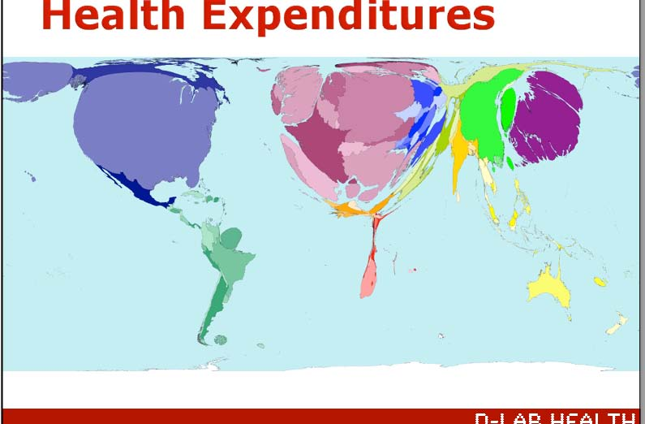
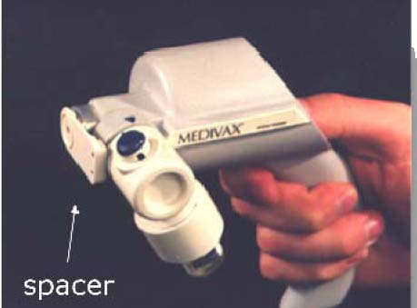
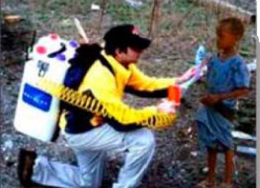
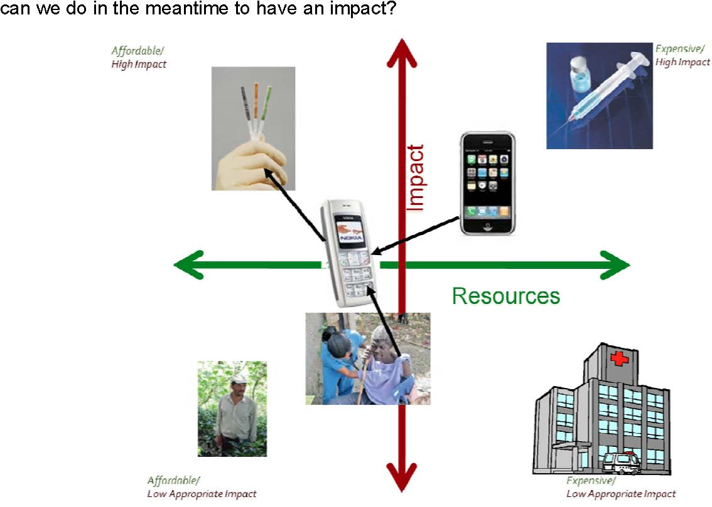
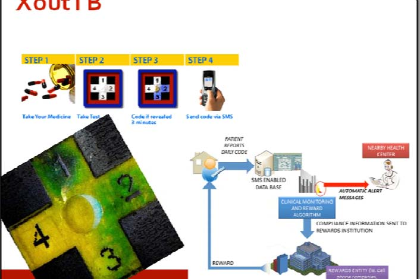
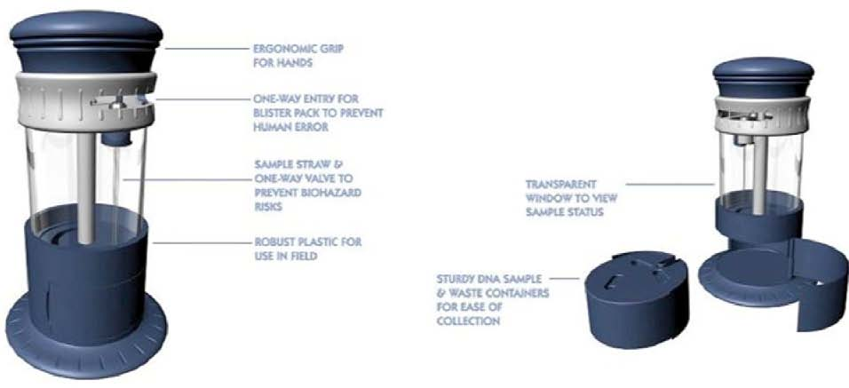

# Lecture 31 Health Issues in the Developing World 

Class Outline for November 20, 2009: 

- Presentation by José Gómez-Márquez 

## Presentation by José Gómez-Márquez: 

José Gómez-Márquez co-teaches D-Lab: Health and leads the Innovations in International Health (IIH) initiative at MIT. Among the projects under his technology practice at IIH are the Aerovax Drug Delivery System, a device for mass delivery of inhalable drugs and vaccines to remote populations, SafePilot, a next generation cane for the blind, and XoutTB program, which aims to increase TB therapy adherence in developing countries using novel diagnostics and mobile technology. Originally from Honduras, José worked in institutional investments and international development before attending Worcester Polytechnic Institute as a mid-career student, where he focused on policy research studies covering international technology transfer and small team innovation. José is a 3-time MIT IDEAS Competition winner, including two Lemelson Awards for International Technology, and was named Humanitarian of the Year as one of Technology Review’s 35 top innovators under 35. 

Looking at tropical diseases and neglected diseases, what has cropped up in the last 5-6 years is like an undefined notion of Web 2.0 (Facebook, etc.): global health encompasses issues that transcend national boundaries and are better addressed through information sharing, user-centric design and collaborative problem solving. There are 2 main lines of interest in this field: public health and humanitarian aid. You can think of public health as the large centralized infrastructure that keeps the overall population healthy (vaccination programs, awareness campaigns, clinics, Ministry of Health, World Health Organization, etc.). Humanitarian aid is disaster response medicine to protect dignity and alleviate suffering (Hurricane Katrina evacuation program, refugee programs, etc.). It is important to recognize that we can learn from everyday situations in Uganda to know how to deal with situations like a major natural disaster. 

The South-North distribution of life expectancy is very uneven (esp. in Africa and South East Asia), but there is a more interesting measure of not only how long did that person live, but how productive they were and how they were able to provide for their families. This unit is called the Disability Adjusted Life Years (DALY), which gives you a sum of potential life lost due to premature mortality and productive life lost due to disability. Life expectancy alone wouldn't take into account the quality of life of a polio survivor who's in a wheelchair until 85. Generally people die from diseases like heart disease, but what they suffer from in their life tends to be a different set of diseases, like respiratory infections, diarrheal diseases, and depression. This gives us a clearer view of opportunities to impact global health. 

Life expectancy at birth, females, 2003 data. From

http://www.who.int/whr/maps/en/index1.html,

accessed October 2009. Courtesy of the World HealthOrganization. Used with permission.

Public health spending, 2004 data. © Copyright 2006 SASI Group (University of Sheffield)and Mark Newman (University of Michigan). Used with permission.For high res images, see: http://www.worldmapper.org/map_list.html

If you use http://worldmapper.org to look at health expenditures, you can see that much more is spent in the US and Europe, East Asia. The key is not only what you spend, however, but what you get. This map may actually end up showing a lot of waste. Still, the disparity in spending is shocking – only 1% of new drugs developed during 1975-1999 were for tropical diseases. For example, river blindness does not happen in the US. Who will pay for a river blindness drug? What's the incentive?

There are dual-use opportunities for medical innovations in global health. For example, military and camping uses for medical equipment have the same parameters as what you would design for in the developing world (lack of infrastructure, etc.). For medicine, pharmaceuticals can price drugs differently in developed and developing world so they can charge enough to recover the costs of development while trying to keep the cost at an affordable rate in other countries. What's happening now, however, is that the emerging pharmaceuticals in Brazil, India, and South Africa can make generic drugs at pennies on the dollar. Will big pharmaceutical companies still want to develop these drugs if they can be knocked off in emerging markets? Maybe pharmaceuticals will still want to do some good and be pragmatic, realizing that they may not be able to prevent others from copying them. You can think of the global health arena as a complex stage with many actors, including funders like the Bill &amp; Melinda Gates Foundation, regulators like the Ministry of Health or the Food and Drug Administration (FDA), companies, NGOs and so forth. 

90% of medical technology in the developing world is hand-me-down, and 80% of it fails within 6 months. The failure is generally from simple issues, such as the donating organization not realizing the roof in Honduras could leak and short out the equipment. Siemens Corporation in Germany donated an expensive color ultrasound machine to Nicaragua. A technician decided to try to hook up the screen to an antenna to watch the World Cup in color. Now there is a hunk of German technology just sitting there. How could the engineers in Siemens even plan for that? 

One example of an innovative technology is the jet injector, which has been available since 1947. The jet injector delivers a dose of vaccine through the skin by pushing air with enough force over a small are, similar in principle to a water jet. Prefilled automatically, this innovation allows more patients to be reached and have access to the vaccination compared to the traditional method, where healthcare workers need to be trained to clean needles and administer shots. Also called a “peace gun,” the jet injector was a favorite tool of vaccinators until it was discovered that it had spread hepatitis in California. When the air stops, it actually creates a vacuum that draws a tiny bit of blood that could excluded infect the next patient. The device was pulled and health workers went back to syringes and needles. This is a classic example of the backlash that can happen when something goes wrong, even if the device has the potential to be a good technology. Engineers have now perfected the device so that there is a disposable spacer between the gun and the skin that is changed between patients. 
 © PATH. All rights reserved. This content is from our Creative Commons license.
For more information, see http://ocw.mit.edu/fairuse.

José has also helped develop a device to deliver vaccines without a needle called Aerovax, which allows patients to inhale the medicine instead of receiving it by injection. Like with the jet injector, vaccinators do not need specialized training to administer the drugs with Aerovax. Aerovax has an added advantage in that vaccines in this form can be kept for longer (~7 days in the field without refrigeration). 

To successfully design devices for global health, the D-Lab Health program goes through a design cycle that involves selecting appropriate design attributes and utilizing design toolkit strategies to innovate. One tool for this process is the global health innovation compass, which measures how long and how many resources it takes to develop something against its potential impact. For example, developing an AIDS vaccine has the potential to be very high impact – there was a time when people almost gave up on curing polio and were trying to miniaturize iron lungs to allow people to live with the disease, until the vaccine came out and changed the nature of the game – however, vaccines can take a lot of money and time to develop. What else can we do in the meantime to have an impact? 

Overall graphic by Jose Gomez-Marquez. Consitituent photos and graphics © source unknown.All rights reserved. This content is excluded from our Creative Commons license. For moreinformation, see http://ocw.mit.edu/fairuse.

One area of opportunity is to build off of existing technology platforms, like the mobile phone. For example, the iPhone is a powerful technology that is capable of a wide range of uses, from storing medical texts like the entire content of Gray’s Anatomy to looking at magnetic resonance imaging (MRI) scans and x-rays, but it is very costly. How can you work with what you have? Is it possible to transfer some capabilities of iPhone to the more affordable and ubiquitous $25 Nokia phone? For example, you may not need all the information at once – can you take it off the phone and put it on a server, to be transferred via SMS? What features of the Nokia phone can you use? If the phone has a built-in camera, maybe you can do colormetric analysis and send photos for diagnosis to see if someone has sepsis, so people don't have to travel long distances to the hospital in town. 

An example of an IIH innovation using mobile technology is XoutTB. Tuberculosis (TB) is an infectious disease that attacks the lungs. There is a cure, but the patient needs to take antibiotics every day for about six months. People tend to take the drugs for only 1-2 months until they feel better from the disease but start to feel the vicious side effects of the drug, so they often stop while the disease is still in the lungs and become drug resistant. In these cases of drug resistant TB, treatment costs would go up substantially and the prohibitive cost could effectively spell out a death sentence for some patients. The current method of ensuring patients stay on their antibiotics is to send healthcare workers to directly observe them, but this can be very resource-intensive. A challenge was issued for people to design innovative ways to ensure patients continue their treatment until completion. José initially thought people would use calendars, bracelets, and songs to remind patients to take their drugs. He worked with economists to think of incentives to encourage patients to stay on their treatment. Even though patients receive a very big reward after following the treatment course for 6 months (they survive), half a year is a long time, so there is a need for short-term prizes as well. To address this, José’s team came up with XoutTB, which offers cell phone minutes to patients for taking their antibiotics each day. 

Another challenge is being able to tell whether people are taking their drugs without observing them, so the XoutTB team developed a device that measures the metabolyte in the body after taking the antibiotics. If the device senses that a patient has been taking his or her medication, it generates a random code that he or she has to enter in order to redeem the cell phone minutes. The system is currently undergoing clinical trials in Pakistan with 1600 patients, and initial results from Nicaragua show that people like it. The cost of the XoutTB system, including cell phone minutes, is about $7 per patient, which is cheaper than paying for health workers to physically go and make sure that people are taking the medication (~$120 per patient). Not everyone has a cell phone yet, however, and there are concerns about whether this type of incentive system will encourage people to value their health less. More education may help, but compliance is still a big issue - the United States healthcare system loses about $300 billion a year due to noncompliance with treatment. In addition to education, health workers now use pillboxes and incentives like airline miles to try to keep patients healthy and alive. 

Underlying image © Google. All rights reserved. This content is excluded fromour Creative Commons license. For more information, see http://ocw.mit.edu/fairuse

A similar innovation is disease surveillance in Pakistan, which gives health workers an idea of where to go by enabling them to track which TB patients took their medication and which patients need to be referred to a different hospital. These initiatives are happening in Pakistan through a chance relationship, but don’t underestimate what can come from serendipitous connections – collaboration is important and can be very powerful. The local partner in Pakistan has the ability to run trials with millions of patients, while José can contribute expertise in new technologies such as microfluidic chips. One way to think of a microfluidic chip is to compare it to an integrated chip in electronics, which holds an electric circuit with different components. In this analogy, the microfluidic chip has liquid running through instead of electric current. This can get advanced, but at the end of the day, microfluidic chips basically run a tiny amount of liquid through a tiny channel. SNAP (simple nucleic acid processing) is a device José helped to develop that purifies deoxyribonucleic acid (DNA) in the field for diagnostic tests with microfluidic chips. SNAP basically isolates this function by running blood through a tiny channel to extract and purify the DNA. 

When designing appropriate medical devices, there some essential attributes to consider. Of the utmost importance is **safety** – we need to learn from mistakes like with the first generation jet injector. Devices in these settings also need to be **robust**. For example, vaccine vials may be dropped frequently in these environments and should not break. **Affordability** is critical, but so is **longevity** – in times of financial hardship, people tend to continue buying consumables like medicine but stop buying devices. José has found clinics that have vaccines but no syringes, which are categorized as medical equipment. We also need to design for reliability, wear and tear does not affect performance, or if it does, we know how performance is affected. There is a big debate about **reusability vs. disposability**.  People throw away nebulizers in Boston but clean them in Nicaragua – if you cannot convince people to throw them away, you have to address how to clean them. There are also devices that you would not want people to reuse, like syringes. We can make auto-disable syringes so that once they are used, they lock and people cannot pull them back up to use again. Mom and Pop clinics and shops in other countries often do not have money to get new syringes for each use, but they may buy a repackaging machine to make things look new. 

Beyond the essential attributes, we can also consider enhancing attributes, such as **mobile** devices that can **connect and interact** with other devices. **Redundancy** is also nice to have, so we can replace things cheaply in case someone screws up one part of the device. For example, in Aerovax, there is a piece that is the most delicate and also the most used part. If that piece breaks, people will not be able to use the device anymore, so the team looked at how to improve the design to address it. 

The good news is that there are a lot of available drugs and treatments for diseases. The bad news is that it may be difficult to deploy these solutions (keep them refrigerated, deliver them, train people to administer them, etc.). This is where we can focus on discovery and innovation: inventing a better way to get these drugs and treatments to people who need them. 

So how do we get there? We have traditionally employ various design strategies, such as **hybridization**, or the mashing up of 2 technologies, such as the way the University of California at Berkeley adapted a cell phone into a microscope diagnostic tool. We can **combine vintage and smart design**, like the way a doctor in Florida studied toy Nerf guns and syringes to make a dragon gun that shoots six injections in 1 minute for critical patients. **Improvisation in design** is another strategy that has been used with devices such as inhalers. Inhalers require synchronized breathing, where the person has to be trained to breathe in at the same time as when the medicine is dispensed. Young children who may be scared or upset, however, may have difficulties using the inhalers. In response, people have made a chamber into which the medicine can be dispensed, so kids can breathe at a more leisurely pace. The device is $65, which many patients in the developing world cannot afford even though it is sold there. Doctors have started to use coke bottles to make a chamber for the inhaler and studies have shown that this works. Some engineers at Stanford University wanted to do one better, so they now make origami paper inhalers for less than a dollar. We can also **shift the context**, like the way PlayPumps use merry-go-rounds to pump water. Aerovax was actually invented when the designers were inspired by how crops are sprayed to eliminate the labor involved in dispensing chemicals. **Crowdsourcing** is becoming an increasingly popular design strategy. An example of this is enabling people to use connectors to design prosthetics. 

Let's end with the example of Medik kits. D-Lab and IIH received support from the Inter-American Development Bank (IADB) to encourage more people to do innovative design work for global health. The goal is to have 7 types of kits that are the health workers’ equivalent of erector sets, which kids use to build their own cars and toys, so doctors and nurses can have the tools they need to make quick prototypes of medical devices. IIH has also started a class in Nicaragua that trains and encourages health workers to design medical devices, including auto-disable syringes and nebulizers, using different mechanisms. This type of design work can be done and should be done more in the US, but it is important to realize that this innovative work can also be done and should be done abroad, closer to where the problems and end-users are located.  

