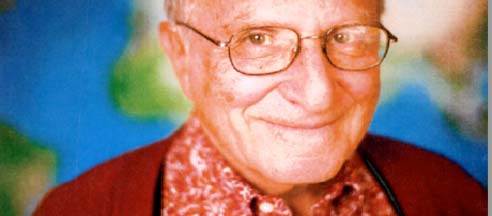
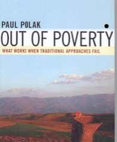
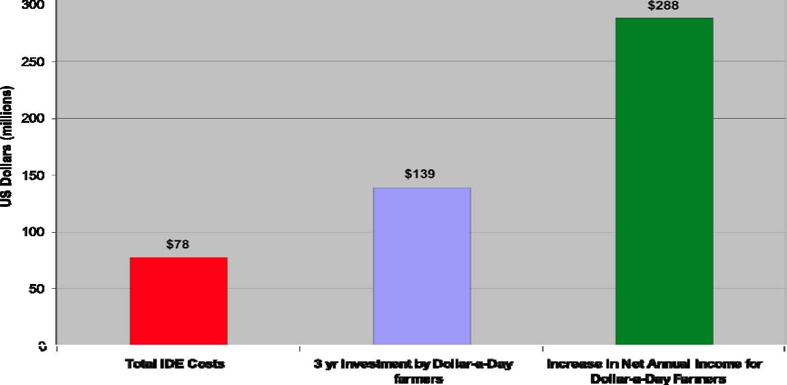
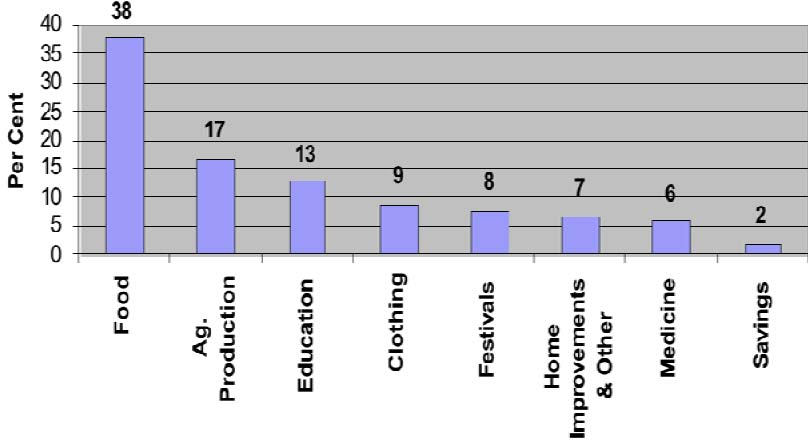
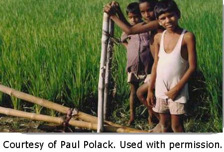

# Lecture 34 Market Approaches to Development 

Class Outline for November 30, 2009: 

-  Water Roleplay 
- Market Approaches to Development &amp; Supply Chains 

The class started with a roleplaying activity on forming a community water committee, which will be discussed next time. Amy attempted to channel Paul Polak for today’s lecture, who is one of D-Lab’s longtime friends and business gurus. Paul is the founder of International Development Enterprises (IDE), arguably one of the more successful organizations at disseminating appropriate technologies. IDE has established distribution networks with thousands of people selling hundreds of thousands of Courtesy of Paul Polack. Used with permission. drip irrigation kits and millions of treadle pumps in several countries, while many other development organizations would be excited about implementing a thousand of anything. For comparison, Amy is happy to have 61 charcoal production workshops in Haiti. People used to be disturbed by the idea of charging money from the poor, but now it has been shown that IDE’s approach of charging an affordable price to cover the costs of manufacturing, distribution and maintenance can be scalable and sustainable. The organization does still receive some grants, because they do not pass on the costs of the research and development and marketing costs to the consumers, but Paul insists that the only way for a system to be self-sustaining is if everyone involved the supply chain is able to gain some value. Think about not only how value is getting added along the chain, but how is it can be extracted. 

In Out of Poverty, Paul discusses three great myths of poverty eradication. He first challenges the idea that we can donate people out of poverty, and asserts that easiest way to end poverty is to provide people with tools to make more money. Income generation has actually only been in focus among the international development community for the last couple of decades, so this idea is relatively recent. A second popular myth is that we can end poverty through national economic growth. Paul points out that the trickle down effect has simply not happened the way we had hoped, and people at the bottom income bracket have not seen the benefits from growth that they should. The third myth is that multinationals can end poverty, but Paul maintains that this will not happen as they are structured 

now. It is great that large companies like Coca Cola and Proctor &amp; Gamble have found a way to sell to the base of the pyramid, but there is still a gap in addressing the needs of people living in poverty. At the rate we are going with traditional methods of poverty alleviation, Paul believes we will never reach the millennium development goals (MDGs). 

© Berrett-Koehler Publishers, Inc.. All rights reserved. This content is excluded from ourCreative Commons license. For more information, see http://ocw.mit.edu/fairuse.

The class went over the example of the treadle pump, which is one of IDE’s most famous products. When they first started making and selling these devices, they found that most people did not know what a treadle pump was. One of the biggest tasks here was to build up awareness, which is something that we may also have to do for our projects. It is interesting in how Paul approached this challenge with his psychiatry background, rather than as an engineer. Under his leadership, IDE tried out different village marketing techniques, from singing troubadours and puppet shows to treadle pump technology demonstrations in the community. They even produced a Bollywood-style movie using the leading producers, songwriters and 

actors in Bangladesh. The basic story in the film is that a girl and boy fall in love but the father does not have enough money to pay the dowry. The treadle pump plays a key role here, because the father finds out about the technology from a neighbor and is able to use one to earn enough money for the marriage and everyone lives happily ever after. There were some critics of these social marketing techniques at first, but IDE has been able to have an incredible impact on the market by understanding what the users want. Over 2 million treadle pumps have been sold, increasing the income of poor families by $210 million a year. In addition, treadle pumps are a powerful transitional technology so what tends to happen is that people earn enough money to buy a diesel pump, which enables them to pump more water than they can use and sell the surplus. IDE has found that their customers tend to spend their additional income on food, agricultural production and education. Not everyone who uses this technology is lifted out of poverty for the rest of their lives, as there are always risks with crop failures and such, but a large majority can increase their income sustainably thereafter, moving away from subsistence farming and into the middle class. IDE currently prioritizes technologies that can directly contribute to income generation, such as treadle pumps and low-cost irrigation. This is not to say that IDE do not think other interventions are also important, such as nutritional supplements that could increase productivity and impact earnings less directly, but they recognize their own area of expertise and want to be focused. 

IDE’s Impact Over the Years 

How Customers Spend Their Additional Income   

Courtesy of Paul Polack. Used with permission.

IDE’s innovative approach to selling technologies like the treadle pump has not only been on the business side. They also invested many years in research and development to make the technology as inexpensive as possible and adaptable to he local area. In some regions, the treadle pumps are sold without steps, which people can make themselves out of local materials such as bamboo. Affordability is key and Paul stresses that we need to understand how people can afford to spend their money. For example, people often do not have the ability to invest in durable goods because they do not have the available capital, but they may be able to invest in cheaper, almost disposable goods. IDE designed their low-cost drip irrigation kits with this in mind. One of their guiding principles is to make sure the payback for all their products is less than a year, since people cannot be in debt for too long when their lives can be so unpredictable. Harish Hande is another friend of Amy’s who runs SELCO Solar Company in India, providing solar power to low-income households and street vendors. Harish found that people cannot afford to pay 300 rupees a month, but they can pay 10 rupees a day. It is essential to try to understand the market and how our customers are able to pay, such as their income and buying habits. Think about structuring the enterprise to support people in paying for what they want, in the same way that car dealers provide financing options. 

Paul often says don’t bother with your project if you haven’t talked to at least 25 people living in poverty. One of the first thing he does in the field is to talk to people, listening to try to understand their lifestyle, needs, behaviors and aspirations. Paul also says don’t bother if you cannot sell at least a million, which has been a controversial idea. Amy counters this with her personal belief that it is worth the effort if we can make sustainable change for even one person. Paul’s market approach requires him to think big and he will not pursue technologies unless they have the potential to reach a wide market, like solar lanterns, low-cost eyeglasses, affordable housing and agricultural technologies for common crops including maize, rice, sorghum and cassava. Some students pointed out that this focus would mean that other needs, such as those faced by only a small community, would then go unaddressed. It is clear that while Paul’s approach is effective, it is only one of many possible approaches in development and it will take many people working together to make this world a better place. 

. 
