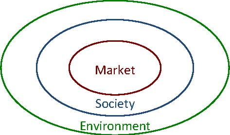
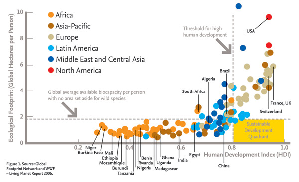
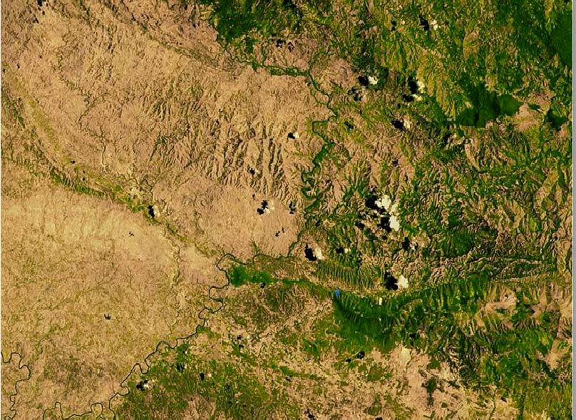
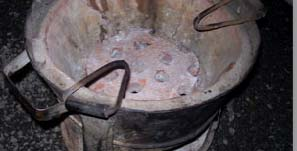

# Lecture 36 Sustainability and Development 

Class Outline for December 4, 2009: 

- Presentation by Ben Linder 
- Fuel-Efficient Stove Estimation Exercise 

## Presentation by Ben Linder: 

[Please Note: The opinions expressed here are the views of the guest speaker and do not necessarily reflect the views and opinions of D-Lab.] Ben Linder went to graduate school with Amy at MIT and both are avid beekeepers. Ben is now a professor at Olin College of Engineering and is one of the lead organizers for the International Development Design Summit (IDDS). Passionate about the practice of design and design learning, he is especially interested in socially responsible and sustainable product design. His design work also involves the adaptation of engineering techniques to the arts. He is actively involved in entrepreneurship and is currently studying business structures for social ventures. Recently, he co-founded a software company focused on delivering product development tools to large manufacturing firms. 

Ben starts off the class by taking a brief survey about Hopenhagen, a closely coordinated effort between the UN and various organizations to build up the media around the Copenhagen. They don’t seem to be doing well, because this campaign has been going since the middle of this year and only 7 people in the class have heard of it. Only 9 people in this class have heard of 350.org, named to reflect the target of getting back down to 350 ppm of carbon in the atmosphere, so this campaign could also be doing better. Since the United Nations Climate Change Conference is happening in Copenhagen next week, we will talk about carbon today. 

In the US, we are currently emitting about 20 kg of carbon per person per year. In the UK, it is about 12 kg per person per year. Jim Hanson warns that if we cross 400 ppm of carbon in the atmosphere, we could be looking at an ice-free world. The Intergovernmental Panel on Climate Change (IPCC) talks about future scenarios where the world may reach 450 ppm, 550 ppm, 650 ppm of carbon in the atmosphere. They may have lost hope, because they mostly talk about 550 ppm as what they think is more probable. So far, almost all the IPCC projections have been too conservative, so that might make 550 ppm too conservative as well. We are currently at 385 ppm and going up by about 2 ppm per year, so you can see that we may not have much time left to sort out climate change – experts say that we have about 20 years. Is carbon a source or a sink problem? The class answers that carbon is mostly a sink problem. Fossil fuels are more likely to cause a major climate change problem before the supply runs out.  

Carrying capacity is a concept that about half the class says they are familiar with. It refers to a point at which a resource will degrade if we take anymore out before putting anymore in. We 

should take no more wood from a forest than the rate at which it would cause the forest to lose biomass, degrading the forest. If you never exceed this carrying capacity, then you can take wood out forever. If you exceed it a little, you need to take less out or none out for a while to let the natural system recover. Natural systems can be incredibly resilient. If you exceed the carrying capacity by too much, however, the system can degrade. There can even be a positive feedback loop that causes a runaway system. 

If we had a better sense of what is the carrying capacity of the population of a fish, then we could try to avoid a population collapse like what happened with the Atlantic Cod. What does it mean to no longer have the Atlantic Cod in the world anymore? Experts have estimated 25% species extinction by 2050. 

There are 3 important rules to remember: 

 1. **You have to measure carrying capacity**. [Note: It can be really difficult to measure this in a dynamic system. People pursue entire careers around this.] 
 1. **You have to stay under carrying capacity.**
 1. **You have to be well-adapted.** [Note: There is a whole other career around how to build adapted systems.] 

We can also talk about natural capital. What kind of resources and natural services are we getting from the environment? What is their value to us? For example, fresh water would have to be replaced by desalination of salty water. How much would it cost to build a desalination plant? Around the world, a big natural resource is fuel, in various forms (biomass, natural gas, etc.). The estimated value of natural capital has been $16-54 million when the global value of the market was $30 trillion. As designers and engineers, do we actually create wealth? We are good at taking natural materials and translating them into usable form, but the actual root value usually comes from the materials, rather than from what we make. 

First coined by John Elkington, the Triple Bottom Line of economic, social and environmental returns (also known as “People, Planet, Profit”) is often depicted as a venn diagramm, but it is more accurately represented as embedded circles so you can see the boundary conditions. You have to pass through society to go from monetary sustainability to environmental sustainability. You can talk about designing closed loop systems, but the funny thing about the second law of thermodynamics is that energy actually flows through systems.  

Market Society Environment 

Ben shows a graph of normalized Human Development Index (HDI) against a measure of ecological footprint (E), reproduced on the next page. HDI measures basic health (including mortality and morbidity), education (including literacy and rates of completion for primary and secondary school), and economics (including income in purchasing power parity). E includes things like water, land, food, and greenhouse gas emissions. When we talk about the definition of sustainability, you almost invariably see definitions like the following: 

"Sustainable development is development that meets the needs of the present without compromising the ability of future generations to meet their own needs.” ~Brundtland Commission 

You can think of sustainability as having two major components: human development and environmental. Our quality of life is inextricably linked to our environmental impact. If you look at water, sanitation, and other conditions that impact health, which is a part of quality of life, you 

can see that they all are linked to environmental resources. 

This graph is important because it shows that our quality of life that does not necessarily come only at the cost of greater environmental impact. For example, Cuba (in the upper left-hand corner of the yellow quadrant) has relatively high health care and education quality, but relatively low environmental impact compared to many industrialized nations. Development and sustainability are not linearly related. In fact, it is only with the most developed countries, like the US, where a relatively high quality of life is correlated with a very high environmental impact. 

How can we decouple development from environmental impact? We want to be able to address human development issues such as health and education while not incurring a lot of negative environmental impact. There are many different approaches. One of the first things we have to do is define the region/context we are talking about so we can measure the carrying capacity. If we look at ecological footprint and available biocapacity by region, we can see that the US and Western Europe have exceed where they should be, and places like Asia and Africa are under where they could be.  Places like London need way more land than they actually occupy to produce enough resources to sustain them, so they often extract them from elsewhere, such as developing countries. The fact that we trade allows us to maximize the population we can put on any given ecosystem. If there is a limiting resource, we can exchange with another ecosystem to satisfy our demand. This is what has allowed us to increase our population substantially in certain areas, over what may be sustainable. 

NOTE: Error in the figure, Brazil should be labelled as country in Latin America, not Europe.© Making It. All rights reserved. This content is excluded from our CreativeCommons license. For more information, see http://ocw.mit.edu/fairuse.

We are looking to both minimize the resources we use as well as use better resources such as renewable energy. Some resources, like sand and salt water, may be abundant, however, we want to use resources that are not only abundant and renewable, but high quality. It is not enough to just have a more efficient stove to reduce fuel consumption; you also need to have a management program for the fuel that feeds the stove. We might expect that in general, fuel consumption would decrease as income increases, since people tend to shift toward using resources that are more efficient and of higher quality. This is not always the case, however, because it depends on what is available in the region we are talking about. 

Public domain photo (NASA).

Ben shows a powerful picture where the Dominican Republic is covered in forest on one side of the island, and Haiti has very little forest on the other side of the island. A lot of this difference is due to policy. We cannot take this as the full picture of what is happening, but the collapse of the forest in Haiti is very real, not to mention one of the reasons why we are working on agricultural waste charcoal as an alternative fuel source. If you look at energy consumption by source in Haiti, biomass dominates the “other” non-fossil-fuel-based sources outside of hydroelectric and nuclear power. Haiti has even turned to the Dominican Republic to source enough wood for making wood charcoal, which 70% of the population uses to cook. In Africa, about 80% of the energy consumption among people living in poverty is from biomass, such as wood or dung. Around the world, about 60% of people living in poverty use biomass for fuel. 

SELCO Co-Founder Harish Hande, who leads a solar company in India, is famous for making the argument about how valuable solar power can be in the development context. Solar power can make sense for people living in poor rural communities, even though it may not be as cheap as other energy sources. In the US, we tend to think about solar panels as something to protect the environment. Solar makes less sense economically in the US because with all the subsidies tied to conventional electricity sources, we do not see the real price of electricity. SELCO thinks about solar in terms of its potential to impact development instead. SELCO would have to spend their entire budget to find out what their environmental impact really is in India and they do not want to make claims they cannot support, but they can measure increased productivity of their customers and that is something that really matters to them. 

Envirofit is another interesting company that works on motorbike retrofits in South East Asia. The motorbikes commonly used for transport in developing countries can each put out as much pollution as 50 cars. The Envirofit retrofit system reduces environmental impact while allowing taxi drivers to earn more money by decreasing the amount of fuel used. Solutions do exist where you can increase the developmental impact while reducing environmental impact. 

The interesting thing is if you ask where SELCO and Envirofit are going, they are both looking into stoves. That target corner of the development-environmental impact space has major opportunities. 

## Fuel-Efficient Stove Estimation Exercise: 

The students are split into groups for this activity. [Aside: Ben realized that many people are sitting on the floor because we have switched classrooms today for group exercises and there are not enough seats. Amy jokes that this is like the $2 day activity, except we’re practicing lack of furniture. Ben adds that we shouldn’t use computers or pencils for this activity either. Amy responds that we have abacuses for everyone.] 

Each group receives two documents. One document gives the embodied energy &amp; carbon for different types of materials. Embodied energy is how much energy it takes to make something, such as a kilogram of concrete or steel. Embodied carbon is how much carbon is emitted through use of that material. The other document is a cheat sheet from ORNL of conversion factors for energy in biomass. Remember that timber is distinct from fuel wood, which refers more to branches and dead trees. Often it becomes unsustainable when you start cutting trees for timber, which is what happens for the production of paper and furniture. 

The scenario is that we could build a metal stove or build a more efficient metal stove with a ceramic liner. The class is asked to calculate how long (in days) we could run the stove before the ceramic liner is paid for. For a bonus question, how long before the metal is paid back? 

Hints: 

- Ceramic liners can give efficiency improvements of 10%-40%. 
- The metal stove weighs about 10-20 kg (10 kg is 22 lbs). A sheet metal stove would weigh substantially less. 
- The handouts tell you how much energy is in ceramic and steel, as well as how much energy is in wood or other things that we would burn. 

- Ben has information on different energy densities, as well as rates of fuel consumption. 

Given that Ben would never just give people the answer, a curious person could go into D-Lab and actually weigh the different stoves. If installing a ceramic insulator pays for itself with X days, why not install it? 

These are important types of calculations to do because it turns out that with a carousel generator, for example, you cannot ever generate enough energy to recover the energy that went into all that steel. You could add a generator to an existing carousel or use virgin aluminum instead, but it would not make sense to produce a new carousel. Embodied energy is a really fundamental concept to understand. 

While Ben is not going to just provide the answer, he will give some advice. He would rather have students walk out of class without the answer but with the drive to figure it out on their own until they are confident in it, because that is what it takes to be able to take action. 

