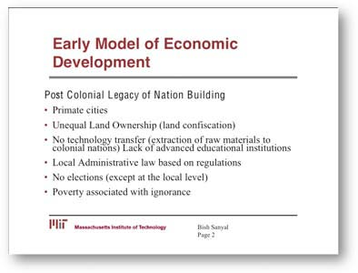
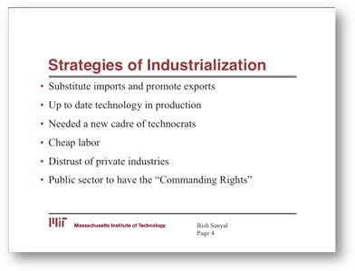
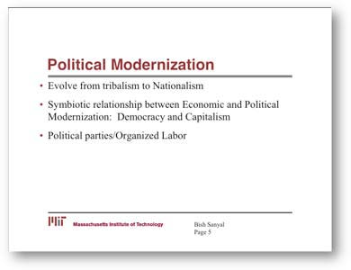
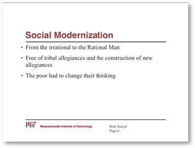

# Lecture 3 The Colonial Legacy 

Class Outline for September 14, 2009: 

- History of Development (1950-1970): The Colonial Legacy 
- Follow-Up Discussion on Stakeholder Analysis 

## History of Development: 

Today, Bish is leading the class in a discussion of the early history of development. So how did we get here to the current state of things? Much is the result of colonialism, as the colonial legacy left many regions very fragmented. Most countries had only a few big port cities, unequal land ownership and distributional issues. There was no technology transfer; the focus was on the extraction of raw materials from former colonies for export. For the most part, administration was centralized and local governments were regulated. There were no elections except at the local level, but even local elections were not about preference and representation. Decentralization and giving power to the locals was not popular, since there was an internalized notion of inferiority among poor people. 

In 1951, Arthur Lewis wrote about a model of economic development with unlimited labor supply and was a champion of free migration. In this model, you exploit inequality at the beginning and use that as momentum for growth. For example, income distribution will be more skewed at the start, but is supposed to equalize a little over time. Types of inequality include sectoral inequality (the industrial sector vs. the agricultural sector), spacial inequality (rural vs. urban areas), and social inequality (local vs. foreign). Urban-rural inequalities would mean that the rate of return in the industrial sector is higher than in the agricultural sector, but rural and urban wages should eventually equalize as people move from rural to urban areas. There is a famous “U” curve demonstrating this, where the inequality index increases and then improves during development. Lewis’ model relies on strong national planning and yet there is no political consideration in his writings. These ideas are representative of the early model of economic development, which focused on industrialization, urbanization and agricultural modernization. 

Rostow from MIT theorized that strategies of industrialization should involve substituting imports and promoting exports, and training a new cadre of technocrats. Technology can increase productivity, which raises consumption. The goal is to substitute imports, which is what colonial powers used for control, as colonies received foreign imports instead of getting access to technologies. Producing your own technologies helps to build up your country, enabling you to compete in international markets. Technology in this model of development traditionally refers to technological change for production and manufacturing. 

In India in 1990, growth actually came with an increase in inequality because most of the growth was happening in the technology sector, which benefited mostly the middle and upper classes. 

An example of this association between the elite class and technological change is the emergence of the Indian Institutes of Technologies (IIT), which subsidized the training of technocrats. India’s strategy has been to take the elite, train them in the IIT system and then have this new cadre of technocrats build up the country. What about the rural areas? The mindset has mostly been about catching up, so there tends to be more focus on urbanization and supporting an elite class that can compete. One result of this has been cheap labor. 

Governments often come into productive processes so they can compete in industries that they were absent in earlier. Historically, there has also been distrust of private industries. Some have perceived private firms to be like greedy colonialists, who come in to extract resources and then leave. It is important to remind ourselves of why the public sector prefers to hold commanding rights and there has been such a distrust of the private sector. 

There are different elements of modernization: economic modernization (capitalism), political modernization (democracy), and social modernization. Political modernization meant moving from tribalism to nationalism. For example, in India, people in support of modernization did not used to respect tribalism. There was an opinion that tribalism was old and superstitious, and that tribes split the nation into fractions. People wanted to build the nation as a whole. Today, people want to respect indigenous ways and bring them back, but it was not so in the beginning. 

There is a relationship between political modernization and economic modernization. An illustration of this is how Americans, who had a big role in foreign aid, believed that democracy and capitalism went hand in hand. This was especially evident during the Cold War, yet Fascist Spain and other countries were still growing without democracy. The US thought that a democratic political system was necessary to representation, but now people are realizing that it can be a hindrance to representation, favoring certain communities and interest groups instead. There was a belief that people would form new political parties based on interests, rather than allegiances of the old kind, when they moved into the cities. When you go to the field in January, ask yourself: 

- Who are the political leaders? What are they planning to do? 
- Pretend you need to get sugar and some interests control the sugar. Who would you talk to – the politicians or the community leaders? Remember that politicians still have a lot of influence. 
- There is a trend of decreasing organized labor. In the US, for example, fewer and fewer laborers are becoming unionized. You will see this in other countries as well, since as much as 70% of the workforce can be in the informal labor sector. If workers are not organized, who is representing them? People are now starting to be organized through community groups. See who is playing that role. 

In the social sphere, there has been a movement toward rationality. One meaning of being rational is to use time wisely and make the most of it. England started putting up clocks in public places to remind people that time is not unlimited. They structured the labor force based on time and believed that discipline would make the labor force more productive. Another aspect of rationality is to reduce the labor required. Labor-saving tools, such as the handheld corn sheller, can be considered rational: for $2 you can shell corn in much less time and use that time for something else. 

What is the right use of our time? The thinking has been to reduce the time required for certain tedious tasks so we can spend more time on worthwhile activities, such as education. Yet sometimes what we think is irrational is actually very rational, such as seeing someone resting in the afternoon instead of looking for a job. It can be hard for us to empathize because we do not understand their situation and how their resources are constrained, but people may have so few resources that they cannot adequately feed their body, so they rest when there is no work to conserve energy and preserve their body as long as they can. These are actually very detailed calculations. We should not be arrogant in telling people how to be rational, but we should also not be glorifying poverty and not trying to improve situations when we can. The important thing is to work together with the people we are trying to help, as most already know a lot about how to best use their resources. 

Part of our western concept of rationality is this idea that the individual is at the center. We tend to greatly value independence, yet we see people moving back in with their mothers when times get tough. Why? Don’t we want to move out and become independent when we’re 16? Remember that social network is a big part of support, and it is what people fall back upon when things are not going well. This is especially important for poor people who are especially vulnerable. You give me salt today and I’ll give you sugar tomorrow. Many poor communities are tight-knit and people tend to stay together. 

A key assumption has been that a lower level technologies means the quality of life will be inferior. Another assumption has been that leapfrogging is always the best option. If people have developed better ways of doing things, why not just use those? Do not go capital intensive if you do not have to reinvent the wheel. One example is adopting mobile phones instead of building up a comprehensive landline infrastructure. Leapfrogging is about catching up and going for a level of technology that is much higher than what you have right now, but what happens when you give people a level of technology that they are not familiar with using? Remember that higher levels of technology can sometimes require more education to utilize. 

An important consideration is scale, because many projects that we are working on are of a smaller scale. Why did people go with such big scales before? Largeness leads to economies of scale, where you can use fewer additional resources to produce more. There are also advantages of being small – fewer costs, etc. The question doesn’t have to be framed as only going either big scale or small scale, as there is a broad spectrum, but the argument about scale may haunt you as you go about your projects. Try not to get lost in the maze of questions about bureaucracy and management. 

There are also linkages and spillover effects. When we do something, it often has additional benefits (positive externalities) and costs (negative externalities). For example, increasing production beyond a certain level could over-exhaust the ground, which reduces productivity. Sustainability brings about a new rationality that reminds people to not extract resources now in a way that destroys that resource later. We often use the need to reduce negative externalities as a justification for the government to come in. Not all big things are bad, and many can have important benefits, but they can also have bad side effects on a large scale. Some of these effects may be so large that they are hard to monitor and control, but it is crucially important to continue trying to do so. It is easy to forget that we often need 10-20 years to begin to see the danger of what can actually happen, especially when we bring in technologies that we do not really understand and that may increase the risk of hurting people. 

Students in the class asked how to keep companies accountable when they are so influential and make such large plans. For example, important factories have gotten away with not paying attention to safety standards and people in the surrounding area may still be affected by negative health and environmental impacts for generations after. We need more people who understand these issues and can scrutinize plans to come up with better security and back-up measures. Come up to Bish after class if you would like to have a more upbeat discussion and talk about some concrete ways to address this. In this course, in addition to trying to assess the risks of technologies, we will also ask whether we need to have the newest technology. Is there a more indigenous solution that is less risky? What about small-scale alternative energy generation instead of macro-level dams for hydropower? 

## Follow-up Discussion on Stakeholder Analysis: 

Let’s share what worked well and didn’t work well during the roleplay activity last time. We will also go over some tools and practices that we can build upon, since none of us have 50+ years of experience in development work. There may be effects that are inherent to the way we work, but we can use tools for participation to help prevent us from making more mistakes. 

What we want to do in stakeholder analysis is figure out who is important to and has influence over a project. This involves identifying the stakeholders, understanding their interests and coming up with the mechanisms for moving forward. Stakeholders can be individuals, groups or institutions and are people who are affected by the intervention. This includes not just the beneficiaries, but also people who are not necessarily positively affected or even directly affected, such as competitors and those unintentionally impacted by side effects. During the stakeholder identification process, try to be sure to include groups that may be especially vulnerable or marginalized and are typically not included. It is important to remember that all of these stakeholders can have an effect on the success or failure of the project, whether we are talking about the government, local NGOs, or small communities. 

The second step is to assess the stakeholders’ interests and potential impact on the project. Try to understand the ecosystem of stakeholders and each stakeholder’s expectations. People may believe that our project has much larger impacts or different impacts than it really has. What are the negative effects that people are concerned about? There is room to think creatively here, such as trying to engage competitors and bring them into the project so they still benefit in some way. It is important to recognize which stakeholders support our intervention and which ones are against it, and how they could impact the outcomes of the project. It helps to consider the level of status and influence that the stakeholders have, and their level of organization. Where are the most powerful stakeholders located in the network of people affected by the project? What is their control over strategic resources? Remember that importance and influence may or may not be in the same dimension. For example, imagine an educational project where the students are incredibly important to the project but rarely have influence over it. Should we be involving the students more in the design of the project? 

Following this, we need to outline strategies for participation. There are many types of participation to engage different stakeholders, from one way flow of information, to consultation where people work together, to collaboration where decisions are actually made together, to empowerment where the people affected make all the decisions rather than the people who started the project, and so forth. Try to think about when this participation occurs in the process. Is it during the project identification stage, design, implementation or evaluation – or throughout the entire process? 

There will always be contingencies, but this proactive analysis can help us to be more aware of the situation. Remember that the situation will evolve, but it is important that we at least think through this analysis so that we can be better prepared. For homework, students will be doing the stakeholder analysis assignment for the wheelchair roleplay. 

