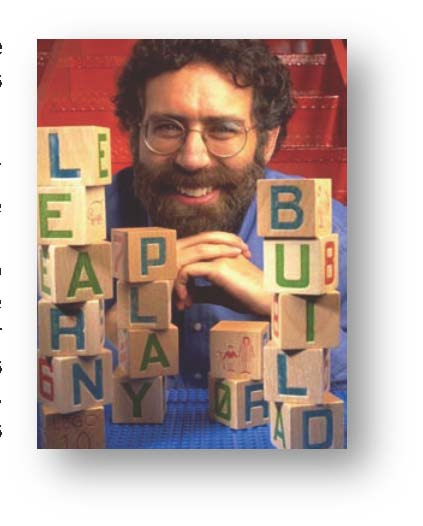

# Lecture 5 Participatory Development &amp; Co-Creation 

Class Outline for September 18, 2009: 

- History of Development (1990-Present): Millennium Development Goals, Participatory Development &amp; Co-Creation 
- Presentation by Mitch Resnick 

## History of Development (Continued): 

Beyond the appropriate technology movement, another revolution in development that hasstrongly influenced D-Lab is the participatory development movement. The participatory approach contrasts greatly with the didactic approach, which is probably what most students at MIT are more familiar with using. A didactic approach has assumptions built in about efficiencyand the appropriateness of the proposed solution, whereas a participatory approach tries to engage with the community to jointly determine what are the needs and priorities to be addressed. What if a community’s greatest challenges are not the ones we are even capable of addressing? This is why we should have some idea of what the community wants before going in to introduce the technology we are thinking about contributing. 

Facilitators of participatory development exercises must be truly interested in what they are facilitating. Stakeholder analysis is a big part of this approach, and there is a very conscious effort to try not to marginalize vulnerable populations. It is also important to have open communication throughout the process to avoid surprises where key stakeholders in the community change their mind about collaborating, which risks leaving us in the dark with wasted work and no way to continue helping. One idea to take away from this class is that there is no single way to solve all problems. Participation has many examples in economics, politics and education, but less in the realm of technology. D-Lab takes this further by encouraging community participation in the entire technology design process. In co-creation, technologies are developed together in partnership with the beneficiaries of the technology. 

Advantages of participation include: 

- Efficiency    
- Effectiveness  
- Self-Reliance  
- Coverage 
- Sustainability 

Disadvantages of participation include:
 
- Time required 
- Resources (Human, Materials)
- Expectation Management
- Unpredictability 

## Presentation by Mitch Resnick: 

[Please Note: The opinions expressed here are the views of the guest speaker and do not necessarily reflect the views and opinions of D-Lab.] 

Mitch Resnick directs the Lifelong Kindergarten group at the MIT Media Lab and is the LEGO Professor of Learning Research. He works on technologies to engage people, particularly children and youth, in creative learning experiences. Mitch’s research group developed the “programmable brick” technology that insipired the LEGO MindStorms robotics kit. He co-founded the Computer Clubhouse project, a worldwide network of after-school centers where youth from low-income communities learn to express themselves creatively with new technologies. Recently, Mitch’s group developed Scratch, an online community where children program and share interactive stories, games, and animations. In addition to being a professor of MIT, Mitch has worked as a science-technology journalist and consulted throughout the world on creative uses of computers in education. 

In todayʼs society, there is a pressure to always be learning. How do we support people to learnnew things in creative ways? There is a traditional view of education where students are treatedas empty vessels that teachers fill up with knowledge. Schools have seemed overcommitted tothe didactic approach. Can we instead encourage students to explore a process of designwhere they imagine, create, play, share, reflect, and develop new ideas? The important thing isto use a teaching method, not necessarily specific technologies, where there is the possibility ofutilizing a greater range of technologies and materials to promote creativity and discovery. Whattypes of structures and mechanisms can we build to help foster creative behaviors, such as computer clubhouses in schools? Another example is Lego Mindstorms, which was originallyintended to be an invention toolkit but has ended up being used in ways that were not expected.A 13-year-old girl in Thailand has used the light sensor in a Lego Mindstorms kit to control an ultraviolet light, enabling her family to attract insects for food. In afterschool pilot programs, itwas found that the kids who were getting in trouble were the ones who wanted to work on LegoMindstorms. 

