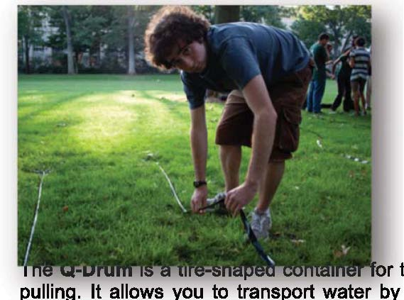
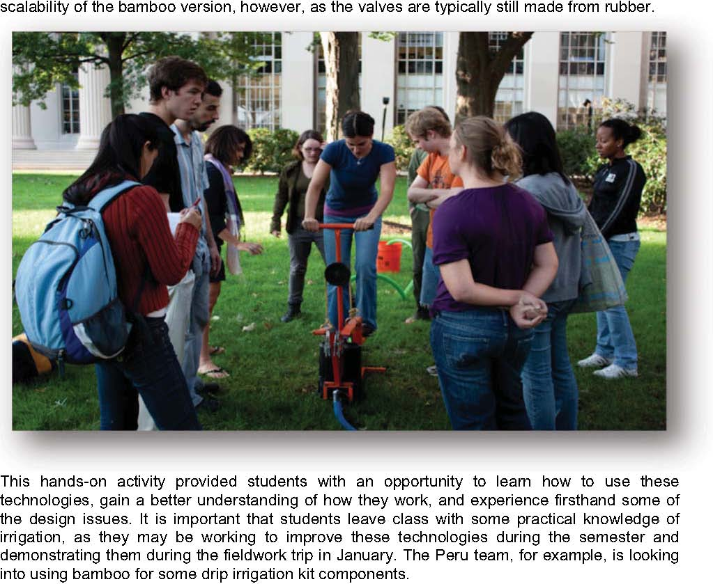

# Lecture 7 Agricultural Technologies:Irrigation

Class Outline for September 28, 2009: 

- Community Partner Presentations 
- Demonstration of Irrigation Technologies 

## Community Partner Presentations: 

The students learned about D-Lab’s community partners and potential projects in Honduras, Nicaragua, Ecuador, Brazil and Peru. Last week, they heard about Tanzania, Zambia, Ghana, Rwanda, Sierra Leone, China and India. These presentations inform the students’ selection of which regions they would like to work in during the January trip. Students will be matched into teams to prepare for their trips throughout the semester. The first meeting is scheduled to be during class next week, followed by weekly 2-hour meetings outside of class. 

## Demonstration of Water Transport Technologies: 

Students split into teams to try out different technologies and help irrigate the lawns of MIT: 

**Drip irrigation kits** provide targeted irrigation to plants while using less water. Paul Polak of International Development Enterprises (IDE) saw that there were many large drip irrigation systems available for commercial farming, but no affordable small-scale drip irrigation kits for small plot farmers. IDE spent years developing these drip irrigation kits and now sells them for a price of a couple of dollars, which includes profit margins for the manufacturers, distributers and retailers. The main components of the kit are listed below, along with their functions: 

- **Lined bag** – holds water 
- **Front valve** – dispenses water 
- **Lead** – brings water from the bag to the main 
- **Main** – runs along one side of the plot 
- **Submains (lateral lines)** – bring water from the main to the rest of the plot area, punctured with straws at location of plants 
- **Straws** – distributes water to plants, can be tied into knots to control flow 
- **Poking device** – makes holes in the tubing for straws
 
The **Q-Drum** is a tire-shaped container for transporting water that has a rope tied through it for pulling. It allow you to transport water by rolling it behind you instead of carrying it on your head, which is how most people carry water after collecting it from wells. Students said that it felt easier to use the drum than to carry water by bucket, but they also recognized that they are not used to carrying buckets and are not efficient at it. The Q-Drum can roll over the MIT lawn relatively easily and handle slight hills, but does not work well on rough ground or for river crossings. [Aside: Amy tried to adapt the Q-Drum design to transport clay in Ghana. At clay mines in Ghana, women can carry up to 150 pounds of clay on their heads to sell as coloring pigment in the market. It can be hard to pull the Q-Drum behind you over rough ground when it is filled with heavy material, so Amy designed a wheelbarrow version that you can push ahead of you instead.] 

The **treadle pump** has foot pedals that the user steps on to bring water up from the ground for irrigation. The device saves time and effort, compared to raising water by bucket from a well. Treadle pumps were invented decades ago, but were not really mass-manufactured until IDE started making and selling them to farmers in parts of Asia and Africa. KickStart has also started selling treadle pumps under the name MoneyMaker. Treadle pumps enable farmers to grow more water-intensive crops or continue farming during dry season, allowing them to fetch higher prices in the market to increase income. The pumps are sold for a price of about $50, which covers margins in the supply chain and has a relatively short payback period of a couple of months. The device is portable and can be moved between wells or rivers. By depressing the foot levers, treadle pump users can create a pressure gradient that lifts the water from a source and then pushes it through a one-way valve and into storage or a distribution channel. The pumps can be connected to multiple distribution hoses, which are often gravity driven, or to canals for irrigating larger fields. While treadle pumps are mostly manufactured centrally and then distributed, they can also be made locally in a village. Both the metal frame and the actuators, which are typically injection-molded, can be made from bamboo. There is limited 

scalability of the bamboo version, however, as the valves are typically still made from rubber. This hands-on activity provided students with an opportunity to learn how to use these technologies, gain a better understanding of how they work, and experience firsthand some of the design issues. It is important that students leave class with some practical knowledge of irrigation, as they may be working to improve these technologies during the semester and demonstrating them during the fieldwork trip in January. The Peru team, for example, is looking into using bamboo for some drip irrigation kit components. 

