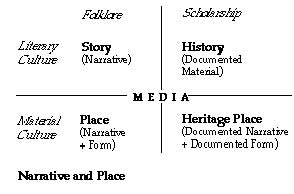

# Lecture 7 Fabricating Heritage Narratives: Locale, Region, Natio

# Designing Local and Regional Heritage Narratives

## David Lowenthal 

I want to say something about some of the problems when we think about urban design and urban function, issues, and perspectives to overcome them. They'll be discussed them under 3 general headings: 1) the disjunction between ideals and the realities in the city -- especially the disjuncture between the image of the city as paradise and the hostile stereotypes. 2) the nature of the physical form of cities that reinforces both the ideal and the negative stereotype. 3) the heightening of understanding and perception that happens more in cities than anywhere else, including the use of memory in the thickening of the sense of a place that lives through time. 

The sense of the city has almost been based on the sense of it being "better," the focus, the place of distinction, a place of truth and progress. It's also a fortress, a refuge, an ivory tower, a watchtower, a place of wisdom and an interface against ignorance and barbarism. 

The opposite stereotype also exists -- the city as a dreadful place, the place where tyranny drains the provinces, the whole notion of something impure and parasitic. This was heightened in this country from the mid-18th century on. Americans idealized the country because it was clear to them that cities bred corruption. The city was seen as evil and damned. This sense grew over time, especially as immigration grew and became associated with cities. This concern with immigration reached its peak in the decade 1846-1855, not the present day. Immigrants were seen as utterly different and unassimilatible. So city folk were seen as evil, corrupt, unassimilatible, and with no contact with the true America. 

The result was that Americans refused to allow the principal city of a state to be the administrative seat, based on the notion that the only way of keeping these legislators pure was to keep them in small towns where an eye could be kept on them. 

Urban life is now seen in all the media as a metaphor for global degradation, squalor, anarchy, and chaos. 

This contrasts with the image of the city as it was in medieval times - a fortress against the world outside, something with a sense of boundedness and structure, of outside/inside. A passage from Calvino's "Invisible Cities" illustrated the point. There is a growing recognition of the city as a fulcrum for memory and for deliberate memorialization of the past. This is due to a restlessness as well as cosmopolitanism, and a constant rebuilding. 

There is the story of a town in western Poland where the center of town had been rebuilt in the image of a medieval past even though none of the inhabitants remembered it because they were newcomers from other regions. The builders said that it was being done so that their children would remember. 

There are many ways that memory can be made to work. An example is the two twin cities of Leeds and Bradford. They are both great 19th century industrial centers. During the decline of British industry, these cities lost all of their function but their structures remain. Leeds decided to modernize and tore down a great many factories and civic buildings and Leeds was very proud of their modernization. Bradford did not. But the large Asian community participated in planning and they took a different approach -- they turned themselves into a museum and a heritage site. This went against the grain of those in Leeds who saw their sister city become richer with tourism. Bradford became a city of memory. Leeds became so angry that they produced print material to show up the fraud vividly describing child labor, disease, impoverishment - things that Leeds got rid of long ago. 

I suggest that there are three common ways of engaging with the past in our cities: 1) Take things from one era and reuse them for other purposes. It's recycling the past for present uses. 2) Nostalgia for what has been or what has been. We're supposed to prefer the city of the past, but not too much, because it is only with modern eyes that you can see and relish the old provincial grace. It exploits our memories. It's based on the fear that once the scaffolding is removed, the city will begin to crumble. 3) Alter this fabric by careful positive alteration. They remake the environment. The virtue of doing this is self-confidence and prudence. They calculate the risks and advantages before altering it. It's not just remembering a heritage but remaking heritage it into something new. 

## Dennis Frenchman 

My experience certainly confirms that there is an explosion of heritage and much of it is the past being remade to serve the interests of the present. The purpose is not to debate the merits of heritage, but to explore challenges and opportunity. 

My first observation is that heritage is often an aspect of the information economy and the new technologies that support it. It's a different perspective on heritage. I see heritage not so much as a yearning for the past as being pulled by a movement which is happening towards the future. 

The second point is that the information economy is creating a shift in the way that physical places are formed and experienced. Spaces now must not just be convivial, they malso be communicative, incorporating media into the environment. 

The third point is that this demand for mediated environments is raising important challenges for designers. We need to ask not only how to construct these spaces, but what messages should they carry. 

Lynch focused on the connection between urban places and information. That is the theme of "Image of the City." It's a two-way process between the person and the city. Since then we've had an explosion in communication technology. We expect information and without it, we feel like we're missing something. Legibility of a place is shaped by what we know about it. For many cities, the most informative places are usually the most highly desirable. Historical places are rich sources of information. 

The economic potential of historical places are being tapped to resuscitate declining cities, particularly former industrial areas because they're a rich source of information and because they're a part of our national cultural experience. While all of this sites aspire to tourism, in many cases tourism is of little direct economic value. What is of economic value is their improved image of the place and its ability to attract investment and jobs. 

Communicative places: Lynch saw legibility in physical form, not the story. But I would argue that stories help shape urban form. Good urban form helps communicate these stories, but how is it done? These are new questions to urban designers. To answer them we need to sort out the ideas about narrative and place. 

The diagram highlights the importance of media in translating the two worlds -- the world of words deals with meanings while the world of material objects deals with the senses, and you need a medium to translate them. 

With respect to the media, while the technology of communication is advanced, its use in the physical environment is relatively crude. 

I looked for interesting ways in which media, technology, and environment have been used, and one example is the field of archaeology. This is a field that parallesl heritage and design because archaeology is a field that tries to understand and communicate the meaning of material culture through the discovery of physical sites and artifacts from the past. It's also received some of the same criticisms as heritage -- poor history, poor anthropology or poor science. 

Some interesting things have been happening -- archaeology has increasingly used technology to extract more information from the places and objects they discover: radiocarbon dating, pollen analysis, trace element analysis -- all these innovations in the sciences have revolutionized analysis in archaeology. This has led to a revision of the written record. 

And like, heritage designers, they have also been experimenting with ways to integrate media, content and physical environments. 

What are the implications for urban designers? 

First, we're going to see a lot more of these narrative places in the future, especially where there's documented information and an economic incentive to make connections between information and place. 

The second implication is that these examples represent the emergence of a certain aspect of space connected by media to narrative information. I call this mediated space. It can be experienced through the Internet, at multiple levels when you are there, and after you have left. 

And finally, to achieve a legible city, urban designers must deal with more than the physical elements of form. We need to know about the past, but we also need to understand how new forms of media and technologies will affect its functions in the future. We also need to become involved in the content of the messages. 

## Questions and Comments 

Q: How will the documented past be etched onto the landscape in Jamestown? 

A: It will be like a garden -- we'll use plant material and elevation to see what's underneath there, but you'll also need a guide to help sort it out. 

Q: What is the motivation for historical preservation and rebuilding cities? 

DL: I take a larger view about what heritage is. I think its a process, written materials, history teaching, and all those things. It's the purpose that's important. Information can overload the viewer. People both hate and love recreation. 

History is written by the winners. Heritage is written more by the losers, because they need something to make up for what they've lost. 

Some of it is also related to the despair about the physical form of our cities. Some of it relates to a general malaise about the future. It serves regeneration, perhaps self-referencing. It also goes with technologies that can destroy and create. Everything is moveable and transformable. 

C: There is an example that come to mind in Santa Cruz -- they had an earthquake 10 years ago and they decided to do a memorial, but for 10 years they haven't been able to figure out what to remember. So the discussion is really the memorial. 

Q: A comment on Dennis's diagram... The experience of the Piazza San Marco has nothing to do with your knowledge of the place -- it's the experience, not narrative. Imagination is a source of information as well, and I wonder if post-modernists are helping people in a very limp way to connect with their imagination. 

DF: There's a difference between semiotic and didactic information, and what I'm talking about is didactic meaning in space. If you're in a semiotic space, and if I tell you that this space was where some catastrophe happened, then you will never experience the space in the same way again. You can experience the space for its own sake, but the narrative can affect your experience. 

C: I was at a conference about museums and it was being conducted in Spanish, but one of the speakers offered a definition of museums that was translated into English as "an ordered information space with an academic base." If one images a spectrum with a history book at one end, a museum in the middle, to a heritage place at the other end, I think one could think about all of those as "ordered information spaces with perhaps an academic base." What I liked about the definition was that "ordered" implied that a human hand was in it. We can think of them as spaces. I think you may be giving up too much space to the historian. Maybe the difference is, among historians, there are conventions and systems for criticism and debate. In the end I would expand your diagram to include museums in between. 

## Leo Marx, real-time raconteur 

The number of topics, rich topics, could fill many discussions. I'll mention three things that occurred to me. 

Listening to David Lowenthal is like reading his books, and I've been reading his books for a long time. I always have an ambivalent response -- I'm always so impressed with the subtlety with which he discusses the issues of history and heritage, but it's always a melancholy experience for me because as he talks about his subjects, you're reminded of all the huge forces (environmental, technological, military) loose in the world that are rolling over what's left of the past. 

It seems that the answer why people are so interested in the past is because we've just come through a period when the human race thought they were going to blow itself up, we know about population growth, we know about global warming. There is a collective anxiety lose in the world, and this desire to hold on to the past makes sense. The overarching moral of both David and Dennis's talk is the need to harness those transformative forces. 

The second point is that Dennis' reminder of Kevin Lynch's sense of the city as a scaffolding into which meaning is placed is very important. When I hear or participate in discussions about "the city," I always think that there's something false about it. It attributes an efficacy or agency that it doesn't possess. The city is a form into which we pour meaning. 

And finally, I was struck to hear how literary this discussion was, and the importance of literature. I'm struck by the power of the word to last.  
