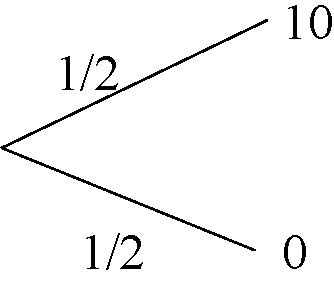

# Chapter 2  

#Decision Making under Risk 

In the previous lecture I considered abstract choice problems. In this section, I will focus on a special class of choice problems and impose more structure on the decision maker’s preferences. I will consider situations in which the decision maker cares only about the consequences, such as the amount of money in his bank account, but he may not be able to choose directly from the set of consequences. Instead, he chooses from alternatives that determine the consequences probabilistically, such as a lottery ticket. 

In this lecture, I assume that, for any alternative x, the probability distribution on the set of consequences induced by x is given. That is, although decision maker does not know the consequence of choosing a given alternative, he is given the probability of each consequence from choosing that action. This is called decision making under risk. Such assumptions can be plausible in relatively few situations, such as chance games in a casino, in which there are objective probabilities. In most cases of economic interest, the alternatives do not come with probabilities. The decision maker forms his subjective beliefs about the consequences of his choices. This is called decision making under uncertainty. I will analyze the decision making under risk as an intermediary step toward analyzing decision making under uncertainty. 

##2.1 Consequences and Lotteries 

Consider a finite set C of consequences.A lottery is a probability distribution p : C →[0, 1] on C,where c∈Cp(c)=1. The set of all lotteries is denoted by P .The consequences are embedded in P as point masses on single lotteries. For any c ∈ C,I will write c for both the consequence c and the probability distribution that puts probability 1on c. The decision maker cares about the consequence that will be realized, but he needs to choose a lottery. In the language of the the previous lecture, the set X of alternatives is P . 

A lottery can be depicted by a tree. For example, in Figure 1, Lottery 1 depicts a situation in which the decision maker gets $10 with probability 1/2 (e.g. if a coin toss results in Head) and $0 with probability 1/2 (e.g. if the coin toss results in Tail). A lottery can be simple as in the figure, assigning a probability to each consequence, or compound as in Figure 2.3, containing successive branches. The representation of all lotteries as probability distributions incorporates the assumptions that the decision maker is consequentialist, meaning that he cares only about the consequences, and that he can compute the probability of each consequence under compounding lotteries. 

Lottery 1 

Figure 2.1: 

Representing the lotteries p as vectors, note that P is a |C| − 1 dimensional simplex. Hence, I will regard P as a subset of R|C| (one can envision it as a subset of R|C|−1 as well). Endowing R|C| with the standard Euclidean metric, note that P is a convex and compact subset. 

##2.2	Expected Utility Maximization – Representation 

We would like to have a theory that constructs the decision maker’s preferences on the lotteries from his preferences on the lotteries. There are many of them. The most well-known–and the most canonical and the most useful–one is the theory of expected utility maximization by Von Neumann and Morgenstern. In this lecture, I will focus on this theory. 

**Definition 5** *A relation º on P is said to be represented by a von Neumann-Morgenstern utility function u : C → R if and only if* 

p º q ⇐⇒ U(p) ≡ u(c)p(c) ≥ u(c)q(c) ≡ U(q) (VNM) 

for each p,q ∈ P . 

This statement has two crucial parts: 

 1.U : P → R represents º in the ordinal sense. That is, if U (p) ≥ U (q), then the decision maker finds lottery p as good as lottery q. And conversely, if the decision maker finds p at least as good as q,then U (p) must be at least as high as U (q). 

 2.The function U takes a particular form: for each lottery p, U (p) is the expected value of u under p.That is, U(p) ≡ c∈C u(c)p(c). In other words, the decision maker acts as if he wants to maximize the expected value of u. For instance, the expected utility of Lottery 1 for the decision maker is E(u(Lottery 1)) = 1/2u(10) +1/2u(0)[^2-1] 

[^2-1]:If C were a continuum, like R, we would compute the expected utility of p by u(c)p(c)dc. 

##2.3	Expected Utility Maximization – Characterization 

The main objective of this lecture is to explore the conditions on preferences under which the von-Neumann Morgenstern representation in (VNM) is possible. In this way, one may have a better insights into what is involved in expected utility maximization. 

First, as explained above, representation in (VNM) implies that U represents º in the ordinal sense as well. But, as we have seen in the previous lecture, ordinal representation implies that º is a preference relation. This gives the first necessary condition. 

**Axiom 2 (Preference)** *º is complete and transitive*. 

Second, in (VNM), U is a linear function of p, and hence it is continuous. That is, (VNM) involves continuous ordinal representation. Hence, by Theorem 3 of the previous section, it is also necessary that º is continuous. This gives the second necessary condition. 

**Axiom 3 (Continuity)** º *is continuous*. 

Recall from the previous lecture that continuity means that the upper-and lower-contour sets {q|q º p} and {q|p º q} are closed for every p ∈ P . In this special setup, a slightly weaker version of the continuity assumption suffices: for any p,q,r ∈ P ,the sets {α ∈ [0, 1] |αp +(1 − p) q º r} and {α ∈ [0, 1] |r º αp +(1 − p) q} are closed. Yet another version of this assumption is that for any p,q,r ∈ P ,if p  r,then there exist a,b ∈ (0, 1) such that ap +(1 − a)r  q  bp +(1 − r)r. 

By Theorem 3, Axioms 2 and 3 are necessary and sufficient for a representation by acontinuous function U. The von Neumann and Morgenstern representation imposes a further structure on U, requiring that it is in fact linear in probabilities. This linearity condition corresponds to the following condition on the preference, which is called The Independence Axiom. 

**Axiom 4 (Independence)** *For any p,q,r ∈ P ,and any a ∈ (0, 1], ap +(1 − a)r º aq +(1 − a)r ⇐⇒ p º q*. 

That is, the decision maker’s preference between two lotteries p and q does not change if we toss a (possibly unfair) coin and give him a fixed lottery r if “tail” comes up. Let p and q be the lotteries depicted in Figure 2.2. Then, the lotteries ap +(1 − a)r and aq +(1 − a)r can be depicted as in Figure 2.3, where we toss a coin between a fixed lottery r and our lotteries p and q. Axiom 4 stipulates that the decision maker would not change his mind after the coin toss. Therefore, the Independence Axiom can be taken as an axiom of “dynamic consistency.” 

The Independence Axiom imposes a structure on the indifference setsthatisidentical to the structure of the isocurves of a linear function U. Together with the continuous representation theorem, this leads to an expected utility representation. In the sequel, I will describe the structure in detail and prove that the above axioms are sufficient for an expected utility representation. Towards this end, the following exercise lists some 

Figure 2.2: Two lotteries 

Figure 2.3: Two compound lotteries 

useful implications of the Independence Axiom. You should prove the listed properties before you proceed. 

**Exercise 1** *For any preference relation º that satisfies the Independence Axiom, show that the following are true*. 

 1. For any p,q,r,r0 ∈ P with r ∼ r0 and any a ∈ (0, 1], 

ap +(1 − a)r º aq +(1 − a)r0 ⇐⇒ p º q. (2.1) 

 2. For any p,q,r ∈ P and any real number a such that ap+(1 − a) r,aq+(1− a)r ∈ P , 

if p ∼ q,then ap +(1 − a) r ∼ aq +(1 − a)r. (2.2) 

 3. For any p,q ∈ P with p  q and any a,b ∈ [0, 1] with a&gt;b, 

ap +(1 − a) q  bp +(1 − b) q. (2.3) 

 4. There exists cB,cW ∈ C such that for any p ∈ P , 

c B º p º c W . (2.4) 

*[Hint: use completeness and transitivity to find cB,cW ∈ C with cB º c º cW for all c ∈ C; then use induction on the number of consequences and the Independence Axiom.]* 

These properties can be spelled out as follows. First, recall the situation considered by the Independence Axiom: we toss a coin; if it comes head, the decision maker faces p or q depending his choice, and if it comes tail, he faces r.The first property states that it does not matter whether he faces the same lottery in case of tail or two different lotteriesthatheisindifferent to. For an explanation of the second property note that in the situation considered by the Independence Axiom, according to the axiom, the decision maker would be indifferent between the two compounding lotteries if he were indifferent between p and q. This corresponds to (2.2) for a ∈ [0, 1]. The property states more generally that the statement remains true even if a is not in [0, 1], in which case the problem couldn’t be represented as a choice between two compounding lotteries.The third property probability is a monotonicity probability. It simply states that when a decision maker faces a situation in which he can end up a better lottery p or worse lottery q, then he would prefer higher probabilities of p to lower ones. Finally, the last probability states that there are best and worst consequences (by transitivity and completeness) and they are also best and worst lotteries (by monotonicity). Using these properties, one can easily prove the main result in this lecture: 

**Theorem 4** *Arelation º on P can be represented by a von Neumann-Morgenstern utility function u : C→  R as in (VNM) if and only if º satisfies Axioms 2, 3, and 4. Moreover, u and u˜represent the same preference relation if and only if u˜= au + b for some a&gt; 0 and b ∈ R*. 

**Proof**. Since we know already that representation in (VNM) implies Axioms 2, 3, and 4, I will only prove the converse. As in (2.4), let cB,cW ∈ C be such that cBºpºcW for every p ∈ P .If cB ∼ cW , then by transitivity, the decision maker is indifferent between everything, and hence u (c) ≡ 0 for all c satisfies the representation. Assume cB Â cW , and define φ :[0, 1] → P by φ (t)= tcW +(1 − t) cB . By (2.3), for any t,t0 ∈ [0, 1], 

φ (t) º φ (t0) ⇐⇒ t ≥ t.	(2.5) 

Then, Lemma 1 of the previous lecture implies that for every p ∈ P , there exists a unique U (p) ∈ [0, 1] such that 

p ∼ φ (U (p)) .	(2.6) 

First observe that U indeed represents º in the ordinal sense: for any p,q ∈ P , 

p º q⇐⇒φ (U (p)) º φ (U (q))⇐⇒  U (p) ≥ U (q) .

[Here, the first⇐⇒ is by (2.2) and (2.6), and the second ⇐⇒is by (2.5).] In order to show that U has the specific structure in (VNM), it suffices to show that U is linear. That is, for any a ∈ R and any p,q ∈ P with ap +(1 − a) q ∈ P , 

U (ap +(1 − a) q)= aU (p)+(1 − a) U (q) .	(2.7) 

But, since p ∼ φ (U (p)) and q ∼ φ (U (q)), 

ap +(1 − a) q	∼ aφ (U (p)) + (1 − a) φ (U (q)) = φ (aU (p)+(1 − a) U (q)) , 

proving (2.7) by definition (2.6) of U.[Here, the indifference is by (2.1) and the equality is by definition of φ.] 

By the last statement in Theorem 4, the representation is “unique up to affine transformations”. That is, a decision maker’s preferences do not change when we change his von Neumann-Morgenstern (VNM) utility function by multiplying it with a positive number, or adding a constant to it, but they do change when we transform it through a non-linear transformation. In that sense, (VNM) representation is “cardinal”. Recall that, in ordinal representation, the preferences do not change even if the transformation is non-linear, so long as it is increasing. For instance, under certainty, v = √u and u represent the same preference relation, while (when there is uncertainty) the VNM utility function v = √u represents a very different set of preferences on the lotteries than those are represented by u. 

##2.4 Indifference Sets under Independence Axiom 

In the sequel, I will explore the structure imposed by the Independence Axiom on the indifference sets in more detail, explaining the logic of the representation. Recall from the previous lecture that Axioms 2 and 3 imply that the indifference sets are closed. The Independence Axiom has two further implications on the indifference sets: 

 1. The indifference sets on the lotteries are straight lines (i.e. hyperplanes). 

 2. The indierence sets, which are straight lines, are parallel to each other. 

To illustrate these facts, consider three prizes z0,z1,and z2,where z2 Â z1 Â z0. Alottery p can be depicted on a plane by taking p (z1) as the first coordinate (on the horizontal axis), and p (z2) as the second coordinate (on the vertical axis). p (z0) is 1 − p (z1) − p (z2). [See Figure 2.4 for the illustration.] Given any two lotteries p and q, the convex combinations ap +(1 − a) q with a ∈ [0, 1] form the line segment connecting p to q.Now, taking r = q, we can deduce from (2.2) that, if p ∼ q,then ap +(1 − a) q ∼ aq +(1 − a)q = q for each a ∈ [0, 1]. Thatis, thelinesegment connecting p to q is an indifference curve. Moreover, if the lines l and l0 are parallel, then α/β = |q0| / |q|,where |q| and |q0| are the distances of q and q0 to the origin, respectively. Hence, taking a = α/β, we compute that p0 = ap +(1 − a) z0 and q0 = 

p(z2) 

6 

z2 

@@@@

β 

p @@l @

HHHHHHHHHH 

α 

p0 @@l0 @ q¡@¡@

HHHHHHHHHHHHHHHH 

¡q0 @¡@¡@¡@¡@¡@¡@

¡@ z1 -p(z1) 

z0 1 

Figure 2.4: Indifference curves on the space of lotteries 

aq+(1− a)z0. Therefore, by (2.2), if l is an indifference curve, l0 is also an indifference curve, showing that the indifference curves are parallel. 

These two properties in the special case allows one to construct a utility function that represents the preferences in the sense of (VNM) as follows. Line l can be defined by equation u1p(z1)+u2p(z2)= c for some u1,u2,c ∈ R.Since l0 is parallel to l, then l0 can also be defined by equation u1p(z1)+u2p(z2)=c0 for some c0.Since the indifference curves are defined by equality u1p(z1)+u2p(z2)=c for various values of c, the preferences are represented by 

U(p)= 0+u1p(z1)+u2p(z2) 

≡ u(z0)p(z0)+u(z1)p(z1)+u(z2)p(z2), 

where 

u (z0)=0, 

u(z1)= u1, 

u(z2)= u2, 

giving the desired representation. 

I will now establish the above two facts, namely the indifference sets are hyperplanes and parallel to each other, more generally. Using these facts, I will describe a general way to construct the VNM utility function u–similar to the example above. I will also show that u˜must be an affine transformation of u, in order to represent the same preference relation. Those who are not interested may skip it and follow the subsequent lectures. 

I will first show that the indifference set I (p)is a hyperplane. That is, 

I (p)=(p +V (p))∩ P 

forsomelinearsubspace V (p)of R|C|.Note that V (p)is a linear subspace means that ax +by ∈ V (p)for any x,y ∈ V (p)and any real numbers a and b. For simplicity, I will assume that p is in the relative interior of p. 

**Proposition 1** *Under Axioms 2 and 4, for every p in the relative interior of P ,the indifference set I (p)is a hyperplane*. 

**Proof**. Define 

V (p)={a (q − p)|q ∈ I (p),a ∈ R} . To show that V (p)is a linear subspace, take any x =a (q − p),y =b (r − p)∈ V (p), where a and b are real numbers and q ∼ p ∼ r. For arbitrary α,β ∈ R,I show that z =αx +βy ∈ V (p).Now, since q,r ∈ P and p is in the relative interior of P ,there exists λ =0such that s =λαaq +λβbr +(1− λαa − λβb)p ∈ P .Since z =λ−1 (s − p), it suffices to show that s ∈ I (p). Indeed, 

s = λαaq +λβbr +(1− λαa − λβb)p 

∼ λαap +λβbr +(1− λαa − λβb)p =λβbr +(1− λβb)p 

∼ λβbp +(1− λβb)p =p, 

where both indifferences are by (2.2). 

To show that (p +V (p))∩ P =I (p),it suffices to show that for any a (q − p)∈ V (p) with a (q − p)+p ∈ P , a (q − p)+p ∼ p.But since q ∈ I (p) and a (q − p)+p = aq +(1− a)p,this is true by(2.2). 

Moreover, the hyperplanes I (p)and I (q)are parallel: 

**Proposition 2** *For any p and q in the interior of P , the indifference sets I (p) and I (q)are parallel hyperplanes. That is, I (p)=(p +V )∩ P and I (q)=(q +V )∩ P for some linear subspace V* . 

**Proof**. It suffices to show that V (p)=V (q)in the previous proposition and its proof. That is, for any a (p0 − p)with p0 ∈ I (p)and a ∈ R,there exist b ∈ R and q0 ∈ I (q)such that a (p0 − p)=b (q0 − q). The last equality can be written as q0 =q +(a/b)(p0 − p). Since q is in the interior and p,p0 ∈ P ,there exists b such that q0 ∈ P and a/b &lt; 0. Let r =−a/b 1 1−a/b p +1−a/b q ∈ P . Then, q = a/bp +(1− a/b)r and q0 = a/bp0 +(1− a/b)r. Since p ∼ p0, thisimpliesby(2.2) that q ∼ q0. 

Now, excluding the trivial case of cB ∼ cW , assume that cB  cW . Then, for any interior p, wemusthave cB Âp  cW . In that case, together with the last proposition, Lemma 1 of the previous lecture implies that the dimension of dimV ≥ dimP − 1. For otherwise, one could connect cB to cW without intersecting I (p). Moreover, since cB  cW , I (p)=P . Hence, dimV =dimP − 1=|C|− 2. In that case, there exists u ∈ RC \{0} such that 

V = x ∈ RC |u ·x =0, 1 ·x =0 , (2.8) 

where 1 x = =0is the condition implied by the fact that x =a (q − p)for some probability vectors p and q.Let U(V )be the set of u ∈ RC \{0}that satisfy (2.8). Since dimV =dimP − 1, U(V )is one-dimensional: if u,u0 ∈ U(V ),then u0 =au for some a ∈ R.By definition of V , 

p ∼ q ⇐⇒ u ·(p − q)=0. 

Hence, U(V )is the set of utility functions that result in the indifference sets ∼.To make sure that the indifference sets are ranked correctly, one also imposes ucB &gt;ucW .This is another way to construct the set of von-Neumann and Morgenstern utility functions and prove that the representation is unique only up to affine transformations. 

MIT OpenCourseWare

http://ocw.mit.edu 

14.123

 Microeconomic Theory 

III

Spring 

2010

For information about citing these materials or our Terms of Use, visit: 

http://ocw.mit.edu/terms

. 
