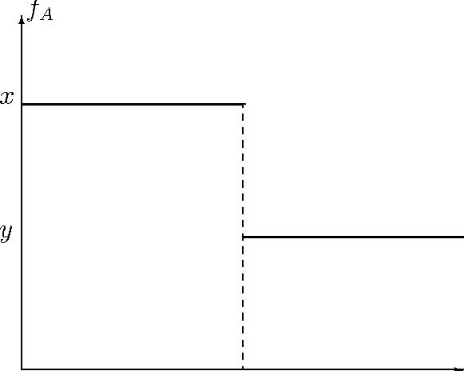

# Chapter 3 

#Decision Making under Uncertainty

In the previous lecture, we considered decision problems in which the decision maker does not know the consequences of his choices but he is given the probability of each consequence under each choice. In most economic applications, such a probability is not given. For example, in a given game, a player cares not only about what he plays but also about what other players play. Hence, the description of consequences include the strategy profiles. In that case, in order to fitinthatframework, wewould need to give other players’ mixed strategy profiles in the description of the game, making Game Theoretical analysis moot. Likewise in a market, the price is formed according to the collective actions of all market participants, and hence the price distribution is not given. 

In all these problems, the decision makers hold subjective beliefs about the unknown aspects of the problem and use these beliefs in making their decisions. For example, a player chooses his strategy according to his beliefs about what other players may play, andhe may reachthese beliefs throughacombinationof reasoning andthe knowledge of past behavior. This is called decision making under uncertainty. 

As established by Savage and the others, under some reasonable assumptions, such subjective beliefs can be represented by a probability distribution, in the sense that the decision maker finds an event more likely than another if and only if the probability distribution assigns higher probability to the former event than latter. In that case, using the probability distribution, one can convert a decision problem under uncertainty to a decision problem under risk, and apply the analysis of the previous lecture. In this lecture, I will describe this program in detail. In particular, I will describe 

- the conditions such consistent beliefs impose on the preferences, 
- the elicitation of the beliefs from the preferences, and 
- the representation of the beliefs by a probability distribution. 

##3.1	Acts, States, Consequences, and Expected Utility Representation 

Consider a finite set C of consequences. Let S be the set of all states of the world. Take a set F of acts f : S → C as the set of alternatives (i.e., set X = F). Each state s ∈ S describes all the relevant aspects of the world, hence the states are mutually exclusive. Moreover, the consequence f(s) of act f depends on the true state of the world. Hence, the decision maker may be uncertain about the consequences of his acts. Recall that the decision maker cares only about the consequences, but he needs to choose an act. 

**Example 1 *(Game as a Decision Problem)** Consider a complete information game with set N = {1,...,n} of players in which each player i ∈ N has a strategy space Si. The decision problem of a player i can be described as follows. Since he cares about the strategy profiles, the set of consequences is C = S1 ×···×Sn.Since he does not know what the other players play, the set of states is S = S−i ≡ j=6i Sj.Since he chooses among his strategies, the set of acts is F = Si, where each strategy si is represented as a function s−i → (si,s−i).(Here, (si,s−i) is the strategy profile in which i plays si and the others play s−i.) Traditionally, a complete-information game is defined by also including the VNM utility function ui : S1 ×···×Sn → R for each player. Fixing such a utility function is equivalent to fixing the preferences on all lotteries on S1 ×···×Sn*. 

We would like to represent the decision maker’s preference relation ºon F by some U : F →	R such that 

U(f) ≡ E[u◦ f]

(in the sense of (OR)) where u : C→  R is a “utility function” on C and E is an expectation operator on S.That is, we want 

f ºg ⇐⇒ U(f) ≡ E[u◦ f] ≥ E[u◦ g] ≡ U(g) . (EUR) 

In the formulation of Von Neumann and Morgenstern, the probability distribution (and hence the expectation operator E) is objectively given. In fact, acts are formulated as lotteries, i.e., probability distributions on C. In such a world, as we have seen in the last lecture, º is representable in the sense of (EUR) if and only if it is a continuous preference relation and satisfies the Independence Axiom. 

For the cases of our concern in this lecture, there is no objectively given probability distribution on S. We therefore need to determine the decision maker’s (subjective) probability assessment on S. This is done in two important formulations. First, Savage carefully elicits the beliefs and represents them by a probability distribution in a world with no objective probability is given. Second, Anscombe and Aumann simply uses indifference between some lotteries and acts to elicit preferences. I will first describe Anscombe and Aumann’s tractable model, and then present Savage’s deeper and more useful analysis. 

##3.2 Anscombe-Aumann Model 

Anscombe and Aumann consider a tractable model in which the decision maker’s subjective probability assessments are determined using his attitudes towards the lotteries (with objectively given probabilities) as well as towards the acts with uncertain consequences. To do this, they consider the decision maker’s preferences on the set P S of all “acts” whose outcomes are lotteries on C,where P is the set of all lotteries (probability distributions on C). In the language defined above, they assume that the consequences and the decision maker’s pereferences on the set of consequences have the special structure of Von-Neuamann and Morgenstern model. 

In this set up, it is straightforward to determine the decision maker’s probability assessments. Consider a subset A of S and any two consequences x,y ∈ C with x  y.Consider the act fA that yields the sure lottery of x on A[^3-1], and the sure lottery of y on S\A. (See Figure 3.1.) Under some continuity assumptions (which are also necessary for representability), there exists some πA ∈ [0, 1] such that the decision maker is indifferent between fA and the act gA that always yield the lottery pA that gives x with probability πA and y with probability 1 − πA. Then, πA is the (subjective) 

Figure 3.1: Figure for Anscombe and Aumann 

probability the decision maker assigns to the event A – under the assumption that πA does not depend on which alternatives x and y areused. In this way, oneobtains a probability distribution on S. Using the theory of Von Neumann and Morgenstern, one then obtains a representation theorem in this extended space where we have both subjective uncertainty and objectively given risk. 

While this is a tractable model, it has two major limitation. First, the analysis generates little insights into how one should think about the subjective beliefs and their representation through a probability distribution. Second, in many decision problems there may not be relevant intrinsic events that have objectively given probabilities and rich enough to determine the beliefs on the events the decision maker is uncertain about. 

[^3-1]:That is, fA (s)=x whenever s ∈ A where the lottery x assigns probability 1 to the consequence x. 

##3.3 Savage Model 

Savage develops a theory with purely subjective uncertainty. Without using any objectively given probabilities, under certain assumptions of “tightness”, he derives a unique probability distribution on S that represent the decision maker’s beliefs embedded in his preferences, and then using the theory of Von Neumann and Morgenstern he obtain a representation theorem – in which both utility function and the beliefs are derived from the preferences. 

Take a set S of states s of the world, a finite set C of consequences (x,y,z), and take the set F =CS of acts f :S→C as the set of alternatives. Fix a relation º on F .We would like to find necessary and sufficientconditionson º so that º can be represented by some U in the sense of (EUR); i.e., U (f)=E[uf]. In this representation, both the utility function u :C→ R and the probability distribution p on S (which determines E) are derived from º. Theorems 2 and 3 give us the first necessary condition: 

**P1** º is a preference relation. 

The second condition is the central piece of Savage’s theory: 

###3.3.1 The Sure-thing Principle 

**The Sure-thing Principle** *If a decision maker prefers some act f to some act g when he knows that some event A ⊂ S occurs, and if he prefers f to g when he knows that A does not occur, then he must prefer f to g when he does not know whether A occurs or not*. 

This is the informal statement of the sure-thing principle. Once we determine the decision maker’s probability assessments, the sure-thing principle will give us the Independence Axiom, Axiom 4, of Von Neumann and Morgenstern. The following formulation of Savage, P2, not only implies this informal statement, but also allows us to state it formally, by allowing us to define conditional preferences. (The conditional preferences are alsousedtodefine the beliefs.) 

**P2** *Let f,f0,g,g0 ∈ F and B ⊂ S be such that 

f (s)=f0 (s) and g (s)=g0 (s) at each s ∈ B 

and f (s)=g (s) and f0 (s)=g0 (s) at each s ∈B. 

If f º g,then f0 º g0*. 

###3.3.2 Conditional preferences 

Using P2, we can define the conditional preferences as follows. Given any f,g,h ∈ F and B ⊂ S,define acts f|hB and g|hB by 

f|hB (s)=( f (s) if s ∈ B h(s) otherwise

and 

g hB (s)=g (s) if s ∈ B .|h(s) otherwise 

That is, f|hB and g|hB agree with f and g,respectively,on B, but when B does not occur, they yield the same default act h. 

**Definition 6 (Conditional Preferences)** *f º g given B iff f|hB º g|hB*. 

P2 guarantees that f º g given B is well-defined, i.e., it does not depend on the default act h. To see this, take any h0 ∈ F,and define f|hB 0 and g|hB 0 accordingly. Check that 

f|hB (s)≡ f (s)≡ f|hB 0 (s) and g|hB (s)≡ g (s)≡ g|hB 0 (s) at each s ∈ B 

and f|hB (s) ≡ h (s) ≡ g|hB (s) and f|hB 0 (s) ≡ h0 (s) ≡ g|hB 0 (s) at each s ∈B. 

Therefore, by P2, f|hB º g|hB iff f|hB 0 º g|hB0 . 

Note that P2 precisely states that f º g given B is well-defined. To see this, take f and g0 arbitrarily. Set h = f and h0 = g0. Clearly, f = f|hB and g0 = g|hB0 .Moreover, the conditions in P2 define f0 and g as f0 = f|hB 0 and g = g|hB.Thus, the conclusion of P2, “if f º g,then f0 º g0”, is thesameas“if f|hB º g|hB,then f|hB 0 º g|hB0 . 

**Exercise 2** *Show that the informal statement of the sure-thing principle is formally true: given any f1,f2 ∈ F,and any B ⊆ S*, 

[(f1 º f2 given B) and (f1 º f2 given S\B)] ⇒ [f1 º f2] . 

[Hint: define f := f1 = f1f|1 B = f1f|1 S\B, g0 := f2 = f2f|2 B = f2f|2 S\B, f0 := f1f|2 B = f2f|1 S\B,and g := f2f|1 B = f1f|2 S\B. Notice that you do not need to invoke P2 (explicitly).] 

**Null Events** Imagine that the decision maker remains indifference towards any changes made to an action within an event B. Namely, for any acts f and g, the decision maker remains indifferent between f and g,so long as f and g are identical on S\B,no matter how widely differ on B. In that case, it is plausible to deduce that the decision maker does not think that event B obtains. Such events are called null. 

**Definition 7** *An event B is said to be null if and only if f ∼ g given B for all f,g ∈ F*. 

Recall that our aim is to develop a theory that relates the preferences on the acts with uncertain consequences to the preferences on the consequences. (The preference relation º on F is extended to C by embedding C into F as constant acts. That is, we say x º x0 iff f º f0 where f and f0 are constant acts that take values x and x0, respectively.) The next postulate does this for conditional preferences: 

**P3** *Given any f,f0 ∈ F, x,x0 ∈ C,and B ⊂ S,if f ≡ x, f0 ≡ x0,and B is not null, then* 

*f º f0 given B ⇐⇒ x º x0*. 

For *B = S*, P3 is rather trivial, a matter of definition of a consequence as a constant act. When *B = S*, P3 is needed as an independent postulate. Because the conditional 

preferences are defined by setting the outcomes of the acts to the same default act when the event does not occur, and two distinct constant acts cannot take the same value. 

###3.3.3 Representing beliefs with qualitative probabilities 

We want to determine the decision maker’s beliefs reflected in º. Towards this end, given any two events A and B, wewantto determine whichevent thedecisionmaker thinks is more likely. To do this, take any two consequences x,x0 ∈ C with x x0.The decision maker is asked to choose between the two gambles (acts) fA and fB with 

(

fA (s)=x if s∈ A, (3.1) x0 otherwise 

( 

x if s ∈ B 

fB (s)=. x0 otherwise 

If the decision maker prefers fA to fB,we can infer that he finds event A more likely than event B, for he prefers to get the “prize” when A occurs, rather than when B occurs. 

**Definition 8** *Take any x,x0 ∈ C with x  x0.Given any A,B ⊆ S, A is said to be at least as likely as B (denoted by Aº˙B)ifand only if fA º fB,where fA and fB defined by (3.1)*. 

We want to make sure that this yields well-defined beliefs. That is, it should not be the case that, when we use some x and x0, we infer that decision maker finds A strictly more likely than B, but when we usesomeother yand y0,we infer that he finds B strictly more likely than A. Then next assumption guaranties that º˙is indeed well-defined. 

**P4** *Given any x,x0,y,y0 ∈ C with x x0 and y  y0,define fA,fB,gA,gB by* 

((

x if s ∈ Ay if s∈ A 

fA (s)=,gA (s)=x0 otherwise y0 otherwise 

((

x if s ∈ By if s∈ B 

fB (s)=,gB (s)=. x0 otherwise y0 otherwise 

Then, 

fA º fB ⇐⇒ gA º gB. 

Finally, make sure that we can find x and x0 with x x0: 

**P5** *There exist some x,x0 ∈ C such that x  x0*. 

We have now a well-defined relation º˙that determines which of two events is more likely. It turns out that, º˙is a qualitative probability,defined as follows: 

**Definition 9** *Arelation º˙between the events is said to be a qualitative probability iff* 

 *1. º˙is complete and transitive*; 

 *2. for any B,C,D ⊂ S with B ∩ D =C ∩ D =∅ ,B*˙

ºC ⇐⇒ B ∪ Dº˙C ∪ D; 

 *3. Bº˙∅ for each B ⊂ S,and SÂ˙∅* . 

**Exercise 3** *Show that, under the postulates P1-P5, the relation º˙defined in Definition 8 is a qualitative probability* 

###3.3.4 Quantifying the qualitative probability assessments 

Savage uses *finitely-additive probability measures on the discrete sigma-algebra*: 

**Definition 10** A probability measure *is any function p :2S → [0, 1] with* 

 *1. if B ∩ C =∅ ,then p (B ∪ C)=p (B)+p (C),and* 

 *2. p (S)=1*. 

We would like to represent our qualitative probability º˙with a (quantitative) probability measure p in the sense that 

Bº˙C ⇐⇒ p (B)≥ p (C) ∀ B,C ⊆ S. (QPR) 

**Exercise 4** *Show that, if a relation º˙can be represented by a probability measure, then º˙must be a qualitative probability*. 

When *S* is finite, since º˙is complete and transitive, by Theorem 2, it can be represented by some function p, but there might be no such function satisfying the condition 1 in the definition of probability measure. Moreover, *S* is typically infinite. (Incidentally, the theory that follows requires *S* to be infinite.) 

We are interested in the preferences that can be considered coming from a decision maker who evaluates the acts with respect to their expected utility, using a utility function on *C* and a probability measure on *S* that he has in his mind. Our task at this point is to find what probability *p(B)* he assigns to some arbitrary event B. Imaginethatweask this person whether *p(B)* ≥ 1/2. Depending on his sincere answer, we determine whether *p(B)* ∈ [1/2) or *p(B)* ∈ [0,1/2,1].Given the interval, we ask whether *p(B)* is in the upper half or the lower half of this interval, and depending on his answer, we obtain a smaller interval that contains *p(B)*.We do this ad infinitum. Since the length of the interval at the nth iteration is 1/2n,we learn *p(B)* at the end. For example, let’s say that *p(B)*=0.77.We first ask if *p(B)* ≥ 1/2. He says Yes. We ask now if *p(B)* ≥ 3/4. He says Yes. We then ask if *p(B)* ≥ 7/8.He says No. Now, we ask if *p(B)* ≥ 13/16 = (3/4+7/8) /2.He says No again.We now ask if *p(B)* ≥ 25/32 = (3/4+7/8) /2. HesaysNo. Now weask if *p(B)* ≥ 49/64.He says Yesnow. Atthispoint we know that 49/64˜=0.765 ≤ *p(B)* &lt; 25/32˜=0.781. Asweask further we get a better answer. 

This is what we will do, albeit in a very abstract setup. Assume that S is infinitely divisible under º˙.That is, S has 

 - a partition {D11,D12} with D11 ∪ D12 = S and D11∼˙D12 , 

 - a partition {D21,D2,D23,D24}with D21∪D2 = D11 , D23∪D24 = D12,and D21∼˙D2∼˙D23∼˙D24 ,

• 22	2 

 - a partition Dn1 ,,Dn 2n with Dn 1 ∪ Dn 2 = Dn1 −1, ..., Dn 2k−1 ∪ Dn 2k = Dnk −1, ...,

•	···and Dn 1 ∼˙···∼˙Dn 2n ,

.
ad infinitum. 

<Table>
<TR>

<TH>S </TH>

</TR>
<TR>
<TD>D1 1</TD>

<TD>D2 1 </TD>

</TR>
<TR>
<TD>D1 2</TD>
<TD>D2 2</TD>
<TD>D3 2</TD>
<TD>D4 2 </TD>
</TR>
<TR>
<TD>. . . . . . . . . . . . </TD>
</TR>
</Table>

n

**Exercise 5** *Check that, if º˙is represented by some p, then we must have p (Dnr )=1/2*. 

Given any event B,for each n,define 

([)

rk (n,B)=maxrB ˙Dni ,|º i=1 

where we use the convention that ∪r Di =∅ whenever r&lt; 1.Define

i=1n 

p (B):= lim k (n,B) . (3.2) n→∞ 2n nn

Check that k (n,B)/2∈ [0, 1]is non-decreasing in n. Therefore, limn→∞ k (n,B)/2is well-defined. 

Since º˙is transitive, if Bº˙C,then k (n,B)≥ k (n,C) for each n, yielding p (B)≥ p (C).This proves the = part of (QPR) under the assumption that S is infinitely divisibile. The other part (⇐⇒ ) is implied by the following assumption: 

**P6’** *If BÂ˙C,then there exists a finite partition {D1,...,Dn} of S such that BÂ˙C ∪ Dr for each r*. 

Under P1-P5, P6’ also implies that S is infinitely-divisibile. (See the definition of “tight”and Theorems 3and 4inSavage.) Therefore, P1-P6’imply (QPR), where p is defined by (3.2). 

**Exercise 6** *Check that, if º˙is represented by some p0,then* 

k (n,B) k (n,B)+1

≤ p0 (B)&lt; 

2n 2n 

*at each B.Hence, if both p and p0 represent º˙,then p =p0*. 

Postulate 6 will be somewhat stronger than P6’. (It is also used to obtain the continuity axiom of Von Neumann and Morgenstern.) 

32 CHAPTER 3. DECISION MAKING UNDER UNCERTAINTY 

**P6** Given any x∈ C,and any g,h∈ F with g  h, there exists a partition {D1,...,Dof S such that 

g  h

xi

n} 

and g 

xi

 h

for each i ≤ n where 

(

(

if s∈ Di if s∈ Di

x

x

hand g 

⇐⇒ 

xiTake and(definedin(3.1))toobtainP6’. fhfg ==BC 

**Theorem5** *UnderP1-P6,thereexistsauniqueprobabilitymeasure suchthat* p ˙(QPR) BC (B)(C) B,C S.º≥∀⊆pp

###3.3.5 ExpectedUtilityRepresentation 

In Chapter5, Savage shows that, when *C* is finite,Postulates P1-P6 imply Axioms2-4 of Von Neumann and Morgenstern-as well as their modeling assumptions such as only the probability distributions on the set of prizes matter. In this way,he obtains the following Theorem[^3-1]

**Theorem6** *Assumethat isfinite. UnderP1-P6,there exist a utility function u :C R and a probability measure p:2

xi

(s)=

(s)=

.

s) otherwise s) otherwise 

h(

g(

C

S

→→ 

[0

,1]such that 

XX 

f º g ⇐⇒ p({s|f(s)=c})u(c)≥ p({s|g(s)=c})u(c) 

c∈Cc∈C 

for each f,g ∈ F. 

[^3-1]:For the inifinte C,weneed theinfinite version of the sure-thing principle: 

**P7** If we have f º g (s) given B for each s ∈ B,then f º g given B. Likewise, if f (s) º g given B for each s ∈ B,then f º g given B. 

Under P1-P7, we get the expected utility representation for general case. 

MIT OpenCourseWare

http://ocw.mit.edu 

14.123

 Microeconomic Theory 

III

Spring 

2010

For information about citing these materials or our Terms of Use, visit: 

http://ocw.mit.edu/terms

. 
