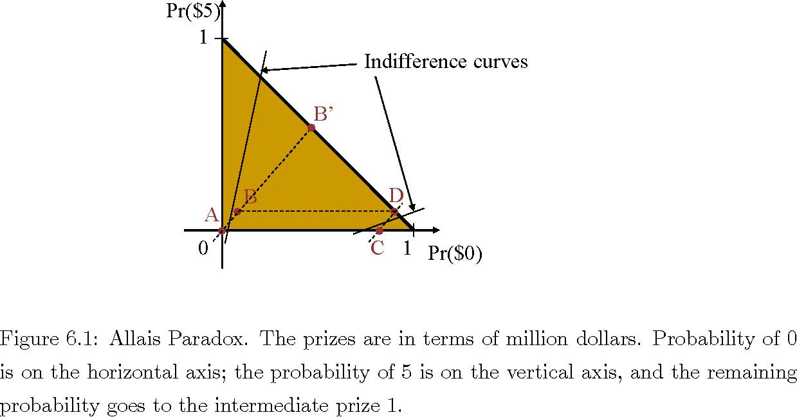
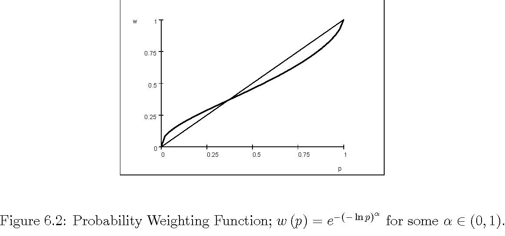
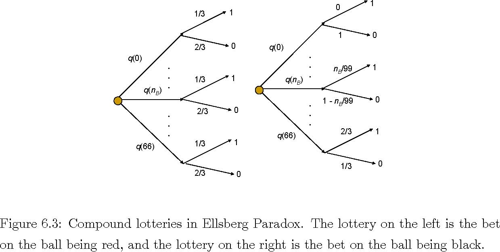
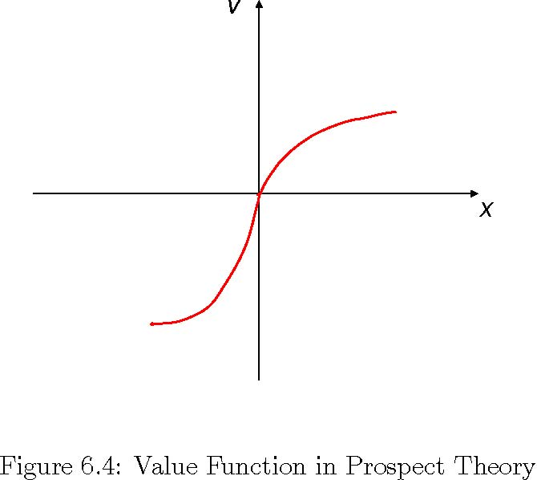

# Chapter 6 

#Alternatives to Expected Utility Theory 

In this lecture, I describe some well-known experimental evidence against the expected utility theory and the alternative theories developed in order to accommodate these experiments. (I have posted a comprehensive survey on the class web page.) 

##6.1 Allais Paradox and Weighted Utility 

Imagine yourself choosing between the following two alternatives: 

A Win 1 million dollar for sure. 

B Win 5 million dollar with 10% chance, 1 million dollar with 89%, nothing with 1%. 

Which one would you choose? In many surveys, subjects who were offered these alternatives chose A. It seems that they did not want to risk the opportunity of having a million dollar for a 10% chance of having five million dollar instead. Now consider the following two alternatives: 

C Win $1M with 11% chance, nothing with 89%. 

D Win $5M with 10% chance, nothing with 90%. 

47 

48 CHAPTER 6. ALTERNATIVES TO EXPECTED UTILITY THEORY 

It seems that the probability of winning the prize is similar for the two alternatives, while the prizes are substantially different. Hence, it seems reasonable to choose the higher prize, choosing D rather than C. Indeed, in surveys, the subjects choose D. 

Unfortunately, for an expected utility maximizer, the trade of between A and B is identical to the trade of between C and D, and he prefers A to B if and only if he prefers C to D. To see this, note that for an expected utility maximizer with utility function u, A is betterthanBif andonlyif u (1) &gt; 0.1u (5) + 0.89u (1), i.e., 

0.11u (1) &gt; 0.1u (5) , (6.1) 

where the unit of money is million dollar, and the utility from 0 is normalized to 0. But for such an expected utility maximizer, C is better than D if and only if (6.1) holds. 

The above experiment against the expected utility theory has been designed by Allais. It illustrates for the subjects surveyed that the indifference curves are not parallel, and hence the independence axiom is violated. This is illustrated in Figure 6.1. As shown in the figure, the lines connecting A to B and C to D are parallel to each other. Since A is better than B, the indifference curve through A is steeper than the line connecting A to B. Since D is better than C, the indifference curve through C is flatter than the line connecting C to D. Therefore, the indifference curve through A is steeper than the indifference curve through C. 

A series of other experiments also suggested that the indifference curves are not parallel and"fanout’ as inthe figure. Consequently, decision theorists have developed many alternative theories in which the indifference curves are not parallel. These theories often assume that the indifference curves are straight lines, called betweenness. 

A prominent theory among these assumes that the indifference curves are straight lines that fan out from a single origin. This theory is called Weighted Utility Theory,as it assumes the following general form for the utility from a lottery p: 

P 

W (p)= w (xp,g) u (x) 

x∈C |

where 

g (x) p (x) w (x|p,g)= P y∈C p (y) g (y) for some function g : C R. Here, the utilities are weighted according to not only the 

→ 

probabilities of the consequences but also according to the consequences themselves. Of 

Figure 6.1: Allais Paradox. The prizes are in terms of million dollars. Probability of 0 is on the horizontal axis; the probability of 5 is on the vertical axis, and the remaining probability goes to the intermediate prize 1. 

course, if g is constant, the weighting is done only according to the probabilities, as in the expected utility theory. 

**Exercise 7** *Check that under the weighted utility theory, the indifference curves are straight lines, but the slope of the indifference curves differ when g is not constant. Taking C with three elements, characterize the functions g and u under which the indifference sets fan out as in the Allais paradox*. 

In the weighted utility theory, the decision maker distorts the probabilities using the consequences themselves and the whole probability vector p. In general, probabilities need to be distorted if one wants to incorporate Allais paradox in expected utility theory. A prominent theory that distorts the probabilities to this end is rank-dependent expected utility theory. In this theory, one first ranks the consequences in the order of increasing utility. He then applies probability weighting function w to the cumulative distribution function F and distorts it to a new cumulative distribution function w◦F .One then finally uses expected utility under the distorted probabilities in order to evaluate the lottery. The resulting value function is 

Z 

U (x|w)= u (x) dw (F (x)) . (6.2) 

Figure 6.2: Probability Weighting Function; w (p)= e−(− ln p)α for some α ∈ (0, 1). 

The survey results in the Allais paradox suggest that the subjects overestimate the small probability events with extreme value, such as getting nothing with a small probability. In order to capture such a behavior, one often uses an inverted S shaped probability weighting function as in Figure 6.2. Here, w is an increasing function with w (0) = 0 and w (1) = 1, and it crosses the diagonal once at some p∗. The general functional form w (p)= e−(− ln p)α for some α ∈ (0, 1) has many desirable properties. 

**Example 2** *Consider the lotteries in the Allais paradox. Set u (0) = 0 and u (1) = 1. The value of lottery B is computed as follows*: 

U (B|w)= w (0.01) u (0) + [w (0.9) − w (0.01)] u (1) + (1 − w (0.9)) u (5) = w (0.9) − w (0.01) + (1 − w (0.9)) u (5) . 

Similarly, the values of the other lotteries are 

U (A|w)=1U (C|w)=1 − w (0.89)U (D|w)=(1 − w (0.9)) u (5) .

Now take u (5) ∈ (1,e/ (e − 1)) and w (p)= e−(− ln p)α . Note that 

αlim 0 U (A|w)=1 &gt; (1 − 1/e) u (5) = αlim 0 U (B|w)= αlim 0 U (D|w) &gt; 1−1/e = αlim 0 U (C|w) . 

→→→→

Thus, for small α, the preferences are as in the Allais paradox. 

##6.2 Ellsberg Paradox and Ambiguity Aversion 

Consider an urn that contains 99 balls, colored Red, Black and Green. We know that there are exactly 33 Red balls, but the exact number of the other colors is not known. A ball is randomly drawn from this urn. You choose a color. 

- If the ball is of the color you choose, you win $1. What color would you choose? 
- If the ball is not of the color you choose, you win $1. What color would you choose? 

When different subjects are asked these questions, an overwhelming majority of them chose red ball in both questions. That is to say, in the first question, an overwhelming majority of the subjects bet on the event that the ball is red, and in the second question an overwhelming majority bet that the ball is not red. This can be taken as an evidence agains the expected utility theory because an expected utility maximizer cannot have a strict preference in both questions. Indeed, if the probability of colors red, black, and green are pR, pB,and pG, respectively, then having a strict preference for red in the first question means that 

pR &gt;pB and pR &gt;pG. 

A strict preference for red in the second question means that 

1 − pR &gt;1 − pB and 1 − pR &gt;1 − pG, 

i.e., pR &lt;pB and pR &lt;pG, 

a clear contradiction. 

This is called Ellsberg Paradox. Note that this is an evidence against the expected utility theory as formulated by Savage, assuming that the money is the consequence. In particular, it contradicts the basic assumption that the individuals have well-defined beliefs that give a well-defined probability for each consequence under each act. Within the framework of von Neumann and Morgenstern, this could be taken as an evidence against the fundamental modeling assumption that compound lotteries are reduced to thesimplelotteries. 

Suppose that the decision maker believes that the each ball is equally likely to be drawn. Given the number nB of black balls, the probability of each color is as follows: 

Pr(R|nB)=1/3 

Pr(B|nB)= nB/99 

Pr(G|nB)=2/3− nB/99. 

(Here, Rmeans that the ball is red; Bmeans that the ball is black, and Gmeans that the ball is green.) Savage assumes that the decision maker has a belief qabout nB.For every given belief qabout nB, each bet yields a compound lottery. For example, the compound lotteries given by betting on the event Rthat the ball is red and betting on the event Bthat the ball is black are plotted in Figure 6.3. 

In expected utility theory, one further assumes that the compound lotteries are reduced to simple lotteries. This reduction yields the following probabilities for the color of the ball: 

pR =1/3 

66

X 

pB = q(nB)/99 nB =0 pG =2/3− pB. 

The reduced lottery from betting on Ris $1 with probability pR and $0 with probability 1− pR. (The reduced lotteries for the other bets are similar.) If qis symmetrically distributed, we would further have pG =pB =1/3. In that case, the decision maker would be indifferent between betting on any color. Similarly, he would be indifferent between betting on the ball not being a given color. Since the decision maker would be indifferent between all alternatives, this would be consistent with the experiment above. However, under any asymmetric belief, he would not bet on red in either question. For example, if rB &gt;rG, he would bet that the ball is Black in the first question, and he would bet that the ball is not Green in the second question. 

Thereisasense that onemay want to treatthe lack of knowledgeabout thenumber of balls in a given urn differently from the lack of knowledge about what ball has been drawn "randomly". They may somehow treat the latter case more as a case with an "objectively given probabilities", while treating the former case more "ambiguous". The former case is sometimes called Knightian Uncertainty or Ambiguity. 

Figure 6.3: Compound lotteries in Ellsberg Paradox. The lottery on the left is the bet on the ball being red, and the lottery on the right is the bet on the ball being black. 

A strand of literature treats such ambiguity differently. The most canonical theory in this literature, namely the theory of Ambiguity Aversion as analyzed by Gilboa and Schemeidler, assumes that the decision maker focuses on the worst-case scenario when it comes to ambiguity. He maximizes the minimum expected payoff in ambiguous cases. For example, he takes the values of betting on events R,B, and G as 

V (R)= min1/3=1/3 

nB V (B)= minnB/99=0 

nB V (G)= min[2/3− nB/99]=0. 

nB 

Hence, in the first question, an ambiguity averse decision maker chooses to bet on the event that the ball is red. On the other hand, the value of betting on the event that the ball is not a given color is given by 

V (NR)=min2/3=2/3 

nB V (NB)=min[1− nB/99]=1/3 

nB 

V (NG)=min{1− [2/3− nB/99]} =1/3, 

nB 

where NR,NB, and NG denote the complements of R, B,and G, respectively. Hence, in the second question, an ambiguity-averse decision maker chooses to bet that the ball is not red. 

More generally, theory of ambiguity aversion assumes that there are multiple priors q ∈Q on state space S,the set Q is the range of ambiguity. Given any q,an act a yields an expected utility E [u (a) |q]= u (a (s)) dq (s), where the outcome of an act can be a lottery as in the Anscombe and Aumann model. For any given act a, the worst possible expected payoff is 

VAA (a)=min E [u (a) q] . q∈Q |

The decision maker maximizes this minimum expected utility. His choice function is 

cAA (A)= arg max min u (a (s)) dq (s) . a∈Aq∈Q 

Note that this is a theory of an irrational decision maker, who mistakenly assumes that his choices affect the underlying state of the world, which is given. 

Focusing on the worst-case scenarios is clearly an extreme behavior and yields a useless guide for behavior in many real-world problems. For, under a full support assumption, the worst case scenario is the worst consequence, making the decision maker indifferent between all such acts. An alternative to above theory introduces the beliefs about the ambiguous states but treats these probabilities differently. It introduces a probability distribution μ on Q and assumes that the decision maker maximizes 

ZµZ ¶

VSAA (a)= Eμ [v (Equ (a))] = vu (a (s)) dq (s)dμ (q) , 

where v : RR is a concave function. Hence, the choice function is 

→

ZµZ ¶

cSAA (A) = arg max Eμ [v (Equ (a))] = arg max vu (a (s)) dq (s)dμ (q) . a∈Aa∈A 

This theory is called Smooth Ambiguity Aversion. The ambiguity aversion is a particular limit in which v gets extremely concave. For example, if we take v (x)= −e−αx and let α →∞, we would get the ambiguity aversion in the sense of maxmin.When μ is degenerate (or equivalently Q is singleton), this reduces to the standard expected utility theory. 

##6.3 Framing 

The theories so far all assumed that the decision is not affected by the way the decision problem is formulated. Actually, in many experiments, the way the problem is formulated has a large impact on the decision. This phenomenon is called framing effect.The following example, due to Kahneman and Tversky, illustrates this fact. They have asked to a group of subjects the following question. 

An outbreak of a disease is about to kill 600 people. There are two possible treatments A and B with the following results. 

A 400 people die. 

B Nobody dies with 1/3 chance, 600 people die with 2/3 chance. 

Which treatment would you choose? 

In response to this question, 78% of subjects have picked treatment B. To a different group of subjects, they have offered the following treatments: 

C200 people saved. 

D All saved with 1/3 chance, nobody saved with 2/3 chance. 

This time, only 28% of subjects have picked D. But clearly, apart from wording, A is equivalent to C, and B is equivalent to D. By changing the wording of letting 400 people die to saving 200 people altered the way the subjects approached the problem. 

Unlike the previous theories, the next theory allows framing. 

##6.4 Prospect Theory 

Based on survey data, Kahneman and Tversky developed a theory of decision making in which the decision maker distorts the probabilities of events, as in rank-dependent expected utility, and evaluates the consequences according to a reference-dependent utility function, which treats "gains" differently from the "losses". In addition, Kahneman and Tversky allow the decision maker to "edit" the problem in a way to simplify the problem before applying the above procedure. There are two versions of the theory. In the sequel, I describe the Cumulative Prospect Theory. 

In this theory, the reference point x0 plays a central role. The consequences that are above x0 are considered gains and the ones below x0 are considered losses.In the first stage, using a probability weighting function w as in the rank-dependent expected utility, one distorts the cumulative distributions of gains and losses separately. Hence, the resulting cumulative density function for the gains is 

G (x|x0)= w (F (x)) for x ≥ x0. 

The resulting cumulative density function for the losses is 

G (x|x0)=1 − w (1 − F (x)) for x ≤ x0. 

In the second stage, he evaluates each consequence according to a reference-dependent utility function 

u (x|x0)= v (x − x0) 

where v is an increasing function with the following properties (see Figure 6.4 for an illustration): 

- v is concave on the positive numbers, i.e., the decision maker is risk-averse towards gains; 
- v is convex on the negative numbers, i.e., the decision maker is risk-seeking towards losses; 
- there is a kink at 0, so that the decision maker is affected by small losses more than he is affected by equal amount of gains (loss aversion). 

After distortion of probabilities and reference-dependent evaluation of consequences, the decision maker applies expected utility. The resulting value function for any given lottery F is 

Z 

U (F v,x0,w)= u (xx0) dG (xx0)

|Z ||	Z 

= v (x − x0) d (1 − w (1 − F (x))) + v (x − x0) dw (F (x)) . 

x&lt;x0	x&gt;x0 

**Exercise 8** Take w (p)= p and 

( 

√x if x ≥ 0. 

v (x)= 

−2√−x if x ≥ 0.  

Figure 6.4: Value Function in Prospect Theory 

*Consider a lottery ticket L that pays 106 with probability 10−6 . How much is the decision maker willing to pay to buy the lottery ticket. Now suppose that there is a risk in the decision maker’s wealth, so that he can lose 106 with probability 10−6.(For example, his house can burn.) How much is he willing to pay for a full insurance against this risk? If both insurance and lottery ticket are sold by a risk neutral seller, what is the range of individually rational prices for each of them*? 

Notice that in prospect theory, the decision is greatly affected by the reference point. If the reference is taken to be the smallest consequence available in the lotteries, the individual is risk averse (and is a rank-dependent expected utility maximizer). If the reference is taken to be the largest consequence available in the lotteries, he is now risk-seeking (and a rank-dependent expected utility maximizer in the reverse order). If one can affect the reference point by framing the problem, he can have a great impact on the decision. In that case, the individuals in prospect theory are prone to framing. Although the reference point is very important for the theories, it is not clear what it should be (and it is left to be determined by the context)[^6-1] 

[^6-1]:There are some recent studies that suggest possible alternatives as the reference point. 

**Exercise 9** Take zero wealth as the reference point in the previous exercise. 

MIT OpenCourseWare

http://ocw.mit.edu 

14.123

 Microeconomic Theory 

III

Spring 

2010

For information about citing these materials or our Terms of Use, visit: 

http://ocw.mit.edu/terms

. 
