# Chapter 7 

#Preliminary Notions in Game Theory 

I assume that you recall the basic solution concepts, namely Nash Equilibrium, Bayesian Nash Equilibrium, Subgame-Perfect Equilibrium, and Perfect Bayesian Nash Equilibrium, from 14.122 very well. In the next two lectures, I will summarize some other important solution concepts in Game Theory, namely Rationalizability, Correlated Equilibrium, and Sequential Equilibrium, and illustrate them in some applications. The notes in this chapter describe the preliminary notions that you must know already and the notation that will be used in the course. 

The games can be represented in two forms: 

1. The normal (strategic) form, 
2. The extensive form. 

I first describe these representations illustrate how one can go from one representation to the other. 

##7.1 Normal form 

**Definition 15** *(Normal form) An n-player game is any list G=(S1,...,Sn;u1,...,un), where, for each i ∈ N ={1,...,n}, Si is the set of all strategies that are available to player i,and ui : S1 ×... ×Sn → R is player i’s von Neumann-Morgenstern utility function*. 

Notice that a player’s utility depends not only on his own strategy but also on the strategies played by other players. Moreover, each player itries to maximize the expected value of ui (where the expected values are computed with respect to his own beliefs); in other words, ui is a von Neumann-Morgenstern utility function. We will say that player i is rational iff he triestomaximizethe expected valueof ui (given his beliefs). 

It is also assumed that it is common knowledge that the players are N ={1,...,n}, that the set of strategies available to each player iis Si,and that each itries to maximize expected value of ui given his beliefs. 

When there are only two players, we can represent the (normal form) game by a bimatrix (i.e., by two matrices): 

1\2 

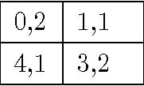

1,14,1 3,2

left right up 

0,2 down 

Here, Player 1 has strategies up and down, and Player 2 has the strategies left and right. In each box the firstnumberis Player1’s payoff and the second one is Player 2’s (e.g., u1 (up,left)=0, u2 (up,left)=2.) 

I will use the following notational convention throughout the course. Given any list X1,...,Xn of sets with generic elements x1,...,xn, I will 

 - write X =X1 ×···×Xn and designate x=(x1,...,xn)as the generic element, 

 - write X−i =Qj=i Xj and designate x−i =(x1,...,xi−1,xi+1,...,xn)as the generic element for any i,and 

 - write (xi0,x−i)=(x1,...,xi−1,x0i,xi+1,...,xn). 

For example, 

- S =S1 ×···×Sn is the set of strategy profiles s=(s1,...,sn), 

- S−i is the set of strategy profiles s−i =(s1,...,si−1,si+1,...,sn)other than player i,and 

- (s0i,s−i)=(s1,...,si−1,s0i,si+1,...,sn)is the strategy profile in which i plays si0and the others play s−i. 

##7.2 Extensive form 

The extensive form contains all the information about a game explicitly, by defining who moves when, what each player knows when he moves, what moves are available to him, and where each move leads to, etc. In contrast, these are implicitly incorporated in strategies in the normal form. (In a way, the normal form is a ‘summary’ representation.) We first introduce some formalisms. 

**Definition 16** *A tree is a directed graph (i.e. a set of nodes with directed edges that connect some of the nodes) such that* 

1. there is an initial node, for which there is no incoming edge; 
2. for every other node, there is one incoming edge; 
3. every node is connected to the initial node by a unique path. 

**Definition 17** *The nodes that are not followed by another node are called terminal. The other nodes are called non-terminal*. 

**Definition 18** *(Extensive form)A Game consists of a set of players, a tree, an allocation of non-terminal nodes of the tree to the players, an informational partition of the non-terminal nodes, and payoffs for each player at each terminal node*. 

The set of players includes the agents taking part in the game. However, in many games there is room for chance, e.g. the throw of dice in backgammon or the card draws in poker. More broadly, we need to consider “chance” whenever there is uncertainty about some relevant fact. To represent these possibilities we introduce a fictional player: Nature. There is no payoff for Nature at end nodes, and every time a node is allocated to Nature, a probability distribution over the branches that follow needs to be specified, e.g., Tail with probability of 1/2 and Head with probability of 1/2. 

An information set is a collection of points (nodes) {n1,...,nk} such that 

1. the same player i is to move at each of these nodes; 

2. the same moves are available at each of these nodes. 

Here the player i, who is to move at the information set, is assumed to be unable to distinguish between the points in the information set, but able to distinguish between the points outside the information set from those in it. For instance, consider the game in Figure 7.1. Here, Player 2 knows that Player 1 has taken action T or B and not action 

X; but Player 2 cannot know for sure whether 1 has taken T or B. The same game is depicted in Figure 7.2 slightly differently. 

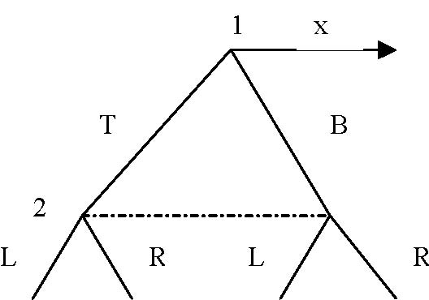

1 BT x 2 L R RL 

Figure 7.1: 

1x 

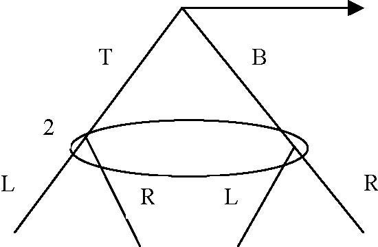

T B 2 L R L R 

Figure 7.2: 

An information partition is an allocation of each non-terminal node of the tree to an information set; the starting node must be "alone". 

**To sum up**: at any node, we know: which player is to move, which moves are available to the player, and which information set contains the node, summarizing the player’s information at the node. Of course, if two nodes are in the same information set, the available moves in these nodes must be the same, for otherwise the player could distinguish the nodes by the available choices. Again, all these are assumed to be common knowledge. For instance, in the game in Figure 7.1, player 1 knows that, if player 1 takes X, player 2 will know this, but if he takes T or B, player 2 will not know which of these two actions has been taken. (She will know that either T or B will have been taken.) 

##7.3 Strategies 

**Definition 19** *A strategy of a player is a complete contingent-plan determining which action he will take at each information set he is to move (including the information sets that will not be reached according to this strategy)*. 

For certain purposes it might suffice to look at the reduced-form strategies. A reduced form strategy is defined as an incomplete contingent plan that determines which action the agent will take at each information set he is to move and that has not been precluded by this plan. But for many other purposes we need to look at all the strategies. Let us now consider some examples: 

**Game 1: Matching Pennies with Perfect Information** 

(-1, 1) 

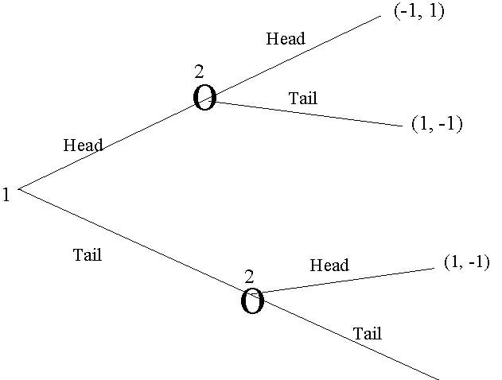

The tree consists of 7 nodes. The first one is allocated to player 1, and the next two to player 2. The four end-nodes have payoffs attached to them. Since there are two players, payoff vectors have two elements. The first number is the payoff of player 1 and thesecond isthe payoff of player 2. These payoffsare von Neumann-Morgenstern utilities. That is, each player tries to maximize the expected value of his own payoffs given his beliefs about how the other players will play the game.. 

The informational partition is very simple; all nodes are in their own information set. In other words, all information sets are singletons (have only one element). This implies that there is no uncertainty regarding the previous play (history) in the game. Recall that in a tree, each node is reached through a unique path. Therefore, if all information sets are singletons, a player can construct the history perfectly. For instance in this game, player 2 knows whether player 1 chose Head or Tail. And player 1 knows that when he plays Head or Tail, Player 2 will know what player 1 has played. (Games in which all information sets are singletons are called games of perfect information.) 

In this game, the set of strategies for player 1 is {Head, Tail}. A strategy of player 2 determines what to do depending on what player 1 does. So, his strategies are: 

HH = Head if Player 1 plays Head, and Head if Player 1 plays Tail; 

HT = Head if Player 1 plays Head, and Tail if Player 1 plays Tail; 

TH = Tail if Player 1 plays Head, and Head if Player 1 plays Tail; 

TT = Tail if Player 1 plays Head, and Tail if Player 1 plays Tail. 

What are the payoffs generated by each strategy pair? If player 1 plays Head and Player 2 plays HH, then the outcome is [Player 1 chooses Head and Player 2 chooses Head] and thus the payoffs are (-1,1). If player 1 plays Head and 2 plays HT, the outcome is the same, hence the payoffs are (-1,1). If Player 1 plays Tail and Player 2 plays HT, then the outcome is [Player 1 chooses Tail and Player 2 chooses Tail] and thus the payoffs are once again (-1,1). However, if Player 1 plays Tail and Player 2 plays HH, then the outcome is [Player 1 chooses Tail and Player 2 chooses Head] and thus the payoffs are (1,-1). One can compute the payoffs for the other strategy pairs similarly. 

Therefore, the normal or the strategic form game corresponding to this game is 

HHHT THTT

HeadTail

<Table>
<TR>
<TD>-1,1 </TD>
<TD>-1,1 </TD>
<TD>1,-1 </TD>
<TD>1,-1 </TD>
</TR>
<TR>
<TD>1,-1 </TD>
<TD>-1,1 </TD>
<TD>1,-1 </TD>
<TD>-1,1 </TD>
</TR>
</Table>

Information sets are very important. To see this, consider the following game. 

Game 2: Matching Pennies with Imperfect Information 

(-1, 1) 

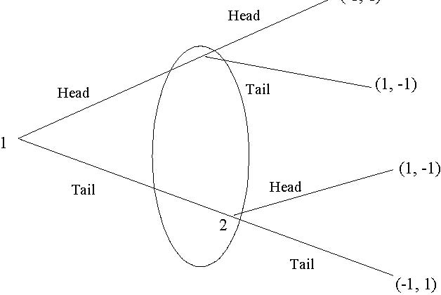

1 2 Head Tail Head Tail Head Tail (1, -1) (1, -1) (-1, 1) 

Games 1 and 2 appear very similar but in fact they correspond to two very different situations. In Game 2, when she moves, player 2 does not know whether Player 1 chose Head or Tail. This is a game of imperfect information. (That is, some of the information sets contain more than one node.) 

The strategies for player 1 are again Head and Tail. This time player 2 has also only two strategies: Head and Tail (as he does not know what 1 has played). The normal form representation for this game will be: 

1\2 Head Tail 

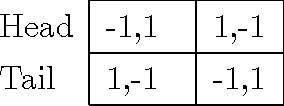

Head -1,1 1,-1 Tail 1,-1 -1,1 

**Exercise 10** What is the normal-form representation for the following game: 

68 CHAPTER 7. PRELIMINARY NOTIONS IN GAME THEORY 

1 A 2 α 1a 

(1,-5) 

D 

δ d 

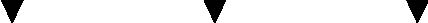

(4,4) (5,2) (3,3) 

Can you find another extensive-form game that has the same normal-form representation? 

[Hint: For each extensive-form game, there is only one normal-form representation (up to a renaming of the strategies), but a normal-form game typically has more than one extensive-form representation.] 

In many cases a player may not be able to guess exactly which strategies the other players play. In order to cover these situations we introduce the mixed strategies: 

**Definition 20** A mixed strategy *of a player is a probability distribution over the set of his strategies*. 

If player i has strategies Si ={si1,si2,...,sik}, thenamixedstrategy σi for player i is a function on Si such that 0≤ σi(sij)≤ 1and σi(si1)+σi(si2)++σi(sik)=1.

···

Here σi can be taken to be the other players’ beliefs about which strategy i would play. The expected payoff of a player from a mixed strategy profile σ =(σ1,σ2,...,σn)is 

X 

ui (σ)= ui (s)σ1 (s1)σn (sn).

···

s∈S Here, itisassumed that σ1,σ2,...,σn are stochastically independent. If σ is correlated, then 

X 

ui (σ)= ui (s)σ(s), s∈S 

where σ(s)is not necessarily in the multiplicative form of σ1 (s1)σn (sn).

···

##7.4 Dominant-strategy equilibrium 

**Definition 21** *Astrategy s∗ i weakly dominates si if and only if* 

ui(si ∗,s−i)≥ ui(si,s−i),∀s−i ∈ S−i 

and 

ui(s∗ i ,s−i)&gt;ui(si,s−i) 

for some s−i ∈ S−i. 

That is, no matter what the other players play, playing s∗ i is at least as good as playing si, and there are some contingencies in which playing s∗ i is strictly better than si. In that case, if rational, i would play si only if he believes that these contingencies will neveroccur. Ifheiscautiousin the sensethatheassignssomepositiveprobability for each contingency, he will not play si. I use the notion of weak dominance to define a dominant strategy: 

**Definition 22** *Astrategy s∗ i is a (weakly) dominant strategy forplayeri if andonlyif s∗ i weakly dominates all the other strategies of player i*. 

When there is a weakly dominant strategy, if the player is rational and cautious (in the sense that he assign positive probability on all of other players’ strategies), then he will play the dominant strategy. 

**Example**: 

1\2 

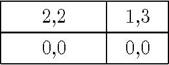

2,2 1,30,0 0,0

work hard shirk hire don’t hire 

In this game, player 1 (firm) has a strictly dominant strategy: “hire.” Player 2 has only a weakly dominated strategy. If players are rational, and in addition player 2 is cautious, then player 1 hires and player 2 shirks:[^7-1]

1\2 

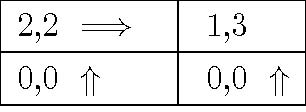

1,3 0,0 ⇑ 0,0 ⇑ 

work hard shirk hire 

2,2 = 

⇒ 

don’t hire 

[^7-1]: This is the only outcome, provided that each player is rational and player 2 knows that player 1 is rational–as we will see in a moment.

**Definition 23** *Astrategy profile s∗ =(s1∗,s∗ 2,....s∗N)is a dominant strategy equilibrium, if and only if s∗ i is a weakly dominant strategy for each player i*. 

As an example consider the Prisoner’s Dilemma. 

1\2 

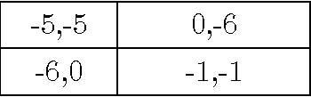

-5,-5 0,-6 -6,0 -1,-1

confess don’t confess confess don’t confess 

“Confess” is a strictly dominant strategy for both players, therefore (“confess”, “confess”) is a dominant strategy equilibrium. 

1\2 

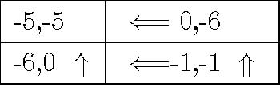

⇐ =0,-6-6,0 ⇑⇐ =-1,-1⇑ 

confess don’t confess confess -5,-5 don’t confess 

**Example: (second-price auction)** As already mentioned, under suitably designed trading mechanisms, it is possible to have a dominant strategy equilibrium. Such mechanisms are desirable for they give the economic agents strong incentive to play a particular strategy (which is presumably preferred by the market designer) and eliminate the agents’ uncertainty about what the other players play, as it becomes irrelevant for the agent what the other players are doing. The most famous trading mechanism with dominant-strategy equilibrium is the second-price auction. 

We have an object to be sold through an auction. There are two buyers. The value of the object for any buyer i is vi, which is known by the buyer i.Each buyer i submits abid bi in a sealed envelope, simultaneously. Then, we open the envelopes; the agent i∗ who submits the highest bid 

bi∗ =max{b1,b2} 

gets the object and pays the second highest bid (which is bj with j = i∗). (If two or

more buyers submit the highest bid, we select one of them by a coin toss.) 

Formally thegameisdefined by the player set N ={1,2}, the strategies bi,and the payoffs 

vi − bj if bi &gt;bj ui (b1,b2)= (vi − bj)/2 if bi =bj 0 if bi &lt;bj 

where i=j.

⎧ 

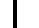

⎪⎪

⎨ 

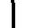

⎪⎪

⎩

In this game, bidding his true valuation vi is a dominant strategy for each player i. To see this, consider the strategy of bidding some other value b0i = vi for any i.We want 

to show that b0i is weakly dominated by bidding vi. Consider the case b0i &lt;vi.If the other player bids some bj &lt;b0i,player iwould get vi − bj under both strategies b0i and vi. If the other player bids some bj ≥ vi,player iwould get 0 under both strategies b0and

i vi.But if bj = bi0,bidding vi yields vi − bj &gt;0, while bi0yields only (vi − bj) /2. Likewise, if b0i &lt;bj &lt;vi,bidding vi yields vi − bj &gt;0, while b0i yields only 0. Therefore, bidding vi dominates b0i.The case bi0&gt;vi is similar, except for when bi0&gt;bj &gt;vi, bidding vi yields 0,while b0yields negative payoff vi − bj &lt;0. Therefore, bidding vi is dominant strategy 

i 

for each player i. 

**Exercise 11** *Extend this to the n-buyer case*. 

When it exists, the dominant strategy equilibrium has an obvious attraction. In that case, rational cautious players will play the dominant strategy equilibrium. Unfortunately, it does not exist in general. For example, consider the Battle of the Sexes game: 

Man\Woman 

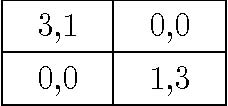

0,00,0 1,3

opera ballet opera 

3,1 ballet 

Clearly, no player has a dominant strategy: opera is a strict best reply to opera and ballet is a strict best reply to ballet. Therefore, there is no dominant strategy equilibrium. 

##7.5 Nash Equilibrium 

In equilibrium, players’ beliefs are identical to the mixed strategies of their opponents, and hence it is useful for equilibrium analysis to define the concept of best response to astrategy. 

**Definition 24** *For any player i,a strategy s∗ i is a best response to a strategy profile s−i if and only if* 

ui(s∗ i ,s−i) ≥ ui(si,s−i),∀si ∈ Si. 

Similary, a mixed strategy σ∗ is a best response to a mixed strategy profile σ−i if and 

i 

only if 

ui(σ∗ i ,σ−i)≥ ui(si,σ−i), ∀si ∈ Si. 

Recall that ui(σ∗ i ,σ−i)= P ui (s)σ∗ i (si)Qj=i σj (sj)and ui(si,σ−i)= P sui (s)Qj=i σj (sj). 

s∈S −i∈S−i 

In the definition, I consider only the deviation by pure strategies because profitability of mixed deviationsisequivalentto the profitability of pure deviations because of the linearity of payoffs with respect to the probabilities. 

**Definition 25** *Astrategy profile (s1NE ,...,snNE )is a Nash Equilibrium if and only if siNE is a best-response to s−iNE =(s1NE ,...,siNE−1 ,si+1NE ,...,sn NE)for each i.That is, for all i,we have that* 

ui(si ,s−i )≥ ui(si,s−i ) ∀si ∈ Si. 

*Similarly, a mixed strategy profile (σNE 1 ,...,σNEn )* is a Nash Equilibrium if and only if σNE is a best-response to σNE =(σNE i−1 ,σNE )for each i.

,...,σNE i+1 ,...,σNE 

i −i 1 n 

In other words, no player would have an incentive to deviate, if he correctly guesses the other players’ strategies. If we consider a strategy profile a social convention, then being a Nash equilibrium is tied to being self-enforcing, that is, nobody wants to deviate when they think that the others will follow the convention. 

**Nash Equilibrium v. Dominant-strategy Equilibrium** If a strategy profile is a dominant strategy equilibrium, then it is also a NE, but the reverse is not true. For instance, in the Battle of the Sexes, both (Opera,Opera) and (Football, Football) are Nash equilibria, but neither are dominant strategy equilibria. Furthermore, a dominant strategy equilibrium is unique, but as the Battle of the Sexes shows, Nash equilibrium is not unique in general. 

MIT OpenCourseWare

http://ocw.mit.edu 

14.123

 Microeconomic Theory 

III

Spring 

2010

For information about citing these materials or our Terms of Use, visit: 

http://ocw.mit.edu/terms

. 
