# Chapter 8 

#Rationalizability 

The definition of a game (N,S,u1,...,un) implicitly assumes that 

1. the set of players is N, the set of available strategies to a player i is Si,and the player i tries to maximize the expected value of ui : S→R according to some belief, and that 

2.  each player knows 1, and that 
3.  each player knows 2, and that...

n	each player knows n− 1 

... 

ad infinitum. 

That is, it is implicitly assumed that it is common knowledge among the players that the game is (N,S,u1,...,un) and that players are rational (i.e. they are expected utility maximizers). As a solution concept, Rationalizability yields the strategies that are consistent with these assumptions, capturing what is implied by the model (i.e. the game). Other solution concepts impose further assumptions, usually on players’ beliefs, to obtain sharper predictions. In this lecture, I will formally introduce rationalizability and present some of its applications. The outline is as follows. I will first illustrate the idea on a simple example. I will then present the formal theory. I will finally apply rationalizability to Cournot and Bertrand competitions. 

##8.1 Example 

Consider the following game. 

1\2L R T 

<Table>
<TR>

</TR>
<TR>
<TD>2,0 </TD>
<TD>-1,1 </TD>
</TR>
<TR>
<TD>0,10 </TD>
<TD>0,0 </TD>
</TR>
<TR>
<TD>-1,-6 </TD>
<TD>2,0 </TD>
</TR>
</Table>

(8.1) 

M B 

A player is said to be rational if he plays a best response to a belief about the other players’ strategies. What does rationality imply for this game? 

Consider Player 1. He is contemplating about whether to play T, or M, or B. A quick inspection of his payoffsreveals that hisbest play dependson whathethinksthe other player does. Let’s then write p for the probability he assigns to L (as Player 2’s play), representing his belief about Player 2’s strategy. His expected payoffsfrom playing T, M, andBare 

UT =2p − (1− p)=3p − 1, 

UM =0, 

UB = −p +2(1− p)=2− 3p, 

respectively. These values as a function of p are plotted in the following graph: 

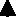

U 0 1p UM UB UT 

2 

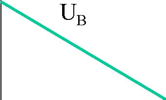

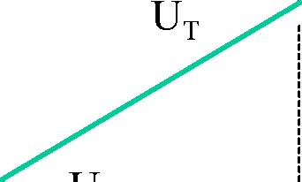

0 -1 

As it is clear from the graph, UT is the largest when p&gt;1/2,and UB is the largest when p&lt;1/2.At p=1/2, UT =UB &gt;0. Hence, if player 1 is rational, then he will play B when p&lt;1/2,D when p&gt;1/2,and B orD if p=1/2. 

Notice that, if Player 1 is rational, then he will never play M–no matter what he believes about the Player 2’s play. Therefore, if we assume that Player 1 is rational (and that the game is as it is described above), then we can conclude that Player 1 will not play M. This is because M is a strictly dominated strategy. In particular, the mixed strategy that puts probability 1/2 on T and probability 1/2 on B yields a higher expected payoff than strategy M no matter what (pure) strategy Player 2 plays. A consequence of this is that M is never a weak best response to a belief p, a general fact that will be established momentarily. 

We now want to understand the implications of the assumption that players know that the other players are also rational. Now, rationality of player 1 requires that he does not play M. For Player 2, her both actions can be a best reply. If she thinks that Player 1isnot likely to play M, then shemustplayR,and if shethinksthatitisvery likely that Player 1 will play M, then she must play L. Hence, rationality of player 2 does not put any restriction on her behavior. But, what if she thinks that it is very likely that player 1 is rational (and that his payoff are as in (8.1))? In that case, since a rational player 1 does not play M, she must assign very small probability for player 1 playing M. In fact, if she knows that player 1 is rational, then she must be sure that he will not play M. In that case, being rational, she must play R. In summary, if player 2 is rational and she knows that player 1 is rational, then she must play R. 

Notice that we first eliminated all of the strategies that are strictly dominated (namely M), then taking the resulting game, we eliminated again all of the strategies that are strictly dominated (namely L). This is called twice iterated elimination of strictly dominated strategies. The resulting strategies are the strategies that are consistent with the assumption that players are rational and they know that the other players are rational. 

As we impose further assumptions about rationality, we keep iteratively eliminating all strictly dominated strategies (if there remains any). Recall that rationality of player 1 requires him to play T or B, and knowledge of the fact that player 2 is also rational does not put any restriction on his behavior–as rationality itself does not restrict Player 2’s behavior. Now, assume that Player 1 also knows (i) that Player 2 is rational and (ii) that Player 2 knows that Player 1 is rational (and that the game is as in (8.1)). Then, as the above analysis snows, Player 1 must know that Player 2 will play R. In that case, being rational he must play B. Therefore, common knowledge of rationality implies that Player 1 plays B and Player 2 plays R. 

In the next section, I will apply these ideas more generally. 

##8.2 Theory 

Fix a game (N,S,u1,...,un). To be concrete, define the concepts of belief, best response, and rationality as follows. 

**Definition 26** *For any player i,a (correlated) belief of i about the other players’ strategies is a probability distribution μ−ion S−i = Qj=i Sj*.

The essential part of this definition is that the belief μ−i of player iallows correlation between the other players’ strategies. For example, in a game of three players in which each player is to choose between Left and Right, Player 1 may believe that with probability 1/2 both of the other players will play Left and with probability 1/2 both players will play Right. Hence, viewed as mixed strategies, it may appear as though Players 2 and 3 use a common randomization device, contradicting the fact that Players 2 and 3 make their decisions independently. One may then find such a correlated belief unreasonable. This line of reasoning is based on mistakenly identifying a player’s belief with other players’ conscious randomization. For Player 1 to have such a correlated belief, he does not need to believe that the other players choose their decisions together. Indeed, he does not think that the other players are using randomization device. He thinks that each of the other players play a pure strategy that he does not know. He may assign correlated probabilities on the other players strategies because he may assign positive probability to various theories and each of these theories may lead to a prediction about how the players play. For example, he may think that players play Left (as in the cars in England) or players play Right (as in the cars in France) without knowing which of thetheoriesiscorrect. 

Depending on whether one allows correlated beliefs, there are two versions of Rationalizability. Because of the above reasoning, in this course, I will focus on correlateversion of Rationalizability. Note that the original definitions of Bernheim (1985) and Pearce (1985) impose independence, and these concepts are identical in two player games.

**Definition 27** The expected payoff *from a strategy si against a belief μ−i is* 

¡¢X 

ui si,μ−i = ui (si,s−i) μ−i (s−i) . 

s−i∈S−i 

**Definition 28** *For any player i,a strategy s∗ i is a best response to a belief μ−i if and only if* 

ui(s∗ i ,μ−i) ≥ ui(si,μ−i),∀si ∈ Si. 

Here I use the notion of a weak best reply, requiring that there is no other strategy that yields a strictly higher payoff against the belief. A notion of strict best reply would require that s∗ yields a strictly higher expected payoff than any other strategy. 

**Definition 29** For any player i,playing a strategy si is said to be rational if and only if si is a best response to some belief μ−i. 

Playing a strategy is not rational if and only if it is never a weak best reply. This idea of rationality is closely related to the following notion of dominance. 

**Definition 30** *Astrategy s∗ i strictly dominates si if and only if* 

ui(s∗ i ,s−i) &gt;ui(si,s−i),∀s−i ∈ S−i. 

P 

*Similarly, a mixed strategy σi strictly dominates si if and only if ui*(σi,s−i) ≡ s0i∈Si σi(si0)ui(si0,s−i) &gt; ui(si,s−i),∀s−i ∈ S−i. 

That is, no matter what the other players play, playing s∗ i is strictly better than playing si for player i. In that case, if i is rational, he would never play the strictly dominated strategy si. That is, there is no belief under which he would play si,for s∗ i would always yield a higher expected payoff than si no matter what player i believes about the other players.[^8-1]

[^8-1]: As a simple exercise, prove this statement. 

**Definition 31** *Astrategy si is said to be strictly dominated if and only if there exists a pure or mixed strategy that strictly dominates si*. 

A Notice that neither of the pure strategies T, M, and B dominates any strategy. Nevertheless, M is dominated by the mixed strategy that σ1 that puts probability 1/2 on each of T and B. For each p, the payoff from σ1 is 

11 1 

Uσ1 = (3p− 1)+ (2 − 3p)= ,

222

which is larger than 0, the payoff from M. Recall that in our example there is no belief (p) under which M is a best response. This is indeed a general result: 

**Theorem 9** *Playing a strategy si is not rational for i (i.e. si is never a weak best response to a belief μ−i)ifand only if si is strictly dominated*. 

**Proof**. I will only show that if si is not strictly dominated it is a weak best response to some belief. (The converse is straightforward.) For each mixed strategy σi,consider the utility vector 

ui (σi)=(ui (σi,s−i))s−i∈S−i , 

and let Ui be the set of all such vectors. Clearly, Ui is convex. Take any si that is not strictly dominated, and define 

©ª 

−i

Vi = v ∈ RS|v À ui (si) . 

Clearly, Vi is also convex, and since si is not strictly dominated, Ui ∩ Vi = ∅.Hence, by the separating-hyperplane theorem there exists μ−i ∈ RS−i such that μ−i ·(ui (σi) − vi) ≤ 0 for all ui (σi) ∈ Ui and v ∈ Vi.By definition of Vi, μ−i ≥ 0.Since ui (si) is on the boundary of Vi, itis alsotruethatfor all ui (σi) ∈ Ui, μ−i ·(ui (σi) − ui (si)) ≤ 0, showing that 

¡¢ ¡¢ 

ui σi,μ−i = μ−i · ui (σi) ≤ μ−i · ui (si)= ui σi,μ−i . 

(In this proof, one can allow S−i to be infinite.) 

Theorem 9 states that if we assume that players are rational (and that the game is as described), then we conclude that no player plays a strategy that is strictly dominated (by some mixed or pure strategy), and this is all we can conclude. 

Let us writeSi 1 = {si ∈ Si| si is not strictly dominated} .

By Theorem 9, Si 1 is the set of all strategies that are best response to some belief. 

Let us now explore the implications of the assumption that player i is rational and knows that the other players are rational. To this end, we consider the strategies si that are best response to a belief μ−i of i on S−i such that for each s−i =(sj)j=i with 

μ−i (s−i)&gt; 0and for each j, there exists a belief μj of j on S−j such that sj is a best response to μj. Here, the firstpart(i.e. si is a best response to a belief μ−i) corresponds to rationality of i and the second part (i.e. if μ−i (s−i)&gt;0,then sj is a best response to a belief μj) corresponds to the assumption that i knows that j is rational. By Theorem 9, each such sj is not strictly dominated, i.e., sj ∈ Sj 1 . Hence, by another application of Theorem 9, si is not strictly dominated given S−1 i, i.e., there does not exist a (possibly mixed) strategy σi such that 

ui (σi,s−i)&gt;ui (si,s−i) ∀s−i ∈ S−1 i. 

Of course, by Theorem 9, the converse of the last statement is also true. Therefore, the set of strategies that are rationally played by player i knowing that the other players is also rational is 

©ª 

S2 = si ∈ Si| si is not strictly dominated given S−1 i .

i 

By iterating this logic, one obtains the following iterative elimination procedure, called iterative elimination of strictly-dominated strategies. 

**Definition 32 (Iterative Elimination of Strictly-Dominated Strategies)** *Set S0 = S,and forany m&gt;0and set* 

©ª 

Sim = si ∈ Si| si is not strictly dominated given S−mi−1 , 

i.e., si ∈ Sm iff there does not exist any σi such that 

iui (σi,s−i)&gt;ui (si,s−i) ∀s−i ∈ S−mi−1 .

**Caution**: Two points are crucial: 

1. We eliminate only the strictly dominated strategies. We do not eliminate a strategy if it is weakly dominated but not strictly dominated. For example, we do not eliminate any strategy in 

LR 

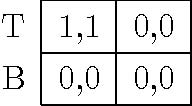

T 1,1 0,0 B 0,0 0,0 

although (T,L) is a dominant strategy equilibrium. 

 2. We do eliminate the strategies that are strictly dominated by mixed strategies (but not necessarily by pure strategies). For example, in the game in (8.1), we do eliminate M although neither T nor B dominates M. 

Notice that when there are only finitely many strategies, this elimination process must stop at some m, i.e., there will be no dominated strategy to eliminate after a round. 

Note that, for any m,a strategy si is in Sim if and only if it is rationally played by i in a situation in which (1) i is rational, (2) i knows that every player is rational, i knows that everybody knows that every body is rational, and . . . (m) i know that every body knows that . . . everybody knows that everybody is rational. That is, si is a best 

response to a belief μsome belief μ

1

1 

−i such that every sj in the support of μ−i 

1

is a best response to 

2

2 

−j such that every every sk in thesupportof μ−j 

2

is a best response to some 

are consistent with mth-order mutual knowledge of rationality. 

**Exercise 12** *Using Theorem 9, prove the claim in the previous paragraph*. 

3belief μ

Rationalizability corresponds to the limit of the iterative elimination of strictly-dominated strategies. 

**Definition 33 (Rationalizability)** For any player i, a strategy is said to be rationalizable if and only if si ∈ Si∞ where 

\ 

= .

Si∞ Sim m≥0 

Rationalizability corresponds to the set of strategies that are rationally played in situations in which it is common knowledge that everybody is rational, as defined at the beginning of the lecture. When a strategy si is rationalizable it can be justified/rationalized 

−k 

... up to order m. It is in that sense Sm is the set of strategy profiles that by an indefinite chain of beliefs μ−i as above. On the other hand, if a strategy is not rationalizable, it must have been eliminated at some stage m, and such a strategy cannot be rationalized by a chain of beliefs longer than m. 

We call the elimination process that keeps iteratively eliminating all strictly dominated strategies until there is no strictly dominated strategy Iterated Elimination of Strictly Dominated Strategies; we eliminate indefinitely if the process does not stop. We call a strategy rationalizable if and only if it survives iterated elimination of strictly dominated strategies. 

**Nash Equilibrium v. Rationalizability** Every Nash equilibrium is rationalizable, which can be shown as a straightforward exercise. Converse is not true. For example, in The Battle of The Sexes, (Opera, Ballet) is not a Nash equilibrium, but both Opera and Ballet are rationalizable strategies. Of course, these strategies correspond to some Nash equilibria, but one can easily construct a game in which some rationalizable strategies do not correspond to any Nash equilibrium. 

**Exercise 13** Show that if σ∗ (si) &gt;0 for some Nash equilibrium σ∗,then si ∈ Si∞.Find 

i agame (N,S,u1,...,un) and a strategy si ∈ Si∞ such that no Nash equilibrium assigns positive probability on si. 

**Example: (Beauty Contest)** Consider an n-player game in which each player i has strategies xi ∈ [0,100],and payoff 

µ¶2

2 x1 + xn 

ui (x1,...,xn)= − xi − ···. 

3 n 

Notice that, in this game, each player tries to play a strategy that is equal to two thirds of the average strategy, which is also affected by his own strategy. Each person is therefore interested guessing the other players’ average strategies, which depends on the other players’ estimate of the average strategy. Let’s apply our procedure to this game. 

First, since each strategy must be less than or equal to 100, the average cannot exceed 100, and hence any strategy xi &gt; 200/3 is strictly dominated by 200/3. Indeed, any strategy xi &gt;x1 is strictly dominated by x1 where[^8-2] 

2(n− 1) 

x 1 = 100. 3n− 2 To show that xi &gt;x1 is strictly dominated by x1,we fixany (x1,...,xi−1,xi+1,...xn) and show that 

1 

ui (x1,...,xi−1,xi,xi+1,...xn) &lt;ui ¡x1,...,xi−1,x ,xi+1,...xn ¢ . (8.2) 

By taking the derivative of ui with respect to xi,we obtain 

µ¶µ¶

∂ui 22 x1 + xn 

= −21 − xi − ···. 

∂xi 3n3 n 

Clearly, ∂ui/∂xi &lt;0 if 

µ¶

xi − 32 x1 + n ···xn &gt;0, 

whichwould be thecaseif 

2 X 

xi &gt;xj . (8.3) 3n− 2 j=i 

P 

But since each xj ≤ 100,the sum xj is less than or equal to (n− 1)100. Hence, it 

j=i

suffices that 

2 1 

xi &gt; (n− 1)100 = x. 3n− 2 Therefore, in the region xi &gt;x1 , ui is a strictly decreasing function of xi and (8.2) is satisfied. This shows that all the strategies xi &gt;x1 are eliminated in the first round. On the other hand, each xi ≤ x1 is a best response to some (x1,...,xi−1,xi+1,...xn) with 

2 X 

xi = xj . 3n− 2 j=i Therefore, at the end of the first round the set of surviving strategies is [0,x1]. Now, suppose that at the end of round m, the set of surviving strategies is [0,xm] 

mm

for some number x. By repeating the same analysis above with xinstead of 100, we can conclude that at the end of round m+1, the set of surviving strategies is [0,xm+1] where 

2(n− 1)

m+1 m 

x = x.

The solution to this equation with x0 =100 is 

∙ ¸

2(n − 1) m 

x m = 100. 3n − 2 

Therefore, for each m,at the endofround m,astrategy xi survives if and only if 

m 

0 ≤ xi ≤ ∙ 2(3nn −− 21)¸100. 

Since 

∙ ¸

2(n − 1) m 

lim 100=0, m→∞ 3n − 2 

the only rationalizable strategy is xi =0. 

m

Notice that the speed at which xgoes to zero determines how fast we eliminate the strategies. If the elimination is slow (e.g. when 2(n − 1) / (3n − 2) is large), then many strategies are eliminated at very high iterations. In that case, predictions based on rationalizability will heavily rely on strong assumptions about rationality, i.e., everybody knowsthateverybody knowsthat... everybodyisrational. Forexample, if n is small or the ratio 2/3 is replaced by a small number, the elimination is fast and the predictions of rationalizability are more reliable. If the n is large or the ratio 2/3 is replaced by a number close to 1, the elimination is slow and the predictions of rationalizability are less reliable. In particular, the predictions of rationalizability for this game is more robust in a small group than a larger group. 

A general problem with rationalizability is that there are usually too many rationalizable strategies; the elimination process usually stops too early. In that case a researcher cannot make much prediction based on such analysis. For example, in the Matching Pennies game 

1\2 Head Tail 

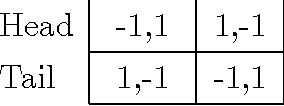

Head -1,1 1,-1 Tail 1,-1 -1,1 

every strategy is rationalizable, and we cannot say what the players will do. 

[^8-2]: Here x1 is just a real number, where superscript 1 indicates that we are in Round 1. 

##8.3 Applications 

###8.3.1 Cournot Competition 

Consider n firms. Each firm i produces qi ≥ 0units of a good at marginal cost c ≥ 0 and sell it at price 

P	=max{1− Q,0} (8.4) 

where 

Q=q1 +qn	(8.5) 

···

is the total supply. Each firm maximizes the expected profit. Hence, the payoff of firm i is 

πi =qi (P − c).	(8.6) 

Assuming all of the above is commonly known, we can write this as a game in normal form, by setting 

- N ={1,2,...,n} as the set of players 
- Si =[0,∞)as the strategy space of player i, where a typical strategy is the quantity qi produced by firm i,and 
- πi :S1 ×···×Sn → R as the payoff function. 

**Best Response** In our analysis, and in the rest of the course, it will be useful to know the best response of a firm i to the production levels of the other firms. Let us write 

X 

Q−i = qj (8.7) j=i

for the total supply of the firms other than firm i.If Q−i &gt;1, then the price P =0and the best firm i can do is to produce zero and obtain zero profit. Now assume Q−i ≤ 1. For any qi ∈ (0,1− Q−i), the profitofthe firm i is 

πi (qi,Q−i)=qi (1− qi − Q−i − c).	(8.8) 

(The profitisnegativeif qi &gt; 0.) By setting the derivative of πi with respect to qi to zero[^8-3], we obtain the best production level 

q B (Q−i)=1− Q−i − c. (8.9) 

i 

2 

The profit function is plotted in Figure 8.1. The best response function is plotted in Figure 8.2. 

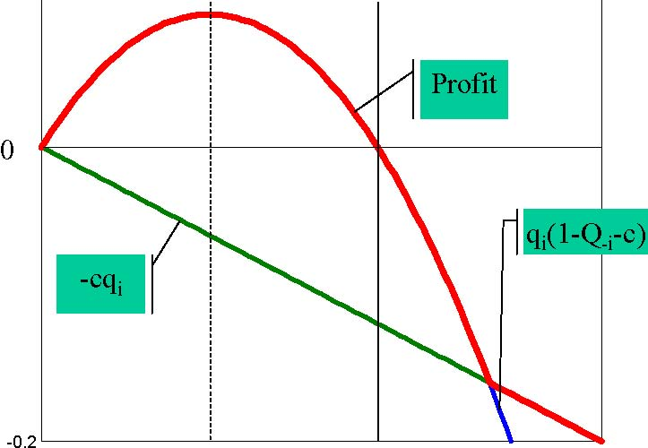

-0.2 0 -cqi qi(1-Q-i-c) Profit 

01

(1-Q-i-c)/2 1-Q-i-c 

Figure 8.1: 

**Cournot Duopoly** 

Now, consider the case of two firms. In that case, for i =j,wehave Q−i =qj.

**Nash Equilibrium** In order to have a Nash equilibrium, we must have 

q1 =q1 B (q2)≡ 1− q2 − c 

2 

[^8-3]: 3I.e. 

∂πi /∂qi =1− 2qi − Q−i − c =0. 

qi 

1− c 2 

qi=qiB(Q-i) 

Q-i 

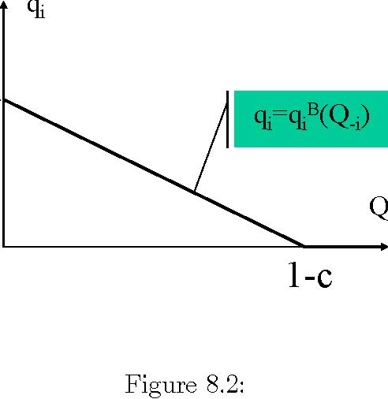

1-c Figure 8.2: 

and 

q2 = q2 B (q1) ≡ 1 − q1 − c. 

2 

Solving these two equations simultaneously, we obtain 

q1 ∗ = q2 ∗ =1 − c 

3 as the only Nash equilibrium. Graphically, as in Figure 8.3, we plot the best response functions of each firm and identify the intersections of the graphs of these functions as Nash equilibria. In this case, there is a unique intersection, and therefore there is a unique Nash equilibrium. 

**Rationalizability** The (linear) Cournot duopoly game we consider here is "dominance solvable" i.e. there is a unique rationalizable strategy. Let us first consider the first couple rounds of elimination to see this intuitively; we will then show mathematically that this is indeed the case. 

**Round 1** Notice that a strategy qˆi &gt;(1 − c) /2 is strictly dominated by (1 − c) /2. To see this, consider any qj.As in Figure 8.1, πi (qi,qj ) is strictly increasing until qi =(1 − c− qj) /2 and strictly decreasing thereafter. In particular, 

πi ((1 − c− qj ) /2,qj) ≥ πi ((1 − c) /2,qj ) &gt;πi (ˆqi,qj ) , 

showing that qˆi is strictly dominated by (1 − c) /2. We therefore eliminate all qˆi &gt; (1 − c) /2 for each player i. The resulting strategies are as follows, where the shaded 

q2 

q1=q1B(q2) 

q* 

1 − c 2 

q2=q2B(q1) 

q1 

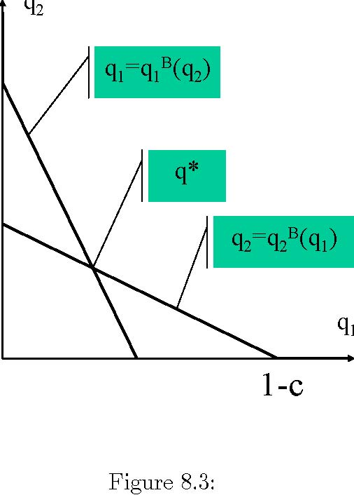

1-c Figure 8.3: 

area is eliminated: 

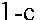

1-c1-c

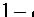

1 −1−

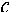

cc

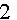

22

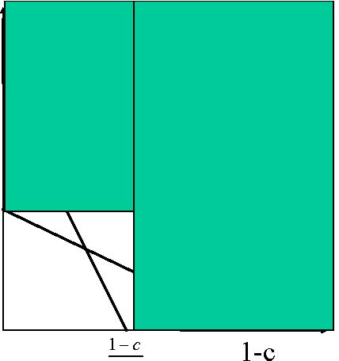

1-c1 −1c 1-cc−

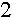

22

**Round 2** In the remaining game qj ≤ (1 − c) /2. Consequently, any strategy qˆi &lt; (1 − c) /4 is strictly dominated by (1 − c) /4. To see this, take any qj ≤ (1 − c) /2 and recall from Figure 8.1 that πi is strictly increasing until qi =(1 − c− qj) /2,which is greaterthanorequal to(1 − c) /4. Hence, 

πi (ˆqi,qj ) &lt;πi ((1 − c) /4,qj ) ≤ πi ((1 − c− qj ) /2,qj ) , 

showing that qˆi is strictly dominated by (1 − c)/4. We will therefore eliminate all qˆi with qˆi &lt;(1 − c)/4. The remaining strategies are as follows: 

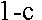

1-c1-c

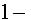

1 −1−

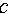

cc

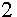

22

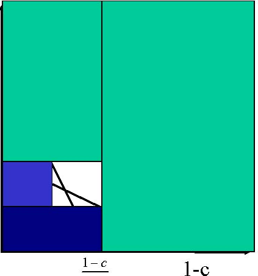

1-c1 − 1-c1cc−

22

Notice that the remaining game is a smaller replica of the original game. Applying the same procedure repeatedly we eliminate all strategies except for the Nash equilibrium. (After every two rounds, we obtain a smaller replica.) Therefore, the only rationalizable strategy is the unique Nash equilibrium strategy: 

q∗ =(1 − c)/3.

i 

**A more formal treatment** We can prove this more formally by invoking the following lemma repeatedly: 

**Lemma 2** Given that qj ≤ q¯, every strategy qˆi with qˆi &lt;qiB (¯q) is strictly dominated by qiB (¯q) ≡ (1 − q¯− c)/2. Given that qj ≥ q¯,every strategy qˆi with qˆi &gt;qiB (¯q) is strictly dominated by qiB (¯q) ≡ (1 − q¯− c)/2. 

**Proof**. Let’s first prove the first statement. Take any qj q¯.Note that πi (qi;qj) is

≤ 

strictly increasing in qi at any qi &lt;qiB (qj).Since qˆi &lt;qiB (¯q) ≤ qiB (qj )[^8-4], this implies that 

¡¢ 

πi (ˆqi,qj ) &lt;πi qiB (¯q),qj . 

That is, qˆi is strictly dominated by qiB (¯q). To prove the second statement, take any qj q¯.Note that πi (qi;qj) is strictly

≤ 

decreasing in qi at any qi &gt;qiB (qj).Since qiB (qj) ≤ qiB (¯q) &lt;qˆi,thisimpliesthat 

πi (ˆqi,qj ) &lt;πi ¡qiB (¯q),qj ¢ . 

[^8-4]:This is because qiB is decreasing. 

That is, qˆi is strictly dominated by qiB (¯q). Now, define a sequence q0,q1,q2 ,... by q0 =0and 

q m =q B ¡q m−1 ¢¡m−1 ¢ /2=(1− c)/2− q m−1/2

i ≡ 1− q − c for all m&gt;0.That is, 

<Table>
<TR>
<TH>q 0 </TH>
<TH>=0 </TH>
</TR>
<TR>
<TD>q 1 </TD>
<TD>= </TD>
<TD>1− c 2 </TD>
</TR>
<TR>
<TD>q 2 </TD>
<TD>= </TD>
<TD>1− c 2 </TD>
<TD>− 1− c 4 </TD>
</TR>
<TR>
<TD>q 3 </TD>
<TD>= </TD>
<TD>1− c 2 </TD>
<TD>− 1− c 4 </TD>
<TD>+ 1− c 8 </TD>
</TR>
<TR>

<TD>... </TD>

</TR>
</Table>

m 1− c 1− c 1− c m 1− c 

q =+ 

m

2 − 48 − ···− (−1)2

... 

**Theorem 10** The set of remaining strategies after any odd round m (m =1,3,...)is [qm−1,qm]. The set of remaining strategies after any even round m (m =2,4,...)is 

m

[q,qm−1].The set of rationalizable strategies is {(1− c)/3}. 

**Proof**. We use mathematical induction on m.For m =1, wehavealready proven the statement. Assume that the statement is true for some odd m.Then, for any qj available m

at even round m+1,we have qm−1 ≤ qj ≤ q. Hence, by Lemma 2, any qˆi &lt;qiB (qm)= qm+1 is strictly dominated by qm+1 and eliminated. That is, if qi survives round m+1, then qm+1 ≤ qi ≤ qm . On the other hand, every qi ∈ [qm+1,qm]= £ qB (qm),qB (qm−1)¤

ii is a best response to some qj with qm−1 ≤ qj ≤ qm, and it is not eliminated. Therefore, the set of strategies that survive the even round m+1is [qm+1,qm]. Now, assume that the statement is true for some even m. Then, for any qj available m

at odd round m+1,we have q≤ qj ≤ qm−1 . Hence, by Lemma 2, any qˆi &gt;qiB (qm)= qm+1 is strictly dominated by qm+1 and eliminated. Moreover, every qi ∈ [qm,qm+1]=

£¤

qiB (qm−1),qiB (qm)is a best response to some qj with qm ≤ qj ≤ qm−1,and it is not eliminated. Therefore, the set of strategies that survive the odd round m+1is [qm,qm+1]. Finally, notice that 

lim q m =(1− c)/3. m→∞ 

Therefore the intersections of the above intervals is {(1 − c) /3}, which is the set of rationalizable strategies. 

**Cournot Oligopoly** 

We will now consider the case of three or more firms. When there are three or more firms, rationalizability does not help, i.e., we cannot eliminate any strategy less than the monopoly production q1 =(1 − c) /2. 

In the first round we eliminate any strategy qi &gt;(1 − c) /2, using the same argument in the case of duopoly. But in the second round, the maximum possible total supply by the other firms is 

(n− 1)(1 − c) /2 ≥ 1 − c, 

where n is the number of firms. The best response to this aggregate supply level is 0. Hence, we cannot eliminate any strategy in round 2. The elimination process stops, yielding [0,(1 − c) /2] as the set of rationalizable strategies. 

Of course, Cournot oligopoly has a unique Nash equilibrium as in the Cournot duopoly. While the Nash equilibrium remains to make strong predictions as we introduce new firms, the predictions of rationalizability become rather weak. (In equilibrium analysis the weak predictions of rationalizability reappears as instability of equilibrium, making equilibrium behavior highly sensitive to the specification of beliefs.) 

###8.3.2 Bertrand Competition 

Consider two firms. Simultaneously, each firm isets a price pi.The firm iwith the lower price pi &lt;pj sells 1 − pi units and the other firm cannot sell any. If the firms set the same price, the demand is divided between them equally. That is, the amount of sales for firm i is 

1 − pi if pi &lt;pj Qi (p1,p2)= 1−pi if pi = pj

2 

0 otherwise. 

⎧ 

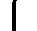

⎪⎪

⎨ 

⎪⎪

⎩

We assume that it costs noting to produce the good (i.e. c =0). Therefore, the profit 

of a firm i is 

πi (p1,p2)=piQi (p1,p2)= 

⎧ 

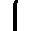

⎪⎪

⎨ 

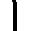

⎪⎪

⎩

(1− pi)pi if pi &lt;pj 

(1−pi)pi if pi2

=pj 

0 otherwise. 

Assuming all of the above is commonly known, we can write this formally as a game in normal form by setting 

- N ={1,2} as the set of players 
- Si =[0,∞)as the set of strategies for each i,with price pi atypical strategy, 
- πi as the utility function. 

Observethatwhen pj =0, πi (p1,p2)=0for every pi, and hence every pi is a best response to pj =0. This has two important implications: 

1. Every strategy is rationalizable (we cannot eliminate any strategy because each of them is a best reply to zero). 
2. p∗ 1 =p∗ 2 =0is a Nash equilibrium. 

In the rest of the notes, we will first show that this is indeed the only Nash equilibrium. In other words, even with two firms, when the firms compete by setting prices, the competitive equilibrium will emerge. We will then show that if we modify the game slightly by discretizing the set of allowable prices and putting a minimum price, then the game becomes dominance-solvable, i.e., only one strategy remains rationalizable. In the modified game, the minimum price is the only rationalizable strategy, as in competitive equilibrium. Finally we will introduce small search costs on the part of consumers, who are not modeled as players, we will see the equilibrium behavior is dramatically different from the equilibrium behavior in the original game and competitive equilibrium. 

**Nash Equilibrium** 

**Theorem 11** TheonlyNashequilibriumisp∗ =(0,0). 

**Proof**. We have seen that p∗ =(0,0) is a Nash equilibrium. We will show that if (p1,p2)is a Nash equilibrium, then p1 =p2 =0. To do this, take any Nash equilibrium (p1,p2).We first show that p1 =p2. Towards a contradiction, suppose that pi &gt;pj .If pj =0,then πj (pi,pj )=0,while πj (pi,pi)=(1− pi)pi/2&gt; 0. That is, choosing pi is aprofitable deviation for firm j,showing that pi &gt;pj =0is not a Nash equilibrium. Therefore, in order pi &gt;pj to be an equilibrium, we must have pj &gt;0.But then, firm i has a profitable deviation: πi (pi,pj )=0while πi (pj,pij )=(1− pj )pj /2&gt;0. All in all, this showsthatwecannothave pi &gt;pj in equilibrium. Therefore, we must have p1 =p2. But if p1 =p2 in a Nash equilibrium, then it must be that p1 =p2 =0. This is because if p1 =p2 &gt;0,then firm 1 would have a profitable deviation: π1 (p1,p2)=(1− p1)p1/2 while π1 (p1 − ε,p2)=(1− p1 +ε)(p1 − ε),which is close to (1− p1)p1 when ε is close to zero. 

**Rationalizability with discrete prices** 

Now suppose that the firms have to set prices as multiples of pennies, and they cannot charge zero price. That is, the set of allowable prices is 

P ={0.01,0.02,0.03,...} . 

The important assumption here is that the minimum allowable price pmin =0.01yields a positive profit. We will now see that the game is "dominance-solvable" under this assumption. In particular pmin is the only rationalizable strategy, and it is the only Nash equilibrium strategy. Let us start with the first step. 

mon

**Step 1**: any price p greater than the monopoly price p=0.5is strictly dominated by some strategy that assigns some probability &gt; 0 to the price pmin =0.01 and 

mon

probability 1−  to the price p=0.5. 

mon

**Proof**. Take any player i and any price pi &gt;p. We want to show that the mixed strategy σ with σ (pmon)=1− and σ ¡pmin ¢ =strictly dominates pi for some &gt;0. 

mon

Take any strategy pj &gt;pof the other player j.We have 

πi (pi,pj )≤ piQ(pi)=pi (1− pi)≤ 0.510.49=0.2499,

· 

where the firstinequalityisbydefinition and the last inequality is due to the fact that 

pi ≥ 0.51. On the other hand, πi (σ ,pj )=(1 − ) p mon (1 − p mon)+ p min ¡1 − p min ¢ &gt; (1 − ) p mon (1 − p mon) =0.25(1 − ) . Thus, πi (σ,pj) &gt;0.2499 ≥ πi (pi,pj) whenever 0 &lt;≤ 0.0004.Choose =0.0004. Now, pick any pj ≤ pmon.Since pi &gt;pmon,wenow have πi (pi,pj)=0.But mon (1 − p mon)+ p min ¡min ¢ min ¡

min ¢ 

πi (σ ,pj )= (1 − ) p 1 − p ≥ p 1 − p&gt;0. That is, πi (σ,pj) &gt;πi (pi,pj). Therefore, σ strictly dominates pi. Step 1 yields the eliminations in the first round 1. 

mon

**Round 1** By Step 1, all strategies pi with pi &gt;p=0.5 are eliminated. Moreover, 

mon

each pi ≤ pis a best reply to pj = pi +1, and is not eliminated. Therefore, the set of remaining strategies is 

P2 = {0.01,0.02,...,0.5} . 

**Round** m Suppose that the set of remaining strategies to round m is 

Pm = {0.01,0.02,...,p¯} . 

Then, the strategy p¯is strictly dominated by a mixed strictly dominated by the mixed strategy σ with σ (¯p− 0.01) = 1 −  and σ ¡pmin ¢ = , as we will see momentarily. We then eliminate the strategy p¯. There will be no more elimination because each pi &lt;p¯is a best reply to pj = pi +0.01. 

To prove that p¯is strictly dominated by σ, note that the profitfrom p¯for player i is 

( 

p¯(1 − p¯) /2 if pj =¯p,

πi (¯p,pj)= 

0 otherwise. On the other hand, 

πi ¡σp ¯,p¯¢	=(1 − )(¯p− 0.01)(1 − p¯+0.01) + p min ¡1 − p min ¢ &gt; (1 − )(¯p− 0.01)(1 − p¯+0.01) =(1 − )[¯p(1 − p¯) − 0.01(1 − 2¯p)] . 

Then, πi (σ ,p¯) &gt;πi (¯p,pj) whenever 

p¯(1 − p¯) /2 . ≤ 1 − p¯(1 − p¯) − 0.01(1 − 2¯p) 

But p¯≥ 0.02, hence 0.01(1 − 2¯p) &lt;p¯(1 − p¯) /2, thus the right hand side is greater than 

0. Choose 

 =1 − p¯(1 − p¯) /2 &gt; 0 p¯(1 − p¯) − 0.01(1 − 2¯p) so that πi ¡σp¯,p¯¢ &gt;πi (¯p,pj).Moreover, for any pj &lt;p¯, 

min min

πi ¡σp¯,pj ¢ =(1 − )(¯p − 0.01)(1 − p¯+0.01) + p ¡1 − p ¢ 

p min ¡1 − p min ¢ &gt; 0= πi (¯p,pj) ,

≥ 

showing that σp¯strictly dominates p¯, and completing the proof. 

©ª 

Therefore, the process continues until the set of remaining strategies is pmin and it stops there. Therefore, pmin is the only rationalizable strategy. 

Since players can put positive probability only on rationalizable strategies in a Nash equilibrium, the only possible Nash equilibrium is ¡pmin,pmin ¢ , which is clearly a Nash equilibrium. 

MIT OpenCourseWare

http://ocw.mit.edu 

14.123

 Microeconomic Theory 

III

Spring 

2010

For information about citing these materials or our Terms of Use, visit: 

http://ocw.mit.edu/terms

. 
