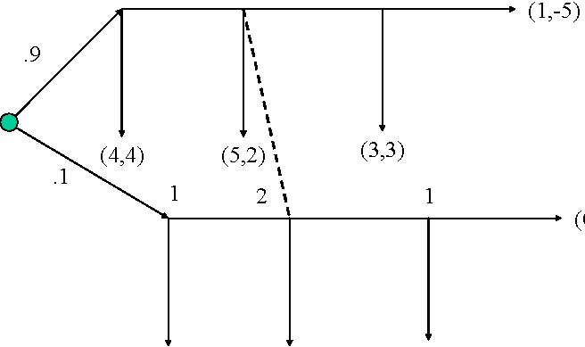
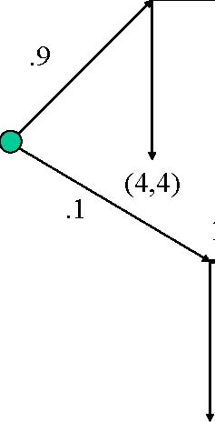
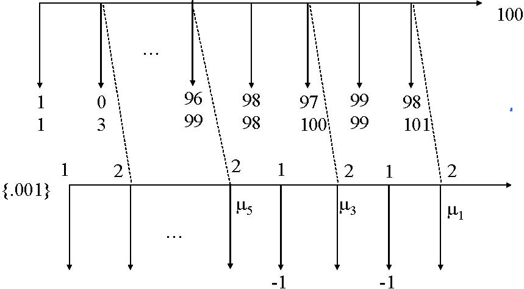
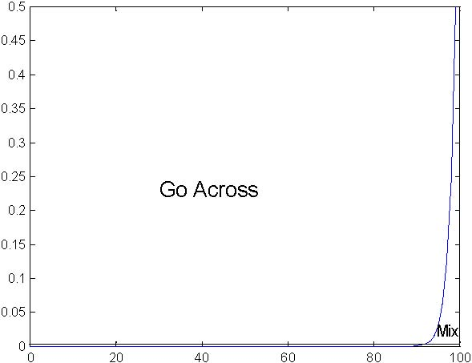

# Chapter 10 

#Reputation Formation 

In a complete information game, it is assumed that the players know exactly what other players’ payoffs are. In real life this assumption almost never holds. What would happen in equilibrium if a player has a small amount of doubt about the other player’s payoffs? It turns out that in dynamic games such small changes may have profound effects on the equilibrium behavior. In particular, when the game is long and players are patient, the players’ concern regarding forming a reputation for having an advantageous payoff function overwhelms all the other concerns, altering equilibrium behavior dramatically. Kreps and Wilson (1982) and Milgrom and Roberts (1982) have illustrated this on examples, such as centipede game and chain-store paradox. The analysis is extended later to more general repeated games, most notably by Fudenberg and Levine. In this lecture, I will illustrate the basic idea on the centipede game. I will start with a simple example, which also illustrates how one computes a mixed-strategy sequential equilibrium. 

##10.1 A Simple Example 

Consider the game in Figure 10.1. In this game, Player 2 does not know the payoffsof Player 1. She thinks at the beginning that his payoffsare as in theupper branch with high probability 0.9, but she also assigns the small probability of 0.1 to the possibility that he is averse to play down, exiting the game. The first type of player 1 is called "normal" type, and the second type of player 1 is called the "crazy" type. If it were common knowledge that player 1 is "normal", then backwards induction would yield the 

12 1112121

(1,-5)(1,-5)(1,-5)

.9.9

(4,4) (5,2) (3,3)(4(4,4)(5,2)(3,3),4)(5,2)(3,3)

.1.1

121121

(0,-5)(0,-5)

(-1,4) (0,2) (-1,3)(-1,4)(0,2)(-1,3)

Figure 10.1: 

following: player 1 goes down in the last decision node; player 2 goes across, and player 1 goes downinthe first node. 

What happens in the incomplete information game, in which the above common knowledge assumption is relaxed? By sequential rationality, the "crazy" type (in the lower branch) always goes across. In the last decision node, the normal type again goes down. Can it be the case that the normal type goes down in his first decision node, as in the complete information case? It turns out that the answer is No. If in a sequential equilibrium "normal" type goes down in the first decision node, in her information set, player 2 must assign probability 1 to the crazy type. (By Bayes rule, Pr(crazy|across)=0.1/ (0.1+(.9)(0)) = 1. This is required for consistency.) Given this belief and the actions that we have already determined, she gets -5 from going across and 2 from going down, and she must go down for sequential rationality. But then "normal" type should go across as a best reply, which contradicts the assumption that he goes down. 

Similarly, one can also show that there is no sequential equilibrium in which the normal type goes across with probability 1. If that were the case, then by consistency, player 2 would assign 0.9 to normal type in her information set. Her best response would be to go across for sure, and in that case the normal type would prefer to go down in the first node. 

In any sequential equilibrium, normal type must mix in his first decision node. Write α =Pr(across|normal)and β for the probability of going across for player 2. Write also μ for the probability player 2 assigns to the upper node (the normal type) in her information set. Since normal type mixes (i.e. 0 &lt;α&lt; 1), he is indifferent. Across yields 

3β +5(1− β) while down yields 4. Therefore, it must be that 3β +5(1− β)=4, i.e. 

β =1/2. 

Since 0&lt;β&lt; 1, player 2 must be indifferent between going down, which yields 2 for sure, and going across, which yields the expected payoff of 

3μ +(−5)(1− μ)=8μ − 5. 

That is, 8μ − 5=2,and μ =7/8. 

But this belief must be consistent: 

70.9α 

=μ = . 

80.9α +.1 

Therefore, 

α =7/9. 

This completes the computation of the unique sequential equilibrium, which is depicted in Figure 10.2. 

**Exercise 15** Check that the pair of mixed strategy profile and the belief assessment is indeed a sequential equilibrium. 

Notice that in sequential equilibrium, after observing that player 1 goes across, player 2 increases her probability for player 1 being a crazy type who will go across all the way, from 0.1to0.125. If she assigned 0probabilitytothat typeat the beginning, shewould not change her beliefs after she observes that he goes across. In the latter case, player 1 could never convince her that he will go across (no matter how many times he goes across), and he would not try. When that probability is positive (no matter how small it is), she increases her probability of him being crazy after she sees him going across, and player 1 would try going across with some probability even he is not crazy. 

106 

1 α=7/9 2 β=1/2 1 

(1,-5) 

.9 

μ=7/8 

(4,4) (5,2) (3,3) 

.1 

12 1 

(0,-5) 

(-1,4) (0,2) (-1,3) 

Figure 10.2: 

… 100 100 98 101 99 99 97 100 98 98 1 1 0 3 2 2 1 2 1 1 2 1 2 …1001009810199999710098981103221211212

Figure 10.3: Centipede Game 

**Exercise 16** In the above game,compute the sequential equilibrium for any initial probability π ∈ (0, 1) of crazy type (in the figure π =0.1). 

##10.2 Reputation in Centipede Game 

Consider the perfect-information game depicted in Figure 10.3. In this game, there are two players in a relationship. The players alternatingly get an opportunity to end the relationship and get extra payoff in the expense of the other player. Staying in the relationship is beneficial for each player, so that a player would like to remain in the relationship if she knows that the other player will stay in the relationship in the following period. If the other player breaks up in the next period, however, she would lose from staying in for another period. In particular, she loses 1 unit if the other player breaks up in the next period and gains 1 unit if the other players remains in the relationship and shebreaksuptwo periodslater. Asitisseeninthe figure, players’ payoffs accumulate to large numbers if they stay in the game for a long while. 

Unfortunately, however, backwards induction leads to a unique outcome: player 1 breaks up in the first period, yielding a low payoff of 1toeachplayer. In theverylast period, player 2 goes down. Knowing this, in the period before the last period, player 1 goes down, in order to avoid a unit loss from player 2’s breaking up in the next period. Knowing this, in the previous period, player 2 goes down, and so on. 

**Exercise 17** Show that there is a unique Nash equilibrium outcome in the centipede game above. 

Despite the simplicity of the argument, the backwards induction outcome is paradoxical for many. There is a feeling that one should try and see whether the other player stay in the game given the high payoffs later in the game. Kreps and Wilson have shown that the argument is indeed very fragile with respect to incomplete information. They introduce a small amount of information in such a way that in the resulting incomplete-information game there is a unique sequential equilibrium, and in that equilibrium the players remain in the game until near the end of the game and start mixing thereafter. 

I will present their analysis in great detail. Beforehand, I want to emphasize that the backwards induction argument heavily relies on the assumption that the payoffsand the rationality of the players is mutually known at high orders, i.e., everybody knows that the payoffsare as in the figure, everybody knows that everybody knows that the payoffs are as in the figure . . . up to very high orders. In the last period, Player 2 goes down by his rationality alone. In the previous period, Player 1 goes down not only because his payoffsare as in the figure but also because he knows that Player 2 is rational and her payoffsare as in the figure. In two periods before the end, Player 2 goes down because she is rational and her payoffsare as in the figure and she knows that player 1 is rational with the payoffsin the figure and will remain to know that Player 2 is rational and has the payoff in the figure. Likewise, Player 1 goes down in the firstperiodbecauseheis rational knows that Player 2 is rational and that Player 2 will remain to believe that 

{.999} 197 5 432 1= n 1 2 2 1212 100 

… 100 98 101 99 99 97 100 98 98 1 1 0 3 96 99 … -1-1 1 2 2 1 2 1 2 {.001} μ1μ3μ5 

98 99 

Figure 10.4: Centipede Game with Doubt 

Player 1 is rational and that ... up to 198 iterations. When the higher-order beliefs are not as in the model, players’ behavior will not look like the one prescribed by the backwards induction applied to the model. 

Kreps and Wilson consider the incomplete-information game in Figure 10.4. Now, Player 2 is not certain that Player 1’s payoffs are as in the centipede game. She does assign very high probability on the event that Player 1’s payoffs are as in the centipede game. She thinks, however, that with the small probability of 0.001, Player 2 may be averse to exiting the relationship. This situation is modeled by using two types for Player 2. With probability 0.999, Player 1 is of "normal" type, with payoffsasinthe original centipede game, and with probability 0.001, he is of "crazy" type who gets -1 from exiting and 0 from not exiting. 

Although the latter probability is small, when she observes that Player 1 remains in the game, Player 2 may update her belief and assign a higher probability to the crazy type. In particular, if she expects that the normal type plays as in the original centipede game, then after observing that Player 1 remains in the game, she becomes convinced that Player 1 is of crazy type (assigning probability 1 on the crazy type). In that case, her best response would be to remain in the game until the very end. Of course, if this were the equilibrium strategy, then the normal type of the player 1 would remain until his last decision node, leading to a contradiction. That is, the normal type must go across with positive probability in the first period. Indeed, as I mentioned before, in sequential equilibrium he goes across all the way to his last decision node with positive probability. 

To compute the sequential equilibrium, denote the nodes with respect to how far they are from the end of the game, by writing n=1for the last period (where Player 2 moves), n=2for the period before the last period (where Player 1 moves), and so on, as in the figure. I will develop the argument as small steps, which are stated as lemmas. The first observation is that the crazy type must go across with probability 1 at all of his information sets: 

**Lemma 3** *In any sequential equilibrium, the crazy type plays across with probability 1 at every information set Player 1 moves*. 

Indeed, at any information set, the crazy type gets 0 from exiting and 1 from never exiting, and hence by sequential rationality of the "crazy" type at the node, he must go across with probability 1. This further implies that Player 2 never exits for sure before the last period: 

**Lemma 4** In any sequential equilibrium, Player 2 plays across with positive probability at every information set of her with n&gt;1. 

**Proof**. Suppose that the lemma is false and let ˆthe 

n&gt; 1 be the largest node (i.e. earliest period) at which Player 2 goes down with probability 1. Then, by sequential rationality, in the previous period (i.e. at nˆ+1), thenormal typemustgodownwith probability 1. This is because going down yields 1 unit more payoff than going across and letting Player 2goesdown. Butnotethatthe informationset nˆof Player 2 is reached with positive probability as both Player 2 and the crazy type of player 1 go across until information set nˆ. Hence, by consistency, Player 2 must assign probability 1onthe crazytypeat nˆ. In that case, by sequential rationality of Player 2 at node nˆ, she must go across with probability 1, a contradiction. 

Lemmas 3 and 4 immediately imply that all of Player 2’s information sets are reached: 

**Lemma 5** *In any sequential equilibrium, every information set of Player 2 is reached with positive probability*. 

By the argument in the proof of Lemma 4, this implies that the normal type of Player 1 also plays across with positive probability: 

**Lemma 6** *In any sequential equilibrium, the normal type Player 1 plays across with positive probability at every information set with n&gt;2*. 

**Proof**. If the normal type plays down with probability 1 at n,then at n− 1,which is reached with positive probability by Lemma 5, Player 2 assigns probability 1 to crazy type. If n− 1&gt;1, she then goes across at n− 1 with probability 1. In that case, the normal type of player 1 plays across with probability 1 at n. 

We have so far seen that, in any sequential equilibrium, all types of all players go across until their last information set with positive probability. This contrasts to the equilibrium in the complete-information game, in which each player exits in the first possible opportunity. The above arguments further implies that once the players start mixing as opposed to going across for sure, they keep mixing until the end: 

**Lemma 7** In any sequential equilibrium, if Player 2 goes across with probability 1 at her information set n,then 

1. the normal type of Player 1 goes across with probability 1 at n+1,and 
2. Player 2goesacrosswithprobability 1at n+2. 

**Proof**. Part 1: Given that Player 2 goes across with probability 1 at n,at n+1,the normal type of Player 1 has the option of going across and exiting at n− 1.This move yields 1 units of payoffs more than exiting at n+1. Hence, by sequential rationality, he goes across with probability 1. 

Part 2: By part 1, at n+2, player 2 is certain that player 1 will go across with probability 1 at n+1(regardless of his type). Hence, as in the proof of Part 1, she goes across with probability 1. 

Since all types go across with positive probability until the end (by Lemmas 3, 4, and 6), iterative application of Lemma 7 yields the following cutoff strategies. 

**Lemma 8** *In any sequential equilibrium, there exists n∗ such that* 

1. at any of his information sets n, the normal type of Player 1 goes across with probability 1 when n&gt;n∗ and mixes between the two actions with positive probabilities when 2&lt;n≤ n∗; 
2. at any of her information sets n, Player 2 goes across with probability 1 when n&gt; n∗ and mixes between the two actions with positive probabilities when 1&lt;n≤ n∗, and 
3. Player 2 assigns probability 0.001 to the crazy type at each n≥ n∗. 

It therefore suffices to find mixing probabilities and the cutoff n∗. To that end, write μn for the probability Player 2 assigns to the crazy type at her information set n, pn for the probability that the normal type of player 1 goes down at his information set n, and qn for the probability that Player 2 goes down at her information set n.At n=1, player 2 goes down with probability 1 (i.e. q1 =1), and at n=2, the normal type of player 1 goes down for sure (i.e. p2 =1), and hence μ1 =1. 

Note that n∗ &gt;3. Thisisbecause if n∗ ≤ 3, then Player assigns probability 0.001 to the crazy type at n =3 (by Lemma 8), in which case she must go down at n = 3, contradicting Lemma 4. Hence, by Lemma 8 she mixes at n =3.By sequential rationality, sheisindifferent between going across, which yields μ3101+(1− μ3)99,and going down, which yields 100. Therefore, 

μ3 =1/2. (10.1) 

Now take any nin between 3 and n∗ at which Player 2 moves. Let xbe her payoff from exiting at n.At n− 2, she is indifferent between exiting, which yields x+2,and continuing. Hence, her expected payoff at n− 2is x+2.If Player 1 exits at n− 1,she gets x− 1. Since sheisindifferent, it must be that 

(x− 1)(1− μ)pn−1 +(x+1)(1− (1− μ)pn−1)=x,

nn

and hence the total probability of exit at n− 1is 

(1− μn)pn−1 =1/2. (10.2) 

Thus, by Bayes’ rule, μn = μn−2/2. (10.3) 

Together with (10.1), (10.2) and (10.3) yield the beliefs and the mixing probabilities throughout. In particular, 

μ5 =1/4 μ7 =1/8 μ9 =1/16 

μ11 =1/32 μ13 =1/64 μ15 =1/128 μ17 =1/256 μ19 =1/512. 

Thevaluesof p4,p6,...,p18 are computed from these values using pn−1 =1/(2(1 − μ)).

n

Note that μ19/2 &lt;0.001, which is the prior belief for crazy type. Since staying in the game does not decrease the probability of the crazy type, μ21 &gt;μ19/2. Hence, Player 2 does not mix at n=21. Then, by Lemma 8, n∗ ≤ 21,and μ21 =0.001. Therefore, 

11 

p20 == . 

2(1 − μ21) 20.999

· 

Note that since μ21 &gt;μ19/2, i.e.,the normal type of player 1 exits with a probability less than that makes Player 2 indifferent at n=19, it also follows that Player 2 goes across with probability 1 at n=21,i.e., n∗ =21. 

Note that at information sets n =198,...,20, both normal type and the crazy type go across with probability 1, and hence the probability of crazy type remains constant at 0.001 as seen in Figure 10.5. Hence, player 1 does not form a reputation for being crazy by staying in the game in that time interval. This is because even the normal type remains in the game given the long future in the relationship. In that interval, both players remain in the relationship by safely assuming that the other will do so "rationally". To sum up, it is because of the reputational concerns the players remain in the game at the beginning, not in an attempt to form a reputation. They will start forming a reputation if they remain in the game after n∗, in which case the normal 

0 20 40 60 80 100 0 0.05 0.1 0.15 0.2 0.25 0.3 0.35 0.4 0.45 0.5 Go Across Mix 

Figure 10.5: The probability of crazy type after choosing to stay in the relationship t times. 

players exit with positive probability. In the interval after n∗, the probability of crazy type rises exponentially and takes the value of 1/2 at the end of the game. 

MIT OpenCourseWare

http://ocw.mit.edu 

14.123

 Microeconomic Theory 

III

Spring 

2010

For information about citing these materials or our Terms of Use, visit: 

http://ocw.mit.edu/terms

. 
