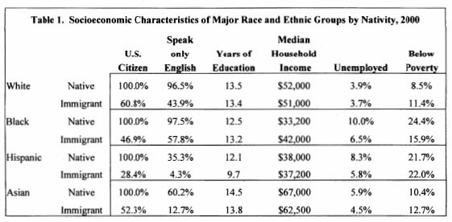
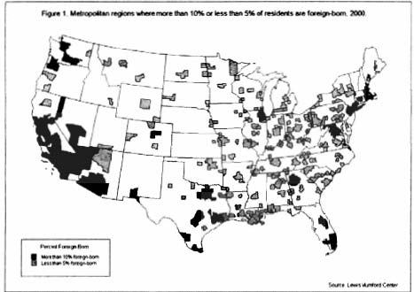

# Where immigrants are settling in the U.S. and why? 

Session 4 Lecture Notes: 

J. Phillip Thompson 

Data on Immigration: 

## I. John Logan piece: “America’s Newcomers” 

###  Income/Employment 

1. Chart shows that legal black immigrants are earning higher incomes than African Americans.  

    1. These numbers would change if you included undocumented immigrants.  

    1. Amongst legal immigrants coming from the Caribbean and Africa, many of them are better educated than African Americans; many are the upper-crust from Caribbean and African countries in many cases far surpassing African Americans. This impacts the political dynamics of race in the United States.  

2. In their countries of origin, many minority immigrants have access to more opportunities (financial, educational, etc.) than they would have in the U.S., and many of them are able to secure better jobs in the United States than native-born members of their ethnicities. 

    1. Immigrants were doing better in the building trades than native African Americans, Hispanics, etc. because they had experience managing large-scale projects. Southern blacks likewise gained invaluable experience due to segregation. 

    1. Is the assimilation model good for immigrants? Is segregation something that immigrants need because of discrimination in business and industry? 

    1. Unemployment rates are lower for immigrants than natives in almost every category, and most significantly amongst blacks and least significantly among whites.  

###  Language/Race 

1. 97% of native whites and blacks speak only English 

2. If 57.8% of black immigrants speak English only, what languages do the other 42.2% speak? 

    1. French 

    1. Portugese? 

    1. Spanish? 

        1. How do people categorize themselves?    
        1. Many Hispanics, Brazilians might be considered black, but don’t consider themselves so.
		
        1. What does it mean to be black? 

###  Racial/Ethnic Categories  

1. These categories often do not make much sense, and therefore whether or not they are meaningful is up for debate.  

    1. Hispanic: people falling into this category might have no ties except for language 

    2. Asian-American: this category lumps together a very old, established Japanese-American community with new Philippinos, with whom they would have little or no ties. 

2. Up until the 1960s when social goods were tied to racial categories, “colored” was defined very broadly: the NAACP, “Colored” was intentionally conceived to include colored peoples globally (Japanese, Chinese, Indian, Hispanic, etc.). The expansion of the American corporate system across the globe would unite all non-white peoples under the ramifications of that system (undemocratic, exploitative, etc. conditions) 

    1. After civil rights movement successes, lawyers defined what “black” meant so that the privileges wouldn’t be expanded to all non-white peoples in the United States. 

    1. Black community began to develop an increasingly narrow definition of what it means to be black 

    1. Recent book: Black is a Country: Race and the Unfinished Struggle for Democracy by Nikhil Pal Singh (ISBN 067401300X), traces Civil Rights movement in America to global political movements against colonialism. 

3. Whiteness 

    1. Up until the early 1800s it did not exist; there was only “Anglo-Saxon.” Irish were not white; Slavs were not white; southern Europeans (Mediterranean) were not white; etc. 

    1. Jefferson vs. Hamilton: race and economics 
        1. As immigration waves increased the presence of non-Anglo Europeans in the US, Jefferson recognizes that if they join the industrial faction, then the rural faction would be weakened.   

        1. Jefferson unites European immigrants in the north and Southern plantation owners by offering the idea of Western Movement, thus isolating the northern industrialists. 

            1. The connection is the construction of a “white” race that is neither black nor Native American).  

            1. Encourages immigrants to go west into what was then the Native American territories.  

            1. The “white suffrage movement” came out of this. It was a movement that fought for voting rights for all white men. That is the origin of democracy in America. 

4. Assimilation 

    1. In the 1950s, when the idea of “assimilation” was first constructed, it was thought that there were three stages: 

        1. Living in resident enclaves, multi-lingual, retaining ethnic identity 

        1. Gaining political positions, becoming more active 

        1. Inter-marriage; losing ties to ethnic identity 

    2. At that time, Puerto Ricans and blacks were considered to be in the first stage. For them, the third stage never came; recent immigrant trends have thrown doubt on the assimilation theory (also Southern Italian patterns). 

        1. A racial divide exists in America, and generational studies are looking at where second generation immigrants place themselves. Are people forming their own distinct identity that is neither black nor white? 

###  Mainstream 

1. What is the mainstream in the United States? Is there only one mainstream? 

2. The map below from Logan’s article shows the population distribution of immigrants in the United States. 

    1. Dark areas are about 50% of the population. The mainstream is defined by those living in the lighter areas for the most part.  

    1. The notion that there is a common “mainstream” is a very American idea. It is linked to the idea of “majority rule” etc. The idea of “mainstream” is socially constructed. Not all Americans buy into this idea: 

    1. 25% of white Americans, 80% of African Americans don’t believe the American system works. 

    1. This story is a-institutional, a-historical 

    1. Assumes that institutions you work for are fully functional and will give a just reward… 

    1. Assumes a good economy, equally distributed opportunity, a fair government in perpetuity 

    1. It is a product of the 1950s and Keynesianism.  

3. Studies have shown that 1st generation immigrants come with those beliefs, but already by the 2nd generation, Caribbean immigrants don’t believe it at all and become “black,” (politically more than ethnically) 

4. “Mainstream” is a politically loaded term, and it is important to know who controls what the mainstream is. 

## Audrey Singer article: “The Rise of New Immigrant Gateways”: 

-  Most immigrants are moving to major metropolitan areas 

    1. Immigrants go to cities with growing economies; they do not go to dying cities. Some older, industrial cities that used to attract immigrants are still doing so. 

-  Many of the cities are new and booming, but even older cities that continue to attract immigrants are in fiscal difficulty, because many of the immigrants that they support are not counted, so the cities do not receive funding that matches their actual populations.  

    1. Immigrants are moving into cities and their suburbs, and they are fiscally distressed places. Immigrants are blamed for the fiscal distress, but the problem is that cities are left to take care of the population that chooses to come for cheap housing and jobs. Most of them cannot vote. (40% of New York and LA cannot vote). When the governor and legislature divide the money collected statewide, cities don’t get their fair share because a significant % of pop is disenfranchised.  

## III. William Clark and Sarah Blue article: “Race, Class and Segregation Patterns in New Immigrant Cities”: 

-  White immigrants move into white neighborhoods 
-  Black immigrants move into black neighborhoods 
-  Hispanic immigrants move into Hispanic neighborhoods 

-  Asians, to lesser extent, follow the same pattern 

-  This pattern changes with education and income levels.  

    - Living with people of one’s own ethnicity is a class issue. For those people who are poor, living with people of their own ethnicity is an issue of survival/not-survival. 

##  IV. Kristin Maher article “Workers and Strangers: The Household Service Economy and the Landscape of Suburban Fear”:  

-  10% of Americans live in gated communities (mostly in California) 

-  The choice to live in a gated community is less about crime, and more about fear (potential of the outsider to harm the insider) 

-  Maher’s argument is that the fear is about a mix of class and race. The fear is irrational; the residents of these communities depend on the poor Latinos they seem to fear to take care of all of their services. 

##  V. Immigration and Planning 

-  All around the country, where boom neighborhoods spring up, usually shadow neighborhoods also spring up, but those communities aren’t planned for. We don’t plan for immigrants who are poor. We have no policy for poor immigrants. We leave it up to states and localities to figure it out on the fly. No systematic thinking for how to educate and provide health care for that population.  

-  Michael Mendez (DUSP ’03), in his Master’s thesis project at MIT, projected a shortfall of 10 million units over the next 10 years. He also found that there is already a significant wage mismatch in northern California: it would take 4 Latino families to buy one 2-bedroom house in the San Francisco Bay area. 

    1. Already his predictions are becoming visible. Shanty towns are beginning to spring up in California. These are completely unincorporated settlements, with little to no infrastructure, and no land rights. 
