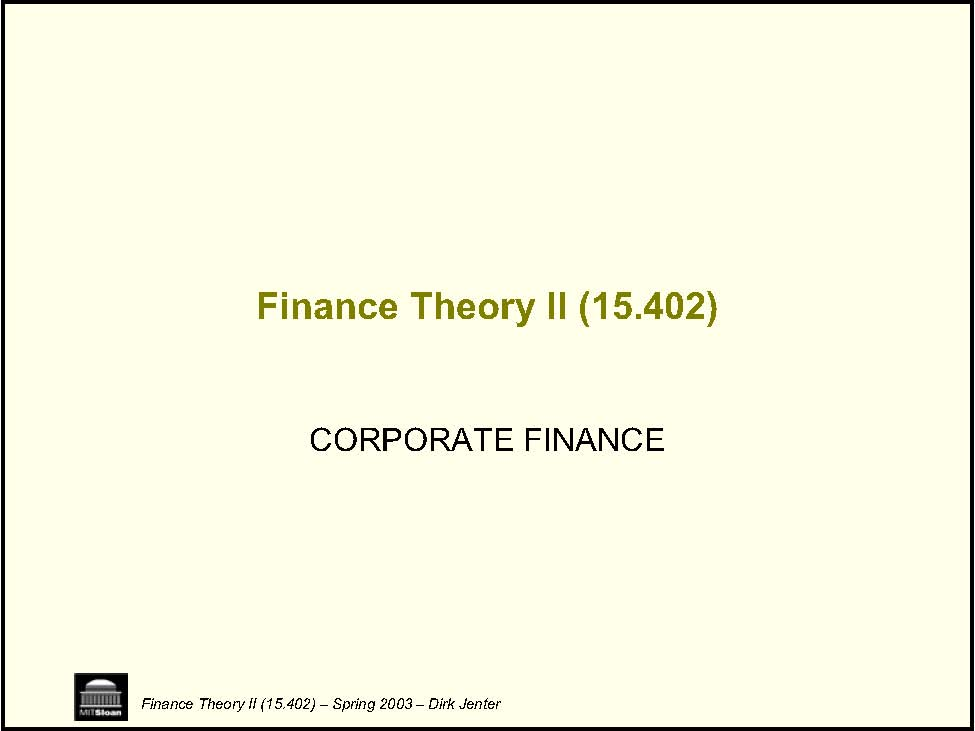

CORPORATE FINANCE Finance Theory II (15.402) – Spring 2003 – Dirk Jenter Finance Theory II (15.402) 

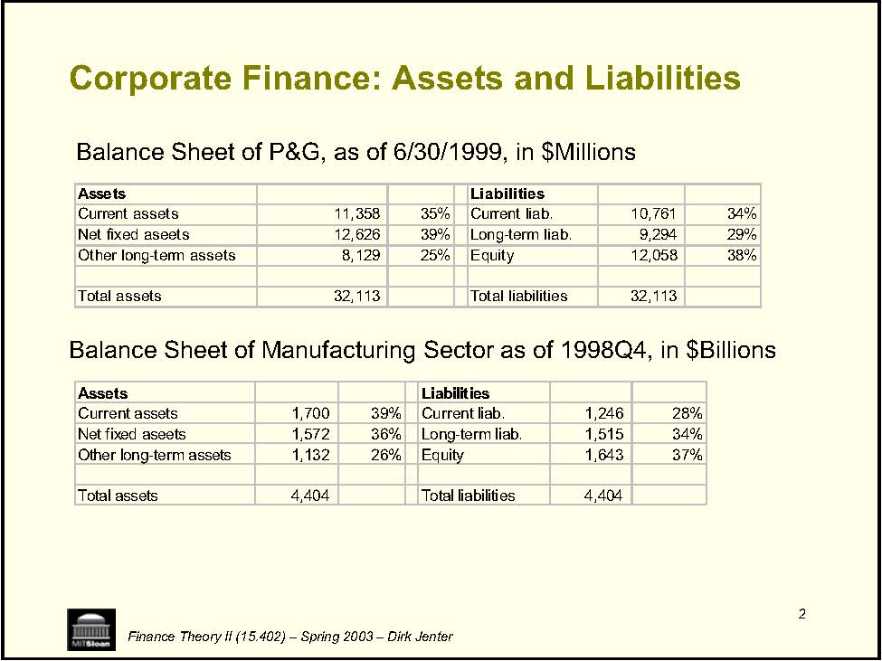

2 i l 39% i 36% l 26% i l iCorporate Finance: Assets and Liabilities ab es liab. li l li ili liab. liab. liti Finance Theory II (15.402) – Spring 2003 – Dirk Jenter Assets Liabilities Current assets 11,358 35% Current 10,761 34% Net f xed aseets 12,626 39% Long-term ab. 9,294 29% Other long-term assets 8,129 25% Equity 12,058 38% Tota assets 32,113 Tota ties 32,113 Balance Sheet of P&amp;G, as of 6/30/1999, in $Millions Balance Sheet of Manufacturing Sector as of 1998Q4, in $Billions Assets Liabilities Current assets 1,700 Current 1,246 28% Net f xed aseets 1,572 Long-term 1,515 34% Other ong-term assets 1,132 Equ ty 1,643 37% Tota assets 4,404 Total liab 4,404 

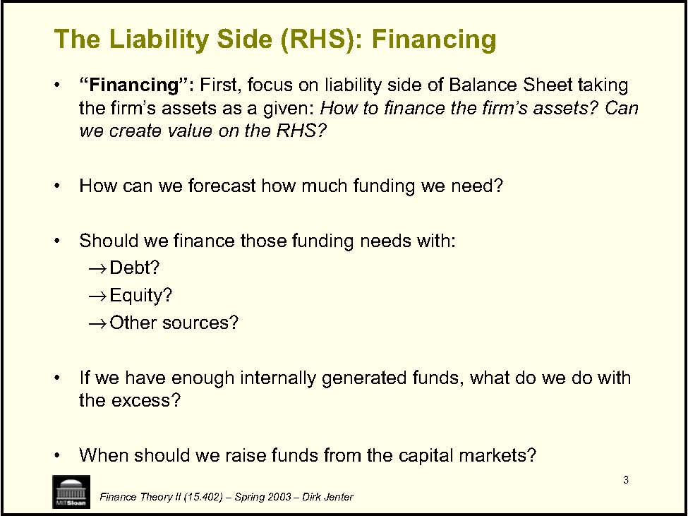

3 • • • → Debt? → Equity? → • • Finance Theory II (15.402) – Spring 2003 – Dirk Jenter The Liability Side (RHS): Financing “Financing”: First, focus on liability side of Balance Sheet taking the firm’s assets as a given: How to finance the firm’s assets? Can we create value on the RHS? How can we forecast how much funding we need? Should we finance those funding needs with: Other sources? If we have enough internally generated funds, what do we do with the excess? When should we raise funds from the capital markets? 

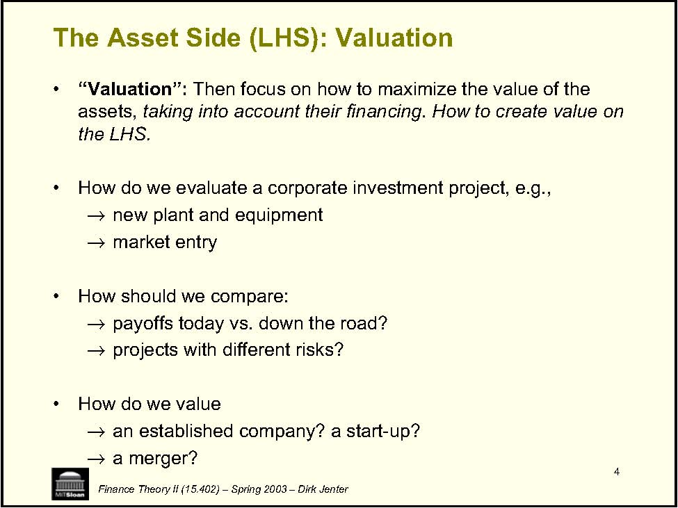

4 The Asset Side (LHS): Valuation • . the LHS. • → → • → → • → → “Valuation”: Finance Theory II (15.402) – Spring 2003 – Dirk Jenter Then focus on how to maximize the value of the assets, taking into account their financing How to create value on How do we evaluate a corporate investment project, e.g., new plant and equipment market entry How should we compare: payoffs today vs. down the road? projects with different risks? How do we value an established company? a start-up? a merger? 

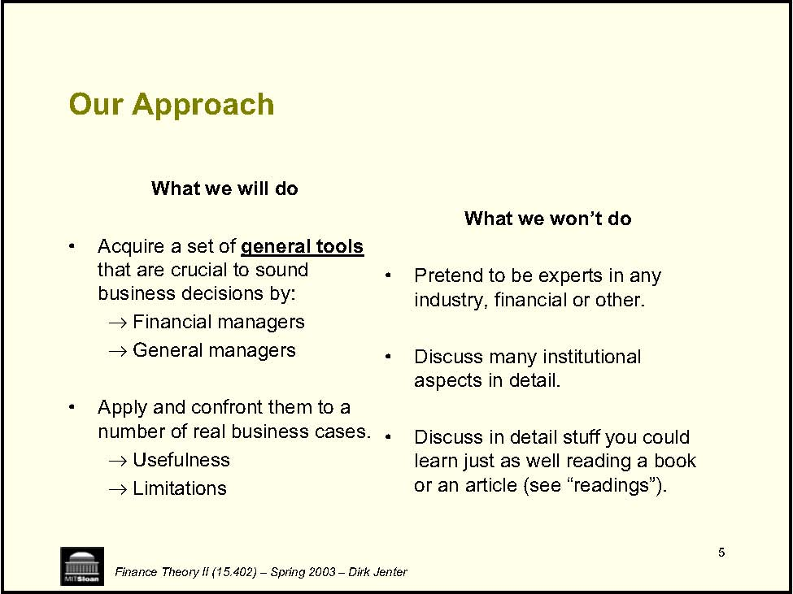

5 Our Approach • i → Fi → • number of real → → Limitations • • • Acquire a set of general tools General managers business cases. Usefulness aspects in detail. Finance Theory II (15.402) – Spring 2003 – Dirk Jenter What we will do that are crucial to sound business decis ons by: nancial managers Apply and confront them to a What we won’t do Pretend to be experts in any industry, financial or other. Discuss many institutional Discuss in detail stuff you could learn just as well reading a book or an article (see “readings”). 

6 • • → , 7th → Higgins, th → • Lectures twice per week Principles of Corporate Finance Professor: Dirk Jenter Finance Theory II (15.402) – Spring 2003 – Dirk Jenter Corporate Finance – Section A Texts:  Brealey &amp; Myers, edition, Analysis for Financial Management, 7 edition, Case and Readings Packet 

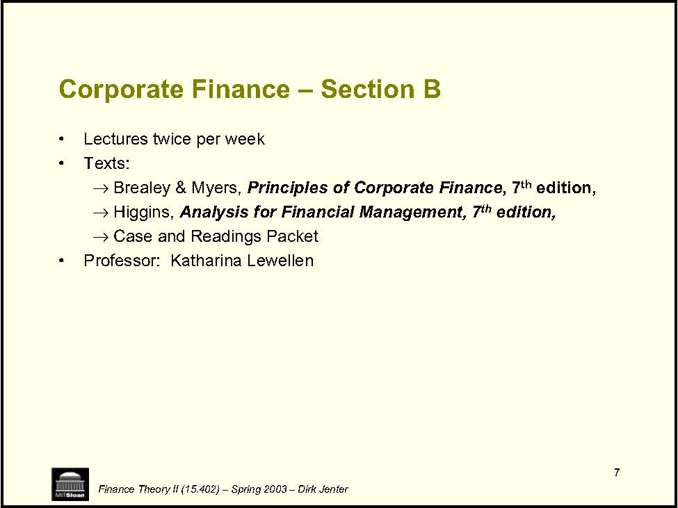

7 • • → , 7th → Higgins, th → • Lectures twice per week Principles of Corporate Finance Professor: Katharina Lewellen Finance Theory II (15.402) – Spring 2003 – Dirk Jenter Corporate Finance – Section B Texts:  Brealey &amp; Myers, edition, Analysis for Financial Management, 7 edition, Case and Readings Packet 

8 • → Come prepared to discuss cases → ) → → • ) → → → → → l • • ) Midterm (30%) Final (30% its) Finance Theory II (15.402) – Spring 2003 – Dirk Jenter Course Requirements Class Participation (10%) Quality more important than quantity (! Willingness to participate as important as participation  Introduce background readings into the discussion Case Memoranda (30% A professional memo to the decision maker Teams of three or four people Hand in all write-ups, except two of your choice Careful: Some cases are required! Two pages (p us exhib 

9 Case Memoranda • → → → → → → → → ( → → Clearly written and professional Finance Theory II (15.402) – Spring 2003 – Dirk Jenter Memoranda should be Handed in for all of the cases except two of your choice Two pages (not counting charts and tables), Double spaced – Font of 11 or 12 Teams of three or four students Hand in one copy per team You may not work with students not on your team One &amp; two person teams are discouraged Wilson I &amp; II) count as one case Wilson, MCI, Dixon, and Ameritrade are required Make sure you turn in 10 memoranda! 

10 The Big Picture: • • l • l • • • l • i • • • • i • • • i • • • • • Topics • i i • • • • ) • i i • • • 30% • 30% • 30% • i i 10% Feb 25 Financing Review Case: Intel Corp., 1992 Apr 1 Apr 8 Apr 10 12 il ls lui ies Cases ( Finance Theory II (15.402) – Spring 2003 – Dirk Jenter Part I: FINANCING Feb 6/11 Case: W son Lumber Feb 13 Lecture: Capita Structure 1 Feb 20 Lecture: Capita Structure 2 Case: UST Inc. Feb 27 Case: Massey Ferguson Mar 4 Lecture: Capita Structure 3 Mar 6 Case: MCI Commun cations Mar 11Mar 13Part II: VALUATION Lecture: Free Cash Flows Apr 3 Case: Amer trade Lecture: WACC and APV Case: Dixon Apr 15 Case: Diamond Chem ca Apr 17 Lecture: Real Options Apr 24 Case: MW Petroleum Apr 29 Lecture: Va ng a Company May 1 Case: Cooper Industr May 6 Case: Southland May 8 Hedg ng &amp; R sk Management May 13 Corporate Governance May 15 Course Wrap-up Lectures (12) Text: Brealey and Myers + Higgins Notes on the web before class (+ in class) 10 Case wr te ups: 1-2 page wr te-ups Notes on the web after class (+ in class) Class participation is critical Grades, etc. Case write-ups Midterm (in class) Final (TBA) Class part cipat on 

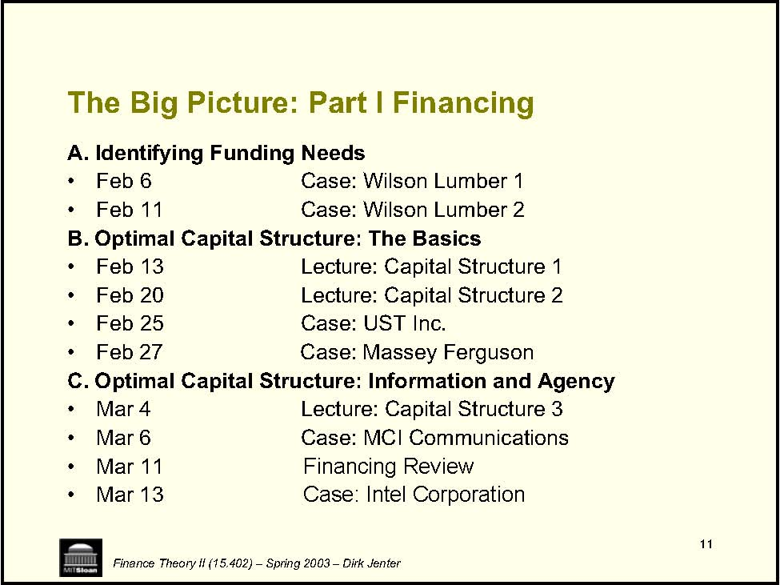

11 The Big Picture: Part I Financing • • • • • • • • • • Feb 6 Feb 11 Feb 13 Feb 20 Feb 25 Feb 27 Mar 4 Mar 6 Case: MCI Communications Mar 11 Financing Review Mar 13 Case: Intel Corporation Finance Theory II (15.402) – Spring 2003 – Dirk Jenter A. Identifying Funding Needs Case: Wilson Lumber 1 Case: Wilson Lumber 2 B. Optimal Capital Structure: The Basics Lecture: Capital Structure 1 Lecture: Capital Structure 2 Case: UST Inc. Case: Massey Ferguson C. Optimal Capital Structure: Information and Agency Lecture: Capital Structure 3 

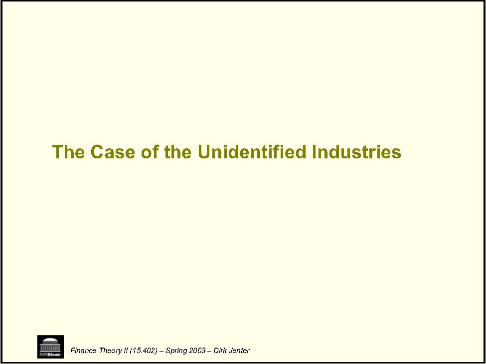

The Case of the Unidentified Industries Finance Theory II (15.402) – Spring 2003 – Dirk Jenter 

<Table>
<TR>
<TD>Advertising Agency </TD>
<TD>Airline </TD>
<TD>Commercial Bank </TD>
</TR>
<TR>
<TD>Computer Software Developer </TD>
<TD>Department Store Chain </TD>
<TD>Electric &amp; Gas Utility </TD>
</TR>
<TR>
<TD>Health Maintenance Org. </TD>
<TD>Meat Packer </TD>
<TD>Pharmaceutical Manufacturer </TD>
</TR>
<TR>
<TD>Retail Drug Chain </TD>
<TD>Retail Grocery Chain </TD>

</TR>
</Table>
<Table>
<TR>

<TH>A </TH>
<TH>B </TH>
<TH>C </TH>
<TH>D </TH>
<TH>E </TH>
<TH>F </TH>
<TH>G </TH>
<TH>H </TH>
<TH>I </TH>
<TH>J </TH>
<TH>K </TH>
</TR>
<TR>
<TH>Line </TH>

<TH>Balance Sheet Percentages </TH>

</TR>
<TR>

<TD>#1 </TD>

<TH>Cash and marketable securities </TH>
<TD>5 </TD>
<TD>12 </TD>
<TD>2 </TD>
<TD>1 </TD>
<TD>4 </TD>
<TD>4 </TD>
<TD>3 </TD>
<TD>77 </TD>
<TD>9 </TD>
<TD>67 </TD>
<TD>19 </TD>
</TR>
<TR>

<TD>2 </TD>

<TH>Account receivables </TH>
<TD>85 </TD>
<TD>55 </TD>
<TD>4 </TD>
<TD>15 </TD>
<TD>7 </TD>
<TD>6 </TD>
<TD>4 </TD>
<TD>7 </TD>
<TD>28 </TD>
<TD>9 </TD>
<TD>13 </TD>
</TR>
<TR>

<TD>3 </TD>

<TH>Inventories </TH>
<TD>0 </TD>
<TD>0 </TD>
<TD>1 </TD>
<TD>24 </TD>
<TD>43 </TD>
<TD>0 </TD>
<TD>22 </TD>
<TD>0 </TD>
<TD>13 </TD>
<TD>2 </TD>
<TD>12 </TD>
</TR>
<TR>

<TD>4 </TD>

<TH>Other current assets</TH>
<TD> 1 </TD>
<TD>4 </TD>
<TD>2 </TD>
<TD>2 </TD>
<TD>4 </TD>
<TD>6 </TD>
<TD>2 </TD>
<TD>3 </TD>
<TD>3 </TD>
<TD>2 </TD>
<TD>6 </TD>
</TR>
<TR>

<TD>5 </TD>

<TH>Plant and equipment (net) </TH>
<TD>2 </TD>
<TD>7 </TD>
<TD>77 </TD>
<TD>55 </TD>
<TD>37 </TD>
<TD>71 </TD>
<TD>41 </TD>
<TD>9 </TD>
<TD>35 </TD>
<TD>17 </TD>
<TD>48 </TD>
</TR>
<TR>

<TD>6 </TD>

<TH>Other assets </TH>
<TD>7 </TD>
<TD>23 </TD>
<TD>15</TD>
<TD> 3 </TD>
<TD>5 </TD>
<TD>13 </TD>
<TD>29</TD>
<TD> 4 </TD>
<TD>13</TD>
<TD> 2 </TD>
<TD>1 </TD>
</TR>
<TR>

<TD>7 </TD>

<TH>Total assets </TH>
<TD>100 </TD>
<TD>100 </TD>
<TD>100 </TD>
<TD>100 </TD>
<TD>100 </TD>
<TD>100 </TD>
<TD>100 </TD>
<TD>100 </TD>
<TD>100 </TD>
<TD>100 </TD>
<TD>100 </TD>
</TR>
<TR>

</TR>
<TR>

<TD>8 </TD>

<TH>Notes payable </TH>
<TD>62 </TD>
<TD>3 </TD>
<TD>0 </TD>
<TD>2 </TD>
<TD>0 </TD>
<TD>4 </TD>
<TD>2 </TD>
<TD>0 </TD>
<TD>0 </TD>
<TD>0 </TD>
<TD>7 </TD>
</TR>
<TR>

<TD>9 </TD>

<TH>Accounts payable </TH>
<TD>18</TD>
<TD> 63 </TD>
<TD>3 </TD>
<TD>17 </TD>
<TD>18 </TD>
<TD>5 </TD>
<TD>13 </TD>
<TD>32 </TD>
<TD>15 </TD>
<TD>6 </TD>
<TD>5 </TD>
</TR>
<TR>

<TD>10 </TD>

<TH>Accrued taxes </TH>
<TD>2 </TD>
<TD>2 </TD>
<TD>0 </TD>
<TD>1 </TD>
<TD>1 </TD>
<TD>0 </TD>
<TD>1 </TD>
<TD>3 </TD>
<TD>6 </TD>
<TD>6 </TD>
<TD>2 </TD>
</TR>
<TR>

<TD>11</TD>

<TH> Other current liabilities </TH>
<TD>0 </TD>
<TD>0 </TD>
<TD>4 </TD>
<TD>9 </TD>
<TD>17 </TD>
<TD>17 </TD>
<TD>12 </TD>
<TD>2 </TD>
<TD>13 </TD>
<TD>5 </TD>
<TD>8 </TD>
</TR>
<TR>

<TD>12</TD>

<TH> Long-term debt </TH>
<TD>7 </TD>
<TD>6 </TD>
<TD>29 </TD>
<TD>38 </TD>
<TD>0 </TD>
<TD>40 </TD>
<TD>29 </TD>
<TD>0 </TD>
<TD>19 </TD>
<TD>0 </TD>
<TD>15 </TD>
</TR>
<TR>

<TD>13 </TD>

<TH>Preferred stock </TH>
<TD>4 </TD>
<TD>8 </TD>
<TD>21</TD>
<TD> 5 </TD>
<TD>10 </TD>
<TD>17 </TD>
<TD>14</TD>
<TD> 1 </TD>
<TD>6 </TD>
<TD>0 </TD>
<TD>1 </TD>
</TR>
<TR>

<TD>14 </TD>

<TH>Other liabilities </TH>
<TD>2 </TD>
<TD>0 </TD>
<TD>5 </TD>
<TD>3 </TD>
<TD>0 </TD>
<TD>0 </TD>
<TD>0 </TD>
<TD>0 </TD>
<TD>0 </TD>
<TD>0 </TD>
<TD>0 </TD>
</TR>
<TR>

<TD>15 </TD>

<TH>Capital stock and capital surplus </TH>
<TD>2 </TD>
<TD>10 </TD>
<TD>11 </TD>
<TD>1 </TD>
<TD>3 </TD>
<TD>12 </TD>
<TD>5 </TD>
<TD>11 </TD>
<TD>24 </TD>
<TD>28 </TD>
<TD>16 </TD>
</TR>
<TR>

<TD>16 </TD>

<TH>Retained earnings </TH>
<TD>4 </TD>
<TD>7 </TD>
<TD>28</TD>
<TD> 23 </TD>
<TD>51 </TD>
<TD>5 </TD>
<TD>24 </TD>
<TD>51 </TD>
<TD>18 </TD>
<TD>55 </TD>
<TD>46 </TD>
</TR>
<TR>

<TD>17 </TD>

<TH>Total liabilities and stockholder equity </TH>
<TD>100 </TD>
<TD>100</TD>
<TD> 100</TD>
<TD> 100 </TD>
<TD>100</TD>
<TD> 100 </TD>
<TD>100</TD>
<TD> 100 </TD>
<TD>100</TD>
<TD> 100 </TD>
<TD>100 </TD>
</TR>
<TR>

</TR>
<TR>

<TH>Selected Financial Data </TH>

</TR>
<TR>

<TD>18 </TD>

<TH>Current assets/current liabilities </TH>
<TD>1.11</TD>
<TD> 1.03 </TD>
<TD>1.31</TD>
<TD> 1.46 </TD>
<TD>1.59</TD>
<TD> 0.63 </TD>
<TD>1.1 </TD>
<TD>2.35 </TD>
<TD>1.58 </TD>
<TD>4.72 </TD>
<TD>2.31 </TD>
</TR>
<TR>

<TD>19 </TD>

<TH>Cash, marketable securities and accounts receivable/current liabilities </TH>
<TD>1.1 </TD>
<TD>0.97 </TD>
<TD>0.98</TD>
<TD> 1.4 </TD>
<TD>1.49</TD>
<TD> 0.4 </TD>
<TD>1.04 </TD>
<TD>2.28 </TD>
<TD>1.5 </TD>
<TD>4.59 </TD>
<TD>2.03 </TD>
</TR>
<TR>

<TD>20 </TD>

<TH>Inventory turnover (X) </TH>
<TH>NA </TH>
<TH>NA </TH>
<TD>16.7</TD>
<TD> 5.6 </TD>
<TD>5.2 </TD>
<TH>NA </TH>
<TD>8.6 </TD>
<TH>NA </TH>
<TD>47.6 </TD>
<TD>7.5 </TD>
<TD>2 </TD>
</TR>
<TR>

<TD>21 </TD>

<TH>Receivables collection period </TH>
<TD>3,278 </TD>
<TD>381 </TD>
<TD>30 </TD>
<TD>31 </TD>
<TD>8 </TD>
<TD>27 </TD>
<TD>6 </TD>
<TD>13 </TD>
<TD>16 </TD>
<TD>37 </TD>
<TD>74 </TD>
</TR>
<TR>

<TD>22 </TD>

<TH>Total debt/total assets </TH>
<TD>0.69 </TD>
<TD>0.1 </TD>
<TD>0.29 </TD>
<TD>0.4 </TD>
<TD>0 </TD>
<TD>0.44 </TD>
<TD>0.31 </TD>
<TD>0 </TD>
<TD>0.19 </TD>
<TD>0 </TD>
<TD>0.22 </TD>
</TR>
<TR>

<TD>23 </TD>

<TH>Long-term debt/capitalization </TH>
<TD>0.09 </TD>
<TD>0.24 </TD>
<TD>0.4 </TD>
<TD>0.57 </TD>
<TD>0 </TD>
<TD>0.66 </TD>
<TD>0.48</TD>
<TD> 0 </TD>
<TD>0.32 </TD>
<TD>0 </TD>
<TD>0.18 </TD>
</TR>
<TR>

<TD>24 </TD>

<TH>Net sales/total assets </TH>
<TD>0.095 </TD>
<TD>0.523 </TD>
<TD>0.464 </TD>
<TD>1.822 </TD>
<TD>3.175 </TD>
<TD>0.828 </TD>
<TD>2.61</TD>
<TD> 2.032 </TD>
<TD>6.473 </TD>
<TD>0.867 </TD>
<TD>0.643 </TD>
</TR>
<TR>

<TD>25 </TD>

<TH>Net profit/net sales </TH>
<TD>0.141 </TD>
<TD>0.047 </TD>
<TD>0.115 </TD>
<TD>0.02 </TD>
<TD>0.031 </TD>
<TD>0.014 </TD>
<TD>0.019 </TD>
<TD>0.131 </TD>
<TD>0.015 </TD>
<TD>0.247 </TD>
<TD>0.106 </TD>
</TR>
<TR>

<TD>26 </TD>

<TH>Net profit/total assets </TH>
<TD>0.013 </TD>
<TD>0.025 </TD>
<TD>0.053 </TD>
<TD>0.037 </TD>
<TD>0.097 </TD>
<TD>0.012 </TD>
<TD>0.049 </TD>
<TD>0.267 </TD>
<TD>0.098 </TD>
<TD>0.214 </TD>
<TD>0.068 </TD>
</TR>
<TR>

<TD>27 </TD>

<TH>Total assets/net worth </TH>
<TD>14.1</TD>
<TD> 5.84</TD>
<TD> 2.31</TD>
<TD> 3.61</TD>
<TD> 1.85</TD>
<TD> 5.77 </TD>
<TD>3.43</TD>
<TD> 1.62 </TD>
<TD>2.39</TD>
<TD> 1.21 </TD>
<TD>1.61 </TD>
</TR>
<TR>

<TD>28 </TD>

<TH>Net profit/net worth </TH>
<TD>0.189 </TD>
<TD>0.144 </TD>
<TD>0.123 </TD>
<TD>0.134 </TD>
<TD>0.179 </TD>
<TD>0.067 </TD>
<TD>0.168 </TD>
<TD>0.432 </TD>
<TD>0.234 </TD>
<TD>0.258 </TD>
<TD>0.11 </TD>
</TR>
</Table>

13 

Finance Theory II (15.402) – Spring 2003 – Dirk Jenter 

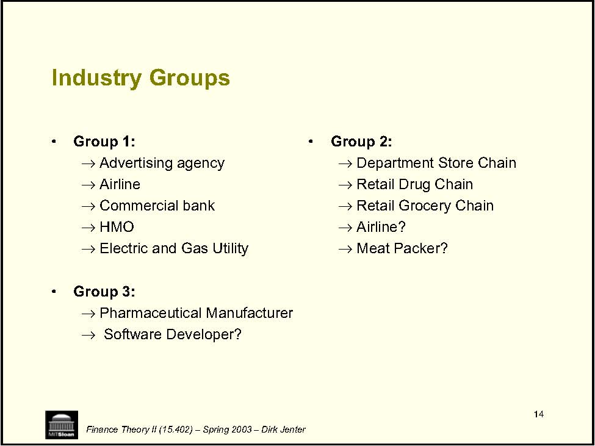

14 • → → → Commercial bank → HMO → • → l Manufacturer → • → in → → → → Meat Packer? Group 1: Airline Group 3: Pharmaceutica Group 2: Department Store Cha Finance Theory II (15.402) – Spring 2003 – Dirk Jenter Industry Groups Advertising agency Electric and Gas Utility Software Developer? Retail Drug Chain Retail Grocery Chain Airline? 

# Group 1 

- Advertising Agency 

- Airline 

- Commercial Bank 

- HMO 

- Utility 

<Table>
<TR>

<TH>A </TH>
<TH>B </TH>
<TH>C </TH>
<TH>F </TH>
<TH>H </TH>
</TR>
<TR>
<TH>Line </TH>

<TH>Balance Sheet Percentages </TH>

</TR>
<TR>

<TD>#1 </TD>

<TH>Cash and marketable securities </TH>
<TD>5 </TD>
<TD>12 </TD>
<TD>2 </TD>
<TD>4 </TD>
<TD>77 </TD>
</TR>
<TR>

<TD>2 </TD>

<TH>Account receivables </TH>
<TD>85 </TD>
<TD>55 </TD>
<TD>4 </TD>
<TD>6 </TD>
<TD>7 </TD>
</TR>
<TR>

<TD>3 </TD>

<TH>Inventories </TH>
<TD>0 </TD>
<TD>0 </TD>
<TD>1 </TD>
<TD>0 </TD>
<TD>0 </TD>
</TR>
<TR>

<TD>4 </TD>

<TH>Other current assets </TH>
<TD>1 </TD>
<TD>4 </TD>
<TD>2 </TD>
<TD>6 </TD>
<TD>3 </TD>
</TR>
<TR>

<TD>5 </TD>

<TH>Plant and equipment (net) </TH>
<TD>2 </TD>
<TD>7 </TD>
<TD>77 </TD>
<TD>71 </TD>
<TD>9 </TD>
</TR>
<TR>

<TD>6 </TD>

<TH>Other assets </TH>
<TD>7 </TD>
<TD>23 </TD>
<TD>15</TD>
<TD> 13 </TD>
<TD>4 </TD>
</TR>
<TR>

<TD>7</TD>

<TH>    Total assets </TH>
<TD>100 </TD>
<TD>100 </TD>
<TD>100 </TD>
<TD>100 </TD>
<TD>100 </TD>
</TR>
<TR>

</TR>
<TR>

<TD>8 </TD>

<TH>Notes payable </TH>
<TD>62 </TD>
<TD>3 </TD>
<TD>0 </TD>
<TD>4 </TD>
<TD>0 </TD>
</TR>
<TR>

<TD>9 </TD>

<TH>Accounts payable </TH>
<TD>18 </TD>
<TD>63 </TD>
<TD>3 </TD>
<TD>5 </TD>
<TD>32 </TD>
</TR>
<TR>

<TD>10 </TD>

<TH>Accrued taxes </TH>
<TD>2 </TD>
<TD>2 </TD>
<TD>0 </TD>
<TD>0 </TD>
<TD>3 </TD>
</TR>
<TR>

<TD>11 </TD>

<TH>Other current liabilities </TH>
<TD>0 </TD>
<TD>0 </TD>
<TD>4 </TD>
<TD>17 </TD>
<TD>2 </TD>
</TR>
<TR>

<TD>12 </TD>

<TH>Long-term debt </TH>
<TD>7 </TD>
<TD>6 </TD>
<TD>29 </TD>
<TD>40 </TD>
<TD>0 </TD>
</TR>
<TR>

<TD>13 </TD>

<TH>Preferred stock </TH>
<TD>4 </TD>
<TD>8 </TD>
<TD>21 </TD>
<TD>17 </TD>
<TD>1 </TD>
</TR>
<TR>

<TD>14</TD>

<TH> Other liabilities </TH>
<TD>2 </TD>
<TD>0 </TD>
<TD>5 </TD>
<TD>0 </TD>
<TD>0 </TD>
</TR>
<TR>

<TD>15 </TD>

<TH>Capital stock and capital surplus </TH>
<TD>2 </TD>
<TD>10 </TD>
<TD>11 </TD>
<TD>12 </TD>
<TD>11 </TD>
</TR>
<TR>

<TD>16 </TD>

<TH>Retained earnings </TH>
<TD>4 </TD>
<TD>7 </TD>
<TD>28 </TD>
<TD>5 </TD>
<TD>51 </TD>
</TR>
<TR>

<TD>17</TD>

<TH>    Total liabilities and stockholder equity </TH>
<TD>100 </TD>
<TD>100 </TD>
<TD>100 </TD>
<TD>100 </TD>
<TD>100 </TD>
</TR>
<TR>

</TR>
<TR>

<TH>Selected Financial Data </TH>

</TR>
<TR>

<TD>18 </TD>

<TH>Current assets/current liabilities </TH>
<TD>1.11 </TD>
<TD>1.03 </TD>
<TD>1.31 </TD>
<TD>0.63 </TD>
<TD>2.35 </TD>
</TR>
<TR>

<TD>19 </TD>

<TH>Cash, marketable securities and accounts receivable/current liabilities </TH>
<TD>1.1 </TD>
<TD>0.97 </TD>
<TD>0.98 </TD>
<TD>0.4 </TD>
<TD>2.28 </TD>
</TR>
<TR>

<TD>20 </TD>

<TH>Inventory turnover (X) </TH>
<TH>NA </TH>
<TH>NA </TH>
<TD>16.7 </TD>
<TH>NA </TH>
<TH>NA </TH>
</TR>
<TR>

<TD>21 </TD>

<TH>Receivables collection period </TH>
<TD>3,278 </TD>
<TD>381 </TD>
<TD>30 </TD>
<TD>27 </TD>
<TD>13 </TD>
</TR>
<TR>

<TD>22 </TD>

<TH>Total debt/total assets </TH>
<TD>0.69 </TD>
<TD>0.1 </TD>
<TD>0.29 </TD>
<TD>0.44 </TD>
<TD>0 </TD>
</TR>
<TR>

<TD>23 </TD>

<TH>Long-term debt/capitalization </TH>
<TD>0.09 </TD>
<TD>0.24 </TD>
<TD>0.4 </TD>
<TD>0.66 </TD>
<TD>0 </TD>
</TR>
<TR>

<TD>24 </TD>

<TH>Net sales/total assets </TH>
<TD>0.095</TD>
<TD> 0.523</TD>
<TD> 0.464 </TD>
<TD>0.828 </TD>
<TD>2.032 </TD>
</TR>
<TR>

<TD>25 </TD>

<TH>Net profit/net sales </TH>
<TD>0.141</TD>
<TD> 0.047</TD>
<TD> 0.115 </TD>
<TD>0.014 </TD>
<TD>0.131 </TD>
</TR>
<TR>

<TD>26 </TD>

<TH>Net profit/total assets </TH>
<TD>0.013</TD>
<TD> 0.025</TD>
<TD> 0.053 </TD>
<TD>0.012 </TD>
<TD>0.267 </TD>
</TR>
<TR>

<TD>27 </TD>

<TH>Total assets/net worth </TH>
<TD>14.1 </TD>
<TD>5.84 </TD>
<TD>2.31 </TD>
<TD>5.77 </TD>
<TD>1.62 </TD>
</TR>
<TR>

<TD>28 </TD>

<TH>Net profit/net worth </TH>
<TD>0.189</TD>
<TD> 0.144</TD>
<TD> 0.123 </TD>
<TD>0.067 </TD>
<TD>0.432 </TD>
</TR>
</Table>

15 

Finance Theory II (15.402) – Spring 2003 – Dirk Jenter 

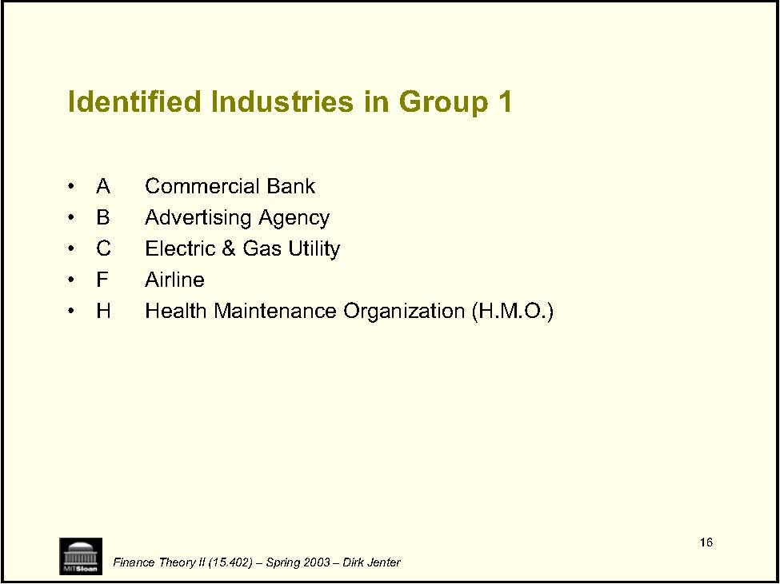

16 Identified Industries in Group 1 • A • B • C • F Airline • H ) Finance Theory II (15.402) – Spring 2003 – Dirk Jenter Commercial Bank Advertising Agency Electric &amp; Gas Utility Health Maintenance Organization (H.M.O. 

## Group 2 

- Dpt. Store 

- Drug Chain 

- Grocery Chain 

- Airline 

- Meat Packer 

17 

Finance Theory II (15.402) – Spring 2003 – Dirk Jenter 

<Table>
<TR>

<TH>D </TH>
<TH>E </TH>
<TH>F </TH>
<TH>G </TH>
<TH>I </TH>
</TR>
<TR>

<TH>Balance Sheet Percentages </TH>

</TR>
<TR>

<TH>Cash and marketable securities </TH>
<TD>1 </TD>
<TD>4 </TD>
<TD>4 </TD>
<TD>3 </TD>
<TD>9 </TD>
</TR>
<TR>

<TH>Account receivables </TH>
<TD>15 </TD>
<TD>7 </TD>
<TD>6 </TD>
<TD>4 </TD>
<TD>28 </TD>
</TR>
<TR>

<TH>Inventories </TH>
<TD>24 </TD>
<TD>43 </TD>
<TD>0 </TD>
<TD>22 </TD>
<TD>13 </TD>
</TR>
<TR>

<TH>Other current assets </TH>
<TD>2 </TD>
<TD>4 </TD>
<TD>6 </TD>
<TD>2 </TD>
<TD>3 </TD>
</TR>
<TR>

<TH>Plant and equipment (net) </TH>
<TD>55 </TD>
<TD>37 </TD>
<TD>71 </TD>
<TD>41 </TD>
<TD>35 </TD>
</TR>
<TR>

<TH>Other assets </TH>
<TD>3 </TD>
<TD>5 </TD>
<TD>13 </TD>
<TD>29 </TD>
<TD>13 </TD>
</TR>
<TR>

<TH>Total assets </TH>
<TD>100</TD>
<TD> 100</TD>
<TD> 100 </TD>
<TD>100 </TD>
<TD>100 </TD>
</TR>
<TR>

</TR>
<TR>

<TH>Notes payable </TH>
<TD>2 </TD>
<TD>0 </TD>
<TD>4 </TD>
<TD>2 </TD>
<TD>0 </TD>
</TR>
<TR>

<TH>Accounts payable </TH>
<TD>17 </TD>
<TD>18 </TD>
<TD>5 </TD>
<TD>13 </TD>
<TD>15 </TD>
</TR>
<TR>

<TH>Accrued taxes </TH>
<TD>1 </TD>
<TD>1 </TD>
<TD>0 </TD>
<TD>1 </TD>
<TD>6 </TD>
</TR>
<TR>

<TH>Other current liabilities </TH>
<TD>9 </TD>
<TD>17 </TD>
<TD>17 </TD>
<TD>12 </TD>
<TD>13 </TD>
</TR>
<TR>

<TH>Long-term debt </TH>
<TD>38 </TD>
<TD>0 </TD>
<TD>40 </TD>
<TD>29 </TD>
<TD>19 </TD>
</TR>
<TR>

<TH>Preferred stock </TH>
<TD>5 </TD>
<TD>10 </TD>
<TD>17 </TD>
<TD>14 </TD>
<TD>6 </TD>
</TR>
<TR>

<TH>Other liabilities </TH>
<TD>3 </TD>
<TD>0 </TD>
<TD>0 </TD>
<TD>0 </TD>
<TD>0 </TD>
</TR>
<TR>

<TH>Capital stock and capital surplus </TH>
<TD>1 </TD>
<TD>3 </TD>
<TD>12 </TD>
<TD>5 </TD>
<TD>24 </TD>
</TR>
<TR>

<TH>Retained earnings </TH>
<TD>23 </TD>
<TD>51 </TD>
<TD>5 </TD>
<TD>24 </TD>
<TD>18 </TD>
</TR>
<TR>

<TH>Total liabilities and stockholder equity </TH>
<TD>100 </TD>
<TD>100 </TD>
<TD>100 </TD>
<TD>100 </TD>
<TD>100 </TD>
</TR>
<TR>

</TR>
<TR>

<TH>Selected Financial Data </TH>

</TR>
<TR>

<TH>Current assets/current liabilities </TH>
<TD>1.46 </TD>
<TD>1.59 </TD>
<TD>0.63 </TD>
<TD>1.1 </TD>
<TD>1.58 </TD>
</TR>
<TR>

<TH>Cash, marketable securities and accounts receivable/current liabilities </TH>
<TD>1.4 </TD>
<TD>1.49 </TD>
<TD>0.4 </TD>
<TD>1.04 </TD>
<TD>1.5 </TD>
</TR>
<TR>

<TH>Inventory turnover (X) </TH>
<TD>5.6 </TD>
<TD>5.2 </TD>
<TH>NA </TH>
<TD>8.6 </TD>
<TD>47.6 </TD>
</TR>
<TR>

<TH>Receivables collection period </TH>
<TD>31 </TD>
<TD>8 </TD>
<TD>27 </TD>
<TD>6 </TD>
<TD>16 </TD>
</TR>
<TR>

<TH>Total debt/total assets </TH>
<TD>0.4 </TD>
<TD>0 </TD>
<TD>0.44 </TD>
<TD>0.31 </TD>
<TD>0.19 </TD>
</TR>
<TR>

<TH>Long-term debt/capitalization </TH>
<TD>0.57 </TD>
<TD>0 </TD>
<TD>0.66 </TD>
<TD>0.48</TD>
<TD> 0.32 </TD>
</TR>
<TR>

<TH>Net sales/total assets </TH>
<TD>1.822 </TD>
<TD>3.175 </TD>
<TD>0.828 </TD>
<TD>2.61 </TD>
<TD>6.473 </TD>
</TR>
<TR>

<TH>Net profit/net sales </TH>
<TD>0.02 </TD>
<TD>0.031 </TD>
<TD>0.014 </TD>
<TD>0.019 </TD>
<TD>0.015 </TD>
</TR>
<TR>

<TH>Net profit/total assets </TH>
<TD>0.037 </TD>
<TD>0.097 </TD>
<TD>0.012 </TD>
<TD>0.049 </TD>
<TD>0.098 </TD>
</TR>
<TR>

<TH>Total assets/net worth </TH>
<TD>3.61 </TD>
<TD>1.85 </TD>
<TD>5.77 </TD>
<TD>3.43 </TD>
<TD>2.39 </TD>
</TR>
<TR>

<TH>Net profit/net worth </TH>
<TD>0.134 </TD>
<TD>0.179 </TD>
<TD>0.067 </TD>
<TD>0.168 </TD>
<TD>0.234 </TD>
</TR>
</Table>

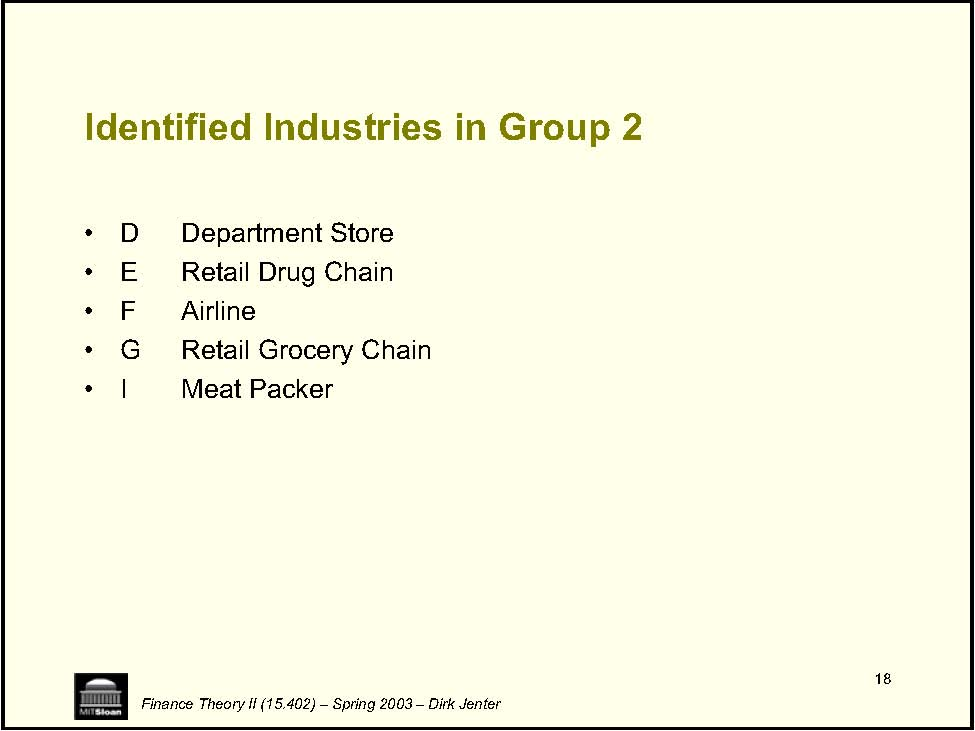

18 Identified Industries in Group 2 • D • E • F Airline • G in • I Meat Packer Finance Theory II (15.402) – Spring 2003 – Dirk Jenter Department Store Retail Drug Chain Retail Grocery Cha 

## Group 3 

- Pharmaceutical Manufacturer 

- Software Developer 

<Table>
<TR>

<TD>J </TD>
<TD>K </TD>
</TR>
<TR>
<TD>Line </TD>

<TD>Balance Sheet Percentages </TD>

</TR>
<TR>

<TD>#1 </TD>

<TD>Cash and marketable securities </TD>
<TD>67 </TD>
<TD>19 </TD>
</TR>
<TR>

<TD>2 </TD>

<TD>Account receivables </TD>
<TD>9 </TD>
<TD>13 </TD>
</TR>
<TR>

<TD>3 </TD>

<TD>Inventories</TD>
<TD> 2 </TD>
<TD>12 </TD>
</TR>
<TR>

<TD>4 </TD>

<TD>Other current assets </TD>
<TD>2 </TD>
<TD>6 </TD>
</TR>
<TR>

<TD>5 </TD>

<TD>Plant and equipment (net) </TD>
<TD>17 </TD>
<TD>48 </TD>
</TR>
<TR>

<TD>6 </TD>

<TD>Other assets </TD>
<TD>2 </TD>
<TD>1 </TD>
</TR>
<TR>

<TD>7 </TD>

<TD>Total assets </TD>
<TD>100 </TD>
<TD>100 </TD>
</TR>
<TR>

</TR>
<TR>

<TD>8 </TD>

<TD>Notes payable </TD>
<TD>0 </TD>
<TD>7 </TD>
</TR>
<TR>

<TD>9 </TD>

<TD>Accounts payable </TD>
<TD>6 </TD>
<TD>5 </TD>
</TR>
<TR>

<TD>10 </TD>

<TD>Accrued taxes </TD>
<TD>6 </TD>
<TD>2 </TD>
</TR>
<TR>

<TD>11 </TD>

<TD>Other current liabilities </TD>
<TD>5 </TD>
<TD>8 </TD>
</TR>
<TR>

<TD>12 </TD>

<TD>Long-term debt </TD>
<TD>0 </TD>
<TD>15 </TD>
</TR>
<TR>

<TD>13 </TD>

<TD>Preferred stock </TD>
<TD>0 </TD>
<TD>1 </TD>
</TR>
<TR>

<TD>14 </TD>

<TD>Other liabilities </TD>
<TD>0 </TD>
<TD>0 </TD>
</TR>
<TR>

<TD>15 </TD>

<TD>Capital stock and capital surplus </TD>
<TD>28 </TD>
<TD>16 </TD>
</TR>
<TR>

<TD>16 </TD>

<TD>Retained earnings </TD>
<TD>55 </TD>
<TD>46 </TD>
</TR>
<TR>

<TD>17 </TD>

<TD>Total liabilities and stockholder equity </TD>
<TD>100 </TD>
<TD>100 </TD>
</TR>
<TR>

</TR>
<TR>

<TD>Selected Financial Data </TD>

</TR>
<TR>

<TD>18 </TD>

<TD>Current assets/current liabilities </TD>
<TD>4.72 </TD>
<TD>2.31 </TD>
</TR>
<TR>

<TD>19 </TD>

<TD>Cash, marketable securities and accounts receivable/current liabilities </TD>
<TD>4.59 </TD>
<TD>2.03 </TD>
</TR>
<TR>

<TD>20 </TD>

<TD>Inventory turnover (X) </TD>
<TD>7.5 </TD>
<TD>2 </TD>
</TR>
<TR>

<TD>21 </TD>

<TD>Receivables collection period </TD>
<TD>37 </TD>
<TD>74 </TD>
</TR>
<TR>

<TD>22 </TD>

<TD>Total debt/total assets </TD>
<TD>0 </TD>
<TD>0.22 </TD>
</TR>
<TR>

<TD>23 </TD>

<TD>Long-term debt/capitalization </TD>
<TD>0 </TD>
<TD>0.18 </TD>
</TR>
<TR>

<TD>24</TD>

<TD> Net sales/total assets </TD>
<TD>0.867 </TD>
<TD>0.643 </TD>
</TR>
<TR>

<TD>25</TD>

<TD> Net profit/net sales </TD>
<TD>0.247 </TD>
<TD>0.106 </TD>
</TR>
<TR>

<TD>26 </TD>

<TD>Net profit/total assets </TD>
<TD>0.214 </TD>
<TD>0.068 </TD>
</TR>
<TR>

<TD>27 </TD>

<TD>Total assets/net worth </TD>
<TD>1.21 </TD>
<TD>1.61 </TD>
</TR>
<TR>

<TD>28 </TD>

<TD>Net profit/net worth </TD>
<TD>0.258 </TD>
<TD>0.11 </TD>
</TR>
</Table>

19 

Finance Theory II (15.402) – Spring 2003 – Dirk Jenter 

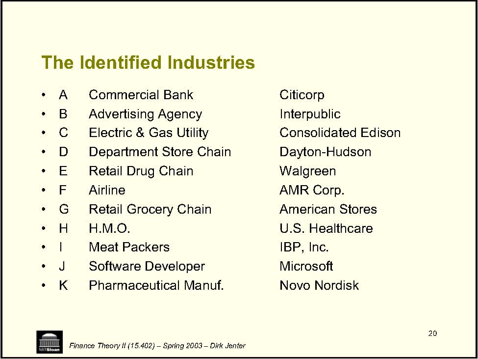

20 The Identified Industries • A Citicorp • B • C • D • E • F Airline • G in i • H • I • J Microsoft • K Interpublic Dayton-Hudson Retail Drug Chain Walgreen AMR Corp. Meat Packers IBP, Inc. Novo Nordisk Finance Theory II (15.402) – Spring 2003 – Dirk Jenter Commercial Bank Advertising Agency Electric &amp; Gas Utility Consolidated Edison Department Store Chain Retail Grocery Cha Amer can Stores H.M.O. U.S. Healthcare Software Developer Pharmaceutical Manuf. 

# Any Comments? 

<Table>
<TR>

<TH>A </TH>
<TH>B </TH>
<TH>C </TH>
<TH>D </TH>
<TH>E </TH>
<TH>F </TH>
<TH>G </TH>
<TH>H </TH>
<TH>I </TH>
<TH>J </TH>
<TH>K </TH>
</TR>
<TR>
<TH>Line </TH>

<TH>Balance Sheet Percentages </TH>

</TR>
<TR>

<TD>#1 </TD>

<TH>Cash and marketable securities </TH>
<TD>5 </TD>
<TD>12 </TD>
<TD>2 </TD>
<TD>1 </TD>
<TD>4 </TD>
<TD>4 </TD>
<TD>3 </TD>
<TD>77 </TD>
<TD>9 </TD>
<TD>67 </TD>
<TD>19 </TD>
</TR>
<TR>

<TD>2 </TD>

<TH>Account receivables </TH>
<TD>85 </TD>
<TD>55 </TD>
<TD>4 </TD>
<TD>15 </TD>
<TD>7 </TD>
<TD>6 </TD>
<TD>4 </TD>
<TD>7 </TD>
<TD>28 </TD>
<TD>9 </TD>
<TD>13 </TD>
</TR>
<TR>

<TD>3 </TD>

<TH>Inventories </TH>
<TD>0 </TD>
<TD>0 </TD>
<TD>1 </TD>
<TD>24 </TD>
<TD>43 </TD>
<TD>0 </TD>
<TD>22 </TD>
<TD>0 </TD>
<TD>13 </TD>
<TD>2 </TD>
<TD>12 </TD>
</TR>
<TR>

<TD>4 </TD>

<TH>Other current assets</TH>
<TD> 1 </TD>
<TD>4 </TD>
<TD>2 </TD>
<TD>2 </TD>
<TD>4 </TD>
<TD>6 </TD>
<TD>2 </TD>
<TD>3 </TD>
<TD>3 </TD>
<TD>2 </TD>
<TD>6 </TD>
</TR>
<TR>

<TD>5 </TD>

<TH>Plant and equipment (net) </TH>
<TD>2 </TD>
<TD>7 </TD>
<TD>77 </TD>
<TD>55 </TD>
<TD>37 </TD>
<TD>71 </TD>
<TD>41 </TD>
<TD>9 </TD>
<TD>35 </TD>
<TD>17 </TD>
<TD>48 </TD>
</TR>
<TR>

<TD>6 </TD>

<TH>Other assets </TH>
<TD>7 </TD>
<TD>23 </TD>
<TD>15</TD>
<TD> 3 </TD>
<TD>5 </TD>
<TD>13 </TD>
<TD>29</TD>
<TD> 4 </TD>
<TD>13 </TD>
<TD>2 </TD>
<TD>1 </TD>
</TR>
<TR>

<TD>7 </TD>

<TH>Total assets </TH>
<TD>100 </TD>
<TD>100 </TD>
<TD>100 </TD>
<TD>100 </TD>
<TD>100 </TD>
<TD>100 </TD>
<TD>100 </TD>
<TD>100 </TD>
<TD>100 </TD>
<TD>100 </TD>
<TD>100 </TD>
</TR>
<TR>

</TR>
<TR>

<TD>8 </TD>

<TH>Notes payable </TH>
<TD>62 </TD>
<TD>3 </TD>
<TD>0 </TD>
<TD>2 </TD>
<TD>0 </TD>
<TD>4 </TD>
<TD>2 </TD>
<TD>0 </TD>
<TD>0 </TD>
<TD>0 </TD>
<TD>7 </TD>
</TR>
<TR>

<TD>9 </TD>

<TH>Accounts payable </TH>
<TD>18 </TD>
<TD>63 </TD>
<TD>3 </TD>
<TD>17 </TD>
<TD>18 </TD>
<TD>5 </TD>
<TD>13 </TD>
<TD>32 </TD>
<TD>15</TD>
<TD> 6 </TD>
<TD>5 </TD>
</TR>
<TR>

<TD>10 </TD>

<TH>Accrued taxes </TH>
<TD>2 </TD>
<TD>2 </TD>
<TD>0 </TD>
<TD>1 </TD>
<TD>1 </TD>
<TD>0 </TD>
<TD>1 </TD>
<TD>3 </TD>
<TD>6 </TD>
<TD>6 </TD>
<TD>2 </TD>
</TR>
<TR>

<TD>11 </TD>

<TH>Other current liabilities </TH>
<TD>0 </TD>
<TD>0 </TD>
<TD>4 </TD>
<TD>9 </TD>
<TD>17 </TD>
<TD>17 </TD>
<TD>12</TD>
<TD> 2 </TD>
<TD>13 </TD>
<TD>5 </TD>
<TD>8 </TD>
</TR>
<TR>

<TD>12 </TD>

<TH>Long-term debt </TH>
<TD>7 </TD>
<TD>6 </TD>
<TD>29 </TD>
<TD>38 </TD>
<TD>0 </TD>
<TD>40 </TD>
<TD>29 </TD>
<TD>0 </TD>
<TD>19 </TD>
<TD>0 </TD>
<TD>15 </TD>
</TR>
<TR>

<TD>13</TD>

<TH> Preferred stock </TH>
<TD>4 </TD>
<TD>8 </TD>
<TD>21 </TD>
<TD>5 </TD>
<TD>10 </TD>
<TD>17 </TD>
<TD>14 </TD>
<TD>1 </TD>
<TD>6 </TD>
<TD>0 </TD>
<TD>1 </TD>
</TR>
<TR>

<TD>14</TD>

<TH> Other liabilities </TH>
<TD>2 </TD>
<TD>0 </TD>
<TD>5 </TD>
<TD>3 </TD>
<TD>0 </TD>
<TD>0 </TD>
<TD>0 </TD>
<TD>0 </TD>
<TD>0 </TD>
<TD>0 </TD>
<TD>0 </TD>
</TR>
<TR>

<TD>15 </TD>

<TH>Capital stock and capital surplus </TH>
<TD>2 </TD>
<TD>10 </TD>
<TD>11 </TD>
<TD>1 </TD>
<TD>3 </TD>
<TD>12 </TD>
<TD>5 </TD>
<TD>11 </TD>
<TD>24 </TD>
<TD>28 </TD>
<TD>16 </TD>
</TR>
<TR>

<TD>16 </TD>

<TH>Retained earnings </TH>
<TD>4 </TD>
<TD>7 </TD>
<TD>28</TD>
<TD> 23 </TD>
<TD>51 </TD>
<TD>5 </TD>
<TD>24 </TD>
<TD>51 </TD>
<TD>18</TD>
<TD> 55 </TD>
<TD>46 </TD>
</TR>
<TR>

<TD>17 </TD>

<TH>Total liabilities and stockholder equity </TH>
<TD>100 </TD>
<TD>100 </TD>
<TD>100 </TD>
<TD>100 </TD>
<TD>100 </TD>
<TD>100 </TD>
<TD>100 </TD>
<TD>100 </TD>
<TD>100 </TD>
<TD>100 </TD>
<TD>100 </TD>
</TR>
<TR>

</TR>
<TR>

<TH>Selected Financial Data </TH>

</TR>
<TR>

<TD>18 </TD>

<TH>Current assets/current liabilities </TH>
<TD>1.11</TD>
<TD> 1.03</TD>
<TD> 1.31</TD>
<TD> 1.46</TD>
<TD> 1.59</TD>
<TD> 0.63 </TD>
<TD>1.1 </TD>
<TD>2.35</TD>
<TD> 1.58</TD>
<TD> 4.72</TD>
<TD> 2.31 </TD>
</TR>
<TR>

<TD>19 </TD>

<TH>Cash, marketable securities and accounts receivable/current liabilities </TH>
<TD>1.1 </TD>
<TD>0.97 </TD>
<TD>0.98 </TD>
<TD>1.4 </TD>
<TD>1.49 </TD>
<TD>0.4 </TD>
<TD>1.04</TD>
<TD> 2.28 </TD>
<TD>1.5 </TD>
<TD>4.59 </TD>
<TD>2.03 </TD>
</TR>
<TR>

<TD>20 </TD>

<TH>Inventory turnover (X) </TH>
<TH>NA</TH>
<TH> NA </TH>
<TD>16.7 </TD>
<TD>5.6 </TD>
<TD>5.2 </TD>
<TH>NA</TH>
<TD> 8.6 </TD>
<TH>NA </TH>
<TD>47.6 </TD>
<TD>7.5 </TD>
<TD>2 </TD>
</TR>
<TR>

<TD>21 </TD>

<TH>Receivables collection period </TH>
<TD>3,278 </TD>
<TD>381 </TD>
<TD>30</TD>
<TD> 31 </TD>
<TD>8 </TD>
<TD>27 </TD>
<TD>6 </TD>
<TD>13 </TD>
<TD>16</TD>
<TD> 37 </TD>
<TD>74 </TD>
</TR>
<TR>

<TD>22 </TD>

<TH>Total debt/total assets </TH>
<TD>0.69</TD>
<TD> 0.1 </TD>
<TD>0.29</TD>
<TD> 0.4 </TD>
<TD>0 </TD>
<TD>0.44 </TD>
<TD>0.31 </TD>
<TD>0 </TD>
<TD>0.19 </TD>
<TD>0 </TD>
<TD>0.22 </TD>
</TR>
<TR>

<TD>23 </TD>

<TH>Long-term debt/capitalization </TH>
<TD>0.09</TD>
<TD> 0.24 </TD>
<TD>0.4 </TD>
<TD>0.57 </TD>
<TD>0 </TD>
<TD>0.66 </TD>
<TD>0.48 </TD>
<TD>0 </TD>
<TD>0.32 </TD>
<TD>0 </TD>
<TD>0.18 </TD>
</TR>
<TR>

<TD>24 </TD>

<TH>Net sales/total assets </TH>
<TD>0.095 </TD>
<TD>0.523 </TD>
<TD>0.464 </TD>
<TD>1.822 </TD>
<TD>3.175 </TD>
<TD>0.828 </TD>
<TD>2.61</TD>
<TD> 2.032 </TD>
<TD>6.473 </TD>
<TD>0.867 </TD>
<TD>0.643 </TD>
</TR>
<TR>

<TD>25 </TD>

<TH>Net profit/net sales </TH>
<TD>0.141 </TD>
<TD>0.047 </TD>
<TD>0.115 </TD>
<TD>0.02 </TD>
<TD>0.031 </TD>
<TD>0.014 </TD>
<TD>0.019 </TD>
<TD>0.131 </TD>
<TD>0.015 </TD>
<TD>0.247 </TD>
<TD>0.106 </TD>
</TR>
<TR>

<TD>26 </TD>

<TH>Net profit/total assets </TH>
<TD>0.013 </TD>
<TD>0.025 </TD>
<TD>0.053 </TD>
<TD>0.037 </TD>
<TD>0.097 </TD>
<TD>0.012 </TD>
<TD>0.049 </TD>
<TD>0.267 </TD>
<TD>0.098 </TD>
<TD>0.214 </TD>
<TD>0.068 </TD>
</TR>
<TR>

<TD>27 </TD>

<TH>Total assets/net worth </TH>
<TD>14.1 </TD>
<TD>5.84 </TD>
<TD>2.31 </TD>
<TD>3.61 </TD>
<TD>1.85 </TD>
<TD>5.77 </TD>
<TD>3.43 </TD>
<TD>1.62 </TD>
<TD>2.39 </TD>
<TD>1.21 </TD>
<TD>1.61 </TD>
</TR>
<TR>

<TD>28 </TD>

<TH>Net profit/net worth </TH>
<TD>0.189 </TD>
<TD>0.144 </TD>
<TD>0.123 </TD>
<TD>0.134 </TD>
<TD>0.179 </TD>
<TD>0.067 </TD>
<TD>0.168 </TD>
<TD>0.432 </TD>
<TD>0.234 </TD>
<TD>0.258 </TD>
<TD>0.11 </TD>
</TR>
</Table>

21 

Finance Theory II (15.402) – Spring 2003 – Dirk Jenter 

# Leverage 

<Table>
<TR>

<TH>Total Debt/Total Asset </TH>
</TR>
<TR>

<TH>Industry </TH>
<TH>Industry </TH>
<TH>Industry </TH>
</TR>
<TR>

<TH>Industry </TH>
<TH>Firm </TH>
<TH>Mean </TH>
<TH>Std Dev </TH>
<TH>Median </TH>
</TR>
<TR>
<TH>American Airlines </TH>
<TH>Airlines </TH>
<TD>0.44 </TD>
<TD>0.32 </TD>
<TD>0.20 </TD>
<TD>0.31 </TD>
</TR>
<TR>
<TH>Dayton Hudson </TH>
<TH>Department Stores </TH>
<TD>0.40 </TD>
<TD>0.29 </TD>
<TD>0.17 </TD>
<TD>0.30 </TD>
</TR>
<TR>
<TH>American Stores </TH>
<TH>Grocery Stores </TH>
<TD>0.31 </TD>
<TD>0.35 </TD>
<TD>0.20 </TD>
<TD>0.32 </TD>
</TR>
<TR>
<TH>Consolidated Edison </TH>
<TH>Combination Utility Services </TH>
<TD>0.29 </TD>
<TD>0.35 </TD>
<TD>0.05 </TD>
<TD>0.35 </TD>
</TR>
<TR>
<TH>Novo Nordisk </TH>
<TH>Pharmaceuticals </TH>
<TD>0.22</TD>
<TD> 0.24</TD>
<TD> 0.92 </TD>
<TD>0.08 </TD>
</TR>
<TR>
<TH>IBP </TH>
<TH>Meat Products </TH>
<TD>0.19 </TD>
<TD>0.31 </TD>
<TD>0.24 </TD>
<TD>0.30 </TD>
</TR>
<TR>
<TH>Interpublic </TH>
<TH>Advertising Agencies </TH>
<TD>0.10 </TD>
<TD>0.08 </TD>
<TD>0.06 </TD>
<TD>0.09 </TD>
</TR>
<TR>
<TH>Walgreens </TH>
<TH>Drug Stores </TH>
<TD>0.00 </TD>
<TD>0.24 </TD>
<TD>0.18 </TD>
<TD>0.27 </TD>
</TR>
<TR>
<TH>Microsoft </TH>
<TH>Prepackaged Software </TH>
<TD>0.00 </TD>
<TD>0.07 </TD>
<TD>0.19 </TD>
<TD>0.01 </TD>
</TR>
<TR>
<TH>US Healthcare </TH>
<TH>HMOs </TH>
<TD>0.00 </TD>
<TD>0.09 </TD>
<TD>0.11 </TD>
<TD>0.04 </TD>
</TR>
</Table>

22 

Finance Theory II (15.402) – Spring 2003 – Dirk Jenter 

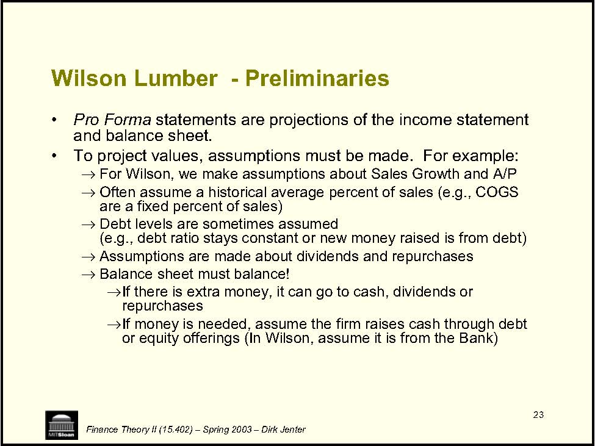

23 Wilson Lumber • Pro Forma • i → i → Often assume a historical → → → → → For example: repurchases Finance Theory II (15.402) – Spring 2003 – Dirk Jenter -Preliminaries statements are projections of the income statement and balance sheet. To project values, assumpt ons must be made.  For Wilson, we make assumpt ons about Sales Growth and A/P  average percent of sales (e.g., COGS are a fixed percent of sales) Debt levels are sometimes assumed (e.g., debt ratio stays constant or new money raised is from debt) Assumptions are made about dividends and repurchases Balance sheet must balance! If there is extra money, it can go to cash, dividends or If money is needed, assume the firm raises cash through debt or equity offerings (In Wilson, assume it is from the Bank) 

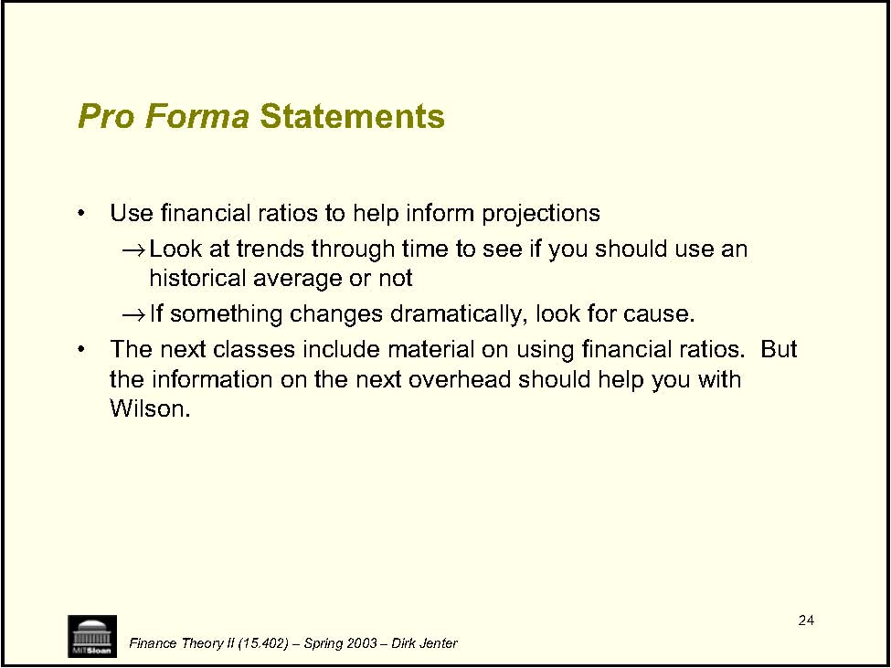

24 Pro Forma Statements • → → • But Wilson. historical average or not ions Finance Theory II (15.402) – Spring 2003 – Dirk Jenter Use financial ratios to help inform project Look at trends through time to see if you should use an If something changes dramatically, look for cause. The next classes include material on using financial ratios.  the information on the next overhead should help you with 

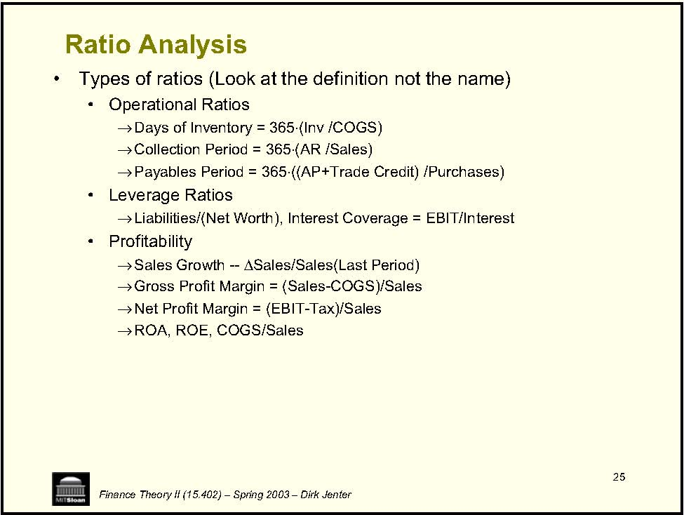

25 • ) • → ⋅ → ⋅(AR /Sales) → ⋅ • → ) • → ∆ → → → Operational Ratios Collecti Finance Theory II (15.402) – Spring 2003 – Dirk Jenter Ratio Analysis Types of ratios (Look at the definition not the name Days of Inventory = 365 (Inv /COGS) on Period = 365 Payables Period = 365 ((AP+Trade Credit) /Purchases) Leverage Ratios Liabilities/(Net Worth , Interest Coverage = EBIT/Interest Profitability Sales Growth --Sales/Sales(Last Period) Gross Profit Margin = (Sales-COGS)/Sales Net Profit Margin = (EBIT-Tax)/Sales ROA, ROE, COGS/Sales 

26 Next Time • • • → → Read Finance Theory II (15.402) – Spring 2003 – Dirk Jenter Wilson Case is due at the beginning of class We will discuss Wilson in the next two classes BM Chapter 29 Optional resource: Chapters 2-3 of Higgins 

13

         Acrobat Distiller 6.0 (Windows)

         Haas School of Business

         Haas School of Business

         Acrobat PDFMaker 6.0 for PowerPoint

         2004-01-22T11:32:54+05:30

         2004-01-22T11:29:31+05:30

         2004-01-22T11:32:54+05:30

         uuid:6213cc21-4547-4ce0-a6b7-e8b56c6881cf

         uuid:dcfab1fa-01c0-4914-a417-3baf270bd239

         xml

               Money &amp; Capital Markets

               Mark Taranto

Finance Theory II

(Corporate Finance)

Katharina Lewellen

February 5, 2003

Today

- Preliminaries

- Introduction to the course

- Corporate finance

- Types of questions

- Course outline

- Course requirements

- Case of Unidentified Industries

Preliminaries

- Texts

- −Brealey&amp; Myers,Principles of Corporate Finance, 7thedition

- −Higgins, Analysis for Financial Management, 7thedition

- −Case and Readings Packet

- Professor  

- −Katharina Lewellen

Introduction

Corporate finance

- Investment policy

- How the firm spends its money (real and financial assets)

- Financing and payout policy

- How the firm obtains funds (debt, equity) and disposes of 

- excess cash

Balance sheet view of the firm

Assets

Liabilities

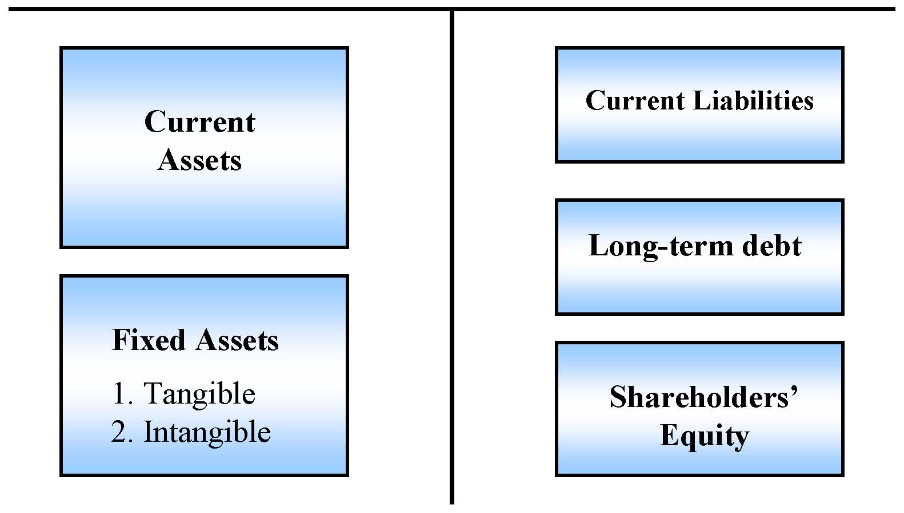

Current Assets

Fixed Assets1. Tangible2. Intangible

Current Liabilities

Long-term debt

Shareholders’Equity

Introduction, cont.

But we also need to understand…

- Capital markets

- Types of securities (stocks, bonds, options…)

- Trade-off between risk and return

- Pricing

- Taxes and government regulation

Financial markets

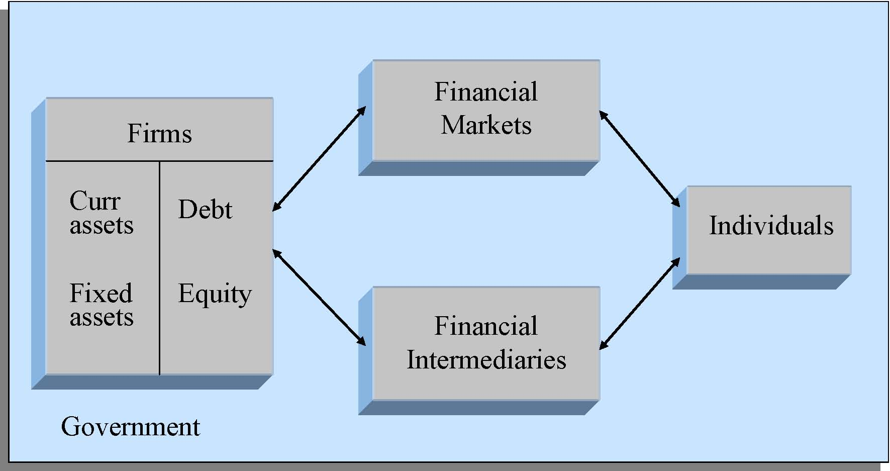

Financial MarketsFirmsIndividualsFinancial IntermediariesCurrassetsFixed assetsDebtEquityGovernment

Introduction, cont.

Finance is really about value

- Firms

- Projects and real investments

- Securities

Common characteristic

- Invest cash today in exchange for cash (hopefully) in the 

- future

Central question

- How do we create value through investment and financing decisions?

Types of questions

Investment and financing decisions

- At the end of 1999, GM had $11.4 billion in cash.

- Should it invest in new projects or return the cash to shareholders? 

- If it decides to return the cash, should it declare a dividend or repurchase stock? 

- If it decides to invest, what is the most valuable investment?  What are the risks?

General Dynamic

- Major contractor in the defense industry

- Doing well during 1980s (cold war)

- Growth in sales

- Reasonable profitability

- R&amp;D and capital investment

- Beginning of 1990s

- The end of cold war

- Likely decline in defense spending

- Strategy???

General Dynamics

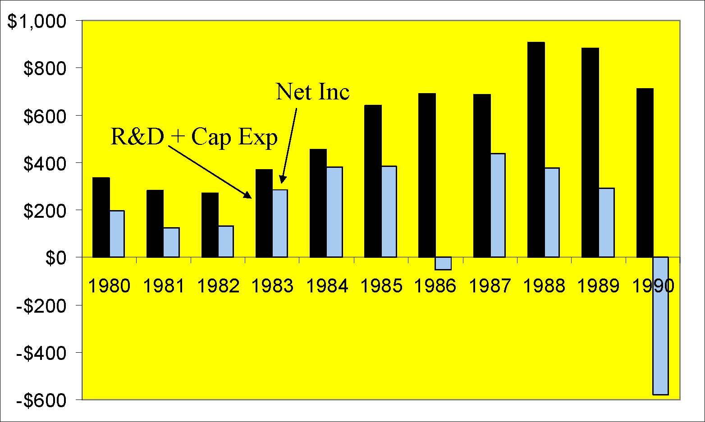

-$600-$400-$200$0$200$400$600$800$1,00019801981198219831984198519861987198819891990R&amp;D + Cap ExpNet Inc

Value of $100 invested in Jan. ‘80

$0$100$200$300$400$500198019811982198319841985198619871988198919901991MarketGD

General Dynamics

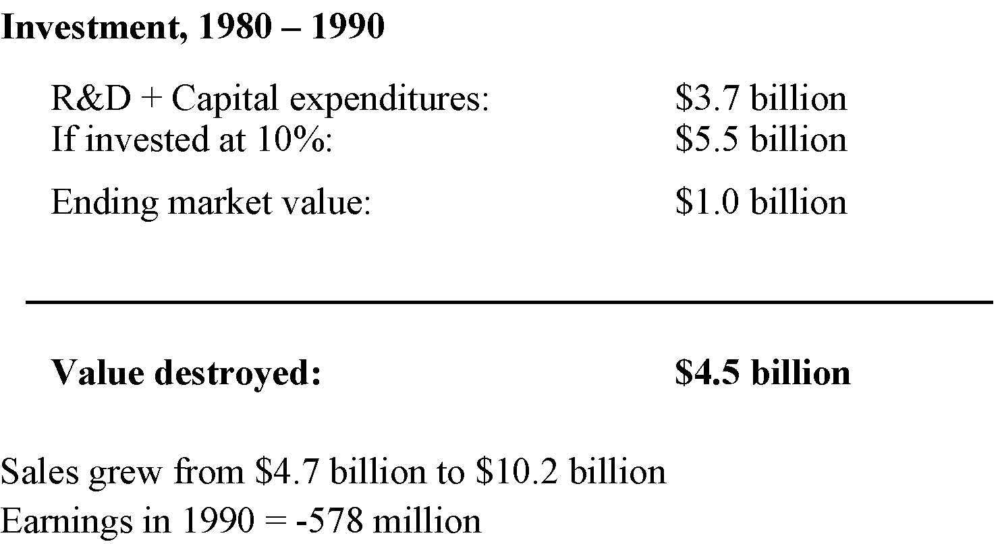

Investment, 1980 –1990R&amp;D + Capital expenditures:$3.7 billionIf invested at 10%:$5.5 billionEnding market value:$1.0 billionValue destroyed:$4.5 billionSales grew from $4.7 billion to $10.2 billionEarnings in 1990 = -578 million

New strategy in 1991

William A. Anders (new CEO):

- Cuts capital expenditure and R&amp;D

- Cap. Exp. drops from $321 million in 1990 to $81 million in 1991

- Sells off divisions and subsidiaries

- Cuts workforce

- Distributes cash to shareholders

- From 1991 through 1993, GD returns $3.4 billion to shareholders and debtholders

General Dynamics: 1987 –1997

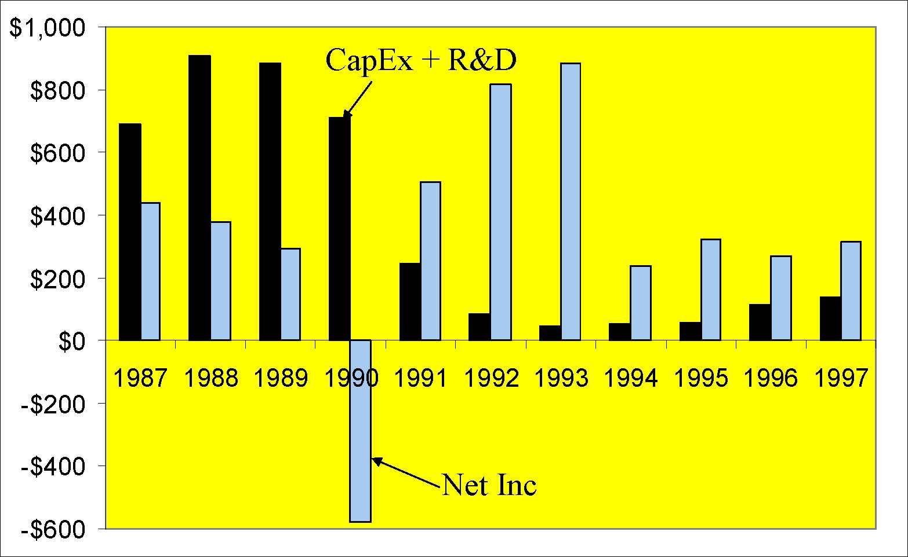

-$600-$400-$200$0$200$400$600$800$1,00019871988198919901991199219931994199519961997Net IncCapEx + R&amp;D

Value of $100 invested Jan. ‘91

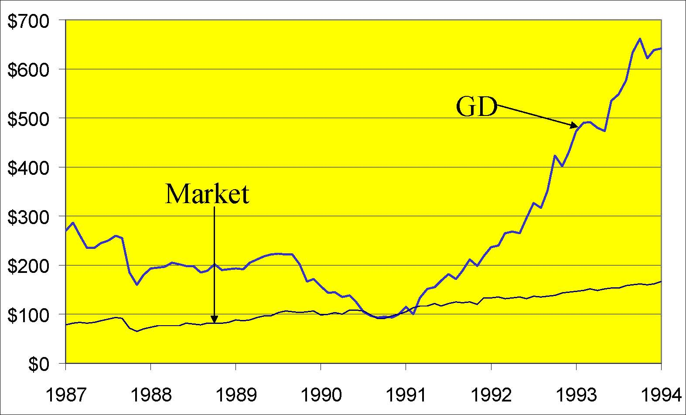

$0$100$200$300$400$500$600$70019871988198919901991199219931994MarketGD

Types of questions

Investment and financing decisions

- Your firm needs to raise capital to finance growth.  

- Should you issue debt or equity or obtain a bank loan?

- How will the stock market react to your decision? 

- If you choose debt, should the bonds be convertible?  callable? Long or short maturity?

- If you choose equity, what are the trade-offs between common and preferred stock?

Types of questions, cont.

Investment and financing decisions

- IBM recently announced that it would repurchase $2.5 billion in stock.  Its price jumped 7% after the announcement.  Why?  How would themarket have reacted if IBM increased dividends instead?  SupposeIntel made the same announcement.  Would we expect the same price response?

- Motorola wants to build a new chip factory in Ireland.  How willfluctuations in the foreign exchange rate affect the value of the project?  What are the risks?  What actions can Motorola take to hedge therisks?  More importantly, should it hedge the risks?  What are the costs and benefits? 

Our Approach

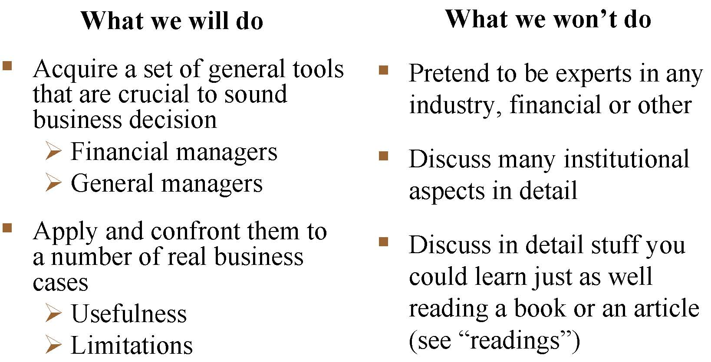

What we will doAcquire a set of general tools that are crucial to sound business decisionFinancial managersGeneral managersApply and confront them to a number of real business casesUsefulnessLimitationsWhat we won’t doPretend to be experts in any industry, financial or otherDiscuss many institutional aspects in detailDiscuss in detail stuff you could learn just as well reading a book or an article (see “readings”)

Outline: Theory + Applications

- Part I: Financing

- −Capital structure

- −Payout policy

- Part II: Valuation

- −Project valuation (FCF, PV, Real Options)

- −Company valuation (M&amp;A, Start-ups)

- Part III: Selected topics in corporate finance

- −Corporate governance

- −Hedging/Risk management

The tools of finance (15.401)

- Time Value of Money

- Portfolio Theory

- Asset Pricing Theory

- Efficient Markets Hypothesis

- Option Pricing Theory

- The Concept of No-Arbitrage

- Agency Theory (Micro-economics, Incentives and Contracts)

Course Requirements

- Class Participation (10%)

- Case Memoranda (30%)

- Teams up to four people

- Hand in all write-ups except two write-ups of your choice

- A professional memo to the decision maker

- Midterm (30%)

- Final (30%)

The Case of the Unidentified Industries

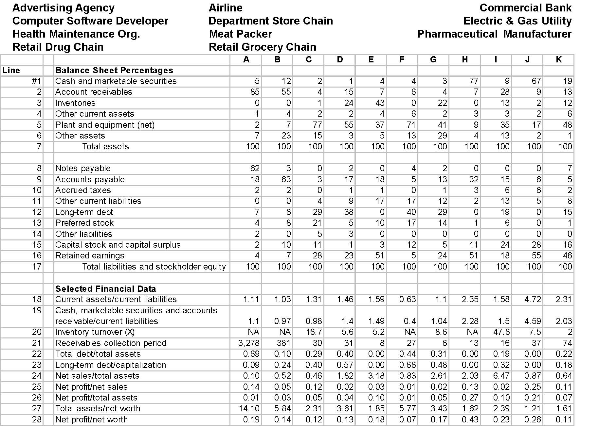

Advertising AgencyAirlineCommercial BankComputer Software DeveloperDepartment Store ChainElectric &amp; Gas UtilityHealth Maintenance Org.Meat PackerPharmaceutical Manufacturer Retail Drug ChainRetail Grocery ChainABCDEFGHIJKLineBalance Sheet Percentages#1Cash and marketable securities5122144377967192Account receivables85554157647289133Inventories00124430220132124Other current assets142246233265Plant and equipment (net)27775537714193517486Other assets72315351329413217          Total assets1001001001001001001001001001001008Notes payable6230204200079Accounts payable18633171851332156510Accrued taxes2201101366211Other current liabilities00491717122135812Long-term debt7629380402901901513Preferred stock48215101714160114Other liabilities2053000000015Capital stock and capital surplus21011131251124281616Retained earnings472823515245118554617          Total liabilities and stockholder equity100100100100100100100100100100100Selected Financial Data18Current assets/current liabilities1.111.031.311.461.590.631.12.351.584.722.3119Cash, marketable securities and accountsreceivable/current liabilities1.10.970.981.41.490.41.042.281.54.592.0320Inventory turnover (X)NANA16.75.65.2NA8.6NA47.67.5221Receivables collection period3,278381303182761316377422Total debt/total assets0.690.100.290.400.000.440.310.000.190.000.2223Long-term debt/capitalization0.090.240.400.570.000.660.480.000.320.000.1824Net sales/total assets0.100.520.461.823.180.832.612.036.470.870.6425Net profit/net sales0.140.050.120.020.030.010.020.130.020.250.1126Net profit/total assets0.010.030.050.040.100.010.050.270.100.210.0727Total assets/net worth14.105.842.313.611.855.773.431.622.391.211.6128Net profit/net worth0.190.140.120.130.180.070.170.430.230.260.11

Industry Groups

Service providers

- Advertising agency

- Airline

- Commercial bank

- HMO

Zero inventories

- A, B, F, H

Group 1:

- Advertising Agency

- Airline

- Commercial Bank

- HMO

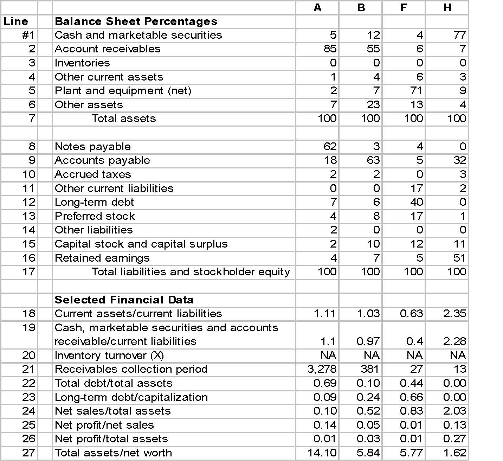

ABFHLineBalance Sheet Percentages#1Cash and marketable securities5124772Account receivables8555673Inventories00004Other current assets14635Plant and equipment (net)277196Other assets7231347          Total assets1001001001008Notes payable623409Accounts payable186353210Accrued taxes220311Other current liabilities0017212Long-term debt7640013Preferred stock4817114Other liabilities200015Capital stock and capital surplus210121116Retained earnings4755117          Total liabilities and stockholder equity100100100100Selected Financial Data18Current assets/current liabilities1.111.030.632.3519Cash, marketable securities and accountsreceivable/current liabilities1.10.970.42.2820Inventory turnover (X)NANANANA21Receivables collection period3,278381271322Total debt/total assets0.690.100.440.0023Long-term debt/capitalization0.090.240.660.0024Net sales/total assets0.100.520.832.0325Net profit/net sales0.140.050.010.1326Net profit/total assets0.010.030.010.2727Total assets/net worth14.105.845.771.62

Identified Industries in Group 1

ACommercial Bank

BAdvertising Agency

FAirline

HHealth Maintenance Organization (H.M.O.)

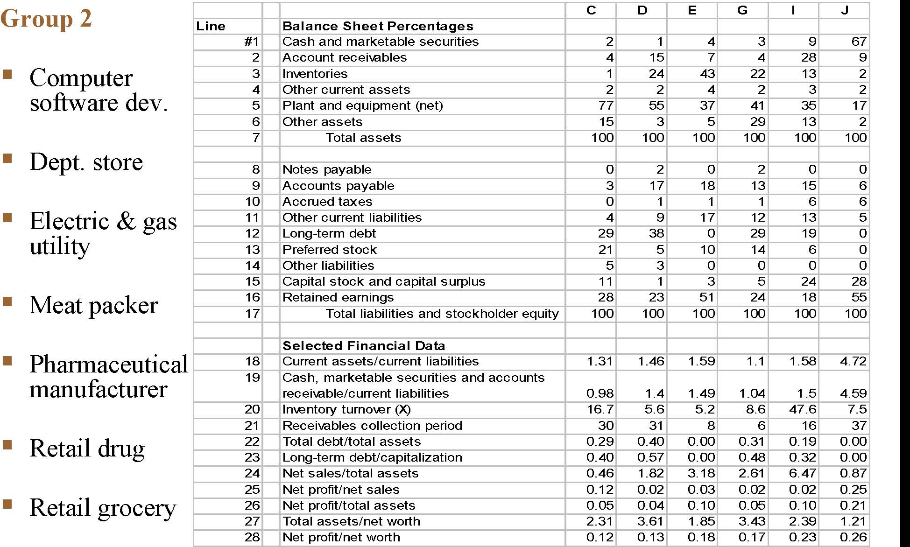

Group 2Computer software dev.Dept. storeElectric &amp; gas utilityMeat packerPharmaceutical manufacturerRetail drugRetail groceryCDEGIJLineBalance Sheet Percentages#1Cash and marketable securities21439672Account receivables415742893Inventories12443221324Other current assets2242325Plant and equipment (net)7755374135176Other assets1535291327          Total assets1001001001001001008Notes payable0202009Accounts payable317181315610Accrued taxes01116611Other current liabilities49171213512Long-term debt293802919013Preferred stock21510146014Other liabilities53000015Capital stock and capital surplus11135242816Retained earnings28235124185517          Total liabilities and stockholder equity100100100100100100Selected Financial Data18Current assets/current liabilities1.311.461.591.11.584.7219Cash, marketable securities and accountsreceivable/current liabilities0.981.41.491.041.54.5920Inventory turnover (X)16.75.65.28.647.67.521Receivables collection period303186163722Total debt/total assets0.290.400.000.310.190.0023Long-term debt/capitalization0.400.570.000.480.320.0024Net sales/total assets0.461.823.182.616.470.8725Net profit/net sales0.120.020.030.020.020.2526Net profit/total assets0.050.040.100.050.100.2127Total assets/net worth2.313.611.853.432.391.2128Net profit/net worth0.120.130.180.170.230.26

Group 2: Inventory turnover

<Table>
<TR>
<TD>

Industry

</TD>
<TD>

Inventory turnover

</TD>
</TR>
<TR>
<TD>

I

</TD>
<TD>

47.6

</TD>
</TR>
<TR>
<TD>

C

</TD>
<TD>

16.7

</TD>
</TR>
<TR>
<TD>

G

</TD>
<TD>

8.6

</TD>
</TR>
<TR>
<TD>

J

</TD>
<TD>

7.5

</TD>
</TR>
<TR>
<TD>

D

</TD>
<TD>

5.6

</TD>
</TR>
<TR>
<TD>

E

</TD>
<TD>

5.2

</TD>
</TR>
<TR>
<TD>

K

</TD>
<TD>

2.0

</TD>
</TR>
</Table>

Computer software dev.Dept. storeElectric &amp; gas utilityMeat packerPharmaceutical manufacturerRetail drugRetail grocery

Group 2: Receivables collection period

<Table>
<TR>
<TD>

Industry

</TD>
<TD>

Collection period

</TD>
</TR>
<TR>
<TD>

K

</TD>
<TD>

74

</TD>
</TR>
<TR>
<TD>

J

</TD>
<TD>

37

</TD>
</TR>
<TR>
<TD>

D

</TD>
<TD>

31

</TD>
</TR>
<TR>
<TD>

E

</TD>
<TD>

8

</TD>
</TR>
<TR>
<TD>

G

</TD>
<TD>

6

</TD>
</TR>
</Table>

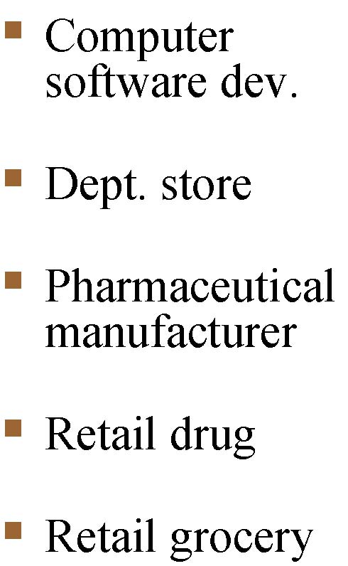

Computer software dev.Dept. storePharmaceutical manufacturerRetail drugRetail grocery

Group 2: Inventory &amp; PPE

<Table>
<TR>
<TD>

Industry

</TD>
<TD>

INV (%)

</TD>
<TD>

PPE (%)

</TD>
</TR>
<TR>
<TD>

D

</TD>
<TD>

24

</TD>
<TD>

55

</TD>
</TR>
<TR>
<TD>

K

</TD>
<TD>

12

</TD>
<TD>

48

</TD>
</TR>
<TR>
<TD>

J

</TD>
<TD>

2

</TD>
<TD>

17

</TD>
</TR>
</Table>

Computer software dev.Dept. storePharmaceutical manufacturer

The Identified Industries

ACommercial BankCiticorp

BAdvertising AgencyInterpublic

CElectric &amp; Gas UtilityConsolidated Edison

DDepartment Store ChainDayton-Hudson

ERetail Drug ChainWalgreen

FAirlineAMR Corp.

GRetail Grocery ChainAmerican Stores

HH.M.O.U.S. Healthcare

IMeat PackersIBP, Inc.

JSoftware DeveloperMicrosoft

KPharmaceutical Manuf.Novo Nordisk

Any Comments?

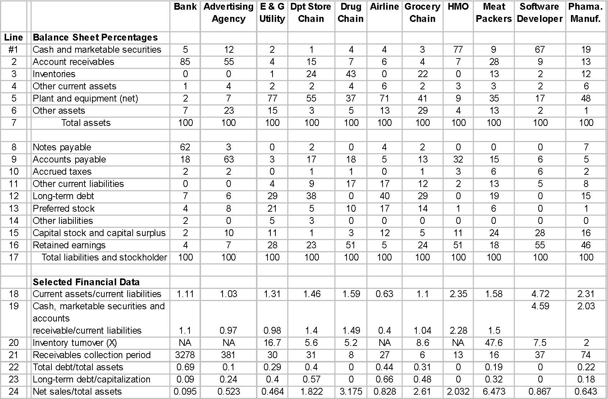

BankAdvertisingAgencyE &amp; GUtilityDpt StoreChainDrugChainAirlineGroceryChainHMOMeatPackersSoftwareDeveloperPhama.Manuf.LineBalance Sheet Percentages#1Cash and marketable securities5122144377967192Account receivables85554157647289133Inventories00124430220132124Other current assets142246233265Plant and equipment (net)27775537714193517486Other assets72315351329413217          Total assets1001001001001001001001001001001008Notes payable6230204200079Accounts payable18633171851332156510Accrued taxes2201101366211Other current liabilities00491717122135812Long-term debt7629380402901901513Preferred stock48215101714160114Other liabilities2053000000015Capital stock and capital surplus21011131251124281616Retained earnings472823515245118554617   Total liabilities and stockholder 100100100100100100100100100100100Selected Financial Data18Current assets/current liabilities1.111.031.311.461.590.631.12.351.584.722.3119Cash, marketable securities and accountsreceivable/current liabilities1.10.970.981.41.490.41.042.281.54.592.0320Inventory turnover (X)NANA16.75.65.2NA8.6NA47.67.5221Receivables collection period3278381303182761316377422Total debt/total assets0.690.10.290.400.440.3100.1900.2223Long-term debt/capitalization0.090.240.40.5700.660.4800.3200.1824Net sales/total assets0.0950.5230.4641.8223.1750.8282.612.0326.4730.8670.643

Leverage

IndustryFirmIndustryMeanIndustryStd DevIndustryMedianAmerican AirlinesAirlines0.440.320.200.31Dayton HudsonDepartment Stores0.400.290.170.30American StoresGrocery Stores0.310.350.200.32Consolidated EdisonCombination Utility Services0.290.350.050.35Novo NordiskPharmaceuticals0.220.240.920.08IBPMeat Products0.190.310.240.30InterpublicAdvertising Agencies0.100.080.060.09WalgreensDrug Stores0.000.240.180.27MicrosoftPrepackaged Software0.000.070.190.01US HealthcareHMOs0.000.090.110.04Total Debt/Total Asset

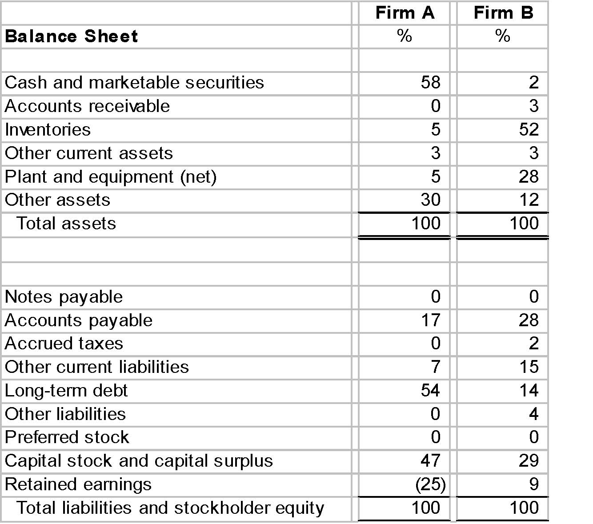

Firm AFirm BBalance Sheet%%Cash and marketable securities582Accounts receivable03Inventories552Other current assets33Plant and equipment (net)528Other assets3012  Total assets100100Notes payable00Accounts payable1728Accrued taxes02Other current liabilities715Long-term debt5414Other liabilities04Preferred stock00Capital stock and capital surplus4729Retained earnings(25)9  Total liabilities and stockholder equity100100

         Acrobat Distiller 6.0 (Windows)

         2004-01-21T10:55:58+05:30

         2004-01-21T10:57:10+05:30

         2004-01-21T10:57:10+05:30

         PScript5.dll Version 5.2

         uuid:771273be-b809-4627-8c39-0ee9feddbe14

         uuid:a8d943b5-ae08-44e5-882d-9987298ec351

         xml

               djenter

               Microsoft PowerPoint - LN04(CS1)_Shortened.ppt

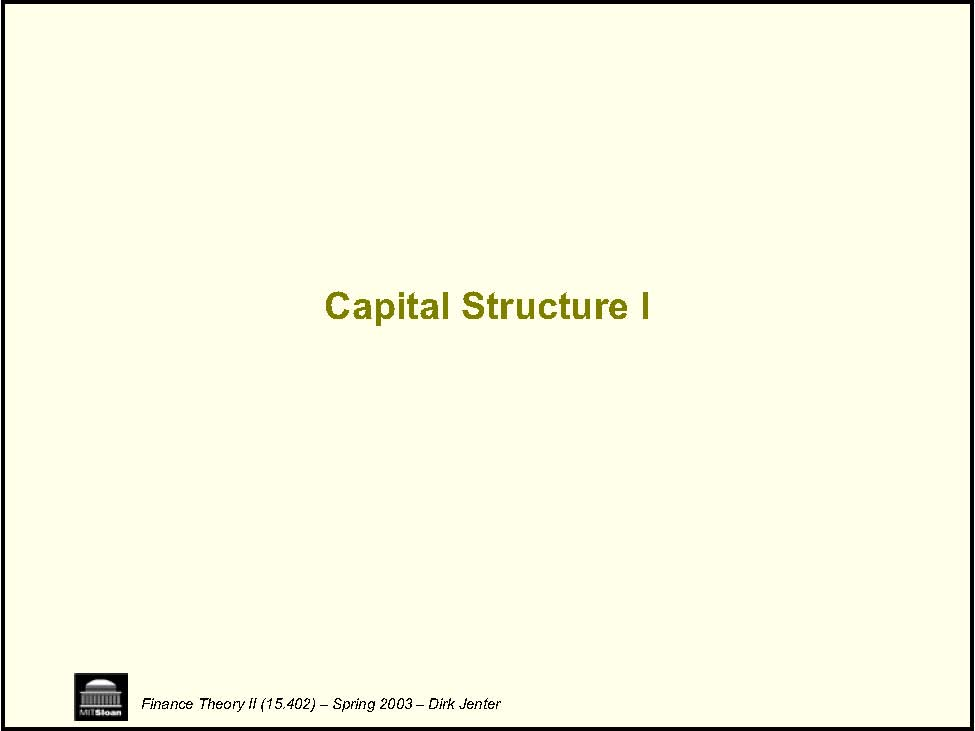

Capital Structure I Finance Theory II (15.402) – Spring 2003 – Dirk Jenter 

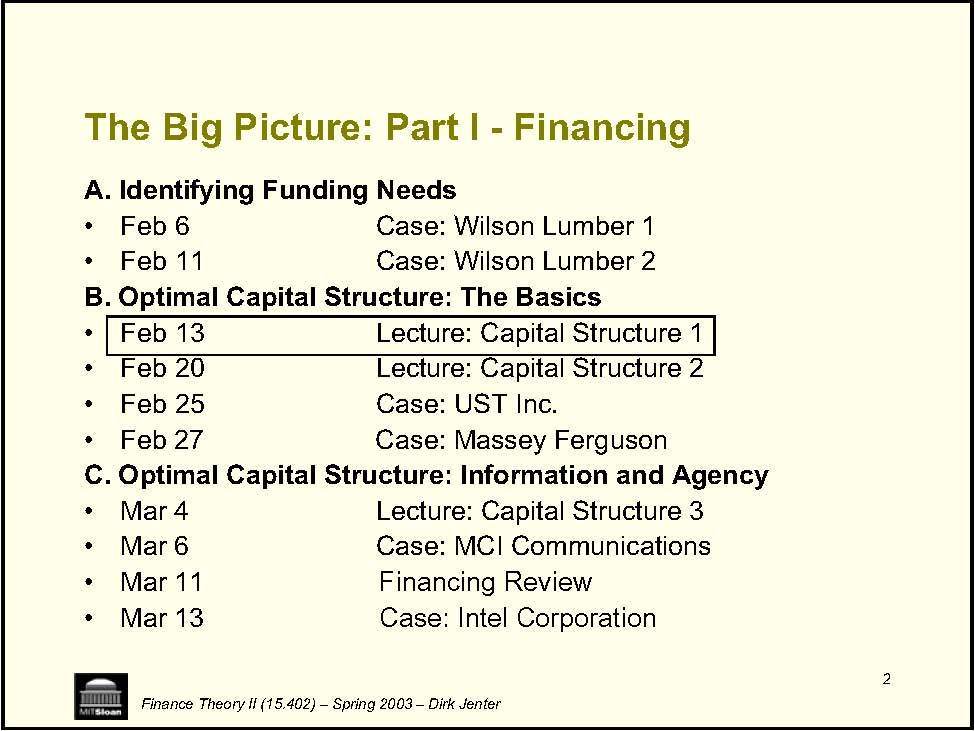

2 • • • • • • • • Financing Review Case: Intel Corporation Finance Theory II (15.402) – Spring 2003 – Dirk Jenter The Big Picture: Part I -Financing A. Identifying Funding Needs Feb 6 Case: Wilson Lumber 1 Feb 11 Case: Wilson Lumber 2 B. Optimal Capital Structure: The Basics Feb 13 Lecture: Capital Structure 1 Feb 20 Lecture: Capital Structure 2 Feb 25 Case: UST Inc. Feb 27 Case: Massey Ferguson C. Optimal Capital Structure: Information and Agency Mar 4 Lecture: Capital Structure 3 Mar 6 Case: MCI Communications •Mar 11•Mar 13

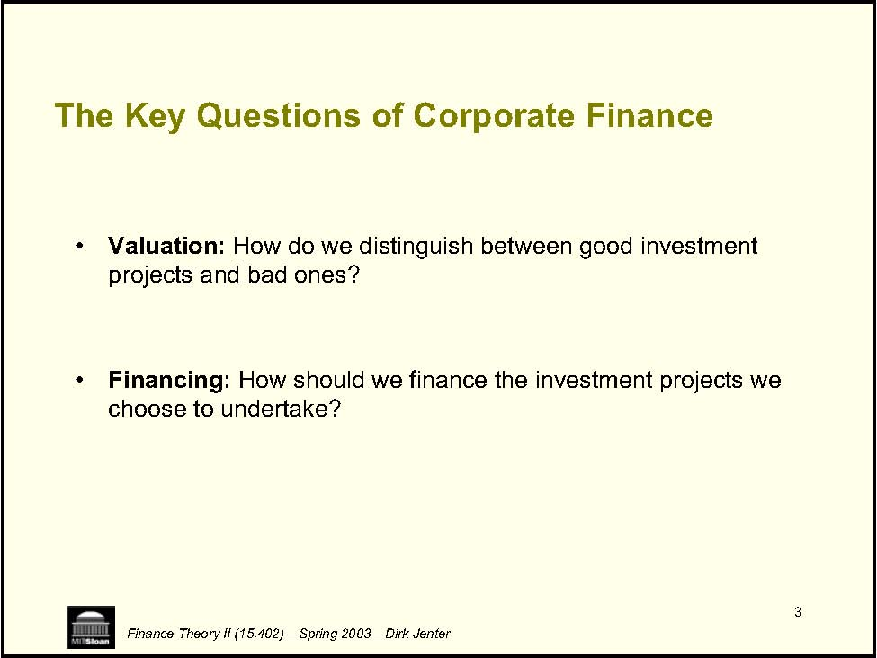

3 • Valuation: • Financing: Finance Theory II (15.402) – Spring 2003 – Dirk Jenter The Key Questions of Corporate Finance How do we distinguish between good investment projects and bad ones? How should we finance the investment projects we choose to undertake? 

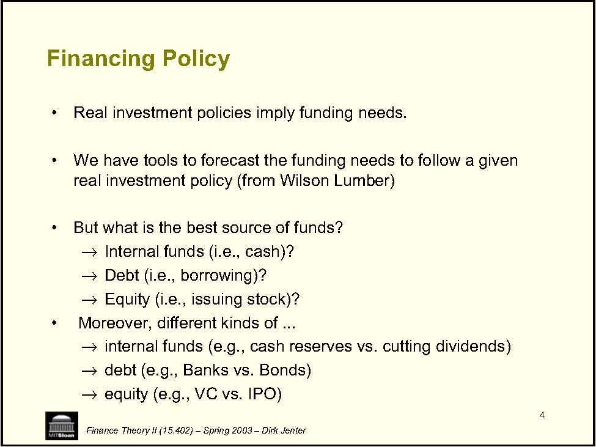

4 • • • →→→• →→→Finance Theory II (15.402) – Spring 2003 – Dirk Jenter Financing Policy Real investment policies imply funding needs. We have tools to forecast the funding needs to follow a given real investment policy (from Wilson Lumber) But what is the best source of funds? Internal funds (i.e., cash)? Debt (i.e., borrowing)? Equity (i.e., issuing stock)? Moreover, different kinds of ... internal funds (e.g., cash reserves vs. cutting dividends) debt (e.g., Banks vs. Bonds) equity (e.g., VC vs. IPO) 

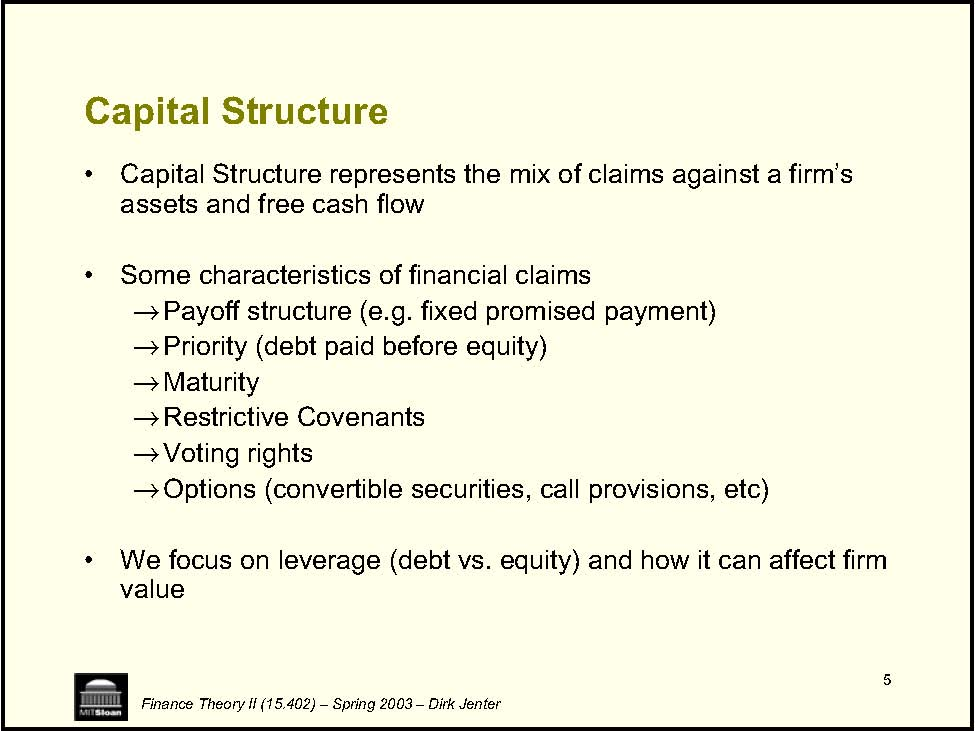

5 Capital Structure • • →→→Maturity →→→• value Finance Theory II (15.402) – Spring 2003 – Dirk Jenter Capital Structure represents the mix of claims against a firm’s assets and free cash flow Some characteristics of financial claims Payoff structure (e.g. fixed promised payment) Priority (debt paid before equity) Restrictive Covenants Voting rights Options (convertible securities, call provisions, etc) We focus on leverage (debt vs. equity) and how it can affect firm 

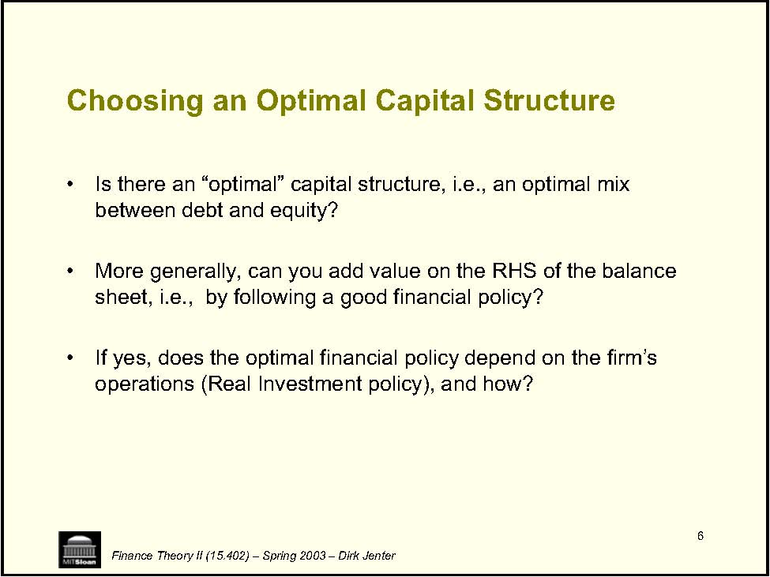

6 Choosing an Optimal Capital Structure • • sheet, i.e.,• Finance Theory II (15.402) – Spring 2003 – Dirk Jenter Is there an “optimal” capital structure, i.e., an optimal mix between debt and equity? More generally, can you add value on the RHS of the balance   by following a good financial policy? If yes, does the optimal financial policy depend on the firm’s operations (Real Investment policy), and how? 

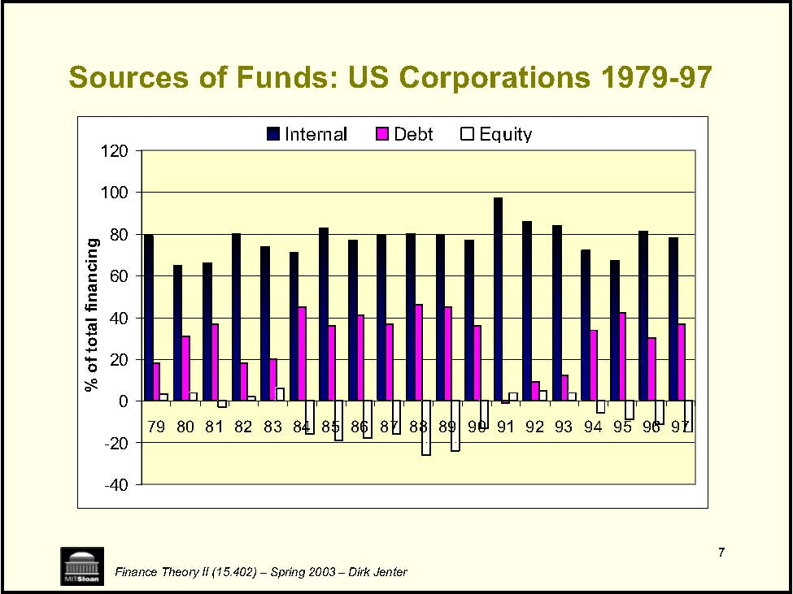

7 Sources of Funds: US Corporations 1979-97 0 20 40 60 80 100 120 79 80 81 82 84 85 86 87 89 91 92 93 94 96 97 g Eqy Finance Theory II (15.402) – Spring 2003 – Dirk Jenter -40 -20 83 88 90 95 % of total financinInternal Debt uit

# Companies and Industries Vary in Their Capital Structures 

<Table>
<TR>
<TD>  Industry </TD>
<TD>Debt Ratio* (%)</TD>
</TR>
<TR>
<TD>  Electric and Gas </TD>
<TD>43.2</TD>
</TR>
<TR>
<TD>  Food Production </TD>
<TD>22.9</TD>
</TR>
<TR>
<TD>  Paper and Plastic </TD>
<TD>30.4</TD>
</TR>
<TR>
<TD>  Equipment </TD>
<TD>19.1</TD>
</TR>
<TR>
<TD>  Retailers </TD>
<TD>21.7</TD>
</TR>
<TR>
<TD>  Chemicals </TD>
<TD>17.3</TD>
</TR>
<TR>
<TD>  Computer Software </TD>
<TD>3.5 </TD>
</TR>
<TR>

</TR>
<TR>
<TD>Average over all industries </TD>
<TD>21.5% </TD>
</TR>
</Table>

*	Debt Ratio = Ratio of book value of debt to the sum of the book value of debt plus the market value of equity.

8 

Finance Theory II (15.402) – Spring 2003 – Dirk Jenter 

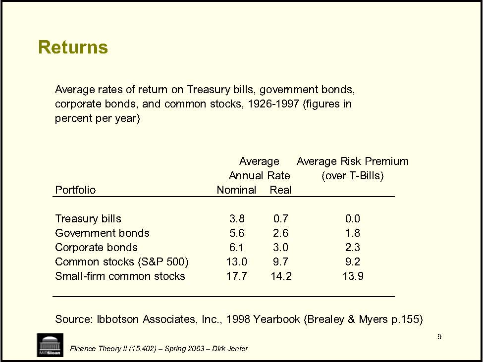

9 Finance Theory II (15.402) – Spring 2003 – Dirk Jenter Returns Average Risk Premium Portfolio Nominal Real Treasury bills 3.8 0.7 0.0 Government bonds 5.6 2.6 1.8 Corporate bonds 6.1 3.0 2.3 Common stocks (S&amp;P 500) 13.0 9.7 9.2 Small-firm common stocks 17.7 14.2 13.9 Source: Ibbotson Associates, Inc., 1998 Yearbook (Brealey &amp; Myers p.155) (over T-Bills) Average Annual Rate Average rates of return on Treasury bills, government bonds, corporate bonds, and common stocks, 1926-1997 (figures in percent per year) 

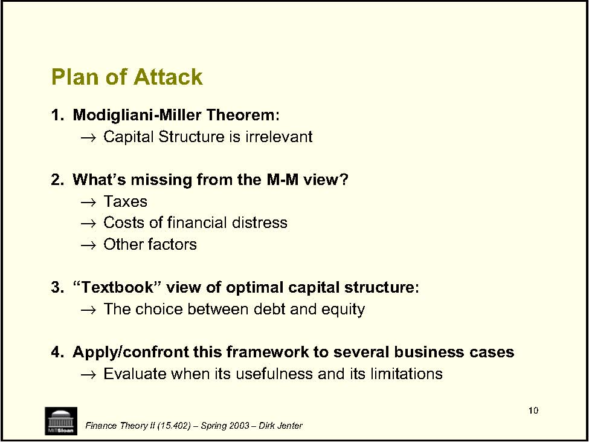

10 Plan of Attack →→Taxes →→→→Finance Theory II (15.402) – Spring 2003 – Dirk Jenter 1. Modigliani-Miller Theorem: Capital Structure is irrelevant 2. What’s missing from the M-M view? Costs of financial distress Other factors 3. “Textbook” view of optimal capital structure: The choice between debt and equity 4. Apply/confront this framework to several business cases Evaluate when its usefulness and its limitations 

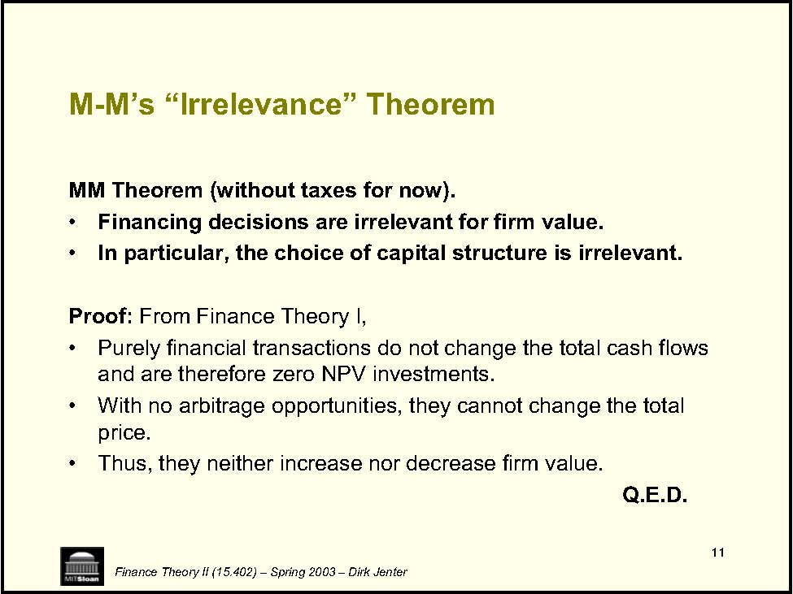

11 M-M’s “Irrelevance” Theorem • • Proof: • • price. • Q.E.D. Finance Theory II (15.402) – Spring 2003 – Dirk Jenter MM Theorem (without taxes for now). Financing decisions are irrelevant for firm value. In particular, the choice of capital structure is irrelevant. From Finance Theory I, Purely financial transactions do not change the total cash flows and are therefore zero NPV investments. With no arbitrage opportunities, they cannot change the total Thus, they neither increase nor decrease firm value. 

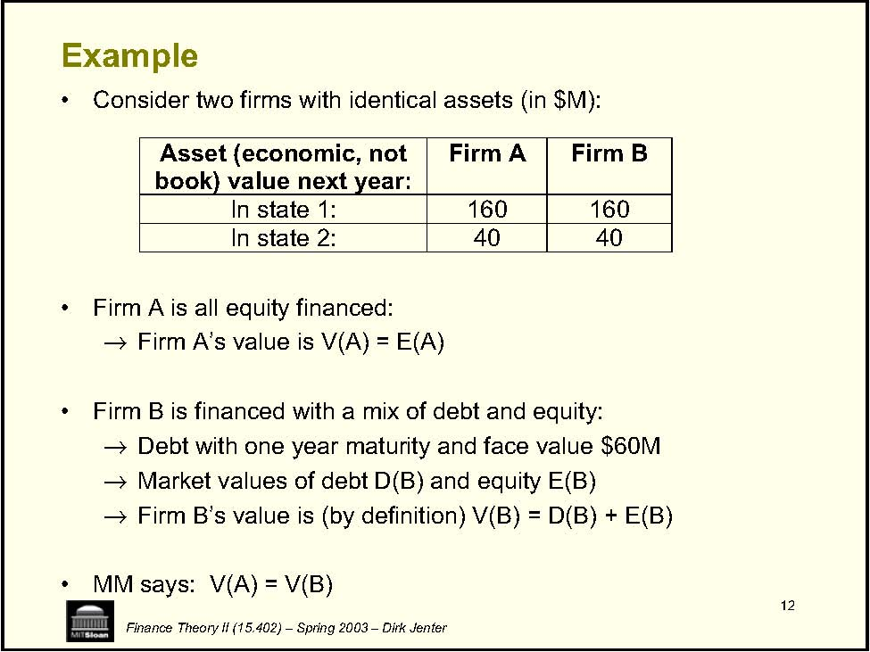

12 Example • • →• →→→• Firm A Firm B In state 1: 160 160 In state 2: 40 40 Finance Theory II (15.402) – Spring 2003 – Dirk Jenter Consider two firms with identical assets (in $M): Firm A is all equity financed: Firm A’s value is V(A) = E(A) Firm B is financed with a mix of debt and equity: Debt with one year maturity and face value $60M Market values of debt D(B) and equity E(B) Firm B’s value is (by definition) V(B) = D(B) + E(B) MM says:  V(A) = V(B) Asset (economic, not book) value next year: 

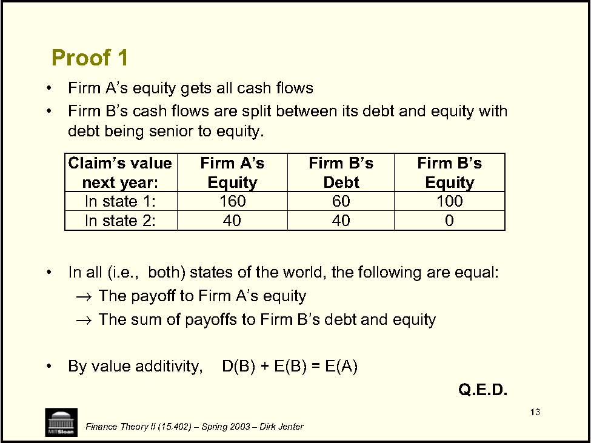

13 Proof 1 • • • →The payoff to Firm A’s equity →• Q.E.D. Claim’s value Debt 100 40 40 0 Finance Theory II (15.402) – Spring 2003 – Dirk Jenter Firm A’s equity gets all cash flows Firm B’s cash flows are split between its debt and equity with debt being senior to equity. In all (i.e.,  both) states of the world, the following are equal: The sum of payoffs to Firm B’s debt and equity By value additivity,  D(B) + E(B) = E(A) next year: Firm A’s Equity Firm B’s Firm B’s Equity In state 1: 160 60 In state 2: 

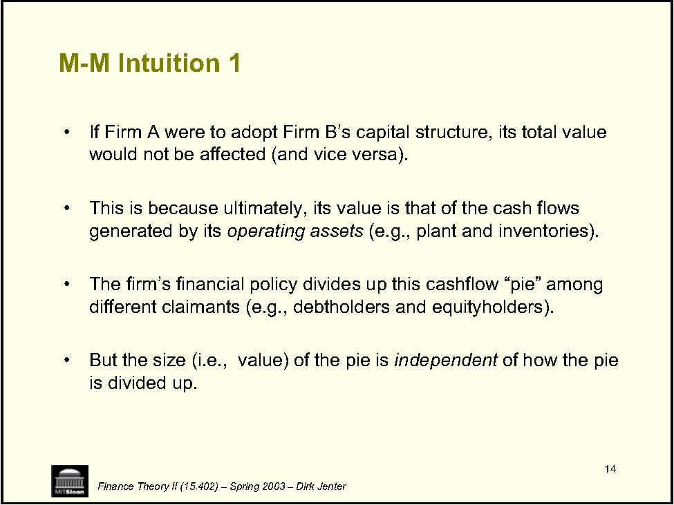

14 M-M Intuition 1 • • • • of how the pie is divided up. Finance Theory II (15.402) – Spring 2003 – Dirk Jenter If Firm A were to adopt Firm B’s capital structure, its total value would not be affected (and vice versa). This is because ultimately, its value is that of the cash flows generated by its operating assets (e.g., plant and inventories). The firm’s financial policy divides up this cashflow “pie” among different claimants (e.g., debtholders and equityholders). But the size (i.e.,  value) of the pie is independent 

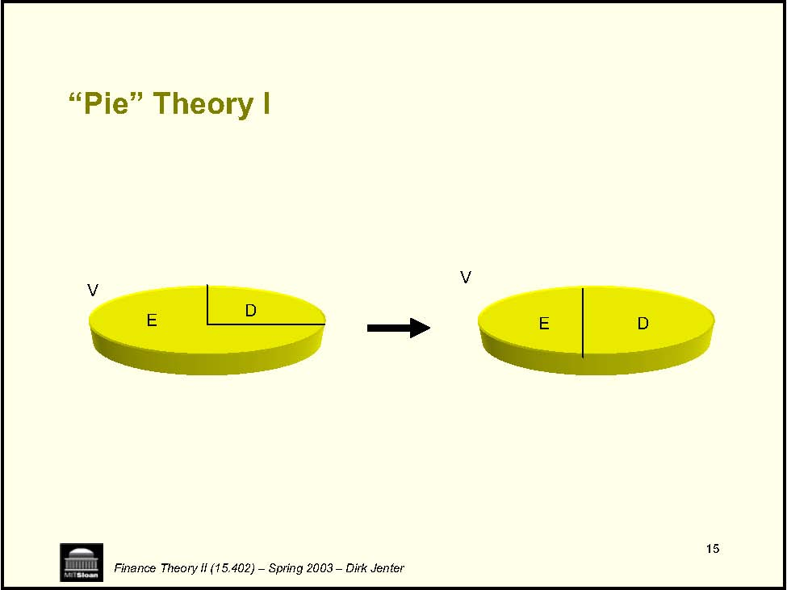

15 V E D E D V Finance Theory II (15.402) – Spring 2003 – Dirk Jenter “Pie” Theory I 

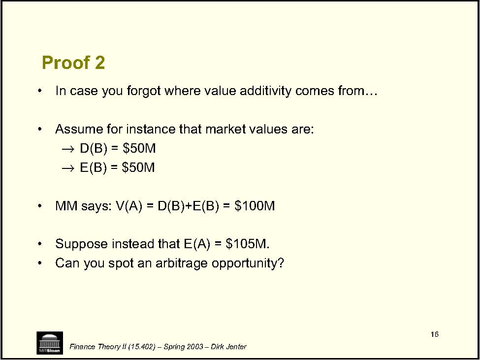

16 Proof 2 • • →→E(B) = $50M • • • Finance Theory II (15.402) – Spring 2003 – Dirk Jenter In case you forgot where value additivity comes from… Assume for instance that market values are: D(B) = $50M MM says: V(A) = D(B)+E(B) = $100M Suppose instead that E(A) = $105M. Can you spot an arbitrage opportunity? 

# Proof 2 (cont.) 

• Arbitrage strategy: 

- Buy 1/1M of Firm B’s equity for $50 

- Buy 1/1M of Firm B’s debt for $50 

- Sell 1/1M of Firm A’s equity for $105 

<Table>
<TR>

<TH>Today</TH>
<TH> Next year State 1 </TH>
<TH>Next year State 2 </TH>
</TR>
<TR>
<TH>Firm B’s equity </TH>
<TD>-$50</TD>
<TD> +$100 </TD>
<TD>$0 </TD>
</TR>
<TR>
<TH>Firm B’s debt </TH>
<TD>-$50</TD>
<TD> +$60 </TD>
<TD>+$40 </TD>
</TR>
<TR>
<TH>Subtotal </TH>
<TD>-$100 </TD>
<TD>+$160 </TD>
<TD>+$40 </TD>
</TR>
<TR>
<TH>Firm A’s equity </TH>
<TD>+$105 </TD>
<TD>-$160 </TD>
<TD>-$40 </TD>
</TR>
<TR>
<TH>Total </TH>
<TD>+$5 </TD>
<TD>$0 </TD>
<TD>$0 </TD>
</TR>
</Table>

Note: Combining Firm B’s debt and equity amounts to “undoing Firm B’s leverage” (see bolded cells). 

17 

Finance Theory II (15.402) – Spring 2003 – Dirk Jenter 

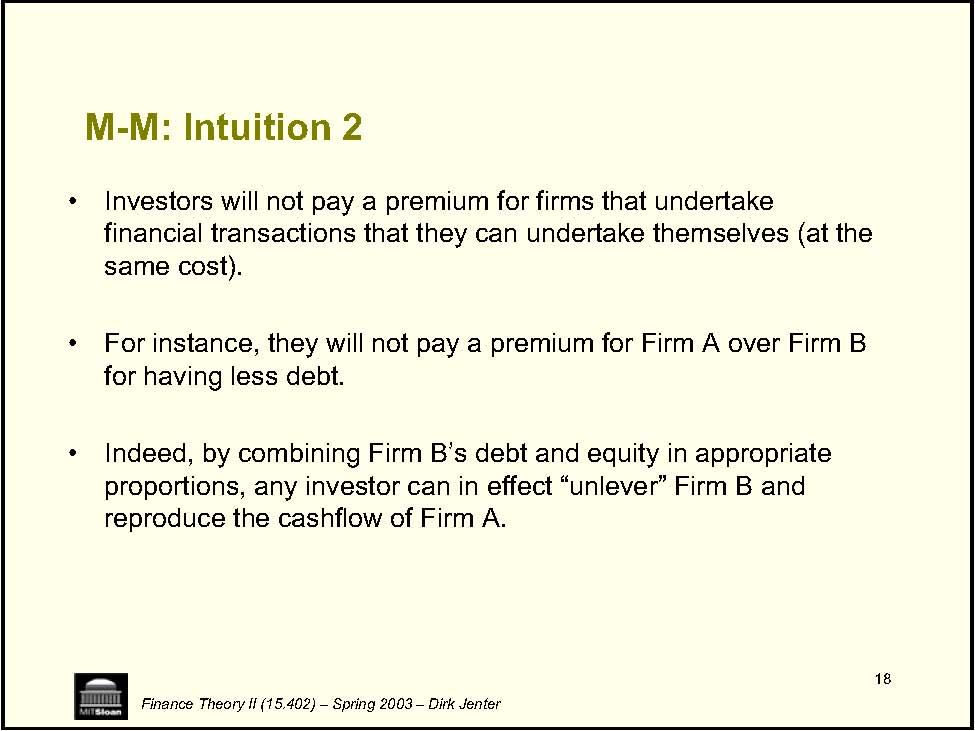

18 M-M: Intuition 2 • • • Finance Theory II (15.402) – Spring 2003 – Dirk Jenter Investors will not pay a premium for firms that undertake financial transactions that they can undertake themselves (at the same cost). For instance, they will not pay a premium for Firm A over Firm B for having less debt. Indeed, by combining Firm B’s debt and equity in appropriate proportions, any investor can in effect “unlever” Firm B and reproduce the cashflow of Firm A. 

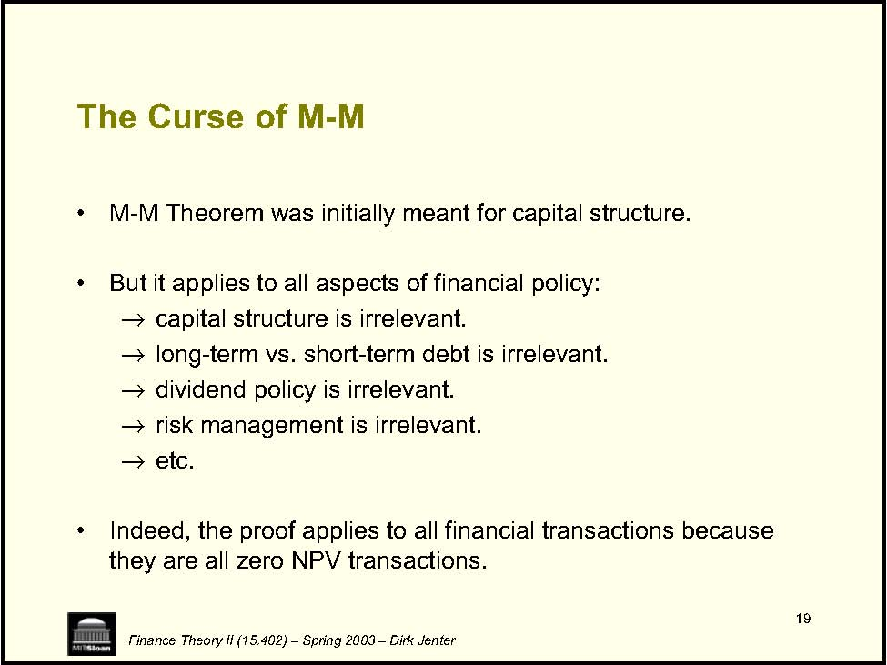

19 The Curse of M-M • • →→→dividend policy is irrelevant. →→etc. • they are all zero NPV transactions. Finance Theory II (15.402) – Spring 2003 – Dirk Jenter M-M Theorem was initially meant for capital structure. But it applies to all aspects of financial policy: capital structure is irrelevant. long-term vs. short-term debt is irrelevant. risk management is irrelevant. Indeed, the proof applies to all financial transactions because 

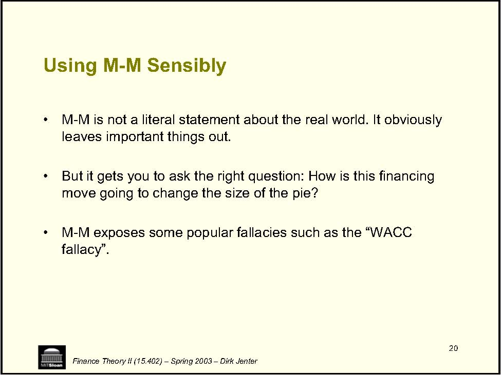

20 • • • fallacy”. Finance Theory II (15.402) – Spring 2003 – Dirk Jenter Using M-M Sensibly M-M is not a literal statement about the real world. It obviously leaves important things out. But it gets you to ask the right question: How is this financing move going to change the size of the pie? M-M exposes some popular fallacies such as the “WACC 

         Compaq

         Acrobat Distiller 6.0 (Windows)

         Compaq

         Acrobat PDFMaker 6.0 for PowerPoint

         2004-01-22T11:38:07+05:30

         2004-01-22T11:37:03+05:30

         2004-01-22T11:38:07+05:30

         uuid:ed691fdf-aa2e-4239-9e47-13e2db0caf26

         uuid:7955d90a-8ab3-4381-9a39-ae24838674db

         xml

               No Slide Title

               Leslie A. Larocca

Capital Structure

Katharina Lewellen

Finance Theory II

February 18 and 19, 2003

The Key Questions of Corporate Finance

- Valuation: How do we distinguish between good investment projects and bad ones?

- Financing: How should we finance the investment projects we choose to undertake?

(Real) Investment Policy

- “Which projects should the firm undertake?”

- Open a new plant?

- Increase R&amp;D?

- Scale operations up or down?

- Acquire another company?

- We know that real investments can create value

- Discounted Cash Flow (DCF) analysis

- Positive NPV projects add value

- We revisit this in the course’s  “Valuation” module (Part II)

Financing Policy

- Real investment policies imply funding needs

- We have tools to forecast the funding needs to follow a given real investment policy (from Wilson Lumber)

- But what is the best source of funds?

- Internal funds (i.e., Cash)?

- Debt (i.e., borrowing)?

- Equity (i.e., issuing stock)?

- Moreover, different kinds of ...

- Internal funds (e.g., cash reserves vs. cutting dividends)

- Debt (e.g., Banks vs. Bonds)

- Equity (e.g., VC vs. IPO)

Choosing an Optimal Capital Structure

- Is there an “optimal” capital structure, i.e., an optimal mix between debt and equity?

- More generally, can you add value on the RHS of the balance sheet, i.e.,  by following a good financial policy?

- If yes, does the optimal financial policy depend on the firm’s operations (Real Investment policy), and how?

- We study this in the course’s “Financing” module (Part I).

Capital Structures: US Corporations 1975-2001

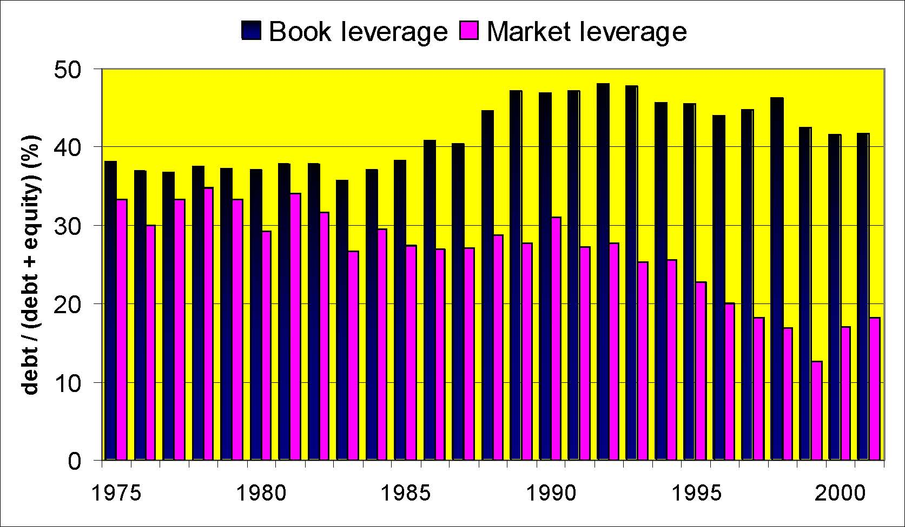

01020304050197519801985199019952000debt / (debt + equity) (%)Book leverageMarket leverage

Capital structure, International 1991

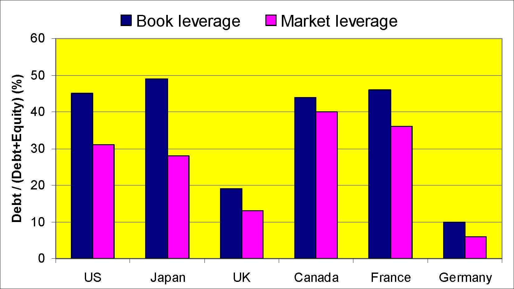

0102030405060USJapanUKCanadaFranceGermanyDebt / (Debt+Equity) (%)Book leverageMarket leverage

Sources of Funds: US Corporations 1980-2000

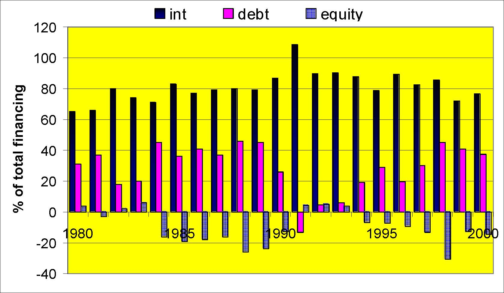

-40-2002040608010012019801985199019952000% of total financingintdebtequity

Sources of Funds: International 1990-94

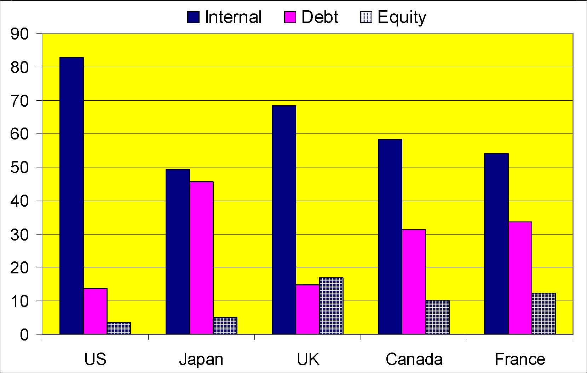

-40-2002040608010012079808182838485868788899091929394959697% of total financingInternalDebtEquity0102030405060708090USJapanUKCanadaFranceInternalDebtEquity

Examples: Capital structure, 1997

<Table>
<TR>
<TD>

Industry

</TD>
<TD>

Debt / (Debt + Equity) (%)

</TD>
</TR>
<TR>
<TD>

High leverage

</TD>

</TR>
<TR>
<TD>

Building construction

</TD>
<TD>

60.2

</TD>
</TR>
<TR>
<TD>

Hotels and lodging

</TD>
<TD>

55.4

</TD>
</TR>
<TR>
<TD>

Air transport

</TD>
<TD>

38.8

</TD>
</TR>
<TR>
<TD>

Primary metals

</TD>
<TD>

29.1

</TD>
</TR>
<TR>
<TD>

Paper

</TD>
<TD>

28.2

</TD>
</TR>
<TR>

</TR>
<TR>
<TD>

Low leverage

</TD>

</TR>
<TR>
<TD>

Drugs and chemicals

</TD>
<TD>

4.8

</TD>
</TR>
<TR>
<TD>

Electronics

</TD>
<TD>

9.1

</TD>
</TR>
<TR>
<TD>

Management services

</TD>
<TD>

12.3

</TD>
</TR>
<TR>
<TD>

Computers

</TD>
<TD>

9.6

</TD>
</TR>
<TR>
<TD>

Health services

</TD>
<TD>

15.2

</TD>
</TR>
</Table>

Plan of Attack

1.Modigliani-Miller Theorem:

- →Capital Structure is irrelevant 

2.What’s missing from the M-M view?

- →Taxes

- →Costs of financial distress

3.“Textbook” view of optimal capital structure:

- →The choice between debt and equity

4.Apply/confront this framework to several business cases

- →Evaluate when its usefulness and its limitations

M-M’s “Irrelevance” Theorem

Assume

- Market efficiency and no asymmetric information 

- No taxes 

- No transaction or bankruptcy costs 

- Hold constant the firm’s investment policies 

Then

- The value of the firm is independent of its capital structure

- Financing decisions do not matter!

MM Theorem: Proof 1 (pie theory)*

=

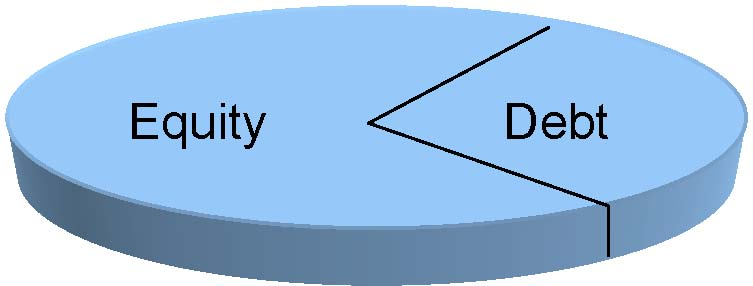

DebtEquity

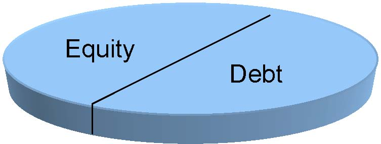

DebtEquity

* Credit to Yogi Berra

MM Theorem: Proof 2 (market efficiency)

Your firm decides to raise $100 million.

- Debt financing

- You sell bonds worth $100 million and receive $100 million in cash.

- Equity financing

- You sell stock worth $100 million and receive $100 million in cash.

MM Theorem: Proof 2 (market efficiency)

- All purely financial transactions are zero NPV investments, i.e., no arbitrage opportunity.

- Thus, they neither increase nor decrease firm value. 

MM Theorem: Example

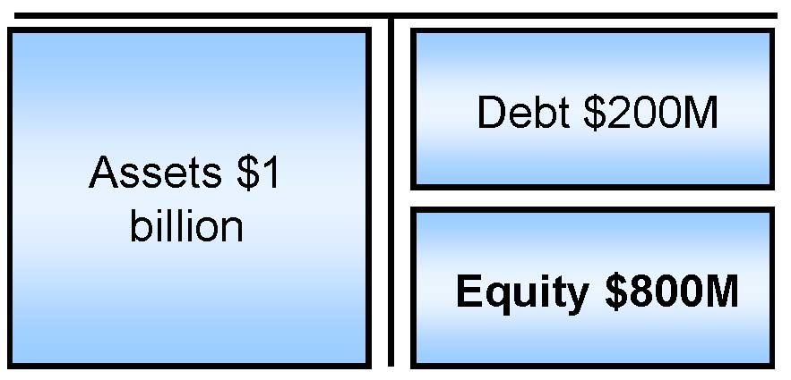

Assets $1 billionDebt $200MEquity $800M

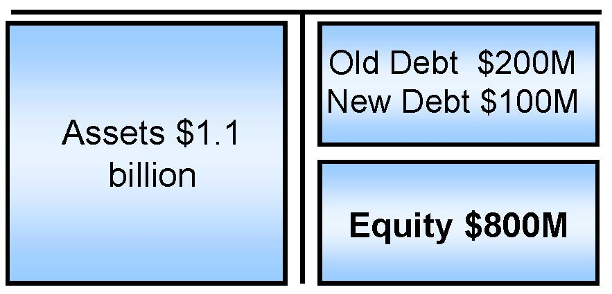

Assets $1.1 billionOld Debt  $200MNew Debt $100MEquity $800M

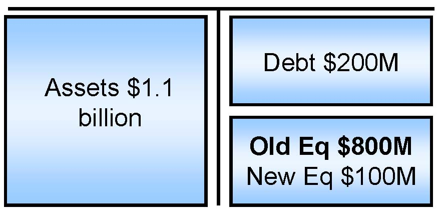

Assets $1.1 billionDebt $200MOld Eq $800MNew Eq $100M

Current

Issue new debt

Issue new equity

MM Theorem: Proof 3

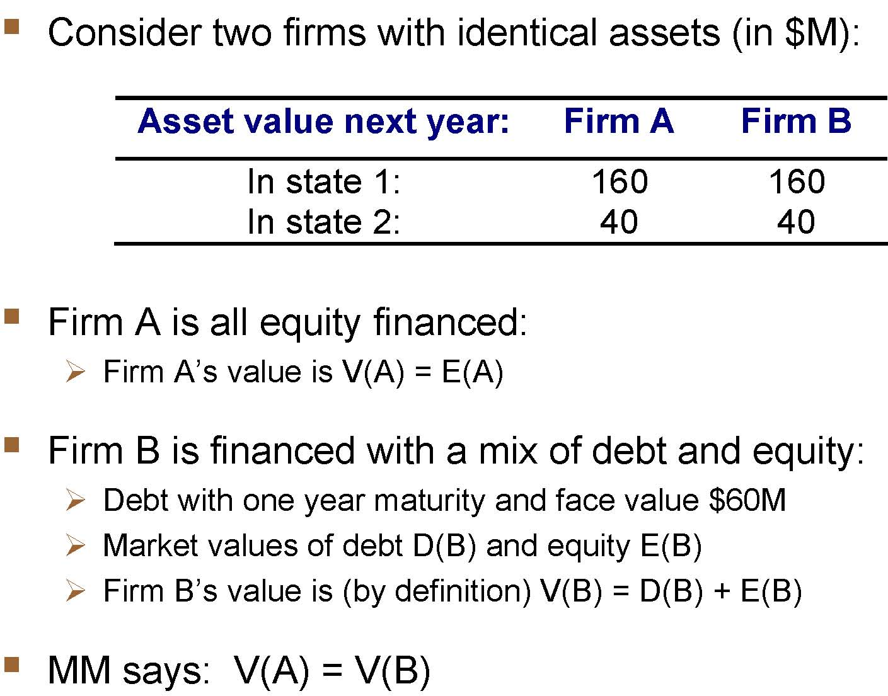

Consider two firms with identical assets (in $M):Firm A is all equity financed:Firm A’s value is V(A) = E(A)Firm B is financed with a mix of debt and equity:Debt with one year maturity and face value $60MMarket values of debt D(B) and equity E(B)Firm B’s value is (by definition) V(B) = D(B) + E(B)MM says:  V(A) = V(B)Asset value next year: Firm A Firm B In state 1: 160 160 In state 2: 40 40   

MM Theorem: Proof 3

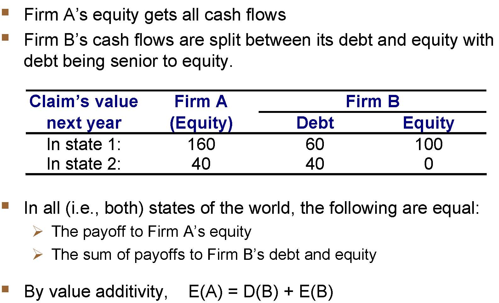

Firm A’s equity gets all cash flows Firm B’s cash flows are split between its debt and equity with debt being senior to equity.In all (i.e., both) states of the world, the following are equal:The payoff to Firm A’s equity The sum of payoffs to Firm B’s debt and equityBy value additivity,    E(A) = D(B) + E(B)Claim’s valueFirm A Firm B next year (Equity) Debt Equity In state 1: 160 60 100 In state 2: 40 40 0  

M-M Intuition 1

- If Firm A were to adopt Firm B’s capital structure, its total value would not be affected (and vice versa).

- This is because ultimately, its value is that of the cash flows generated by its operating assets (e.g., plant and inventories).

- The firm’s financial policy divides up this cashflow “pie” amongdifferent claimants (e.g., debtholders and equityholders).

- But the size (i.e., value) of the pie is independentof how the pie is divided up.

Example, cont.

- In case you forgot where value additivity comes from…

- Assume for instance that market values are:

- →D(B) = $50M

- →E(B) = $50M

- MM says: V(A) = D(B)+E(B) = $100M

- Suppose instead that E(A) = $105M.

- Can you spot an arbitrage opportunity?

Example, cont.

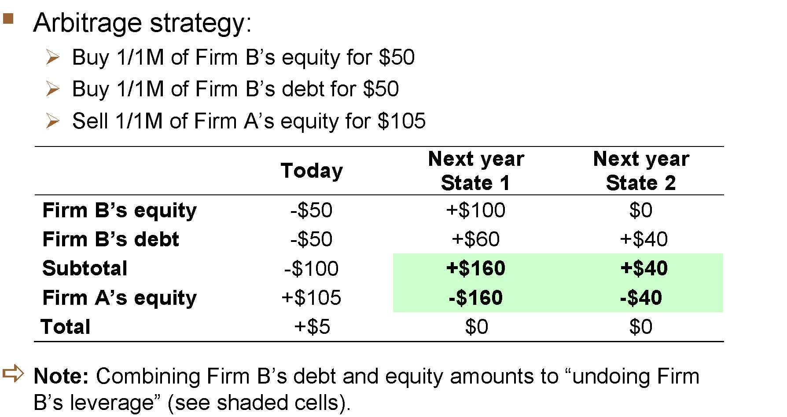

Arbitrage strategy:Buy 1/1M of Firm B’s equity for $50Buy 1/1M of Firm B’s debt for $50Sell 1/1M of Firm A’s equity for $105Note: Combining Firm B’s debt and equity amounts to “undoing Firm B’s leverage” (see shaded cells). Today Next year State 1 Next year State 2 Firm B’s equity -$50 +$100 $0 Firm B’s debt -$50 +$60 +$40 Subtotal -$100 +$160 +$40 Firm A’s equity +$105 -$160 -$40 Total +$5 $0 $0   

M-M: Intuition 2

- Investors will not pay a premium for firms that undertake financial transactions that they can undertake themselves (at the same cost).

- For instance, they will not pay a premium for Firm A over Firm Bfor having less debt.

- Indeed, by combining Firm B’s debt and equity in appropriate proportions, any investor can in effect “unlever” Firm B and reproduce the cashflow of Firm A.

The Curse of M-M 

- M-M Theorem was initially meant for capital structure.

- But it applies to all aspects of financial policy:

- capital structure is irrelevant.

- long-term vs. short-term debt is irrelevant.

- dividend policy is irrelevant.

- risk management is irrelevant.

- etc.

- Indeed, the proof applies to all financial transactions because they are all zero NPV transactions.

Using M-M Sensibly

- M-M is not a literal statement about the real world. It obviously leaves important things out.

- But it gets you to ask the right question: How is this financing move going to change the size of the pie?

- M-M exposes some fallacies such as: 

- WACC fallacy

- Win-Win fallacy

- EPS fallacy

WACC Fallacy: “Debt is Better Because Debt Is Cheaper Than Equity.”

- Because (for essentially all firms) debt is safer than equity, investors demand a lower return for holding debt than for holding equity. (True)

- The difference is significant: 4% vs. 13% expected return!

- So, companies should always finance themselves with debt because they have to give away less returns to investors, i.e., debt is cheaper. (False)

- What is wrong with this argument?

WACC Fallacy (cont.)

- This reasoning ignores the “hidden” cost of debt: 

- Raising more debt makes existing equity more risky

- Is it still true when default probability is zero?

- Milk analogy: Whole milk = Cream + Skimmed milk

- People often confuse the two meanings of “cheap”: 

- Low cost

- Good deal

- More on this in the “Valuation” module (Part II).

EPS Fallacy: “Debt is Better When It Makes EPS Go Up.”

- EPS can go up (or down) when a company increases its leverage. (True)

- Companies should choose their financial policy to maximize their EPS. (False)

- What is wrong with this argument?

EPS Fallacy (cont.)

- EBI(T) is unaffected by a change in capital structure (Recall that we assumed no taxes for now).

- Creditors receive the safe (or the safest) part of EBIT.

- Expected EPS might increase but EPS has become riskier!

Remarks:

- Also tells us to be careful when using P/E ratios, e.g. comparing P/E ratios of companies with different capital structures.

- Further confusing effect in share-repurchases: The number of shares changes as well as expected earnings.

Leverage, returns, and risk 

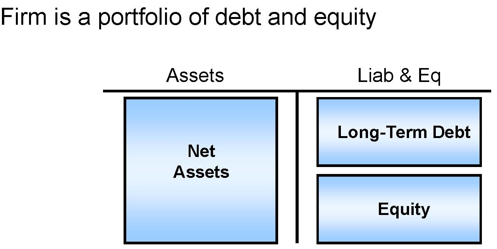

Firm is a portfolio of debt and equityAssetsNetAssetsLong-Term DebtEquityLiab&amp; Eq

Therefore …

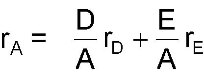

rA=EDr AE  r AD+

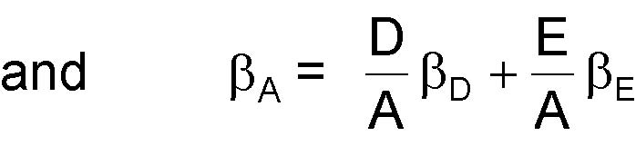

andβA=ED AE   ADβ+β

Leverage, returns, and risk 

Asset risk is determined by the type of projects, not how the projects are financed

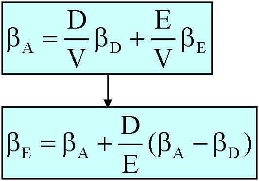

EDA VE   VDβ+β=β)  ( ED  DAAEβ−β+β=β

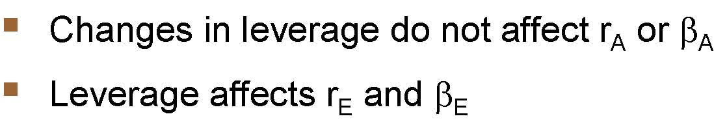

Changes in leverage do not affect rAor βALeverage affects rEand βE

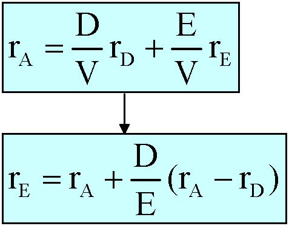

EDAr VE  r VDr+=)r  (r ED  rrDAAE−+=

Leverage and beta

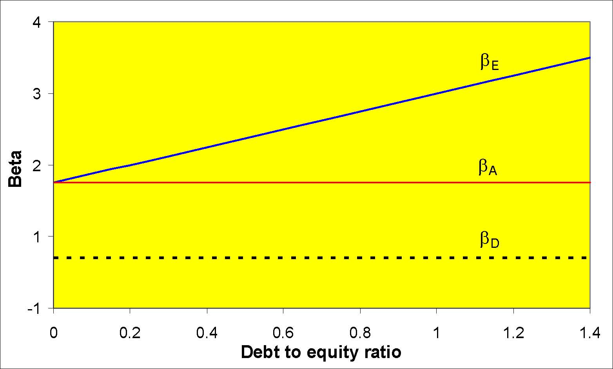

βEβAβD-1123400.20.40.60.811.21.4Debt to equity ratioBeta

Leverage and required returns

rErArD0.050.100.150.200.250.3000.20.40.60.811.21.4Debt to equity ratiorequired return

Example 

Your firm is all equity financed and has $1 million of assets and 10,000 shares of stock (stock price = $100).  Earnings before interest and taxes next year will be either $50,000, $125,000, or $200,000 depending on economic conditions.  These earnings are expected to continue indefinitely.  The payout ratio is 100%.

The firm is thinking about a leverage recapitalization, selling $300,000 of debt and using the proceeds to repurchase stock.  The interest rate is 10%.

How would this transaction affect the firm’s EPS and stock price? Ignore taxes.

Current: all equity

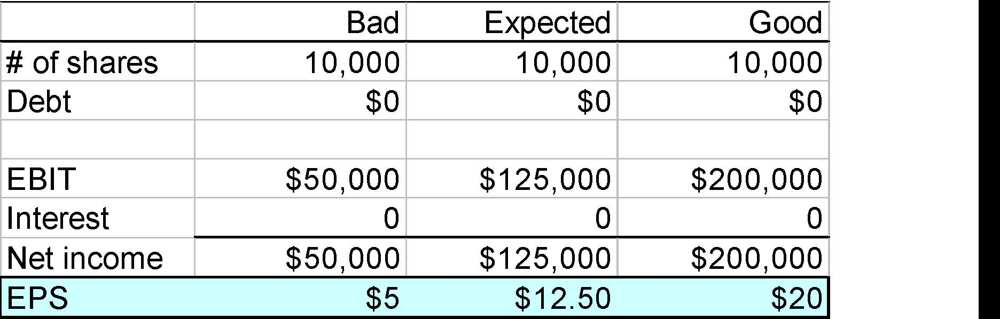

BadExpectedGood# of shares10,00010,00010,000Debt$0 $0 $0 EBIT$50,000 $125,000 $200,000 Interest000Net income$50,000 $125,000 $200,000 EPS$5 $12.50 $20 

Expected EPS = $12.5Stock price = $100rE= DPS / price = EPS / price = 12.5%

Recap: 30% debt

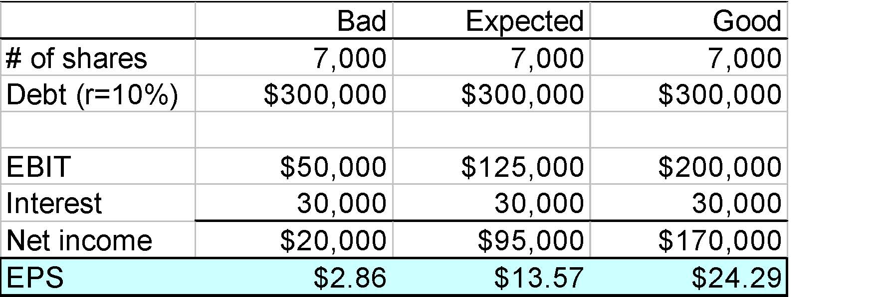

BadExpectedGood# of shares7,0007,0007,000Debt (r=10%)$300,000 $300,000 $300,000 EBIT$50,000 $125,000 $200,000 Interest30,00030,00030,000Net income$20,000 $95,000 $170,000 EPS$2.86 $13.57 $24.29 

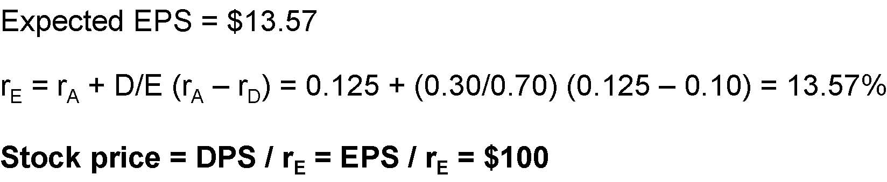

Expected EPS = $13.57rE= rA+ D/E (rA–rD) = 0.125 + (0.30/0.70) (0.125 –0.10) = 13.57%Stock price = DPS / rE= EPS / rE= $100

Win-Win Fallacy: “Debt Is Better Because Some Investors Prefer Debt to Equity.”

- Investors differ in their preferences and needs, and thus want different cash flow streams. (True)

- Example: Young professionals vs. Retirees

- The sum of what all investors will pay is greater if the firm issues different securities (e.g., debt and equity) tailored for different clienteles of investors (Financial Marketing). (False)

- What is wrong with this argument?

Win-Win Fallacy (cont.)

- This reasoning assumes incomplete markets, i.e., that:

- There are indeed clienteles for different securities

- These clienteles are “unsatisfied”, i.e., that investors cannot replicate the security at the same or even lower cost.

- A large unsatisfied clientele for corporate debt is unlikely, asthere exist close substitutes to any particular firm’s debt.

- Also, financial intermediaries are in the business of identifying unsatisfied clientele.

- Win-Win situation is more likely for more exotic securities or sophisticated financial arrangement

Practical Implications

- When evaluating a decision (e.g., the effect of a merger):

- →Separate financial (RHS) and real (LHS) parts of the move

- →MM tells that most value is created on LHS

- When evaluating an argument in favor of a financial decision:

- →Understand that it is wrong under MM assumptions

- →What departures from MM assumptions does it rely upon?

- →If none, then this is very dubious argument.

- →If some, try to assess their magnitude.

What’s Missing from the Simple M-M Story?

- Taxes:

- →Corporate taxes

- →Personal taxes

- Costs of Financial Distress

Capital Structure and Corporate Taxes 

- Different financial transactions are taxed differently:

- →Interest payments are tax exempt for the firm.

- →Dividends and retained earnings are not.

- →Etc.

- Financial policy matters because it affects a firm’s tax bill.

Debt Tax Shield

Claim: Debt increases firm value by reducing the tax burden.

- Example: XYZ Inc. generates a safe $100M annual perpetuity. Assume risk-free rate of 10%. Compare:

- 100% debt: perpetual $100M interest

- 100% equity: perpetual $100M dividend or capital gains

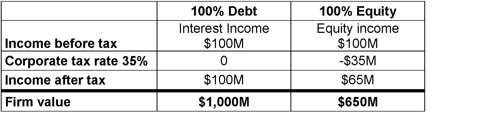

 100% Debt 100% Equity Income before tax Interest Income $100M Equity income $100M Corporate tax rate 35% 0 -$35M Income after tax $100M $65M Firm value $1,000M $650M   

Intuition

- MM still holds: The pie is unaffected by capital structure.

Size of the pie = Value of before-taxcashflows

- But the IRS gets a slice too

- Financial policy affects the size of that slice.

- Interest payments being tax deductible, the PV of the IRS’ slicecan be reduced by using debt rather than equity.

“Pie” Theory

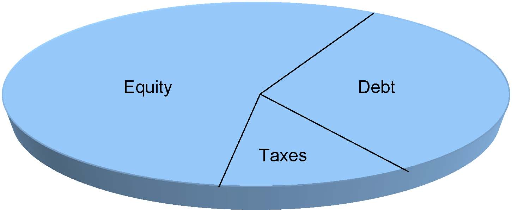

DebtEquityTaxes

Example 

In 2000, Microsoft had sales of $23 billion, earnings before taxes of $14.3 billion, and net income of $9.4 billion.  Microsoft paid $4.9 billion in taxes, had a market value of $423 billion, and had no long-term debt outstanding.

Bill Gates is thinking about a recapitalization, issuing $50 billion in long-term debt (rd = 7%) and repurchasing $50 billion in stock.  How would this transaction affect Microsoft’safter-tax cashflowsand shareholder wealth?

Microsoft: Balance sheet in $ millions

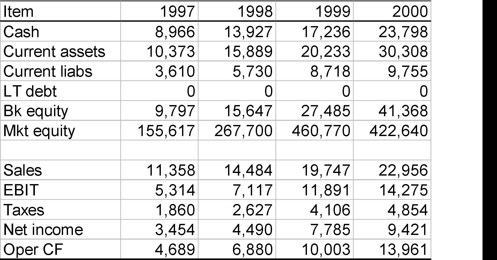

Item1997199819992000Cash8,96613,92717,23623,798Current assets10,37315,88920,23330,308Current liabs3,6105,7308,7189,755LT debt0000Bk equity9,79715,64727,48541,368Mkt equity155,617267,700460,770422,640Sales11,35814,48419,74722,956EBIT5,3147,11711,89114,275Taxes1,8602,6274,1064,854Net income3,4544,4907,7859,421Oper CF4,6896,88010,00313,961

Microsoft, 2000 ($ millions)

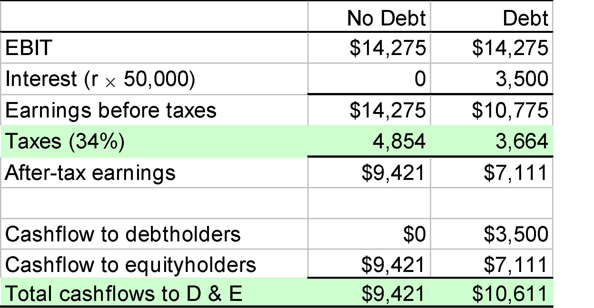

No DebtDebtEBIT$14,275 $14,275 Interest (r × 50,000)03,500Earnings before taxes$14,275 $10,775 Taxes (34%)4,8543,664After-tax earnings$9,421 $7,111 Cashflow to debtholders$0 $3,500 Cashflow to equityholders$9,421 $7,111 Total cashflows to D &amp; E$9,421 $10,611 

Tax savings of debt

Marginal tax rate = τ

Taxes for unleveredfirm………………τEBIT

Taxes for levered firm………………....τ(EBIT –interest)

Interest tax shield…………………..τinterest

Interest = rdD

Interest tax shield (each year) = τrdD

Note: only interest, not principal, payments reduce taxes

         Acrobat Distiller 5.0 (Windows)

         2003-02-20T22:13:13Z

         2004-01-30T16:47:08+05:30

         2004-01-30T16:47:08+05:30

         PScript5.dll Version 5.2

         uuid:b5570876-ac9f-4637-8679-4ae46954630d

         uuid:6b38fc09-6b56-46d4-9e8a-59564f7c7440

         xml

               djenter

               Microsoft PowerPoint - LN05(CS2).ppt

Capital Structure II Finance Theory II (15.402) – Spring 2003 – Dirk Jenter 

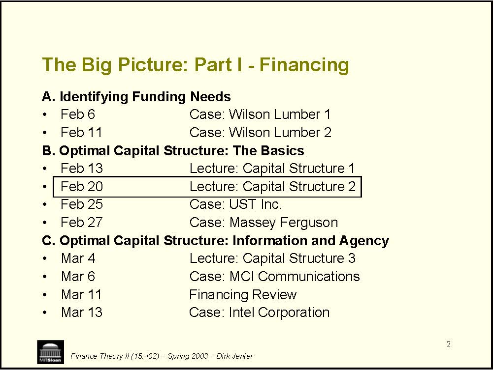

2 • • • Feb 13 • Feb 20 • • • • • Financing Review • Case: Intel Corporation Finance Theory II (15.402) – Spring 2003 – Dirk Jenter The Big Picture: Part I -Financing A. Identifying Funding Needs Feb 6 Case: Wilson Lumber 1 Feb 11 Case: Wilson Lumber 2 B. Optimal Capital Structure: The Basics Lecture: Capital Structure 1 Lecture: Capital Structure 2 Feb 25 Case: UST Inc. Feb 27 Case: Massey Ferguson C. Optimal Capital Structure: Information and Agency Mar 4 Lecture: Capital Structure 3 Mar 6 Case: MCI Communications Mar 11Mar 13

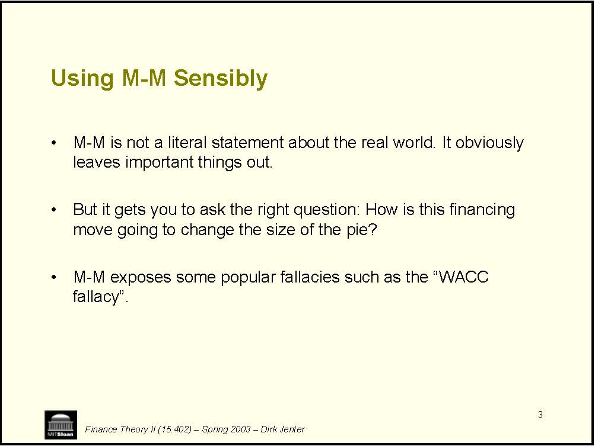

3 • • • fallacy”. Finance Theory II (15.402) – Spring 2003 – Dirk Jenter Using M-M Sensibly M-M is not a literal statement about the real world. It obviously leaves important things out. But it gets you to ask the right question: How is this financing move going to change the size of the pie? M-M exposes some popular fallacies such as the “WACC 

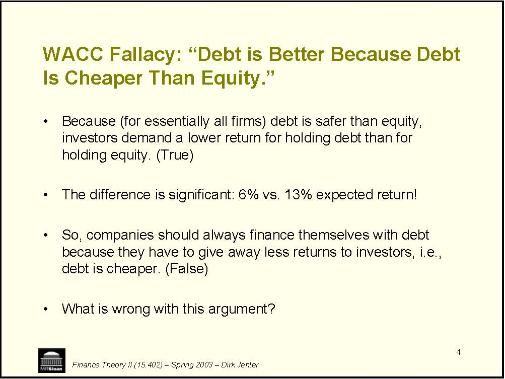

4 • ) • • i i) • Finance Theory II (15.402) – Spring 2003 – Dirk Jenter WACC Fallacy: “Debt is Better Because Debt Is Cheaper Than Equity.” Because (for essentially all firms) debt is safer than equity, investors demand a lower return for holding debt than for holding equity. (TrueThe difference is significant: 6% vs. 13% expected return! So, companies should always finance themselves with debt because they have to give away less returns tonvestors,.e., debt is cheaper. (FalseWhat is wrong with this argument? 

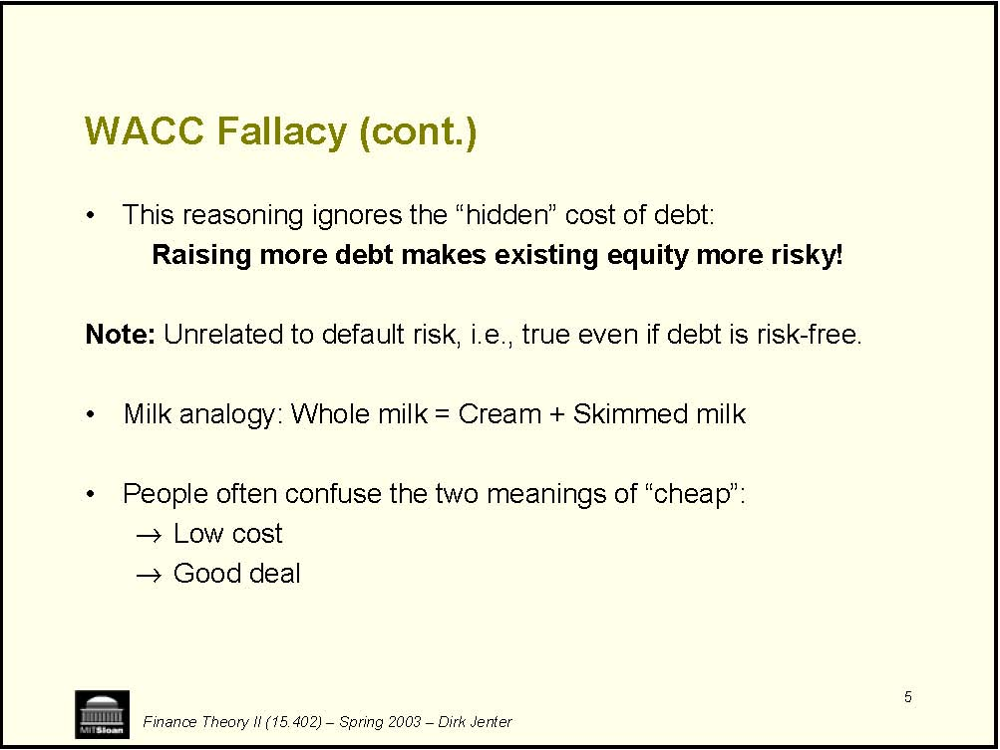

5 • • • →→Finance Theory II (15.402) – Spring 2003 – Dirk Jenter WACC Fallacy (cont.) This reasoning ignores the “hidden” cost of debt: Raising more debt makes existing equity more risky! Note: Unrelated to default risk, i.e., true even if debt is risk-free. Milk analogy: Whole milk = Cream + Skimmed milk People often confuse the two meanings of “cheap”: Low cost Good deal 

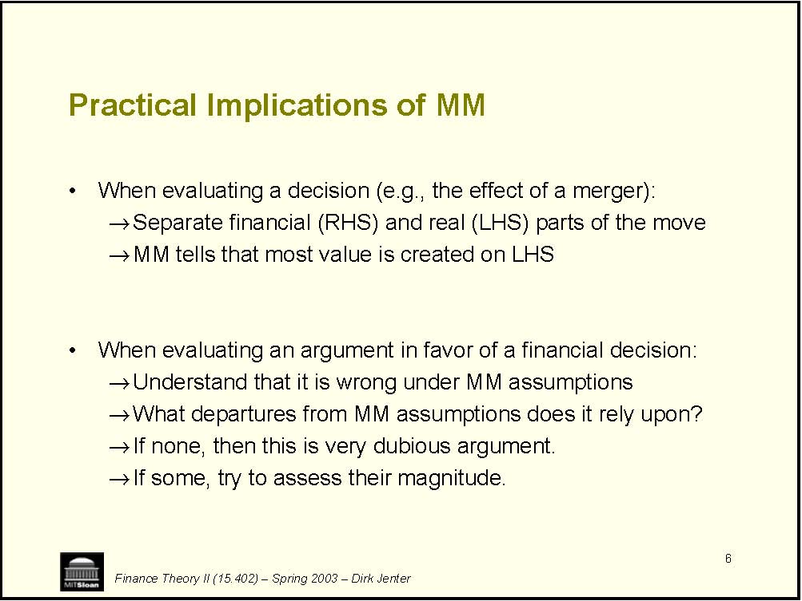

6 Practical Implications of MM • →→• →→→→Finance Theory II (15.402) – Spring 2003 – Dirk Jenter When evaluating a decision (e.g., the effect of a merger): Separate financial (RHS) and real (LHS) parts of the move MM tells that most value is created on LHS When evaluating an argument in favor of a financial decision: Understand that it is wrong under MM assumptions What departures from MM assumptions does it rely upon? If none, then this is very dubious argument. If some, try to assess their magnitude. 

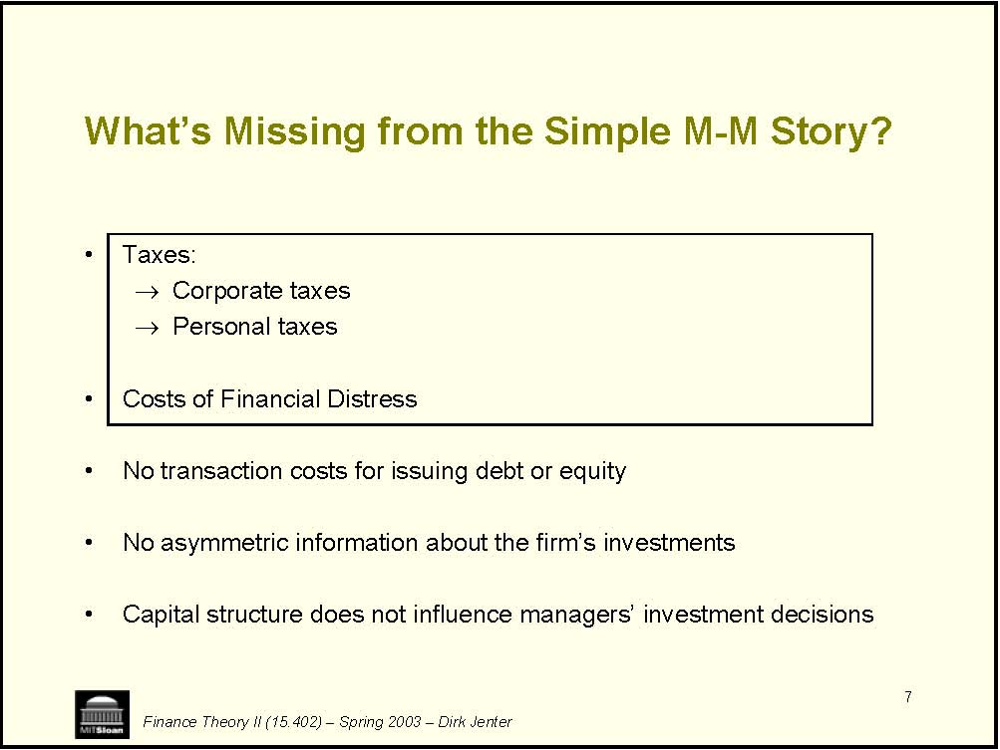

7 What’s Missing from the Simple M-M Story? • →→• i• • • Finance Theory II (15.402) – Spring 2003 – Dirk Jenter Taxes: Corporate taxes Personal taxes Costs of Fnancial Distress No transaction costs for issuing debt or equity No asymmetric information about the firm’s investments Capital structure does not influence managers’ investment decisions 

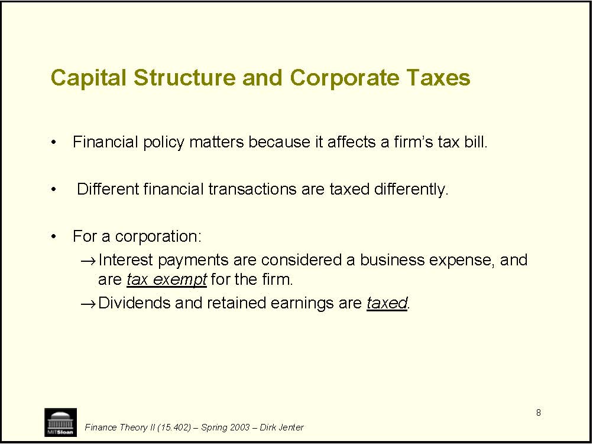

8 Capital Structure and Corporate Taxes • • • →are →taxed. Finance Theory II (15.402) – Spring 2003 – Dirk Jenter Financial policy matters because it affects a firm’s tax bill. Different financial transactions are taxed differently. For a corporation: Interest payments are considered a business expense, and tax exempt for the firm. Dividends and retained earnings are 

Debt Tax Shield 

Claim: Debt increases firm value by reducing the tax burden. 

Example: XYZ Inc. generates a safe $100M annual perpetuity. Assume risk-free rate of 10%. Compare: 

- 100% debt: perpetual $100M interest 

- 100% equity: perpetual $100M dividend or capital gains 

<Table>
<TR>

<TD>100% Debt </TD>
<TD>100% Equity </TD>
</TR>
<TR>
<TD>Income before tax </TD>
<TD>Interest Income $100M </TD>
<TD>Equity income $100M </TD>
</TR>
<TR>
<TD>Corporate tax rate 35% </TD>
<TD>0 </TD>
<TD>-$35M </TD>
</TR>
<TR>
<TD>Income after tax </TD>
<TD>$100M </TD>
<TD>$65M </TD>
</TR>
<TR>
<TD>Firm value </TD>
<TD>$1,000M </TD>
<TD>$650M </TD>
</TR>
</Table>

9 

Finance Theory II (15.402) – Spring 2003 – Dirk Jenter 

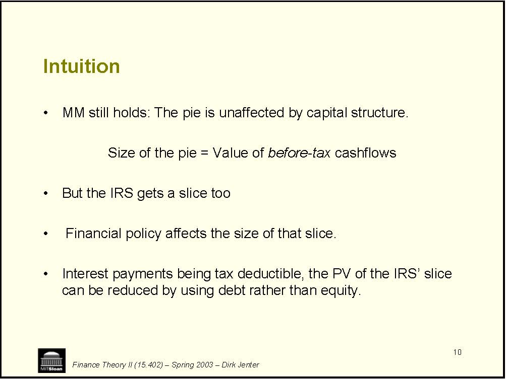

10 Intuition • l• • • Finance Theory II (15.402) – Spring 2003 – Dirk Jenter MM still holds: The pie is unaffected by capital structure. Size of the pie = Value of before-tax cashfows But the IRS gets a slice too Financial policy affects the size of that slice. Interest payments being tax deductible, the PV of the IRS’ slice can be reduced by using debt rather than equity. 

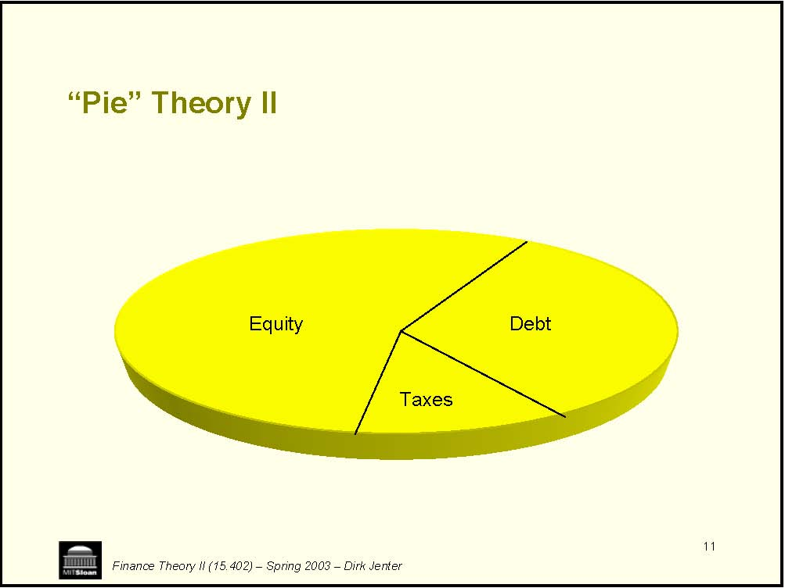

11 Debt Finance Theory II (15.402) – Spring 2003 – Dirk Jenter “Pie” Theory II Equity Taxes 

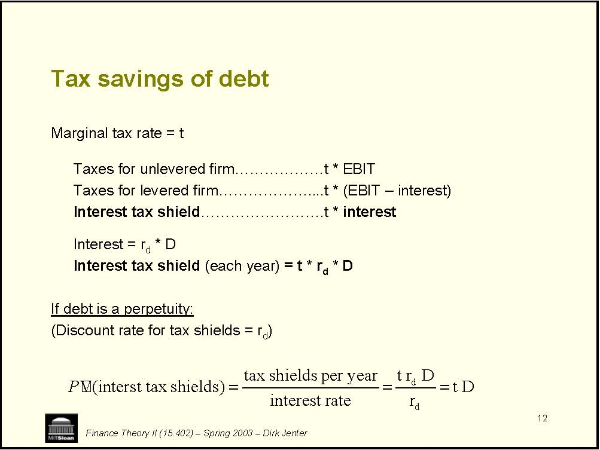

12 Tax savings of debt (interest) Interest = rd * D ) d * D d) r D d d ===PFinance Theory II (15.402) – Spring 2003 – Dirk Jenter Marginal tax rate = t Taxes for unlevered firm………………t * EBIT Taxes for levered firm………………....t * EBIT – Interest tax shield…………………….t * interest Interest tax shield (each year= t * rIf debt is a perpetuity: (Discount rate for tax shields = rD t r t rate interest year per shields tax shields) tax V(interst 

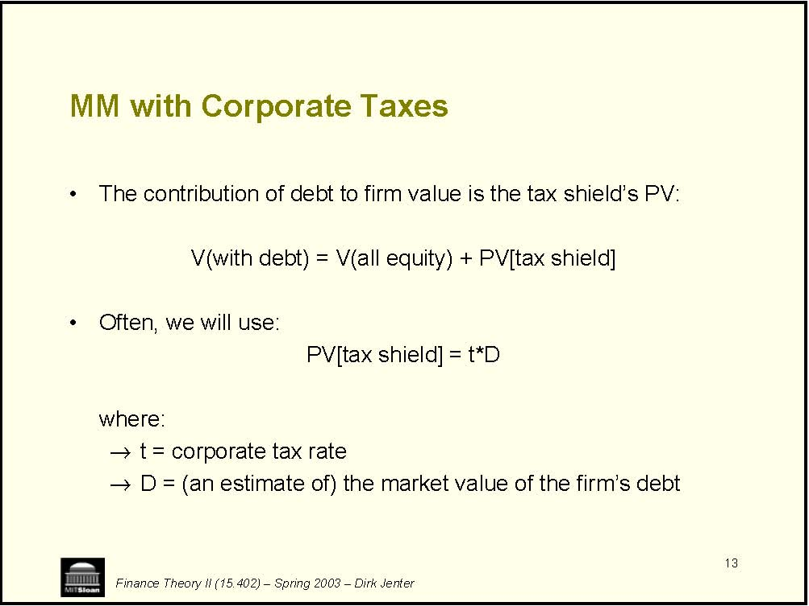

13 MM with Corporate Taxes • i(• →→) Finance Theory II (15.402) – Spring 2003 – Dirk Jenter The contribution of debt to frm value is the tax shield’s PV: V(with debt) = Vall equity) + PV[tax shield] Often, we will use: PV[tax shield] = t*D where: t = corporate tax rate D = (an estimate ofthe market value of the firm’s debt 

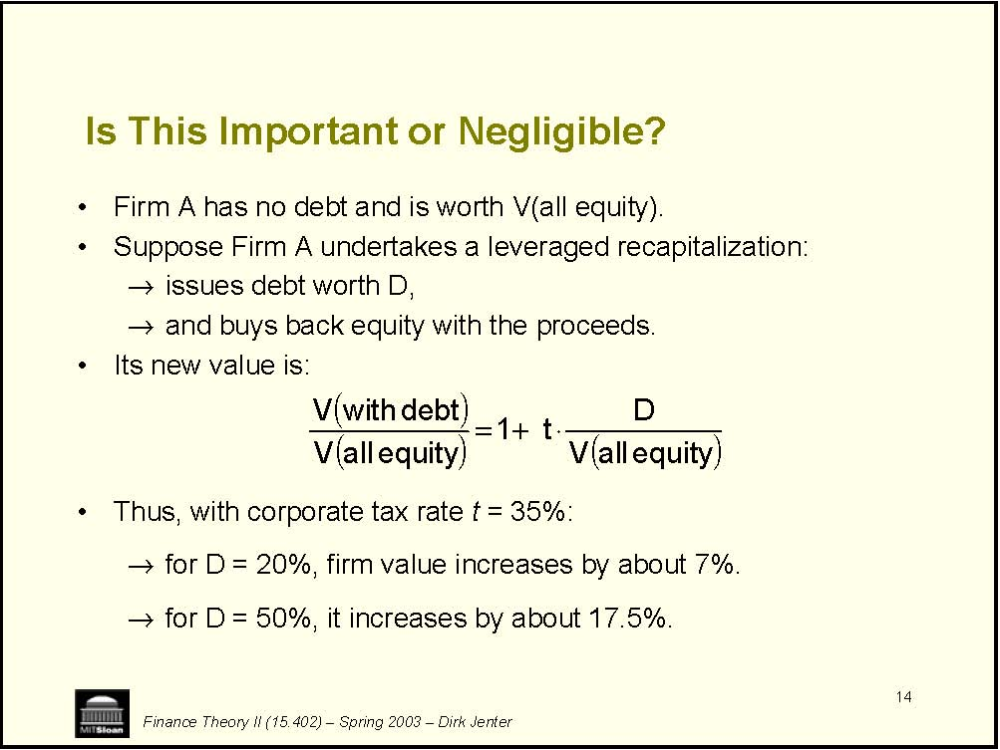

14 Is This Important or Negligible? • • →→• • t = 35%: →→()()()Dt1 ⋅+=Finance Theory II (15.402) – Spring 2003 – Dirk Jenter Firm A has no debt and is worth V(all equity). Suppose Firm A undertakes a leveraged recapitalization: issues debt worth D, and buys back equity with the proceeds. Its new value is: Thus, with corporate tax rate for D = 20%, firm value increases by about 7%. for D = 50%, it increases by about 17.5%. equity all V equity all V debt with V 

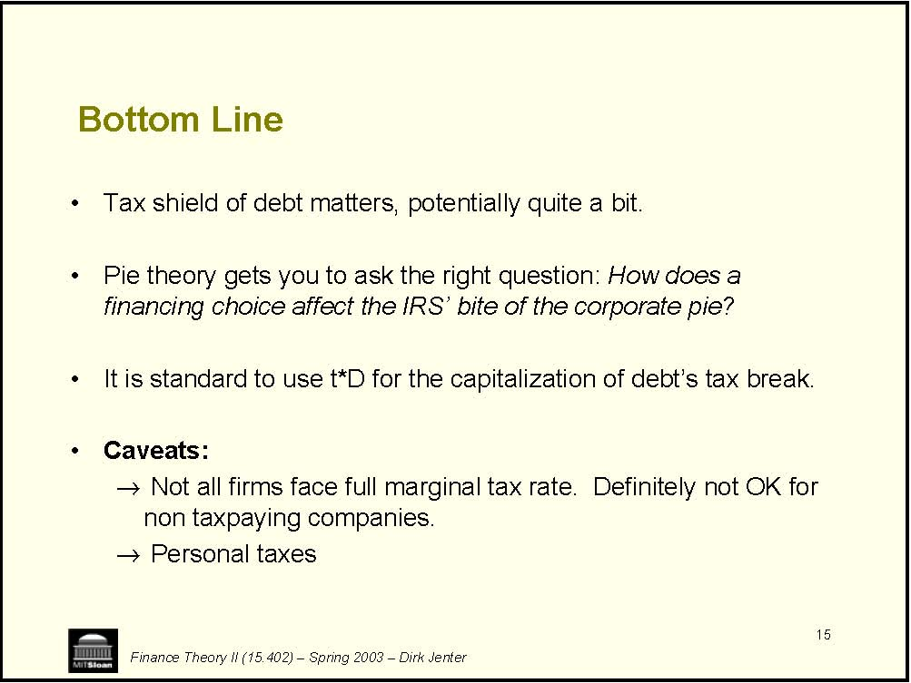

15 Bottom Line • • • • →→Finance Theory II (15.402) – Spring 2003 – Dirk Jenter Tax shield of debt matters, potentially quite a bit. Pie theory gets you to ask the right question: How does a financing choice affect the IRS’ bite of the corporate pie? It is standard to use t*D for the capitalization of debt’s tax break. Caveats: Not all firms face full marginal tax rate. Definitely not OK for non taxpaying companies. Personal taxes 

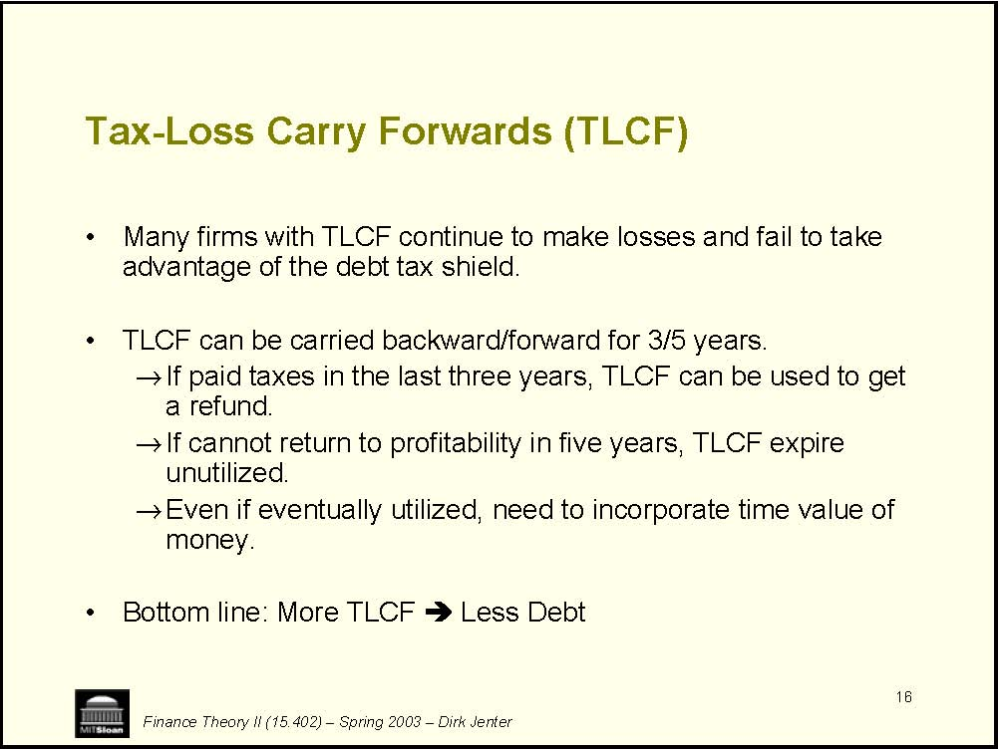

16 • • →→unutilized. →money. • Î Finance Theory II (15.402) – Spring 2003 – Dirk Jenter Tax-Loss Carry Forwards (TLCF) Many firms with TLCF continue to make losses and fail to take advantage of the debt tax shield. TLCF can be carried backward/forward for 3/5 years. If paid taxes in the last three years, TLCF can be used to get a refund. If cannot return to profitability in five years, TLCF expire Even if eventually utilized, need to incorporate time value of Bottom line: More TLCF Less Debt 

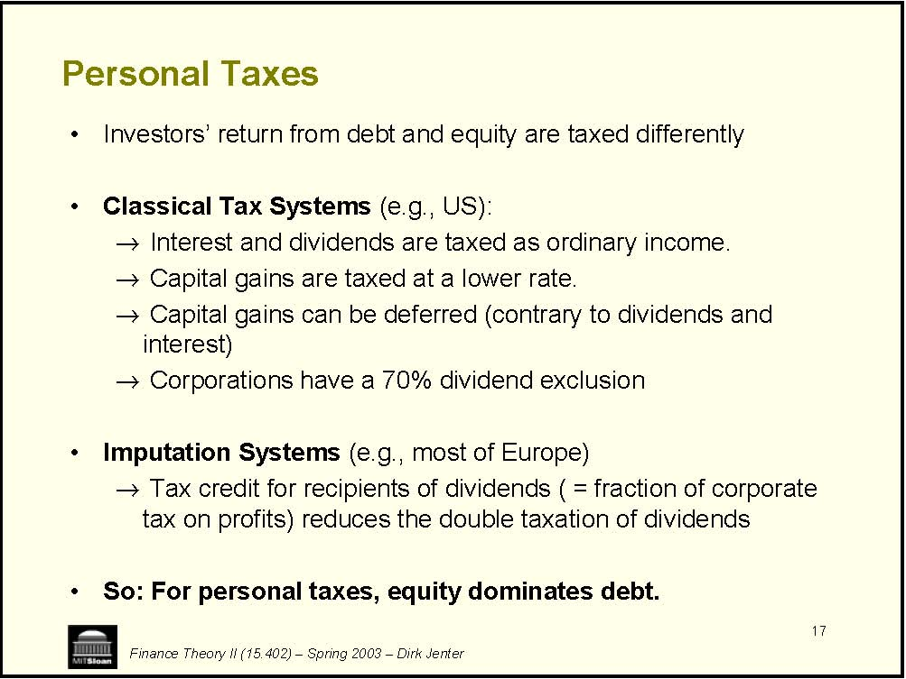

17 Personal Taxes • • (e.g., US): →→→interest) →• →• Finance Theory II (15.402) – Spring 2003 – Dirk Jenter Investors’ return from debt and equity are taxed differently Classical Tax Systems Interest and dividends are taxed as ordinary income. Capital gains are taxed at a lower rate. Capital gains can be deferred (contrary to dividends and Corporations have a 70% dividend exclusion Imputation Systems (e.g., most of Europe) Tax credit for recipients of dividends ( = fraction of corporate tax on profits) reduces the double taxation of dividends So: For personal taxes, equity dominates debt. 

Maximize After-Tax Income: 

<Table>
<TR>

<TD>Debt </TD>
<TD>Equity with </TD>
<TD>Equity with All </TD>
</TR>
<TR>

<TD>(Deferred) Capital Gains </TD>
<TD>Dividends </TD>
</TR>
<TR>
<TD>Corporate Level </TD>

</TR>
<TR>
<TD>  Start with $1 </TD>
<TD>1 </TD>
<TD>1 </TD>
<TD>1 </TD>
</TR>
<TR>
<TD>Tax: TC</TD>
<TD>0 </TD>
<TD>TC</TD>
<TD>TC </TD>
</TR>
<TR>
<TD>Net </TD>
<TD>1 </TD>
<TD>(1- TC) </TD>
<TD>(1- TC) </TD>
</TR>
<TR>
<TD>Personal Level Tax: TP and TPE </TD>
<TD>TP </TD>
<TD>TPE </TD>
<TD>TP </TD>
</TR>
<TR>
<TD>Bottom Line </TD>
<TD>(1-TP) </TD>
<TD>(1- TC)* (1-TPE) </TD>
<TD>(1- TC)* (1- TP) </TD>
</TR>
</Table>

Relative Tax Advantage of Debt: (1-Tp) / (1-TC)* (1-TPE) 

18 

Finance Theory II (15.402) – Spring 2003 – Dirk Jenter 

Post-Clinton I: 

<Table>
<TR>

<TD>Debt </TD>
<TD>Equity with Capital </TD>
<TD>Equity with All </TD>
</TR>
<TR>

<TD>Gains* </TD>
<TD>Dividends </TD>
</TR>
<TR>
<TD>Corporate Level </TD>

</TR>
<TR>
<TD>Start with $100 </TD>
<TD>100 </TD>
<TD>100 </TD>
<TD>100 </TD>
</TR>
<TR>
<TD>Tax: 35% </TD>
<TD>0 </TD>
<TD>35 </TD>
<TD>35 </TD>
</TR>
<TR>
<TD>Net </TD>
<TD>100 </TD>
<TD>65 </TD>
<TD>65 </TD>
</TR>
<TR>
<TD>Personal Level </TD>

</TR>
<TR>
<TD>Tax: 39% (20%) </TD>
<TD>39% * 100 </TD>
<TD>20% * 65 </TD>
<TD>39% * 65 </TD>
</TR>
<TR>

<TD>= 39 </TD>
<TD>= 13 </TD>
<TD>= 25.35 </TD>
</TR>
<TR>
<TD>Bottom Line </TD>
<TD>61 </TD>
<TD>52 </TD>
<TD>39.65 </TD>
</TR>
</Table>

*Extreme assumption: No deferral, 20% capital gains tax 

19 

Finance Theory II (15.402) – Spring 2003 – Dirk Jenter 

Post-Clinton II: Some deferred capital gains 

<Table>
<TR>

<TD>Debt </TD>
<TD>Equity with </TD>
<TD>Equity with All </TD>
</TR>
<TR>

<TD>Deferred Capital </TD>
<TD>Dividends </TD>
</TR>
<TR>

<TD>Gains* </TD>

</TR>
<TR>
<TD>Corporate Level </TD>

</TR>
<TR>
<TD>  Start with $100 </TD>
<TD>100 </TD>
<TD>100 </TD>
<TD>100 </TD>
</TR>
<TR>
<TD>Tax: 35% </TD>
<TD>0 </TD>
<TD>35 </TD>
<TD>35 </TD>
</TR>
<TR>
<TD>  Net </TD>
<TD>100 </TD>
<TD>65 </TD>
<TD>65 </TD>
</TR>
<TR>
<TD>Personal Level </TD>

</TR>
<TR>
<TD>Tax: 39% (10%) </TD>
<TD>39% * 100 </TD>
<TD>10% * 65 </TD>
<TD>39% * 65 </TD>
</TR>
<TR>

<TD>= 39 </TD>
<TD>= 6.50 </TD>
<TD>= 25.35 </TD>
</TR>
<TR>
<TD>Bottom Line </TD>
<TD>61 </TD>
<TD>58.5 </TD>
<TD>39.65 </TD>
</TR>
</Table>

*Assumption: Effective capital gains tax rate of 10% 

20 

Finance Theory II (15.402) – Spring 2003 – Dirk Jenter 

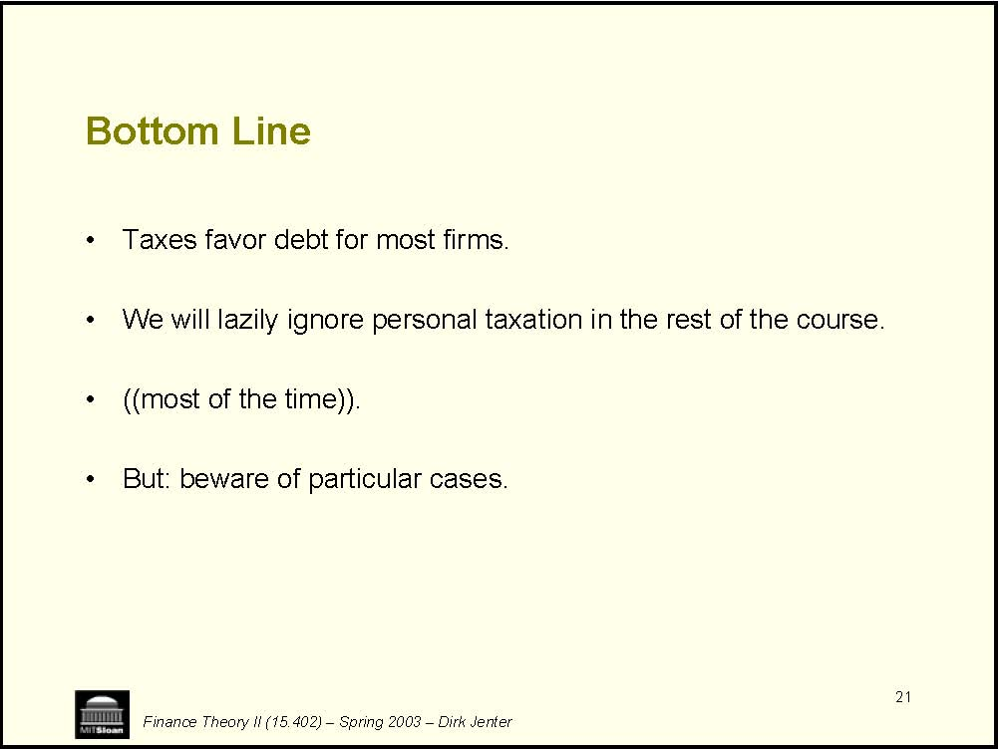

21 Bottom Line • • • (• Finance Theory II (15.402) – Spring 2003 – Dirk Jenter Taxes favor debt for most firms. We will lazily ignore personal taxation in the rest of the course. (most of the time)). But: beware of particular cases. 

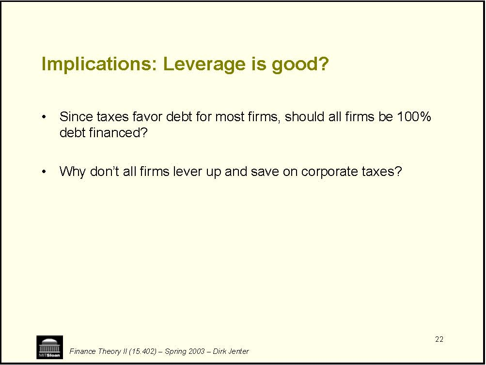

22 Implications: Leverage is good? • • Finance Theory II (15.402) – Spring 2003 – Dirk Jenter Since taxes favor debt for most firms, should all firms be 100% debt financed? Why don’t all firms lever up and save on corporate taxes? 

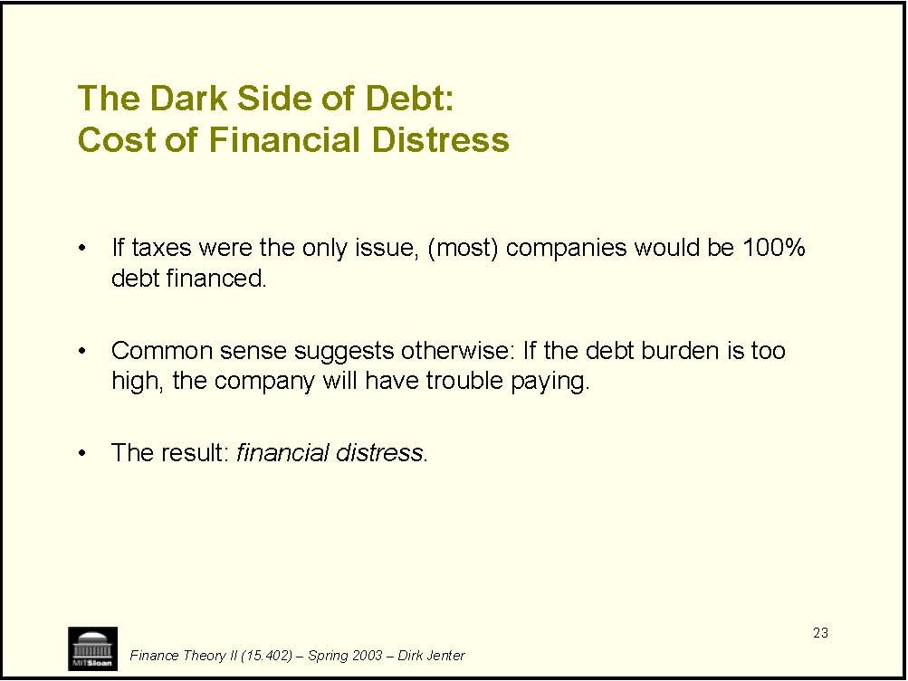

23 Cost of Financial Distress • )• • . Finance Theory II (15.402) – Spring 2003 – Dirk Jenter The Dark Side of Debt: If taxes were the only issue, (most companies would be 100% debt financed. Common sense suggests otherwise: If the debt burden is too high, the company will have trouble paying. The result: financial distress

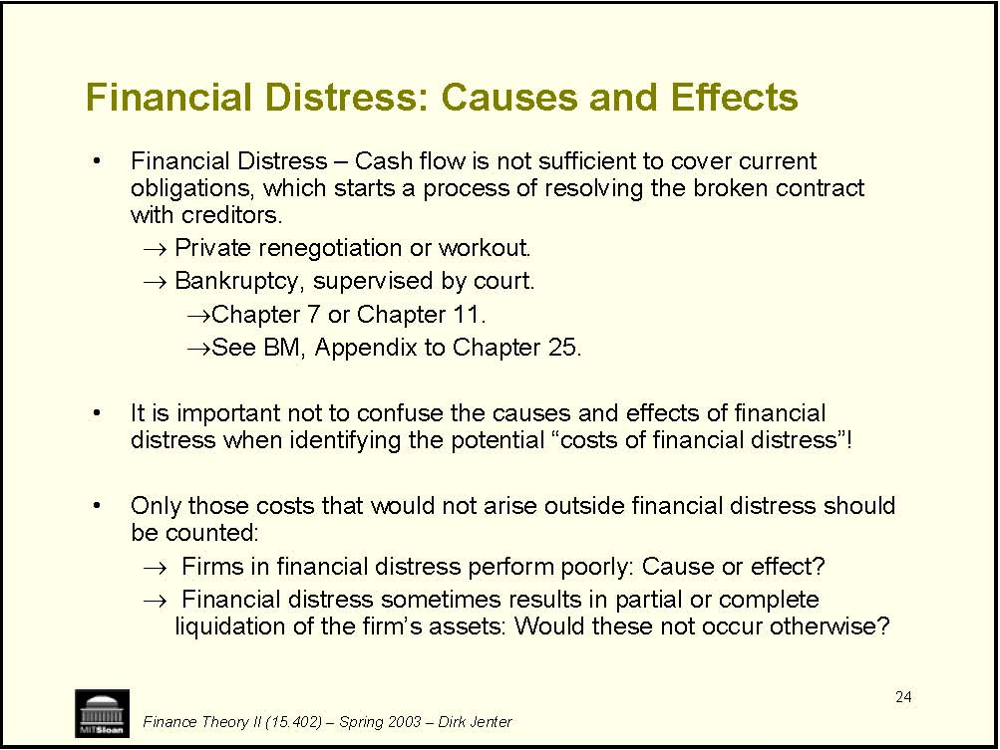

24 Financial Distress: Causes and Effects • wi→→→→• i• →Fi→Filiquiise? Finance Theory II (15.402) – Spring 2003 – Dirk Jenter Financial Distress – Cash flow is not sufficient to cover current obligations, which starts a process of resolving the broken contract th creditors. Private renegotiation or workout. Bankruptcy, supervised by court. Chapter 7 or Chapter 11. See BM, Appendix to Chapter 25. It is important not to confuse the causes and effects of financial distress whendentifying the potential “costs of financial distress”! Only those costs that would not arise outside financial distress should be counted: rms in financial distress perform poorly: Cause or effect? nancial distress sometimes results in partial or complete dation of the firm’s assets: Would these not occur otherw

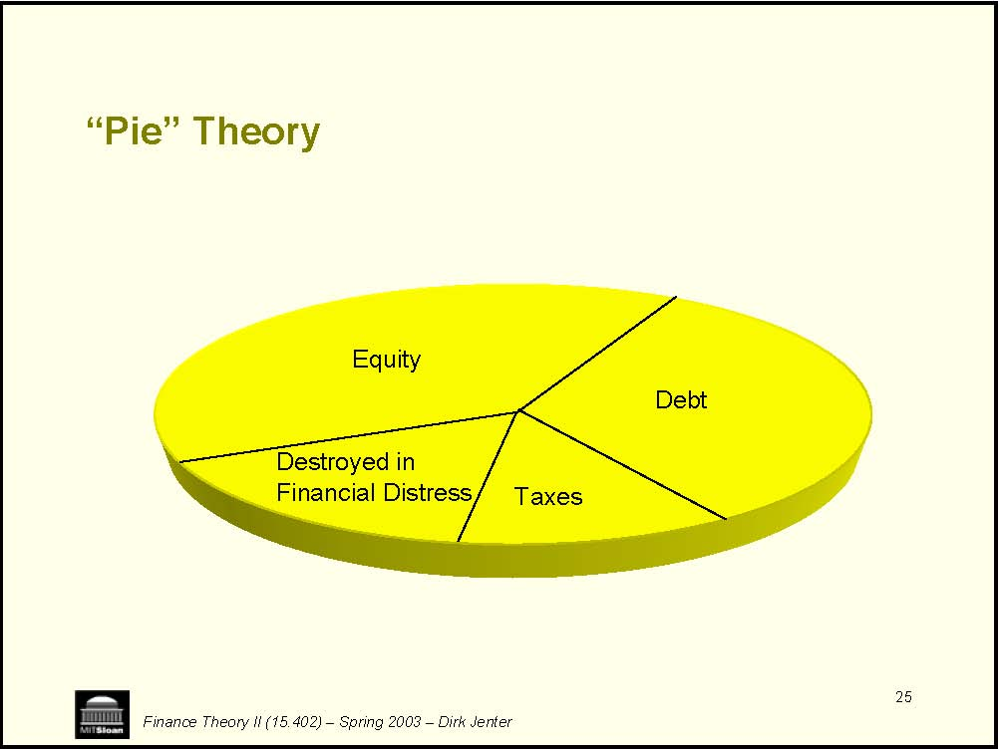

25 Debt FiFinance Theory II (15.402) – Spring 2003 – Dirk Jenter “Pie” Theory Equity Taxes Destroyed in nancial Distress 

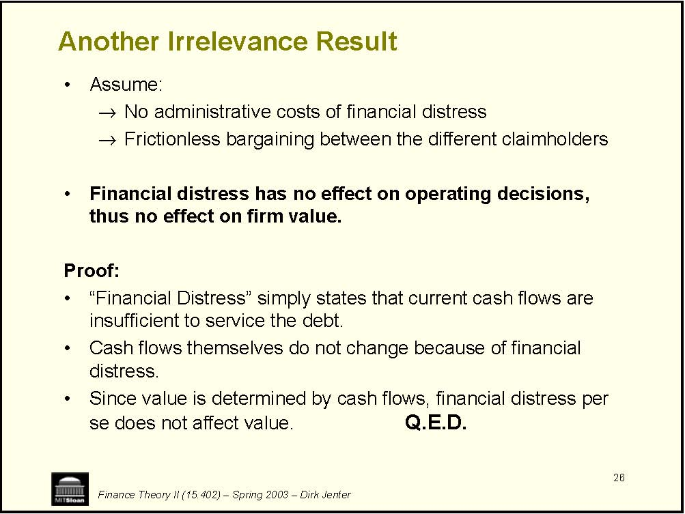

26 Another Irrelevance Result • →→lders • Proof: • i• distress. • Q.E.D. Finance Theory II (15.402) – Spring 2003 – Dirk Jenter Assume: No administrative costs of financial distress Frictionless bargaining between the different claimhoFinancial distress has no effect on operating decisions, thus no effect on firm value. “Financial Distress” simply states that current cash flows are insufficent to service the debt. Cash flows themselves do not change because of financial Since value is determined by cash flows, financial distress per se does not affect value. 

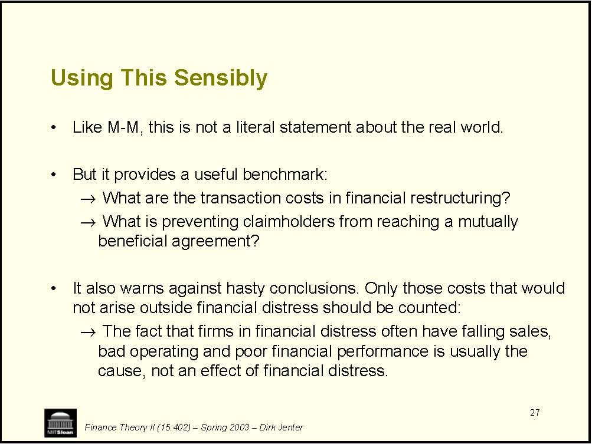

27 • • →→• i→Finance Theory II (15.402) – Spring 2003 – Dirk Jenter Using This Sensibly Like M-M, this is not a literal statement about the real world. But it provides a useful benchmark: What are the transaction costs in financial restructuring? What is preventing claimholders from reaching a mutually beneficial agreement? It also warns against hasty conclusions. Only those costs that would not arise outside financial dstress should be counted: The fact that firms in financial distress often have falling sales, bad operating and poor financial performance is usually the cause, not an effect of financial distress. 

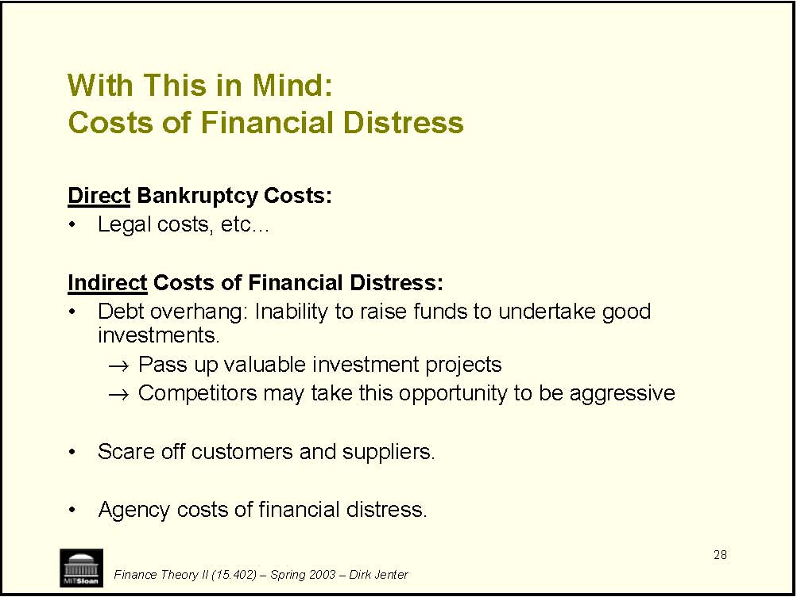

28 Costs of Financial Distress • • →→• • Finance Theory II (15.402) – Spring 2003 – Dirk Jenter With This in Mind: Direct Bankruptcy Costs: Legal costs, etc… Indirect Costs of Financial Distress: Debt overhang: Inability to raise funds to undertake good investments. Pass up valuable investment projects Competitors may take this opportunity to be aggressive Scare off customers and suppliers. Agency costs of financial distress. 

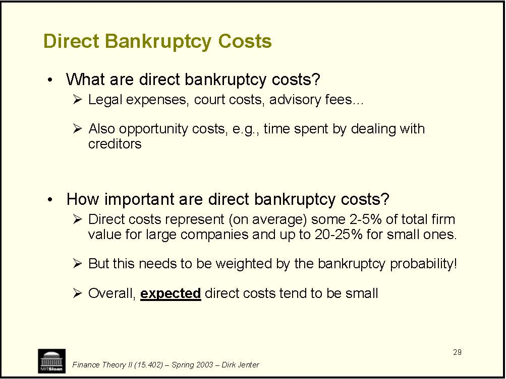

29 • ¾ ¾ • ¾ ¾ ¾ Overall, Finance Theory II (15.402) – Spring 2003 – Dirk Jenter Direct Bankruptcy Costs What are direct bankruptcy costs? Legal expenses, court costs, advisory fees… Also opportunity costs, e.g., time spent by dealing with creditors How important are direct bankruptcy costs? Direct costs represent (on average) some 2-5% of total firm value for large companies and up to 20-25% for small ones. But this needs to be weighted by the bankruptcy probability! expected direct costs tend to be small 

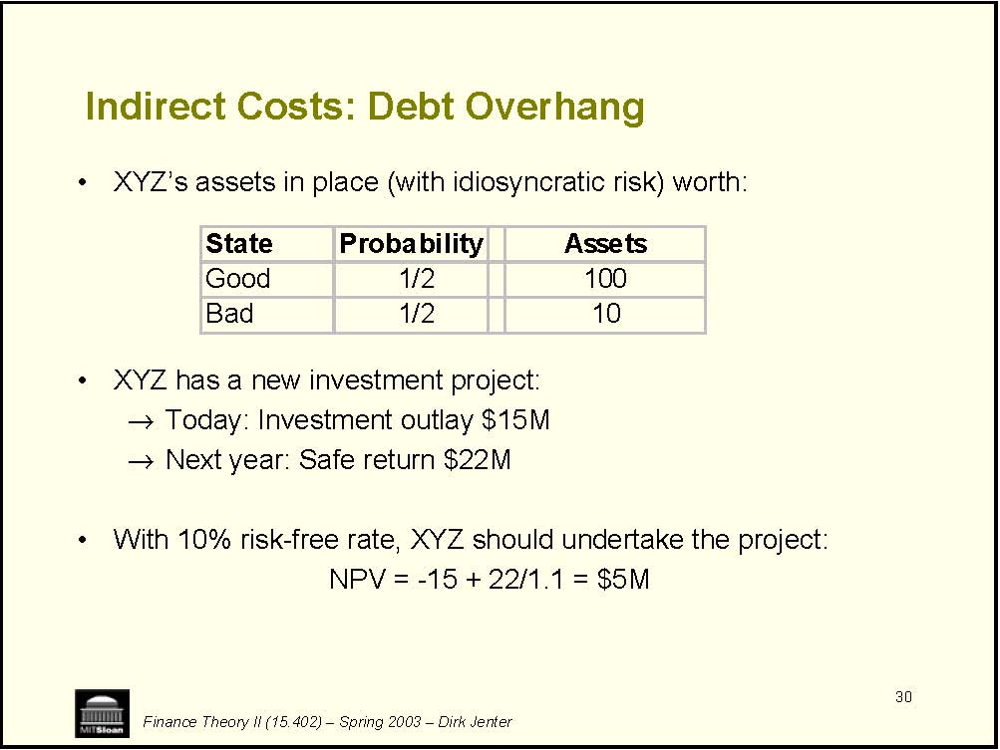

30 Indirect Costs: Debt Overhang • • →→• Finance Theory II (15.402) – Spring 2003 – Dirk Jenter XYZ’s assets in place (with idiosyncratic risk) worth: XYZ has a new investment project: Today: Investment outlay $15M Next year: Safe return $22M With 10% risk-free rate, XYZ should undertake the project: NPV = -15 + 22/1.1 = $5M State Probability Assets Good 1/2 100 Bad 1/2 10 

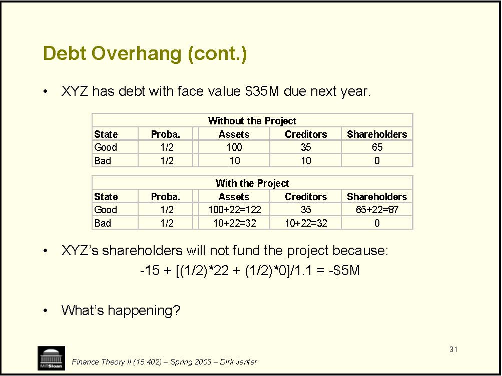

31 • • [(• 100 35 65 1/2 10 10 0 Wiject 35 1/2 0 WijFinance Theory II (15.402) – Spring 2003 – Dirk Jenter Debt Overhang (cont.) XYZ has debt with face value $35M due next year. XYZ’s shareholders will not fund the project because: -15 + 1/2)*22 + (1/2)*0]/1.1 = -$5M What’s happening? State Proba. Assets Creditors Shareholders Good 1/2 Bad thout the ProState Proba. Assets Creditors Shareholders Good 1/2 100+22=122 65+22=87 Bad 10+22=32 10+22=32 th the Proect 

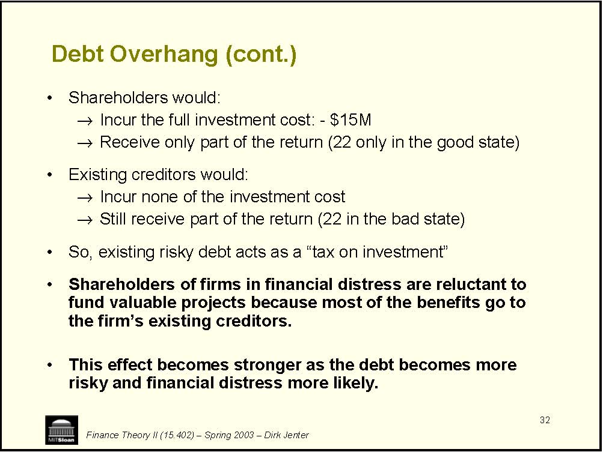

32 • →→) • →→) • • • Finance Theory II (15.402) – Spring 2003 – Dirk Jenter Debt Overhang (cont.) Shareholders would: Incur the full investment cost: -$15M Receive only part of the return (22 only in the good stateExisting creditors would: Incur none of the investment cost Still receive part of the return (22 in the bad stateSo, existing risky debt acts as a “tax on investment” Shareholders of firms in financial distress are reluctant to fund valuable projects because most of the benefits go to the firm’s existing creditors. This effect becomes stronger as the debt becomes more risky and financial distress more likely. 

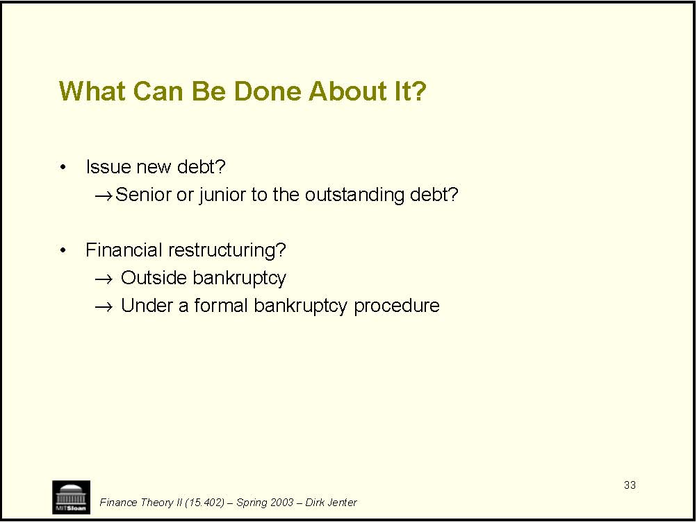

33 Finance Theory II (15.402) – Spring 2003 – Dirk Jenter What Can Be Done About It? • Issue new debt? →Senior or junior to the outstanding debt? • Financial restructuring? →Outside bankruptcy →Under a formal bankruptcy procedure 

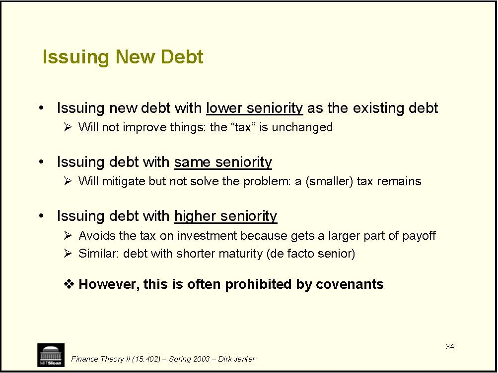

34 Finance Theory II (15.402) – Spring 2003 – Dirk Jenter Issuing New Debt • Issuing new debt with lower senioritylower seniorityas the existing debt ¾ Will not improve things: the “tax” is unchanged • Issuing debt with same seniority ¾ Will mitigate but not solve the problem: a (smaller) tax remains • Issuing debt with higher seniority ¾ Avoids the tax on investment because gets a larger part of payoff ¾ Similar: debt with shorter maturity (de facto senior) ™ However, this is often prohibited by covenants 

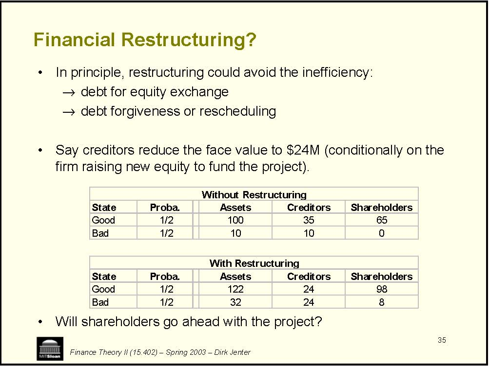

35 Financial Restructuring? • →→• ). • ject? 35 65 1/2 10 0 g 24 98 1/2 32 8 g Finance Theory II (15.402) – Spring 2003 – Dirk Jenter In principle, restructuring could avoid the inefficiency: debt for equity exchange debt forgiveness or rescheduling Say creditors reduce the face value to $24M (conditionally on the firm raising new equity to fund the projectWill shareholders go ahead with the proState Proba. Assets Creditors Shareholders Good 1/2 100 Bad 10 Without RestructurinState Proba. Assets Creditors Shareholders Good 1/2 122 Bad 24 With Restructurin

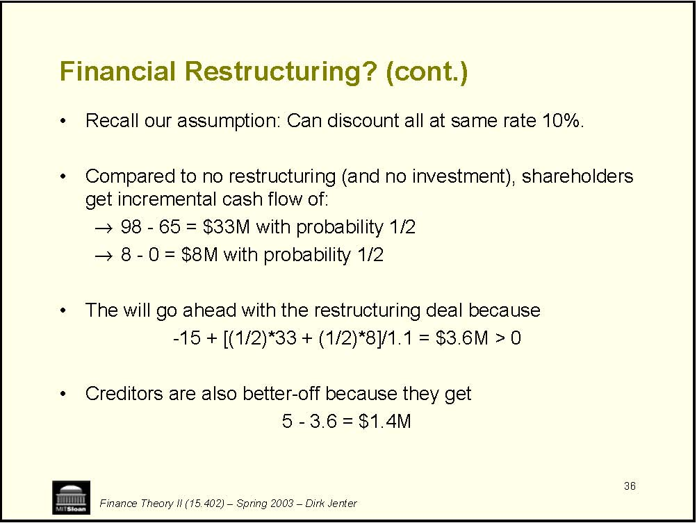

36 Financial Restructuring? (cont.) • • →→• [(• Finance Theory II (15.402) – Spring 2003 – Dirk Jenter Recall our assumption: Can discount all at same rate 10%. Compared to no restructuring (and no investment), shareholders get incremental cash flow of: 98 -65 = $33M with probability 1/2 8 -0 = $8M with probability 1/2 The will go ahead with the restructuring deal because -15 + 1/2)*33 + (1/2)*8]/1.1 = $3.6M &gt; 0 Creditors are also better-off because they get 5 -3.6 = $1.4M 

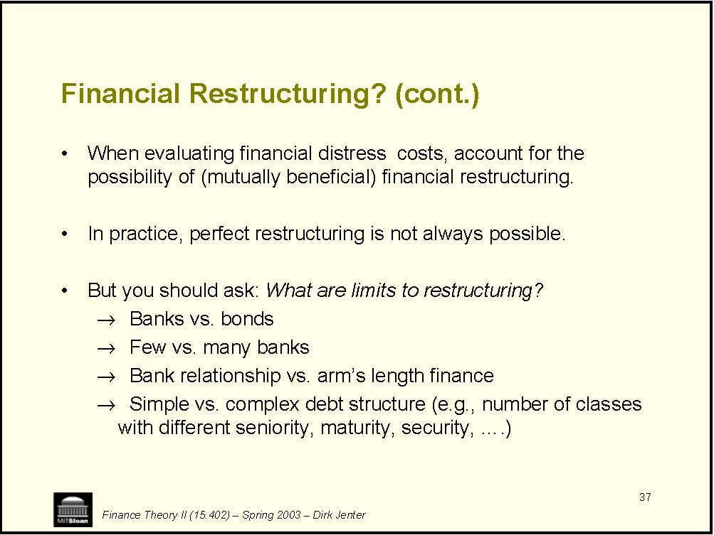

37 Financial Restructuring? (cont.) • i• • →→→→) Finance Theory II (15.402) – Spring 2003 – Dirk Jenter When evaluating financial dstress  costs, account for the possibility of (mutually beneficial) financial restructuring. In practice, perfect restructuring is not always possible. But you should ask: What are limits to restructuring? Banks vs. bonds Few vs. many banks Bank relationship vs. arm’s length finance Simple vs. complex debt structure (e.g., number of classes with different seniority, maturity, security, ….

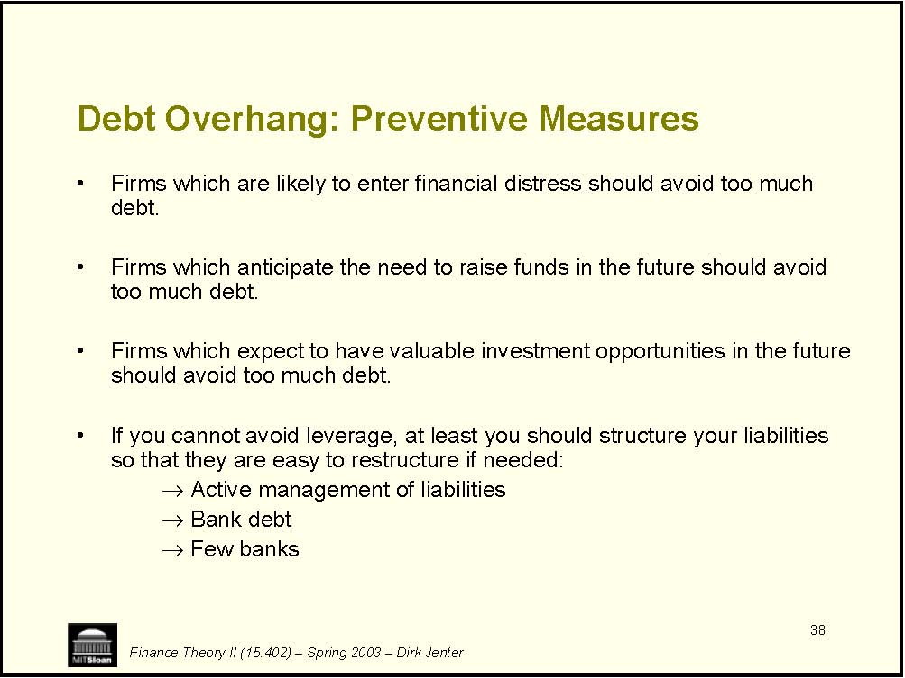

38 • debt. • too much debt. • • ities →→Bank debt →Finance Theory II (15.402) – Spring 2003 – Dirk Jenter Debt Overhang: Preventive Measures Firms which are likely to enter financial distress should avoid too much Firms which anticipate the need to raise funds in the future should avoid Firms which expect to have valuable investment opportunities in the future should avoid too much debt. If you cannot avoid leverage, at least you should structure your liabilso that they are easy to restructure if needed: Active management of liabilities  Few banks 

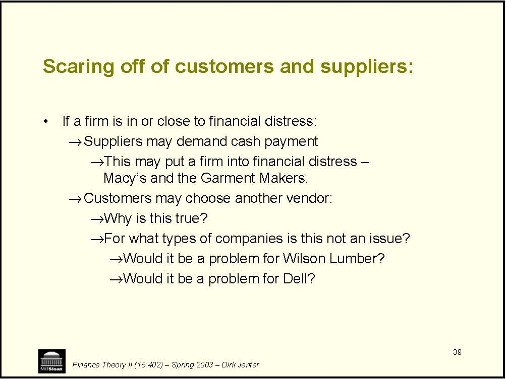

39 Scaring off of customers and suppliers: • →→→→→→→Finance Theory II (15.402) – Spring 2003 – Dirk Jenter If a firm is in or close to financial distress: Suppliers may demand cash payment This may put a firm into financial distress – Macy’s and the Garment Makers. Customers may choose another vendor: Why is this true? For what types of companies is this not an issue? Would it be a problem for Wilson Lumber? Would it be a problem for Dell? 

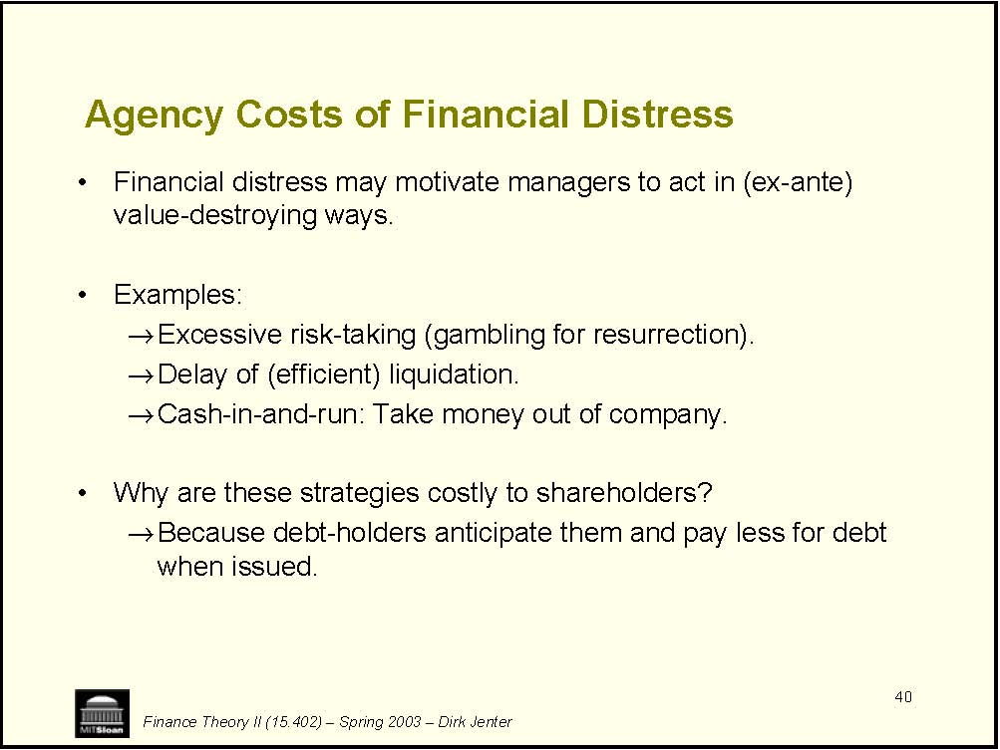

40 • iing ways. l→→→• →Finance Theory II (15.402) – Spring 2003 – Dirk Jenter Agency Costs of Financial Distress Financial distress may motvate managers to act in (ex-ante) value-destroy•Exampes: Excessive risk-taking (gambling for resurrection). Delay of (efficient) liquidation. Cash-in-and-run: Take money out of company. Why are these strategies costly to shareholders? Because debt-holders anticipate them and pay less for debt when issued. 

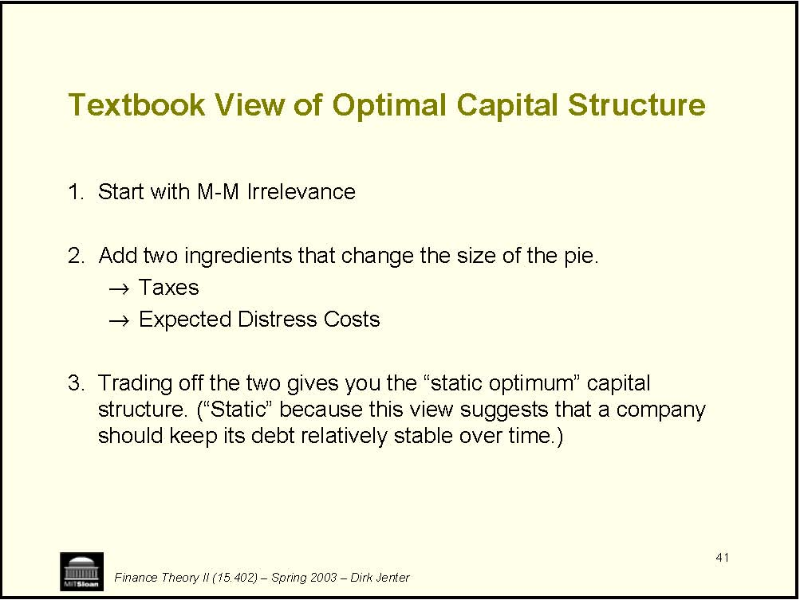

41 Textbook View of Optimal Capital Structure →Taxes →ital Finance Theory II (15.402) – Spring 2003 – Dirk Jenter 1. Start with M-M Irrelevance 2. Add two ingredients that change the size of the pie. Expected Distress Costs 3. Trading off the two gives you the “static optimum” capstructure. (“Static” because this view suggests that a company should keep its debt relatively stable over time.) 

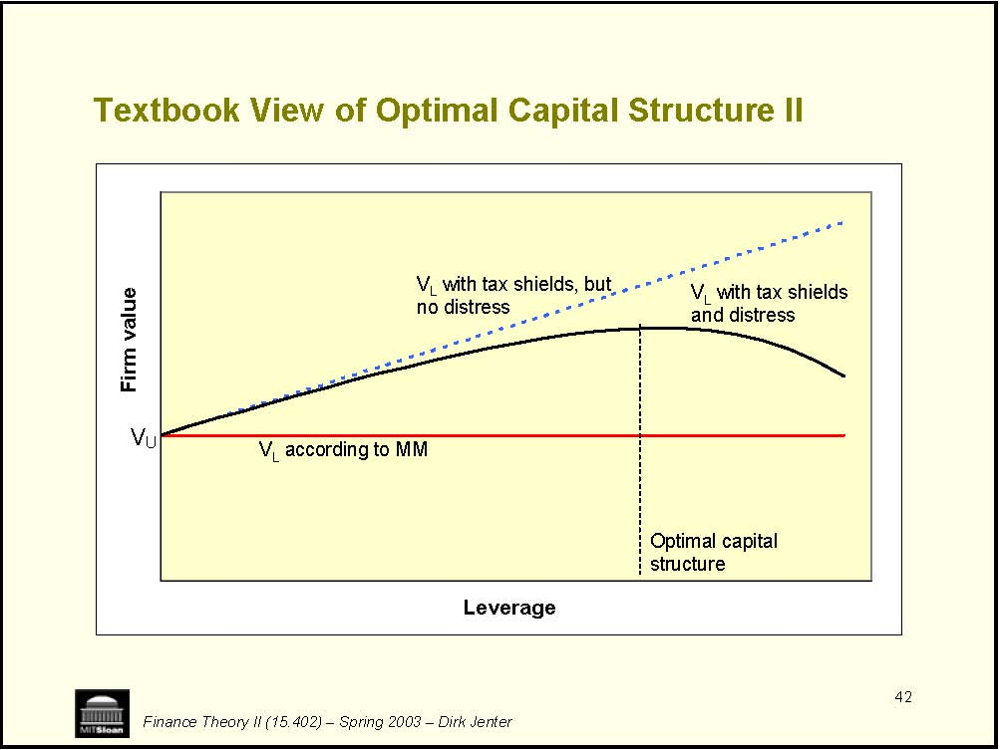

42 VU VL wiVL wiVL ilFinance Theory II (15.402) – Spring 2003 – Dirk Jenter Textbook View of Optimal Capital Structure II Leverage Firm valueth tax shields, but no distress th tax shields and distress accordng to MM Optima capital structure 

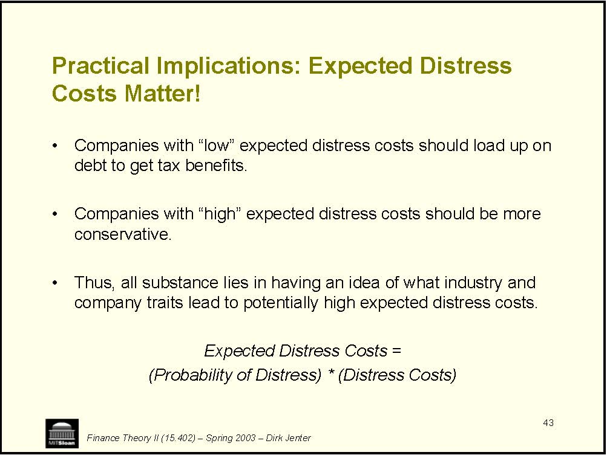

43 Practical Implications: Expected Distress Costs Matter! • • • Finance Theory II (15.402) – Spring 2003 – Dirk Jenter Companies with “low” expected distress costs should load up on debt to get tax benefits. Companies with “high” expected distress costs should be more conservative. Thus, all substance lies in having an idea of what industry and company traits lead to potentially high expected distress costs. Expected Distress Costs = (Probability of Distress) * (Distress Costs) 

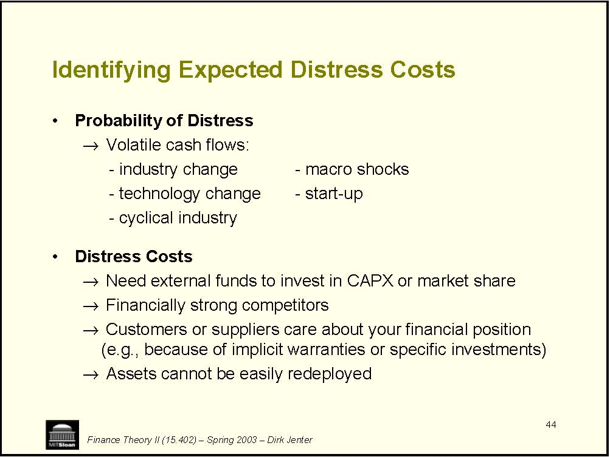

44 • →lows: -i• →→→→Finance Theory II (15.402) – Spring 2003 – Dirk Jenter Identifying Expected Distress Costs Probability of Distress Volatile cash fndustry change -macro shocks -technology change -start-up -cyclical industry Distress Costs Need external funds to invest in CAPX or market share Financially strong competitors Customers or suppliers care about your financial position (e.g., because of implicit warranties or specific investments) Assets cannot be easily redeployed 

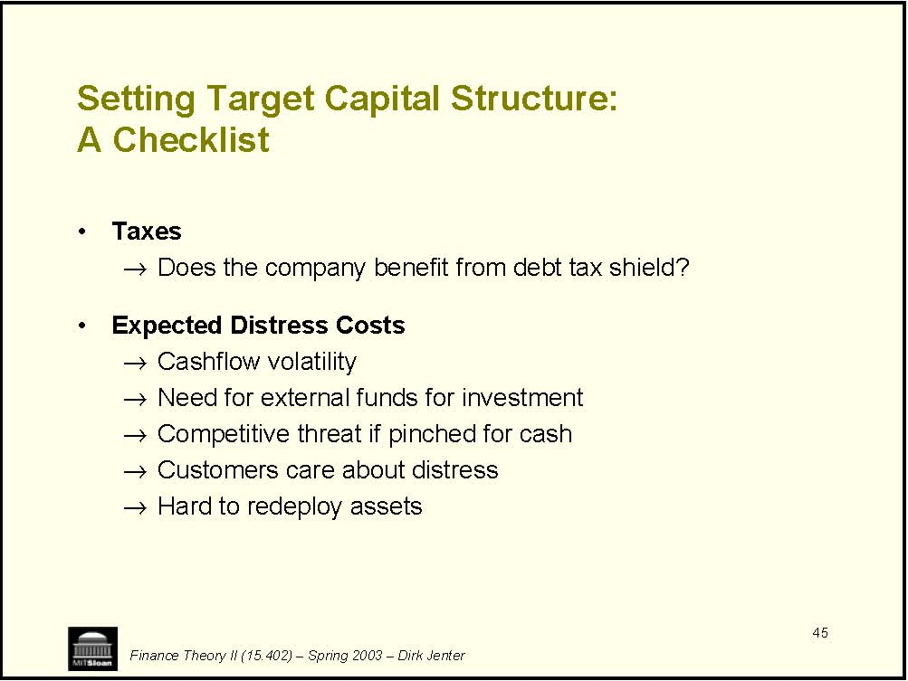

45 Setting Target Capital Structure: A Checklist • Taxes →• →Cashflow volatility →→→→Finance Theory II (15.402) – Spring 2003 – Dirk Jenter Does the company benefit from debt tax shield? Expected Distress Costs Need for external funds for investment Competitive threat if pinched for cash Customers care about distress Hard to redeploy assets 

Does the Checklist Explain Observed Debt Ratios?

<Table>
<TR>
<TH> Industry </TH>
<TH>Debt Ratio (</TH>
<TH>%)</TH>
</TR>
<TR>
<TD> Electric and Gas </TD>
<TD>43.2</TD>

</TR>
<TR>
<TD> Food Production </TD>
<TD>22.9</TD>

</TR>
<TR>
<TD> Paper and Plastic </TD>
<TD>30.4 </TD>

</TR>
<TR>
<TD>Equipment </TD>
<TD>19.1 </TD>

</TR>
<TR>
<TD>Retailers </TD>
<TD>21.7 </TD>

</TR>
<TR>
<TD>Chemicals </TD>
<TD>17.3</TD>

</TR>
<TR>
<TD> Computer Software </TD>
<TD>3.5 </TD>

</TR>
</Table>

46 

Finance Theory II (15.402) – Spring 2003 – Dirk Jenter 

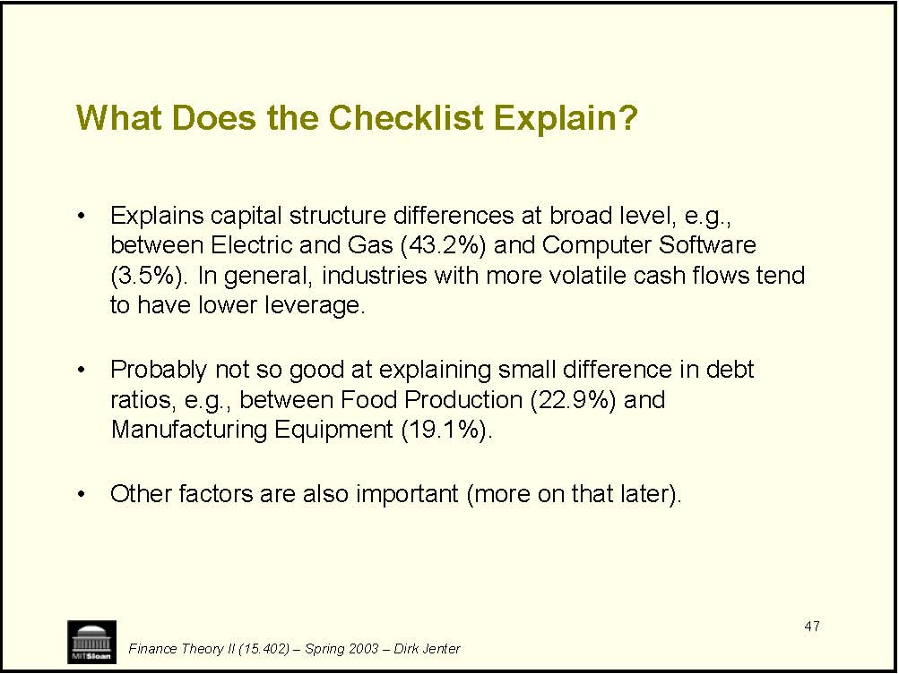

47 What Does the Checklist Explain? • il• ) • Finance Theory II (15.402) – Spring 2003 – Dirk Jenter Explains capital structure dfferences at broad level, e.g., between Electric and Gas (43.2%) and Computer Software (3.5%). In general, industries with more volatile cash fows tend to have lower leverage. Probably not so good at explaining small difference in debt ratios, e.g., between Food Production (22.9%and Manufacturing Equipment (19.1%). Other factors are also important (more on that later). 

Finance Theory II (15.402) – Spring 2003 – Dirk Jenter Appendix (for your information) 

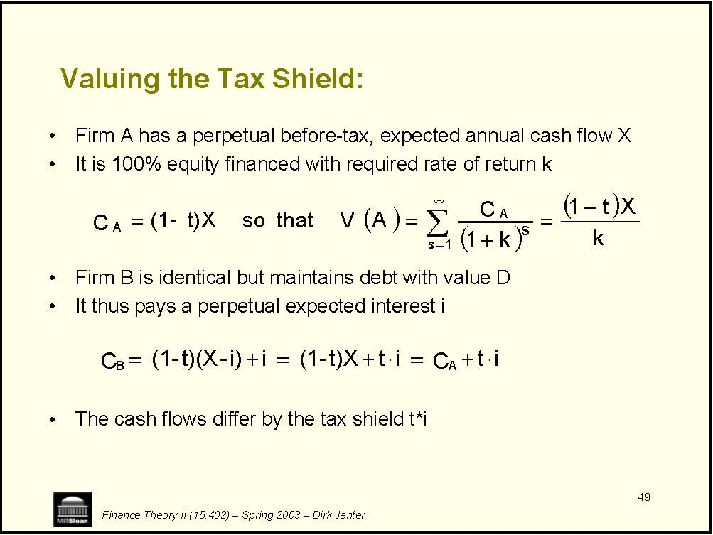

49 Valuing the Tax Shield: • • • • • ()()()∑ ∞=−=+==1s A A k 1 k1 CAVC s itCitii)C AB =Finance Theory II (15.402) – Spring 2003 – Dirk Jenter Firm A has a perpetual before-tax, expected annual cash flow X It is 100% equity financed with required rate of return k Firm B is identical but maintains debt with value D It thus pays a perpetual expected interest i The cash flows differ by the tax shield t*i X t that so t)X (1t)X (1-t)(X (1-⋅+=⋅+=+

50 Valuing the Tax Shield (cont.) • • • and []]i CA⋅and ()()k 1]CPV[ A −==()()()tD k 1tD +−=+=Finance Theory II (15.402) – Spring 2003 – Dirk Jenter Apply value additivity: Value separately We already know The TS’s capitalized value is: D t PV[ t shield tax PV ⋅=⋅=itX t A V X t A V B V 

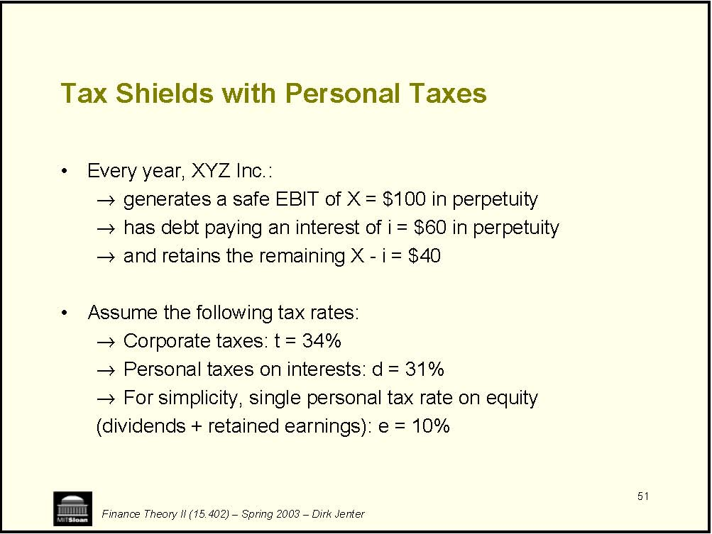

51 Tax Shields with Personal Taxes • →→→i • →→→Finance Theory II (15.402) – Spring 2003 – Dirk Jenter Every year, XYZ Inc.: generates a safe EBIT of X = $100 in perpetuity has debt paying an interest of i = $60 in perpetuity and retains the remaining X = $40 Assume the following tax rates: Corporate taxes: t = 34% Personal taxes on interests: d = 31% For simplicity, single personal tax rate on equity (dividends + retained earnings): e = 10% 

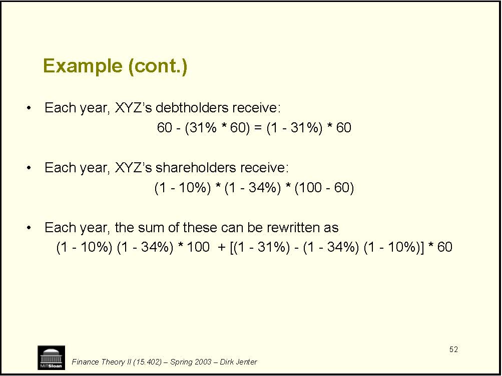

52 Example (cont.) • 60 () • () • ) * 100 + [((Finance Theory II (15.402) – Spring 2003 – Dirk Jenter Each year, XYZ’s debtholders receive: 31% * 60) = (1 -31%* 60 Each year, XYZ’s shareholders receive: (1 -10%) * 1 -34%) * (100 -60Each year, the sum of these can be rewritten as (1 -10%) (1 -34%1 -31%) 1 -34%) (1 -10%)] * 60 

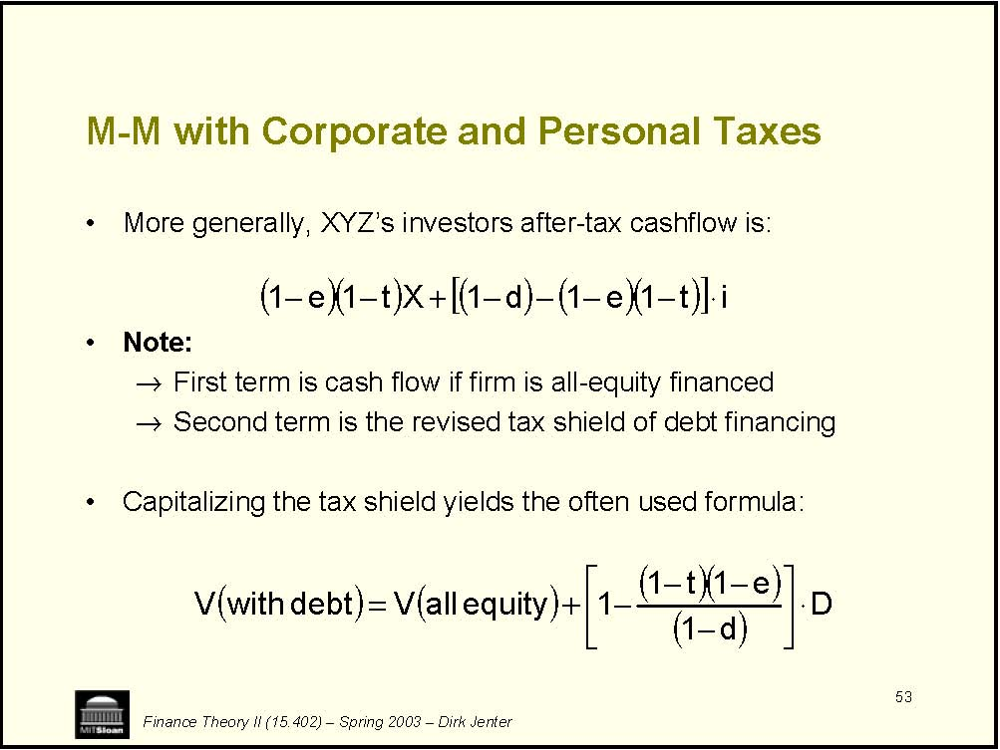

53 • • →→• ()()()()()Dd1 e11 ⋅⎥⎦⎤ ⎢⎣⎡ −−−−+=()()()()()[]it1d11 ⋅−−−−+−−Finance Theory II (15.402) – Spring 2003 – Dirk Jenter M-M with Corporate and Personal Taxes More generally, XYZ’s investors after-tax cashflow is: Note: First term is cash flow if firm is all-equity financed Second term is the revised tax shield of debt financing Capitalizing the tax shield yields the often used formula: 1 t equity all V debt with V 1 e X t 1 e 

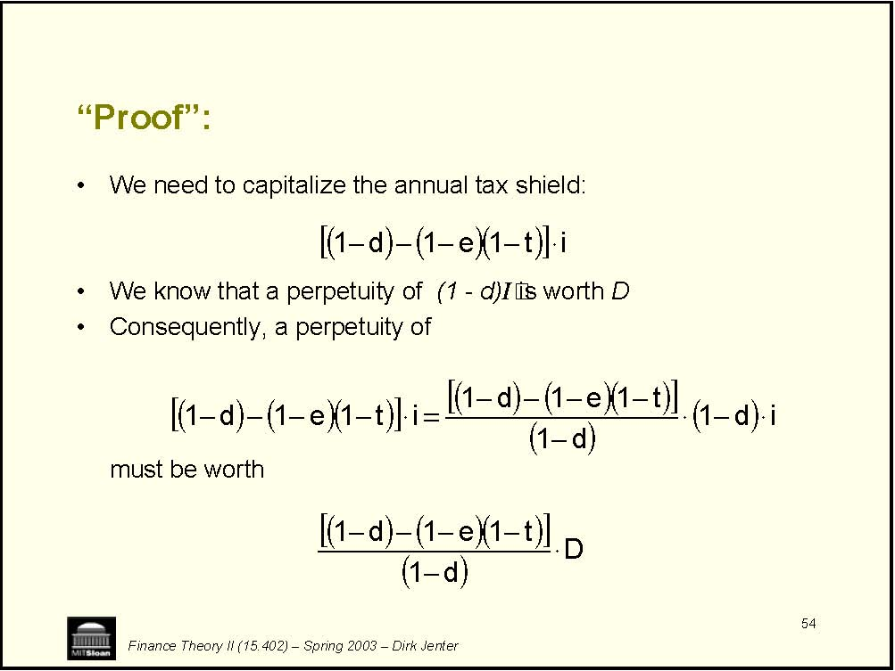

54 “Proof”: • • )ID • ()()()[]it1d1 ⋅−−−−()()()()()()id1 d1 t1d1it1d1 ⋅−⋅−−−−−=⋅−−−−()()()D d1 t1d1 ⋅−−−−−Finance Theory II (15.402) – Spring 2003 – Dirk Jenter We need to capitalize the annual tax shield: We know that a perpetuity of  (1 -dis worth Consequently, a perpetuity of must be worth 1 e 1 e 1 e 1 e 

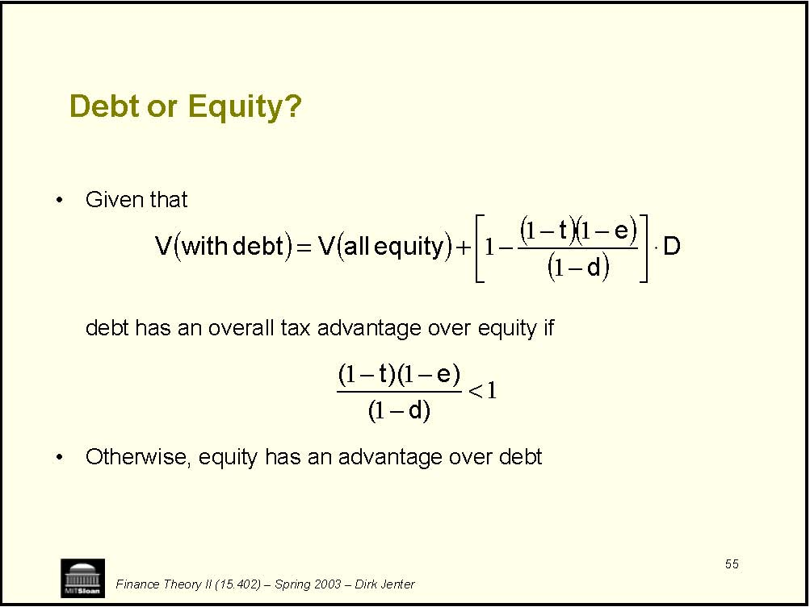

55 • • ()()()()()Dd et ⋅⎥⎦⎤ ⎢⎣⎡ −−−−+=1 111 1 1 11 &lt;−−−)d( )e( Finance Theory II (15.402) – Spring 2003 – Dirk Jenter Debt or Equity? Given that debt has an overall tax advantage over equity if Otherwise, equity has an advantage over debt equity all V debt with V )( t 

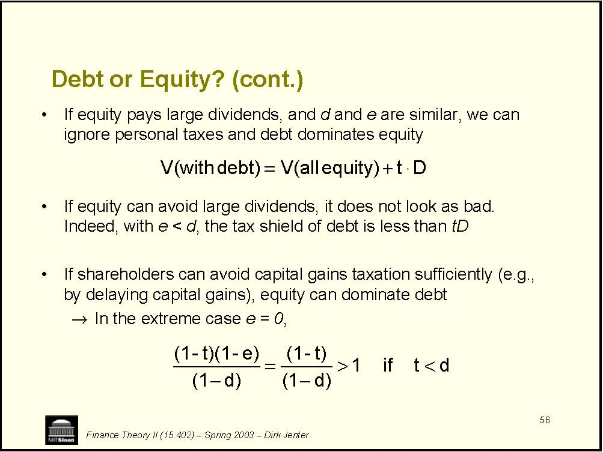

56 • d e • tD • →e = 0, ⋅+=dtif1e) &lt;&gt;−=−Finance Theory II (15.402) – Spring 2003 – Dirk Jenter Debt or Equity? (cont.) If equity pays large dividends, and and are similar, we can ignore personal taxes and debt dominates equity If equity can avoid large dividends, it does not look as bad. Indeed, with e &lt; d, the tax shield of debt is less than If shareholders can avoid capital gains taxation sufficiently (e.g., by delaying capital gains), equity can dominate debt In the extreme case D t equity) V(all debt) V(with d) (1 t) -(1 d) (1 -t)(1 -(1 

         Acrobat Distiller 6.0 (Windows)

         Compaq

         Compaq

         Acrobat PDFMaker 6.0 for PowerPoint

         2004-01-22T11:40:55+05:30

         2004-01-22T11:38:32+05:30

         2004-01-22T11:40:55+05:30

         uuid:a4e4bc1f-4946-449b-b897-63fda0e4f150

         uuid:828073eb-863b-49d6-b09a-7b95a6110e2a

         xml

               No Slide Title

               Leslie A. Larocca

Tax savings of debt: value implications

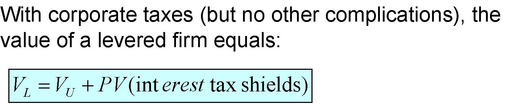

With corporate taxes (but no other complications), the value of a levered firm equals:shields) tax (interestPVVVUL+=

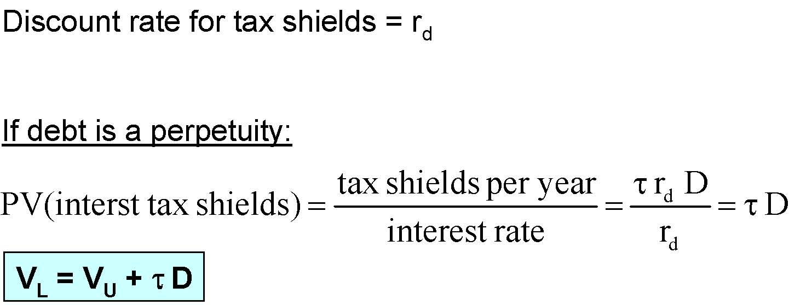

D   rD r   rateinterest yearper  shieldstax shields)tax V(interst Pddτ=τ==VL= VU+ τDDiscount rate for tax shields = rdIf debt is a perpetuity:

Valuing the Tax Shield (to make things clear)

Firm A: is all equity financedhas a perpetual before-tax, expected annual cash flow XFirm B: is identical but maintains debt with value DIt thus pays a perpetual expected interest rd*D )X-(1  CAτ=

⇒⋅⋅τ+τ=+τ=   Dr  )X-(1    Dr  D)r-)(X-(1CdddB

DrC  C dAB⋅⋅τ+=

Note: the cash flows differ by the tax shield τ*rd*D

To make things clear (cont.)

- We want to value firm B knowing that:

- Apply value additivity: Value separately CAand τ*rd*D

- The value of firm A is: 

- The present value of tax shields is:

- So, the value of firm B is:

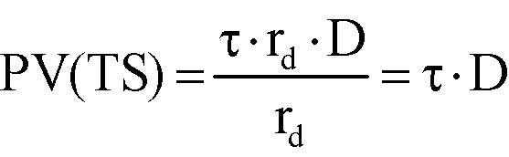

DrDr )TS(PVdd⋅τ=⋅⋅τ=

DVVAB⋅τ+=

DrC  C dAB⋅⋅τ+=

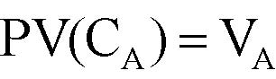

AAV)C(PV=

Leverage and firm value 

VU0.000.150.300.450.60LeverageFirmvalue

Remarks

- Raising debt does not create value, i.e., you can’t create valueby borrowing and sitting on the excess cash.

- It creates value relative to raising the same amount in equity.

- Hence, value is created by the tax shield when you:

- →finance an investment with debt rather than equity

- →undertake a recapitalization, i.e., a financial transaction in which some equity is retired and replaced with debt.

Back to the Microsoft example…

What would be the value of tax shields for Microsoft?

- Interest expense = $50 ×0.07 = $3.5 billion

- Interest tax shield = $3.5 ×0.34 = $1.19 billion

- PV(taxshields) =1.19 / 0.07 = 50 ×0.34 = $17 billion

- VL= Vu+ PV(taxshields) = $440 billion

Is This Important or Negligible?

- Firm A has no debt and is worth V(all equity).

- Suppose Firm A undertakes a leveraged recapitalization:

- →issues debt worth D,

- →and buys back equity with the proceeds.

- Its new value is:

- Thus, with corporate tax rate t= 35%:

- →for D = 20%, firm value increases by about 7%.

- →for D = 50%, it increases by about 17.5%.

UULVD 1VV⋅τ+=

Bottom Line

- Tax shield of debt matters, potentially a lot.

- Pie theory gets you to ask the right question: How does this financing choice affect the IRS’ bite of the corporate pie?

- It is standard to use τ*D for the capitalization of debt’s tax break.

- Caveats:

- →Not all firms face full marginal tax rate

- →Personal taxes

Marginal tax rate (MTR)

- Present value of current and expected future taxes paid on $1 of additional income

- Why could the MTR differ from the statutory tax rate?

- Current losses

- Tax-Loss Carry Forwards (TLCF)

Tax-Loss Carry Forwards (TLCF)

- Current losses can be carried backward/forward for 3/15 years

- Can be used to offset past profitsand get tax refund

- Can be used to offset future profitsand reduce future tax bill

- Valuing TLCF, need to incorporate time value of money

- Bottom line: More TLCF Less debt

Tax-Loss Carry Forwards (TLCF): Example

MTR at time 0= PV (Additional Taxes) = 0.35/1.12 = 0.29

(assuming that r = 10%)

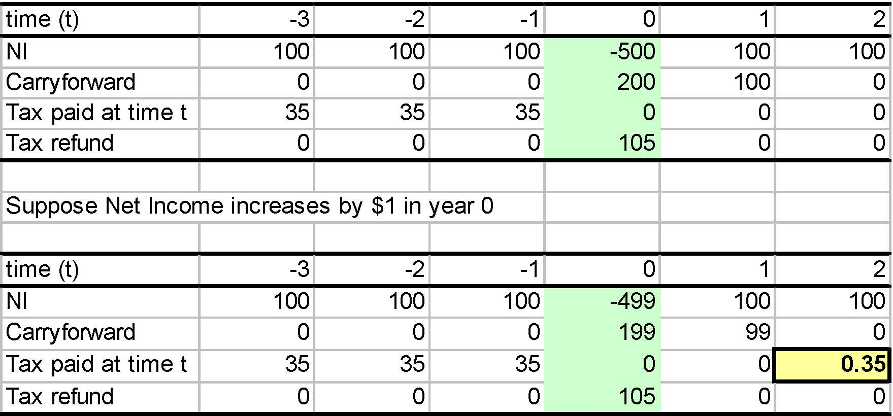

time (t)-3-2-1012NI100100100-500100100Carryforward0002001000Tax paid at time t353535000Tax refund00010500Suppose Net Income increases by $1 in year 0time (t)-3-2-1012NI100100100-499100100Carryforward000199990Tax paid at time t353535000.35Tax refund00010500

Marginal Tax Rates for U.S. firms

Please see the graph showing Marginal Tax Rate, Percent of 

Population, and Year in:

Graham, J.R. Debt and the Marginal Tax Rate. Journal of 

Financial Economics. May 1996, pp. 41-73.

Personal Taxes

- Investors’ return from debt and equity are taxed differently

- Interest and dividends are taxed as ordinary income

- Capital gains are taxed at a lower rate

- Capital gains can be deferred (contrary to dividends and interest)

- Corporations have a 70% dividend exclusion

- So: For personal taxes, equity dominates debt.

Pre Clinton

* Extreme assumption: No tax on capital gains

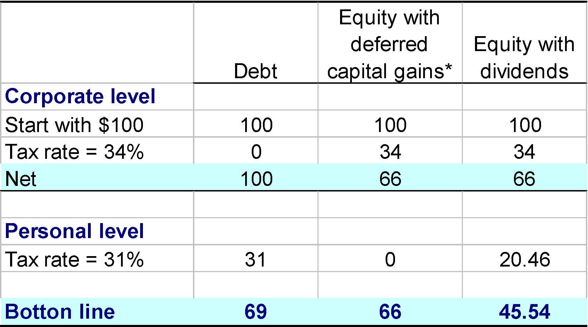

DebtEquity with deferred capital gains*Equity with dividendsCorporate levelStart with $100100100100Tax rate = 34%03434Net1006666Personal levelTax rate = 31%31020.46Botton line696645.54

Post Clinton

* Extreme assumption: No tax on capital gains

DebtEquity with deferred capital gains*Equity with dividendsCorporate levelStart with $100100100100Tax rate = 35%03535Net1006565Personal levelTax rate = 40%40026Botton line606539

Bottom Line

- Taxes favor debt for most firms

- We will lazily ignore personal taxation in the rest of the course

- But, beware of particular cases

The Dark Side of Debt: Cost of Financial Distress

- If taxes were the only issue, (most) companies would be 100% debt financed

- Common sense suggests otherwise 

- If the debt burden is too high, the company will have trouble paying

- The result: financial distress

“Pie” Theory

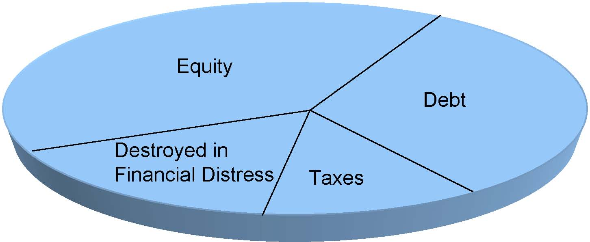

EquityDebtTaxesDestroyed in Financial Distress

Costs of Financial Distress

- Firms in financial distress perform poorly

- Is this poor performance an effect or a cause of financial distress?

- Financial distress sometimes results in partial or complete liquidation of the firm’s assets

- Would this not occur otherwise?

Do not confuse causes and effects of financial distress.  Only the effectsshould be counted as costs!

Costs of Financial Distress

Direct Bankruptcy Costs:

- Legal costs, etc…

Indirect Costs of Financial Distress:

- Debt overhang: Inability to raise funds to undertake good investments

- →Pass up valuable investment projects

- →Competitors may take this opportunity to be aggressive

- Risk taking behavior -gambling for salvation

- Scare off customers and suppliers

Direct bankruptcy costs

Evidence for 11 bankrupt railroads (Warner, Journal of Finance 1977)

* Bankruptcy occurs in month 0.

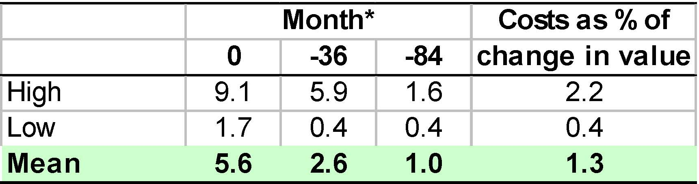

Costs as % of0-36-84change in valueHigh9.15.91.62.2Low1.70.40.40.4Mean5.62.61.01.3Month*

Direct bankruptcy costs and firm size

Evidence for 11 bankrupt railroads (Warner, Journal of Finance 1977)

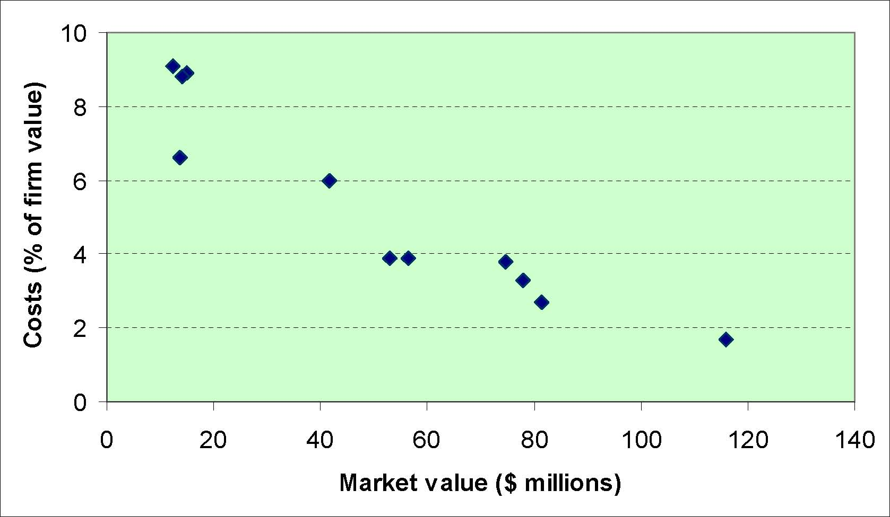

0246810020406080100120140Market value ($ millions)Costs (% of firm value)

Direct Bankruptcy Costs

- What are direct bankruptcy costs?

- Legal expenses, court costs, advisory fees…

- Also opportunity costs, e.g., time spent by dealing with creditors

- How important are direct bankruptcy costs?

- Prior studies find average costs of 2-6% of total firm value

- Percentage costs are higher for smaller firms

- But this needs to be weighted by the bankruptcy probability!

- Overall, expecteddirect costs tend to be small

Debt Overhang

- XYZ has assets in place (with idiosyncratic risk) worth:

- In addition, XYZ has $15M in cash

- This money can be either paid out as a dividend or invested

- XYZ’sproject is:

- Today: Investment outlay $15M, next year: safe return $22M

- Should XYZ undertake the project?

- Assume: risk-free rate = 10%

- NPV= -15 + 22/1.1 = $5M

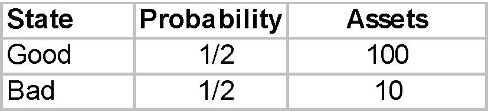

StateProbabilityAssetsGood1/2100Bad1/210

Debt Overhang (cont.)

XYZ has debt with face value $35M due next yearWill XYZ’sshareholders fund the project?→If not, they get the dividend = $15M→If yes, they get: [(1/2)*22 + (1/2)*0]/1.1 = $10What’s happening?Project?StateProba.AssetsCreditorsShareholdersNOGood1/21003565Bad1/210100YESGood1/2100+22=1223565+22=87Bad1/210+22=3210+22=320

Debt Overhang (cont.)

- Shareholders would:

- →Incur the full investment cost: -$15M

- →Receive only part of the return (22 only in the good state)

- Existing creditors would:

- →Incur none of the investment cost

- →Still receive part of the return (22 in the bad state)

- So, existing risky debt acts as a “tax on investment”

Shareholders of firms in financial distress may be reluctant to fund valuable projects because most of the benefits would go to the firm’s existing creditors.

Debt Overhang (cont.)

- What if the probability of the bad state is 2/3 instead of 1/2?

- The creditor grab part of the return even more often.

- The “tax” of investment is increased.

- The shareholders are even less inclined to invest.

Companies find it increasingly difficult to invest as financial distress becomes more likely.

What Can Be Done About It?

- New equity issue?

- New debt issue?

- Financial restructuring?

- Outside bankruptcy

- Under a formal bankruptcy procedure

Raising New Equity?

- Suppose you raise outside equity

- New shareholders must break even:

- They may be paying the investment cost

- But only because they receive a fair payment for it

- This means someone else is de facto incurring the cost:

- The existing shareholders!

- So, they will refuse again

Firms in financial distress may be unable to raise funds from new investors because most of the benefits would go to the firm’s existing creditors.

Financial Restructuring?

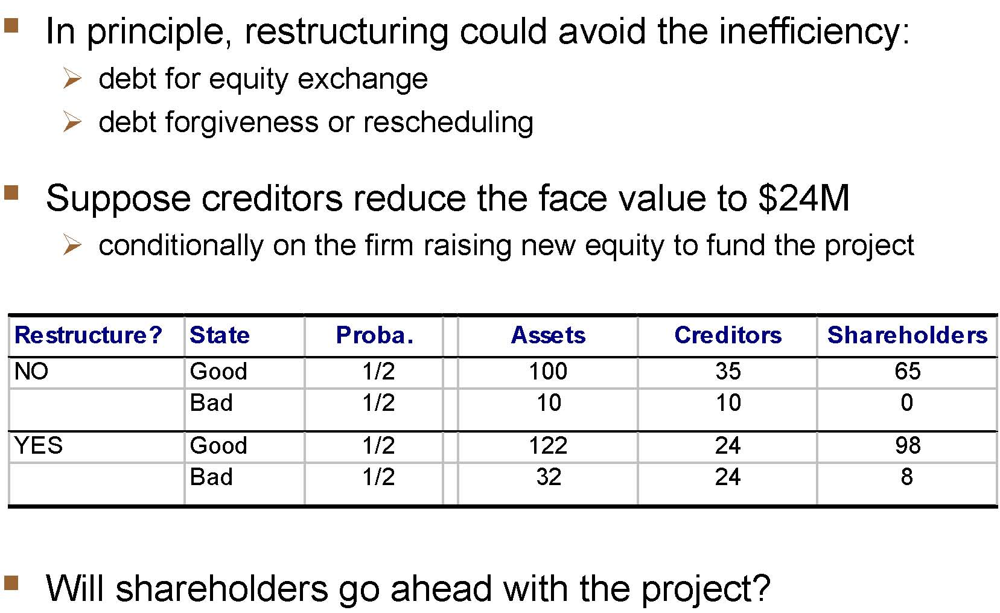

In principle, restructuring could avoid the inefficiency:debt for equity exchangedebt forgiveness or reschedulingSuppose creditors reduce the face value to $24Mconditionally on the firm raising new equity to fund the projectWill shareholders go ahead with the project?Restructure?StateProba.AssetsCreditorsShareholdersNOGood1/21003565Bad1/210100YESGood1/21222498Bad1/232248

Financial Restructuring? (cont.)

- Incremental cash flow to shareholders from restructuring:

- 98 -65 = $33M with probability 1/2

- 8 -0 = $8M with probability 1/2

- They will go ahead with the restructuring deal because:

- -15 + [(1/2)*33 + (1/2)*8]/1.1 = $3.6M &gt; 0

- Recall our assumption: discount everything at 10%

- Creditors are also better-off because they get:

- 5 -3.6 = $1.4M

Financial Restructuring? (cont.)

- When evaluating financial distress  costs, account for the possibility of (mutually beneficial) financial restructuring.

- In practice, perfect restructuring is not always possible.

- But you should ask: What are limits to restructuring?

- Banks vs. bonds

- Few vs. many banks

- Bank relationship vs. arm’s length finance

- Simple vs. complex debt structure (e.g., number of classes with different seniority, maturity, security, ….)

Issuing New Debt

- Issuing new debt with lower seniorityas the existing debt

- Will not improve things: the “tax” is unchanged

- Issuing debt with same seniority

- Will mitigate but not solve the problem: a (smaller) tax remains

- Issuing debt with higher seniority

- Avoids the tax on investment because gets a larger part of payoff

- Similar: debt with shorter maturity (de facto senior)

- However, this may be prohibited by covenants

Bankruptcy

- This analysis has implications which are recognized in the Bankruptcy Law.

- Bankruptcy under Chapter 11 of the Bankruptcy Code:

- Provides a formal framework for financial restructuring

- Debtor in Possession: Under control by the court, the company can issue debt senior to existing claims despite covenants

Debt Overhang: Preventive Measures

- Firms which are likely to enter financial distress should avoid too much debt

- If you cannot avoid leverage, at least you should structure your liabilities so that they are easy to restructure if needed:

- Active management of liabilities  

- Bank debt

- Few banks

Example

- Your firm has $50 in cash and is currently worth $100.  

- You have the opportunity to acquire an internet start-up for $50.

- The start-up will either be worth $0 (prob= 2/3) or $120 (prob= 1/3) in one year.  

- Assume the discount rate is 0%.

- Would you invest in the start-up if your firm is all-equity financed?

- What if the firm has debt outstanding with a face value of $80?

If all equity

Expected payoff = 0.66 ×0 + 0.33 ×120 = $40

NPV = -50 + 40 = –$10→Reject!

Example, cont.

If leveraged (debt=$80):

- Without project:  equity = $20, debt = $80

With project

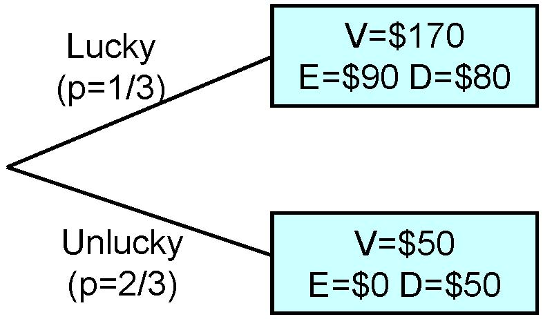

Lucky (p=1/3)Unlucky (p=2/3)V=$170E=$90 D=$80V=$50E=$0 D=$50

With project:  equity = $30, debt = $60   →Accept!What is happening?

Excessive Risk-Taking

- The project is a bad gamble (NPV&lt;0) but the shareholders are essentially gambling with the creditors’ money.

- Implication: Firms in distress will adopt excessively risky strategies to “go for broke”.

- Firms will tend to liquidate assets too late and remain in business for too long.

Excessive Risk-Taking: Intuition

Equity holders have unlimited upside potential but bounded losses

051015202530051015202530Firm valueDebt-15-10-5051015EquityEquityDebtFace value

Summary: Expected costs of financial distress

0LeverageExpected distress costs

Summary: Capital structure choice

VULeverageFirm valueVLwith tax shields, but no distressVLwith tax shields and distressVLaccording to MMOptimal capital structure

Textbook View of Optimal Capital Structure

1.Start with M-M Irrelevance

2.Add two ingredients that change the size of the pie.

- →Taxes

- →Expected Distress Costs

3.Trading off the two gives you the “static optimum” capital structure. (“Static” because this view suggests that a company should keep its debt relatively stable over time.)

Practical Implications

- Companies with “low” expected distress costs should load up on debt to get tax benefits.

- Companies with “high” expected distress costs should be more conservative.

Expected Distress Costs

Thus, all substance lies in having an idea of what industry and company traits lead to potentially high expected distress costs.

Expected Distress Costs =

(Probability of Distress) * (Distress Costs)

Identifying Expected Distress Costs

- Probability of Distress

- Volatile cash flows

-industry change-macro shocks

-technology change-start-up

- Distress Costs

- Need external funds to invest in CAPX or market share

- Financially strong competitors

- Customers or suppliers care about your financial position (e.g., because of implicit warranties or specific investments)

- Assets cannot be easily redeployed

Setting Target Capital Structure:

A Checklist

- Taxes

- Does the company benefit from debt tax shield?

- Expected Distress Costs

- Cashflowvolatility

- Need for external funds for investment

- Competitive threat if pinched for cash

- Customers care about distress

- Hard to redeploy assets

Does the Checklist Explain Observed Debt Ratios?

  Industry Debt Ratio (%)  Electric and Gas43.2  Food Production22.9  Paper and Plastic30.4  Equipment19.1  Retailers21.7  Chemicals17.3  Computer Software3.5

What Does the Checklist Explain?

- Explains capital structure differences at broad level, e.g., between Electric and Gas (43.2%) and Computer Software (3.5%). In general, industries with more volatile cash flows tend to have lower leverage.

- Probably not so good at explaining small difference in debt ratios, e.g., between Food Production (22.9%) and Manufacturing Equipment (19.1%).

- Other factors, such as sustainable growth, are also important.

Key Points

- Recall the tension in Wilson Lumber between product market goals (fast growth) and financial goals (modest leverage).

- Fast growing companies reluctant to issue equity end up with debt ratios greater than the target implied by the checklist.

- Slowly growing companies reluctant to buy back equity or increase dividends end up with debt ratios below the target implied by the checklist.

Key Points

- O.K. to stray somewhat from target capital structure.

- But keep in mind: Fast growth companies that stray too far from the target with excessive leverage, risk financial distress.

- Ultimately, must have a consistent product market strategy and financial strategy.

         Acrobat Distiller 6.0 (Windows)

         2004-01-21T11:08:37+05:30

         2004-01-21T11:09:28+05:30

         2004-01-21T11:09:28+05:30

         PScript5.dll Version 5.2

         uuid:ca43a9c5-f96b-43ee-914a-101b3a07bd1c

         uuid:03ab8257-aa58-4012-8630-b16958c050d6

         xml

               djenter

               Microsoft PowerPoint - LN08(CS3) shorter.ppt

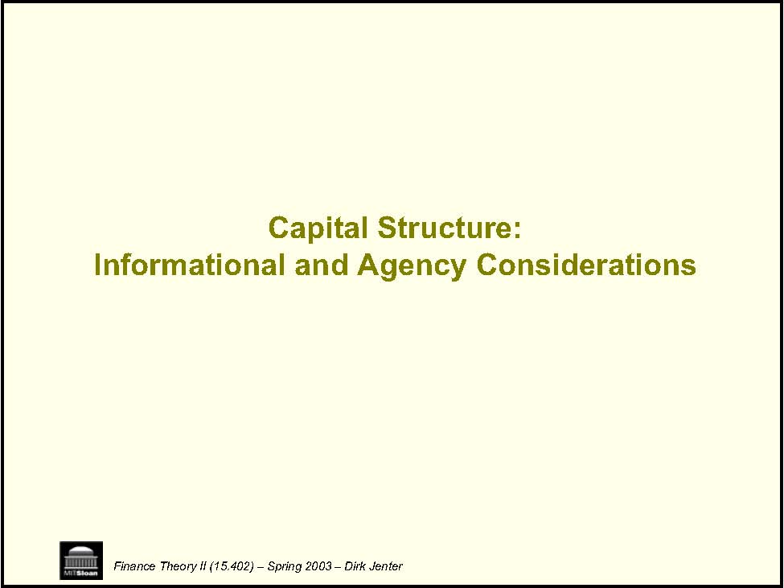

Capital Structure: Finance Theory II (15.402) – Spring 2003 – Dirk Jenter Informational and Agency Considerations 

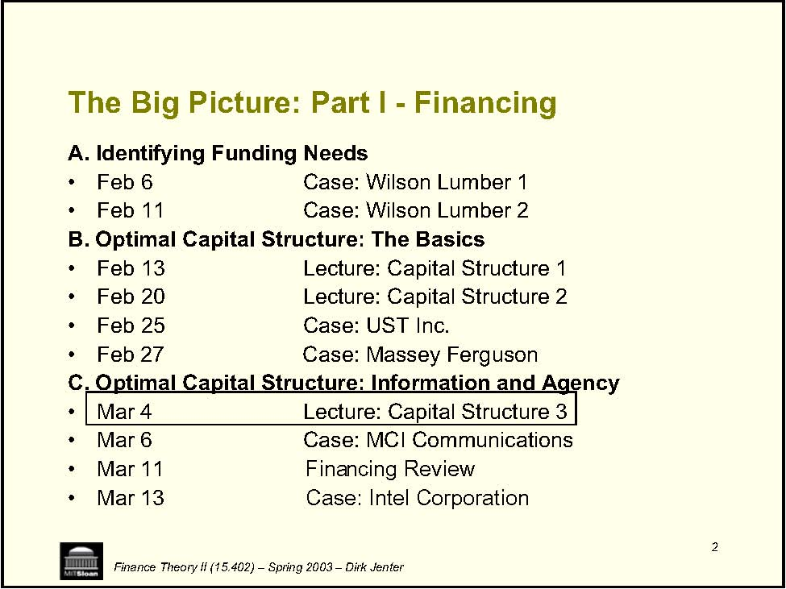

2 • • • • • • • • Financing Review Case: Intel Corporation Finance Theory II (15.402) – Spring 2003 – Dirk Jenter The Big Picture: Part I -Financing A. Identifying Funding Needs Feb 6 Case: Wilson Lumber 1 Feb 11 Case: Wilson Lumber 2 B. Optimal Capital Structure: The Basics Feb 13 Lecture: Capital Structure 1 Feb 20 Lecture: Capital Structure 2 Feb 25 Case: UST Inc. Feb 27 Case: Massey Ferguson C. Optimal Capital Structure: Information and Agency Mar 4 Lecture: Capital Structure 3 Mar 6 Case: MCI Communications •Mar 11•Mar 13

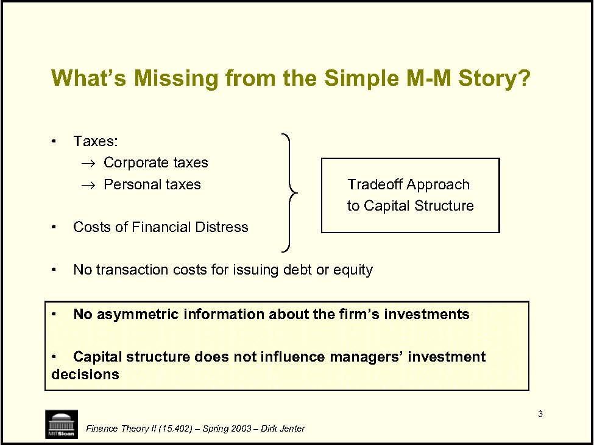

3 What’s Missing from the Simple M-M Story? • →Corporate taxes →Personal taxes to Capital Structure • • • • decisions Finance Theory II (15.402) – Spring 2003 – Dirk Jenter Taxes: Tradeoff Approach Costs of Financial Distress No transaction costs for issuing debt or equity No asymmetric information about the firm’s investments Capital structure does not influence managers’ investment 

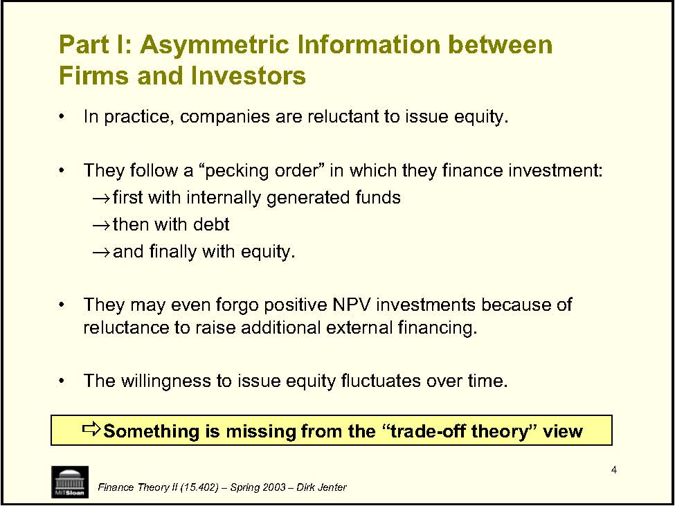

4 Firms and Investors • • →→then with debt →and finally with equity. • • DFinance Theory II (15.402) – Spring 2003 – Dirk Jenter Part I: Asymmetric Information between In practice, companies are reluctant to issue equity. They follow a “pecking order” in which they finance investment: first with internally generated funds They may even forgo positive NPV investments because of reluctance to raise additional external financing. The willingness to issue equity fluctuates over time. Something is missing from the “trade-off theory” view 

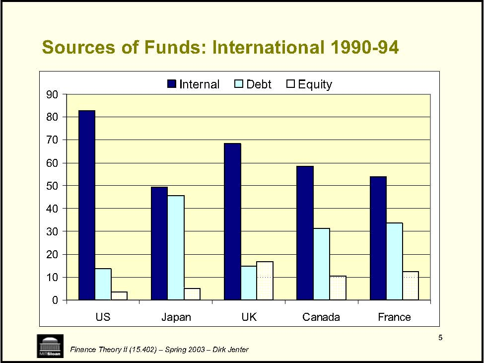

5 Sources of Funds: International 1990-94 0 10 20 30 40 50 60 70 80 90 Finance Theory II (15.402) – Spring 2003 – Dirk Jenter US Japan UK Canada France Internal Debt Equity 

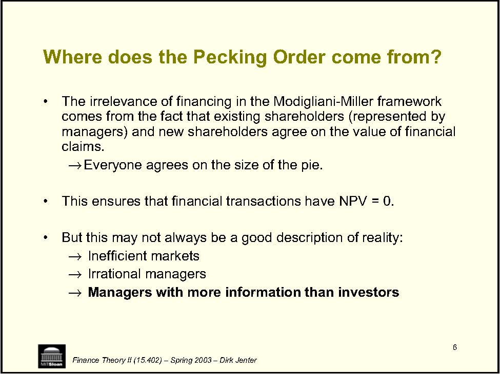

6 Where does the Pecking Order come from? • claims. →• • →→Irrational managers →Finance Theory II (15.402) – Spring 2003 – Dirk Jenter The irrelevance of financing in the Modigliani-Miller framework comes from the fact that existing shareholders (represented by managers) and new shareholders agree on the value of financial Everyone agrees on the size of the pie. This ensures that financial transactions have NPV = 0. But this may not always be a good description of reality: Inefficient markets Managers with more information than investors 

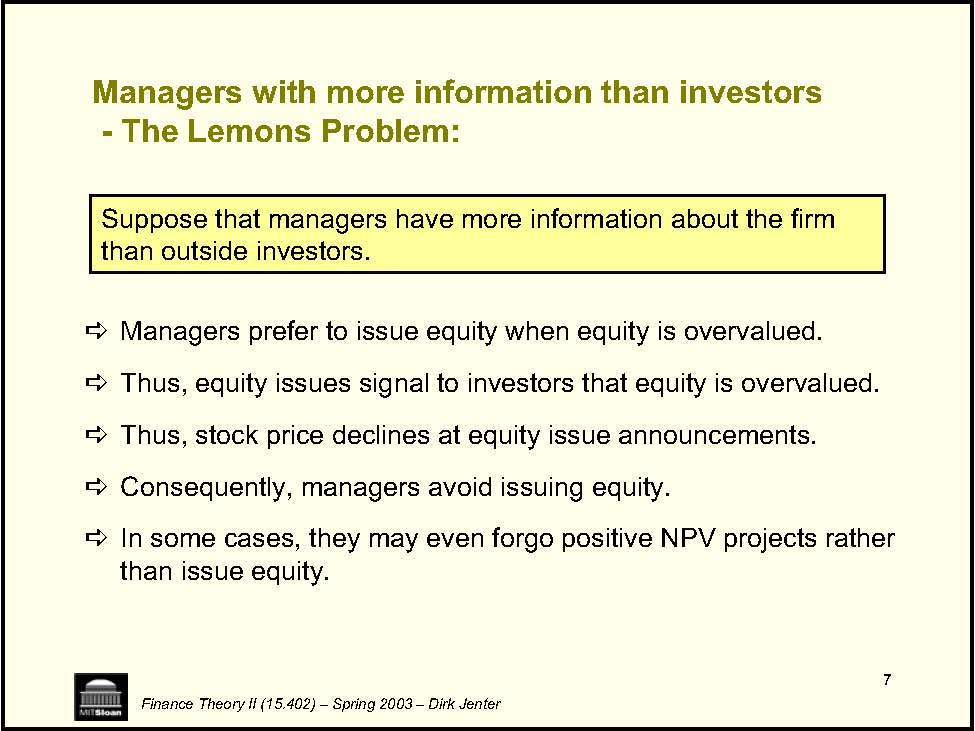

7 D D D D D than issue equity. Finance Theory II (15.402) – Spring 2003 – Dirk Jenter Managers prefer to issue equity when equity is overvalued. Thus, equity issues signal to investors that equity is overvalued. Thus, stock price declines at equity issue announcements. Consequently, managers avoid issuing equity. In some cases, they may even forgo positive NPV projects rather Managers with more information than investors -The Lemons Problem: Suppose that managers have more information about the firm than outside investors. 

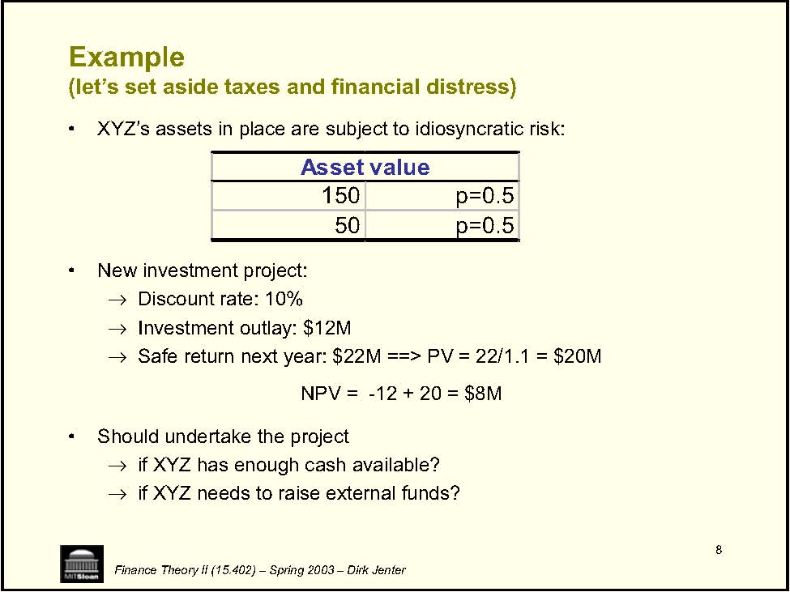

8 • • →Discount rate: 10% →→NPV = -12 + 20 = $8M • →→150 50 Finance Theory II (15.402) – Spring 2003 – Dirk Jenter Example (let’s set aside taxes and financial distress) XYZ’s assets in place are subject to idiosyncratic risk: New investment project: Investment outlay: $12M Safe return next year: $22M ==&gt; PV = 22/1.1 = $20M Should undertake the project if XYZ has enough cash available? if XYZ needs to raise external funds? p=0.5 p=0.5 Asset value 

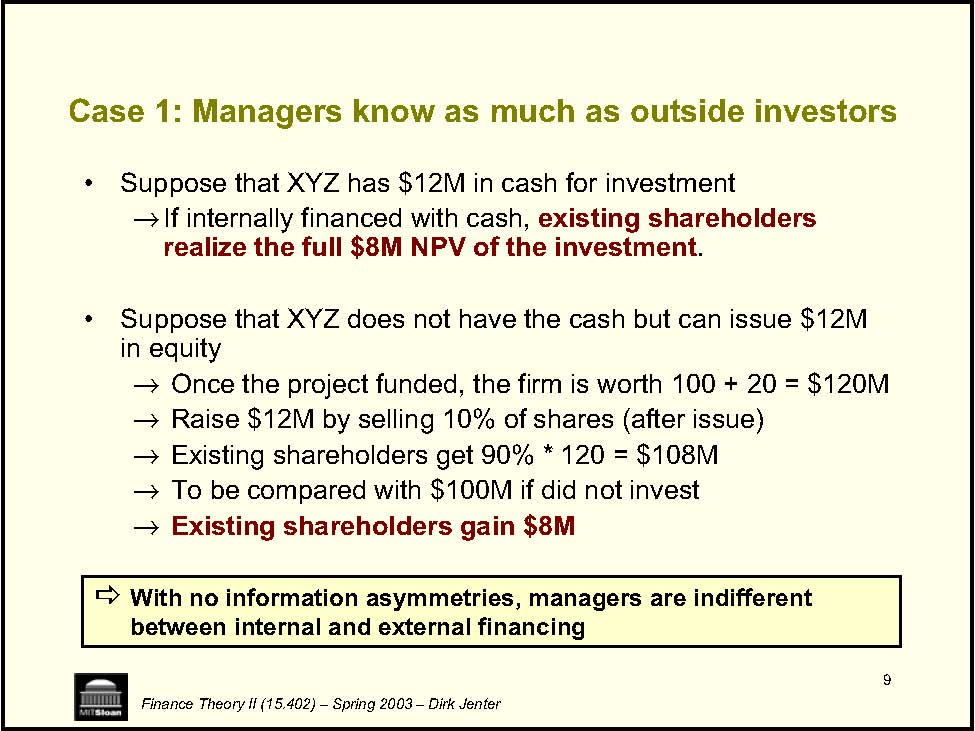

9 • →If internally financed with cash, . • in equity →→→→→D Finance Theory II (15.402) – Spring 2003 – Dirk Jenter Case 1: Managers know as much as outside investors Suppose that XYZ has $12M in cash for investment existing shareholders realize the full $8M NPV of the investmentSuppose that XYZ does not have the cash but can issue $12M Once the project funded, the firm is worth 100 + 20 = $120M Raise $12M by selling 10% of shares (after issue) Existing shareholders get 90% * 120 = $108M To be compared with $100M if did not invest Existing shareholders gain $8M With no information asymmetries, managers are indifferent between internal and external financing 

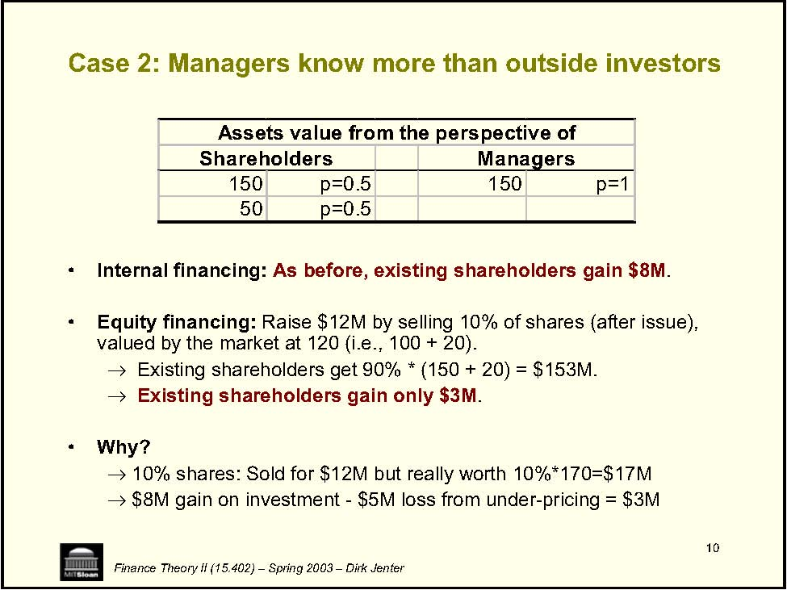

10 • . • →Existing shareholders get 90% * (150 + 20) = $153M. →. • →→Finance Theory II (15.402) – Spring 2003 – Dirk Jenter Case 2: Managers know more than outside investors Internal financing: As before, existing shareholders gain $8MEquity financing: Raise $12M by selling 10% of shares (after issue), valued by the market at 120 (i.e., 100 + 20). Existing shareholders gain only $3MWhy? 10% shares: Sold for $12M but really worth 10%*170=$17M $8M gain on investment -$5M loss from under-pricing = $3M 150 p=0.5 150 p=1 50 p=0.5 Shareholders Managers Assets value from the perspective of 

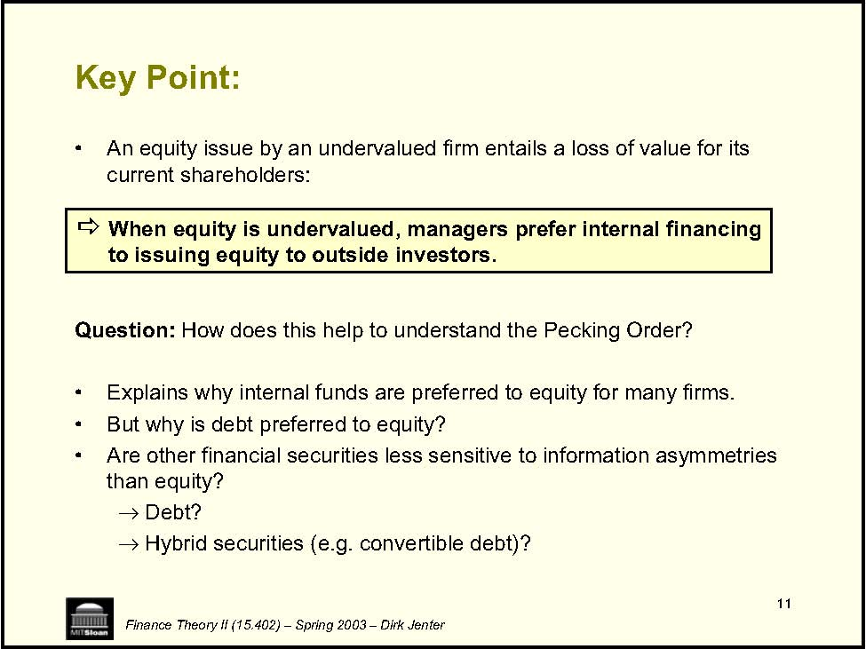

11 • current shareholders: Question: • • • →Debt? →D Finance Theory II (15.402) – Spring 2003 – Dirk Jenter Key Point: An equity issue by an undervalued firm entails a loss of value for its How does this help to understand the Pecking Order? Explains why internal funds are preferred to equity for many firms. But why is debt preferred to equity? Are other financial securities less sensitive to information asymmetries than equity? Hybrid securities (e.g. convertible debt)? When equity is undervalued, managers prefer internal financing to issuing equity to outside investors. 

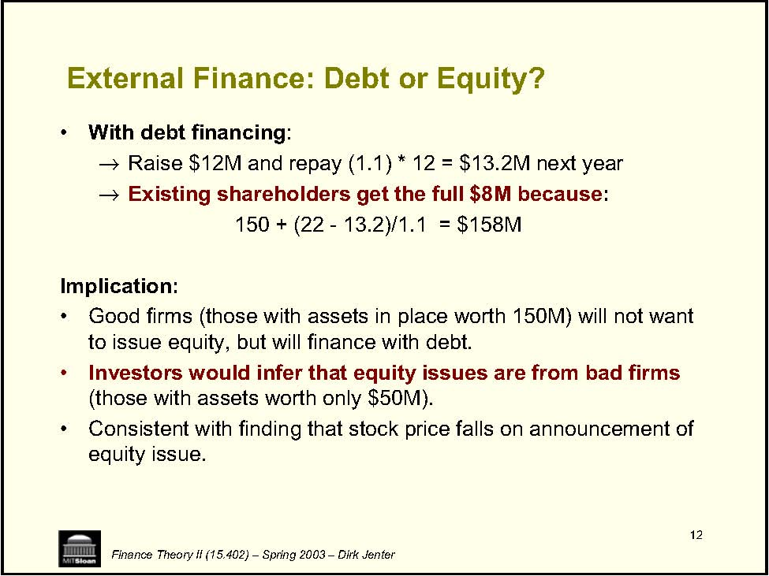

12 • : →→: Implication: • • • equity issue. Finance Theory II (15.402) – Spring 2003 – Dirk Jenter External Finance: Debt or Equity? With debt financingRaise $12M and repay (1.1) * 12 = $13.2M next year Existing shareholders get the full $8M because150 + (22 -13.2)/1.1 = $158M Good firms (those with assets in place worth 150M) will not want to issue equity, but will finance with debt.  Investors would infer that equity issues are from bad firms (those with assets worth only $50M). Consistent with finding that stock price falls on announcement of 

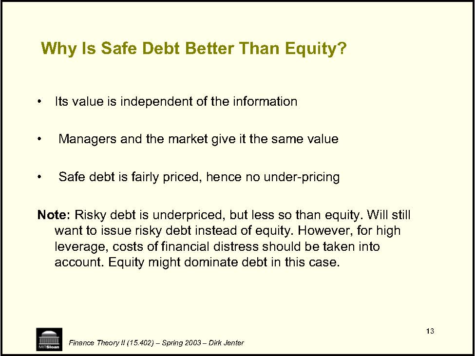

13 • • • Finance Theory II (15.402) – Spring 2003 – Dirk Jenter Why Is Safe Debt Better Than Equity? Its value is independent of the information Managers and the market give it the same value Safe debt is fairly priced, hence no under-pricing Note: Risky debt is underpriced, but less so than equity. Will still want to issue risky debt instead of equity. However, for high leverage, costs of financial distress should be taken into account. Equity might dominate debt in this case. 

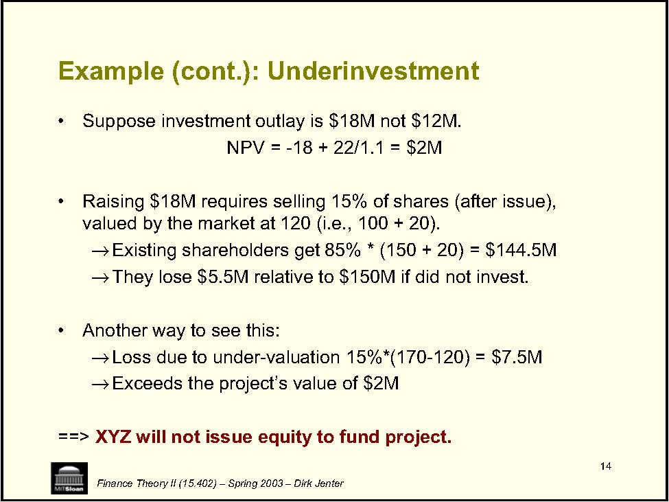

14 Example (cont.): Underinvestment • • →→• →→==&gt; Finance Theory II (15.402) – Spring 2003 – Dirk Jenter Suppose investment outlay is $18M not $12M. NPV = -18 + 22/1.1 = $2M Raising $18M requires selling 15% of shares (after issue), valued by the market at 120 (i.e., 100 + 20). Existing shareholders get 85% * (150 + 20) = $144.5M They lose $5.5M relative to $150M if did not invest. Another way to see this: Loss due to under-valuation 15%*(170-120) = $7.5M Exceeds the project’s value of $2M XYZ will not issue equity to fund project. 

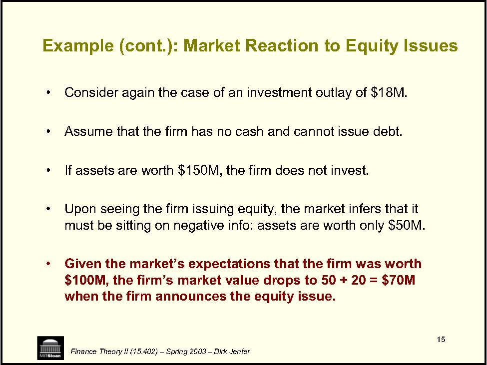

15 • • • • • Finance Theory II (15.402) – Spring 2003 – Dirk Jenter Example (cont.): Market Reaction to Equity Issues Consider again the case of an investment outlay of $18M. Assume that the firm has no cash and cannot issue debt. If assets are worth $150M, the firm does not invest. Upon seeing the firm issuing equity, the market infers that it must be sitting on negative info: assets are worth only $50M. Given the market’s expectations that the firm was worth $100M, the firm’s market value drops to 50 + 20 = $70M when the firm announces the equity issue. 

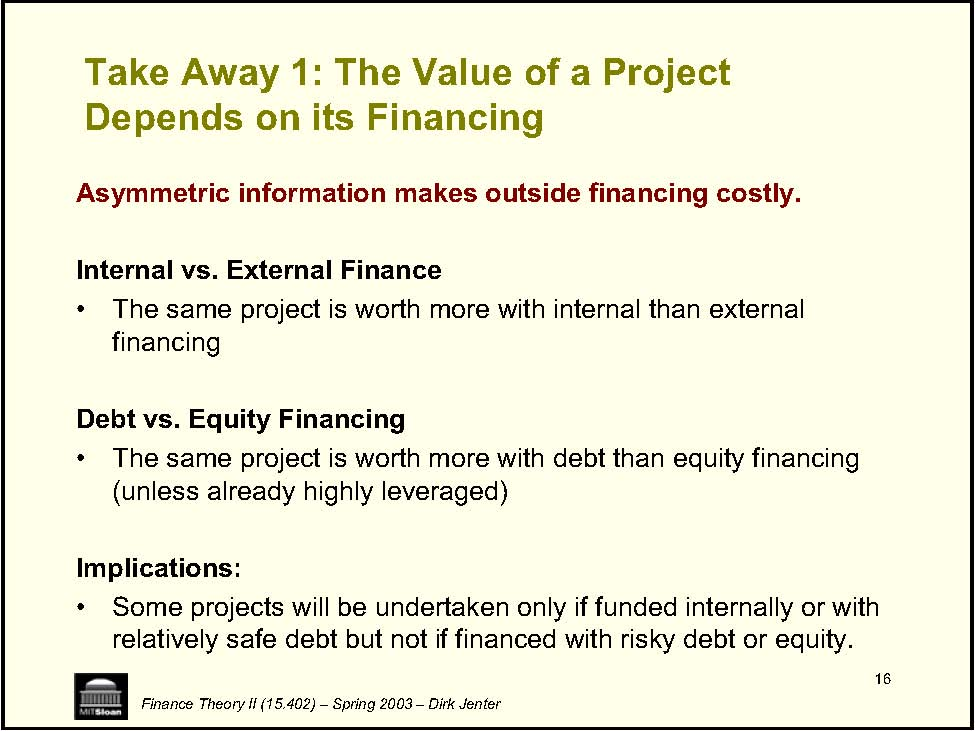

16 • financing • (unless already highly leveraged) Implications: • Finance Theory II (15.402) – Spring 2003 – Dirk Jenter Take Away 1: The Value of a Project Depends on its Financing Asymmetric information makes outside financing costly. Internal vs. External Finance The same project is worth more with internal than external Debt vs. Equity Financing The same project is worth more with debt than equity financing Some projects will be undertaken only if funded internally or with relatively safe debt but not if financed with risky debt or equity. 

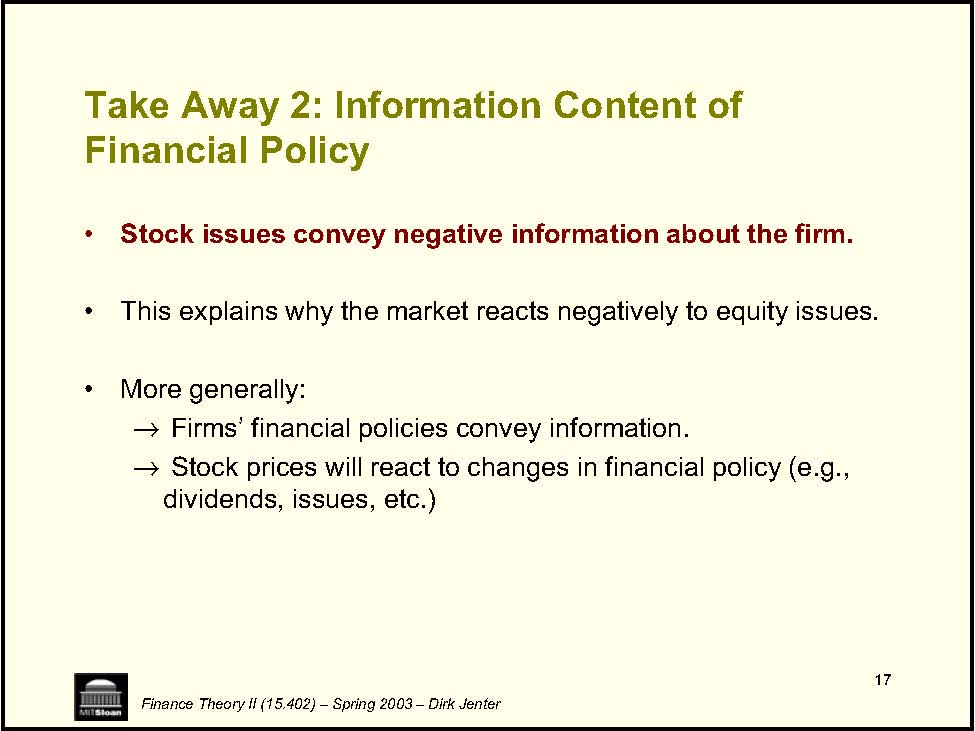

17 Financial Policy • • • →→Finance Theory II (15.402) – Spring 2003 – Dirk Jenter Take Away 2: Information Content of Stock issues convey negative information about the firm. This explains why the market reacts negatively to equity issues. More generally: Firms’ financial policies convey information. Stock prices will react to changes in financial policy (e.g., dividends, issues, etc.) 

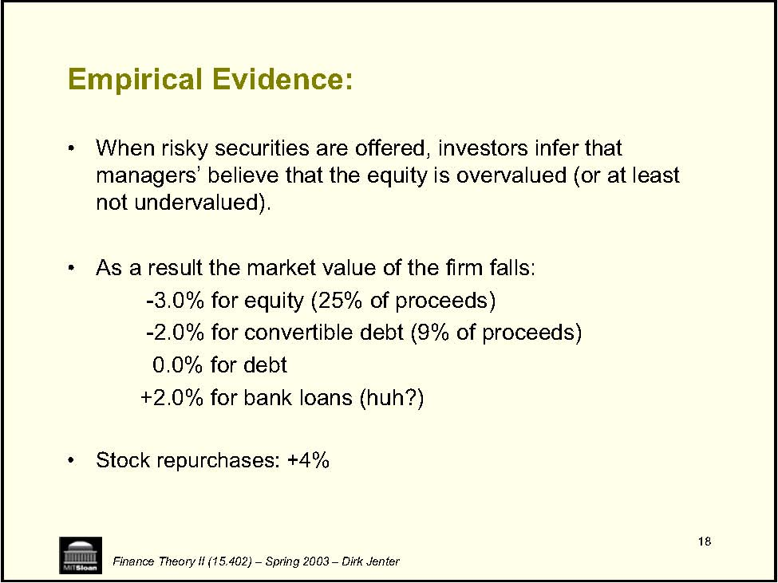

18 Empirical Evidence: • not undervalued). • • Finance Theory II (15.402) – Spring 2003 – Dirk Jenter When risky securities are offered, investors infer that managers’ believe that the equity is overvalued (or at least As a result the market value of the firm falls: -3.0% for equity (25% of proceeds) -2.0% for convertible debt (9% of proceeds) 0.0% for debt +2.0% for bank loans (huh?) Stock repurchases: +4% 

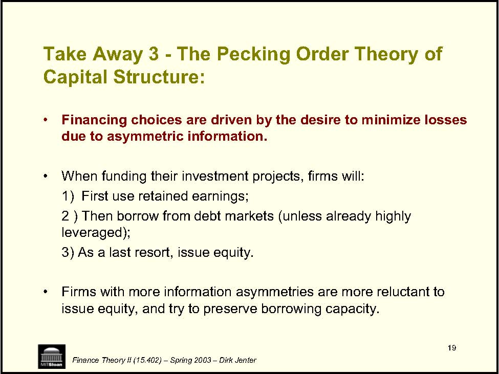

19 Capital Structure: • • 1) • Finance Theory II (15.402) – Spring 2003 – Dirk Jenter Take Away 3 -The Pecking Order Theory of Financing choices are driven by the desire to minimize losses due to asymmetric information. When funding their investment projects, firms will: First use retained earnings; 2 ) Then borrow from debt markets (unless already highly leveraged); 3) As a last resort, issue equity. Firms with more information asymmetries are more reluctant to issue equity, and try to preserve borrowing capacity. 

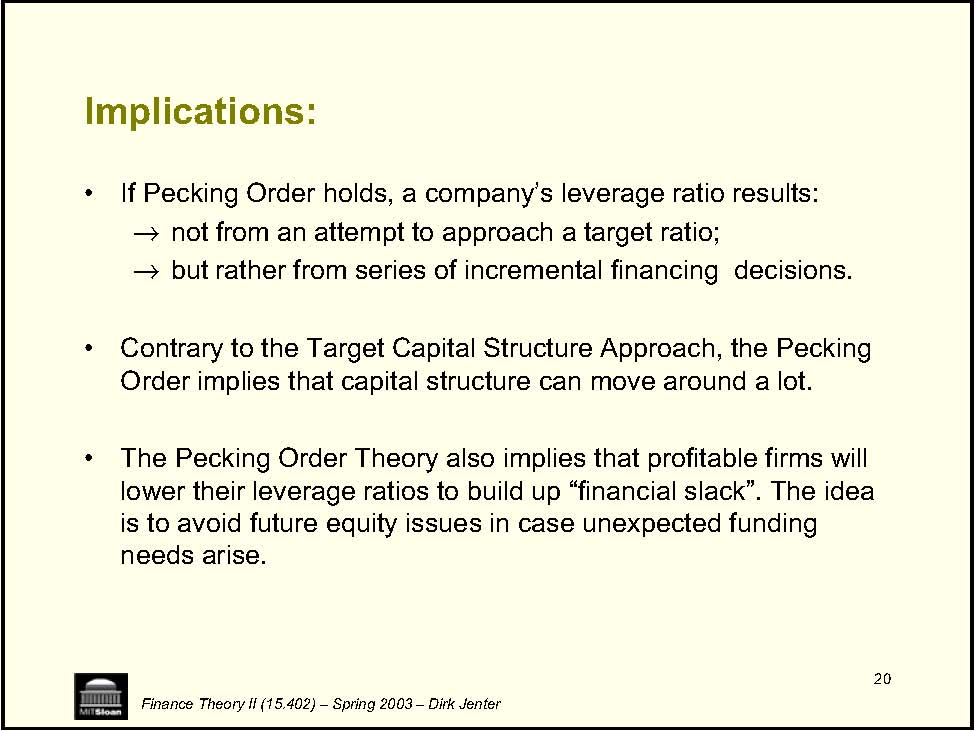

20 Implications: • →→• • Finance Theory II (15.402) – Spring 2003 – Dirk Jenter If Pecking Order holds, a company’s leverage ratio results: not from an attempt to approach a target ratio; but rather from series of incremental financing  decisions. Contrary to the Target Capital Structure Approach, the Pecking Order implies that capital structure can move around a lot. The Pecking Order Theory also implies that profitable firms will lower their leverage ratios to build up “financial slack”. The idea is to avoid future equity issues in case unexpected funding needs arise. 

         Acrobat Distiller 6.0 (Windows)

         Sloan School of Managemt, MIT

         Sloan School of Managemt, MIT

         Acrobat PDFMaker 6.0 for PowerPoint

         2004-01-22T11:43:00+05:30

         2004-01-22T11:41:23+05:30

         2004-01-22T11:43:00+05:30

         uuid:e806e2fe-d582-40c8-add0-83baa069e665

         uuid:3561a461-4050-4207-bfed-72e21f910c3d

         xml

               Capital Structure: Informational and Dynamic Considerations

               Denis Gromb

Capital Structure, cont.

Katharina Lewellen

Finance Theory II

March 5, 2003

Target Capital Structure Approach

1.Start with M-M Irrelevance

2.Add two ingredients that change the size of the pie.

- Taxes

- Expected Distress Costs

3.Trading off the two gives you the “static optimum” capital structure. (“Static” because this view suggests that a company should keep its debt relatively stable over time.)

Target Capital Structure Approach, cont.

VULeverageFirm valueVLwith tax shields, but no distressVLwith tax shields and distressVLaccording to MMOptimal capital structure

Implications of the “target leverage” approach

- Firms should:

- Issue equity when leverage rises above the target level

- Buy back stock (or pay dividends) when leverage falls below the target capital structure

- Stock market should:

- React positively (or neutrally) to announcements  of securities issues

What really happens?

- Stock prices drop (on average) at the announcements of equity issues

- Companies are reluctant to issue equity

- They follow a “pecking order” in which they finance investment:

- first with internally generated funds

- then with debt

- and finally with equity

- Willingness to issue equity fluctuates over time

Something is missing from the “target-leverage” view

Stock price reaction to equity issue announcements

Average cumulative excess returns from 10 days before to 10 daysafter announcement for 531 common stock offerings (Asquith and Mullins (1986))

-3.5-3-2.5-2-1.5-1-0.500.5-10-8-6-4-20246810Day after announcementCumulative Excess Return (%)

Sources of Funds: US Corporations 1979-97

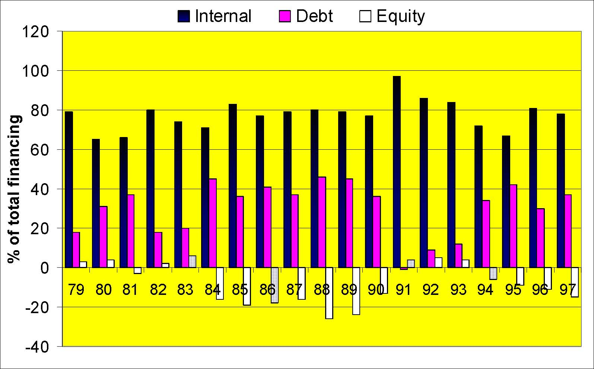

-40-2002040608010012079808182838485868788899091929394959697% of total financingInternalDebtEquity

Sources of Funds: International 1990-94

-40-2002040608010012079808182838485868788899091929394959697% of total financingInternalDebtEquity0102030405060708090USJapanUKCanadaFranceInternalDebtEquity

Seasoned Equity Offerings (SEOs) 1970-96

0204060801007001730176017901820185018801910194019701Date (YearMonth)Number of SEOs

Initial Public Offerings (IPOs) 1960-99

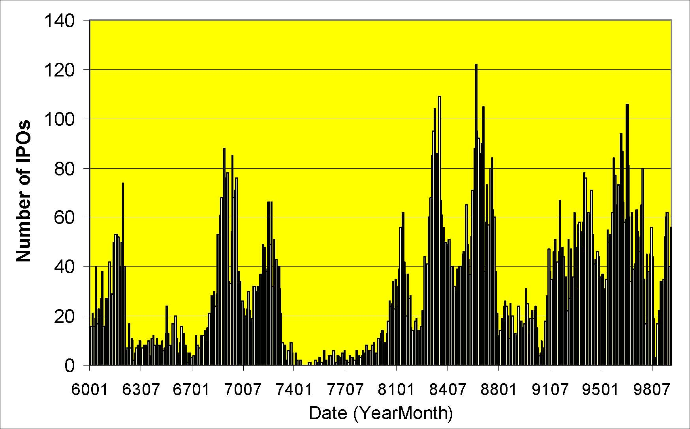

020406080100120140600163076701700774017707810184078801910795019807Date (YearMonth)Number of IPOs

Incorporating These Concerns

- The irrelevance of financing comes from the fact that existing shareholders (represented by managers) and new shareholders agree on the value of financial claims.

- Everybody agrees on the size of the “pie”

- This ensures that financial transactions have NPV = 0.

- Departing from this framework:

- Inefficient markets

- Irrational managers

- Managers with more information than investors

- Managers prefer to issue equity when equity is overvalued

- Thus, equity issues signal to investors that equity is overvalued

- Thus, stock price declines at equity issues announcements

- Consequently, managers avoid issuing equity

- In some cases, they may even forgo positive NPV projects rather than issue equity

Managers with more information than investors-The Lemons Problem

Suppose that managers have more information about the firm than outside investors. 

Equity financing: Example

Let’s set aside taxes and financial distress

- XYZ’s assets in place are subject to idiosyncratic risk:

- New investment project:

- Discount rate: 10%

- Investment outlay: $12M

- Safe return next year: $22M ==&gt; PV = 22/1.1 = $20M

NPV =  -12 + 20 = $8M

- Should XYZ undertake the project?

150p=0.550p=0.5Assets value

Case 1: Managers know as much as outside investors

- Suppose that XYZ has $12M in cash for investment

- If internally financed with cash, existing shareholders realize the full $8M NPV of the investment.

- Suppose that XYZ does not have the cash but can issue $12M in equity

- Once the project funded, the firm is worth 100 + 20 = $120M

- Raise $12M by selling 10% of shares (after issue)

- Existing shareholders get 90% * 120 = $108M

- To be compared with $100M if did not invest

- Existing shareholders gain $8M

With no information asymmetries, managers are indifferent between internal and external financing

Case 2: Managers know more than outside investors

- Internal financing

- As before, existing shareholders gain $8M

- Equity financing

- Raise $12M by selling 10% of shares (after issue), valued by themarket at 120 (i.e., 100 + 20).

- Existing shareholders get 90% * (150 + 20) = $153M.

- Existing shareholders gain only $3M

When equity is undervalued, managers prefer to finance internally than to issue equity

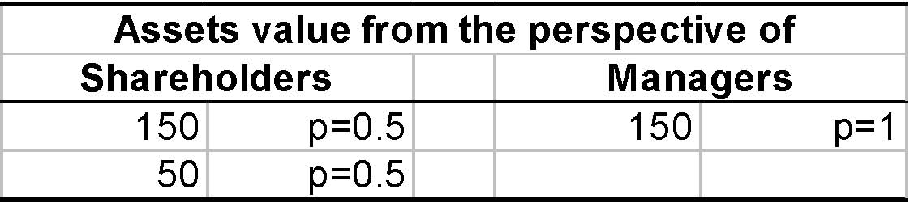

150p=0.5150p=150p=0.5ShareholdersManagersAssets value from the perspective of

Case 2 (cont.): How about debt financing?

- With debt financing:

- Raise $12M and repay (1.1) * 12 = $13.2M next year

- Existing shareholders get the full $8M because:

150 + (22 -13.2)/1.1  = $158M

When equity is undervalued, managers prefer to finance with debt than equity

Why Is Safe Debt Better Than Equity?

- Its value is independent of the information

- Managers and the market give it the same value

- Safe debt is fairly priced no lemon’s problem

- Risky debt is somewhere “between” safe debt and equity

- There is some lemon’s problem associated with risky debt but it is less severe than with equity

Lemon’s problem: Implications

- If your assets are worth $150M, you will not want to issue equity, but will finance internally or with debt

- If you choose to issue equity, investors will know that your assets must be worth only $50M

- Consequently, stock price will fall when you announce an equity issue

- By how much?

Example (cont.): Market Reaction

- Recall market’s expectations

- Assets are $150 (prob. = ½) or $50 (prob. = ½)

- So currently, assets are valued at $100

- Upon seeing an equity issue, the market infers that the firm is sitting on negative info:

- assets are worth only $50M

- The firm’s market value drops to 50 + 20 = $70 when equity issue is announced and new equity is issued

Evidence on equity issue announcements

Average cumulative excess returns from 10 days before to 10 daysafter announcement for 531 common stock offerings (Asquith and Mullins (1986))

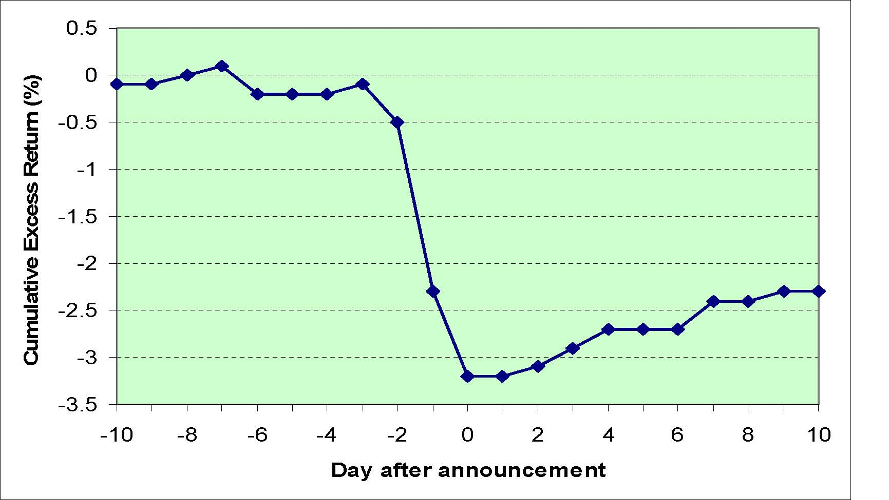

-3.5-3-2.5-2-1.5-1-0.500.5-10-8-6-4-20246810Day after announcementCumulative Excess Return (%)

Evidence on announcement effects

- Stock price reaction to issues:

- Straight Debt:Little or no effect

- Convertible Debt:-2%  (9% of proceeds)

- Equity:-3%  (25% of proceeds)

- Stock repurchases:  +13%

Example (cont.): Underinvestment

- Suppose investment outlay is $18M not $12M.

NPV = -18 + 22/1.1 = $2M

- Raising $18M requires selling 15% of shares

- Existing shareholders get 85% * (150 + 20) = $144.5M

- They lose $5.5M relative to $150M if did not invest.

- XYZ will not issue equity to fund project.

Key Point: Investment Depends on Financing

- Some projects will be undertaken only if funded internally or with relatively safe debt

- Information asymmetries can lead companies to forgo good project

- Companies with less cash and more leverage will be more prone to this underinvestment problem

- Issuing safe debt is more difficult at high leverage

- Also, issuing too much debt may lead to financial distress

Pecking Order and Capital Structure

- Basic Pecking Order:

- Firms will use cash when available

- Otherwise use debt

- High cash-flow ==&gt; No need to raise debt==&gt;In fact, can repay some debt

==&gt;Leverage ratio decreases

- Low cash-flow ==&gt; Need to raise debt==&gt;Reluctance to raise equity

==&gt;Leverage ratio increases

Key Point

- If Pecking Order holds, a company’s leverage ratio results:

- not from an attempt to approach a target ratio;

- but rather from series of incremental financing  decisions.

- Contrary to the Target Capital Structure Approach, the Pecking Order implies that capital structure can move around a lot.

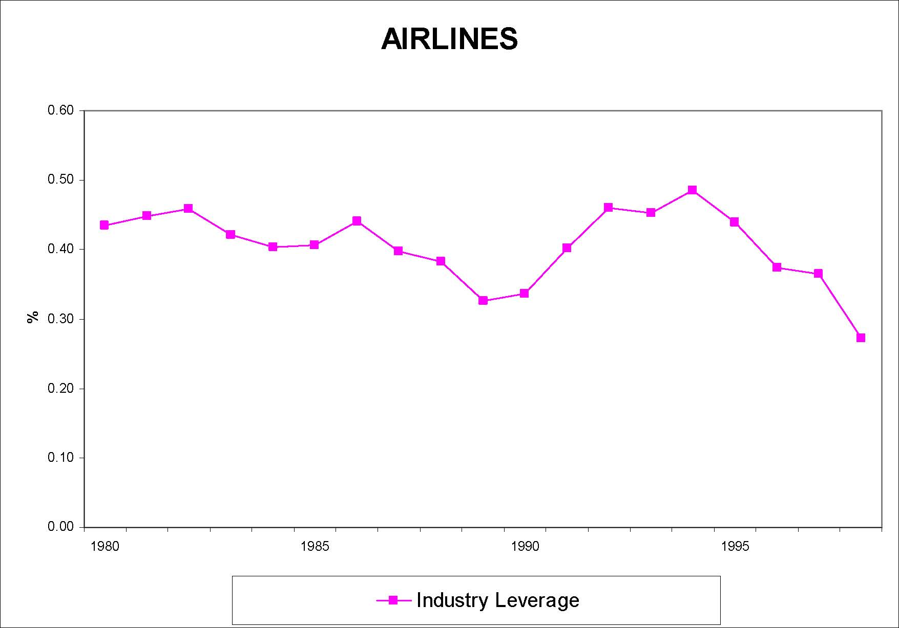

AIRLINES0.000.100.200.300.400.500.601980198519901995%Industry Leverage

AIRLINES0.000.100.200.300.400.500.601980198519901995%Industry LeverageIndustry ROA

Target Capital Structure Approach, cont.

VULeverageFirm valueVLwith tax shields, but no distressVLwith tax shields and distressVLaccording to MMOptimal capital structure

Key Point: Timing of Equity Issues

- There may be ''good'' and ''bad'' times to issue stock.

- Best not to issue when lots of information asymmetry --i.e., should issue when price impact of issue is lowest.

Initial Public Offerings (IPOs) 1960-99

020406080100120140600163076701700774017707810184078801910795019807Date (YearMonth)

Evidence on timing of equity issues

- Firms tend to issue more equity in booms and less in busts

- NPV of investment opportunities are higher, so firms are willingto incur the costs of issuing equity

- In fact, when lots of firms are issuing, the stock price impact of an equity issue is low

- Caveat:Is this because information problems are lower or because stock markets are inefficient --i.e., systematically mispriceequity?

Managerial Behavior and Capital Structure

- So far, we assumed that managers act in the interest of shareholders. 

- But is it always true?

- Conflicts of interests between managers and shareholders are called agency problems

Agency Problems

- Agents do not always do their job =&gt; costs to principals

- These cost are called “Agency Costs”

- They are reflected in a lower share price

- Potential problems:

- Shirking

- Empire Building

- Perks (private jets)

- Risk avoidance

Principals = Shareholders

Agents = Managers

Avoiding Agency Costs

- Compensation policy

- Monitoring managers’ actions

- Independent directors on the Board

- Banks as lenders

- Large block holders

- Market for Corporate Control (i.e. takeovers)

- Can leverage help to avoid agency costs?

A Classic Agency Problem: The Free Cash Flow Problem

- Free Cash Flow (FCF)

- Cash flow in excess of that needed to fund all positive NPV projects

- Managers may be reluctant to pay out FCF to shareholders

- Empire building through unprofitable acquisitions

- Pet projects, prestige investments, perks

- This problem is more severe for “cash cows”

- Firms with lots of cash (i.e., profitable firms)

- And few good investment opportunities

Example of FCF Problems

Evidence from the Oil Industry (Jensen, 1986)

- From 1973 to 1979: tenfold increase in crude oil prices

- Oil industry expanded

- Oil consumption fell

- The oil industry at the end of 1970s

- Lots of excess capacity

- Lots of cash (because of high prices)

- What did managers do?

Example of FCF Problems (cont.)

What did managers do?

- They did not pay out cash to shareholders

- Continued spending on exploration and development (E&amp;D)

- Stock prices reacted negatively to the announcements of increases in E&amp;D by oil companies during 1975 –81

- Invested outside of industry

- Mobile purchased Marcor(retail)

- Exxon purchased Reliance Electric (manufacturing) and Vydec(office equipment)

- These acquisitions turned out to be least successful of the decade

Can leverage reduce FCF problem?

- Debt = commitment to distribute cash flows in the future

- If managers cannot keep the promise to pay interest (principal),bondholders can shut down the firm

- Thus, debt reduces FCF available to managers

- Less opportunities for managers to waist cash

- How about commitment to pay dividends?

- Dividends also reduce FCF

- But a commitment to pay dividends cannot be enforced

Leveraged Buyouts (LBOs)

- LBO is a going-private transaction

- Typically, incumbent management acquires all publicly-traded shares

- LBOsare often financed with debt (D/E ratios of 10 are not uncommon)

- Kaplan (1989 JFE) finds in a sample of 76 LBOs:

- Debt / Value went from 18.8% to 87.8%

- 42% premium paid to shareholders to go private

- In three years after the buyout

- Operating Income / TA  increased by 15%

- Operating Income / Sales increased by 19%

- Net cash flow increased and capital expenditures decreased

- Do LBOsimprove efficiency through the control function of debt?

Capital Structure: An Extended Checklist

- Taxes

- Does the company benefit from debt tax shield?

- Information Problems

- Do outside investors understand the funding needs of the firm?

- Would an equity issue be perceived as bad news by the market?

- Agency Problems

- Does the firm have a free cash flow problem?

- Expected Distress Costs

- What is the probability of distress? (Cash flow volatility)

- What are the costs of distress? 

- Need funds for investment, competitive threat if pinched for cash,  customers care about distress, assets difficult to redeploy?

         Acrobat Distiller 5.0 (Windows)

         2003-03-13T21:53:25Z

         2004-01-21T10:24:55+05:30

         2004-01-21T10:24:55+05:30

         PScript5.dll Version 5.2

         uuid:ea5281b1-08d1-4e44-a11f-36b1f7b3a4bb

         uuid:8ab97561-4066-4668-913a-3458eb772f21

         xml

               djenter

               Microsoft PowerPoint - LN11(WrapUp)for Sloanspace.ppt

Finance Theory II (15.402) – Spring 2003 – Dirk Jenter Wrap-Up of the Financing Module 

2 • • • • • • • • • • Finance Theory II (15.402) – Spring 2003 – Dirk Jenter The Big Picture: Part I -Financing A. Identifying Funding Needs Feb 6 Case: Wilson Lumber 1 Feb 11 Case: Wilson Lumber 2 B. Optimal Capital Structure: The Basics Feb 13 Lecture: Capital Structure 1 Feb 20 Lecture: Capital Structure 2 Feb 25 Case: UST Inc. Feb 27 Case: Massey Ferguson C. Optimal Capital Structure: Information and Agency Mar 4 Lecture: Capital Structure 3 Mar 6 Case: MCI Communications Mar 11                       Financing ReviewMar 13                       Case: Intel Corporation

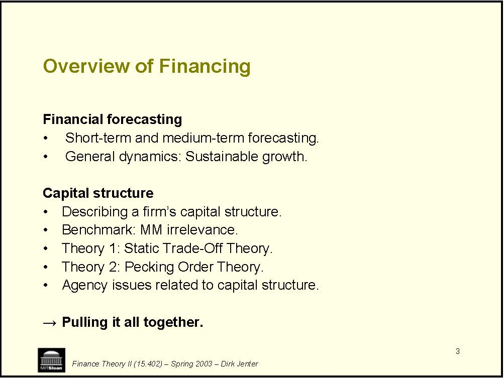

3 • • • i• • • • → Finance Theory II (15.402) – Spring 2003 – Dirk Jenter Overview of Financing Financial forecasting Short-term and medium-term forecasting. General dynamics: Sustainable growth. Capital structure Describing a frm’s capital structure. Benchmark: MM irrelevance. Theory 1: Static Trade-Off Theory. Theory 2: Pecking Order Theory. Agency issues related to capital structure. Pulling it all together. 

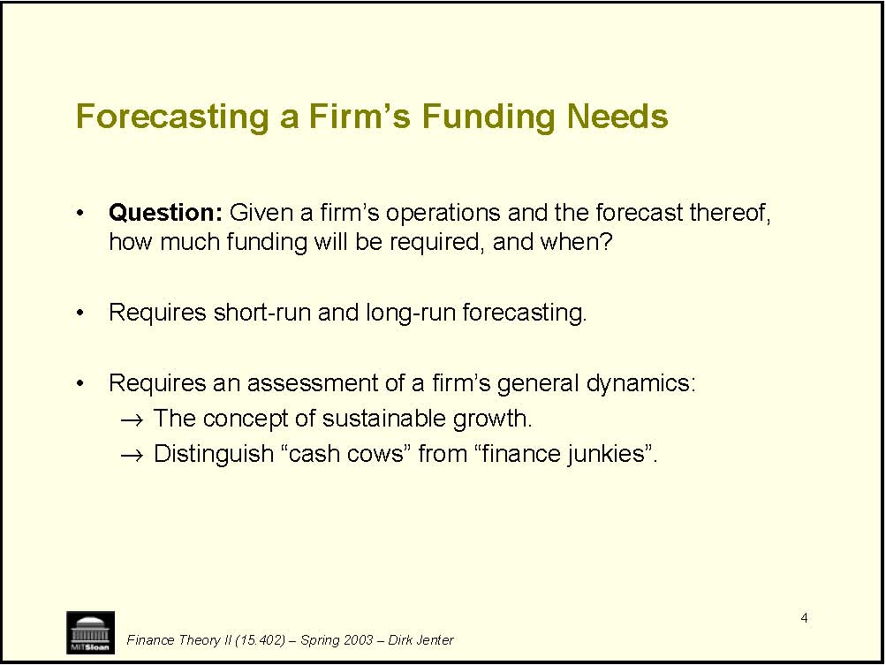

4 • • • →→Finance Theory II (15.402) – Spring 2003 – Dirk Jenter Forecasting a Firm’s Funding Needs Question: Given a firm’s operations and the forecast thereof, how much funding will be required, and when? Requires short-run and long-run forecasting. Requires an assessment of a firm’s general dynamics: The concept of sustainable growth. Distinguish “cash cows” from “finance junkies”. 

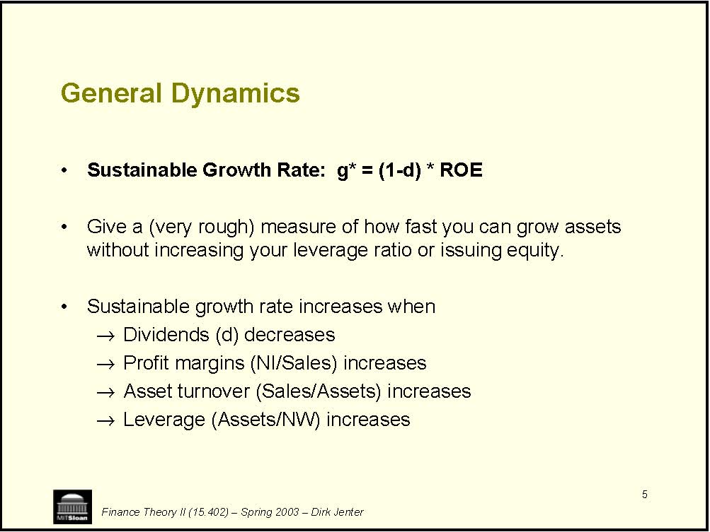

5 • • • →Dividends (d) →→/)→Finance Theory II (15.402) – Spring 2003 – Dirk Jenter General Dynamics Sustainable Growth Rate:  g* = (1-d) * ROE Give a (very rough) measure of how fast you can grow assets without increasing your leverage ratio or issuing equity. Sustainable growth rate increases when decreases Profit margins (NI/Sales) increases Asset turnover (SalesAssets increases Leverage (Assets/NW) increases 

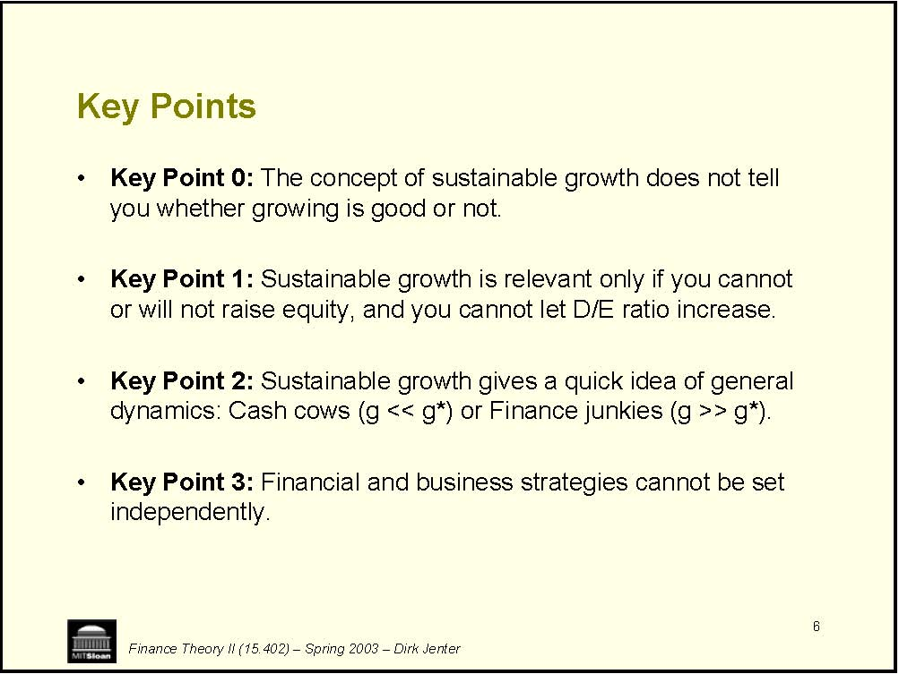

6 • • • ) • Finance Theory II (15.402) – Spring 2003 – Dirk Jenter Key Points Key Point 0: The concept of sustainable growth does not tell you whether growing is good or not. Key Point 1: Sustainable growth is relevant only if you cannot or will not raise equity, and you cannot let D/E ratio increase. Key Point 2: Sustainable growth gives a quick idea of general dynamics: Cash cows (g &lt;&lt; g*or Finance junkies (g &gt;&gt; g*). Key Point 3: Financial and business strategies cannot be set independently. 

7 • →• →• →• Finance Theory II (15.402) – Spring 2003 – Dirk Jenter Capital Structure: Theory and Practice Modigliani-Miller Theorem Capital structure choices are irrelevant. Theory 1: Static Trade-off Theory Tax shield vs. Expected distress costs Theory 2: Pecking Order Theory Costs of asymmetric information. Agency Issues related to capital structure. 

8 Modigliani-Miller Theorem • →• →→→Dividend policy →→Finance Theory II (15.402) – Spring 2003 – Dirk Jenter MM: In frictionless markets, financial policy is irrelevant. “Proof”: Financial transactions are NPV=0. QED Corollary: All the following are irrelevant: Capital structure Long-vs. short-term debt Risk management Etc. 

9 • →• →• Finance Theory II (15.402) – Spring 2003 – Dirk Jenter Using MM Sensibly: MM gives us a framework to understand why capital structure matters -&gt; Changing the size of the pie. When evaluating an argument in favor of a financial move: Ask yourself: Why is a financing argument wrong under MM? Avoid fallacies such as mechanical effects on accounting measures (e.g., WACC fallacy, EPS fallacy) Ask yourself, what frictions does the argument rely on? Taxes, Costs of financial distress, Information asymmetry, Agency problems. If none, dubious argument. If some, evaluate magnitude. 

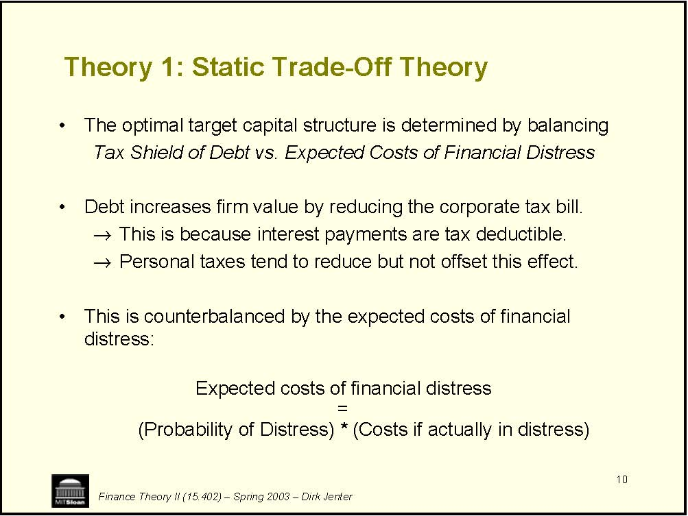

10 • • →→• distress: = Finance Theory II (15.402) – Spring 2003 – Dirk Jenter Theory 1: Static Trade-Off Theory The optimal target capital structure is determined by balancing Tax Shield of Debt vs. Expected Costs of Financial Distress Debt increases firm value by reducing the corporate tax bill. This is because interest payments are tax deductible. Personal taxes tend to reduce but not offset this effect. This is counterbalanced by the expected costs of financial Expected costs of financial distress (Probability of Distress) * (Costs if actually in distress) 

11 Checklist for Target Capital Structure Tax Shield: • • • • • • ). Finance Theory II (15.402) – Spring 2003 – Dirk Jenter Would the firm benefit from debt tax shield? Is it profitable? Does it have tax credits? Expected distress costs: Are cash flows volatile? Need for external funds for investment? Competitive threat if pinched for cash? Customers and suppliers care about distress? Are assets easy to re-deploy? Note: Hard to renegotiate debt structure increases distress costs  (Recall Massey’s complex debt structure

12 • • →→• →→→Finance Theory II (15.402) – Spring 2003 – Dirk Jenter Theory 2: Pecking Order The Pecking Order Theory states that firms make financing choices with the goal to minimize the losses from raising funds under asymmetric information. With information asymmetries between firms and markets: External finance is more costly than internal funds. Debt is less costly than equity (because less info-sensitive) . This implies that firms: Preferably use retained earnings, Then borrow from debt market, As a last resort, issue equity. 

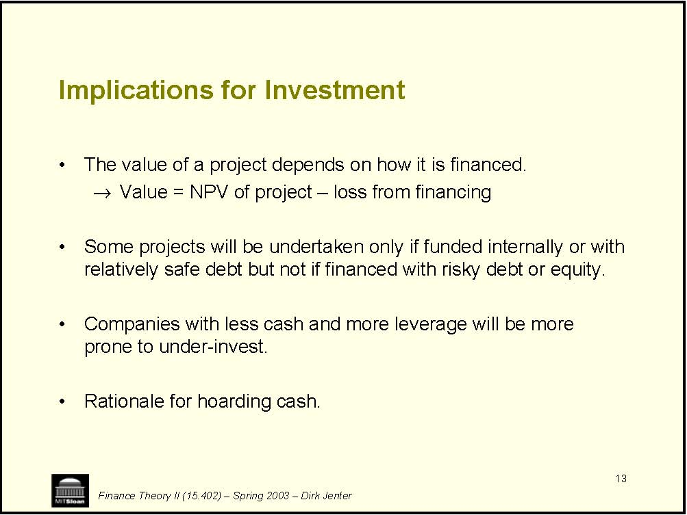

13 Implications for Investment • →l• • • Finance Theory II (15.402) – Spring 2003 – Dirk Jenter The value of a project depends on how it is financed. Value = NPV of project – oss from financing Some projects will be undertaken only if funded internally or with relatively safe debt but not if financed with risky debt or equity. Companies with less cash and more leverage will be more prone to under-invest. Rationale for hoarding cash. 

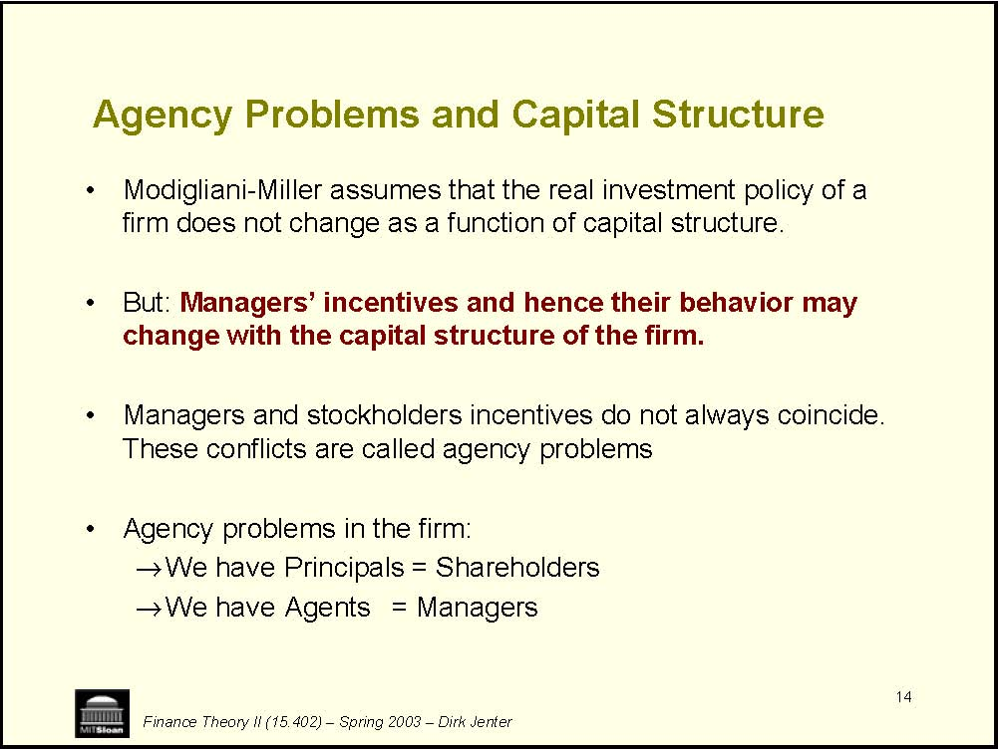

14 • • • • →→Finance Theory II (15.402) – Spring 2003 – Dirk Jenter Agency Problems and Capital Structure Modigliani-Miller assumes that the real investment policy of a firm does not change as a function of capital structure. But: Managers’ incentives and hence their behavior may change with the capital structure of the firm. Managers and stockholders incentives do not always coincide. These conflicts are called agency problems Agency problems in the firm: We have Principals = Shareholders We have Agents = Managers 

15 Principal-Agent Problems • →→Perks →Empire Building • • →→maxiFinance Theory II (15.402) – Spring 2003 – Dirk Jenter Conflicts between managers and investors: Potential problems include: Reduced Effort There are also conflicts between Bondholders and Shareholders Question: Can Leverage help to avoid agency costs? Can Leverage give managers incentives to make value-mizing decisions? 

16 Some classic principal-agent problem: • i⇒ • ⇒ perform and to make operations more efficient. Finance Theory II (15.402) – Spring 2003 – Dirk Jenter The Free Cash Flow Problem: Managers in frms with lots of free cash flow (cash cows) and bad investment opportunities may be reluctant to simply give the excess cash back to shareholders. Having debt puts free cash flows to use, and reduces managers ability to squander funds on pet projects and empire building. The Lazy Managers Problem: Managers in stable firms with lots of free cash flow and without much product market competition may become lazy and complacent. Raising leverage (a lot) puts pressure on managers to 

17 )• →→• →Firms have incentives to delay liquiiefficient. →• Claim Dilution →i• ): →Finance Theory II (15.402) – Spring 2003 – Dirk Jenter Can leverage create agency costs? (Excessive) Leverage can create agency conflicts between equity holders (managers and creditors (bond holders): Looting the firm in financial distress Firms have incentives to loot the company prior to bankruptcy Drexel paid $350M in bonuses three weeks before it filed Chapter 11 Delayed liquidation dation even if immediate liqudation is Liquidation usually only helps creditors, not shareholders or managers. Firms have incentives to surprise existing creditors by borrowng more. Risk shifting (asset substitutionManagers may decide to increase the risk of the firm after they have borrowed. All these costs are anticipated by creditors and hence raise the cost of borrowing. 

18 • →→→…. • →i. →Finance Theory II (15.402) – Spring 2003 – Dirk Jenter Take Away: Agency Problems and Capital Structure Leverage can help to overcome certain agency problems: The free cash flow problem. Complacent, lazy managers. Excessive leverage can create other agency problems: These tend to kick in in actual financial dstress, hence can be regarded as additional costs of distressClever usage of covenants can eliminate many of these problems. 

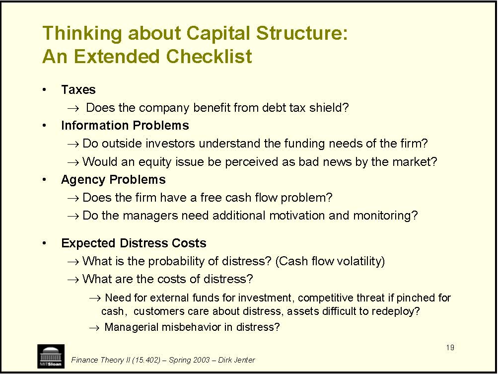

19 Thinking about Capital Structure: An Extended Checklist • →i• →→• →→i• →i) →→cash, →Finance Theory II (15.402) – Spring 2003 – Dirk Jenter Taxes Does the company benefit from debt tax sheld? Information Problems Do outside investors understand the funding needs of the firm? Would an equity issue be perceived as bad news by the market? Agency Problems Does the firm have a free cash flow problem? Do the managers need additional motivation and monitorng? Expected Distress Costs What is the probability of distress? (Cash flow volatiltyWhat are the costs of distress? Need for external funds for investment, competitive threat if pinched for customers care about distress, assets difficult to redeploy? Managerial misbehavior in distress? 

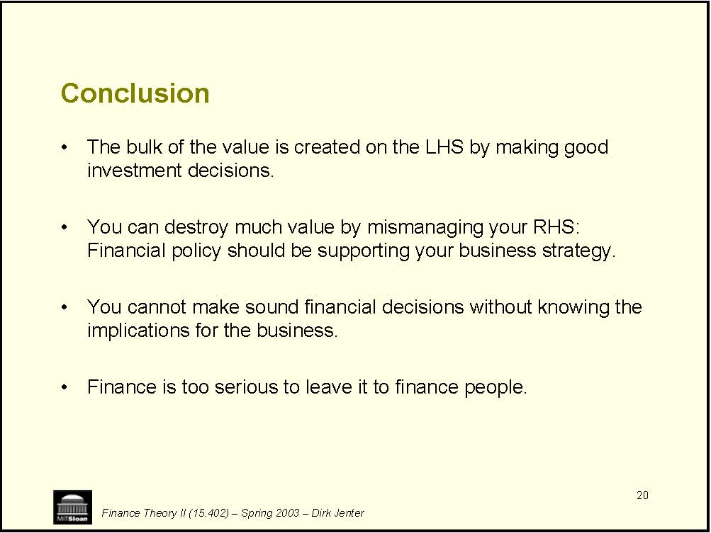

20 • • • i• Finance Theory II (15.402) – Spring 2003 – Dirk Jenter Conclusion The bulk of the value is created on the LHS by making good investment decisions. You can destroy much value by mismanaging your RHS: Financial policy should be supporting your business strategy. You cannot make sound fnancial decisions without knowing the implications for the business. Finance is too serious to leave it to finance people. 

         Acrobat Distiller 6.0 (Windows)

         Compaq

         Compaq

         2004-01-22T11:24:52+05:30

         Acrobat PDFMaker 6.0 for PowerPoint

         2004-01-22T11:22:50+05:30

         2004-01-22T11:24:52+05:30

         uuid:761853d5-e515-4f66-9e9f-7981147db565

         uuid:193b7ed7-ca89-4933-9bb2-f1354d70b098

         xml

               No Slide Title

               Leslie A. Larocca

Wrap-up of Financing

Katharina Lewellen

Finance Theory II

March 11, 2003

Overview of Financing

Financial forecasting

- Short-run forecasting

- General dynamics: Sustainable growth.

Capital structure

- Describing a firm’s capital structure

- Benchmark: MM irrelevance

- Theory 1: Static Trade-Off Theory

- Theory 2: Pecking Order Theory

- An integrated approach

Note:Throughout we take “operations” as given.

Forecasting a Firm’s Funding Needs

- Question:Given our operations (and the forecast thereof), will we need funding, and how much?

- Short-run forecasting 

- General dynamics:

- The concept of sustainable growth

- Cash Cows and Finance junkies

Financial Forecasting: General Approach

- Need (a model of) the firm’s production function

- Use available data

- Common sense

- Specific knowledge of firm and industry

- Given this model forecast all items in the balance sheet except “funding needs”

- Infer the funding need from identity of Assets and Liabilities + Net Worth

Forecasting: Our approach

- Forecast Assets

- Forecast non-bank liabilities, excluding Net Worth

- Forecast Net Income

- Assume some starting value for Bank Loan = “Bank Plug”

- Forecast interest using Bank Plug

- Forecast Net Worth

- Consistency check: Assets = Liabilities + Net Worth?

- If yes, stop

- If not, adjust Bank Plug

- Recall: All we want are rough approximations

General Dynamics

- Sustainable Growth Rate:  g* = (1-d) * ROE

- Gives a (very rough) measure of how fast you can grow Assets without increasing your leverage ratio or issuing equity

- Sustainable growth rate increases when

- Dividends (d) decreases

- Profit margins (NI/Sales) increases

- Asset turnover (Sales/Assets) increases

- Leverage (Assets/NW) increases

Key Points

- Key Point 0: The concept of sustainable growth does not tell you whether growing is good or not

- Key Point 1:Sustainable growth is relevant only if you cannot or will not raise equity, and you cannot let D/E ratio increase

- Key Point 2: Sustainable growth gives a quick idea of general dynamics: Cash cows (g &lt;&lt; g*) or Finance junkies (g &gt;&gt; g*)

- Key Point 3: Financial and business strategies cannot be set independently

Capital Structure

- Describing a firm’s capital structure

- MM theorem

- Theory 1: Static Trade-off Theory

- Tax shield vs. Expected distress costs

- Theory 2: Pecking Order Theory

- Implications for investment 

- Implications for capital structure

- Pulling it all together

MM Theorem

- MM: In frictionless markets, financial policy is irrelevant.

- Finance Theory 1: Financial transactions are NPV=0. QED

- Corollary: All the following are irrelevant:

- Capital structure

- Long-vs. short-term debt

- Dividend policy

- Risk management

- Etc.

Evaluate the following statements

- Issuing equity dilutes earnings-per-share and thus hurts current shareholders.

- Equity in a levered firm is riskier than equity in an unlevered(but otherwise identical) firm.

- Currently, interest rates are high, so it is better to issue equity than debt.

- Currently, short-term interest rates are lower than long-term interest rates, so it is better to issue long-term than short-term debt.

Using MM Sensibly

When evaluating an argument in favor of a financial move:

- Ask yourself: Why is financing argument wrong under MM?

- Avoid fallacies such as mechanical effects on accounting measures (e.g., WACC, EPS, Win-win)

- Ask yourself, what frictions does the argument rely on?

- Taxes, Costs of financial distress, Information asymmetry, Agency problems

- If none, dubious argument. If some, evaluate magnitude.

Financing Choices

vs.

Equity

Debt

Theory 1: Static Trade-Off Theory

- Talks about costs and benefits of Debt relative to Equity

- The optimal target capital structure is determined by balancing

Note:The theory does not give you a precise target but rather a range, an order of magnitude.

Tax Shield of Tax Shield of DebtDebt

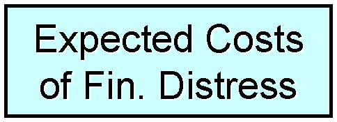

Expected Costs Expected Costs of Fin. Distressof Fin. Distress

Tax Shield of Debt

- Debt increases firm value by reducing corporate tax bill.

- This is because interest payments are tax deductible.

- Personal taxes tend to reduce but not offset this effect.

V(w/ debt) = V(all equity) + PV(tax shield)

- Order of magnitude for PV tax shield

- Constant debt level : t*D

- t = marginal tax rate depends on country, tax credits, etc.

Note:A move that increases firm value will increase equity value!

Expected Costs of Distress: Two Terms

Expected costs of financial distress

=

(Probability of Distress) * (Costs if actually in distress)

Probability of Distress

- Cashflowvolatility

- Is industry risky? Is firm’s strategy risky?

- Are there uncertainties induced by competition?

- Is there a risk of technological change?

- Sensitive to macroeconomic shocks, seasonal fluctuations?

- Etc.

- Use past data but also knowledge of industry.

- Beware of changes of environment.

Indirect costs of financial distress:

- Debt overhang: Inability to raise funds to undertake investments.

- Pass up valuable projects Do I need to invest?

- Rivals become aggressive Do I have aggressive rivals?

- Scare off customers and suppliers(e.g., implicit warranty or specific investment) Do other parties care?

- Asset fire salesAre assets easily re-deployable?

- Are my assets valuable to other firms? (e.g. R&amp;D)

- Who are potential buyers? How many? Will they be cash constrained when I want to sell my assets?

Checklist for Target Capital Structure

Tax Shield:

- Would the firm benefit from debt tax shield? Is it profitable? Does it have tax credits?

Expected distress costs:

- Are cashflowsvolatile?

- Need for external funds for investment?

- Competitive threat if pinched for cash?

- Customers and suppliers care about distress?

- Are assets easy to re-deploy?

- Note:Hard to renegotiate debt structure increases distress costs (Recall Massey’s complex debt structure).

Theory 2: Pecking Order

- Firms general financing choices:

- Preferably use retained earnings

- Then borrow from debt market

- As a last resort, issue equity

- Theory: Info. asymmetry between firm and market makes:

- External finance more costly than internal funds

- Debt less costly than equity (because less info-sensitive)

Implications for Investment

- The value of a project depends on how it is financed.

- Some projects will be undertaken only if funded internally or with relatively safe debt but not if financed with risky debt or equity.

- Companies with less cash and more leverage will be more prone to under-invest.

- Rationale for hoarding cash.

Implications for Capital Structure

- If a firm follows the Pecking Order, its leverage ratio results from a series of incremental decisions, not attempt to reach a target.

- High cash flow ==&gt; Leverage ratio decreases

- Low cash flow ==&gt; Leverage ratio increases

- There may be good and bad times to issue equity depending on the degree of information asymmetry.

- Rationale for hybrid instruments.

What Do We Do With Two Theories?

- Sometimes, both theories will give the same recommendation

- But sometimes, they will differ

- Consider Massey Ferguson:

- Static Trade-off theory ==&gt; Equity issue

- Pecking Order Theory ==&gt; Debt issue

- Two questions:

- Is one theory better at describing what firms do?

- Is one theory better at telling what they should be doing?

But As a Prescriptive Theory?

If firms use Pecking order blindly and ignore static trade-off:

- Cash cows will end up with too little leverage (UST).

- Good news: Never too late to lever-up

- Finance junkies will end up with too much leverage (Massey)

- Bad news: It can be too late to unlever(debt-overhang).

- ST debt is temporary relief but worsens things in fine.

DON'T TALK TO DEERE &amp; COMPANY ABOUT MARKET SIGNALING (from Higgins)

(Please see “Don’t Talk to Deere &amp; Company About Market Signaling” from the course 

textbook by Higgins.)

An Integrative Approach

- Each theory makes a statement about what is first order issue:

- STO: Tax shield and Distress costs

- PO: Information (Price of claims you issue)

- Both theories need not be incompatible:

- Use each when you think they emphasize the right issues

- When getting far away from target, STO type issues dominate

- When reasonably close to target, PO type issues dominate

An Integrative Approach (cont.)

- Establish long-run “target” capital structure

- Evaluate the true economic costs of issuing equity

- What is real cost of price hit vs. foregone investment or increase in expected cost of distress.

- If still reluctant to issue equity:

- Are there ways to reduce the cost? (e.g., give information)

- Will the cost be lower if you issue later?

- Can you use hybrids and packages to get there? But be careful. (Recall MCI might get stuck with too much debt)

An Integrative Approach (cont.)

- Straying from target may be warranted. But, be as systematic and precise as possible about justification --Are benefits from straying plausibly large relative to costs?

- Remember: Lion’s share of value is created on LHS. Don’t want to endanger operations. Beware excessive leverage. Ultimately, business strategy should drive financial strategy, not the otherway around.

- Avoid rules of thumb like: ''Never issue in a down market''; or ''Don't knock props out from under stock.'' These may make sense in some, but certainly not all circumstances.

Conclusion

- The bulk of the value is created on the LHS by making good investment decisions.

- You can destroy much value by mismanaging your RHS: Financial policy should be supporting your business strategy.

- You cannot make sound financial decisions without knowing the implications for the business.

- Finance is too serious to leave it to finance people.

Apex Drugs and Products

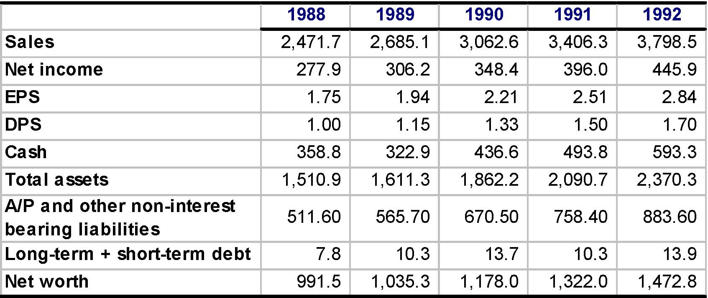

19881989199019911992Sales2,471.7   2,685.1   3,062.6   3,406.3   3,798.5   Net income277.9     306.2     348.4     396.0     445.9     EPS1.75       1.94       2.21       2.51       2.84       DPS1.00       1.15       1.33       1.50       1.70       Cash358.8     322.9     436.6     493.8     593.3     Total assets1,510.9   1,611.3   1,862.2   2,090.7   2,370.3   A/P and other non-interest bearing liabilities511.60    565.70    670.50    758.40    883.60    Long-term + short-term debt7.8         10.3       13.7       10.3       13.9       Net worth991.5     1,035.3   1,178.0   1,322.0   1,472.8   

Describe Apex’s capital structure.

What are the likely factors that led to this capital structure.

Different measures of leverage should give you a similar picture:

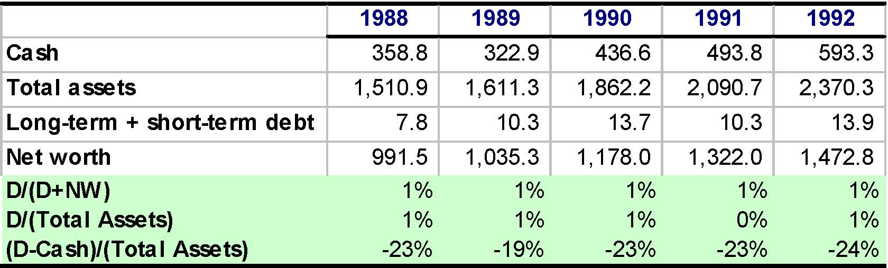

19881989199019911992Cash358.8     322.9     436.6     493.8     593.3     Total assets1,510.9   1,611.3   1,862.2   2,090.7   2,370.3   Long-term + short-term debt7.8         10.3       13.7       10.3       13.9       Net worth991.5     1,035.3   1,178.0   1,322.0   1,472.8   D/(D+NW)1%1%1%1%1%D/(Total Assets)1%1%1%0%1%(D-Cash)/(Total Assets)-23%-19%-23%-23%-24%

What are likely factors that led to this capital structure?

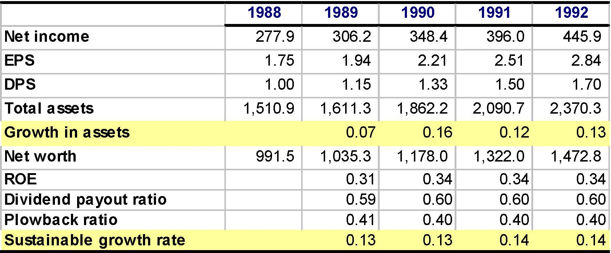

19881989199019911992Net income277.9     306.2     348.4     396.0     445.9     EPS1.75       1.94       2.21       2.51       2.84       DPS1.00       1.15       1.33       1.50       1.70       Total assets1,510.9   1,611.3   1,862.2   2,090.7   2,370.3   Growth in assets0.070.160.120.13Net worth991.5     1,035.3   1,178.0   1,322.0   1,472.8   ROE0.310.340.340.34Dividend payout ratio0.590.600.600.60Plowback ratio0.410.400.400.40Sustainable growth rate0.130.130.140.14

What are likely factors that led to this capital structure?

- In most years, assets grew slower than the sustainable rate

- Retained earnings more than covered the investment needs

- Apex never had to raise outside funds

- A classic “cash cow”

- What explains the high sustainable rate?

- High profit margins and asset turnover offset the mechanical effect of low leverage and the high payout ratios

- Apex management has not attempt to voluntarily increase leverage

What explains the high sustainable rate?

(Focus on year 1992)

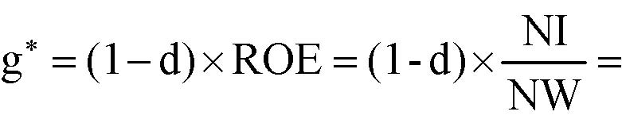

=×=×−=∗NWNId)-(1ROEd)(1g

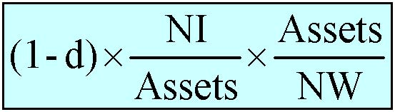

NWAssetsAssetsNId)-(1××

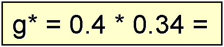

g* = 0.4 * 0.34 =g* = 0.4 * 0.34 =

0.4 * 0.21 * 1.580.4 * 0.21 * 1.58

What explains the high sustainable rate?

(Focus on year 1992)

=×=×−=∗NWNId)-(1ROEd)(1g

NWAssetsAssetsNId)-(1××

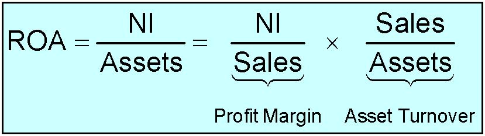

Turnover AssetMargin ProfitAssetsSalesSalesNIAssetsNIROA×==

g* = 0.4 * 0.34 =g* = 0.4 * 0.34 =

0.4 * 0.21 * 1.580.4 * 0.21 * 1.58

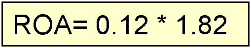

ROA= 0.12 * 1.82ROA= 0.12 * 1.82

Is this capital structure optimal?

USE THE CHECKLIST!

Tax shield:

- Would APEX benefit from tax shields?

- Is APEX profitable?Yes

- Does it have tax deductions?Not likely

Expected distress costs:

- Are cashflowsvolatile?No

- Need for external funds for investment?Not much

- Competitive threat if pinched for cash?Yes

- Customers and suppliers care about distress?Not much

- Are assets hard to re-deploy?Not really

Apex’s capital structure in 1993?

Sales will grow at 11%.  Profit margin will fall to 7%.

External funding needs  = -6 –14 = -20

=&gt; Apex has excess internal funds of 20.

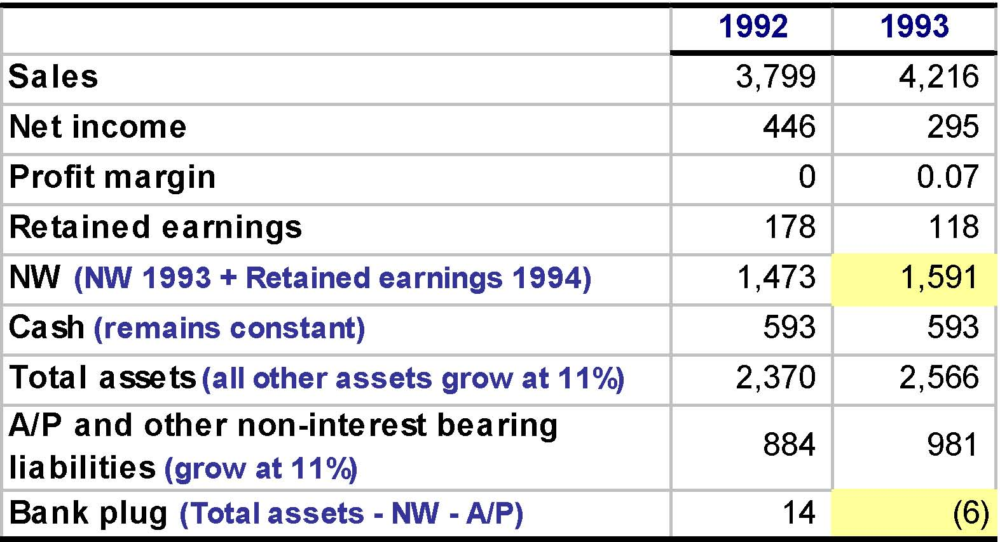

19921993Sales3,799     4,216      Net income446        295        Profit margin0            0.07       Retained earnings178        118        NW (NW 1993 + Retained earnings 1994)1,473     1,591      Cash (remains constant)593        593        Total assets (all other assets grow at 11%)2,370     2,566      A/P and other non-interest bearing liabilities (grow at 11%)884        981        Bank plug (Total assets - NW - A/P)14          (6)           

Apex’s target capital structure in the long run?

- More uncertainty

- Potential regulation

- Technological change

- More competitive pressure

- Regulation may favor competition in generic drugs

- Apex needs to invest more

- Advances in biotechnology =&gt; more R&amp;D required

- Less internally generated funds

- Patents expire

- Bottom line:Lower target leverage.

         Acrobat Distiller 6.0 (Windows)

         2004-01-21T10:26:18+05:30

         2004-01-21T10:28:08+05:30

         2004-01-21T10:28:08+05:30

         PScript5.dll Version 5.2

         uuid:f2e0853f-27ed-4313-896e-e311f6b446a5

         uuid:bee995b0-907a-42f9-8893-b167c135d5be

         xml

               djenter

               Microsoft PowerPoint - LN010_Background(Div).ppt

Finance Theory II (15.402) – Spring 2003 – Dirk Jenter Dividend and Payout Policy (for you to read) 

2 • →→• →→→• • →→Finance Theory II (15.402) – Spring 2003 – Dirk Jenter Dividend Policy (aka Payout Policy) Firms transfer funds to shareholders through: cash dividends share repurchases Payout Policy: How is money being paid out? How often is money being paid out? How much money is being paid? Main question: What payout policy should a firm follow? We need to know: Whether a firm’s value depends on its dividend policy? If so, why and how? 

3 • • • →→• →→→Finance Theory II (15.402) – Spring 2003 – Dirk Jenter Payout Method 1: Cash Dividends The level of dividends is not fixed (contrary to interest) and can be changed by the firm at any time. Usually, dividends are paid quarterly. Companies distinguish between Regular dividends: expected to be maintained in the future Special dividends: less likely to be repeated Dividends are reported in three equivalent ways: Dividend per share (DPS): dollar amount per share Dividend yield: DPS divided by share price Payout ratio: DPS divided by EPS 

4 • →→→• →→→• Finance Theory II (15.402) – Spring 2003 – Dirk Jenter Payout Method 2: Share Repurchases There are different forms of share repurchases: Open market purchases Fixed price tender offers Dutch auctions Note that in a share repurchase: Shares purchased belong to the firm’s remaining shareholders. Usually, they are kept in the firm’s treasury. They may be resold when the firm needs to issue new shares. In many countries, repurchases are not allowed. 

5 M-M Dividend Irrelevance • Proof: • • don’t pay dividends • Q.E.D. Finance Theory II (15.402) – Spring 2003 – Dirk Jenter What does M&amp;M say? In perfect capital markets the value of a firm is independent of its payout policy. Paying dividends is a Zero NPV transaction – so the value of the firm before paying dividends must equal the value of the firm after paying dividends plus the value of the dividends. In perfect capital markets, investors who want dividends can replicate dividends by selling part of their holdings in companies that In perfect capital markets, investors who don’t want dividends can replicate a no-dividend stock by reinvesting their dividends 

6 Example of Dividend Irrelevance: • • →→= • →→• Finance Theory II (15.402) – Spring 2003 – Dirk Jenter XYZ generates a $1M annual perpetuity and the required return on its stock is 10%. It has 100,000 shares outstanding. The current dividend policy is given by: Pay out all cash flows as annual cash dividends, i.e., DPS = $10 Then XYZ’s market value is : $1M / 10%  $10M, and the stock price is $100 Now consider an alternative dividend policy: Increase next year’s cash dividend (only) to $15 Raise the necessary $500,000 by issuing new equity M-M says: The stock price should be unchanged. 

7 Example (cont.): • year. • • • • • Finance Theory II (15.402) – Spring 2003 – Dirk Jenter Since operations are unchanged, XYZ continues to generates $1M per Because the new shares are subject to the same risk as the old ones, they require the same rate of return: 10%. To raise $500,000, XYZ needs to promise new shareholders a $50,000 perpetuity since $50,000 / 10% = $500,000. After next year, the annual dividends accruing to old shareholders will be $1M -$50,000 = $950,000, a DPS of $9.5. Hence, next year’s price of old (and new) shares will be $95. QUESTION: What is today’s stock price under the alternative policy? 

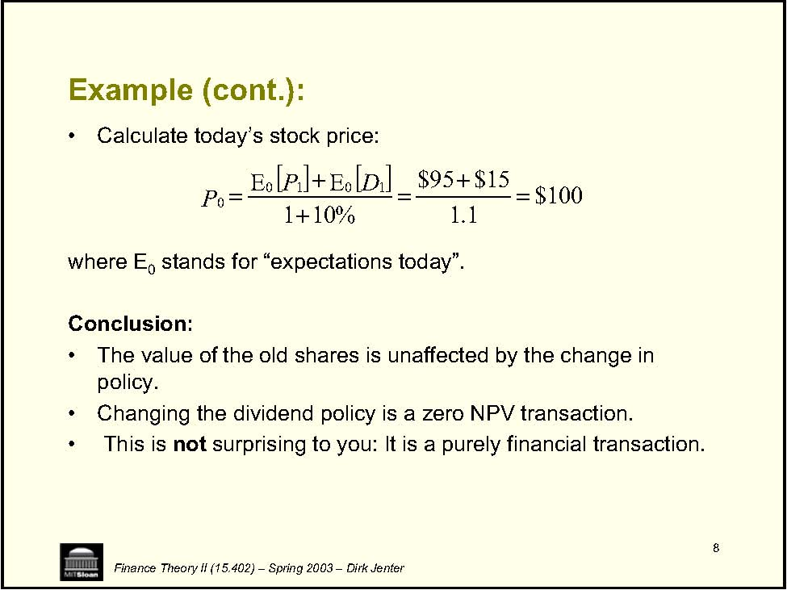

8 Example (cont.): • 0 Conclusion: • policy. • • [][]100$ 15$95$ %101 EE 1010 0 =+=++=DP P Finance Theory II (15.402) – Spring 2003 – Dirk Jenter Calculate today’s stock price: where Estands for “expectations today”. The value of the old shares is unaffected by the change in Changing the dividend policy is a zero NPV transaction. This is not surprising to you: It is a purely financial transaction. 1.1 

9 Using this Result Sensibly • • →→→Finance Theory II (15.402) – Spring 2003 – Dirk Jenter The MM insight about dividend irrelevance helps us to avoid fallacies and illusions about payout policy. It also gets us to ask the right question: How does a change in payout policy affect the size of the pie? Different tax implications of different policies. Different policies may send different signals about the firm to outside investors. Some policies might constrain managers ability to waste funds on negative NPV projects. 

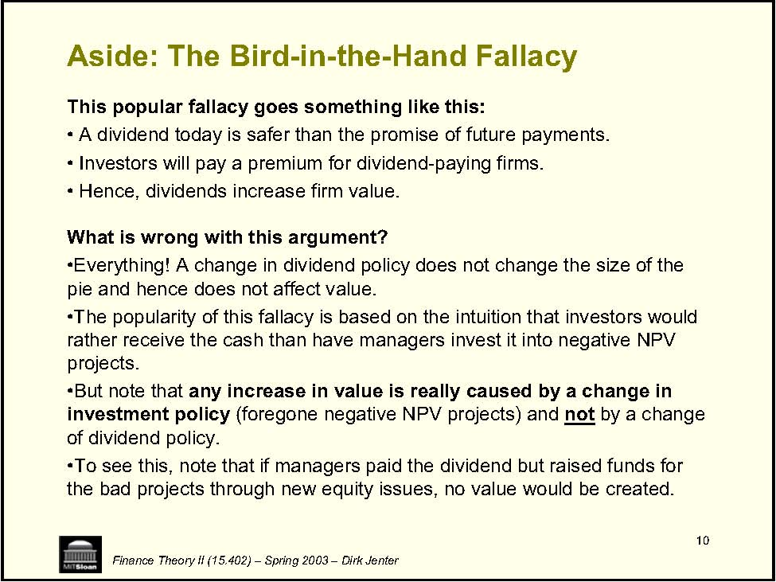

10 Aside: The Bird-in-the-Hand Fallacy projects. •But note that not Finance Theory II (15.402) – Spring 2003 – Dirk Jenter This popular fallacy goes something like this: • A dividend today is safer than the promise of future payments. • Investors will pay a premium for dividend-paying firms. • Hence, dividends increase firm value. What is wrong with this argument? •Everything! A change in dividend policy does not change the size of the pie and hence does not affect value. •The popularity of this fallacy is based on the intuition that investors would rather receive the cash than have managers invest it into negative NPV any increase in value is really caused by a change in investment policy (foregone negative NPV projects) and by a change of dividend policy. •To see this, note that if managers paid the dividend but raised funds for the bad projects through new equity issues, no value would be created. 

11 • →net →→• • • Finance Theory II (15.402) – Spring 2003 – Dirk Jenter Dividends and Taxes In the US tax system, there is double taxation of cash dividends: At the corporate level, dividends are paid out of after-tax income. At the personal level, dividends are again taxed, this time as ordinary income. (Note: There is 70% tax exemption for companies receiving dividends.) This raises the following puzzles: Why pay dividends when interest payments are tax exempt? Why dividends when capital gains are taxed at a lower rate? If a firm really wants to pay out cash to shareholders, why as a dividend and not a share repurchase? 

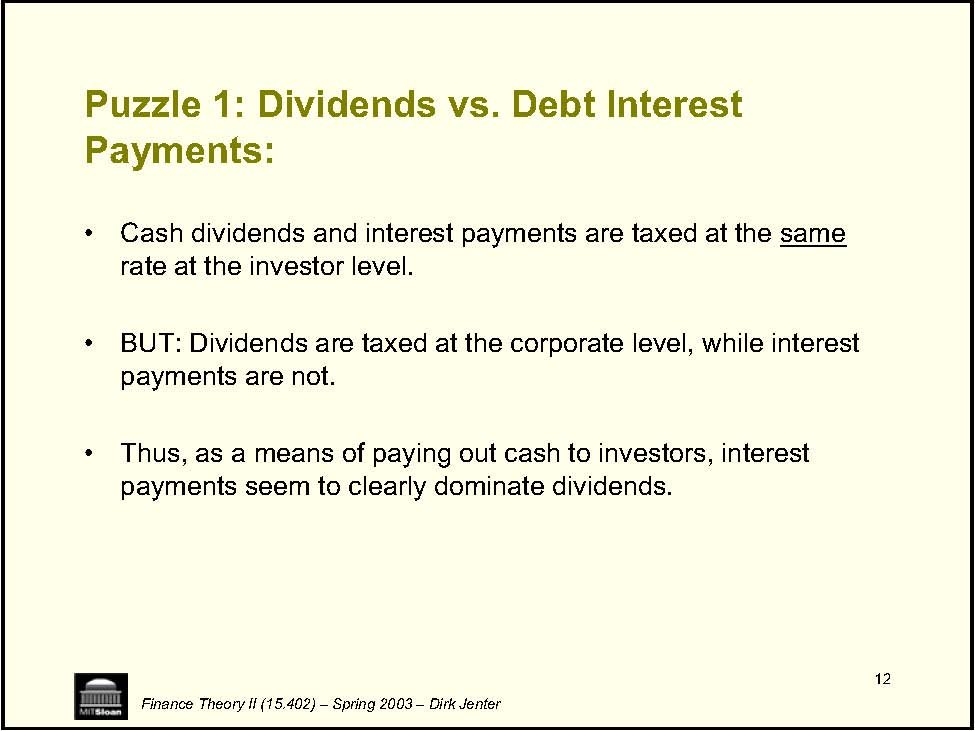

12 Puzzle 1: Dividends vs. Debt Interest • • • Finance Theory II (15.402) – Spring 2003 – Dirk Jenter Payments: Cash dividends and interest payments are taxed at the same rate at the investor level. BUT: Dividends are taxed at the corporate level, while interest payments are not. Thus, as a means of paying out cash to investors, interest payments seem to clearly dominate dividends. 

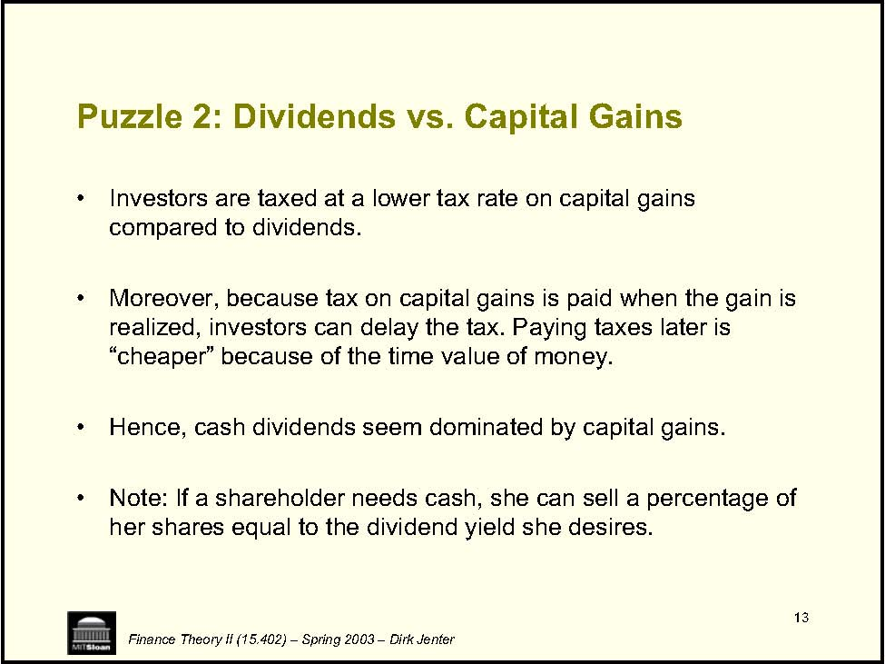

13 Puzzle 2: Dividends vs. Capital Gains • • • • Finance Theory II (15.402) – Spring 2003 – Dirk Jenter Investors are taxed at a lower tax rate on capital gains compared to dividends. Moreover, because tax on capital gains is paid when the gain is realized, investors can delay the tax. Paying taxes later is “cheaper” because of the time value of money. Hence, cash dividends seem dominated by capital gains. Note: If a shareholder needs cash, she can sell a percentage of her shares equal to the dividend yield she desires. 

14 Puzzle 3: Dividends vs. Stock Repurchase • • • dividends Finance Theory II (15.402) – Spring 2003 – Dirk Jenter At the personal level, the payment received in a share repurchase is taxed as capital gain (just as if the shareholder was selling his shares on the market to another investor). Thus, if a firm really wants to pay out cash to investors, cash dividends seem dominated by a share repurchase. Aside: If the IRS sees that share repurchases are regular and proportional to value, they will declare that the firm is really issuing dividends and charge the income tax rate. Despite this, more and more companies are using repurchases instead of 

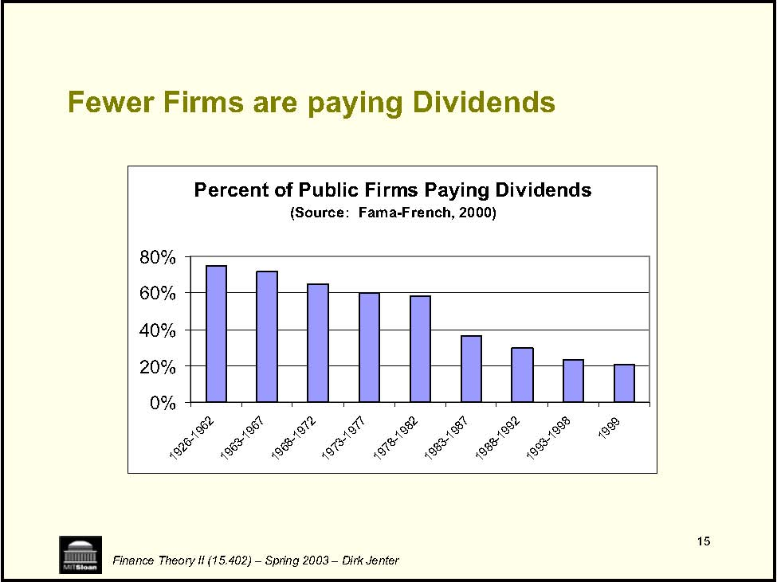

15 0% 20% 40% 60% 80% 1926-1962 1963-1967 1968-1972 1973-1977 1978-1982 1983-1987 1988-1992 1993-1998 1999 Finance Theory II (15.402) – Spring 2003 – Dirk Jenter Fewer Firms are paying Dividends Percent of Public Firms Paying Dividends (Source:  Fama-French, 2000) 

16 0% 10 % 20 % 30 % 40 % 1973-1977 1978-1982 1983-1987 1988-1992 1993-1998 Finance Theory II (15.402) – Spring 2003 – Dirk Jenter More Firms are using Repurchases Repurchases/Earnings Ratio for Public Firms (Source: Fama-French, 2000) 

17 Bottom Line: • • →→Does this justify the tax burden? →• Finance Theory II (15.402) – Spring 2003 – Dirk Jenter Cash dividends are expensive in terms of taxes. Every manager should ask herself: Why am I paying this dividend? Can I achieve the same with another method? Frankly, we still do not have much clever to say about why and how companies pay dividends. 

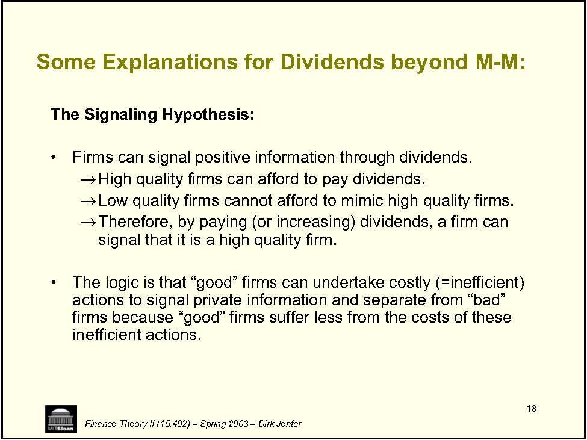

18 • →→→• Finance Theory II (15.402) – Spring 2003 – Dirk Jenter Some Explanations for Dividends beyond M-M: The Signaling Hypothesis: Firms can signal positive information through dividends. High quality firms can afford to pay dividends. Low quality firms cannot afford to mimic high quality firms. Therefore, by paying (or increasing) dividends, a firm can signal that it is a high quality firm. The logic is that “good” firms can undertake costly (=inefficient) actions to signal private information and separate from “bad” firms because “good” firms suffer less from the costs of these inefficient actions. 

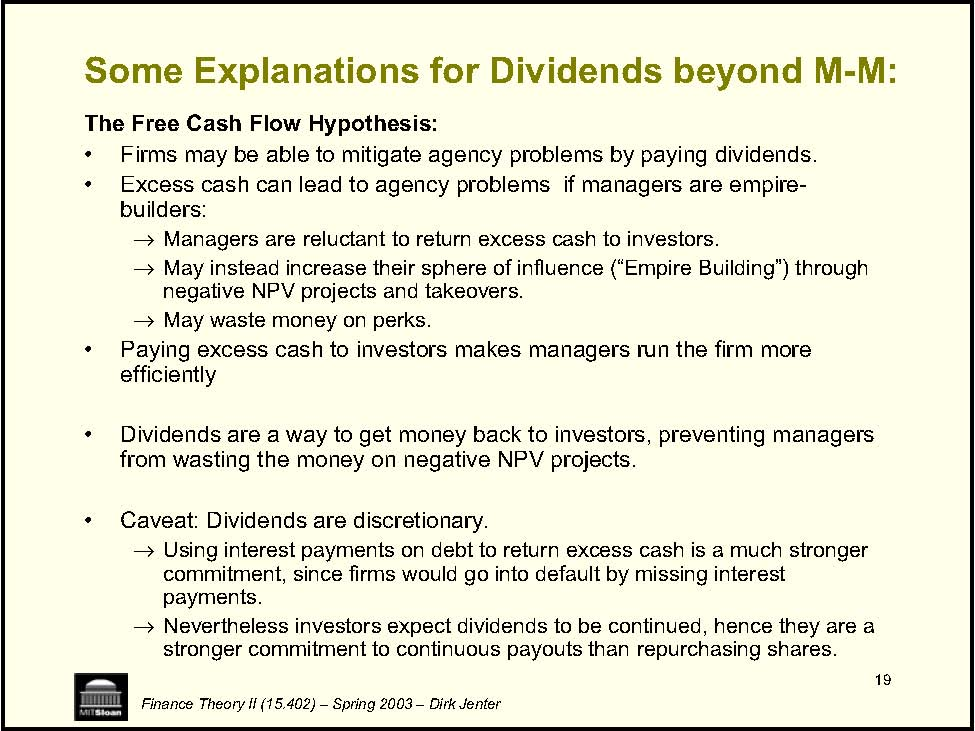

19 • • builders: →→negative NPV projects and takeovers. →• • • →→Finance Theory II (15.402) – Spring 2003 – Dirk Jenter Some Explanations for Dividends beyond M-M: The Free Cash Flow Hypothesis: Firms may be able to mitigate agency problems by paying dividends. Excess cash can lead to agency problems  if managers are empire-Managers are reluctant to return excess cash to investors. May instead increase their sphere of influence (“Empire Building”) through May waste money on perks. Paying excess cash to investors makes managers run the firm more efficiently Dividends are a way to get money back to investors, preventing managers from wasting the money on negative NPV projects. Caveat: Dividends are discretionary. Using interest payments on debt to return excess cash is a much stronger commitment, since firms would go into default by missing interest payments. Nevertheless investors expect dividends to be continued, hence they are a stronger commitment to continuous payouts than repurchasing shares. 

Finance Theory II (15.402) – Spring 2003 – Dirk Jenter Appendix (for your information) 

21 • • • • Record Date: • ¸ Example: Finance Theory II (15.402) – Spring 2003 – Dirk Jenter Chronology of Cash Dividends Declaration date: The firm announces its next dividend, as well as its record and payment dates. Cum-Dividend Date: Last day when shares are traded with the right to receive the dividend. (5 days before record date) Ex-Dividend Date: First day when shares are traded without the right to receive the dividend. (Day after the Cum-Dividend date) Shareholders are recorded to receive dividends. Payment Date: Dividend checks mailed out. On May 15, XYZ announces a 2nd quarter dividend of $0.20/share, with record date June 1, and payment date June 15. The cum dividend date is May 25, and ex-dividend date May 26. 

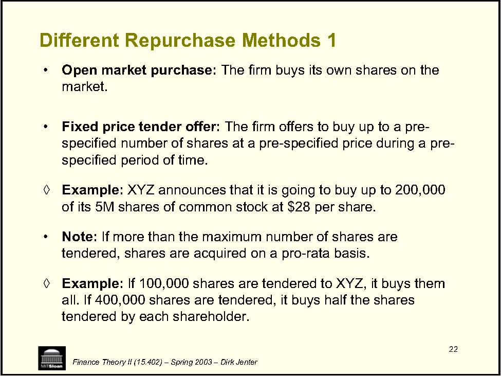

22 Different Repurchase Methods 1 • market. • ¸ Example: • ¸ Example: Finance Theory II (15.402) – Spring 2003 – Dirk Jenter Open market purchase: The firm buys its own shares on the Fixed price tender offer: The firm offers to buy up to a pre-specified number of shares at a pre-specified price during a pre-specified period of time. XYZ announces that it is going to buy up to 200,000 of its 5M shares of common stock at $28 per share. Note: If more than the maximum number of shares are tendered, shares are acquired on a pro-rata basis. If 100,000 shares are tendered to XYZ, it buys them all. If 400,000 shares are tendered, it buys half the shares tendered by each shareholder. 

23 Different Repurchase Methods 2 • ¸ Example: →→→Finance Theory II (15.402) – Spring 2003 – Dirk Jenter Dutch Auction: Each shareholder is invited to submit a bid price at which they are willing to tender (some of) their shares. The firm states the number of shares it buys during a pre-specified period of time, and sets a range of bids it accepts. The repurchase price is the lowest price necessary to acquire the number of shares sought. XYZ announces it will buy up to 200,000 of its 5M shares in a Dutch auction and invites shareholders to bid prices below $28. Suppose that: 50,000 shares were tendered at $25 150,000 shares were tendered at $26 80,000 shares were tendered at $27 Then XYZ buys at $26 all the shares tendered at or below $26. 

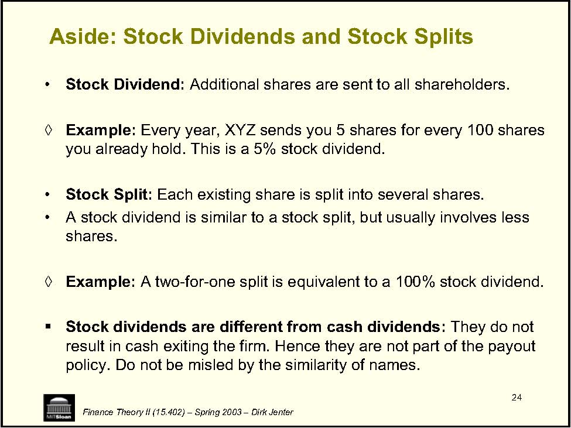

24 • ¸ Example: • • ¸ Example: ƒ Finance Theory II (15.402) – Spring 2003 – Dirk Jenter Aside: Stock Dividends and Stock Splits Stock Dividend: Additional shares are sent to all shareholders. Every year, XYZ sends you 5 shares for every 100 shares you already hold. This is a 5% stock dividend. Stock Split: Each existing share is split into several shares. A stock dividend is similar to a stock split, but usually involves less shares. A two-for-one split is equivalent to a 100% stock dividend. Stock dividends are different from cash dividends: They do not result in cash exiting the firm. Hence they are not part of the payout policy. Do not be misled by the similarity of names. 

         Acrobat Distiller 6.0 (Windows)

         2004-01-21T10:28:40+05:30

         2004-01-21T10:29:25+05:30

         2004-01-21T10:29:25+05:30

         PScript5.dll Version 5.2

         uuid:793b512e-422a-4f51-ac5c-981a84b4b736

         uuid:c40e2b86-4b21-4ba9-bd49-619461098493

         xml

               djenter

               Microsoft PowerPoint - LN12(FCF).ppt

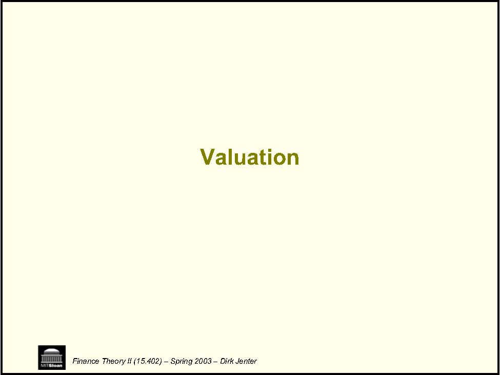

Valuation Finance Theory II (15.402) – Spring 2003 – Dirk Jenter 

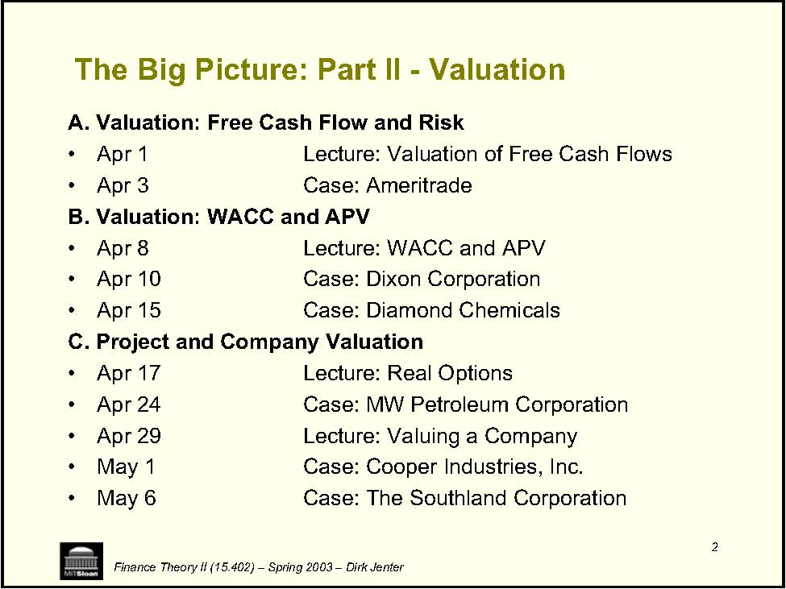

2 • • • • • • • • • • Finance Theory II (15.402) – Spring 2003 – Dirk Jenter The Big Picture: Part II -Valuation A. Valuation: Free Cash Flow and Risk Apr 1 Lecture: Valuation of Free Cash Flows Apr 3 Case: Ameritrade B. Valuation: WACC and APV Apr 8 Lecture: WACC and APV Apr 10 Case: Dixon Corporation Apr 15 Case: Diamond Chemicals C. Project and Company Valuation Apr 17 Lecture: Real Options Apr 24 Case: MW Petroleum Corporation Apr 29 Lecture: Valuing a Company May 1 Case: Cooper Industries, Inc. May 6 Case: The Southland Corporation 

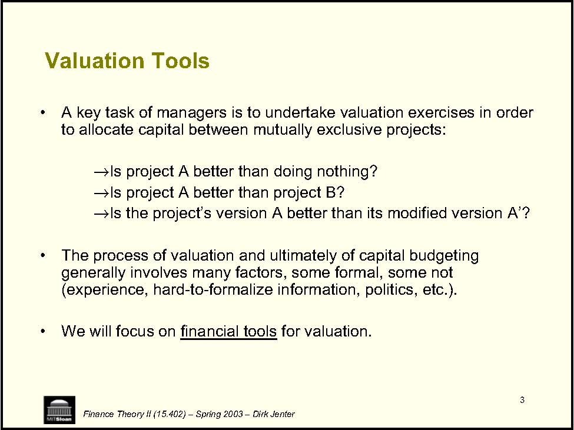

3 Valuation Tools • →Is project A better than doing nothing? →Is project A better than project B? →• • for valuation. Finance Theory II (15.402) – Spring 2003 – Dirk Jenter A key task of managers is to undertake valuation exercises in order to allocate capital between mutually exclusive projects: Is the project’s version A better than its modified version A’? The process of valuation and ultimately of capital budgeting generally involves many factors, some formal, some not (experience, hard-to-formalize information, politics, etc.). We will focus on financial tools 

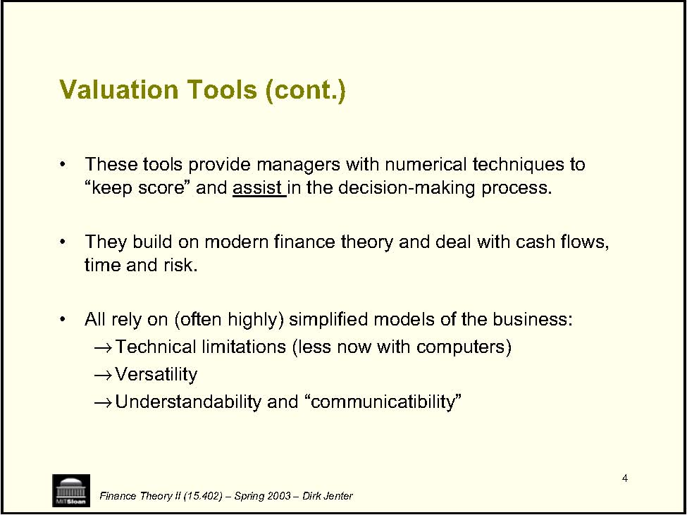

4 Valuation Tools (cont.) • • time and risk. • →→Versatility →Finance Theory II (15.402) – Spring 2003 – Dirk Jenter These tools provide managers with numerical techniques to “keep score” and assist in the decision-making process. They build on modern finance theory and deal with cash flows, All rely on (often highly) simplified models of the business: Technical limitations (less now with computers) Understandability and “communicatibility” 

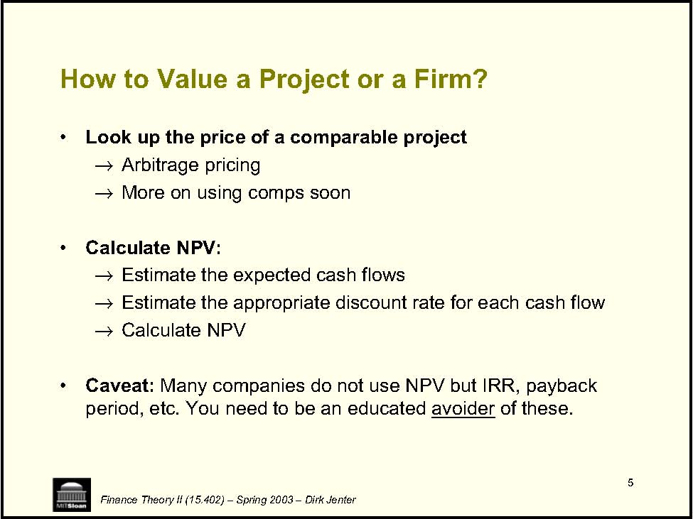

5 How to Value a Project or a Firm? • →→• →→→• of these. Finance Theory II (15.402) – Spring 2003 – Dirk Jenter Look up the price of a comparable project Arbitrage pricing More on using comps soon Calculate NPV: Estimate the expected cash flows Estimate the appropriate discount rate for each cash flow Calculate NPV Caveat: Many companies do not use NPV but IRR, payback period, etc. You need to be an educated avoider 

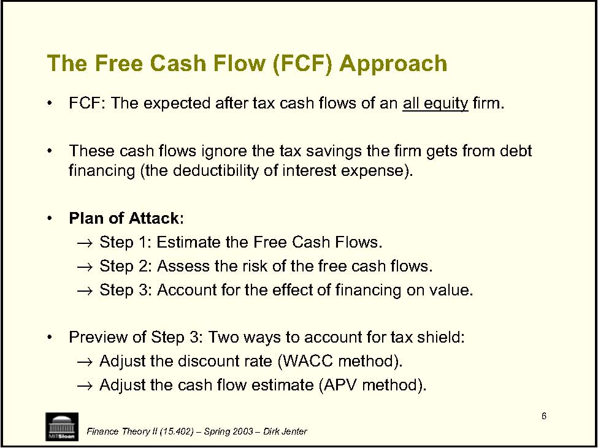

6 • firm. • • Plan of Attack: →→→• →→Finance Theory II (15.402) – Spring 2003 – Dirk Jenter The Free Cash Flow (FCF) Approach FCF: The expected after tax cash flows of an all equity These cash flows ignore the tax savings the firm gets from debt financing (the deductibility of interest expense). Step 1: Estimate the Free Cash Flows. Step 2: Assess the risk of the free cash flows. Step 3: Account for the effect of financing on value. Preview of Step 3: Two ways to account for tax shield: Adjust the discount rate (WACC method). Adjust the cash flow estimate (APV method). 

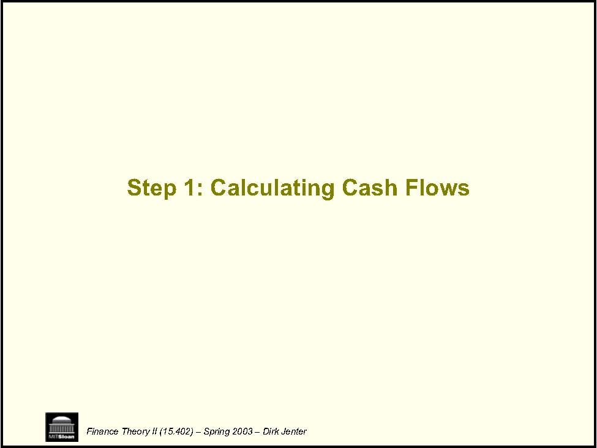

Step 1: Calculating Cash Flows Finance Theory II (15.402) – Spring 2003 – Dirk Jenter 

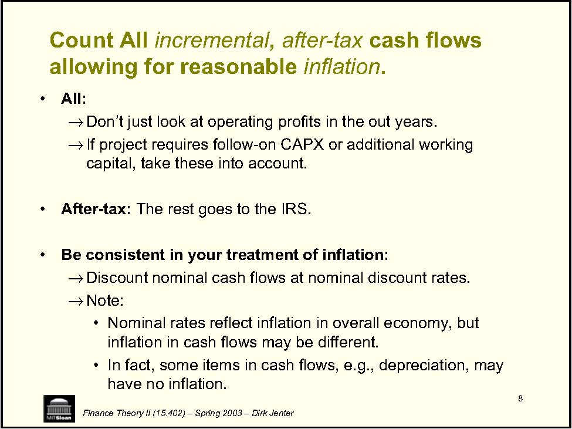

8 Count All incremental, after-tax cash flows allowing for reasonable inflation. • All: →→• • →→Note: • • Finance Theory II (15.402) – Spring 2003 – Dirk Jenter Don’t just look at operating profits in the out years. If project requires follow-on CAPX or additional working capital, take these into account. After-tax: The rest goes to the IRS. Be consistent in your treatment of inflation: Discount nominal cash flows at nominal discount rates. Nominal rates reflect inflation in overall economy, but inflation in cash flows may be different. In fact, some items in cash flows, e.g., depreciation, may have no inflation. 

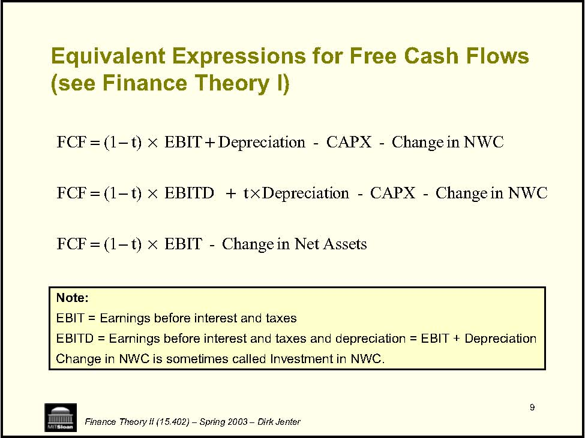

9 Equivalent Expressions for Free Cash Flows -EBITt)(1FCF -CAPX-tEBITDt)(1FCF -CAPX-EBITt)(1FCF ×−=×+×−=+×−=Finance Theory II (15.402) – Spring 2003 – Dirk Jenter (see Finance Theory I) Assets Net in Change NWC in Change onDepreciatiNWC in Change onDepreciati Note: EBIT = Earnings before interest and taxes EBITD = Earnings before interest and taxes and depreciation = EBIT + Depreciation Change in NWC is sometimes called Investment in NWC. 

# Example of Free Cash Flow Calculation

<Table>
<TR>

<TH>1998 </TH>
<TH>1999 </TH>
</TR>
<TR>
<TD>Sales </TD>

<TD>1,000 </TD>
<TD>1,200 </TD>
</TR>
<TR>
<TD>Cost of Goods Sold </TD>

<TD>700 </TD>
<TD>850 </TD>
</TR>
<TR>
<TD>Depreciation </TD>

<TD>30 </TD>
<TD>35 </TD>
</TR>
<TR>
<TD>Interest Expense </TD>

<TD>40 </TD>
<TD>50 </TD>
</TR>
<TR>
<TD>Taxes (38%) </TD>

<TD>80 </TD>
<TD>90 </TD>
</TR>
<TR>
<TD>Profit After taxes </TD>

<TD>150 </TD>
<TD>175 </TD>
</TR>
<TR>
<TD>Capital Expenditures </TD>

<TD>40 </TD>
<TD>40 </TD>
</TR>
<TR>
<TD>Accounts Receivable </TD>

<TD>50 </TD>
<TD>60 </TD>
</TR>
<TR>
<TD>Inventories </TD>

<TD>50 </TD>
<TD>60 </TD>
</TR>
<TR>
<TD>Accounts Payable </TD>

<TD>20 </TD>
<TD>25 </TD>
</TR>
</Table>

In 1999: FCF = EBIT*(1-t) + Depreciation -CAPX -Change in NWC 

ĺ EBIT = 1,200 -850 -35 = 315 ĺ t=38% ĺ Ch. NWC = (60+60-25) -(50+50-20) = 15 ĺ FCF = 315 * (1-.38) + 35 -40 -15 = 175.3 

Finance Theory II (15.402) – Spring 2003 – Dirk Jenter 

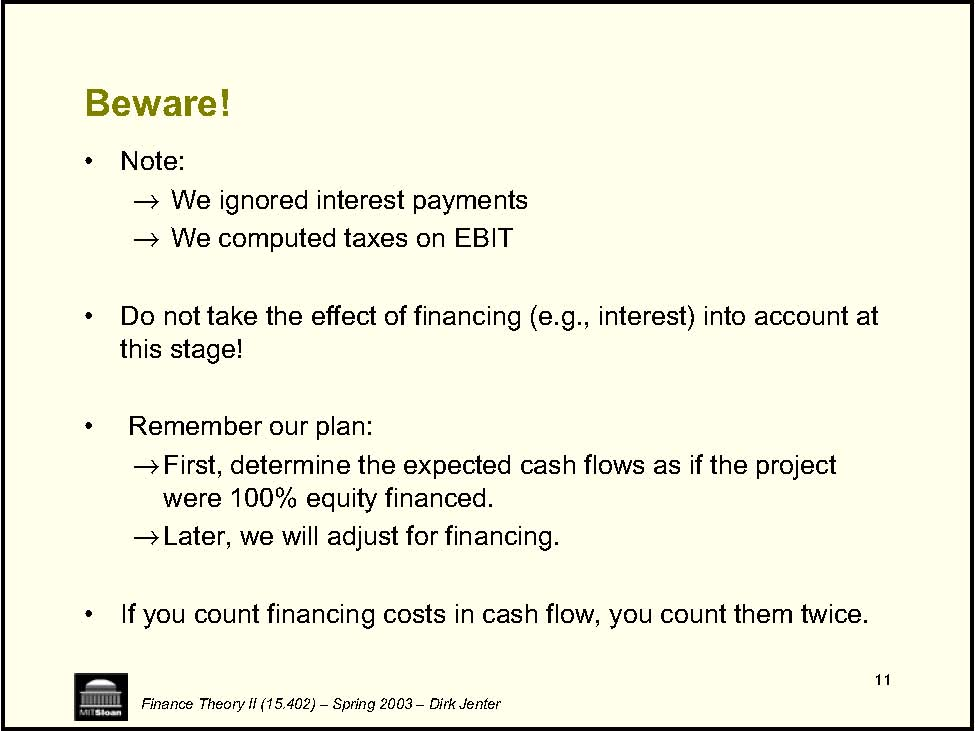

11 Beware! • →→• this stage! • →were 100% equity financed. →• Finance Theory II (15.402) – Spring 2003 – Dirk Jenter Note: We ignored interest payments We computed taxes on EBIT Do not take the effect of financing (e.g., interest) into account at Remember our plan: First, determine the expected cash flows as if the project Later, we will adjust for financing. If you count financing costs in cash flow, you count them twice. 

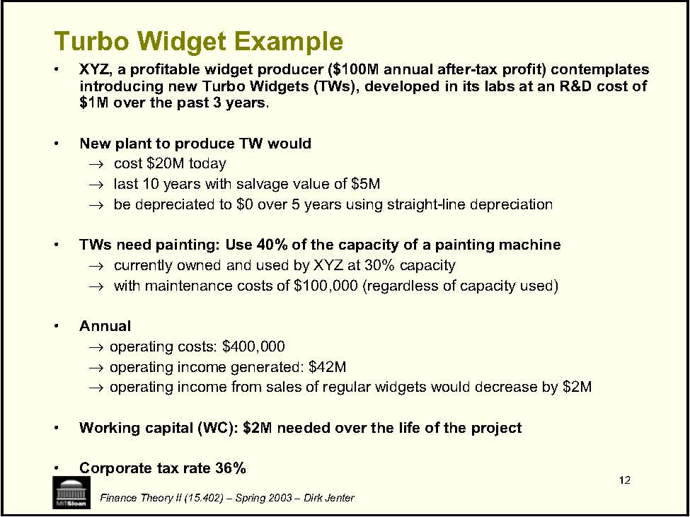

12 • • →→→• →→• →→→• • Finance Theory II (15.402) – Spring 2003 – Dirk Jenter Turbo Widget Example XYZ, a profitable widget producer ($100M annual after-tax profit) contemplates introducing new Turbo Widgets (TWs), developed in its labs at an R&amp;D cost of $1M over the past 3 years. New plant to produce TW would cost $20M today last 10 years with salvage value of $5M be depreciated to $0 over 5 years using straight-line depreciation TWs need painting: Use 40% of the capacity of a painting machine currently owned and used by XYZ at 30% capacity with maintenance costs of $100,000 (regardless of capacity used) Annual operating costs: $400,000 operating income generated: $42M operating income from sales of regular widgets would decrease by $2M Working capital (WC): $2M needed over the life of the project Corporate tax rate 36% 

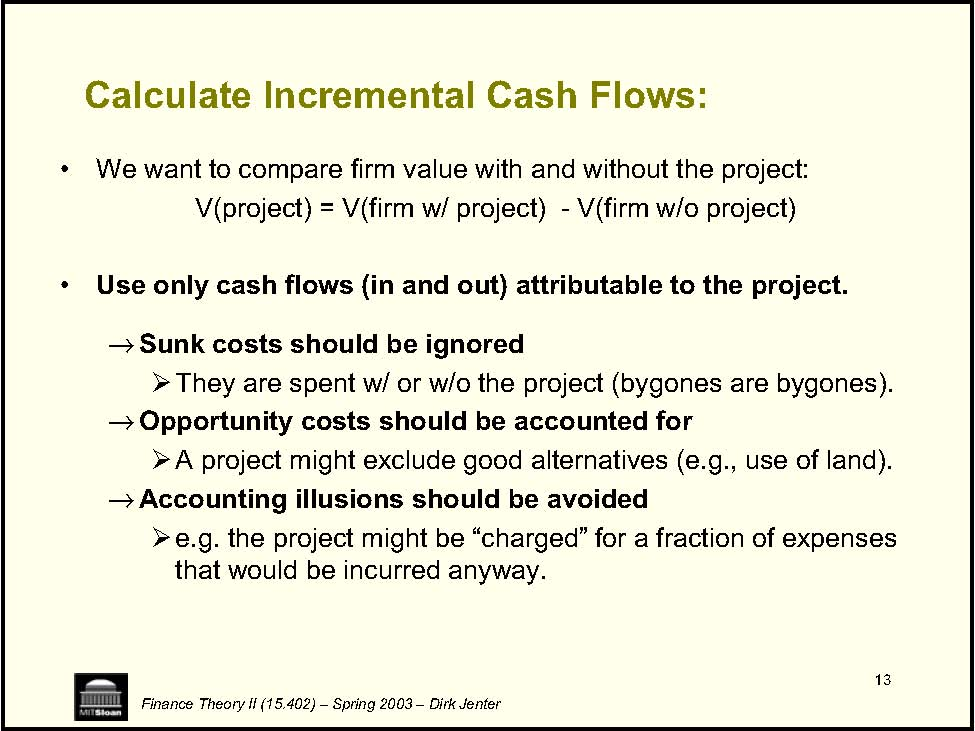

13 Calculate Incremental Cash Flows: • • →¾ →¾ →¾ Finance Theory II (15.402) – Spring 2003 – Dirk Jenter We want to compare firm value with and without the project: V(project) = V(firm w/ project)  -V(firm w/o project) Use only cash flows (in and out) attributable to the project. Sunk costs should be ignored They are spent w/ or w/o the project (bygones are bygones). Opportunity costs should be accounted for A project might exclude good alternatives (e.g., use of land). Accounting illusions should be avoided e.g. the project might be “charged” for a fraction of expenses that would be incurred anyway. 

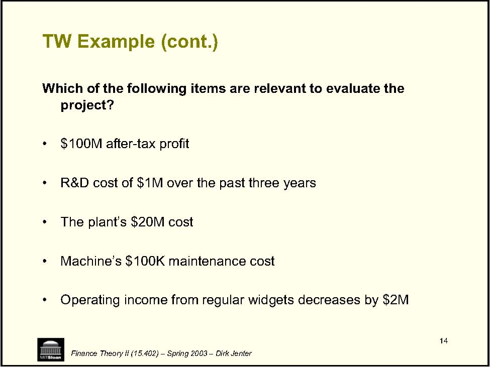

14 • • • • • Finance Theory II (15.402) – Spring 2003 – Dirk Jenter TW Example (cont.) Which of the following items are relevant to evaluate the project? $100M after-tax profit R&amp;D cost of $1M over the past three years The plant’s $20M cost Machine’s $100K maintenance cost Operating income from regular widgets decreases by $2M 

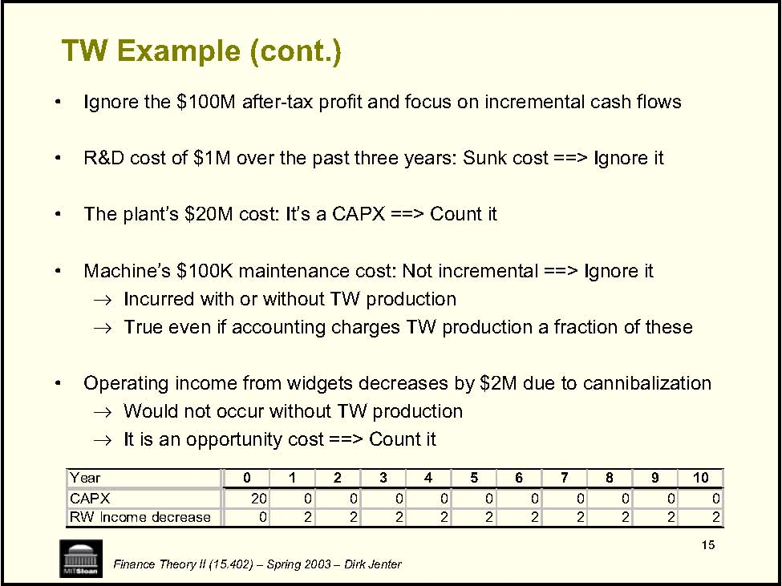

15 • • • • →→• →→0 1 2 3 4 5 6 7 8 9 0 0 0 0 0 0 0 0 0 0 0 2 2 2 2 2 2 2 2 2 2 Finance Theory II (15.402) – Spring 2003 – Dirk Jenter TW Example (cont.) Ignore the $100M after-tax profit and focus on incremental cash flows R&amp;D cost of $1M over the past three years: Sunk cost ==&gt; Ignore it The plant’s $20M cost: It’s a CAPX ==&gt; Count it Machine’s $100K maintenance cost: Not incremental ==&gt; Ignore it Incurred with or without TW production True even if accounting charges TW production a fraction of these Operating income from widgets decreases by $2M due to cannibalization Would not occur without TW production It is an opportunity cost ==&gt; Count it Year 10 CAPX 20 RW Income decrease 

16 Use After-tax Cash Flows • • etc. • →→→→Finance Theory II (15.402) – Spring 2003 – Dirk Jenter These are what you have left after paying for your costs (COGS and other costs), and after paying the IRS. Make sure to count the tax benefits of expensing, depreciation, CAPX and Depreciation: Tax treatment of CAPX depends on depreciation CAPX is not directly subtracted from taxable income Instead, each year’s depreciation “expense” is subtracted from that year’s taxable income As far as taxes are concerned, everything is as if there was no CAPX and a cost equal to depreciation was incurred each year. 

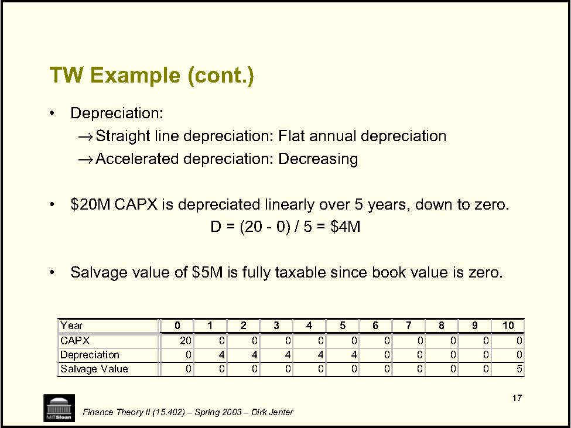

17 • →→• • 0 1 2 3 4 5 6 7 8 9 0 0 0 0 0 0 0 0 0 0 0 4 4 4 4 4 0 0 0 0 0 0 0 0 0 0 0 0 0 0 0 5 Finance Theory II (15.402) – Spring 2003 – Dirk Jenter TW Example (cont.) Depreciation: Straight line depreciation: Flat annual depreciation Accelerated depreciation: Decreasing $20M CAPX is depreciated linearly over 5 years, down to zero. D = (20 -0) / 5 = $4M Salvage value of $5M is fully taxable since book value is zero. Year 10 CAPX 20 Depreciation Salvage Value 

# TW Example (cont.)

<Table>
<TR>
<TH>Year </TH>
<TH>0 </TH>
<TH>1 </TH>
<TH>2 </TH>
<TH>3 </TH>
<TH>4 </TH>
<TH>5 </TH>
<TH>6 </TH>
<TH>7 </TH>
<TH>8 </TH>
<TH>9 </TH>
<TH>10 </TH>
</TR>
<TR>
<TH>CAPX </TH>
<TD>20.0</TD>
<TH> </TH>
<TH>-</TH>
<TH>-</TH>
<TH>-</TH>
<TH>-</TH>
<TH>-</TH>
<TH>-</TH>
<TH>-</TH>
<TH>-</TH>
<TH>-</TH>
</TR>
<TR>
<TH>Income </TH>
<TH>-</TH>
<TD>42.0</TD>
<TD> 42.0</TD>
<TD> 42.0</TD>
<TD> 42.0</TD>
<TD> 42.0</TD>
<TD> 42.0</TD>
<TD> 42.0</TD>
<TD> 42.0</TD>
<TD> 42.0</TD>
<TD> 42.0 </TD>
</TR>
<TR>
<TH>RW Income decrease </TH>
<TH>-</TH>
<TD>2.0 </TD>
<TD>2.0 </TD>
<TD>2.0 </TD>
<TD>2.0 </TD>
<TD>2.0 </TD>
<TD>2.0 </TD>
<TD>2.0 </TD>
<TD>2.0 </TD>
<TD>2.0 </TD>
<TD>2.0 </TD>
</TR>
<TR>
<TH>Incremental income </TH>
<TH>-</TH>
<TD>40.0</TD>
<TD> 40.0</TD>
<TD> 40.0</TD>
<TD> 40.0</TD>
<TD> 40.0</TD>
<TD> 40.0</TD>
<TD> 40.0</TD>
<TD> 40.0</TD>
<TD> 40.0</TD>
<TD> 40.0 </TD>
</TR>
<TR>
<TH>Incremental cost </TH>
<TH>-</TH>
<TD>0.4 </TD>
<TD>0.4 </TD>
<TD>0.4 </TD>
<TD>0.4 </TD>
<TD>0.4 </TD>
<TD>0.4 </TD>
<TD>0.4 </TD>
<TD>0.4 </TD>
<TD>0.4 </TD>
<TD>0.4 </TD>
</TR>
<TR>
<TH>Salvage value </TH>
<TH>-</TH>
<TH>-</TH>
<TH>-</TH>
<TH>-</TH>
<TH>-</TH>
<TH>-</TH>
<TH>-</TH>
<TH>-</TH>
<TH>-</TH>
<TH>-</TH>
<TD>5.0 </TD>
</TR>
<TR>
<TH>Incremental profit </TH>
<TH>-</TH>
<TD>39.6</TD>
<TD> 39.6</TD>
<TD> 39.6</TD>
<TD> 39.6</TD>
<TD> 39.6</TD>
<TD> 39.6</TD>
<TD> 39.6</TD>
<TD> 39.6</TD>
<TD> 39.6</TD>
<TD> 44.6 </TD>
</TR>
<TR>
<TH>Depreciation </TH>
<TH>-</TH>
<TD>4.0 </TD>
<TD>4.0 </TD>
<TD>4.0 </TD>
<TD>4.0 </TD>
<TD>4.0 </TD>
<TH>-</TH>
<TH>-</TH>
<TH>-</TH>
<TH>-</TH>
<TH>-</TH>
</TR>
<TR>
<TH>EBIT </TH>
<TH>-</TH>
<TD>35.6</TD>
<TD> 35.6</TD>
<TD> 35.6</TD>
<TD> 35.6</TD>
<TD> 35.6</TD>
<TD> 39.6</TD>
<TD> 39.6</TD>
<TD> 39.6</TD>
<TD> 39.6</TD>
<TD> 44.6 </TD>
</TR>
<TR>
<TH>Incremental taxes (36%) </TH>
<TH>-</TH>
<TD>12.8</TD>
<TD> 12.8</TD>
<TD> 12.8</TD>
<TD> 12.8</TD>
<TD> 12.8</TD>
<TD> 14.3</TD>
<TD> 14.3</TD>
<TD> 14.3</TD>
<TD> 14.3</TD>
<TD> 16.1 </TD>
</TR>
<TR>
<TH>Total </TH>
<TD>-20.0 </TD>
<TD>26.8</TD>
<TD> 26.8</TD>
<TD> 26.8</TD>
<TD> 26.8</TD>
<TD> 26.8</TD>
<TD> 25.3</TD>
<TD> 25.3</TD>
<TD> 25.3</TD>
<TD> 25.3</TD>
<TD> 28.5 </TD>
</TR>
</Table>

Note: We do as if entire EBIT is taxable ==&gt; We ignore (for now) the fact that interest payments are not taxable. 

Finance Theory II (15.402) – Spring 2003 – Dirk Jenter 

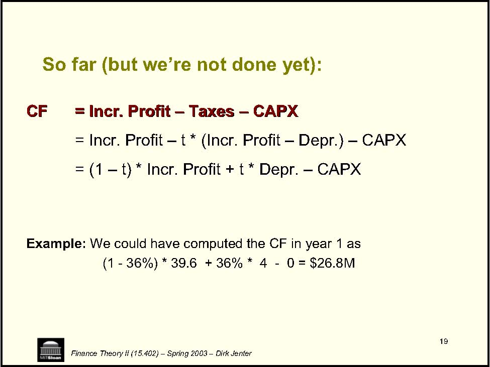

19 Finance Theory II (15.402) – Spring 2003 – Dirk Jenter So far (but we’re not done yet): Example: We could have computed the CF in year 1 as (1 -36%) * 39.6 + 36% * 4 -0 = $26.8M CFCF= Incr. Profit= Incr. Profit ––TaxesTaxes––CAPXCAPX= Incr. Profit= Incr. Profit ––t * (Incr. Profitt * (Incr. Profit ––Depr.)Depr.)––CAPXCAPX= (1= (1––t) * Incr. Profit + t * Depr.t) * Incr. Profit + t * Depr. ––CAPXCAPX

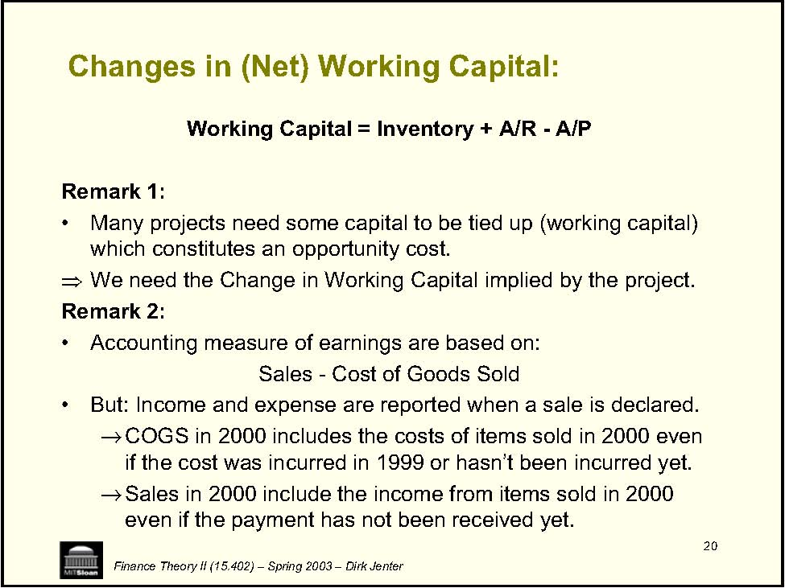

20 Finance Theory II (15.402) – Spring 2003 – Dirk Jenter Changes in (Net) Working Capital: Working Capital = Inventory + A/R -A/P Remark 1: • Many projects need some capital to be tied up (working capital) which constitutes an opportunity cost. Ÿ We need the Change in Working Capital implied by the project. Remark 2: • Accounting measure of earnings are based on: Sales -Cost of Goods Sold • But: Income and expense are reported when a sale is declared. →COGS in 2000 includes the costs of items sold in 2000 even if the cost was incurred in 1999 or hasn’t been incurred yet. →Sales in 2000 include the income from items sold in 2000 even if the payment has not been received yet. 

# TW Example (cont.)

<Table>
<TR>
<TH>Year </TH>
<TH>0 </TH>
<TH>1 </TH>
<TH>2 </TH>
<TH>3 </TH>
<TH>4 </TH>
<TH>5 </TH>
<TH>6 </TH>
<TH>7 </TH>
<TH>8 </TH>
<TH>9 </TH>
<TH>10 </TH>
</TR>
<TR>
<TH>CAPX </TH>
<TD>20.0</TD>
<TH> </TH>
<TH>-</TH>
<TH>-</TH>
<TH>-</TH>
<TH>-</TH>
<TH>-</TH>
<TH>-</TH>
<TH>-</TH>
<TH>-</TH>
<TH>-</TH>
</TR>
<TR>
<TH>Incremental profit </TH>
<TH>-</TH>
<TD>39.6</TD>
<TD> 39.6</TD>
<TD> 39.6</TD>
<TD> 39.6</TD>
<TD> 39.6</TD>
<TD> 39.6</TD>
<TD> 39.6</TD>
<TD> 39.6</TD>
<TD> 39.6</TD>
<TD> 44.6 </TD>
</TR>
<TR>
<TH>Incremental taxes (36%) </TH>
<TH>-</TH>
<TD>12.8</TD>
<TD> 12.8</TD>
<TD> 12.8</TD>
<TD> 12.8</TD>
<TD> 12.8</TD>
<TD> 14.3</TD>
<TD> 14.3</TD>
<TD> 14.3</TD>
<TD> 14.3</TD>
<TD> 16.1 </TD>
</TR>
<TR>
<TH>NWC </TH>
<TD>2.0 </TD>
<TD>2.0 </TD>
<TD>2.0 </TD>
<TD>2.0 </TD>
<TD>2.0 </TD>
<TD>2.0 </TD>
<TD>2.0 </TD>
<TD>2.0 </TD>
<TD>2.0 </TD>
<TD>2.0 </TD>
<TH>-</TH>
</TR>
<TR>
<TH>Change in NWC </TH>
<TD>2.0 </TD>
<TH>-</TH>
<TH>-</TH>
<TH>-</TH>
<TH>-</TH>
<TH>-</TH>
<TH>-</TH>
<TH>-</TH>
<TH>-</TH>
<TH>-</TH>
<TD>-2.0 </TD>
</TR>
<TR>
<TH>Total </TH>
<TD>-22.0 </TD>
<TD>26.8 </TD>
<TD>26.8 </TD>
<TD>26.8 </TD>
<TD>26.8 </TD>
<TD>26.8 </TD>
<TD>25.3 </TD>
<TD>25.3 </TD>
<TD>25.3 </TD>
<TD>25.3 </TD>
<TD>30.5 </TD>
</TR>
</Table>

Finance Theory II (15.402) – Spring 2003 – Dirk Jenter 

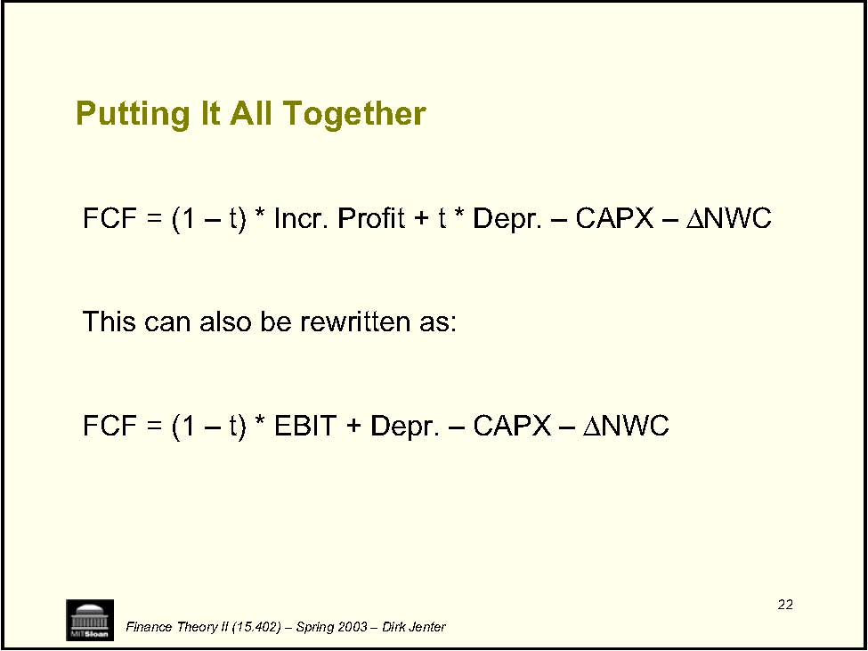

22 Finance Theory II (15.402) – Spring 2003 – Dirk Jenter Putting It All Together FCF = (1FCF = (1 ––t) * Incr. Profit + t * Depr.t) * Incr. Profit + t * Depr. ––CAPXCAPX––∆∆NWCNWCThis can also be rewritten as:This can also be rewritten as:FCF = (1FCF = (1 ––t) * EBIT + Depr.t) * EBIT + Depr. ––CAPXCAPX––∆∆NWCNWC

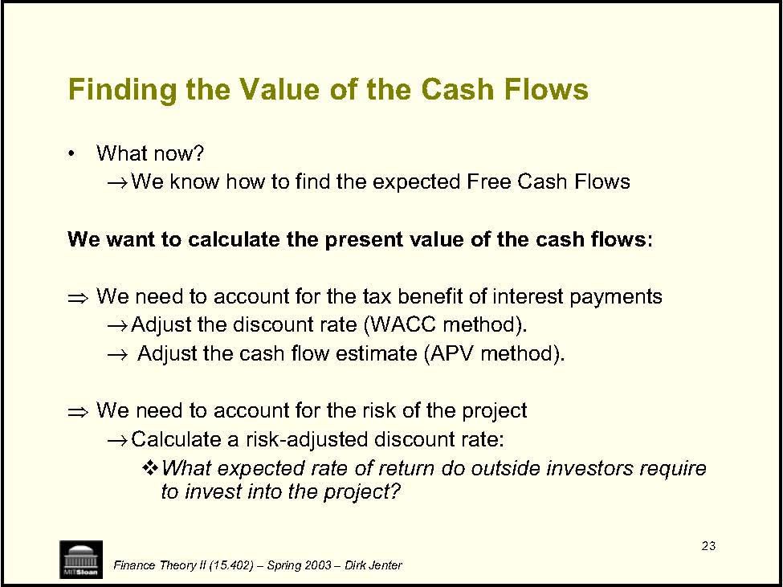

23 Finding the Value of the Cash Flows • →Ÿ →→Ÿ →™Finance Theory II (15.402) – Spring 2003 – Dirk Jenter What now? We know how to find the expected Free Cash Flows We want to calculate the present value of the cash flows: We need to account for the tax benefit of interest payments Adjust the discount rate (WACC method). Adjust the cash flow estimate (APV method). We need to account for the risk of the project Calculate a risk-adjusted discount rate: What expected rate of return do outside investors require to invest into the project? 

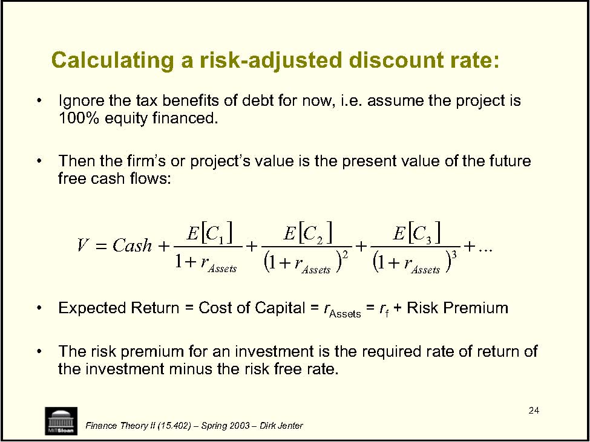

24 Calculating a risk-adjusted discount rate: • • free cash flows: • rAssets = rf • []... 111 3 3 2 21 +++++++=AssetsAssetsAssets rrr CashV Finance Theory II (15.402) – Spring 2003 – Dirk Jenter Ignore the tax benefits of debt for now, i.e. assume the project is 100% equity financed. Then the firm’s or project’s value is the present value of the future Expected Return = Cost of Capital = + Risk Premium The risk premium for an investment is the required rate of return of the investment minus the risk free rate. C E C E C E 

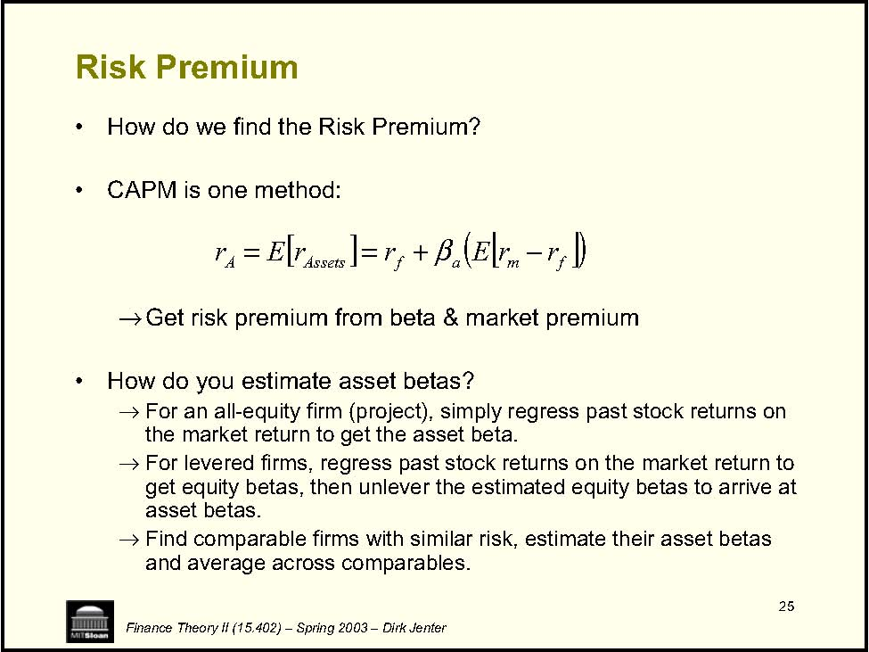

25 Risk Premium • • →• →the market return to get the asset beta. →asset betas. →[]fmafAssetsA rrr −+==βFinance Theory II (15.402) – Spring 2003 – Dirk Jenter How do we find the Risk Premium? CAPM is one method: Get risk premium from beta &amp; market premium How do you estimate asset betas? For an all-equity firm (project), simply regress past stock returns on For levered firms, regress past stock returns on the market return to get equity betas, then unlever the estimated equity betas to arrive at Find comparable firms with similar risk, estimate their asset betas and average across comparables. r E r E 

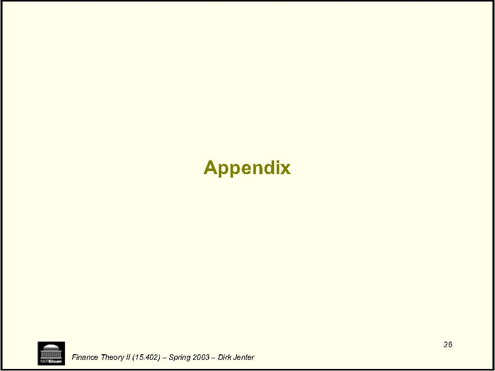

26 Finance Theory II (15.402) – Spring 2003 – Dirk Jenter Appendix 

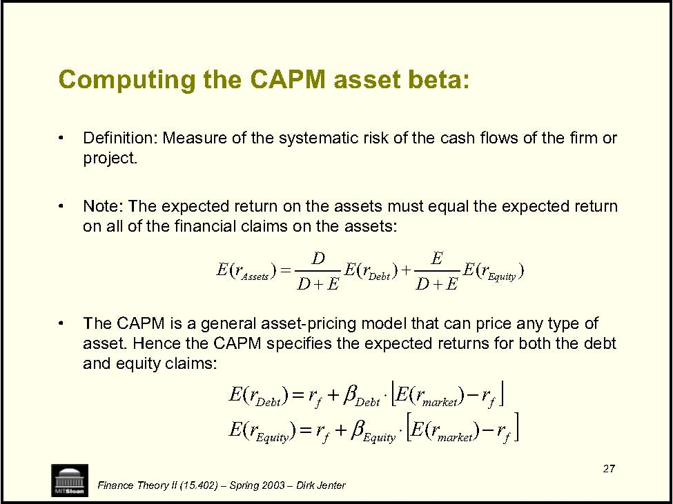

27 Computing the CAPM asset beta: • project. • on all of the financial claims on the assets: • )()()( EquityDebtAssets ED E ED D +++=[][]fmarketEquityfEquity fmarketDebtfDebt rr rr −⋅+=−⋅+=)()( )()( ββFinance Theory II (15.402) – Spring 2003 – Dirk Jenter Definition: Measure of the systematic risk of the cash flows of the firm or Note: The expected return on the assets must equal the expected return The CAPM is a general asset-pricing model that can price any type of asset. Hence the CAPM specifies the expected returns for both the debt and equity claims: r E r E r E r E r E r E r E 

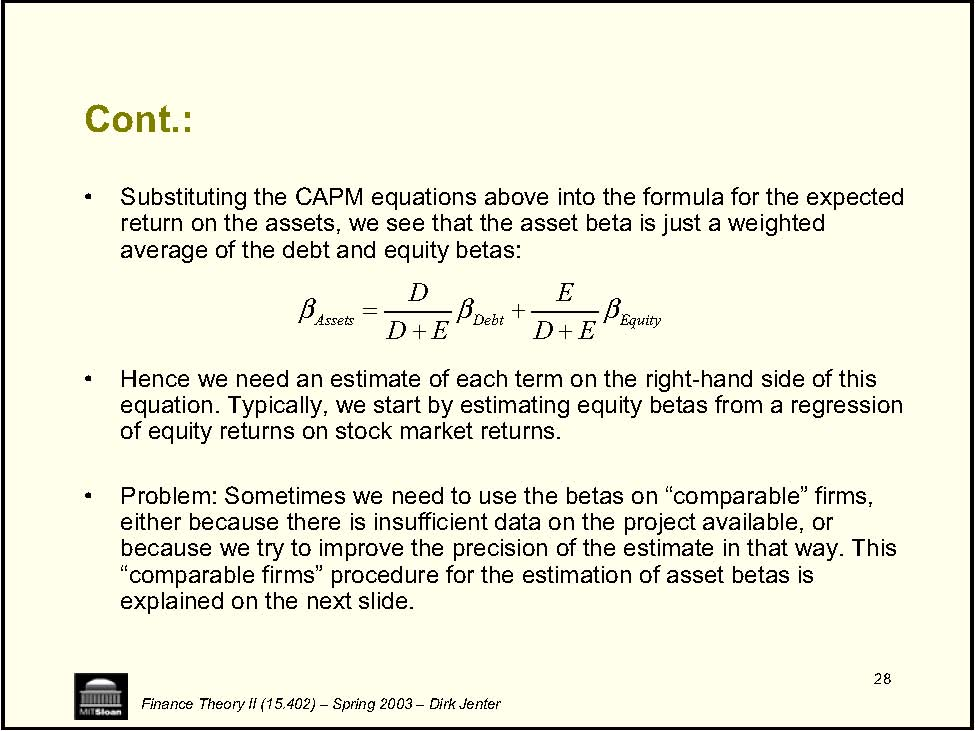

28 Cont.: • • • EquityDebtAssets ED E ED D βββ+++=Finance Theory II (15.402) – Spring 2003 – Dirk Jenter Substituting the CAPM equations above into the formula for the expected return on the assets, we see that the asset beta is just a weighted average of the debt and equity betas: Hence we need an estimate of each term on the right-hand side of this equation. Typically, we start by estimating equity betas from a regression of equity returns on stock market returns. Problem: Sometimes we need to use the betas on “comparable” firms, either because there is insufficient data on the project available, or because we try to improve the precision of the estimate in that way. This “comparable firms” procedure for the estimation of asset betas is explained on the next slide. 

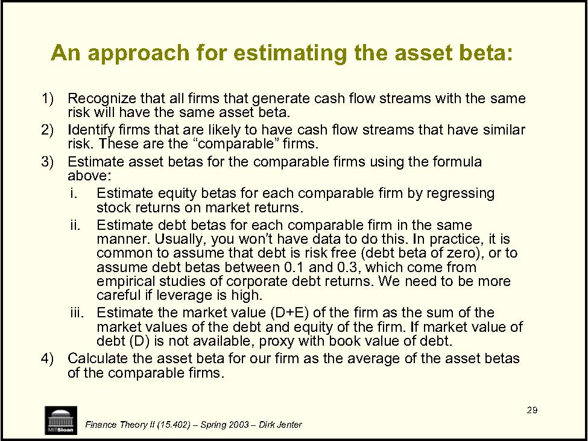

29 An approach for estimating the asset beta: 1) 2) 3) above: i. stock returns on market returns. ii. iii. 4) Calculate the asset beta for our firm as the average of the asset betas of the comparable firms. Finance Theory II (15.402) – Spring 2003 – Dirk Jenter Recognize that all firms that generate cash flow streams with the same risk will have the same asset beta. Identify firms that are likely to have cash flow streams that have similar risk. These are the “comparable” firms. Estimate asset betas for the comparable firms using the formula Estimate equity betas for each comparable firm by regressing Estimate debt betas for each comparable firm in the same manner. Usually, you won’t have data to do this. In practice, it is common to assume that debt is risk free (debt beta of zero), or to assume debt betas between 0.1 and 0.3, which come from empirical studies of corporate debt returns. We need to be more careful if leverage is high. Estimate the market value (D+E) of the firm as the sum of the market values of the debt and equity of the firm. If market value of debt (D) is not available, proxy with book value of debt. 

         Acrobat Distiller 6.0 (Windows)

         Compaq

         Compaq

         Acrobat PDFMaker 6.0 for PowerPoint

         2004-01-22T11:26:16+05:30

         2004-01-22T11:25:14+05:30

         2004-01-22T11:26:16+05:30

         uuid:49d8a18c-cef8-4166-bd5e-68a860cef71c

         uuid:7df98c89-f14b-4ddd-a713-3ef4b3b9d1a6

         xml

               No Slide Title

               Leslie A. Larocca

Valuation

Free Cash Flows

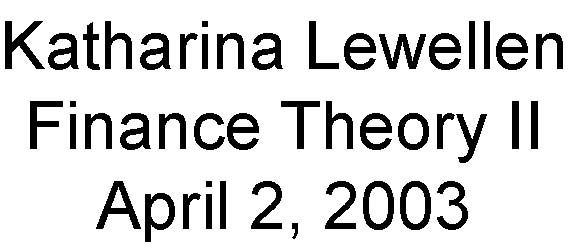

Katharina LewellenFinance Theory IIApril 2, 2003

Valuation Tools

- A key task of managers is to undertake valuation exercises in order to allocate capital between mutually exclusive projects:

- Is project A better than doing nothing?

- Is project A better than project B?

- Is the project’s version A than its modified version A’?

- The process of valuation and ultimately of capital budgeting generally involves many factors, some formal, some not (experience, hard-to-formalize information, politics, etc.).

- We will focus on financial tools for valuation.

Valuation Tools (cont.)

- These tools provide managers with numerical techniques to “keep score” and assist in the decision-making process.

- They build on modern finance theory and deal with cash flows, time, and risk.

- All rely on (often highly) simplified models of the business:

- Technical limitations (less now with computers)

- Versatility

- Understandable and discussible

How to Value a Project/Firm?

- Calculate NPV

- Estimate the expected cash-flows

- Estimate the appropriate discount rate for each cash flow

- Calculate NPV

- Look up the price of a comparable project

- Use alternative criteria (e.g., IRR, payback method)

- You need to be an educated user of these

Comparables method

- Suppose you want to value a private company going public

- EBITDA = $100 million

- For a similar public company P/E = 10

- You value the IPO company at $1,000 million

- What are the implicit assumptions?

- Suppose that P = E / (r –g)

- Then, P/E = 1 / (r –g)

- Thus, we assume that 

- Earnings are expected to grow in perpetuity at a constant rate

- Growth rates and discount rates are the same for both firms

Internal Rate of Return (IRR)

- One-period project

- Investment = 100 at time 0    Payoff = 150 at time 1

Rate of return = 150/100 –1 = 50%

NPV = -100 + 150/discount rate = 0

Discount rate =  150/100 = 50%

- Rate of return is the discount rate that makes NPV = 0

- Multiple period projects

- IRR is the discount rate that makes NPV = 0

0)IRR1(C...)IRR1(CIRR1CINPVTT221o=+++++++=

 opportunity costs of capital">

Basic rule: Chose projects with IRR &gt; opportunity costs of capitBasic rule: Chose projects with IRR &gt; opportunity costs of capitalal

Internal Rate of Return (IRR), cont.

- Suppose you choose among two mutually exclusive projects

- E.g., alternative ways to use a particular piece of land

Project 1: cash flows-10 +20IRR=100%

Project 2: cash flows: -20 +35IRR=75%

- Which project would you choose? (costs of capital = 10%)

- Project 2 because it has a higher NPV

- Other pitfalls (BM, Chapter 5)

- E.g., multiple IRR, lending vs. borrowing.

- Bottom line

- NPV is easier to use than IRR

- If used properly, IRR should give you the same answer as NPV

1. Calculating Cash Flows

The Free Cash Flow (FCF) Approach

- FCF: The expected after tax cash flows of an all equity firm

- These cash flows ignore the tax savings the firm gets from debt financing (the deductibility of interest expense)

- Plan of Attack:

- Step 1: Estimating the Free Cash Flows

- Step 2: Account for the effect of financing on value

- Preview: Two ways to account for tax shield:

- Adjust the discount rate (WACC method).

- Adjust the cash-flow estimate (APV method).

Count allincremental, after-taxcash flows allowing for reasonable inflation.

- All:

- Don’t just look at operating profits in the out years.

- If project requires follow-on CAPX or additional working capital, take these into account.

- After-tax: The rest goes to the IRS.

- Be consistent in your treatment of inflation:

- Discount nominal cash flows at nominal discount rates.

- Reasons:

- Nominal rates reflect inflation in overall economy, but inflation in cash flows may be different.

- In fact, some items in cash flows, e.g., depreciation, may have no inflation.

Treatment of Inflation -Example

- T-Bill rate (nominal) = 8%

- Expected inflation rate = 6%

- Expected real rate = 1.08/1.06 = 1.9%

- Sales of widgets next year = $100 measured in today’s dollars

- You expect that the price of the widgets will go up by 6%

- What’s the PV of the widgets?

nominal cash flows:PV = $100*(1.06)/1.08 = 98.2

real cash flows:PV = $100/(1.08/1.06) = 98.2

Equivalent Expressions for Free Cash Flows (see Finance Theory I)

Note:EBIT = Earnings before interest and taxesEBITD = Earnings before interest and taxes and depreciation = EBIT + DepreciationChange in NWC is sometimes called Investment in NWC.

AssetsNet in  Change  -  EBIT    t)(1FCFNWCin  Change  -  CAPX  -on  Depreciati  t   EBITD    t)(1FCFNWCin  Change  -  CAPX  -on  Depreciati  EBIT    t)(1FCF×−=×+×−=+×−=

Example of Free Cash Flow Calculation

In 1999: FCF = EBIT*(1-t) + Depreciation -CAPX -Change in NWC

EBIT = 1,200 -850 -35 = 315;  Ch. NWC = (60+60-25) -(50+50-20) = 15

FCF = 315 * (1-.38) + 35 -40 -15 = 175.3

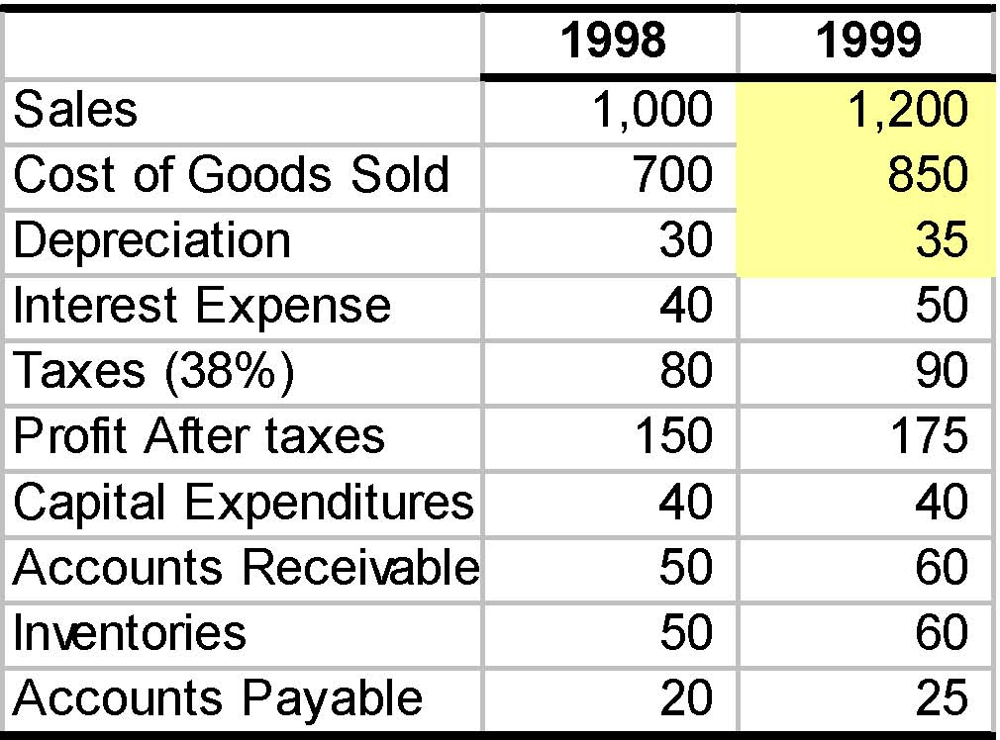

19981999Sales1,000      1,200      Cost of Goods Sold700         850         Depreciation30          35          Interest Expense40          50          Taxes (38%)80          90          Profit After taxes150         175         Capital Expenditures40          40          Accounts Receivable50          60          Inventories50          60          Accounts Payable20          25          

Beware!

- Note:

- We ignored interest payments

- We computed taxes on EBIT

- Do not take the effect of financing (e.g., interest) into account at this stage.

- Remember our plan:

- First, determine the expected cash-flows as if the project were 100% equity financed.

- Later, we will adjust for financing.

- If you count financing costs in cash-flow, you count them twice.

TW Example

- XYZ, a profitable widget producer ($100M annual after-tax profit) contemplates introducing new Turbo Widgets (TWs), developed in its labs at an R&amp;D cost of $1M over the past 3 years.

- New plant to produce TW would

- cost $20M today

- last 10 years with salvage value of $5M

- be depreciated to $0 over 5 years using straight-line

- TWsneed painting: Use 40% of the capacity of a painting machine

- currently owned and used by XYZ at 30% capacity

- with maintenance costs of $100,000 (regardless of capacity used)

- Annual

- operating costs: $400,000

- operating income generated: $42M

- operating income of regular widgets would decrease by $2M

- Working capital (WC): $2M needed over the life of the project

- Corporate tax rate 36%

TW Example (cont.)

- Ignore the $100M after-tax profit and focus on incremental cash-flows

- R&amp;D cost of $1M over the past three years: Sunk cost ==&gt; Ignore it

- The plant’s $20M cost: It’s a CAPX ==&gt; Count it

- Machine’s $100K maintenance cost: Not incremental ==&gt; Ignore it

- Incurred with or without TW production

- True even if accounting charges TW production a fraction of these

- Op. income of regular widgets decrease by $2M due to cannibalization

- Would not occur without TW production

- It is an opportunity cost ==&gt; Count it

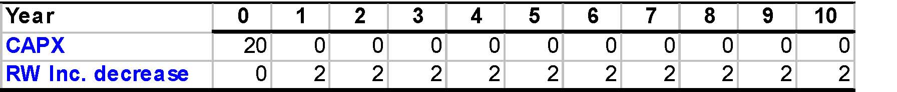

Year012345678910CAPX200000000000RW Inc. decrease02222222222

Use Incremental Cash Flows

- Compare firm value with and without the project

V(project) = V(firm w/ project)  -V(firm w/o project) 

- Use only cash flows (in and out) attributable to the project

- Sunk costsshould be ignored

- They are spent w/ or w/o the project (bygones are bygones).

- Opportunity costsshould be accounted for

- A project might exclude good alternatives (e.g., use of land).

- Accounting illusions should be avoided

- e.g. the project might be “charged” for a fraction of expenses that would be incurred anyway.

Use After-tax Cash Flows

- These are what you have left after paying capital suppliers

- Make sure to count the benefits of expensing, depreciation, etc.

- CAPX and Depreciation:

- CAPX are not directly subtracted from taxable income

- Instead, a fraction of CAPX (depreciation) is subtracted over a number of years

TW Example (cont.)

- Depreciation:

- Straight line depreciation: Flat annual depreciation

- Accelerated depreciation: Decreasing

- $20M CAPX is depreciated linearly over 5 years, down to zero.

D = (20 -0) / 5 = $4M

- Salvage value $5M is fully taxable since book value is zero.

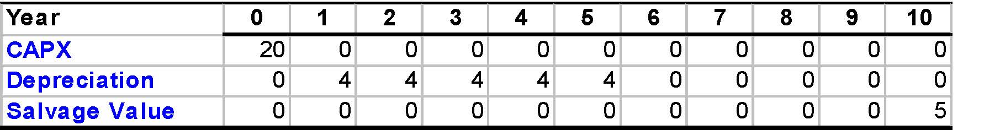

Year012345678910CAPX200000000000Depreciation04444400000Salvage Value00000000005

TW Example (cont.)

Note:We do as if entire EBIT is taxable ==&gt; We ignore (for now) the fact that interest payments are not taxable.

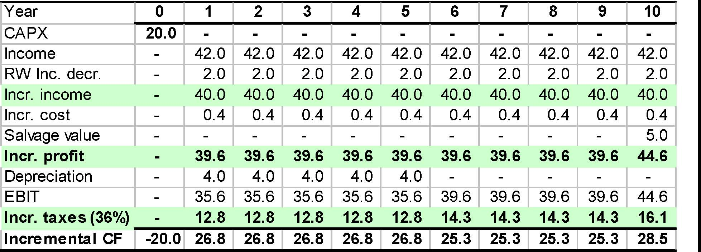

Year012345678910CAPX20.0 -   -   -   -   -   -   -   -   -   -   Income-   42.0 42.0 42.0 42.0 42.0 42.0 42.0 42.0 42.0 42.0 RW Inc. decr.-   2.0   2.0   2.0   2.0   2.0   2.0   2.0   2.0   2.0   2.0   Incr. income-   40.0 40.0 40.0 40.0 40.0 40.0 40.0 40.0 40.0 40.0 Incr. cost-   0.4   0.4   0.4   0.4   0.4   0.4   0.4   0.4   0.4   0.4   Salvage value-   -   -   -   -   -   -   -   -   -   5.0   Incr. profit-   39.6 39.6 39.6 39.6 39.6 39.6 39.6 39.6 39.6 44.6 Depreciation-   4.0   4.0   4.0   4.0   4.0   -   -   -   -   -   EBIT-   35.6 35.6 35.6 35.6 35.6 39.6 39.6 39.6 39.6 44.6 Incr. taxes (36%)-   12.8 12.8 12.8 12.8 12.8 14.3 14.3 14.3 14.3 16.1 Incremental CF-20.026.8 26.8 26.8 26.8 26.8 25.3 25.3 25.3 25.3 28.5 

So far (but we’re not done yet):

Example:We could have computed the CF in year 1 as

(1 -36%) * 39.6  + 36% *  4  -0 = $26.8M

CF = Incr. Profit –Taxes –CAPX

= Incr. Profit –t * (Incr. Profit –Depr.) –CAPX

= (1 –t) * Incr. Profit + t * Depr. –CAPX

Changes in (Net) Working Capital

Remark 1:

- Many projects need some capital to be tied up (working capital) which constitutes an opportunity cost.

- We need the Change in Working Capital implied by the project.

Remark 2:

- Accounting measure of earnings

Sales -Cost of Goods Sold

- Income and expense are reported when a sale is declared.

- COGS in 2000 includes the costs of items sold in 2000 even if the cost was incurred in 1999 or hasn’t been incurred yet.

- Sales in 2000 include the income from items sold in 2000 even ifthe payment has not been received yet.

Working Capital = Inventory + A/R -A/P

TW Example (cont.)

Year012345678910CAPX20.0 -   -   -   -   -   -   -   -   -   -   Incr. profit-   39.6 39.6 39.6 39.6 39.6 39.6 39.6 39.6 39.6 44.6 Incr. taxes (36%)-   12.8 12.8 12.8 12.8 12.8 14.3 14.3 14.3 14.3 16.1 NWC2.0   2.0   2.0   2.0   2.0   2.0   2.0   2.0   2.0   2.0   -   Change in NWC2.0   -   -   -   -   -   -   -   -   -   -2.0Total-22.026.826.826.826.826.825.325.325.325.330.5

Putting It All Together

FCF = (1 –t) * Incr. Profit + t * Depr. –CAPX –∆NWC

This can also be rewritten as

FCF = (1 –t) * EBIT + Depr. –CAPX –∆NWC

Finding the Value of the Cash Flows

- We know how to find the expected free cash flows

- We need to find the appropriate discount ratefor a project

- We need to account for the tax benefits of interest payments

- Ignore this for now, and assume that the project is 100% equity financed

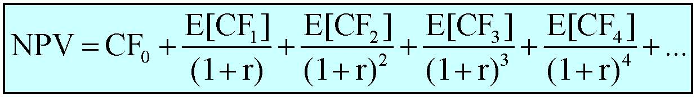

...r)(1]E[CFr)(1]E[CFr)(1]E[CFr)(1]E[CFCF  NPV44332210+++++++++=

Decision RuleAccept any project with positive NPV.  The NPV tells you how much value the project creates.

What is the appropriate discount rate for a project?

- The discount rate is the opportunity cost of capitalfor the project.

- It answers the question:  What rate can investors earn on an investments with comparable risk?

- What does comparable risk mean?

Using the CAPM

- What does ‘comparable risk’ mean?

- CAPM:  risk = β

- How does risk translate into a discount rate?

- CAPM:  E[rE] = rf+ βEE[RM–rf]

- Practical issues

- Estimating betas

- Estimating the market risk premium

- Leverage

Beta = regression slope-25%-17%-8%0%8%17%25%-30%-20%-10%0%10%20%30%

Leverage, returns, and risk 

Firm is a portfolio of debt and equityAssetsAssetsDebtEquityLiab&amp; Eq

Therefore …

rA=EDr AE  r AD+

andβA=ED AE   ADβ+β

Estimating Betas

- Equity Beta

- Simply regress past stock returns on the market return

- Asset Beta

- For an all-equity firm, equity beta = asset beta

- How about levered firms?

- Hint:

- You can view the firm as a portfolio of debt and equity

- Recall: portfolio beta = weighted average of individual asset betas

- Question: What are the appropriate weights?

- You can assume that debt is risk-free or that debt beta is between 0.1 and 0.3 (based on empirical studies)

         Acrobat Distiller 6.0 (Windows)

         2004-01-21T10:32:11+05:30

         2004-01-21T10:33:41+05:30

         2004-01-21T10:33:41+05:30

         PScript5.dll Version 5.2

         uuid:f4d8163f-e194-4814-9bfe-c71dba228554

         uuid:0ee6a801-b3f6-40c8-96b6-9f476dccf5c7

         xml

               djenter

               Microsoft PowerPoint - LN14_15(WACC_APV)_shortened.ppt

1 Finance Theory II (15.402) – Spring 2003 – Dirk Jenter WACC and APV 

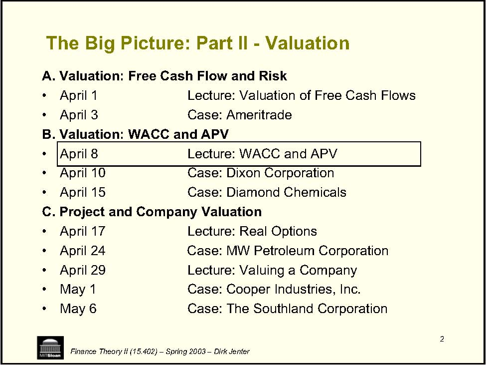

2 • • • • • • • • • • Finance Theory II (15.402) – Spring 2003 – Dirk Jenter The Big Picture: Part II -Valuation A. Valuation: Free Cash Flow and Risk April 1 Lecture: Valuation of Free Cash Flows April 3 Case: Ameritrade B. Valuation: WACC and APV April 8 Lecture: WACC and APV April 10 Case: Dixon Corporation April 15 Case: Diamond Chemicals C. Project and Company Valuation April 17 Lecture: Real Options April 24 Case: MW Petroleum Corporation April 29 Lecture: Valuing a Company May 1 Case: Cooper Industries, Inc. May 6 Case: The Southland Corporation 

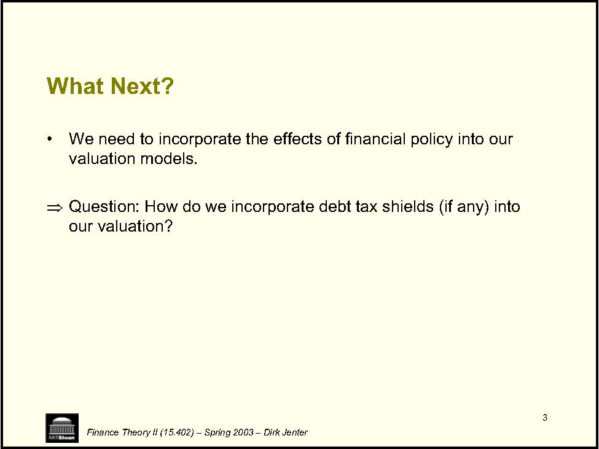

3 Finance Theory II (15.402) – Spring 2003 – Dirk Jenter What Next? • We need to incorporate the effects of financial policy into our valuation models. Ÿ Question: How do we incorporate debt tax shields (if any) into our valuation? 

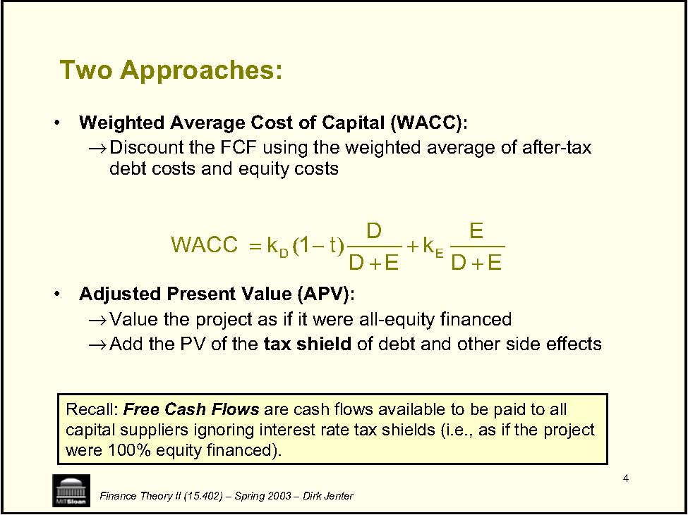

4 Finance Theory II (15.402) – Spring 2003 – Dirk Jenter Two Approaches: • Weighted Average Cost of Capital (WACC): →Discount the FCF using the weighted average of after-tax debt costs and equity costs • Adjusted Present Value (APV): →Value the project as if it were all-equity financed →Add the PV of the tax shield of debt and other side effects ED E k ED D t1kWACC ED +++−=)( Recall:Recall: Free Cash Flows are cash flows available to be paid to all capital suppliers ignoring interest rate tax shields (i.e., as if the project were 100% equity financed). 

WACC Finance Theory II (15.402) – Spring 2003 – Dirk Jenter 

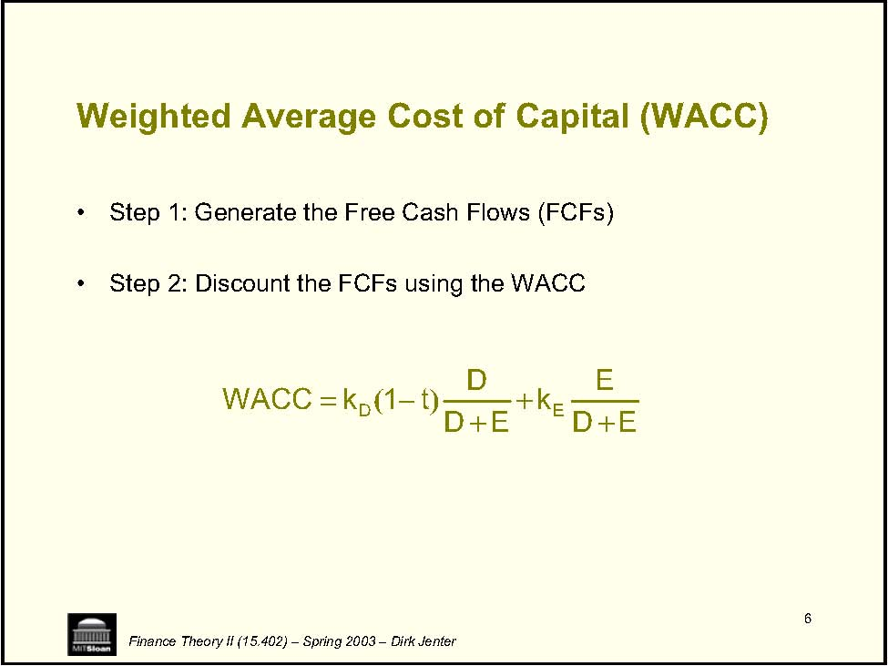

6 Weighted Average Cost of Capital (WACC) • • ED E k ED D t1kWACC ED +++−=)( Finance Theory II (15.402) – Spring 2003 – Dirk Jenter Step 1: Generate the Free Cash Flows (FCFs) Step 2: Discount the FCFs using the WACC 

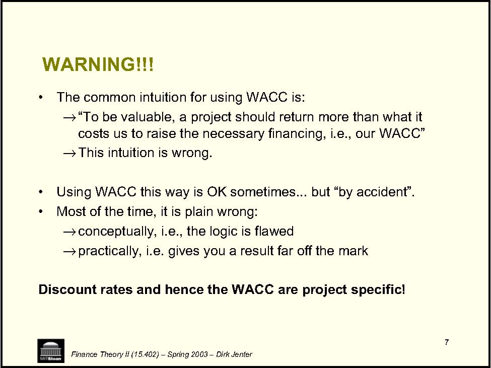

7 WARNING!!! • →→This intuition is wrong. • • →→Finance Theory II (15.402) – Spring 2003 – Dirk Jenter The common intuition for using WACC is: “To be valuable, a project should return more than what it costs us to raise the necessary financing, i.e., our WACC” Using WACC this way is OK sometimes... but “by accident”. Most of the time, it is plain wrong: conceptually, i.e., the logic is flawed practically, i.e. gives you a result far off the mark Discount rates and hence the WACC are project specific! 

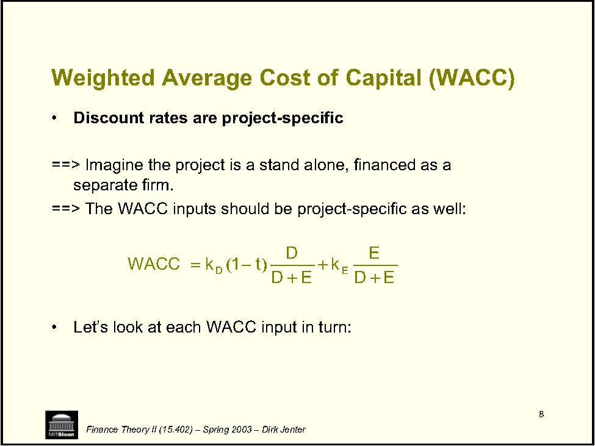

8 Weighted Average Cost of Capital (WACC) • separate firm. • ED E k ED D t1kWACC ED +++−=)( Finance Theory II (15.402) – Spring 2003 – Dirk Jenter Discount rates are project-specific ==&gt; Imagine the project is a stand alone, financed as a ==&gt; The WACC inputs should be project-specific as well: Let’s look at each WACC input in turn: 

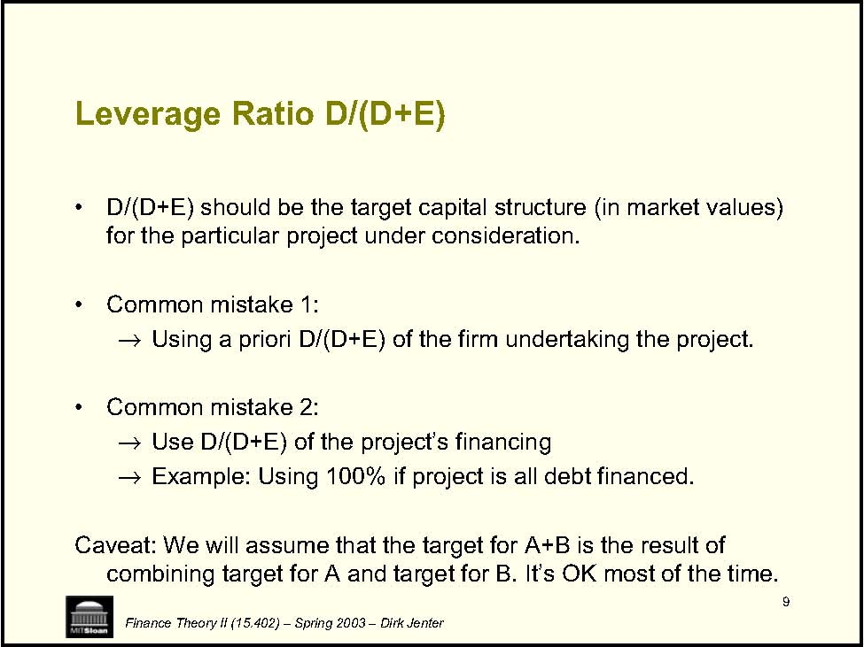

9 Leverage Ratio D/(D+E) • • →• →→Finance Theory II (15.402) – Spring 2003 – Dirk Jenter D/(D+E) should be the target capital structure (in market values)  for the particular project under consideration. Common mistake 1: Using a priori D/(D+E) of the firm undertaking the project. Common mistake 2: Use D/(D+E) of the project’s financing Example: Using 100% if project is all debt financed. Caveat: We will assume that the target for A+B is the result of combining target for A and target for B. It’s OK most of the time. 

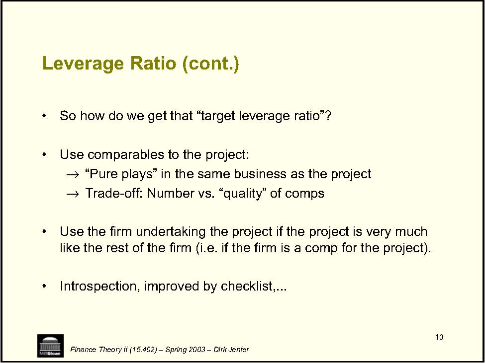

10 Leverage Ratio (cont.) • • →→• • Finance Theory II (15.402) – Spring 2003 – Dirk Jenter So how do we get that “target leverage ratio”? Use comparables to the project: “Pure plays” in the same business as the project Trade-off: Number vs. “quality” of comps Use the firm undertaking the project if the project is very much like the rest of the firm (i.e. if the firm is a comp for the project). Introspection, improved by checklist,... 

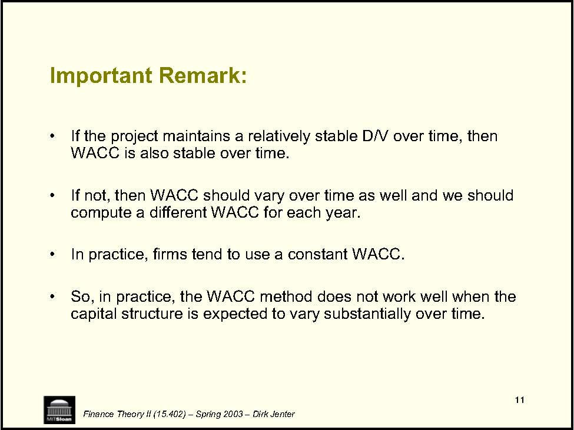

11 • • • • Finance Theory II (15.402) – Spring 2003 – Dirk Jenter Important Remark: If the project maintains a relatively stable D/V over time, then WACC is also stable over time. If not, then WACC should vary over time as well and we should compute a different WACC for each year. In practice, firms tend to use a constant WACC. So, in practice, the WACC method does not work well when the capital structure is expected to vary substantially over time. 

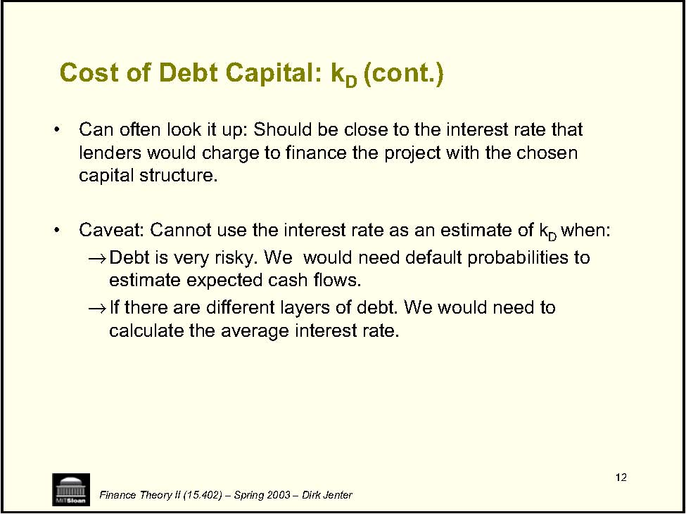

12 Cost of Debt Capital: kD (cont.) • j• D →→Finance Theory II (15.402) – Spring 2003 – Dirk Jenter Can often look it up: Should be close to the interest rate that lenders would charge to finance the proect with the chosen capital structure. Caveat: Cannot use the interest rate as an estimate of kwhen: Debt is very risky. We  would need default probabilities to estimate expected cash flows. If there are different layers of debt. We would need to calculate the average interest rate. 

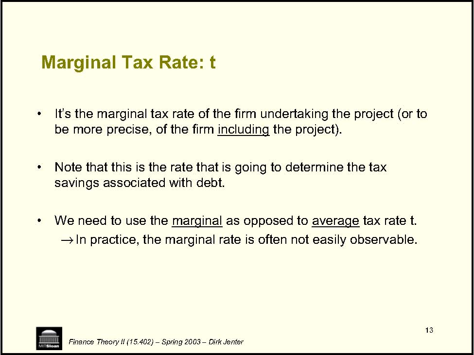

13 Marginal Tax Rate: t • • • →Finance Theory II (15.402) – Spring 2003 – Dirk Jenter It’s the marginal tax rate of the firm undertaking the project (or to be more precise, of the firm including the project). Note that this is the rate that is going to determine the tax savings associated with debt. We need to use the marginal as opposed to average tax rate t. In practice, the marginal rate is often not easily observable. 

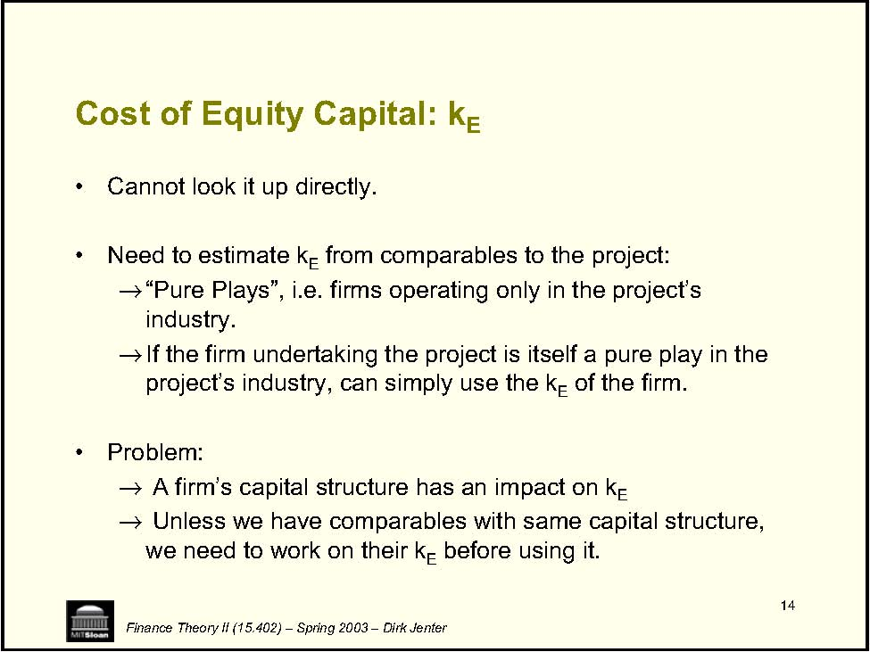

14 E • • E →→E of the firm. • →E →E before using it. Finance Theory II (15.402) – Spring 2003 – Dirk Jenter Cost of Equity Capital: kCannot look it up directly. Need to estimate kfrom comparables to the project: “Pure Plays”, i.e. firms operating only in the project’s industry. If the firm undertaking the project is itself a pure play in the project’s industry, can simply use the kProblem: A firm’s capital structure has an impact on kUnless we have comparables with same capital structure, we need to work on their k

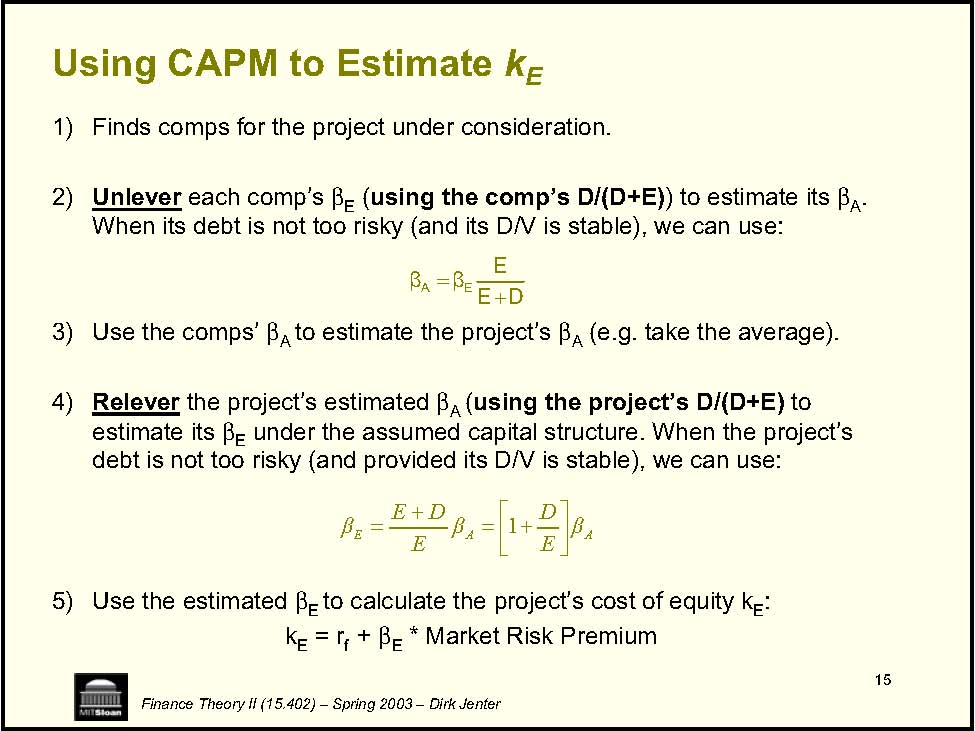

15 Using CAPM to Estimate kE 1) 2) βE (βA. 3) βA to estimate the project’s βA 4) βA (to estimate its βE 5) Use the estimated βE E: kE = rf + βE * Market Risk Premium DE Eȕȕ EA +=AAE ȕ E Dȕ E DEȕ»¼º «¬ª +=+=1 Finance Theory II (15.402) – Spring 2003 – Dirk Jenter Finds comps for the project under consideration. Unlever each comp’s using the comp’s D/(D+E)) to estimate its When its debt is not too risky (and its D/V is stable), we can use: Use the comps’ (e.g. take the average). Relever the project’s estimated using the project’s D/(D+E) under the assumed capital structure. When the project’s debt is not too risky (and provided its D/V is stable), we can use: to calculate the project’s cost of equity k

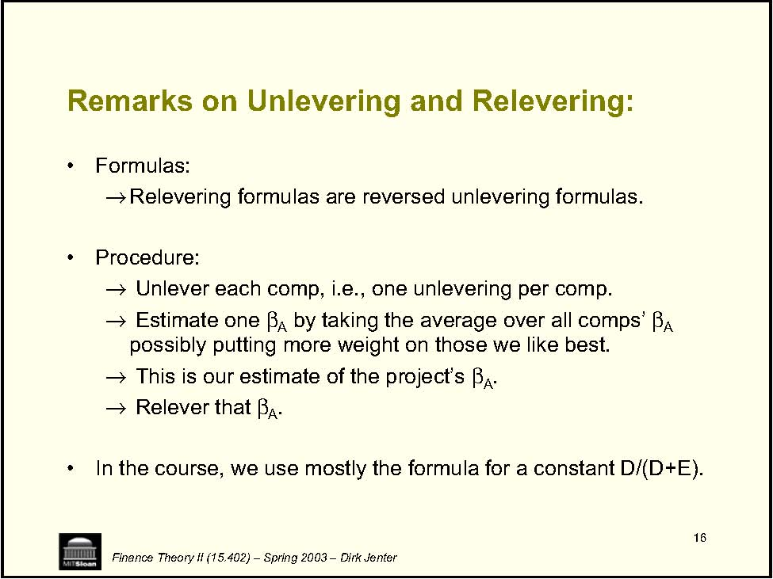

16 →• →→Estimate one βA βA →βA. →Relever that βA. • Finance Theory II (15.402) – Spring 2003 – Dirk Jenter Remarks on Unlevering and Relevering: •Formulas: Relevering formulas are reversed unlevering formulas. Procedure: Unlever each comp, i.e., one unlevering per comp. by taking the average over all comps’ possibly putting more weight on those we like best. This is our estimate of the project’s In the course, we use mostly the formula for a constant D/(D+E). 

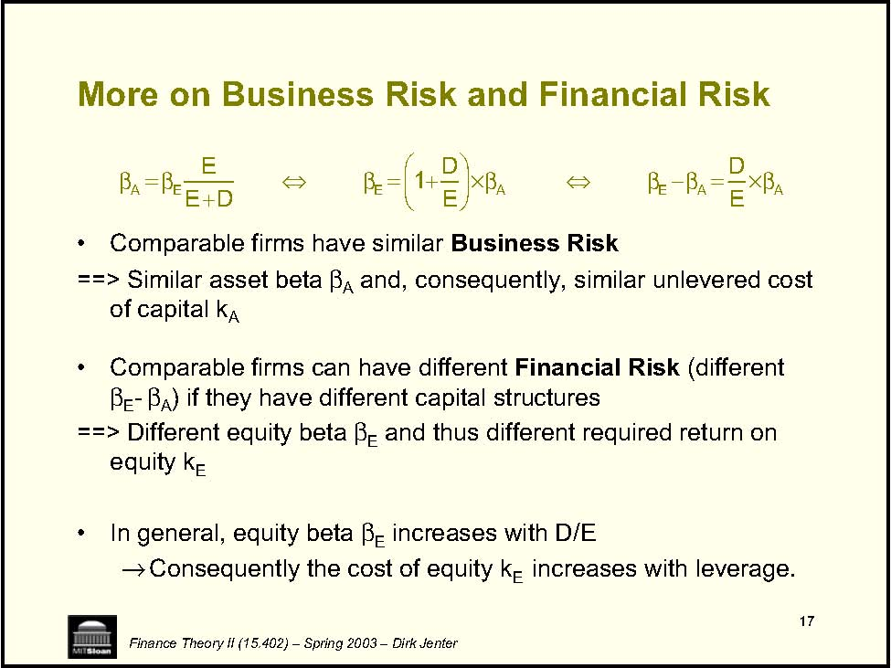

17 • ==&gt; Similar asset beta βA of capital kA • βE -βAβE equity kE • βE →E β×=β−β⇔β׸¹· ¨ © § +=β⇔+β=βAAEAEEA E D E D 1 DE E Finance Theory II (15.402) – Spring 2003 – Dirk Jenter More on Business Risk and Financial Risk Comparable firms have similar Business Risk and, consequently, similar unlevered cost Comparable firms can have different Financial Risk (different ) if they have different capital structures ==&gt; Different equity beta and thus different required return on In general, equity beta increases with D/E Consequently the cost of equity kincreases with leverage. 

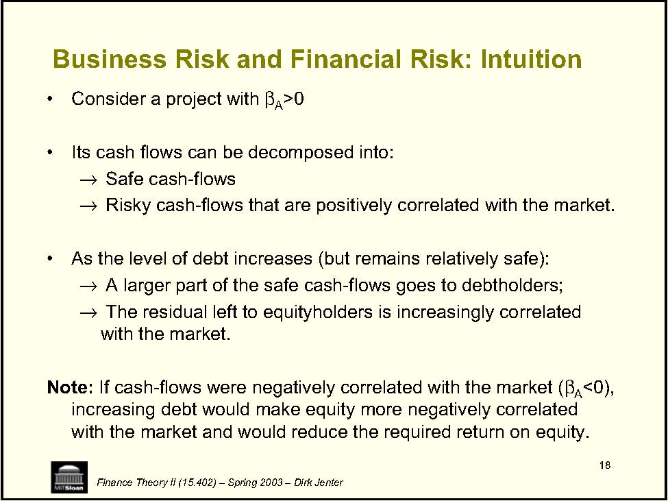

18 Business Risk and Financial Risk: Intuition • βA&gt;0 • →Safe cash-flows →• →→βAFinance Theory II (15.402) – Spring 2003 – Dirk Jenter Consider a project with Its cash flows can be decomposed into: Risky cash-flows that are positively correlated with the market. As the level of debt increases (but remains relatively safe): A larger part of the safe cash-flows goes to debtholders; The residual left to equityholders is increasingly correlated with the market. Note: If cash-flows were negatively correlated with the market (&lt;0), increasing debt would make equity more negatively correlated with the market and would reduce the required return on equity. 

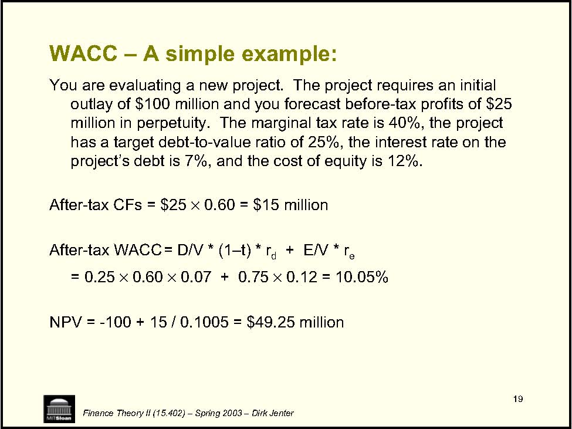

19 million in perpetuity. ×After-tax WACC d + e = 0.25 ××+ ×Finance Theory II (15.402) – Spring 2003 – Dirk Jenter WACC – A simple example: You are evaluating a new project.  The project requires an initial outlay of $100 million and you forecast before-tax profits of $25 The marginal tax rate is 40%, the project has a target debt-to-value ratio of 25%, the interest rate on the project’s debt is 7%, and the cost of equity is 12%. After-tax CFs = $25 0.60 = $15 million = D/V * (1–t) * rE/V * r0.60 0.07  0.75 0.12 = 10.05% NPV = -100 + 15 / 0.1005 = $49.25 million 

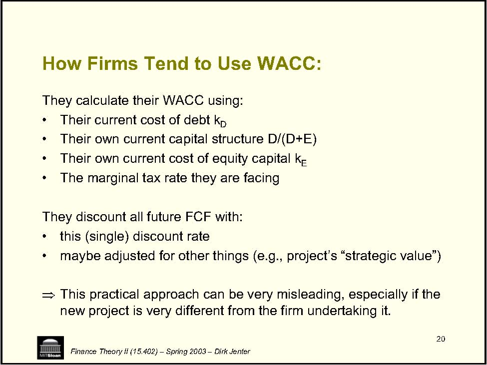

20 How Firms Tend to Use WACC: • D • • E • They discount all future FCF with: • • Ÿ Finance Theory II (15.402) – Spring 2003 – Dirk Jenter They calculate their WACC using: Their current cost of debt kTheir own current capital structure D/(D+E) Their own current cost of equity capital kThe marginal tax rate they are facing this (single) discount rate maybe adjusted for other things (e.g., project’s “strategic value”) This practical approach can be very misleading, especially if the new project is very different from the firm undertaking it. 

Selected Industry Capital Structures, Betas, and WACCs 

<Table>
<TR>
<TH>Industry </TH>
<TH>Debt ratio (%) </TH>
<TH>Equity beta </TH>
<TH>Asset beta </TH>
<TH>WACC (%) </TH>
</TR>
<TR>
<TH>Electric and Gas </TH>
<TD>43.2 </TD>
<TD>0.58 </TD>
<TD>0.33 </TD>
<TD>8.1% </TD>
</TR>
<TR>
<TH>Food production </TH>
<TD>22.90 </TD>
<TD>0.85 </TD>
<TD>0.66 </TD>
<TD>11.0% </TD>
</TR>
<TR>
<TH>Paper and plastic </TH>
<TD>30.40 </TD>
<TD>1.03 </TD>
<TD>0.72 </TD>
<TD>11.4% </TD>
</TR>
<TR>
<TH>Equipment </TH>
<TD>19.10 </TD>
<TD>1.02 </TD>
<TD>0.83 </TD>
<TD>12.4% </TD>
</TR>
<TR>
<TH>Retailers </TH>
<TD>21.70 </TD>
<TD>1.19 </TD>
<TD>0.93 </TD>
<TD>13.2% </TD>
</TR>
<TR>
<TH>Chemicals </TH>
<TD>17.30 </TD>
<TD>1.34 </TD>
<TD>1.11 </TD>
<TD>14.7% </TD>
</TR>
<TR>
<TH>Computer software </TH>
<TD>3.50 </TD>
<TD>1.33 </TD>
<TD>1.28 </TD>
<TD>16.2% </TD>
</TR>
<TR>

</TR>
<TR>
<TH>Average of all industries </TH>
<TD>21.50 </TD>
<TD>1.04 </TD>
<TD>0.82 </TD>
<TD>12.3% </TD>
</TR>
<TR>

</TR>
<TR>
<TH>Assumptions: Risk-free rate 6%; market risk premium 8%; cost of debt 7.5%; tax rate 35% </TH>
</TR>
</Table>

Finance Theory II (15.402) – Spring 2003 – Dirk Jenter 

APV Finance Theory II (15.402) – Spring 2003 – Dirk Jenter 

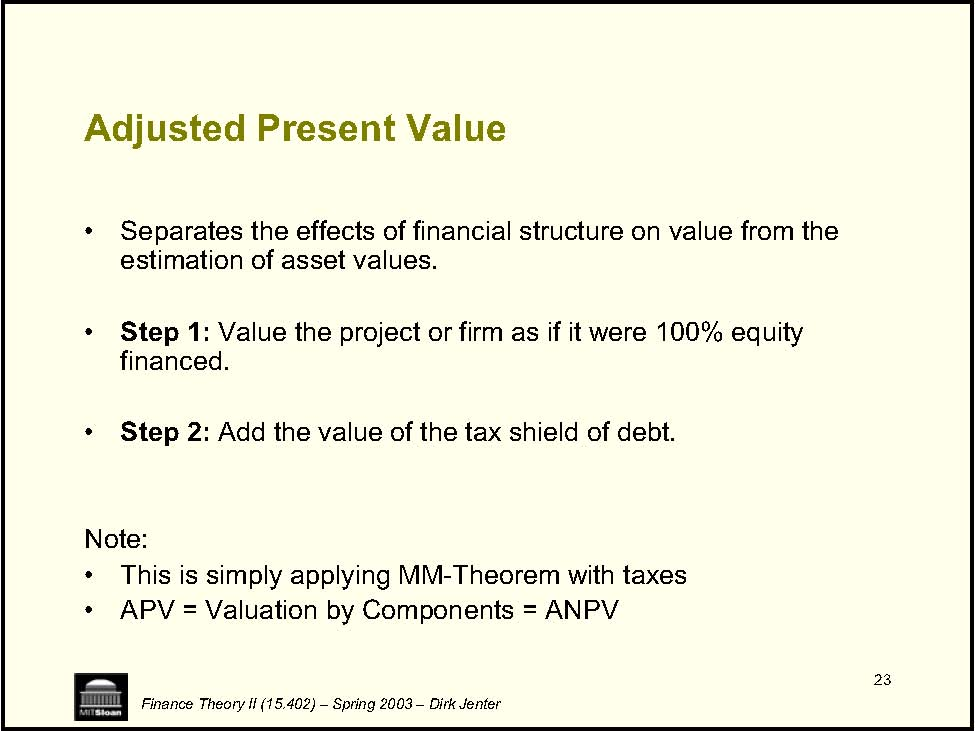

23 Adjusted Present Value • • Step 1: financed. • Step 2: Note: • • Finance Theory II (15.402) – Spring 2003 – Dirk Jenter Separates the effects of financial structure on value from the estimation of asset values. Value the project or firm as if it were 100% equity Add the value of the tax shield of debt. This is simply applying MM-Theorem with taxes APV = Valuation by Components = ANPV 

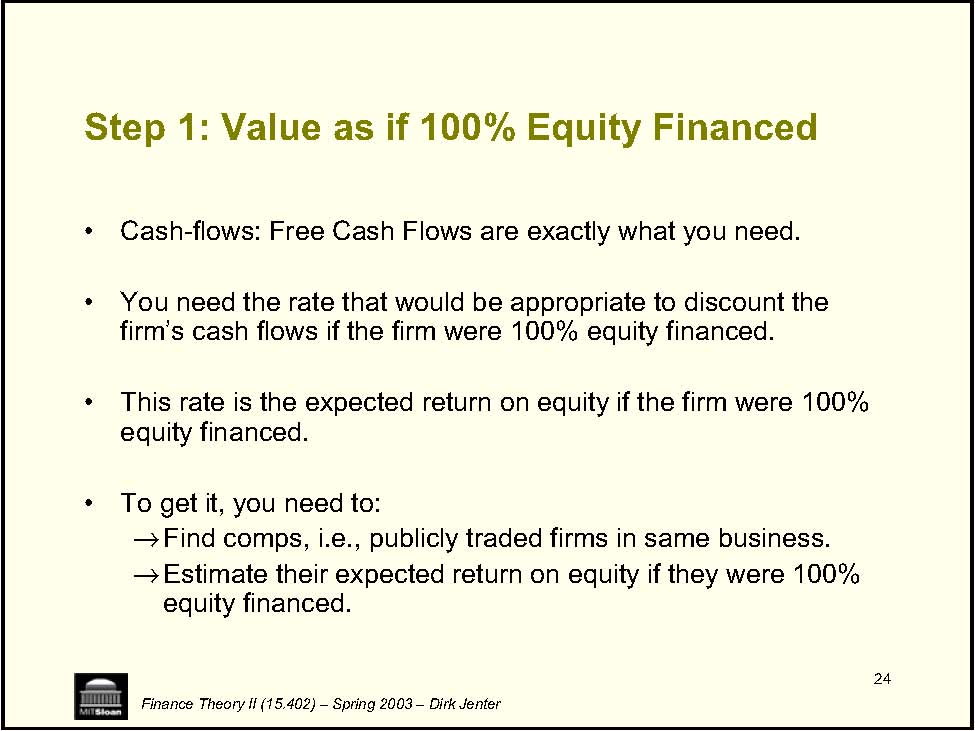

24 • • • equity financed. • →→equity financed. Finance Theory II (15.402) – Spring 2003 – Dirk Jenter Step 1: Value as if 100% Equity Financed Cash-flows: Free Cash Flows are exactly what you need. You need the rate that would be appropriate to discount the firm’s cash flows if the firm were 100% equity financed. This rate is the expected return on equity if the firm were 100% To get it, you need to: Find comps, i.e., publicly traded firms in same business. Estimate their expected return on equity if they were 100% 

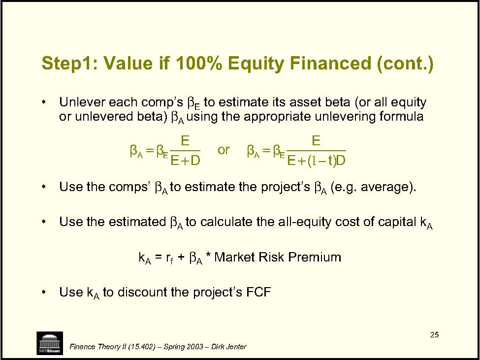

25 • βE βA • βA βA • βA A kA = rf + βA A (E Eȕȕor DE Eȕȕ EAEA −+=+=1 Finance Theory II (15.402) – Spring 2003 – Dirk Jenter Step1: Value if 100% Equity Financed (cont.) Unlever each comp’s to estimate its asset beta (or all equity or unlevered beta) using the appropriate unlevering formula Use the comps’ to estimate the project’s (e.g. average). Use the estimated to calculate the all-equity cost of capital k* Market Risk Premium •Use kto discount the project’s FCF D) t 

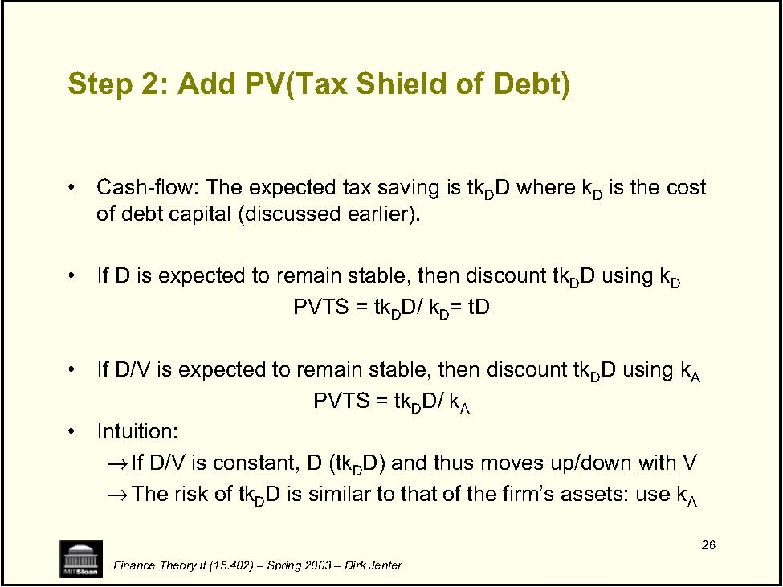

26 Step 2: Add PV(Tax Shield of Debt) • DD • DD using kD PVTS = tkDD• DA PVTS = tkDA • →D→DA Finance Theory II (15.402) – Spring 2003 – Dirk Jenter Cash-flow: The expected tax saving is tkD where kis the cost of debt capital (discussed earlier). If D is expected to remain stable, then discount tkD/ k= tD If D/V is expected to remain stable, then discount tkD using kD/ kIntuition: If D/V is constant, D (tkD) and thus moves up/down with V The risk of tkD is similar to that of the firm’s assets: use k

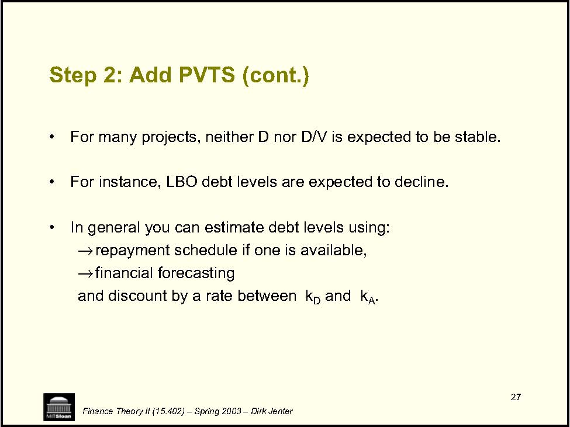

27 Step 2: Add PVTS (cont.) • j• • →→kD kA. Finance Theory II (15.402) – Spring 2003 – Dirk Jenter For many proects, neither D nor D/V is expected to be stable. For instance, LBO debt levels are expected to decline. In general you can estimate debt levels using: repayment schedule if one is available, financial forecasting and discount by a rate between  and  

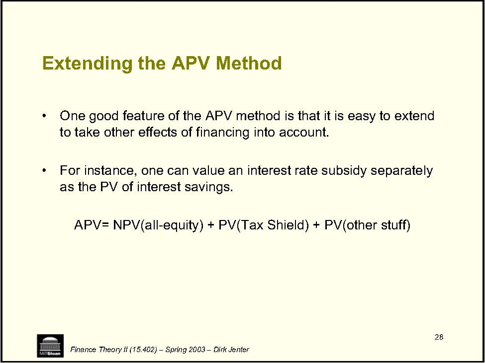

28 Extending the APV Method • • Finance Theory II (15.402) – Spring 2003 – Dirk Jenter One good feature of the APV method is that it is easy to extend to take other effects of financing into account. For instance, one can value an interest rate subsidy separately as the PV of interest savings. APV= NPV(all-equity) + PV(Tax Shield) + PV(other stuff) 

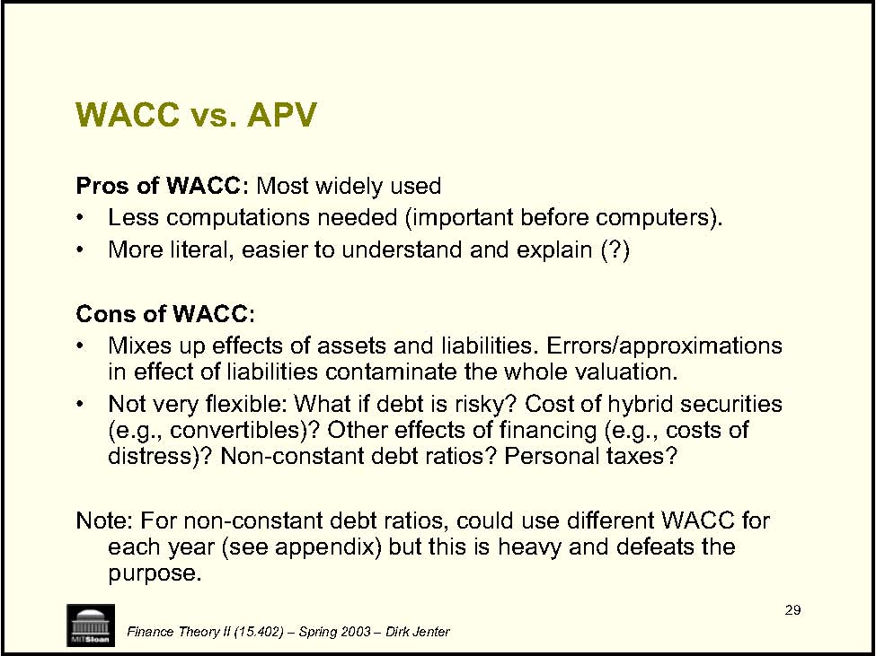

29 WACC vs. APV • • • • distress)? Non-constant debt ratios? Personal taxes? Finance Theory II (15.402) – Spring 2003 – Dirk Jenter Pros of WACC: Most widely used Less computations needed (important before computers). More literal, easier to understand and explain (?) Cons of WACC: Mixes up effects of assets and liabilities. Errors/approximations in effect of liabilities contaminate the whole valuation. Not very flexible: What if debt is risky? Cost of hybrid securities (e.g., convertibles)? Other effects of financing (e.g., costs of Note: For non-constant debt ratios, could use different WACC for each year (see appendix) but this is heavy and defeats the purpose. 

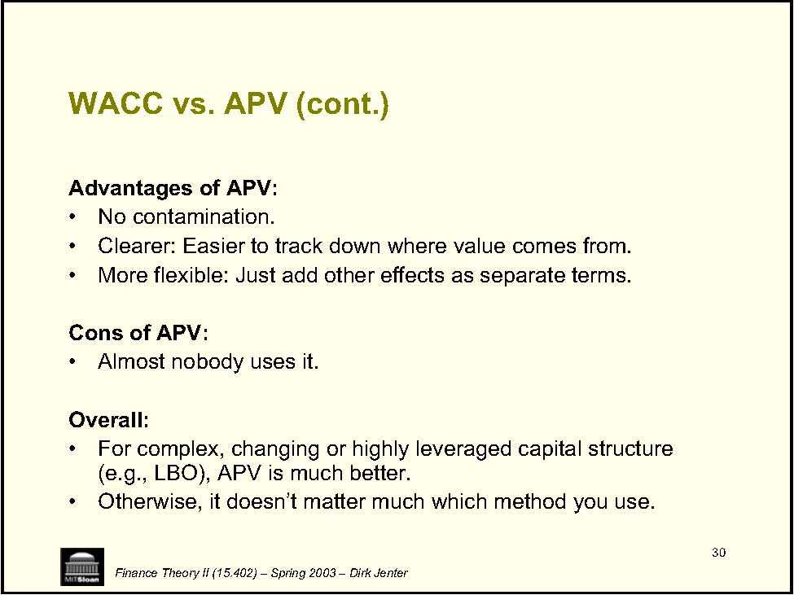

30 WACC vs. APV (cont.) • • • • • • Finance Theory II (15.402) – Spring 2003 – Dirk Jenter Advantages of APV: No contamination. Clearer: Easier to track down where value comes from. More flexible: Just add other effects as separate terms. Cons of APV: Almost nobody uses it. Overall: For complex, changing or highly leveraged capital structure (e.g., LBO), APV is much better. Otherwise, it doesn’t matter much which method you use. 

Finance Theory II (15.402) – Spring 2003 – Dirk Jenter Appendix I -Relation to MM Theorem 

32 Relation to MM Theorem • • • not depend on it. [][]ȕr ED Eȕ ED Dȕr ED Eȕr ED Dȕr ED E k ED D kWACC Af EDf EfDf ED ⋅+=⋅»¼º «¬ª ++++=+⋅+++⋅+=+++=Finance Theory II (15.402) – Spring 2003 – Dirk Jenter Without taxes, WACC is independent of leverage. Indeed, for simplicity, think in terms of CAPM (although the result does not rely on CAPM being true). The last expressions does not contain leverage – WACC does Prem. Mkt Prem. Mkt Prem. Mkt Prem. Mkt 

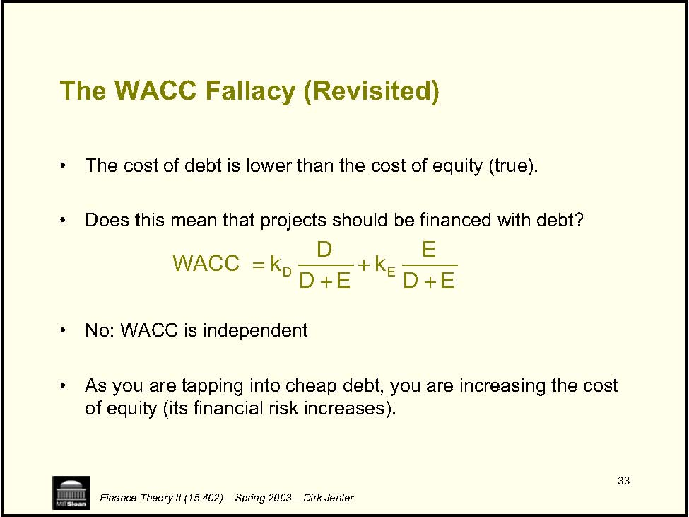

33 Finance Theory II (15.402) – Spring 2003 – Dirk Jenter The WACC Fallacy (Revisited) • The cost of debt is lower than the cost of equity (true). • Does this mean that projects should be financed with debt? • No: WACC is independent • As you are tapping into cheap debt, you are increasing the cost of equity (its financial risk increases). ED E k ED D kWACC ED +++=

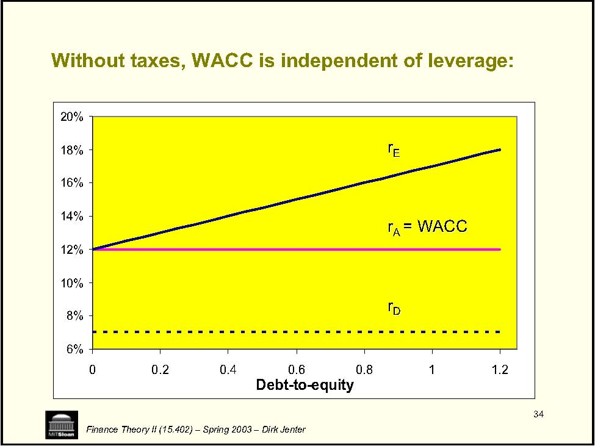

34 Finance Theory II (15.402) – Spring 2003 – Dirk Jenter Without taxes, WACC is independent of leverage: 6% 8% 10% 12% 14% 16% 18% 20% 0 0.2 0.4 0.6 0.8 1 1.2 Debt-to-equity rrDDrrEErrAA= WACC= WACC

         Acrobat Distiller 6.0 (Windows)

         Compaq

         Compaq

         Acrobat PDFMaker 6.0 for PowerPoint

         2004-01-22T11:27:48+05:30

         2004-01-22T11:26:35+05:30

         2004-01-22T11:27:48+05:30

         uuid:9a716df2-5889-4fc7-97e6-7cfe61ff4105

         uuid:6712568a-b158-4313-b44d-edc3127f2efc

         xml

               No Slide Title

               Leslie A. Larocca

Cost of Capital

Katharina Lewellen

Finance Theory II

April 9, 2003

What Next?

- We want to value a project that is financed by both debt and equity

- Our approach:

- Calculate expected Free Cash Flows(FCFs) from the project

- Discount FCFs at a rate that reflects opportunity costs of capital of all capital suppliers

- Incorporate the interest tax shields

- Adjust the discount rate (WACC)

- Adjust cash flows (APV)

Recall: Recall: Free Cash Flowsare cash flows available to be paid to all capital suppliers ignoring interest rate tax shields (i.e., as if the project were 100% equity financed).

Two Approaches

- Weighted Average Cost of Capital (WACC):

- Discount the FCF using the weighted average of after-tax debt costs and equity costs

- Adjusted Present Value (APV):

- Value the project as if it were all-equity financed

- Add the PV of the tax shieldof debt and other side effects

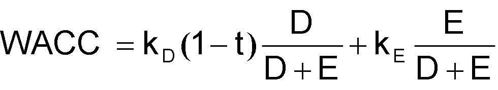

EDEkEDDt1kWACCED+++−=)(

1. WACC

Weighted Average Cost of Capital (WACC)

- Step 1: Generate the Free Cash Flows (FCFs)

- Step 2: Discount the FCFs using the WACC

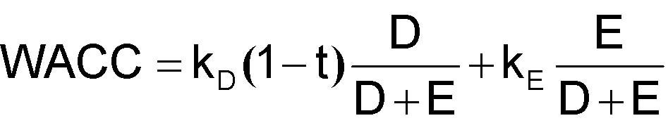

EDEkEDDt1kWACCED+++−=)(

WACC -Example

You are evaluating a new project.  The project requires an initial outlay of $100 million and you forecast before-tax profits of $25 million in perpetuity.  The tax rate is 40%, the firm has a target debt-to-value ratio of 25%, the interest rate on the firm’s debt is 7%, and the cost of equity is 12%.

After-tax CFs = $25 ×0.60 = $15 million

After-tax WACC= D/V (1–τ) rd+  E/V re

= 0.25 ×0.60 ×0.07  +  0.75 ×0.12 = 10.05%

NPV = -100 + 15 / 0.1005 = $49.25 million

WARNING!!!

- The common intuition for using WACC is:

- “To be valuable, a project should return more than what it costsus to raise the necessary financing, i.e., our WACC”

- This intuition is wrong.

- Using WACC this way is OK sometimes... but “by accident”.

- Sometimes, this is plain wrong:

- conceptually, i.e., the logic may be flawed

- practically, i.e., gives you a result far off the mark

- Need to understand this concept (more tricky than it appears).

Weighted Average Cost of Capital (WACC)

- Recall: Discount rates are project-specific==&gt; Imagine the project is a stand alone, i.e., financed as a separate firm.

- Debt worth D (i.e. market value) and with expected return kD(i.e., cost of debt) if against that project only

- Equity worth E (i.e. market value) and with expected return kE(i.e., cost of equity) if against that project only

- t is the marginal tax rate of the firm undertaking the project

Why WACC?

- Consider a one-year project (stand-alone) such that:

- expected cash-flow at the end of year 1 (BIT) = X

- Today (year 0) the projects has:

- debt outstanding with market value D0

- equity outstanding with market value E0

- project’s total value is V0 = D0 +E0

- We are looking for the discount rate r such that:

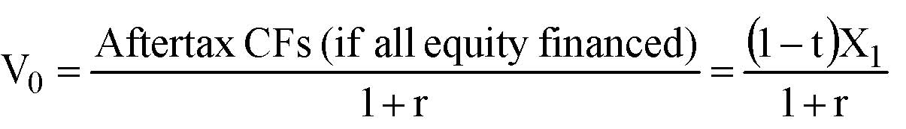

()r1Xt1r1financed)equity  all (if CFs AftertaxV10+−=+=

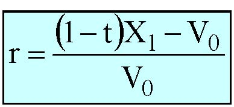

()001VVXt1r−−=

Why WACC? (cont.)

CF to debt-holders

CF to share-holders

r = WACC

The expected increase in value from year 0 to year 1 is:

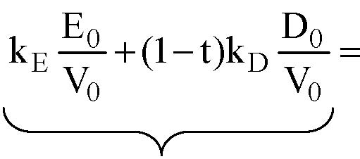

=−+00D00EVDk)t1(VEk

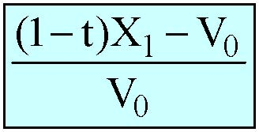

001VVX)t1(−−

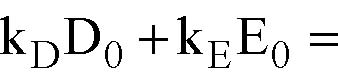

=+0E0DEkDk

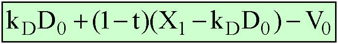

00D10DV)DkX)(t1(Dk−−−+

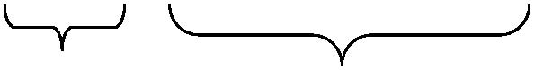

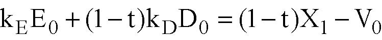

010D0EVX)t1(Dk)t1(Ek−−=−+

Leverage Ratio D/(D+E)

- D/(D+E) should be the target capital structure (in market values)  for the particular project under consideration.

- Common mistake 1:

- Using a priori D/(D+E) of the firm undertaking the project.

- Common mistake 2:

- Use D/(D+E) of the project’s financing

- Example: Using 100% if project is all debt financed.

Caveat: We will assume that the target for A+B is the result of combining target for A and target for B. It’s OK most of the time.

Leverage Ratio (cont.)

- So how do we get that ratio?

- Comparables to the project:

- “Pure plays” in the same business as the project

- Trade-off: Number vs. “quality” of comps

- The firm undertaking the project if the project is very much like the rest of the firm (i.e., if the firm is a comp for the project).

- Introspection, improved by checklist,...

Important Remark

- If the project maintains a relatively stable D/V over time, thenWACC is also stable over time.

- If not, then WACC should vary over time as well so you should compute/forecast a different WACC for each year.

- In practice, firms tend to use a constant WACC.

- So, in practice, WACC method is not great when capital structure is expected to vary substantially over time.

Cost of Debt Capital: kD

- When default probability is low

- We can estimate kDusing CAPM (empirical evidence suggests using debt betas between 0.2 and 0.3)

- kDshould be close to the interest rate that lenders would charge to finance the project with the chosen capital structure

- When default probability is high

- We would need default probabilities to estimate expected cash flows to debtholders

Marginal Tax Rate: t

- It’s the marginal tax rate of the firm undertaking the project (or to be more precise, of the firm + project).

- Indeed, this is the rate that is going to determine the tax savings associated with debt.

- Marginal as opposed to average tax rate t

Cost of Equity Capital: kE

- Need to estimate kEfrom comparables to the project:

- “Pure Plays”, i.e. firms operating only in the project’s industry

- The firm undertaking the project (if the firm is a pure play)

- Problem:

- A firm’s capital structure has an impact on kE

- Unless we have comparables with same capital structure, we need to work on their kEbefore using it.

Using CAPM to Estimate kE

1) Finds comps for the project under consideration.

2) Unlevereach comp’s βE(using the comp’sD/(D+E)) to estimate its βA: 

3) Use the comps’ βA to estimate the project’s βA(e.g. take the average).

4) Releverthe project’s estimated βA (using the project’s D/(D+E)) to estimate its βEunder the assumed capital structure:

5) Use the estimated βE to calculate the project’s cost of equity kE:

kE= rf  + βE* Market Risk Premium

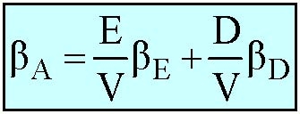

DEAβVDβVEβ+=

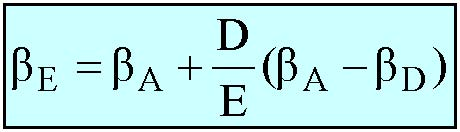

)ββ(EDββDAAE−+=

Remarks

- Formulas:

- Relevering formulas are reversed unlevering formulas.

- The appendix shows where they come from.

- Most of the time:

- Unlever each comp, i.e., one unlevering per comp.

- Estimate one βAby taking the average over all comps’ βApossibly putting more weight on those we like best.

- This is our estimate of the project’s βA

- Relever that βAonly, i.e., just one relevering.

- In the course, we use mostly the formula for a constant D/V.

More on Business Risk and Financial Risk

- Comparable firms have similar Business Risk

- Similar asset beta βAand, consequently, similar unlevered cost of capital kA

- Comparable firms can have different Financial Risk(βE-βA) if they have different capital structures 

- Different equity beta βEand thus different required return on equity kE

- In general, equity beta βEincreases with D/E

- Consequently the cost of equity kE  increases with leverage

Leverage, returns, and risk 

Asset risk is determined by the type of projects, not how the projects are financed

EDA VE   VDβ+β=β)  ( ED  DAAEβ−β+β=β

Changes in leverage do not affect rAor βALeverage affects rEand βE

EDAr VE  r VDr+=)r  (r ED  rrDAAE−+=

Leverage and beta 

βEβAβD-1123400.20.40.60.811.21.4Debt to equity ratioBeta

Leverage and required returns

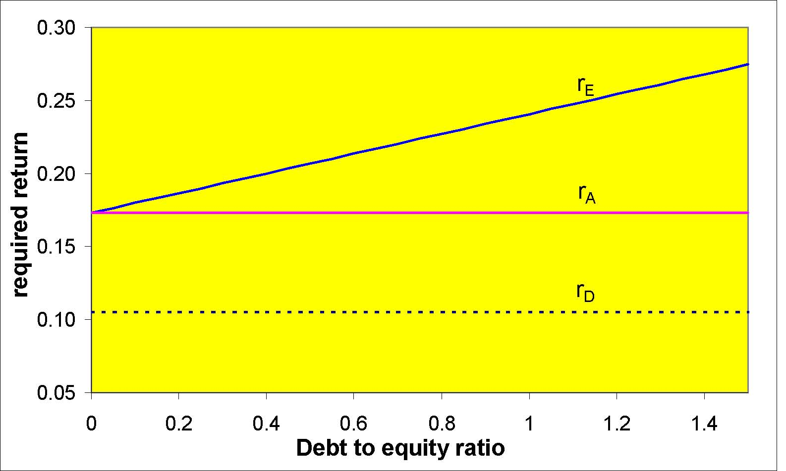

rErArD0.050.100.150.200.250.3000.20.40.60.811.21.4Debt to equity ratiorequired return

Business Risk and Financial Risk: Intuition

- Consider a project with βA&gt;0

- Its cash flows can be decomposed into:

- Safe cash-flows

- Risky cash-flows that are positively correlated with the market.

- As the level of debt increases (but remains relatively safe):

- A larger part of the safe cash-flows goes to debtholders;

- The residual left to equityholders is increasingly correlated with the market.

Note:If cash-flows were negatively correlated with the market (βA&lt;0), increasing debt would make equity more negatively correlated with the market and would reduce the required return on equity.

General Electric’s WACC

- Assume  rf = 6%

- We can get GE’s βE=1.10 which implies

kE= 6% + 1.10 * 8% = 14.8%

- kD = 7.5%

- D/(D+E) = .06

- t = 35%

WACC = .06 * 7.5% * (1-35%) + .094 * 14.8%  =  14.2%

When Can GE Use This WACC in DCF?

- When the project under consideration has the same basic risk as the rest of the company (i.e., when the company is a good comp for its project).

- And, the project will be financed in the same way as the rest of the company.

- For example, if GE is expanding the scale of entire operations then it should use its own WACC.

- But, if planning to expand in only one of its many different businesses then it’s not the right cost of capital.

- In that case: Find publicly-traded comps and do unlevering / levering.

Important Warning

- Cost of capital is an attribute of an investment, notthe company

- Few companies have a single WACC that they can use for all of their businesses.

GE’s businesses:

- Financial services

- Power systems

- Aircraft engines

- Industrial

- Engineered plastics

- Technical products

- Appliances

- Broadcasting

How Firms Tend to Use WACC

They calculate their WACC using:

- Their current cost of debt kD

- Their own current capital structure D/(D+E)

- Their own current cost of equity capital kE(more on this soon).

- The marginal tax rate they are facing

They discount all future FCF with:

- this (single) discount rate

- maybe adjusted for other things (e.g., project’s “strategic value”)

Selected Industry Capital Structures, Betas, and WACCs

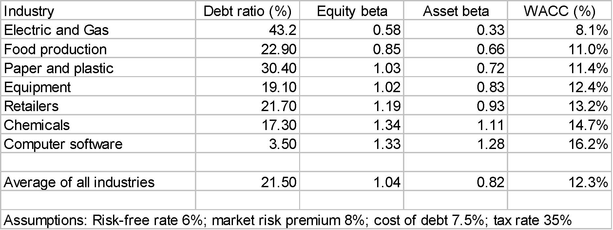

IndustryDebt ratio (%)Equity betaAsset betaWACC (%)Electric and Gas43.20.580.338.1%Food production22.900.850.6611.0%Paper and plastic30.401.030.7211.4%Equipment19.101.020.8312.4%Retailers21.701.190.9313.2%Chemicals17.301.341.1114.7%Computer software3.501.331.2816.2%Average of all industries21.501.040.8212.3%Assumptions: Risk-free rate 6%; market risk premium 8%; cost of debt 7.5%; tax rate 35%

Relation to MM: 

W/o taxes, WACC is independent of leverage

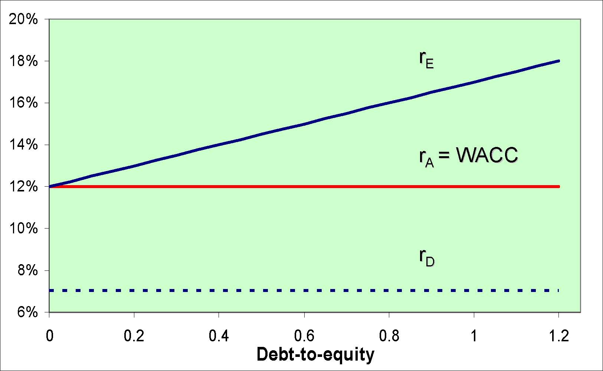

6%8%10%12%14%16%18%20%00.20.40.60.811.2Debt-to-equityrrDDrrEErrA A = WACC= WACC

The WACC Fallacy (Revisited)

- The cost of debt is lower than the cost of equity (true).

- Does this mean that projects should be financed with debt?

- No: WACC is independent of leverage

- As you are tapping into cheap debt, you are increasing the cost of equity (its financial risk increases).

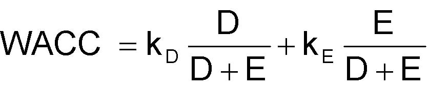

EDEkEDDkWACCED+++=

With taxes, WACC declines with leverage

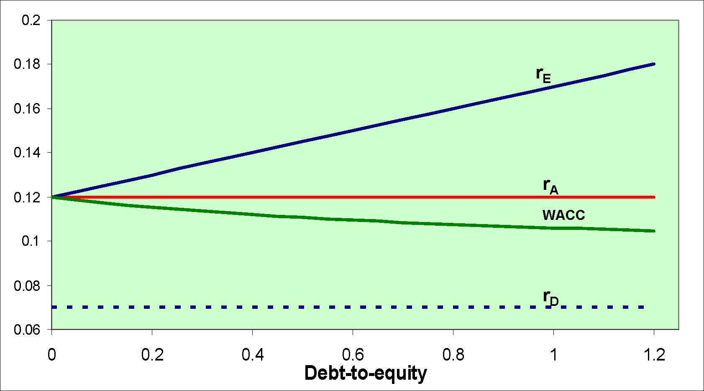

0.060.080.10.120.140.160.180.200.20.40.60.811.2Debt-to-equityrErAWACCrD

2. APV

Adjusted Present Value

- Separates the effects of financial structure from the others.

- Step 1: Value the project/firm as if it were 100% equity financed.

- Step 2: Add the value of the tax shield of debt.

Note:

- This is simply applying MM-Theorem with taxes

- APV = Valuation by Components = ANPV

Step 1: Value if 100% Equity Financed

- Cash-flows: Free Cash Flows are exactly what you need.

- You need the rate that would be appropriate to discount the firm’s cash flows if the firm were 100% equity financed.

- This rate is the expected return on equity if the firm were 100%equity financed.

- To get it, you need to:

- Find comps, i.e., publicly traded firms in same business.

- Estimate their expected return on equity if they were 100% equity financed.

Step1: Value if 100% Equity Financed (cont.)

- Unlever each comp’s βEto estimate its asset beta (or all equity or unleveredbeta) βA using the appropriate unlevering formula

- Use the comps’ βA to estimate the project’s βA(e.g. average).

- Use the estimated βA to calculate the all-equity cost of capital kA 

kA= rf  + βA* Market Risk Premium

- Use kAto discount the project’s FCF

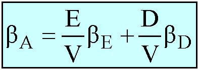

DEAβVDβVEβ+=

Example

- Johnson and Johnson operate in several lines of business: Pharmaceuticals, consumer products and medical devices.

- To estimate the all-equity cost of capital for the medical devices division, we need a comparable, i.e., a pure play in medical devices (we should really have several).

- Data for Boston Scientific:

- Equity beta = 0.98

- Debt = $1.3b

- Equity = $9.1b.

Example (cont.)

- Compute Boston Scientific’s asset beta:

- Let this be our estimate of the asset beta for the medical devices business

- Use CAPM to calculate the all-equity cost of capital for that business (assuming 6% risk-free rate, 8% market risk premium):

kA= 6% + .86 *8% = 12.9%

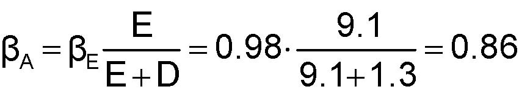

0.86 1.39.19.10.98 DEEββEA=+⋅=+=

Step 2: Add PV(Tax Shield of Debt)

- Cash-flow: The expected tax saving is tkDD where kDis the cost of debt capital (discussed earlier).

- If D is expected to remain stable, then discount tkDD using kD 

PVTS = tkDD/ kD= tD

- If D/V is expected to remain stable, then discount tkDD using kA

PVTS = tkDD/ kA

- Intuition:

- If D/V is constant, D (tkDD) moves up/down with V

- The risk of tkDD is similar to that of the firm’s assets: use kA

Step 2: Add PVTS (cont.)

- For many projects, neither D nor D/V is expected to be stable.

- For instance, LBO debt levels are expected to decline.

- In general you can estimate debt levels using:

- repayment schedule if one is available,

- financial forecasting

and discount by a rate between  kDand  kA.

Extending the APV Method

- One good feature of the APV method is that it is easy to extend to take other effects of financing into account.

- For instance, one can value an interest rate subsidy separately as the PV of interest savings.

APV= NPV(all-equity) + PV(Tax Shield) + PV(other stuff)

WACC vs. APV

Pros of WACC: Most widely used

- Less computations needed (before computers).

- More literal, easier to understand and explain (?)

Cons of WACC:

- Mixes up effects of assets and liabilities. Errors/approximations in effect of liabilities contaminate the whole valuation.

- Not very flexible:What if debt is risky? Cost of hybrid securities (e.g., convertibles)? Other effects of financing (e.g., costs of distress)? Non-constant debt ratios?

Note: For non-constant debt ratios, could use different WACC for each year (see appendix) but this is heavy and defeats the purpose.

WACC vs. APV (cont.)

Advantages of APV:

- No contamination.

- Clearer: Easier to track down where value comes from.

- More flexible: Just add other effects as separate terms. 

Cons of APV:

- Almost nobody uses it.

Overall:

- For complex, changing or highly leveraged capital structure (e.g., LBO), APV is much better.

- Otherwise, it doesn’t matter much which method you use.

Appendix

Appendix A: Unlevering Formula for a Constant Debt Ratio D/V

- Consider a firm with perpetual expected cash-flows, X.

- Capital structure: Debt worth D and equity worth E

- By definition, the all-equity cost of capital is the rate kA that is appropriate for discounting the project’s FCF, (1-t)X.

- Moreover, since the firm’s D/V is stable, PVTS= tDkD/ kA 

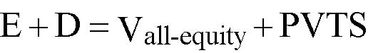

PVTSVDEequity-all+=+

()()DEDktXt1k  or                  kDktkXt1DEDAADA++−=+−=+

Appendix A: Unlevering Formula for a Constant Debt Ratio D/V (cont.)

- Debt-and equity-holders share each year’s (expected) cash-flows

- Eliminating X, we get:

- Translating into betas (all relationships being linear) yields:

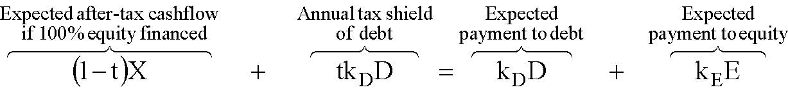

()equity payment toExpectedEdebt payment toExpectedDdebt ofshield tax AnnualDfinancedequity  100% if  cashflowtax -after Expected    Ek                Dk        Dtk                        Xt1          +=+−

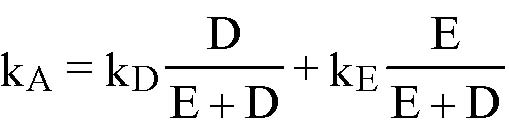

DEEkDEDkkEDA+++=

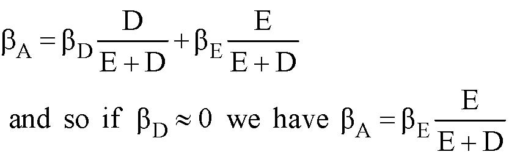

  DEEββ  have    we0β  if  so  and DEEβDEDβEADEDA+=≈+++=β

Appendix B: Unlevering Formula for a Constant Debt Level D

- Consider a firm with perpetual expected cash-flows, X.

- Capital structure: Debt worth D and equity worth E

- Since the firm’s D is constant over time, PVTS= tD

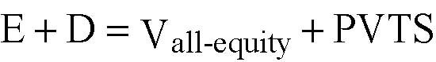

PVTSVDEequity-all+=+

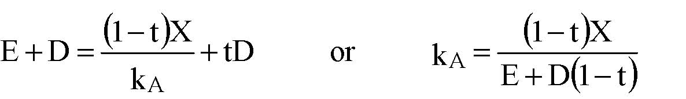

()()()t1DEXt1k  or                  tDkXt1DEAA−+−=+−=+

Appendix B: Unlevering Formula for a Constant Debt Level D (cont.)

- Debt-and equity-holders share each year’s (expected) cash-flows

- Dividing both sides by (D+E), we get (see formula for kAabove):

- Translating into betas yields:

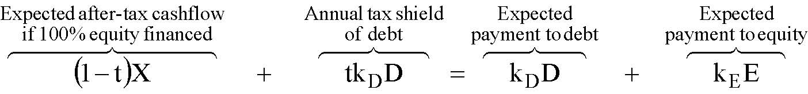

()equity payment toExpectedEdebt payment toExpectedDdebt ofshield tax AnnualDfinancedequity  100% if  cashflowtax -after Expected    Ek                Dk        Dtk                        Xt1          +=+−

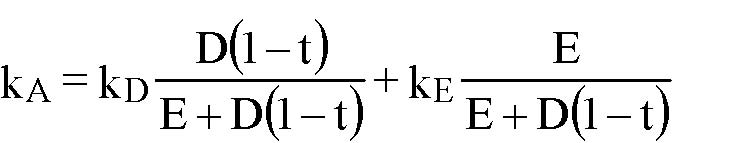

()()()t1DEEkt1DEt1DkkEDA−++−+−=

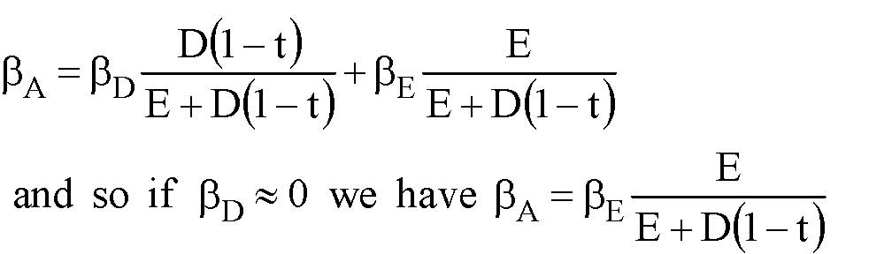

()()()()  t1DEE  have    we0  if  so  and t1DEEt1DEt1DEADEDA−+β=β≈β−+β+−+−β=β

Appendix C: WACC vs. APV: Example

Objective of the example:

- See APV and WACC in action.

- Show that, when correctly implemented, APV and WACC give identical results.

- Correctly implementing WACC in an environment of changing leverage.

- Convince you that APV is the way to go.

WACC vs. APV: Example (cont.)

AnttozInc., a Fortune 500 widget company, is planning to set up a newfactory in New Orleans with cash flows as presented on the next slide:

- The new plant will require an initial investment in PPE of $75 million, plus an infusion of $10 million of working capital (equal to 8% of first-year sales).

- Sales are projected to be $125 million in the first year of operation. Sales are projected to rise a whopping 10% over the next two years, with growth stabilizing at a 5% rate indefinitely thereafter.

- Anttoz’sarmy of financial analysts estimate that cash costs (COGS, GS&amp;Aexpenses, etc.) will constitute 50% of revenues.

- New investment in PPE will match depreciation each year, starting at 10% of the initial $75 million investment and growing in tandem with sales thereafter.

- The firm plans to maintain working capital at 8% of the following year’s projected sales.

WACC vs. APV: Example (cont.)

- With AnttozWidgets Inc. in the 35% tax bracket, FCF would approach $45 million in three years, and grow 5% per year thereafter.

- The required rate of return on the project’s assets, kA, is 20%.

- The project supports a bank loan of $80 million initially with $5 million principal repayments at the end of the first three years of operation, bringing debt outstanding at the end of the third year to $65 million.

- From that point on, the project’s debt capacity will increase by5% per year, in line with the expected growth of operating cash flows. Because of the firm’s highly leveraged position in the early years, the borrowing rate is 10% initially, falling to 8% once it achieves a stable capital structure (after year 3).

WACC vs. APV: Example (cont.)

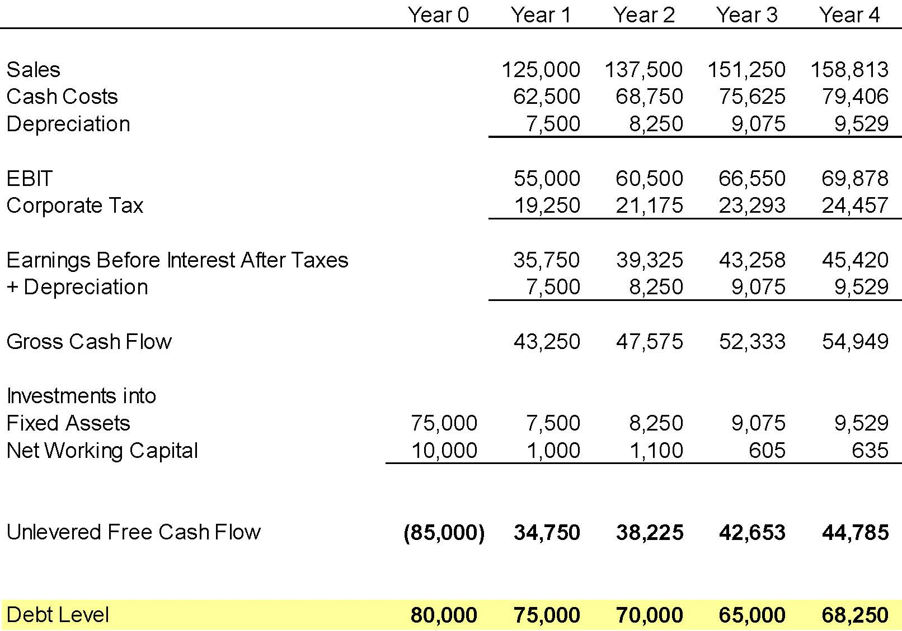

Year 0Year 1Year 2Year 3Year 4Sales125,000 137,500 151,250 158,813 Cash Costs62,500   68,750   75,625   79,406   Depreciation7,500     8,250     9,075     9,529     EBIT55,000   60,500   66,550   69,878   Corporate Tax19,250   21,175   23,293   24,457   Earnings Before Interest After Taxes35,750   39,325   43,258   45,420   + Depreciation7,500     8,250     9,075     9,529     Gross Cash Flow43,250   47,575   52,333   54,949   Investments intoFixed Assets75,000   7,500     8,250     9,075     9,529     Net Working Capital10,000   1,000     1,100     605        635        Unlevered Free Cash Flow(85,000)  34,750   38,225   42,653   44,785   Debt Level80,000   75,000   70,000   65,000   68,250   

WACC vs. APV: Example (cont.)

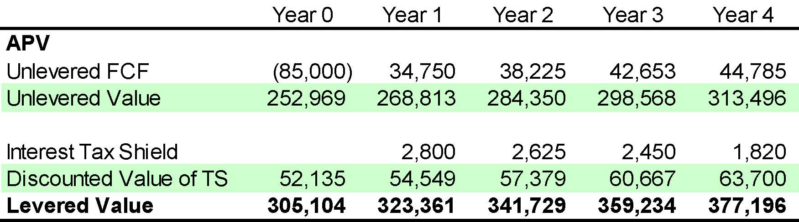

Year 0Year 1Year 2Year 3Year 4APVUnlevered FCF(85,000)   34,750    38,225    42,653    44,785    Unlevered Value252,969  268,813  284,350  298,568  313,496  Interest Tax Shield2,800       2,625       2,450       1,820       Discounted Value of TS52,135    54,549    57,379    60,667    63,700    Levered Value305,104  323,361  341,729  359,234  377,196  

WACC vs. APV: Example (cont.)

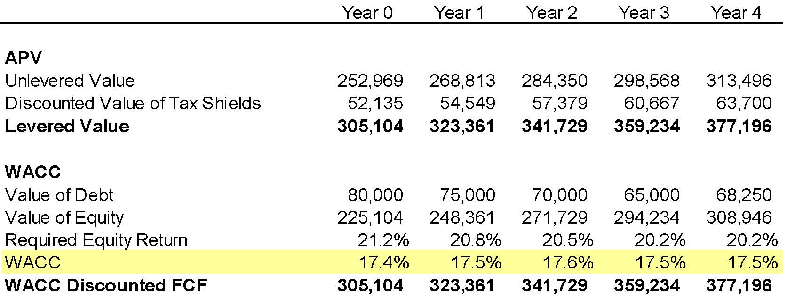

Year 0Year 1Year 2Year 3Year 4APVUnlevered Value252,969  268,813  284,350  298,568  313,496  Discounted Value of Tax Shields52,135    54,549    57,379    60,667    63,700    Levered Value305,104  323,361  341,729  359,234  377,196  WACCValue of Debt80,000    75,000    70,000    65,000    68,250    Value of Equity225,104  248,361  271,729  294,234  308,946  Required Equity Return21.2%20.8%20.5%20.2%20.2%WACC17.4%17.5%17.6%17.5%17.5%WACC Discounted FCF305,104  323,361  341,729  359,234  377,196  

         Acrobat Distiller 6.0 (Windows)

         2004-01-21T10:35:52+05:30

         2004-01-21T10:37:55+05:30

         2004-01-21T10:37:55+05:30

         PScript5.dll Version 5.2

         uuid:547c52a0-3c81-4c51-8b6e-0fbd183c03f6

         uuid:5d3636f7-de91-41b5-8d8c-b6400f269e47

         xml

               djenter

               Microsoft PowerPoint - LN19(Options).ppt

Real Options Finance Theory II (15.402) – Spring 2003 – Dirk Jenter 

2 • • • • • • • • • • • • • Finance Theory II (15.402) – Spring 2003 – Dirk Jenter The Big Picture: Part II -Valuation A. Valuation: Free Cash Flow and Risk April 1 Lecture: Valuation of Free Cash Flows April 3 Case: Ameritrade B. Valuation: WACC and APV April 8 Lecture: WACC and APV 1 April 10 Lecture: WACC and APV 2 April 15 Case: Dixon Corporation 1 April 17 Case: Dixon Corporation 2 April 24 Case: Diamond Chemicals C. Project and Company Valuation April 29 Lecture: Real Options May 1 Case: MW Petroleum Corporation May 6 Lecture: Valuing a Company May 8 Case: Cooper Industries, Inc. May 13 Case: The Southland Corporation 

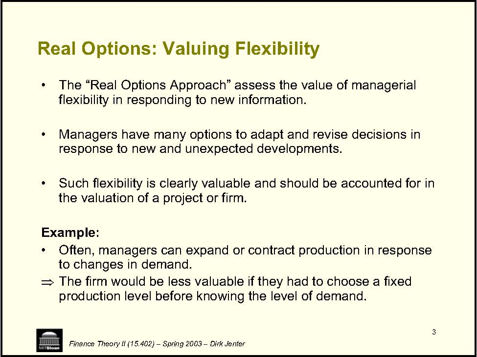

3 Real Options: Valuing Flexibility • • • Example: • Ÿ Finance Theory II (15.402) – Spring 2003 – Dirk Jenter The “Real Options Approach” assess the value of managerial flexibility in responding to new information. Managers have many options to adapt and revise decisions in response to new and unexpected developments. Such flexibility is clearly valuable and should be accounted for in the valuation of a project or firm. Often, managers can expand or contract production in response to changes in demand. The firm would be less valuable if they had to choose a fixed production level before knowing the level of demand. 

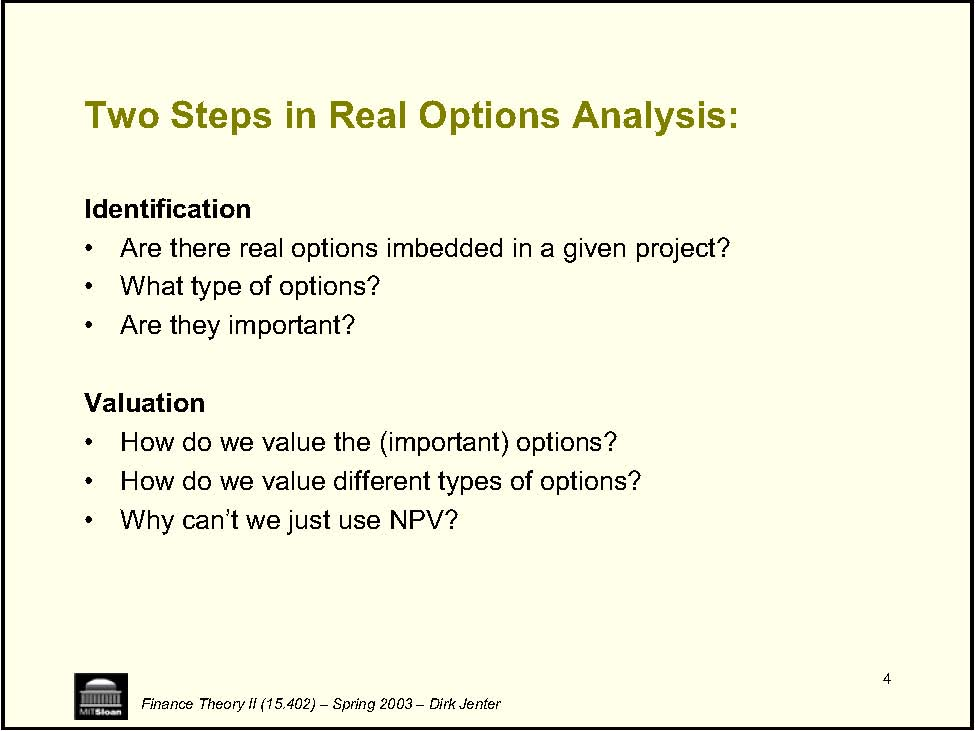

4 • • • Valuation • • • Finance Theory II (15.402) – Spring 2003 – Dirk Jenter Two Steps in Real Options Analysis: Identification Are there real options imbedded in a given project? What type of options? Are they important? How do we value the (important) options? How do we value different types of options? Why can’t we just use NPV? 

Finance Theory II (15.402) – Spring 2003 – Dirk Jenter Step 1: Identifying Real Options 

6 • • • →→• Finance Theory II (15.402) – Spring 2003 – Dirk Jenter Identifying Real Options It is important to identify the options imbedded in a project. There are options imbedded in all but the most trivial projects. The most crucial skill consists of: Identifying those options that are “significant”, if any. Ignoring those that are not. Identifying real options takes practice, and sometimes “vision”. 

# Example: Oz Toys’ Expansion Program 

- Oz Toys’ management is considering building a new plant to exploit innovations in process technology. 

- About three years out, the plant’s capacity may be expanded to allow Oz Toys’ entry into a new market. 

<Table>
<TR>
<TH>Oz Toys' Initial Calculations for Phased Expansion Program </TH>

</TR>
<TR>

<TD>2000 </TD>
<TD>2001 </TD>
<TD>2002 </TD>
<TD>2003 </TD>
<TD>2004 </TD>

<TD>2005 </TD>
<TD>2006 </TD>
</TR>
<TR>
<TH>EBIT * (1 -t) </TH>

<TD>2.2 </TD>
<TD>4.0 </TD>
<TD>-10.0 </TD>
<TD>11.5 </TD>

<TD>13.7 </TD>
<TD>17.4 </TD>
</TR>
<TR>
<TH>Depreciation </TH>

<TD>19.0 </TD>
<TD>21.0 </TD>
<TD>21.0 </TD>
<TD>46.3 </TD>

<TD>48.1 </TD>
<TD>50.0 </TD>
</TR>
<TR>
<TH>CAPX </TH>
<TD>120.0 </TD>
<TD>8.1 </TD>
<TD>9.5 </TD>
<TD>307.0 </TD>
<TD>16.0 </TD>

<TD>16.3 </TD>
<TD>17.0 </TD>
</TR>
<TR>
<TH>∆NWC </TH>
<TD>25.0 </TD>
<TD>4.1 </TD>
<TD>5.5 </TD>
<TD>75.0 </TD>
<TD>7.1 </TD>

<TD>8.0 </TD>
<TD>9.7 </TD>
</TR>
<TR>
<TH>FCF </TH>
<TD>-145.0 </TD>
<TD>9.0 </TD>
<TD>10.0 </TD>
<TD>-371.0 </TD>
<TD>34.7 </TD>

<TD>37.5 </TD>
<TD>40.7 </TD>
</TR>
<TR>
<TH>TV (5% growing perpetuity) </TH>

<TD>610.5 </TD>
</TR>
<TR>
<TH>NPV (at 12% WACC) </TH>
<TD>-19.8 </TD>

</TR>
</Table>

Finance Theory II (15.402) – Spring 2003 – Dirk Jenter 

8 Is There An Option? • • • • • information? Finance Theory II (15.402) – Spring 2003 – Dirk Jenter Two conditions: (1) News will probably arrive in the future. (2) When it arrives, the news may affect decisions. Identify the uncertainty that managers face: What is the main thing that managers will learn over time? How will they exploit the new information? What decisions will change as a function of the new 

9 • • : • • • Finance Theory II (15.402) – Spring 2003 – Dirk Jenter Oz Toys: Is There An Option? (1) Oz Toys might learn (or not) about: The demand for the current and/or new products. The possibility of rivals entering the market. •Etc. (2) The information might affect (or not) Oz Toys’ decisionWhether or not to undertake expansion phase 1 at all. Whether to undertake phase 2 (or subsequent phases…). Whether to push one new product or the other. •Etc. 

10 • • • →→→→Timing option →Finance Theory II (15.402) – Spring 2003 – Dirk Jenter Identifying Real Options (cont.) Look for clues in the project’s description: “Phases”, “Strategic investment”, “Scenarios”, … Examine the pattern of cash flows and expenditures over time. For instance, large expenditures are likely to be discretionary. Taxonomy of frequently encountered options : Growth option Abandonment option Option to expand or contract scale Option to switch (inputs, outputs, processes, etc.) 

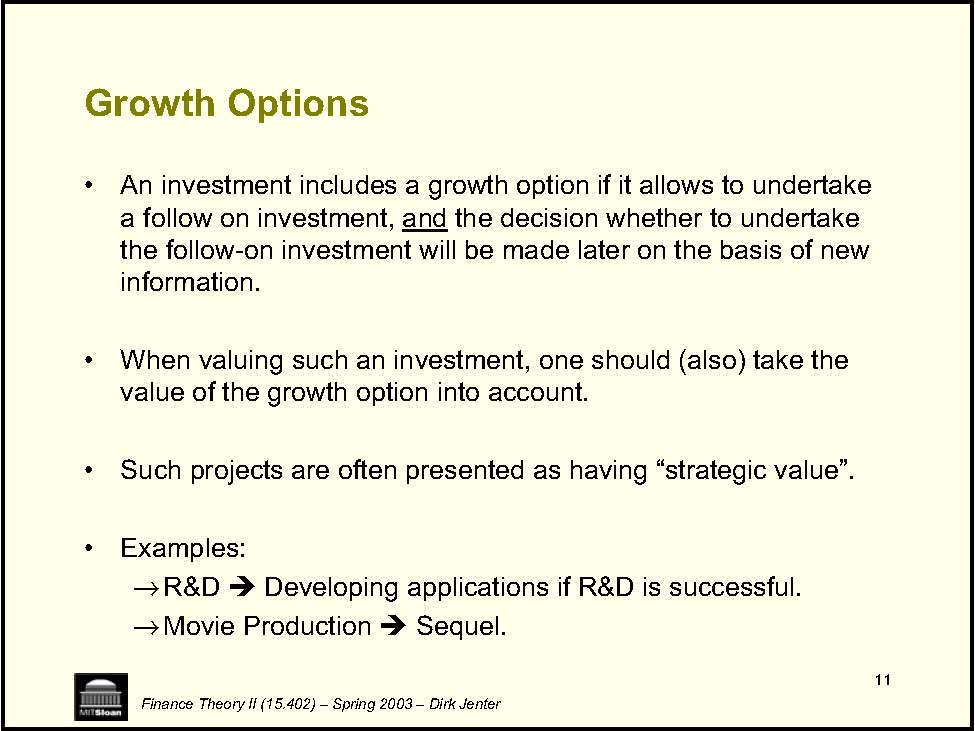

11 • information. • • →R&amp;D Î →Î Sequel. Finance Theory II (15.402) – Spring 2003 – Dirk Jenter Growth Options An investment includes a growth option if it allows to undertake a follow on investment, and the decision whether to undertake the follow-on investment will be made later on the basis of new When valuing such an investment, one should (also) take the value of the growth option into account. Such projects are often presented as having “strategic value”. •Examples: Developing applications if R&amp;D is successful. Movie Production 

12 Growth Options (cont.) • • →Rocky 1 Î Rocky 2 Î Î … • →→j→Finance Theory II (15.402) – Spring 2003 – Dirk Jenter Growth options are akin to Call options: You have the option, not the obligation, to get something by incurring a cost. Growth options can be “nested”, i.e., series of related choices: Rocky 3 Growth options can be very valuable and account for over half of the market value of some industries. industries with heavy R&amp;D. industries with multiple proect generations (e.g. computers, pharmaceuticals). Industries with multinational operations. 

13 Abandonment Options: • • • Finance Theory II (15.402) – Spring 2003 – Dirk Jenter The Option to Shut-down An investment includes an abandonment option if, under certain circumstances, it may be preferable to shut down current operations permanently and realize the resale value of capital equipment and other assets in secondhand markets. Sometimes, abandonment options are hidden in aggregated forecasts: While it may be preferable to continue operations on average, shutting down may be better under some scenarios. Abandonment options are akin to Put options: You have the option (but no obligation) to get rid of something and receive a payment (the liquidation value). 

14 Option to Expand or Contract Scale • utilization. • • →→Finance Theory II (15.402) – Spring 2003 – Dirk Jenter If conditions are more favorable than expected, the firm can expand the scale of production or accelerate resource If conditions are less favorable than expected, the firm can contract the scale of operations. In extreme cases, production can temporarily halt and start again. Similar to growth and abandonment options. •Examples: Ability to slow the rate of mineral extraction from a mine. Ability to add a temporary third shift at a factory. 

15 Timing Options: Option to accelerate or decelerate projects • • • • Finance Theory II (15.402) – Spring 2003 – Dirk Jenter Retaining some flexibility about the timing of an investment (possibly including “never”) can be very valuable. Example: A patent’s value should account for the timing option, i.e., when buying the patent, you are buying the right to use it whenever you want (during the patent’s lifetime). Akin to an American call option: You have the option (but not the obligation) to get something at any time by paying a cost. Note: Only those investment timing problems for which relevant information is likely to arrive involve “option value”. 

16 • • • →→→Finance Theory II (15.402) – Spring 2003 – Dirk Jenter Time to Build Options (Staged Investment) Staging investment as a series of outlays creates the option to abandon the enterprise in midstream if new information is unfavorable. Each stage can be viewed as a call option on the value of subsequent stages, and valued as a compound option. Important in: all R&amp;D intensive industries, especially pharmaceuticals; long-development capital-intensive projects, e.g., large-scale construction or energy-generating plants; start-up ventures. 

<Table>
<TR>
<TH>Summary of Real Option Examples </TH>
</TR>
<TR>
<TH>Category Description Important in: Option to Defer Management has opportunity to wait to invest, and can see if markets warrant further investment. Natural resources extraction, real estate, farming, technology. Staged Investment Staging investment creates the option to reevaluate and/or abandon at each stage. R&amp;D intensive industries, energy generation, start-up ventures. Option to alter operating scale If market conditions change, the firm can expand/contract or temporarily shut down. Natural resources, fashion, real estate, consumer goods. Option to abandon If market conditions decline, management sells off assets Capital-intensive industries, new product introductions in uncertain markets. Option to switch If prices or demand change, management can change product mix (product flexibility) or switch inputs (process flexibility) Companies in volatile markets with shifting preferences, energy companies Growth options An early investment opens up future growth opportunities in the form of new products or processes, access to markets, or strengthening of core capabilities High tech; industries with multiple product generations (drug companies, computers, strategic acquisitions). Multiple Interacting Options Projects involve a collection of various options—both put and call types.  Values can differ from the sum of separate option values because they interact. Many of the industries discussed above </TH>
</TR>
<TR>
<TH>17 Finance Theory II (15.402) – Spring 2003 – Dirk Jenter </TH>
</TR>
</Table>

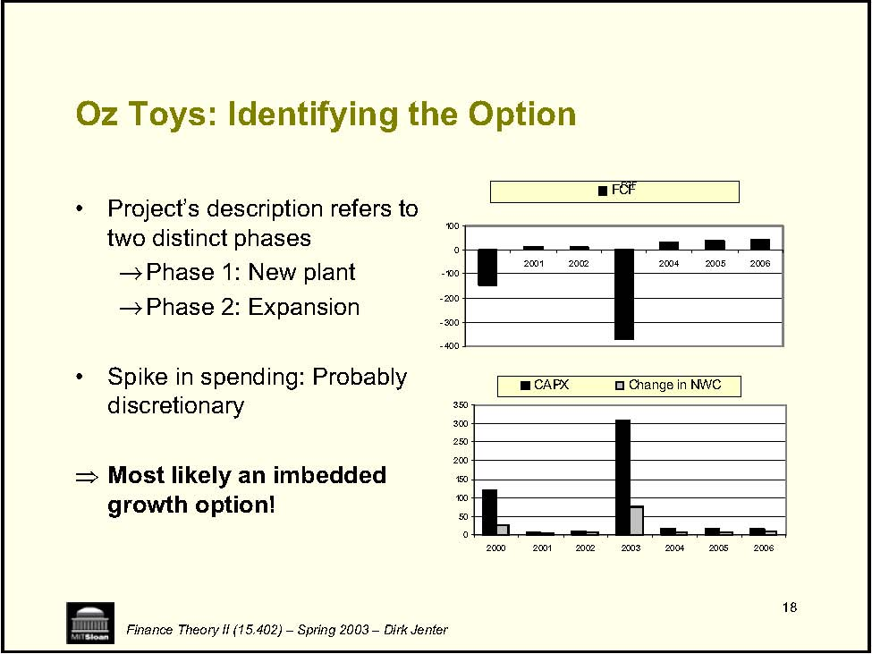

18 • →→• Ÿ 0 50 200 250 300 350 2002 2004 2006 0 Finance Theory II (15.402) – Spring 2003 – Dirk Jenter Oz Toys: Identifying the Option Project’s description refers to two distinct phases Phase 1: New plant Phase 2: Expansion Spike in spending: Probably discretionary Most likely an imbedded growth option! 100 150 2000 2001 2003 2005 CAPX Change in NWC FCF -400 -300 -200 -100 100 2000 2001 2002 2003 2004 2005 2006 FCF 

19 Practical Issue: Need for Simplifications • →→• →→→(especially others involved in the decision process). Finance Theory II (15.402) – Spring 2003 – Dirk Jenter Real projects, especially long-horizon ones, are complex: They often combine assets-in-place and options. Options are often nested. Simplifying assumptions are needed: To allow the technical valuation analysis. To keep the model flexible. To keep the model understandable to you and others 

20 Practical Issue: Simplifications (cont.) • • • →Examples: • • • Finance Theory II (15.402) – Spring 2003 – Dirk Jenter What should you do? Cut the project into pieces corresponding to simple options. Search for the primary uncertainty that managers face. A simplified model that dominates (is dominated by) the project gives an upper (a lower) bound for the project’s value. Using European rather than American options. Ignoring some of the options. Ignoring some adverse effects of waiting (e.g. possible entry). 

21 • • →• →→Finance Theory II (15.402) – Spring 2003 – Dirk Jenter Oz Toys: Possible simplifications Value phase 1 and phase 2 separately. Focus on the option to undertake expansion phase 2 or not. Assume all other options are “negligible”. Assume that phase 2 is to be undertaken in 2003 or never. Value as a European Call option. Make simplifying assumptions about the distribution of the project’s value. 

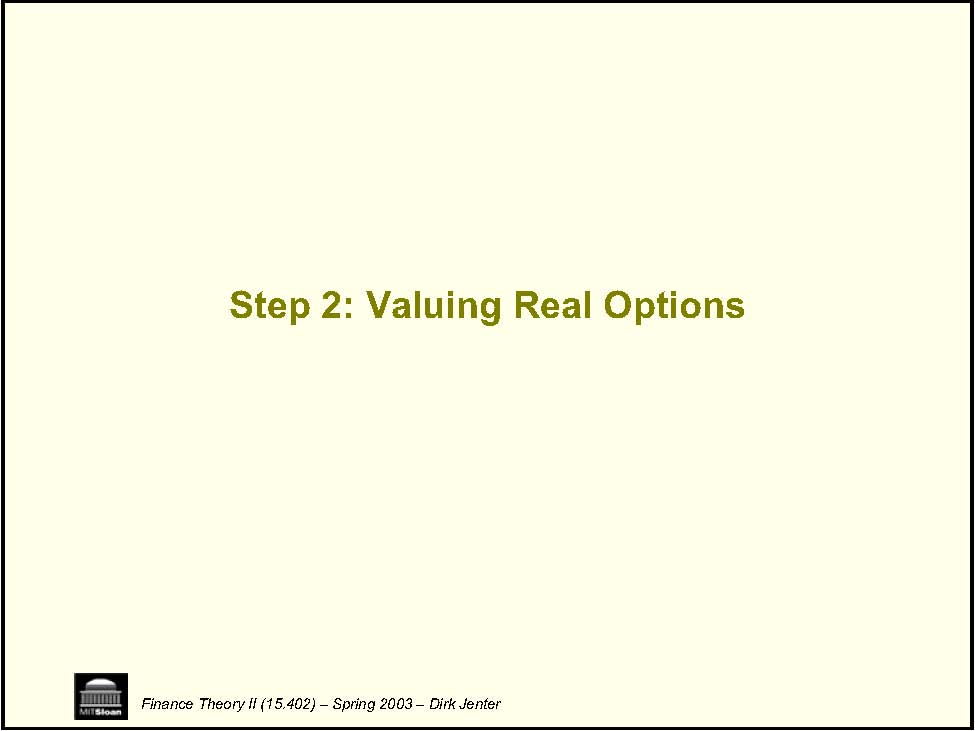

Step 2: Valuing Real Options Finance Theory II (15.402) – Spring 2003 – Dirk Jenter 

23 Valuation of Real Options • →• →• Finance Theory II (15.402) – Spring 2003 – Dirk Jenter The tools developed to value financial options (i.e. calls and puts on stocks and other financial assets) can be useful to estimate the value of real options embedded in some projects. Black-Scholes is often used to value real options. PROBLEM: Real options are much more complex than financial options. Need to simplify them to fit them into the valuation models for financial options. Similar to DCF analysis, the aim is to develop numerical techniques to “keep score” and assist in the decision-making process, not to replace sound business sense. 

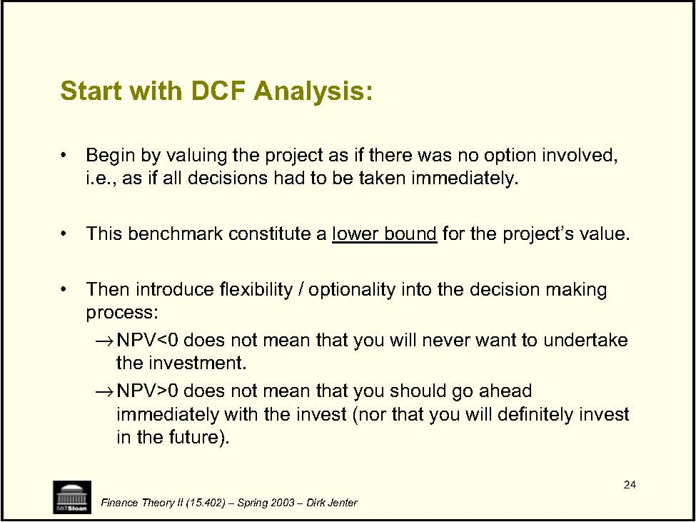

24 • • • →the investment. →in the future). Finance Theory II (15.402) – Spring 2003 – Dirk Jenter Start with DCF Analysis: Begin by valuing the project as if there was no option involved, i.e., as if all decisions had to be taken immediately. This benchmark constitute a lower bound for the project’s value. Then introduce flexibility / optionality into the decision making process: NPV&lt;0 does not mean that you will never want to undertake NPV&gt;0 does not mean that you should go ahead immediately with the invest (nor that you will definitely invest 

25 • phases. • →→• analysis. Finance Theory II (15.402) – Spring 2003 – Dirk Jenter Oz Toys: DCF Analysis We need to disentangle the cash flows from the two This requires making judgments about: Which expenses are discretionary vs. non-discretionary, i.e. which decisions need to be made today and which can be made in the future, after new information has arrived. Which cash inflows/outflows are associated with each phase Note: Sometimes it is possible to simply retrieve the disaggregated data used to construct the summary DCF 

26 TV Finance Theory II (15.402) – Spring 2003 – Dirk Jenter 2000 2001 2002 2003 2004 2005 2006 Phase 1 Cash flow 9.0 10.0 11.0 11.6 12.1 12.7 Investment 145.0 TV (5% growing perpetuity) 191.0 NPV (at 12% WACC) -3.7 Phase 2 Cash flow 23.2 25.4 28.0 Investment 382.0 TV (5% growing perpetuity) 419.5 NPV (at 12% WACC) -16.1 Total Cash flow 9.0 10.0 11.0 34.7 37.5 40.7 Investment 145.0 382.0 610.5 NPV (at 12% WACC) -19.8 DCF Analysis of Phases 1 and 2 Separating Phases 1 and 2 

27 • • →→5.5%? 2003 2006 Finance Theory II (15.402) – Spring 2003 – Dirk Jenter Oz Toys: DCF Analysis (cont.) Both phases have negative NPV. Phase 2’s NPV is probably largely overstated: Investment ($382M) is likely to be less risky than cash flows. Should probably be using the three-year risk-free rate of 2000 2001 2002 2004 2005 Phase 2 Cash flow 23.2 25.4 28.0 Investment 382.0 TV (5% growing perpetuity) 419.5 NPV -69.5 DCF Analysis of Phase 2 Discounting the Investment at 5.5% 

28 Valuing the Option: • ™ • j• Finance Theory II (15.402) – Spring 2003 – Dirk Jenter First we recognize the option: Phase 2 will only be undertaken if it is positive NPV at the time the decision will be made. The strategy is to map the embedded option in our proect into a simple financial option and use financial valuation tools to price the option: Black-Scholes formula. Oftentimes, this involves making somewhat heroic assumptions about the project! 

29 Black-Scholes formula: • 12d1 σTσTd2 = d1 -(σT) σFinance Theory II (15.402) – Spring 2003 – Dirk Jenter The Black-Scholes formula Option value = N(d) * S – N(d) * PV(X) N(d): Cumulative normal probability density function = ln[S/PV(X)] / (1/2) + (1/2)/2 1/2S = Current stock price X = Exercise price r = Risk-free interest rate T = Time to maturity in years. = Standard deviation of stock return Question: What inputs do we need? 

# Mapping: Project Æ Call Option

<Table>
<TR>
<TH>Project </TH>

<TH>Call Option </TH>
</TR>
<TR>
<TD>Expenditure required to acquire the assets </TD>
<TD>X </TD>
<TD>Exercise price </TD>
</TR>
<TR>
<TD>Value of the operating assets to be acquired </TD>
<TD>S </TD>
<TD>Stock price (price of the underlying asset) </TD>
</TR>
<TR>
<TD>Length of time the decision may be deferred </TD>
<TD>T </TD>
<TD>Time to expiration </TD>
</TR>
<TR>
<TD>Riskiness of the operating assets </TD>
<TD>σ2 </TD>
<TD>Variance of stock return </TD>
</TR>
<TR>
<TD>Time value of money </TD>
<TD>r </TD>
<TD>Risk-free rate of return </TD>
</TR>
</Table>

Finance Theory II (15.402) – Spring 2003 – Dirk Jenter 

# Oz Toys: The 5 Variables

<Table>
<TR>
<TD>X </TD>
<TD>Investment needed in 2003 to obtain the phase 2 assets. </TD>
<TD>$382M </TD>
</TR>
<TR>
<TD>S </TD>
<TD>PV of phase 2’s cash flows. </TD>
<TD>$255.8 </TD>
</TR>
<TR>
<TD>T </TD>
<TD>It seems that phase 2 can be deferred for 3 years (Check with managers). </TD>
<TD>3 years </TD>
</TR>
<TR>
<TD>r </TD>
<TD>3-year risk-free rate (Check yield curve). </TD>
<TD>5.5% </TD>
</TR>
<TR>
<TD>σ2</TD>
<TD>Variance per year on phase 2 assets. Can’t get it from DCF spreadsheet. </TD>
<TD>Say 40% </TD>
</TR>
</Table>
<Table>
<TR>
<TD>Phase 2 </TD>
<TD>2000 </TD>
<TD>2001 </TD>
<TD>2002 </TD>
<TD>2003 </TD>
<TD>2004 </TD>
<TD>2005 </TD>
<TD>2006 </TD>
</TR>
<TR>
<TD>Cash flow </TD>

<TD>23.2 </TD>
<TD>25.4 </TD>
<TD>28.0 </TD>
</TR>
<TR>
<TD>TV </TD>

<TD>419.5 </TD>
</TR>
<TR>
<TD>PV (WACC=12%) </TD>
<TD>255.8 </TD>

</TR>
</Table>

Finance Theory II (15.402) – Spring 2003 – Dirk Jenter 

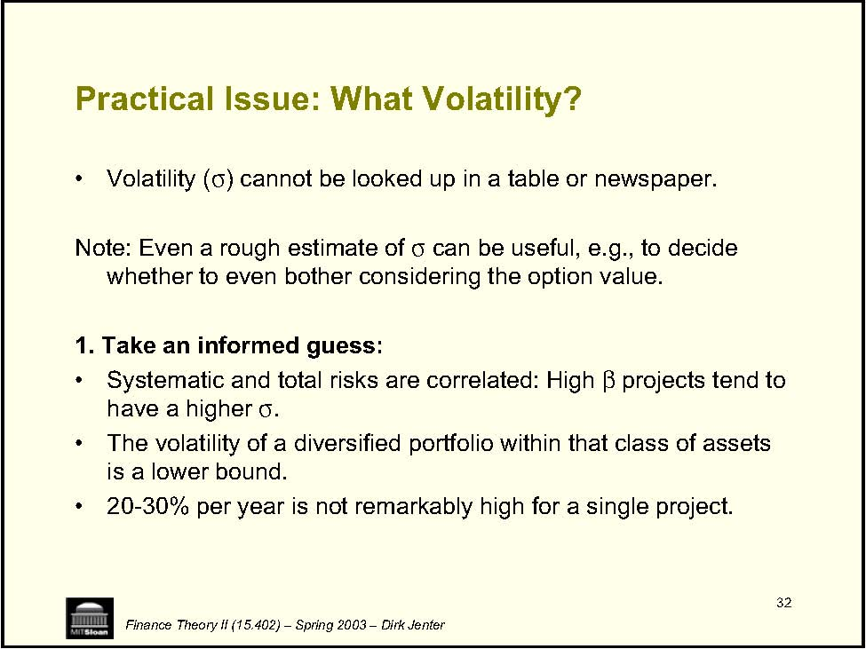

32 • σσ• βσ. • • Finance Theory II (15.402) – Spring 2003 – Dirk Jenter Practical Issue: What Volatility? Volatility () cannot be looked up in a table or newspaper. Note: Even a rough estimate of can be useful, e.g., to decide whether to even bother considering the option value. 1. Take an informed guess: Systematic and total risks are correlated: High projects tend to have a higher The volatility of a diversified portfolio within that class of assets is a lower bound. 20-30% per year is not remarkably high for a single project. 

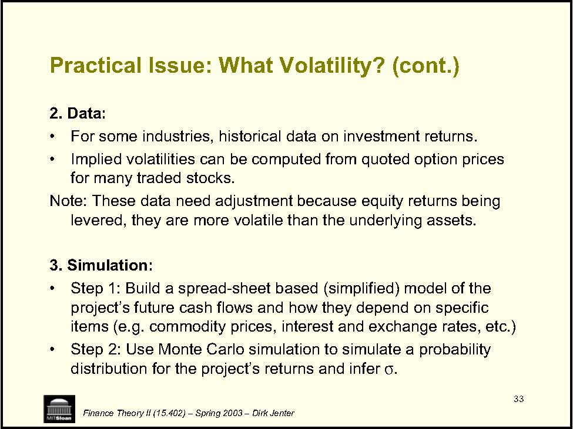

33 • • 3. Simulation: • • σ. Finance Theory II (15.402) – Spring 2003 – Dirk Jenter Practical Issue: What Volatility? (cont.) 2. Data: For some industries, historical data on investment returns. Implied volatilities can be computed from quoted option prices for many traded stocks. Note: These data need adjustment because equity returns being levered, they are more volatile than the underlying assets. Step 1: Build a spread-sheet based (simplified) model of the project’s future cash flows and how they depend on specific items (e.g. commodity prices, interest and exchange rates, etc.) Step 2: Use Monte Carlo simulation to simulate a probability distribution for the project’s returns and infer 

# Black-Scholes Formula 

•	Two numbers suffice: S ×(1 +r) T 

A	=and B =ı ×

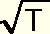

T 

X 

•	A table that gives the Black-Scholes’ call option value as a fraction of the stock price S (see table in handout): 

<Table>
<TR>

<TH>Black-Scholes Formula Columns: A     Rows: B </TH>

</TR>
<TR>

<TD>0.60 </TD>
<TD>0.65 </TD>
<TD>0.70 </TD>
<TD>0.75 </TD>

<TD>0.80 </TD>
<TD>0.86 </TD>
<TD>0.90 </TD>
</TR>
<TR>
<TD>0.50 </TD>
<TD>5.1 </TD>
<TD>6.6 </TD>
<TD>8.2 </TD>
<TD>10.0 </TD>

<TD>11.8 </TD>
<TD>14.2 </TD>
<TD>15.7 </TD>
</TR>
<TR>
<TD>0.55 </TD>
<TD>6.6 </TD>
<TD>8.3 </TD>
<TD>10.0 </TD>
<TD>11.9 </TD>

<TD>13.8 </TD>
<TD>16.1 </TD>
<TD>17.7 </TD>
</TR>
<TR>
<TD>0.60 </TD>
<TD>8.3 </TD>
<TD>10.1 </TD>
<TD>11.9 </TD>
<TD>13.8 </TD>

<TD>15.8 </TD>
<TD>18.1 </TD>
<TD>19.7 </TD>
</TR>
<TR>
<TD>0.65 </TD>
<TD>10.0 </TD>
<TD>11.9 </TD>
<TD>13.8 </TD>
<TD>15.8 </TD>

<TD>17.8 </TD>
<TD>20.1 </TD>
<TD>21.7 </TD>
</TR>
<TR>
<TD>0.70 </TD>
<TD>11.9 </TD>
<TD>13.8 </TD>
<TD>15.8 </TD>
<TD>17.8 </TD>

<TD>19.8 </TD>
<TD>22.1 </TD>
<TD>23.6 </TD>
</TR>
<TR>
<TD>0.75 </TD>
<TD>13.7 </TD>
<TD>15.8 </TD>
<TD>17.8 </TD>
<TD>19.8 </TD>

<TD>21.8 </TD>
<TD>24.1 </TD>
<TD>25.6 </TD>
</TR>
<TR>
<TD>0.80 </TD>
<TD>15.7 </TD>
<TD>17.7 </TD>
<TD>19.8 </TD>
<TD>21.8 </TD>

<TD>23.7 </TD>
<TD>26.0 </TD>
<TD>27.5 </TD>
</TR>
</Table>

Finance Theory II (15.402) – Spring 2003 – Dirk Jenter 

35 Black-Scholes Formula (cont.) • A could not • : • 0NPV1Aand A r)(1 X S PV(inv.) PV(cf)PI T &gt;⇔&gt;=¸¸ ¹· ¨¨ ©§ +==Finance Theory II (15.402) – Spring 2003 – Dirk Jenter The number captures phase 2’s value if the decision be delayed (but investment and cash flows still began in 2003). Indeed, in that case, A would be phase 2’s Profitability IndexThe option’s value increases with A (as shown in the table). 

36 Black-Scholes Formula (cont.) • B, is a measure of T. • →σis large →• σFinance Theory II (15.402) – Spring 2003 – Dirk Jenter The number , a.k.a. Cumulative Volatility“how much S can change” between now and the decision time Intuitively, S can change more: when S has more variance per year, i.e., when there is more time for S to change, i.e., T is large B captures the value of being able to delay the decision. Note: When B=0, only the project’s NPV matters (whether A&gt;1) because either the decision has to be taken now (T=0) or it might just as well be taken now as no news will arrive (=0). 

<Table>
<TR>
<TH>Oz Toys: Valuation </TH>
</TR>
<TR>
<TH>0.786(1.055)255.8r)(1S A 3T =×=+×=</TH>
<TD>and </TD>
<TD>B ×=σ</TD>
<TD>4. T ×=</TD>
<TD>0.6933 =</TD>
</TR>
<TR>
<TH>X </TH>
<TD>382 </TD>

</TR>
</Table>
<Table>
<TR>

<TH>Black-Scholes Formula </TH>

</TR>
<TR>

<TD>0.60 </TD>
<TD>0.65 </TD>
<TD>0.70 </TD>
<TD>0.75 </TD>

<TD>0.80 </TD>
<TD>0.86 </TD>
<TD>0.90 </TD>
</TR>
<TR>
<TD>0.50 </TD>
<TD>5.1 </TD>
<TD>6.6 </TD>
<TD>8.2 </TD>
<TD>10.0 </TD>

<TD>11.8 </TD>
<TD>14.2 </TD>
<TD>15.7 </TD>
</TR>
<TR>
<TD>0.55 </TD>
<TD>6.6 </TD>
<TD>8.3 </TD>
<TD>10.0 </TD>
<TD>11.9 </TD>

<TD>13.8 </TD>
<TD>16.1 </TD>
<TD>17.7 </TD>
</TR>
<TR>
<TD>0.60 </TD>
<TD>8.3 </TD>
<TD>10.1 </TD>
<TD>11.9 </TD>
<TD>13.8 </TD>

<TD>15.8 </TD>
<TD>18.1 </TD>
<TD>19.7 </TD>
</TR>
<TR>
<TD>0.65 </TD>
<TD>10.0 </TD>
<TD>11.9 </TD>
<TD>13.8 </TD>
<TD>15.8 </TD>

<TD>17.8 </TD>
<TD>20.1 </TD>
<TD>21.7 </TD>
</TR>
<TR>
<TD>0.70 </TD>
<TD>11.9 </TD>
<TD>13.8 </TD>
<TD>15.8 </TD>
<TD>17.8 </TD>

<TD>19.8 </TD>
<TD>22.1 </TD>
<TD>23.6 </TD>
</TR>
<TR>
<TD>0.75 </TD>
<TD>13.7 </TD>
<TD>15.8 </TD>
<TD>17.8 </TD>
<TD>19.8 </TD>

<TD>21.8 </TD>
<TD>24.1 </TD>
<TD>25.6 </TD>
</TR>
<TR>
<TD>0.80 </TD>
<TD>15.7 </TD>
<TD>17.7 </TD>
<TD>19.8 </TD>
<TD>21.8 </TD>

<TD>23.7 </TD>
<TD>26.0 </TD>
<TD>27.5 </TD>
</TR>
</Table>

V

- The value of phase 2 is (roughly)2 = 19% * S = .19 * 255.8 = $48.6M

V

- The value of the expansion program is1+ V2 = -3.7 + 48.6 = $44.9M

Finance Theory II (15.402) – Spring 2003 – Dirk Jenter 

38 Interpretation: • • →Sensitivity analysis →• Iterative process. • Finance Theory II (15.402) – Spring 2003 – Dirk Jenter Since we use simplified models, the results need to be taken with a grain of salt and interpreted. Put complexity back into the model with: Conditioning and qualifying of inferences Helps you identify the main levers of the project, and where you need to gather more data or fine tune the analysis. 

         Acrobat Distiller 6.0 (Windows)

         Compaq

         Compaq

         2004-01-22T11:29:11+05:30

         Acrobat PDFMaker 6.0 for PowerPoint

         2004-01-22T11:28:02+05:30

         2004-01-22T11:29:11+05:30

         uuid:dd61710b-925f-4e50-aebb-e4fbf76e2161

         uuid:3328e2cf-bf44-48cf-9c7d-c6a874496e55

         xml

               No Slide Title

               Leslie A. Larocca

Real Options

Katharina Lewellen

Finance Theory II

April 28, 2003

Real options

- Managers have many options to adapt and revise decisions in response to unexpected developments.

- Such flexibility is clearly valuable and should be accounted forin the valuation of a project or firm.

Real options, cont.

Imbedded options

- Follow-up investments

- Option to abandon the project

- Option to wait before investing

- Option to expand / change production methods

Key elements

- Information will arrive in the future

- Decisions can be made after receiving this information

Our plan

Last class

- Real options: basic intuition

- Simple DCF analysis of real options (decision trees)

Today

- Review of option pricing

- Why doesn’t simple DCF work quite well?

- Identifying real options

- Valuing real options using Black Scholes

1. Review of option pricing

Real options and financial options

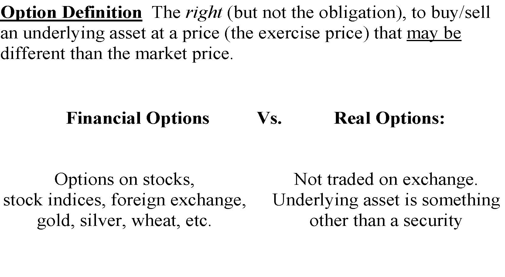

Option Definition  The right (but not the obligation), to buy/sell an underlying asset at a price (the exercise price) that may be different than the market price.   Financial Options          Vs.           Real Options:   Options on stocks, stock indices, foreign exchange,gold, silver, wheat, etc.   Not traded on exchange. Underlying asset is something other than a security   

Pricing of a call option on stock

Stock

Option (X = 110)

?

10

0

The challengeis to find the value of the call option today

S0= 100

S1= 120

S1= 80

Pricing of a call option on stock

- Consider the following strategy:

- Borrow money (or sell a bond with face value of B)

- Buy a N shares of stock

- Choose N and B so that the payoffs from the portfolio = option payoffs

?

10 = -B + N*120

0 = -B + N*80

B = 20

N = 0.25

Pricing of a call option on stock

- Our stock / bond portfolio has exactly the same payoffas the option

- So, the option and the portfolio must have the same value today

- Otherwise: arbitrage opportunity

- What is the value of the portfolio today (assume risk-free rate =4%)?

-B / (1+r) + N * S0=      -20 / 1.04 + 0.25 * 100      =     5.77

- We just priced the option.  Option value = $5.77.

Why standard DCF doesn’t work very well?

- Let’s value our option using standard DCF

- What discount rate should we use?

- Let’s try the required return on stock E[RS]

S0= 100

S1= 120

S1= 80

E[S1] = 112   =&gt;   E[RS] = 12%

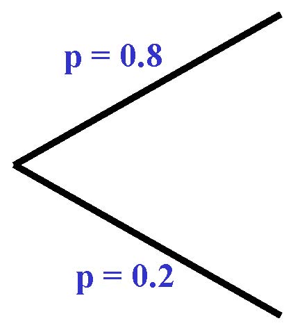

p = 0.8

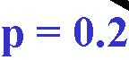

p = 0.2

Why standard DCF doesn’t work very well?

- DCF gives us the following option value:

(0.8 * 10 + 0.2 * 0) / 1.12 = $7.14   ≠$5.77

What’s wrong?

- Discount rate of 12% is too low =&gt; the option is riskier than the underlying stock

Why?

- Option is a levered position in a stock. 

- Recall the analogy with firms’ financial leverage: Higher financial leverage =&gt; higher equity betas and equity returns.

Option is a levered position in a stock

- Recall our replicating portfolio: Borrow B/(1+r) and buy N shares of stock

- Suppose that stock beta = 1 and market premium = 8%

- Note that this works.  CAPM: 12% = 4% + 1 * 8%

- What is option beta?

βoption= wbond* βbond+ wstock* βstock=  4.33

0         25/5.77 * 1

So, the required return on the option is 38% = 4% + 4.33 * 8%And the option value is again:  $5.77 = 8 / 1.38

How about multiple periods?

100

96

64

T=0T=1T=2

- In principle, we can value the option the same way as before

- Start at time T=2 and move backwards

- But several things change at each node:

- Replicating portfolio, option beta, discount rate

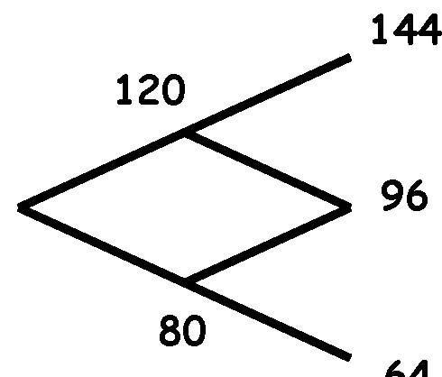

12080144

This can become quite tediousThat’s where option pricing models such as Black-Scholescome in.

Options valuation techniques

- “Dynamic” DCF (decision trees)

- Recall our “Handheld PC” and “Copper Mine” examples

- Approximationused for real-options problems

- Not an exact answer because of problems with discounting

- Binomial model

- Similar to our one-period example from today’s class

- Requires more computations than Black-Scholes

- Can be useful when Black-Scholesdoesn’t work very well

- Black-Scholes

- We will focus on this model from now on

Black-Scholesformula

- Black-Scholesformula relies on the same valuation principles as the binomial model (replicating portfolios, no arbitrage)

Option value = N(d1) * S –N(d2) * PV(X)

- Note the similarities to the one-period binomial model

Option value = N * S –PV(B)

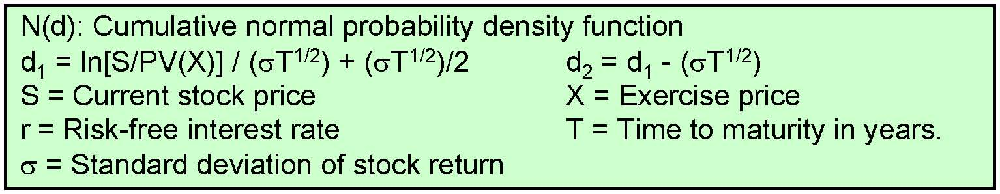

N(d): Cumulative normal probability density functiond1= ln[S/PV(X)] / (σT1/2) + (σT1/2)/2d2= d1-(σT1/2)S = Current stock priceX = Exercise pricer = Risk-free interest rateT = Time to maturity in years.σ= Standard deviation of stock return

Recall “Handheld PC” example

Model B NPV (t=3) = 16,557go for it

Model B NPV (t=3) = -21,148drop it

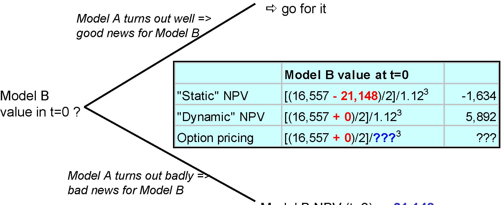

Model A turns out well =&gt; good news for Model BModel A turns out badly =&gt; bad news for Model BModel B value in t=0 ?Model B value at t=0"Static" NPV[(16,557 - 21,148)/2]/1.123-1,634"Dynamic" NPV[(16,557 + 0)/2]/1.1235,892Option pricing[(16,557 + 0)/2]/???3???

2. Identifying Real Options

Two Issues with Real Options

Identification

- Are there real options imbedded in this project?

- What type of options?

Valuation

- How do we value options?

- How do we value different types of options?

- Can’t we just use NPV?

Identifying Real Options

- It is important to identify the options imbedded in a project. 

- There are options imbedded in all but the most trivial projects.

- All the art consists in:

- Identifying those that are “significant”, if any

- Ignoring those that are not

- Identifying real options takes practice, and sometimes “vision”.

Identifying Real Options (cont.)

- Look for clues in the project’s description: “Phases”, “Strategic investment”, “Scenarios”, …

- Examine the pattern of cash flows and expenditures over time. For instance, large expenditures are likely to be discretionary.

- Taxonomy of frequently encountered options :

- Growth option

- Abandonment option

- Option to expand or contract scale

- Timing

- Option to switch (inputs, outputs, processes, etc.)

Is There An Option?

- Two conditions:

(1) News will possibly arrive in the future;

(2) When it arrives, the news may affect decisions.

- Search for the uncertainty that managers face:

- What is the main thing that managers will learn over time?

- How will they exploit that information?

Oz Toys’ Expansion Program

- Oz Toys’ management is considering building a new plant to exploit innovations in process technology.

- About three years out, the plant’s capacity may be expanded to allow Oz Toys’ entry into two new markets.

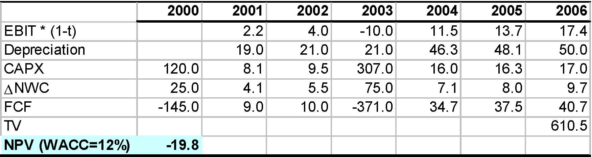

2000200120022003200420052006EBIT * (1-t)2.24.0-10.011.513.717.4Depreciation19.021.021.046.348.150.0CAPX120.08.19.5307.016.016.317.0∆NWC25.04.15.575.07.18.09.7FCF-145.09.010.0-371.034.737.540.7TV610.5NPV (WACC=12%)-19.8

Oz Toys: Is There An Option?

(1) Oz Toys might learn (or not) about:

- The demand for the current and/or new products

- The possibility of rivals entering the market

- Etc.

(2) The information might affect (or not) Oz Toys’ decision:

- Whether or not to undertake expansion phase 1 at all

- Whether to undertake phase 2 (or even phase 3,…)

- Whether to push one new product or the other

- Etc.

Oz Toys: Identifying the Option

- Project’s description refers to two distinct phases

- Phase 1: New plant

- Phase 2: Expansion

- Spike in spending: Probably discretionary

- Possibly, an imbedded growth option

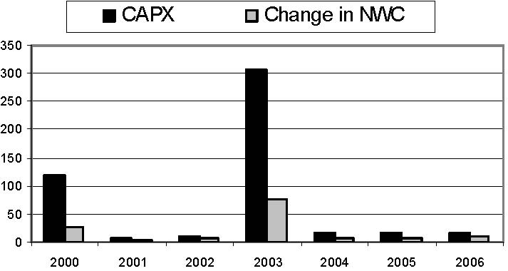

0501001502002503003502000200120022003200420052006CAPXChange in NWC

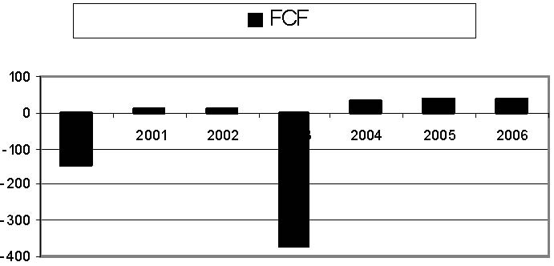

FCF-400-300-200-10001002000200120022003200420052006FCF

Practical Issue #1: Simplifications

- Real projects, especially long-horizon ones, are complex:

- They often combine assets-in-place and options.

- Options are nested.

- Simplifying assumptions are needed:

- To allow the technical valuation analysis

- To keep the model flexible

- To keep the model understandable to you and others (especially others involved in the decision process)

Practical Issue #1: Simplifications (cont.)

- Cut the project into pieces corresponding to simple options.

- Search for the primaryuncertainty that managers face

- A simplified model that dominates (is dominated) by the project gives an upper (a lower) bound for the project’s value, e.g.,:

- Using European rather than American options

- Ignoring some of the options

- Ignoring some adverse effects of waiting (e.g. possible entry)

Oz Toys: Simplifications

- Value phase 1 and phase 2 separately.

- Focus on the option to undertake expansion phase 2 or not.

- Assume all other options are “negligible”

- Assume that phase 2 is to be undertaken in 2003 or never.

European Call option

3. Valuing Real Options

Valuation of Real Options

- Tools developed to value financial options can be useful to estimate the value of real options embedded in some projects.

- Real options are much more complex than financial options. 

- The aim here is to develop numerical techniques to “keep score” and assist in the decision-making process, not provide a recipe to replace sound business sense.

Options vs. DCF

- The real options approach is often presented as an alternative to DCF.

- In fact, the real options’ approach does not contradict DCF: It is a particular form that DCF takes for certain types of investments.

- Recall that option valuation techniques were developed because discounting is difficult

- I.e., due to the option, one should not use the same discount rate (e.g. WACC) for all cash flows.

Options vs. DCF (cont.)

- DCF method:

- “expected scenario” of cash flows,

- discount the expected cash flows

- This is perfectly fine as long as:

- expected cash flows are estimated properly

- discount rates are estimated properly

- Precisely, it is complex to account for options in estimating:

- expected cash flow

- discount rates

Start with the “static” DCF Analysis

- Begin by valuing the project as if there was no option involved

- Pretend that the investment decision must be takenimmediately.

- This benchmark constitute a lower boundfor the project’s value.

- NPV&lt;0 does not mean that you will never want to undertake the investment.

- NPV&gt;0 does not mean that you should go ahead immediately with the invest (nor that you will definitely invest in the future).

Oz Toys: DCF Analysis

- Disentangling the two phases.

- Requires making judgments about:

- Which expenses are discretionary vs. non-discretionary

- Which cash inflows/outflows are associated with each phase

- Note: Sometimes, simply retrieve disaggregated data used to construct the summary DCF analysis.

Oz Toys: Valuing Phases 1 and 2

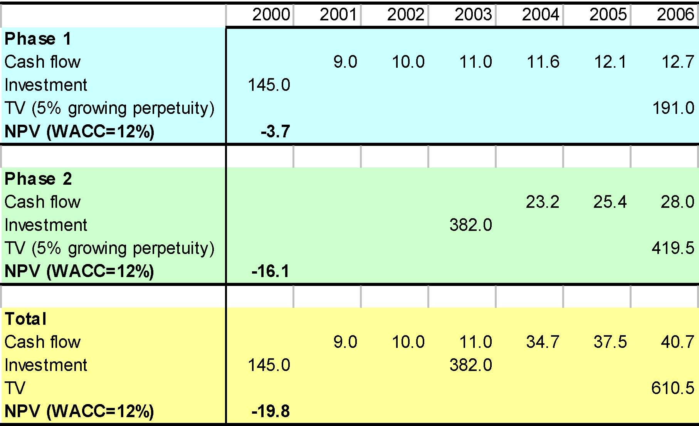

2000200120022003200420052006Phase 1Cash flow9.010.011.011.612.112.7Investment145.0TV (5% growing perpetuity)191.0NPV (WACC=12%)-3.7Phase 2Cash flow23.225.428.0Investment382.0TV (5% growing perpetuity)419.5NPV (WACC=12%)-16.1TotalCash flow9.010.011.034.737.540.7Investment145.0382.0TV610.5NPV (WACC=12%)-19.8

Oz Toys: DCF Analysis (cont.)

- Both phases have negative NPV

- Phase 2’s NPV is probably largely overstated:

- Investment ($382M) is likely to be less risky than cash flows.

- Using the three-year risk-free rate of 5.5%

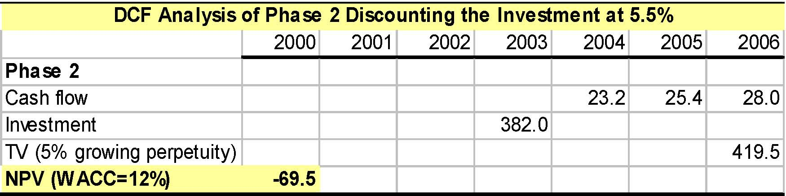

2000200120022003200420052006Phase 2Cash flow23.225.428.0Investment382.0TV (5% growing perpetuity)419.5NPV (WACC=12%)-69.5DCF Analysis of Phase 2 Discounting the Investment at 5.5%

Valuing the Option

- The strategy is to map the project into a simple option and use financial valuation tools to price the option: Black-Scholesformula.

- Oftentimes, this involves making somewhat heroic assumptions about the project.

Mapping: Project Call Option

<Table>
<TR>
<TD>

Project

</TD>

<TD>

Call Option

</TD>
</TR>
<TR>
<TD>

Expenditure required to acquire the assets

</TD>
<TD>

X

</TD>
<TD>

Exercise price

</TD>
</TR>
<TR>
<TD>

Value of the operating assets to be acquired

</TD>
<TD>

S

</TD>
<TD>

Stock price (price of the underlying asset)

</TD>
</TR>
<TR>
<TD>

Length of time the decision may be deferred

</TD>
<TD>

T

</TD>
<TD>

Time to expiration

</TD>
</TR>
<TR>
<TD>

Riskinessof the operating assets

</TD>
<TD>

σ2

</TD>
<TD>

Variance of stock return

</TD>
</TR>
<TR>
<TD>

Time value of money

</TD>
<TD>

r

</TD>
<TD>

Risk-free rate of return

</TD>
</TR>
</Table>

Oz Toys: The 5 Variables

<Table>
<TR>
<TD>

X

</TD>
<TD>

Investment needed in 2003 to obtain the phase 2 assets.

</TD>
<TD>

$382M

</TD>
</TR>
<TR>
<TD>

S

</TD>
<TD>

PV of phase 2’s cash flows.

</TD>
<TD>

$255.8

</TD>
</TR>
<TR>
<TD>

T

</TD>
<TD>

It seems that phase 2 can be deferred for 3 years (Check with managers).

</TD>
<TD>

3 years

</TD>
</TR>
<TR>
<TD>

r

</TD>
<TD>

3-year risk-free rate (Check yield curve).

</TD>
<TD>

5.5%

</TD>
</TR>
<TR>
<TD>

σ2

</TD>
<TD>

Variance per year on phase 2 assets. Can’t get it from DCF spreadsheet.

</TD>
<TD>

Say 40%

</TD>
</TR>
</Table>

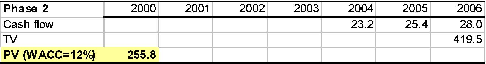

Phase 22000200120022003200420052006Cash flow23.225.428.0TV419.5PV (WACC=12%)255.8

Practical Issue #2: What Volatility?

- Volatility (σ) cannot be looked up in a table or newspaper.

- Note: Even a rough estimate of σcan be useful, e.g., to decide whether to even bother considering the option value.

1. Take an informed guess:

- Systematic and total risks are correlated: High βprojects tend to have a higher σ.

- The volatility of a diversified portfolio within that class of assets is a lower bound.

- 20-30% per year is not remarkably high for a single project.

Practical Issue #2: What Volatility? (cont.)

2. Data:

- For some industries, historical data on investment returns.

- Implied volatilities can be computed from quoted option prices for many traded stocks

- Note: These data need adjustment because equity returns being levered, they are more volatile than the underlying assets.

Practical Issue #2: What Volatility? (cont.)

3. Simulation:

- Step 1: Build a spread-sheet based (simplified) model of the project’s future cash flows

- Model how CFs depend on specific items (e.g. commodity prices, interest and exchange rates, etc.)

- Step 2: Use Monte Carlo simulation to simulate a probability distribution for the project’s returns and infer σ.

Black-ScholesFormula

- Two numbers suffice:

- A table that gives the Black-Scholes’ call option value as a fraction of the stock price S (see handout)

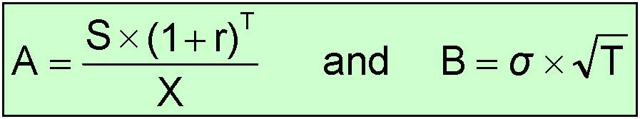

TB     and      Xr)(1SAT×=+×=σ

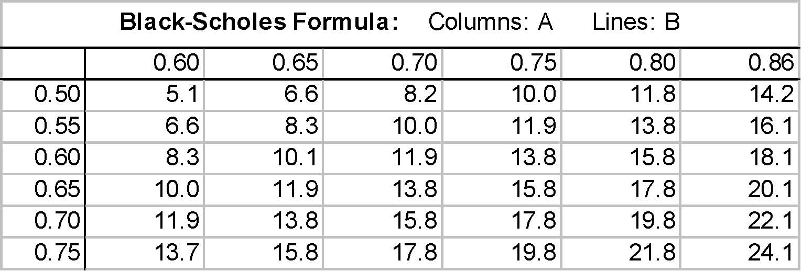

0.600.650.700.750.800.860.505.16.68.210.011.814.20.556.68.310.011.913.816.10.608.310.111.913.815.818.10.6510.011.913.815.817.820.10.7011.913.815.817.819.822.10.7513.715.817.819.821.824.1Black-Scholes Formula:    Columns: A     Lines: B

Black-ScholesFormula (cont.)

- The number A captures phase 2’s value if the decisioncould not be delayed (but investment and cash flows still began in 2003).

- Indeed, in that case, A would be phase 2’s Profitability Index:

- The option’s value increases with A (as shown in the table).

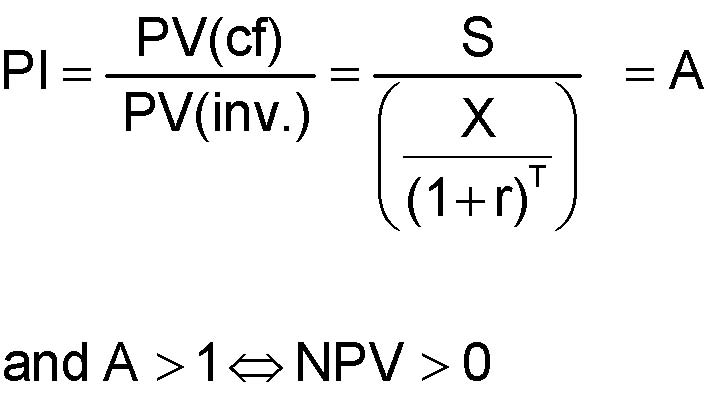

0NPV  1 AandA   r)(1XSPV(inv.) PV(cf)PIT&gt;⇔&gt;=⎟⎟⎠⎞⎜⎜⎝⎛+==

Black-ScholesFormula (cont.)

- The number B, Cumulative Volatility, is a measure of “how much S can change” between now and the decision time T.

- Intuitively, S can change more:

- when S has more variance per year, i.e., σis large

- when there is more time for S to change, i.e., T is large

- B captures the value of being able to delay the decision.

Note:When B=0, only the project’s NPV matters (whether A&gt;1) because either the decision has to be taken now (T=0) or it might just as well be taken now as no news will arrive (σ=0).

Oz Toys: Valuation

- The value of phase 2 is (roughly): V2= 19% * S = .19 * 255.8 = $48.6M

- The value of the expansion program is: V1 + V2= -3.7 + 48.6 = $44.9M

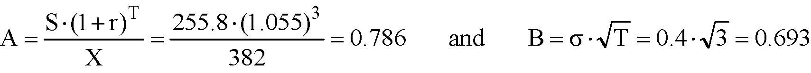

693.034.0TB       and       786.0382)055.1(8.255X)r1(SA3T=⋅=⋅σ==⋅=+⋅=

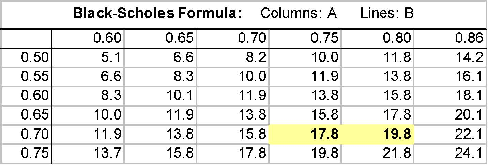

0.600.650.700.750.800.860.505.16.68.210.011.814.20.556.68.310.011.913.816.10.608.310.111.913.815.818.10.6510.011.913.815.817.820.10.7011.913.815.817.819.822.10.7513.715.817.819.821.824.1Black-Scholes Formula:    Columns: A     Lines: B

Practical Issue #3: Checking the Model

- Formal option pricing models make distributional assumptions.

- Approach 1: Try and find a model that is close to your idea of the real distribution (More and more are available).

- Approach 2: Determine the direction in which the model biases the analysis, and use the result as an upper or lower bound.

- Approach 3: Simulate the project as a complex decision tree and solve by brute force with a computer (i.e., not analytically).

Practical Issue #4: Interpretation

- Since we use simplified models, the results need to be taken with a grain of salt and interpreted.

- Put complexity back into the model with:

- Sensitivity analysis

- Conditioning and qualifying of inferences

- Iterative process.

- Helps you identify the main levers of the project, and where youneed to gather more data or fine tune the analysis.

         Acrobat Distiller 6.0 (Windows)

         2004-01-21T10:47:28+05:30

         2004-01-21T10:49:59+05:30

         2004-01-21T10:49:59+05:30

         PScript5.dll Version 5.2

         uuid:5dac05bd-294b-498e-a6a1-778555d588be

         uuid:abe07c6c-5c3c-4a4c-88f8-9e7a5c6c8fc4

         xml

               djenter

               Microsoft PowerPoint - LN21(ValComp).ppt

Valuing Companies Finance Theory II (15.402) – Spring 2003 – Dirk Jenter 

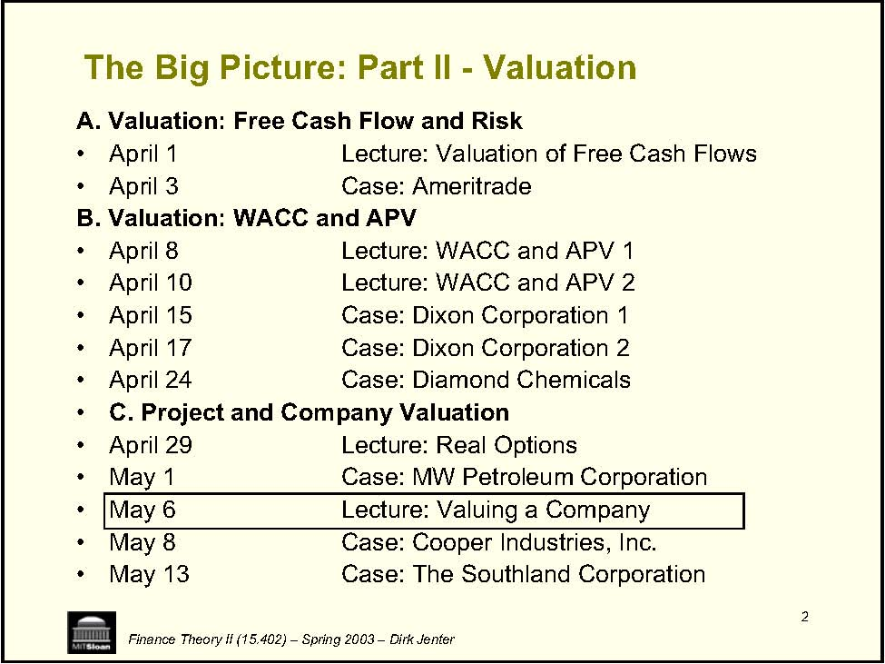

2 • • • • • • • • • • • • • Finance Theory II (15.402) – Spring 2003 – Dirk Jenter The Big Picture: Part II -Valuation A. Valuation: Free Cash Flow and Risk April 1 Lecture: Valuation of Free Cash Flows April 3 Case: Ameritrade B. Valuation: WACC and APV April 8 Lecture: WACC and APV 1 April 10 Lecture: WACC and APV 2 April 15 Case: Dixon Corporation 1 April 17 Case: Dixon Corporation 2 April 24 Case: Diamond Chemicals C. Project and Company Valuation April 29 Lecture: Real Options May 1 Case: MW Petroleum Corporation May 6 Lecture: Valuing a Company May 8 Case: Cooper Industries, Inc. May 13 Case: The Southland Corporation 

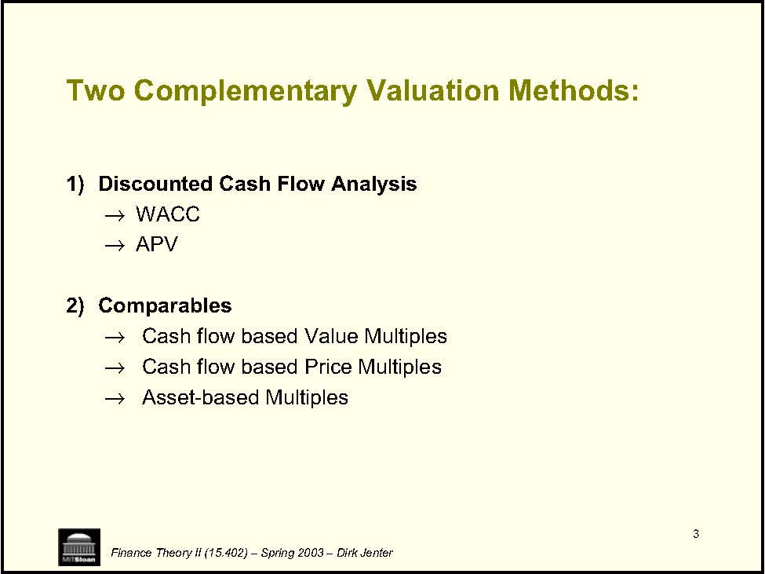

3 1) →WACC →APV →Cash flow based Value Multiples →→Asset-based Multiples Finance Theory II (15.402) – Spring 2003 – Dirk Jenter Two Complementary Valuation Methods: Discounted Cash Flow Analysis 2) Comparables Cash flow based Price Multiples 

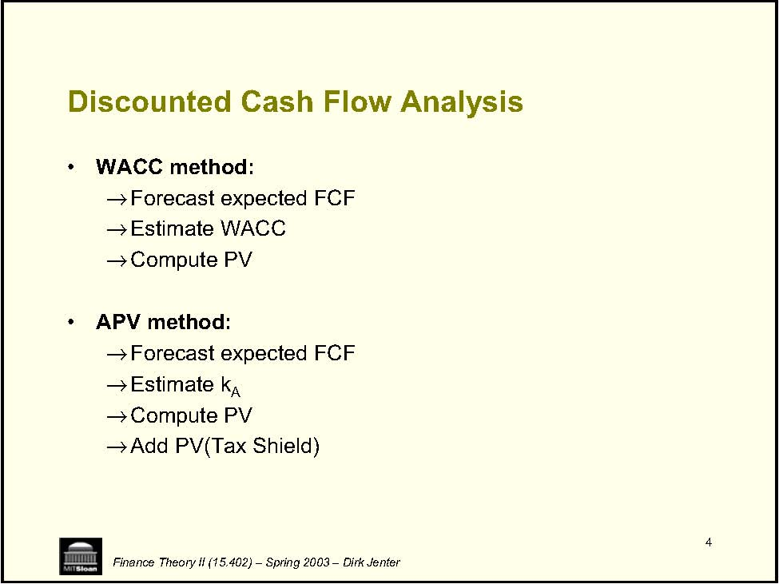

4 • →→→Compute PV • APV method: →→Estimate kA →Compute PV →Add PV(Tax Shield) Finance Theory II (15.402) – Spring 2003 – Dirk Jenter Discounted Cash Flow Analysis WACC method: Forecast expected FCF Estimate WACC Forecast expected FCF 

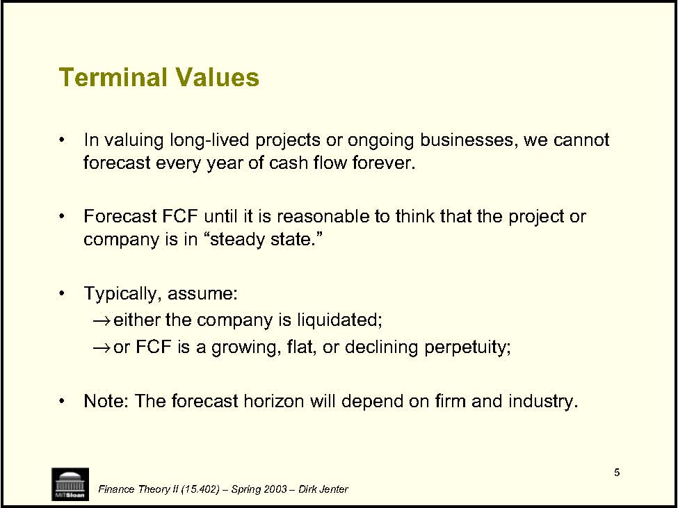

5 Terminal Values • • • →→• Finance Theory II (15.402) – Spring 2003 – Dirk Jenter In valuing long-lived projects or ongoing businesses, we cannot forecast every year of cash flow forever. Forecast FCF until it is reasonable to think that the project or company is in “steady state.” Typically, assume: either the company is liquidated; or FCF is a growing, flat, or declining perpetuity; Note: The forecast horizon will depend on firm and industry. 

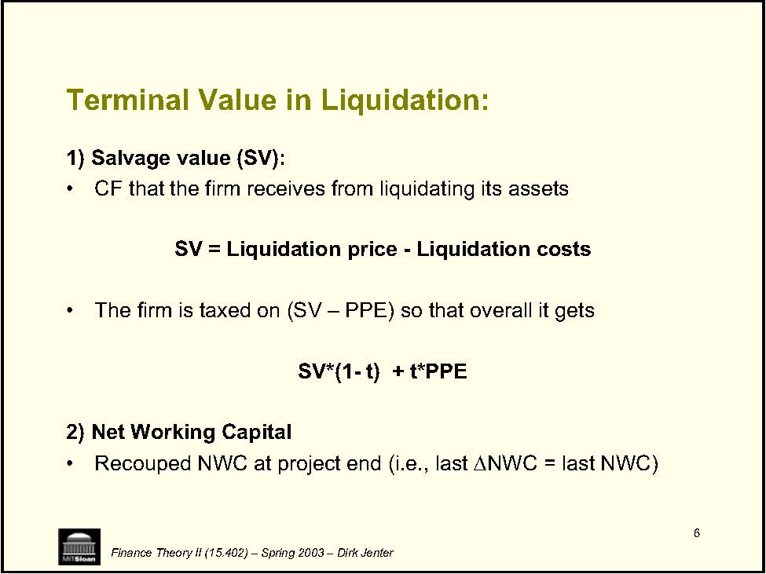

6 • • • ∆Finance Theory II (15.402) – Spring 2003 – Dirk Jenter Terminal Value in Liquidation: 1) Salvage value (SV): CF that the firm receives from liquidating its assets SV = Liquidation price -Liquidation costs The firm is taxed on (SV – PPE) so that overall it gets SV*(1-t)  + t*PPE 2) Net Working Capital Recouped NWC at project end (i.e., last NWC = last NWC) 

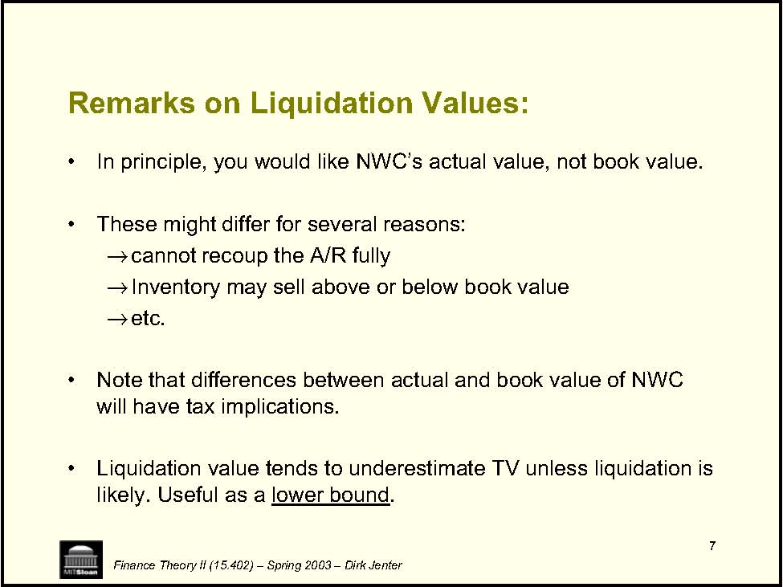

7 • • →→→etc. • • . Finance Theory II (15.402) – Spring 2003 – Dirk Jenter Remarks on Liquidation Values: In principle, you would like NWC’s actual value, not book value. These might differ for several reasons: cannot recoup the A/R fully Inventory may sell above or below book value Note that differences between actual and book value of NWC will have tax implications. Liquidation value tends to underestimate TV unless liquidation is likely. Useful as a lower bound

8 • C/k. Æ TV = FCF/ k • FCF = EBIT(1-t) ∆0 0 / k Finance Theory II (15.402) – Spring 2003 – Dirk Jenter Terminal Value as Perpetuity: No-growth perpetuity: PV in year t of a flat perpetuity starting in year (t+1) with first payment C, and discount rate k is T+1 For a no-growth firm, we often assume (for simplicity) + Depreciation – CAPX – NWC TV = (1-t)EBITT+1 

9 • Æ TV = FCFT+1 • FCF = EBIT(1-t) ∆-∆T(1+g)(1-t)EBITT Finance Theory II (15.402) – Spring 2003 – Dirk Jenter Terminal Value as Growing Perpetuity: PV in year t of a perpetuity starting in year (t + 1) with first payment C, growth rate g, and discount rate k is C/(k -g) / (k – g) For a growing perpetuity, we often assume (for simplicity) + Depreciation – CAPX – NWC NA = -g*NA prior year TV = [(1-t)EBITT+1 – g*NA] / (k -g) 

10 Remarks • →→∆• • • A Finance Theory II (15.402) – Spring 2003 – Dirk Jenter Growing perpetuity – assumptions: Net assets grow at the same rate as profits. NA is a good measure of replacement costs. Don’t forget to discount TV further to get PVTV. In WACC method, k=WACC. IN APV method, k=kfor FCF and appropriate rate for TS. 

11 When is Growth Valuable? k t)EBIT(1 gk NAgt)(1 −&gt;−⋅−−⋅+k k1 k NA t)EBIT(1 gkt)EBIT(1kNAgt)(1 k t)EBIT(1 gk NAgt)(1 ≈+&gt;−−×−&gt;×⋅−−⋅+−&gt;−⋅−−⋅+Need to compare the terminal value with growth to the value without growth: Finance Theory II (15.402) – Spring 2003 – Dirk Jenter EBIT(1 g) EBIT(1 g) EBIT(1 g) TV (with growth) &gt; TV (w/o growth) EBIT*(1 -t) -k*NA &gt; 0 

12 Finance Theory II (15.402) – Spring 2003 – Dirk Jenter Economic Value Added (EVA): EVA = EBIT*(1 -t) -k*NA Intuition: Growth is good when the cost of increasing NA is more than compensated by the capitalized increase in EBIT*(1 -t). 

13 EVA: Some remarks • implications. • • • • • Finance Theory II (15.402) – Spring 2003 – Dirk Jenter EVA is a snap shot measure, disregards future cash flow Use EVA as... … a simple measure to determine whether the business is generating value and whether growth is enhancing value. … as a way of setting goals to enhance value. Beware of EVA for... … young companies. … companies in rapidly changing business environments. … companies where book values are not accurate measures of replacement costs. 

14 Strengths • • • • • • • Finance Theory II (15.402) – Spring 2003 – Dirk Jenter DCF Analysis: Pros and Cons CF comes from specific forecasts and assumptions. Can see impact of changes in strategies. Valuation tied to underlying fundamentals. Weaknesses CF only as good as your forecasts/assumptions. Might “forget something”. Need to forecast managerial behavior (unless you’re in control). Need to estimate the discount rate using a theory (e.g. CAPM) that may be incorrect or imprecise in this particular case. 

15 • • →• →• →Finance Theory II (15.402) – Spring 2003 – Dirk Jenter Valuation by Multiples: Assess the firm’s value based on that of publicly traded comparables. Cash-flow-based Value multiples: MV of firm/Earnings, MV of firm /EBITDA, MV of firm /FCF Cash-flow-based Price multiples: Price/Earnings (P/E), Price/EBITDA, Price/FCF Asset-based multiples: MV of firm/BV of assets, MV of equity/BV of equity 

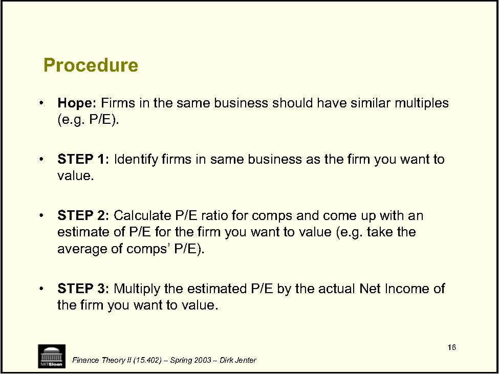

16 • Hope: • STEP 1: value. • STEP 2: average of comps’ P/E). • STEP 3: Finance Theory II (15.402) – Spring 2003 – Dirk Jenter Procedure Firms in the same business should have similar multiples (e.g. P/E). Identify firms in same business as the firm you want to Calculate P/E ratio for comps and come up with an estimate of P/E for the firm you want to value (e.g. take the Multiply the estimated P/E by the actual Net Income of the firm you want to value. 

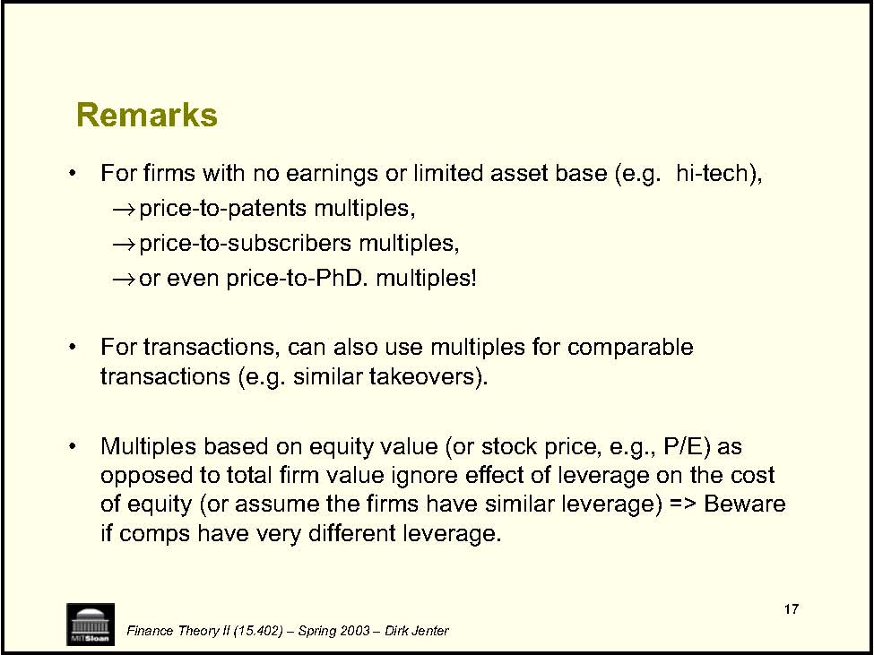

17 Remarks • →→price-to-subscribers multiples, →• • Finance Theory II (15.402) – Spring 2003 – Dirk Jenter For firms with no earnings or limited asset base (e.g.  hi-tech), price-to-patents multiples, or even price-to-PhD. multiples! For transactions, can also use multiples for comparable transactions (e.g. similar takeovers). Multiples based on equity value (or stock price, e.g., P/E) as opposed to total firm value ignore effect of leverage on the cost of equity (or assume the firms have similar leverage) =&gt; Beware if comps have very different leverage. 

18 Motivation for Multiples? • • =&gt; Ÿ →→→• Finance Theory II (15.402) – Spring 2003 – Dirk Jenter If the firm’s actual FCF are a perpetuity: MV firm = FCF/(WACC-g)  MV firm/FCF = 1/(WACC-g) Comps will have a similar MV firm/FCF provided: their FCFs are also a perpetuity they have the same WACC (requires similar D/(D+E)) they are growing at a similar rate Since these are rough approximations (at best), you may want to check if using different multiples give you similar answers. If not, find out why not. 

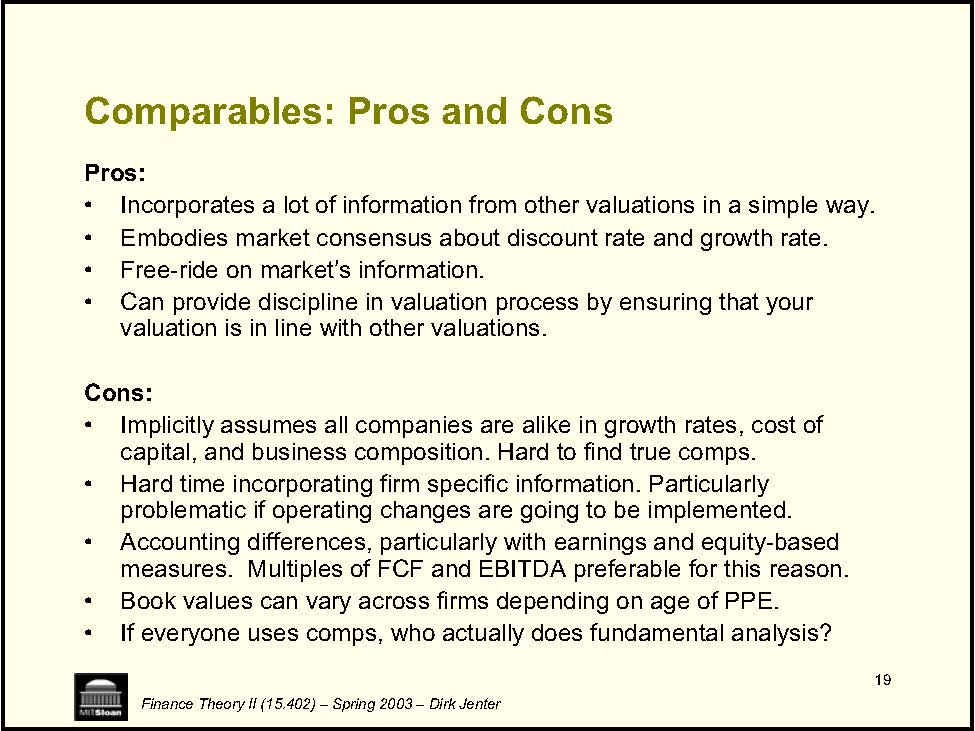

19 Comparables: Pros and Cons Pros: • • • • Cons: • • • measures. • • Finance Theory II (15.402) – Spring 2003 – Dirk Jenter Incorporates a lot of information from other valuations in a simple way. Embodies market consensus about discount rate and growth rate. Free-ride on market’s information. Can provide discipline in valuation process by ensuring that your valuation is in line with other valuations. Implicitly assumes all companies are alike in growth rates, cost of capital, and business composition. Hard to find true comps. Hard time incorporating firm specific information. Particularly problematic if operating changes are going to be implemented. Accounting differences, particularly with earnings and equity-based Multiples of FCF and EBITDA preferable for this reason. Book values can vary across firms depending on age of PPE. If everyone uses comps, who actually does fundamental analysis? 

20 APPENDIX Finance Theory II (15.402) – Spring 2003 – Dirk Jenter 

21 Example • • 20 50 30 22 25 26 30 5 5 6 7 8 10 15 6 Finance Theory II (15.402) – Spring 2003 – Dirk Jenter You are considering the acquisition of XYZ Enterprises. XYZ’s balance sheet looks like this as of today (year 0). Projections: Assets Liabilities Current assets 50 Current liabilities Plant Debt Net worth 50 Total 100 Total 100 Year 1 Year 2 Year 3 Year 4 Year 5 Sales 200 217 239 270 293 EBIT 20 NWC 33 37 41 44 48 Depreciation CAPX 10 20 

22 Example (cont.) • Finance Theory II (15.402) – Spring 2003 – Dirk Jenter Assuming tax rate t = 34% and WACC = 13%, what is the value of XYZ’s stock under the following assumptions past year 5: 1) XYZ is liquidated after year 5 (assuming zero salvage value). 2) Sales growth slows to g = 5% and EBIT/Sales remains about 10%. 3) Sales stop growing (g = 0), and EBIT/Sales remains around 10%. 4) Sales growth slows to g = 5%, and EBIT/Sales drop to 5%. 5) Sales stop growing (g = 0), and EBIT/Sales drop to 5%. 

Example (cont.) 

# Start by estimating FCF over 5 years: 

•	NWC(year 0) = Current assets -current liabs = 50-20=30 FCF = EBIT(1 -t) + Dep -CAPX -∆NWC 

<Table>
<TR>

<TH>Year 0 </TH>
<TH>Year 1 </TH>
<TH>Year 2 </TH>
<TH>Year 3 </TH>
<TH>Year 4 </TH>
<TH>Year 5 </TH>
</TR>
<TR>
<TH>EBIT </TH>

<TD>20 </TD>
<TD>22 </TD>
<TD>25 </TD>
<TD>26 </TD>
<TD>30 </TD>
</TR>
<TR>
<TH>EBIT(1-t) </TH>

<TD>13.2 </TD>
<TD>14.52 </TD>
<TD>16.5 </TD>
<TD>17.16 </TD>
<TD>19.8 </TD>
</TR>
<TR>
<TH>NWC </TH>
<TD>30 </TD>
<TD>33 </TD>
<TD>37 </TD>
<TD>41 </TD>
<TD>44 </TD>
<TD>48 </TD>
</TR>
<TR>
<TH>∆NWC </TH>

<TD>3 </TD>
<TD>4 </TD>
<TD>4 </TD>
<TD>3 </TD>
<TD>4 </TD>
</TR>
<TR>
<TH>Depreciation </TH>

<TD>5 </TD>
<TD>5 </TD>
<TD>6 </TD>
<TD>7 </TD>
<TD>8 </TD>
</TR>
<TR>
<TH>CAPX </TH>

<TD>10 </TD>
<TD>10 </TD>
<TD>15 </TD>
<TD>6 </TD>
<TD>20</TD>
</TR>
<TR>
<TH>  FCF </TH>

<TD>5.2 </TD>
<TD>5.52 </TD>
<TD>3.5 </TD>
<TD>15.16 </TD>
<TD>3.8 </TD>
</TR>
<TR>
<TH>PV @ 13% </TH>
<TD>22.7 </TD>

</TR>
</Table>

Finance Theory II (15.402) – Spring 2003 – Dirk Jenter 

24 Example (cont.) ==&gt; 33.5 Finance Theory II (15.402) – Spring 2003 – Dirk Jenter 1) Liquidation value (LV) t*PPE(year 5) + NWC(year5) PPE(year 5) = PPE(year 0) + all CAPX -all Dep from year 0 to 5 ==&gt; PPE = 50+(10+10+15+6+20)-(5+5+6+7+8) = 80 ==&gt; PPE * t = 80 * 34% = 27.2 LV = 27.2 + 48 = 75.2     PVLV = 75.2/(1.13)5 = 40.8 Firm value = 22.7 + 40.8 = 63.5 Equity value = Firm value -MV of Debt = 63.5 -30 = 

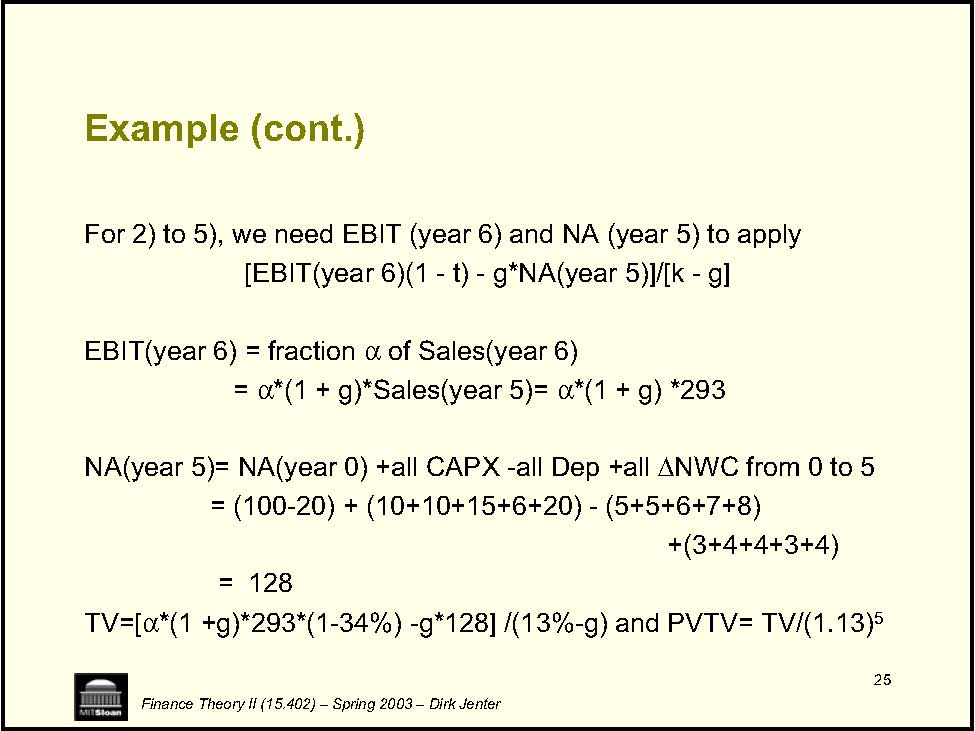

25 Example (cont.) α= αα∆= 128 TV=[α5 Finance Theory II (15.402) – Spring 2003 – Dirk Jenter For 2) to 5), we need EBIT (year 6) and NA (year 5) to apply [EBIT(year 6)(1 -t) -g*NA(year 5)]/[k -g] EBIT(year 6) = fraction of Sales(year 6) *(1 + g)*Sales(year 5)= *(1 + g) *293 NA(year 5)= NA(year 0) +all CAPX -all Dep +all NWC from 0 to 5 = (100-20) + (10+10+15+6+20) -(5+5+6+7+8) +(3+4+4+3+4) *(1 +g)*293*(1-34%) -g*128] /(13%-g) and PVTV= TV/(1.13)

Example (cont.)

<Table>
<TR>

<TH>α</TH>
<TH>g </TH>
<TH>TV </TH>
<TH>PVTV </TH>
<TH>Firm </TH>
<TH>Equity </TH>
</TR>
<TR>
<TD>2) </TD>
<TD>10% </TD>
<TD>5% </TD>
<TD>173.8 </TD>
<TD>94.3 </TD>
<TD>117.0 </TD>
<TD>87.0 </TD>
</TR>
<TR>
<TD>3) </TD>
<TD>10% </TD>
<TD>0% </TD>
<TD>148.8 </TD>
<TD>80.7 </TD>
<TD>103.4 </TD>
<TD>73.4 </TD>
</TR>
<TR>
<TD>4) </TD>
<TD>5% </TD>
<TD>5% </TD>
<TD>46.9 </TD>
<TD>25.5 </TD>
<TD>48.2 </TD>
<TD>18.2 </TD>
</TR>
<TR>
<TD>5) </TD>
<TD>5% </TD>
<TD>0% </TD>
<TD>74.4 </TD>
<TD>40.4 </TD>
<TD>63.1 </TD>
<TD>33.1 </TD>
</TR>
</Table>

Finance Theory II (15.402) – Spring 2003 – Dirk Jenter 

         Acrobat Distiller 6.0 (Windows)

         Compaq

         Compaq

         Acrobat PDFMaker 6.0 for PowerPoint

         2004-01-22T11:35:21+05:30

         2004-01-22T11:34:10+05:30

         2004-01-22T11:35:21+05:30

         uuid:73657b46-7898-421a-a1b7-24e67c27a9d8

         uuid:8068ba45-1083-4aa2-ac6b-db50b5df1530

         xml

               No Slide Title

               Leslie A. Larocca

Valuing Companies

Katharina Lewellen

Finance Theory II

May 5, 2003

Valuing companies

- Familiar valuation methods

- Discounted Cash Flow Analysis

- Comparables

- Real Options

- Some new issues

- Do we value assets or equity?

- Terminal values (liquidation, going concern)

- Minority interests, controlling interests

DCF Analysis

- WACC method:

- Forecast expected FCF

- Estimate WACC

- Compute PV

- APV method:

- Forecast expected FCF

- Estimate kA

- Compute PV

- Add PV(Tax Shield)

Value Assets or Equity?

- DCF methods give you the value of the whole firm (D + E) or Enterprise Value.

- E.g., you are founding a new firm: you will receive D from creditors and E from shareholders.

- Often, you need to value the Equity Valuein an existing firm 

- E.g., M&amp;A, IPOs

- You need to subtract the value of its existing debt D

- Also, need to add the value of control when valuing a controlling equity position (more on this later).

Terminal Values

- In valuing long-lived projects or ongoing businesses, we don’t typically forecast every year of cash flow forever.

- Forecast FCF until it is reasonable (or best guess) to think that the project or company is in “steady state.”

- Typically, assume:

- either the company is liquidated;

- or FCF is a growing, flat, or declining, perpetuity;

- Note: The forecast horizon will depend on firm and industry.

Terminal Value in Liquidation

1) Salvage value (SV):

- CF that the firm receives from liquidating its assets

SV = Liquidation price -Liquidation costs

- The firm is taxed on (SV –PPE) so that overall it gets

SV*(1-t)  + t*PPE

2) Net Working Capital

- Recouped NWC at project end (i.e., last∆NWC = last WC)

Remarks

- In principle, you would like NWC’sactual value, not book value.

- These might differ for instance:

- cannot recoup full A/R,

- Inventory sells over or below book value

- etc.

- Liquidation value tends to underestimate TV unless liquidation is likely. Useful as a lower bound.

Terminal Value as Perpetuity

- No-growth perpetuity

TV = FCFT+1/ k

- For a no-growth firm, we can assume (for simplicity)

FCF = EBIT(1-t)+ Depreciation –CAPX –∆NWC

00

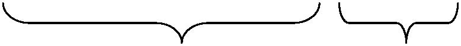

TV = EBIT(1-t)T+1/ k

Terminal Value as Growing Perpetuity

- PV in year t of a perpetuity growing at a rate g

TV = FCFT+1/ (k –g)

- For a growing perpetuity, we can assume (for simplicity)

FCF = EBIT(1-t)+ Depreciation –CAPX –∆NWC

-∆NA = -g*NA prior year

(1+g)EBIT(1-t)T

TV = [EBIT(1-t)T+1 –g*NAT] / (k -g)

Terminal Value as Perpetuity (Summary)

TV

FCF

TT+1    … 

EBIT(t-1)No growth

EBIT(t-1) -∆NAGrowth @ g

FCFT+1/ k

FCFT+1/ (k –g)

g*NAT

Remarks

- Growing perpetuity -assumptions

- Net assets grow at the same rate as profits

- ∆NA is a good measure of replacement costs

- Don’t forget to discount TV further to get PVTV

- In WACC method, k=WACC

- IN APV method, k=kA for FCF and appropriate rate for TS

Example

- You are considering the acquisition of XYZ Enterprises. XYZ’sbalance sheet looks like this as of today (year 0).

- Projections:

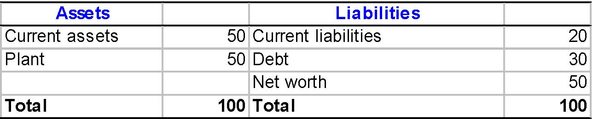

AssetsLiabilitiesCurrent assets50Current liabilities20Plant50Debt30Net worth50Total100Total100

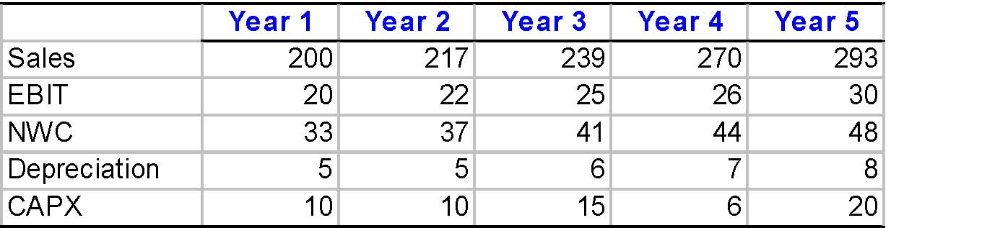

Year 1Year 2Year 3Year 4Year 5Sales200217239270293EBIT2022252630NWC3337414448Depreciation55678CAPX101015620

Example (cont.)

What is the value of XYZ’sstock under the following assumptions:

1) XYZ is liquidated after year 5 (assuming zero salvage value).

2) Sales growth and EBIT/Sales ratios are (past year 5):

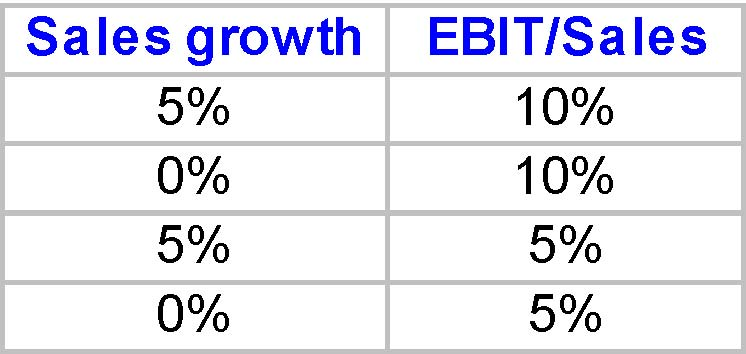

Sales growthEBIT/Sales5%10%0%10%5%5%0%5%

Tax rate = 34%, and WACC = 13%.

Example (cont.)

Start by estimating FCF over 5 years:

- NWC(year 0) = Current assets -current liabs= 50-20=30

FCF = EBIT(1 -t) + Dep-CAPX -∆NWC

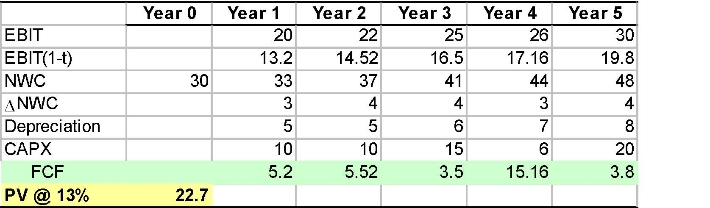

Year 0Year 1Year 2Year 3Year 4Year 5EBIT2022252630EBIT(1-t)13.214.5216.517.1619.8NWC303337414448∆NWC34434Depreciation55678CAPX101015620     FCF5.25.523.515.163.8PV @ 13%22.7

Example –Liquidation Value (LV)

1) Liquidation value (LV)

t*PPE(year 5) + NWC(year5)

PPE(year 5) = PPE(year 0) + all CAPX -all Depfrom year 0 to 5

PPE = 80

PPE * t = 80 * 34% = 27.2

LV = 27.2 + 48 = 75.2     ==&gt;  PVLV = 75.2/(1.13)5= 40.8

Firm value = 22.7 + 40.8 =  63.5

Equity value = Firm value -MV of Debt = 63.5 -30 = 33.5

Example (cont.)

For 2) to 5), we need EBIT (year 6) and NA (year 5) to apply

TV = [EBIT(year 6)(1 -t) -g*NA(year 5)]/[k -g]

EBIT(year 6)= fraction αof Sales(year 6)

= α*(1 + g)*Sales(year 5)= α*(1 + g) *293

NA(year 5)= NA(year 0) +all CAPX -all Dep+all ∆NWC from 0 to 5

=  128

PVTV= TV/(1.13)5

Example (cont.)

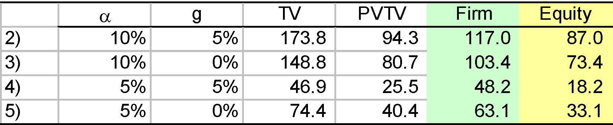

αgTVPVTVFirmEquity2)10%5%173.8     94.3       117.0     87.0       3)10%0%148.8     80.7       103.4     73.4       4)5%5%46.9       25.5       48.2       18.2       5)5%0%74.4       40.4       63.1       33.1       

When is Growth Valuable?

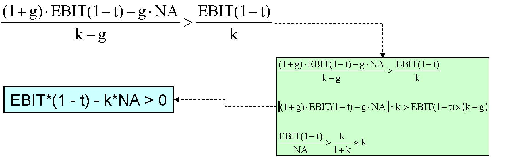

kt)EBIT(1gkNAgt)EBIT(1g)(1−&gt;−⋅−−⋅+kk1kNAt)EBIT(1gkt)EBIT(1kNAgt)EBIT(1g)(1kt)EBIT(1gkNAgt)EBIT(1g)(1≈+&gt;−−×−&gt;×⋅−−⋅+−&gt;−⋅−−⋅+EBIT*(1 -t) -k*NA &gt; 0

 TV (w/o growth)">

TV (with growth) &gt; TV (w/o growth)

Economic Value Added (EVA)

EVA = EBIT*(1 -t) -k*NA

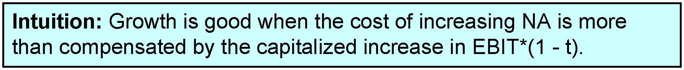

Intuition:Growth is good when the cost of increasing NA is more than compensated by the capitalized increase in EBIT*(1 -t).

Remarks

- EVA is a particular incarnation of NPV (+ some assumptions)

- Appeal of EVA coherent measure for Capital budgeting, Performance evaluation and Managerial compensation.

- Assumes linear relationship between NA and EBIT*(1 -t)

- EVA has nothing to do with sustainable growth:

- Sustainable growth rate answers “How fast can I grow without increasing my leverage ratio or issuing equity?”

- It has nothing to say about whether growing is good or not.

EVA: Bottom Line

Use EVA as...

- a simple measure to determine whether the business is generating value and whether growth is enhancing value

- as a way of setting goals to enhance value

Beware of EVA for...

- young companies

- companies in rapidly changing business environments

- companies where book values are not accurate measures of replacement costs

DCF Analysis: Pros and Cons

Strengths

- CF comes from specific forecasts and assumptions

- Can see impact of changes in strategies

- Valuation tied to underlying fundamentals

Weaknesses

- CF only as good as your forecasts/assumptions

- Might “forget something”

- Need to forecast managerial behavior (unless you’re in control)

- Need to estimate the discount rate using a theory (e.g., CAPM) that may be incorrect or imprecise in this particular case

Multiples

- Assess the firm’s value based on that of publicly traded comps.

- Cash-flow-based Value multiples:

- MV of firm/Earnings, MV of firm /EBITDA, MV of firm /FCF

- Cash-flow-based Price multiples:

- Price/Earnings (P/E), Price/EBITDA, Price/FCF

- Asset-based multiples:

- MV of firm/BV of assets, MV of equity/BV of equity

Procedure

- Hope:Firms in the same business should have similar multiples (e.g., P/E).

- STEP 1:Identify firms in same business as the firm you want to value.

- STEP 2:Calculate P/E ratio for comps and come up with an estimate of P/E for the firm you want to value (e.g. take the average of comps’ P/E).

- STEP 3:Multiply the estimated P/E by the actual Net Income of the firm you want to value.

Motivation for Multiples?

- Assumption 1:  Comps’ actual FCF are a perpetuity

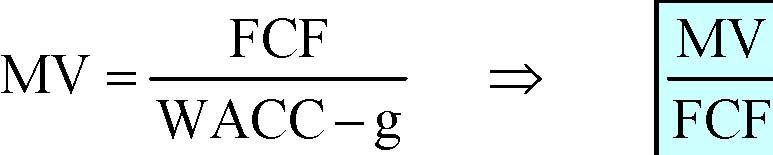

                 gWACCFCFMV⇒−=FCFMV

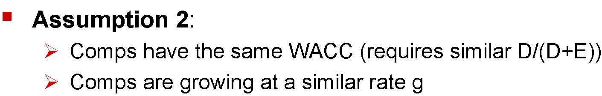

Assumption 2:Comps have the same WACC (requires similar D/(D+E))Comps are growing at a similar rate g

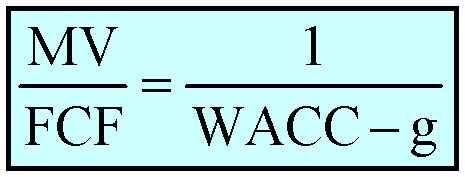

gWACC1−=

Motivation for Multiples?

- Assumption 1:

- E = CF to shareholders

- E is a perpetuity

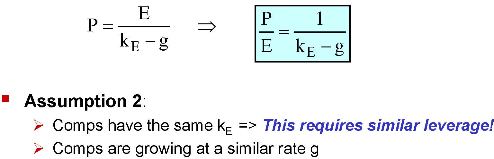

                 gkEPE⇒−=Assumption 2:Comps have the same kE  =&gt; This requires similar leverage!Comps are growing at a similar rate ggk1EPE−=

Remarks

- For firms with no earnings or limited asset base (e.g.  hi-tech),

- price-to-patents multiples,

- price-to-subscribers multiples,

- or even price-to-Ph.D. multiples!

- Since these are rough approximations (at best) 

- One may want to check different multiples

- See if some multiples are quite constant across firms

Example: Valuing ADI

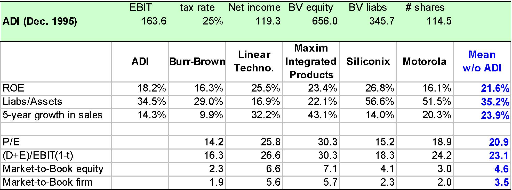

EBITtax rateNet incomeBV equityBV liabs# sharesADI (Dec. 1995)163.625%119.3656.0345.7114.5ADIBurr-BrownLinearTechno.MaximIntegratedProductsSiliconixMotorolaMeanw/o ADIROE18.2%16.3%25.5%23.4%26.8%16.1%21.6%Liabs/Assets34.5%29.0%16.9%22.1%56.6%51.5%35.2%5-year growth in sales14.3%9.9%32.2%43.1%14.0%20.3%23.9%P/E14.225.830.315.218.920.9(D+E)/EBIT(1-t)16.326.630.318.324.223.1Market-to-Book equity2.36.67.14.13.04.6Market-to-Book firm1.95.65.72.32.03.5

Example (cont.)

- There is no exact science to come up with appropriate multiples.The following is only an example. Need experience and guts.

- ADI’s5-year sales growth is less than average

- Shade down estimate of P/E and (D+E)/EBIT*(1 -t) w.r.t. mean

- P/E = 20.9*(1 -15%) = 17.8   

- (D+E)/EBIT*(1 -t) = 23.1*(1 -15%) = 19.6

- ADI’sROE is less than average

- Shade down estimate of M/B equity and M/B firm w.r.t. mean

- M/B equity = 4.6*(1 -15%) = 3.9

- M/B firm = 3.5*(1 -15%) = 3.0

Example (cont.)

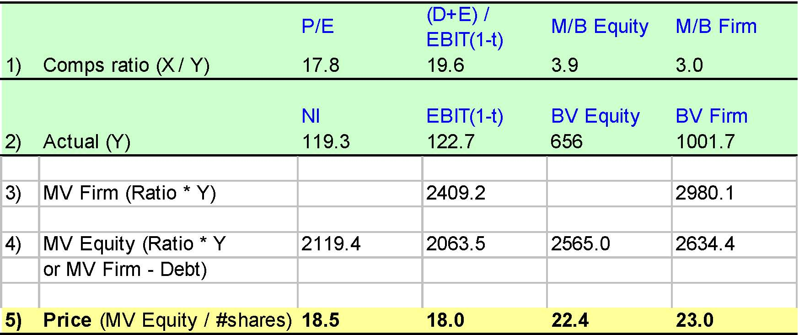

P/E(D+E) /          EBIT(1-t)M/B EquityM/B Firm1)Comps ratio (X / Y)17.819.63.93.0NIEBIT(1-t)BV EquityBV Firm2)Actual (Y)119.3122.76561001.73)MV Firm (Ratio * Y)2409.22980.14)MV Equity (Ratio * Y2119.42063.52565.02634.4or MV Firm - Debt)5)Price (MV Equity / #shares)18.518.022.423.0

Comparables: Pros and Cons

Pros:

- Simple + lots of information

- Market consensus about discount rate and growth rate.

- Free-ride on market’s information.

Cons:

- Assumes that companies are alike in growth, costs of capital, business composition, leverage

- Hard to find true comps

- Hard to incorporate firm specific information

- Accounting differences

- If everyone uses comps, who actually does fundamental analysis?

Comps &amp; the Conglomerate Discount

- Is the value of a conglomerate equal to the sum of its parts?

- Calculate Firm Value / Assets for the conglomerate

- For each of its business segments (in annual report), calculate median Firm Value / Assets for single segment firms in that industry

- Add up these comps, weighting by the share of the conglomerate’sassets in that industry

- Result: On average, conglomerates are worth 12% less than the sum of their parts.

Possible Interpretations

- Conglomerates are an inefficient form of organization

- The stock market doesn’t get it

- The comparables method doesn’t work

Distribution of Price / Sales ratios for Internet stocks (March 2000)

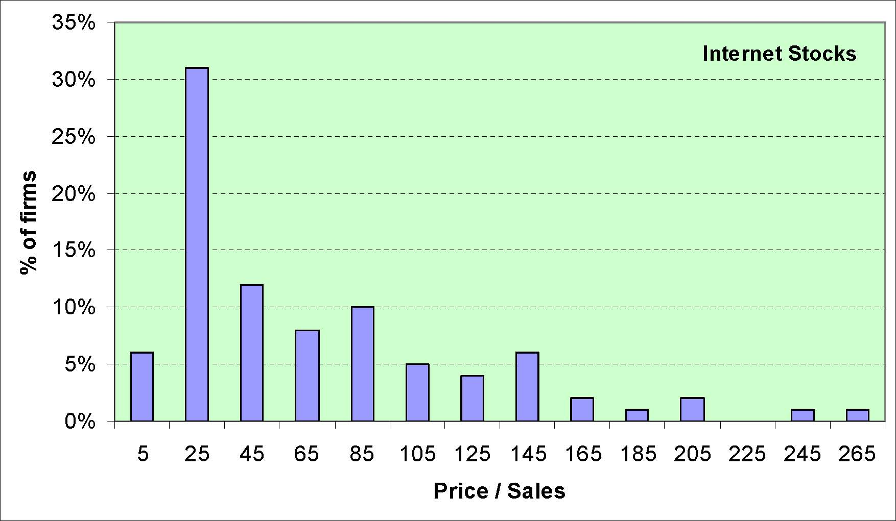

Internet Stocks0%5%10%15%20%25%30%35%525456585105125145165185205225245265Price / Sales% of firms

Distribution of Price / Sales ratios for all stocks 

(March 2000)

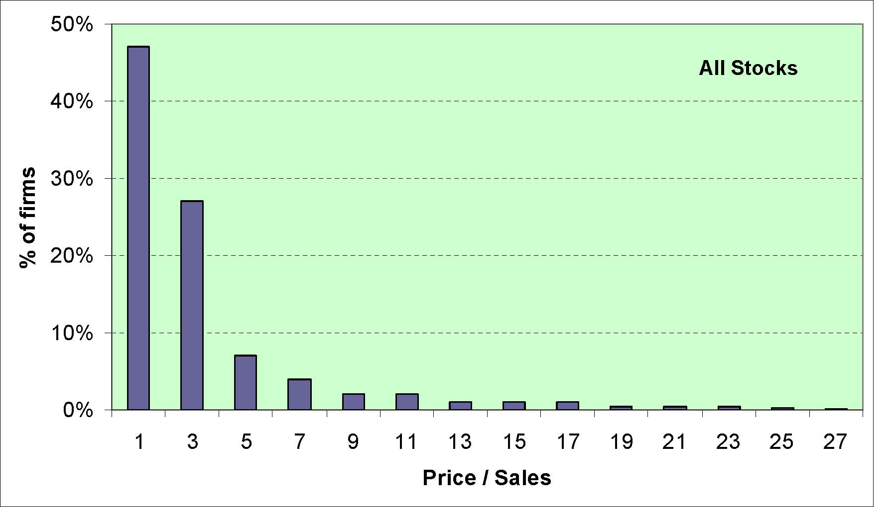

All Stocks0%10%20%30%40%50%13579111315171921232527Price / Sales% of firms

Internet stocks and selected high-tech stocks 

(March 2000, in $billions)

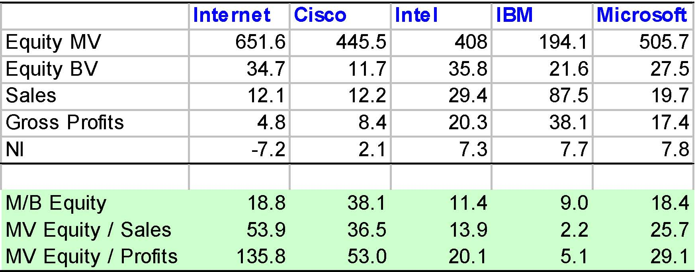

InternetCiscoIntelIBMMicrosoftEquity MV651.6445.5408194.1505.7Equity BV34.711.735.821.627.5Sales12.112.229.487.519.7Gross Profits4.88.420.338.117.4NI-7.22.17.37.77.8M/B Equity18.838.111.49.018.4MV Equity / Sales53.936.513.92.225.7MV Equity / Profits135.853.020.15.129.1

What growth and margin assumptions would have justified Internetvaluation in March 2000?

Assumptions: Discount rate = 10%, long-term growth = 6%

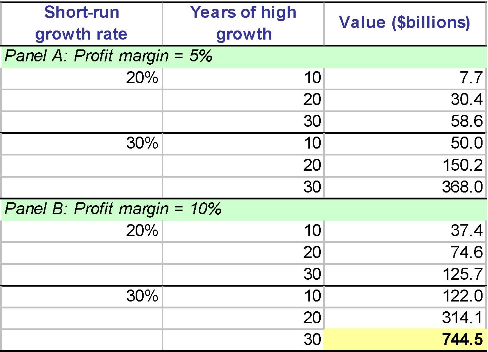

Short-run         growth rateYears of high growthValue ($billions)20%107.72030.43058.630%1050.020150.230368.020%1037.42074.630125.730%10122.020314.130744.5Panel A: Profit margin = 5%Panel B: Profit margin = 10%

         Acrobat Distiller 6.0 (Windows)

         2004-01-21T10:52:49+05:30

         2004-01-21T10:53:40+05:30

         2004-01-21T10:53:40+05:30

         PScript5.dll Version 5.2

         uuid:ad431b89-6adc-4c65-a5c6-19a5cf54ff9b

         uuid:266fafb5-3a1e-42a3-a424-5f9ad672a3d9

         xml

               djenter

               Microsoft PowerPoint - LN24(WrapAll).ppt

Wrap-up of 15.402 Finance Theory II (15.402) – Spring 2003 – Dirk Jenter 

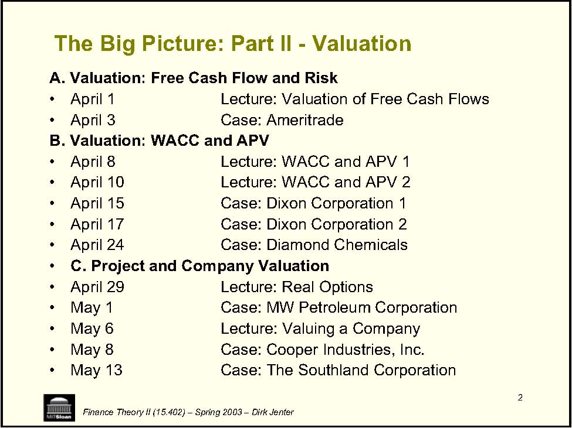

2 • • • • • • • • • • • • • Finance Theory II (15.402) – Spring 2003 – Dirk Jenter The Big Picture: Part II -Valuation A. Valuation: Free Cash Flow and Risk April 1 Lecture: Valuation of Free Cash Flows April 3 Case: Ameritrade B. Valuation: WACC and APV April 8 Lecture: WACC and APV 1 April 10 Lecture: WACC and APV 2 April 15 Case: Dixon Corporation 1 April 17 Case: Dixon Corporation 2 April 24 Case: Diamond Chemicals C. Project and Company Valuation April 29 Lecture: Real Options May 1 Case: MW Petroleum Corporation May 6 Lecture: Valuing a Company May 8 Case: Cooper Industries, Inc. May 13 Case: The Southland Corporation 

3 • →No laptops →→→Finance Theory II (15.402) – Spring 2003 – Dirk Jenter Final Exam Rules of the game: Closed books Two (2) letter-sized cheat sheets Bring a calculator 

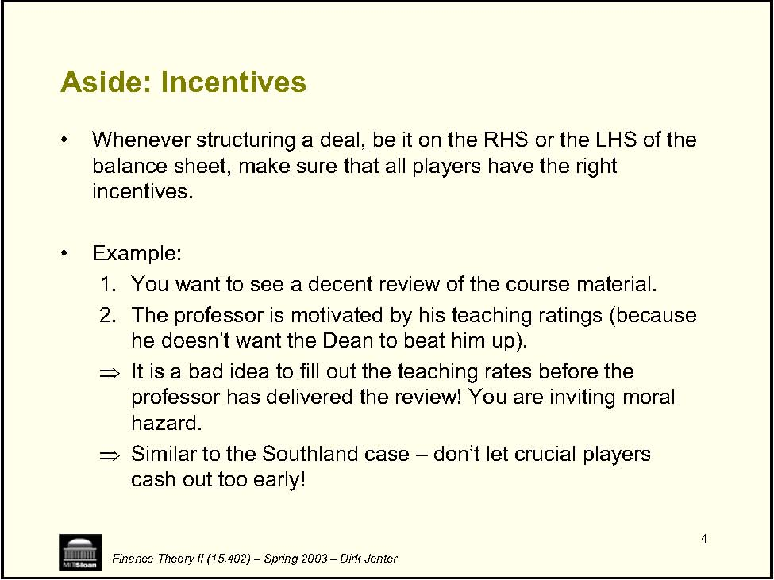

4 Aside: Incentives • incentives. • 1. 2. Ÿ hazard. Ÿ Finance Theory II (15.402) – Spring 2003 – Dirk Jenter Whenever structuring a deal, be it on the RHS or the LHS of the balance sheet, make sure that all players have the right Example: You want to see a decent review of the course material. The professor is motivated by his teaching ratings (because he doesn’t want the Dean to beat him up). It is a bad idea to fill out the teaching rates before the professor has delivered the review! You are inviting moral Similar to the Southland case – don’t let crucial players cash out too early! 

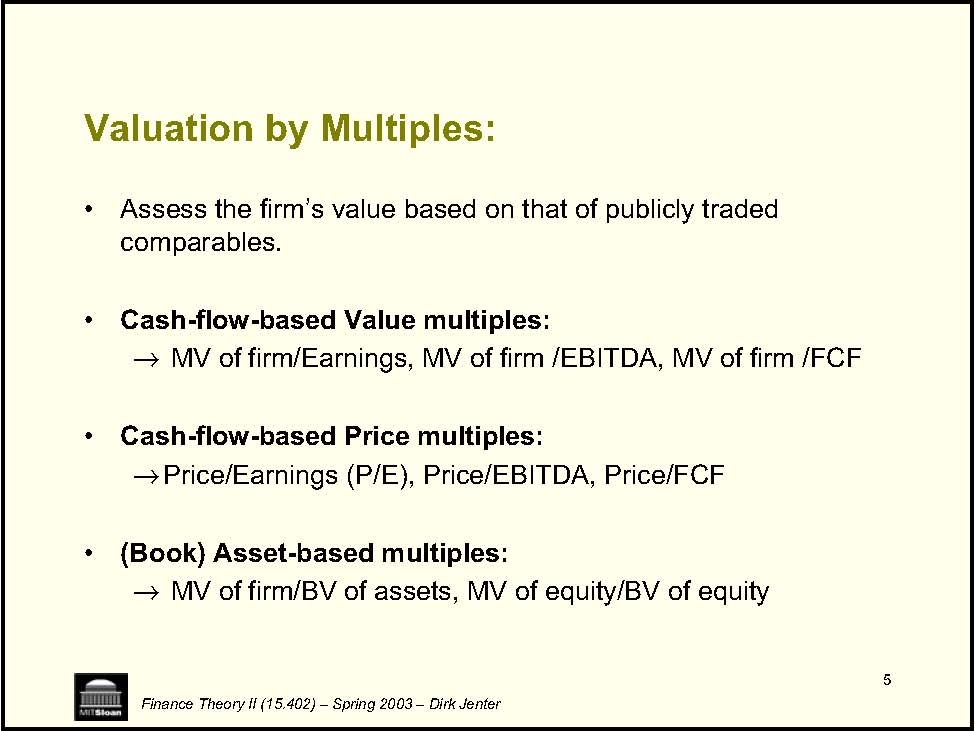

5 • • →• →• →Finance Theory II (15.402) – Spring 2003 – Dirk Jenter Valuation by Multiples: Assess the firm’s value based on that of publicly traded comparables. Cash-flow-based Value multiples: MV of firm/Earnings, MV of firm /EBITDA, MV of firm /FCF Cash-flow-based Price multiples: Price/Earnings (P/E), Price/EBITDA, Price/FCF (Book) Asset-based multiples: MV of firm/BV of assets, MV of equity/BV of equity 

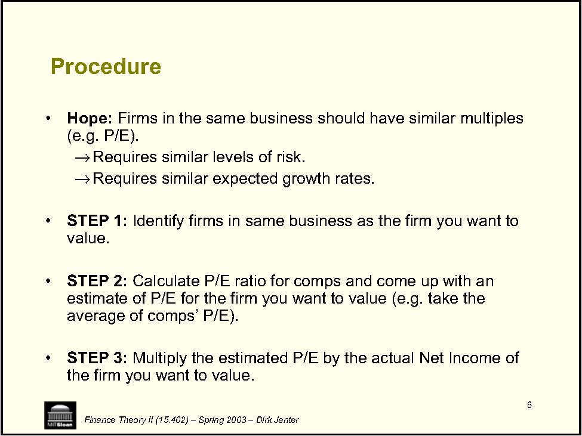

6 • Hope: →→• STEP 1: value. • STEP 2: average of comps’ P/E). • STEP 3: Finance Theory II (15.402) – Spring 2003 – Dirk Jenter Procedure Firms in the same business should have similar multiples (e.g. P/E). Requires similar levels of risk. Requires similar expected growth rates. Identify firms in same business as the firm you want to Calculate P/E ratio for comps and come up with an estimate of P/E for the firm you want to value (e.g. take the Multiply the estimated P/E by the actual Net Income of the firm you want to value. 

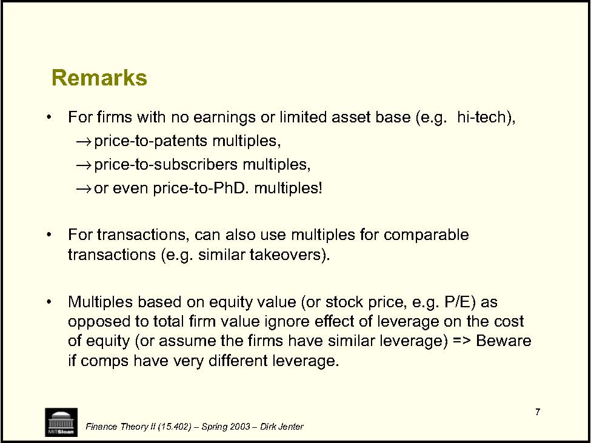

7 Remarks • →→price-to-subscribers multiples, →• • Finance Theory II (15.402) – Spring 2003 – Dirk Jenter For firms with no earnings or limited asset base (e.g.  hi-tech), price-to-patents multiples, or even price-to-PhD. multiples! For transactions, can also use multiples for comparable transactions (e.g. similar takeovers). Multiples based on equity value (or stock price, e.g. P/E) as opposed to total firm value ignore effect of leverage on the cost of equity (or assume the firms have similar leverage) =&gt; Beware if comps have very different leverage. 

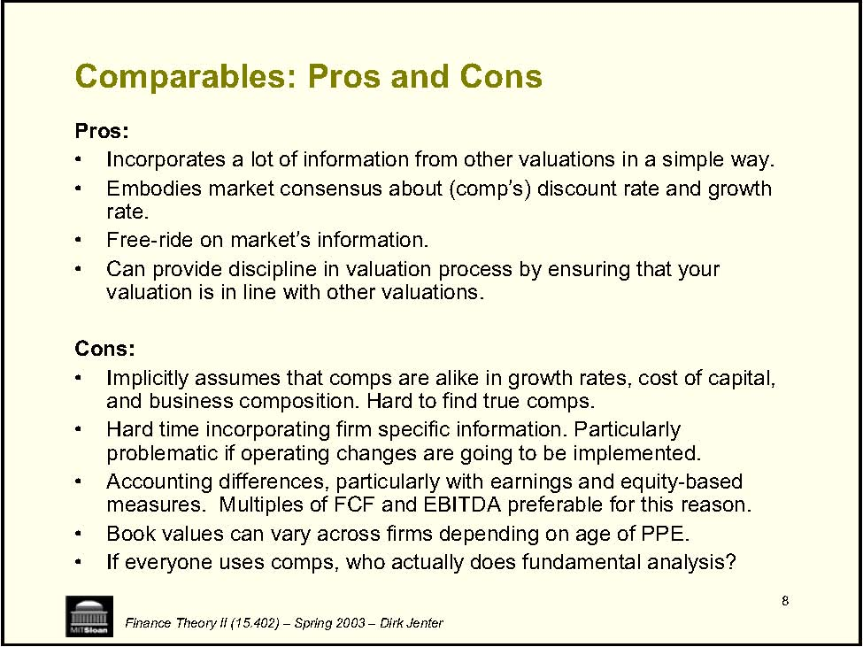

8 Comparables: Pros and Cons Pros: • • rate. • • Cons: • • • measures. • • Finance Theory II (15.402) – Spring 2003 – Dirk Jenter Incorporates a lot of information from other valuations in a simple way. Embodies market consensus about (comp’s) discount rate and growth Free-ride on market’s information. Can provide discipline in valuation process by ensuring that your valuation is in line with other valuations. Implicitly assumes that comps are alike in growth rates, cost of capital, and business composition. Hard to find true comps. Hard time incorporating firm specific information. Particularly problematic if operating changes are going to be implemented. Accounting differences, particularly with earnings and equity-based Multiples of FCF and EBITDA preferable for this reason. Book values can vary across firms depending on age of PPE. If everyone uses comps, who actually does fundamental analysis? 

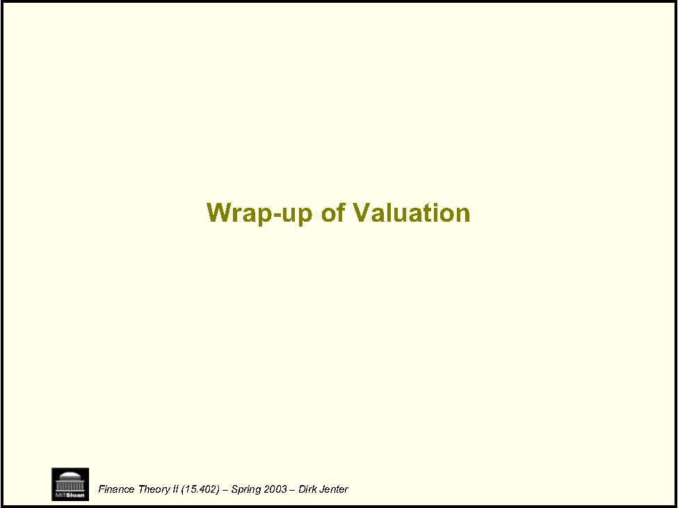

Wrap-up of Valuation Finance Theory II (15.402) – Spring 2003 – Dirk Jenter 

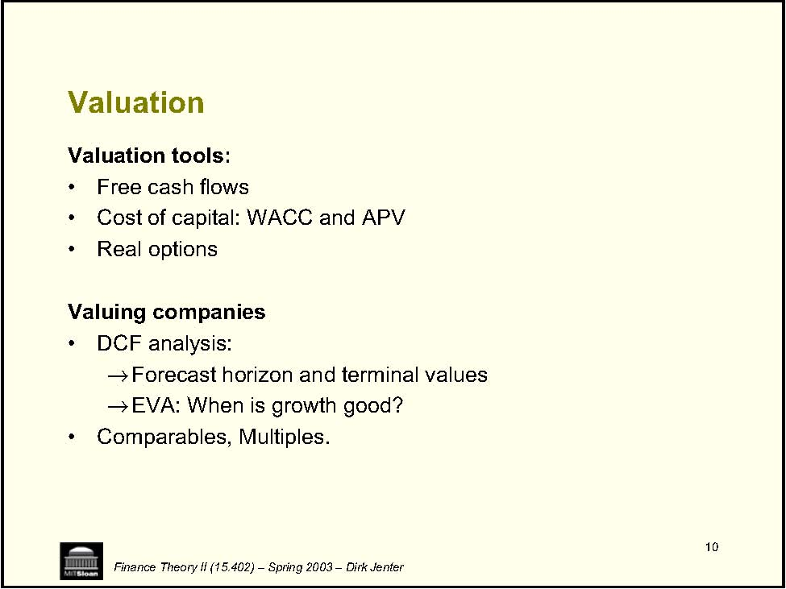

10 Valuation • • • Valuing companies • DCF analysis: →→EVA: When is growth good? • Finance Theory II (15.402) – Spring 2003 – Dirk Jenter Valuation tools: Free cash flows Cost of capital: WACC and APV Real options Forecast horizon and terminal values Comparables, Multiples. 

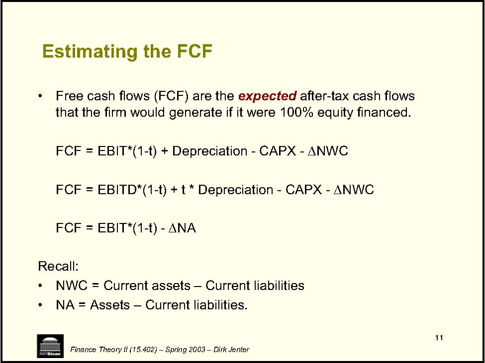

11 Estimating the FCF • ∆∆NWC ∆NA Recall: • • Finance Theory II (15.402) – Spring 2003 – Dirk Jenter Free cash flows (FCF) are the expected after-tax cash flows that the firm would generate if it were 100% equity financed. FCF = EBIT*(1-t) + Depreciation -CAPX -NWC FCF = EBITD*(1-t) + t * Depreciation -CAPX -FCF = EBIT*(1-t) -NWC = Current assets – Current liabilities NA = Assets – Current liabilities. 

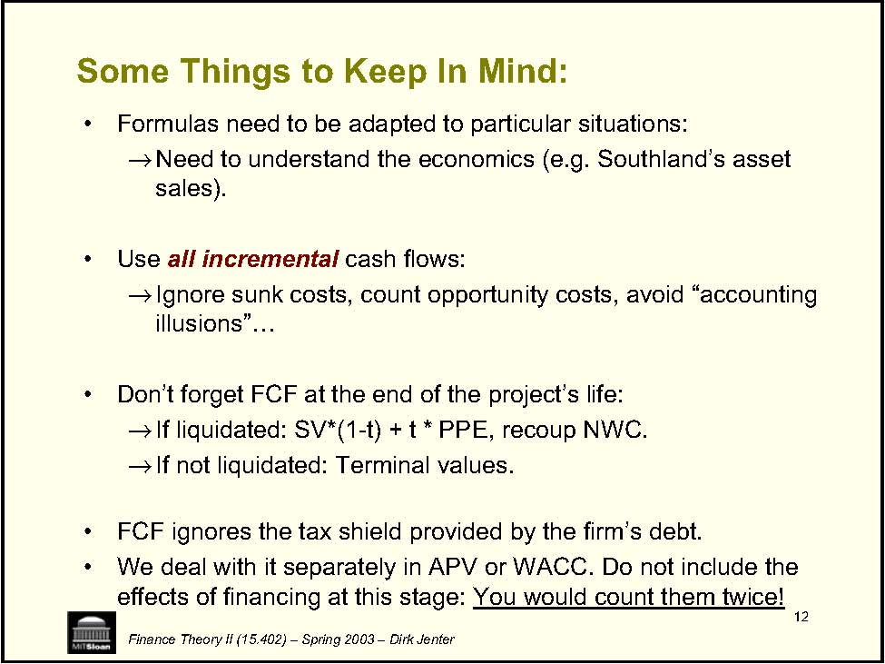

12 Some Things to Keep In Mind: • →sales). all incremental cash flows: →illusions”… • →→• • Finance Theory II (15.402) – Spring 2003 – Dirk Jenter Formulas need to be adapted to particular situations: Need to understand the economics (e.g. Southland’s asset •Use Ignore sunk costs, count opportunity costs, avoid “accounting Don’t forget FCF at the end of the project’s life: If liquidated: SV*(1-t) + t * PPE, recoup NWC. If not liquidated: Terminal values. FCF ignores the tax shield provided by the firm’s debt. We deal with it separately in APV or WACC. Do not include the effects of financing at this stage: You would count them twice! 

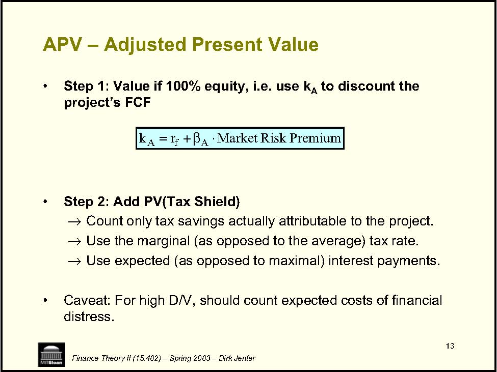

13 • A • →→→• distress. rk AfA ⋅β+=Finance Theory II (15.402) – Spring 2003 – Dirk Jenter APV – Adjusted Present Value Step 1: Value if 100% equity, i.e. use kto discount the project’s FCF Step 2: Add PV(Tax Shield) Count only tax savings actually attributable to the project. Use the marginal (as opposed to the average) tax rate. Use expected (as opposed to maximal) interest payments. Caveat: For high D/V, should count expected costs of financial Premium Risk Market 

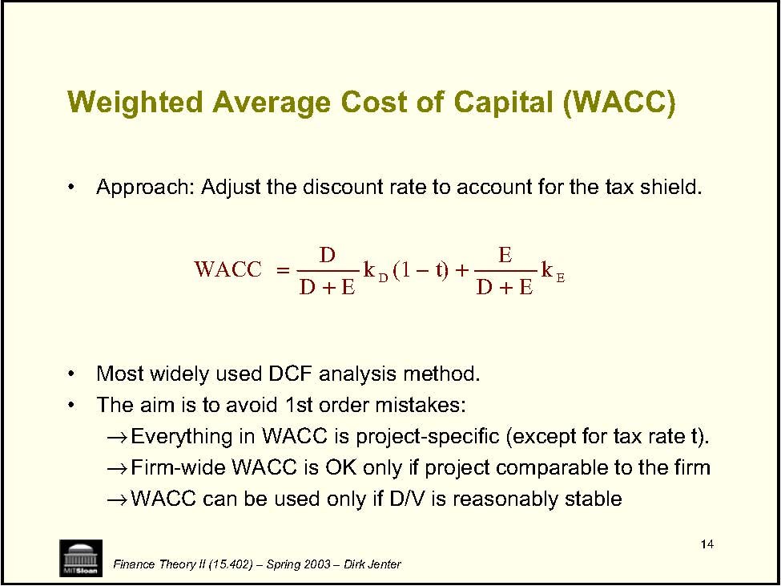

14 Weighted Average Cost of Capital (WACC) • • • →→→WACC can be used only if D/V is reasonably stable ED k ED E t)(1k ED D WACC ++−+=Finance Theory II (15.402) – Spring 2003 – Dirk Jenter Approach: Adjust the discount rate to account for the tax shield. Most widely used DCF analysis method. The aim is to avoid 1st order mistakes: Everything in WACC is project-specific (except for tax rate t). Firm-wide WACC is OK only if project comparable to the firm 

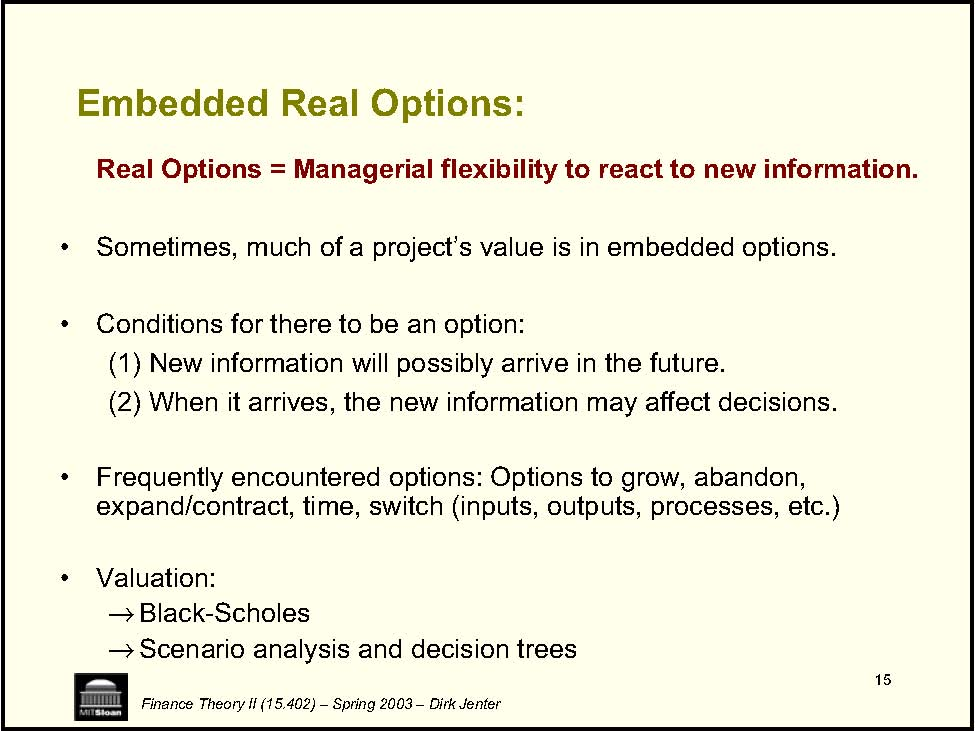

15 Embedded Real Options: • • • • →→Finance Theory II (15.402) – Spring 2003 – Dirk Jenter Real Options = Managerial flexibility to react to new information. Sometimes, much of a project’s value is in embedded options. Conditions for there to be an option: (1) New information will possibly arrive in the future. (2) When it arrives, the new information may affect decisions. Frequently encountered options: Options to grow, abandon, expand/contract, time, switch (inputs, outputs, processes, etc.) Valuation: Black-Scholes Scenario analysis and decision trees 

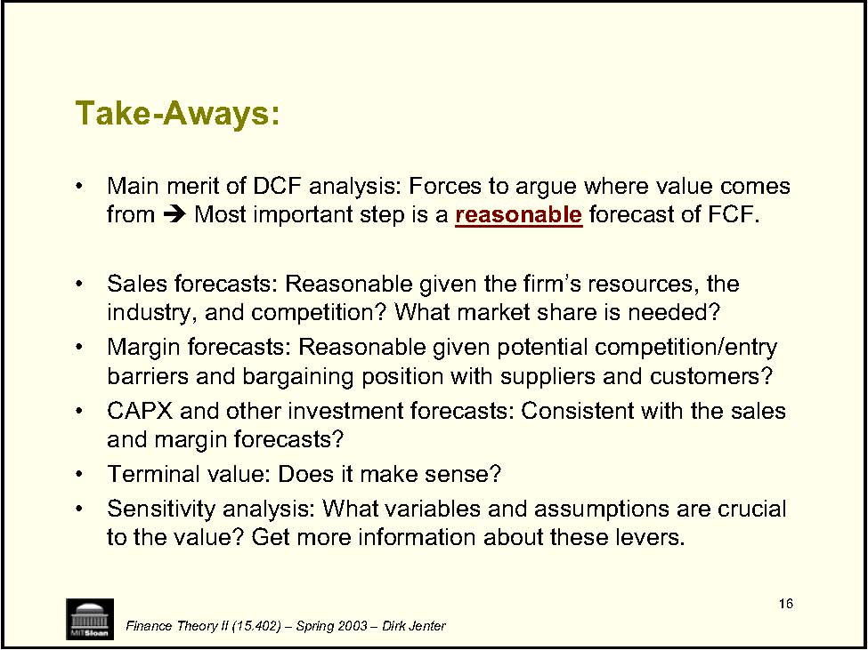

16 • from Î • • • • • Finance Theory II (15.402) – Spring 2003 – Dirk Jenter Take-Aways: Main merit of DCF analysis: Forces to argue where value comes Most important step is a reasonable forecast of FCF. Sales forecasts: Reasonable given the firm’s resources, the industry, and competition? What market share is needed? Margin forecasts: Reasonable given potential competition/entry barriers and bargaining position with suppliers and customers? CAPX and other investment forecasts: Consistent with the sales and margin forecasts? Terminal value: Does it make sense? Sensitivity analysis: What variables and assumptions are crucial to the value? Get more information about these levers. 

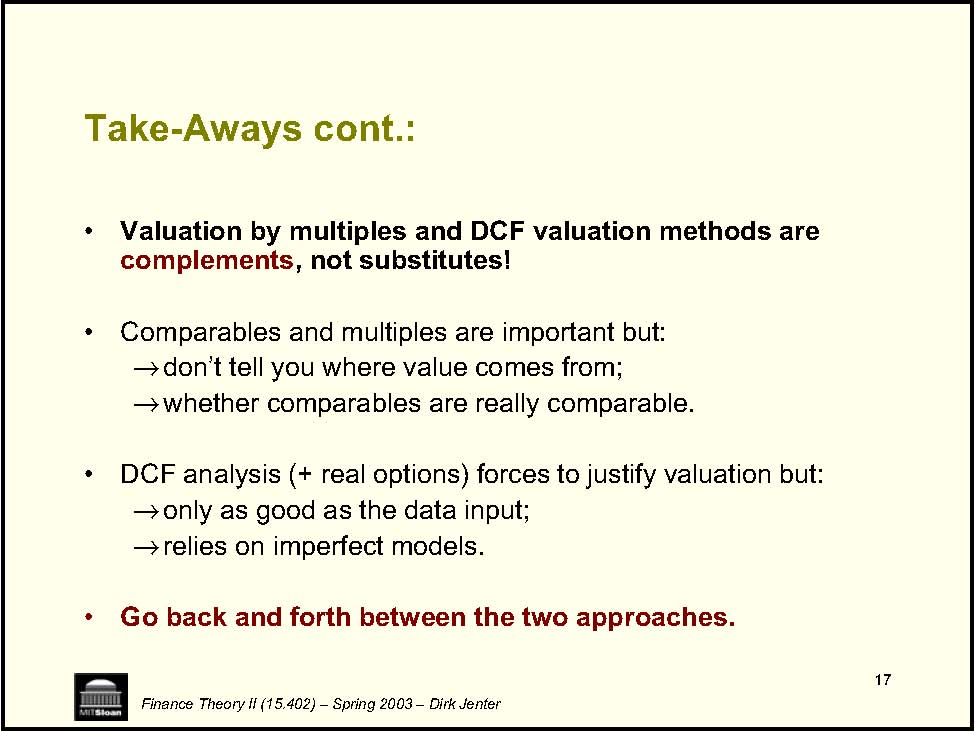

17 • complements• →→• →→• Finance Theory II (15.402) – Spring 2003 – Dirk Jenter Take-Aways cont.: Valuation by multiples and DCF valuation methods are , not substitutes! Comparables and multiples are important but: don’t tell you where value comes from; whether comparables are really comparable. DCF analysis (+ real options) forces to justify valuation but: only as good as the data input; relies on imperfect models. Go back and forth between the two approaches. 

Finance Theory II (15.402) – Spring 2003 – Dirk Jenter Conclusion 

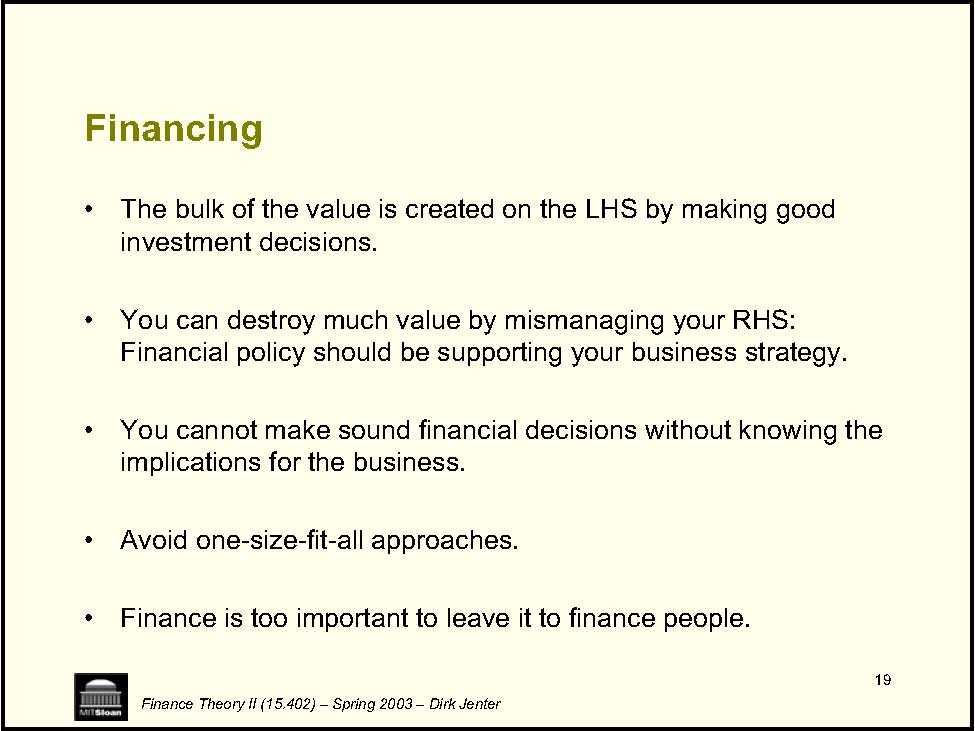

19 • • • • • Finance Theory II (15.402) – Spring 2003 – Dirk Jenter Financing The bulk of the value is created on the LHS by making good investment decisions. You can destroy much value by mismanaging your RHS: Financial policy should be supporting your business strategy. You cannot make sound financial decisions without knowing the implications for the business. Avoid one-size-fit-all approaches. Finance is too important to leave it to finance people. 

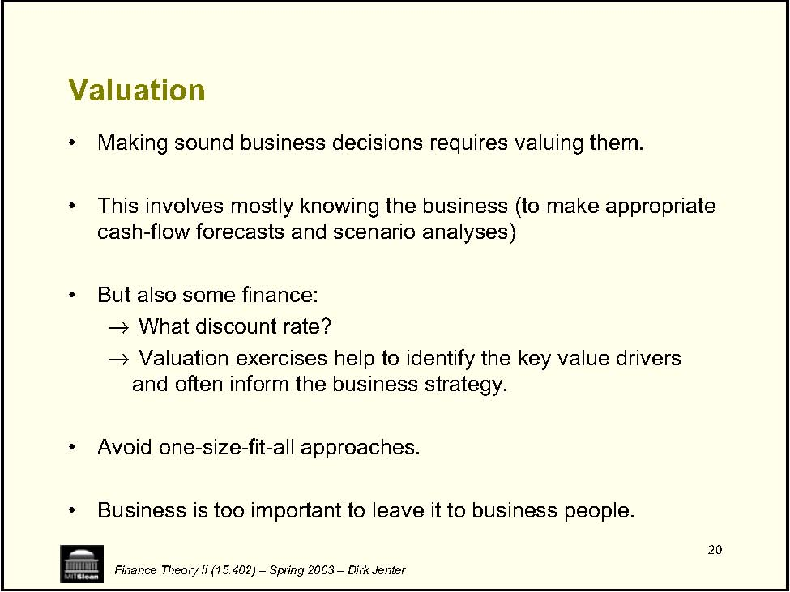

20 Valuation • • • →→• • Finance Theory II (15.402) – Spring 2003 – Dirk Jenter Making sound business decisions requires valuing them. This involves mostly knowing the business (to make appropriate cash-flow forecasts and scenario analyses) But also some finance: What discount rate? Valuation exercises help to identify the key value drivers and often inform the business strategy. Avoid one-size-fit-all approaches. Business is too important to leave it to business people. 

         Acrobat Distiller 6.0 (Windows)

         Compaq

         Compaq

         Acrobat PDFMaker 6.0 for PowerPoint

         2004-01-22T11:36:43+05:30

         2004-01-22T11:35:51+05:30

         2004-01-22T11:36:43+05:30

         uuid:5b3ece7b-05bd-498a-a09a-b161d8edb0a3

         uuid:44cc4552-8b4a-4b3b-81c1-bcffa8b1b86a

         xml

               No Slide Title

               Leslie A. Larocca

Wrap-up of Valuation

Katharina Lewellen

Finance Theory II

May 14, 2003

Final Exam

- Rules of the game:

- No laptops

- Closed books

- Cheat sheet

Valuation

Valuation tools:

- Free cash flows

- Cost of capital: WACC and APV

- Real options

Valuing companies

- DCF analysis:

- Forecast horizon and terminal values

- EVA: When is growth good?

- Comparables, Multiples

Estimating the FCF

- Free cash flows (FCF) are the expectedafter-tax cash flows that the firm would generate if it were 100% equity financed.

FCF = EBIT*(1-t) + Dep. -CAPX -∆NWC

FCF = EBITD*(1-t) + t * Dep. -CAPX -∆NWC

FCF = EBIT*(1-t) -∆NA

Recall:

- NWC = Current assets –Current liabilities

- NA = Assets –Current liabilities.

FCF = EBIT*(1-t) + Dep. -CAPX -∆WC

- This expression amends EBIT(1-t) which is an accounting measure of cash flow into an economic measure.

- CAPX not reported as cash outflow but is one -CAPX

- Depreciation

- is reported as cash outflow but is not one Add (1-t)*Dep

- however, depreciation does imply a cash inflow of t*Dep.

- Altogether + Dep

- Working capital has an opportunity cost -∆NWC

Other Things to Keep In Mind

- Formulas need to be adapted in particular situations

- Need to understand the economics (e.g., Southland’s asset sales)

- Use all incrementalcash flows: 

- Ignore sunk costs, Count opportunity costs, Avoid “accounting illusions”…

- Don’t forget FCF at the end of the project’s life:

- If liquidated: SV*(1-t) + t * PPE

- Even if not liquidated, recoup WC

- FCF ignores the tax shield provided by the firm’s debt.

- We deal with it separately in APV or WACC. Do not include the effects of financing at this stage: You would count them twice!

APV Step 1: Value if 100% equity

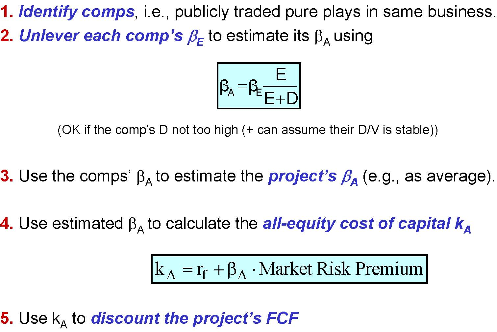

1.Identify comps, i.e., publicly traded pure plays in same business.2.Unlever each comp’s βEto estimate its βA using(OK if the comp’s D not too high (+ can assume their D/V is stable))3.Use the comps’ βA to estimate the project’s βA(e.g., as average).4.Use estimated βA to calculate the all-equity cost of capital kA5.Use kAto discount the project’s FCFDEEββEA+=PremiumRisk  MarketrkAfA⋅β+=

Why We Need to Unlever

- Comps may have different leverage

- Equity in a firm with debt is more risky than equity in a firm without debt because debt receives some of the safe cashflows.

Note: Business Risk and Financial Risk

- Financial risk has nothing to do with costs of financial distress!

- Similar firms have similar business risk (βA) but can have different financial risk (βE-βA) if they have different leverage.

- As leverage increases, equity becomes riskier (i.e. βE ).

APV Step 2: Add PV (Tax Shield)

- If the project’s D is constant over time, then 

PV(TS) = t*D*kD/ kD= t*D

- If the project’s D/V is constant, then

PV(TS) = t*D*kD / kA 

- If there is a known debt policy or repayment schedule

- you can simply forecast actual debt levels and discount by a rate between kD and kA

APV Step 2: Add PV (Tax Shield), Remarks

- Count only debt attributed to the project

- Recall: If a project is 100% debt finance, some of the debt is probably issued against firm’s other assets

- Make sure to discount expectednot maximum tax shields

- This is particularly important for high D/V

- For high D/V, should count costs of financial distress

- Recall: Use the marginal (as opposed to the average) tax rate

Weighted Average Cost of Capital (WACC)

- Approach: Adjust the discount rate to account for the tax shield.

- Most widely used DCF analysis method.

- The aim is to avoid 1st order mistakes:

- A priori, WACC is project-specific (except for tax rate t)

- Firm-wide WACC is OK only if project comparable to the firm

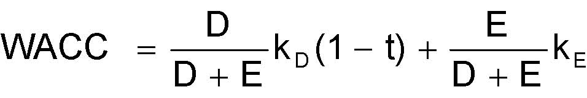

EDkEDEt)(1kEDDWACC++−+=

Leverage ratio: D/(D+E)

- What we want: The debt that is incremental to the project, i.e.,that could not be raised w/o the project.

- 1st-order mistakes we want to avoid:

- Use the deal’s leverage ratio;

- Use the “acquirer”’s leverage ratio.

- Imperfect approach to what we want:

- Target leverage ratio if project/firm were a stand-alone

- How we get there:

- Get D/V from comps, business plan, checklist, etc.

Cost of debt capital: kD

- What we want: Expected return for creditors if project were a stand-alone with leverage ratio D/(D+E) estimated above.

- Imperfect approach to what we want: kDclose the interest rate charged to project as stand-alone (unless debt is very risky).

- How we get there:

- Find comps with similar leverage + recent interest rate.

- Estimate the debt rating and examine corporate yield curve.

- 1st-order mistakes we want to avoid:

- Use the interest rate in the deal or of the “acquirer”;

Effective Marginal Tax Rate t

- Marginal tax rate of firm undertaking the project: t

Using CAPM to Estimate kE

1.Find compsfor the project under consideration.

2.Unlevereach comp’s βE(using itsD/(D+E)):

3.Use the comps’ βA to estimate the project’s βA(e.g. average).

4.Releverthe project’s estimated βA (using its own D/(D+E)):

5.Use the estimated βE to calculate the project’s cost of equity kE:

Note: These (un-) levering formulas are OK only if the (comp) firm’s debt is nottoo risky and its D/V is reasonably stable.

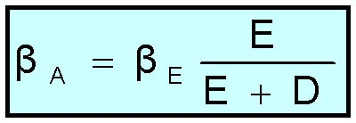

DEEββEA+=

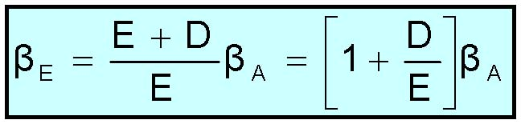

AAEβED1βEDEβ⎥⎦⎤⎢⎣⎡+=+=

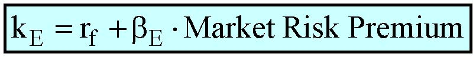

PremiumRisk  MarketrkEfE⋅β+=

Remarks

- WACC can be used only if D/V is reasonably stable

- Use APV when debt is very risky and/or when D/V is unstable (recall the Southland LBO case)

- WACC is an attribute of the project, not the firm (except tax rate)

- OK to use the firm’s WACC when project is very much like the firm (because the firm happens to be a comp for the project).

- Few companies have WACC that they can use for all projects (recall our discussion of GE).

Real options

Embedded options

- Follow-up investments

- Option to abandon the project

- Option to wait before investing

- Option to expand / change production methods

Key issues

- Identification

- Valuation

Identify significantoptions

- Look for clues in project’s description and cash flow pattern

- “Phases”, “Strategic investment”, “Scenarios”…

- Large expenditures are likely discretionary

- Is there an option? Verify two conditions:

(1) News will possibly arrive in the future;

(2) When it arrives, the news may affect decisions.

- Search for the uncertainty that managers face:

- What is the main thing that managers will learn over time?

- How will they exploit that information?

Practical Issue: Simplifications

- Search for significantoptions

- E.g., option to shut down the plant may not be very valuable (why?)

- Look for primary sources of uncertainty

- Cut the projects into simpleoptions

- You might want to ignore nested options (difficult to value)

- Use Europeanrather than American option

- Ignoring some adverse effects of waiting (e.g. possible entry)

A simplified model that is dominated by the project gives a lower boundfor the project’s value (and vice versa).

Value the options

Step 1:

- Start with the simple DCF analysis

- Pretend that there is no option embedded in the project

- This benchmark constitute a lower boundfor the project’s value

Step 2:

- Value the option

- Decision trees (dynamic DCF)

- Option pricing models (Black-Scholes)

Mapping: Project Call Option

<Table>
<TR>
<TD>

Project

</TD>

<TD>

Call Option

</TD>
</TR>
<TR>
<TD>

Expenditure required to acquire the assets

</TD>
<TD>

X

</TD>
<TD>

Exercise price

</TD>
</TR>
<TR>
<TD>

Value of the operating assets to be acquired

</TD>
<TD>

S

</TD>
<TD>

Stock price (price of the underlying asset)

</TD>
</TR>
<TR>
<TD>

Length of time the decision may be deferred

</TD>
<TD>

T

</TD>
<TD>

Time to expiration

</TD>
</TR>
<TR>
<TD>

Riskinessof the operating assets

</TD>
<TD>

σ2

</TD>
<TD>

Variance of stock return

</TD>
</TR>
<TR>
<TD>

Time value of money

</TD>
<TD>

r

</TD>
<TD>

Risk-free rate of return

</TD>
</TR>
</Table>

Practical Issue: What Volatility?

What do we want?

- Standard deviation of returns for the underlying asset

- In case of real options, the underlying is the PV of the project’s CFs

Imperfect ways to get it?

- Informed guess

- 20-30% per year is not remarkably high for a single project.

- Data

- Historical return volatilities on comparable traded assets

- Implied volatilities can be computed from quoted option prices

- Simulations

Valuing Companies

- Terminal values:

- Liquidation

- Flat, growing, or decreasing perpetuity

- EVA: When is growth good?

- Comparables, Multiples.

Terminal Values

- Liquidation:Should be adjusted (e.g. if cannot recoup all A/R, etc.)

SV * (1-t) + t*PPE + WC

- Growing perpetuity:Take EBIT and NA in last year of forecast

TV = [(1+g)*EBIT*(1-t) -g*NA] / (k-g)

- Flat perpetuity:

TV = EBIT*(1-t) / k

Terminal Values, Remarks

- Growing perpetuity formula assumes a linear relationship between EBIT and NA

- Don’t forget to take PVTV

- Forecast horizon: Company is reasonably stable afterwards

EVA

- Growth is valuable when (very roughly!):

EVA = EBIT*(1-t) -k*NA &gt; 0or    EBIT*(1-t) / NA &gt; k

- Growth is good if the cost of scaling up NA is offset by the value of increased revenues.

Remarks:

- Assumes linearity between EBIT and NA and that NA is a good measure of marginal “replacement cost”, now and in the future.

- EVA has nothing to do with sustainable growth.

EVA: Bottom Line

Use EVA as…

- … a simple measure of whether a business is generating value and whether growth is enhancing value

- … as a way of setting goals to enhance value

Beware of EVA for...

- … young companies

- … companies in rapidly changing business environment

- … companies in which book values are not accurate measures of marginal replacement cost.

Multiples

- Assess the value based on that of publicly traded comps

- Cash-flow based Value multiples

- MV(firm)/Earnings, MV(firm)/EBITDA, MV(firm)/FCF,...

- Cash-flow based Price multiples:

- Price/Earnings, Price/EBITDA, Price/FCF,...

- Asset-based multiples:

- MV(firm)/BV(assets), MV(equity)/BV(equity),...

Motivation for Multiples?

- Assumption 1:

- E = CF to shareholders

- E is a perpetuity

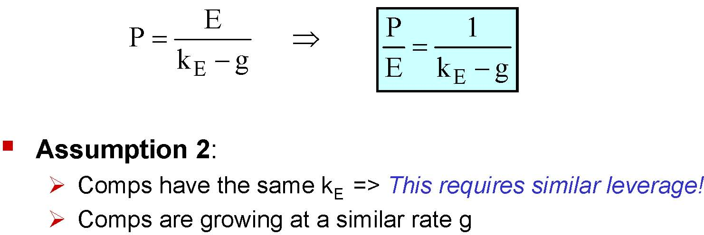

                 gkEPE⇒−=Assumption 2:Comps have the same kE  =&gt; This requires similar leverage!Comps are growing at a similar rate ggk1EPE−=

Multiples: Pros and Cons

Pros:

- Incorporates simply a lot of information from other valuations

- Embodies market consensus

- Can provide discipline for DCF valuation: Ask yourself “How do Iexplain the difference?”

- Sometimes, what you care about is what the market will pay, not the fundamental value (e.g., Venture firm will want out).

Cons:

- Hard to incorporate firm specific information.

- Relies on accounting measures being comparable too.

Other Things to Think About

Control:

- With a controlling stake, influence operations, implement synergies and capture (part of) their value

- Also, entrepreneur might care about “the vision”

Large individual shareholder (e.g., entrepreneur):

- Maybe very undiversified, at least for a while 

Liquidity:

- Especially for private companies

- Note: Need to account for IPO plans

Valuation: Conclusion

- Main merit of DCF analysis: Forces to argue where value comes from Most important step is a reasonableforecast of FCF.

- Sales forecasts: Reasonable given the firm’s resources, the industry, and competition? What market share is needed?

- Margin forecasts: Reasonable given potential competition/entry barriers and bargaining position with suppliers and customers?

- CAPX and other investment forecasts: Consistent with the sales and margin forecasts?

- Terminal value: Does it make sense?

- Sensitivity analysis: What variables and assumptions are crucialto the value? Get more information about these levers.

Valuation: Conclusion

- The different methods are not mutually exclusive.

- Comparables and multiples are important but:

- don’t tell you where value comes from;

- whether comparables are really comparable.

- DCF analysis (+ Real options) forces to justify valuation but:

- only as good as the data input;

- relies on imperfect models.

- Go back and forth between the two approaches.

Course: Conclusion

What We Have Been About

- Acquire a few general tools:

- Capital structure

- DCF analysis

- Comparalesand multiples

- Avoiding 1st order misconceptions (list your own below if any):

- etc.

- Developing a healthy skepticism.

Financing

- The bulk of the value is created on the LHS by making good investment decisions.

- You can destroy much value by mismanaging your RHS: Financial policy should be supporting your business strategy.

- You cannot make sound financial decisions without knowing the implications for the business.

- Avoid one-size-fit-all approaches.

- Finance is too serious to leave it to finance people.

Valuation

- Making sound business decisions requires valuing them.

- This involves mostly knowing the business (to make appropriate cash-flow forecasts and scenario analysis, etc.)

- But also some finance:

- What discount rate?

- Valuation exercises can indicate key value levers,...

- Avoid one-size-fit-all approaches.

- Business is too serious to leave it to business people.
