         Acrobat Distiller 6.0.1 (Windows)

         Microsoft Corporation

         D:20050428015740

         2005-05-01T00:34:24+08:00

         Acrobat PDFMaker 6.0 for Word

         2005-05-01T00:36:31+08:00

         2005-05-01T00:36:31+08:00

         uuid:760b0250-8f99-4af1-a31e-5bc7c71762a5

         uuid:295c4c27-2b82-4fec-8ff2-01ac5eb43ea3

               7

         xml

               Microsoft Word - 导论A

               fxzm

财务理论 II (15.402)   

公司理财 

公司理财：资产与负债 

宝洁（P&amp;G）公司截至1999年6月30日资产负债表（单位：百万美元） 

<Table>

<TR>
<TD>

资产 

</TD>
<TD>

</TD>
<TD>

</TD>
<TD>

负债 

</TD>
<TD>

</TD>
<TD>

</TD>
</TR>
<TR>
<TD>

流动资产 

</TD>
<TD>

11,358 

</TD>
<TD>

35% 

</TD>
<TD>

流动负债 

</TD>
<TD>

10,761 

</TD>
<TD>

34% 

</TD>
</TR>
<TR>
<TD>

净固定资产 

</TD>
<TD>

12,626 

</TD>
<TD>

39% 

</TD>
<TD>

长期负债 

</TD>
<TD>

9,294 

</TD>
<TD>

29% 

</TD>
</TR>
<TR>
<TD>

其他长期资产 

</TD>
<TD>

8,129 

</TD>
<TD>

25% 

</TD>
<TD>

所有者权益

</TD>
<TD>

12,058 

</TD>
<TD>

38% 

</TD>
</TR>
<TR>
<TD>

</TD>
<TD>

</TD>
<TD>

</TD>
<TD>

</TD>
<TD>

</TD>
<TD>

</TD>
</TR>
<TR>
<TD>

总资产 

</TD>
<TD>

32,113 

</TD>
<TD>

</TD>
<TD>

总负债 

</TD>
<TD>

32,113 

</TD>
<TD>

</TD>
</TR>

</Table>

制造业于1998年第四季度之资产负债表（单位：十亿美元） 

<Table>

<TR>
<TD>

资产 

</TD>
<TD>

</TD>
<TD>

</TD>
<TD>

负债 

</TD>
<TD>

</TD>
<TD>

</TD>
</TR>
<TR>
<TD>

流动资产 

</TD>
<TD>

1,700 

</TD>
<TD>

39% 

</TD>
<TD>

流动负债 

</TD>
<TD>

1,264 

</TD>
<TD>

28% 

</TD>
</TR>
<TR>
<TD>

净固定资产 

</TD>
<TD>

1,527 

</TD>
<TD>

36% 

</TD>
<TD>

长期负债 

</TD>
<TD>

1,515 

</TD>
<TD>

34% 

</TD>
</TR>
<TR>
<TD>

其他长期资产 

</TD>
<TD>

1,132 

</TD>
<TD>

26% 

</TD>
<TD>

权益 

</TD>
<TD>

1,643 

</TD>
<TD>

37% 

</TD>
</TR>
<TR>
<TD>

</TD>
<TD>

</TD>
<TD>

</TD>
<TD>

</TD>
<TD>

</TD>
<TD>

</TD>
</TR>
<TR>
<TD>

总资产 

</TD>
<TD>

4,404 

</TD>
<TD>

</TD>
<TD>

总负债 

</TD>
<TD>

4,404 

</TD>
<TD>

</TD>
</TR>

</Table>

负债栏(右方)：融资 

- “融资”：首先，假定公司的资产既定，重点关注资产负债表的负债栏：如何为既          定的公司资产筹集资金？我们是否能运用右方各项来为公司创造价值？ 

- 我们应如何测算我们所需资金的数额？ 

- 我们应该用何种方式筹集所需资金： 

→举债？ 

→权益？ 

→其它来源？ 

- 如果我们有足够内部生成的资金，我们应如何运用这些过剩的资金？ 

- 我们应在何时从资本市场上融资？ 

资产栏(左方)：价值评估 

- “价值评估”：在考虑到公司融资状况的情况下，重点关注如何使公司的资产价值            最大化。 如何运用左方的项目来创造价值。 

- 我们应如何评估公司的投资项目，例如： 

→购置新厂房与设备 

→拓展新市场 

  我们应如何比较： 

→当期和今后取得的回报？ 

→具有不同风险的各种投资项目？ 

   我们应如何评估： 

→一家已有公司的价值？新建公司的价值？ 

→合并公司的价值？ 

我们的方法 

我们会做的：                              我们不会做的： 

我们将为：                             假装精通任何领域（财经或其它方面）。 

→财务经理             

→总经理 

提供一套在商业决策中有重要作用的通用工具。  详细讨论许多制度性方面的问题。 

将这些工具应用到一系列具体商业案例中。      详细讨论一些你能从书本或文章（阅读材 

→工具的有效性。                      料）所学到的东西。 

→工具的局限性。 

公司理财－A部分 

- 每周两次课。 

- 指定教材： 

→ Brealey &amp; Myers，公司理财原理（Principles of Corporate Finance）第7版． 

→ Higgins，财务管理分析（Analysis for Financial Management）第7版． 

→ 案例和补充阅读资料． 

- 主讲教授：Dirk Jenter。 

公司理财－B部分 

- 每周两次课。 

- 指定教材： 

→ Brealey &amp; Myers，公司理财原理（Principles of Corporate Finance）第7版． 

→ Higgins，财务管理分析（Analysis for Financial Management）第7版． 

→ 案例和补充阅读资料． 

- 主讲教授：Katherine Lewellen。 

课程要求 

- 课堂出席（10%） 

→ 上课之前准备好案例讨论。 

→ 出席质量比数量更为重要（！） 

→ 愿意出席与出席本身同样重要。 

→ 将背景阅读资料引入到讨论中。 

- 案例讨论报告（30%） 

→ 向决策者提交规范的报告。 

→ 每组三到四人。 

→ 除两份小组自选案例不交报告外，上交所有案例讨论报告。 

→ 注意 ：有些案例是必需的。 

→ 每份报告两页（加上附表）。 

- 期中考试（30%） 

- 期末考试（30%） 

案例讨论报告 

- 案例报告应做到： 

→  书写清晰规范。 

→  除两份小组自选案例不交报告外，上交所有案例报告。 

→  每份报告两页（不计图表和表格），双倍行距 - 11或12号字。 

→  三到四人一组 

→  每组提交一份报告。 

→  不要和非本组人员合作。 

→  尽量不要一人或两人一组。 

→  Wilson (I &amp; II)被视为一个案例。 

→  Wilson，MCI，Dixon和Ameritrade 是必需的案例。 

→  必须确保上交十份案例报告。 

课程安排总览 

                                                     第一部分：融资 

                                      2月6/11  案例：Wilson Lumber 

                                      2月13 讲课：资本结构1 

                                      2月20 讲课：资本结构2 

课堂 (12讲)                             2月25 案例：UST Inc. 

指定教材：Brealey &amp; Meyers 与 Higgins         2月27 案例：Massey Ferguson 

讲稿请于课前在网上浏览（及课堂上派发）     3月4   讲课：资本结构3 

                                   3月6   案例：MCI Communications 

                                   3月11 融资复习回顾 

                                      3月13 案例：英特尔公司, 1992 

案例 (12个) 

10份案例报告：每份1到2页                第二部分：价值评估 

讲稿请于课后在网上浏览（及课堂上派发）    4月1  讲课：自由现金流量 

出席课堂至关重要                           4月3  案例：Ameritrade 

                                   4月8  讲课：加权平均资金成本与调整现值 

                                     4月10  案例：Dixon 

评分                                         4月15  案例：Diamond Chemicals 

案例研究报告 30%                           4月17  讲课：实物期权 

期中考试（课堂上） 30%                      4月24  案例：MW Petroleum 

期末考试（稍后宣布） 30%                 4月29  讲课：公司的价值评估 

课堂出席     10%                           5月1   案例：Cooper Industries 

                                     5月6  案例：Southland 

                                   专题 

                                    5月8   套期保值及风险管理 

                                    5月13      公司治理 

                                       5月15      课程总结 

课程总览：第一部分  融资 

A. 确定资金需要 

 2月6             案例：Wilson Lumber 1 

2月11            案例：Wilson Lumber 2 

B. 最优资本结构：基本知识 

 2月13       讲课：资本结构 1 

 2月20       讲课：资本结构 2 

    2月25       案例：UST Inc. 

    2月27       案例：Massey Ferguson 

C. 最优资本结构：信息与代理 

 3月4       讲课：资本结构 3 

 3月6       案例：MCI Communications 

 3月11       融资复习回顾 

 3月13       案例：英特尔公司 

匿名行业的案例分析 

广告代理商                      航空公司                      商业银行 

计算机软件开发商                百货公司连锁                 电力燃气公司 

卫生保健机构                    肉类包装商                   药品制造商 

药物零售连锁商                  蔬果零售连锁商 

<Table>

<TR>
<TD>

</TD>
<TD>

</TD>
<TD>

A 

</TD>
<TD>

B 

</TD>
<TD>

C 

</TD>
<TD>

D 

</TD>
<TD>

E 

</TD>
<TD>

F 

</TD>
<TD>

G 

</TD>
<TD>

H 

</TD>
<TD>

I 

</TD>
<TD>

J 

</TD>
<TD>

K 

</TD>
</TR>
<TR>
<TD>

行数 

</TD>
<TD>

占资产负债表的百分比 

</TD>
<TD>

</TD>
<TD>

</TD>
<TD>

</TD>
<TD>

</TD>
<TD>

</TD>
<TD>

</TD>
<TD>

</TD>
<TD>

</TD>
<TD>

</TD>
<TD>

</TD>
<TD>

</TD>
</TR>
<TR>
<TD>

1 

</TD>
<TD>

现金及可转化为现金的证券 

</TD>
<TD>

5 

</TD>
<TD>

12

</TD>
<TD>

2 

</TD>
<TD>

1 

</TD>
<TD>

4 

</TD>
<TD>

4 

</TD>
<TD>

3 

</TD>
<TD>

77 

</TD>
<TD>

9 

</TD>
<TD>

67 

</TD>
<TD>

19

</TD>
</TR>
<TR>
<TD>

2 

</TD>
<TD>

应收账款 

</TD>
<TD>

85

</TD>
<TD>

55

</TD>
<TD>

4 

</TD>
<TD>

15

</TD>
<TD>

7 

</TD>
<TD>

6 

</TD>
<TD>

4 

</TD>
<TD>

7 

</TD>
<TD>

28 

</TD>
<TD>

9 

</TD>
<TD>

13

</TD>
</TR>
<TR>
<TD>

3 

</TD>
<TD>

存货 

</TD>
<TD>

0 

</TD>
<TD>

0 

</TD>
<TD>

1 

</TD>
<TD>

24

</TD>
<TD>

43

</TD>
<TD>

0 

</TD>
<TD>

22

</TD>
<TD>

0 

</TD>
<TD>

13 

</TD>
<TD>

2 

</TD>
<TD>

12

</TD>
</TR>
<TR>
<TD>

4 

</TD>
<TD>

其它流动资产 

</TD>
<TD>

1 

</TD>
<TD>

4 

</TD>
<TD>

2 

</TD>
<TD>

2 

</TD>
<TD>

4 

</TD>
<TD>

6 

</TD>
<TD>

2 

</TD>
<TD>

3 

</TD>
<TD>

3 

</TD>
<TD>

2 

</TD>
<TD>

6 

</TD>
</TR>
<TR>
<TD>

5 

</TD>
<TD>

厂房设备（净） 

</TD>
<TD>

2 

</TD>
<TD>

7 

</TD>
<TD>

77

</TD>
<TD>

55

</TD>
<TD>

37

</TD>
<TD>

71

</TD>
<TD>

41

</TD>
<TD>

9 

</TD>
<TD>

35 

</TD>
<TD>

17 

</TD>
<TD>

48

</TD>
</TR>
<TR>
<TD>

6 

</TD>
<TD>

其它资产 

</TD>
<TD>

7 

</TD>
<TD>

23

</TD>
<TD>

15

</TD>
<TD>

3 

</TD>
<TD>

5 

</TD>
<TD>

13

</TD>
<TD>

29

</TD>
<TD>

4 

</TD>
<TD>

13 

</TD>
<TD>

2 

</TD>
<TD>

1 

</TD>
</TR>
<TR>
<TD>

7 

</TD>
<TD>

总资产 

</TD>
<TD>

100

</TD>
<TD>

100

</TD>
<TD>

100

</TD>
<TD>

100

</TD>
<TD>

100

</TD>
<TD>

100

</TD>
<TD>

100

</TD>
<TD>

100 

</TD>
<TD>

100 

</TD>
<TD>

100 

</TD>
<TD>

100

</TD>
</TR>
<TR>
<TD>

8 

</TD>
<TD>

应付票据 

</TD>
<TD>

82

</TD>
<TD>

3 

</TD>
<TD>

0 

</TD>
<TD>

2 

</TD>
<TD>

0 

</TD>
<TD>

4 

</TD>
<TD>

2 

</TD>
<TD>

0 

</TD>
<TD>

0 

</TD>
<TD>

0 

</TD>
<TD>

7 

</TD>
</TR>
<TR>
<TD>

9 

</TD>
<TD>

应付账款 

</TD>
<TD>

18

</TD>
<TD>

63

</TD>
<TD>

3 

</TD>
<TD>

17

</TD>
<TD>

18

</TD>
<TD>

5 

</TD>
<TD>

13

</TD>
<TD>

32 

</TD>
<TD>

15 

</TD>
<TD>

6 

</TD>
<TD>

5 

</TD>
</TR>
<TR>
<TD>

10 

</TD>
<TD>

应计税收 

</TD>
<TD>

2 

</TD>
<TD>

2 

</TD>
<TD>

0 

</TD>
<TD>

1 

</TD>
<TD>

1 

</TD>
<TD>

0 

</TD>
<TD>

1 

</TD>
<TD>

3 

</TD>
<TD>

6 

</TD>
<TD>

6 

</TD>
<TD>

2 

</TD>
</TR>
<TR>
<TD>

11 

</TD>
<TD>

其它流动负债 

</TD>
<TD>

0 

</TD>
<TD>

0 

</TD>
<TD>

4 

</TD>
<TD>

9 

</TD>
<TD>

17

</TD>
<TD>

17

</TD>
<TD>

12

</TD>
<TD>

2 

</TD>
<TD>

13 

</TD>
<TD>

5 

</TD>
<TD>

8 

</TD>
</TR>
<TR>
<TD>

12 

</TD>
<TD>

长期负债 

</TD>
<TD>

7 

</TD>
<TD>

6 

</TD>
<TD>

29

</TD>
<TD>

38

</TD>
<TD>

0 

</TD>
<TD>

40

</TD>
<TD>

29

</TD>
<TD>

0 

</TD>
<TD>

19 

</TD>
<TD>

0 

</TD>
<TD>

15

</TD>
</TR>
<TR>
<TD>

13 

</TD>
<TD>

优先股 

</TD>
<TD>

4 

</TD>
<TD>

8 

</TD>
<TD>

21

</TD>
<TD>

5 

</TD>
<TD>

10

</TD>
<TD>

17

</TD>
<TD>

14

</TD>
<TD>

1 

</TD>
<TD>

6 

</TD>
<TD>

0 

</TD>
<TD>

1 

</TD>
</TR>
<TR>
<TD>

14 

</TD>
<TD>

其它负债 

</TD>
<TD>

2 

</TD>
<TD>

0 

</TD>
<TD>

5 

</TD>
<TD>

3 

</TD>
<TD>

0 

</TD>
<TD>

0 

</TD>
<TD>

0 

</TD>
<TD>

0 

</TD>
<TD>

0 

</TD>
<TD>

0 

</TD>
<TD>

0 

</TD>
</TR>
<TR>
<TD>

15 

</TD>
<TD>

股本及资本溢价 

</TD>
<TD>

2 

</TD>
<TD>

10

</TD>
<TD>

11

</TD>
<TD>

1 

</TD>
<TD>

3 

</TD>
<TD>

12

</TD>
<TD>

5 

</TD>
<TD>

11 

</TD>
<TD>

24 

</TD>
<TD>

28 

</TD>
<TD>

16

</TD>
</TR>
<TR>
<TD>

16 

</TD>
<TD>

留存收益 

</TD>
<TD>

4 

</TD>
<TD>

7 

</TD>
<TD>

28

</TD>
<TD>

23

</TD>
<TD>

51

</TD>
<TD>

5 

</TD>
<TD>

24

</TD>
<TD>

51 

</TD>
<TD>

18 

</TD>
<TD>

55 

</TD>
<TD>

46

</TD>
</TR>
<TR>
<TD>

17 

</TD>
<TD>

总负债及所有者权益 

</TD>
<TD>

100

</TD>
<TD>

100

</TD>
<TD>

100

</TD>
<TD>

100

</TD>
<TD>

100

</TD>
<TD>

100

</TD>
<TD>

100

</TD>
<TD>

100 

</TD>
<TD>

100 

</TD>
<TD>

100 

</TD>
<TD>

100

</TD>
</TR>
<TR>
<TD>

</TD>
<TD>

挑选的财务数据 

</TD>
<TD>

</TD>
<TD>

</TD>
<TD>

</TD>
<TD>

</TD>
<TD>

</TD>
<TD>

</TD>
<TD>

</TD>
<TD>

</TD>
<TD>

</TD>
<TD>

</TD>
<TD>

</TD>
</TR>
<TR>
<TD>

18 

</TD>
<TD>

流动资产/流动负债 

</TD>
<TD>

1.11

</TD>
<TD>

1.03

</TD>
<TD>

1.31

</TD>
<TD>

1.48

</TD>
<TD>

1.59

</TD>
<TD>

0.63

</TD>
<TD>

1.1

</TD>
<TD>

2.36 

</TD>
<TD>

1.58 

</TD>
<TD>

4.72 

</TD>
<TD>

2.31

</TD>
</TR>
<TR>
<TD>

19 

</TD>
<TD>

现金,证券及应收账款/流动负债 

</TD>
<TD>

1.1

</TD>
<TD>

0.97

</TD>
<TD>

0.98

</TD>
<TD>

1.4

</TD>
<TD>

1.49

</TD>
<TD>

0.4

</TD>
<TD>

1.04

</TD>
<TD>

2.28 

</TD>
<TD>

1.5 

</TD>
<TD>

4.59 

</TD>
<TD>

2.03

</TD>
</TR>
<TR>
<TD>

20 

</TD>
<TD>

存货周转期 (倍) 

</TD>
<TD>

无

</TD>
<TD>

无

</TD>
<TD>

16.7

</TD>
<TD>

5.6

</TD>
<TD>

5.2

</TD>
<TD>

无

</TD>
<TD>

8.6

</TD>
<TD>

无 

</TD>
<TD>

47.6 

</TD>
<TD>

7.5 

</TD>
<TD>

2 

</TD>
</TR>
<TR>
<TD>

21 

</TD>
<TD>

应收账款的收账期 

</TD>
<TD>

3.278

</TD>
<TD>

3.81

</TD>
<TD>

30

</TD>
<TD>

31

</TD>
<TD>

8 

</TD>
<TD>

27

</TD>
<TD>

6 

</TD>
<TD>

13 

</TD>
<TD>

16 

</TD>
<TD>

37 

</TD>
<TD>

74

</TD>
</TR>
<TR>
<TD>

22 

</TD>
<TD>

总负债/总资产 

</TD>
<TD>

0.69

</TD>
<TD>

0.1

</TD>
<TD>

0.29

</TD>
<TD>

0.4

</TD>
<TD>

0 

</TD>
<TD>

0.44

</TD>
<TD>

0.31

</TD>
<TD>

0 

</TD>
<TD>

0.19 

</TD>
<TD>

0 

</TD>
<TD>

0.22

</TD>
</TR>
<TR>
<TD>

23 

</TD>
<TD>

长期负债/整体资金 

</TD>
<TD>

0.09

</TD>
<TD>

0.24

</TD>
<TD>

0.4

</TD>
<TD>

0.57

</TD>
<TD>

0 

</TD>
<TD>

0.66

</TD>
<TD>

0.48

</TD>
<TD>

0 

</TD>
<TD>

0.32 

</TD>
<TD>

0 

</TD>
<TD>

0.18

</TD>
</TR>
<TR>
<TD>

24 

</TD>
<TD>

净销售额/总资产 

</TD>
<TD>

0.095

</TD>
<TD>

0.523

</TD>
<TD>

0.464

</TD>
<TD>

1.822

</TD>
<TD>

3.175

</TD>
<TD>

0.828

</TD>
<TD>

2.61

</TD>
<TD>

2.032 

</TD>
<TD>

6.473 

</TD>
<TD>

0.867 

</TD>
<TD>

0.643

</TD>
</TR>
<TR>
<TD>

25 

</TD>
<TD>

净利润/净销售额 

</TD>
<TD>

0.141

</TD>
<TD>

0.047

</TD>
<TD>

0.115

</TD>
<TD>

0.02

</TD>
<TD>

0.031

</TD>
<TD>

0.014

</TD>
<TD>

0.019

</TD>
<TD>

0.131 

</TD>
<TD>

0.015 

</TD>
<TD>

0.247 

</TD>
<TD>

0.106

</TD>
</TR>
<TR>
<TD>

26 

</TD>
<TD>

净利润/总资产 

</TD>
<TD>

0.013

</TD>
<TD>

0.025

</TD>
<TD>

0.053

</TD>
<TD>

0.037

</TD>
<TD>

0.097

</TD>
<TD>

0.012

</TD>
<TD>

0.049

</TD>
<TD>

0.267 

</TD>
<TD>

0.098 

</TD>
<TD>

0.214 

</TD>
<TD>

0.068

</TD>
</TR>
<TR>
<TD>

27 

</TD>
<TD>

总资产/净值 

</TD>
<TD>

14.1

</TD>
<TD>

5.84

</TD>
<TD>

2.31

</TD>
<TD>

3.61

</TD>
<TD>

1.85

</TD>
<TD>

5.77

</TD>
<TD>

3.43

</TD>
<TD>

1.62 

</TD>
<TD>

2.39 

</TD>
<TD>

1.21 

</TD>
<TD>

1.61

</TD>
</TR>
<TR>
<TD>

28 

</TD>
<TD>

净盈利/净值 

</TD>
<TD>

0.189

</TD>
<TD>

0.144

</TD>
<TD>

0.123

</TD>
<TD>

0.134

</TD>
<TD>

0.179

</TD>
<TD>

0.067

</TD>
<TD>

0.168

</TD>
<TD>

0.432 

</TD>
<TD>

0.234 

</TD>
<TD>

0.258 

</TD>
<TD>

0.11

</TD>
</TR>

</Table>

行业分组 

       第一组：                               第二组： 

  →  广告代理商                     →  百货公司连锁店 

  →  航空公司                        →  药物零售连锁店 

  →  商业银行                        →  蔬果零售连锁店 

  →  卫生保健机构                     →   航空公司？ 

  →  电力及燃气公司                  →  肉类包装商？ 

第三组： 

  →  药品制造业 

  →  计算机软件开发商？ 

第一组 

<Table>

<TR>
<TD>

</TD>
<TD>

</TD>
<TD>

</TD>
<TD>

A 

</TD>
<TD>

B 

</TD>
<TD>

C 

</TD>
<TD>

F 

</TD>
<TD>

H 

</TD>
</TR>
<TR>
<TD>

行广告代理商 

航空公司 

1商业银行 

1卫生保健机构 

2能源供应 

</TD>
<TD>

数 

</TD>
<TD>

占资产负债表的百分比 

</TD>
<TD>

</TD>
<TD>

</TD>
<TD>

</TD>
<TD>

</TD>
<TD>

</TD>
</TR>
<TR>
<TD>

#1 

</TD>
<TD>

现金及可装化为现金的证券 

</TD>
<TD>

5 

</TD>
<TD>

12 

</TD>
<TD>

2 

</TD>
<TD>

4 

</TD>
<TD>

77 

</TD>
</TR>
<TR>
<TD>

2 

</TD>
<TD>

应收账款 

</TD>
<TD>

85 

</TD>
<TD>

55 

</TD>
<TD>

4 

</TD>
<TD>

6 

</TD>
<TD>

7 

</TD>
</TR>
<TR>
<TD>

3 

</TD>
<TD>

存货 

</TD>
<TD>

0 

</TD>
<TD>

0 

</TD>
<TD>

1 

</TD>
<TD>

0 

</TD>
<TD>

0 

</TD>
</TR>
<TR>
<TD>

4 

</TD>
<TD>

其它流动资产 

</TD>
<TD>

1 

</TD>
<TD>

4 

</TD>
<TD>

2 

</TD>
<TD>

6 

</TD>
<TD>

3 

</TD>
</TR>
<TR>
<TD>

5 

</TD>
<TD>

厂房设备（净） 

</TD>
<TD>

2 

</TD>
<TD>

7 

</TD>
<TD>

77 

</TD>
<TD>

71 

</TD>
<TD>

9 

</TD>
</TR>
<TR>
<TD>

6 

</TD>
<TD>

其它资产 

</TD>
<TD>

7 

</TD>
<TD>

23 

</TD>
<TD>

15 

</TD>
<TD>

13 

</TD>
<TD>

4 

</TD>
</TR>
<TR>
<TD>

7 

</TD>
<TD>

总资产 

</TD>
<TD>

100 

</TD>
<TD>

100 

</TD>
<TD>

100 

</TD>
<TD>

100 

</TD>
<TD>

100 

</TD>
</TR>
<TR>
<TD>

8 

</TD>
<TD>

应付票据 

</TD>
<TD>

82 

</TD>
<TD>

3 

</TD>
<TD>

0 

</TD>
<TD>

4 

</TD>
<TD>

0 

</TD>
</TR>
<TR>
<TD>

9 

</TD>
<TD>

应付账款 

</TD>
<TD>

18 

</TD>
<TD>

63 

</TD>
<TD>

3 

</TD>
<TD>

5 

</TD>
<TD>

32 

</TD>
</TR>
<TR>
<TD>

0 

</TD>
<TD>

应计税收 

</TD>
<TD>

2 

</TD>
<TD>

2 

</TD>
<TD>

0 

</TD>
<TD>

0 

</TD>
<TD>

3 

</TD>
</TR>
<TR>
<TD>

11 

</TD>
<TD>

其它流动负债 

</TD>
<TD>

0 

</TD>
<TD>

0 

</TD>
<TD>

4 

</TD>
<TD>

17 

</TD>
<TD>

2 

</TD>
</TR>
<TR>
<TD>

12 

</TD>
<TD>

长期负债 

</TD>
<TD>

7 

</TD>
<TD>

6 

</TD>
<TD>

29 

</TD>
<TD>

40 

</TD>
<TD>

0 

</TD>
</TR>
<TR>
<TD>

13 

</TD>
<TD>

优先股 

</TD>
<TD>

4 

</TD>
<TD>

8 

</TD>
<TD>

21 

</TD>
<TD>

17 

</TD>
<TD>

1 

</TD>
</TR>
<TR>
<TD>

14 

</TD>
<TD>

其它负债 

</TD>
<TD>

2 

</TD>
<TD>

0 

</TD>
<TD>

5 

</TD>
<TD>

0 

</TD>
<TD>

0 

</TD>
</TR>
<TR>
<TD>

5 

</TD>
<TD>

股本及资本溢价 

</TD>
<TD>

2 

</TD>
<TD>

10 

</TD>
<TD>

11 

</TD>
<TD>

12 

</TD>
<TD>

11 

</TD>
</TR>
<TR>
<TD>

16 

</TD>
<TD>

留存收益 

</TD>
<TD>

4 

</TD>
<TD>

7 

</TD>
<TD>

28 

</TD>
<TD>

5 

</TD>
<TD>

51 

</TD>
</TR>
<TR>
<TD>

17 

</TD>
<TD>

总负债及所有者权益 

</TD>
<TD>

100 

</TD>
<TD>

100 

</TD>
<TD>

100 

</TD>
<TD>

100 

</TD>
<TD>

100 

</TD>
</TR>
<TR>
<TD>

</TD>
<TD>

挑选的财务数据 

</TD>
<TD>

</TD>
<TD>

</TD>
<TD>

</TD>
<TD>

</TD>
<TD>

</TD>
</TR>
<TR>
<TD>

18 

</TD>
<TD>

流动资产/流动负债 

</TD>
<TD>

1.11 

</TD>
<TD>

1.03 

</TD>
<TD>

1.31 

</TD>
<TD>

0.63 

</TD>
<TD>

2.36 

</TD>
</TR>
<TR>
<TD>

19 

</TD>
<TD>

现金,证券及应收账款/流动负债

</TD>
<TD>

1.1 

</TD>
<TD>

0.97 

</TD>
<TD>

0.98 

</TD>
<TD>

0.4 

</TD>
<TD>

2.28 

</TD>
</TR>
<TR>
<TD>

0 

</TD>
<TD>

存货周转期 (倍) 

</TD>
<TD>

无 

</TD>
<TD>

无 

</TD>
<TD>

16.7 

</TD>
<TD>

无 

</TD>
<TD>

无 

</TD>
</TR>
<TR>
<TD>

21 

</TD>
<TD>

应收账款的收账期 

</TD>
<TD>

3.278 

</TD>
<TD>

3.81 

</TD>
<TD>

30 

</TD>
<TD>

27 

</TD>
<TD>

13 

</TD>
</TR>
<TR>
<TD>

22 

</TD>
<TD>

总负债/总资产 

</TD>
<TD>

0.69 

</TD>
<TD>

0.1 

</TD>
<TD>

0.29 

</TD>
<TD>

0.44 

</TD>
<TD>

0 

</TD>
</TR>
<TR>
<TD>

23 

</TD>
<TD>

长期负债/整体资金 

</TD>
<TD>

0.09 

</TD>
<TD>

0.24 

</TD>
<TD>

0.4 

</TD>
<TD>

0.66 

</TD>
<TD>

0 

</TD>
</TR>
<TR>
<TD>

24 

</TD>
<TD>

净销售额/总资产 

</TD>
<TD>

0.095 

</TD>
<TD>

0.523 

</TD>
<TD>

0.464 

</TD>
<TD>

0.828 

</TD>
<TD>

2.032 

</TD>
</TR>
<TR>
<TD>

25 

</TD>
<TD>

净利润/净销售额 

</TD>
<TD>

0.141 

</TD>
<TD>

0.047 

</TD>
<TD>

0.115 

</TD>
<TD>

0.014 

</TD>
<TD>

0.131 

</TD>
</TR>
<TR>
<TD>

26 

</TD>
<TD>

净利润/总资产 

</TD>
<TD>

0.013 

</TD>
<TD>

0.025 

</TD>
<TD>

0.053 

</TD>
<TD>

0.012 

</TD>
<TD>

0.267 

</TD>
</TR>
<TR>
<TD>

27 

</TD>
<TD>

总资产/净值 

</TD>
<TD>

14.1 

</TD>
<TD>

5.84 

</TD>
<TD>

2.31 

</TD>
<TD>

5.77 

</TD>
<TD>

1.62 

</TD>
</TR>
<TR>
<TD>

28 

</TD>
<TD>

净盈利/净值 

</TD>
<TD>

0.189 

</TD>
<TD>

0.144 

</TD>
<TD>

0.123 

</TD>
<TD>

0.067 

</TD>
<TD>

0.432 

</TD>
</TR>

</Table>

第一组所列行业的确定 

A   商业银行 

B   广告代理商 

C     电力及燃气公司 

F   航空公司 

H     卫生保健机构 

第二组 

<Table>

<TR>
<TD>

</TD>
<TD>

</TD>
<TD>

D 

</TD>
<TD>

E 

</TD>
<TD>

F 

</TD>
<TD>

G 

</TD>
<TD>

I 

</TD>
</TR>
<TR>
<TD>

百货公司 

药物零售 

蔬果零售 

航空公司 

肉类包装商 

</TD>
<TD>

占资产负债表的百分比 

</TD>
<TD>

</TD>
<TD>

</TD>
<TD>

</TD>
<TD>

</TD>
<TD>

</TD>
</TR>
<TR>
<TD>

现金及可装化为现金的证券 

</TD>
<TD>

1 

</TD>
<TD>

4 

</TD>
<TD>

4 

</TD>
<TD>

3 

</TD>
<TD>

9 

</TD>
</TR>
<TR>
<TD>

应收账款 

</TD>
<TD>

15 

</TD>
<TD>

7 

</TD>
<TD>

6 

</TD>
<TD>

4 

</TD>
<TD>

28 

</TD>
</TR>
<TR>
<TD>

存货 

</TD>
<TD>

24 

</TD>
<TD>

43 

</TD>
<TD>

0 

</TD>
<TD>

22 

</TD>
<TD>

13 

</TD>
</TR>
<TR>
<TD>

其它流动资产 

</TD>
<TD>

2 

</TD>
<TD>

4 

</TD>
<TD>

6 

</TD>
<TD>

2 

</TD>
<TD>

3 

</TD>
</TR>
<TR>
<TD>

厂房设备（净） 

</TD>
<TD>

55 

</TD>
<TD>

37 

</TD>
<TD>

71 

</TD>
<TD>

41 

</TD>
<TD>

35 

</TD>
</TR>
<TR>
<TD>

其它资产 

</TD>
<TD>

3 

</TD>
<TD>

5 

</TD>
<TD>

13 

</TD>
<TD>

29 

</TD>
<TD>

13 

</TD>
</TR>
<TR>
<TD>

总资产 

</TD>
<TD>

100

</TD>
<TD>

100

</TD>
<TD>

100

</TD>
<TD>

100

</TD>
<TD>

100 

</TD>
</TR>
<TR>
<TD>

应付票据 

</TD>
<TD>

2 

</TD>
<TD>

0 

</TD>
<TD>

4 

</TD>
<TD>

2 

</TD>
<TD>

0 

</TD>
</TR>
<TR>
<TD>

应付账款 

</TD>
<TD>

17 

</TD>
<TD>

18 

</TD>
<TD>

5 

</TD>
<TD>

13 

</TD>
<TD>

15 

</TD>
</TR>
<TR>
<TD>

应计税收 

</TD>
<TD>

1 

</TD>
<TD>

1 

</TD>
<TD>

0 

</TD>
<TD>

1 

</TD>
<TD>

6 

</TD>
</TR>
<TR>
<TD>

其它流动负债 

</TD>
<TD>

9 

</TD>
<TD>

17 

</TD>
<TD>

17 

</TD>
<TD>

12 

</TD>
<TD>

13 

</TD>
</TR>
<TR>
<TD>

长期负债 

</TD>
<TD>

38 

</TD>
<TD>

0 

</TD>
<TD>

40 

</TD>
<TD>

29 

</TD>
<TD>

19 

</TD>
</TR>
<TR>
<TD>

优先股 

</TD>
<TD>

5 

</TD>
<TD>

10 

</TD>
<TD>

17 

</TD>
<TD>

14 

</TD>
<TD>

6 

</TD>
</TR>
<TR>
<TD>

其它负债 

</TD>
<TD>

3 

</TD>
<TD>

0 

</TD>
<TD>

0 

</TD>
<TD>

0 

</TD>
<TD>

0 

</TD>
</TR>
<TR>
<TD>

股本及资本溢价 

</TD>
<TD>

1 

</TD>
<TD>

3 

</TD>
<TD>

12 

</TD>
<TD>

5 

</TD>
<TD>

24 

</TD>
</TR>
<TR>
<TD>

留存收益 

</TD>
<TD>

23 

</TD>
<TD>

51 

</TD>
<TD>

5 

</TD>
<TD>

24 

</TD>
<TD>

18 

</TD>
</TR>
<TR>
<TD>

总负债及所有者权益 

</TD>
<TD>

100

</TD>
<TD>

100

</TD>
<TD>

100

</TD>
<TD>

100

</TD>
<TD>

100 

</TD>
</TR>
<TR>
<TD>

挑选的财务数据 

</TD>
<TD>

</TD>
<TD>

</TD>
<TD>

</TD>
<TD>

</TD>
<TD>

</TD>
</TR>
<TR>
<TD>

流动资产/流动负债 

</TD>
<TD>

1.46

</TD>
<TD>

1.59

</TD>
<TD>

0.63

</TD>
<TD>

1.1

</TD>
<TD>

1.58 

</TD>
</TR>
<TR>
<TD>

现金,证券及应收账款/流动负债 

</TD>
<TD>

1.4

</TD>
<TD>

1.49

</TD>
<TD>

0.4

</TD>
<TD>

1.04

</TD>
<TD>

1.5 

</TD>
</TR>
<TR>
<TD>

存货周转期 (倍) 

</TD>
<TD>

5.6

</TD>
<TD>

5.2

</TD>
<TD>

无 

</TD>
<TD>

8.6

</TD>
<TD>

47.6 

</TD>
</TR>
<TR>
<TD>

应收账款的收账期 

</TD>
<TD>

31 

</TD>
<TD>

8 

</TD>
<TD>

27 

</TD>
<TD>

6 

</TD>
<TD>

16 

</TD>
</TR>
<TR>
<TD>

总负债/总资产 

</TD>
<TD>

0.4

</TD>
<TD>

0 

</TD>
<TD>

0.44

</TD>
<TD>

0.31

</TD>
<TD>

0.19 

</TD>
</TR>
<TR>
<TD>

长期负债/整体资金 

</TD>
<TD>

0.57

</TD>
<TD>

0 

</TD>
<TD>

0.66

</TD>
<TD>

0.48

</TD>
<TD>

0.32 

</TD>
</TR>
<TR>
<TD>

净销售额/总资产 

</TD>
<TD>

1.822

</TD>
<TD>

3.175

</TD>
<TD>

0.828

</TD>
<TD>

2.61

</TD>
<TD>

6.473 

</TD>
</TR>
<TR>
<TD>

净利润/净销售额 

</TD>
<TD>

0.02

</TD>
<TD>

0.031

</TD>
<TD>

0.014

</TD>
<TD>

0.019

</TD>
<TD>

0.015 

</TD>
</TR>
<TR>
<TD>

净利润/总资产 

</TD>
<TD>

0.037

</TD>
<TD>

0.097

</TD>
<TD>

0.012

</TD>
<TD>

0.049

</TD>
<TD>

0.098 

</TD>
</TR>
<TR>
<TD>

总资产/净值 

</TD>
<TD>

3.61

</TD>
<TD>

1.85

</TD>
<TD>

5.77

</TD>
<TD>

3.43

</TD>
<TD>

2.39 

</TD>
</TR>
<TR>
<TD>

净盈利/净值 

</TD>
<TD>

0.134

</TD>
<TD>

0.179

</TD>
<TD>

0.067

</TD>
<TD>

0.168

</TD>
<TD>

0.234 

</TD>
</TR>

</Table>

第二组所列行业的确定 

- D 百货公司连锁店 

- E 药物零售连锁店 

- F 航空公司 

- G 蔬果零售连锁店 

- I 肉类包装商 

第三组 

<Table>

<TR>
<TD>

</TD>
<TD>

</TD>
<TD>

</TD>
<TD>

J 

</TD>
<TD>

K 

</TD>
</TR>
<TR>
<TD>

药品生产商 

软件开发商 

</TD>
<TD>

行数 

</TD>
<TD>

占资产负债表的百分比 

</TD>
<TD>

</TD>
<TD>

</TD>
</TR>
<TR>
<TD>

1 

</TD>
<TD>

现金及可装化为现金的证券 

</TD>
<TD>

67 

</TD>
<TD>

19 

</TD>
</TR>
<TR>
<TD>

2 

</TD>
<TD>

应收账款 

</TD>
<TD>

9 

</TD>
<TD>

13 

</TD>
</TR>
<TR>
<TD>

3 

</TD>
<TD>

存货 

</TD>
<TD>

2 

</TD>
<TD>

12 

</TD>
</TR>
<TR>
<TD>

4 

</TD>
<TD>

其它流动资产 

</TD>
<TD>

2 

</TD>
<TD>

6 

</TD>
</TR>
<TR>
<TD>

5 

</TD>
<TD>

厂房设备（净） 

</TD>
<TD>

17 

</TD>
<TD>

48 

</TD>
</TR>
<TR>
<TD>

6 

</TD>
<TD>

其它资产 

</TD>
<TD>

2 

</TD>
<TD>

1 

</TD>
</TR>
<TR>
<TD>

7 

</TD>
<TD>

总资产 

</TD>
<TD>

100 

</TD>
<TD>

100 

</TD>
</TR>
<TR>
<TD>

8 

</TD>
<TD>

应付票据 

</TD>
<TD>

0 

</TD>
<TD>

7 

</TD>
</TR>
<TR>
<TD>

9 

</TD>
<TD>

应付账款 

</TD>
<TD>

6 

</TD>
<TD>

5 

</TD>
</TR>
<TR>
<TD>

10 

</TD>
<TD>

应计税收 

</TD>
<TD>

6 

</TD>
<TD>

2 

</TD>
</TR>
<TR>
<TD>

11 

</TD>
<TD>

其它流动负债 

</TD>
<TD>

5 

</TD>
<TD>

8 

</TD>
</TR>
<TR>
<TD>

12 

</TD>
<TD>

长期负债 

</TD>
<TD>

0 

</TD>
<TD>

15 

</TD>
</TR>
<TR>
<TD>

13 

</TD>
<TD>

优先股 

</TD>
<TD>

0 

</TD>
<TD>

1 

</TD>
</TR>
<TR>
<TD>

14 

</TD>
<TD>

其它负债 

</TD>
<TD>

0 

</TD>
<TD>

0 

</TD>
</TR>
<TR>
<TD>

15 

</TD>
<TD>

股本及资本溢价 

</TD>
<TD>

28 

</TD>
<TD>

16 

</TD>
</TR>
<TR>
<TD>

16 

</TD>
<TD>

留存收益 

</TD>
<TD>

55 

</TD>
<TD>

46 

</TD>
</TR>
<TR>
<TD>

17 

</TD>
<TD>

总负债及所有者权益 

</TD>
<TD>

100 

</TD>
<TD>

100 

</TD>
</TR>
<TR>
<TD>

18 

</TD>
<TD>

挑选的财务数据 

</TD>
<TD>

4.72 

</TD>
<TD>

2.31 

</TD>
</TR>
<TR>
<TD>

19 

</TD>
<TD>

流动资产/流动负债 

</TD>
<TD>

4.59 

</TD>
<TD>

2.03 

</TD>
</TR>
<TR>
<TD>

20 

</TD>
<TD>

现金,证券及应收账款/流动负债 

</TD>
<TD>

7.5 

</TD>
<TD>

2 

</TD>
</TR>
<TR>
<TD>

21 

</TD>
<TD>

存货周转期 (倍) 

</TD>
<TD>

37 

</TD>
<TD>

74 

</TD>
</TR>
<TR>
<TD>

22 

</TD>
<TD>

应收账款的收账期 

</TD>
<TD>

0 

</TD>
<TD>

0.22 

</TD>
</TR>
<TR>
<TD>

23 

</TD>
<TD>

总负债/总资产 

</TD>
<TD>

0 

</TD>
<TD>

0.18 

</TD>
</TR>
<TR>
<TD>

24 

</TD>
<TD>

长期负债/整体资金 

</TD>
<TD>

0.867 

</TD>
<TD>

0.643 

</TD>
</TR>
<TR>
<TD>

25 

</TD>
<TD>

净销售额/总资产 

</TD>
<TD>

0.247 

</TD>
<TD>

0.106 

</TD>
</TR>
<TR>
<TD>

26 

</TD>
<TD>

净利润/净销售额 

</TD>
<TD>

0.214 

</TD>
<TD>

0.068 

</TD>
</TR>
<TR>
<TD>

27 

</TD>
<TD>

净利润/总资产 

</TD>
<TD>

1.21 

</TD>
<TD>

1.61 

</TD>
</TR>
<TR>
<TD>

28 

</TD>
<TD>

总资产/净值 

</TD>
<TD>

0.258 

</TD>
<TD>

0.11 

</TD>
</TR>

</Table>

行业的确定 

- A 商业银行             Citicorp 

- B 广告代理商             Interpublic 

- C 电力及燃气公司      Consolidated Edison 

- D 百货公司连锁店      Dayton-Hudson 

- E 药物零售连锁店      Walgreen 

- F 航空公司             AMR Corp. 

- G 蔬果零售连锁店      Amercian Stores 

- H 卫生保健机构          U.S. Healthcare 

- I 肉类包装商             IBP, Inc. 

- J 计算机软件开发商      微软 (Microsoft) 

- K 药品制造业             Novo Nordisk 

有任何评论吗？ 

<Table>

<TR>
<TD>

</TD>
<TD>

</TD>
<TD>

A 

</TD>
<TD>

B 

</TD>
<TD>

C 

</TD>
<TD>

D 

</TD>
<TD>

E 

</TD>
<TD>

F 

</TD>
<TD>

G 

</TD>
<TD>

H 

</TD>
<TD>

I 

</TD>
<TD>

J 

</TD>
<TD>

K 

</TD>
</TR>
<TR>
<TD>

行数 

</TD>
<TD>

占资产负债表的百分比 

</TD>
<TD>

</TD>
<TD>

</TD>
<TD>

</TD>
<TD>

</TD>
<TD>

</TD>
<TD>

</TD>
<TD>

</TD>
<TD>

</TD>
<TD>

</TD>
<TD>

</TD>
<TD>

</TD>
</TR>
<TR>
<TD>

1 

</TD>
<TD>

现金及可装化为现金的证券 

</TD>
<TD>

5 

</TD>
<TD>

12 

</TD>
<TD>

2 

</TD>
<TD>

1 

</TD>
<TD>

4 

</TD>
<TD>

4 

</TD>
<TD>

3 

</TD>
<TD>

77 

</TD>
<TD>

9 

</TD>
<TD>

67 

</TD>
<TD>

19 

</TD>
</TR>
<TR>
<TD>

2 

</TD>
<TD>

应收账款 

</TD>
<TD>

85 

</TD>
<TD>

55 

</TD>
<TD>

4 

</TD>
<TD>

15 

</TD>
<TD>

7 

</TD>
<TD>

6 

</TD>
<TD>

4 

</TD>
<TD>

7 

</TD>
<TD>

28 

</TD>
<TD>

9 

</TD>
<TD>

13 

</TD>
</TR>
<TR>
<TD>

3 

</TD>
<TD>

存货 

</TD>
<TD>

0 

</TD>
<TD>

0 

</TD>
<TD>

1 

</TD>
<TD>

24 

</TD>
<TD>

43 

</TD>
<TD>

0 

</TD>
<TD>

22 

</TD>
<TD>

0 

</TD>
<TD>

13 

</TD>
<TD>

2 

</TD>
<TD>

12 

</TD>
</TR>
<TR>
<TD>

4 

</TD>
<TD>

其它流动资产 

</TD>
<TD>

1 

</TD>
<TD>

4 

</TD>
<TD>

2 

</TD>
<TD>

2 

</TD>
<TD>

4 

</TD>
<TD>

6 

</TD>
<TD>

2 

</TD>
<TD>

3 

</TD>
<TD>

3 

</TD>
<TD>

2 

</TD>
<TD>

6 

</TD>
</TR>
<TR>
<TD>

5 

</TD>
<TD>

厂房设备（净） 

</TD>
<TD>

2 

</TD>
<TD>

7 

</TD>
<TD>

77 

</TD>
<TD>

55 

</TD>
<TD>

37 

</TD>
<TD>

71 

</TD>
<TD>

41 

</TD>
<TD>

9 

</TD>
<TD>

35 

</TD>
<TD>

17 

</TD>
<TD>

48 

</TD>
</TR>
<TR>
<TD>

6 

</TD>
<TD>

其它资产 

</TD>
<TD>

7 

</TD>
<TD>

23 

</TD>
<TD>

15 

</TD>
<TD>

3 

</TD>
<TD>

5 

</TD>
<TD>

13 

</TD>
<TD>

29 

</TD>
<TD>

4 

</TD>
<TD>

13 

</TD>
<TD>

2 

</TD>
<TD>

1 

</TD>
</TR>
<TR>
<TD>

7 

</TD>
<TD>

总资产 

</TD>
<TD>

100 

</TD>
<TD>

100 

</TD>
<TD>

100 

</TD>
<TD>

100 

</TD>
<TD>

100 

</TD>
<TD>

100 

</TD>
<TD>

100 

</TD>
<TD>

100 

</TD>
<TD>

100 

</TD>
<TD>

100 

</TD>
<TD>

100 

</TD>
</TR>
<TR>
<TD>

8 

</TD>
<TD>

应付票据 

</TD>
<TD>

82 

</TD>
<TD>

3 

</TD>
<TD>

0 

</TD>
<TD>

2 

</TD>
<TD>

0 

</TD>
<TD>

4 

</TD>
<TD>

2 

</TD>
<TD>

0 

</TD>
<TD>

0 

</TD>
<TD>

0 

</TD>
<TD>

7 

</TD>
</TR>
<TR>
<TD>

9 

</TD>
<TD>

应付账款 

</TD>
<TD>

18 

</TD>
<TD>

63 

</TD>
<TD>

3 

</TD>
<TD>

17 

</TD>
<TD>

18 

</TD>
<TD>

5 

</TD>
<TD>

13 

</TD>
<TD>

32 

</TD>
<TD>

15 

</TD>
<TD>

6 

</TD>
<TD>

5 

</TD>
</TR>
<TR>
<TD>

10 

</TD>
<TD>

应计税收 

</TD>
<TD>

2 

</TD>
<TD>

2 

</TD>
<TD>

0 

</TD>
<TD>

1 

</TD>
<TD>

1 

</TD>
<TD>

0 

</TD>
<TD>

1 

</TD>
<TD>

3 

</TD>
<TD>

6 

</TD>
<TD>

6 

</TD>
<TD>

2 

</TD>
</TR>
<TR>
<TD>

11 

</TD>
<TD>

其它流动负债 

</TD>
<TD>

0 

</TD>
<TD>

0 

</TD>
<TD>

4 

</TD>
<TD>

9 

</TD>
<TD>

17 

</TD>
<TD>

17 

</TD>
<TD>

12 

</TD>
<TD>

2 

</TD>
<TD>

13 

</TD>
<TD>

5 

</TD>
<TD>

8 

</TD>
</TR>
<TR>
<TD>

12 

</TD>
<TD>

长期负债 

</TD>
<TD>

7 

</TD>
<TD>

6 

</TD>
<TD>

29 

</TD>
<TD>

38 

</TD>
<TD>

0 

</TD>
<TD>

40 

</TD>
<TD>

29 

</TD>
<TD>

0 

</TD>
<TD>

19 

</TD>
<TD>

0 

</TD>
<TD>

15 

</TD>
</TR>
<TR>
<TD>

13 

</TD>
<TD>

优先股 

</TD>
<TD>

4 

</TD>
<TD>

8 

</TD>
<TD>

21 

</TD>
<TD>

5 

</TD>
<TD>

10 

</TD>
<TD>

17 

</TD>
<TD>

14 

</TD>
<TD>

1 

</TD>
<TD>

6 

</TD>
<TD>

0 

</TD>
<TD>

1 

</TD>
</TR>
<TR>
<TD>

14 

</TD>
<TD>

其它负债 

</TD>
<TD>

2 

</TD>
<TD>

0 

</TD>
<TD>

5 

</TD>
<TD>

3 

</TD>
<TD>

0 

</TD>
<TD>

0 

</TD>
<TD>

0 

</TD>
<TD>

0 

</TD>
<TD>

0 

</TD>
<TD>

0 

</TD>
<TD>

0 

</TD>
</TR>
<TR>
<TD>

15 

</TD>
<TD>

股本及资本溢价 

</TD>
<TD>

2 

</TD>
<TD>

10 

</TD>
<TD>

11 

</TD>
<TD>

1 

</TD>
<TD>

3 

</TD>
<TD>

12 

</TD>
<TD>

5 

</TD>
<TD>

11 

</TD>
<TD>

24 

</TD>
<TD>

28 

</TD>
<TD>

16 

</TD>
</TR>
<TR>
<TD>

16 

</TD>
<TD>

留存收益 

</TD>
<TD>

4 

</TD>
<TD>

7 

</TD>
<TD>

28 

</TD>
<TD>

23 

</TD>
<TD>

51 

</TD>
<TD>

5 

</TD>
<TD>

24 

</TD>
<TD>

51 

</TD>
<TD>

18 

</TD>
<TD>

55 

</TD>
<TD>

46 

</TD>
</TR>
<TR>
<TD>

17 

</TD>
<TD>

总负债及所有者权益 

</TD>
<TD>

100 

</TD>
<TD>

100 

</TD>
<TD>

100 

</TD>
<TD>

100 

</TD>
<TD>

100 

</TD>
<TD>

100 

</TD>
<TD>

100 

</TD>
<TD>

100 

</TD>
<TD>

100 

</TD>
<TD>

100 

</TD>
<TD>

100 

</TD>
</TR>
<TR>
<TD>

</TD>
<TD>

挑选的财务数据 

</TD>
<TD>

</TD>
<TD>

</TD>
<TD>

</TD>
<TD>

</TD>
<TD>

</TD>
<TD>

</TD>
<TD>

</TD>
<TD>

</TD>
<TD>

</TD>
<TD>

</TD>
<TD>

</TD>
</TR>
<TR>
<TD>

18 

</TD>
<TD>

流动资产/流动负债 

</TD>
<TD>

1.11

</TD>
<TD>

1.03

</TD>
<TD>

1.31

</TD>
<TD>

1.48

</TD>
<TD>

1.59

</TD>
<TD>

0.63

</TD>
<TD>

1.1 

</TD>
<TD>

2.36 

</TD>
<TD>

1.58 

</TD>
<TD>

4.72

</TD>
<TD>

2.31

</TD>
</TR>
<TR>
<TD>

19 

</TD>
<TD>

现金,证券及应收账款/流动负债 

</TD>
<TD>

1.1 

</TD>
<TD>

0.97

</TD>
<TD>

0.98

</TD>
<TD>

1.4 

</TD>
<TD>

1.49

</TD>
<TD>

0.4 

</TD>
<TD>

1.04

</TD>
<TD>

2.28 

</TD>
<TD>

1.5 

</TD>
<TD>

4.59

</TD>
<TD>

2.03

</TD>
</TR>
<TR>
<TD>

20 

</TD>
<TD>

存货周转期 (倍) 

</TD>
<TD>

无 

</TD>
<TD>

无 

</TD>
<TD>

16.7

</TD>
<TD>

5.6 

</TD>
<TD>

5.2 

</TD>
<TD>

无 

</TD>
<TD>

8.6 

</TD>
<TD>

无 

</TD>
<TD>

47.6 

</TD>
<TD>

7.5 

</TD>
<TD>

2 

</TD>
</TR>
<TR>
<TD>

21 

</TD>
<TD>

应收账款的收账期 

</TD>
<TD>

3.278

</TD>
<TD>

3.81

</TD>
<TD>

30 

</TD>
<TD>

31 

</TD>
<TD>

8 

</TD>
<TD>

27 

</TD>
<TD>

6 

</TD>
<TD>

13 

</TD>
<TD>

16 

</TD>
<TD>

37 

</TD>
<TD>

74 

</TD>
</TR>
<TR>
<TD>

22 

</TD>
<TD>

总负债/总资产 

</TD>
<TD>

0.69

</TD>
<TD>

0.1 

</TD>
<TD>

0.29

</TD>
<TD>

0.4 

</TD>
<TD>

0 

</TD>
<TD>

0.44

</TD>
<TD>

0.31

</TD>
<TD>

0 

</TD>
<TD>

0.19 

</TD>
<TD>

0 

</TD>
<TD>

0.22

</TD>
</TR>
<TR>
<TD>

23 

</TD>
<TD>

长期负债/整体资金 

</TD>
<TD>

0.09

</TD>
<TD>

0.24

</TD>
<TD>

0.4 

</TD>
<TD>

0.57

</TD>
<TD>

0 

</TD>
<TD>

0.66

</TD>
<TD>

0.48

</TD>
<TD>

0 

</TD>
<TD>

0.32 

</TD>
<TD>

0 

</TD>
<TD>

0.18

</TD>
</TR>
<TR>
<TD>

24 

</TD>
<TD>

净销售额/总资产 

</TD>
<TD>

0.095

</TD>
<TD>

0.523

</TD>
<TD>

0.464

</TD>
<TD>

1.822

</TD>
<TD>

3.175

</TD>
<TD>

0.828

</TD>
<TD>

2.61

</TD>
<TD>

2.032 

</TD>
<TD>

6.473 

</TD>
<TD>

0.867

</TD>
<TD>

0.643

</TD>
</TR>
<TR>
<TD>

25 

</TD>
<TD>

净利润/净销售额 

</TD>
<TD>

0.141

</TD>
<TD>

0.047

</TD>
<TD>

0.115

</TD>
<TD>

0.02

</TD>
<TD>

0.031

</TD>
<TD>

0.014

</TD>
<TD>

0.019 

</TD>
<TD>

0.131 

</TD>
<TD>

0.015 

</TD>
<TD>

0.247

</TD>
<TD>

0.106

</TD>
</TR>
<TR>
<TD>

26 

</TD>
<TD>

净利润/总资产 

</TD>
<TD>

0.013

</TD>
<TD>

0.025

</TD>
<TD>

0.053

</TD>
<TD>

0.037

</TD>
<TD>

0.097

</TD>
<TD>

0.012

</TD>
<TD>

0.049 

</TD>
<TD>

0.267 

</TD>
<TD>

0.098 

</TD>
<TD>

0.214

</TD>
<TD>

0.068

</TD>
</TR>
<TR>
<TD>

27 

</TD>
<TD>

总资产/净值 

</TD>
<TD>

14.1

</TD>
<TD>

5.84

</TD>
<TD>

2.31

</TD>
<TD>

3.61

</TD>
<TD>

1.85

</TD>
<TD>

5.77

</TD>
<TD>

3.43

</TD>
<TD>

1.62 

</TD>
<TD>

2.39 

</TD>
<TD>

1.21

</TD>
<TD>

1.61

</TD>
</TR>
<TR>
<TD>

28 

</TD>
<TD>

净盈利/净值 

</TD>
<TD>

0.189

</TD>
<TD>

0.144

</TD>
<TD>

0.123

</TD>
<TD>

0.134

</TD>
<TD>

0.179

</TD>
<TD>

0.067

</TD>
<TD>

0.168 

</TD>
<TD>

0.432 

</TD>
<TD>

0.234 

</TD>
<TD>

0.258

</TD>
<TD>

0.11

</TD>
</TR>

</Table>

杠杆 

<Table>

<TR>
<TD>

</TD>
<TD>

</TD>
<TD>

</TD>
<TD>

总负债/总资产 

</TD>
</TR>
<TR>
<TD>

</TD>
<TD>

行业 

</TD>
<TD>

公司 

</TD>
<TD>

行业 

平均 

</TD>
<TD>

行业 

标准差 

</TD>
<TD>

行业 

中位值 

</TD>
</TR>
<TR>
<TD>

American Airlines 

</TD>
<TD>

航空公司 

</TD>
<TD>

0.44 

</TD>
<TD>

0.32 

</TD>
<TD>

0.20 

</TD>
<TD>

0.31 

</TD>
</TR>
<TR>
<TD>

Dayton Hudson 

</TD>
<TD>

百货公司连锁店

</TD>
<TD>

0.40 

</TD>
<TD>

0.29 

</TD>
<TD>

0.17 

</TD>
<TD>

0.30 

</TD>
</TR>
<TR>
<TD>

Consolidated Edison 

</TD>
<TD>

综合能源供应 

</TD>
<TD>

0.29 

</TD>
<TD>

0.25 

</TD>
<TD>

0.20 

</TD>
<TD>

0.32 

</TD>
</TR>
<TR>
<TD>

Novo Nordisk 

</TD>
<TD>

药剂制造业 

</TD>
<TD>

0.22 

</TD>
<TD>

0.24 

</TD>
<TD>

0.92 

</TD>
<TD>

0.08 

</TD>
</TR>
<TR>
<TD>

IBP 

</TD>
<TD>

肉类包装商 

</TD>
<TD>

0.19 

</TD>
<TD>

0.31 

</TD>
<TD>

0.24 

</TD>
<TD>

0.30 

</TD>
</TR>
<TR>
<TD>

Interpublic 

</TD>
<TD>

广告代理商 

</TD>
<TD>

0.10 

</TD>
<TD>

0.08 

</TD>
<TD>

0.06 

</TD>
<TD>

0.09 

</TD>
</TR>
<TR>
<TD>

Walgreen 

</TD>
<TD>

药物零售连锁店

</TD>
<TD>

0.00 

</TD>
<TD>

0.24 

</TD>
<TD>

0.18 

</TD>
<TD>

0.27 

</TD>
</TR>
<TR>
<TD>

微软 Microsoft 

</TD>
<TD>

计算机软件开发商

</TD>
<TD>

0.00 

</TD>
<TD>

0.07 

</TD>
<TD>

0.19 

</TD>
<TD>

0.01 

</TD>
</TR>
<TR>
<TD>

US Healthcare 

</TD>
<TD>

卫生保健机构 

</TD>
<TD>

0.00 

</TD>
<TD>

.0.9 

</TD>
<TD>

0.11 

</TD>
<TD>

0.04 

</TD>
</TR>

</Table>

Wilson Lumber － 初步概览 

预计表是损益表及资产负债表的预估报表。 

要预估，必须首先确定假定条件。例如： 

→ 我们要为Wilson作有关销售增长和应付账款方面的假设。 

→ 一般应假设数据为历年来销售额的平均百分比（比如，销售成本为销售额的固定百分比）。 

→ 我们有时要对负债水平做出假定（例如，负债比率保持不变或通过举债获得新需资金）。 

→ 对于股息和股票回购也须做出假设。 

→ 资产负债平衡表必须平衡！ 

→ 如有额外款项，可拨作现金，股息或股票回购处理。 

→ 如需要额外款项，可假设公司由举债或发行股票而得（在Wilson案例，假设是从银行借款）。 

预计表 

- 利用财务比率来协助预估。 

→ 观察历年的发展走势决定是否应采用历年平均数字。 

→ 如果数字出现骤变，研究原因所在。 

- 以后的课程中包括一些利用财务比率的材料。但下一页讲稿所提供的信息应该有助于Wilson案例分析。 

比率分析 

比率的种类（注意它们的定义而不只是名称）。 

-  营运能力比率 

           →  存货剩存天数＝365*（存货/销售成本） 

           →  应收账款回收期＝365*（应收账款/营业所得） 

           →  应付账款偿付期＝365*（（应付账款+赊购）/购买） 

-  杠杆比率 

          →  负债/（净值），利息覆盖＝息前税前利润/利息 

-  盈利能力 

          →  销售增长＝两期销售额之差/（上一期的）销售所得 

          →  毛利率＝（销售额-销售成本）/销售额 

          →  净盈利率＝（息前税前利润-税收）/销售所得 

          →  资产收益率，股东权益收益率，销售成本/销售额 

下一次课 

- 上课之前上交Wilson案例报告。 

- 我们会用下两节课来讨论Wilson案例。 

- 阅读 

→ Brealey &amp; Meyers 第29章。 

→ 选择性阅读：Higgins第2-3章。 

         Acrobat Distiller 6.0.1 (Windows)

         Microsoft Corporation

         D:20050428015740

         2005-05-01T00:34:24+08:00

         Acrobat PDFMaker 6.0 for Word

         2005-05-01T00:36:31+08:00

         2005-05-01T00:36:31+08:00

         uuid:760b0250-8f99-4af1-a31e-5bc7c71762a5

         uuid:e2c1d74d-952a-4a4b-918f-a6287326cc0a

               7

         xml

               Microsoft Word - 导论A

               fxzm

财务理论 II (15.402)   

公司理财 

公司理财：资产与负债 

宝洁（P&amp;G）公司截至1999年6月30日资产负债表（单位：百万美元） 

<Table>

<TR>
<TD>

资产 

</TD>
<TD>

</TD>
<TD>

</TD>
<TD>

负债 

</TD>
<TD>

</TD>
<TD>

</TD>
</TR>
<TR>
<TD>

流动资产 

</TD>
<TD>

11,358 

</TD>
<TD>

35% 

</TD>
<TD>

流动负债 

</TD>
<TD>

10,761 

</TD>
<TD>

34% 

</TD>
</TR>
<TR>
<TD>

净固定资产 

</TD>
<TD>

12,626 

</TD>
<TD>

39% 

</TD>
<TD>

长期负债 

</TD>
<TD>

9,294 

</TD>
<TD>

29% 

</TD>
</TR>
<TR>
<TD>

其他长期资产 

</TD>
<TD>

8,129 

</TD>
<TD>

25% 

</TD>
<TD>

所有者权益

</TD>
<TD>

12,058 

</TD>
<TD>

38% 

</TD>
</TR>
<TR>
<TD>

</TD>
<TD>

</TD>
<TD>

</TD>
<TD>

</TD>
<TD>

</TD>
<TD>

</TD>
</TR>
<TR>
<TD>

总资产 

</TD>
<TD>

32,113 

</TD>
<TD>

</TD>
<TD>

总负债 

</TD>
<TD>

32,113 

</TD>
<TD>

</TD>
</TR>

</Table>

制造业于1998年第四季度之资产负债表（单位：十亿美元） 

<Table>

<TR>
<TD>

资产 

</TD>
<TD>

</TD>
<TD>

</TD>
<TD>

负债 

</TD>
<TD>

</TD>
<TD>

</TD>
</TR>
<TR>
<TD>

流动资产 

</TD>
<TD>

1,700 

</TD>
<TD>

39% 

</TD>
<TD>

流动负债 

</TD>
<TD>

1,264 

</TD>
<TD>

28% 

</TD>
</TR>
<TR>
<TD>

净固定资产 

</TD>
<TD>

1,527 

</TD>
<TD>

36% 

</TD>
<TD>

长期负债 

</TD>
<TD>

1,515 

</TD>
<TD>

34% 

</TD>
</TR>
<TR>
<TD>

其他长期资产 

</TD>
<TD>

1,132 

</TD>
<TD>

26% 

</TD>
<TD>

权益 

</TD>
<TD>

1,643 

</TD>
<TD>

37% 

</TD>
</TR>
<TR>
<TD>

</TD>
<TD>

</TD>
<TD>

</TD>
<TD>

</TD>
<TD>

</TD>
<TD>

</TD>
</TR>
<TR>
<TD>

总资产 

</TD>
<TD>

4,404 

</TD>
<TD>

</TD>
<TD>

总负债 

</TD>
<TD>

4,404 

</TD>
<TD>

</TD>
</TR>

</Table>

负债栏(右方)：融资 

- “融资”：首先，假定公司的资产既定，重点关注资产负债表的负债栏：如何为既          定的公司资产筹集资金？我们是否能运用右方各项来为公司创造价值？ 

- 我们应如何测算我们所需资金的数额？ 

- 我们应该用何种方式筹集所需资金： 

→举债？ 

→权益？ 

→其它来源？ 

- 如果我们有足够内部生成的资金，我们应如何运用这些过剩的资金？ 

- 我们应在何时从资本市场上融资？ 

资产栏(左方)：价值评估 

- “价值评估”：在考虑到公司融资状况的情况下，重点关注如何使公司的资产价值            最大化。 如何运用左方的项目来创造价值。 

- 我们应如何评估公司的投资项目，例如： 

→购置新厂房与设备 

→拓展新市场 

  我们应如何比较： 

→当期和今后取得的回报？ 

→具有不同风险的各种投资项目？ 

   我们应如何评估： 

→一家已有公司的价值？新建公司的价值？ 

→合并公司的价值？ 

我们的方法 

我们会做的：                              我们不会做的： 

我们将为：                             假装精通任何领域（财经或其它方面）。 

→财务经理             

→总经理 

提供一套在商业决策中有重要作用的通用工具。  详细讨论许多制度性方面的问题。 

将这些工具应用到一系列具体商业案例中。      详细讨论一些你能从书本或文章（阅读材 

→工具的有效性。                      料）所学到的东西。 

→工具的局限性。 

公司理财－A部分 

- 每周两次课。 

- 指定教材： 

→ Brealey &amp; Myers，公司理财原理（Principles of Corporate Finance）第7版． 

→ Higgins，财务管理分析（Analysis for Financial Management）第7版． 

→ 案例和补充阅读资料． 

- 主讲教授：Dirk Jenter。 

公司理财－B部分 

- 每周两次课。 

- 指定教材： 

→ Brealey &amp; Myers，公司理财原理（Principles of Corporate Finance）第7版． 

→ Higgins，财务管理分析（Analysis for Financial Management）第7版． 

→ 案例和补充阅读资料． 

- 主讲教授：Katherine Lewellen。 

课程要求 

- 课堂出席（10%） 

→ 上课之前准备好案例讨论。 

→ 出席质量比数量更为重要（！） 

→ 愿意出席与出席本身同样重要。 

→ 将背景阅读资料引入到讨论中。 

- 案例讨论报告（30%） 

→ 向决策者提交规范的报告。 

→ 每组三到四人。 

→ 除两份小组自选案例不交报告外，上交所有案例讨论报告。 

→ 注意 ：有些案例是必需的。 

→ 每份报告两页（加上附表）。 

- 期中考试（30%） 

- 期末考试（30%） 

案例讨论报告 

- 案例报告应做到： 

→  书写清晰规范。 

→  除两份小组自选案例不交报告外，上交所有案例报告。 

→  每份报告两页（不计图表和表格），双倍行距 - 11或12号字。 

→  三到四人一组 

→  每组提交一份报告。 

→  不要和非本组人员合作。 

→  尽量不要一人或两人一组。 

→  Wilson (I &amp; II)被视为一个案例。 

→  Wilson，MCI，Dixon和Ameritrade 是必需的案例。 

→  必须确保上交十份案例报告。 

课程安排总览 

                                                     第一部分：融资 

                                      2月6/11  案例：Wilson Lumber 

                                      2月13 讲课：资本结构1 

                                      2月20 讲课：资本结构2 

课堂 (12讲)                             2月25 案例：UST Inc. 

指定教材：Brealey &amp; Meyers 与 Higgins         2月27 案例：Massey Ferguson 

讲稿请于课前在网上浏览（及课堂上派发）     3月4   讲课：资本结构3 

                                   3月6   案例：MCI Communications 

                                   3月11 融资复习回顾 

                                      3月13 案例：英特尔公司, 1992 

案例 (12个) 

10份案例报告：每份1到2页                第二部分：价值评估 

讲稿请于课后在网上浏览（及课堂上派发）    4月1  讲课：自由现金流量 

出席课堂至关重要                           4月3  案例：Ameritrade 

                                   4月8  讲课：加权平均资金成本与调整现值 

                                     4月10  案例：Dixon 

评分                                         4月15  案例：Diamond Chemicals 

案例研究报告 30%                           4月17  讲课：实物期权 

期中考试（课堂上） 30%                      4月24  案例：MW Petroleum 

期末考试（稍后宣布） 30%                 4月29  讲课：公司的价值评估 

课堂出席     10%                           5月1   案例：Cooper Industries 

                                     5月6  案例：Southland 

                                   专题 

                                    5月8   套期保值及风险管理 

                                    5月13      公司治理 

                                       5月15      课程总结 

课程总览：第一部分  融资 

A. 确定资金需要 

 2月6             案例：Wilson Lumber 1 

2月11            案例：Wilson Lumber 2 

B. 最优资本结构：基本知识 

 2月13       讲课：资本结构 1 

 2月20       讲课：资本结构 2 

    2月25       案例：UST Inc. 

    2月27       案例：Massey Ferguson 

C. 最优资本结构：信息与代理 

 3月4       讲课：资本结构 3 

 3月6       案例：MCI Communications 

 3月11       融资复习回顾 

 3月13       案例：英特尔公司 

匿名行业的案例分析 

广告代理商                      航空公司                      商业银行 

计算机软件开发商                百货公司连锁                 电力燃气公司 

卫生保健机构                    肉类包装商                   药品制造商 

药物零售连锁商                  蔬果零售连锁商 

<Table>

<TR>
<TD>

</TD>
<TD>

</TD>
<TD>

A 

</TD>
<TD>

B 

</TD>
<TD>

C 

</TD>
<TD>

D 

</TD>
<TD>

E 

</TD>
<TD>

F 

</TD>
<TD>

G 

</TD>
<TD>

H 

</TD>
<TD>

I 

</TD>
<TD>

J 

</TD>
<TD>

K 

</TD>
</TR>
<TR>
<TD>

行数 

</TD>
<TD>

占资产负债表的百分比 

</TD>
<TD>

</TD>
<TD>

</TD>
<TD>

</TD>
<TD>

</TD>
<TD>

</TD>
<TD>

</TD>
<TD>

</TD>
<TD>

</TD>
<TD>

</TD>
<TD>

</TD>
<TD>

</TD>
</TR>
<TR>
<TD>

1 

</TD>
<TD>

现金及可转化为现金的证券 

</TD>
<TD>

5 

</TD>
<TD>

12

</TD>
<TD>

2 

</TD>
<TD>

1 

</TD>
<TD>

4 

</TD>
<TD>

4 

</TD>
<TD>

3 

</TD>
<TD>

77 

</TD>
<TD>

9 

</TD>
<TD>

67 

</TD>
<TD>

19

</TD>
</TR>
<TR>
<TD>

2 

</TD>
<TD>

应收账款 

</TD>
<TD>

85

</TD>
<TD>

55

</TD>
<TD>

4 

</TD>
<TD>

15

</TD>
<TD>

7 

</TD>
<TD>

6 

</TD>
<TD>

4 

</TD>
<TD>

7 

</TD>
<TD>

28 

</TD>
<TD>

9 

</TD>
<TD>

13

</TD>
</TR>
<TR>
<TD>

3 

</TD>
<TD>

存货 

</TD>
<TD>

0 

</TD>
<TD>

0 

</TD>
<TD>

1 

</TD>
<TD>

24

</TD>
<TD>

43

</TD>
<TD>

0 

</TD>
<TD>

22

</TD>
<TD>

0 

</TD>
<TD>

13 

</TD>
<TD>

2 

</TD>
<TD>

12

</TD>
</TR>
<TR>
<TD>

4 

</TD>
<TD>

其它流动资产 

</TD>
<TD>

1 

</TD>
<TD>

4 

</TD>
<TD>

2 

</TD>
<TD>

2 

</TD>
<TD>

4 

</TD>
<TD>

6 

</TD>
<TD>

2 

</TD>
<TD>

3 

</TD>
<TD>

3 

</TD>
<TD>

2 

</TD>
<TD>

6 

</TD>
</TR>
<TR>
<TD>

5 

</TD>
<TD>

厂房设备（净） 

</TD>
<TD>

2 

</TD>
<TD>

7 

</TD>
<TD>

77

</TD>
<TD>

55

</TD>
<TD>

37

</TD>
<TD>

71

</TD>
<TD>

41

</TD>
<TD>

9 

</TD>
<TD>

35 

</TD>
<TD>

17 

</TD>
<TD>

48

</TD>
</TR>
<TR>
<TD>

6 

</TD>
<TD>

其它资产 

</TD>
<TD>

7 

</TD>
<TD>

23

</TD>
<TD>

15

</TD>
<TD>

3 

</TD>
<TD>

5 

</TD>
<TD>

13

</TD>
<TD>

29

</TD>
<TD>

4 

</TD>
<TD>

13 

</TD>
<TD>

2 

</TD>
<TD>

1 

</TD>
</TR>
<TR>
<TD>

7 

</TD>
<TD>

总资产 

</TD>
<TD>

100

</TD>
<TD>

100

</TD>
<TD>

100

</TD>
<TD>

100

</TD>
<TD>

100

</TD>
<TD>

100

</TD>
<TD>

100

</TD>
<TD>

100 

</TD>
<TD>

100 

</TD>
<TD>

100 

</TD>
<TD>

100

</TD>
</TR>
<TR>
<TD>

8 

</TD>
<TD>

应付票据 

</TD>
<TD>

82

</TD>
<TD>

3 

</TD>
<TD>

0 

</TD>
<TD>

2 

</TD>
<TD>

0 

</TD>
<TD>

4 

</TD>
<TD>

2 

</TD>
<TD>

0 

</TD>
<TD>

0 

</TD>
<TD>

0 

</TD>
<TD>

7 

</TD>
</TR>
<TR>
<TD>

9 

</TD>
<TD>

应付账款 

</TD>
<TD>

18

</TD>
<TD>

63

</TD>
<TD>

3 

</TD>
<TD>

17

</TD>
<TD>

18

</TD>
<TD>

5 

</TD>
<TD>

13

</TD>
<TD>

32 

</TD>
<TD>

15 

</TD>
<TD>

6 

</TD>
<TD>

5 

</TD>
</TR>
<TR>
<TD>

10 

</TD>
<TD>

应计税收 

</TD>
<TD>

2 

</TD>
<TD>

2 

</TD>
<TD>

0 

</TD>
<TD>

1 

</TD>
<TD>

1 

</TD>
<TD>

0 

</TD>
<TD>

1 

</TD>
<TD>

3 

</TD>
<TD>

6 

</TD>
<TD>

6 

</TD>
<TD>

2 

</TD>
</TR>
<TR>
<TD>

11 

</TD>
<TD>

其它流动负债 

</TD>
<TD>

0 

</TD>
<TD>

0 

</TD>
<TD>

4 

</TD>
<TD>

9 

</TD>
<TD>

17

</TD>
<TD>

17

</TD>
<TD>

12

</TD>
<TD>

2 

</TD>
<TD>

13 

</TD>
<TD>

5 

</TD>
<TD>

8 

</TD>
</TR>
<TR>
<TD>

12 

</TD>
<TD>

长期负债 

</TD>
<TD>

7 

</TD>
<TD>

6 

</TD>
<TD>

29

</TD>
<TD>

38

</TD>
<TD>

0 

</TD>
<TD>

40

</TD>
<TD>

29

</TD>
<TD>

0 

</TD>
<TD>

19 

</TD>
<TD>

0 

</TD>
<TD>

15

</TD>
</TR>
<TR>
<TD>

13 

</TD>
<TD>

优先股 

</TD>
<TD>

4 

</TD>
<TD>

8 

</TD>
<TD>

21

</TD>
<TD>

5 

</TD>
<TD>

10

</TD>
<TD>

17

</TD>
<TD>

14

</TD>
<TD>

1 

</TD>
<TD>

6 

</TD>
<TD>

0 

</TD>
<TD>

1 

</TD>
</TR>
<TR>
<TD>

14 

</TD>
<TD>

其它负债 

</TD>
<TD>

2 

</TD>
<TD>

0 

</TD>
<TD>

5 

</TD>
<TD>

3 

</TD>
<TD>

0 

</TD>
<TD>

0 

</TD>
<TD>

0 

</TD>
<TD>

0 

</TD>
<TD>

0 

</TD>
<TD>

0 

</TD>
<TD>

0 

</TD>
</TR>
<TR>
<TD>

15 

</TD>
<TD>

股本及资本溢价 

</TD>
<TD>

2 

</TD>
<TD>

10

</TD>
<TD>

11

</TD>
<TD>

1 

</TD>
<TD>

3 

</TD>
<TD>

12

</TD>
<TD>

5 

</TD>
<TD>

11 

</TD>
<TD>

24 

</TD>
<TD>

28 

</TD>
<TD>

16

</TD>
</TR>
<TR>
<TD>

16 

</TD>
<TD>

留存收益 

</TD>
<TD>

4 

</TD>
<TD>

7 

</TD>
<TD>

28

</TD>
<TD>

23

</TD>
<TD>

51

</TD>
<TD>

5 

</TD>
<TD>

24

</TD>
<TD>

51 

</TD>
<TD>

18 

</TD>
<TD>

55 

</TD>
<TD>

46

</TD>
</TR>
<TR>
<TD>

17 

</TD>
<TD>

总负债及所有者权益 

</TD>
<TD>

100

</TD>
<TD>

100

</TD>
<TD>

100

</TD>
<TD>

100

</TD>
<TD>

100

</TD>
<TD>

100

</TD>
<TD>

100

</TD>
<TD>

100 

</TD>
<TD>

100 

</TD>
<TD>

100 

</TD>
<TD>

100

</TD>
</TR>
<TR>
<TD>

</TD>
<TD>

挑选的财务数据 

</TD>
<TD>

</TD>
<TD>

</TD>
<TD>

</TD>
<TD>

</TD>
<TD>

</TD>
<TD>

</TD>
<TD>

</TD>
<TD>

</TD>
<TD>

</TD>
<TD>

</TD>
<TD>

</TD>
</TR>
<TR>
<TD>

18 

</TD>
<TD>

流动资产/流动负债 

</TD>
<TD>

1.11

</TD>
<TD>

1.03

</TD>
<TD>

1.31

</TD>
<TD>

1.48

</TD>
<TD>

1.59

</TD>
<TD>

0.63

</TD>
<TD>

1.1

</TD>
<TD>

2.36 

</TD>
<TD>

1.58 

</TD>
<TD>

4.72 

</TD>
<TD>

2.31

</TD>
</TR>
<TR>
<TD>

19 

</TD>
<TD>

现金,证券及应收账款/流动负债 

</TD>
<TD>

1.1

</TD>
<TD>

0.97

</TD>
<TD>

0.98

</TD>
<TD>

1.4

</TD>
<TD>

1.49

</TD>
<TD>

0.4

</TD>
<TD>

1.04

</TD>
<TD>

2.28 

</TD>
<TD>

1.5 

</TD>
<TD>

4.59 

</TD>
<TD>

2.03

</TD>
</TR>
<TR>
<TD>

20 

</TD>
<TD>

存货周转期 (倍) 

</TD>
<TD>

无

</TD>
<TD>

无

</TD>
<TD>

16.7

</TD>
<TD>

5.6

</TD>
<TD>

5.2

</TD>
<TD>

无

</TD>
<TD>

8.6

</TD>
<TD>

无 

</TD>
<TD>

47.6 

</TD>
<TD>

7.5 

</TD>
<TD>

2 

</TD>
</TR>
<TR>
<TD>

21 

</TD>
<TD>

应收账款的收账期 

</TD>
<TD>

3.278

</TD>
<TD>

3.81

</TD>
<TD>

30

</TD>
<TD>

31

</TD>
<TD>

8 

</TD>
<TD>

27

</TD>
<TD>

6 

</TD>
<TD>

13 

</TD>
<TD>

16 

</TD>
<TD>

37 

</TD>
<TD>

74

</TD>
</TR>
<TR>
<TD>

22 

</TD>
<TD>

总负债/总资产 

</TD>
<TD>

0.69

</TD>
<TD>

0.1

</TD>
<TD>

0.29

</TD>
<TD>

0.4

</TD>
<TD>

0 

</TD>
<TD>

0.44

</TD>
<TD>

0.31

</TD>
<TD>

0 

</TD>
<TD>

0.19 

</TD>
<TD>

0 

</TD>
<TD>

0.22

</TD>
</TR>
<TR>
<TD>

23 

</TD>
<TD>

长期负债/整体资金 

</TD>
<TD>

0.09

</TD>
<TD>

0.24

</TD>
<TD>

0.4

</TD>
<TD>

0.57

</TD>
<TD>

0 

</TD>
<TD>

0.66

</TD>
<TD>

0.48

</TD>
<TD>

0 

</TD>
<TD>

0.32 

</TD>
<TD>

0 

</TD>
<TD>

0.18

</TD>
</TR>
<TR>
<TD>

24 

</TD>
<TD>

净销售额/总资产 

</TD>
<TD>

0.095

</TD>
<TD>

0.523

</TD>
<TD>

0.464

</TD>
<TD>

1.822

</TD>
<TD>

3.175

</TD>
<TD>

0.828

</TD>
<TD>

2.61

</TD>
<TD>

2.032 

</TD>
<TD>

6.473 

</TD>
<TD>

0.867 

</TD>
<TD>

0.643

</TD>
</TR>
<TR>
<TD>

25 

</TD>
<TD>

净利润/净销售额 

</TD>
<TD>

0.141

</TD>
<TD>

0.047

</TD>
<TD>

0.115

</TD>
<TD>

0.02

</TD>
<TD>

0.031

</TD>
<TD>

0.014

</TD>
<TD>

0.019

</TD>
<TD>

0.131 

</TD>
<TD>

0.015 

</TD>
<TD>

0.247 

</TD>
<TD>

0.106

</TD>
</TR>
<TR>
<TD>

26 

</TD>
<TD>

净利润/总资产 

</TD>
<TD>

0.013

</TD>
<TD>

0.025

</TD>
<TD>

0.053

</TD>
<TD>

0.037

</TD>
<TD>

0.097

</TD>
<TD>

0.012

</TD>
<TD>

0.049

</TD>
<TD>

0.267 

</TD>
<TD>

0.098 

</TD>
<TD>

0.214 

</TD>
<TD>

0.068

</TD>
</TR>
<TR>
<TD>

27 

</TD>
<TD>

总资产/净值 

</TD>
<TD>

14.1

</TD>
<TD>

5.84

</TD>
<TD>

2.31

</TD>
<TD>

3.61

</TD>
<TD>

1.85

</TD>
<TD>

5.77

</TD>
<TD>

3.43

</TD>
<TD>

1.62 

</TD>
<TD>

2.39 

</TD>
<TD>

1.21 

</TD>
<TD>

1.61

</TD>
</TR>
<TR>
<TD>

28 

</TD>
<TD>

净盈利/净值 

</TD>
<TD>

0.189

</TD>
<TD>

0.144

</TD>
<TD>

0.123

</TD>
<TD>

0.134

</TD>
<TD>

0.179

</TD>
<TD>

0.067

</TD>
<TD>

0.168

</TD>
<TD>

0.432 

</TD>
<TD>

0.234 

</TD>
<TD>

0.258 

</TD>
<TD>

0.11

</TD>
</TR>

</Table>

行业分组 

       第一组：                               第二组： 

  →  广告代理商                     →  百货公司连锁店 

  →  航空公司                        →  药物零售连锁店 

  →  商业银行                        →  蔬果零售连锁店 

  →  卫生保健机构                     →   航空公司？ 

  →  电力及燃气公司                  →  肉类包装商？ 

第三组： 

  →  药品制造业 

  →  计算机软件开发商？ 

第一组 

<Table>

<TR>
<TD>

</TD>
<TD>

</TD>
<TD>

</TD>
<TD>

A 

</TD>
<TD>

B 

</TD>
<TD>

C 

</TD>
<TD>

F 

</TD>
<TD>

H 

</TD>
</TR>
<TR>
<TD>

行广告代理商 

航空公司 

1商业银行 

1卫生保健机构 

2能源供应 

</TD>
<TD>

数 

</TD>
<TD>

占资产负债表的百分比 

</TD>
<TD>

</TD>
<TD>

</TD>
<TD>

</TD>
<TD>

</TD>
<TD>

</TD>
</TR>
<TR>
<TD>

#1 

</TD>
<TD>

现金及可装化为现金的证券 

</TD>
<TD>

5 

</TD>
<TD>

12 

</TD>
<TD>

2 

</TD>
<TD>

4 

</TD>
<TD>

77 

</TD>
</TR>
<TR>
<TD>

2 

</TD>
<TD>

应收账款 

</TD>
<TD>

85 

</TD>
<TD>

55 

</TD>
<TD>

4 

</TD>
<TD>

6 

</TD>
<TD>

7 

</TD>
</TR>
<TR>
<TD>

3 

</TD>
<TD>

存货 

</TD>
<TD>

0 

</TD>
<TD>

0 

</TD>
<TD>

1 

</TD>
<TD>

0 

</TD>
<TD>

0 

</TD>
</TR>
<TR>
<TD>

4 

</TD>
<TD>

其它流动资产 

</TD>
<TD>

1 

</TD>
<TD>

4 

</TD>
<TD>

2 

</TD>
<TD>

6 

</TD>
<TD>

3 

</TD>
</TR>
<TR>
<TD>

5 

</TD>
<TD>

厂房设备（净） 

</TD>
<TD>

2 

</TD>
<TD>

7 

</TD>
<TD>

77 

</TD>
<TD>

71 

</TD>
<TD>

9 

</TD>
</TR>
<TR>
<TD>

6 

</TD>
<TD>

其它资产 

</TD>
<TD>

7 

</TD>
<TD>

23 

</TD>
<TD>

15 

</TD>
<TD>

13 

</TD>
<TD>

4 

</TD>
</TR>
<TR>
<TD>

7 

</TD>
<TD>

总资产 

</TD>
<TD>

100 

</TD>
<TD>

100 

</TD>
<TD>

100 

</TD>
<TD>

100 

</TD>
<TD>

100 

</TD>
</TR>
<TR>
<TD>

8 

</TD>
<TD>

应付票据 

</TD>
<TD>

82 

</TD>
<TD>

3 

</TD>
<TD>

0 

</TD>
<TD>

4 

</TD>
<TD>

0 

</TD>
</TR>
<TR>
<TD>

9 

</TD>
<TD>

应付账款 

</TD>
<TD>

18 

</TD>
<TD>

63 

</TD>
<TD>

3 

</TD>
<TD>

5 

</TD>
<TD>

32 

</TD>
</TR>
<TR>
<TD>

0 

</TD>
<TD>

应计税收 

</TD>
<TD>

2 

</TD>
<TD>

2 

</TD>
<TD>

0 

</TD>
<TD>

0 

</TD>
<TD>

3 

</TD>
</TR>
<TR>
<TD>

11 

</TD>
<TD>

其它流动负债 

</TD>
<TD>

0 

</TD>
<TD>

0 

</TD>
<TD>

4 

</TD>
<TD>

17 

</TD>
<TD>

2 

</TD>
</TR>
<TR>
<TD>

12 

</TD>
<TD>

长期负债 

</TD>
<TD>

7 

</TD>
<TD>

6 

</TD>
<TD>

29 

</TD>
<TD>

40 

</TD>
<TD>

0 

</TD>
</TR>
<TR>
<TD>

13 

</TD>
<TD>

优先股 

</TD>
<TD>

4 

</TD>
<TD>

8 

</TD>
<TD>

21 

</TD>
<TD>

17 

</TD>
<TD>

1 

</TD>
</TR>
<TR>
<TD>

14 

</TD>
<TD>

其它负债 

</TD>
<TD>

2 

</TD>
<TD>

0 

</TD>
<TD>

5 

</TD>
<TD>

0 

</TD>
<TD>

0 

</TD>
</TR>
<TR>
<TD>

5 

</TD>
<TD>

股本及资本溢价 

</TD>
<TD>

2 

</TD>
<TD>

10 

</TD>
<TD>

11 

</TD>
<TD>

12 

</TD>
<TD>

11 

</TD>
</TR>
<TR>
<TD>

16 

</TD>
<TD>

留存收益 

</TD>
<TD>

4 

</TD>
<TD>

7 

</TD>
<TD>

28 

</TD>
<TD>

5 

</TD>
<TD>

51 

</TD>
</TR>
<TR>
<TD>

17 

</TD>
<TD>

总负债及所有者权益 

</TD>
<TD>

100 

</TD>
<TD>

100 

</TD>
<TD>

100 

</TD>
<TD>

100 

</TD>
<TD>

100 

</TD>
</TR>
<TR>
<TD>

</TD>
<TD>

挑选的财务数据 

</TD>
<TD>

</TD>
<TD>

</TD>
<TD>

</TD>
<TD>

</TD>
<TD>

</TD>
</TR>
<TR>
<TD>

18 

</TD>
<TD>

流动资产/流动负债 

</TD>
<TD>

1.11 

</TD>
<TD>

1.03 

</TD>
<TD>

1.31 

</TD>
<TD>

0.63 

</TD>
<TD>

2.36 

</TD>
</TR>
<TR>
<TD>

19 

</TD>
<TD>

现金,证券及应收账款/流动负债

</TD>
<TD>

1.1 

</TD>
<TD>

0.97 

</TD>
<TD>

0.98 

</TD>
<TD>

0.4 

</TD>
<TD>

2.28 

</TD>
</TR>
<TR>
<TD>

0 

</TD>
<TD>

存货周转期 (倍) 

</TD>
<TD>

无 

</TD>
<TD>

无 

</TD>
<TD>

16.7 

</TD>
<TD>

无 

</TD>
<TD>

无 

</TD>
</TR>
<TR>
<TD>

21 

</TD>
<TD>

应收账款的收账期 

</TD>
<TD>

3.278 

</TD>
<TD>

3.81 

</TD>
<TD>

30 

</TD>
<TD>

27 

</TD>
<TD>

13 

</TD>
</TR>
<TR>
<TD>

22 

</TD>
<TD>

总负债/总资产 

</TD>
<TD>

0.69 

</TD>
<TD>

0.1 

</TD>
<TD>

0.29 

</TD>
<TD>

0.44 

</TD>
<TD>

0 

</TD>
</TR>
<TR>
<TD>

23 

</TD>
<TD>

长期负债/整体资金 

</TD>
<TD>

0.09 

</TD>
<TD>

0.24 

</TD>
<TD>

0.4 

</TD>
<TD>

0.66 

</TD>
<TD>

0 

</TD>
</TR>
<TR>
<TD>

24 

</TD>
<TD>

净销售额/总资产 

</TD>
<TD>

0.095 

</TD>
<TD>

0.523 

</TD>
<TD>

0.464 

</TD>
<TD>

0.828 

</TD>
<TD>

2.032 

</TD>
</TR>
<TR>
<TD>

25 

</TD>
<TD>

净利润/净销售额 

</TD>
<TD>

0.141 

</TD>
<TD>

0.047 

</TD>
<TD>

0.115 

</TD>
<TD>

0.014 

</TD>
<TD>

0.131 

</TD>
</TR>
<TR>
<TD>

26 

</TD>
<TD>

净利润/总资产 

</TD>
<TD>

0.013 

</TD>
<TD>

0.025 

</TD>
<TD>

0.053 

</TD>
<TD>

0.012 

</TD>
<TD>

0.267 

</TD>
</TR>
<TR>
<TD>

27 

</TD>
<TD>

总资产/净值 

</TD>
<TD>

14.1 

</TD>
<TD>

5.84 

</TD>
<TD>

2.31 

</TD>
<TD>

5.77 

</TD>
<TD>

1.62 

</TD>
</TR>
<TR>
<TD>

28 

</TD>
<TD>

净盈利/净值 

</TD>
<TD>

0.189 

</TD>
<TD>

0.144 

</TD>
<TD>

0.123 

</TD>
<TD>

0.067 

</TD>
<TD>

0.432 

</TD>
</TR>

</Table>

第一组所列行业的确定 

A   商业银行 

B   广告代理商 

C     电力及燃气公司 

F   航空公司 

H     卫生保健机构 

第二组 

<Table>

<TR>
<TD>

</TD>
<TD>

</TD>
<TD>

D 

</TD>
<TD>

E 

</TD>
<TD>

F 

</TD>
<TD>

G 

</TD>
<TD>

I 

</TD>
</TR>
<TR>
<TD>

百货公司 

药物零售 

蔬果零售 

航空公司 

肉类包装商 

</TD>
<TD>

占资产负债表的百分比 

</TD>
<TD>

</TD>
<TD>

</TD>
<TD>

</TD>
<TD>

</TD>
<TD>

</TD>
</TR>
<TR>
<TD>

现金及可装化为现金的证券 

</TD>
<TD>

1 

</TD>
<TD>

4 

</TD>
<TD>

4 

</TD>
<TD>

3 

</TD>
<TD>

9 

</TD>
</TR>
<TR>
<TD>

应收账款 

</TD>
<TD>

15 

</TD>
<TD>

7 

</TD>
<TD>

6 

</TD>
<TD>

4 

</TD>
<TD>

28 

</TD>
</TR>
<TR>
<TD>

存货 

</TD>
<TD>

24 

</TD>
<TD>

43 

</TD>
<TD>

0 

</TD>
<TD>

22 

</TD>
<TD>

13 

</TD>
</TR>
<TR>
<TD>

其它流动资产 

</TD>
<TD>

2 

</TD>
<TD>

4 

</TD>
<TD>

6 

</TD>
<TD>

2 

</TD>
<TD>

3 

</TD>
</TR>
<TR>
<TD>

厂房设备（净） 

</TD>
<TD>

55 

</TD>
<TD>

37 

</TD>
<TD>

71 

</TD>
<TD>

41 

</TD>
<TD>

35 

</TD>
</TR>
<TR>
<TD>

其它资产 

</TD>
<TD>

3 

</TD>
<TD>

5 

</TD>
<TD>

13 

</TD>
<TD>

29 

</TD>
<TD>

13 

</TD>
</TR>
<TR>
<TD>

总资产 

</TD>
<TD>

100

</TD>
<TD>

100

</TD>
<TD>

100

</TD>
<TD>

100

</TD>
<TD>

100 

</TD>
</TR>
<TR>
<TD>

应付票据 

</TD>
<TD>

2 

</TD>
<TD>

0 

</TD>
<TD>

4 

</TD>
<TD>

2 

</TD>
<TD>

0 

</TD>
</TR>
<TR>
<TD>

应付账款 

</TD>
<TD>

17 

</TD>
<TD>

18 

</TD>
<TD>

5 

</TD>
<TD>

13 

</TD>
<TD>

15 

</TD>
</TR>
<TR>
<TD>

应计税收 

</TD>
<TD>

1 

</TD>
<TD>

1 

</TD>
<TD>

0 

</TD>
<TD>

1 

</TD>
<TD>

6 

</TD>
</TR>
<TR>
<TD>

其它流动负债 

</TD>
<TD>

9 

</TD>
<TD>

17 

</TD>
<TD>

17 

</TD>
<TD>

12 

</TD>
<TD>

13 

</TD>
</TR>
<TR>
<TD>

长期负债 

</TD>
<TD>

38 

</TD>
<TD>

0 

</TD>
<TD>

40 

</TD>
<TD>

29 

</TD>
<TD>

19 

</TD>
</TR>
<TR>
<TD>

优先股 

</TD>
<TD>

5 

</TD>
<TD>

10 

</TD>
<TD>

17 

</TD>
<TD>

14 

</TD>
<TD>

6 

</TD>
</TR>
<TR>
<TD>

其它负债 

</TD>
<TD>

3 

</TD>
<TD>

0 

</TD>
<TD>

0 

</TD>
<TD>

0 

</TD>
<TD>

0 

</TD>
</TR>
<TR>
<TD>

股本及资本溢价 

</TD>
<TD>

1 

</TD>
<TD>

3 

</TD>
<TD>

12 

</TD>
<TD>

5 

</TD>
<TD>

24 

</TD>
</TR>
<TR>
<TD>

留存收益 

</TD>
<TD>

23 

</TD>
<TD>

51 

</TD>
<TD>

5 

</TD>
<TD>

24 

</TD>
<TD>

18 

</TD>
</TR>
<TR>
<TD>

总负债及所有者权益 

</TD>
<TD>

100

</TD>
<TD>

100

</TD>
<TD>

100

</TD>
<TD>

100

</TD>
<TD>

100 

</TD>
</TR>
<TR>
<TD>

挑选的财务数据 

</TD>
<TD>

</TD>
<TD>

</TD>
<TD>

</TD>
<TD>

</TD>
<TD>

</TD>
</TR>
<TR>
<TD>

流动资产/流动负债 

</TD>
<TD>

1.46

</TD>
<TD>

1.59

</TD>
<TD>

0.63

</TD>
<TD>

1.1

</TD>
<TD>

1.58 

</TD>
</TR>
<TR>
<TD>

现金,证券及应收账款/流动负债 

</TD>
<TD>

1.4

</TD>
<TD>

1.49

</TD>
<TD>

0.4

</TD>
<TD>

1.04

</TD>
<TD>

1.5 

</TD>
</TR>
<TR>
<TD>

存货周转期 (倍) 

</TD>
<TD>

5.6

</TD>
<TD>

5.2

</TD>
<TD>

无 

</TD>
<TD>

8.6

</TD>
<TD>

47.6 

</TD>
</TR>
<TR>
<TD>

应收账款的收账期 

</TD>
<TD>

31 

</TD>
<TD>

8 

</TD>
<TD>

27 

</TD>
<TD>

6 

</TD>
<TD>

16 

</TD>
</TR>
<TR>
<TD>

总负债/总资产 

</TD>
<TD>

0.4

</TD>
<TD>

0 

</TD>
<TD>

0.44

</TD>
<TD>

0.31

</TD>
<TD>

0.19 

</TD>
</TR>
<TR>
<TD>

长期负债/整体资金 

</TD>
<TD>

0.57

</TD>
<TD>

0 

</TD>
<TD>

0.66

</TD>
<TD>

0.48

</TD>
<TD>

0.32 

</TD>
</TR>
<TR>
<TD>

净销售额/总资产 

</TD>
<TD>

1.822

</TD>
<TD>

3.175

</TD>
<TD>

0.828

</TD>
<TD>

2.61

</TD>
<TD>

6.473 

</TD>
</TR>
<TR>
<TD>

净利润/净销售额 

</TD>
<TD>

0.02

</TD>
<TD>

0.031

</TD>
<TD>

0.014

</TD>
<TD>

0.019

</TD>
<TD>

0.015 

</TD>
</TR>
<TR>
<TD>

净利润/总资产 

</TD>
<TD>

0.037

</TD>
<TD>

0.097

</TD>
<TD>

0.012

</TD>
<TD>

0.049

</TD>
<TD>

0.098 

</TD>
</TR>
<TR>
<TD>

总资产/净值 

</TD>
<TD>

3.61

</TD>
<TD>

1.85

</TD>
<TD>

5.77

</TD>
<TD>

3.43

</TD>
<TD>

2.39 

</TD>
</TR>
<TR>
<TD>

净盈利/净值 

</TD>
<TD>

0.134

</TD>
<TD>

0.179

</TD>
<TD>

0.067

</TD>
<TD>

0.168

</TD>
<TD>

0.234 

</TD>
</TR>

</Table>

第二组所列行业的确定 

- D 百货公司连锁店 

- E 药物零售连锁店 

- F 航空公司 

- G 蔬果零售连锁店 

- I 肉类包装商 

第三组 

<Table>

<TR>
<TD>

</TD>
<TD>

</TD>
<TD>

</TD>
<TD>

J 

</TD>
<TD>

K 

</TD>
</TR>
<TR>
<TD>

药品生产商 

软件开发商 

</TD>
<TD>

行数 

</TD>
<TD>

占资产负债表的百分比 

</TD>
<TD>

</TD>
<TD>

</TD>
</TR>
<TR>
<TD>

1 

</TD>
<TD>

现金及可装化为现金的证券 

</TD>
<TD>

67 

</TD>
<TD>

19 

</TD>
</TR>
<TR>
<TD>

2 

</TD>
<TD>

应收账款 

</TD>
<TD>

9 

</TD>
<TD>

13 

</TD>
</TR>
<TR>
<TD>

3 

</TD>
<TD>

存货 

</TD>
<TD>

2 

</TD>
<TD>

12 

</TD>
</TR>
<TR>
<TD>

4 

</TD>
<TD>

其它流动资产 

</TD>
<TD>

2 

</TD>
<TD>

6 

</TD>
</TR>
<TR>
<TD>

5 

</TD>
<TD>

厂房设备（净） 

</TD>
<TD>

17 

</TD>
<TD>

48 

</TD>
</TR>
<TR>
<TD>

6 

</TD>
<TD>

其它资产 

</TD>
<TD>

2 

</TD>
<TD>

1 

</TD>
</TR>
<TR>
<TD>

7 

</TD>
<TD>

总资产 

</TD>
<TD>

100 

</TD>
<TD>

100 

</TD>
</TR>
<TR>
<TD>

8 

</TD>
<TD>

应付票据 

</TD>
<TD>

0 

</TD>
<TD>

7 

</TD>
</TR>
<TR>
<TD>

9 

</TD>
<TD>

应付账款 

</TD>
<TD>

6 

</TD>
<TD>

5 

</TD>
</TR>
<TR>
<TD>

10 

</TD>
<TD>

应计税收 

</TD>
<TD>

6 

</TD>
<TD>

2 

</TD>
</TR>
<TR>
<TD>

11 

</TD>
<TD>

其它流动负债 

</TD>
<TD>

5 

</TD>
<TD>

8 

</TD>
</TR>
<TR>
<TD>

12 

</TD>
<TD>

长期负债 

</TD>
<TD>

0 

</TD>
<TD>

15 

</TD>
</TR>
<TR>
<TD>

13 

</TD>
<TD>

优先股 

</TD>
<TD>

0 

</TD>
<TD>

1 

</TD>
</TR>
<TR>
<TD>

14 

</TD>
<TD>

其它负债 

</TD>
<TD>

0 

</TD>
<TD>

0 

</TD>
</TR>
<TR>
<TD>

15 

</TD>
<TD>

股本及资本溢价 

</TD>
<TD>

28 

</TD>
<TD>

16 

</TD>
</TR>
<TR>
<TD>

16 

</TD>
<TD>

留存收益 

</TD>
<TD>

55 

</TD>
<TD>

46 

</TD>
</TR>
<TR>
<TD>

17 

</TD>
<TD>

总负债及所有者权益 

</TD>
<TD>

100 

</TD>
<TD>

100 

</TD>
</TR>
<TR>
<TD>

18 

</TD>
<TD>

挑选的财务数据 

</TD>
<TD>

4.72 

</TD>
<TD>

2.31 

</TD>
</TR>
<TR>
<TD>

19 

</TD>
<TD>

流动资产/流动负债 

</TD>
<TD>

4.59 

</TD>
<TD>

2.03 

</TD>
</TR>
<TR>
<TD>

20 

</TD>
<TD>

现金,证券及应收账款/流动负债 

</TD>
<TD>

7.5 

</TD>
<TD>

2 

</TD>
</TR>
<TR>
<TD>

21 

</TD>
<TD>

存货周转期 (倍) 

</TD>
<TD>

37 

</TD>
<TD>

74 

</TD>
</TR>
<TR>
<TD>

22 

</TD>
<TD>

应收账款的收账期 

</TD>
<TD>

0 

</TD>
<TD>

0.22 

</TD>
</TR>
<TR>
<TD>

23 

</TD>
<TD>

总负债/总资产 

</TD>
<TD>

0 

</TD>
<TD>

0.18 

</TD>
</TR>
<TR>
<TD>

24 

</TD>
<TD>

长期负债/整体资金 

</TD>
<TD>

0.867 

</TD>
<TD>

0.643 

</TD>
</TR>
<TR>
<TD>

25 

</TD>
<TD>

净销售额/总资产 

</TD>
<TD>

0.247 

</TD>
<TD>

0.106 

</TD>
</TR>
<TR>
<TD>

26 

</TD>
<TD>

净利润/净销售额 

</TD>
<TD>

0.214 

</TD>
<TD>

0.068 

</TD>
</TR>
<TR>
<TD>

27 

</TD>
<TD>

净利润/总资产 

</TD>
<TD>

1.21 

</TD>
<TD>

1.61 

</TD>
</TR>
<TR>
<TD>

28 

</TD>
<TD>

总资产/净值 

</TD>
<TD>

0.258 

</TD>
<TD>

0.11 

</TD>
</TR>

</Table>

行业的确定 

- A 商业银行             Citicorp 

- B 广告代理商             Interpublic 

- C 电力及燃气公司      Consolidated Edison 

- D 百货公司连锁店      Dayton-Hudson 

- E 药物零售连锁店      Walgreen 

- F 航空公司             AMR Corp. 

- G 蔬果零售连锁店      Amercian Stores 

- H 卫生保健机构          U.S. Healthcare 

- I 肉类包装商             IBP, Inc. 

- J 计算机软件开发商      微软 (Microsoft) 

- K 药品制造业             Novo Nordisk 

有任何评论吗？ 

<Table>

<TR>
<TD>

</TD>
<TD>

</TD>
<TD>

A 

</TD>
<TD>

B 

</TD>
<TD>

C 

</TD>
<TD>

D 

</TD>
<TD>

E 

</TD>
<TD>

F 

</TD>
<TD>

G 

</TD>
<TD>

H 

</TD>
<TD>

I 

</TD>
<TD>

J 

</TD>
<TD>

K 

</TD>
</TR>
<TR>
<TD>

行数 

</TD>
<TD>

占资产负债表的百分比 

</TD>
<TD>

</TD>
<TD>

</TD>
<TD>

</TD>
<TD>

</TD>
<TD>

</TD>
<TD>

</TD>
<TD>

</TD>
<TD>

</TD>
<TD>

</TD>
<TD>

</TD>
<TD>

</TD>
</TR>
<TR>
<TD>

1 

</TD>
<TD>

现金及可装化为现金的证券 

</TD>
<TD>

5 

</TD>
<TD>

12 

</TD>
<TD>

2 

</TD>
<TD>

1 

</TD>
<TD>

4 

</TD>
<TD>

4 

</TD>
<TD>

3 

</TD>
<TD>

77 

</TD>
<TD>

9 

</TD>
<TD>

67 

</TD>
<TD>

19 

</TD>
</TR>
<TR>
<TD>

2 

</TD>
<TD>

应收账款 

</TD>
<TD>

85 

</TD>
<TD>

55 

</TD>
<TD>

4 

</TD>
<TD>

15 

</TD>
<TD>

7 

</TD>
<TD>

6 

</TD>
<TD>

4 

</TD>
<TD>

7 

</TD>
<TD>

28 

</TD>
<TD>

9 

</TD>
<TD>

13 

</TD>
</TR>
<TR>
<TD>

3 

</TD>
<TD>

存货 

</TD>
<TD>

0 

</TD>
<TD>

0 

</TD>
<TD>

1 

</TD>
<TD>

24 

</TD>
<TD>

43 

</TD>
<TD>

0 

</TD>
<TD>

22 

</TD>
<TD>

0 

</TD>
<TD>

13 

</TD>
<TD>

2 

</TD>
<TD>

12 

</TD>
</TR>
<TR>
<TD>

4 

</TD>
<TD>

其它流动资产 

</TD>
<TD>

1 

</TD>
<TD>

4 

</TD>
<TD>

2 

</TD>
<TD>

2 

</TD>
<TD>

4 

</TD>
<TD>

6 

</TD>
<TD>

2 

</TD>
<TD>

3 

</TD>
<TD>

3 

</TD>
<TD>

2 

</TD>
<TD>

6 

</TD>
</TR>
<TR>
<TD>

5 

</TD>
<TD>

厂房设备（净） 

</TD>
<TD>

2 

</TD>
<TD>

7 

</TD>
<TD>

77 

</TD>
<TD>

55 

</TD>
<TD>

37 

</TD>
<TD>

71 

</TD>
<TD>

41 

</TD>
<TD>

9 

</TD>
<TD>

35 

</TD>
<TD>

17 

</TD>
<TD>

48 

</TD>
</TR>
<TR>
<TD>

6 

</TD>
<TD>

其它资产 

</TD>
<TD>

7 

</TD>
<TD>

23 

</TD>
<TD>

15 

</TD>
<TD>

3 

</TD>
<TD>

5 

</TD>
<TD>

13 

</TD>
<TD>

29 

</TD>
<TD>

4 

</TD>
<TD>

13 

</TD>
<TD>

2 

</TD>
<TD>

1 

</TD>
</TR>
<TR>
<TD>

7 

</TD>
<TD>

总资产 

</TD>
<TD>

100 

</TD>
<TD>

100 

</TD>
<TD>

100 

</TD>
<TD>

100 

</TD>
<TD>

100 

</TD>
<TD>

100 

</TD>
<TD>

100 

</TD>
<TD>

100 

</TD>
<TD>

100 

</TD>
<TD>

100 

</TD>
<TD>

100 

</TD>
</TR>
<TR>
<TD>

8 

</TD>
<TD>

应付票据 

</TD>
<TD>

82 

</TD>
<TD>

3 

</TD>
<TD>

0 

</TD>
<TD>

2 

</TD>
<TD>

0 

</TD>
<TD>

4 

</TD>
<TD>

2 

</TD>
<TD>

0 

</TD>
<TD>

0 

</TD>
<TD>

0 

</TD>
<TD>

7 

</TD>
</TR>
<TR>
<TD>

9 

</TD>
<TD>

应付账款 

</TD>
<TD>

18 

</TD>
<TD>

63 

</TD>
<TD>

3 

</TD>
<TD>

17 

</TD>
<TD>

18 

</TD>
<TD>

5 

</TD>
<TD>

13 

</TD>
<TD>

32 

</TD>
<TD>

15 

</TD>
<TD>

6 

</TD>
<TD>

5 

</TD>
</TR>
<TR>
<TD>

10 

</TD>
<TD>

应计税收 

</TD>
<TD>

2 

</TD>
<TD>

2 

</TD>
<TD>

0 

</TD>
<TD>

1 

</TD>
<TD>

1 

</TD>
<TD>

0 

</TD>
<TD>

1 

</TD>
<TD>

3 

</TD>
<TD>

6 

</TD>
<TD>

6 

</TD>
<TD>

2 

</TD>
</TR>
<TR>
<TD>

11 

</TD>
<TD>

其它流动负债 

</TD>
<TD>

0 

</TD>
<TD>

0 

</TD>
<TD>

4 

</TD>
<TD>

9 

</TD>
<TD>

17 

</TD>
<TD>

17 

</TD>
<TD>

12 

</TD>
<TD>

2 

</TD>
<TD>

13 

</TD>
<TD>

5 

</TD>
<TD>

8 

</TD>
</TR>
<TR>
<TD>

12 

</TD>
<TD>

长期负债 

</TD>
<TD>

7 

</TD>
<TD>

6 

</TD>
<TD>

29 

</TD>
<TD>

38 

</TD>
<TD>

0 

</TD>
<TD>

40 

</TD>
<TD>

29 

</TD>
<TD>

0 

</TD>
<TD>

19 

</TD>
<TD>

0 

</TD>
<TD>

15 

</TD>
</TR>
<TR>
<TD>

13 

</TD>
<TD>

优先股 

</TD>
<TD>

4 

</TD>
<TD>

8 

</TD>
<TD>

21 

</TD>
<TD>

5 

</TD>
<TD>

10 

</TD>
<TD>

17 

</TD>
<TD>

14 

</TD>
<TD>

1 

</TD>
<TD>

6 

</TD>
<TD>

0 

</TD>
<TD>

1 

</TD>
</TR>
<TR>
<TD>

14 

</TD>
<TD>

其它负债 

</TD>
<TD>

2 

</TD>
<TD>

0 

</TD>
<TD>

5 

</TD>
<TD>

3 

</TD>
<TD>

0 

</TD>
<TD>

0 

</TD>
<TD>

0 

</TD>
<TD>

0 

</TD>
<TD>

0 

</TD>
<TD>

0 

</TD>
<TD>

0 

</TD>
</TR>
<TR>
<TD>

15 

</TD>
<TD>

股本及资本溢价 

</TD>
<TD>

2 

</TD>
<TD>

10 

</TD>
<TD>

11 

</TD>
<TD>

1 

</TD>
<TD>

3 

</TD>
<TD>

12 

</TD>
<TD>

5 

</TD>
<TD>

11 

</TD>
<TD>

24 

</TD>
<TD>

28 

</TD>
<TD>

16 

</TD>
</TR>
<TR>
<TD>

16 

</TD>
<TD>

留存收益 

</TD>
<TD>

4 

</TD>
<TD>

7 

</TD>
<TD>

28 

</TD>
<TD>

23 

</TD>
<TD>

51 

</TD>
<TD>

5 

</TD>
<TD>

24 

</TD>
<TD>

51 

</TD>
<TD>

18 

</TD>
<TD>

55 

</TD>
<TD>

46 

</TD>
</TR>
<TR>
<TD>

17 

</TD>
<TD>

总负债及所有者权益 

</TD>
<TD>

100 

</TD>
<TD>

100 

</TD>
<TD>

100 

</TD>
<TD>

100 

</TD>
<TD>

100 

</TD>
<TD>

100 

</TD>
<TD>

100 

</TD>
<TD>

100 

</TD>
<TD>

100 

</TD>
<TD>

100 

</TD>
<TD>

100 

</TD>
</TR>
<TR>
<TD>

</TD>
<TD>

挑选的财务数据 

</TD>
<TD>

</TD>
<TD>

</TD>
<TD>

</TD>
<TD>

</TD>
<TD>

</TD>
<TD>

</TD>
<TD>

</TD>
<TD>

</TD>
<TD>

</TD>
<TD>

</TD>
<TD>

</TD>
</TR>
<TR>
<TD>

18 

</TD>
<TD>

流动资产/流动负债 

</TD>
<TD>

1.11

</TD>
<TD>

1.03

</TD>
<TD>

1.31

</TD>
<TD>

1.48

</TD>
<TD>

1.59

</TD>
<TD>

0.63

</TD>
<TD>

1.1 

</TD>
<TD>

2.36 

</TD>
<TD>

1.58 

</TD>
<TD>

4.72

</TD>
<TD>

2.31

</TD>
</TR>
<TR>
<TD>

19 

</TD>
<TD>

现金,证券及应收账款/流动负债 

</TD>
<TD>

1.1 

</TD>
<TD>

0.97

</TD>
<TD>

0.98

</TD>
<TD>

1.4 

</TD>
<TD>

1.49

</TD>
<TD>

0.4 

</TD>
<TD>

1.04

</TD>
<TD>

2.28 

</TD>
<TD>

1.5 

</TD>
<TD>

4.59

</TD>
<TD>

2.03

</TD>
</TR>
<TR>
<TD>

20 

</TD>
<TD>

存货周转期 (倍) 

</TD>
<TD>

无 

</TD>
<TD>

无 

</TD>
<TD>

16.7

</TD>
<TD>

5.6 

</TD>
<TD>

5.2 

</TD>
<TD>

无 

</TD>
<TD>

8.6 

</TD>
<TD>

无 

</TD>
<TD>

47.6 

</TD>
<TD>

7.5 

</TD>
<TD>

2 

</TD>
</TR>
<TR>
<TD>

21 

</TD>
<TD>

应收账款的收账期 

</TD>
<TD>

3.278

</TD>
<TD>

3.81

</TD>
<TD>

30 

</TD>
<TD>

31 

</TD>
<TD>

8 

</TD>
<TD>

27 

</TD>
<TD>

6 

</TD>
<TD>

13 

</TD>
<TD>

16 

</TD>
<TD>

37 

</TD>
<TD>

74 

</TD>
</TR>
<TR>
<TD>

22 

</TD>
<TD>

总负债/总资产 

</TD>
<TD>

0.69

</TD>
<TD>

0.1 

</TD>
<TD>

0.29

</TD>
<TD>

0.4 

</TD>
<TD>

0 

</TD>
<TD>

0.44

</TD>
<TD>

0.31

</TD>
<TD>

0 

</TD>
<TD>

0.19 

</TD>
<TD>

0 

</TD>
<TD>

0.22

</TD>
</TR>
<TR>
<TD>

23 

</TD>
<TD>

长期负债/整体资金 

</TD>
<TD>

0.09

</TD>
<TD>

0.24

</TD>
<TD>

0.4 

</TD>
<TD>

0.57

</TD>
<TD>

0 

</TD>
<TD>

0.66

</TD>
<TD>

0.48

</TD>
<TD>

0 

</TD>
<TD>

0.32 

</TD>
<TD>

0 

</TD>
<TD>

0.18

</TD>
</TR>
<TR>
<TD>

24 

</TD>
<TD>

净销售额/总资产 

</TD>
<TD>

0.095

</TD>
<TD>

0.523

</TD>
<TD>

0.464

</TD>
<TD>

1.822

</TD>
<TD>

3.175

</TD>
<TD>

0.828

</TD>
<TD>

2.61

</TD>
<TD>

2.032 

</TD>
<TD>

6.473 

</TD>
<TD>

0.867

</TD>
<TD>

0.643

</TD>
</TR>
<TR>
<TD>

25 

</TD>
<TD>

净利润/净销售额 

</TD>
<TD>

0.141

</TD>
<TD>

0.047

</TD>
<TD>

0.115

</TD>
<TD>

0.02

</TD>
<TD>

0.031

</TD>
<TD>

0.014

</TD>
<TD>

0.019 

</TD>
<TD>

0.131 

</TD>
<TD>

0.015 

</TD>
<TD>

0.247

</TD>
<TD>

0.106

</TD>
</TR>
<TR>
<TD>

26 

</TD>
<TD>

净利润/总资产 

</TD>
<TD>

0.013

</TD>
<TD>

0.025

</TD>
<TD>

0.053

</TD>
<TD>

0.037

</TD>
<TD>

0.097

</TD>
<TD>

0.012

</TD>
<TD>

0.049 

</TD>
<TD>

0.267 

</TD>
<TD>

0.098 

</TD>
<TD>

0.214

</TD>
<TD>

0.068

</TD>
</TR>
<TR>
<TD>

27 

</TD>
<TD>

总资产/净值 

</TD>
<TD>

14.1

</TD>
<TD>

5.84

</TD>
<TD>

2.31

</TD>
<TD>

3.61

</TD>
<TD>

1.85

</TD>
<TD>

5.77

</TD>
<TD>

3.43

</TD>
<TD>

1.62 

</TD>
<TD>

2.39 

</TD>
<TD>

1.21

</TD>
<TD>

1.61

</TD>
</TR>
<TR>
<TD>

28 

</TD>
<TD>

净盈利/净值 

</TD>
<TD>

0.189

</TD>
<TD>

0.144

</TD>
<TD>

0.123

</TD>
<TD>

0.134

</TD>
<TD>

0.179

</TD>
<TD>

0.067

</TD>
<TD>

0.168 

</TD>
<TD>

0.432 

</TD>
<TD>

0.234 

</TD>
<TD>

0.258

</TD>
<TD>

0.11

</TD>
</TR>

</Table>

杠杆 

<Table>

<TR>
<TD>

</TD>
<TD>

</TD>
<TD>

</TD>
<TD>

总负债/总资产 

</TD>
</TR>
<TR>
<TD>

</TD>
<TD>

行业 

</TD>
<TD>

公司 

</TD>
<TD>

行业 

平均 

</TD>
<TD>

行业 

标准差 

</TD>
<TD>

行业 

中位值 

</TD>
</TR>
<TR>
<TD>

American Airlines 

</TD>
<TD>

航空公司 

</TD>
<TD>

0.44 

</TD>
<TD>

0.32 

</TD>
<TD>

0.20 

</TD>
<TD>

0.31 

</TD>
</TR>
<TR>
<TD>

Dayton Hudson 

</TD>
<TD>

百货公司连锁店

</TD>
<TD>

0.40 

</TD>
<TD>

0.29 

</TD>
<TD>

0.17 

</TD>
<TD>

0.30 

</TD>
</TR>
<TR>
<TD>

Consolidated Edison 

</TD>
<TD>

综合能源供应 

</TD>
<TD>

0.29 

</TD>
<TD>

0.25 

</TD>
<TD>

0.20 

</TD>
<TD>

0.32 

</TD>
</TR>
<TR>
<TD>

Novo Nordisk 

</TD>
<TD>

药剂制造业 

</TD>
<TD>

0.22 

</TD>
<TD>

0.24 

</TD>
<TD>

0.92 

</TD>
<TD>

0.08 

</TD>
</TR>
<TR>
<TD>

IBP 

</TD>
<TD>

肉类包装商 

</TD>
<TD>

0.19 

</TD>
<TD>

0.31 

</TD>
<TD>

0.24 

</TD>
<TD>

0.30 

</TD>
</TR>
<TR>
<TD>

Interpublic 

</TD>
<TD>

广告代理商 

</TD>
<TD>

0.10 

</TD>
<TD>

0.08 

</TD>
<TD>

0.06 

</TD>
<TD>

0.09 

</TD>
</TR>
<TR>
<TD>

Walgreen 

</TD>
<TD>

药物零售连锁店

</TD>
<TD>

0.00 

</TD>
<TD>

0.24 

</TD>
<TD>

0.18 

</TD>
<TD>

0.27 

</TD>
</TR>
<TR>
<TD>

微软 Microsoft 

</TD>
<TD>

计算机软件开发商

</TD>
<TD>

0.00 

</TD>
<TD>

0.07 

</TD>
<TD>

0.19 

</TD>
<TD>

0.01 

</TD>
</TR>
<TR>
<TD>

US Healthcare 

</TD>
<TD>

卫生保健机构 

</TD>
<TD>

0.00 

</TD>
<TD>

.0.9 

</TD>
<TD>

0.11 

</TD>
<TD>

0.04 

</TD>
</TR>

</Table>

Wilson Lumber － 初步概览 

预计表是损益表及资产负债表的预估报表。 

要预估，必须首先确定假定条件。例如： 

→ 我们要为Wilson作有关销售增长和应付账款方面的假设。 

→ 一般应假设数据为历年来销售额的平均百分比（比如，销售成本为销售额的固定百分比）。 

→ 我们有时要对负债水平做出假定（例如，负债比率保持不变或通过举债获得新需资金）。 

→ 对于股息和股票回购也须做出假设。 

→ 资产负债平衡表必须平衡！ 

→ 如有额外款项，可拨作现金，股息或股票回购处理。 

→ 如需要额外款项，可假设公司由举债或发行股票而得（在Wilson案例，假设是从银行借款）。 

预计表 

- 利用财务比率来协助预估。 

→ 观察历年的发展走势决定是否应采用历年平均数字。 

→ 如果数字出现骤变，研究原因所在。 

- 以后的课程中包括一些利用财务比率的材料。但下一页讲稿所提供的信息应该有助于Wilson案例分析。 

比率分析 

比率的种类（注意它们的定义而不只是名称）。 

-  营运能力比率 

           →  存货剩存天数＝365*（存货/销售成本） 

           →  应收账款回收期＝365*（应收账款/营业所得） 

           →  应付账款偿付期＝365*（（应付账款+赊购）/购买） 

-  杠杆比率 

          →  负债/（净值），利息覆盖＝息前税前利润/利息 

-  盈利能力 

          →  销售增长＝两期销售额之差/（上一期的）销售所得 

          →  毛利率＝（销售额-销售成本）/销售额 

          →  净盈利率＝（息前税前利润-税收）/销售所得 

          →  资产收益率，股东权益收益率，销售成本/销售额 

下一次课 

- 上课之前上交Wilson案例报告。 

- 我们会用下两节课来讨论Wilson案例。 

- 阅读 

→ Brealey &amp; Meyers 第29章。 

→ 选择性阅读：Higgins第2-3章。 

         Acrobat Distiller 6.0.1 (Windows)

         Microsoft Corporation

         D:20050427121546

         2005-04-27T20:16:04+08:00

         Acrobat PDFMaker 6.0 for Word

         2005-04-27T20:16:39+08:00

         2005-04-27T20:16:39+08:00

         uuid:b91e3d0a-0688-4f5c-906b-6e7516666729

         uuid:859eaebe-d066-4bb5-85a1-330101fa899b

               13

         xml

               Microsoft Word - 资本结构1-A

               fxzm

资本结构 I 

课程安排概览：第一部分–融资 

A. 确定资金需要 

-  2月6  案例：Wilson Lumber 1 

-  2月11     案例：Wilson Lumber 2 

B. 最优资本结构：基本知识 

-  2     1 

-  2月20    讲课：资本结构 2 

-  2月25    案例：UST Inc. 

-  2月27    案例：Massey Ferguson 

C. 最优资本结构：信息与代理 

-  3月4  讲课：资本结构 3 

-  3月6  案例：MCI Communications 

-  3月11     融资复习回顾 

-  3月13     案例：英特尔公司 

月13讲课：资本结构2月13讲课：资本结构1

公司理财的主要问题 

- 价值评估：我们如何区分好的投资项目与差的投资项目？ 

- 融资：我们应如何为选定的投资项目筹集所需资金？ 

融资政策 

- 实际投资政策意味着要有资金需求。 

- （从Wilson Lumber案例）我们已掌握了相应的工具来预测所选投资方案的资金需求。 

- 但是最好的资金来源是什么？ 

 → 内源融资（如：现金）？ 

 → 债务（如：借贷）？ 

 → 权益（如：发行股票）？ 

- 更进一步，不同种类的．．． 

 → 内部资金（如：留存现金 还是 消减股息） 

 → 负债（如：银行贷款 还是 发行债券） 

 → 权益（如：风险资本 还是  首次公开发行股票） 

资本结构 

-  资本结构显示了公司资产和自由现金流的索取权的不同组合。 

-  金融索取权的一些特点 

- → 支付结构（如：承诺的固定支付） 

- → 优先权（债权由于权益受偿） 

- → 到期期限 

- → 限制性条款 

- → 投票权 

- → 选择权（可转换证券，赎回条款等） 

- 我们重点关注杠杆（负债相对于权益）以及它对公司价值的影响 

最优资本结构的选择 

- 是否存在“最优”资本结构？也就是说，是否存在一个债务和权益的最优组合？ 

- 更广泛而言，即你是否能够通过一项好的融资政策为资产负债表的右手方增加价值？ 

- 如果能的话，这一最优融资政策是否依赖于公司的运营（实际投资政策），是如何依赖的？ 

资金来源：美国企业  1979-1997 

不同公司与行业有各自不同的资本结构 

<Table>

<TR>
<TD>

行业 

</TD>
<TD>

负债比率*(%) 

</TD>
</TR>
<TR>
<TD>

电力及燃气 

</TD>
<TD>

43.2 

</TD>
</TR>
<TR>
<TD>

食品加工 

</TD>
<TD>

22.9 

</TD>
</TR>
<TR>
<TD>

造纸及塑料 

</TD>
<TD>

30.4 

</TD>
</TR>
<TR>
<TD>

机械设备 

</TD>
<TD>

19.1 

</TD>
</TR>
<TR>
<TD>

零售业 

</TD>
<TD>

21.7 

</TD>
</TR>
<TR>
<TD>

化工 

</TD>
<TD>

17.3 

</TD>
</TR>
<TR>
<TD>

计算机软件 

</TD>
<TD>

3.5 

</TD>
</TR>
<TR>
<TD>

</TD>
<TD>

</TD>
</TR>
<TR>
<TD>

所有行业的均值 

</TD>
<TD>

21.5% 

</TD>
</TR>

</Table>

* 负债比率＝债务的账面价值/（债务的账面价值+权益的市场价值） 

收益 

1926-1997年国库券、政府债券、公司债券及普通股的平均收益率（数据为每年百分比） 

<Table>

<TR>
<TD>

</TD>
<TD>

平均年收益率 

</TD>
<TD>

平均风险溢价 

</TD>
</TR>
<TR>
<TD>

投资组合 

</TD>
<TD>

票面 

</TD>
<TD>

实际 

</TD>
<TD>

(高出国库券) 

</TD>
</TR>
<TR>
<TD>

国库券 

</TD>
<TD>

3.8 

</TD>
<TD>

0.7 

</TD>
<TD>

0.0 

</TD>
</TR>
<TR>
<TD>

政府债券 

</TD>
<TD>

5.6 

</TD>
<TD>

2.6 

</TD>
<TD>

1.8 

</TD>
</TR>
<TR>
<TD>

公司债券 

</TD>
<TD>

6.1 

</TD>
<TD>

3.0 

</TD>
<TD>

2.3 

</TD>
</TR>
<TR>
<TD>

普通股（标准普尔500指数企业） 

</TD>
<TD>

13.0 

</TD>
<TD>

9.7 

</TD>
<TD>

9.2 

</TD>
</TR>
<TR>
<TD>

小型公司普通股 

</TD>
<TD>

17.7 

</TD>
<TD>

14.2 

</TD>
<TD>

13.9 

</TD>
</TR>

</Table>

资料来源：Ibbotson Associates, Inc. 1998年鉴（Brealey &amp; Myer, 155页 ） 

讲述安排 

- 1．莫迪格里安尼-米勒定理（译注：以下简称MM定理） 

→ 资本结构无关紧要。  

2. M-M观点里遗漏了什么？ 

 →  税收。 

 →  财务困境成本。 

 →  其它因素。 

3. “书本”对最优资本结构的观点： 

   → 债务与权益之间的选择。 

4.该理论框架在几个商业案例中的应用/实践 

   → 分析它在什么时候有效和它的局限性。 

M-M“无关紧要”（不相关）定理 

M定理 （暂时不考虑税收） 

-  融资决策的选择与公司价值无关。 

-  特别是，资本结构的选择与公司价值无关。 

证明：根据财务理论 I， 

-  单纯的财务交易不会改变总现金流，故而是零净现值的投资。 

-  在没有套利的可能时，它们不可能改变总价格。 

-  故而，公司的价值既不会增加也不会减少。 

例子 

- 考虑资产完全相同的两家公司（单位：百万美元）： 

<Table>

<TR>
<TD>

下一年的资产价值（经济的而非帐面的）： 

</TD>
<TD>

A公司 

</TD>
<TD>

B公司 

</TD>
</TR>
<TR>
<TD>

情况1 

</TD>
<TD>

160 

</TD>
<TD>

160 

</TD>
</TR>
<TR>
<TD>

情况2 

</TD>
<TD>

40 

</TD>
<TD>

40 

</TD>
</TR>

</Table>

- A公司全部是权益融资： 

→ A公司的价值为V(A) = E(A) 

- B公司则是运用债务和权益组合融资： 

    → 债务面值6,000万美元，期限为一年。 

    → 债务和权益的市值分别为 D(B)和 E(B) 

    →  B公司的价值为（按定义）V(B) = D(B)+E(B) 

- 根据MM定理，V(A) = V(B) 

证明 1 

 A公司的权益得到所有的现金流。 

 B公司的现金流则分别支付公司的债务和权益。 

<Table>

<TR>
<TD>

下一年不同索取权的价值： 

</TD>
<TD>

A公司权益 

</TD>
<TD>

B公司负债 

</TD>
<TD>

B公司权益 

</TD>
</TR>
<TR>
<TD>

情况1 

</TD>
<TD>

160 

</TD>
<TD>

60 

</TD>
<TD>

100 

</TD>
</TR>
<TR>
<TD>

情况2 

</TD>
<TD>

40 

</TD>
<TD>

40 

</TD>
<TD>

0 

</TD>
</TR>

</Table>

在所有（即两种）情况下，以下数值是相等的： 

 → A公司权益所获的支付 

 → B公司债额和权益所获支付的总和 

按照数值相加的特性，D(B)+E(B) = E(A) 

M-M直觉 1 

- 如果A公司采取B公司的资本结构，其总价值不变。（反之亦然）。 

- 这是因为，公司价值最终而言是由其运营资产（如厂房和库存）所产生的现金流的价值所决定的。 

- 公司的融资政策只是将其现金流“馅饼”在不同索取权（如债权人和股东）之间进行分切。 

- 但是“馅饼”的大小（即价值）与其切分方式无关。 

“馅饼”理论Ⅰ 

证明 2 

如果你忘记数值相加的特性从何而来．．． 

假设现在市价是： 

 → D(B) = 5,000万美元 

 → E(B) = 5,000万美元 

 根据MM定理 ，V(A) = D(B ) = 10,000万美元 

 假如取而代之的 E(A) = 10,500万美元 

 你能否找出一个套利机会呢 ？ 

证明 2 （续） 

套利策略： 

 → 购入B公司 1/100万的权益，花费50美元 

 → 购入B公司 1/100万的债务，花费50美元 

 →  出售A公司 1/100万的股份，获得105美元 

<Table>

<TR>
<TD>

</TD>
<TD>

当前 

</TD>
<TD>

下一年情况1

</TD>
<TD>

下一年情况2 

</TD>
</TR>
<TR>
<TD>

B公司的权益 

</TD>
<TD>

-$50 

</TD>
<TD>

+$100 

</TD>
<TD>

$0 

</TD>
</TR>
<TR>
<TD>

B公司的债务 

</TD>
<TD>

-$50 

</TD>
<TD>

+$60 

</TD>
<TD>

$40 

</TD>
</TR>
<TR>
<TD>

小计 

</TD>
<TD>

-$100 

</TD>
<TD>

+$160 

</TD>
<TD>

+$40 

</TD>
</TR>
<TR>
<TD>

A公司的权益 

</TD>
<TD>

-$105 

</TD>
<TD>

-$160 

</TD>
<TD>

-$40 

</TD>
</TR>
<TR>
<TD>

总计 

</TD>
<TD>

+$5 

</TD>
<TD>

$0 

</TD>
<TD>

$0 

</TD>
</TR>

</Table>

注：将B公司的债务与权益合并相当于取消B公司的杠杆（见黑体的数值） 

M-M直觉 2 

-  如果投资者自己可以进行财务交易（以同样成本），它们就不会为公司的财务交易支付溢价。 

-  例如，他们不会因A公司的债务较少而为A公司支付高于B公司的溢价。 

-  的确，通过对B公司的债务和权益进行适当比例的组合，任何一个投资者都可以有效地“取消B公司的杠杆”，从而使其产生与A公司等量的现金流。 

M-M定理的咒语 

-  MM定理最初是为了解释资本结构而发展起来的定理。 

-  但是它却可应用于财务政策的各个方面： 

- →资本结构无关紧要。 

- →长期债务还是短期债务无关紧要。 

- →股息政策无关紧要。 

- →风险管理无关紧要。 

- →其它 

-  的确，可以证明它可应用到所有财务交易上，因为它们都是零现值交易。 

审慎使用M-M定理 

-  MM定理并非是对真实世界确实的文字叙述。它明显地遗漏了一些重要的事情。 

-  但它可以让你提出正确的疑问：融资行为怎样才能改变“馅饼”的大小？ 

-  MM揭示了一些很常有的谬误如“ 加权平均资本成本谬误”。 

         Acrobat Distiller 6.0.1 (Windows)

         Microsoft Corporation

         D:20050428013552

         2005-04-28T09:39:02+08:00

         Acrobat PDFMaker 6.0 for Word

         2005-04-28T09:39:49+08:00

         2005-04-28T09:39:49+08:00

         uuid:34346adc-f633-4739-8232-056bacc6f447

         uuid:2912394f-a6e4-4048-8894-1c0822146d40

               37

         xml

               Microsoft Word - 资本结构1-B

               fxzm

资本结构 

Katherine Lewellen 

财务理论 II 

2003年2月18及19日 

公司理财的主要问题 

-  价值评估：我们如何区分好的投资项目与差的投资项目？ 

-  融资：我们应如何为选定的投资项目筹集所需资金？ 

（实际）投资政策 

- 公司应采取何种投资方案？ 

- →开设新厂？ 

- →增加研发？ 

- →向上游或下游扩充经营规模？ 

- →兼并另一家公司？ 

- 我们知道实际投资可以创造价值 

- 折现现金流量（DCF）分析 

- 正净现值项目可以增加价值 

- 我们将在课程的“价值评估”单元（第二部分）再次讨论该问题。 

融资政策 

-  实际投资政策意味着有资金需要。 

→（从Wilson Lumber案例）我们已掌握了相应的工具来预测所选投资方案的资金需求。 

-  但是最好的资金来源是什么？ 

 → 内源融资（如：现金）？ 

 → 债务（如：借贷）？ 

 → 权益（如：发行股票）？ 

-  更进一步，不同种类的．．． 

 → 内源融资（如：留存现金 还是 消减股利） 

 → 负债（如：银行贷款 还是 发行债券） 

 → 权益（如：风险资本 还是  首次公开发行股票） 

最优资本结构的选择 

-  是否存在“最优”资本结构？也就是说，是否存在一个债务和权益的最优组合？ 

-  更广泛而言，即是你是否能够通过一项好的融资政策为资产负债表的右手方增加价值？ 

-  如果能的话，这一最优融资政策是否依赖于公司的运营（实际投资政策），以及是如何依赖的？ 

-  我们将在课程的“融资”单元（第一部分）讨论这些问题。 

美国公司  1975至2001的资本结构 

资本结构：国际1991 

资金来源：美国公司 1980至2000 

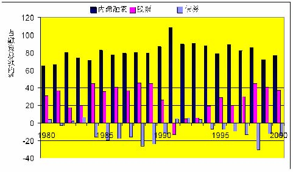

资金来源：国际 1990-94 

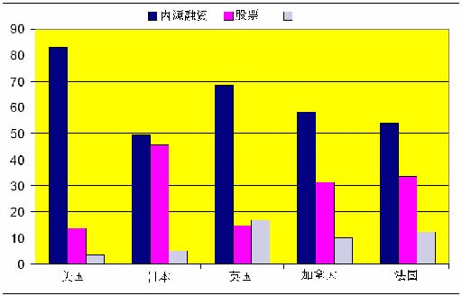

债券 

举例：资本结构，1997 

        行业                     债务/(债务+权益) (%) 

         高杠杆行业 

             建筑业                        60.2 

             酒店旅馆业                    55.4 

             航空运输                      38.8 

             原生金属                      29.1 

             造纸                          28.2 

            低杠杆行业 

            药物化工                       4.8 

            电子业                         9.1 

            管理服务                       12.3 

            计算机                         9.6 

            卫生服务                       15.2 

讲述安排 

- 1． 莫迪格里安尼-米勒定理（译注：以下简称MM定理） 

→ 资本结构无关紧要。  

2. M-M定理里遗漏了什么？ 

 →  税收。 

 →  财务困境成本。 

 →  其它因素。 

3. “书本”对最优资本结构的观点： 

   → 债务与权益之间的选择。 

4．该理论框架在几个商业案例中的应用/实践 

   → 分析它在什么时候有效和它的局限性。 

M-M“无关紧要”定理 

假设： 

- 市场有效且不存在不对称信息。 

- 没有税收。 

- 无交易或破产成本。 

- 公司的投资政策保持不变。 

则： 

- 公司价值与其资本结构无关。 

-  融资决策无关紧要。 

MM定理：证明 1 （馅饼理论） 

由Yogi Berra 提供 

MM定理：证明 2（市场有效）  

你的公司决定要筹资1亿美元 

- 债务融资 

- 出售价值1亿美元的债券获得1亿美元现金。 

- 权益融资 

- 出售价值1亿美元的股票获得1亿美元现金。 

MM定理：证明 2（市场有效） 

-  一切单纯的财务交易都是零净现值的投资，也就是说，不存在套利机会。 

-  故此，它们既不增加也不降低公司的价值。 

MM定理：举例 

MM定理：证明 3 

-  考虑资产完全相同的两家公司（单位：百万美元）： 

<Table>

<TR>
<TD>

下一年的资产价值：

</TD>
<TD>

A公司 

</TD>
<TD>

B公司 

</TD>
</TR>
<TR>
<TD>

情况1 

</TD>
<TD>

160 

</TD>
<TD>

160 

</TD>
</TR>
<TR>
<TD>

  情况2 

</TD>
<TD>

40 

</TD>
<TD>

40 

</TD>
</TR>

</Table>

-  A公司全部是权益融资： 

→ A公司的价值为V(A) = E(A) 

-  B公司则是运用债务和权益组合融资： 

    → 债务面值6,000万美元，期限为一年。 

    → 债务和权益的市值分别为 D(B)和 E(B) 

    →  B公司的价值为（按定义）V(B) = D(B)+E(B) 

-  根据MM定理，V(A) = V(B) 

MM定理：证明 3 

-  A公司的权益得到所有的现金流。 

-  B公司的现金流则分别支付公司的债务和权益。 

<Table>

<TR>
<TD>

下一年不同索取权的价值：

</TD>
<TD>

A公司权益

</TD>
<TD>

B公司负债

</TD>
<TD>

B公司权益 

</TD>
</TR>
<TR>
<TD>

情况1 

</TD>
<TD>

160 

</TD>
<TD>

60 

</TD>
<TD>

100 

</TD>
</TR>
<TR>
<TD>

情况2 

</TD>
<TD>

40 

</TD>
<TD>

40 

</TD>
<TD>

0 

</TD>
</TR>

</Table>

-  在所有（即两种）情况下，以下数值是相等的： 

 → A公司权益所获的支付 

 → B公司债额和权益所获支付的总和 

-  按照数值相加的特性，D(B)+E(B) = E(A) 

M-M直觉 1 

-  如果A公司采取B公司的资本结构，其总价值不变（反之亦然）。 

-  这是因为，公司价值最终而言是由其运营资产（如厂房和库存）所产生的现金流的价值所决定的。 

-  公司的融资政策只是将其现金流“馅饼”在不同索取权（如债权人和股东）之间进行分切。 

-  但是“馅饼”的大小（即价值）与其切分方式无关。 

举例（续） 

-  如果你忘记数值相加的特性从何而来．．． 

-  假设现在市价是： 

 → D(B) = 5,000万美元 

 → E(B) = 5,000万美元 

-  根据MM定理 ，V(A) = D(B ) = 10,000万美元 

-  假如取而代之的 E(A) = 10,500美元 

-  你能否找出一个套利机会呢 ？ 

举例（续） 

套利策略： 

 → 购入B公司 1/100万的权益，花费50美元 

 → 购入B公司 1/100万的债务，花费50美元 

 →  出售A公司 1/100万的权益，获得105美元 

<Table>

<TR>
<TD>

</TD>
<TD>

当前 

</TD>
<TD>

下一年情况1 

</TD>
<TD>

下一年情况2

</TD>
</TR>
<TR>
<TD>

B公司的权益 

</TD>
<TD>

-$50 

</TD>
<TD>

+$100 

</TD>
<TD>

$0 

</TD>
</TR>
<TR>
<TD>

B公司的债务 

</TD>
<TD>

-$50 

</TD>
<TD>

+$60 

</TD>
<TD>

$40 

</TD>
</TR>
<TR>
<TD>

小计 

</TD>
<TD>

-$100 

</TD>
<TD>

+$160 

</TD>
<TD>

+$40 

</TD>
</TR>
<TR>
<TD>

A公司的权益 

</TD>
<TD>

-$105 

</TD>
<TD>

-$160 

</TD>
<TD>

-$40 

</TD>
</TR>
<TR>
<TD>

总计 

</TD>
<TD>

+$5 

</TD>
<TD>

$0 

</TD>
<TD>

$0 

</TD>
</TR>

</Table>

注：将B公司的债务与权益合并相当于取消B公司的杠杆（见黑体的数值） 

M-M直觉 2 

-  如果投资者自己可以进行财务交易（以同样成本），它们就不会为公司的财务交易支付溢价。 

-  例如，他们不会因A公司的债务较少而为A公司支付高于B公司的溢价。 

-  的确，通过对B公司的债务和权益进行适当比例的组合，任何一个投资者都可以有效地“取消B公司的杠杆”，从而使其产生与A公司等量的现金流。 

M-M定理的咒语 

-  MM定理最初是为了解释资本结构而发展起来的定理。 

-  但是它却可应用于财务政策的各个方面： 

- →资本结构无关紧要。 

- →长期债务还是短期债务无关紧要。 

- →股息政策无关紧要。 

- →风险管理无关紧要。 

- →其它 

-  的确，可以证明它可应用到所有财务交易上，因为它们都是零净现值交易。 

 审慎使用M-M定理 

-  MM定理并非是对真实世界确实的文字叙述。它明显地遗漏了一些重要的事情。 

-  但它可以让你提出正确的疑问：融资行为怎样才能改变“馅饼”的大小？ 

-  MM定理揭示了一些很常见的谬误如： 

- 加权平均资本成本的谬误 

- 双赢谬误 

- 每股盈利（EPS）谬误 

加权平均资本成本的谬误：“由于债务比权益廉价，因此债务优于权益” 

-  由于（基本上对所有的公司）债务比权益的安全性高。投资者对债务要求的回报要比权益的低（正确） 

-  差别非常明显，分别是：4%和13%的预期回报率。 

-  因此公司应永远以债务融资，因为这样他们支付给投资者的回报较低，即债务成本较低。（错误） 

-  这种说法错在何处？ 

加权平均资本成本的谬误（续） 

-  这一推理忽略了债务的“隐藏”成本： 

- →举债过多将导致已有权益的风险加大 

- →如果债务的违约为零时，上述说法是否仍然正确？ 

-  牛奶类比：全脂牛奶＝奶油 + 脱脂牛奶 

-  人们经常混淆“廉价”的两种意思： 

- →低成本 

- →好买卖 

-  在价值评估单元（第二部分）将对该问题作更详细的讨论。 

每股盈利(EPS)谬误：“当债务融资使每股盈利增加时, 债务较优” 

-  当公司提高其杠杆时，每股盈利会增加（或减少）（正确） 

-  公司应选择使其每股盈利最大的融资政策。（错误） 

-  这种说法错在何处？ 

每股盈利(EPS)谬误（续） 

-  资本结构的变化不会影响息前税前收益(EBIT)（记着此时我们假定没有税收）。 

-  债权人获取EBIT安全（或是最安全）的那部分。 

-  期望每股盈利可能会增加，但同时其风险也在增加！ 

附注： 

-  这里同时告诉我们要审慎使用P/E比率（市盈率）。例如比较具有不同资本结构的两家公司的市盈率。 

-  当回购股票时，该效果变得更加含混不清：在期望收益变化的同时，股票的数额也在变化。 

杠杆、收益和风险 

公司是债务和权益的一个投资组合 

故此．．． 

净资产 

负债与权益

权      益 

长期债务 

资 产

杠杆、收益和风险 

资产的风险是由投资项目的类型而不是由项目的融资方式所决定的。 

-  杠杆的变化不会影响rA或βA。 

-  杠杆影响rE及βE。 

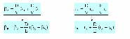

杠杆和β风险系数 

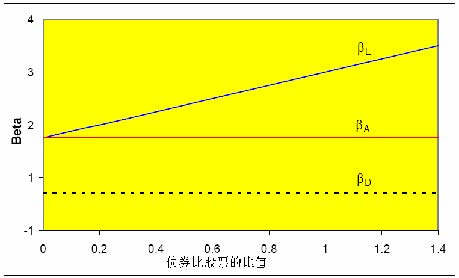

杠杆和要求回报率 

举例 

你公司全部是权益融资，总资产为100万美元, 股票总数为10,000股（每股100美元）。根据经济情况的不同，下一年的息前税前受益可能为50,000美元, 125,000美元或200,000美元。这些盈利预计将无限期维持不变。派息率是100%。 

公司现考虑利用杠杆进行资本结构调整，发行价值300,000美元的债务，并用所获资金回购股票。利率是10%。 

这项交易将会对公司的每股盈利和股票价格产生什么样的影响？假设可以忽略税收。 

目前：全部权益 

<Table>

<TR>
<TD>

</TD>
<TD>

比预期坏 

</TD>
<TD>

预期 

</TD>
<TD>

比预期好 

</TD>
</TR>
<TR>
<TD>

股份数量 

</TD>
<TD>

10,000

</TD>
<TD>

10,000

</TD>
<TD>

10,000

</TD>
</TR>
<TR>
<TD>

债务 

</TD>
<TD>

$0

</TD>
<TD>

$0

</TD>
<TD>

$0

</TD>
</TR>
<TR>
<TD>

</TD>
<TD>

</TD>
<TD>

</TD>
<TD>

</TD>
</TR>
<TR>
<TD>

息前税前盈利

</TD>
<TD>

 $50,000

</TD>
<TD>

$125,000

</TD>
<TD>

$200,000

</TD>
</TR>
<TR>
<TD>

利息 

</TD>
<TD>

0

</TD>
<TD>

0

</TD>
<TD>

0

</TD>
</TR>
<TR>
<TD>

净收入 

</TD>
<TD>

$50,000

</TD>
<TD>

$125,000

</TD>
<TD>

$200,000

</TD>
</TR>
<TR>
<TD>

每股盈利 

</TD>
<TD>

$5 

</TD>
<TD>

$12.50 

</TD>
<TD>

$20 

</TD>
</TR>

</Table>

预期每股盈利= 12.50美元 

股价 = 100美元 

股本的回报(rE) = 每股派息(DPS)/股价 = 每股盈利(EPS)/股价 = 12.5% 

资本结构调整：30%债务 

<Table>

<TR>
<TD>

</TD>
<TD>

比预期坏 

</TD>
<TD>

预期 

</TD>
<TD>

比预期好 

</TD>
</TR>
<TR>
<TD>

股份数量 

</TD>
<TD>

7,000

</TD>
<TD>

7,000

</TD>
<TD>

7,000

</TD>
</TR>
<TR>
<TD>

债务 

</TD>
<TD>

$300,000

</TD>
<TD>

$300,000

</TD>
<TD>

$300,000

</TD>
</TR>
<TR>
<TD>

</TD>
<TD>

</TD>
<TD>

</TD>
<TD>

</TD>
</TR>
<TR>
<TD>

息前税前盈利 

</TD>
<TD>

$50,000

</TD>
<TD>

$125,000

</TD>
<TD>

$200,000

</TD>
</TR>
<TR>
<TD>

利息 

</TD>
<TD>

$30,000

</TD>
<TD>

$30,000

</TD>
<TD>

$30,000

</TD>
</TR>
<TR>
<TD>

净收入 

</TD>
<TD>

$20,000

</TD>
<TD>

$95,000

</TD>
<TD>

$170,000

</TD>
</TR>
<TR>
<TD>

每股盈利 

</TD>
<TD>

$2.88 

</TD>
<TD>

$13.57 

</TD>
<TD>

$24.29 

</TD>
</TR>

</Table>

- 预期每股盈利 = 13.57美元 

- rE =  rA+ D/E(rA-rD) = 0.125 + (0.30/0.70)(0.125-0.10) = 13.57% 

- 股价 = 每股派息(DPS)/rE = 每股盈利(EPS)/rE = 100美元 

双赢谬误：“由于一些投资者更偏爱债务，因此债务优于权益” 

-  投资者有不同的偏好和需要，因此要求不同的现金流。（正确） 

-  例如：年轻专业人士与退休人士。 

-  如果公司发行适合不同客户群（金融市场上的投资者）的多种证券（例如：债券和股票），则所有投资者愿意支付给公司的金额之和将会较大。（错误） 

-  这种说法错在何处？ 

双赢谬误（续） 

-  该推理假定市场不完全。也就是说： 

- →的确不同证券是有不同的客源 

- →这些客户是“未满足”的，即投资者不能以同样或更低成本去仿效发行那些证券。 

-  由于对于任何特定公司的债券，都存在相近的替代品，因此不可能存在大量对企业债券“未满足”的客户。 

-  同时，金融中介机构也在起着识别未满足客户的作用。 

-  对于新兴的证券或较为复杂的融资安排，双赢状况出现的可能性较大。 

实际含义 

-  在评价一项决策（如，合并的效果）时： 

   →要将该决策的财务方（右手方）与实际方（左手方）区分开 

   → MM定理指出大部分价值是由左手方创造的。 

-  当评估支持某一财务决策的论点时： 

   →清楚它在MM定理的假设下是站不住的 

   →论点是依靠哪些偏离MM定理假设的条件而成立的？ 

   →要是没有的话，那该论点就很可疑。 

   →要是有的话，那就要试试评估这些偏离的程度大小。 

简单的MM定理遗漏了什么？ 

- 税收： 

 →各种公司税 

 →各种个人税 

- 财务困境成本 

资本结构与公司税 

-  对不同的财务交易征收的税收是不同的： 

 →利息是公司可从税收中获豁免扣除的。 

 →股息及留存收益则不可以。 

 →其它。 

-  财务政策关系重大因为它影响一家公司的税收。 

债务的税盾 

观点：债务通过减少公司的税收而使公司价值增加。 

-  举例：XYZ公司每年有永续性营业收益100M美元。假设无风险利率为10%。比较： 

- 100%债务：每年100M美元利息（永续性的）。 

- 100%权益：每年100M美元股息或资本利得（永续性的）。 

<Table>

<TR>
<TD>

</TD>
<TD>

100%债务

</TD>
<TD>

100%权益 

</TD>
</TR>
<TR>
<TD>

税前收入

</TD>
<TD>

100M美元 利息收入 

</TD>
<TD>

100M美元 股息收入

</TD>
</TR>
<TR>
<TD>

公司税率 35% 

</TD>
<TD>

0

</TD>
<TD>

-$35M

</TD>
</TR>
<TR>
<TD>

税后收入 

</TD>
<TD>

$100M

</TD>
<TD>

$65M

</TD>
</TR>
<TR>
<TD>

公司价值 

</TD>
<TD>

$100M

</TD>
<TD>

$65M

</TD>
</TR>

</Table>

直觉 

-  MM定理仍然适用：资本结构不影响“馅饼”大小。 

 “馅饼”大小 =  税前现金流量的价值 

-  但同时，美国税收总署（IRS）也分得了馅饼的一部分。 

-  财务政策影响的是IRS分得的那部分馅饼的大小。 

-  利息支付是免税的，与权益相比债务更能减少IRS那部分的现值。 

“馅饼”理论 

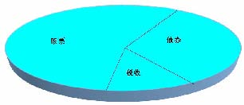

举例 

2000年，微软公司有230亿美元的销售收入，税前盈利是143亿美元，而净利是94亿美元。 微软付了49亿美元的税收，市值是4,230亿美元，而且不存在未清偿的长期债务。 

比尔盖茨现在考虑改变资本结构，发行价值500亿美元的长期债务（rd=7%）而回购500亿美元的股票。这项交易将会如何影响微软的税后现金流和股东净值？ 

微软：资产负债表 (单位：百万美元） 

<Table>

<TR>
<TD>

项目 

</TD>
<TD>

1997

</TD>
<TD>

1998

</TD>
<TD>

1999

</TD>
<TD>

2000

</TD>
</TR>
<TR>
<TD>

现金 

</TD>
<TD>

8,966

</TD>
<TD>

13,927

</TD>
<TD>

17,236

</TD>
<TD>

23,798

</TD>
</TR>
<TR>
<TD>

流动资产 

</TD>
<TD>

10,33

</TD>
<TD>

15,889

</TD>
<TD>

20,233

</TD>
<TD>

30,308

</TD>
</TR>
<TR>
<TD>

流动负债 

</TD>
<TD>

3,610 

</TD>
<TD>

5,730 

</TD>
<TD>

8,718 

</TD>
<TD>

9,755 

</TD>
</TR>
<TR>
<TD>

长期债务 

</TD>
<TD>

0

</TD>
<TD>

0

</TD>
<TD>

0

</TD>
<TD>

0

</TD>
</TR>
<TR>
<TD>

账面权益 

</TD>
<TD>

9,797

</TD>
<TD>

15,647

</TD>
<TD>

27,485

</TD>
<TD>

41,368

</TD>
</TR>
<TR>
<TD>

权益市值 

</TD>
<TD>

155,617 

</TD>
<TD>

287,700

</TD>
<TD>

460,770 

</TD>
<TD>

422,640

</TD>
</TR>
<TR>
<TD>

销售收入 

</TD>
<TD>

11,358

</TD>
<TD>

14,484

</TD>
<TD>

19,747

</TD>
<TD>

22,956

</TD>
</TR>
<TR>
<TD>

息前税前收入 

</TD>
<TD>

5,314

</TD>
<TD>

7,117

</TD>
<TD>

11,891

</TD>
<TD>

14,275

</TD>
</TR>
<TR>
<TD>

税收 

</TD>
<TD>

1,860

</TD>
<TD>

2,627

</TD>
<TD>

4,106

</TD>
<TD>

4,854

</TD>
</TR>
<TR>
<TD>

净收入 

</TD>
<TD>

3,454

</TD>
<TD>

4,490

</TD>
<TD>

7,785

</TD>
<TD>

9,421

</TD>
</TR>
<TR>
<TD>

流动资本（oper CF）

</TD>
<TD>

4,689

</TD>
<TD>

6,880

</TD>
<TD>

10,003

</TD>
<TD>

13,961

</TD>
</TR>

</Table>

微软，2000年 (单位：百万美元） 

<Table>

<TR>
<TD>

</TD>
<TD>

无负债 

</TD>
<TD>

负债 

</TD>
</TR>
<TR>
<TD>

息前税前收入 

</TD>
<TD>

$14,725

</TD>
<TD>

$14,723

</TD>
</TR>
<TR>
<TD>

利息（r x 50,000）

</TD>
<TD>

0

</TD>
<TD>

3,500

</TD>
</TR>
<TR>
<TD>

税前盈利 

</TD>
<TD>

$14,725

</TD>
<TD>

$10,775

</TD>
</TR>
<TR>
<TD>

税率 （34%） 

</TD>
<TD>

4,854 

</TD>
<TD>

3,664 

</TD>
</TR>
<TR>
<TD>

税后盈利 

</TD>
<TD>

$9,421

</TD>
<TD>

$7,111

</TD>
</TR>
<TR>
<TD>

</TD>
<TD>

</TD>
<TD>

</TD>
</TR>
<TR>
<TD>

债权人的现金流 

</TD>
<TD>

0

</TD>
<TD>

$3,500

</TD>
</TR>
<TR>
<TD>

股东的现金流 

</TD>
<TD>

$9,421

</TD>
<TD>

$7,111

</TD>
</TR>
<TR>
<TD>

债权人和股东的总现金流 

</TD>
<TD>

$9,421 

</TD>
<TD>

$10,611 

</TD>
</TR>

</Table>

负债带来的税收规避 

边际税率 =τ 

 无杠杆公司的税收………τ EBIT 

 有杠杆公司的税收………....τ (EBIT –利息) 

 利息税盾 ………..…..τ利息 

------------------------------------------------------------ 

 利息 = rd D (rd：负债之利率，D：负债额) 

 利息税盾（每年） = τ rdD 

注：只有利息才能减税，本金偿还部分是不能减税的。 

         Acrobat Distiller 6.0.1 (Windows)

         Microsoft Corporation

         D:20050428011756

         2005-04-28T09:18:25+08:00

         Acrobat PDFMaker 6.0 for Word

         2005-04-28T09:19:33+08:00

         2005-04-28T09:19:33+08:00

         uuid:5ee1cb74-41fb-4369-b0c6-8c20e674c853

         uuid:7d1ba4b1-54e1-4225-a3ec-b895580963a9

               45

         xml

               Microsoft Word - 资本结构2-A

               fxzm

资本结构 II 

课程安排概览：第一部分 -  融资 

A.  确定资金需求  

-  2月6日     案例：Wilson Lumber 1  

-  2月11日     案例：Wilson Lumber 2 

B. 最优资本结构：基本知识  

-  2月13日     讲课：资本结构 1  

- 月

-  2月25日     案例：UST Inc.(烟草公司)  

-  2月27日     案例：Massey Ferguson(农机公司)  

C. 最优资本结构：信息与代理 

-  3月4日     讲课：资本结构 3 

-  3月6日     案例：MCI 通讯公司  

-  3月11日     融资复习回顾  

-  3月13日     案例：英特尔公司 

- →220日 讲课：资本结构 2  2月20日         讲课：资本结构2 

审慎使用M-M定理  

-  MM定理并非是对真实世界确实的文字叙述。它明显地遗漏了一些重要的事情。 

-  但它可以让你提出正确的疑问：融资行为怎样才能改变“馅饼”的大小？ 

-  MM定理揭示了一些很常见的谬误如“ 加权平均资本成本谬误”。 

加权平均资本成本的谬误：“由于债务比权益廉价，因此债务优于权益” 

-  由于（基本上对所有的公司）债务比权益的安全性高。投资者对债务要求的回报要比权益的低（正确） 

-  差别非常明显，分别是：4%和13%的预期回报率。 

-  因此公司应永远以债务融资，因为这样他们支付给投资者的回报较低，即债务成本较低。（错误） 

-  这种说法错在何处？ 

加权平均资本成本的谬误（续） 

-  这一推理忽略了债务的“隐藏”成本： 

举债过多将导致已有权益的风险加大 

注：与债务违约风险无关，即，即使债务没有风险，仍然正确。 

-  牛奶类比：全脂牛奶＝奶油 + 脱脂牛奶 

-  人们经常混淆“廉价”的两种意思： 

- 低成本 

- 好买卖 

MM定理的实际含义 

-  在评价一项决策（如，合并的效果）时： 

   →要将该决策的财务方（右手方）与实际方（左手方）区分开 

   → MM定理指出大部分价值是由左手方创造的。 

-  当评估支持某一财务决策的论点时： 

   →清楚它在MM定理的假设下是站不住的 

   →论点是依靠哪些偏离MM定理假设的条件而成立的？ 

   →要是没有的话，那该论点就很可疑。 

   →要是有的话，那就要试试评估这些偏离的程度大小。 

简单的MM定理遗漏了什么？  

-  税收： 

      → 各种公司税 

      → 各种个人税 

-  财务困境成本 

-  发行债券或权益时无交易成本。 

-  对公司的投资行为不存在信息不对等情况。 

-  资本结构对管理层的投资决策不产生影响。 

资本结构与公司税 

-  财务政策关系重大因为它影响一家公司的税收 

-  对不同财务交易征收的税收不同。 

-  对一家公司而言： 

      →   利息是公司可从税项中豁免扣除的。 

      →   股息及留存收益则必须课税。 

债务税盾 

观点：债务通过减少公司的税收而使公司价值增加。 

举例：XYZ公司每年有永续性营业收益100M美元。 假设无风险利率为10%。比较： 

- 100%债务：每年100M美元利息（永续性的）。 

- 100%权益：每年100M美元股息或资本利得（永续性的）。 

<Table>

<TR>
<TD>

</TD>
<TD>

100%债务 

</TD>
<TD>

100%权益 

</TD>
</TR>
<TR>
<TD>

税前收入 

</TD>
<TD>

100M美元利息收入 

</TD>
<TD>

100M美元股息收入 

</TD>
</TR>
<TR>
<TD>

公司税率 35% 

</TD>
<TD>

0 

</TD>
<TD>

-$35M 

</TD>
</TR>
<TR>
<TD>

税后收入 

</TD>
<TD>

$100M 

</TD>
<TD>

$65M 

</TD>
</TR>
<TR>
<TD>

公司价值 

</TD>
<TD>

$100M 

</TD>
<TD>

$65M 

</TD>
</TR>

</Table>

直觉 

-  MM定理仍然适用：资本结构不影响“馅饼”大小。 

 “馅饼”大小 =  税前现金流量的价值 

-  但同时，美国税收总署（IRS）也分得了馅饼的一部分。 

-  财务政策影响的是IRS分得的那部分馅饼的大小。 

-  利息支付是免税的，与权益相比债务更能减少IRS那部分的现值。 

“馅饼”理论II 

负债带来的税收规避 

边际税率 =τ 

 无杠杆公司的税收………τ EBIT 

 有杠杆公司的税收………....τ (EBIT –利息) 

 利息税盾 ………..…..   τ利息 

------------------------------------------------------------ 

 利息 = rd D (rd：负债之利率，D：负债额) 

 利息税盾（每年） = τ rdD 

如果债务是永续性的 

(税盾的折现率 = rd) 

考虑公司税的MM定理   

-  负债对公司价值的贡献就是税盾的现值： 

       V（含债务） = V（全部权益） +  PV（税盾） 

-  通常，我们会利用：  

      PV (税盾) = t * D 

    此处： 

 → t = 公司税税率 

 → D = 公司债务的（估计）市值 

这（税盾）是十分重要还是可以忽略？ 

-  A公司没有债务，公司价值为 V（全部权益）。 

-  假如A公司利用杠杆来重新调整资本结构： 

      → 发行价值为D的债务。 

      → 利用所得收入回购部分权益。 

-  公司的新价值为 

=1+t* 

-  所以，若公司税率 t = 35%： 

      → 如D=20%，公司价值将增加约7%。 

      → 如D=50%，公司价值将增加约17.5%。 

 底线   

-  债务税盾是有影响的，并且可能是潜在的较大影响。 

-  馅饼理论让你提出正确的问题：一项融资决策是如何影响IRS所分得的那部分馅饼的？ 

-  一般标准是用 t*D表示公司债务税盾的资本贴现计算。 

-  注意： 

      →  不是所有公司都面对全额的边际税率。对那些不必交税的公司改理论并不适用。 

      → 个人税。 

税损转结（TLCF ） 

-  有许多有TLCF的公司仍然持续亏损,而没有充分利用债务税盾的好处。 

-  TLCF可以往后推3年/往前推5年   

     →  如果在过去3年有缴税，TLCF可以用来讨回退税。 

     →  如果在5年内仍不能盈利，没利用的TLCF将失效报废。 

     →  即使是最后能利用到（TLCF），仍须把现金的时间价值考虑在内。 

-  至少:  TLCF越多  债务越少  

个人税务 

-  对投资者从债券和股票所获取的报酬的课税也是不一样的。 

-  典型的税收结构（例如：美国）： 

     →     利息和股利是按一般所得缴税。 

     →     资本利得是以较低税率缴税的。 

     →     资本利得可以递延（股利和利息则不能）。  

     →     公司所得的70% 股息可获豁免。  

-  扣除利润分配中重复课税的制度（例如：大部分欧洲国家） 

     →股利的税额抵免（=公司营利税的一部分）减少了股利的双重课税。 

-  故此，就个人税务而言，权益优于债务。 

税后收入的最大化： 

<Table>

<TR>
<TD>

</TD>
<TD>

债务 

</TD>
<TD>

权益包含（递延）

资本利得 

</TD>
<TD>

权益（完全配发股利） 

</TD>
</TR>
<TR>
<TD>

公司层次 

以1美元开始 

税： 

净额 

</TD>
<TD>

1 

0 

1 

</TD>
<TD>

1 

TC

(1-TC) 

</TD>
<TD>

1 

TC

(1-TC) 

</TD>
</TR>
<TR>
<TD>

个人层次 

税： TP和TPE

</TD>
<TD>

TP

</TD>
<TD>

TPE

</TD>
<TD>

TP

</TD>
</TR>
<TR>
<TD>

最后结果 

</TD>
<TD>

(1-TP) 

</TD>
<TD>

(1-Tc)*(1-TPE) 

</TD>
<TD>

(1-Tc)*(1-TP) 

</TD>
</TR>

</Table>

债务在税收上的相对优势： (1-Tp) / (1-TC)* (1-TPE) 

后克林顿时代I： 

<Table>

<TR>
<TD>

</TD>
<TD>

债务 

</TD>
<TD>

权益（包含资本利得*）

</TD>
<TD>

权益（全部股利）

</TD>
</TR>
<TR>
<TD>

公司层次 

</TD>
<TD>

</TD>
<TD>

</TD>
<TD>

</TD>
</TR>
<TR>
<TD>

以100美元开始 

</TD>
<TD>

100 

</TD>
<TD>

100 

</TD>
<TD>

100 

</TD>
</TR>
<TR>
<TD>

税： 35% 

</TD>
<TD>

0 

</TD>
<TD>

35 

</TD>
<TD>

35 

</TD>
</TR>
<TR>
<TD>

净额  

</TD>
<TD>

100 

</TD>
<TD>

65 

</TD>
<TD>

65 

</TD>
</TR>
<TR>
<TD>

个人层次 

</TD>
<TD>

</TD>
<TD>

</TD>
<TD>

</TD>
</TR>
<TR>
<TD>

税： 39%（20%）

</TD>
<TD>

 39%×100= 39 

</TD>
<TD>

20%×65= 13 

</TD>
<TD>

39%×65= 25.35 

</TD>
</TR>
<TR>
<TD>

最后结果 

</TD>
<TD>

61 

</TD>
<TD>

52 

</TD>
<TD>

39.65 

</TD>
</TR>

</Table>

*极端假设： 沒有递延，资本利得的税率为20% 

后克林顿时代II：（有部分递延资本利得） 

<Table>

<TR>
<TD>

</TD>
<TD>

债务 

</TD>
<TD>

权益（包含递延资本利得*）

</TD>
<TD>

 权益（全部股利）

</TD>
</TR>
<TR>
<TD>

公司层次 

</TD>
<TD>

</TD>
<TD>

</TD>
<TD>

</TD>
</TR>
<TR>
<TD>

以100美元开始 

</TD>
<TD>

100  

</TD>
<TD>

100  

</TD>
<TD>

100 

</TD>
</TR>
<TR>
<TD>

税： 35%  

</TD>
<TD>

0 

</TD>
<TD>

35  

</TD>
<TD>

35  

</TD>
</TR>
<TR>
<TD>

净额  

</TD>
<TD>

100 

</TD>
<TD>

65 

</TD>
<TD>

65 

</TD>
</TR>
<TR>
<TD>

个人层次 

</TD>
<TD>

</TD>
<TD>

</TD>
<TD>

</TD>
</TR>
<TR>
<TD>

税：39%（10%） 

</TD>
<TD>

39%×100

= 39 

</TD>
<TD>

10%×65 

= 6.50 

</TD>
<TD>

39%×65 

= 25.35 

</TD>
</TR>
<TR>
<TD>

最后结果 

</TD>
<TD>

61 

</TD>
<TD>

58.5 

</TD>
<TD>

39.65 

</TD>
</TR>

</Table>

*假设： 有效资本利得税率为10% 

底线 

-  债务为大多数公司提供了税收优惠。  

-  在余下的课程里，我们暂不考虑个人税。 

-  （（大部分时间））。 

-  但：注意一些特殊案例。 

含义：杠杆有利？ 

-  既然债务为大多数公司提供了税收优惠，是否所有公司都该100%用债务来融资呢？  

-  为什么并不是所有公司都提高其杠杆率以便节省公司税收？ 

债务的负面影响：财务困境成本  

-  假如税收是唯一考虑因素，(多数)公司就该100%用债务来融资。 

-  常识告诉我们并非如此：如果公司债务过重， 公司将面临支付上的困境。  

-  结果：陷入财务困境。 

财务困境：原因与后果 

-  财政困难－—现金流量不足以支付公司短期的(利息)负担，于是展开一连串与债权人就违约的商讨事宜。 

  → 私下重新议定合约或解决方案。 

  → 破产，由法院监管。 

            →    第7章或第11章。 

            →    参阅BM，第25章的附件。 

-  重要的一点是在确定财务困境的潜在成本时，不要混淆了陷入财务困境的原因和后果。 

-  只应考虑那些要是没财务困境就不会出现的成本。 

 → 陷入财务困境的公司一般运营状况不佳：是原因还是后果？ 

→ 财务困境有时会导致公司部分或全部资产的清算。在不出现财务困境的情况下，这些情况是否会不发生？ 

“馅饼”理论 

,)1(XtCA−=

另外一个“无关紧要论”的结果 

-  假设： 

  → 财务困境的行政支出成本为零。 

  → 跟所有债权人的讨价还价都很顺利，没有摩擦。 

-  财务困境对营运决策没有影响，故而对公司价值没有影响。 

证明： 

•“财务困境”仅表明当前现金流量不足以支付债务。 

• 现金流量本身不会因为财务困境而发生变化。 

• 因为价值是取决于现金流量的，故而财务困境本身而言并不会影响公司价值。 

                                                      Q.E.D.         

审慎使用该理论  

-  和MM定理一样，这并不是对真实世界确实的文字叙述。 

-  但它提供了一些有用的指标： 

      → 财务重组中有哪些交易成本存在？ 

      → 有哪些原因妨碍债权人之间达成一个互惠互利的协议？ 

-  它也警示不要仓猝地下结论。只应考虑那些要是没财务困境就不会出现的成本： 

      → 陷入财务困境的公司通常出现销售额下降，经营状况和财务运营状况不佳，这一般被认为是财务困境的原因而非其结果。 

以此思考：财务困境的成本 

直接的破产成本： 

-  法律费用，等。 

间接的财务困境成本： 

-  债务悬空：无法筹集资金进行有利投资。 

       →  错过了有利可图的投资项目 

       → 竞争对手可能抓住这一机会而进一步侵略。 

-  使公司的客户和供应商失去信心。 

-  财务困境的代理成本 

直接破产成本： 

-  有哪些直接的破产成本？  

-  律师费，法院堂费，顾问费．．． 

-  还有机会成本，如：跟债权人协商所花费的时间 

-  直接破产成本有多大的重要性？ 

- 对大公司而言，直接破产成本大约占公司价值的2-5%，而对小公司而言则高达20-25%。 

-  但是直接破产成本需要用公司破产的概率进行加权。 

-  整体而言，预期的直接（破产）成本会比较小。 

间接成本：债务悬空 

-  当XYZ公司具有如下风险特征时其资产价值如下表：  

<Table>

<TR>
<TD>

狀況  

</TD>
<TD>

概率 

</TD>
<TD>

</TD>
<TD>

资产   

</TD>
</TR>
<TR>
<TD>

好 

</TD>
<TD>

1/2 

</TD>
<TD>

</TD>
<TD>

100 

</TD>
</TR>
<TR>
<TD>

坏   

</TD>
<TD>

1/2 

</TD>
<TD>

</TD>
<TD>

10 

</TD>
</TR>

</Table>

-  XYZ公司有一新投资项目： 

      → 当前：投资支出 1500万美元。 

      → 下一年：安全收益 2200万美元。 

-  若无风险利率为10%，则XYZ公司应投资该项目： 

      净现值（NPV）= -15 + 22/1.1 = 500万美元。 

债务悬空（续） 

-  XYZ公司明年将有面值3500万美元的债务到期。 

<Table>

<TR>
<TD>

 没有投资该项目的情况下 

</TD>
</TR>
<TR>
<TD>

狀況  

</TD>
<TD>

概率 

</TD>
<TD>

</TD>
<TD>

资产 

</TD>
<TD>

债权人 

</TD>
<TD>

股东 

</TD>
</TR>
<TR>
<TD>

好 

</TD>
<TD>

1/2 

</TD>
<TD>

</TD>
<TD>

100 

</TD>
<TD>

35 

</TD>
<TD>

65 

</TD>
</TR>
<TR>
<TD>

坏 

</TD>
<TD>

1/2 

</TD>
<TD>

</TD>
<TD>

10 

</TD>
<TD>

10 

</TD>
<TD>

0 

</TD>
</TR>
<TR>
<TD>

</TD>
<TD>

</TD>
<TD>

</TD>
<TD>

</TD>
<TD>

</TD>
<TD>

</TD>
</TR>
<TR>
<TD>

投资该项目的情况下 

</TD>
</TR>
<TR>
<TD>

狀況  

</TD>
<TD>

概率 

</TD>
<TD>

</TD>
<TD>

资产 

</TD>
<TD>

债权人 

</TD>
<TD>

股东 

</TD>
</TR>
<TR>
<TD>

好 

</TD>
<TD>

1/2 

</TD>
<TD>

</TD>
<TD>

100+22=122

</TD>
<TD>

35 

</TD>
<TD>

65+22=87 

</TD>
</TR>
<TR>
<TD>

坏 

</TD>
<TD>

1/2 

</TD>
<TD>

</TD>
<TD>

10+22=32 

</TD>
<TD>

10+22=32

</TD>
<TD>

0 

</TD>
</TR>

</Table>

-  XYZ公司股东不会为该项目融资，因为： 

     -15+[(1/2)×22 + (1/2)×0]/1.1 = -$5M 

-  这到底发生了什么？ 

债务悬空（续） 

-  股东将会： 

      → 承担全部的投资成本：-1,500万美元。 

      → 仅获得部分收益（在好的状况下收益2,200万美元）。 

-  现有债权人将会： 

      → 不必承担任何投资成本。 

      → 仍然能够获得部分收益（在坏的状况下收益2,200万美元）。 

-  所以，现有的风险债务就像是“对投资的征税”。 

-  陷入财务困境的公司的股东一般不愿为有利可图的投资项目提供融资，因为投资所得的收益大部分都归公司的债权人所有。 

-  当债务的风险增加且陷入财务困境的可能性加大时，这种效应将会更为强烈。 

对此情况有何对策？ 

-  发行新债？ 

      →优于或次于现有的未清偿债务？ 

-  财务重组？ 

→ 除破产以外 

→ 按正常破产程序破产。 

发行新债 

-  发行比现有债务具有较低优先权的新债： 

- 不会改变上述情况：＂税收＂仍然没有改变。 

-  发行跟现有债务同等优先权的新债： 

-  情况会稍有改善，但却不能解决问题：（少量的）“ 税” 依然存在。  

-  发行比现有债务较高优先权的新债：  

-  避免了“投资的税收” ，因为新的债权人获得大部分受益。 

- 同样：债务的期限更短（事实上相当于较高优先权的债权）。  

*然而，债券的限制性条款一般禁止这样做。 

财务重组？ 

-  理论上，财务重组可以避免一些无效性： 

 →    债务权益置换。 

 →    债务减免或重新制定偿还时间表。 

-  假设债权人同意将债务缩减至2400万美元（条件是公司发行新的权益为投资项目融资）。 

<Table>

<TR>
<TD>

没有财务重组  

</TD>
</TR>
<TR>
<TD>

状况  

</TD>
<TD>

概率 

</TD>
<TD>

</TD>
<TD>

资产 

</TD>
<TD>

债权人

</TD>
<TD>

股东  

</TD>
</TR>
<TR>
<TD>

好 

</TD>
<TD>

1/2 

</TD>
<TD>

</TD>
<TD>

100 

</TD>
<TD>

35 

</TD>
<TD>

65 

</TD>
</TR>
<TR>
<TD>

坏 

</TD>
<TD>

1/2 

</TD>
<TD>

</TD>
<TD>

10 

</TD>
<TD>

10 

</TD>
<TD>

0 

</TD>
</TR>
<TR>
<TD>

有财务重组 

</TD>
</TR>
<TR>
<TD>

状况  

</TD>
<TD>

概率 

</TD>
<TD>

</TD>
<TD>

资产 

</TD>
<TD>

债权人

</TD>
<TD>

股东  

</TD>
</TR>
<TR>
<TD>

好 

</TD>
<TD>

1/2 

</TD>
<TD>

</TD>
<TD>

122 

</TD>
<TD>

24 

</TD>
<TD>

98 

</TD>
</TR>
<TR>
<TD>

坏 

</TD>
<TD>

1/2 

</TD>
<TD>

</TD>
<TD>

32 

</TD>
<TD>

24 

</TD>
<TD>

8 

</TD>
</TR>

</Table>

-  股东会为该投资项目融资吗？ 

财务重组？（续） 

-  重复我们的假设：可全部用10%的折现率进行折现。 

-  与未重组（同时也没有投资）相比，股东所获现金流有所增长： 

       →9800万 – 6500万 = 3300万美元   概率为1/2 

       →800万- 0 = 800万美元            概率为 1/2 

-  股东会愿意财务重组，因为：   

       -1500万 = [(1/2)×3300万 + (1/2) ×800万]/1.1 = 360万美元 &gt; 0 

-  债权人同样受益，因为他们得到 

       500万-360万 = 140万美元 

财务重组？（续） 

-  在评估财务困境成本时，须计算财务重组（互利）的概率。 

-  在实践中，财务重组并非总是完美。 

-  但你必须要问：财务重组的限制何在？ 

      → 银行贷款 还是 债券 

      → 少数银行 还是 多家银行 

      → 与银行建立关系 还是 应急的融资 

      → 简单 还是 复杂的债务结构（如：不同等级；不同优先权，不同债券期限，不同担保，．．．） 

债务悬空：预防措施 

-  可能步入财务困境的公司应避免过多举债。 

-  预计未来有资金需求的公司应避免过多举债。 

-  预计将来具有有价值的投资机会的公司应避免过多举债。 

-  假如无法避免举债，至少你应该事先构建好负债结构，以便可以较容易的进行财务重组。 

      → 积极的负债管理。 

      → 银行贷款。 

      → 跟少数银行来往。 

使客户和供应商失去信心 

-  如果公司正处于或接近财务困境：  

      →    供应商可能要求现金交易： 

           → 这可能会促使公司进入财务困境 

－Macy's百货及其成衣制造商. 

   → 客户可能选择其他厂商： 

          →    为什么有这种可能？ 

          →    对那一类的公司来说不会出现该问题？ 

                  → Wilson Lumber公司，是否会出现这样的问题？ 

                  → Dell公司，是否会出现这样的问题？ 

财务困境的代理成本 

-  财务困境有可能导致管理层（破釜沉舟下注后）以牺牲代价的方式行事。 

-  举例： 

      → 过度冒险（作起死回生一赌）。 

      → 延误（有效的）清偿。 

      → 套现后卷款，把钱转移离开公司。 

-  为什么这些策略对股东是高成本的？ 

      → 因为债权人预期它们会发生而在债券发行时压低价格。 

课本对最优资本结构的观点  

- 1. 由MM不相关定理开始 

- 2. 加入影响＂馅饼＂大小 的两个成份。 

      → 税收。 

      → 预期财务困境成本。 

3．权衡这两者就可得到“静态最优”资本结构。（说它是“静态”是因为这一观点要求，公司在长期内得维持其债务的相对稳定。） 

课本对最优资本结构的观点II 

实际含义：预期财务困境成本并非无关紧要! 

-  具有＂低＂预期财务困境成本的公司应多举债以便取得税收的好处。 

-  具有“高”预期财务困境成本的公司应行事应更保守稳健。 

-  故此，要旨在于要掌握哪些行业和公司特征会导致潜在高的预期财务困境成本。 

        预期财务困境成本=（财务困境发生的概率）*（财务困境的成本）  

确定预期财务困境成本 

-  财务困境发生的概率 

 →   波动的现金流量： 

          －      行业变动                 －   宏观震荡 

          －      科技变动                 －   开创期 

          －      行业周期 

-  财务困境成本 

 →   需要外部资金去投资于资本支出（CAPX）或市场占有上 

 →   资金实力更强的竞争对手 

→   客户和供应商关心你公司的财务状态（如：因为不明确的担保或特殊的投资） 

 →   资产不易流通变卖 

拟定目标资本结构：核对表 

-  税收 

 →  公司是否能从债务税盾中获益？ 

-  预期财务困境成本 

 →   现金流量的波动性 

 →   需要外部资金去投资  

    →   现金抽紧会构成竞争威胁 

 →   客户关心财务困境 

 →   资产不易变卖 

核对表能解释这些观察到的债务比率吗? 

<Table>

<TR>
<TD>

行业  

</TD>
<TD>

债务比率（%） 

</TD>
</TR>
<TR>
<TD>

电力及天然气  

</TD>
<TD>

43.2 

</TD>
</TR>
<TR>
<TD>

食品生产  

</TD>
<TD>

22.9 

</TD>
</TR>
<TR>
<TD>

造纸及塑料   

</TD>
<TD>

     30.4   

</TD>
</TR>
<TR>
<TD>

机械设备  

</TD>
<TD>

19.1 

</TD>
</TR>
<TR>
<TD>

零售业   

</TD>
<TD>

21.7 

</TD>
</TR>
<TR>
<TD>

化工  

</TD>
<TD>

17.3 

</TD>
</TR>
<TR>
<TD>

电脑软件  

</TD>
<TD>

3.5 

</TD>
</TR>

</Table>

核对表解释些什么？ 

-  解释了资本结构的较大差别，如电力及天然气（43.2%）与电脑软件（3.5%）。一般来说，现金流量波动大的公司倾向利用较低的杠杆。 

-  也许对债务比率之间的微小差异解释力不强，如食品生产（22.9%）和机械设备（19.1%）。  

-  其他因素也相当重要（稍后详述）。 

附录 

（供参阅） 

税盾价值的评估 

-  A公司拥有税前永续预期现金流X。 

-  A公司为100%权益融资，要求回报率为k。 

   且  

-  B公司拥有价值为D的债务，其他情况与A公司相同。 

-  因此公司B要支付永续的预期利息i 

 CB = (1-t)(X-i) + I = (1-t) X + t . i = CA + t . i  

-  现金流量差别为税盾数额 t*i  

税盾价值的评估（续）  

-  运用价值相加特性：分别作估价 CA 和 t . i 

-  我们已知 

- 以及 

B=)(

前税前收益X = 100美元（永续性

-    →   支付债务的利

     →   剩余的X-i = 40美元为留存收益 

 假设税率如下：  

-     →  利息收入的个人所得

  →  为简便起见，对个

 ×60 

 每年，XYZ公司的股东所得： 

 每年，这两者收入之和可重新写

Z公司的投资者的税后现金流为：  +[ (1 – d) – (1 – e)(1– t)]. I 

 注意： 

-       → 

 将税盾额资本化后，就会得到常用的公

- DdVV*])1(1[)()(−−+=全部权益含债务

我们知道永续性的(1-d)i 

-  因此，永续的 

- ed−−−1)(1()1[(

- V

则在总体税收上

大，且d与e的值接近时，则

- 债务优于权益V（含债务）= V（全部权益）+ t*D  

 如果股东可以避免足够的资本利得税（如：递

-     →在e=0的极端情况下 )(1t−

     )1()1(1(ede−=−−  如果

         Acrobat Distiller 6.0 (Windows)

         2005-04-26T08:51:07+08:00

         PScript5.dll Version 5.2

         2005-04-26T08:53:02+08:00

         2005-04-26T08:53:02+08:00

         uuid:771bff05-246c-4b26-9faf-96560ae0a082

         uuid:6defb501-bf3d-4994-893e-a95a7ee425d9

         xml

               Microsoft Word - 6-Capital Structure II——Section B

               xjtu

VL=VU+PV（税盾的收益）

税盾的折现率=rd如果债券是永久性的：

1

□A公司：全部采用股票融资——具有一个永久的税前预期年现金支出 X 

- □B公司：和 A公司完全相同，但采用的是债券融资，其价值为 D ——这样其预期的永久性利息支付为 r*D 

- □注意：现金支出由于税盾的作用而有

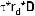

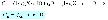

2

- □ 给出 B公司的价值，得知： 

- □ 	运用价值相加的特性：价值分别为 CA和τ*r*D ——A公司的价值为：

- ——当前税盾的价值为： 

- □ 所以，B公司的价值为：

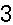

3

财务杠杆和公司价

- □发行债券并不能创造价值，即：不能通过借债和利用额外的现金创造价值。

- □债券所创造的价值相当于发行同样数量的股票。

- □所以，只有在进行如下的行为时，才能通过税盾的方式创造价值：——通过债券融资而不是通过股票融资进行项目的投资。——采用资本结构调整的方法，即：采用收回一部分股票而代之以发行

债券的融资行为。

5

对微软公司而言税盾的价值？——利息支出=50×0.07=3.5亿元——税盾收益=3.5×0.34=1.19亿元 ——PV（税盾）=1.19/0.07=50×0.34=17亿元 ——VL=VU+PV（税盾）=$440亿元

6

- □A公司没有债务，其价值为 V（全部为股票）

- □假定 A公司采用杠杆性的资本结构重组：——发行债券的价值为 D, ——利用收益回购股票。

- □其新的价值为：

- □这样，在公司税率为 t=35%的情况下：——由于 D=20%，公司的价值大约提高了 7%，——由于 D=50%，公司的价值提高了 175%。

- □债务的税收回避作用是很重要的，并且可能有更大的潜在影响

- □馅饼理论提出这样一个问题：这种融资方式的选择是否影响美国国税局从公司收益中所得的份额？

- □标准的方法是使用τ*D进行债券税收回避的资本贴现计算。 

- □提醒：——并不是所有的公司面临完全相同的边际税率——个人税的存在

- □对于额外增加 1美元的收入当前和可预期的将来所交纳税款的现值。

- □为什么边际税率不同于法定税率？——当期损失——税损转结（TLCF）

- □当前的损失能够被向后或向前扩展 3或 15年——能够被用来弥补过去的利润和进行税收的退还——能够被用来弥补将来的利润和进行税收的减免

- □提升 TLCF的价值，需要结合时间价值进行考虑

- □底线：更多的 TLCF→更少发债

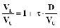

7

8

9

10

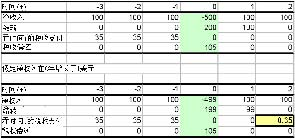

在 0时点的 MTR=PV（额外的税收）=0.35/1.12=0.29（假定 r=10%）

11

请看图中所示的边际税率、人口的百分比和年份

（Graham, J.R. 债券及其边际税率——金融经济杂志，1996年 5月, pp. 41-73.12）

12

- □投资者从债券和股票中得到的报偿其纳税情况是不同的——利息和分红按照正常收入进行征税——资本利得按照较低的税率进行征收——资本利得能够被延期支付（相对于分红和利息）——公司有 70%的分红可以进行税收减免

- □所以：对于个人税收而言，股票高于债券

13

14

15

- □对于大多数公司来说债券更能获得税收回避的好处

- □在课程的其他部分我们将忽略个人税收的情况

- □但是，请注意这是一个特殊的例子

- □如果仅对股票征税，绝大多数公司会 100%地进行债务融资

- □常识提醒我们情况并非都是如此：——如果债务负担太重，公司会陷入支付危机——其结果是：陷入财务困难

- □陷入财务困难的公司运行艰难——运行困难是财务困难的原因还是结果？

- □财务困难有时会导致公司的部分或全部资产面临清算——这是否还会产生其他的结果？

16

17

18

19

直接破产的成本：

- □法律成本，等等……

- 财务困难的间接成本：

- □债务悬空：没有能力筹措资金进行好的项目的投资——错过有价值的投资项目——其竞争者可能利用这个机会加紧扩张

- □冒险行为——孤注一掷

- □缺少顾客和供应商

20

来自 11个铁路公司破产的案例（Warner,金融研究 1977年）

21

来自 11个铁路公司破产的案例（Warner,金融研究 1977年）

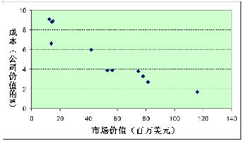

22

- □什么是直接破产的成本？——律师费，诉讼费，顾问费……——还包括机会成本，即：所花费在对付债权人身上的时间

- □直接破产的成本有多高？——长期的考察发现其平均成本为公司总价值的 2—6% ——对于小公司来说其成本所占的百分比较高——但是这需要加进破产可能性的权重！——总之，预期的直接成本不大

23

- □另外，XYZ公司有 15万美元的现金资产——这些现金也能进行诸如红利支付和投资等用途 

- □XYZ公司的项目情况为：——当前：投资支出为 15万美元，第二年：安全的收益为 22万美元 

- □XYZ公司是否应该进行项目的投资？——假定：无风险利率=10% ——NPV=-12+22/1.1=5M 

24

□ XYZ公司到第二年债务的账面价值为 35万美元 

- □XYZ公司的股东会为这个项目集资吗？——如果不集资，他们得到的分红=15万美元——如果集资，他们得到：[(1/2)*22 + (1/2)*0]/1.1 =10万美元 

- □会发生什么情况？

25

债务悬空（续）

- □股东将会：——负担所有的投资成本：-15万美元——仅得到收益的部分（在好的状态下为 22）

- □现有的债权人将会：——不负担任何投资的成本——仍然得到收益的一部分（在坏的状态下为 22）

- □所以，现有的风险债券发挥了“投资税”的作用

陷入财务困难公司的股东不愿意投资有价值项目，因为为此所得的大部分利润都支付给了债权人。

26

- □ 如果出现坏的情况的概率不是 1/2而是 2/3将会怎样？

- □ 债权人在收益中所得到的将会更多。

- □ 投资的“税”被提高了。

- □ 股东将更不愿意进行项目的投资。

27

- □ 发行新的股票？

- □ 发行新的债券？

- □ 财务重组？——除破产以外的其他办法——进入正式的破产程序

28

发行新的股票？

- □ 假定公司对外发行股票

- □ 新的股东必须打破现有的资本平衡：——他们可能支付投资的成本——但是仅仅是因为他们可能为此得到较好的回报

- □ 这就意味着相当于有人不分担新发行股票的成本：——这就是现有的股东！——所以，新股东也会拒绝购买股票

陷入财务困难的公司有可能不能通过向新的投资者融资的方法取得资金，因为公司的绝大多数利润都将支付给现有的债权人。

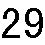

29

财务重组？

- □ 理论来讲，重组能够避免效率低下：

- □ 假定债权人减少其账面价值到 24万美元——公司新发行股票进行项目融资的条件如下：

- □ 股东会为这个项目积极运作吗？

- □ 通过重组增加了对股东的现金支付：——在概率为 1/2的情况下：98－65=33万美元——在概率为 1/2的情况下：8－0=8万美元

- □ 公司将会积极进行重组是因为： ——-15 + [(1/2)*33 + (1/2)*8]/1.1 = $3.6M &gt; 0 ——再次假设：所有的折现率为 10% 

- □ 债权人也因此而得益，因为他们得到： 

- □当评估财务困难的成本时，要考虑进行财务重组的可行性（实现多赢）

- □ 实际上，并不总是可能实现完美的重组。

- □ 但应该问一问：是什么限制了重组的进行？——银行还是债券——少数银行还是多数银行——利用银行的关系还是应急融资——简单的还是复杂的债务结构（例如：各种类型具有不同优先等

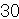

30

31

级、到期日、安全性的债券等）

32

- □ 和现有的债务相比发行新的具有较低优先等级的债券——不会改善现有状况：“税负”没有改变

- □ 发行具有相同优先等级的债券——将会减轻但不会解决问题：还剩余较小的“税负”

- □ 发行具有较高优先等级的债券——因为得到了较大部分的清偿所以避免了投资的税负——同样：（相当于）债券具有较短的到期日

- ※然而，这种情况可能会被合同所禁止

- □ 这种分析所暗含的内容已经得到了破产法的认可。

- □ 在破产准则第 11款下的破产：——为财务重组提供一个正式的框架——财产中的债务：在法院的支配下，公司可以不受合同的限制发

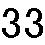

33

行优先于现有债务的债券

34

- □ 那些容易陷入财务困难的公司应避免较多的负债

- □如果免不了要利用财务杠杆，公司至少应该构建自己的债务

35

举例：

- □ 公司有 50美元的现金并且公司现在的价值为 100美元。

- □ 公司有机会以 50美元的价格收购一个新建的互联网公司。——这个新建的公司在一年后价值可能为 0（其概率为 2/3）或者 120（其概率为 1/3）。

——假定折现率为 10%。如果全部采用股票融资的话公司会投资这个项目吗？如果公司的外债账面价值为 80美元将会怎样？

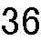

36

如果利用财务杠杆（债务=80）

- □ 不进行项目投资：股票=20，债务=80 

- □ 进行项目的投资：股票=30，债务=60——接受！ 

- □ 将会发生什么？

- □ 对这个项目的投资是一个较差的投机（因为 NPV&lt;0），股东实际上是用债权人的钱去进行赌博的冒险。

- □暗含：陷入财务困难的公司将会采取过度冒险的策略去“放手一搏”。

- □ 公司往往倾向于推迟清算的时间以便能够经营更长的时间。

37

38

股票持有者没有获利的上限但是锁定了损失

39

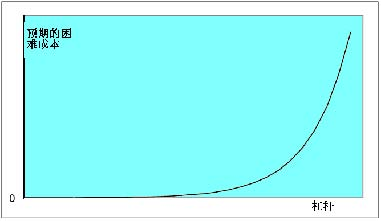

40

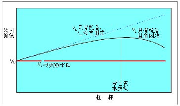

41

1、从 M-M定理的不相关性开始 

2、增加两个改变资产规模的因素——税收——预期的困难成本 

3、考虑所给两个因素的“静态最佳”资本结构。（“静态”是因为该观点假定公司应该在一定时间内保持其债务的相对稳定）

42

- □那些具有较低预期困难成本的公司将发放更多的债务取得税收规避的收益。

- □ 那些具有较高预期困难成本的公司将趋于更加保守。

43

这样，所有的关键在于要明白什么样的行业和公司特点会导致较高的潜在预期困难成本。

预期的困难成本=发生困难的可能性*困难的损失

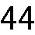

44

□ 发生困难的可能性——现金支出的不稳定性

<Table>
<TR>
<TD>—行业变化</TD>
<TD>—宏观波动</TD>
</TR>
<TR>
<TD>—技术改进</TD>
<TD>—新建</TD>
</TR>
<TR>
<TD>□ 困难成本</TD>

</TR>
</Table>

——顾客和供应商关心公司的财务状况（例如，因为不明确的担保或特定的投资）

——资产不易调整

45

- □ 税收

- □ 预期的困难成本——现金支出的不稳定性——需要外部融资进行投资——如果因现金紧张所带来的竞争对手的威胁——顾客关心其是否处于财务困境中——很难调整资产

46

债务比率（%） 43.2 22.9 

造纸和塑料 30.4 设备 19.1 

17.3 

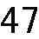

47

- □ 解释了在杠杆范围较广时资本的结构差异，例如：在电器和天然气行业（ 43.2）和计算机软件行业（ 3.5）之间的差异，总的来说，现金支出越不稳定的行业倾向于拥有较低的财务杠杆比率。

- □ 可能在解释债务比率较小的差异上并不是很有效，例如：在食品生产（22.9%）和手工装备（19.1%）之间的差异。 

- □其他因素，诸如稳定的增长，也是很重要的。

- □ 回顾威尔逊公司在产品市场目标（快速增长）和财务目标（适当的杠杆比例）之间选择的压力。

- □快速增长的公司不愿发行股票来结束债务比率高于核对表中所给出的隐含目标的状况。

- □增长缓慢的公司不愿购回其发行的股票或提高其分红来结束其债务比率低于核对表中所给出的隐含目标的现状。

- □ 可以和目标资本结构有所偏差。

- □ 但是一定要记住：那些增长较快的偏离目标较多同时具有较高杠杆的公司容易陷入财务困难。

- □ 总之，一定要有一个相一致的产品市场策略和财务策略。

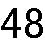

48

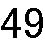

49

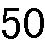

50

         Acrobat Distiller 6.0 (Windows)

         2005-04-26T09:31:34+08:00

         PScript5.dll Version 5.2

         2005-04-26T09:32:18+08:00

         2005-04-26T09:32:18+08:00

         uuid:a5f8976a-33a8-4072-bd88-49bf62df1255

         uuid:a9e68cbd-07c9-45e5-a8e6-274f0a5052da

         xml

               Microsoft Word - 8-Capital Structure

               xjtu

# 资本结构-续 

# 

# Katharina Lewellen 

# 

目标资本结构方法 

- 1．从 

- M-M定理不相关性开始介绍 

- 2. 增加改变资本“饼状”结构的两种因素

- →税收

- →预期的困难成本 

- 3. 从所给定的两个“最佳均衡”资本结构模型中选择其一。（“均衡”是基于公司应该在一定时期保持其债务相对稳定的观点而作出的假设）

“目标财务杠杆”方法给出的建议 

- □ 公司应该：

- →当财务杠杆上升超过目标杠杆时发行股票

- →当财务杠杆下降到目标资本结构时回购股票（或偿付红利） 

- □ 证券市场应该：

- →对证券发行的宣布表示积极（或是中性的）回应

- □ 股票价格在公司宣布其发行公告时下降（通常情况下如此）

- □ 因此公司不愿意发行股票

- □ 公司会选择遵循“优序原理”进行融资

- →首先使用内部盈余资金

- →然后使用债券融资

- →最后发行股票融资

- □ 公司发行股票的意愿会随时间的变化发生波动

会发生什么？

从股票宣布发行前 10天到宣布发行后 10天的 531支普通股累积平均报价(阿斯奎思和马林斯 (1986)) 

综合进行考虑

- □融资的不相关性来自于现有股东 (以经理为代表的)和新股东认同公司财务价值这一现实

- →所有的人都认同公司"资金馅饼"的大小

- □ 这个假设保证了融资交易的 NPV = 0 

- □ 偏离这种框架的情况：

- →无效率的市场

- →不理性的经理人

- →经理人比投资者拥有更多的信息

- →当股票的价值被高估时经理人更愿意发行股票

- →这样，股票的发行所传递给投资者的信息就是股票的价值被高估

- →于是，当股票发行的消息公布后股票的价格就开始下跌

- →这种后果将使经理人避免发行股票

→在一定情况下，经理人甚至宁愿放弃 NPV为正的投资项目也不愿发行股票

股票融资：例子

暂时不考虑税收和资金分配的情况 

□ XYZ公司的资产在一定情况下受特定风险的影响：

- □ 新的投资项目

- →贴现率：10% 

- →投资支出：$12M 

- →次年的稳定回报：$22M ==&gt; PV = 22/1.1 = $20M NPV = -12 + 20 = $8M 

- □ XYZ公司是否应该投资这个项目？

 案例1：经理人拥有和外部投资者一样的信息 

□假定 XYZ公司以 $12M 的现金资产进行投资

→如果采用以内部的现金资产进行融资，现有的股东认为整个项目投资的 NPV为$8M。

- □假定 XYZ公司没有现金资产但可以通过发行股票筹得$12M的资金

- →一旦项目启动，公司的价值为 100 + 20 = $120M. 

- →为筹得$12M 资金需要出售 10%的股份（股票发行之后）. 

- →现有的投资者得到 90% * 120 = $108M. 

- →和不进行项目投资的$100M相比较. 

- →现有投资者的收益为$8M. 

- ◆如果不存在信息的不对称，经理人在内部融资和外部融资之间没有偏好。

<Table>
<TR>
<TH>投资者</TH>

<TH>经理人 </TH>
</TR>
<TR>
<TH>150 </TH>

<TD>P=0.5 </TD>
<TD>150 </TD>

<TD>P=1 </TD>
</TR>
<TR>
<TH>50 </TH>

<TD>P=0.5 </TD>

</TR>
</Table>

- □内部融资

- →同以前一样，现有的投资者获益为$8M 

- □股票融资

- →通过出售 10%的股票(在发行之后)融资$12M，市场对其价值认定为 120(即：100 + 20)。

- →现有的股东得到 90% * ( 150 + 20) = $153 M。

- →现有的股东获益仅为$3M. 

案例2（续）：发行债券融资将会怎样？ 

□ 通过发行债券：

- →发行债券筹得$12M资金次年需偿还(1.1)* 12 =$13. 2M 

- →现有的股东得到全部的$8M，因为： 

150 +(22-13.2)/ 1.1 =$ 158M 

- ◆当股票价值被低估时，在股票融资和债券融资之间，经理更倾向于债券融资

- □ 无风险债券的价值不依赖信息

- □ 经理人和市场给无风险债券以相同的价值判断

- □ 无风险债券可以公平定价——不存在柠檬问题

- □ 风险债券在有些情况下介于无风险债券和股票之间

- →风险债券会存在一些“柠檬”问题，但与股票相比没有股票的问题严重

- □ 如果公司的资产价值为$150M，公司将不愿发行股票，但会进行内部融资或发行债券。

- □ 如果公司选择发行股票，投资者将会认定公司的资产只值$50M 

- □ 因此，当公司宣布发行股票时，股票的价格将会下降

- →下降多少？

- □ 对市场预期的回应

- →资产价值为$150 (其可能性为 1/2)或者为$50(其可能性为 1/2). 

- →计算得知公司资产的价值为$100 

- □ 通过市场的预期，推断出公司处于不利的市场信息下：

- →公司的资产价值只有$50 M 

- □ 当公司公布其股票发行的信息和其新的股票发行时，公司市价下降到 50 + 20 =$ 70M 

为什么说无风险债券优于股票？

柠檬问题：启示例子：市场的反应

从股票宣布发行前 10天到宣布发行后 10天的 531支普通股累积平均报价(阿斯奎思和马林斯 (1986)) 

<Table>
<TR>
<TD>→直接债券：</TD>
<TD>很少或没有影响</TD>
</TR>
<TR>
<TD>→可转换债券：</TD>
<TD>        -2% (收益的 9%) </TD>
</TR>
<TR>
<TD>→股票：</TD>
<TD>              -3% (收益的 25%) </TD>
</TR>
<TR>
<TD>□ 股票回购：</TD>
<TD>           +13% </TD>
</TR>
</Table>

例子（续）：投资不足

- □ 假定投资支出是$18M而不是$12 M。 

- □ 融资$18M需要出售股份的 15% 

- →现有股东得到 85% * (150 + 20) = $144.5 M 

- →相对于不进行投资的$150M而言，现有股东损失$5.5M。 

◆ XYZ公司将不会发行股票进行项目融资。

要点：投资依赖于融资

- □只有进行内部融资或发行无风险债券时，一些项目投资才可以进行。

- □ 信息不对称将导致公司放弃一些好的投资项目。

- □ 具有较少的现金流和较高财务杠杆的公司将面临投资不足的问题。

- →具有较高的财务杠杆会使发行无风险债券变得困难。

- →同样，发行太多债券也可能导致财务困难。

- □ 基本的优序融资顺序

- →在可能的情况下公司将优先使用现金

- →或者发行债券

- □ 具有较高的现金流时：→不需要发行债券

- →实际上，还能够偿还一些债务

- →从而使财务杠杆降低

- □ 具有较低的现金流时：→需要发行债券

- →不愿发行股票

- →从而使财务杠杆升高

- □ 如果按照优序融资理论，一个公司的杠杆比率将：

- →不是由接近目标比率的尝试所决定；

- →而是由一系列不断扩展的融资决策所决定。

- □ 和目标融资结构的方法相反，优序融资理论暗含着资本结构能够进行较大的调整。

优序融资和资本结构要点：

要点：发行股票的时机选择：

- □ 对于发行股票融资而言可能会有“好的”和“坏的”时机。

- □ 当存在较多的信息不对称时，最好不要发行股票——也就是说，发行时机应该选在对股票价格影响最小的时候。

股票发行时机选择的证据

- □ 公司倾向于在繁荣时发行较多的股票而在萧条时发行较少。

- →如果投资机会的 NPV价值较高，则公司就愿意承担发行股票的成本。

- □ 实际上，许多公司在发行股票时，股票发行对股票价格的影响是较低的。

- □ 在以前的论述中，我们假定经理人代表着股东的利益。

- □ 但这总是真实的吗？

- □ 经理人和股东之间的利益冲突被称为代理问题。

警告：这是因为信息不对称问题的影响较小，或者是因为股票交易市场是无效率的——即，股票价格的系统性失真。

经理行为和资本结构代理问题：

责任人=股东 —→代理人=经理人

- □ 代理人不总是作其应做的工作→这些就是责任人的损失

- →这些损失被称为“代理成本”

- →代理成本被更低的股票价格所体现。

- □ 潜在问题：

- →责任回避；

- →帝国大楼；

- →享乐（私人飞机）；

- →风险规避。

- □ 补偿政策

- □ 监督经理的行动

- →董事会的独立董事；

- →作为出借人的银行；

- →大股东。

- □ 共同控制(即接管)市场

- □ 这些能有助于避免代理成本吗？

- □ 自由现金流(FCF) 

- →现金支出超过为所有具有正 NPV的项目所提供资金的需要；

- □ 经理人可能不愿向股东支付 FCF，而是倾向于：

- →投资于不能带来利润的“帝国大厦”

- →进行形象工程，威望投资，职务消费

- □这个问题相对于“现金母牛”（能够产生大量稳定净现金流的公司或公司的某个部门）更严重

- →公司具有较高的现金流 (即，盈利企业) 

- →以及具有好的投资机会

避免代理成本一个最经典的代理问题：自由现金流问题

□从 1973年到 1979年：原油价格增长了十倍

- →石油工业扩张

- →石油消耗下降 

- □ 20世纪 70年代末的石油工业

- →许多生产能力过剩

- →许多现金剩余(因为居高不下的石油价格) 

- □ 经理人在做什么？

- □ 经理人没有向股东支付现金

- □ 没有继续增加在研发 (E&amp;D)上的投入

- →在 1975-1981年期间，石油公司的股票价格相对于公司在 E&amp;D投入上的增加为负相关关系

- □ 而是进行产业之外的投资

- →购买移动电话 (零售)；

- →埃克森公司购买信任电气公司的生产设施和 Vydec公司的办公设备；

- →这些投资行为被证明是近十年来最不成功的投资

- □ 债务 =分配将来现金流的承诺

- →如果经理人不能兑现支付利息的诺言，债券持有人能关闭公司。

- □ 因此，债务能够降低经理人可支配的 FCF 

- →降低了经理人能够运用现金的机会

- □ 关于股息分配？

- →股息分配也能降低 FCF 

- →但是股息分配的承诺不具有强制性

FCF问题的例子（续）—经理人在干什么？ 

财务杠杆能降低FCF 问题吗？ 

杠杆收购 (LBOs) 

- □LBO是私下交易行为

- →典型的特征是，负责收购操作的一方获得全部公开交易的股票。 

- →LBOs 的运行通常要借助于债务融资 (D/E 比率为 10的并不罕见) 

- □卡普兰(1989 年，金融经济杂志)在 76个 LBOs案例中发现：

- →债权和公司价值之比从 18. 8%上升到 87.8% 

- →在私下交易行为中向股东支付 42%的保险费

- →在杠杆收购之后的 3 年内：●营业收入/ 总资产增加了 15% 

- ●营业收入/ 销售增加了 19% 

- ●净现金流增加和资本支出减少 

- □ LBOs通过债务的控制功能实现改进效率的目标了吗？

- □ 税收：公司是否从税盾中受益？

- □ 信息问题：→外部的投资者是否清楚公司的资金需求？

- →股票发行对于市场而言是否是一个坏消息？

- □ 代理问题：公司是否存在自由现金流问题？

- □ 预期的困难成本：

- →什么是困难的可能？（现金流的不稳定）；

- →什么是困难的成本？需要资金进行投资；竞争对手在公司陷入困境时的威胁；客户关心公司的财务困难；公司资产不易重整

资本结构：一个扩展了的核对表

         Acrobat Distiller 6.0 (Windows)

         2005-04-26T09:31:34+08:00

         PScript5.dll Version 5.2

         2005-04-26T09:32:18+08:00

         2005-04-26T09:32:18+08:00

         uuid:a5f8976a-33a8-4072-bd88-49bf62df1255

         uuid:8ee4f854-0ec0-40df-add4-ec50a84239e8

         xml

               Microsoft Word - 8-Capital Structure

               xjtu

# 资本结构-续 

# 

# Katharina Lewellen 

# 

目标资本结构方法 

- 1．从 

- M-M定理不相关性开始介绍 

- 2. 增加改变资本“饼状”结构的两种因素

- →税收

- →预期的困难成本 

- 3. 从所给定的两个“最佳均衡”资本结构模型中选择其一。（“均衡”是基于公司应该在一定时期保持其债务相对稳定的观点而作出的假设）

“目标财务杠杆”方法给出的建议 

- □ 公司应该：

- →当财务杠杆上升超过目标杠杆时发行股票

- →当财务杠杆下降到目标资本结构时回购股票（或偿付红利） 

- □ 证券市场应该：

- →对证券发行的宣布表示积极（或是中性的）回应

- □ 股票价格在公司宣布其发行公告时下降（通常情况下如此）

- □ 因此公司不愿意发行股票

- □ 公司会选择遵循“优序原理”进行融资

- →首先使用内部盈余资金

- →然后使用债券融资

- →最后发行股票融资

- □ 公司发行股票的意愿会随时间的变化发生波动

会发生什么？

从股票宣布发行前 10天到宣布发行后 10天的 531支普通股累积平均报价(阿斯奎思和马林斯 (1986)) 

综合进行考虑

- □融资的不相关性来自于现有股东 (以经理为代表的)和新股东认同公司财务价值这一现实

- →所有的人都认同公司"资金馅饼"的大小

- □ 这个假设保证了融资交易的 NPV = 0 

- □ 偏离这种框架的情况：

- →无效率的市场

- →不理性的经理人

- →经理人比投资者拥有更多的信息

- →当股票的价值被高估时经理人更愿意发行股票

- →这样，股票的发行所传递给投资者的信息就是股票的价值被高估

- →于是，当股票发行的消息公布后股票的价格就开始下跌

- →这种后果将使经理人避免发行股票

→在一定情况下，经理人甚至宁愿放弃 NPV为正的投资项目也不愿发行股票

股票融资：例子

暂时不考虑税收和资金分配的情况 

□ XYZ公司的资产在一定情况下受特定风险的影响：

- □ 新的投资项目

- →贴现率：10% 

- →投资支出：$12M 

- →次年的稳定回报：$22M ==&gt; PV = 22/1.1 = $20M NPV = -12 + 20 = $8M 

- □ XYZ公司是否应该投资这个项目？

 案例1：经理人拥有和外部投资者一样的信息 

□假定 XYZ公司以 $12M 的现金资产进行投资

→如果采用以内部的现金资产进行融资，现有的股东认为整个项目投资的 NPV为$8M。

- □假定 XYZ公司没有现金资产但可以通过发行股票筹得$12M的资金

- →一旦项目启动，公司的价值为 100 + 20 = $120M. 

- →为筹得$12M 资金需要出售 10%的股份（股票发行之后）. 

- →现有的投资者得到 90% * 120 = $108M. 

- →和不进行项目投资的$100M相比较. 

- →现有投资者的收益为$8M. 

- ◆如果不存在信息的不对称，经理人在内部融资和外部融资之间没有偏好。

<Table>
<TR>
<TH>投资者</TH>

<TH>经理人 </TH>
</TR>
<TR>
<TH>150 </TH>

<TD>P=0.5 </TD>
<TD>150 </TD>

<TD>P=1 </TD>
</TR>
<TR>
<TH>50 </TH>

<TD>P=0.5 </TD>

</TR>
</Table>

- □内部融资

- →同以前一样，现有的投资者获益为$8M 

- □股票融资

- →通过出售 10%的股票(在发行之后)融资$12M，市场对其价值认定为 120(即：100 + 20)。

- →现有的股东得到 90% * ( 150 + 20) = $153 M。

- →现有的股东获益仅为$3M. 

案例2（续）：发行债券融资将会怎样？ 

□ 通过发行债券：

- →发行债券筹得$12M资金次年需偿还(1.1)* 12 =$13. 2M 

- →现有的股东得到全部的$8M，因为： 

150 +(22-13.2)/ 1.1 =$ 158M 

- ◆当股票价值被低估时，在股票融资和债券融资之间，经理更倾向于债券融资

- □ 无风险债券的价值不依赖信息

- □ 经理人和市场给无风险债券以相同的价值判断

- □ 无风险债券可以公平定价——不存在柠檬问题

- □ 风险债券在有些情况下介于无风险债券和股票之间

- →风险债券会存在一些“柠檬”问题，但与股票相比没有股票的问题严重

- □ 如果公司的资产价值为$150M，公司将不愿发行股票，但会进行内部融资或发行债券。

- □ 如果公司选择发行股票，投资者将会认定公司的资产只值$50M 

- □ 因此，当公司宣布发行股票时，股票的价格将会下降

- →下降多少？

- □ 对市场预期的回应

- →资产价值为$150 (其可能性为 1/2)或者为$50(其可能性为 1/2). 

- →计算得知公司资产的价值为$100 

- □ 通过市场的预期，推断出公司处于不利的市场信息下：

- →公司的资产价值只有$50 M 

- □ 当公司公布其股票发行的信息和其新的股票发行时，公司市价下降到 50 + 20 =$ 70M 

为什么说无风险债券优于股票？

柠檬问题：启示例子：市场的反应

从股票宣布发行前 10天到宣布发行后 10天的 531支普通股累积平均报价(阿斯奎思和马林斯 (1986)) 

<Table>
<TR>
<TD>→直接债券：</TD>
<TD>很少或没有影响</TD>
</TR>
<TR>
<TD>→可转换债券：</TD>
<TD>        -2% (收益的 9%) </TD>
</TR>
<TR>
<TD>→股票：</TD>
<TD>              -3% (收益的 25%) </TD>
</TR>
<TR>
<TD>□ 股票回购：</TD>
<TD>           +13% </TD>
</TR>
</Table>

例子（续）：投资不足

- □ 假定投资支出是$18M而不是$12 M。 

- □ 融资$18M需要出售股份的 15% 

- →现有股东得到 85% * (150 + 20) = $144.5 M 

- →相对于不进行投资的$150M而言，现有股东损失$5.5M。 

◆ XYZ公司将不会发行股票进行项目融资。

要点：投资依赖于融资

- □只有进行内部融资或发行无风险债券时，一些项目投资才可以进行。

- □ 信息不对称将导致公司放弃一些好的投资项目。

- □ 具有较少的现金流和较高财务杠杆的公司将面临投资不足的问题。

- →具有较高的财务杠杆会使发行无风险债券变得困难。

- →同样，发行太多债券也可能导致财务困难。

- □ 基本的优序融资顺序

- →在可能的情况下公司将优先使用现金

- →或者发行债券

- □ 具有较高的现金流时：→不需要发行债券

- →实际上，还能够偿还一些债务

- →从而使财务杠杆降低

- □ 具有较低的现金流时：→需要发行债券

- →不愿发行股票

- →从而使财务杠杆升高

- □ 如果按照优序融资理论，一个公司的杠杆比率将：

- →不是由接近目标比率的尝试所决定；

- →而是由一系列不断扩展的融资决策所决定。

- □ 和目标融资结构的方法相反，优序融资理论暗含着资本结构能够进行较大的调整。

优序融资和资本结构要点：

要点：发行股票的时机选择：

- □ 对于发行股票融资而言可能会有“好的”和“坏的”时机。

- □ 当存在较多的信息不对称时，最好不要发行股票——也就是说，发行时机应该选在对股票价格影响最小的时候。

股票发行时机选择的证据

- □ 公司倾向于在繁荣时发行较多的股票而在萧条时发行较少。

- →如果投资机会的 NPV价值较高，则公司就愿意承担发行股票的成本。

- □ 实际上，许多公司在发行股票时，股票发行对股票价格的影响是较低的。

- □ 在以前的论述中，我们假定经理人代表着股东的利益。

- □ 但这总是真实的吗？

- □ 经理人和股东之间的利益冲突被称为代理问题。

警告：这是因为信息不对称问题的影响较小，或者是因为股票交易市场是无效率的——即，股票价格的系统性失真。

经理行为和资本结构代理问题：

责任人=股东 —→代理人=经理人

- □ 代理人不总是作其应做的工作→这些就是责任人的损失

- →这些损失被称为“代理成本”

- →代理成本被更低的股票价格所体现。

- □ 潜在问题：

- →责任回避；

- →帝国大楼；

- →享乐（私人飞机）；

- →风险规避。

- □ 补偿政策

- □ 监督经理的行动

- →董事会的独立董事；

- →作为出借人的银行；

- →大股东。

- □ 共同控制(即接管)市场

- □ 这些能有助于避免代理成本吗？

- □ 自由现金流(FCF) 

- →现金支出超过为所有具有正 NPV的项目所提供资金的需要；

- □ 经理人可能不愿向股东支付 FCF，而是倾向于：

- →投资于不能带来利润的“帝国大厦”

- →进行形象工程，威望投资，职务消费

- □这个问题相对于“现金母牛”（能够产生大量稳定净现金流的公司或公司的某个部门）更严重

- →公司具有较高的现金流 (即，盈利企业) 

- →以及具有好的投资机会

避免代理成本一个最经典的代理问题：自由现金流问题

□从 1973年到 1979年：原油价格增长了十倍

- →石油工业扩张

- →石油消耗下降 

- □ 20世纪 70年代末的石油工业

- →许多生产能力过剩

- →许多现金剩余(因为居高不下的石油价格) 

- □ 经理人在做什么？

- □ 经理人没有向股东支付现金

- □ 没有继续增加在研发 (E&amp;D)上的投入

- →在 1975-1981年期间，石油公司的股票价格相对于公司在 E&amp;D投入上的增加为负相关关系

- □ 而是进行产业之外的投资

- →购买移动电话 (零售)；

- →埃克森公司购买信任电气公司的生产设施和 Vydec公司的办公设备；

- →这些投资行为被证明是近十年来最不成功的投资

- □ 债务 =分配将来现金流的承诺

- →如果经理人不能兑现支付利息的诺言，债券持有人能关闭公司。

- □ 因此，债务能够降低经理人可支配的 FCF 

- →降低了经理人能够运用现金的机会

- □ 关于股息分配？

- →股息分配也能降低 FCF 

- →但是股息分配的承诺不具有强制性

FCF问题的例子（续）—经理人在干什么？ 

财务杠杆能降低FCF 问题吗？ 

杠杆收购 (LBOs) 

- □LBO是私下交易行为

- →典型的特征是，负责收购操作的一方获得全部公开交易的股票。 

- →LBOs 的运行通常要借助于债务融资 (D/E 比率为 10的并不罕见) 

- □卡普兰(1989 年，金融经济杂志)在 76个 LBOs案例中发现：

- →债权和公司价值之比从 18. 8%上升到 87.8% 

- →在私下交易行为中向股东支付 42%的保险费

- →在杠杆收购之后的 3 年内：●营业收入/ 总资产增加了 15% 

- ●营业收入/ 销售增加了 19% 

- ●净现金流增加和资本支出减少 

- □ LBOs通过债务的控制功能实现改进效率的目标了吗？

- □ 税收：公司是否从税盾中受益？

- □ 信息问题：→外部的投资者是否清楚公司的资金需求？

- →股票发行对于市场而言是否是一个坏消息？

- □ 代理问题：公司是否存在自由现金流问题？

- □ 预期的困难成本：

- →什么是困难的可能？（现金流的不稳定）；

- →什么是困难的成本？需要资金进行投资；竞争对手在公司陷入困境时的威胁；客户关心公司的财务困难；公司资产不易重整

资本结构：一个扩展了的核对表

         Acrobat Distiller 6.0 (Windows)

         2005-04-26T09:40:29+08:00

         PScript5.dll Version 5.2

         2005-04-26T09:41:01+08:00

         2005-04-26T09:41:01+08:00

         uuid:f67feac3-a3f4-4ac5-825f-6fa2d46b0152

         uuid:842df4ce-e70f-44e1-a3b3-304a3e346adc

         xml

               Microsoft Word - 9-Review of financing and capital strcture——section A

               xjtu

# 混合融资模式

# 

金融理论 II(15.402)-2003年春季-Dirk Jenter 

本章结构：第一部分—融资 

- A. 	确定资金需要 2月 6日案例：威尔逊木材厂 2月 11日案例：威尔逊木材厂 

- B. 	最佳资本结构：基础 2月 13日讲义：资本结构 1 2月 20日讲义：资本结构 2 2月 25日案例： UST股份有限公司 2月 27日案例：马西·弗格森公司 

- C. 	最佳资本结构：信息和代理 3月 4日讲义：资本结构 3 3月 6日案例：MCI 通讯公司 3月 11日融资建议 3月 13日案例：Intel公司

财务预测

- ● 短期和中期预测

- ● 一般动态：不变增长

- 资本结构

- ● 描述一个公司的资本结构

- ● 基准：MM定理不相关性

- ● 定理 1：静态交易理论

- ● 定理 2：优序融资理论

- ● 代理问题与资本结构相关

→将以上各种方法综合起来

金融理论 II(15.402)-2003年春季-Dirk Jenter 

### 预测一个公司的资金需求 

- ● 问题：给定一个公司的经营，预期该公司需要多少资金和什么时候需要？

- ● 需要进行短期和长期的预测

- ● 需要公司的一般动态资产指标

- →不变增长的概念

- →将"现金母牛"从"财务垃圾"中区别出来

- ● 稳定的增长率： g * = (1－d) *ROE（股东权益收益率）

- ● （粗略）给定一个在不增加公司财务杠杆比率和发行股票的情况下如何使公司的资产快速增加的办法

- ● 当出现下列情况时，稳定的增长率将会提高：

- →分红减少

- →边际利润（NI/销售）提高

- →资产周转率（销售/资产）提高

- →财务杠杆（资产/NW）增加

金融理论 II(15.402)-2003年春季-Dirk Jenter 

### 要点

- ● 要点 0：稳定增长的概念没有指出公司的成长是好的还是有害的

- ● 要点 1：只有当公司不能或不愿发行股票时稳定的增长前后才是相关联的，并且公司也不能让 D/E的比率增加。

- ● 要点 2：稳定增长给人一种一般动态的简单想法：或者是现金母牛 (g &lt;&lt; g*)或者是财务垃圾(g &gt;&gt; g*)。

- ● 要点 3：融资和经营策略不能够相互独立进行

- ● 莫迪格里安尼-米勒定理

- →资产结构的选择是不相关的

- ● 理论 1：静态交易理论

- →税盾与预期困难的成本

- ● 理论 2：优序融资理论

- →信息不对称的成本

- ● 代理问题与资本结构的相关性

金融理论 II(15.402)-2003年春季-Dirk Jenter 

### 莫迪格里安尼-米勒理论 

- ●MM定理：在无摩擦的市场里，融资政策是不相关的。

- →“证据”：融资交易行为的 NPV = 0. QED 

- ●由此得出顺理成章的结论：全部如下内容都是不相关的：

- →资本结构；

- →长期与短期债券；

- →分红政策；

- →风险管理；

- →等等。

MM定理给了我们一个理解资本结构的框架——改变资本的“馅饼”结构。

当对融资行为进行评估衡量时：

●自我衡量一下：按照 MM定理为什么有关融资的争论是错的？

→避免陷入诸如在机械运用计算方法上的影响（例如：WACC 谬误, EPS谬误）。

●自我衡量一下：这些争论源于哪些摩擦？

→税收、财务困难的成本、信息不对称、代理问题。

如果没有摩擦，这些争论就值得质疑；如果有一些摩擦，则评价其影响的大小。

金融理论 II(15.402)-2003年春季-Dirk Jenter 

理论1：不变交易理论 

●最佳目标资本结构的确定是通过平衡税盾和财务困难成本的预期来实现的。

- ●通过发行债券降低公司的税收来提升公司的价值。

- →这因为付息在计算所得税时可以扣除。

- →个人税可以降低但不能抵消这种影响。

- ●这就是通过对财务困难成本的预期来进行试算平衡：预期财务困难的成本=(困难的可能性) * (实际上发生困难的成本) 

税盾：

●公司能否从税盾中获得好处？它能带来收益吗？它能带来税收减免吗？

预期财务困难的成本：

- ●现金流是易变的吗？

- ●需要利用外部融资来进行项目的投资吗？

- ●如果出现现金挤兑的压力会出现严重的威胁吗？

- ●客户和供应商会关心财务困难吗？

- ●资产容易进行重新调整吗？

注意：难以对债务结构增加所导致的财务困难成本进行度量（回顾 Massey复杂债务结构的情况）

金融理论 II(15.402)-2003年春季-Dirk Jenter 

理论2：优序融资理论 

●优序融资理论表明在信息不对称的情况下，公司在进行融资选择时的目标是使融资成本最小化。

●在公司和市场信息不对称的情况下：——外部融资所花费的成本高于内部融资。——债券融资的成本小于股票融资（因为相比而言债券具有更小的信息敏

感性）

- ●这就意味着公司将会：

- ●项目的价值依赖于其融资的方式。

●只有当能够采用内部融资或发行相对无风险债券而不是发行高风险债券或股票融资时，一些项目才有可能进行投资。

- ●具有较少现金流和较高财务杠杆的公司更容易出现投资不足的问题。

- ●这也就是公司集聚现金的基本道理。

金融理论 II(15.402)-2003年春季-Dirk Jenter 

### 代理问题和资本结构

- ●莫迪格里安尼-米勒理论假定公司的实际投资策略并不具有改变其资本结构的功能。

- ●但是：对经理人的激励和由此而产生的他们的行为可能会改变公司的资本结构。

- ●经理人和股东的激励并不总是一致的，这种冲突被称为代理问题。

- ●公司的代理问题：

- ●潜在的问题包括：

- ●在债权人和股东之间也会有冲突 

- ●问题：——财务杠杆（资本结构）能否有助于避免代理成本？——财务杠杆（资本结构）能否激励经理人进行价值最大化的投资决策？

金融理论 II(15.402)-2003年春季-Dirk Jenter 

一些经典的委托—代理问题：

自由现金流问题：

●具有大量自由现金流（现金母牛）和较差投资机会的公司经理人可能会不愿意简单地把多余的现金分配给股东。 

=→通过发行债券取得自由现金流进行使用，会降低经理人在钟爱进行项目投资和建造帝国大厦方面挥霍资金的能力。

经理人偷懒问题：

●在具有较多现金流和没有来自产品市场竞争的较稳定的公司的经理人会变得懒惰和自满。 

=→提高财务杠杆（较高）能给予经理人经营的压力从而使他们的工作更具有效率。

（较高）的财务杠杆容易产生股票持有者（经理人）和债权人（债券持有者）之间的代理冲突： 

●在公司财务困难时掠夺公司——公司有在公司破产之前掠夺公司的冲动；——如前在第 11章所提到的德雷克塞尔公司支付价值为 350百万美元的

红利。 

- ●延迟清算——即使是立即清算对公司来说更有效，公司也有延迟清算的激励。——清算通常仅对债权人有利，而对股东和经理人没什么好处。 

- ●稀释宣告

- ●风险转移（资产置换）

——经理人可以决定通过借入资金提高公司的风险。债权人通过对所有这些成本的预期从而使公司借入资金的成本大大提高。

金融理论 II(15.402)-2003年春季-Dirk Jenter 

推断：代理问题和资本结构

- ●财务杠杆可以有助于克服一定的代理问题：

- ●较高的财务杠杆能够产生另外的代理问题：——这些容易使公司陷入实际的财务困难，因此也可能被认为是额外的

- ●税收：

- ●信息问题

- ●代理问题

- ●预期困难的成本

—→需要利用外部资金进行投资，如果现金紧张会受到竞争者的威胁，客户关心其资金困难，资产不易进行重新配置—→经理人在困难时会不守规矩吗？

金融理论 II(15.402)-2003年春季-Dirk Jenter 

结论：

- ●通过好的投资决策，价值的大部分都在公司资产负债表的左方（ LHS）项目体现出来。

- ●如果对公司资产负债表的右方（RHS）项目管理不当，可以毁掉很多价值：融资政策应该和公司的经营策略相吻合。

- ●公司不能在不知道经营的内涵时做出合理的融资决策。

- ●盲目融资可以给融资人留下严重的后果。

         Acrobat Distiller 6.0 (Windows)

         2005-04-25T22:30:52+08:00

         PScript5.dll Version 5.2

         2005-04-26T09:43:08+08:00

         2005-04-26T09:43:08+08:00

         uuid:82e66d0b-8b60-4a21-9f43-4bfd8030d034

         uuid:839cecec-91a0-43ac-98f0-f0210c86d7ea

         xml

               Microsoft Word - 10-Review of financing and capital strcture——section B

               xjtu

# 对融资模式的总结 

# 

1

财务预测

- ●短期和中期预测

- ●一般动态：不变增长

- 资本结构

- ●描述一个公司的资本结构

- ●基准：MM定理的不相关性

- ●定理 1：静态交易理论

- ●定理 2：优序融资理论

- ●一个综合的方法

注意：从现在起我们按照以上所列的内容逐步进行分析

2

- ● 问题：给出我们的要求（和对此的预测），公司是否需要资金？需要多少资金？

- ● 短期预测

- ● 一般增长：

- →不变增长的概念

- →现金母牛和财务垃圾

- ●需要（一个模型）有关公司的生产函数

- →使用现有的数据

- →根据一般常识

- →运用公司和行业的特殊知识

- ● 利用这个模型通过考察公司资产负债表中的全部项目来预测“资金需求”

- ● 从资产和负债 +净值的恒等式中推断资金的需求

- ● 预测资产

- ● 除了净值，预测非银行负债

- ● 预测净收入

- →假定一些新产生的价值是由于银行贷款而产生的=“银行接口”

- →预测使用银行接口的利息

- ● 预测净值

- ● 一致性检验：资产 =负债+净资产？

- →如果是，停止

- →如果不是，调整银行接口

- ● 稳定的增长率： g * = (1－d) *ROE（股东权益收益率）

- ● （粗略）给定一个在不增加公司的财务杠杆比率和发行股票的情况下如何使公司的资产快速增加的办法

- ● 当出现如下的情况时，将会提高稳定的增长率：

- →公司的分红减少

- →边际利润（NI/销售）提高

- →资产周转率（销售/资产）提高

- →财务杠杆（资产/NW）增加

- ● 要点 0：稳定增长的概念没有告诉我们是否公司的成长是好的还是有害的

- ● 要点 1：只有当公司不能或不愿发行股票时，稳定的增长前后才是相关联的，并且公司也不能让 D/E的比率增加。

- ● 要点 	2：稳定增长给人一种一般动态的简单想法：或者是现金母牛(g &lt;&lt; g*)或者是财务垃圾(g &gt;&gt; g*)。

- ● 要点 3：融资和经营策略不能够独立进行

- ● 描述一个公司的资本结构

- ● 莫迪格里安尼 -米勒定理

- ● 理论 1：静态交易理论

- →税盾与预期困难的成本

- ● 理论 2：优序融资理论

- →对投资的建议

- →对资本结构的建议将所有这些进行综合考虑

- ●MM定理：在无摩擦的市场里，融资政策是不相关的。

- →融资理论 1：融资交易行为的 NPV = 0. QED 

- ●由此得出顺理成章的结论：全部如下内容都是不相关的：

- →资本结构；

- →长期与短期债券；

- →分红政策；

- →风险管理；

- →等等。

- ● 发行股票会稀释每股净收益，这样会损害现有股东的利益。

- ● （在其他条件一致的情况下）具有较高财务杠杆的公司发行股票比具有较低财务杠杆的公司发行股票风险较高。

- ● 一般地，在利率较高时，发行股票会比发行债券有利。

- ● 一般地，短期利率比长期利率低，所以发行长期债券比发行短期债券有利。

3

4

5

6

7

8

9

10

当对融资行为进行评估衡量时：

●自我衡量一下：按照 MM定理为什么有关融资的争论是错的？

- →避免陷入诸如在机械运用计算方法上的影响（例如：WACC谬误, EPS谬误）。

- ●自我衡量一下：这些争论源于哪些摩擦？

- →税收、财务困难的成本、信息不对称、代理问题。

- ●如果没有摩擦，这些争论就值得质疑；如果有一些摩擦，则评价其影响的大小。

11

# 融资选择

# 

12

- ● 讨论债券相对于股票的成本和收益

- ● 最佳的目标资本结构是通过平衡的方法来确定的

注意：这个理论并没有给出准确的目标而是给出了一个范围，一个重要性的次序。

13

- →这是因为利息在计算税负时可以扣除。

- →个人税可以降低但不能抵消这种影响。 

V(w/ 债券) = V(所有股票) + PV(税收回避) 

● PV税盾的重要性次序

→稳定的债务杠杆：t*D 

→t=依靠国家的边际税率，税收信用，等等。注意：那些提高公司价值的行动会提高公司股票的价值！

14

15

- ● 现金流的不稳定性

- →行业是危险的吗？公司的策略是危险的吗？

- →有因为竞争引起的不确定损失吗？

- →有技术上变化的危险吗？

- →对宏观经济的震动，季节性的波动敏感吗？

- →等等。

- ● 利用过去的数据但也要有行业的知识。

- ● 注意环境的变化。

- ● 债务悬空：不能筹集资金进行项目的投资。

- →放弃有价值的项目→公司需要投资吗？

- →竞争对手变得更加主动→公司有有力的竞争对手吗？

- ● 吓跑用户和供应者 (例如：不稳定的担保或者特定的投资) →其他群体会关心吗？

- ● 资产的紧急出售→资产容易调整吗？

- →公司的资产对其他公司有价值吗？(例如研发) 

- →谁是潜在的购买者？出价多少？当公司想要出售资产时，购买者会采用现金付款吗？

16

17

税盾：

- ●公司能否从税盾中获得好处？它能带来收益吗？它能带来税收减免吗？

- ●现金流是易变的吗？

- ●需要利用外部融资来进行项目的投资吗？

- ●如果出现现金挤兑的压力会出现严重的威胁吗？

- ●客户和供应商会关心财务困难吗？

- ●资产容易进行重新调整吗？

注意：难以对债务结构增加所导致的财务困难成本进行度量（回顾 Massey复杂债务结构的情况）

18

- ● 公司一般的融资选择

- →尽可能使用留存收益；

- →其次从债券市场借入资金；

- →最后才会发行股票融资。

- ● 理论：公司和市场之间的信息不对称

- →外部融资所花费的成本高于内部融资。

- →债券融资的成本小于股票融资（因为相比而言债券具有更小的信息敏感性）

- ● 项目的价值依赖于其融资的方式。

- ● 只有当能够采用内部融资或发行相对无风险债券而不是发行高风险债券或股票融资时一些项目才可能进行投资。

- ● 具有较少现金流和较高财务杠杆的公司更容易出现投资不足的问题。

- ● 这也就是公司集聚现金的基本道理。

- ● 如果一个公司遵循优序融资理论，它的财务杠杆比率将由一系列扩展的因素所决定，而不是试图去达到某一个目标

- →较高的现金流——杠杆比率下降

- →较低的现金流——杠杆比率上升

- ● 这里可能由于依赖于信息不对称程度的不同，存在有发行股票的好的或坏的时机的选择。

- ● 理性选择混合工具。

- ● 有时，两个理论给出了相同的建议

- ● 但是有时，两个理论所给出的建议不同

- ● 考虑到马西·弗格森的建议：

- →静态交易理论 ==&gt;发行股票

- →优序融资理论 ==&gt;发行债券

- ● 两个问题：

- →两个理论中是否是一个理论更擅长描述公司做了什么？

- →两个理论中是否是一个理论更擅长告诉公司应该做什么？

19

20

21

22

如果公司盲目使用优序融资理论并且忽视静态交易：

- ● 财源稳定可靠的资金收入将会由于太小的财务杠杆而消失（ UST公司的例子）

- →好在：任何时候提升财务杠杆比率都不晚

- ● 财务垃圾将由于太高的财务杠杆比率而消失 (马西公司的例子) 

- →坏在：此时降低财务杠杆比率可能已经太晚了（债务悬空）。

- →缺乏债务的痛苦是暂时的，但由此带来的惩罚却是严重的。

23

不要与迪尔公司讨论有关市场信息的问题(从希金斯那里) 

(请参见希金斯教科书的课程“不要与迪尔公司讨论有关市场信息的问题”。) 

24

- ● 每个理论都阐明了一个关于最先发行顺序的问题：

- →静态交易理论侧重考察：税收回避和财务困难的成本

- →优序融资理论侧重考察：信息（→当公布发行信息时的价格）

- ● 两个理论并不是不相容的：

- →当你认为公司重在正确的结果时会选择哪一个理论

- ● 当和目标距离较远时，静态交易理论的观点占优势

- ● 当和目标距离较近时，优序融资理论的观点占优势

- ● 建立长期的 "目标"资本结构

- ● 评估发行股票的真实经济成本

- →什么是对价格造成冲击的真实成本或者说是对财务困难预期成本的已有投资或进一步追加。

- ● 如果仍然不愿意发行股票

- →还有办法降低成本吗？ (例如：披露信息) 

- →如果推迟发行将会降低发行成本吗？

- →公司能使用匹配和打包等手段达到目的吗？但是要小心。 ( 回顾 MCI 公司可能无法摆脱太多欠债案例)。

- ● 偏离目标的行为可能是正当的，但是，有关偏离的理由必须尽可能的系统和准确——能否从看似和成本有较大关联的偏差中获益吗？

- ● 记住：价值的重要部分是在资产负债表的左方（ LHS）产生的，不要想着去采取危险的行动，注意过高的财务杠杆。最后，经营策略将会对财务政策产生影响，而不是周围的其他因素。

- ● 避免拇指法则，像：“从来不在下降的市场中发行股票”；或者“不要撞倒股票价格下降的支柱。”这些说法可能有一些意义，但当然并非全部情形。

- ● 通过做好投资决策，公司价值的大部分建立在资产负债表左方（ LHS）项目之上。

- ● 公司可能因为对其资产负债表右方（ RHS）的项目管理不当而造成对价值的破坏：融资政策应该支持公司的经营策略。

- ● 公司不能在不知道经营暗含的东西时做出合理的融资决策。

- ● 融资行为可以为融资人留下非常严重的后果。

- ● 在绝大多数年份，资产的增长慢于最低的稳定的增长率

- →留存收益多于适用的投资需要

- →顶峰制药公司从不需要从外部融通资金 

- →一个经典的“现金母牛”

- ● 如何解释较高的增长比率？

- →较高的边际利润和资产周转率抵补了较低的杠杆率和较高的偿付比率的影响

- ● 顶峰公司的管理并没有试图主动增加杠杆比率

25

26

27

28

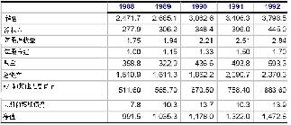

29

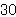

30

31

32

33

34

税收回避： 

●APEX公司能否从税盾中获益？ 

→APEX公司获益了吗？

→这是否具有税收减免的作用？财务困难的预期：

- ● 现金流是否具有易变性？

- ● 是否需要外部融资进行项目的投资？

- ● 如果收缩现金是否带来竞争威胁？

- ● 顾客和供应商关心财务困难吗？

- ● 资金很难被重新规划吗？

——是

——不像

——不是——不是太多——是的——不太关心——不总是

35

36

- ● 更多的不确定性

- →潜在的调整

- →技术的改进

- ● 更多竞争的压力

- →在生物制药方面一般的规则更倾向于竞争。

- ● 顶峰公司需要更多的投资

- →高级生物技术——需要更多的研发投入

- ● 减少内部融资

- →专利到期

- ● 底线：较低的目标杠杆

37

         Acrobat Distiller 6.0 (Windows)

         2005-04-24T17:39:06+08:00

         PScript5.dll Version 5.2

         2005-04-24T17:40:10+08:00

         2005-04-24T17:40:10+08:00

         uuid:7144346e-1d64-44c5-950a-d4fde673b3bc

         uuid:dee5766f-c14c-447d-8806-4f21c67b89ee

         xml

               Microsoft Word - 11-Case

               xjtu

金融理论 II(15.402)-2003年春季-Dirk Jenter 

红利政策（aka公司的分配政策） 

- ● 公司向股东转移资金通过：

- ● 分配政策：

- ● 主要问题：公司应该采用怎样的分配政策？

- ● 我们需要知道：——是否一个公司的价值依赖于其分配政策？——如果是，为什么？有什么影响？

- ● 分红的水平并不是固定的（相对于利息来说）并且公司可以在任何时候进行调整。

- ● 通常，分红是按季进行的。

- ● 公司分别有两种不同的分红形式——经常分红：可以预期在将来保持稳定——特别红利：很少重复

- ● 红利通常以下列三种等价的方法进行公布：——每股分红（DPS）：每股获得的金额——分红收益：DPS除以每股价格——分红率：DPS除以 EPS 

金融理论 II(15.402)-2003年春季-Dirk Jenter 

分配政策2：股份回购 

- ● 有几种不同的股份回购形式：

- ● 在股份回购中应注意：——所回购的股份属于公司现有的股东。——通常，他们持有公司的资产。——当公司需要发行新的股票进行融资时他们可以将这些股票再卖掉。

- ● 在许多国家，回购是不允许的。

- ● MM定理说明了什么？

在完全的资本市场，公司的价值不依赖于其分配政策。

证据：

- ● 支付红利是 NPV为零的交易行为

- ——所以，公司支付红利前的价值必须等于其在支付红利后的价值加上其所分配的红利的价值。

- ● 在完全的资本市场，那些想要进行分红的投资者可以通过出售部分其所持有的不进行分红的公司的股票的方式转换成可分红公司的股票。

- ● 在完全资本市场，那些不想要分红的投资者可以将其所分得的红利购买不分红公司的股票。

金融理论 II(15.402)-2003年春季-Dirk Jenter 

### 有关分红政策无关性的一个例子 

- ● XYZ公司获得了$1M的永久年金并且其需要按照股票的 10%给股东以回报，其发行在外的股份为 100000股

- ● 当前的分红政策如下：——将所有的现金流作为当年的现金分红，即：DPS=$10 ——于是，XYZ公司的股票市场价值为：$1M/10%=$10M，股票的价值为 

- $100 

- ● 现在考虑另外一种替代的分红政策：

- ● MM定理表明：股票的市场价格没有发生改变。

- ● 既然经营没有改变，XYZ公司继续得到每年$1M的收益。

- ●因为新发行的股票具有和老股票同样的风险，所以也要求有同样的回报率：10%。

- ● 为了增加$500000，XYZ公司需要保证给予新股东$50000的稳定收益，即： $50000/10%=$500000。

- ● 到下一年度，对老股东的年度分红将会是 

- ● 所以，下一年老股票（和新股票）的价格将会是$9.5。

- ● 问题：在可替代的分红政策下，当前的股票价格会是什么？

金融理论 II(15.402)-2003年春季-Dirk Jenter 

例子（续）

● 计算当前的股票价格：

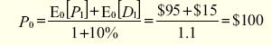

此时 E0代表“当前期望”。

结论：

- ● 老股票的价值并不因分配政策的改变而受影响。

- ● 改变分配政策是一个 NPV为零的交易行为。

- ● 这一点也不令人奇怪：这完全是一个纯融资行为。

- ● MM定理阐明了有关分配政策的无关性原理帮助我们避免谬误和对分配政策不切实际的幻想。

- ● 同时也向我们提出一个问题：分配政策的改变对资产份额会有什么样的影

响？——不同的税收暗含了不同的政策。——不同的政策可以给公司外在的投资者传递不同的信息。——一些政策会迫使经理人投资NPV为负的项目导致公司资金的浪费。

金融理论 II(15.402)-2003年春季-Dirk Jenter 

另外：一鸟在手理论的谬误

这种常见的谬误来自于以下的理论：

- ● 今天的分红比将来承诺的分红更安全。

- ● 投资者将会为分红的公司支付额外的风险溢价。

- ● 所以，分红会提高公司的价值。

- ● 无论怎样！分配政策的改变并不能改变资产份额的规模，所以也不能影响公司的价值。

- ● 这种常见的谬误是基于这样的直觉，即投资者宁愿接受现金而不愿让经理人将其投资于 NPV为负的项目。

- ●但是要注意任何一个能够提升价值的举措都是真正由于投资政策的改变（除了那些 NPV为负的项目）而不是由于分配政策的改变所带来的。

- ● 来看这点，注意如果经理人分配红利，但是通过发行新的股票融资投资到较差的项目上，将不会创造任何价值。

- ● 在美国的税收制度中，对现金分红进行了双重征税——在公司层面，分红是在税后净收入中进行分配的。——在个人层面，分红还需要交税，这次是作为通常的收入。——（注意：对公司接受分红将会有 70%的税收免除。）

这将引发如下的困惑：

- ● 在偿付利息免税的情况下为什么还要支付红利？

- ● 在资本收益征收较低的税率时为什么还要支付红利？

- ● 如果一个公司真想给股东支付现金红利，为什么采用分红的方式而不采用股份回购？

金融理论 II(15.402)-2003年春季-Dirk Jenter 

困惑1：分红和支付债券利息 

- ● 从投资者的角度讲，现金红利和利息支付被征收同样的税率。

- ● 但是：股利是在公司的层面被征收的，而利息不是。

- ● 这样，作为对投资者支付现金的一种方式，支付利息似乎比支付红利更具有优势。

- ● 相比较分红，投资者的资本收益被征收较少的税收。

- ● 并且，由于对资本收益征税是在当收益实现时才进行的，投资者可以延迟税收。由于资金时间价值的存在使得其支付的税收较为“便宜”。

- ● 这样，现金红利好像优于资本利得。

- ● 注意：如果股东需要现金，可以通过卖出其所持有的一部分股票来获得所需的资金。

金融理论 II(15.402)-2003年春季-Dirk Jenter 

困惑3：分红和股票回购 

- ● 在个人层面上，股份回购所获得的收益采用资本利得的方式进行征税（正如股东在市场上把他的股票出售给另外的投资者一样）。

- ● 因此，如果一个公司给投资者支付现金的话，现金分红好像又优于股份回购。

- ● 另外：如果 IRS （美国国税局）看到股份回购是如此普遍的运用并且和价值相符，他们就会宣布公司真正发布了红利并要求按收入税率征税，尽管这样，越来越多的公司仍采用回购的方式来代替分红。

- ● 从税收的角度讲现金分红是比较昂贵的。

- ● 每个经理人都应该问问自己：——为什么要采用分红的形式？——为此所承担的税收负担合理吗？——通过其他的方法能获得相同的收益吗？

- ● 坦白地说，直到现在我们还没有足够的智慧来说明为什么公司要支付红利和以什么方式支付。

金融理论 II(15.402)-2003年春季-Dirk Jenter 15 越来越少的公司采用支付红利

金融理论 II(15.402)-2003年春季-Dirk Jenter 16 越来越多的公司采用回购

金融理论 II(15.402)-2003年春季-Dirk Jenter 

### 超越MM定理之外的对分红的一些解释 

信息传递假说：

- ● 公司能够通过发放红利传达有利于公司的信息。——高质量的公司能够支付红利。——低质量的公司没有能力仿效高质量的公司去发放红利。——因此，通过发放（或提高）红利，一个公司能够传递其是高质量公司

- 的信息。

- ●这个逻辑就是“好的”公司能够承担较高成本（ =无效率）的行为来传递非正式的信息以便于将其从“坏的”公司中区别开来，因为“好的”公司从事这些无效率的行动的成本上所承担的困难较小。

自由现金流假说

- ● 公司可以通过支付红利来降低代理问题。

- ● 如果经理人是帝国大厦的建造者，过多的现金能够导致代理问题。——经理人不情愿将过多的现金归还给投资者。——可以通过 NPV为负的项目的投资或接管的方式来扩大他们的影响范围

（“帝国大厦”）。——可以在津贴上耗费资金。

- ● 通过给投资者支付较多的现金可以使经理人更有效地管理公司。

- ●分配股利是偿还投资者资金的一种方式，可以阻止经理人通过投资 NPV为负的项目浪费公司的钱财。

- ● 告诫：股息是可自由支配的。——既然公司倾向于不履行利息分配的职责，采用以偿付债券利息的方式将较多的现金返还给投资者是一种更有强制力的承诺。

——无论怎样，投资者都是希望红利能够持续发放，所以，发放红利有是比股票回购更强的承诺。

金融理论 II(15.402)-2003年春季-Dirk Jenter 

- ● 股息宣布日：公司宣布其下一个分红，以及股息的登记和支付日期。

- ● 附有股息日：股票交易时所具有含有股利的昀后一个交易日 (在股息登记日的前 5天)。

- ●除息日：股票买卖时没有权利得到股息的第一天 (在附有股利日之后的一天)。

- ● 股权登记日：股东进行接受股息的登记。

- ● 股利支付日：寄出支付股息的账单。

例如：在 5月 15，XYZ公司宣布在第 2季度发放 0.20 美元的股息，股息登记日为 6月 1日，股息支付日为 6月 15日，附有股利日为 5月 26日，除息日为 5月 25日。

金融理论 II(15.402)-2003年春季-Dirk Jenter 

### 不同的回购方法1 

- ● 公开市场购买：公司从市场上购回自己的股票。

- ● 提出固定报价：在一预先指定的一定时期内，公司提出按照预先设定的价格购买一定数量的股票。

- ● 例如：XYZ公司宣布它将要以每股 28 美元的价格购买它的 5百万普通股中的 200，000份。

- ● 注意：如果所回购的股票多于其股份的昀大数量，则将按照预先的比率购买股票。

- ● 例如：如果 XYZ公司提出购买 100，000 股，他将全部购买，如果他提出购买 400，000，则其将会购买每一名股东提供的一半。

- ● 荷兰式拍卖：每名股东被邀请提交他们愿意出售(一些)他们所拥有股票的报价，公司在特定的时期之前公布其所购买的股票的数量，并且公布其所能够接收的价格的范围，成交的价格就是所能够购买股票的昀低价格。

- ● 例如：XYZ公司宣布将以荷兰式拍卖的方法购买 5 M 中的 200，000股，

XYZ公司就以 26 美元的价格够买所有等于或低于 26 美元报价的股票

金融理论 II(15.402)-2003年春季-Dirk Jenter 

附加：股票分红和股票分割

- ● 股票分红：增加的股票被分配给所有的股东。

- ● 例如：每年，XYZ公司为每个已经持有每 100 股的股东分配 5 股，这就是 5%的股息。

- ● 股票分割：现有的股票每一股被分成几股。

- ● 股票分红类似于股票分割，但是通常其与较少的股票数量相联系。

- ● 例如：一个 2分 1的股票分割就相当于 100%的股息。 

- ● 	股票分红不同于现金股息：股票分红不会导致现金退出公司，所以股票分红不是分配政策的一部分，因此不要因为名字的相象而产生误解。

         Acrobat Distiller 6.0.1 (Windows)

         Microsoft Corporation

         D:20050429021036

         2005-04-29T10:10:49+08:00

         Acrobat PDFMaker 6.0 for Word

         2005-04-29T10:11:43+08:00

         2005-04-29T10:11:43+08:00

         uuid:f0084d59-a5e6-4b81-a1fc-0f79cba3df94

         uuid:d41daa67-4b80-471f-82ef-eb26d5c60966

               13

         xml

               价值评估

               fxzm

价值评估 

概览：第二部分—价值评估 

A.价值评估：自由现金流和风险 

·4.1     讲座：自由现金流价值评估 

·4.1     案例：Ameritrde 

B.价值评估：加权平均资本成本（WACC）和现值调整（APV） 

·4.8     讲座：加权平均资本成本（WACC）和现值调整（APV） 

·4.10    案例：Dixon公司 

·4.15    案例：Diamond化学公司 

C.项目和公司价值评估 

·4.17    讲座：实物期权 

·4.24    案例：MW石油公司 

·4.29    讲座：公司价值评估 

·5.1     案例：Cooper工业有限公司 

·5.6     案例：Southland公司 

价值评估工具 

· 为了在相互排斥的项目之间分配资本，管理者一项重要的工作是理解价值评估的运用： 

   →项目A是否是相对最好的项目？ 

   →项目A优于项目B？ 

   →项目的形式A是否优于修改的形式A′ 

· 价值评估和最终的资本预算过程一般涉及到许多因素，一些因素是标准的，一些是非标准的（经验，难以标准化的信息，政策等）。 

·我们将重点介绍价值评估的财务工具 

价值评估工具（续） 

· 这些工具为管理者提供了“评分”的量化技巧，帮助决策过程。 

· 这些工具以现代财务理论为基础，主要讨论现金流、时间和风险。 

· 所有工具（经常极有可能）以简化的公司模型为基础： 

→技术上的限制（现在很少受计算机的限制） 

  →多样性 

  →可以理解和进行讨论 

如何评估一个项目（公司） 

· 参考可相互比较项目的价格 

    →为差价定价 

    →更多地运用现有的公司 

· 计算净现值（NPV）： 

    →预测未来的现金流 

    →预测每一次现金流的适度贴现率 

    →计算NPV 

· 注意：许多公司不使用净现值（NPV），而使用内含收益率（IRR）、回收期等评估项目（公司）。你需要经过培训，以避免犯这种错误。 

自由现金流（FCF）方法 

· 自由现金流（FCF）：一个完全的权益资本公司预期的税后现金流量。 

· 这些现金流量忽略了公司来自债务融资的税收结余。（扣除利息支出）。 

· 突破的步骤： 

  →步骤一：估计自由现金流量。 

  →步骤二：评估自由现金流的风险。 

  →步骤三：诠释融资对价值的影响。 

· 对步骤三的述评：诠释税收规避的两种方法： 

  →调整贴现率（WACC法） 

  →调整估算的现金流（APV法） 

步骤一：估计自由现金流量 

根据考虑适度通货膨胀后的税后现金流量，计算所有的价值增值 

· 包括： 

  →不只考虑企业营运期间的经营利润。 

  →如果项目要求有连续的资本性支出或者额外的营运资金，应考虑这些因素。 

· 税后：其余的归入利率互换。 

· 通货膨胀的处理方法应有持续性： 

  →用名义贴现率折现名义现金流量． 

  →注释 

· 名义利率已反映了整个经济的通货膨胀水平，但现金流量并没有反映通货膨胀水平。 

· 事实上，现金流量中一些项目，如折旧，也许没有反映通货膨胀。 

自由现金流量的等式表述（见财务理论１） 

自由现金流量（FCF）＝（１－税率t）×息税前利润(EBIT)＋折旧－资本性支出（CAPX）-净营运资金(NWC)的变化 

自由现金流量（FCF）＝（１－税率t）× 息前税前及折旧前的利润（EBITD）＋税率t×折旧－资本性支出（CAPX）－ 净营运资金(NWC)的变化 

自由现金流量（FCF）＝（１－税率t）× 息税前利润（EBIT）－净资产（NA）的变化 

计算自由现金流量的例子 

<Table>

<TR>
<TD>

</TD>
<TD>

1998 

</TD>
<TD>

1999 

</TD>
</TR>
<TR>
<TD>

销售收入 

</TD>
<TD>

1000 

</TD>
<TD>

1200 

</TD>
</TR>
<TR>
<TD>

商品销售成本 

</TD>
<TD>

700 

</TD>
<TD>

850 

</TD>
</TR>
<TR>
<TD>

折旧 

</TD>
<TD>

30 

</TD>
<TD>

35 

</TD>
</TR>
<TR>
<TD>

利息支出 

</TD>
<TD>

40 

</TD>
<TD>

50 

</TD>
</TR>
<TR>
<TD>

税金（38%） 

</TD>
<TD>

80 

</TD>
<TD>

90 

</TD>
</TR>
<TR>
<TD>

税后利润 

</TD>
<TD>

150 

</TD>
<TD>

175 

</TD>
</TR>
<TR>
<TD>

资本支出 

</TD>
<TD>

40 

</TD>
<TD>

40 

</TD>
</TR>
<TR>
<TD>

应收账款 

</TD>
<TD>

50 

</TD>
<TD>

60 

</TD>
</TR>
<TR>
<TD>

存货 

</TD>
<TD>

50 

</TD>
<TD>

60 

</TD>
</TR>
<TR>
<TD>

应付账款 

</TD>
<TD>

20 

</TD>
<TD>

25 

</TD>
</TR>

</Table>

1999年：自由现金流量（FCF）＝息税前利润(EBIT) ×（１－税率t）＋折旧－资本性支出（CAPX）-净营运资金(NWC)的变化 

→息税前利润(EBIT)＝1200－850—35 = 315 

→税率（t）= 38% 

注释： 

息税前利润（EBIT）=利息、税金前的利润 

息前税前及折旧前的利润（EBITD）＝ 息税前利润＋折旧 

净营运资金的变化有时称为净营运资金中的投资 

→净营运资金的变化（Ch. NWC）= （60＋60－25）－（50＋50－20）= 15 

→自由现金流量（FCF）= 315×（1－0.38）＋35－40－15 = 175.3 

注意！ 

· 注释： 

   →我们忽略利息支付 

   →我们依据息税前利润计算税收 

· 这一步不要考虑融资的影响（如利息）！ 

· 重温步骤： 

→首先，如果项目100%依靠股权融资，那么确定预期的现金流。 

→然后，调整资金 

· 如果在现金流中计算融资成本，应计算两次 

涡轮装置项目的例子 

· XYZ,是一个盈利性的设备制造商（年税后利润是＄100，000，000），考虑引进一种过去三年在实验室投入＄1，000，000的研发出来的新涡轮装置（TWS）。 

· 建新厂房生产涡轮装置，将使： 

   →现在资本支出＄20，000，000 

   →10年后的残余价值为＄5，000，000 

   →5年内采用直线折旧法提完折旧 

· 涡轮装置需要喷漆：可利用喷漆设备工作能力的40% 

   →XYZ公司拥有喷漆设备，其目前的使用率为30% 

   →维修费用是＄100，000（不考虑使用程度） 

· 年经营状况 

   →营运成本：＄400，000 

   →营运收入：＄42，000，000 

   →销售正常装置的营运收入将减少＄2，000，000 

· 营运资金（WC）：项目营运期间需要＄2，000，000 

· 公司税率是36% 

计算新增现金流 

· 实施该项目和不实施该项目时公司价值比较： 

   项目价值 = 价值（公司实施该项目）- 价值（公司不实施该项目） 

· 仅仅考虑与该项目有关的现金流（流入和流出）。 

   →忽略沉没成本 

     ﹡用于支付装置项目或用于支付非装置项目（已经发生的费用不与剔除）。 

   →应考虑机会成本 

     ﹡现有项目可能会排斥掉更好的项目（如土地项目） 

→避免突发性支出 

  ﹡如：该项目可能会支付一部分随时发生的费用 

涡轮装置项目的例子（续） 

评估项目价值与哪些因素有关？ 

· 税后利润＄100，000，000 

· 过去三年里＄1，000，000研发费用 

· 新厂房支出＄20，000，000 

· 机器的维修费＄100，000 

· 正常装置的营运收入的减少2000000美元 

涡轮装置项目的例子（续） 

· 忽略税后利润＄100，000，000，重点考虑增加的现金流 

· 过去三年里＄1，000，000研发费用：沉没成本-----忽略掉 

· 新厂房的支出＄20，000，000：是资本性支出-----应计入 

· 机器的维修费＄100，000：没有增加------忽略 

   →生产或未生产涡轮装置均应承担费用 

   →生产或未生产涡轮装置均应承担费用 

· 涡轮装置营运收入减少2000000美元，是由于设备的拆卸费用所致 

   →不生产涡轮装置就不发生这些费用 

   →此费用是机会成本------应计入 

<Table>

<TR>
<TD>

年            份 

</TD>
<TD>

0 

</TD>
<TD>

1 

</TD>
<TD>

2 

</TD>
<TD>

3 

</TD>
<TD>

4 

</TD>
<TD>

5 

</TD>
<TD>

6 

</TD>
<TD>

7 

</TD>
<TD>

8 

</TD>
<TD>

9 

</TD>
<TD>

10

</TD>
</TR>
<TR>
<TD>

资本性支出 

</TD>
<TD>

20 

</TD>
<TD>

0 

</TD>
<TD>

0 

</TD>
<TD>

0 

</TD>
<TD>

0 

</TD>
<TD>

0 

</TD>
<TD>

0 

</TD>
<TD>

0 

</TD>
<TD>

0 

</TD>
<TD>

0 

</TD>
<TD>

0 

</TD>
</TR>
<TR>
<TD>

营运收入的减少 

</TD>
<TD>

0 

</TD>
<TD>

2 

</TD>
<TD>

2 

</TD>
<TD>

2 

</TD>
<TD>

2 

</TD>
<TD>

2 

</TD>
<TD>

2 

</TD>
<TD>

2 

</TD>
<TD>

2 

</TD>
<TD>

2 

</TD>
<TD>

2 

</TD>
</TR>

</Table>

税后现金流的应用 

· 这部分现金流是支付成本（销售成本COGS和其他成本）和利息后的剩余部分。 

· 能计算出不同支出在税收规避方面获得的实惠，计算折旧等 

· 资本性支出和折旧 

   →资本性支出的税收处理与折旧有关 

   →资本性支出不能直接从应税收入中扣减 

   →相反，每年的折旧费用可以从当年的应税收入中扣减 

   →就税收而言，似乎不是资本性支出，而像折旧一样是每年都得负担的成本。 

涡轮装置项目例子（续） 

· 折旧 

   →直线折旧法：平均年限折旧 

   →加速折旧法：递减折旧 

· 20，000，000万美元资本性支出5年内用直线折旧法提完折旧，原值减至零。 

折旧（D）=（20-0）/5=＄4M 

· 当账面价值为零时，残值＄5，000，000应全部纳税。 

<Table>

<TR>
<TD>

年份 

</TD>
<TD>

0 

</TD>
<TD>

1 

</TD>
<TD>

2 

</TD>
<TD>

3 

</TD>
<TD>

4 

</TD>
<TD>

5 

</TD>
<TD>

6 

</TD>
<TD>

7 

</TD>
<TD>

8 

</TD>
<TD>

9 

</TD>
<TD>

10 

</TD>
</TR>
<TR>
<TD>

资本性支出 

</TD>
<TD>

20

</TD>
<TD>

0 

</TD>
<TD>

0 

</TD>
<TD>

0 

</TD>
<TD>

0 

</TD>
<TD>

0 

</TD>
<TD>

0 

</TD>
<TD>

0 

</TD>
<TD>

0 

</TD>
<TD>

0 

</TD>
<TD>

0 

</TD>
</TR>
<TR>
<TD>

折旧 

</TD>
<TD>

0 

</TD>
<TD>

4 

</TD>
<TD>

4 

</TD>
<TD>

4 

</TD>
<TD>

4 

</TD>
<TD>

4 

</TD>
<TD>

0 

</TD>
<TD>

0 

</TD>
<TD>

0 

</TD>
<TD>

0 

</TD>
<TD>

0 

</TD>
</TR>
<TR>
<TD>

残值 

</TD>
<TD>

0 

</TD>
<TD>

0 

</TD>
<TD>

0 

</TD>
<TD>

0 

</TD>
<TD>

0 

</TD>
<TD>

0 

</TD>
<TD>

0 

</TD>
<TD>

0 

</TD>
<TD>

0 

</TD>
<TD>

0 

</TD>
<TD>

5 

</TD>
</TR>

</Table>

涡轮装置项目的例子（续） 

<Table>

<TR>
<TD>

年份 

</TD>
<TD>

0 

</TD>
<TD>

1 

</TD>
<TD>

2 

</TD>
<TD>

3 

</TD>
<TD>

4 

</TD>
<TD>

5 

</TD>
<TD>

6 

</TD>
<TD>

7 

</TD>
<TD>

8 

</TD>
<TD>

9 

</TD>
<TD>

10

</TD>
</TR>
<TR>
<TD>

资本性支出 

</TD>
<TD>

20 

</TD>
<TD>

0 

</TD>
<TD>

0 

</TD>
<TD>

0 

</TD>
<TD>

0 

</TD>
<TD>

0 

</TD>
<TD>

0 

</TD>
<TD>

0 

</TD>
<TD>

0 

</TD>
<TD>

0 

</TD>
<TD>

0 

</TD>
</TR>
<TR>
<TD>

收入 

</TD>
<TD>

</TD>
<TD>

42 

</TD>
<TD>

42

</TD>
<TD>

42

</TD>
<TD>

42

</TD>
<TD>

42

</TD>
<TD>

42

</TD>
<TD>

42

</TD>
<TD>

42 

</TD>
<TD>

42 

</TD>
<TD>

42

</TD>
</TR>
<TR>
<TD>

营运收入的减少 

</TD>
<TD>

</TD>
<TD>

2 

</TD>
<TD>

2 

</TD>
<TD>

2 

</TD>
<TD>

2 

</TD>
<TD>

2 

</TD>
<TD>

2 

</TD>
<TD>

2 

</TD>
<TD>

2 

</TD>
<TD>

2 

</TD>
<TD>

2 

</TD>
</TR>
<TR>
<TD>

收入增加额 

</TD>
<TD>

</TD>
<TD>

40 

</TD>
<TD>

40

</TD>
<TD>

40

</TD>
<TD>

40

</TD>
<TD>

40

</TD>
<TD>

40

</TD>
<TD>

40

</TD>
<TD>

40 

</TD>
<TD>

40 

</TD>
<TD>

40

</TD>
</TR>
<TR>
<TD>

成本增加额 

</TD>
<TD>

</TD>
<TD>

0.4 

</TD>
<TD>

0.4

</TD>
<TD>

0.4

</TD>
<TD>

0.4

</TD>
<TD>

0.4

</TD>
<TD>

0.4

</TD>
<TD>

0.4

</TD>
<TD>

0.4 

</TD>
<TD>

0.4 

</TD>
<TD>

0.4

</TD>
</TR>
<TR>
<TD>

残值 

</TD>
<TD>

0 

</TD>
<TD>

0 

</TD>
<TD>

0 

</TD>
<TD>

0 

</TD>
<TD>

0 

</TD>
<TD>

0 

</TD>
<TD>

0 

</TD>
<TD>

0 

</TD>
<TD>

0 

</TD>
<TD>

0 

</TD>
<TD>

5 

</TD>
</TR>
<TR>
<TD>

利润增加额 

</TD>
<TD>

</TD>
<TD>

39.6

</TD>
<TD>

39.6

</TD>
<TD>

39.6

</TD>
<TD>

39.6

</TD>
<TD>

39.6

</TD>
<TD>

39.6

</TD>
<TD>

39.6

</TD>
<TD>

39.6 

</TD>
<TD>

39.6 

</TD>
<TD>

44.6

</TD>
</TR>
<TR>
<TD>

折旧 

</TD>
<TD>

0 

</TD>
<TD>

4 

</TD>
<TD>

4 

</TD>
<TD>

4 

</TD>
<TD>

4 

</TD>
<TD>

4 

</TD>
<TD>

0 

</TD>
<TD>

0 

</TD>
<TD>

0 

</TD>
<TD>

0 

</TD>
<TD>

0 

</TD>
</TR>
<TR>
<TD>

息税前利润 

</TD>
<TD>

</TD>
<TD>

35.6

</TD>
<TD>

35.6

</TD>
<TD>

35.6

</TD>
<TD>

35.6

</TD>
<TD>

35.6

</TD>
<TD>

39.6

</TD>
<TD>

39.6

</TD>
<TD>

39.6 

</TD>
<TD>

39.6 

</TD>
<TD>

44.6

</TD>
</TR>
<TR>
<TD>

税收增加额（36%） 

</TD>
<TD>

</TD>
<TD>

12.8

</TD>
<TD>

12.8

</TD>
<TD>

12.8

</TD>
<TD>

12.8

</TD>
<TD>

12.8

</TD>
<TD>

14.3

</TD>
<TD>

14.3

</TD>
<TD>

14.3 

</TD>
<TD>

14.3 

</TD>
<TD>

16.1

</TD>
</TR>
<TR>
<TD>

现金净流入 

</TD>
<TD>

-20 

</TD>
<TD>

26.8

</TD>
<TD>

26.8

</TD>
<TD>

26.8

</TD>
<TD>

26.8

</TD>
<TD>

26.8

</TD>
<TD>

25.3

</TD>
<TD>

25.3

</TD>
<TD>

25.3 

</TD>
<TD>

25.3 

</TD>
<TD>

28.5

</TD>
</TR>

</Table>

注释：我们所做的似乎是所有的息税前利润都应纳税——忽略了利息支付不纳税的事实 

至今（我们仍没计算）： 

现金流量（CF）= 利润增加额－税收－资本性支出（CAPX） 

= 利润增加额—税率t×（利润增加额—折旧）—资本性支出（CAPX） 

=（1－税率t）×利润增加额＋税率×折旧—资本性支出（CAPX） 

例如：计算第1年的现金流为：（1-36%）*39.6+36%*4-0=＄26800000 

（净）营运资金的变化 

营运资金 = 存货＋应收帐款－应付帐款 

要注意的问题1： 

· 许多项目需要的资金和营运资金密切相关，这构成了机会成本。 

→我们需要项目中隐含的营运资金变化。 

要注意的问题2： 

· 财务上收入的计算基于： 

销售收入－销售成本 

· 但是，当达成交易时，收入和支出被记录 

   →2000年销售成本包括在2000年已售商品的成本，即使这些成本是在1999年产生的，或还未产生。 

   →2000年的销售收入包括2000年已售商品的收入，即便这些收入还未收到 

涡轮装置项目的例子（续） 

<Table>

<TR>
<TD>

年份 

</TD>
<TD>

0 

</TD>
<TD>

1 

</TD>
<TD>

2 

</TD>
<TD>

3 

</TD>
<TD>

4 

</TD>
<TD>

5 

</TD>
<TD>

6 

</TD>
<TD>

7 

</TD>
<TD>

8 

</TD>
<TD>

9 

</TD>
<TD>

10 

</TD>
</TR>
<TR>
<TD>

资本性支出 

</TD>
<TD>

20.0 

</TD>
<TD>

</TD>
<TD>

</TD>
<TD>

</TD>
<TD>

</TD>
<TD>

</TD>
<TD>

</TD>
<TD>

</TD>
<TD>

</TD>
<TD>

</TD>
<TD>

</TD>
</TR>
<TR>
<TD>

利润增加额 

</TD>
<TD>

</TD>
<TD>

39.6 

</TD>
<TD>

39.6 

</TD>
<TD>

39.6

</TD>
<TD>

39.6

</TD>
<TD>

39.6

</TD>
<TD>

39.6

</TD>
<TD>

39.6

</TD>
<TD>

39.6 

</TD>
<TD>

39.6 

</TD>
<TD>

44.6

</TD>
</TR>
<TR>
<TD>

税收增加额（36%） 

</TD>
<TD>

</TD>
<TD>

12.8 

</TD>
<TD>

12.8 

</TD>
<TD>

12.8

</TD>
<TD>

12.8

</TD>
<TD>

12.8

</TD>
<TD>

14.3

</TD>
<TD>

14.3

</TD>
<TD>

14.3 

</TD>
<TD>

14.3 

</TD>
<TD>

16.1

</TD>
</TR>
<TR>
<TD>

净营运资金 

</TD>
<TD>

2.0 

</TD>
<TD>

2.0 

</TD>
<TD>

2.0 

</TD>
<TD>

2.0

</TD>
<TD>

2.0

</TD>
<TD>

2.0

</TD>
<TD>

2.0

</TD>
<TD>

2.0

</TD>
<TD>

2.0 

</TD>
<TD>

2.0 

</TD>
<TD>

</TD>
</TR>
<TR>
<TD>

净营运资金变化 

</TD>
<TD>

2.0 

</TD>
<TD>

</TD>
<TD>

</TD>
<TD>

</TD>
<TD>

</TD>
<TD>

</TD>
<TD>

</TD>
<TD>

</TD>
<TD>

</TD>
<TD>

</TD>
<TD>

-2.0

</TD>
</TR>
<TR>
<TD>

总计 

</TD>
<TD>

-22.0 

</TD>
<TD>

26.8 

</TD>
<TD>

26.8 

</TD>
<TD>

26.8

</TD>
<TD>

26.8

</TD>
<TD>

26.8

</TD>
<TD>

25.3

</TD>
<TD>

25.3

</TD>
<TD>

25.3 

</TD>
<TD>

25.3 

</TD>
<TD>

30.5

</TD>
</TR>

</Table>

总结 

自由现金流量=（1-税率）×利润增加额＋税率×折旧－资本性支出－净营运资金增加额 

也可写为： 

自由现金流量=（1-税率）×息税前利润＋折旧－资本性支出－净营运资金增加额 

发现现金流量价值 

· 现在做什么？ 

→我们知道如何得到预期的自由现金流 

我们想计算现金流的现值： 

我们须要解释利息支付在税收规避方面带来的好处 

→调整贴现率（加权平均资本成本法） 

→调整现金流量估值（平均现值法） 

我们必须考虑项目的风险 

      →计算风险调整贴现率： 

        ※ 想要投资该项目的外部投资者期望得到的回报率是什么？ 

计算风险调整贴现率： 

· 现在忽略债务在税收规避方面带来的好处，假设，项目是100%股权融资的。 

· 那么公司该项目的价值就是未来自由现金流的现值： 

· 预期的回报 = 资金成本 = rAssets = rf ＋风险溢价 

· 一项投资的风险溢价等于投资要求的回报率减去无风险利率。 

风险溢价 

· 怎样做才能得到风险溢价？ 

· 资本资产定价模型（CAPM）是一种方法： 

   →从贝塔值或市场溢价得到风险溢价 

· 你如何估计资产贝塔值？ 

   →对一个完全的权益资本公司（项目），用股票过去的回报对市场回报作简单回归就得到资产贝塔值。 

   →对于有财务杠杆的公司，用过去的股票回报对市场回报作回归就得到股票贝塔值，接着消除股票贝塔值的杠杆效应得到资产贝塔值。 

   →寻找有相似风险、有可比性的公司，估计他们的资产贝塔值，然后求均值 

附  录 

计算CAPM的资产β值： 

· 定义：对公司或项目现金流系统风险的度量。 

· 注释：资产的预期收益必须等于所有对资产具有索取权的预期收益之和：  

· CAPM是一个广泛运用的资产定价模型，能对许多种资产定价。因此，CAPM可用于定义股权资本和债权资本的预期收益： 

内容： 

· 用CAPM方程代替上面的资产预期收益公式，我们看到资产β值正好是股权资本β值、债权资本β值的加权平均值： 

· 因此，我们只需要估计方程右边的每一项。一般，我们从股权资本收益对股票市场收益的回归，求股权资本β值开始。 

· 问题：有时，我们需要使用“可比较”公司的β值，是因为我们可获得的项目信息不充分，或者试图通过这种方法提高估计的准确性。运用“可比较法”估计资产β值的步骤将在下张幻灯片中展示。 

估计资产β值的方法： 

- 1）认为所有现金流风险相同的公司将有相同的资产β值。 

- 2）确定那些现金流风险相同的公司，它们就是“可比较”公司。 

- 3）运用上面的公式估计可比较公司的资产β值： 

Ⅰ. 用股票收益对整个市场收益作回归，估计每一个可比较公司的资产β值。 

Ⅱ. 以同样的方式估计每一个可比较公司的资产β值。通常，你可能没有数据这样做。实际上，经常假设债务是无风险（债务的β值是0），或者假定债务资本贝塔值介于0.1—0.3之间，这来自于债务资本收益的经验研究。当杠杆水平高的时候，我们需要特别谨慎。 

Ⅲ. 估计的公司市场价值（D+E）是公司债务资本和权益资本市场价值的总和。如果债务资本的市场价值不能获得，用债务资本的帐面值代替。 

4）把可比较公司资产β值的平均值作为我们所评估公司的资产β值 

         Acrobat Distiller 6.0.1 (Windows)

         陕西省委党校

         D:20050427120254

         2005-04-27T20:03:06+08:00

         Acrobat PDFMaker 6.0 for Word

         2005-04-27T20:03:58+08:00

         2005-04-27T20:03:58+08:00

         uuid:91b90d8a-38da-4fd6-8d10-8b1ea8c84115

         uuid:4030358c-acd6-4c9e-b56f-08a682efc344

               6

         xml

               空闲现金流价值评估

               wangweihua

自由现金流价值评估 

财务理论（二） 

凯兹瑞纳·理崴伦 

2003.4.2 

价值评估工具 

◆ 为了在相互排斥的项目之间配置资本，管理者一项重要的工作是理解价值评估的运用： 

☆ 项目A是否是相对最好的项目？ 

☆ 项目A优于项目B？ 

☆ 项目的形式A是否优于修改的形式A′ 

◆ 价值评估和最终的资本预算过程一般涉及到许多因素，一些因素是标准的，一些是非标准的（经验，难以标准化的信息，政策等）。 

◆ 我们将重点介绍价值评估的财务工具 

价值评估工具（续） 

◆ 这些工具为管理者提供了“评分”的量化技巧，帮助决策过程。 

◆ 这些工具以现代财务理论为基础，主要讨论现金流、时间和风险。 

◆ 所有工具（经常极有可能）以简化的公司模型为基础： 

   ☆ 技术上的限制（现在很少受计算机的限制） 

   ☆ 多样性 

   ☆ 可以理解和进行讨论 

如何评估一个项目（公司） 

◆ 计算净现值（NPV） 

   ☆ 预测未来的现金流 

   ☆ 预测每一次现金流的适度贴现率 

   ☆ 计算NPV 

◆ 查阅可相互比较项目的价格 

◆ 选用可替代的标准（如，内部收益率，回报率方法） 

   ☆ 作为使用者，你需要接受使用这些工具的培训 

相互比较法 

- ◆ 假设你需要评估一家向公众公司转化的私有公司的价值 

☆ 折旧及摊销前的盈余EBITDA = 10亿（美元） 

☆ 相似的公众公司市盈率（P/E）= 10 

☆ 你评估的首次公开发售100亿美元公司的价值 

◆ 隐含的假设是什么？ 

   ☆ 假设P = E/(r - g) 

   ☆ 有，P/E = 1/(r - g) 

   ☆ 那么，我们假设 

      ·未来的收益以一个稳定的增长率永恒增长 

      ·两个公司有相同的增长率和贴现率 

内部收益率（IRR） 

◆ 单期项目 

   ☆ 投资 = 100（在时期0）   收益 = 150（在时期1） 

      收益率 = 150/100 - 1 = 50% 

      NPV = -100 + 150/贴现率 = 0 

      贴现率 = 150/100 = 50% 

   ☆ 收益率就是使NPV = 0的贴现率 

◆ 多期项目 

   ☆ 内部收益率就是使NPV = 0的贴现率 

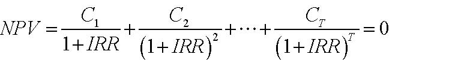

()()1220111TTCCCNPVIRRIRRIRR=+++=+++L

基本法则：选择项目的IRR﹥资本的机会成本 

内部收益率（续） 

- ◆ 假定你要在彼此独立的项目之间做出选择 

☆ 如，有两种方法可用于选择投资一块土地 

方案1:现金流量    -10    +20     内部报酬率=100%  

   方案2：现金流量  -20    +35     内部报酬率=75% 

☆ 你究竟选哪一种方案 ? (资本成本=10%) 

· 选择方案2,因为 它的净现值较高 

- ◆ 其他内部报酬率法(银行业务 ,第五章 ) 

☆ 如,多种内部报酬率,象贷款与借款内部报酬率。 

- ◆ 结论 

☆ 净现值比内部报酬率更易使用 

☆ 若恰当使用，内部报酬率将会得出与净现值一样的结果 

- 1． 计算现金流量 

自由现金流（FCF）方法 

- ◆ 自由现金流量：一个完全的权益资本公司预期的税后现金流量。 

☆ 这些现金流量不考虑公司来自债务融资的税收结余（扣除利息支出）。 

- ◆ 计算步骤： 

☆ 第一步：估计现金流量 

☆ 第二步：说明融资对价值的影响。 

- ◆ 摘要：诠释税收规避的两种方法： 

☆ 调整贴现率（加权平均资本成本法） 

☆ 调整估算的现金流（现值调整法） 

根据考虑适度通货膨胀后的税后现金流量，计算所有的价值增值 

- ◆ 包括： 

☆ 不只考虑企业营运期间的经营利润。 

☆ 如果项目要求有连续的资本性支出或者额外的营运资金，应考虑这些因素。 

- ◆ 税后：其余的归入利率互换 

- ◆ 通货膨胀的处理方法应有持续性 

☆ 用名义贴现率折现名义现金流量． 

☆ 原因： 

· 名义利率已反映了整个经济的通货膨胀水平，但现金流量并没有反映通货膨胀水平。 

· 事实上，现金流量中一些项目，如折旧，也许没有反映通货膨胀。 

通货膨胀处理——例子 

- ◆ 国库券利率（名义利率）＝８％ 

- ◆ 预期通货膨胀率＝６％ 

- ◆ 预期实际利率＝１.08/1.06=1.9% 

- ◆ 下一年的装置的销售＝１００美元（按今天的美元价值测算） 

- ◆ 预计装置的价格将上涨６％ 

- ◆ 装置的现值是多少？ 

名义现金流量：现值＝﹩１００＊（１.06）/1.08=９８.２ 

实际现金流量：现值＝﹩１００／（１.０８/１.０６）=９８.２ 

对自由现金流量的等式表述（见财务理论１） 

自由现金流量（FCF）＝（１－税率t）×息税前利润(EBIT)＋折旧－资本性支出（CAPX）-净营运资金(NWC)的变化 

自由现金流量（FCF）＝（１－税率t）× 息前税前及折旧前的利润（EBITD）＋税率t×折旧－资本性支出（CAPX）－ 净营运资金(NWC)的变化 

自由现金流量（FCF）＝（１－税率t）× 息税前利润（EBITD）－净资产（NA）的变化 

注释： 

     息税前利润（EBIT）=利息、税金前的利润 

     息前税前及折旧前的利润（EBITD）＝ 息税前利润＋折旧 

     净营运资金的变化有时称为净营运资金中的投资 

计算自由现金流量的例子 

<Table>

<TR>
<TD>

</TD>
<TD>

1998

</TD>
<TD>

1999

</TD>
</TR>
<TR>
<TD>

销售收入 

</TD>
<TD>

1000

</TD>
<TD>

1200

</TD>
</TR>
<TR>
<TD>

商品销售成本 

</TD>
<TD>

700

</TD>
<TD>

850

</TD>
</TR>
<TR>
<TD>

折旧 

</TD>
<TD>

30

</TD>
<TD>

35

</TD>
</TR>
<TR>
<TD>

利息支出 

</TD>
<TD>

40

</TD>
<TD>

50

</TD>
</TR>
<TR>
<TD>

税金（38%） 

</TD>
<TD>

80

</TD>
<TD>

90

</TD>
</TR>
<TR>
<TD>

税后利润 

</TD>
<TD>

150

</TD>
<TD>

175

</TD>
</TR>
<TR>
<TD>

资本支出 

</TD>
<TD>

40

</TD>
<TD>

40

</TD>
</TR>
<TR>
<TD>

应收账款 

</TD>
<TD>

50

</TD>
<TD>

60

</TD>
</TR>
<TR>
<TD>

存货 

</TD>
<TD>

50

</TD>
<TD>

60

</TD>
</TR>
<TR>
<TD>

应付账款 

</TD>
<TD>

20

</TD>
<TD>

25

</TD>
</TR>

</Table>

１９９９年：自由现金流量＝（１－税率）＊息税前利润＋折旧－资本性支出-净营运资金的变化 

      息税前利润＝１２００－８５０－３５＝３１５     

净营运资金的变化＝（６０＋６０－２５）－（５０＋５０－２０）＝１５ 

自由现金流量＝３１５＊（１－０.３８）＋３５－４０－１５＝１７５.3 

注意！ 

- ◆ 注释： 

☆ 我们忽略利息支付 

☆ 我们依据息税前利润计算税收 

- ◆ 在这一步没有考虑资金的影响（如利息） 

- ◆ 重温步骤： 

☆ 首先，如果项目100%依靠股权融资，那么确定预期的现金流 

☆ 然后，调整资金 

- ◆ 如果在现金流中计算融资成本，应计算两次 

涡轮装置项目例子 

- ◆ XYZ,是一个盈利性的设备制造商（年税后利润是＄100，000，000），考虑引进一种过去三年在实验室投入＄1，000，000的研发出来的新涡轮装置（TWS）。 

- ◆ 建新厂房生产涡轮装置 

☆ 现在资本支出＄20，000，000 

  ☆ 10年后的残余价值为＄5，000，000 

  ☆ 5年内采用直线折旧法提完折旧 

- ◆ 涡轮装置需要喷漆：可利用喷漆设备工作能力的40% 

☆ XYZ公司拥有喷漆设备，其目前的使用率为30% 

☆ 维修费用是＄100，000（不考虑使用程度） 

- ◆ 年经营状况 

☆ 营运成本：＄400，000 

☆ 营运收入：＄42，000，000 

☆ 销售正常装置的营运收入将减少＄2，000，000 

◆ 营运资金（WC）：项目营运期间需要＄2，000，000 

- ◆ 公司税率是36% 

涡轮装置项目例子（续） 

- ◆ 忽略税后利润＄100，000，000，重点考虑增加的现金流 

- ◆ 过去三年里＄1，000，000研发费用：沉没成本-----忽略掉 

- ◆ 新厂房的支出＄20，000，000：是资本性支出-----应计入 

- ◆ 机器的维修费＄100，000：没有增加------忽略 

☆ 生产或未生产涡轮装置均应承担费用。 

☆ 生产或未生产涡轮装置均应承担费用 

- ◆ 涡轮装置营运收入减少2000000美元，是由于设备的拆卸费用所致 

☆ 不生产涡轮装置就不发生这些费用 

☆ 此费用是机会成本------应计入 

<Table>

<TR>
<TD>

年     份 

</TD>
<TD>

0 

</TD>
<TD>

1 

</TD>
<TD>

2 

</TD>
<TD>

3 

</TD>
<TD>

4 

</TD>
<TD>

5 

</TD>
<TD>

6 

</TD>
<TD>

7 

</TD>
<TD>

8 

</TD>
<TD>

9 

</TD>
<TD>

10

</TD>
</TR>
<TR>
<TD>

资本性支出 

</TD>
<TD>

20

</TD>
<TD>

0 

</TD>
<TD>

0 

</TD>
<TD>

0 

</TD>
<TD>

0 

</TD>
<TD>

0 

</TD>
<TD>

0 

</TD>
<TD>

0 

</TD>
<TD>

0 

</TD>
<TD>

0 

</TD>
<TD>

0 

</TD>
</TR>
<TR>
<TD>

营运收入的减少 

</TD>
<TD>

0 

</TD>
<TD>

2 

</TD>
<TD>

2 

</TD>
<TD>

2 

</TD>
<TD>

2 

</TD>
<TD>

2 

</TD>
<TD>

2 

</TD>
<TD>

2 

</TD>
<TD>

2 

</TD>
<TD>

2 

</TD>
<TD>

2 

</TD>
</TR>

</Table>

新增现金流的应用 

- ◆ 实施该项目和不实施该项目时公司价值比较 

项目价值 = 价值（公司实施该项目）- 价值（公司不实施该项目） 

- ◆ 仅仅考虑与该项目有关的现金流（流入和流出） 

☆ 忽略沉没成本 

      · 用于支付装置项目或用于支付非装置项目（已经发生的费用不与剔除） 

☆ 应考虑机会成本 

· 现有项目可能会排斥掉更好的项目（如土地项目） 

☆ 避免突发性支出 

· 如：该项目可能会支付一部分随时发生的费用 

税后现金流的应用 

- ◆ 这部分现金流是支付资本提供者以后的剩余部分 

- ◆ 确保计算出从费用支出、折旧中获得的利益 

- ◆ 资本性支出和折旧 

☆ 资本性支出不能直接从应税收入中扣减 

☆ 相反，一部分资本性支出（折旧）是在若干年中扣减的 

涡轮装置项目例子（续） 

- ◆ 折旧 

☆ 直线折旧法：平均年限折旧 

☆ 加速折旧法：递减折旧 

- ◆ 20，000，000万美元资本性支出5年内采用直线折旧法提完折旧，原值减至零 

           折旧（D）=（20-0）/5=＄4M 

- ◆ 当账面价值为零时，残值＄5，000，000应全部纳税 

<Table>

<TR>
<TD>

年份 

</TD>
<TD>

0 

</TD>
<TD>

1 

</TD>
<TD>

2 

</TD>
<TD>

3 

</TD>
<TD>

4 

</TD>
<TD>

5 

</TD>
<TD>

6 

</TD>
<TD>

7 

</TD>
<TD>

8 

</TD>
<TD>

9 

</TD>
<TD>

10 

</TD>
</TR>
<TR>
<TD>

资本性支出 

</TD>
<TD>

20 

</TD>
<TD>

0 

</TD>
<TD>

0 

</TD>
<TD>

0 

</TD>
<TD>

0 

</TD>
<TD>

0 

</TD>
<TD>

0 

</TD>
<TD>

0 

</TD>
<TD>

0 

</TD>
<TD>

0 

</TD>
<TD>

0 

</TD>
</TR>
<TR>
<TD>

折旧 

</TD>
<TD>

0 

</TD>
<TD>

4 

</TD>
<TD>

4 

</TD>
<TD>

4 

</TD>
<TD>

4 

</TD>
<TD>

4 

</TD>
<TD>

0 

</TD>
<TD>

0 

</TD>
<TD>

0 

</TD>
<TD>

0 

</TD>
<TD>

0 

</TD>
</TR>
<TR>
<TD>

残值 

</TD>
<TD>

0 

</TD>
<TD>

0 

</TD>
<TD>

0 

</TD>
<TD>

0 

</TD>
<TD>

0 

</TD>
<TD>

0 

</TD>
<TD>

0 

</TD>
<TD>

0 

</TD>
<TD>

0 

</TD>
<TD>

0 

</TD>
<TD>

5 

</TD>
</TR>

</Table>

涡轮装置项目的例子（续） 

<Table>

<TR>
<TD>

年份 

</TD>
<TD>

0 

</TD>
<TD>

1 

</TD>
<TD>

2 

</TD>
<TD>

3 

</TD>
<TD>

4 

</TD>
<TD>

5 

</TD>
<TD>

6 

</TD>
<TD>

7 

</TD>
<TD>

8 

</TD>
<TD>

9 

</TD>
<TD>

10 

</TD>
</TR>
<TR>
<TD>

资本性支出 

</TD>
<TD>

20 

</TD>
<TD>

0 

</TD>
<TD>

0 

</TD>
<TD>

0 

</TD>
<TD>

0 

</TD>
<TD>

0 

</TD>
<TD>

0 

</TD>
<TD>

0 

</TD>
<TD>

0 

</TD>
<TD>

0 

</TD>
<TD>

0 

</TD>
</TR>
<TR>
<TD>

收入 

</TD>
<TD>

</TD>
<TD>

42 

</TD>
<TD>

42 

</TD>
<TD>

42 

</TD>
<TD>

42 

</TD>
<TD>

42 

</TD>
<TD>

42 

</TD>
<TD>

42 

</TD>
<TD>

42 

</TD>
<TD>

42 

</TD>
<TD>

42 

</TD>
</TR>
<TR>
<TD>

营运收入的减少 

</TD>
<TD>

</TD>
<TD>

2 

</TD>
<TD>

2 

</TD>
<TD>

2 

</TD>
<TD>

2 

</TD>
<TD>

2 

</TD>
<TD>

2 

</TD>
<TD>

2 

</TD>
<TD>

2 

</TD>
<TD>

2 

</TD>
<TD>

2 

</TD>
</TR>
<TR>
<TD>

收入增加额 

</TD>
<TD>

</TD>
<TD>

40 

</TD>
<TD>

40 

</TD>
<TD>

40 

</TD>
<TD>

40 

</TD>
<TD>

40 

</TD>
<TD>

40 

</TD>
<TD>

40 

</TD>
<TD>

40 

</TD>
<TD>

40 

</TD>
<TD>

40 

</TD>
</TR>
<TR>
<TD>

成本增加额 

</TD>
<TD>

</TD>
<TD>

0.4 

</TD>
<TD>

0.4 

</TD>
<TD>

0.4 

</TD>
<TD>

0.4 

</TD>
<TD>

0.4 

</TD>
<TD>

0.4 

</TD>
<TD>

0.4 

</TD>
<TD>

0.4 

</TD>
<TD>

0.4 

</TD>
<TD>

0.4 

</TD>
</TR>
<TR>
<TD>

残值 

</TD>
<TD>

0 

</TD>
<TD>

0 

</TD>
<TD>

0 

</TD>
<TD>

0 

</TD>
<TD>

0 

</TD>
<TD>

0 

</TD>
<TD>

0 

</TD>
<TD>

0 

</TD>
<TD>

0 

</TD>
<TD>

0 

</TD>
<TD>

5 

</TD>
</TR>
<TR>
<TD>

利润增加额 

</TD>
<TD>

</TD>
<TD>

39.6 

</TD>
<TD>

39.6 

</TD>
<TD>

39.6 

</TD>
<TD>

39.6 

</TD>
<TD>

39.6 

</TD>
<TD>

39.6 

</TD>
<TD>

39.6 

</TD>
<TD>

39.6 

</TD>
<TD>

39.6 

</TD>
<TD>

44.6 

</TD>
</TR>
<TR>
<TD>

折旧 

</TD>
<TD>

0 

</TD>
<TD>

4 

</TD>
<TD>

4 

</TD>
<TD>

4 

</TD>
<TD>

4 

</TD>
<TD>

4 

</TD>
<TD>

0 

</TD>
<TD>

0 

</TD>
<TD>

0 

</TD>
<TD>

0 

</TD>
<TD>

0 

</TD>
</TR>
<TR>
<TD>

息税前利润 

</TD>
<TD>

</TD>
<TD>

35.6 

</TD>
<TD>

35.6 

</TD>
<TD>

35.6 

</TD>
<TD>

35.6 

</TD>
<TD>

35.6 

</TD>
<TD>

39.6 

</TD>
<TD>

39.6 

</TD>
<TD>

39.6 

</TD>
<TD>

39.6 

</TD>
<TD>

44.6 

</TD>
</TR>
<TR>
<TD>

税收增加额（36%） 

</TD>
<TD>

</TD>
<TD>

12.8 

</TD>
<TD>

12.8 

</TD>
<TD>

12.8 

</TD>
<TD>

12.8 

</TD>
<TD>

12.8 

</TD>
<TD>

14.3 

</TD>
<TD>

14.3 

</TD>
<TD>

14.3 

</TD>
<TD>

14.3 

</TD>
<TD>

16.1 

</TD>
</TR>
<TR>
<TD>

现金净流入 

</TD>
<TD>

-20

</TD>
<TD>

26.8 

</TD>
<TD>

26.8 

</TD>
<TD>

26.8 

</TD>
<TD>

26.8 

</TD>
<TD>

26.8 

</TD>
<TD>

25.3 

</TD>
<TD>

25.3 

</TD>
<TD>

25.3 

</TD>
<TD>

25.3 

</TD>
<TD>

28.5 

</TD>
</TR>

</Table>

注释：我们所做的似乎是所有的息税前利润都应纳税——忽略了利息支付不纳税的事实 

至此（我们仍没计算）：  

现金流量（CF）= 利润增加额－税收－资本性支出（CAPX） 

= 利润增加额—税率t×（利润增加额—折旧）—资本性支出（CAPX） 

=（1－税率t）×利润增加额＋税率×折旧—资本性支出（CAPX） 

例如：计算第1年的现金流为：（1-36%）*39.6+36%*4-0=＄26800000 

（净）营运资金的变化 

要注意的问题1： 

- ◆ 许多项目需要的资金和营运资金密切相关，这构成了机会成本 

- ◆ 我们需要改变与项目有关的营运资金 

要注意的问题2： 

- ◆ 收益的确认： 销售收入－销售成本 

- ◆ 当达成交易时，确认收入与支出 

☆ 2000年销售成本包括在2000年已售商品的成本，即使这些成本是在1999年产生的，或还未产生 

☆ 2000年的销售收入包括2000年已售商品的收入，即便这些收入还未收到 

营运资金=存货+应收账款-应付账款 

涡轮装置项目的例子（续） 

<Table>

<TR>
<TD>

年份 

</TD>
<TD>

0 

</TD>
<TD>

1 

</TD>
<TD>

2 

</TD>
<TD>

3 

</TD>
<TD>

4 

</TD>
<TD>

5 

</TD>
<TD>

6 

</TD>
<TD>

7 

</TD>
<TD>

8 

</TD>
<TD>

9 

</TD>
<TD>

10 

</TD>
</TR>
<TR>
<TD>

资本性支出 

</TD>
<TD>

20.0 

</TD>
<TD>

</TD>
<TD>

</TD>
<TD>

</TD>
<TD>

</TD>
<TD>

</TD>
<TD>

</TD>
<TD>

</TD>
<TD>

</TD>
<TD>

</TD>
<TD>

</TD>
</TR>
<TR>
<TD>

利润增加额 

</TD>
<TD>

</TD>
<TD>

39.6 

</TD>
<TD>

39.6 

</TD>
<TD>

39.6 

</TD>
<TD>

39.6 

</TD>
<TD>

39.6 

</TD>
<TD>

39.6 

</TD>
<TD>

39.6 

</TD>
<TD>

39.6 

</TD>
<TD>

39.6 

</TD>
<TD>

44.6 

</TD>
</TR>
<TR>
<TD>

税收增加额（36%） 

</TD>
<TD>

</TD>
<TD>

12.8 

</TD>
<TD>

12.8 

</TD>
<TD>

12.8 

</TD>
<TD>

12.8 

</TD>
<TD>

12.8 

</TD>
<TD>

14.3 

</TD>
<TD>

14.3 

</TD>
<TD>

14.3 

</TD>
<TD>

14.3 

</TD>
<TD>

16.1 

</TD>
</TR>
<TR>
<TD>

净营运资金 

</TD>
<TD>

2.0 

</TD>
<TD>

2.0 

</TD>
<TD>

2.0 

</TD>
<TD>

2.0 

</TD>
<TD>

2.0 

</TD>
<TD>

2.0 

</TD>
<TD>

2.0 

</TD>
<TD>

2.0 

</TD>
<TD>

2.0 

</TD>
<TD>

2.0 

</TD>
<TD>

</TD>
</TR>
<TR>
<TD>

净营运资金变化

</TD>
<TD>

2.0 

</TD>
<TD>

</TD>
<TD>

</TD>
<TD>

</TD>
<TD>

</TD>
<TD>

</TD>
<TD>

</TD>
<TD>

</TD>
<TD>

</TD>
<TD>

</TD>
<TD>

-2.0 

</TD>
</TR>
<TR>
<TD>

总计 

</TD>
<TD>

-22.0 

</TD>
<TD>

26.8 

</TD>
<TD>

26.8 

</TD>
<TD>

26.8 

</TD>
<TD>

26.8 

</TD>
<TD>

26.8 

</TD>
<TD>

25.3 

</TD>
<TD>

25.3 

</TD>
<TD>

25.3 

</TD>
<TD>

25.3 

</TD>
<TD>

30.5 

</TD>
</TR>

</Table>

总结 

自由现金流量=（1-税率）×利润增加额＋税率×折旧－资本性支出－净营运资金增加额 

也可写为： 

自由现金流量=（1-税率）×息税前利润＋折旧－资本性支出－净营运资金增加额 

找出现金流量价值  

- ◆ 决策原则 

☆ 接受净现值为正的项目，净现值告知我们项目带来的价值 

- ◆ 我们知道如何计算预期的自由现金流 

- ◆ 我们需要寻找项目的合适贴现率 

◆ 我们需要解释利息支付在税收规避方面带来的收益 

- ☆ 现在忽略这点，并假定项目是100%股权融资的 

123402341111ECFECFECFECFNPVCFrrrr=+++++++++K

一个项目合适的贴现率是什么？ 

- ◆ 贴现率是项目资本的机会成本 

- ◆ 它回答了这样的问题：哪一种利率能使投资者从风险可比较的投资中获益？ 

- ◆ 风险可比较的意思是什么？ 

资产定价模型的应用 

- ◆ “可比较的风险”是什么含义? 

☆ 资本定价模型（CAPM）:风险 = β 

- ◆ 如何把风险转换成贴现率? 

- ☆ 资本定价模型（CAPM）: 

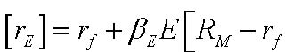

[]EfEM

- ◆ 实际问题: 

☉估计β值 

  ☉估计市场风险溢价 

  ☉杠杆 

β= 回归直线斜率 

杠杆,收益,风险 

公司是一个负债和权益资本的投资组合 

因此， 

资产收益率（rA）=（负债╱资产）*贷款利率（rD）+（权益资本╱资产）*风险收益率(rE) 

βA= （负债╱资产）(βD)+（权益资本╱资产）*βE 

净资产 

负债与权益

权      益 

债      务 

资 产

估计贝塔值 

- ◆ 股票贝塔值 

☆ 用股票过去的回报对市场回报作简单回归 

- ◆ 资产贝塔值 

☆ 对一个全资公司，股票贝塔值=资产贝塔值 

☆ 公司如何利用杠杆效应？ 

☆ 提示： 

把公司看作一个负债和权益资本的投资组合 

回顾一下：资产组合的贝塔值=各资产贝塔值的加权平均值 

问题：各资产的权重是多少？ 

可假定债务是无风险的或假定债务贝塔值在0.1—0.3之间（依据经验研究得出） 

         Acrobat Distiller 6.0.1 (Windows)

         Microsoft Corporation

         D:20050428033958

         2005-04-28T11:40:03+08:00

         Acrobat PDFMaker 6.0 for Word

         2005-04-28T11:40:45+08:00

         2005-04-28T11:40:45+08:00

         uuid:90d75e69-c0ce-4bd9-a670-b2093aeb2cdb

         uuid:c0c53e77-7173-40b9-af9c-9be5d35220e6

               9

         xml

               &lt;4D6963726F736F667420576F7264202D20BCD3C8A8C6BDBEF9D7CAB1BEB3C9B1BEBACDB5F7D5FBCFD6D6B53134&gt;

               fxzm

加权平均资本成本和调整现值 

概览：第二部分—价值评估 

A.价值评估：自由现金流和风险 

·4.1     讲座：自由现金流价值评估 

·4.1     案例：Ameritrde 

B. 价值评估：加权平均资本成本（WACC）和现值调整（APV） 

·4.8     讲座：加权平均资本成本（WACC）和现值调整（APV） 

·4.10    案例：Dixon公司 

·4.15    案例：Diamond化学公司 

C. 项目和公司价值评估 

·4.17    讲座：实物期权 

·4.24    案例：MW石油公司 

·4.29    讲座：公司价值评估 

·5.1     案例：Cooper工业有限公司 

·5.6     案例：Southland公司 

下来应当做什么？ 

-  我们需要将财务政策的影响融入我们的价值评估模型中 

→ 问题：我们如何在价值评估中引入债务的税收规避作用（如果存在）？ 

两种方法： 

■ 加权平均资本成本（WACC）： 

  →用税后债务资本成本和权益资本成本的加权平均值来贴现自由现金流量 

                WACC 

  ■ 现值调整（APV）： 

  →评估一个全部由权益资本来筹资的项目 

  →将债务的税盾现值和其他作用效应加进去 

复习：自由现金流量是不考虑利率的税收规避效应（例如，如果一个项目是100%股权融资），可用来支付给所有资金供给者的现金流量。 

加权平均资本成本 

加权平均资本成本（WACC） 

-  第一步：自由现金流量的产生 

-  第二步：用加权平均资本成本来贴现自由现金流量 

        WACC 

注意！！！ 

-  通常人们使用加权平均资本成本时的直觉是： 

    → 一个项目若要有价值，要求得到比筹集所需资金的成本，即我们所谓的加权平均资本成本，更多的收益 

    → 这种直觉是错误的。 

→ 我们经常使用加权平均资本成本法，而不是“偶然” 

-  大部分情况，这是明显的错误： 

   → 在概念上，它的逻辑性有瑕疵 

→ 在实践中，它得出的结论远不符合理论值 

由于贴现率，故加权平均资本成本也具有项目特定性！ 

加权平均资本成本（WACC） 

-  贴现率是项目中特定的 

==&gt; 设想有一个项目是独立的，像一个单个公司那样来筹集资金 

==&gt; 加权平均资本成本的输入变量也是由项目特定的： 

 WAC  

DEEE+=β

-  让我们依次考察加权平均资本成本的每一个输入变量： 

杠杆比率 D/（D＋E） 

-  D/（D＋E）是所考虑的特定项目的目标资本结构（在市场价值中）。 

-  常见错误1： 

→使用项目承担公司先前的D/（D＋E）比率 

-  常见错误2： 

→使用项目融资时的D/（D＋E）比率。 

→例如：如果项目全部通过债务融资时，使用100% 

注意：我们将假定目标A＋B是把目标A和目标B相加的结果，这种假设在多数情况下都是成立的。 

杠杆比率（续） 

-  那么，我们如何得到“目标杠杆比率”呢？ 

-  使用项目比较法 

  →项目所在的行业是公司“明晰的主业” 

→权衡：可比较公司的数量与质量 

-  如果公司承建的该项目与公司其它项目相似，那么就选用该公司作参照目标（即，这个公司是项目的可比较公司） 

-  思考，通过核查表完善…… 

注意的重要事项： 

-  如果项目在一段时间内一个保持相对稳定的D/V，那么加权平均资本成本在这段时间内也稳定的。 

-  如果不是，那么加权平均资本成本应该在这段时间内相应地变化，而且，我们应该计算出每一年不同的加权平均资本成本。 

-  实际上，公司更倾向于采用一个稳定的加权平均资本成本。 

-  所以，实际上，在预期未来资本结构会发生相当大变化的情况下，加权平均资本成本方法常常不很奏效。 

债务资本成本：KD（续） 

-  KD应该与贷方在一定资本结构下要求的利率相一致 

-  警告：不能用利率作为 KD的估计，当： 

  → 债务有很大的风险性。我们需要用违约概率来估计预期现金流。 

  → 如果有不同程度的负债，我们需要计算它们的平均利率。 

边际税率：t 

-  它是指承担该项目的公司（或者更精确些，承建该项目的公司）的边际税率。 

-  注意这个税率是决定债务税收节余的税率。 

-  我们要求使用边际税率，而不是平均税率t。 

      → 在实际中，边际税率常常不容易观察到。 

权益资本成本：KE 

-  它不能直接观察到。 

-  我们需要对项目进行比较来估计KE： 

   →“主业清晰”，即公司仅仅经营项目所在的行业。 

→如果承担该项目的公司本身就是同行业中的主业清晰者，就可以简单的使用这个公司的KE。 

-  问题： 

→ 一家公司的资本结构会对KE有影响。 

→ 除非与可比较公司资本结构相同，否则我们在使用前就要计算KE。 

用CAPM估计KE

1）找出需评估项目的可比较参照公司。 

2）当目标公司的债务风险不是很高（且债务率相当稳定），通过消除可比较参照公司权益资本贝塔值βE的杠杆效应（运用D/(D+E)）来估算出其资产贝塔值βA，我们可运用： 

3）用目标公司的资产贝塔值βA来估算出项目的贝塔值βA（例如，用平均值） 

4）当目标公司的债务风险不是很高（且债务率相当稳定）时，在一定的资本结构假设下，通过消除估算的项目资产贝塔值βA的杠杆效应（使用项目的D/(D+E)）来估算出其权益资本贝塔值βE  

5) 用这个估计的资产贝塔值βE来计算项目的权益资本成本kE

KE = rf + βE×市场风险溢价 

杠杆效应与消除杠杆效应应注意的事项： 

-  公式： 

→ 消除杠杆效应的公式是杠杆效应公式的倒推 

-  步骤： 

→ 消除可比较参照公司的杠杆效应，即消除每个可比较公司的杠杆效应 

→ 利用所有可比较公司的平均资产贝塔值βA 估算一个公司的资产贝塔值βA，对其中我们偏好的公司给以更多权重 

→ 这就是我们估算的项目资产贝塔值βA 

→ 消除项目资产贝塔值βA的杠杆效应 

-  在本课程，我们通常以稳定的D/（D＋E）比率使用该公式。 

有关商业风险和财务风险的更多信息 

-  可比较公司之间有相似的商业风险 

＝&gt;相似的资产贝塔之βA和，相似的消除杠杆效应后的资本成本KA 

-  如果可比较的公司间有不同的资本结构，那么它们的财务风险（不同的βE－βA）则不同。 

＝&gt;不同的权益资本贝塔值βE以及不同的权益资本要求收益KE 

-  总体上说，权益资本贝塔值βE随着D/E的增加而增加 

→因此，权益资本成本KE随着财务杠杆的提高而提高。 

商业风险和财务风险：直觉上的认识 

-  考虑一个项目的资产贝塔值βA&gt;0 

-  它的现金流量可以被分解为： 

→安全的现金流量 

→完全与市场相关的风险现金流量 

-  随着债务水平的提高（但留有一定安全性）： 

→很大一部分的安全现金流量流向了债务持有者； 

→流向权益资本持有者的剩余现金流量与市场日益相关。 

注释：如果现金流量与市场负相关（βA&lt;0），不断增加的债务会使权益资本与市场负相关，也会降低权益资本要求的目标收益。 

加权平均资本成本——一个简单的例子：  

现在你要评估一个新项目。这个项目需要初始费用100百万美元，预期以后每年得到税前利润为25百万美元。边际税率为40%，项目的目标债务—价值比率为25%，项目的债务利率为7%，权益资本成本为12%。 

税后现金流＝$25×0.60=$15百万 

税后加权平均资本成本＝D/V*(1-t)*rd+E/V*re

                    =0.25*0.60*0.07+0.75*0.12=10.05% 

净现值＝-100+15/0.1005=$49.25百万 

公司如何运用加权平均资本成本： 

他们是这样来计算加权平均资本成本的： 

-  公司当前的债务成本KD 

-  公司当前拥有的资本结构D/(D+E) 

-  公司当前拥有的资本权益成本KE 

-  它们所面临的边际税率 

用它们贴现所有未来的自由现金流： 

-  单一贴现率 

-  可调整的因素（例如，项目的“策略价值”） 

＝&gt;这一实用方法可能会产生错误，尤其是在新项目不同于以往公司承担的项目时。 

选择行业的资本结构、β与加权平均资本成本 

<Table>

<TR>
<TD>

行业 

</TD>
<TD>

负债率(%) 

</TD>
<TD>

权益资本β

</TD>
<TD>

资产β 

</TD>
<TD>

加权平均资本成本(%) 

</TD>
</TR>
<TR>
<TD>

电力与燃气 

</TD>
<TD>

43.2 

</TD>
<TD>

0.58 

</TD>
<TD>

0.33 

</TD>
<TD>

8.1% 

</TD>
</TR>
<TR>
<TD>

食品生产 

</TD>
<TD>

22.90 

</TD>
<TD>

0.85 

</TD>
<TD>

0.66 

</TD>
<TD>

11.0% 

</TD>
</TR>
<TR>
<TD>

造纸与塑料 

</TD>
<TD>

30.40 

</TD>
<TD>

1.03 

</TD>
<TD>

0.72 

</TD>
<TD>

11.4% 

</TD>
</TR>
<TR>
<TD>

设备 

</TD>
<TD>

19.10 

</TD>
<TD>

1.02 

</TD>
<TD>

0.83 

</TD>
<TD>

12.4% 

</TD>
</TR>
<TR>
<TD>

零售 

</TD>
<TD>

21.70 

</TD>
<TD>

1.19 

</TD>
<TD>

0.93 

</TD>
<TD>

13.2% 

</TD>
</TR>
<TR>
<TD>

化工 

</TD>
<TD>

17.30 

</TD>
<TD>

1.34 

</TD>
<TD>

1.11 

</TD>
<TD>

14.7% 

</TD>
</TR>
<TR>
<TD>

计算机软件 

</TD>
<TD>

3.50 

</TD>
<TD>

1.33 

</TD>
<TD>

1.28 

</TD>
<TD>

16.2% 

</TD>
</TR>
<TR>
<TD>

</TD>
<TD>

</TD>
<TD>

</TD>
<TD>

</TD>
<TD>

</TD>
</TR>
<TR>
<TD>

所有行业平均 

</TD>
<TD>

21.50 

</TD>
<TD>

1.04 

</TD>
<TD>

0.82 

</TD>
<TD>

12.3% 

</TD>
</TR>
<TR>
<TD>

</TD>
<TD>

</TD>
<TD>

</TD>
<TD>

</TD>
<TD>

</TD>
</TR>
<TR>
<TD>

假定：无风险利率6%市场风险溢价8%；债务成本7.5%；税率35% 

</TD>
</TR>

</Table>

现值调整 

现值调整 

-  从资产价值评估中区分财务结构对价值的作用 

-  第一步：如果项目或者公司是 100%股权融资，评估其价值。 

-  第二步：将债务的税盾价值考虑进去。 

注意： 

-  这种方法简单地把MM理论应用于税收 

-  现值调整（APV）＝各部分价值评估＝净现值调整ANPV 

第一步:100%股权融资公司（项目）的价值评估 

-  现金流量：自由现金流量的确是你所需要的。 

-  如果公司是100％股权融资，那么你需要的就是可以恰好贴现其现金流的利率。 

-  如果公司是100%股权融资，那么这个利率是权益资本的预期收益率。 

-  为了得出它，你需要： 

    →找出可比较公司，即有同一业务的公众公司。 

→如果它们都是100%股权融资，估算它们的预期收益率。 

第一步：100%股权融资公司（项目）的价值（续） 

-  使用适当的杠杆公式消除每一个可比较公司的权益资本贝塔值βA的杠杆效应，以估算其资产贝塔值βA（例如平均）。 

   或   

-  使用评估的资产贝塔值βA来计算全部权益资本的成本KA 

KA=rF+βA*市场风险溢价 

-  用KA来贴现项目的自由现金流量 

第二步：增加现值（债务税盾） 

-  现金流量：预期的税收节余是tKDD，其中KD是债务资本成本（前面讨论过）。 

-  如果预期D是稳定的，那么用KD来贴现tKDD 

            PVTS＝tKDD/KD＝Td 

-  如果预期D/V是稳定的，那么用KA来贴现tKDD 

            PVTS＝tKDD/KA 

-  直觉： 

→ 如果D/V是稳定的，那么D（tKDD会随着V而上下变动 

   → tKDD的风险类似于公司资产的风险：使用KA 

第二步：增加现值（续） 

-  对许多项目而言，D和D/V并不像预期的那样稳定。 

-  例如，预期杠杆收购债务水平下降。 

-  一般地，你可以使用这些变量来估算债务水平： 

      → 支付计划（如果能得到） 

→ 财务预测， 

用界于KD，KA之间的贴现率折现。 

拓展APV方法 

-  APV方法的一个优点是容易拓展开来考虑更多的财务影响。 

-  例如，你可以将某一利率补贴单独地作为利息结余现值进行评估 

现值调整（APV）=NPV(所有权益资本)+PV(税盾)+PV(其它原材料) 

加权平均资本成本与现值调整 

加权平均资本成本的优点：使用广泛 

-  只需要少量计算（这在无计算机时代很重要）。 

-  更多使用文字表述，易于理解和解释（？） 

加权平均资本成本缺点： 

-  将资产和负债的影响相混合。债务影响的误差/近似值影响了整个评估。 

-  不易变通：如果债务有风险，加权平均资本成本又如何估算？混合性证券的成本是什么（可转换债）？财务的其他影响（如，财务困境成本）？非稳定的负债率？个人所得税？ 

注释：对非稳定的债务比率，每年可以使用（见附录）不同的加权平均资本成本，但这么做很繁琐，而且影响了评估效果。 

加权平均资本成本与现值调整（续） 

现值调整的优点： 

-  没有混淆概念。 

-  更清晰：更易于捕捉价值的来源。 

-  更富灵活性：仅仅把一部分影响作为独立因素考虑 

现值调整的缺点： 

-  几乎没有人使用。 

- 总括： 

-  对于复杂的、多变的或者杠杆比率高的的财务结构（例如杠杆收购），使用现值调整（APV）法会更好一些。 

-  否则，你选择何种方法都无大碍。 

附录1－关于MM理论 

关于MM理论 

-  没有税收，加权平均资本成本独立于杠杆作用。 

-  实际上，为了简单，根据CAPM来考虑（虽然结果将并不依赖于CAPM的正确性）。 

WACC=KD*D/(D+E)+KE*E/(E+D) 

=[rf+βD*市场溢价]*D/(D+E)+[rf+]βE*市场溢价]*E/(E+D) 

=rf+[βD*D/(D+E)+βE*E/(D+E)]*市场溢价 

= rf+βA*市场溢价 

-  最后一种表述方式不包含杠杆作用——加权平均资本成本不受它的影响。 

加权平均资本成本谬论（回顾） 

-  债务资本成本低于权益资本成本（正确）。 

-  这是否意味着项目应该依靠债务来融资？ 

         WA 

-  不，加权平均资本成本是自变量 

如果你选择了便宜的债务，你增加了权益资本的成本（它的财务风险增加了）。 

没有税收，加权平均资本成本独立于杠杆作用： 

         Acrobat Distiller 6.0.1 (Windows)

         xjtu

         1

         D:20050430165454

         2005-05-01T00:56:45+08:00

         Acrobat PDFMaker 6.0 for Word

         2005-05-01T00:57:33+08:00

         2005-05-01T00:57:33+08:00

         uuid:187ee18b-d10c-4747-b34e-b2318da38d23

         uuid:3856b5fc-eced-4b3e-8326-e3806d60ff33

               3

         xml

               Part2第14部分

               xjtu

资本成本 

Katharina Lewellen 

财务理论Ⅱ 

2003年4月9日 

下来应当做什么？ 

  ■ 我们想要评估一个项目，这个项目是通过负债和权益资本来融资的 

  ■ 我们的方法： 

→ 计算项目的预期自由现金流量（FCFs） 

    → 用能够反映所有资金供给者资本机会成本的利率贴现自由现金流量  

    →考虑利息税盾 

      • 调整贴现率（WACC） 

      • 调整现金流（APV） 

复习：自由现金流量是不考虑利率的税收庇护效应（例如，如果一个项目是100%股权融资），可用来支付给所有资金供给者的现金流。 

两种方法： 

■ 加权平均资本成本（WACC）： 

  →用税后债务的成本和权益资本成本的加权平均值来贴现自由现金流 

(1)DEDEWACCKtKDEDE=−+++

■ 现值调整（APV）： 

  →评估一个全部由权益资本融资的项目 

  →将债务的税盾现值和其他作用效应加进去 

- 1、 WACC 

加权平均资本成本（WACC） 

■  第一步：自由现金流的产生 

■  第二步：用加权平均资本成本贴现自由现金流 

(1)DEDEWACCKtKDEDE=−+++

WACC—例子 

现在你要评估一个新项目。这个项目需要初始费用100百万美元，预期以后每年得到税前利润为25百万美元。边际税率为40%，项目的目标债务—价值比率为25%，项目的债务利率为7%，权益资本成本为12%。 

税后现金流＝$25*0.60=$15百万 

税后加权平均资本成本＝D/V*(1-t)*rd+E/V*re

                    =0.25*0.60*0.07+0.75*0.12=10.05% 

净现值＝-100+15/0.1005=$49.25百万 

注意！！！ 

■ 通常人们使用加权平均资本成本时的直觉是： 

  → 一个项目若要有价值，要求得到比筹集所需资金的成本，即我们所谓的加权平均资本成本，更多的收益 

  → 这种直觉是错误的。 

■ 我们经常使用加权平均资本成本法，而不是“偶然” 

■ 大部分情况，这是明显的错误： 

  → 在概念上，它的逻辑性有瑕疵 

→ 在实践中，它得出的结论远不符合理论值 

■ 我们需要理解这种理念（它的内涵远大于它的字面） 

加权平均资本成本（WACC） 

■ 复习： 贴现率与项目有关＝＝&gt; 设想有一个项目是独立的，像一个单个公司那样来筹集资金 

 ■ 如果仅为此项目负债，债务价值D（即市值）和期望收益率KD（即债务成本） 

 ■ 如果仅为此项目权益融资，权益资本价值E（即市值）和期望收益率KE（即权益资本成本） 

 ■ t是承担此项目的公司的边际税率 

为什么估算WACC？ 

■ 考虑一个一年期项目（独立）如下： 

→ 一年后预期现金流量＝X 

■ 今天（0年）项目拥有： 

→ 外部债务的市值D0 

→ 外部权益资本的市值E0 

→ 项目的总价值V0=D0+E0 

■   我们用下式可计算贴现率r： 

   V0 = 税后现金流量（如果全部是股权融资）/(1+r)=(1-t)X1/(1+r) 

  r=[(1-t)*X1-V0]/V0

为什么估算WACC？（续） 

  从0年到1年，预期价值将增加： 

{000100(1)()DEDDkDkEkDtXkDV+=+−−−144424443

                  债权人现金流      股东现金流 

KEE0+(1-t)KDD0=(1-t)X1-V0

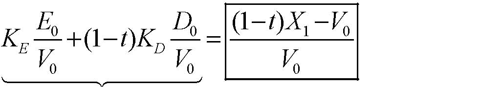

0010000(1)(1)EDEDtXVKtKVVV−−+−=144424443

 r = 加权平均资本成本（WACC） 

杠杆比率 D/（D＋E） 

■ D/（D＋E）是所考虑的特定项目的目标资本结构（市场价值）。 

■ 常见错误1： 

→使用项目承担公司先前的D/（D＋E）比率 

■ 常见错误2： 

→使用项目融资时的D/（D＋E）比率。 

→例如：如果项目全部通过债务融资时，使用100% 

注意：我们将假定目标A＋B是把目标A和目标B相加的结果，这种假设在多数情况下都是成立的。 

杠杆比率（续） 

■ 那么，我们如何得到“目标杠杆比率”呢？ 

■ 使用项目比较法 

  →项目所在的行业是公司“明晰的主业” 

→权衡：可比较公司的数量与质量 

■如果公司承建的该项目与公司其它项目相似，那么就选用该公司作参照目标（即，这个公司是项目的可比较公司） 

■ 思考，通过核查表完善…… 

注意的重要事项： 

■ 如果项目在一段时间内一个保持相对稳定的D/V，那么加权平均资本成本在这段时间内也稳定的。 

■ 如果不是，那么加权平均资本成本应该在这段时间内相应地变化，而且，我们应该计算出每一年不同的加权平均资本成本。 

■ 实际上，公司更倾向于采用一个稳定的加权平均资本成本。 

■ 所以，实际上，在预期未来资本结构会发生相当大变化的情况下，加权平均资本成本方法常常不很奏效。 

债务资本成本：KD（续） 

- ■ 当违约率低时： 

   → 我们可以使用资本资产定价模型（CAPM）来估计KD（经验性材料表明债务贝塔值界于0.2到0.3之间） 

     → KD应该与贷方在一定资本结构下要求的利率相一致 

■ 当违约率高时： 

→我们需要用违约概率来估计预期现金流 

边际税率：t 

  ■ 它是指承担该项目的公司（或者更精确些，承建该项目的公司）的边际税率。 

  ■ 注意这个税率是决定债务税收节余的税率。 

  ■ 我们要求使用边际税率，而不是平均税率t。 

权益资本成本KE

■ 我们需要对项目进行比较来估计KE： 

  →“主业清晰”，即公司仅仅经营项目所在的行业。 

→如果承担该项目的公司本身就是同行业中的主业清晰者，就可以简单的使用这个公司的KE。 

■ 问题： 

→ 一家公司的资本结构会对KE有影响。 

→ 除非与可比较公司资本结构相同，否则我们在使用前就要计算KE。 

用CAPM估计KE

1）找出需评估项目的可比较参照公司。 

2）当目标公司的债务风险不是很高（且债务率相当稳定），通过消除可比较参照公司权益资本贝塔值βE的杠杆效应（运用D/(D+E)）来估算出其资产贝塔值βA，我们可运用： 

AE

D  

3）用目标公司的资产贝塔值βA来估算出项目的贝塔值βA（例如，用平均值） 

4）当目标公司的债务风险不是很高（且债务率相当稳定）时，在一定的资本结构假设下，通过消除估算的项目资产贝塔值βA的杠杆效应（使用项目的D/(D+E)）来估算出其权益资本贝塔值βE 

(EAA

Dβ 

- 5） 用这个估计的资产贝塔值βE来计算项目的权益资本成本kE 

KE = rf + βE×市场风险溢价 

注意事项： 

■ 公式： 

→消除杠杆效应的公式是杠杆效应公式的倒推 

→ 附录中展示了它们的推导 

■ 大多时候： 

→ 消除可比较参照公司的杠杆效应，即消除每个可比较公司的杠杆效应 

→ 利用所有可比较公司的平均资产贝塔值βA 估算一个公司的资产贝塔值βA，对其中我们偏好的公司给以更多权重 

→ 这就是我们估算的项目资产贝塔值βA 

→ 消除项目资产贝塔值βA的杠杆效应 

■ 在本课程，我们通常以稳定的D/（D＋E）比率使用该公式 

有关商业风险和财务风险的更多信息 

βA＝βEE/（E＋D） &lt;==&gt; ßE=[1+D/E]* ßA   &lt;==&gt; ßE-βA= (D/E)* ßA

■ 可比较公司之间有相似的商业风险 

＝＝&gt;相似的资产贝塔之βA和，相似的消除杠杆效应后的资本成本KA 

■ 如果可比较的公司间有不同的资本结构，那么它们的财务风险（不同的βE－βA）则不同。 

＝＝&gt;不同的权益资本贝塔值βE以及不同的权益资本目标收益KE 

■ 总体上说，权益资本贝塔值βE随着D/E的增加而增加 

→因此，权益资本成本KE随着财务杠杆的提高而提高。 

杠杆作用，收益和风险 

资产的风险由项目的类型决定，而非项目的融资方式。 

■ 杠杆变化不会影响rf或者βa 

   ■ 杠杆影响rf和βE 

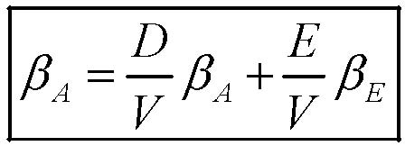

AA

E            

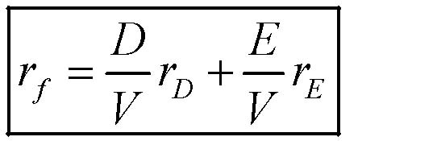

fDEDErrrVV=+

         ↓                         ↓    

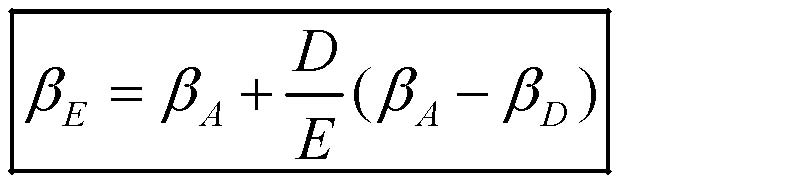

()EAADDEββββ=+−

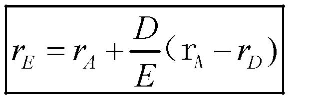

)EADDrrrE=+−A（r

杠杆作用与β 

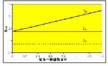

杠杆作用和要求的目标收益率 

债务—权益资本比 

要求的目标收益率 

商业风险和财务风险：直觉上的认识 

■ 考虑一个项目的资产贝塔值βA&gt;0 

■ 它的现金流量可以被分解为： 

→安全的现金流量 

→完全与市场相关的风险现金流量 

■ 随着债务水平的提高（但留有一定安全性）： 

→很大一部分的安全现金流量流向了债务持有者； 

→流向权益资本持有者的剩余现金流量与市场日益相关。 

注释：如果现金流量与市场负相关（βA&lt;0），不断增加的债务会使权益资本与市场负相关，也会降低权益资本要求的目标收益。 

通用电气的WACC 

■ 假定rf=6% 

■ 我们可以得到GE的βE=1.10，这表明 

               kE=6%+1.10*8%=14.8% 

■ kD=7.5% 

■ D/(D+E)= 0.06 

■ t=35% 

             WACC= 0.06*7.5%*(1-35%)+ 0.094*14.8%= 14.2% 

通用电气何时可以在现金流量贴现(DCF)中使用WACC？ 

■ 一个正在考虑中的项目何时会同公司其它项目一样拥有类似的基础风险（也就是说，何时公司可作为该项目较好的可比较参照） 

■ 而且，这个项目同公司其它项目的融资方式一样。 

→ 例如，如果通用电气打算扩展所有业务规模，那么它就应该使用自己的WACC。 

→ 但是，如果它计划扩展的仅仅涉及多个不同行业中的一个，WACC就不是合适的资本成本。 

●在那个案例中：寻找公众公司作为可比较参照，对它们进行杠杆效应和消除杠杆效应估算。 

重要提示： 

● 资本成本是一种投资属性，而不是公司属性 

● 几乎没有一家公司可以把一个单一的WACC用于其所有的业务。 

  通用电气所涉及的行业： 

→ 金融服务业 

→ 动力系统 

→ 航天发动机 

→ 工业 

→ 塑料加工 

→ 技术产品 

→ 电器 

→ 广播 

公司如何运用加权平均资本成本： 

他们是这样来计算加权平均资本成本的： 

■ 公司当前的债务成本KD 

■ 公司当前拥有的资本结构D/(D+E) 

■ 公司当前拥有的资本权益成本KE 

■ 它们所面临的边际税率 

它们贴现所有未来的自由现金流量： 

  ■ 单一贴现率 

  ■ 可调整的因素（例如，项目的“战略价值”） 

选择行业的资本结构、β与加权平均资本成本 

<Table>

<TR>
<TD>

行业 

</TD>
<TD>

负债率(%) 

</TD>
<TD>

权益资本β 

</TD>
<TD>

资产β 

</TD>
<TD>

加权平均资本成本(%) 

</TD>
</TR>
<TR>
<TD>

电力与燃气 

</TD>
<TD>

43.2 

</TD>
<TD>

0.58 

</TD>
<TD>

0.33 

</TD>
<TD>

8.1% 

</TD>
</TR>
<TR>
<TD>

食品生产 

</TD>
<TD>

22.90 

</TD>
<TD>

0.85 

</TD>
<TD>

0.66 

</TD>
<TD>

11.0% 

</TD>
</TR>
<TR>
<TD>

造纸与塑料 

</TD>
<TD>

30.40 

</TD>
<TD>

1.03 

</TD>
<TD>

0.72 

</TD>
<TD>

11.4% 

</TD>
</TR>
<TR>
<TD>

设备 

</TD>
<TD>

19.10 

</TD>
<TD>

1.02 

</TD>
<TD>

0.83 

</TD>
<TD>

12.4% 

</TD>
</TR>
<TR>
<TD>

零售 

</TD>
<TD>

21.70 

</TD>
<TD>

1.19 

</TD>
<TD>

0.93 

</TD>
<TD>

13.2% 

</TD>
</TR>
<TR>
<TD>

化工 

</TD>
<TD>

17.30 

</TD>
<TD>

1.34 

</TD>
<TD>

1.11 

</TD>
<TD>

14.7% 

</TD>
</TR>
<TR>
<TD>

计算机软件 

</TD>
<TD>

3.50 

</TD>
<TD>

1.33 

</TD>
<TD>

1.28 

</TD>
<TD>

16.2% 

</TD>
</TR>
<TR>
<TD>

</TD>
<TD>

</TD>
<TD>

</TD>
<TD>

</TD>
<TD>

</TD>
</TR>
<TR>
<TD>

所有行业平均 

</TD>
<TD>

21.50 

</TD>
<TD>

1.04 

</TD>
<TD>

0.82 

</TD>
<TD>

12.3% 

</TD>
</TR>
<TR>
<TD>

</TD>
<TD>

</TD>
<TD>

</TD>
<TD>

</TD>
<TD>

</TD>
</TR>
<TR>
<TD>

假定：无风险利率6%市场风险溢价8%；债务成本7.5%；税率35% 

</TD>
</TR>

</Table>

关于MM理论： 

   没有税收，加权平均资本成本独立于杠杆作用。 

加权平均资本成本谬论（回顾） 

■ 债务资本成本低于权益资本成本（正确）。 

■ 这是否意味着项目应该依靠债务来融资？ 

DEDEWACCKKDEDE=++++

- ■ 不，加权平均资本成本是自变量 

■ 如果你选择了便宜的债务，你增加了权益资本的成本（它的财务风险增加了）。 

有税收，WACC随着财务杠杆增加而下降 

2、现值调整(APV) 

现值调整 

■ 从资产价值评估中区分财务结构对价值的作用 

■ 第一步：如果项目或者公司是 100%股权融资，评估其价值。 

■ 第二步：将债务的税盾价值考虑进去。 

注意： 

■ 这种方法简单地把MM理论应用于税收 

■ 现值调整（APV）＝各部分价值评估＝净现值调整ANPV 

第一步:100%股权融资公司（项目）的价值评估 

■ 现金流量：自由现金流量的确是你所需要的。 

■ 如果公司是100％股权融资，那么你需要的就是可以恰好贴现其现金流的利率。 

■ 如果公司是100%股权融资，那么这个利率是权益资本的预期收益率。 

■ 为了得出它，你需要： 

  →找出可比较公司，即有同一业务的公众公司。 

→如果它们都是100%股权融资，估算它们的预期收益率。 

第一步：100%股权融资公司（项目）的价值（续） 

■ 使用适当的杠杆公式消除每一个可比较公司的权益资本贝塔值βA的杠杆效应，以估算其资产贝塔值βA（例如平均）。 

AEDEDVVβββ=+

■ 使用可比较公司的资产贝塔值βA来估计项目的资产贝塔值βA（例如平均）。 

■ 使用评估的资产贝塔值βA来计算全部权益资本的成本KA 

KA=rF+βA*市场风险溢价 

■ 用KA来贴现项目的自由现金流量 

例子： 

■ Johnson 和Johnson 业务经营涵盖了以下行业：制药业、消费品和医疗器械。 

■ 为了估计医疗器械业务的全部权益资本的成本，我们需要一个有可比较参照公司，也就是，在医疗器械行业主业清晰（确实有几个这样的公司）。 

■ 波士顿科学公司的数据： 

    →权益资本贝塔值β=0.98 

→负债=$13亿 

→权益资本=$91亿 

例子（续） 

■  计算波士顿科学公司的资产贝塔值β： 

9.10.980.869.11.3AEEEDββ===++

■  将该值作为我们估算的医疗器械行业的资产贝塔值β 

■  使用CAPM来计算该行业的全部权益资本成本（假定无风险利率6%，市场风险溢价8%）： 

KA=6%+ .86*8%=12.9% 

第二步：增加现值（债务税盾） 

■ 现金流量：预期的税收节余是tKDD，其中KD是债务资本成本（前面讨论过）。 

■ 如果预期D是稳定的，那么用KD来贴现tKDD 

            PVTS＝tKDD/KD＝tD 

■ 如果预期D/V是稳定的，那么用KA来贴现tKDD 

            PVTS＝tKDD/KA 

■ 直觉： 

→ 如果D/V是稳定的，那么D（tKDD会随着V而上下变动 

     → tKDD的风险类似于公司资产的风险：使用KA 

第二步：增加现值（续） 

■ 对许多项目而言，D和D/V并不像预期的那样稳定。 

■ 例如，预期杠杆收购债务水平下降。 

■ 一般地，你可以使用这些变量来估算债务水平： 

   → 支付计划（如果能得到） 

→ 财务预测， 

用界于KD，KA之间的贴现率折现。 

拓展APV方法 

■  APV方法的一个优点是容易拓展开来考虑更多的财务影响。 

■  例如，你可以将某一利率补贴单独地作为利息结余现值进行评估 

现值调整（APV）=NPV(所有权益资本)+PV(税盾)+PV(其它原材料) 

加权平均资本成本与现值调整 

加权平均资本成本的优点：使用广泛 

■只需要少量计算（这在无计算机时代很重要）。 

■更多使用文字表述，易于理解和解释（？） 

加权平均资本成本缺点： 

■将资产和负债的影响相混合。债务影响的误差/近似值影响了整个评估。 

■不易变通：如果债务有风险，加权平均资本成本又如何估算？混合性证券的成本是什么（可转换债）？财务的其他影响（如，财务困境成本）？非稳定的负债率？个人所得税？ 

注释：对非稳定的债务比率，每年可使用（见附录）不同的加权平均资本成本，但这么做很繁琐，而且影响了评估效果。 

加权平均资本成本与现值调整（续） 

现值调整的优点： 

  ■ 没有混淆概念。 

  ■ 更清晰：更易于捕捉价值的来源。 

  ■ 更富灵活性：仅仅把一部分影响作为独立因素考虑 

现值调整的缺点： 

■ 几乎没有人使用。 

总括： 

  ■ 对于复杂的、多变的或者杠杆比率高的的财务结构（例如杠杆收购），使用现值调整（APV）法会更好一些。 

  ■ 否则，你选择何种方法都无大碍。 

附  录 

附录：A: 负债率D/V不变时消除杠杆效应的计算公式 

·考虑一个永恒预期现金流为X的公司 

·资本结构：债务价值D与权益资本价值E 

E+D=V全部权益资本 + PVTS 

·根据定义，全部权益资本的资金成本KA即为合适的用于贴现项目自由现金流FCF的比率，（1-t）X 

·而且，由于公司的负债率D/V不变,PVTS=tDKD/KA 

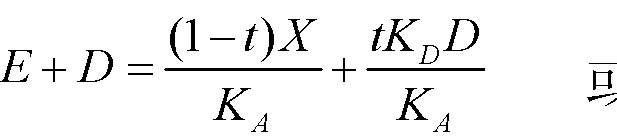

(1)DAAtKDtXEDKK−+=+

   或   

(1)DAtXtKDKED−+=+

附录：A:负债率D/V不变时消除杠杆效应的计算公式（续） 

·债权人与权益资本所有者每年（预期的）现金流 

如果100%股权融资，  债务每年的    债务预期       权益资本预 

预期的税后现金流      税盾         的支付          期的支付 

（1－t）X    ＋    tkDD      =   kDD      ＋       kEE 

·消去X，我们得到：

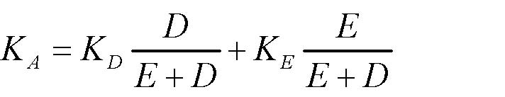

ADEDEKKKEDED=+++

·转化为贝塔（全部存在线形关系）收益形式：

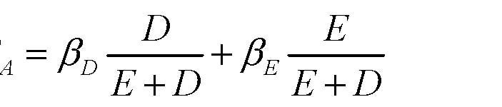

ADEDEEDE

D 

因而，若βD

≈

0,我们得到 

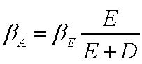

AEEEDββ=+

附录B：债务水平D不变时消除杠杆效应的计算公式 

·考虑一个永恒预期现金流为X的公司 

·资本结构：债务价值D与权益资本价值E 

E+D=V全部权益资本 + PVTS 

·由于公司的负债价值D长期不变,PVTS=tD 

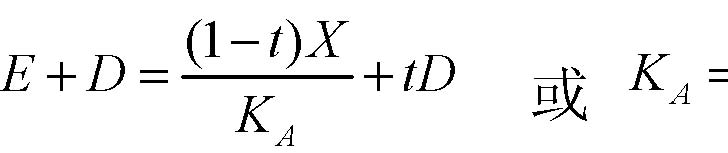

(1)AtXEDtDK−+=+

  或 

(1)(1)AtXKEDt−=+−

附录B：债务水平D不变时消除杠杆效应的计算公式（续） 

·债权人与权益资本所有者每年（预期的）现金流 

如果100%股权融资，  债务每年的    债务预期       权益资本预 

预期的税后现金流      税盾         的支付          期的支付 

（1－t）X    ＋    tkDD      =   kDD      ＋       kEE 

·两边同时除以（D+E），我们得到（参看上面KA的公式） 

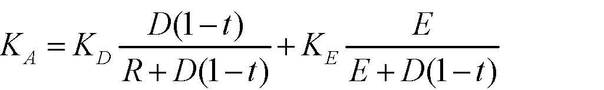

(1)(1)(1)ADEDtEKKKRDtEDt−=++−+−

·转化为贝塔收益形式：

(1)(1)(1)ADEDtEEDtEDtβββ−=++−+

− 

因而，若βD

≈

0,我们得到

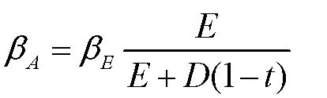

(1)AEEEDtββ=+−

附录C:  加权平均资本成本（WACC）与现值调整（APV）：例子 

举例的目的： 

·了解APV与WACC的运用 

·结果显示,如果正确运用,APV与WACC给出同一结果 

·在财务杠杆变化的环境下，正确运用WACC 

·让你确信APV更有效 

加权平均资本成本（WACC）与现值调整（APV）：例子（续） 

Anttoz公司，财富500强之一的设备公司，正计划在新奥尔良开设一家新的工厂，它的现金流显示在下一个幻灯片： 

·该新工厂需要的初始投资为$7500万,以PPE表示。加上1000万$的营运资本注入（等于第一年规模的8%） 

·在第一年的经营活动中，销售目标为$1.25亿。随后两年的销售规模要增长10%，并在接下来的年份中以5%的速度稳定地增长 

·Anttoz公司的财务分析委员会估算现金成本（GOGS,GS&amp;A支付，等）将占到收入的50% 

·追加的固定资产（PPE）投资等于每年的折旧，最初的追加投资为初始投资$7500万的10%，以后则随着销售收入的增加而增加。 

·该公司计划将营运资本维持在下一年目标销售收入的8% 

加权平均资本成本（WACC）与现值调整（APV）：例子 (续) 

·Anttoz设备公司，总税率为35%，未来三年自由现金流（FCF）将达$4500万，并在随后的年份每年增长5% 

·项目资产要求的目标收益率KA为20% 

·该项目的初始银行贷款为$8000万，营运一年后用资本金偿还$500万，到第三年末，使未偿付债务降为$6500万 

·从第一次还款开始，该项目的负债能力将每年增长5%，与预期的营运现金流增长相一致。由于公司早期有较高的财务杠杆，负债比率开始时为10%，一旦达到一个稳定的资本结构（三年后），负债比率就下降到8%。 

加权平均资本成本（WACC）与现值调整（APV）：例子（续） 

<Table>

<TR>
<TD>

第0年     第1年    第二年     第三年    第四年 

</TD>
</TR>
<TR>
<TD>

销售收入 

</TD>
<TD>

</TD>
<TD>

12500

</TD>
<TD>

13750

</TD>
<TD>

15125

</TD>
<TD>

15881

</TD>
</TR>
<TR>
<TD>

现金成本 

</TD>
<TD>

</TD>
<TD>

62500 

</TD>
<TD>

68750

</TD>
<TD>

75625 

</TD>
<TD>

79406 

</TD>
</TR>
<TR>
<TD>

折旧 

</TD>
<TD>

</TD>
<TD>

7500 

</TD>
<TD>

8250 

</TD>
<TD>

9075 

</TD>
<TD>

9529 

</TD>
</TR>
<TR>
<TD>

息税前利润（EBIT） 

</TD>
<TD>

</TD>
<TD>

55000 

</TD>
<TD>

60500 

</TD>
<TD>

66550 

</TD>
<TD>

69878 

</TD>
</TR>
<TR>
<TD>

公司税 

</TD>
<TD>

</TD>
<TD>

19250 

</TD>
<TD>

21175 

</TD>
<TD>

23293 

</TD>
<TD>

24457 

</TD>
</TR>
<TR>
<TD>

息税前后利润  

</TD>
<TD>

</TD>
<TD>

35750 

</TD>
<TD>

39325 

</TD>
<TD>

43258 

</TD>
<TD>

45420 

</TD>
</TR>
<TR>
<TD>

+折旧 

</TD>
<TD>

</TD>
<TD>

7500 

</TD>
<TD>

8250 

</TD>
<TD>

9075 

</TD>
<TD>

9529 

</TD>
</TR>
<TR>
<TD>

总现金流 

</TD>
<TD>

</TD>
<TD>

43250

</TD>
<TD>

47575 

</TD>
<TD>

52333 

</TD>
<TD>

54949 

</TD>
</TR>
<TR>
<TD>

固定资产投资 

</TD>
<TD>

</TD>
<TD>

</TD>
<TD>

</TD>
<TD>

</TD>
<TD>

</TD>
</TR>
<TR>
<TD>

75000 

</TD>
<TD>

7500 

</TD>
<TD>

8250 

</TD>
<TD>

9075 

</TD>
<TD>

9529 

</TD>
</TR>
<TR>
<TD>

净营运资本 

</TD>
<TD>

10000 

</TD>
<TD>

1000 

</TD>
<TD>

1100 

</TD>
<TD>

605 

</TD>
<TD>

635 

</TD>
</TR>
<TR>
<TD>

消除杠杆效应的自由现金

</TD>
<TD>

（85000）

</TD>
<TD>

34750 

</TD>
<TD>

38225 

</TD>
<TD>

42653 

</TD>
<TD>

44785 

</TD>
</TR>
<TR>
<TD>

债务水平 

</TD>
<TD>

80000 

</TD>
<TD>

75000 

</TD>
<TD>

70000 

</TD>
<TD>

65000 

</TD>
<TD>

68250 

</TD>
</TR>

</Table>

加权平均资本成本（WACC）与现值调整（APV）：例子 (续) 

<Table>

<TR>
<TD>

第0年     第1年     第二年      第三年     第四年 

</TD>
</TR>
<TR>
<TD>

APV 

</TD>
<TD>

</TD>
</TR>
<TR>
<TD>

消除杠杆效应的自由现金流 

</TD>
<TD>

(85000) 

</TD>
<TD>

34750 

</TD>
<TD>

38225 

</TD>
<TD>

42653 

</TD>
<TD>

44785 

</TD>
</TR>
<TR>
<TD>

消除杠杆效应的价值 

</TD>
<TD>

252969 

</TD>
<TD>

268813 

</TD>
<TD>

284350 

</TD>
<TD>

298568 

</TD>
<TD>

313496 

</TD>
</TR>
<TR>
<TD>

利息税盾 

</TD>
<TD>

</TD>
<TD>

2800 

</TD>
<TD>

2625 

</TD>
<TD>

2450 

</TD>
<TD>

1820 

</TD>
</TR>
<TR>
<TD>

TS的贴现值 

</TD>
<TD>

52135 

</TD>
<TD>

54549 

</TD>
<TD>

57379 

</TD>
<TD>

60667 

</TD>
<TD>

63700 

</TD>
</TR>
<TR>
<TD>

杠杆效应价值 

</TD>
<TD>

305104 

</TD>
<TD>

323361 

</TD>
<TD>

341729 

</TD>
<TD>

359234 

</TD>
<TD>

377196 

</TD>
</TR>

</Table>

加权平均资本成本（WACC）与现值调整（APV）：例子（续) 

<Table>

<TR>
<TD>

第0年     第1年        第二年     第三年    第四年 

</TD>
</TR>
<TR>
<TD>

APV 

</TD>
<TD>

</TD>
</TR>
<TR>
<TD>

消除杠杆效应的价值 

</TD>
<TD>

252969 

</TD>
<TD>

268813 

</TD>
<TD>

284350 

</TD>
<TD>

298568 

</TD>
<TD>

313496 

</TD>
</TR>
<TR>
<TD>

税盾的贴现值 

</TD>
<TD>

52135 

</TD>
<TD>

54549  

</TD>
<TD>

57379 

</TD>
<TD>

60667 

</TD>
<TD>

637000 

</TD>
</TR>
<TR>
<TD>

杠杆效益价值 

</TD>
<TD>

305104 

</TD>
<TD>

323361 

</TD>
<TD>

341729 

</TD>
<TD>

359234 

</TD>
<TD>

377196 

</TD>
</TR>
<TR>
<TD>

WACC 

</TD>
<TD>

</TD>
<TD>

</TD>
<TD>

</TD>
<TD>

</TD>
<TD>

</TD>
</TR>
<TR>
<TD>

债务价值 

</TD>
<TD>

80000 

</TD>
<TD>

75000 

</TD>
<TD>

70000 

</TD>
<TD>

65000 

</TD>
<TD>

68250 

</TD>
</TR>
<TR>
<TD>

权益资本价值 

</TD>
<TD>

225104 

</TD>
<TD>

248361 

</TD>
<TD>

271729 

</TD>
<TD>

294234 

</TD>
<TD>

308946 

</TD>
</TR>
<TR>
<TD>

权益资本要求的目标收益 

</TD>
<TD>

21.% 

</TD>
<TD>

20.8% 

</TD>
<TD>

20.5% 

</TD>
<TD>

20.2% 

</TD>
<TD>

20.2% 

</TD>
</TR>
<TR>
<TD>

WACC 

</TD>
<TD>

17.4% 

</TD>
<TD>

17.5% 

</TD>
<TD>

17.6% 

</TD>
<TD>

17.5% 

</TD>
<TD>

17.5% 

</TD>
</TR>
<TR>
<TD>

资本加权平均成本贴现自由现金流 

</TD>
<TD>

305104 

</TD>
<TD>

323361 

</TD>
<TD>

341729 

</TD>
<TD>

359234 

</TD>
<TD>

377196 

</TD>
</TR>

</Table>

         Acrobat Distiller 6.0.1 (Windows)

         D:20050429100216

         2005-04-29T18:04:35+08:00

         Acrobat PDFMaker 6.0 for Word

         2005-04-29T18:05:42+08:00

         2005-04-29T18:05:42+08:00

         uuid:7032144e-d7f6-48d7-be70-73a1ea626030

         uuid:90fcfcfc-5ffe-4ff0-96f7-82b751e91ead

               2

         xml

               实物期权

               myn

实物期权 

概览：第二部分——价值评估 

A．价值评估：自由现金流和风险 

·4.1     讲座：自由现金流价值评估 

·4.3     案例：Ameritrade 

B. 价值评估：加权平均资本成本（WACC）和现值调整（APV） 

·4.8     讲座：加权平均资本成本（WACC）和现值调整（APV）1 

·4.10    讲座：加权平均资本成本（WACC）和现值调整（APV）2 

·4.15    案例：Dixon公司1 

·4.17    案例：Dixon公司2 

·4.24    案例：Diamond化学公司 

C. 项目和公司价值评估 

·4.29    讲座：实物期权 

·5.1     案例：MW石油公司 

·5.6     讲座：公司价值评估 

·5.8     案例：Cooper工业有限公司 

·5.13    案例：Southland公司 

实物期权：评估的灵活性 

·“实物期权方法”评估面对新信息时管理灵活性的价值 

·面对新变化和未预期到的变化，管理者面临多种选择权去修改、斟酌决策。 

·这种灵活性显然是有价值的，评估一个项目或企业时应予以考虑。 

例： 

·通常，管理者可以根据需求的变化增加或减少生产 

=&gt;如果公司在知道需求水平之前必须选择一个固定的产量水平，其价值将偏低。 

实物期权分析的二个步骤： 

界定 

·此项目是否有真实的选择权？ 

·选择权是何种类型？ 

·他们很重要吗？ 

价值评估 

·怎样给（重要的）期权定价？ 

·怎样给不同类型的期权定价？ 

·为什么我们不能只用NPV定价？ 

第一步：界定实物期权 

实物期权的界定 

·界定嵌入一个项目中的期权是重要的。 

·除了那些无足轻重的项目外，其他项目中均有期权嵌入。 

·最重要的技巧在于： 

*如果有多种期权，对那些“重要”的进行界定， 

*如果有并不重要的期权存在，则可忽略 

·界定真实期权需要经验，有时还需要“见识”。 

例子：Oz Toys 的扩张计划 

·Oz Toys的管理者正在考虑建立一个新工厂以利用生产技术的革新成果。 

·大约三年后，该工厂的生产能力将扩大到使得Oz Toys进入一个新市场。 

Oz Toys最初计算的阶段性扩张计划 

<Table>

<TR>
<TD>

</TD>
<TD>

2000 

</TD>
<TD>

2001

</TD>
<TD>

2002

</TD>
<TD>

2003 

</TD>
<TD>

2004 

</TD>
<TD>

2005 

</TD>
<TD>

2006 

</TD>
</TR>
<TR>
<TD>

息税前利润（EBIT）×(1－t) 

</TD>
<TD>

</TD>
<TD>

2.2 

</TD>
<TD>

4.0 

</TD>
<TD>

-10.0 

</TD>
<TD>

11.5 

</TD>
<TD>

13.7 

</TD>
<TD>

17.4 

</TD>
</TR>
<TR>
<TD>

折旧 

</TD>
<TD>

</TD>
<TD>

19.0

</TD>
<TD>

21.0

</TD>
<TD>

21.0 

</TD>
<TD>

46.3 

</TD>
<TD>

48.1 

</TD>
<TD>

50.0 

</TD>
</TR>
<TR>
<TD>

资本性支出 

</TD>
<TD>

120.0 

</TD>
<TD>

8.1 

</TD>
<TD>

9.5 

</TD>
<TD>

307.0 

</TD>
<TD>

16.0 

</TD>
<TD>

16.3 

</TD>
<TD>

17.0 

</TD>
</TR>
<TR>
<TD>

净运营资本变化 

</TD>
<TD>

25.0 

</TD>
<TD>

4.1 

</TD>
<TD>

5.5 

</TD>
<TD>

75.0 

</TD>
<TD>

7.1 

</TD>
<TD>

8.0 

</TD>
<TD>

9.7 

</TD>
</TR>
<TR>
<TD>

自由现金流 

</TD>
<TD>

-145.0

</TD>
<TD>

9.0 

</TD>
<TD>

10.0

</TD>
<TD>

-371.0

</TD>
<TD>

34.7 

</TD>
<TD>

37.5 

</TD>
<TD>

40.7 

</TD>
</TR>
<TR>
<TD>

终值（5%永续增长） 

</TD>
<TD>

</TD>
<TD>

</TD>
<TD>

</TD>
<TD>

</TD>
<TD>

</TD>
<TD>

</TD>
<TD>

610.5 

</TD>
</TR>
<TR>
<TD>

净现值（12%加权平均资本成本） 

</TD>
<TD>

-19.8 

</TD>
<TD>

</TD>
<TD>

</TD>
<TD>

</TD>
<TD>

</TD>
<TD>

</TD>
<TD>

</TD>
</TR>

</Table>

是否存在期权？ 

·两个条件： 

- （1） 未来很可能出现新信息； 

- （2） 当信息出现时，会对决策产生影响。 

·确认管理者所面临不确定性： 

·管理者随着时间的推移将获取的主要信息是什么？ 

  ·他们将怎样利用这一信息？ 

·什么决策将作为新信息的函数发生变动？ 

Oz Toys：是否存在期权？ 

- （1） Oz Toys可能知道（或不知道）： 

·对现有及/或新产品的需求 

·对手进入市场的可能性 

·其他 

- （2） 这些信息可能（或不会）影响Oz Toys的以下决策： 

·是否在第一阶段进行扩张 

·是否进行第二阶段（甚至是第三阶段） 

·是否开发某种新产品或是其他种类 

·其他 

实物期权的界定（续） 

·在对项目诸如“阶段”，“战略投资”，“前景”等的描述中寻求线索 

·检查现金流和支出的动态模式。 

·经常遇到的期权的类别： 

*成长期权 

*放弃期权 

*扩张或收缩规模期权 

*调整期权 

*转换期权（投入，产出，工艺等） 

成长期权 

· 如果一项投资允许后续投入并且是否进行后续投入的决定能够在获取新信息的基础上随后作出，这项投资就包含了实物期权。 

· 当评估这样的一项投资时，应该将成长期权的价值考虑在内 

· 这样的项目通常具有“战略性价值” 

· 例： 

—&gt;R&amp;D—&gt;如果R&amp;D成功则投入使用 

—&gt;生产—&gt;继续 

成长期权（续） 

· 成长期权类似于买入期权：你拥有这种权利，而不是义务，付出一定的代价获得某物。 

· 成长期权可以是“嵌套”的，即是一系列相关的选择： 

—&gt;选择1—&gt;选择2—&gt;选择3—&gt;…. 

· 成长期权很有价值，一些产业市场价值一半以上归于成长期权 

—&gt; R&amp;D占很大比重的产业 

—&gt;具有多重产品代的产业（如，计算机，制药） 

—&gt;跨国经营的产业 

放弃期权：退出的期权 

· 如果在一定条件下，永久性放弃目前的经营并在次级市场实现资本设备及其他资产转售更可取，就说此项投资包含了放弃期权， 

· 有时放弃期权隐藏于整体预测中：一般而言继续经营可能更可取，而在一些情况下终止可能更好。 

· 放弃期权类似于卖出期权：你拥有处置某物并获取收入（清算价值）的权利（而不是义务）。 

扩张或收缩规模期权 

· 如果情况比预期的好，公司会扩张生产规模或提高资源利用程度。 

· 如果情况没有预期的好，公司会收缩生产规模。在极端情况下，会暂时停止生产待以后重新开始。 

· 与成长期权和放弃期权相似。 

· 例： 

—&gt;从矿石中提取矿产的能力降低 

—&gt;在一个工厂增加临时性第三班的能力 

调整期权： 

项目增速或减速的期权 

· 拥有调整投资（可能包含“从不”）的灵活性十分有价值 

· 例：一项专利的价值依赖于调整期权，即当购买这一专利时，你买到了随时使用它的权利（在专利期限内） 

· 类似于美式买入期权：在付出一定成本后，你拥有在任何时间获取某物的权利（而不是义务） 

· 注：只有那些相关信息可能在未来获取的投资调整才涉及“期权价值” 

时间可以产生期权（分段投资） 

· 如果出现了不利的新信息，以一系列支出为特征的阶段性投资产生了在中途放弃此投资的期权 

· 每个阶段可视为一个依赖于后续阶段的看涨期权，并且可按照复合期权定价 

· 在以下情况中是重要的： 

—&gt;所有研发密集型产业，特别是制药业； 

—&gt;长期的资本密集型项目，如，大型建设或是能源工厂 

—&gt;新建的风险企业 

实物期权种类总结 

<Table>

<TR>
<TD>

种类 

</TD>
<TD>

描述 

</TD>
<TD>

重要性在于 

</TD>
</TR>
<TR>
<TD>

延期期权 

</TD>
<TD>

管理者拥有等待投资的机会并能观望市场是否支持进一步的投资 

</TD>
<TD>

自然资源开发，房地产，农业，技术 

</TD>
</TR>
<TR>
<TD>

分段投资 

</TD>
<TD>

分段投资产生了在每个阶段重估/放弃的权利 

</TD>
<TD>

研发密集型产业，能源开发，新兴企业 

</TD>
</TR>
<TR>
<TD>

改变运营规模期权 

</TD>
<TD>

如果市场情况变化，公司能扩张/收缩或暂时停止 

</TD>
<TD>

自然资源，时装，房地产，消费品 

</TD>
</TR>
<TR>
<TD>

放弃期权 

</TD>
<TD>

如果市场情况恶化，管理者出售资产 

</TD>
<TD>

资本密集型产业，不确定市场环境下引入的新产品 

</TD>
</TR>
<TR>
<TD>

转换期权 

</TD>
<TD>

如果价格或需求变化，管理者能改变产品组合（生产灵活性）或改变投入（工艺灵活性）

</TD>
<TD>

波动市场上有转移偏好的公司，能源公司 

</TD>
</TR>
<TR>
<TD>

成长期权 

</TD>
<TD>

早期的投资以新产品、新工艺、市场准入或核心竞争力的形式打开了未来的增长机会 

</TD>
<TD>

高技术，多代产品行业（药品，计算机，战略收购） 

</TD>
</TR>
<TR>
<TD>

多重交互期权 

</TD>
<TD>

包含不同种类的期权，看涨和看跌期权，其价值因交互而不同于单一期权 

</TD>
<TD>

上述公司中的多数 

</TD>
</TR>

</Table>

Oz Toys：对期权的界定 

· 对项目的描述有两个不同阶段                                                        

*阶段1：新工厂                                                              *阶段2：扩张 

· 开支的模式：可能是随机的                                              =&gt;可能内含成长期权！                                                                

实践问题：需要简化 

· 现实中的项目，尤其长期项目是复杂的： 

—&gt;它们是实际资产和期权的混合物 

—&gt;期权经常是嵌套的 

· 必要的简单假设： 

—&gt;允许价值评估的技术分析 

—&gt;使模型具有灵活性 

—&gt;使模型对你及其他人（尤其是参与决策的人员）来说是可理解的 

实践问题：简单化（续） 

应该做什么？ 

· 将项目划分为与简单期权相对应的若干部分                                           

· 寻找管理者面对的最主要的不确定性 

· 由项目决定的简化模型为该项目的价值给出了上（或下）限 

—&gt;例如： 

·用欧式期权而不是美式期权 

·忽略一些期权 

·忽略一些由等待引起的负面影响（如进入的机会） 

Oz Toys：可能的简化 

· 对阶段1和阶段2分别定价 

· 主要考虑在第二阶段是否扩张的期权 

—&gt;假定其他期权“不需要考虑” 

· 假定第二阶段将在2003年进行或不进行 

—&gt;欧式看涨期权 

—&gt;对项目价值的分布做出简单假设 

第二步：实物期权定价 

实物期权定价 

· 金融期权的定价工具（即股票及其他金融资产的买入和卖出期权）对于估算某些项目包含的实物期权的价值是有用的。 

—&gt;常用布莱克—斯科尔斯（Black-Scholes）模型给实物期权定价 

· 问题：实物期权比金融期权复杂得多 

—&gt;需要将它们进行简化以适用于金融期权的定价模型 

· 与DCF分析类似，其目的在于提供“评分”的量化技巧，以帮助决策过程，而不是来代替合理的商业判断 

从现金流贴现（DCF）分析开始： 

· 假定项目不涉及期权，对其进行估价，即所有的投资决策必须立刻做出 

· 这一基础构成了对项目评估的下限

· 然后将灵活性/选则性引入决策过程： 

—&gt;NPV&lt;0并不意味着永远不进行这项投资 

—&gt;NPV&gt;0并不意味着要立即进行这项投资（或是一定要在将来进行投资） 

Oz Toys：现金流贴现（DCF）分析 

· 我们需要分开两个阶段的现金流 

· 这要求做出以下判断: 

—&gt;哪些开支是可随意决定的,哪些不是，即哪些决策需要在现在做出，哪些可以在未来新信息获得后再做出 

—&gt;每个阶段的现金流入/流出 

· 注释:有时,简单地恢复损失的数据可用于构建简单的现金流贴现（DCF）分析。 

分开第1阶段和第2阶段 

第1阶段和第2阶段的现金流贴现（DCF）分析 

<Table>

<TR>
<TD>

</TD>
<TD>

2000 

</TD>
<TD>

2001

</TD>
<TD>

2002

</TD>
<TD>

2003 

</TD>
<TD>

2004

</TD>
<TD>

2005 

</TD>
<TD>

2006 

</TD>
</TR>
<TR>
<TD>

阶段1 

</TD>
<TD>

</TD>
<TD>

</TD>
<TD>

</TD>
<TD>

</TD>
<TD>

</TD>
<TD>

</TD>
<TD>

</TD>
</TR>
<TR>
<TD>

现金流 

</TD>
<TD>

</TD>
<TD>

9.0 

</TD>
<TD>

10.0

</TD>
<TD>

11.0 

</TD>
<TD>

11.6

</TD>
<TD>

12.1 

</TD>
<TD>

12.7 

</TD>
</TR>
<TR>
<TD>

投资 

</TD>
<TD>

145.0

</TD>
<TD>

</TD>
<TD>

</TD>
<TD>

</TD>
<TD>

</TD>
<TD>

</TD>
<TD>

</TD>
</TR>
<TR>
<TD>

终值（TV）（5%永续增长） 

</TD>
<TD>

</TD>
<TD>

</TD>
<TD>

</TD>
<TD>

</TD>
<TD>

</TD>
<TD>

</TD>
<TD>

191.0 

</TD>
</TR>
<TR>
<TD>

净现值（NPV）（WACC=12%） 

</TD>
<TD>

-3.7 

</TD>
<TD>

</TD>
<TD>

</TD>
<TD>

</TD>
<TD>

</TD>
<TD>

</TD>
<TD>

</TD>
</TR>
<TR>
<TD>

阶段2 

</TD>
<TD>

</TD>
<TD>

</TD>
<TD>

</TD>
<TD>

</TD>
<TD>

</TD>
<TD>

</TD>
<TD>

</TD>
</TR>
<TR>
<TD>

现金流 

</TD>
<TD>

</TD>
<TD>

</TD>
<TD>

</TD>
<TD>

</TD>
<TD>

23.2

</TD>
<TD>

25.4 

</TD>
<TD>

28.0 

</TD>
</TR>
<TR>
<TD>

投资 

</TD>
<TD>

</TD>
<TD>

</TD>
<TD>

</TD>
<TD>

382.0

</TD>
<TD>

</TD>
<TD>

</TD>
<TD>

</TD>
</TR>
<TR>
<TD>

终值（TV）（5%永续增长） 

</TD>
<TD>

</TD>
<TD>

</TD>
<TD>

</TD>
<TD>

</TD>
<TD>

</TD>
<TD>

</TD>
<TD>

419.5 

</TD>
</TR>
<TR>
<TD>

净现值（NPV）（WACC=12%） 

</TD>
<TD>

-16.1

</TD>
<TD>

</TD>
<TD>

</TD>
<TD>

</TD>
<TD>

</TD>
<TD>

</TD>
<TD>

</TD>
</TR>
<TR>
<TD>

总计 

</TD>
<TD>

</TD>
<TD>

</TD>
<TD>

</TD>
<TD>

</TD>
<TD>

</TD>
<TD>

</TD>
<TD>

</TD>
</TR>
<TR>
<TD>

现金流 

</TD>
<TD>

</TD>
<TD>

9.0 

</TD>
<TD>

10.0

</TD>
<TD>

11.0 

</TD>
<TD>

34.7

</TD>
<TD>

37.5 

</TD>
<TD>

40.7 

</TD>
</TR>
<TR>
<TD>

投资 

</TD>
<TD>

145.0

</TD>
<TD>

</TD>
<TD>

</TD>
<TD>

382.0

</TD>
<TD>

</TD>
<TD>

</TD>
<TD>

</TD>
</TR>
<TR>
<TD>

终值（TV） 

</TD>
<TD>

</TD>
<TD>

</TD>
<TD>

</TD>
<TD>

</TD>
<TD>

</TD>
<TD>

</TD>
<TD>

610.5 

</TD>
</TR>
<TR>
<TD>

净现值（NPV）（WACC=12%） 

</TD>
<TD>

-19.8

</TD>
<TD>

</TD>
<TD>

</TD>
<TD>

</TD>
<TD>

</TD>
<TD>

</TD>
<TD>

</TD>
</TR>

</Table>

Oz Toys：DCF分析(续) 

· 两个阶段均有负的NPV 

· 第二阶段的NPV可能大大高估： 

—&gt;投资（$382M）可能比现金流的风险低 

—&gt;是否要用3年期5.5%？的无风险利率 

第二阶段的现金流贴现（DCF）分析，按5.5%对投资折现 

<Table>

<TR>
<TD>

</TD>
<TD>

2000 

</TD>
<TD>

2001

</TD>
<TD>

2002

</TD>
<TD>

2003 

</TD>
<TD>

2004

</TD>
<TD>

2005 

</TD>
<TD>

2006 

</TD>
</TR>
<TR>
<TD>

阶段2 

</TD>
<TD>

</TD>
<TD>

</TD>
<TD>

</TD>
<TD>

</TD>
<TD>

</TD>
<TD>

</TD>
<TD>

</TD>
</TR>
<TR>
<TD>

现金流 

</TD>
<TD>

</TD>
<TD>

</TD>
<TD>

</TD>
<TD>

</TD>
<TD>

23.2

</TD>
<TD>

25.4 

</TD>
<TD>

28.0 

</TD>
</TR>
<TR>
<TD>

投资 

</TD>
<TD>

</TD>
<TD>

</TD>
<TD>

</TD>
<TD>

382.0

</TD>
<TD>

</TD>
<TD>

</TD>
<TD>

</TD>
</TR>
<TR>
<TD>

终值（TV）（5%永续增长） 

</TD>
<TD>

</TD>
<TD>

</TD>
<TD>

</TD>
<TD>

</TD>
<TD>

</TD>
<TD>

</TD>
<TD>

419.5 

</TD>
</TR>
<TR>
<TD>

净现值（NPV）（WACC=12%） 

</TD>
<TD>

-69.5

</TD>
<TD>

</TD>
<TD>

</TD>
<TD>

</TD>
<TD>

</TD>
<TD>

</TD>
<TD>

</TD>
</TR>

</Table>

期权定价 

·首先确认期权： 

* 如果在决策做出时NPV为正，阶段2才会进行 

·策略是将包含于项目中的期权演化为简单金融期权,然后使用金融价值评估工具定价: 布莱克—斯科尔斯（Black-Scholes）模型 

·这经常需要作出一些关于该项目的大胆假设。 

布莱克—斯科尔斯（Black-Scholes）模型 

·布莱克—斯科尔斯（Black-Scholes）模型： 

期权价格 =  

问题：我们需要投入什么？ 

图示：项目—&gt;看涨期权 

<Table>

<TR>
<TD>

项目 

</TD>
<TD>

</TD>
<TD>

买入期权 

</TD>
</TR>
<TR>
<TD>

获取资产需要的开支 

</TD>
<TD>

X 

</TD>
<TD>

执行价格 

</TD>
</TR>
<TR>
<TD>

获取的营运资产的价值

</TD>
<TD>

S 

</TD>
<TD>

股票价格（标底资产价格） 

</TD>
</TR>
<TR>
<TD>

可以延期决策的时间 

</TD>
<TD>

T 

</TD>
<TD>

到期时间 

</TD>
</TR>
<TR>
<TD>

营运资产的风险 

</TD>
<TD>

σ2

</TD>
<TD>

股票收益的方差 

</TD>
</TR>
<TR>
<TD>

货币的时间价值 

</TD>
<TD>

r 

</TD>
<TD>

无风险利率 

</TD>
</TR>

</Table>

N(d):累积正态概率密度函数 

d1= ln[S/PV(X)] / (T1/2) + (σ1/2)/2    d2= d1-(σ1/2) 

S =当前的股票价格                        X = 执行价格 

r =无风险利率                            T = 到期时间（年）. 

σ=股票收益的标准差 

Oz Toys：5个变量 

<Table>

<TR>
<TD>

X 

</TD>
<TD>

实施第2阶段，2003年需要的投资 

</TD>
<TD>

$382M 

</TD>
</TR>
<TR>
<TD>

S 

</TD>
<TD>

第二阶段现金流的现值 

</TD>
<TD>

4255.8 

</TD>
</TR>
<TR>
<TD>

T 

</TD>
<TD>

第二阶段似乎要延期3年（由管理者核实） 

</TD>
<TD>

3年 

</TD>
</TR>
<TR>
<TD>

r 

</TD>
<TD>

3年期无风险利率（核实收益曲线） 

</TD>
<TD>

5.5 

</TD>
</TR>
<TR>
<TD>

σ2

</TD>
<TD>

第二阶段资产每年的方差。不能从DCF电子数据表获得

</TD>
<TD>

40% 

</TD>
</TR>

</Table>

<Table>

<TR>
<TD>

阶段2 

</TD>
<TD>

2000 

</TD>
<TD>

2001

</TD>
<TD>

2002

</TD>
<TD>

2003

</TD>
<TD>

2004

</TD>
<TD>

2005 

</TD>
<TD>

2006 

</TD>
</TR>
<TR>
<TD>

现金流 

</TD>
<TD>

</TD>
<TD>

</TD>
<TD>

</TD>
<TD>

</TD>
<TD>

23.2

</TD>
<TD>

25.4 

</TD>
<TD>

28.0 

</TD>
</TR>
<TR>
<TD>

终值（TV） 

</TD>
<TD>

</TD>
<TD>

</TD>
<TD>

</TD>
<TD>

</TD>
<TD>

</TD>
<TD>

</TD>
<TD>

419.5 

</TD>
</TR>
<TR>
<TD>

现值（PV）（WACC=12%） 

</TD>
<TD>

255.8

</TD>
<TD>

</TD>
<TD>

</TD>
<TD>

</TD>
<TD>

</TD>
<TD>

</TD>
<TD>

</TD>
</TR>

</Table>

实践问题：什么是波动性？ 

· 波动性（σ）不能从表格或是报纸上查找 

注释：即便是对σ的粗略估计也可能是有用的 

1．作一个有根据的猜测： 

· 系统风险与整体风险相关：高β值的项目具有较高的σ 

· 分散化组合的波动性是这组资产波动性的下限 

· 对一个单一项目来说，每年20—30%并不是十分高的水平 

实践问题：什么是波动性？（续） 

2．数据： 

· 对一些产业来说，可用投资收益的历史数据 

· 对许多交易的股票来说，隐含的波动性可从报出的期权价格计算出来 

注释：这些数据需要调整，因为权益回报具有杠杆效应，它们比标底资产更具波动性 

3．模拟： 

·步骤1：对项目未来现金流及未来现金流如何受特定因素（如，商品价格，利率和汇率，等）影响建立一个以平面差价为基础的（简化）模型 

·步骤2：用Monte Carlo模拟法模拟项目收益和σ的可能的分布 

布莱克—斯科尔斯（Black-Scholes）模型 

·两个充分的数值： 

   and   

·下表给出了仅为股权价格S一部分的Black-Scholes买入期权的价格 

<Table>

<TR>
<TD>

布莱克—斯科尔斯（Black-Scholes）模型 

</TD>
</TR>
<TR>
<TD>

列：A     行：B 

</TD>
</TR>
<TR>
<TD>

</TD>
<TD>

0.6 

</TD>
<TD>

0.65

</TD>
<TD>

0.7

</TD>
<TD>

0.75

</TD>
<TD>

0.8

</TD>
<TD>

0.86

</TD>
<TD>

0.9 

</TD>
</TR>
<TR>
<TD>

0.5 

</TD>
<TD>

5.1 

</TD>
<TD>

6.6

</TD>
<TD>

8.2

</TD>
<TD>

10

</TD>
<TD>

11.8

</TD>
<TD>

14.2

</TD>
<TD>

15.7 

</TD>
</TR>
<TR>
<TD>

0.55 

</TD>
<TD>

6.6 

</TD>
<TD>

8.3

</TD>
<TD>

10

</TD>
<TD>

11.9

</TD>
<TD>

13.8

</TD>
<TD>

16.1

</TD>
<TD>

17.7 

</TD>
</TR>
<TR>
<TD>

0.6 

</TD>
<TD>

8.3 

</TD>
<TD>

10.1

</TD>
<TD>

11.9

</TD>
<TD>

13.8

</TD>
<TD>

15.8

</TD>
<TD>

18.1

</TD>
<TD>

19.7 

</TD>
</TR>
<TR>
<TD>

0.65 

</TD>
<TD>

10 

</TD>
<TD>

11.9

</TD>
<TD>

13.8

</TD>
<TD>

15.8

</TD>
<TD>

17.8

</TD>
<TD>

20.1

</TD>
<TD>

21.7 

</TD>
</TR>
<TR>
<TD>

0.7 

</TD>
<TD>

11.9 

</TD>
<TD>

13.8

</TD>
<TD>

15.8

</TD>
<TD>

17.8

</TD>
<TD>

19.8

</TD>
<TD>

22.1

</TD>
<TD>

23.6 

</TD>
</TR>
<TR>
<TD>

0.75 

</TD>
<TD>

13.7 

</TD>
<TD>

15.8

</TD>
<TD>

17.8

</TD>
<TD>

19.8

</TD>
<TD>

21.8

</TD>
<TD>

24.1

</TD>
<TD>

25.6 

</TD>
</TR>
<TR>
<TD>

0.8 

</TD>
<TD>

15.7 

</TD>
<TD>

17.7

</TD>
<TD>

19.8

</TD>
<TD>

21.8

</TD>
<TD>

23.7

</TD>
<TD>

26

</TD>
<TD>

27.5 

</TD>
</TR>

</Table>

布莱克—斯科尔斯（Black-Scholes）模型（续） 

· 如果决策不能延期（然而投资和现金流仍始于2003），A值表示第2阶段的价值 

· 在这个例子中，A实际上是第2阶段的盈利性指数： 

· 期权价值随着A增长（如表中所示） 

布莱克—斯科尔斯（Black-Scholes）模型（续） 

· B值，累积波动性，衡量现在和决策期T之间“S变动了多少” 

· 直观地，S的变动将更大 

—&gt;当S每年的方差较大，即σ较大时 

—&gt;当期限较长，即T较大时 

· B表示能延期做出决策的价值 

注释：当B=0，只需考虑项目的NPV值（不论A&gt;1与否），因为这时或是决策必须立刻作出（T=0）或是即使决策即时做出但没有信息出现（σ=0） 

并且 

Oz Toys：定价 

  和    

<Table>

<TR>
<TD>

布莱克—斯科尔斯（Black-Scholes）模型 

</TD>
</TR>
<TR>
<TD>

</TD>
<TD>

0.6 

</TD>
<TD>

0.65

</TD>
<TD>

0.7

</TD>
<TD>

0.75

</TD>
<TD>

0.8

</TD>
<TD>

0.86

</TD>
<TD>

0.9 

</TD>
</TR>
<TR>
<TD>

0.5 

</TD>
<TD>

5.1 

</TD>
<TD>

6.6

</TD>
<TD>

8.2

</TD>
<TD>

10

</TD>
<TD>

11.8

</TD>
<TD>

14.2

</TD>
<TD>

15.7 

</TD>
</TR>
<TR>
<TD>

0.55 

</TD>
<TD>

6.6 

</TD>
<TD>

8.3

</TD>
<TD>

10

</TD>
<TD>

11.9

</TD>
<TD>

13.8

</TD>
<TD>

16.1

</TD>
<TD>

17.7 

</TD>
</TR>
<TR>
<TD>

0.6 

</TD>
<TD>

8.3 

</TD>
<TD>

10.1

</TD>
<TD>

11.9

</TD>
<TD>

13.8

</TD>
<TD>

15.8

</TD>
<TD>

18.1

</TD>
<TD>

19.7 

</TD>
</TR>
<TR>
<TD>

0.65 

</TD>
<TD>

10 

</TD>
<TD>

11.9

</TD>
<TD>

13.8

</TD>
<TD>

15.8

</TD>
<TD>

17.8

</TD>
<TD>

20.1

</TD>
<TD>

21.7 

</TD>
</TR>
<TR>
<TD>

0.7 

</TD>
<TD>

11.9 

</TD>
<TD>

13.8

</TD>
<TD>

15.8

</TD>
<TD>

17.8

</TD>
<TD>

19.8

</TD>
<TD>

22.1

</TD>
<TD>

23.6 

</TD>
</TR>
<TR>
<TD>

0.75 

</TD>
<TD>

13.7 

</TD>
<TD>

15.8

</TD>
<TD>

17.8

</TD>
<TD>

19.8

</TD>
<TD>

21.8

</TD>
<TD>

24.1

</TD>
<TD>

25.6 

</TD>
</TR>
<TR>
<TD>

0.8 

</TD>
<TD>

15.7 

</TD>
<TD>

17.7

</TD>
<TD>

19.8

</TD>
<TD>

21.8

</TD>
<TD>

23.7

</TD>
<TD>

26

</TD>
<TD>

27.5 

</TD>
</TR>

</Table>

· 第2阶段的价值是(大约)：V                          

·  扩张计划的价值是：V1+V2=-3.7+48.6=$44.9M                                         

解释 

·  由于我们使用的是简化模型，因此要以有所保留的态度对待结果并对其做出解释 

·  将复杂性还原于模型，通过： 

—&gt;敏感性分析 

—&gt;使推论条件化和合理化 

·  迭代程序 

·  帮助你确定项目的关键所在，那是你需要收集更多数据或完善分析的地方 

         Acrobat Distiller 6.0.1 (Windows)

         D:20050429135636

         2005-04-29T21:57:53+08:00

         Acrobat PDFMaker 6.0 for Word

         2005-04-29T21:58:54+08:00

         2005-04-29T21:58:54+08:00

         uuid:a5a4f529-ef5f-4f01-af60-1cba1c7c511e

         uuid:525a5c7b-c47a-45eb-9b7d-b36ce15de4a2

               2

         xml

               实物期权

               myn

实物期权 

财务理论（二） 

凯兹瑞纳·理崴伦 

2003.4.28 

实物期权 

■ 面对未预期到的变化，管理者面临多种选择权去修改、斟酌决策。 

■这种灵活性显然是有价值的，评估一个项目或企业时应予以考虑。 

实物期权（续） 

嵌入式权利： 

■  后续投资 

■  放弃项目的期权 

■  投资前“等待”的期权 

■  扩张/改变生产方式的期权 

要点： 

■  信息在未来获取 

■  可以在获取信息后做出决策 

授课计划 

上节课： 

■  实物期权：基本知识 

■  实物期权的简单现金流贴现（DCF）分析（决策树） 

今天： 

■  期权定价的回顾 

=&gt; 为什么简单的现金流贴现（DCF）方法不够理想？ 

■  对实物期权的界定 

■  期权定价的布莱克—斯科尔斯（Black-Scholes）模型 

1.期权定价的回顾 

实物期权和金融期权 

期权的定义：按照一定的可能与市场价格不同的价格（执行价格）买/卖标的资产的权利（而不是义务）。 

金融期权                               实物期权 

股票期权、股票指数期权、外汇期权、          不在交易所交易     

黄金期权、白银期权、小麦期权等             标底资产是非证券资产 

股票买入期权的定价 

       股票                              期权（执行价格=110）

最大的困难在于发现当前买入期权的价值 

股票买入期权定价 

■  考虑以下的策略组合： 

*借款（或卖出面值为B的债券） 

*买入N股股票 

- ■ 选择N和B以使这一资产组合完全偿付 = 期权完全偿付 

股票买入期权定价（续） 

■  股票/债券组合与期权与相同的清偿程度 

*因此，期权与资产组合在当前必然有相同的价值 

*否则：就会出现套利机会 

- ■ 资产组合当前的价格应为多少（假定无风险利率=4%）？ 

■  这样我们就可以为期权定价了。期权价格$5.77 

为什么标准的现金流贴现（DCF）不够理想？ 

■  下面我们用标准的DCF来为期权定价： 

*应采用何种贴现率？ 

*我们在此用股票要求的目标回报率E[Rs]作为贴现率 

为什么标准的现金流贴现（DCF）不够理想？ 

■  DCF得出以下的期权定价： 

错误在哪里？ 

■  12%的折现率太低=&gt;期权比标底资产股票的风险高 

原因何在？ 

■  股票期权具有杠杆效应。 

*类似于企业的财务杠杆：财务杠杆率越高=&gt;权益资本的β值和收益越高。 

股票期权具有杠杆效应 

■  回忆一下我们复制的资产组合：借入B/(1=r）买进N股股票 

* 假定股票的β值=1，市场溢价=8% 

· 注意CAPM有效，根据CAPM：12%=4%+1×8% 

■  期权的β值为多少？ 

■  因此期权要求的目标收益为：38%=4%+4.33×8% 

■  期权的价格应该为：$5.77=8/1.38 

跨期的情况如何？ 

■  原则上，可以采用与前面相同的方法进行期权定价： 

*从T=2期开始后推 

■  但是在每一个节点有些变化： 

*复制的组合、期权的β值、贴现率 

■  作法将会十分麻烦 

■  因此产生了布莱克—斯科尔斯（Black-Scholes）期权定价模型 

期权定价技巧： 

■ “动态”现金流贴现（DCF）（决策树） 

*回忆前面的“手提电脑”和“铜矿”的例子 

*近似运用实物期权问题 

*由于贴现问题并未得出确切答案 

■  二项式模型 

*类似于今天课堂讲授的单期例子 

*比布莱克—斯科尔斯（Black-Scholes）模型计算量大 

*在布莱克—斯科尔斯（Black-Scholes）模型不是很有效时较为适用 

■  布莱克—斯科尔斯（Black-Scholes）模型 

*从现在起我们将重点研究这一模型 

布莱克—斯科尔斯（Black-Scholes）模型 

■  布莱克—斯科尔斯（Black-Scholes）模型的定价原则与二项式模型相同(构建资产组合,无套利)  

期权价格 = 

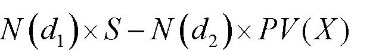

()()12()NdSNdPVX×−×

■  注意它与单期的二项式模型的相似之处 

期权价格=N×S-PV（B） 

N(d):累积正态概率密度函数 

d1= ln[S/PV(X)] / (σT1/2) + (σT1/2)/2    d2= d1-(σT1/2) 

S =当前的股票价格                        X = 执行价格 

r =无风险利率                            T = 到期时间（年）. 

σ=股票收益的标准差 

回顾“手提电脑”的例子    

                                 模型B 

            模型A的结果好=&gt;                执行                                 

<Table>

<TR>
<TD>

</TD>
<TD>

t=0时模型B中的定价 

</TD>
<TD>

</TD>
</TR>
<TR>
<TD>

B                                                            “静态”NPV 

</TD>
<TD>

      [(16,557 - 21,148)/2]/1.123

</TD>
<TD>

-1,634

</TD>
</TR>
<TR>
<TD>

                                                               “动态”NPV 

</TD>
<TD>

     [(16,557 + 0)/2]/1.123

</TD>
<TD>

5,892 

</TD>
</TR>
<TR>
<TD>

的结果不好=&gt;                                                期权定价 

</TD>
<TD>

[(16,557 + 0)/2]/???3

</TD>
<TD>

??? 

</TD>
</TR>

</Table>

       对模型B为利好消息 

模型

t=0时的价值？                                                                    

     模型A             

       对模型B为利空消息 

                                     模型B

放弃                                       

2.实物期权的界定 

关于实物期权的两个问题 ： 

界定 

■  此项目是否有真实的选择权？ 

■  选择权是何种类型？ 

价值评估 

■  怎样给期权定价？ 

■  怎样给不同类型的期权定价？ 

■  为什么我们不能只用NPV定价？ 

实物期权的界定 

■  界定嵌入一个项目中的期权是重要的。 

■  除了那些无足轻重的项目外，其他项目中均有期权嵌入。 

■  最重要的技巧在于： 

*如果有多种期权，对那些“重要”的进行界定， 

*如果有并不重要的期权存在，则可忽略 

■界定真实期权需要经验，有时还需要“见识”。 

实物期权的界定（续） 

■  在对项目诸如“阶段”，“战略投资”，“前景”等的描述中寻求线索 

■  检查现金流和支出的动态模式。 

■  经常遇到的期权的类别： 

*成长期权 

*放弃期权 

*扩张或收缩规模期权 

*调整期权 

*转换期权（投入，产出，工艺等） 

是否存在期权？ 

■  两个条件： 

（1）未来很可能出现新信息； 

（2）当信息出现时，会对决策产生影响。 

■  确认管理者所面临不确定性： 

*管理者随着时间的推移将获取的主要信息是什么？ 

*他们将怎样利用这一信息？ 

例子：Oz Toys 的扩张计划 

■  Oz Toys的管理者正在考虑建立一个新工厂以利用生产技术的革新成果。 

■  大约三年后，该工厂的生产能力将扩大到使得Oz Toys进入一个新市场。 

<Table>

<TR>
<TD>

</TD>
<TD>

2000 

</TD>
<TD>

2001

</TD>
<TD>

2002

</TD>
<TD>

2003 

</TD>
<TD>

2004

</TD>
<TD>

2005

</TD>
<TD>

2006 

</TD>
</TR>
<TR>
<TD>

息税前利润（EBIT）×(1－t) 

</TD>
<TD>

</TD>
<TD>

2.2 

</TD>
<TD>

4.0 

</TD>
<TD>

-10.0 

</TD>
<TD>

11.5

</TD>
<TD>

13.7

</TD>
<TD>

17.4 

</TD>
</TR>
<TR>
<TD>

折旧 

</TD>
<TD>

</TD>
<TD>

19.0

</TD>
<TD>

21.0

</TD>
<TD>

21.0 

</TD>
<TD>

46.3

</TD>
<TD>

48.1

</TD>
<TD>

50.0 

</TD>
</TR>
<TR>
<TD>

资本性支出 

</TD>
<TD>

120.0 

</TD>
<TD>

8.1 

</TD>
<TD>

9.5 

</TD>
<TD>

307.0 

</TD>
<TD>

16.0

</TD>
<TD>

16.3

</TD>
<TD>

17.0 

</TD>
</TR>
<TR>
<TD>

净运营资本变化 

</TD>
<TD>

25.0 

</TD>
<TD>

4.1 

</TD>
<TD>

5.5 

</TD>
<TD>

75.0 

</TD>
<TD>

7.1 

</TD>
<TD>

8.0 

</TD>
<TD>

9.7 

</TD>
</TR>
<TR>
<TD>

自由现金流 

</TD>
<TD>

-145.0

</TD>
<TD>

9.0 

</TD>
<TD>

10.0

</TD>
<TD>

-371.0

</TD>
<TD>

34.7

</TD>
<TD>

37.5

</TD>
<TD>

40.7 

</TD>
</TR>
<TR>
<TD>

终值（5%永续增长） 

</TD>
<TD>

</TD>
<TD>

</TD>
<TD>

</TD>
<TD>

</TD>
<TD>

</TD>
<TD>

</TD>
<TD>

610.5

</TD>
</TR>
<TR>
<TD>

净现值（12%加权平均资本成本）

</TD>
<TD>

-19.8 

</TD>
<TD>

</TD>
<TD>

</TD>
<TD>

</TD>
<TD>

</TD>
<TD>

</TD>
<TD>

</TD>
</TR>

</Table>

Oz Toys：是否存在期权？ 

（1）Oz Toys可能知道（或不知道）： 

■  对现有及/或新产品的需求 

■  对手进入市场的可能性 

■  其他 

（2）这些信息可能（或不会）影响Oz Toys的以下决策： 

■  是否在第一阶段进行扩张 

■  是否进行第二阶段（甚至是第三阶段） 

■  是否开发某种新产品或是其他种类 

■  其他 

Oz Toys：对期权的界定 

■  项目描述有两个不同阶段                                           

*阶段1：新工厂                                                   

*阶段2：扩张 

■  开支的模式：可能是随机的                                         

■  可能内含成长期权                                                 

实践问题#1：简单化 

■  现实中的项目，尤其长期项目是复杂的： 

—&gt;它们是实际资产和期权的混合物 

—&gt;期权经常是嵌套的 

■  必要的简单假设： 

—&gt;允许价值评估的技术分析 

—&gt;使模型具有灵活性 

—&gt;使模型对你及其他人（尤其是参与决策的人员）来说是可理解的 

实践问题#1：简单化（续） 

■ 将项目划分为与简单期权相对应的若干部分                            

■ 寻找管理者面对的最主要的不确定性 

■ 由项目决定的简化模型为该项目的价值给出了上（或下）限 

例如： 

—&gt;用欧式期权而不是美式期权 

—&gt;忽略一些期权 

—&gt;忽略一些由“等待”引起的负面影响（如进入的机会） 

Oz Toys：可能的简化 

■ 对阶段1和阶段2分别定价 

■ 主要考虑在第二阶段是否扩张的期权 

—&gt;假定其他期权“不需要考虑” 

■ 假定第二阶段将在2003年进行或不进行 

欧式看涨期权 

3.实物期权定价 

实物期权价值评估 

■ 金融期权的定价工具（即股票及其他金融资产的买入和卖出期权）对于估算某些项目包含的实物期权的价值是有用的 

■ 实物期权比金融期权复杂得多 

■ 与DCF分析类似，其目的在于提供“评分”的量化技巧，以帮助决策过程，而不是来代替合理的商业判断 

期权与现金流贴现（DCF） 

■ 实物期权方法通常作为DCF的替代方法 

■ 实际上，实物期权方法并不与DCF相冲突：它是DCF用于特定投资类型的一种形式 

■ 回忆一下期权定价技术实际上是由于贴现的困难而发展起来的 

*即，由于期权，我们能将同一折现率（如WACC）用于所有现金流 

期权与现金流贴现（DCF）（续） 

■ DCF方法： 

*现金流的“未来预期” 

*对预期现金流贴现 

■ 在以下情况下这种方法十分完美： 

*预期现金流估算准确 

*贴现率选择正确 

■ 确切地说，依靠期权估计以下问题是复杂的： 

*预期现金流 

*贴现率 

从“静态”DCF分析开始 

■ 如果项目不涉及期权，从对其进行估价开始 

*假定投资决策必须立刻做出 

■ 这一基础构成了对项目评估的下限 

*NPV&lt;0并不意味着永远不进行这项投资 

*NPV&gt;0并不意味着要立即进行这项投资（或是一定要在将来进行投资） 

Oz Toys：DCF分析 

■ 分为两个阶段 

■ 要求做出以下判断: 

*哪些开支是可随意决定的,哪些不是 

*每个阶段的现金流入/流出 

■ 注释:有时,简单地恢复损失的数据可用于构建简单的现金流贴现（DCF）分析 

Oz Toys：对第1阶段和第2阶段进行评估 

<Table>

<TR>
<TD>

</TD>
<TD>

2000 

</TD>
<TD>

2001

</TD>
<TD>

2002 

</TD>
<TD>

2003

</TD>
<TD>

2004

</TD>
<TD>

2005

</TD>
<TD>

2006 

</TD>
</TR>
<TR>
<TD>

阶段1 

</TD>
<TD>

</TD>
<TD>

</TD>
<TD>

</TD>
<TD>

</TD>
<TD>

</TD>
<TD>

</TD>
<TD>

</TD>
</TR>
<TR>
<TD>

现金流 

</TD>
<TD>

</TD>
<TD>

9 

</TD>
<TD>

10 

</TD>
<TD>

11 

</TD>
<TD>

11.6

</TD>
<TD>

12.1

</TD>
<TD>

12.7 

</TD>
</TR>
<TR>
<TD>

投资 

</TD>
<TD>

145 

</TD>
<TD>

</TD>
<TD>

</TD>
<TD>

</TD>
<TD>

</TD>
<TD>

</TD>
<TD>

</TD>
</TR>
<TR>
<TD>

终值（TV）（5%永续增长）

</TD>
<TD>

</TD>
<TD>

</TD>
<TD>

</TD>
<TD>

</TD>
<TD>

</TD>
<TD>

</TD>
<TD>

191 

</TD>
</TR>
<TR>
<TD>

净现值（NPV）（WACC=12%）

</TD>
<TD>

-3.7 

</TD>
<TD>

</TD>
<TD>

</TD>
<TD>

</TD>
<TD>

</TD>
<TD>

</TD>
<TD>

</TD>
</TR>
<TR>
<TD>

阶段2 

</TD>
<TD>

</TD>
<TD>

</TD>
<TD>

</TD>
<TD>

</TD>
<TD>

</TD>
<TD>

</TD>
<TD>

</TD>
</TR>
<TR>
<TD>

现金流 

</TD>
<TD>

</TD>
<TD>

</TD>
<TD>

</TD>
<TD>

</TD>
<TD>

23.2

</TD>
<TD>

25.4

</TD>
<TD>

28 

</TD>
</TR>
<TR>
<TD>

投资 

</TD>
<TD>

</TD>
<TD>

</TD>
<TD>

</TD>
<TD>

382 

</TD>
<TD>

</TD>
<TD>

</TD>
<TD>

</TD>
</TR>
<TR>
<TD>

终值（TV）（5%永续增长）

</TD>
<TD>

</TD>
<TD>

</TD>
<TD>

</TD>
<TD>

</TD>
<TD>

</TD>
<TD>

</TD>
<TD>

419.5

</TD>
</TR>
<TR>
<TD>

净现值（NPV）（WACC=12%）

</TD>
<TD>

-16.1

</TD>
<TD>

</TD>
<TD>

</TD>
<TD>

</TD>
<TD>

</TD>
<TD>

</TD>
<TD>

</TD>
</TR>
<TR>
<TD>

总计 

</TD>
<TD>

</TD>
<TD>

</TD>
<TD>

</TD>
<TD>

</TD>
<TD>

</TD>
<TD>

</TD>
<TD>

</TD>
</TR>
<TR>
<TD>

现金流 

</TD>
<TD>

</TD>
<TD>

9 

</TD>
<TD>

10 

</TD>
<TD>

11 

</TD>
<TD>

34.7

</TD>
<TD>

37.5

</TD>
<TD>

40.7 

</TD>
</TR>
<TR>
<TD>

投资 

</TD>
<TD>

145 

</TD>
<TD>

</TD>
<TD>

</TD>
<TD>

382 

</TD>
<TD>

</TD>
<TD>

</TD>
<TD>

</TD>
</TR>
<TR>
<TD>

终值（TV） 

</TD>
<TD>

</TD>
<TD>

</TD>
<TD>

</TD>
<TD>

</TD>
<TD>

</TD>
<TD>

</TD>
<TD>

610.5

</TD>
</TR>
<TR>
<TD>

净现值（NPV）（WACC=12%）

</TD>
<TD>

-19.8

</TD>
<TD>

</TD>
<TD>

</TD>
<TD>

</TD>
<TD>

</TD>
<TD>

</TD>
<TD>

</TD>
</TR>

</Table>

Oz Toys：DCF分析(续) 

■ 两个阶段均有负的NPV 

■ 第二阶段的NPV可能大大高估： 

—&gt;投资（$382M）可能比现金流的风险低 

—&gt;是否要用3年期5.5%？的无风险利率 

第二阶段的现金流贴现（DCF）分析，按5.5%对投资折现 

<Table>

<TR>
<TD>

</TD>
<TD>

2000 

</TD>
<TD>

2001

</TD>
<TD>

2002 

</TD>
<TD>

2003 

</TD>
<TD>

2004

</TD>
<TD>

2005

</TD>
<TD>

2006 

</TD>
</TR>
<TR>
<TD>

阶段2 

</TD>
<TD>

</TD>
<TD>

</TD>
<TD>

</TD>
<TD>

</TD>
<TD>

</TD>
<TD>

</TD>
<TD>

</TD>
</TR>
<TR>
<TD>

现金流 

</TD>
<TD>

</TD>
<TD>

</TD>
<TD>

</TD>
<TD>

</TD>
<TD>

23.2

</TD>
<TD>

25.4

</TD>
<TD>

28.0 

</TD>
</TR>
<TR>
<TD>

投资 

</TD>
<TD>

</TD>
<TD>

</TD>
<TD>

</TD>
<TD>

382.0

</TD>
<TD>

</TD>
<TD>

</TD>
<TD>

</TD>
</TR>
<TR>
<TD>

终值（TV）（5%永续增长） 

</TD>
<TD>

</TD>
<TD>

</TD>
<TD>

</TD>
<TD>

</TD>
<TD>

</TD>
<TD>

</TD>
<TD>

419.5

</TD>
</TR>
<TR>
<TD>

净现值（NPV）（WACC=12%）

</TD>
<TD>

-69.5

</TD>
<TD>

</TD>
<TD>

</TD>
<TD>

</TD>
<TD>

</TD>
<TD>

</TD>
<TD>

</TD>
</TR>

</Table>

期权定价 

■ 策略是将包含于项目中的期权演化为简单金融期权,然后使用金融价值评估工具定价: 布莱克—斯科尔斯（Black-Scholes）模型 

■ 这经常需要作出一些关于该项目的大胆假设。 

图示：项目—&gt;看涨期权 

<Table>

<TR>
<TD>

项目 

</TD>
<TD>

</TD>
<TD>

买入期权 

</TD>
</TR>
<TR>
<TD>

获取资产需要的开支 

</TD>
<TD>

X 

</TD>
<TD>

执行价格 

</TD>
</TR>
<TR>
<TD>

获取的营运资产的价值

</TD>
<TD>

S 

</TD>
<TD>

股票价格（标底资产价格）

</TD>
</TR>
<TR>
<TD>

可以延期决策的时间 

</TD>
<TD>

T 

</TD>
<TD>

到期时间 

</TD>
</TR>
<TR>
<TD>

营运资产的风险 

</TD>
<TD>

σ2

</TD>
<TD>

股票收益的方差 

</TD>
</TR>
<TR>
<TD>

货币的时间价值 

</TD>
<TD>

r 

</TD>
<TD>

无风险利率 

</TD>
</TR>

</Table>

Oz Toys：5个变量 

<Table>

<TR>
<TD>

X 

</TD>
<TD>

实施第2阶段，2003年需要的投资 

</TD>
<TD>

$382M 

</TD>
</TR>
<TR>
<TD>

S 

</TD>
<TD>

第二阶段现金流的现值 

</TD>
<TD>

4255.8

</TD>
</TR>
<TR>
<TD>

T 

</TD>
<TD>

第二阶段似乎要延期3年（由管理者核实） 

</TD>
<TD>

3年 

</TD>
</TR>
<TR>
<TD>

r 

</TD>
<TD>

3年期无风险利率（核实收益曲线） 

</TD>
<TD>

5.5 

</TD>
</TR>
<TR>
<TD>

σ2

</TD>
<TD>

第二阶段资产每年的方差。不能从DCF电子数据表获得

</TD>
<TD>

40% 

</TD>
</TR>

</Table>

<Table>

<TR>
<TD>

阶段2 

</TD>
<TD>

2000 

</TD>
<TD>

2001

</TD>
<TD>

2002 

</TD>
<TD>

2003

</TD>
<TD>

2004

</TD>
<TD>

2005

</TD>
<TD>

2006 

</TD>
</TR>
<TR>
<TD>

现金流 

</TD>
<TD>

</TD>
<TD>

</TD>
<TD>

</TD>
<TD>

</TD>
<TD>

23.2

</TD>
<TD>

25.4

</TD>
<TD>

28.0 

</TD>
</TR>
<TR>
<TD>

终值（TV） 

</TD>
<TD>

</TD>
<TD>

</TD>
<TD>

</TD>
<TD>

</TD>
<TD>

</TD>
<TD>

</TD>
<TD>

419.5

</TD>
</TR>
<TR>
<TD>

现值（PV）（WACC=12%）

</TD>
<TD>

255

</TD>
<TD>

8

</TD>
<TD>

</TD>
<TD>

</TD>
<TD>

</TD>
<TD>

</TD>
<TD>

</TD>
</TR>

</Table>

实践问题#2：什么是波动性？ 

■ 波动性（σ）不能从表格或是报纸上查找 

注释：即便是对σ的粗略估计也可能是有用的 

1．作一个有根据的猜测： 

■ 系统风险与整体风险相关：高β值的项目具有较高的σ 

■ 分散化组合的波动性是这组资产波动性的下限 

■ 对一个单一项目来说，每年20—30%并不是十分高的水平 

实践问题#2：什么是波动性？（续） 

2．数据： 

■ 对一些产业来说，可用投资收益的历史数据 

■ 对许多交易的股票来说，隐含的波动性可从报出的期权价格计算出来 

注释：这些数据需要调整，因为权益回报具有杠杆效应，它们比标底资产更具波动性 

实践问题#2：什么是波动性？（续） 

3．模拟： 

■ 步骤1：对项目未来现金流及未来现金流如何受特定因素（如，商品价格，利率和汇率，等）影响建立一个以平面差价为基础的（简化）模型 

■ 步骤2：用Monte Carlo模拟法模拟项目收益和σ的可能的分布 

布莱克—斯科尔斯（Black-Scholes）模型 

■ 两个充分的数值： 

XrSAT)1(+×=

   and  

TB×=σ

■ 下表给出了仅为股权价格S一部分的Black-Scholes买入期权的价格 

<Table>

<TR>
<TD>

布莱克—斯科尔斯（Black-Scholes）模型   列：A  行：B

</TD>
</TR>
<TR>
<TD>

</TD>
<TD>

0.6

</TD>
<TD>

0.65

</TD>
<TD>

0.7

</TD>
<TD>

0.75 

</TD>
<TD>

0.8

</TD>
<TD>

0.86

</TD>
</TR>
<TR>
<TD>

0.5

</TD>
<TD>

5.1

</TD>
<TD>

6.6

</TD>
<TD>

8.2

</TD>
<TD>

10 

</TD>
<TD>

11.8

</TD>
<TD>

14.2

</TD>
</TR>
<TR>
<TD>

0.55

</TD>
<TD>

6.6

</TD>
<TD>

8.3

</TD>
<TD>

10

</TD>
<TD>

11.9 

</TD>
<TD>

13.8

</TD>
<TD>

16.1

</TD>
</TR>
<TR>
<TD>

0.6

</TD>
<TD>

8.3

</TD>
<TD>

10.1

</TD>
<TD>

11.9

</TD>
<TD>

13.8 

</TD>
<TD>

15.8

</TD>
<TD>

18.1

</TD>
</TR>
<TR>
<TD>

0.65

</TD>
<TD>

10

</TD>
<TD>

11.9

</TD>
<TD>

13.8

</TD>
<TD>

15.8 

</TD>
<TD>

17.8

</TD>
<TD>

20.1

</TD>
</TR>
<TR>
<TD>

0.7

</TD>
<TD>

11.9

</TD>
<TD>

13.8

</TD>
<TD>

15.8

</TD>
<TD>

17.8 

</TD>
<TD>

19.8

</TD>
<TD>

22.1

</TD>
</TR>
<TR>
<TD>

0.75

</TD>
<TD>

13.7

</TD>
<TD>

15.8

</TD>
<TD>

17.8

</TD>
<TD>

19.8 

</TD>
<TD>

21.8

</TD>
<TD>

24.1

</TD>
</TR>

</Table>

布莱克—斯科尔斯（Black-Scholes）模型（续） 

■ 如果决策不能延期（然而投资和现金流仍始于2003），A值表示第2阶段的价值 

■ 在这个例子中，A实际上是第2阶段的盈利性指数：

并且 

■ 期权价值随着A增长（如表中所示） 

布莱克—斯科尔斯（Black-Scholes）模型（续） 

■ B值，累积波动性，衡量现在和决策期T之间“S变动了多少” 

■ 直观地，S的变动将更大 

—&gt;当S每年的方差较大，即σ较大时 

—&gt;当期限较长，即T较大时 

■ B表示能延期做出决策的价值 

注释：当B=0，只需考虑项目的NPV值（不论A&gt;1与否），因为这时或是决策必须立刻作出（T=0）或是即使决策即时做出但没有信息出现（σ=0） 

Oz Toys：定价 

786.0382)055.1(8.255)1(3=×=+×=XrSAT

  和   

693.034.0=×=×=TBσ

<Table>

<TR>
<TD>

布莱克—斯科尔斯（Black-Scholes）模型  列：A  行：B 

</TD>
</TR>
<TR>
<TD>

</TD>
<TD>

0.6

</TD>
<TD>

0.65

</TD>
<TD>

0.7

</TD>
<TD>

0.75

</TD>
<TD>

0.8

</TD>
<TD>

0.86

</TD>
<TD>

0.9

</TD>
</TR>
<TR>
<TD>

0.5

</TD>
<TD>

5.1

</TD>
<TD>

6.6

</TD>
<TD>

8.2

</TD>
<TD>

10

</TD>
<TD>

11.8

</TD>
<TD>

14.2

</TD>
<TD>

15.7

</TD>
</TR>
<TR>
<TD>

0.55

</TD>
<TD>

6.6

</TD>
<TD>

8.3

</TD>
<TD>

10

</TD>
<TD>

11.9

</TD>
<TD>

13.8

</TD>
<TD>

16.1

</TD>
<TD>

17.7

</TD>
</TR>
<TR>
<TD>

0.6

</TD>
<TD>

8.3

</TD>
<TD>

10.1

</TD>
<TD>

11.9

</TD>
<TD>

13.8

</TD>
<TD>

15.8

</TD>
<TD>

18.1

</TD>
<TD>

19.7

</TD>
</TR>
<TR>
<TD>

0.65

</TD>
<TD>

10

</TD>
<TD>

11.9

</TD>
<TD>

13.8

</TD>
<TD>

15.8

</TD>
<TD>

17.8

</TD>
<TD>

20.1

</TD>
<TD>

21.7

</TD>
</TR>
<TR>
<TD>

0.7

</TD>
<TD>

11.9

</TD>
<TD>

13.8

</TD>
<TD>

15.8

</TD>
<TD>

17.8

</TD>
<TD>

19.8

</TD>
<TD>

22.1

</TD>
<TD>

23.6

</TD>
</TR>
<TR>
<TD>

0.75

</TD>
<TD>

13.7

</TD>
<TD>

15.8

</TD>
<TD>

17.8

</TD>
<TD>

19.8

</TD>
<TD>

21.8

</TD>
<TD>

24.1

</TD>
<TD>

25.6

</TD>
</TR>
<TR>
<TD>

0.8

</TD>
<TD>

15.7

</TD>
<TD>

17.7

</TD>
<TD>

19.8

</TD>
<TD>

21.8

</TD>
<TD>

23.7

</TD>
<TD>

26

</TD>
<TD>

27.5

</TD>
</TR>

</Table>

■ 第2阶段的价值是(大约)：

MSV6.48$8.25519.0%192=×=×=

■ 扩张计划的价值是：V1+V2=-3.7+48.6=$44.9M   

实践问题#3：模型检验 

■ 标准期权定价模型需要做出分布假设 

■ 第一步：尽量寻找一种接近于你对真实分布认识的模型（可获得的模型越来越多） 

■ 第二步：确定模型偏离分析的方向，并用得出的结果作为上限或下限 

■ 第三步：将项目视为一个复杂的决策树，用计算机进行批处理（即不进行分解）  

实践问题#4：解释 

■ 由于我们使用的是简化模型，因此要以有所保留的态度对待结果并对其做出解释 

■ 将复杂性还原于模型，通过： 

—&gt;敏感性分析 

—&gt;使推论条件化和合理化 

■ 迭代程序 

■ 帮助你确定项目的关键所在，那是你需要收集更多数据或完善分析的地方 

         Acrobat Distiller 6.0.1 (Windows)

         西安交通大学经济与金融学院

         D:20050430051044

         2005-04-30T13:11:37+08:00

         Acrobat PDFMaker 6.0 for Word

         2005-04-30T13:12:29+08:00

         2005-04-30T13:12:29+08:00

         uuid:b5228c05-83fa-492a-b431-bd63c9bbbd9f

         uuid:acb81b37-0e56-4908-a3b4-b3fa1b040b54

               3

         xml

               Part2第20部分

               wangweihua

公司评估 

概览：第二部分—价值评估 

A. 价值评估：自由现金流和风险 

·4.1     讲座：自由现金流价值评估 

·4.3     案例：Ameritrade 

B. 价值评估：加权平均资本成本（WACC）和现值调整（APV） 

·4.8     讲座：加权平均资本成本（WACC）和现值调整（APV）1 

·4.10    讲座：加权平均资本成本（WACC）和现值调整（APV）2 

·4.10    案例：Dixon公司1 

·4.17    案例：Dixon公司2 

·4.24    案例：Diamond化学公司 

C. 项目和公司价值评估 

·4.29   讲座：实物期权 

·5.1    案例：MW石油公司 

·5.6    讲座：公司价值评估 

·5.8    案例：Cooper工业有限公司 

·5.13   案例：Southland公司 

补充两个价值评估方法 

1）现金流贴现分析 

   →加权平均资本成本法（WACC） 

   →现值调整法（APV） 

2）可比较的 

   →以现金流为基础的价值乘数 

   →以现金流为基础的价格乘数 

   →资产乘数 

贴现现金流的分析 

· 加权平均资本成本法 

→预测未来的自由现金流 

    →估算加权平均资本成本 

    →计算现值 

· 现值调整法 

    →预测未来的自由现金流 

    →估算kA

    →计算现值 

    →增加的现值（税盾） 

终值 

· 评估周期较长的项目或正在营运的公司时，我们不可能永久的准确预测每年的现金流。 

· 只要合理地（或者最好猜想）认为公司已进入了“稳定”发展期，我们就可预测自由现金流。 

· 通常，假设： 

→公司被清算 

→或者自由现金流是不断增加的，稳定不变的，或是下降的，永续的； 

· 预测的水平将取决于公司或产业 

清算企业的终值 

1）残余价值（SV）： 

·资产清算后公司得到的现金流 

残值（SV）=清算价格－清算成本 

· 公司要对（清算价值－固定资产）纳税，因此合计得到 

           残值 ×（1－税率）＋ 税率×固定资产 

2）净营运资本 

· 项目完成时收回净营运资本（也就是，过去的净营运资本增加额 = 最终营运资本） 

注意事项： 

· 从理论上讲，你会偏好于净营运资本的实际价值，而非账面价值。 

· 这可能因具体情况而不同： 

   →不能收回全部应收账款 

   →存货售价高于或低于账面价值 

   →等等 

· 注意净运营资本（NWC）实际价值和账面价值的差异将会隐含税收的不同 

· 只要清算发生，价值清算往往低估终值。小幅度反弹当然更好 

永续年金终值 

· 零增长的永续年金：一均等支付永续年金在t＋1年首次支付C，贴现率是k，其现值PV就是C/k。 

→   终值（TV）=（t+1）期自由现金流╱贴现率（k） 

· 对于一个增长率为零的公司，我们经常假定（简单） 

自由现金流 = 息税前利润×（1－税率）＋折旧－资本性支出－净营运资本的增加值 

                                          0               0 

终值（TV）=（t＋1）期息税前利润×（1－税率）╱贴现率（k） 

增长型永续年金的终值 

· 一永续年金在t＋1年首次支付C，以后每年增长幅度为g，贴现率为k，其现值PV就是C/（k－g）。 

→  终值（TV）=（t+1）期自由现金流╱（贴现率－增长率） 

· 对于增长型的公司，我们经常假定（简单） 

自由现金流 = 息税前利润×（1－税率）＋折旧－资本性支出－净营运资本的增加值（△NWC）   

                   净资产的增加值（△NA）= －增长率（g）×t年以前的净资产（NA） 

       （1＋增长率）（1－税率）×t期息税前利润 

注意事项 

·增长型永续年金—假设： 

   →净资产增长率同利润增长率相同。 

   →净资产的增加值能较好的测度代替成本。 

· 不要忘记通过贴现终值进而得到终值的现值。 

· 加权平均资本成本法中，贴现率(k)=加权平均资本成本。 

· 在现值调整法中，贴现率=kA是作为自由现金流的贴现率，也是作为税盾的合 

适贴现率。 

终值（TV）=[（t+1）期息税前利润×（1－税率）－增长率（g）×t年的净资产（NA）] ╱（贴现率－增长率） 

何时的增长是有价值的？ 

需要比较增长性公司和非增长型公司的终值： 

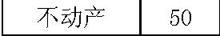

                                     (1)g+⋅−

                                              −

经济增加值（EVA）： 

经济增加值（EVA）= 息税前利润（ EBIT）×(1－利率t)－贴现率k×净资产（NA） 

终值（增长型公司）﹥终值（非增长型公司）

直觉判断：当增加净资产的成本能很好的被增加收入的价值 [ EBIT×（1－t）]所补偿时，增长是有利的。 

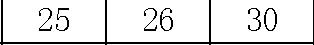

 EBIT×(1－t)－k×NA

经济增加值（EVA）：一些注意事项 

· 经济增加值（EVA）是一种快速有效的方法，无论未来的现金流如何。 

使用经济增加值作为 

· …一个简单的方法确定经营是否产生了价值和增长是否提高了价值。 

· …作为制定价值增值目标的一种方法。 

应特别小心，经济增加值（EVA）应用于… 

· …新公司 

· …处于快速变化的商业环境中的公司 

· …帐面价值不能准确反映替代成本的公司 

现金流贴现分析：利与弊 

优点 

· 现金流以特定的预测和假设为基础 

· 能使我们看到战略变化带来的影响 

· 价值评估同公司基本面紧密联系 

缺点 

· 如果你的预测（假设）相当好，现金流就同样好 

· 可能忘记某些事情 

· 需要预测管理者的行为（除非你有控制权） 

· 需要运用理论（如，资本资产定价模型CAPM）测算贴现率，这种测算在某些特定情况下可能不正确或不精确 

运用乘数评估价值： 

· 公司价值评估以可比较的公众公司价值为基础 

· 以现金流为基础的价值乘数： 

→公司的市场价值（MV）/收益（E），公司的市场价值（MV）/折旧及摊销前的盈余（EBITDA），公司的市场价值（MV）/自由现金流（FCF） 

· 以现金流为基础的价格乘数： 

→价格（P）/收益（E），价格（P）/折旧及摊销前的盈余（EBITDA），价格（P）/自由现金流（FCF） 

· 资产乘数 

→公司的市场价值（MV）/资产的帐面价值（BV），股票的市场价值（MV）/股票面值（BV） 

步骤 

· 预期：做同一业务的公司应当有相似的乘数（如，市盈率P/E）。 

· 第一步：找出有相同业务的公司作为你的评估对象。 

· 第二步：计算参照公司的市盈率，并为你所评估的公司提出一个市盈率预期（如，取参照公司市盈率P/E的平均值）。 

· 第三步：用你所评估公司的实际净收入乘以预期的市盈率P/E。 

注意事项 

· 对于无收益或实物资产有限的公司（如，高科技公司）， 

⊕价格—专利乘数， 

⊕价格—捐赠乘数， 

⊕甚至价格—博士乘数！ 

· 对于业务，也可以在可比较的业务中应用乘数（如，相似的周转率）。 

· 乘数以权益资本价值（或股票价格，如市盈率P/E）为基础，而不是公司整体价值，忽略了杠杆效应对权益资本成本的影响（或假设所有公司有相似的杠杆效应）→如果公司有不同的杠杆水平，应特别小心。 

引进乘数出自于什么考虑？ 

· 如果公司的实际自由现金流是永续的： 

· 公司的市场价值（MV）=自由现金流（FCF）/（加权平均资本成本WACC－增长率g） 

公司的市场价值（MV）/自由现金流（FCF）= 1/（加权平均资本成本WACC－增长率g） 

假如满足以下条件，参照公司间有相似的：公司市场价值（MV）/自由现金流（FCF）： 

   →它们的自由现金流也是永续的 

 →它们有相同的加权平均资本成本（要求有相似的负债率D/（D＋E）） 

→它们有相似的增长率g 

· 因为它们大体上相近（充其量），你可以去核实是否用不同的乘数会得出相似的结果，如果不能，发现为什么。 

相互比较法：利与弊 

利： 

· 用简单的方法融入许多其他价值评估方法的信息 

· 使市场对贴现率、增长率的一致评价具体化。 

· 充分利用市场信息 

· 能提供评估原则，确保你的评估与其他人的评估相一致 

弊： 

· 简单的假设所有公司在成长性、资本成本、商业地位、杠杆效应方面具有相似性 

· 难以融入公司特有的信息。特别是公司经营改变时出现的问题。 

· 会计上的不同。特别是收益和权益资本政策，由于这一原因，存在自由现金流（FCF）乘数和折旧及摊销前的盈余（EBITDA）偏好。 

· 各个公司的帐面价值会因固定资产使用年限的不同而变化。 

· 如果每个人都运用可参照公司作比较，那谁来做实际上的基础性分析呢？ 

附录 

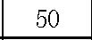

案例 

· 你考虑兼并XYZ公司。 XYZ 公司当前的资产负债表如下（0年） 

<Table>

<TR>
<TD>

资产 

</TD>
<TD>

负债 

</TD>
</TR>
<TR>
<TD>

流动资产 

</TD>
<TD>

50 

</TD>
<TD>

流动负债 

</TD>
<TD>

20 

</TD>
</TR>
<TR>
<TD>

不动产 

</TD>
<TD>

50 

</TD>
<TD>

长期负债 

</TD>
<TD>

30 

</TD>
</TR>
<TR>
<TD>

</TD>
<TD>

</TD>
<TD>

净财富 

</TD>
<TD>

50 

</TD>
</TR>
<TR>
<TD>

合计 

</TD>
<TD>

100 

</TD>
<TD>

合计 

</TD>
<TD>

100 

</TD>
</TR>

</Table>

· 项目营运状况 

<Table>

<TR>
<TD>

</TD>
<TD>

第1年

</TD>
<TD>

第2年

</TD>
<TD>

第3年

</TD>
<TD>

第4年

</TD>
<TD>

第5年 

</TD>
</TR>
<TR>
<TD>

销售收入 

</TD>
<TD>

200 

</TD>
<TD>

217 

</TD>
<TD>

239 

</TD>
<TD>

270 

</TD>
<TD>

293 

</TD>
</TR>
<TR>
<TD>

息税前利润 

</TD>
<TD>

20 

</TD>
<TD>

22 

</TD>
<TD>

25 

</TD>
<TD>

26 

</TD>
<TD>

30 

</TD>
</TR>
<TR>
<TD>

净营运资本 

</TD>
<TD>

33 

</TD>
<TD>

37 

</TD>
<TD>

41 

</TD>
<TD>

44 

</TD>
<TD>

48 

</TD>
</TR>
<TR>
<TD>

折旧 

</TD>
<TD>

5 

</TD>
<TD>

5 

</TD>
<TD>

6 

</TD>
<TD>

7 

</TD>
<TD>

8 

</TD>
</TR>
<TR>
<TD>

资本性支出 

</TD>
<TD>

10 

</TD>
<TD>

10 

</TD>
<TD>

15 

</TD>
<TD>

6 

</TD>
<TD>

20 

</TD>
</TR>

</Table>

案例（续） 

-  在下列的假设条件下，XYZ公司股票的价值： 

1）5年后清算XYZ公司（假设残值为零） 

2）销售增长率降到g = 5%，息税前利润/销售收入仍为10%。 

3）销售停止增长（g = 0），息税前利润/销售收入仍为10%。 

4）销售增长率降到g = 5%，息税前利润/销售收入降为5%。 

5）销售停止增长（g = 0），息税前利润/销售收入降为5%。 

案例（续） 

从估计5年的自由现金流开始 

-  净营运资本（0年）=流动资产-流动负债=50-20=30 

  自由现金流=息税前利润*（1-税率）+折旧-资本性支出-净营运资本增加额 

<Table>

<TR>
<TD>

</TD>
<TD>

第0年

</TD>
<TD>

第1年

</TD>
<TD>

第2年

</TD>
<TD>

第3年

</TD>
<TD>

第4年 

</TD>
<TD>

第5年 

</TD>
</TR>
<TR>
<TD>

息税前利润 

</TD>
<TD>

</TD>
<TD>

20 

</TD>
<TD>

22 

</TD>
<TD>

25 

</TD>
<TD>

26 

</TD>
<TD>

30 

</TD>
</TR>
<TR>
<TD>

息税前利润（1-税率）

</TD>
<TD>

</TD>
<TD>

13.2

</TD>
<TD>

14.52

</TD>
<TD>

16.5

</TD>
<TD>

17.16 

</TD>
<TD>

19.8 

</TD>
</TR>
<TR>
<TD>

净营运资本 

</TD>
<TD>

30 

</TD>
<TD>

33 

</TD>
<TD>

37 

</TD>
<TD>

41 

</TD>
<TD>

44 

</TD>
<TD>

48 

</TD>
</TR>
<TR>
<TD>

净营运资本增加额 

</TD>
<TD>

</TD>
<TD>

3 

</TD>
<TD>

4 

</TD>
<TD>

4 

</TD>
<TD>

3 

</TD>
<TD>

4 

</TD>
</TR>
<TR>
<TD>

折旧 

</TD>
<TD>

</TD>
<TD>

5 

</TD>
<TD>

5 

</TD>
<TD>

6 

</TD>
<TD>

7 

</TD>
<TD>

8 

</TD>
</TR>
<TR>
<TD>

资本性支出 

</TD>
<TD>

</TD>
<TD>

10 

</TD>
<TD>

10 

</TD>
<TD>

15 

</TD>
<TD>

6 

</TD>
<TD>

20 

</TD>
</TR>
<TR>
<TD>

自由现金流 

</TD>
<TD>

</TD>
<TD>

5.2

</TD>
<TD>

5.52

</TD>
<TD>

3.5

</TD>
<TD>

15.16 

</TD>
<TD>

3.8 

</TD>
</TR>
<TR>
<TD>

现值贴现率(13%) 

</TD>
<TD>

22.7

</TD>
<TD>

</TD>
<TD>

</TD>
<TD>

</TD>
<TD>

</TD>
<TD>

</TD>
</TR>

</Table>

案例（续） 

1）清算价值（lv） 

税率×固定资产（5年）＋净营运资本（5年） 

固定资产（5年）= 固定资产（第0年）+所有资本性支出—折旧（第0年到第5年） 

固定资产=50+（10+10+15+6+20）-（5+5+6+7+8）=80 

固定资产×税率=80×34%=27.2 

5=40.8 

公司价值=22.7+40.8=63.5 

权益资本价值=公司价值-负债的市场价值=63.5-30=33.5 

案例(续) 

   从表格的第二到第五项,我们需要息税前利润（6年)和净资产（5年)的数据去应用： 

［息税前利润（６年）×（１－税率）－增长率(g)×净资产（５年）］／（贴现率－增长率） 

息税前利润（６年）＝销售收入（６年）的α部分  

         ＝a×（１＋增长率）× 销售收入（５年） 

       ＝a×（１＋增长率）×２９３ 

净资产（５年）＝净资产（０年）＋所有的资本性支出－所有的减值＋０到５年的净营运资本增加值 

＝(100-20)＋(10+10+15+6+20)－(5＋5＋6＋7＋8) 

＋（3＋4＋4＋3＋4）＝１２８ 

终值（TV）= [α×（1＋g）×293×(1－34%)－g×128]/(13%－g) 

终值的现值（PVTV）＝ 终值／(１.13)5 

案例(续) 

<Table>

<TR>
<TD>

</TD>
<TD>

α 

</TD>
<TD>

增长率 

</TD>
<TD>

终值 

</TD>
<TD>

终值的现值

</TD>
<TD>

公司价值

</TD>
<TD>

权益资本价值

</TD>
</TR>
<TR>
<TD>

2) 

</TD>
<TD>

10% 

</TD>
<TD>

5% 

</TD>
<TD>

173.8 

</TD>
<TD>

94.3 

</TD>
<TD>

117 

</TD>
<TD>

87 

</TD>
</TR>
<TR>
<TD>

3) 

</TD>
<TD>

10% 

</TD>
<TD>

0% 

</TD>
<TD>

148.8 

</TD>
<TD>

80.7 

</TD>
<TD>

103.4 

</TD>
<TD>

73.4 

</TD>
</TR>
<TR>
<TD>

4) 

</TD>
<TD>

5% 

</TD>
<TD>

5% 

</TD>
<TD>

46.9 

</TD>
<TD>

25.5 

</TD>
<TD>

48.3 

</TD>
<TD>

18.2 

</TD>
</TR>
<TR>
<TD>

5) 

</TD>
<TD>

5% 

</TD>
<TD>

0% 

</TD>
<TD>

74.4 

</TD>
<TD>

40.4 

</TD>
<TD>

63.1 

</TD>
<TD>

33.1 

</TD>
</TR>

</Table>

         Acrobat Distiller 6.0.1 (Windows)

         西安交通大学经济与金融学院

         D:20050429212438

         2005-04-30T05:25:38+08:00

         Acrobat PDFMaker 6.0 for Word

         2005-04-30T05:26:36+08:00

         2005-04-30T05:26:36+08:00

         uuid:5a29a652-b245-4375-9c18-1934214d2eee

         uuid:58673f15-5745-48a2-8e55-57667f8515b0

               2

         xml

               公 司 评 估 

               wangweihua

公 司 价 值 评 估 

财务理论（二） 

凯兹瑞纳·理崴伦 

2003. 5.  5 

公司价值评估 

- ◆ 熟悉的价值评估方法 

☆ 现金流贴现分析 

☆ 比较法 

☆ 实物期权 

- ◆ 一些新问题 

☆ 我们评估资产价值还是评估股票价值？ 

☆ 终值（清算，继续经营） 

☆ 少数人利益，控制权利益  

现金流贴现分析 

- ◆ 加权平均资本成本法 

☆ 预测未来的自由现金流 

☆ 估算加权平均资本成本 

☆ 计算现值 

- ◆ 现值调整法 

☆ 预测未来的自由现金流 

☆ 估算kA  

☆ 计算现值 

☆ 增加的现值（税盾） 

评估资产价值还是权益资本价值？ 

- ◆ 现金流贴现法能使你评估整个公司或者企业的价值（负债+股本） 

☆ 例如: 建立一个新公司：你将从债权人那里得到债务资本，从股东那里得到权益资本 

- ◆ 通常，你需要评估一家现存公司权益资本的价值 

☆ 例如，并购，首次公开发行 

☆ 你要减去公司债务的价值D 

- ◆ 当评价控制性股东的地位时（后来更多的考虑这点），需增加控制权     

的价值 

终值 

- ◆ 评估周期较长的项目或正在营运的公司时，我们不可能永久的准确预   

测每年的现金流 

- ◆ 只要合理地（或者最好猜想）认为公司已进入了“稳定”发展期，我  

们就可预测自由现金流。 

- ◆ 通常，假设： 

☆ 公司被清算； 

☆ 或者自由现金流是不断增加的，稳定不变的，或是下降的，永续的； 

- ◆ 注释：预测的水平将取决于公司或产业 

清算企业的终值 

1）残余价值（SV）： 

- ◆ 资产清算后公司得到的现金流 

- ◆  

残值（SV）=清算价格－清算成本 

- ◆ 公司要对（清算价值－固定资产）纳税，因此合计得到 

       残值 ×（1－税率）＋ 税率×固定资产 

2）净营运资本 

- ◆ 项目完工时收回净营运资本（也就是，过去的净营运资本增加额 = 最   

终营运资本） 

注意事项： 

- ◆ 从理论上讲，你更偏好于净营运资本的实际价值，而非账面价值 

- ◆ 这可能因具体情况而不同： 

☆ 不能收回全部应收账款 

☆ 存货售价高于或低于账面价值 

☆ 等等 

◆只要清算发生，价值清算往往低估终值。小幅度反弹当然更好 

永续年金的终值 

- ◆ 零增长的永续年金 

终值（TV）=（t+1）期自由现金流╱贴现率（k） 

- ◆ 对于一个零增长的公司，我们经常假定（简单） 

自由现金流 = 息税前利润×（1－税率）＋折旧－资本性支出－净营运资本的增加值 

                0              0 

终值（TV）=（t＋1）期息税前利润×（1－税率）╱贴现率（k）

增长型永续年金的终值 

- ◆ 增长率为g的永续年金在t年的现值 

终值（TV）=（t+1）期自由现金流╱（贴现率－增长率） 

- ◆ 对于增长型的公司，我们经常假定（简单） 

   自由现金流 = 息税前利润×（1－税率）＋折旧－资本性支出－净营运资本的增加值（△NWC） 

-净资产的增加值（△NA）= －增长率（g）×t年以前的净资产（NA） 

（1＋增长率）（1－税率）×t期息税前利润 

终值（TV）=[（t+1）期息税前利润×（1－税率）－增长率（g）×t年的净资产（NA）] ╱（贴现率－增长率） 

永续年金的终值（归纳） 

           t 期                            t+1期   

         终值(TV)                       自由现金流量（FCF） 

↓                                ↓                 

自由现金流量（t+1）/利率               息税前利润（税率－1）                  增长率为0 

自由现金流量（t+1）/（贴现率－增长率） 息税前利润（税率－1）－净资产增加值    增长率为g 

                                                       增长率(g)×t期净资产增加值 

注意事项  

- ◆ 增长型永续年金-假设 

☆ 净资产增长率同利润增长率相同 

☆ 净资产的增加值能较好的测度代替成本 

◆ 不要忘记通过贴现终值进而得到终值的现值。 

◆ 加权平均资本成本法中，贴现率(k)=加权平均资本成本。 

◆ 在现值调整法中，贴现率=kA是作为自由现金流的贴现率，也是作为税盾的合适贴现率。 

案例 

◆ 你考虑兼并XYZ公司。 XYZ 公司当前的资产负债表如下（0年） 

<Table>

<TR>
<TD>

资产 

</TD>
<TD>

负债 

</TD>
</TR>
<TR>
<TD>

流动资产 

</TD>
<TD>

50 

</TD>
<TD>

流动负债 

</TD>
<TD>

20 

</TD>
</TR>
<TR>
<TD>

不动产 

</TD>
<TD>

50 

</TD>
<TD>

长期负债 

</TD>
<TD>

30 

</TD>
</TR>
<TR>
<TD>

</TD>
<TD>

</TD>
<TD>

净财富 

</TD>
<TD>

50 

</TD>
</TR>
<TR>
<TD>

合计 

</TD>
<TD>

100 

</TD>
<TD>

合计 

</TD>
<TD>

100 

</TD>
</TR>

</Table>

- ◆ 项目营运状况 

<Table>

<TR>
<TD>

</TD>
<TD>

第1年

</TD>
<TD>

第2年

</TD>
<TD>

第3年

</TD>
<TD>

第4年

</TD>
<TD>

第5年

</TD>
</TR>
<TR>
<TD>

销售收入 

</TD>
<TD>

200 

</TD>
<TD>

217 

</TD>
<TD>

239 

</TD>
<TD>

270 

</TD>
<TD>

293 

</TD>
</TR>
<TR>
<TD>

息税前利润 

</TD>
<TD>

20 

</TD>
<TD>

22 

</TD>
<TD>

25 

</TD>
<TD>

26 

</TD>
<TD>

30 

</TD>
</TR>
<TR>
<TD>

净营运资本 

</TD>
<TD>

33 

</TD>
<TD>

37 

</TD>
<TD>

41 

</TD>
<TD>

44 

</TD>
<TD>

48 

</TD>
</TR>
<TR>
<TD>

折旧 

</TD>
<TD>

5 

</TD>
<TD>

5 

</TD>
<TD>

6 

</TD>
<TD>

7 

</TD>
<TD>

8 

</TD>
</TR>
<TR>
<TD>

资本性支出 

</TD>
<TD>

10 

</TD>
<TD>

10 

</TD>
<TD>

15 

</TD>
<TD>

6 

</TD>
<TD>

20 

</TD>
</TR>

</Table>

案例（续） 

在下列的假设条件下，XYZ公司股票的价值： 

1）五年后清算XYZ公司（假设残值为零） 

2）销售增长率和息税前利润与销售收入的比率（过去五年） 

<Table>

<TR>
<TD>

销售增长率 

</TD>
<TD>

息税前利润/销售收入 

</TD>
</TR>
<TR>
<TD>

5% 

</TD>
<TD>

10% 

</TD>
</TR>
<TR>
<TD>

0% 

</TD>
<TD>

10% 

</TD>
</TR>
<TR>
<TD>

5% 

</TD>
<TD>

5% 

</TD>
</TR>
<TR>
<TD>

0% 

</TD>
<TD>

5% 

</TD>
</TR>

</Table>

税率=34%，加权平均资本成本=13% 

案例（续） 

从估计5年的自由现金流开始 

- ◆   净营运资金（0年）=流动资产-流动负债=50-20=30 

自由现金流=息税前利润*（1-税率）+折旧-资本性支出-净营运资本增加额 

<Table>

<TR>
<TD>

</TD>
<TD>

第0年

</TD>
<TD>

第1年

</TD>
<TD>

第2年

</TD>
<TD>

 第3年

</TD>
<TD>

第4年

</TD>
<TD>

第5年

</TD>
</TR>
<TR>
<TD>

息税前利润 

</TD>
<TD>

</TD>
<TD>

20 

</TD>
<TD>

22 

</TD>
<TD>

25 

</TD>
<TD>

26 

</TD>
<TD>

30 

</TD>
</TR>
<TR>
<TD>

息税前利润（1-税率）

</TD>
<TD>

</TD>
<TD>

13.2

</TD>
<TD>

14.52 

</TD>
<TD>

16.5

</TD>
<TD>

17.16

</TD>
<TD>

19.8

</TD>
</TR>
<TR>
<TD>

净营运资本 

</TD>
<TD>

30 

</TD>
<TD>

33 

</TD>
<TD>

37 

</TD>
<TD>

41 

</TD>
<TD>

44 

</TD>
<TD>

48 

</TD>
</TR>
<TR>
<TD>

净营运资本增加额 

</TD>
<TD>

</TD>
<TD>

3 

</TD>
<TD>

4 

</TD>
<TD>

4 

</TD>
<TD>

3 

</TD>
<TD>

4 

</TD>
</TR>
<TR>
<TD>

折旧

</TD>
<TD>

</TD>
<TD>

5

</TD>
<TD>

5

</TD>
<TD>

6

</TD>
<TD>

7

</TD>
<TD>

8

</TD>
</TR>
<TR>
<TD>

资本性支出 

</TD>
<TD>

</TD>
<TD>

10 

</TD>
<TD>

10 

</TD>
<TD>

15 

</TD>
<TD>

6 

</TD>
<TD>

20 

</TD>
</TR>
<TR>
<TD>

自由现金流 

</TD>
<TD>

</TD>
<TD>

5.2

</TD>
<TD>

5.52 

</TD>
<TD>

3.5

</TD>
<TD>

15.16

</TD>
<TD>

3.8

</TD>
</TR>
<TR>
<TD>

现值贴现率(13%) 

</TD>
<TD>

22.7

</TD>
<TD>

</TD>
<TD>

</TD>
<TD>

</TD>
<TD>

</TD>
<TD>

</TD>
</TR>

</Table>

例子—清算价值（lv） 

1）清算价值（lv） 

税率*固定资产（5年）+净营运资本（5年） 

固定资产（5年）= 固定资产（第0年）+所有资本性支出—折旧（第0年到第5年） 

固定资产=80 

税率*固定资产=80*34%=27.2 

清算价值（lv）=27.2+48=75.2→清算价值的现值（pvlv）=75.2/(1.13)5=40.8 

公司价值=22.7+40.8=63.5 

权益资本价值=公司价值-负债的市场价值=63.5-30=33.5 

案例(续) 

从表格的第二到第五项,我们需要息税前利润（6年)和净资产（5年)的数据。 

终值（ＴＶ）＝［息税前利润（６年）×（１－税率）－增长率(g)×净资产（５年）］／（贴现率－增长率） 

息税前利润（６年）＝销售收入（６年）的α部分  

          ＝a×（１＋增长率）× 销售收入（５年） 

        ＝a×（１＋增长率）×２９３ 

净资产（５年）    ＝净资产（０年）＋所有的资本性支出－所有的减值＋０到５年的净营运资本增加值＝１２８ 

终值的现值（PVTV） = 终值／(１.13)5 

案例(续) 

<Table>

<TR>
<TD>

</TD>
<TD>

α 

</TD>
<TD>

增长率 

</TD>
<TD>

终值 

</TD>
<TD>

终值的现值 

</TD>
<TD>

公司价值 

</TD>
<TD>

权益资本价值

</TD>
</TR>
<TR>
<TD>

2) 

</TD>
<TD>

10% 

</TD>
<TD>

5% 

</TD>
<TD>

173.8 

</TD>
<TD>

94.3 

</TD>
<TD>

117 

</TD>
<TD>

87 

</TD>
</TR>
<TR>
<TD>

3) 

</TD>
<TD>

10% 

</TD>
<TD>

0% 

</TD>
<TD>

148.8 

</TD>
<TD>

80.7 

</TD>
<TD>

103.4 

</TD>
<TD>

73.4 

</TD>
</TR>
<TR>
<TD>

4) 

</TD>
<TD>

5% 

</TD>
<TD>

5% 

</TD>
<TD>

46.9 

</TD>
<TD>

25.5 

</TD>
<TD>

48.3 

</TD>
<TD>

18.2 

</TD>
</TR>
<TR>
<TD>

5) 

</TD>
<TD>

5% 

</TD>
<TD>

0% 

</TD>
<TD>

74.4 

</TD>
<TD>

40.4 

</TD>
<TD>

63.1 

</TD>
<TD>

33.1 

</TD>
</TR>

</Table>

何时的增长是有价值的？ 

(1)(1)(1)gEBITtgNVEBITtkgk+⋅−−⋅−&gt;−

EBIT﹡(1－t)－k﹡NV ﹥0 

(1)(1)(1)gEBITtgNVEBITtkgk+⋅−−⋅−&gt;−

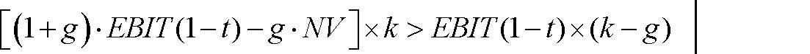

()1(1)(1)()gEBITtgNVkEBITtkg+⋅−−⋅×&gt;−×−⎡⎤⎣⎦

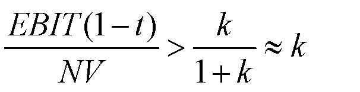

(1)1EBITtkkNVk−&gt;≈+

(增长)TV ﹥TV（W/O增长）

经济增加值（EVA） 

经济增加值（EVA） =息税前利润（ EBIT）×(1－利率t)－贴现率k×净资产（NA） 

直觉判断：当增加净资产的成本能很好的被增加收入的价值 [ EBIT×（1－t）]所补偿时，增长是有利的。 

注意事项： 

- ◆ 经济增加值（EVA）是净现值（NPV）的典型体现（加上一些假设）。 

- ◆ 在资本预算、绩效评估、管理报酬确定中，经济增加值（EVA）可作        

为统一的测度标准。 

- ◆ 假设净资产（NA）和EBIT×（1－t）之间有线性关系 

◆  经济增加值与可持续增长无关： 

☆ 可持续增长率回答了这样一个问题：“不增加杠杆比率，不增加权益资本，我们能增长多快？” 

☆ 可持续增长没有回答增长是好是坏的问题 

经济增加值（EVA）：最起码应知道 

使用经济增加值作为… 

- ◆ 一个简单的方法确定经营是否产生了价值和增长是否提高了价值 

- ◆ 作为制定价值增值目标的一种方法 

应特别小心，经济增加值（EVA）应用于… 

- ◆ 新公司 

- ◆ 处于快速变化商业环境中的公司 

- ◆ 帐面价值不能准确反映替代成本的公司 

现金流贴现分析：利与弊 

优点 

- ◆ 现金流以特定的预测和假设为基础 

- ◆ 能使我们看到战略变化带来的影响 

- ◆ 价值评估同基本面紧密联系 

缺点 

- ◆ 如果你的预测（假设）相当好，现金流就同样好 

- ◆ 可能忘记某些事情 

- ◆ 需要预测管理者的行为（除非你有控制权） 

- ◆ 需要运用理论（如，资本资产定价模型CAPM）测算贴现率，这种测算    

在某些特殊情况下可能不正确或不精确 

乘数 

-   公司价值评估以可比较的公众公司价值为基础 

-   以现金流为基础的价值乘数： 

☆ 公司的市场价值（MV）/收益（E），公司的市场价值（MV）/折旧及摊销前的盈余（EBITDA），公司的市场价值（MV）/自由现金流（FCF） 

-   以现金流为基础的价格乘数： 

☆ 价格（P）/收益（E），价格（P）/折旧及摊销前的盈余（EBITDA），  价格（P）/自由现金流（FCF） 

- ◆ 资产乘数 

☆ 公司的市场价值（MV）/资产的帐面价值（BV），  股票的市场价值（MV）/股票面值（BV） 

步骤 

- ◆ 预期：做同一业务的公司应当有相似的乘数（如，市盈率P/E）。 

- ◆ 第一步：找出有相同业务的公司作为你的评估对象。 

- ◆ 第二步：计算参照公司的市盈率，并为你所评估的公司提出一个市盈   

率预期（如，取参照公司市盈率P/E的平均值）。 

- ◆ 第三步：用你所评估公司的实际净收入乘以预期的市盈率P/E。 

引进乘数出自于什么考虑？ 

- ◆ 假设1：可比较参照公司的实际自由现金流是永续的 

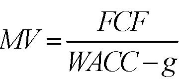

FCFMVWACCg=−

- ◆ 假设2： 

☆ 可比较参照公司具有相同的加权平均资本成本（要求有相似的负债率D/（D＋E）） 

☆ 可比较参照公司具有相似的增长率g 

引进乘数出自于什么考虑？ 

- ◆ 假设1： 

☆ 每股收益E = 股东得到的现金流CF 

☆ 每股收益E是永续的 

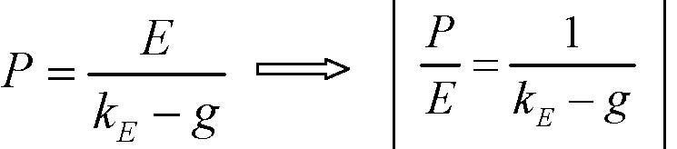

EEPkg=−                

- ◆ 假设2： 

☆ 可比较参照公司有相同的贴现率kE     这要求有相似的杠杆效益！ 

☆ 可比较参照公司具有相似的增长率g 

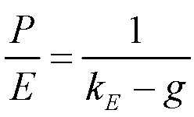

1EPEkg=−

注意事项 

- ◆ 对于无收益或实物资产有限的公司（如，高科技公司）， 

☆ 价格—专利乘数， 

☆ 价格—捐赠乘数， 

☆ 甚至价格—博士乘数！ 

- ◆ 因为它们大体上相近（充其量） 

☆ 人们想核实不同的乘数 

☆ 看是否一些乘数在所有公司中相当稳定 

例子：评估ADI价值 

<Table>

<TR>
<TD>

ADI（1995.11）      息税前利润      税率      净收入     股票面值     帐面债权     # 股份  

</TD>
</TR>
<TR>
<TD>

                    163.6         25%       119.3        656.0          345.7       114.5 

</TD>
</TR>
<TR>
<TD>

</TD>
<TD>

ADI 

</TD>
<TD>

Burr-Brown

</TD>
<TD>

Liner Techno 

</TD>
<TD>

Maxim integrated products 

</TD>
<TD>

Siliconix

</TD>
<TD>

Motorola

</TD>
<TD>

均值（不包括ADI） 

</TD>
</TR>
<TR>
<TD>

股权回报率 

</TD>
<TD>

18.20% 

</TD>
<TD>

16.30% 

</TD>
<TD>

25.50% 

</TD>
<TD>

23.40% 

</TD>
<TD>

26.80% 

</TD>
<TD>

16.10% 

</TD>
<TD>

21.60% 

</TD>
</TR>
<TR>
<TD>

债务/资产 

</TD>
<TD>

34.55 

</TD>
<TD>

29.00% 

</TD>
<TD>

16.90% 

</TD>
<TD>

22.10% 

</TD>
<TD>

56.60% 

</TD>
<TD>

51.50% 

</TD>
<TD>

35.20% 

</TD>
</TR>
<TR>
<TD>

5年平均销售增长 

</TD>
<TD>

14.30% 

</TD>
<TD>

9.90% 

</TD>
<TD>

32.20% 

</TD>
<TD>

43.10% 

</TD>
<TD>

14.00% 

</TD>
<TD>

20.30% 

</TD>
<TD>

23.90% 

</TD>
</TR>
<TR>
<TD>

</TD>
<TD>

</TD>
<TD>

</TD>
<TD>

</TD>
<TD>

</TD>
<TD>

</TD>
<TD>

</TD>
<TD>

</TD>
</TR>
<TR>
<TD>

P/E 

</TD>
<TD>

</TD>
<TD>

14.2 

</TD>
<TD>

25.8 

</TD>
<TD>

30.3 

</TD>
<TD>

15.2 

</TD>
<TD>

18.9 

</TD>
<TD>

20.9 

</TD>
</TR>
<TR>
<TD>

（D+E）/EBIT(1-t)

</TD>
<TD>

</TD>
<TD>

16.3 

</TD>
<TD>

26.6 

</TD>
<TD>

30.3 

</TD>
<TD>

18.3 

</TD>
<TD>

24.2 

</TD>
<TD>

23.1 

</TD>
</TR>
<TR>
<TD>

股票市值/面值 

</TD>
<TD>

</TD>
<TD>

2.3 

</TD>
<TD>

6.6 

</TD>
<TD>

7.1 

</TD>
<TD>

4.1 

</TD>
<TD>

3 

</TD>
<TD>

4.6 

</TD>
</TR>
<TR>
<TD>

公司市值/帐面价值

</TD>
<TD>

</TD>
<TD>

1.9 

</TD>
<TD>

5.6 

</TD>
<TD>

5.7 

</TD>
<TD>

2.3 

</TD>
<TD>

2 

</TD>
<TD>

3.5 

</TD>
</TR>

</Table>

例子（续） 

- ◆ 没有提出合适乘数的专门理论，以下仅仅是个例子，提出它需要经验  

和魄力。 

- ◆ ADI的5年平均销售增长率低于平均水平 

☆ 保守的估计市盈率（P/E）和（D+E）/EBIT(1-t)，意味着 

  · P/E = 20.9×(1－15%) = 17.8 

  ·(D＋E)/ EBIT(1－t) = 23.1×(1－155) = 19.6 

- ◆ ADI的股权回报率低于平均水平 

☆ 保守的估计股票的市值—面值比率和公司的市值—帐面值比率，意味着 

  · 股票M/B = 4.6×(1－15%) = 3.9 

  · 公司M/B = 3.5 ×(1－15%) = 3.0 

例子（续） 

<Table>

<TR>
<TD>

                                   P/E        (D＋E)/ EBIT(1－t)     股票M/B         公司M/B 

</TD>
</TR>
<TR>
<TD>

1)估算的公司比率（X/Y）            17.8              19.6             3.9               3.0 

</TD>
</TR>
<TR>
<TD>

                                   NI             EBIT(1－t)         股票面值       公司帐面价值 

</TD>
</TR>
<TR>
<TD>

2)实际值                          119.3          122.7                656              1001.7 

</TD>
</TR>
<TR>
<TD>

</TD>
<TD>

</TD>
<TD>

</TD>
<TD>

</TD>
<TD>

</TD>
</TR>
<TR>
<TD>

3)公司市值（比率×Y） 

</TD>
<TD>

</TD>
<TD>

2409.2 

</TD>
<TD>

</TD>
<TD>

2980.1 

</TD>
</TR>
<TR>
<TD>

</TD>
<TD>

</TD>
<TD>

</TD>
<TD>

</TD>
<TD>

</TD>
</TR>
<TR>
<TD>

4)股票市值（比率×Y,或公司市值－负债） 

</TD>
<TD>

2119.4 

</TD>
<TD>

2063.5 

</TD>
<TD>

2565 

</TD>
<TD>

2634.4 

</TD>
</TR>
<TR>
<TD>

5)价格（股票市值/# 股份） 

</TD>
<TD>

18.5 

</TD>
<TD>

18 

</TD>
<TD>

22.4 

</TD>
<TD>

23 

</TD>
</TR>

</Table>

相互比较法：利与弊 

利： 

- ◆ 简单＋充分信息 

- ◆ 市场对贴现率、增长率的评价是一致的 

- ◆ 充分利用市场信息 

弊： 

- ◆ 假设公司在成长性、资本成本、商业地位、杠杆效益方面具有相似性 

- ◆ 难以发现真实的公司价值 

- ◆ 难以融入公司特有的信息 

- ◆ 会计上的不同 

- ◆ 如果每个人都运用可参照公司作比较，那谁来做实际上的基础性分析    

呢？  

公司、企业集团的折现 

- ◆ 一个企业集团的价值等于它的组成部分之和吗？ 

   → 计算企业集团的公司价值/资产 

→ 对集团（年度报告中的）每一个行业，计算集团在该行业的所有公司的公司价值/资产中值。 

→ 以集团公司在各行业的资产占每一行业总资产的份额为权数，对上面的价值/资产中值加权求和。 

- ◆ 结果：一般，集团的财富大约比它各个组成部分的总和少12%。 

可能的解释 

- ◆ 企业集团是一种低效的组织形式 

- ◆ 股票市场不能促进企业集团形成 

- ◆ 比较法不是有效的 

互联网股票价格—销售收入比率的分布（2000年3月） 

公司的百分比 

所有股票价格—销售收入比率的分布（2000年3月） 

公司的百分比 

互联网股票和选择的高科技股票 

- （2000.3， 单位：十亿元） 

<Table>

<TR>
<TD>

</TD>
<TD>

互联网

</TD>
<TD>

思科公司

</TD>
<TD>

英特尔公司

</TD>
<TD>

IBM 

</TD>
<TD>

微软公司

</TD>
</TR>
<TR>
<TD>

股权资本市场价值

</TD>
<TD>

651.6

</TD>
<TD>

445.5 

</TD>
<TD>

408 

</TD>
<TD>

194.1

</TD>
<TD>

505.7 

</TD>
</TR>
<TR>
<TD>

股权资本帐面价值

</TD>
<TD>

34.7 

</TD>
<TD>

11.7 

</TD>
<TD>

35.8 

</TD>
<TD>

21.6

</TD>
<TD>

27.5 

</TD>
</TR>
<TR>
<TD>

销售收入 

</TD>
<TD>

12.1 

</TD>
<TD>

12.2 

</TD>
<TD>

29.4 

</TD>
<TD>

87.5

</TD>
<TD>

19.7 

</TD>
</TR>
<TR>
<TD>

总利润 

</TD>
<TD>

4.8 

</TD>
<TD>

8.4 

</TD>
<TD>

20.3 

</TD>
<TD>

38.1

</TD>
<TD>

17.4 

</TD>
</TR>
<TR>
<TD>

净收入 

</TD>
<TD>

-7.2 

</TD>
<TD>

2.1 

</TD>
<TD>

7.3 

</TD>
<TD>

7.7 

</TD>
<TD>

7.8 

</TD>
</TR>
<TR>
<TD>

</TD>
<TD>

</TD>
<TD>

</TD>
<TD>

</TD>
<TD>

</TD>
<TD>

</TD>
</TR>
<TR>
<TD>

股票M/B 

</TD>
<TD>

18.8 

</TD>
<TD>

38.1 

</TD>
<TD>

11.4 

</TD>
<TD>

9 

</TD>
<TD>

18.4 

</TD>
</TR>
<TR>
<TD>

股票市值/销售额 

</TD>
<TD>

53.9 

</TD>
<TD>

36.5 

</TD>
<TD>

13.9 

</TD>
<TD>

2.2 

</TD>
<TD>

25.7 

</TD>
</TR>
<TR>
<TD>

股票市值/利润 

</TD>
<TD>

135.8

</TD>
<TD>

53 

</TD>
<TD>

20.1 

</TD>
<TD>

5.1 

</TD>
<TD>

29.1 

</TD>
</TR>

</Table>

什么样的增长和盈利假设将使我们认为2000年3月对互联网行业的价值评估是合理的？ 

<Table>

<TR>
<TD>

短期增长率 

</TD>
<TD>

高增长的年份 

</TD>
<TD>

价值（十亿元）

</TD>
</TR>
<TR>
<TD>

A组：边际利润 = 5% 

</TD>
</TR>
<TR>
<TD>

20% 

</TD>
<TD>

10 

</TD>
<TD>

7.7 

</TD>
</TR>
<TR>
<TD>

</TD>
<TD>

20 

</TD>
<TD>

30.4 

</TD>
</TR>
<TR>
<TD>

</TD>
<TD>

30 

</TD>
<TD>

58.6 

</TD>
</TR>
<TR>
<TD>

30% 

</TD>
<TD>

10 

</TD>
<TD>

50 

</TD>
</TR>
<TR>
<TD>

</TD>
<TD>

20 

</TD>
<TD>

150.2 

</TD>
</TR>
<TR>
<TD>

</TD>
<TD>

30 

</TD>
<TD>

368 

</TD>
</TR>
<TR>
<TD>

B组：边际利润 = 10% 

</TD>
</TR>
<TR>
<TD>

20% 

</TD>
<TD>

10 

</TD>
<TD>

37.4 

</TD>
</TR>
<TR>
<TD>

</TD>
<TD>

20 

</TD>
<TD>

74.6 

</TD>
</TR>
<TR>
<TD>

</TD>
<TD>

30 

</TD>
<TD>

125.7 

</TD>
</TR>
<TR>
<TD>

30% 

</TD>
<TD>

10 

</TD>
<TD>

122 

</TD>
</TR>
<TR>
<TD>

</TD>
<TD>

20 

</TD>
<TD>

314.1 

</TD>
</TR>
<TR>
<TD>

</TD>
<TD>

30 

</TD>
<TD>

744.5 

</TD>
</TR>

</Table>

   假设：贴现率 = 10%，长期增长率 = 6% 

         Acrobat Distiller 6.0.1 (Windows)

         Microsoft Corporation

         D:20050430061520

         2005-04-30T14:15:50+08:00

         Acrobat PDFMaker 6.0 for Word

         2005-04-30T14:16:22+08:00

         2005-04-30T14:16:22+08:00

         uuid:5950185a-525a-4ba1-b175-3f0fb291b3d6

         uuid:d82e3394-a909-48f1-a175-c232396746b1

               18

         xml

               15

               fxzm

15.402总结 

概览：第二部分—价值评估 

A. 价值评估：自由现金流和风险 

·4.1     讲座：自由现金流价值评估 

·4.3     案例：Ameritrade 

B. 价值评估：加权平均资本成本（WACC）和现值调整（APV） 

·4.8     讲座：加权平均资本成本（WACC）和现值调整（APV）1 

·4.10    讲座：加权平均资本成本（WACC）和现值调整（APV）2 

·4.10    案例：Dixon公司1 

·4.17    案例：Dixon公司2 

·4.24    案例：Diamond化学公司 

C. 项目和公司价值评估 

·4.29   讲座：实物期权 

·5.1    案例：MW石油公司 

·5.6    讲座：公司价值评估 

·5.8    案例：Cooper工业有限公司 

·5.13   案例：Southland公司 

期末考试 

·考试规则 

→不能携带掌上电脑 

→闭卷考试 

→可以携带（2张）小抄纸 

另外：激励 

-  无论任何时候处理一项交易，不管它是在资产负债表中的资产方或者负债方，要确信所有的参与者都有正确的激励 

-  例如： 

- 1、你想要看到一份好的教案。 

- 2、教授会因为他的教课等级而受到鼓励。（因为他不想让教务处长批评） 

- →在教授们递交教案之前，就填写教授等级是一个错误的想法。这样将引发道德风险。 

→类似与Southland公司的案例，不要让关键性的人物轻易地套现。 

                                                                 4 

运用乘数评估价值 

· 公司价值评估以可比较的公众公司价值为基础 

· 以现金流为基础的价值乘数： 

☆ 公司的市场价值（MV）/收益（E），公司的市场价值（MV）/折旧及摊销前的盈余（EBITDA），公司的市场价值（MV）/自由现金流（FCF） 

· 以现金流为基础的价格乘数： 

☆ 价格（P）/收益（E），价格（P）/折旧及摊销前的盈余（EBITDA），价格（P）/自由现金流（FCF） 

· 资产乘数 

☆ 公司的市场价值（MV）/资产的帐面价值（BV），  股票的市场价值（MV）/股票面值（BV） 

步骤 

· 预期：做同一业务的公司应当有相似的乘数（如，市盈率P/E）。 

   →要求相似的风险水平 

   →要求相似的预期增长率 

· 第一步：找出有相同业务的公司作为你的评估对象。 

·  第二步：计算参照公司的市盈率，并为你所评估的公司提出一个市盈率预期（如，取参照公司市盈率P/E的平均值）。 

· 第三步：用你所评估公司的实际净收入乘以预期的市盈率P/E。 

注意事项 

· 对于无收益或实物资产有限的公司（如，高科技公司）， 

⊕价格—专利乘数， 

⊕价格—捐赠乘数， 

⊕甚至价格—博士乘数！ 

· 对于业务，也可以在可比较的业务中应用乘数（如，相似的周转率）。 

· 乘数以权益资本价值（或股票价格，如市盈率P/E）为基础，而不是公司整体价值，忽略了杠杆效应对权益资本成本的影响（或假设所有公司有相似的杠杆效应）→如果公司有不同的杠杆水平，应特别小心。 

相互比较法：利与弊 

利： 

· 用简单的方法融入许多其他价值评估方法的信息 

· 使市场对贴现率、增长率的一致评价具体化。 

· 充分利用市场信息 

· 能提供评估原则，确保你的评估与其他人的评估相一致 

弊： 

· 简单的假设所有公司在成长性、资本成本、商业地位、杠杆效应方面具有相似性 

· 难以融入公司特有的信息。特别是公司经营改变时出现的问题。 

· 会计上的不同。特别是收益和权益资本政策，由于这一原因，存在自由现金流（FCF）乘数和折旧及摊销前的盈余（EBITDA）偏好。 

· 各个公司的帐面价值会因固定资产使用年限的不同而变化。 

· 如果每个人都运用可参照公司作比较，那谁来做实际上的基础性分析呢？ 

价值评估总结 

价值评估工具 

评估方法: 

      ·自由现金流量 

      ·资本成本：加权平均资本成本法与现值调整法 

·实物期权理论 

企业价值评估； 

·现金流贴现分析 

  →预测企业的投资价值与最终价值 

  →经济增加值：何时增长最好？ 

·比较法，乘数 

估算自由现金流量 

·自由现金流（FCF）：如果一个企业是100%股权融资，那么这个企业产生的未来税后现金流就是自由现金流。 

自由现金流量（FCF）＝（１－税率t）×息税前利润(EBIT)＋折旧－资本性支出（CAPX）-净营运资本(NWC)的变化 

自由现金流量（FCF）＝（１－税率t）× 息前税前及折旧前的利润（EBITD）＋税率t×折旧－资本性支出（CAPX）－ 净营运资本(NWC)的变化 

自由现金流量（FCF）＝（１－税率t）× 息税前利润（EBITD）－净资产（NA）的变化 

回顾： 

-  净营运资本=现有资产-现有负债 

-  净资产=资产－现有债务 

应当注意的其他事项：  

· 在遇到特殊情况下公式要进行适当地调整。： 

→充分考虑到经济状况（例如出售Southland公司资产的案例） 

· 使用所有新增现金流 

→忽略沉没成本，计算机会成本，避免“会计幻觉” 

· 不要忘记在项目结束时产生的现金流量 

→如果清算：残值 ×（1－税率）＋ 税率×固定资产 

→如果不清算：收回的营运资本增加值  

· 自由现金流忽视了企业债务的税收规避作用。 

· 我们用加权平均资本法与调整现值法分别计算自由现金流。在这个步骤没有考虑融资效应；否则，你将对它们计算两次！ 

APV—现值调整法 

步骤1：评估100%权益资本的公司，即用kA贴现项目的自由现金流（FCF） 

     kA = rf + βA×市场风险溢价 

步骤2：加上现值（税盾） 

     →仅仅计算税收规避对项目的贡献 

     →运用边际(不是平均)税率 

     →运用预期的（不是最大的）利息支付 

注意：当负债率（D/V）高时，就需要计算预期的财务困境成本 

                                                                    加权平均资本成本（WACC） 

· 方法；适当调整折现率以解决税盾问题。 

· 我们广泛的使用现金流贴现分析法。 

· 目的是为了避免出现第一步的错误 

→最初，加权平均资本成本（除了税率以外）是针对某个特定项目而言的。 

→如果项目与企业的状况相似，我们可以用加权平均资本成本估算企业 

→仅当负债率（D/V）相当稳定时，才能使用加权平均资本成本（WACC） 

嵌入式实物期权 

实物期权 = 面对新信息管理的灵活性 

· 有时，项目的一部分价值在于其嵌入的期权 

· 成为期权的条件 

（1）未来会有新信息出现 

（2）这些信息会影响决策 

· 经常遇到的期权：成长期权，放弃期权、扩张/收缩期权，调整期权，转换期权（投入、产出、工艺等） 

· 期权价值评估 

        布莱克—斯科尔斯（Black-Scholes）模型 

前景分析和决策树 

记住： 

· 现金流贴现分析主要的优点是要求我们讨论价值的来源→最重要的步骤是合理的预测自由现金流。 

· 销售预测：能合理的提供本企业的资源、产业以及竞争对手的信息吗?需要的 

市场份额是多少?。 

· 边际预测：能合理的给出潜在的竞争者 / 进入壁垒及与供应商和消费者的讨价能力吗? 

· 资本性支出以及其他投资预测：是否和销售预测﹑边际预测一致? 

· 终值：是否是合理的? 

· 敏感性分析：哪些变量或假设对评估有决定性意义? 要更多了解这些指标的信息。 

                                                                     记住内容： 

·企业评估的现金流贴现分析法或乘数分析,是相互补充的,而不是互相替代的。 

· 比较法与乘数分析都是重要的,但是 

 →不能说明价值的来源 

   →这些比较是否是客观的。 

· 现金流贴现法(+实物期权理论)可以证明评估是否正确，但是 

→只有当模型所用的各种数据也是正确的。 

→以不完善的模型为基础。 

·在这两种方法之间进行衡量。 

结论 

理财 

· 资产栏（LHS）的大量价值是依靠正确投资决策创造的。 

· 如果没有管理好负债栏（RHS），你将会损失很多价值： 

财务政策应当支持公司的商业战略。 

· 在不了解商业内涵的情况下，你是不能做出完善的财务决策的。 

· 避免“一刀切”的方法 

· 财务活动不能仅仅限于财务人员 

价值评估 

· 要想做出一个正确的商业决策需要进行价值评估。 

· 价值评估包含了一个企业绝大部分信息(做适当的现金流预测和前景分析，等) 

· 同时也需要财务支持 

→贴现率是什么？ 

   →价值评估练习帮助你确定评估价值的主要方法，提供商业战略的信息 

· 避免“一刀切”的方法 

· 商业活动不能仅仅限于商业人士 

         Acrobat Distiller 6.0.1 (Windows)

         xjtu

         D:20050430073626

         2005-04-30T15:36:46+08:00

         Acrobat PDFMaker 6.0 for Word

         2005-04-30T15:37:25+08:00

         2005-04-30T15:37:25+08:00

         uuid:dac00290-21c7-4407-99d4-4dd2e00d0bd0

         uuid:f2687009-47e4-4f4a-8ac6-7eb734615131

               2

         xml

               评估理论的简述

               LiuYuanyuan

价值评估总结 

凯兹瑞纳·理崴伦 

财务理论（二） 

2003.3.14 

期末考试 

·考试规则 

→不能携带掌上电脑 

→闭卷考试 

→可以携带小抄纸  

价值评估工具 

评估方法: 

   ·自由现金流量 

   ·资本成本：加权平均资本成本法与现值调整法 

·实物期权理论 

 企业价值评估； 

·现金流贴现分析 

  →预测公司的投资价值与最终价值 

  →经济增加值：何时增长最好？ 

·比较法，乘数 

估算自由现金流量 

-  自由现金流（FCF）：如果一个公司是100%股权融资，那么这个公司产生的未来税后现金流就是自由现金流。 

自由现金流量（FCF）＝（１－税率t）×息税前利润(EBIT)＋折旧－资本性支出（CAPX）-净营运资本(NWC)的变化 

自由现金流量（FCF）＝（１－税率t）× 息前税前及折旧前的利润（EBITD）＋税率t×折旧－资本性支出（CAPX）－ 净营运资本(NWC)的变化 

自由现金流量（FCF）＝（１－税率t）× 息税前利润（EBITD）－净资产（NA）的变化 

回顾： 

-  净营运资本=现有资产-现有负债 

-  净资产=资产－现有债务 

自由现金流量（FCF）＝（１－税率t）×息税前利润(EBIT)＋折旧－资本性支出（CAPX）-营运资金的增价值(WC) 

· 这个表达式修正了息税前利润(EBIT) ×（１－税率t），它是用来衡量经济中的现金流的指标。 

·资本支出不引起现金流出，但它是→减去资本性支出 

·折旧 

→会引起现金流出，但它不是一→加上（1-税率）×折旧 

→另外，折旧意味着一定量（税率×折旧）的现金流入。 

→加总→加上折旧 

·营运资本有机会成本→减去净营运资金的变化量 

应当注意的其他事项：  

· 在遇到特殊情况下公式要进行适当地调整。： 

→充分考虑到经济状况（例如出售Southland公司资产的案例） 

· 使用所有新增现金流 

→忽略沉没成本，计算机会成本，避免“会计幻觉” 

· 不要忘记在项目结束时产生的现金流量 

 →如果清算：残值 ×（1－税率）＋ 税率×固定资产 

 →如果不清算：收回的营运资本增加值  

· 自由现金流忽视了公司债务的税收规避作用。 

· 我们用加权平均资本法与调整现值法分别计算自由现金流。在这个步骤没有考虑融资效应；否则，你将对它们计算两次！ 

现值调整的步骤一：估算100%权益资本公司 

- 1. 确认可比较的参照公司，即从事同一业务主业清晰的公众公司。   

2．用下式消除每一个可比较参照公司的权益资本贝塔值βA的杠杆效应，以估算其资产贝塔值βA     

AEEEDββ=+

(如果参照公司的债务不是很高（+ 就可以假定债务/公司价值是稳定的）) 

3. 用可比较参照公司的资产贝塔值估算项目的资产贝塔值（例如，用平均值） 

4. 使用评估的资产贝塔值βA来计算全部权益资本的成本KA

KA=rF+βA*市场风险溢价 

- 5. 用KA来贴现项目的自由现金流量 

为什么我们要消除杠杆效应 

·目标企业可能有不同的杠杆效益 

·负债的公司的资产比没有债务的公司的资产风险大，因为债务带来了部分安全的现金流。 

注意：商业风险与财务风险 

·财务风险与财务困境成本没有关系 

·如果有不同的财务杠杆，相似的公司可以有相同的商业风险，但是可能有不同的财务风险。 

·当杠杆效应变大时，资产的风险也在变大（例如βE 变大） 

现值调整的步骤二：增加现值（税盾） 

·如果项目的负债是稳定的，那么 

现值（税盾）=税率×债务×债务成本/债务成本= 税率×债务市值    

·如果项目的负债率是稳定的，那么 

现值（税盾）=税率×债务×债务成本/资本成本 

·如果我们知道债务政策或者还款计划 

→你就能方便的预测出真实的债务水平，用介于债务成本和资本成本之间的贴现率进行折现 

现值调整的步骤二：增加现值（税盾），注意事项 

·只计算与项目有关的债务 

→回顾：如果一个项目100%靠债务来融资,那么发行的一些债务可能是与公司的其他资产相对 

·确定使用的贴现率是预期的贴现率,而不是最大的避税率 

→这一点对于债务比例很高的项目非常重要 

·对于高债务比例的项目,需要计算财务困境的成本 

·回顾：用边际(不是平均)税率 

加权平均资本成本（WACC） 

· 方法；适当调整折现率以解决税盾问题。 

(1)DEDEWACCktkDEDE=−+++

· 我们广泛的使用现金流贴现分析法。 

· 目的是为了避免出现第一步的错误 

→最初，加权平均资本成本（除了税率以外）是针对某个特定项目而言的。 

→如果项目与企业的状况相似，我们可以用加权平均资本成本估算企业 

杠杆比率:债务/(债务+权益资本) 

· 我们需要什么：增加的债务是对特定项目而言的，即，没有项目，就不需要融资 

· 我们要避免出现第一步的错误 

→使用交易杠杆比率 

→使用兼并杠杆比率 

· 对我们的需要来说是不完善的方法 

→如果项目 / 企业是独立的，目标杠杆比率是什么？ 

· 如何计算： 

→从目标企业、商业计划和核实表上获得债务比例 

债务资本的成本：kD

-  我们想要的：如果一个项目是独立项目并且具有上边我们所估计的杠杆比率D/(D+E)，那债务资本成本就是债权人预期的收益率。 

-  对我们的需要来说是不完善的方法：因为项目是独立的（除非债务风险很大），债务资本成本近似于要求的利率 

-  如何计算： 

找那些具有相似财务杠杆的可比较参照公司＋最近的利率 

评估债务级别，核实公司的盈利曲线 

-  我们要避免出现第一步的错误： 

在交易或兼并中使用利息率 

有效边际税率： 

-  公司承担项目的边际税率：t 

用资本资产定价模型（CAPM）估算kE

1. 找出需评估项目的可比较参照公司。 

2. 消除每一个可比较参照公司的权益资本贝塔值βA的杠杆效应（使用其负债率D/(D＋E)： 

3．用可比较参照公司的资产贝塔值βA估算项目的资产贝塔值βA（例如，用平均值） 

4．考虑杠杆效应后估算项目贝塔值βA  （使用项目的D/(D+E)） 

5．使用评估的资产贝塔值βA来计算全部权益资本的成本KA

注释：只要可比较参照公司的债务风险不是很高，其债务率相当稳定，这些消除杠杆效应的公式是可行的。 

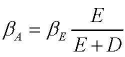

AEEEDββ=+

1EAAEDDEEβββ+⎡⎤==+⎢⎥⎣⎦

KA=rF+βA*市场风险溢价 

注意事项： 

-   当债务比率相当稳定时，加权平均资本成本法才适用 

-   当债务风险比较大或债务比例不稳定时，我们用现值调整法（回忆   

Southland杠杆收购案例） 

-   加权平均资本成本由某一具体项目，而不是公司整体决定（除了税率） 

-   当一个项目与公司是非常相似（因为该公司可能是该项目的比较目标）    

时我们可以用公司的加权平均资本成本 

-   几乎没有企业的加权平均资本成本适用于所有项目（回顾对GE的讨论） 

实物期权理论： 

隐含的期权：  

 · 后续投资 

  · 放弃某个项目的期权 

  · 在投资前“等待”的期权 

  · 扩张或者改变的生产的期权 

关键问题： 

   确认 

   评估 

确认重要的期权 

-   从对项目的描述或者现金流动的方式中寻找线索： 

→“所处阶段”、“战略投资”、“前景” 

  →大额支出很可能是随机的 

-   是否是期权？要看以下两点： 

 (1) 未来会有新信息出现 

 (2) 这些信息会影响决策 

-   研究管理层面临的不确定性； 

 →管理层随着时间推移最想了解的事情是什么？ 

 →他们将如何利用这些信息 

实践问题：简单化 

-   寻找重要的期权： 

  →例如：关闭一个工厂的期权不是很有价值（为什么？） 

  →找到不确定性的主要的来源 

-   把项目分成几个简单的期权 

  →你也想忽略嵌套期权（评估比较困难） 

-   用欧式期权而不是美式期权 

-   忽略“等待”的负面影响（例如，可能进入） 

由项目决定的简化模型为该项目的价值给出了上（或下）限（反之亦然） 

期权定价 

步骤1、 

-   先用简单的现金流贴现分析 

    →假设项目中不存在期权 

    →这个基准点构成项目价值的下限 

步骤2、 

-   期权定价 

     →决策树（动态现金流贴现分析） 

     →期权定价模型（布莱克-思科尔斯模型） 

图示：项目—&gt;看涨期权 

<Table>

<TR>
<TD>

     项目 

</TD>
<TD>

</TD>
<TD>

买入期权 

</TD>
</TR>
<TR>
<TD>

获取资产需要的开支 

</TD>
<TD>

X 

</TD>
<TD>

执行价格 

</TD>
</TR>
<TR>
<TD>

获取的营运资产的价值

</TD>
<TD>

S 

</TD>
<TD>

股票价格（标底资产价格）

</TD>
</TR>
<TR>
<TD>

可以延期决策的时间 

</TD>
<TD>

T 

</TD>
<TD>

到期时间 

</TD>
</TR>
<TR>
<TD>

营运资产的风险 

</TD>
<TD>

</TD>
<TD>

股票收益的方差 

</TD>
</TR>
<TR>
<TD>

货币的时间价值 

</TD>
<TD>

r 

</TD>
<TD>

无风险回报率 

</TD>
</TR>

</Table>

实践问题：波动性是什么？ 

我们需要什么？ 

-   标底资产收益的标准差 

-   在实物期权中，这个标底资产就是项目现金流的现值 

粗略的估算： 

-   有根据的猜测 

→每年20-30%对单个项目来说不是很很高 

-   数据 

    →可比较的交易资产历史收益的波动性 

    →从期权交易价格能计算出隐含的波动性 

-   模拟 

公司价值评估： 

-   终值： 

   →清算 

   →稳定不变，增长，或是永续下降 

-   经济增加值：何时的增长是有价值的？ 

-   比较法，乘数 

终值： 

-   清算：需要被调整（如，如果不能收回所有应收帐款，等） 

残值 ×（1－税率）＋ 税率×固定资产＋营运资本增加额 

-   永续增长：用去年的息税前利润和净资产预测 

终值（TV）=[（1＋增长率）×期息税前利润×（1－税率）－增长率 

（g）×t年的净资产（NA）] ╱（贴现率－增长率） 

-  永续不变： 

终值（TV）= 息税前利润×（1－税率）╱贴现率（k） 

终值，注意事项： 

-   永续增长公式假设息税前利润和净资产之间有线性关系。 

-   不要忘记取终值的现值 

-   预测范围：公司一直相当稳定 

经济增加值 

· 增长是有价值的，当… 

经济增加值（EVA） =息税前利润（ EBIT）×(1－利率t)－贴现率k×净资产（NA）﹥0   

或  息税前利润（ EBIT）×(1－利率t)/ 净资产（NA）﹥k 

· 当增加净资产的成本能很好的被增加收入的价值所补偿时，增长是有利的。 

注意事项： 

·假设息税前利润与加权资本成本率之间有线性关系，加权资本成本无论在现在还是将来都可以很好地测度边际替代成本。 

·经济增加值与可持续增长没有关系 

经济增加值（EVA）：最起码应知道 

用经济增加值作为… 

· 一个简单的方法确定经营是否产生了价值和增长是否提高了价值 

· 作为制定价值增值目标的一种方法 

应特别小心，经济增加值（EVA）应用于… 

· 新公司 

· 处于快速变化商业环境中的公司 

· 帐面价值不能准确反映替代成本的公司 

乘数 

· 公司价值评估以可比较的公众公司价值为基础 

· 以现金流为基础的价值乘数： 

☆ 公司的市场价值（MV）/收益（E），公司的市场价值（MV）/折旧及摊销前的盈余（EBITDA），公司的市场价值（MV）/自由现金流（FCF） 

· 以现金流为基础的价格乘数： 

☆ 价格（P）/收益（E），价格（P）/折旧及摊销前的盈余（EBITDA），  价格（P）/自由现金流（FCF） 

· 资产乘数 

☆ 公司的市场价值（MV）/资产的帐面价值（BV），股票的市场价值（MV）/股票面值（BV） 

引进乘数出自于什么考虑？ 

- ◆ 假设1： 

☆ 每股收益E = 股东得到的现金流CF 

☆ 每股收益E是永续的 

EEPk

g         

- ◆ 假设2： 

☆ 可比较参照公司有相同的贴现率kE    这要求有相似的杠杆效益！ 

☆ 可比较参照公司具有相似的增长率g 

乘数：利与弊 

利： 

· 用简单的方法融入其他价值评估方法的很多信息 

· 具体化了市场的一致评价 

· 提供了现金流贴现评估法的基本原则：问你自己“我如何解释它们之间的差别？” 

· 有时你关心的是市场回报什么，不是基础价值,(例如，风险投资公司会解散) 

弊： 

· 很难融入公司特有的信息 

· 也需要借助会计方法进行比较 

需要思考的其它问题 

控制权： 

· 具有控制性地位，可以影响营运，执行综效，获得它们的（部分）价值 

· 而且，实业家可能会关心“前景” 

单个大股东（如，实业家）： 

· 至少在一段时期可能很集中 

清算： 

· 尤其对私人公司而言 

· 注释：需要考虑IPO计划 

价值评估：结论 

· 现金流贴现分析主要的优点是要求我们讨论价值的来源→最重要的步骤是合理的预测自由现金流。 

· 销售预测：能合理的提供本企业的资源、产业以及竞争对手的信息吗?需要的市场份额是多少?。 

· 边际预测：能合理的给出潜在的竞争者 / 进入壁垒及与供应商和消费者的讨价能力吗? 

· 资本性支出以及其他投资预测：是否和销售预测﹑边际预测一致? 

· 终值：是否是合理的? 

· 敏感性分析：哪些变量或假设对评估有决定性意义? 要更多了解这些指标的信息。 

价值评估：结论 

· 不同的评估方法不是相互排斥的。 

· 比较法与乘数分析都是重要的，但是 

 →不能说明价值的来源， 

 →这些比较是否是客观的。 

· 现金流贴现法(+实物期权理论)可以证明评估是否正确，但是 

→只有当模型所用的各种数据也是正确的。 

→以不完善的模型为基础。 

· 在这两种方法之间进行衡量。 

课程：结论 

我们知道了什么 

· 学会一些基本的工具 

→财务结构 

→现金流贴现分析 

→比较分析与乘数分析 

· 避免以下的误解(列出你认为的) 

→ 

→ 

→等等 

· 养成正确的怀疑观 

理财 

· 资产栏（LHS）的大量价值是依靠正确投资决策创造的。 

· 如果没有管理好负债栏（RHS），你将会损失很多价值： 

 财务政策应当支持公司的商业战略。 

· 在不了解商业内涵的情况下，你是不能做出完善的财务决策的。 

· 避免“一刀切”的方法 

· 财务活动不能仅仅限于财务人员 

价值评估 

· 要想做出一个正确的商业决策需要进行价值评估。 

· 价值评估包含了一个企业绝大部分信息(做适当的现金流预测和前景分析，等) 

· 同时也需要财务支持 

 →贴现率是什么？ 

 →价值评估练习帮助你确定评估价值的主要方法，…… 

· 避免“一刀切”的方法 

· 商业活动不能仅仅限于商业人士 
