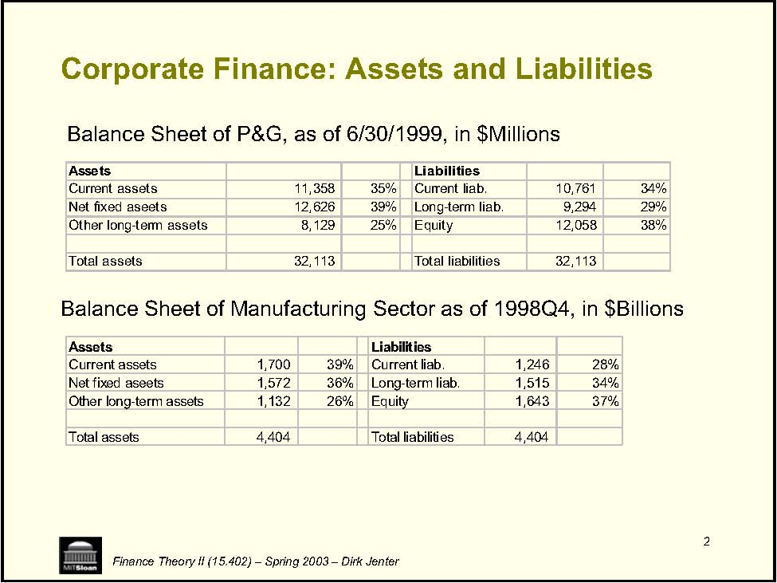
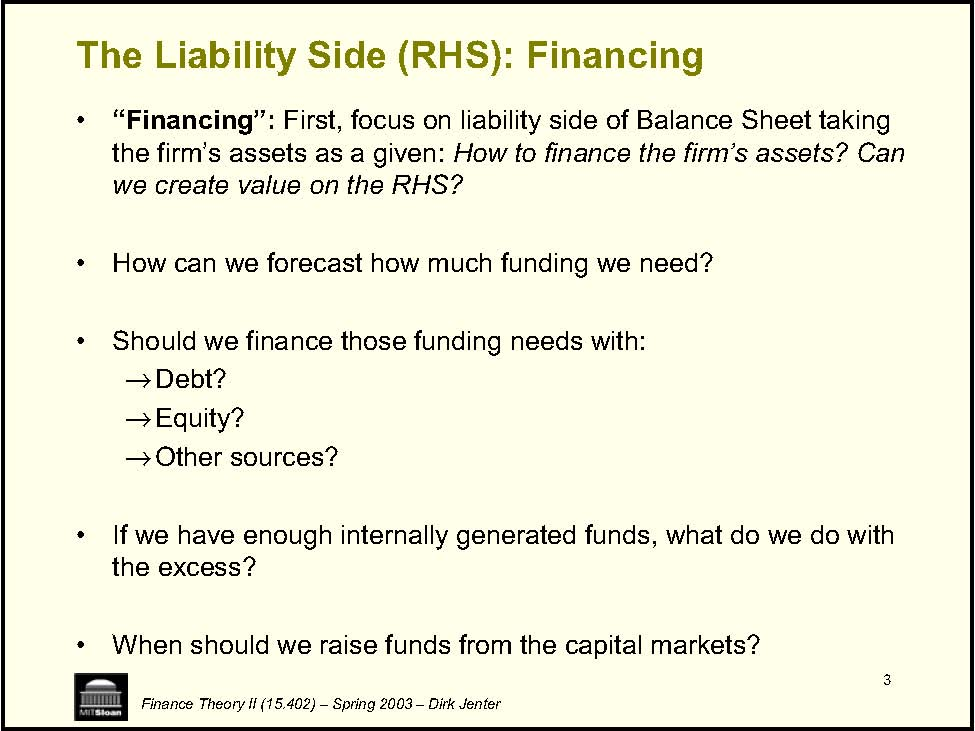
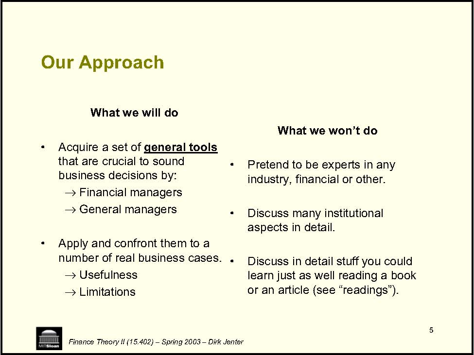
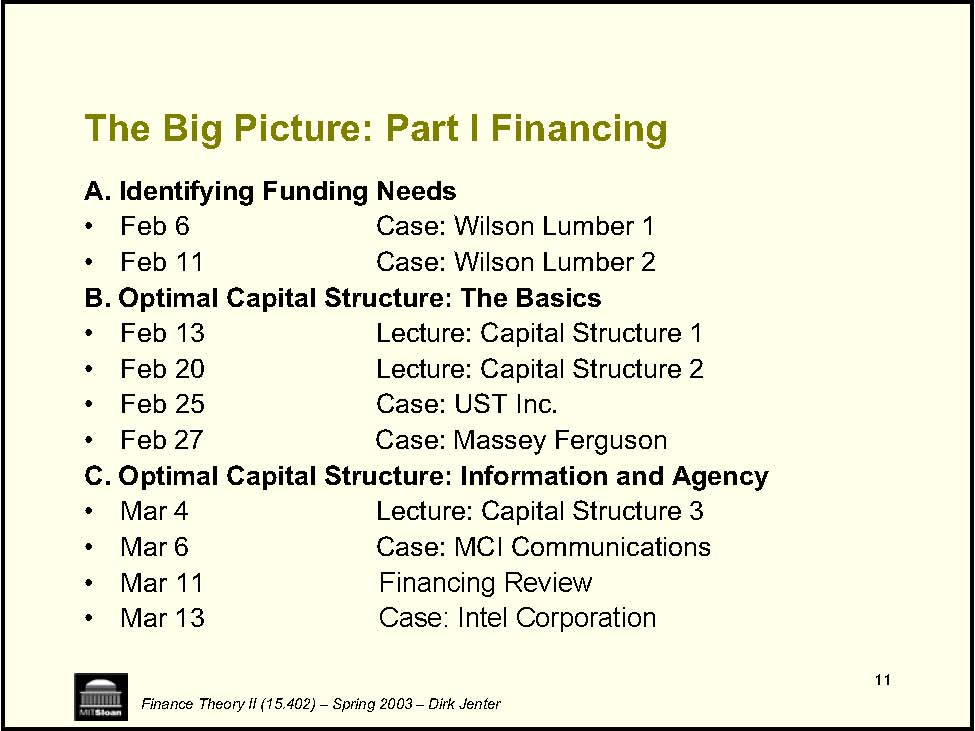
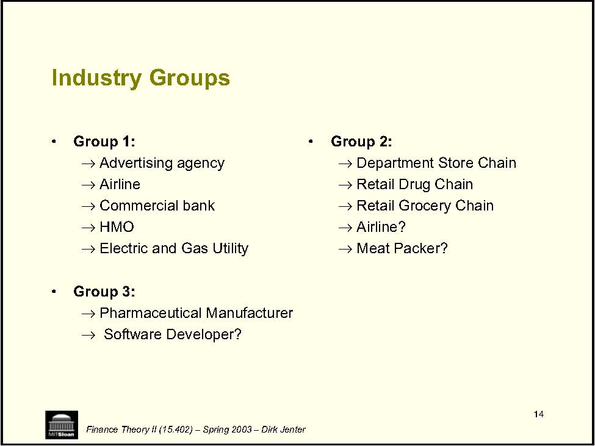
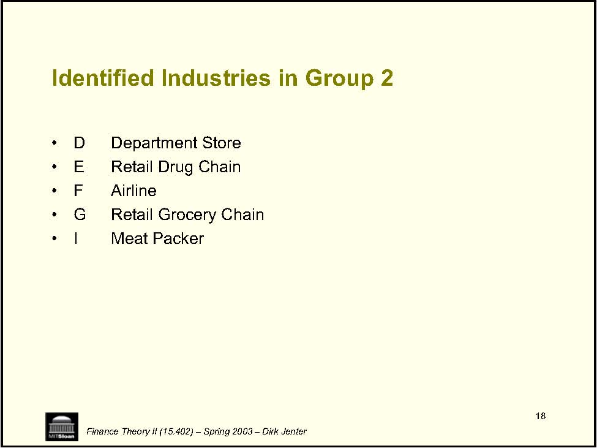
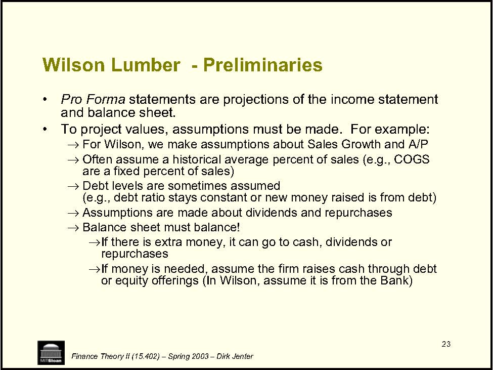
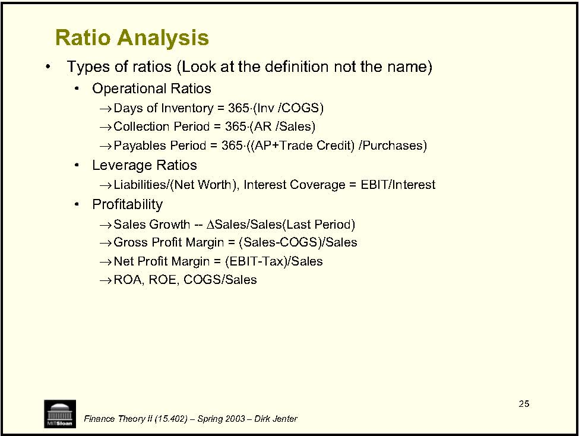

         Acrobat Distiller 6.0 (Windows)

         2004-01-21T10:41:30+05:30

         2004-01-21T10:43:44+05:30

         2004-01-21T10:43:44+05:30

         PScript5.dll Version 5.2

         uuid:770adef7-466d-444a-b682-f5bb627e5985

         uuid:3d040c8e-9c5b-4591-8207-f5fadc702ddb

         xml

               djenter

               Microsoft PowerPoint - LN01(Intro).ppt

CORPORATE FINANCE Finance Theory II (15.402) – Spring 2003 – Dirk Jenter Finance Theory II (15.402) 

2 i l 39% i 36% l 26% i l iCorporate Finance: Assets and Liabilities ab es liab. li l li ili liab. liab. liti Finance Theory II (15.402) – Spring 2003 – Dirk Jenter Assets Liabilities Current assets 11,358 35% Current 10,761 34% Net f xed aseets 12,626 39% Long-term ab. 9,294 29% Other long-term assets 8,129 25% Equity 12,058 38% Tota assets 32,113 Tota ties 32,113 Balance Sheet of P&amp;G, as of 6/30/1999, in $Millions Balance Sheet of Manufacturing Sector as of 1998Q4, in $Billions Assets Liabilities Current assets 1,700 Current 1,246 28% Net f xed aseets 1,572 Long-term 1,515 34% Other ong-term assets 1,132 Equ ty 1,643 37% Tota assets 4,404 Total liab 4,404 

3 • • • → Debt? → Equity? → • • Finance Theory II (15.402) – Spring 2003 – Dirk Jenter The Liability Side (RHS): Financing “Financing”: First, focus on liability side of Balance Sheet taking the firm’s assets as a given: How to finance the firm’s assets? Can we create value on the RHS? How can we forecast how much funding we need? Should we finance those funding needs with: Other sources? If we have enough internally generated funds, what do we do with the excess? When should we raise funds from the capital markets? 

4 The Asset Side (LHS): Valuation • . the LHS. • → → • → → • → → “Valuation”: Finance Theory II (15.402) – Spring 2003 – Dirk Jenter Then focus on how to maximize the value of the assets, taking into account their financing How to create value on How do we evaluate a corporate investment project, e.g., new plant and equipment market entry How should we compare: payoffs today vs. down the road? projects with different risks? How do we value an established company? a start-up? a merger? 

5 Our Approach • i → Fi → • number of real → → Limitations • • • Acquire a set of general tools General managers business cases. Usefulness aspects in detail. Finance Theory II (15.402) – Spring 2003 – Dirk Jenter What we will do that are crucial to sound business decis ons by: nancial managers Apply and confront them to a What we won’t do Pretend to be experts in any industry, financial or other. Discuss many institutional Discuss in detail stuff you could learn just as well reading a book or an article (see “readings”). 

6 • • → , 7th → Higgins, th → • Lectures twice per week Principles of Corporate Finance Professor: Dirk Jenter Finance Theory II (15.402) – Spring 2003 – Dirk Jenter Corporate Finance – Section A Texts:  Brealey &amp; Myers, edition, Analysis for Financial Management, 7 edition, Case and Readings Packet 

7 • • → , 7th → Higgins, th → • Lectures twice per week Principles of Corporate Finance Professor: Katharina Lewellen Finance Theory II (15.402) – Spring 2003 – Dirk Jenter Corporate Finance – Section B Texts:  Brealey &amp; Myers, edition, Analysis for Financial Management, 7 edition, Case and Readings Packet 

8 • → Come prepared to discuss cases → ) → → • ) → → → → → l • • ) Midterm (30%) Final (30% its) Finance Theory II (15.402) – Spring 2003 – Dirk Jenter Course Requirements Class Participation (10%) Quality more important than quantity (! Willingness to participate as important as participation  Introduce background readings into the discussion Case Memoranda (30% A professional memo to the decision maker Teams of three or four people Hand in all write-ups, except two of your choice Careful: Some cases are required! Two pages (p us exhib 

9 Case Memoranda • → → → → → → → → ( → → Clearly written and professional Finance Theory II (15.402) – Spring 2003 – Dirk Jenter Memoranda should be Handed in for all of the cases except two of your choice Two pages (not counting charts and tables), Double spaced – Font of 11 or 12 Teams of three or four students Hand in one copy per team You may not work with students not on your team One &amp; two person teams are discouraged Wilson I &amp; II) count as one case Wilson, MCI, Dixon, and Ameritrade are required Make sure you turn in 10 memoranda! 

10 The Big Picture: • • l • l • • • l • i • • • • i • • • i • • • • • Topics • i i • • • • ) • i i • • • 30% • 30% • 30% • i i 10% Feb 25 Financing Review Case: Intel Corp., 1992 Apr 1 Apr 8 Apr 10 12 il ls lui ies Cases ( Finance Theory II (15.402) – Spring 2003 – Dirk Jenter Part I: FINANCING Feb 6/11 Case: W son Lumber Feb 13 Lecture: Capita Structure 1 Feb 20 Lecture: Capita Structure 2 Case: UST Inc. Feb 27 Case: Massey Ferguson Mar 4 Lecture: Capita Structure 3 Mar 6 Case: MCI Commun cations Mar 11Mar 13Part II: VALUATION Lecture: Free Cash Flows Apr 3 Case: Amer trade Lecture: WACC and APV Case: Dixon Apr 15 Case: Diamond Chem ca Apr 17 Lecture: Real Options Apr 24 Case: MW Petroleum Apr 29 Lecture: Va ng a Company May 1 Case: Cooper Industr May 6 Case: Southland May 8 Hedg ng &amp; R sk Management May 13 Corporate Governance May 15 Course Wrap-up Lectures (12) Text: Brealey and Myers + Higgins Notes on the web before class (+ in class) 10 Case wr te ups: 1-2 page wr te-ups Notes on the web after class (+ in class) Class participation is critical Grades, etc. Case write-ups Midterm (in class) Final (TBA) Class part cipat on 

11 The Big Picture: Part I Financing • • • • • • • • • • Feb 6 Feb 11 Feb 13 Feb 20 Feb 25 Feb 27 Mar 4 Mar 6 Case: MCI Communications Mar 11 Financing Review Mar 13 Case: Intel Corporation Finance Theory II (15.402) – Spring 2003 – Dirk Jenter A. Identifying Funding Needs Case: Wilson Lumber 1 Case: Wilson Lumber 2 B. Optimal Capital Structure: The Basics Lecture: Capital Structure 1 Lecture: Capital Structure 2 Case: UST Inc. Case: Massey Ferguson C. Optimal Capital Structure: Information and Agency Lecture: Capital Structure 3 

The Case of the Unidentified Industries Finance Theory II (15.402) – Spring 2003 – Dirk Jenter 

<Table>
<TR>
<TD>Advertising Agency </TD>
<TD>Airline </TD>
<TD>Commercial Bank </TD>
</TR>
<TR>
<TD>Computer Software Developer </TD>
<TD>Department Store Chain </TD>
<TD>Electric &amp; Gas Utility </TD>
</TR>
<TR>
<TD>Health Maintenance Org. </TD>
<TD>Meat Packer </TD>
<TD>Pharmaceutical Manufacturer </TD>
</TR>
<TR>
<TD>Retail Drug Chain </TD>
<TD>Retail Grocery Chain </TD>

</TR>
</Table>
<Table>
<TR>

<TH>A </TH>
<TH>B </TH>
<TH>C </TH>
<TH>D </TH>
<TH>E </TH>
<TH>F </TH>
<TH>G </TH>
<TH>H </TH>
<TH>I </TH>
<TH>J </TH>
<TH>K </TH>
</TR>
<TR>
<TH>Line </TH>

<TH>Balance Sheet Percentages </TH>

</TR>
<TR>

<TD>#1 </TD>

<TH>Cash and marketable securities </TH>
<TD>5 </TD>
<TD>12 </TD>
<TD>2 </TD>
<TD>1 </TD>
<TD>4 </TD>
<TD>4 </TD>
<TD>3 </TD>
<TD>77 </TD>
<TD>9 </TD>
<TD>67 </TD>
<TD>19 </TD>
</TR>
<TR>

<TD>2 </TD>

<TH>Account receivables </TH>
<TD>85 </TD>
<TD>55 </TD>
<TD>4 </TD>
<TD>15 </TD>
<TD>7 </TD>
<TD>6 </TD>
<TD>4 </TD>
<TD>7 </TD>
<TD>28 </TD>
<TD>9 </TD>
<TD>13 </TD>
</TR>
<TR>

<TD>3 </TD>

<TH>Inventories </TH>
<TD>0 </TD>
<TD>0 </TD>
<TD>1 </TD>
<TD>24 </TD>
<TD>43 </TD>
<TD>0 </TD>
<TD>22 </TD>
<TD>0 </TD>
<TD>13 </TD>
<TD>2 </TD>
<TD>12 </TD>
</TR>
<TR>

<TD>4 </TD>

<TH>Other current assets</TH>
<TD> 1 </TD>
<TD>4 </TD>
<TD>2 </TD>
<TD>2 </TD>
<TD>4 </TD>
<TD>6 </TD>
<TD>2 </TD>
<TD>3 </TD>
<TD>3 </TD>
<TD>2 </TD>
<TD>6 </TD>
</TR>
<TR>

<TD>5 </TD>

<TH>Plant and equipment (net) </TH>
<TD>2 </TD>
<TD>7 </TD>
<TD>77 </TD>
<TD>55 </TD>
<TD>37 </TD>
<TD>71 </TD>
<TD>41 </TD>
<TD>9 </TD>
<TD>35 </TD>
<TD>17 </TD>
<TD>48 </TD>
</TR>
<TR>

<TD>6 </TD>

<TH>Other assets </TH>
<TD>7 </TD>
<TD>23 </TD>
<TD>15</TD>
<TD> 3 </TD>
<TD>5 </TD>
<TD>13 </TD>
<TD>29</TD>
<TD> 4 </TD>
<TD>13</TD>
<TD> 2 </TD>
<TD>1 </TD>
</TR>
<TR>

<TD>7 </TD>

<TH>Total assets </TH>
<TD>100 </TD>
<TD>100 </TD>
<TD>100 </TD>
<TD>100 </TD>
<TD>100 </TD>
<TD>100 </TD>
<TD>100 </TD>
<TD>100 </TD>
<TD>100 </TD>
<TD>100 </TD>
<TD>100 </TD>
</TR>
<TR>

</TR>
<TR>

<TD>8 </TD>

<TH>Notes payable </TH>
<TD>62 </TD>
<TD>3 </TD>
<TD>0 </TD>
<TD>2 </TD>
<TD>0 </TD>
<TD>4 </TD>
<TD>2 </TD>
<TD>0 </TD>
<TD>0 </TD>
<TD>0 </TD>
<TD>7 </TD>
</TR>
<TR>

<TD>9 </TD>

<TH>Accounts payable </TH>
<TD>18</TD>
<TD> 63 </TD>
<TD>3 </TD>
<TD>17 </TD>
<TD>18 </TD>
<TD>5 </TD>
<TD>13 </TD>
<TD>32 </TD>
<TD>15 </TD>
<TD>6 </TD>
<TD>5 </TD>
</TR>
<TR>

<TD>10 </TD>

<TH>Accrued taxes </TH>
<TD>2 </TD>
<TD>2 </TD>
<TD>0 </TD>
<TD>1 </TD>
<TD>1 </TD>
<TD>0 </TD>
<TD>1 </TD>
<TD>3 </TD>
<TD>6 </TD>
<TD>6 </TD>
<TD>2 </TD>
</TR>
<TR>

<TD>11</TD>

<TH> Other current liabilities </TH>
<TD>0 </TD>
<TD>0 </TD>
<TD>4 </TD>
<TD>9 </TD>
<TD>17 </TD>
<TD>17 </TD>
<TD>12 </TD>
<TD>2 </TD>
<TD>13 </TD>
<TD>5 </TD>
<TD>8 </TD>
</TR>
<TR>

<TD>12</TD>

<TH> Long-term debt </TH>
<TD>7 </TD>
<TD>6 </TD>
<TD>29 </TD>
<TD>38 </TD>
<TD>0 </TD>
<TD>40 </TD>
<TD>29 </TD>
<TD>0 </TD>
<TD>19 </TD>
<TD>0 </TD>
<TD>15 </TD>
</TR>
<TR>

<TD>13 </TD>

<TH>Preferred stock </TH>
<TD>4 </TD>
<TD>8 </TD>
<TD>21</TD>
<TD> 5 </TD>
<TD>10 </TD>
<TD>17 </TD>
<TD>14</TD>
<TD> 1 </TD>
<TD>6 </TD>
<TD>0 </TD>
<TD>1 </TD>
</TR>
<TR>

<TD>14 </TD>

<TH>Other liabilities </TH>
<TD>2 </TD>
<TD>0 </TD>
<TD>5 </TD>
<TD>3 </TD>
<TD>0 </TD>
<TD>0 </TD>
<TD>0 </TD>
<TD>0 </TD>
<TD>0 </TD>
<TD>0 </TD>
<TD>0 </TD>
</TR>
<TR>

<TD>15 </TD>

<TH>Capital stock and capital surplus </TH>
<TD>2 </TD>
<TD>10 </TD>
<TD>11 </TD>
<TD>1 </TD>
<TD>3 </TD>
<TD>12 </TD>
<TD>5 </TD>
<TD>11 </TD>
<TD>24 </TD>
<TD>28 </TD>
<TD>16 </TD>
</TR>
<TR>

<TD>16 </TD>

<TH>Retained earnings </TH>
<TD>4 </TD>
<TD>7 </TD>
<TD>28</TD>
<TD> 23 </TD>
<TD>51 </TD>
<TD>5 </TD>
<TD>24 </TD>
<TD>51 </TD>
<TD>18 </TD>
<TD>55 </TD>
<TD>46 </TD>
</TR>
<TR>

<TD>17 </TD>

<TH>Total liabilities and stockholder equity </TH>
<TD>100 </TD>
<TD>100</TD>
<TD> 100</TD>
<TD> 100 </TD>
<TD>100</TD>
<TD> 100 </TD>
<TD>100</TD>
<TD> 100 </TD>
<TD>100</TD>
<TD> 100 </TD>
<TD>100 </TD>
</TR>
<TR>

</TR>
<TR>

<TH>Selected Financial Data </TH>

</TR>
<TR>

<TD>18 </TD>

<TH>Current assets/current liabilities </TH>
<TD>1.11</TD>
<TD> 1.03 </TD>
<TD>1.31</TD>
<TD> 1.46 </TD>
<TD>1.59</TD>
<TD> 0.63 </TD>
<TD>1.1 </TD>
<TD>2.35 </TD>
<TD>1.58 </TD>
<TD>4.72 </TD>
<TD>2.31 </TD>
</TR>
<TR>

<TD>19 </TD>

<TH>Cash, marketable securities and accounts receivable/current liabilities </TH>
<TD>1.1 </TD>
<TD>0.97 </TD>
<TD>0.98</TD>
<TD> 1.4 </TD>
<TD>1.49</TD>
<TD> 0.4 </TD>
<TD>1.04 </TD>
<TD>2.28 </TD>
<TD>1.5 </TD>
<TD>4.59 </TD>
<TD>2.03 </TD>
</TR>
<TR>

<TD>20 </TD>

<TH>Inventory turnover (X) </TH>
<TH>NA </TH>
<TH>NA </TH>
<TD>16.7</TD>
<TD> 5.6 </TD>
<TD>5.2 </TD>
<TH>NA </TH>
<TD>8.6 </TD>
<TH>NA </TH>
<TD>47.6 </TD>
<TD>7.5 </TD>
<TD>2 </TD>
</TR>
<TR>

<TD>21 </TD>

<TH>Receivables collection period </TH>
<TD>3,278 </TD>
<TD>381 </TD>
<TD>30 </TD>
<TD>31 </TD>
<TD>8 </TD>
<TD>27 </TD>
<TD>6 </TD>
<TD>13 </TD>
<TD>16 </TD>
<TD>37 </TD>
<TD>74 </TD>
</TR>
<TR>

<TD>22 </TD>

<TH>Total debt/total assets </TH>
<TD>0.69 </TD>
<TD>0.1 </TD>
<TD>0.29 </TD>
<TD>0.4 </TD>
<TD>0 </TD>
<TD>0.44 </TD>
<TD>0.31 </TD>
<TD>0 </TD>
<TD>0.19 </TD>
<TD>0 </TD>
<TD>0.22 </TD>
</TR>
<TR>

<TD>23 </TD>

<TH>Long-term debt/capitalization </TH>
<TD>0.09 </TD>
<TD>0.24 </TD>
<TD>0.4 </TD>
<TD>0.57 </TD>
<TD>0 </TD>
<TD>0.66 </TD>
<TD>0.48</TD>
<TD> 0 </TD>
<TD>0.32 </TD>
<TD>0 </TD>
<TD>0.18 </TD>
</TR>
<TR>

<TD>24 </TD>

<TH>Net sales/total assets </TH>
<TD>0.095 </TD>
<TD>0.523 </TD>
<TD>0.464 </TD>
<TD>1.822 </TD>
<TD>3.175 </TD>
<TD>0.828 </TD>
<TD>2.61</TD>
<TD> 2.032 </TD>
<TD>6.473 </TD>
<TD>0.867 </TD>
<TD>0.643 </TD>
</TR>
<TR>

<TD>25 </TD>

<TH>Net profit/net sales </TH>
<TD>0.141 </TD>
<TD>0.047 </TD>
<TD>0.115 </TD>
<TD>0.02 </TD>
<TD>0.031 </TD>
<TD>0.014 </TD>
<TD>0.019 </TD>
<TD>0.131 </TD>
<TD>0.015 </TD>
<TD>0.247 </TD>
<TD>0.106 </TD>
</TR>
<TR>

<TD>26 </TD>

<TH>Net profit/total assets </TH>
<TD>0.013 </TD>
<TD>0.025 </TD>
<TD>0.053 </TD>
<TD>0.037 </TD>
<TD>0.097 </TD>
<TD>0.012 </TD>
<TD>0.049 </TD>
<TD>0.267 </TD>
<TD>0.098 </TD>
<TD>0.214 </TD>
<TD>0.068 </TD>
</TR>
<TR>

<TD>27 </TD>

<TH>Total assets/net worth </TH>
<TD>14.1</TD>
<TD> 5.84</TD>
<TD> 2.31</TD>
<TD> 3.61</TD>
<TD> 1.85</TD>
<TD> 5.77 </TD>
<TD>3.43</TD>
<TD> 1.62 </TD>
<TD>2.39</TD>
<TD> 1.21 </TD>
<TD>1.61 </TD>
</TR>
<TR>

<TD>28 </TD>

<TH>Net profit/net worth </TH>
<TD>0.189 </TD>
<TD>0.144 </TD>
<TD>0.123 </TD>
<TD>0.134 </TD>
<TD>0.179 </TD>
<TD>0.067 </TD>
<TD>0.168 </TD>
<TD>0.432 </TD>
<TD>0.234 </TD>
<TD>0.258 </TD>
<TD>0.11 </TD>
</TR>
</Table>

13 

Finance Theory II (15.402) – Spring 2003 – Dirk Jenter 

14 • → → → Commercial bank → HMO → • → l Manufacturer → • → in → → → → Meat Packer? Group 1: Airline Group 3: Pharmaceutica Group 2: Department Store Cha Finance Theory II (15.402) – Spring 2003 – Dirk Jenter Industry Groups Advertising agency Electric and Gas Utility Software Developer? Retail Drug Chain Retail Grocery Chain Airline? 

# Group 1 

- Advertising Agency 

- Airline 

- Commercial Bank 

- HMO 

- Utility 

<Table>
<TR>

<TH>A </TH>
<TH>B </TH>
<TH>C </TH>
<TH>F </TH>
<TH>H </TH>
</TR>
<TR>
<TH>Line </TH>

<TH>Balance Sheet Percentages </TH>

</TR>
<TR>

<TD>#1 </TD>

<TH>Cash and marketable securities </TH>
<TD>5 </TD>
<TD>12 </TD>
<TD>2 </TD>
<TD>4 </TD>
<TD>77 </TD>
</TR>
<TR>

<TD>2 </TD>

<TH>Account receivables </TH>
<TD>85 </TD>
<TD>55 </TD>
<TD>4 </TD>
<TD>6 </TD>
<TD>7 </TD>
</TR>
<TR>

<TD>3 </TD>

<TH>Inventories </TH>
<TD>0 </TD>
<TD>0 </TD>
<TD>1 </TD>
<TD>0 </TD>
<TD>0 </TD>
</TR>
<TR>

<TD>4 </TD>

<TH>Other current assets </TH>
<TD>1 </TD>
<TD>4 </TD>
<TD>2 </TD>
<TD>6 </TD>
<TD>3 </TD>
</TR>
<TR>

<TD>5 </TD>

<TH>Plant and equipment (net) </TH>
<TD>2 </TD>
<TD>7 </TD>
<TD>77 </TD>
<TD>71 </TD>
<TD>9 </TD>
</TR>
<TR>

<TD>6 </TD>

<TH>Other assets </TH>
<TD>7 </TD>
<TD>23 </TD>
<TD>15</TD>
<TD> 13 </TD>
<TD>4 </TD>
</TR>
<TR>

<TD>7</TD>

<TH>    Total assets </TH>
<TD>100 </TD>
<TD>100 </TD>
<TD>100 </TD>
<TD>100 </TD>
<TD>100 </TD>
</TR>
<TR>

</TR>
<TR>

<TD>8 </TD>

<TH>Notes payable </TH>
<TD>62 </TD>
<TD>3 </TD>
<TD>0 </TD>
<TD>4 </TD>
<TD>0 </TD>
</TR>
<TR>

<TD>9 </TD>

<TH>Accounts payable </TH>
<TD>18 </TD>
<TD>63 </TD>
<TD>3 </TD>
<TD>5 </TD>
<TD>32 </TD>
</TR>
<TR>

<TD>10 </TD>

<TH>Accrued taxes </TH>
<TD>2 </TD>
<TD>2 </TD>
<TD>0 </TD>
<TD>0 </TD>
<TD>3 </TD>
</TR>
<TR>

<TD>11 </TD>

<TH>Other current liabilities </TH>
<TD>0 </TD>
<TD>0 </TD>
<TD>4 </TD>
<TD>17 </TD>
<TD>2 </TD>
</TR>
<TR>

<TD>12 </TD>

<TH>Long-term debt </TH>
<TD>7 </TD>
<TD>6 </TD>
<TD>29 </TD>
<TD>40 </TD>
<TD>0 </TD>
</TR>
<TR>

<TD>13 </TD>

<TH>Preferred stock </TH>
<TD>4 </TD>
<TD>8 </TD>
<TD>21 </TD>
<TD>17 </TD>
<TD>1 </TD>
</TR>
<TR>

<TD>14</TD>

<TH> Other liabilities </TH>
<TD>2 </TD>
<TD>0 </TD>
<TD>5 </TD>
<TD>0 </TD>
<TD>0 </TD>
</TR>
<TR>

<TD>15 </TD>

<TH>Capital stock and capital surplus </TH>
<TD>2 </TD>
<TD>10 </TD>
<TD>11 </TD>
<TD>12 </TD>
<TD>11 </TD>
</TR>
<TR>

<TD>16 </TD>

<TH>Retained earnings </TH>
<TD>4 </TD>
<TD>7 </TD>
<TD>28 </TD>
<TD>5 </TD>
<TD>51 </TD>
</TR>
<TR>

<TD>17</TD>

<TH>    Total liabilities and stockholder equity </TH>
<TD>100 </TD>
<TD>100 </TD>
<TD>100 </TD>
<TD>100 </TD>
<TD>100 </TD>
</TR>
<TR>

</TR>
<TR>

<TH>Selected Financial Data </TH>

</TR>
<TR>

<TD>18 </TD>

<TH>Current assets/current liabilities </TH>
<TD>1.11 </TD>
<TD>1.03 </TD>
<TD>1.31 </TD>
<TD>0.63 </TD>
<TD>2.35 </TD>
</TR>
<TR>

<TD>19 </TD>

<TH>Cash, marketable securities and accounts receivable/current liabilities </TH>
<TD>1.1 </TD>
<TD>0.97 </TD>
<TD>0.98 </TD>
<TD>0.4 </TD>
<TD>2.28 </TD>
</TR>
<TR>

<TD>20 </TD>

<TH>Inventory turnover (X) </TH>
<TH>NA </TH>
<TH>NA </TH>
<TD>16.7 </TD>
<TH>NA </TH>
<TH>NA </TH>
</TR>
<TR>

<TD>21 </TD>

<TH>Receivables collection period </TH>
<TD>3,278 </TD>
<TD>381 </TD>
<TD>30 </TD>
<TD>27 </TD>
<TD>13 </TD>
</TR>
<TR>

<TD>22 </TD>

<TH>Total debt/total assets </TH>
<TD>0.69 </TD>
<TD>0.1 </TD>
<TD>0.29 </TD>
<TD>0.44 </TD>
<TD>0 </TD>
</TR>
<TR>

<TD>23 </TD>

<TH>Long-term debt/capitalization </TH>
<TD>0.09 </TD>
<TD>0.24 </TD>
<TD>0.4 </TD>
<TD>0.66 </TD>
<TD>0 </TD>
</TR>
<TR>

<TD>24 </TD>

<TH>Net sales/total assets </TH>
<TD>0.095</TD>
<TD> 0.523</TD>
<TD> 0.464 </TD>
<TD>0.828 </TD>
<TD>2.032 </TD>
</TR>
<TR>

<TD>25 </TD>

<TH>Net profit/net sales </TH>
<TD>0.141</TD>
<TD> 0.047</TD>
<TD> 0.115 </TD>
<TD>0.014 </TD>
<TD>0.131 </TD>
</TR>
<TR>

<TD>26 </TD>

<TH>Net profit/total assets </TH>
<TD>0.013</TD>
<TD> 0.025</TD>
<TD> 0.053 </TD>
<TD>0.012 </TD>
<TD>0.267 </TD>
</TR>
<TR>

<TD>27 </TD>

<TH>Total assets/net worth </TH>
<TD>14.1 </TD>
<TD>5.84 </TD>
<TD>2.31 </TD>
<TD>5.77 </TD>
<TD>1.62 </TD>
</TR>
<TR>

<TD>28 </TD>

<TH>Net profit/net worth </TH>
<TD>0.189</TD>
<TD> 0.144</TD>
<TD> 0.123 </TD>
<TD>0.067 </TD>
<TD>0.432 </TD>
</TR>
</Table>

15 

Finance Theory II (15.402) – Spring 2003 – Dirk Jenter 

16 Identified Industries in Group 1 • A • B • C • F Airline • H ) Finance Theory II (15.402) – Spring 2003 – Dirk Jenter Commercial Bank Advertising Agency Electric &amp; Gas Utility Health Maintenance Organization (H.M.O. 

## Group 2 

- Dpt. Store 

- Drug Chain 

- Grocery Chain 

- Airline 

- Meat Packer 

17 

Finance Theory II (15.402) – Spring 2003 – Dirk Jenter 

<Table>
<TR>

<TH>D </TH>
<TH>E </TH>
<TH>F </TH>
<TH>G </TH>
<TH>I </TH>
</TR>
<TR>

<TH>Balance Sheet Percentages </TH>

</TR>
<TR>

<TH>Cash and marketable securities </TH>
<TD>1 </TD>
<TD>4 </TD>
<TD>4 </TD>
<TD>3 </TD>
<TD>9 </TD>
</TR>
<TR>

<TH>Account receivables </TH>
<TD>15 </TD>
<TD>7 </TD>
<TD>6 </TD>
<TD>4 </TD>
<TD>28 </TD>
</TR>
<TR>

<TH>Inventories </TH>
<TD>24 </TD>
<TD>43 </TD>
<TD>0 </TD>
<TD>22 </TD>
<TD>13 </TD>
</TR>
<TR>

<TH>Other current assets </TH>
<TD>2 </TD>
<TD>4 </TD>
<TD>6 </TD>
<TD>2 </TD>
<TD>3 </TD>
</TR>
<TR>

<TH>Plant and equipment (net) </TH>
<TD>55 </TD>
<TD>37 </TD>
<TD>71 </TD>
<TD>41 </TD>
<TD>35 </TD>
</TR>
<TR>

<TH>Other assets </TH>
<TD>3 </TD>
<TD>5 </TD>
<TD>13 </TD>
<TD>29 </TD>
<TD>13 </TD>
</TR>
<TR>

<TH>Total assets </TH>
<TD>100</TD>
<TD> 100</TD>
<TD> 100 </TD>
<TD>100 </TD>
<TD>100 </TD>
</TR>
<TR>

</TR>
<TR>

<TH>Notes payable </TH>
<TD>2 </TD>
<TD>0 </TD>
<TD>4 </TD>
<TD>2 </TD>
<TD>0 </TD>
</TR>
<TR>

<TH>Accounts payable </TH>
<TD>17 </TD>
<TD>18 </TD>
<TD>5 </TD>
<TD>13 </TD>
<TD>15 </TD>
</TR>
<TR>

<TH>Accrued taxes </TH>
<TD>1 </TD>
<TD>1 </TD>
<TD>0 </TD>
<TD>1 </TD>
<TD>6 </TD>
</TR>
<TR>

<TH>Other current liabilities </TH>
<TD>9 </TD>
<TD>17 </TD>
<TD>17 </TD>
<TD>12 </TD>
<TD>13 </TD>
</TR>
<TR>

<TH>Long-term debt </TH>
<TD>38 </TD>
<TD>0 </TD>
<TD>40 </TD>
<TD>29 </TD>
<TD>19 </TD>
</TR>
<TR>

<TH>Preferred stock </TH>
<TD>5 </TD>
<TD>10 </TD>
<TD>17 </TD>
<TD>14 </TD>
<TD>6 </TD>
</TR>
<TR>

<TH>Other liabilities </TH>
<TD>3 </TD>
<TD>0 </TD>
<TD>0 </TD>
<TD>0 </TD>
<TD>0 </TD>
</TR>
<TR>

<TH>Capital stock and capital surplus </TH>
<TD>1 </TD>
<TD>3 </TD>
<TD>12 </TD>
<TD>5 </TD>
<TD>24 </TD>
</TR>
<TR>

<TH>Retained earnings </TH>
<TD>23 </TD>
<TD>51 </TD>
<TD>5 </TD>
<TD>24 </TD>
<TD>18 </TD>
</TR>
<TR>

<TH>Total liabilities and stockholder equity </TH>
<TD>100 </TD>
<TD>100 </TD>
<TD>100 </TD>
<TD>100 </TD>
<TD>100 </TD>
</TR>
<TR>

</TR>
<TR>

<TH>Selected Financial Data </TH>

</TR>
<TR>

<TH>Current assets/current liabilities </TH>
<TD>1.46 </TD>
<TD>1.59 </TD>
<TD>0.63 </TD>
<TD>1.1 </TD>
<TD>1.58 </TD>
</TR>
<TR>

<TH>Cash, marketable securities and accounts receivable/current liabilities </TH>
<TD>1.4 </TD>
<TD>1.49 </TD>
<TD>0.4 </TD>
<TD>1.04 </TD>
<TD>1.5 </TD>
</TR>
<TR>

<TH>Inventory turnover (X) </TH>
<TD>5.6 </TD>
<TD>5.2 </TD>
<TH>NA </TH>
<TD>8.6 </TD>
<TD>47.6 </TD>
</TR>
<TR>

<TH>Receivables collection period </TH>
<TD>31 </TD>
<TD>8 </TD>
<TD>27 </TD>
<TD>6 </TD>
<TD>16 </TD>
</TR>
<TR>

<TH>Total debt/total assets </TH>
<TD>0.4 </TD>
<TD>0 </TD>
<TD>0.44 </TD>
<TD>0.31 </TD>
<TD>0.19 </TD>
</TR>
<TR>

<TH>Long-term debt/capitalization </TH>
<TD>0.57 </TD>
<TD>0 </TD>
<TD>0.66 </TD>
<TD>0.48</TD>
<TD> 0.32 </TD>
</TR>
<TR>

<TH>Net sales/total assets </TH>
<TD>1.822 </TD>
<TD>3.175 </TD>
<TD>0.828 </TD>
<TD>2.61 </TD>
<TD>6.473 </TD>
</TR>
<TR>

<TH>Net profit/net sales </TH>
<TD>0.02 </TD>
<TD>0.031 </TD>
<TD>0.014 </TD>
<TD>0.019 </TD>
<TD>0.015 </TD>
</TR>
<TR>

<TH>Net profit/total assets </TH>
<TD>0.037 </TD>
<TD>0.097 </TD>
<TD>0.012 </TD>
<TD>0.049 </TD>
<TD>0.098 </TD>
</TR>
<TR>

<TH>Total assets/net worth </TH>
<TD>3.61 </TD>
<TD>1.85 </TD>
<TD>5.77 </TD>
<TD>3.43 </TD>
<TD>2.39 </TD>
</TR>
<TR>

<TH>Net profit/net worth </TH>
<TD>0.134 </TD>
<TD>0.179 </TD>
<TD>0.067 </TD>
<TD>0.168 </TD>
<TD>0.234 </TD>
</TR>
</Table>

18 Identified Industries in Group 2 • D • E • F Airline • G in • I Meat Packer Finance Theory II (15.402) – Spring 2003 – Dirk Jenter Department Store Retail Drug Chain Retail Grocery Cha 

## Group 3 

- Pharmaceutical Manufacturer 

- Software Developer 

<Table>
<TR>

<TD>J </TD>
<TD>K </TD>
</TR>
<TR>
<TD>Line </TD>

<TD>Balance Sheet Percentages </TD>

</TR>
<TR>

<TD>#1 </TD>

<TD>Cash and marketable securities </TD>
<TD>67 </TD>
<TD>19 </TD>
</TR>
<TR>

<TD>2 </TD>

<TD>Account receivables </TD>
<TD>9 </TD>
<TD>13 </TD>
</TR>
<TR>

<TD>3 </TD>

<TD>Inventories</TD>
<TD> 2 </TD>
<TD>12 </TD>
</TR>
<TR>

<TD>4 </TD>

<TD>Other current assets </TD>
<TD>2 </TD>
<TD>6 </TD>
</TR>
<TR>

<TD>5 </TD>

<TD>Plant and equipment (net) </TD>
<TD>17 </TD>
<TD>48 </TD>
</TR>
<TR>

<TD>6 </TD>

<TD>Other assets </TD>
<TD>2 </TD>
<TD>1 </TD>
</TR>
<TR>

<TD>7 </TD>

<TD>Total assets </TD>
<TD>100 </TD>
<TD>100 </TD>
</TR>
<TR>

</TR>
<TR>

<TD>8 </TD>

<TD>Notes payable </TD>
<TD>0 </TD>
<TD>7 </TD>
</TR>
<TR>

<TD>9 </TD>

<TD>Accounts payable </TD>
<TD>6 </TD>
<TD>5 </TD>
</TR>
<TR>

<TD>10 </TD>

<TD>Accrued taxes </TD>
<TD>6 </TD>
<TD>2 </TD>
</TR>
<TR>

<TD>11 </TD>

<TD>Other current liabilities </TD>
<TD>5 </TD>
<TD>8 </TD>
</TR>
<TR>

<TD>12 </TD>

<TD>Long-term debt </TD>
<TD>0 </TD>
<TD>15 </TD>
</TR>
<TR>

<TD>13 </TD>

<TD>Preferred stock </TD>
<TD>0 </TD>
<TD>1 </TD>
</TR>
<TR>

<TD>14 </TD>

<TD>Other liabilities </TD>
<TD>0 </TD>
<TD>0 </TD>
</TR>
<TR>

<TD>15 </TD>

<TD>Capital stock and capital surplus </TD>
<TD>28 </TD>
<TD>16 </TD>
</TR>
<TR>

<TD>16 </TD>

<TD>Retained earnings </TD>
<TD>55 </TD>
<TD>46 </TD>
</TR>
<TR>

<TD>17 </TD>

<TD>Total liabilities and stockholder equity </TD>
<TD>100 </TD>
<TD>100 </TD>
</TR>
<TR>

</TR>
<TR>

<TD>Selected Financial Data </TD>

</TR>
<TR>

<TD>18 </TD>

<TD>Current assets/current liabilities </TD>
<TD>4.72 </TD>
<TD>2.31 </TD>
</TR>
<TR>

<TD>19 </TD>

<TD>Cash, marketable securities and accounts receivable/current liabilities </TD>
<TD>4.59 </TD>
<TD>2.03 </TD>
</TR>
<TR>

<TD>20 </TD>

<TD>Inventory turnover (X) </TD>
<TD>7.5 </TD>
<TD>2 </TD>
</TR>
<TR>

<TD>21 </TD>

<TD>Receivables collection period </TD>
<TD>37 </TD>
<TD>74 </TD>
</TR>
<TR>

<TD>22 </TD>

<TD>Total debt/total assets </TD>
<TD>0 </TD>
<TD>0.22 </TD>
</TR>
<TR>

<TD>23 </TD>

<TD>Long-term debt/capitalization </TD>
<TD>0 </TD>
<TD>0.18 </TD>
</TR>
<TR>

<TD>24</TD>

<TD> Net sales/total assets </TD>
<TD>0.867 </TD>
<TD>0.643 </TD>
</TR>
<TR>

<TD>25</TD>

<TD> Net profit/net sales </TD>
<TD>0.247 </TD>
<TD>0.106 </TD>
</TR>
<TR>

<TD>26 </TD>

<TD>Net profit/total assets </TD>
<TD>0.214 </TD>
<TD>0.068 </TD>
</TR>
<TR>

<TD>27 </TD>

<TD>Total assets/net worth </TD>
<TD>1.21 </TD>
<TD>1.61 </TD>
</TR>
<TR>

<TD>28 </TD>

<TD>Net profit/net worth </TD>
<TD>0.258 </TD>
<TD>0.11 </TD>
</TR>
</Table>

19 

Finance Theory II (15.402) – Spring 2003 – Dirk Jenter 

20 The Identified Industries • A Citicorp • B • C • D • E • F Airline • G in i • H • I • J Microsoft • K Interpublic Dayton-Hudson Retail Drug Chain Walgreen AMR Corp. Meat Packers IBP, Inc. Novo Nordisk Finance Theory II (15.402) – Spring 2003 – Dirk Jenter Commercial Bank Advertising Agency Electric &amp; Gas Utility Consolidated Edison Department Store Chain Retail Grocery Cha Amer can Stores H.M.O. U.S. Healthcare Software Developer Pharmaceutical Manuf. 

# Any Comments? 

<Table>
<TR>

<TH>A </TH>
<TH>B </TH>
<TH>C </TH>
<TH>D </TH>
<TH>E </TH>
<TH>F </TH>
<TH>G </TH>
<TH>H </TH>
<TH>I </TH>
<TH>J </TH>
<TH>K </TH>
</TR>
<TR>
<TH>Line </TH>

<TH>Balance Sheet Percentages </TH>

</TR>
<TR>

<TD>#1 </TD>

<TH>Cash and marketable securities </TH>
<TD>5 </TD>
<TD>12 </TD>
<TD>2 </TD>
<TD>1 </TD>
<TD>4 </TD>
<TD>4 </TD>
<TD>3 </TD>
<TD>77 </TD>
<TD>9 </TD>
<TD>67 </TD>
<TD>19 </TD>
</TR>
<TR>

<TD>2 </TD>

<TH>Account receivables </TH>
<TD>85 </TD>
<TD>55 </TD>
<TD>4 </TD>
<TD>15 </TD>
<TD>7 </TD>
<TD>6 </TD>
<TD>4 </TD>
<TD>7 </TD>
<TD>28 </TD>
<TD>9 </TD>
<TD>13 </TD>
</TR>
<TR>

<TD>3 </TD>

<TH>Inventories </TH>
<TD>0 </TD>
<TD>0 </TD>
<TD>1 </TD>
<TD>24 </TD>
<TD>43 </TD>
<TD>0 </TD>
<TD>22 </TD>
<TD>0 </TD>
<TD>13 </TD>
<TD>2 </TD>
<TD>12 </TD>
</TR>
<TR>

<TD>4 </TD>

<TH>Other current assets</TH>
<TD> 1 </TD>
<TD>4 </TD>
<TD>2 </TD>
<TD>2 </TD>
<TD>4 </TD>
<TD>6 </TD>
<TD>2 </TD>
<TD>3 </TD>
<TD>3 </TD>
<TD>2 </TD>
<TD>6 </TD>
</TR>
<TR>

<TD>5 </TD>

<TH>Plant and equipment (net) </TH>
<TD>2 </TD>
<TD>7 </TD>
<TD>77 </TD>
<TD>55 </TD>
<TD>37 </TD>
<TD>71 </TD>
<TD>41 </TD>
<TD>9 </TD>
<TD>35 </TD>
<TD>17 </TD>
<TD>48 </TD>
</TR>
<TR>

<TD>6 </TD>

<TH>Other assets </TH>
<TD>7 </TD>
<TD>23 </TD>
<TD>15</TD>
<TD> 3 </TD>
<TD>5 </TD>
<TD>13 </TD>
<TD>29</TD>
<TD> 4 </TD>
<TD>13 </TD>
<TD>2 </TD>
<TD>1 </TD>
</TR>
<TR>

<TD>7 </TD>

<TH>Total assets </TH>
<TD>100 </TD>
<TD>100 </TD>
<TD>100 </TD>
<TD>100 </TD>
<TD>100 </TD>
<TD>100 </TD>
<TD>100 </TD>
<TD>100 </TD>
<TD>100 </TD>
<TD>100 </TD>
<TD>100 </TD>
</TR>
<TR>

</TR>
<TR>

<TD>8 </TD>

<TH>Notes payable </TH>
<TD>62 </TD>
<TD>3 </TD>
<TD>0 </TD>
<TD>2 </TD>
<TD>0 </TD>
<TD>4 </TD>
<TD>2 </TD>
<TD>0 </TD>
<TD>0 </TD>
<TD>0 </TD>
<TD>7 </TD>
</TR>
<TR>

<TD>9 </TD>

<TH>Accounts payable </TH>
<TD>18 </TD>
<TD>63 </TD>
<TD>3 </TD>
<TD>17 </TD>
<TD>18 </TD>
<TD>5 </TD>
<TD>13 </TD>
<TD>32 </TD>
<TD>15</TD>
<TD> 6 </TD>
<TD>5 </TD>
</TR>
<TR>

<TD>10 </TD>

<TH>Accrued taxes </TH>
<TD>2 </TD>
<TD>2 </TD>
<TD>0 </TD>
<TD>1 </TD>
<TD>1 </TD>
<TD>0 </TD>
<TD>1 </TD>
<TD>3 </TD>
<TD>6 </TD>
<TD>6 </TD>
<TD>2 </TD>
</TR>
<TR>

<TD>11 </TD>

<TH>Other current liabilities </TH>
<TD>0 </TD>
<TD>0 </TD>
<TD>4 </TD>
<TD>9 </TD>
<TD>17 </TD>
<TD>17 </TD>
<TD>12</TD>
<TD> 2 </TD>
<TD>13 </TD>
<TD>5 </TD>
<TD>8 </TD>
</TR>
<TR>

<TD>12 </TD>

<TH>Long-term debt </TH>
<TD>7 </TD>
<TD>6 </TD>
<TD>29 </TD>
<TD>38 </TD>
<TD>0 </TD>
<TD>40 </TD>
<TD>29 </TD>
<TD>0 </TD>
<TD>19 </TD>
<TD>0 </TD>
<TD>15 </TD>
</TR>
<TR>

<TD>13</TD>

<TH> Preferred stock </TH>
<TD>4 </TD>
<TD>8 </TD>
<TD>21 </TD>
<TD>5 </TD>
<TD>10 </TD>
<TD>17 </TD>
<TD>14 </TD>
<TD>1 </TD>
<TD>6 </TD>
<TD>0 </TD>
<TD>1 </TD>
</TR>
<TR>

<TD>14</TD>

<TH> Other liabilities </TH>
<TD>2 </TD>
<TD>0 </TD>
<TD>5 </TD>
<TD>3 </TD>
<TD>0 </TD>
<TD>0 </TD>
<TD>0 </TD>
<TD>0 </TD>
<TD>0 </TD>
<TD>0 </TD>
<TD>0 </TD>
</TR>
<TR>

<TD>15 </TD>

<TH>Capital stock and capital surplus </TH>
<TD>2 </TD>
<TD>10 </TD>
<TD>11 </TD>
<TD>1 </TD>
<TD>3 </TD>
<TD>12 </TD>
<TD>5 </TD>
<TD>11 </TD>
<TD>24 </TD>
<TD>28 </TD>
<TD>16 </TD>
</TR>
<TR>

<TD>16 </TD>

<TH>Retained earnings </TH>
<TD>4 </TD>
<TD>7 </TD>
<TD>28</TD>
<TD> 23 </TD>
<TD>51 </TD>
<TD>5 </TD>
<TD>24 </TD>
<TD>51 </TD>
<TD>18</TD>
<TD> 55 </TD>
<TD>46 </TD>
</TR>
<TR>

<TD>17 </TD>

<TH>Total liabilities and stockholder equity </TH>
<TD>100 </TD>
<TD>100 </TD>
<TD>100 </TD>
<TD>100 </TD>
<TD>100 </TD>
<TD>100 </TD>
<TD>100 </TD>
<TD>100 </TD>
<TD>100 </TD>
<TD>100 </TD>
<TD>100 </TD>
</TR>
<TR>

</TR>
<TR>

<TH>Selected Financial Data </TH>

</TR>
<TR>

<TD>18 </TD>

<TH>Current assets/current liabilities </TH>
<TD>1.11</TD>
<TD> 1.03</TD>
<TD> 1.31</TD>
<TD> 1.46</TD>
<TD> 1.59</TD>
<TD> 0.63 </TD>
<TD>1.1 </TD>
<TD>2.35</TD>
<TD> 1.58</TD>
<TD> 4.72</TD>
<TD> 2.31 </TD>
</TR>
<TR>

<TD>19 </TD>

<TH>Cash, marketable securities and accounts receivable/current liabilities </TH>
<TD>1.1 </TD>
<TD>0.97 </TD>
<TD>0.98 </TD>
<TD>1.4 </TD>
<TD>1.49 </TD>
<TD>0.4 </TD>
<TD>1.04</TD>
<TD> 2.28 </TD>
<TD>1.5 </TD>
<TD>4.59 </TD>
<TD>2.03 </TD>
</TR>
<TR>

<TD>20 </TD>

<TH>Inventory turnover (X) </TH>
<TH>NA</TH>
<TH> NA </TH>
<TD>16.7 </TD>
<TD>5.6 </TD>
<TD>5.2 </TD>
<TH>NA</TH>
<TD> 8.6 </TD>
<TH>NA </TH>
<TD>47.6 </TD>
<TD>7.5 </TD>
<TD>2 </TD>
</TR>
<TR>

<TD>21 </TD>

<TH>Receivables collection period </TH>
<TD>3,278 </TD>
<TD>381 </TD>
<TD>30</TD>
<TD> 31 </TD>
<TD>8 </TD>
<TD>27 </TD>
<TD>6 </TD>
<TD>13 </TD>
<TD>16</TD>
<TD> 37 </TD>
<TD>74 </TD>
</TR>
<TR>

<TD>22 </TD>

<TH>Total debt/total assets </TH>
<TD>0.69</TD>
<TD> 0.1 </TD>
<TD>0.29</TD>
<TD> 0.4 </TD>
<TD>0 </TD>
<TD>0.44 </TD>
<TD>0.31 </TD>
<TD>0 </TD>
<TD>0.19 </TD>
<TD>0 </TD>
<TD>0.22 </TD>
</TR>
<TR>

<TD>23 </TD>

<TH>Long-term debt/capitalization </TH>
<TD>0.09</TD>
<TD> 0.24 </TD>
<TD>0.4 </TD>
<TD>0.57 </TD>
<TD>0 </TD>
<TD>0.66 </TD>
<TD>0.48 </TD>
<TD>0 </TD>
<TD>0.32 </TD>
<TD>0 </TD>
<TD>0.18 </TD>
</TR>
<TR>

<TD>24 </TD>

<TH>Net sales/total assets </TH>
<TD>0.095 </TD>
<TD>0.523 </TD>
<TD>0.464 </TD>
<TD>1.822 </TD>
<TD>3.175 </TD>
<TD>0.828 </TD>
<TD>2.61</TD>
<TD> 2.032 </TD>
<TD>6.473 </TD>
<TD>0.867 </TD>
<TD>0.643 </TD>
</TR>
<TR>

<TD>25 </TD>

<TH>Net profit/net sales </TH>
<TD>0.141 </TD>
<TD>0.047 </TD>
<TD>0.115 </TD>
<TD>0.02 </TD>
<TD>0.031 </TD>
<TD>0.014 </TD>
<TD>0.019 </TD>
<TD>0.131 </TD>
<TD>0.015 </TD>
<TD>0.247 </TD>
<TD>0.106 </TD>
</TR>
<TR>

<TD>26 </TD>

<TH>Net profit/total assets </TH>
<TD>0.013 </TD>
<TD>0.025 </TD>
<TD>0.053 </TD>
<TD>0.037 </TD>
<TD>0.097 </TD>
<TD>0.012 </TD>
<TD>0.049 </TD>
<TD>0.267 </TD>
<TD>0.098 </TD>
<TD>0.214 </TD>
<TD>0.068 </TD>
</TR>
<TR>

<TD>27 </TD>

<TH>Total assets/net worth </TH>
<TD>14.1 </TD>
<TD>5.84 </TD>
<TD>2.31 </TD>
<TD>3.61 </TD>
<TD>1.85 </TD>
<TD>5.77 </TD>
<TD>3.43 </TD>
<TD>1.62 </TD>
<TD>2.39 </TD>
<TD>1.21 </TD>
<TD>1.61 </TD>
</TR>
<TR>

<TD>28 </TD>

<TH>Net profit/net worth </TH>
<TD>0.189 </TD>
<TD>0.144 </TD>
<TD>0.123 </TD>
<TD>0.134 </TD>
<TD>0.179 </TD>
<TD>0.067 </TD>
<TD>0.168 </TD>
<TD>0.432 </TD>
<TD>0.234 </TD>
<TD>0.258 </TD>
<TD>0.11 </TD>
</TR>
</Table>

21 

Finance Theory II (15.402) – Spring 2003 – Dirk Jenter 

# Leverage 

<Table>
<TR>

<TH>Total Debt/Total Asset </TH>
</TR>
<TR>

<TH>Industry </TH>
<TH>Industry </TH>
<TH>Industry </TH>
</TR>
<TR>

<TH>Industry </TH>
<TH>Firm </TH>
<TH>Mean </TH>
<TH>Std Dev </TH>
<TH>Median </TH>
</TR>
<TR>
<TH>American Airlines </TH>
<TH>Airlines </TH>
<TD>0.44 </TD>
<TD>0.32 </TD>
<TD>0.20 </TD>
<TD>0.31 </TD>
</TR>
<TR>
<TH>Dayton Hudson </TH>
<TH>Department Stores </TH>
<TD>0.40 </TD>
<TD>0.29 </TD>
<TD>0.17 </TD>
<TD>0.30 </TD>
</TR>
<TR>
<TH>American Stores </TH>
<TH>Grocery Stores </TH>
<TD>0.31 </TD>
<TD>0.35 </TD>
<TD>0.20 </TD>
<TD>0.32 </TD>
</TR>
<TR>
<TH>Consolidated Edison </TH>
<TH>Combination Utility Services </TH>
<TD>0.29 </TD>
<TD>0.35 </TD>
<TD>0.05 </TD>
<TD>0.35 </TD>
</TR>
<TR>
<TH>Novo Nordisk </TH>
<TH>Pharmaceuticals </TH>
<TD>0.22</TD>
<TD> 0.24</TD>
<TD> 0.92 </TD>
<TD>0.08 </TD>
</TR>
<TR>
<TH>IBP </TH>
<TH>Meat Products </TH>
<TD>0.19 </TD>
<TD>0.31 </TD>
<TD>0.24 </TD>
<TD>0.30 </TD>
</TR>
<TR>
<TH>Interpublic </TH>
<TH>Advertising Agencies </TH>
<TD>0.10 </TD>
<TD>0.08 </TD>
<TD>0.06 </TD>
<TD>0.09 </TD>
</TR>
<TR>
<TH>Walgreens </TH>
<TH>Drug Stores </TH>
<TD>0.00 </TD>
<TD>0.24 </TD>
<TD>0.18 </TD>
<TD>0.27 </TD>
</TR>
<TR>
<TH>Microsoft </TH>
<TH>Prepackaged Software </TH>
<TD>0.00 </TD>
<TD>0.07 </TD>
<TD>0.19 </TD>
<TD>0.01 </TD>
</TR>
<TR>
<TH>US Healthcare </TH>
<TH>HMOs </TH>
<TD>0.00 </TD>
<TD>0.09 </TD>
<TD>0.11 </TD>
<TD>0.04 </TD>
</TR>
</Table>

22 

Finance Theory II (15.402) – Spring 2003 – Dirk Jenter 

23 Wilson Lumber • Pro Forma • i → i → Often assume a historical → → → → → For example: repurchases Finance Theory II (15.402) – Spring 2003 – Dirk Jenter -Preliminaries statements are projections of the income statement and balance sheet. To project values, assumpt ons must be made.  For Wilson, we make assumpt ons about Sales Growth and A/P  average percent of sales (e.g., COGS are a fixed percent of sales) Debt levels are sometimes assumed (e.g., debt ratio stays constant or new money raised is from debt) Assumptions are made about dividends and repurchases Balance sheet must balance! If there is extra money, it can go to cash, dividends or If money is needed, assume the firm raises cash through debt or equity offerings (In Wilson, assume it is from the Bank) 

24 Pro Forma Statements • → → • But Wilson. historical average or not ions Finance Theory II (15.402) – Spring 2003 – Dirk Jenter Use financial ratios to help inform project Look at trends through time to see if you should use an If something changes dramatically, look for cause. The next classes include material on using financial ratios.  the information on the next overhead should help you with 

25 • ) • → ⋅ → ⋅(AR /Sales) → ⋅ • → ) • → ∆ → → → Operational Ratios Collecti Finance Theory II (15.402) – Spring 2003 – Dirk Jenter Ratio Analysis Types of ratios (Look at the definition not the name Days of Inventory = 365 (Inv /COGS) on Period = 365 Payables Period = 365 ((AP+Trade Credit) /Purchases) Leverage Ratios Liabilities/(Net Worth , Interest Coverage = EBIT/Interest Profitability Sales Growth --Sales/Sales(Last Period) Gross Profit Margin = (Sales-COGS)/Sales Net Profit Margin = (EBIT-Tax)/Sales ROA, ROE, COGS/Sales 

26 Next Time • • • → → Read Finance Theory II (15.402) – Spring 2003 – Dirk Jenter Wilson Case is due at the beginning of class We will discuss Wilson in the next two classes BM Chapter 29 Optional resource: Chapters 2-3 of Higgins 

13
