         Acrobat Distiller 6.0 (Windows)

         Haas School of Business

         Haas School of Business

         Acrobat PDFMaker 6.0 for PowerPoint

         2004-01-22T11:32:54+05:30

         2004-01-22T11:29:31+05:30

         2004-01-22T11:32:54+05:30

         uuid:6213cc21-4547-4ce0-a6b7-e8b56c6881cf

         uuid:dcfab1fa-01c0-4914-a417-3baf270bd239

         xml

               Money &amp; Capital Markets

               Mark Taranto

Finance Theory II

(Corporate Finance)

Katharina Lewellen

February 5, 2003

Today

- Preliminaries

- Introduction to the course

- Corporate finance

- Types of questions

- Course outline

- Course requirements

- Case of Unidentified Industries

Preliminaries

- Texts

- −Brealey&amp; Myers,Principles of Corporate Finance, 7thedition

- −Higgins, Analysis for Financial Management, 7thedition

- −Case and Readings Packet

- Professor  

- −Katharina Lewellen

Introduction

Corporate finance

- Investment policy

- How the firm spends its money (real and financial assets)

- Financing and payout policy

- How the firm obtains funds (debt, equity) and disposes of 

- excess cash

Balance sheet view of the firm

Assets

Liabilities

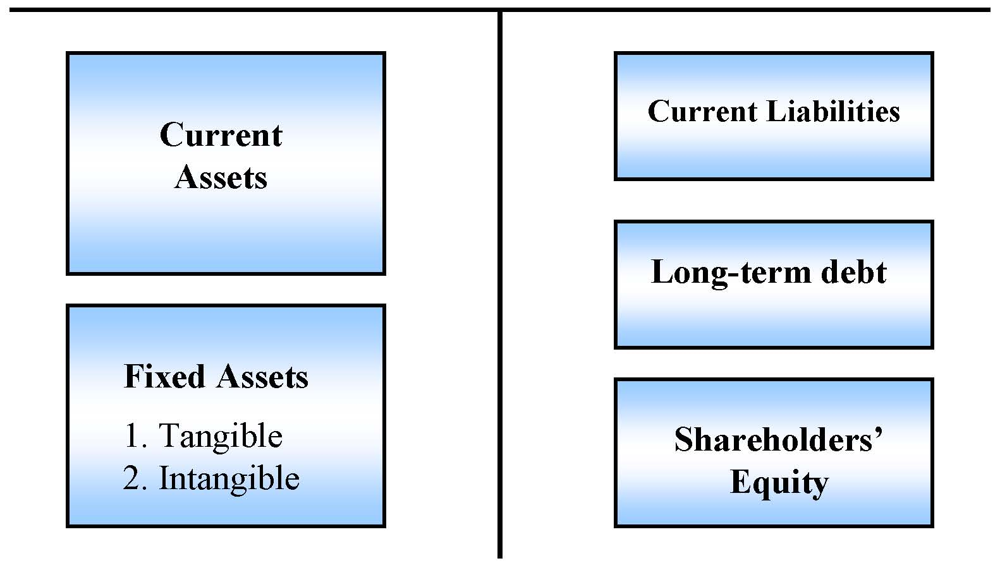

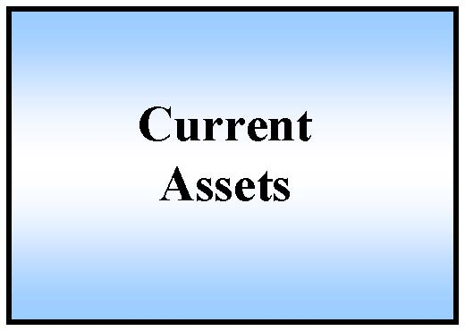

Current Assets

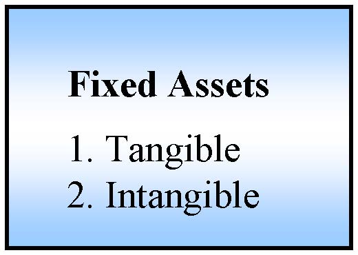

Fixed Assets1. Tangible2. Intangible

Current Liabilities

Long-term debt

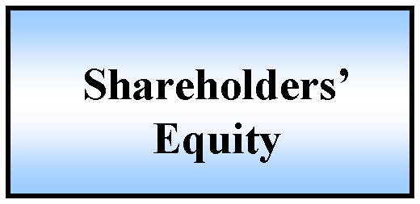

Shareholders’Equity

Introduction, cont.

But we also need to understand…

- Capital markets

- Types of securities (stocks, bonds, options…)

- Trade-off between risk and return

- Pricing

- Taxes and government regulation

Financial markets

Financial MarketsFirmsIndividualsFinancial IntermediariesCurrassetsFixed assetsDebtEquityGovernment

Introduction, cont.

Finance is really about value

- Firms

- Projects and real investments

- Securities

Common characteristic

- Invest cash today in exchange for cash (hopefully) in the 

- future

Central question

- How do we create value through investment and financing decisions?

Types of questions

Investment and financing decisions

- At the end of 1999, GM had $11.4 billion in cash.

- Should it invest in new projects or return the cash to shareholders? 

- If it decides to return the cash, should it declare a dividend or repurchase stock? 

- If it decides to invest, what is the most valuable investment?  What are the risks?

General Dynamic

- Major contractor in the defense industry

- Doing well during 1980s (cold war)

- Growth in sales

- Reasonable profitability

- R&amp;D and capital investment

- Beginning of 1990s

- The end of cold war

- Likely decline in defense spending

- Strategy???

General Dynamics

-$600-$400-$200$0$200$400$600$800$1,00019801981198219831984198519861987198819891990R&amp;D + Cap ExpNet Inc

Value of $100 invested in Jan. ‘80

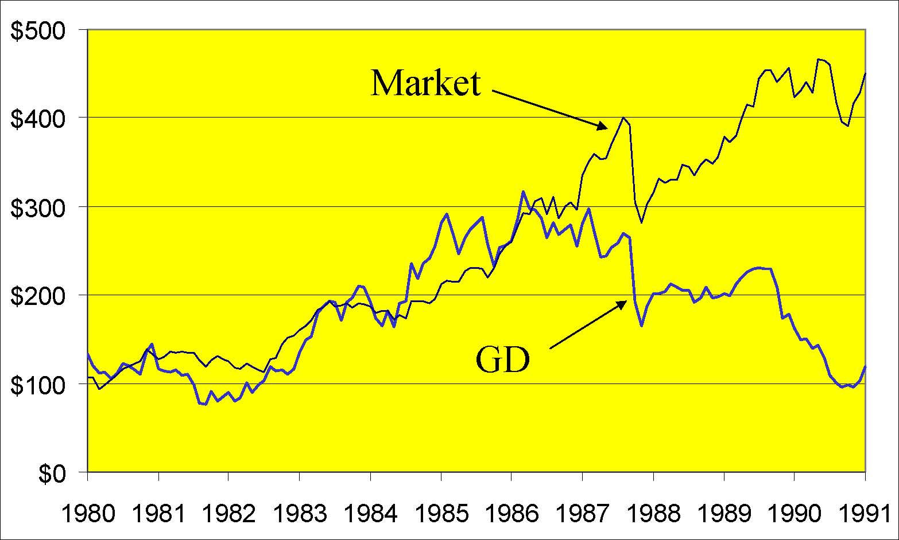

$0$100$200$300$400$500198019811982198319841985198619871988198919901991MarketGD

General Dynamics

Investment, 1980 –1990R&amp;D + Capital expenditures:$3.7 billionIf invested at 10%:$5.5 billionEnding market value:$1.0 billionValue destroyed:$4.5 billionSales grew from $4.7 billion to $10.2 billionEarnings in 1990 = -578 million

New strategy in 1991

William A. Anders (new CEO):

- Cuts capital expenditure and R&amp;D

- Cap. Exp. drops from $321 million in 1990 to $81 million in 1991

- Sells off divisions and subsidiaries

- Cuts workforce

- Distributes cash to shareholders

- From 1991 through 1993, GD returns $3.4 billion to shareholders and debtholders

General Dynamics: 1987 –1997

-$600-$400-$200$0$200$400$600$800$1,00019871988198919901991199219931994199519961997Net IncCapEx + R&amp;D

Value of $100 invested Jan. ‘91

$0$100$200$300$400$500$600$70019871988198919901991199219931994MarketGD

Types of questions

Investment and financing decisions

- Your firm needs to raise capital to finance growth.  

- Should you issue debt or equity or obtain a bank loan?

- How will the stock market react to your decision? 

- If you choose debt, should the bonds be convertible?  callable? Long or short maturity?

- If you choose equity, what are the trade-offs between common and preferred stock?

Types of questions, cont.

Investment and financing decisions

- IBM recently announced that it would repurchase $2.5 billion in stock.  Its price jumped 7% after the announcement.  Why?  How would themarket have reacted if IBM increased dividends instead?  SupposeIntel made the same announcement.  Would we expect the same price response?

- Motorola wants to build a new chip factory in Ireland.  How willfluctuations in the foreign exchange rate affect the value of the project?  What are the risks?  What actions can Motorola take to hedge therisks?  More importantly, should it hedge the risks?  What are the costs and benefits? 

Our Approach

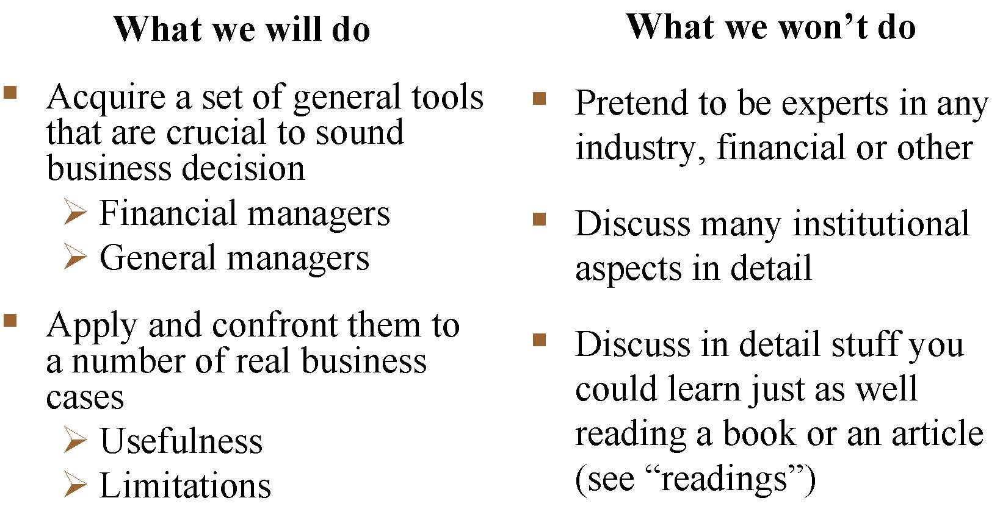

What we will doAcquire a set of general tools that are crucial to sound business decisionFinancial managersGeneral managersApply and confront them to a number of real business casesUsefulnessLimitationsWhat we won’t doPretend to be experts in any industry, financial or otherDiscuss many institutional aspects in detailDiscuss in detail stuff you could learn just as well reading a book or an article (see “readings”)

Outline: Theory + Applications

- Part I: Financing

- −Capital structure

- −Payout policy

- Part II: Valuation

- −Project valuation (FCF, PV, Real Options)

- −Company valuation (M&amp;A, Start-ups)

- Part III: Selected topics in corporate finance

- −Corporate governance

- −Hedging/Risk management

The tools of finance (15.401)

- Time Value of Money

- Portfolio Theory

- Asset Pricing Theory

- Efficient Markets Hypothesis

- Option Pricing Theory

- The Concept of No-Arbitrage

- Agency Theory (Micro-economics, Incentives and Contracts)

Course Requirements

- Class Participation (10%)

- Case Memoranda (30%)

- Teams up to four people

- Hand in all write-ups except two write-ups of your choice

- A professional memo to the decision maker

- Midterm (30%)

- Final (30%)

The Case of the Unidentified Industries

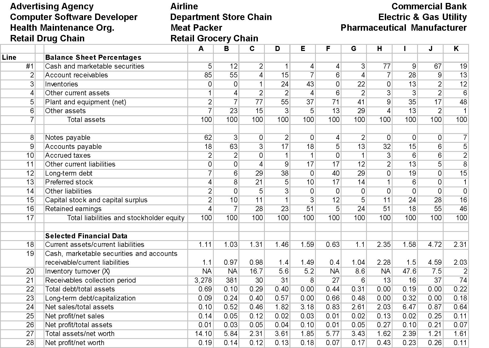

Advertising AgencyAirlineCommercial BankComputer Software DeveloperDepartment Store ChainElectric &amp; Gas UtilityHealth Maintenance Org.Meat PackerPharmaceutical Manufacturer Retail Drug ChainRetail Grocery ChainABCDEFGHIJKLineBalance Sheet Percentages#1Cash and marketable securities5122144377967192Account receivables85554157647289133Inventories00124430220132124Other current assets142246233265Plant and equipment (net)27775537714193517486Other assets72315351329413217          Total assets1001001001001001001001001001001008Notes payable6230204200079Accounts payable18633171851332156510Accrued taxes2201101366211Other current liabilities00491717122135812Long-term debt7629380402901901513Preferred stock48215101714160114Other liabilities2053000000015Capital stock and capital surplus21011131251124281616Retained earnings472823515245118554617          Total liabilities and stockholder equity100100100100100100100100100100100Selected Financial Data18Current assets/current liabilities1.111.031.311.461.590.631.12.351.584.722.3119Cash, marketable securities and accountsreceivable/current liabilities1.10.970.981.41.490.41.042.281.54.592.0320Inventory turnover (X)NANA16.75.65.2NA8.6NA47.67.5221Receivables collection period3,278381303182761316377422Total debt/total assets0.690.100.290.400.000.440.310.000.190.000.2223Long-term debt/capitalization0.090.240.400.570.000.660.480.000.320.000.1824Net sales/total assets0.100.520.461.823.180.832.612.036.470.870.6425Net profit/net sales0.140.050.120.020.030.010.020.130.020.250.1126Net profit/total assets0.010.030.050.040.100.010.050.270.100.210.0727Total assets/net worth14.105.842.313.611.855.773.431.622.391.211.6128Net profit/net worth0.190.140.120.130.180.070.170.430.230.260.11

Industry Groups

Service providers

- Advertising agency

- Airline

- Commercial bank

- HMO

Zero inventories

- A, B, F, H

Group 1:

- Advertising Agency

- Airline

- Commercial Bank

- HMO

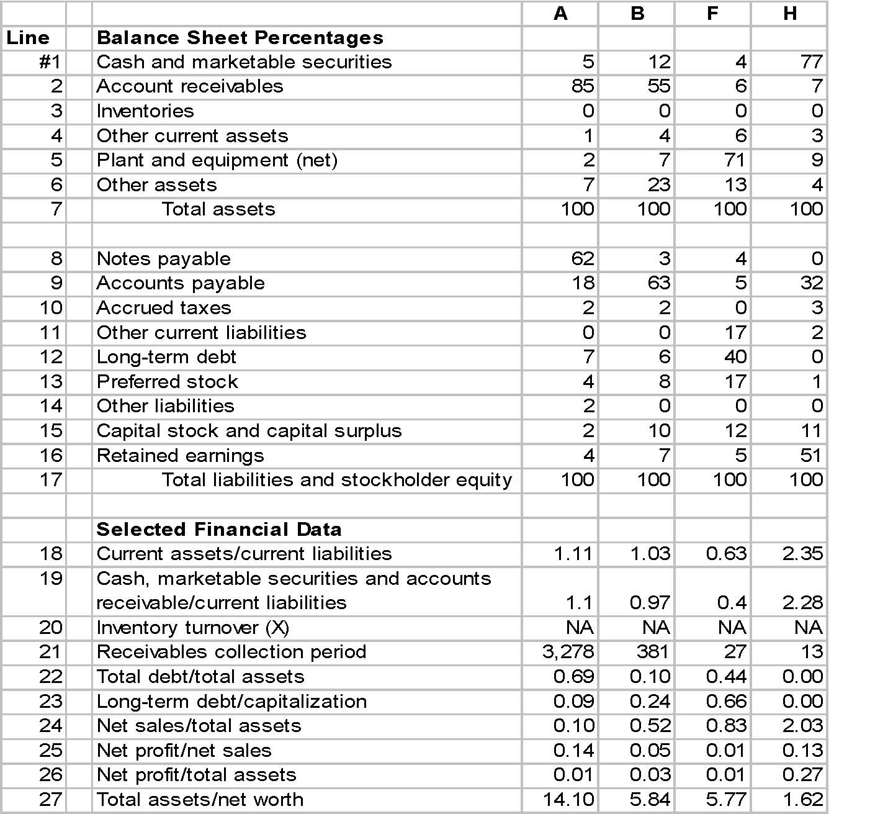

ABFHLineBalance Sheet Percentages#1Cash and marketable securities5124772Account receivables8555673Inventories00004Other current assets14635Plant and equipment (net)277196Other assets7231347          Total assets1001001001008Notes payable623409Accounts payable186353210Accrued taxes220311Other current liabilities0017212Long-term debt7640013Preferred stock4817114Other liabilities200015Capital stock and capital surplus210121116Retained earnings4755117          Total liabilities and stockholder equity100100100100Selected Financial Data18Current assets/current liabilities1.111.030.632.3519Cash, marketable securities and accountsreceivable/current liabilities1.10.970.42.2820Inventory turnover (X)NANANANA21Receivables collection period3,278381271322Total debt/total assets0.690.100.440.0023Long-term debt/capitalization0.090.240.660.0024Net sales/total assets0.100.520.832.0325Net profit/net sales0.140.050.010.1326Net profit/total assets0.010.030.010.2727Total assets/net worth14.105.845.771.62

Identified Industries in Group 1

ACommercial Bank

BAdvertising Agency

FAirline

HHealth Maintenance Organization (H.M.O.)

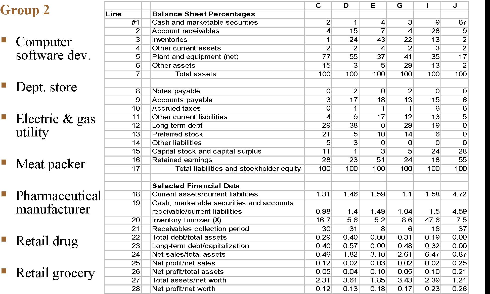

Group 2Computer software dev.Dept. storeElectric &amp; gas utilityMeat packerPharmaceutical manufacturerRetail drugRetail groceryCDEGIJLineBalance Sheet Percentages#1Cash and marketable securities21439672Account receivables415742893Inventories12443221324Other current assets2242325Plant and equipment (net)7755374135176Other assets1535291327          Total assets1001001001001001008Notes payable0202009Accounts payable317181315610Accrued taxes01116611Other current liabilities49171213512Long-term debt293802919013Preferred stock21510146014Other liabilities53000015Capital stock and capital surplus11135242816Retained earnings28235124185517          Total liabilities and stockholder equity100100100100100100Selected Financial Data18Current assets/current liabilities1.311.461.591.11.584.7219Cash, marketable securities and accountsreceivable/current liabilities0.981.41.491.041.54.5920Inventory turnover (X)16.75.65.28.647.67.521Receivables collection period303186163722Total debt/total assets0.290.400.000.310.190.0023Long-term debt/capitalization0.400.570.000.480.320.0024Net sales/total assets0.461.823.182.616.470.8725Net profit/net sales0.120.020.030.020.020.2526Net profit/total assets0.050.040.100.050.100.2127Total assets/net worth2.313.611.853.432.391.2128Net profit/net worth0.120.130.180.170.230.26

Group 2: Inventory turnover

<Table>
<TR>
<TD>

Industry

</TD>
<TD>

Inventory turnover

</TD>
</TR>
<TR>
<TD>

I

</TD>
<TD>

47.6

</TD>
</TR>
<TR>
<TD>

C

</TD>
<TD>

16.7

</TD>
</TR>
<TR>
<TD>

G

</TD>
<TD>

8.6

</TD>
</TR>
<TR>
<TD>

J

</TD>
<TD>

7.5

</TD>
</TR>
<TR>
<TD>

D

</TD>
<TD>

5.6

</TD>
</TR>
<TR>
<TD>

E

</TD>
<TD>

5.2

</TD>
</TR>
<TR>
<TD>

K

</TD>
<TD>

2.0

</TD>
</TR>
</Table>

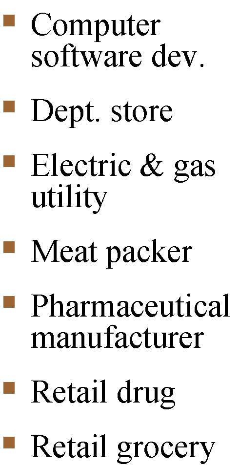

Computer software dev.Dept. storeElectric &amp; gas utilityMeat packerPharmaceutical manufacturerRetail drugRetail grocery

Group 2: Receivables collection period

<Table>
<TR>
<TD>

Industry

</TD>
<TD>

Collection period

</TD>
</TR>
<TR>
<TD>

K

</TD>
<TD>

74

</TD>
</TR>
<TR>
<TD>

J

</TD>
<TD>

37

</TD>
</TR>
<TR>
<TD>

D

</TD>
<TD>

31

</TD>
</TR>
<TR>
<TD>

E

</TD>
<TD>

8

</TD>
</TR>
<TR>
<TD>

G

</TD>
<TD>

6

</TD>
</TR>
</Table>

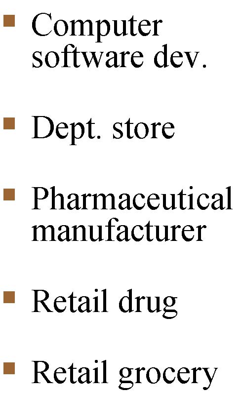

Computer software dev.Dept. storePharmaceutical manufacturerRetail drugRetail grocery

Group 2: Inventory &amp; PPE

<Table>
<TR>
<TD>

Industry

</TD>
<TD>

INV (%)

</TD>
<TD>

PPE (%)

</TD>
</TR>
<TR>
<TD>

D

</TD>
<TD>

24

</TD>
<TD>

55

</TD>
</TR>
<TR>
<TD>

K

</TD>
<TD>

12

</TD>
<TD>

48

</TD>
</TR>
<TR>
<TD>

J

</TD>
<TD>

2

</TD>
<TD>

17

</TD>
</TR>
</Table>

Computer software dev.Dept. storePharmaceutical manufacturer

The Identified Industries

ACommercial BankCiticorp

BAdvertising AgencyInterpublic

CElectric &amp; Gas UtilityConsolidated Edison

DDepartment Store ChainDayton-Hudson

ERetail Drug ChainWalgreen

FAirlineAMR Corp.

GRetail Grocery ChainAmerican Stores

HH.M.O.U.S. Healthcare

IMeat PackersIBP, Inc.

JSoftware DeveloperMicrosoft

KPharmaceutical Manuf.Novo Nordisk

Any Comments?

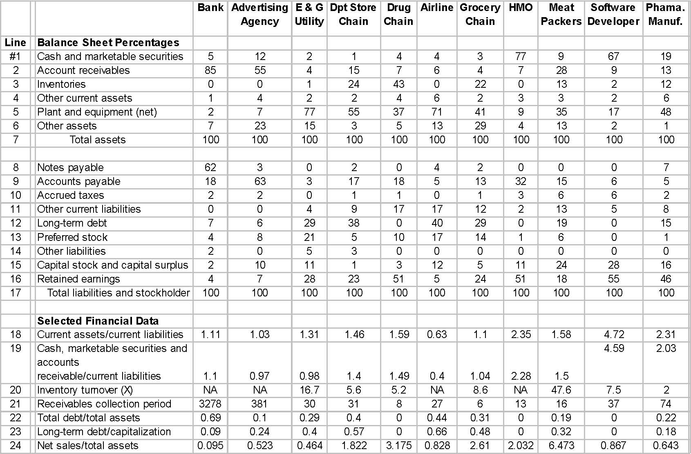

BankAdvertisingAgencyE &amp; GUtilityDpt StoreChainDrugChainAirlineGroceryChainHMOMeatPackersSoftwareDeveloperPhama.Manuf.LineBalance Sheet Percentages#1Cash and marketable securities5122144377967192Account receivables85554157647289133Inventories00124430220132124Other current assets142246233265Plant and equipment (net)27775537714193517486Other assets72315351329413217          Total assets1001001001001001001001001001001008Notes payable6230204200079Accounts payable18633171851332156510Accrued taxes2201101366211Other current liabilities00491717122135812Long-term debt7629380402901901513Preferred stock48215101714160114Other liabilities2053000000015Capital stock and capital surplus21011131251124281616Retained earnings472823515245118554617   Total liabilities and stockholder 100100100100100100100100100100100Selected Financial Data18Current assets/current liabilities1.111.031.311.461.590.631.12.351.584.722.3119Cash, marketable securities and accountsreceivable/current liabilities1.10.970.981.41.490.41.042.281.54.592.0320Inventory turnover (X)NANA16.75.65.2NA8.6NA47.67.5221Receivables collection period3278381303182761316377422Total debt/total assets0.690.10.290.400.440.3100.1900.2223Long-term debt/capitalization0.090.240.40.5700.660.4800.3200.1824Net sales/total assets0.0950.5230.4641.8223.1750.8282.612.0326.4730.8670.643

Leverage

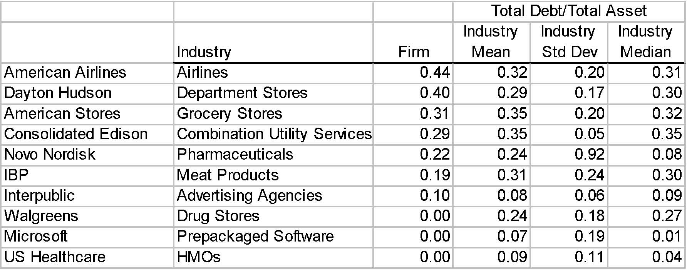

IndustryFirmIndustryMeanIndustryStd DevIndustryMedianAmerican AirlinesAirlines0.440.320.200.31Dayton HudsonDepartment Stores0.400.290.170.30American StoresGrocery Stores0.310.350.200.32Consolidated EdisonCombination Utility Services0.290.350.050.35Novo NordiskPharmaceuticals0.220.240.920.08IBPMeat Products0.190.310.240.30InterpublicAdvertising Agencies0.100.080.060.09WalgreensDrug Stores0.000.240.180.27MicrosoftPrepackaged Software0.000.070.190.01US HealthcareHMOs0.000.090.110.04Total Debt/Total Asset

Firm AFirm BBalance Sheet%%Cash and marketable securities582Accounts receivable03Inventories552Other current assets33Plant and equipment (net)528Other assets3012  Total assets100100Notes payable00Accounts payable1728Accrued taxes02Other current liabilities715Long-term debt5414Other liabilities04Preferred stock00Capital stock and capital surplus4729Retained earnings(25)9  Total liabilities and stockholder equity100100
