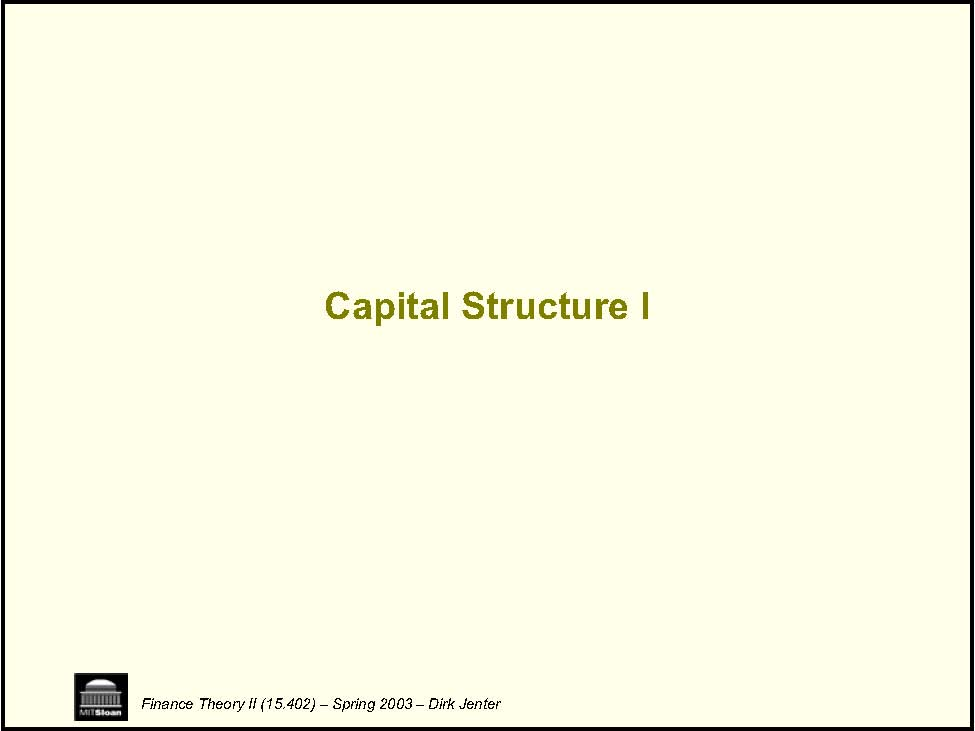
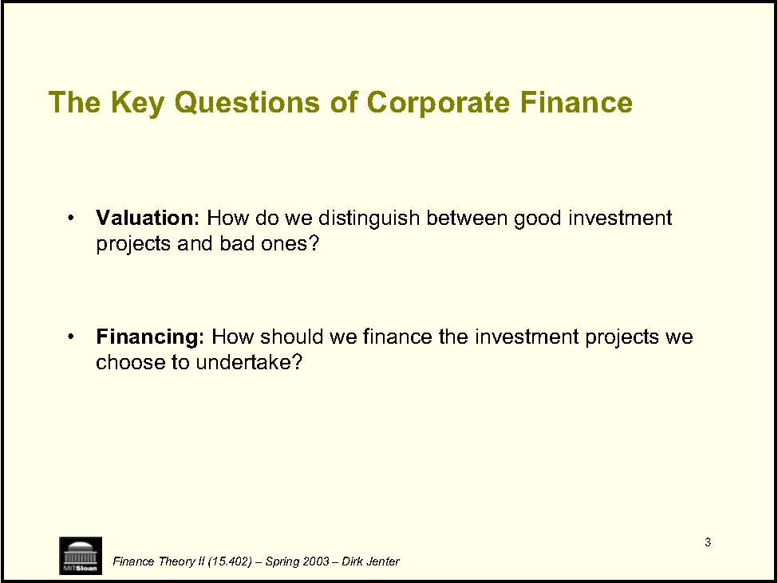
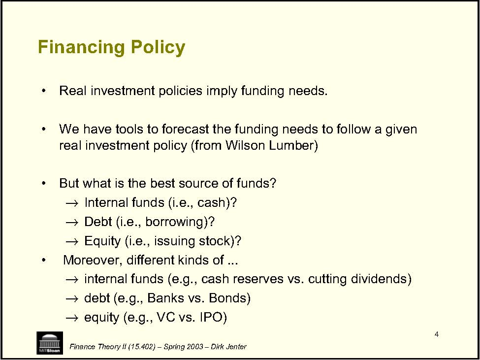
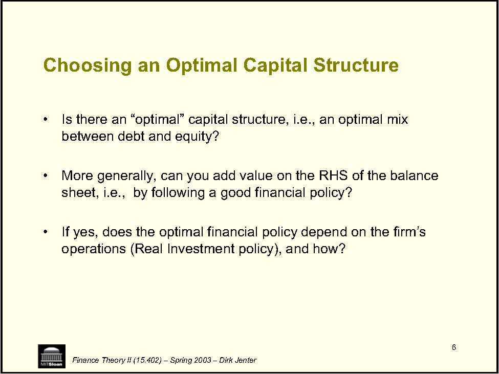
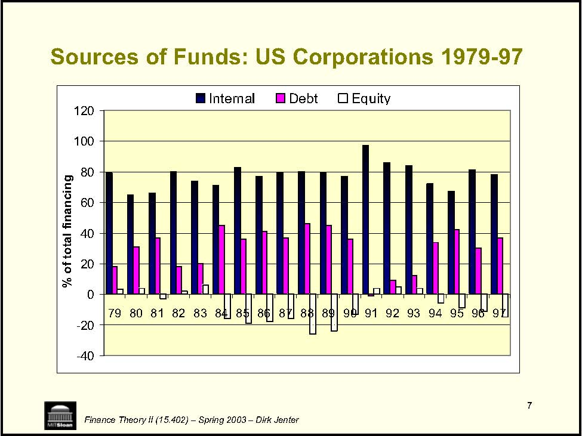
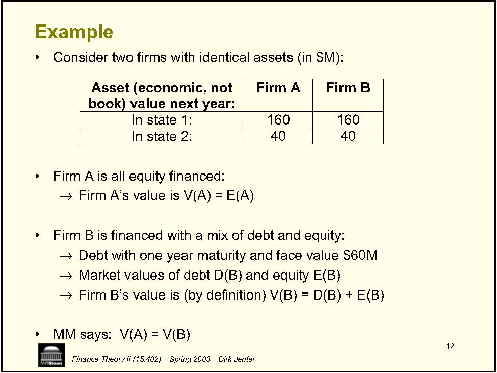
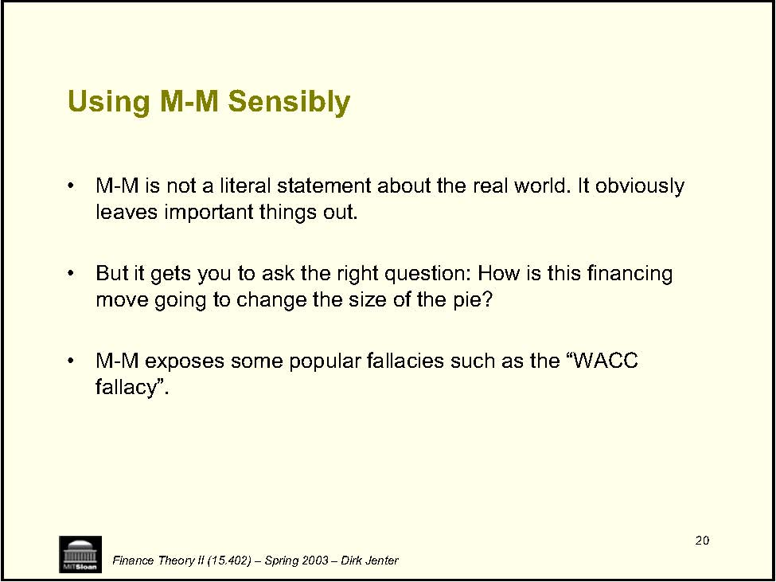

         Acrobat Distiller 6.0 (Windows)

         2004-01-21T10:55:58+05:30

         2004-01-21T10:57:10+05:30

         2004-01-21T10:57:10+05:30

         PScript5.dll Version 5.2

         uuid:771273be-b809-4627-8c39-0ee9feddbe14

         uuid:a8d943b5-ae08-44e5-882d-9987298ec351

         xml

               djenter

               Microsoft PowerPoint - LN04(CS1)_Shortened.ppt

Capital Structure I Finance Theory II (15.402) – Spring 2003 – Dirk Jenter 

2 • • • • • • • • Financing Review Case: Intel Corporation Finance Theory II (15.402) – Spring 2003 – Dirk Jenter The Big Picture: Part I -Financing A. Identifying Funding Needs Feb 6 Case: Wilson Lumber 1 Feb 11 Case: Wilson Lumber 2 B. Optimal Capital Structure: The Basics Feb 13 Lecture: Capital Structure 1 Feb 20 Lecture: Capital Structure 2 Feb 25 Case: UST Inc. Feb 27 Case: Massey Ferguson C. Optimal Capital Structure: Information and Agency Mar 4 Lecture: Capital Structure 3 Mar 6 Case: MCI Communications •Mar 11•Mar 13

3 • Valuation: • Financing: Finance Theory II (15.402) – Spring 2003 – Dirk Jenter The Key Questions of Corporate Finance How do we distinguish between good investment projects and bad ones? How should we finance the investment projects we choose to undertake? 

4 • • • →→→• →→→Finance Theory II (15.402) – Spring 2003 – Dirk Jenter Financing Policy Real investment policies imply funding needs. We have tools to forecast the funding needs to follow a given real investment policy (from Wilson Lumber) But what is the best source of funds? Internal funds (i.e., cash)? Debt (i.e., borrowing)? Equity (i.e., issuing stock)? Moreover, different kinds of ... internal funds (e.g., cash reserves vs. cutting dividends) debt (e.g., Banks vs. Bonds) equity (e.g., VC vs. IPO) 

5 Capital Structure • • →→→Maturity →→→• value Finance Theory II (15.402) – Spring 2003 – Dirk Jenter Capital Structure represents the mix of claims against a firm’s assets and free cash flow Some characteristics of financial claims Payoff structure (e.g. fixed promised payment) Priority (debt paid before equity) Restrictive Covenants Voting rights Options (convertible securities, call provisions, etc) We focus on leverage (debt vs. equity) and how it can affect firm 

6 Choosing an Optimal Capital Structure • • sheet, i.e.,• Finance Theory II (15.402) – Spring 2003 – Dirk Jenter Is there an “optimal” capital structure, i.e., an optimal mix between debt and equity? More generally, can you add value on the RHS of the balance   by following a good financial policy? If yes, does the optimal financial policy depend on the firm’s operations (Real Investment policy), and how? 

7 Sources of Funds: US Corporations 1979-97 0 20 40 60 80 100 120 79 80 81 82 84 85 86 87 89 91 92 93 94 96 97 g Eqy Finance Theory II (15.402) – Spring 2003 – Dirk Jenter -40 -20 83 88 90 95 % of total financinInternal Debt uit

# Companies and Industries Vary in Their Capital Structures 

<Table>
<TR>
<TD>  Industry </TD>
<TD>Debt Ratio* (%)</TD>
</TR>
<TR>
<TD>  Electric and Gas </TD>
<TD>43.2</TD>
</TR>
<TR>
<TD>  Food Production </TD>
<TD>22.9</TD>
</TR>
<TR>
<TD>  Paper and Plastic </TD>
<TD>30.4</TD>
</TR>
<TR>
<TD>  Equipment </TD>
<TD>19.1</TD>
</TR>
<TR>
<TD>  Retailers </TD>
<TD>21.7</TD>
</TR>
<TR>
<TD>  Chemicals </TD>
<TD>17.3</TD>
</TR>
<TR>
<TD>  Computer Software </TD>
<TD>3.5 </TD>
</TR>
<TR>

</TR>
<TR>
<TD>Average over all industries </TD>
<TD>21.5% </TD>
</TR>
</Table>

*	Debt Ratio = Ratio of book value of debt to the sum of the book value of debt plus the market value of equity.

8 

Finance Theory II (15.402) – Spring 2003 – Dirk Jenter 

9 Finance Theory II (15.402) – Spring 2003 – Dirk Jenter Returns Average Risk Premium Portfolio Nominal Real Treasury bills 3.8 0.7 0.0 Government bonds 5.6 2.6 1.8 Corporate bonds 6.1 3.0 2.3 Common stocks (S&amp;P 500) 13.0 9.7 9.2 Small-firm common stocks 17.7 14.2 13.9 Source: Ibbotson Associates, Inc., 1998 Yearbook (Brealey &amp; Myers p.155) (over T-Bills) Average Annual Rate Average rates of return on Treasury bills, government bonds, corporate bonds, and common stocks, 1926-1997 (figures in percent per year) 

10 Plan of Attack →→Taxes →→→→Finance Theory II (15.402) – Spring 2003 – Dirk Jenter 1. Modigliani-Miller Theorem: Capital Structure is irrelevant 2. What’s missing from the M-M view? Costs of financial distress Other factors 3. “Textbook” view of optimal capital structure: The choice between debt and equity 4. Apply/confront this framework to several business cases Evaluate when its usefulness and its limitations 

11 M-M’s “Irrelevance” Theorem • • Proof: • • price. • Q.E.D. Finance Theory II (15.402) – Spring 2003 – Dirk Jenter MM Theorem (without taxes for now). Financing decisions are irrelevant for firm value. In particular, the choice of capital structure is irrelevant. From Finance Theory I, Purely financial transactions do not change the total cash flows and are therefore zero NPV investments. With no arbitrage opportunities, they cannot change the total Thus, they neither increase nor decrease firm value. 

12 Example • • →• →→→• Firm A Firm B In state 1: 160 160 In state 2: 40 40 Finance Theory II (15.402) – Spring 2003 – Dirk Jenter Consider two firms with identical assets (in $M): Firm A is all equity financed: Firm A’s value is V(A) = E(A) Firm B is financed with a mix of debt and equity: Debt with one year maturity and face value $60M Market values of debt D(B) and equity E(B) Firm B’s value is (by definition) V(B) = D(B) + E(B) MM says:  V(A) = V(B) Asset (economic, not book) value next year: 

13 Proof 1 • • • →The payoff to Firm A’s equity →• Q.E.D. Claim’s value Debt 100 40 40 0 Finance Theory II (15.402) – Spring 2003 – Dirk Jenter Firm A’s equity gets all cash flows Firm B’s cash flows are split between its debt and equity with debt being senior to equity. In all (i.e.,  both) states of the world, the following are equal: The sum of payoffs to Firm B’s debt and equity By value additivity,  D(B) + E(B) = E(A) next year: Firm A’s Equity Firm B’s Firm B’s Equity In state 1: 160 60 In state 2: 

14 M-M Intuition 1 • • • • of how the pie is divided up. Finance Theory II (15.402) – Spring 2003 – Dirk Jenter If Firm A were to adopt Firm B’s capital structure, its total value would not be affected (and vice versa). This is because ultimately, its value is that of the cash flows generated by its operating assets (e.g., plant and inventories). The firm’s financial policy divides up this cashflow “pie” among different claimants (e.g., debtholders and equityholders). But the size (i.e.,  value) of the pie is independent 

15 V E D E D V Finance Theory II (15.402) – Spring 2003 – Dirk Jenter “Pie” Theory I 

16 Proof 2 • • →→E(B) = $50M • • • Finance Theory II (15.402) – Spring 2003 – Dirk Jenter In case you forgot where value additivity comes from… Assume for instance that market values are: D(B) = $50M MM says: V(A) = D(B)+E(B) = $100M Suppose instead that E(A) = $105M. Can you spot an arbitrage opportunity? 

# Proof 2 (cont.) 

• Arbitrage strategy: 

- Buy 1/1M of Firm B’s equity for $50 

- Buy 1/1M of Firm B’s debt for $50 

- Sell 1/1M of Firm A’s equity for $105 

<Table>
<TR>

<TH>Today</TH>
<TH> Next year State 1 </TH>
<TH>Next year State 2 </TH>
</TR>
<TR>
<TH>Firm B’s equity </TH>
<TD>-$50</TD>
<TD> +$100 </TD>
<TD>$0 </TD>
</TR>
<TR>
<TH>Firm B’s debt </TH>
<TD>-$50</TD>
<TD> +$60 </TD>
<TD>+$40 </TD>
</TR>
<TR>
<TH>Subtotal </TH>
<TD>-$100 </TD>
<TD>+$160 </TD>
<TD>+$40 </TD>
</TR>
<TR>
<TH>Firm A’s equity </TH>
<TD>+$105 </TD>
<TD>-$160 </TD>
<TD>-$40 </TD>
</TR>
<TR>
<TH>Total </TH>
<TD>+$5 </TD>
<TD>$0 </TD>
<TD>$0 </TD>
</TR>
</Table>

Note: Combining Firm B’s debt and equity amounts to “undoing Firm B’s leverage” (see bolded cells). 

17 

Finance Theory II (15.402) – Spring 2003 – Dirk Jenter 

18 M-M: Intuition 2 • • • Finance Theory II (15.402) – Spring 2003 – Dirk Jenter Investors will not pay a premium for firms that undertake financial transactions that they can undertake themselves (at the same cost). For instance, they will not pay a premium for Firm A over Firm B for having less debt. Indeed, by combining Firm B’s debt and equity in appropriate proportions, any investor can in effect “unlever” Firm B and reproduce the cashflow of Firm A. 

19 The Curse of M-M • • →→→dividend policy is irrelevant. →→etc. • they are all zero NPV transactions. Finance Theory II (15.402) – Spring 2003 – Dirk Jenter M-M Theorem was initially meant for capital structure. But it applies to all aspects of financial policy: capital structure is irrelevant. long-term vs. short-term debt is irrelevant. risk management is irrelevant. Indeed, the proof applies to all financial transactions because 

20 • • • fallacy”. Finance Theory II (15.402) – Spring 2003 – Dirk Jenter Using M-M Sensibly M-M is not a literal statement about the real world. It obviously leaves important things out. But it gets you to ask the right question: How is this financing move going to change the size of the pie? M-M exposes some popular fallacies such as the “WACC 
