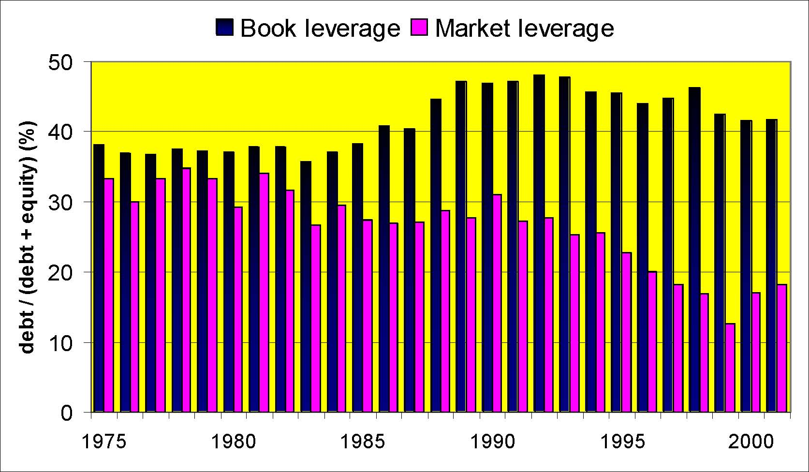
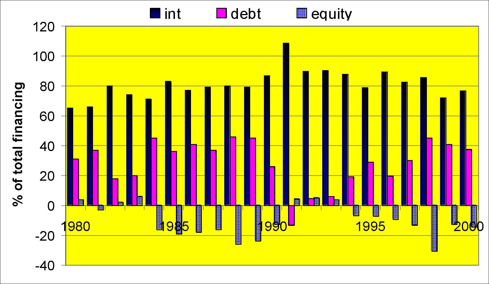
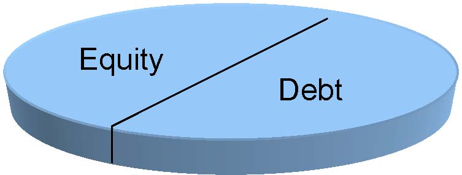
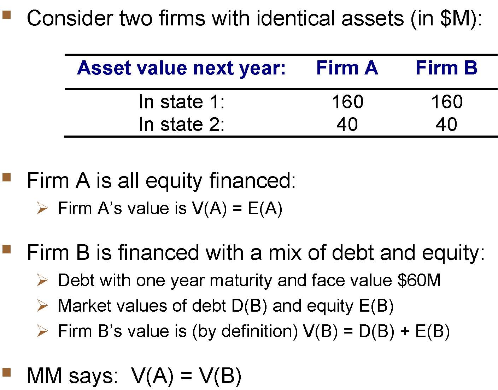
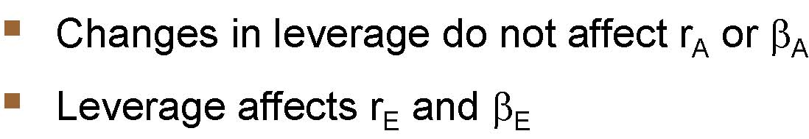
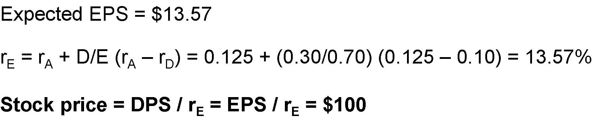

         Compaq

         Acrobat Distiller 6.0 (Windows)

         Compaq

         Acrobat PDFMaker 6.0 for PowerPoint

         2004-01-22T11:38:07+05:30

         2004-01-22T11:37:03+05:30

         2004-01-22T11:38:07+05:30

         uuid:ed691fdf-aa2e-4239-9e47-13e2db0caf26

         uuid:7955d90a-8ab3-4381-9a39-ae24838674db

         xml

               No Slide Title

               Leslie A. Larocca

Capital Structure

Katharina Lewellen

Finance Theory II

February 18 and 19, 2003

The Key Questions of Corporate Finance

- Valuation: How do we distinguish between good investment projects and bad ones?

- Financing: How should we finance the investment projects we choose to undertake?

(Real) Investment Policy

- “Which projects should the firm undertake?”

- Open a new plant?

- Increase R&amp;D?

- Scale operations up or down?

- Acquire another company?

- We know that real investments can create value

- Discounted Cash Flow (DCF) analysis

- Positive NPV projects add value

- We revisit this in the course’s  “Valuation” module (Part II)

Financing Policy

- Real investment policies imply funding needs

- We have tools to forecast the funding needs to follow a given real investment policy (from Wilson Lumber)

- But what is the best source of funds?

- Internal funds (i.e., Cash)?

- Debt (i.e., borrowing)?

- Equity (i.e., issuing stock)?

- Moreover, different kinds of ...

- Internal funds (e.g., cash reserves vs. cutting dividends)

- Debt (e.g., Banks vs. Bonds)

- Equity (e.g., VC vs. IPO)

Choosing an Optimal Capital Structure

- Is there an “optimal” capital structure, i.e., an optimal mix between debt and equity?

- More generally, can you add value on the RHS of the balance sheet, i.e.,  by following a good financial policy?

- If yes, does the optimal financial policy depend on the firm’s operations (Real Investment policy), and how?

- We study this in the course’s “Financing” module (Part I).

Capital Structures: US Corporations 1975-2001

01020304050197519801985199019952000debt / (debt + equity) (%)Book leverageMarket leverage

Capital structure, International 1991

0102030405060USJapanUKCanadaFranceGermanyDebt / (Debt+Equity) (%)Book leverageMarket leverage

Sources of Funds: US Corporations 1980-2000

-40-2002040608010012019801985199019952000% of total financingintdebtequity

Sources of Funds: International 1990-94

-40-2002040608010012079808182838485868788899091929394959697% of total financingInternalDebtEquity0102030405060708090USJapanUKCanadaFranceInternalDebtEquity

Examples: Capital structure, 1997

<Table>
<TR>
<TD>

Industry

</TD>
<TD>

Debt / (Debt + Equity) (%)

</TD>
</TR>
<TR>
<TD>

High leverage

</TD>

</TR>
<TR>
<TD>

Building construction

</TD>
<TD>

60.2

</TD>
</TR>
<TR>
<TD>

Hotels and lodging

</TD>
<TD>

55.4

</TD>
</TR>
<TR>
<TD>

Air transport

</TD>
<TD>

38.8

</TD>
</TR>
<TR>
<TD>

Primary metals

</TD>
<TD>

29.1

</TD>
</TR>
<TR>
<TD>

Paper

</TD>
<TD>

28.2

</TD>
</TR>
<TR>

</TR>
<TR>
<TD>

Low leverage

</TD>

</TR>
<TR>
<TD>

Drugs and chemicals

</TD>
<TD>

4.8

</TD>
</TR>
<TR>
<TD>

Electronics

</TD>
<TD>

9.1

</TD>
</TR>
<TR>
<TD>

Management services

</TD>
<TD>

12.3

</TD>
</TR>
<TR>
<TD>

Computers

</TD>
<TD>

9.6

</TD>
</TR>
<TR>
<TD>

Health services

</TD>
<TD>

15.2

</TD>
</TR>
</Table>

Plan of Attack

1.Modigliani-Miller Theorem:

- →Capital Structure is irrelevant 

2.What’s missing from the M-M view?

- →Taxes

- →Costs of financial distress

3.“Textbook” view of optimal capital structure:

- →The choice between debt and equity

4.Apply/confront this framework to several business cases

- →Evaluate when its usefulness and its limitations

M-M’s “Irrelevance” Theorem

Assume

- Market efficiency and no asymmetric information 

- No taxes 

- No transaction or bankruptcy costs 

- Hold constant the firm’s investment policies 

Then

- The value of the firm is independent of its capital structure

- Financing decisions do not matter!

MM Theorem: Proof 1 (pie theory)*

=

DebtEquity

DebtEquity

* Credit to Yogi Berra

MM Theorem: Proof 2 (market efficiency)

Your firm decides to raise $100 million.

- Debt financing

- You sell bonds worth $100 million and receive $100 million in cash.

- Equity financing

- You sell stock worth $100 million and receive $100 million in cash.

MM Theorem: Proof 2 (market efficiency)

- All purely financial transactions are zero NPV investments, i.e., no arbitrage opportunity.

- Thus, they neither increase nor decrease firm value. 

MM Theorem: Example

Assets $1 billionDebt $200MEquity $800M

Assets $1.1 billionOld Debt  $200MNew Debt $100MEquity $800M

Assets $1.1 billionDebt $200MOld Eq $800MNew Eq $100M

Current

Issue new debt

Issue new equity

MM Theorem: Proof 3

Consider two firms with identical assets (in $M):Firm A is all equity financed:Firm A’s value is V(A) = E(A)Firm B is financed with a mix of debt and equity:Debt with one year maturity and face value $60MMarket values of debt D(B) and equity E(B)Firm B’s value is (by definition) V(B) = D(B) + E(B)MM says:  V(A) = V(B)Asset value next year: Firm A Firm B In state 1: 160 160 In state 2: 40 40   

MM Theorem: Proof 3

Firm A’s equity gets all cash flows Firm B’s cash flows are split between its debt and equity with debt being senior to equity.In all (i.e., both) states of the world, the following are equal:The payoff to Firm A’s equity The sum of payoffs to Firm B’s debt and equityBy value additivity,    E(A) = D(B) + E(B)Claim’s valueFirm A Firm B next year (Equity) Debt Equity In state 1: 160 60 100 In state 2: 40 40 0  

M-M Intuition 1

- If Firm A were to adopt Firm B’s capital structure, its total value would not be affected (and vice versa).

- This is because ultimately, its value is that of the cash flows generated by its operating assets (e.g., plant and inventories).

- The firm’s financial policy divides up this cashflow “pie” amongdifferent claimants (e.g., debtholders and equityholders).

- But the size (i.e., value) of the pie is independentof how the pie is divided up.

Example, cont.

- In case you forgot where value additivity comes from…

- Assume for instance that market values are:

- →D(B) = $50M

- →E(B) = $50M

- MM says: V(A) = D(B)+E(B) = $100M

- Suppose instead that E(A) = $105M.

- Can you spot an arbitrage opportunity?

Example, cont.

Arbitrage strategy:Buy 1/1M of Firm B’s equity for $50Buy 1/1M of Firm B’s debt for $50Sell 1/1M of Firm A’s equity for $105Note: Combining Firm B’s debt and equity amounts to “undoing Firm B’s leverage” (see shaded cells). Today Next year State 1 Next year State 2 Firm B’s equity -$50 +$100 $0 Firm B’s debt -$50 +$60 +$40 Subtotal -$100 +$160 +$40 Firm A’s equity +$105 -$160 -$40 Total +$5 $0 $0   

M-M: Intuition 2

- Investors will not pay a premium for firms that undertake financial transactions that they can undertake themselves (at the same cost).

- For instance, they will not pay a premium for Firm A over Firm Bfor having less debt.

- Indeed, by combining Firm B’s debt and equity in appropriate proportions, any investor can in effect “unlever” Firm B and reproduce the cashflow of Firm A.

The Curse of M-M 

- M-M Theorem was initially meant for capital structure.

- But it applies to all aspects of financial policy:

- capital structure is irrelevant.

- long-term vs. short-term debt is irrelevant.

- dividend policy is irrelevant.

- risk management is irrelevant.

- etc.

- Indeed, the proof applies to all financial transactions because they are all zero NPV transactions.

Using M-M Sensibly

- M-M is not a literal statement about the real world. It obviously leaves important things out.

- But it gets you to ask the right question: How is this financing move going to change the size of the pie?

- M-M exposes some fallacies such as: 

- WACC fallacy

- Win-Win fallacy

- EPS fallacy

WACC Fallacy: “Debt is Better Because Debt Is Cheaper Than Equity.”

- Because (for essentially all firms) debt is safer than equity, investors demand a lower return for holding debt than for holding equity. (True)

- The difference is significant: 4% vs. 13% expected return!

- So, companies should always finance themselves with debt because they have to give away less returns to investors, i.e., debt is cheaper. (False)

- What is wrong with this argument?

WACC Fallacy (cont.)

- This reasoning ignores the “hidden” cost of debt: 

- Raising more debt makes existing equity more risky

- Is it still true when default probability is zero?

- Milk analogy: Whole milk = Cream + Skimmed milk

- People often confuse the two meanings of “cheap”: 

- Low cost

- Good deal

- More on this in the “Valuation” module (Part II).

EPS Fallacy: “Debt is Better When It Makes EPS Go Up.”

- EPS can go up (or down) when a company increases its leverage. (True)

- Companies should choose their financial policy to maximize their EPS. (False)

- What is wrong with this argument?

EPS Fallacy (cont.)

- EBI(T) is unaffected by a change in capital structure (Recall that we assumed no taxes for now).

- Creditors receive the safe (or the safest) part of EBIT.

- Expected EPS might increase but EPS has become riskier!

Remarks:

- Also tells us to be careful when using P/E ratios, e.g. comparing P/E ratios of companies with different capital structures.

- Further confusing effect in share-repurchases: The number of shares changes as well as expected earnings.

Leverage, returns, and risk 

Firm is a portfolio of debt and equityAssetsNetAssetsLong-Term DebtEquityLiab&amp; Eq

Therefore …

rA=EDr AE  r AD+

andβA=ED AE   ADβ+β

Leverage, returns, and risk 

Asset risk is determined by the type of projects, not how the projects are financed

EDA VE   VDβ+β=β)  ( ED  DAAEβ−β+β=β

Changes in leverage do not affect rAor βALeverage affects rEand βE

EDAr VE  r VDr+=)r  (r ED  rrDAAE−+=

Leverage and beta

βEβAβD-1123400.20.40.60.811.21.4Debt to equity ratioBeta

Leverage and required returns

rErArD0.050.100.150.200.250.3000.20.40.60.811.21.4Debt to equity ratiorequired return

Example 

Your firm is all equity financed and has $1 million of assets and 10,000 shares of stock (stock price = $100).  Earnings before interest and taxes next year will be either $50,000, $125,000, or $200,000 depending on economic conditions.  These earnings are expected to continue indefinitely.  The payout ratio is 100%.

The firm is thinking about a leverage recapitalization, selling $300,000 of debt and using the proceeds to repurchase stock.  The interest rate is 10%.

How would this transaction affect the firm’s EPS and stock price? Ignore taxes.

Current: all equity

BadExpectedGood# of shares10,00010,00010,000Debt$0 $0 $0 EBIT$50,000 $125,000 $200,000 Interest000Net income$50,000 $125,000 $200,000 EPS$5 $12.50 $20 

Expected EPS = $12.5Stock price = $100rE= DPS / price = EPS / price = 12.5%

Recap: 30% debt

BadExpectedGood# of shares7,0007,0007,000Debt (r=10%)$300,000 $300,000 $300,000 EBIT$50,000 $125,000 $200,000 Interest30,00030,00030,000Net income$20,000 $95,000 $170,000 EPS$2.86 $13.57 $24.29 

Expected EPS = $13.57rE= rA+ D/E (rA–rD) = 0.125 + (0.30/0.70) (0.125 –0.10) = 13.57%Stock price = DPS / rE= EPS / rE= $100

Win-Win Fallacy: “Debt Is Better Because Some Investors Prefer Debt to Equity.”

- Investors differ in their preferences and needs, and thus want different cash flow streams. (True)

- Example: Young professionals vs. Retirees

- The sum of what all investors will pay is greater if the firm issues different securities (e.g., debt and equity) tailored for different clienteles of investors (Financial Marketing). (False)

- What is wrong with this argument?

Win-Win Fallacy (cont.)

- This reasoning assumes incomplete markets, i.e., that:

- There are indeed clienteles for different securities

- These clienteles are “unsatisfied”, i.e., that investors cannot replicate the security at the same or even lower cost.

- A large unsatisfied clientele for corporate debt is unlikely, asthere exist close substitutes to any particular firm’s debt.

- Also, financial intermediaries are in the business of identifying unsatisfied clientele.

- Win-Win situation is more likely for more exotic securities or sophisticated financial arrangement

Practical Implications

- When evaluating a decision (e.g., the effect of a merger):

- →Separate financial (RHS) and real (LHS) parts of the move

- →MM tells that most value is created on LHS

- When evaluating an argument in favor of a financial decision:

- →Understand that it is wrong under MM assumptions

- →What departures from MM assumptions does it rely upon?

- →If none, then this is very dubious argument.

- →If some, try to assess their magnitude.

What’s Missing from the Simple M-M Story?

- Taxes:

- →Corporate taxes

- →Personal taxes

- Costs of Financial Distress

Capital Structure and Corporate Taxes 

- Different financial transactions are taxed differently:

- →Interest payments are tax exempt for the firm.

- →Dividends and retained earnings are not.

- →Etc.

- Financial policy matters because it affects a firm’s tax bill.

Debt Tax Shield

Claim: Debt increases firm value by reducing the tax burden.

- Example: XYZ Inc. generates a safe $100M annual perpetuity. Assume risk-free rate of 10%. Compare:

- 100% debt: perpetual $100M interest

- 100% equity: perpetual $100M dividend or capital gains

 100% Debt 100% Equity Income before tax Interest Income $100M Equity income $100M Corporate tax rate 35% 0 -$35M Income after tax $100M $65M Firm value $1,000M $650M   

Intuition

- MM still holds: The pie is unaffected by capital structure.

Size of the pie = Value of before-taxcashflows

- But the IRS gets a slice too

- Financial policy affects the size of that slice.

- Interest payments being tax deductible, the PV of the IRS’ slicecan be reduced by using debt rather than equity.

“Pie” Theory

DebtEquityTaxes

Example 

In 2000, Microsoft had sales of $23 billion, earnings before taxes of $14.3 billion, and net income of $9.4 billion.  Microsoft paid $4.9 billion in taxes, had a market value of $423 billion, and had no long-term debt outstanding.

Bill Gates is thinking about a recapitalization, issuing $50 billion in long-term debt (rd = 7%) and repurchasing $50 billion in stock.  How would this transaction affect Microsoft’safter-tax cashflowsand shareholder wealth?

Microsoft: Balance sheet in $ millions

Item1997199819992000Cash8,96613,92717,23623,798Current assets10,37315,88920,23330,308Current liabs3,6105,7308,7189,755LT debt0000Bk equity9,79715,64727,48541,368Mkt equity155,617267,700460,770422,640Sales11,35814,48419,74722,956EBIT5,3147,11711,89114,275Taxes1,8602,6274,1064,854Net income3,4544,4907,7859,421Oper CF4,6896,88010,00313,961

Microsoft, 2000 ($ millions)

No DebtDebtEBIT$14,275 $14,275 Interest (r × 50,000)03,500Earnings before taxes$14,275 $10,775 Taxes (34%)4,8543,664After-tax earnings$9,421 $7,111 Cashflow to debtholders$0 $3,500 Cashflow to equityholders$9,421 $7,111 Total cashflows to D &amp; E$9,421 $10,611 

Tax savings of debt

Marginal tax rate = τ

Taxes for unleveredfirm………………τEBIT

Taxes for levered firm………………....τ(EBIT –interest)

Interest tax shield…………………..τinterest

Interest = rdD

Interest tax shield (each year) = τrdD

Note: only interest, not principal, payments reduce taxes

