         Acrobat Distiller 6.0.1 (Windows)

         Microsoft Corporation

         D:20050428013552

         2005-04-28T09:39:02+08:00

         Acrobat PDFMaker 6.0 for Word

         2005-04-28T09:39:49+08:00

         2005-04-28T09:39:49+08:00

         uuid:34346adc-f633-4739-8232-056bacc6f447

         uuid:2912394f-a6e4-4048-8894-1c0822146d40

               37

         xml

               Microsoft Word - 资本结构1-B

               fxzm

资本结构 

Katherine Lewellen 

财务理论 II 

2003年2月18及19日 

公司理财的主要问题 

-  价值评估：我们如何区分好的投资项目与差的投资项目？ 

-  融资：我们应如何为选定的投资项目筹集所需资金？ 

（实际）投资政策 

- 公司应采取何种投资方案？ 

- →开设新厂？ 

- →增加研发？ 

- →向上游或下游扩充经营规模？ 

- →兼并另一家公司？ 

- 我们知道实际投资可以创造价值 

- 折现现金流量（DCF）分析 

- 正净现值项目可以增加价值 

- 我们将在课程的“价值评估”单元（第二部分）再次讨论该问题。 

融资政策 

-  实际投资政策意味着有资金需要。 

→（从Wilson Lumber案例）我们已掌握了相应的工具来预测所选投资方案的资金需求。 

-  但是最好的资金来源是什么？ 

 → 内源融资（如：现金）？ 

 → 债务（如：借贷）？ 

 → 权益（如：发行股票）？ 

-  更进一步，不同种类的．．． 

 → 内源融资（如：留存现金 还是 消减股利） 

 → 负债（如：银行贷款 还是 发行债券） 

 → 权益（如：风险资本 还是  首次公开发行股票） 

最优资本结构的选择 

-  是否存在“最优”资本结构？也就是说，是否存在一个债务和权益的最优组合？ 

-  更广泛而言，即是你是否能够通过一项好的融资政策为资产负债表的右手方增加价值？ 

-  如果能的话，这一最优融资政策是否依赖于公司的运营（实际投资政策），以及是如何依赖的？ 

-  我们将在课程的“融资”单元（第一部分）讨论这些问题。 

美国公司  1975至2001的资本结构 

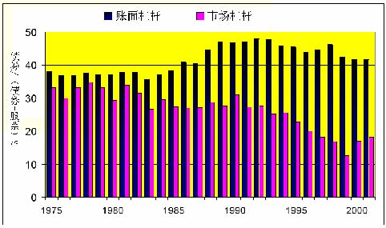

资本结构：国际1991 

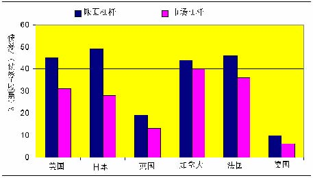

资金来源：美国公司 1980至2000 

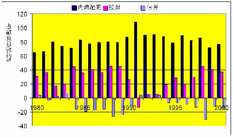

资金来源：国际 1990-94 

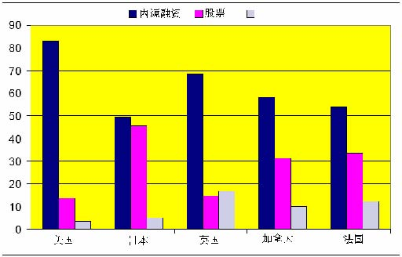

债券 

举例：资本结构，1997 

        行业                     债务/(债务+权益) (%) 

         高杠杆行业 

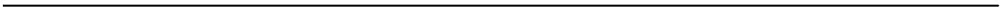

             建筑业                        60.2 

             酒店旅馆业                    55.4 

             航空运输                      38.8 

             原生金属                      29.1 

             造纸                          28.2 

            低杠杆行业 

            药物化工                       4.8 

            电子业                         9.1 

            管理服务                       12.3 

            计算机                         9.6 

            卫生服务                       15.2 

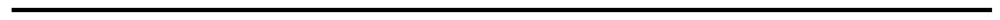

讲述安排 

- 1． 莫迪格里安尼-米勒定理（译注：以下简称MM定理） 

→ 资本结构无关紧要。  

2. M-M定理里遗漏了什么？ 

 →  税收。 

 →  财务困境成本。 

 →  其它因素。 

3. “书本”对最优资本结构的观点： 

   → 债务与权益之间的选择。 

4．该理论框架在几个商业案例中的应用/实践 

   → 分析它在什么时候有效和它的局限性。 

M-M“无关紧要”定理 

假设： 

- 市场有效且不存在不对称信息。 

- 没有税收。 

- 无交易或破产成本。 

- 公司的投资政策保持不变。 

则： 

- 公司价值与其资本结构无关。 

-  融资决策无关紧要。 

MM定理：证明 1 （馅饼理论） 

由Yogi Berra 提供 

MM定理：证明 2（市场有效）  

你的公司决定要筹资1亿美元 

- 债务融资 

- 出售价值1亿美元的债券获得1亿美元现金。 

- 权益融资 

- 出售价值1亿美元的股票获得1亿美元现金。 

MM定理：证明 2（市场有效） 

-  一切单纯的财务交易都是零净现值的投资，也就是说，不存在套利机会。 

-  故此，它们既不增加也不降低公司的价值。 

MM定理：举例 

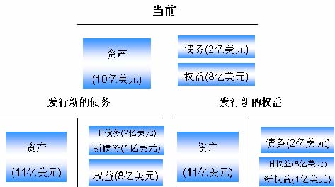

MM定理：证明 3 

-  考虑资产完全相同的两家公司（单位：百万美元）： 

<Table>

<TR>
<TD>

下一年的资产价值：

</TD>
<TD>

A公司 

</TD>
<TD>

B公司 

</TD>
</TR>
<TR>
<TD>

情况1 

</TD>
<TD>

160 

</TD>
<TD>

160 

</TD>
</TR>
<TR>
<TD>

  情况2 

</TD>
<TD>

40 

</TD>
<TD>

40 

</TD>
</TR>

</Table>

-  A公司全部是权益融资： 

→ A公司的价值为V(A) = E(A) 

-  B公司则是运用债务和权益组合融资： 

    → 债务面值6,000万美元，期限为一年。 

    → 债务和权益的市值分别为 D(B)和 E(B) 

    →  B公司的价值为（按定义）V(B) = D(B)+E(B) 

-  根据MM定理，V(A) = V(B) 

MM定理：证明 3 

-  A公司的权益得到所有的现金流。 

-  B公司的现金流则分别支付公司的债务和权益。 

<Table>

<TR>
<TD>

下一年不同索取权的价值：

</TD>
<TD>

A公司权益

</TD>
<TD>

B公司负债

</TD>
<TD>

B公司权益 

</TD>
</TR>
<TR>
<TD>

情况1 

</TD>
<TD>

160 

</TD>
<TD>

60 

</TD>
<TD>

100 

</TD>
</TR>
<TR>
<TD>

情况2 

</TD>
<TD>

40 

</TD>
<TD>

40 

</TD>
<TD>

0 

</TD>
</TR>

</Table>

-  在所有（即两种）情况下，以下数值是相等的： 

 → A公司权益所获的支付 

 → B公司债额和权益所获支付的总和 

-  按照数值相加的特性，D(B)+E(B) = E(A) 

M-M直觉 1 

-  如果A公司采取B公司的资本结构，其总价值不变（反之亦然）。 

-  这是因为，公司价值最终而言是由其运营资产（如厂房和库存）所产生的现金流的价值所决定的。 

-  公司的融资政策只是将其现金流“馅饼”在不同索取权（如债权人和股东）之间进行分切。 

-  但是“馅饼”的大小（即价值）与其切分方式无关。 

举例（续） 

-  如果你忘记数值相加的特性从何而来．．． 

-  假设现在市价是： 

 → D(B) = 5,000万美元 

 → E(B) = 5,000万美元 

-  根据MM定理 ，V(A) = D(B ) = 10,000万美元 

-  假如取而代之的 E(A) = 10,500美元 

-  你能否找出一个套利机会呢 ？ 

举例（续） 

套利策略： 

 → 购入B公司 1/100万的权益，花费50美元 

 → 购入B公司 1/100万的债务，花费50美元 

 →  出售A公司 1/100万的权益，获得105美元 

<Table>

<TR>
<TD>

</TD>
<TD>

当前 

</TD>
<TD>

下一年情况1 

</TD>
<TD>

下一年情况2

</TD>
</TR>
<TR>
<TD>

B公司的权益 

</TD>
<TD>

-$50 

</TD>
<TD>

+$100 

</TD>
<TD>

$0 

</TD>
</TR>
<TR>
<TD>

B公司的债务 

</TD>
<TD>

-$50 

</TD>
<TD>

+$60 

</TD>
<TD>

$40 

</TD>
</TR>
<TR>
<TD>

小计 

</TD>
<TD>

-$100 

</TD>
<TD>

+$160 

</TD>
<TD>

+$40 

</TD>
</TR>
<TR>
<TD>

A公司的权益 

</TD>
<TD>

-$105 

</TD>
<TD>

-$160 

</TD>
<TD>

-$40 

</TD>
</TR>
<TR>
<TD>

总计 

</TD>
<TD>

+$5 

</TD>
<TD>

$0 

</TD>
<TD>

$0 

</TD>
</TR>

</Table>

注：将B公司的债务与权益合并相当于取消B公司的杠杆（见黑体的数值） 

M-M直觉 2 

-  如果投资者自己可以进行财务交易（以同样成本），它们就不会为公司的财务交易支付溢价。 

-  例如，他们不会因A公司的债务较少而为A公司支付高于B公司的溢价。 

-  的确，通过对B公司的债务和权益进行适当比例的组合，任何一个投资者都可以有效地“取消B公司的杠杆”，从而使其产生与A公司等量的现金流。 

M-M定理的咒语 

-  MM定理最初是为了解释资本结构而发展起来的定理。 

-  但是它却可应用于财务政策的各个方面： 

- →资本结构无关紧要。 

- →长期债务还是短期债务无关紧要。 

- →股息政策无关紧要。 

- →风险管理无关紧要。 

- →其它 

-  的确，可以证明它可应用到所有财务交易上，因为它们都是零净现值交易。 

 审慎使用M-M定理 

-  MM定理并非是对真实世界确实的文字叙述。它明显地遗漏了一些重要的事情。 

-  但它可以让你提出正确的疑问：融资行为怎样才能改变“馅饼”的大小？ 

-  MM定理揭示了一些很常见的谬误如： 

- 加权平均资本成本的谬误 

- 双赢谬误 

- 每股盈利（EPS）谬误 

加权平均资本成本的谬误：“由于债务比权益廉价，因此债务优于权益” 

-  由于（基本上对所有的公司）债务比权益的安全性高。投资者对债务要求的回报要比权益的低（正确） 

-  差别非常明显，分别是：4%和13%的预期回报率。 

-  因此公司应永远以债务融资，因为这样他们支付给投资者的回报较低，即债务成本较低。（错误） 

-  这种说法错在何处？ 

加权平均资本成本的谬误（续） 

-  这一推理忽略了债务的“隐藏”成本： 

- →举债过多将导致已有权益的风险加大 

- →如果债务的违约为零时，上述说法是否仍然正确？ 

-  牛奶类比：全脂牛奶＝奶油 + 脱脂牛奶 

-  人们经常混淆“廉价”的两种意思： 

- →低成本 

- →好买卖 

-  在价值评估单元（第二部分）将对该问题作更详细的讨论。 

每股盈利(EPS)谬误：“当债务融资使每股盈利增加时, 债务较优” 

-  当公司提高其杠杆时，每股盈利会增加（或减少）（正确） 

-  公司应选择使其每股盈利最大的融资政策。（错误） 

-  这种说法错在何处？ 

每股盈利(EPS)谬误（续） 

-  资本结构的变化不会影响息前税前收益(EBIT)（记着此时我们假定没有税收）。 

-  债权人获取EBIT安全（或是最安全）的那部分。 

-  期望每股盈利可能会增加，但同时其风险也在增加！ 

附注： 

-  这里同时告诉我们要审慎使用P/E比率（市盈率）。例如比较具有不同资本结构的两家公司的市盈率。 

-  当回购股票时，该效果变得更加含混不清：在期望收益变化的同时，股票的数额也在变化。 

杠杆、收益和风险 

公司是债务和权益的一个投资组合 

故此．．． 

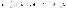

净资产 

负债与权益

权      益 

长期债务 

资 产

杠杆、收益和风险 

资产的风险是由投资项目的类型而不是由项目的融资方式所决定的。 

-  杠杆的变化不会影响rA或βA。 

-  杠杆影响rE及βE。 

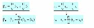

杠杆和β风险系数 

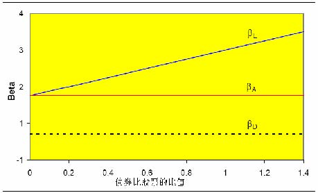

杠杆和要求回报率 

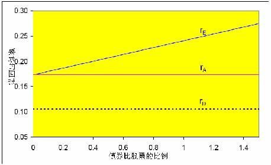

举例 

你公司全部是权益融资，总资产为100万美元, 股票总数为10,000股（每股100美元）。根据经济情况的不同，下一年的息前税前受益可能为50,000美元, 125,000美元或200,000美元。这些盈利预计将无限期维持不变。派息率是100%。 

公司现考虑利用杠杆进行资本结构调整，发行价值300,000美元的债务，并用所获资金回购股票。利率是10%。 

这项交易将会对公司的每股盈利和股票价格产生什么样的影响？假设可以忽略税收。 

目前：全部权益 

<Table>

<TR>
<TD>

</TD>
<TD>

比预期坏 

</TD>
<TD>

预期 

</TD>
<TD>

比预期好 

</TD>
</TR>
<TR>
<TD>

股份数量 

</TD>
<TD>

10,000

</TD>
<TD>

10,000

</TD>
<TD>

10,000

</TD>
</TR>
<TR>
<TD>

债务 

</TD>
<TD>

$0

</TD>
<TD>

$0

</TD>
<TD>

$0

</TD>
</TR>
<TR>
<TD>

</TD>
<TD>

</TD>
<TD>

</TD>
<TD>

</TD>
</TR>
<TR>
<TD>

息前税前盈利

</TD>
<TD>

 $50,000

</TD>
<TD>

$125,000

</TD>
<TD>

$200,000

</TD>
</TR>
<TR>
<TD>

利息 

</TD>
<TD>

0

</TD>
<TD>

0

</TD>
<TD>

0

</TD>
</TR>
<TR>
<TD>

净收入 

</TD>
<TD>

$50,000

</TD>
<TD>

$125,000

</TD>
<TD>

$200,000

</TD>
</TR>
<TR>
<TD>

每股盈利 

</TD>
<TD>

$5 

</TD>
<TD>

$12.50 

</TD>
<TD>

$20 

</TD>
</TR>

</Table>

预期每股盈利= 12.50美元 

股价 = 100美元 

股本的回报(rE) = 每股派息(DPS)/股价 = 每股盈利(EPS)/股价 = 12.5% 

资本结构调整：30%债务 

<Table>

<TR>
<TD>

</TD>
<TD>

比预期坏 

</TD>
<TD>

预期 

</TD>
<TD>

比预期好 

</TD>
</TR>
<TR>
<TD>

股份数量 

</TD>
<TD>

7,000

</TD>
<TD>

7,000

</TD>
<TD>

7,000

</TD>
</TR>
<TR>
<TD>

债务 

</TD>
<TD>

$300,000

</TD>
<TD>

$300,000

</TD>
<TD>

$300,000

</TD>
</TR>
<TR>
<TD>

</TD>
<TD>

</TD>
<TD>

</TD>
<TD>

</TD>
</TR>
<TR>
<TD>

息前税前盈利 

</TD>
<TD>

$50,000

</TD>
<TD>

$125,000

</TD>
<TD>

$200,000

</TD>
</TR>
<TR>
<TD>

利息 

</TD>
<TD>

$30,000

</TD>
<TD>

$30,000

</TD>
<TD>

$30,000

</TD>
</TR>
<TR>
<TD>

净收入 

</TD>
<TD>

$20,000

</TD>
<TD>

$95,000

</TD>
<TD>

$170,000

</TD>
</TR>
<TR>
<TD>

每股盈利 

</TD>
<TD>

$2.88 

</TD>
<TD>

$13.57 

</TD>
<TD>

$24.29 

</TD>
</TR>

</Table>

- 预期每股盈利 = 13.57美元 

- rE =  rA+ D/E(rA-rD) = 0.125 + (0.30/0.70)(0.125-0.10) = 13.57% 

- 股价 = 每股派息(DPS)/rE = 每股盈利(EPS)/rE = 100美元 

双赢谬误：“由于一些投资者更偏爱债务，因此债务优于权益” 

-  投资者有不同的偏好和需要，因此要求不同的现金流。（正确） 

-  例如：年轻专业人士与退休人士。 

-  如果公司发行适合不同客户群（金融市场上的投资者）的多种证券（例如：债券和股票），则所有投资者愿意支付给公司的金额之和将会较大。（错误） 

-  这种说法错在何处？ 

双赢谬误（续） 

-  该推理假定市场不完全。也就是说： 

- →的确不同证券是有不同的客源 

- →这些客户是“未满足”的，即投资者不能以同样或更低成本去仿效发行那些证券。 

-  由于对于任何特定公司的债券，都存在相近的替代品，因此不可能存在大量对企业债券“未满足”的客户。 

-  同时，金融中介机构也在起着识别未满足客户的作用。 

-  对于新兴的证券或较为复杂的融资安排，双赢状况出现的可能性较大。 

实际含义 

-  在评价一项决策（如，合并的效果）时： 

   →要将该决策的财务方（右手方）与实际方（左手方）区分开 

   → MM定理指出大部分价值是由左手方创造的。 

-  当评估支持某一财务决策的论点时： 

   →清楚它在MM定理的假设下是站不住的 

   →论点是依靠哪些偏离MM定理假设的条件而成立的？ 

   →要是没有的话，那该论点就很可疑。 

   →要是有的话，那就要试试评估这些偏离的程度大小。 

简单的MM定理遗漏了什么？ 

- 税收： 

 →各种公司税 

 →各种个人税 

- 财务困境成本 

资本结构与公司税 

-  对不同的财务交易征收的税收是不同的： 

 →利息是公司可从税收中获豁免扣除的。 

 →股息及留存收益则不可以。 

 →其它。 

-  财务政策关系重大因为它影响一家公司的税收。 

债务的税盾 

观点：债务通过减少公司的税收而使公司价值增加。 

-  举例：XYZ公司每年有永续性营业收益100M美元。假设无风险利率为10%。比较： 

- 100%债务：每年100M美元利息（永续性的）。 

- 100%权益：每年100M美元股息或资本利得（永续性的）。 

<Table>

<TR>
<TD>

</TD>
<TD>

100%债务

</TD>
<TD>

100%权益 

</TD>
</TR>
<TR>
<TD>

税前收入

</TD>
<TD>

100M美元 利息收入 

</TD>
<TD>

100M美元 股息收入

</TD>
</TR>
<TR>
<TD>

公司税率 35% 

</TD>
<TD>

0

</TD>
<TD>

-$35M

</TD>
</TR>
<TR>
<TD>

税后收入 

</TD>
<TD>

$100M

</TD>
<TD>

$65M

</TD>
</TR>
<TR>
<TD>

公司价值 

</TD>
<TD>

$100M

</TD>
<TD>

$65M

</TD>
</TR>

</Table>

直觉 

-  MM定理仍然适用：资本结构不影响“馅饼”大小。 

 “馅饼”大小 =  税前现金流量的价值 

-  但同时，美国税收总署（IRS）也分得了馅饼的一部分。 

-  财务政策影响的是IRS分得的那部分馅饼的大小。 

-  利息支付是免税的，与权益相比债务更能减少IRS那部分的现值。 

“馅饼”理论 

举例 

2000年，微软公司有230亿美元的销售收入，税前盈利是143亿美元，而净利是94亿美元。 微软付了49亿美元的税收，市值是4,230亿美元，而且不存在未清偿的长期债务。 

比尔盖茨现在考虑改变资本结构，发行价值500亿美元的长期债务（rd=7%）而回购500亿美元的股票。这项交易将会如何影响微软的税后现金流和股东净值？ 

微软：资产负债表 (单位：百万美元） 

<Table>

<TR>
<TD>

项目 

</TD>
<TD>

1997

</TD>
<TD>

1998

</TD>
<TD>

1999

</TD>
<TD>

2000

</TD>
</TR>
<TR>
<TD>

现金 

</TD>
<TD>

8,966

</TD>
<TD>

13,927

</TD>
<TD>

17,236

</TD>
<TD>

23,798

</TD>
</TR>
<TR>
<TD>

流动资产 

</TD>
<TD>

10,33

</TD>
<TD>

15,889

</TD>
<TD>

20,233

</TD>
<TD>

30,308

</TD>
</TR>
<TR>
<TD>

流动负债 

</TD>
<TD>

3,610 

</TD>
<TD>

5,730 

</TD>
<TD>

8,718 

</TD>
<TD>

9,755 

</TD>
</TR>
<TR>
<TD>

长期债务 

</TD>
<TD>

0

</TD>
<TD>

0

</TD>
<TD>

0

</TD>
<TD>

0

</TD>
</TR>
<TR>
<TD>

账面权益 

</TD>
<TD>

9,797

</TD>
<TD>

15,647

</TD>
<TD>

27,485

</TD>
<TD>

41,368

</TD>
</TR>
<TR>
<TD>

权益市值 

</TD>
<TD>

155,617 

</TD>
<TD>

287,700

</TD>
<TD>

460,770 

</TD>
<TD>

422,640

</TD>
</TR>
<TR>
<TD>

销售收入 

</TD>
<TD>

11,358

</TD>
<TD>

14,484

</TD>
<TD>

19,747

</TD>
<TD>

22,956

</TD>
</TR>
<TR>
<TD>

息前税前收入 

</TD>
<TD>

5,314

</TD>
<TD>

7,117

</TD>
<TD>

11,891

</TD>
<TD>

14,275

</TD>
</TR>
<TR>
<TD>

税收 

</TD>
<TD>

1,860

</TD>
<TD>

2,627

</TD>
<TD>

4,106

</TD>
<TD>

4,854

</TD>
</TR>
<TR>
<TD>

净收入 

</TD>
<TD>

3,454

</TD>
<TD>

4,490

</TD>
<TD>

7,785

</TD>
<TD>

9,421

</TD>
</TR>
<TR>
<TD>

流动资本（oper CF）

</TD>
<TD>

4,689

</TD>
<TD>

6,880

</TD>
<TD>

10,003

</TD>
<TD>

13,961

</TD>
</TR>

</Table>

微软，2000年 (单位：百万美元） 

<Table>

<TR>
<TD>

</TD>
<TD>

无负债 

</TD>
<TD>

负债 

</TD>
</TR>
<TR>
<TD>

息前税前收入 

</TD>
<TD>

$14,725

</TD>
<TD>

$14,723

</TD>
</TR>
<TR>
<TD>

利息（r x 50,000）

</TD>
<TD>

0

</TD>
<TD>

3,500

</TD>
</TR>
<TR>
<TD>

税前盈利 

</TD>
<TD>

$14,725

</TD>
<TD>

$10,775

</TD>
</TR>
<TR>
<TD>

税率 （34%） 

</TD>
<TD>

4,854 

</TD>
<TD>

3,664 

</TD>
</TR>
<TR>
<TD>

税后盈利 

</TD>
<TD>

$9,421

</TD>
<TD>

$7,111

</TD>
</TR>
<TR>
<TD>

</TD>
<TD>

</TD>
<TD>

</TD>
</TR>
<TR>
<TD>

债权人的现金流 

</TD>
<TD>

0

</TD>
<TD>

$3,500

</TD>
</TR>
<TR>
<TD>

股东的现金流 

</TD>
<TD>

$9,421

</TD>
<TD>

$7,111

</TD>
</TR>
<TR>
<TD>

债权人和股东的总现金流 

</TD>
<TD>

$9,421 

</TD>
<TD>

$10,611 

</TD>
</TR>

</Table>

负债带来的税收规避 

边际税率 =τ 

 无杠杆公司的税收………τ EBIT 

 有杠杆公司的税收………....τ (EBIT –利息) 

 利息税盾 ………..…..τ利息 

------------------------------------------------------------ 

 利息 = rd D (rd：负债之利率，D：负债额) 

 利息税盾（每年） = τ rdD 

注：只有利息才能减税，本金偿还部分是不能减税的。 
