         Acrobat Distiller 5.0 (Windows)

         2003-02-20T22:13:13Z

         2004-01-30T16:47:08+05:30

         2004-01-30T16:47:08+05:30

         PScript5.dll Version 5.2

         uuid:b5570876-ac9f-4637-8679-4ae46954630d

         uuid:6b38fc09-6b56-46d4-9e8a-59564f7c7440

         xml

               djenter

               Microsoft PowerPoint - LN05(CS2).ppt

Capital Structure II Finance Theory II (15.402) – Spring 2003 – Dirk Jenter 

2 • • • Feb 13 • Feb 20 • • • • • Financing Review • Case: Intel Corporation Finance Theory II (15.402) – Spring 2003 – Dirk Jenter The Big Picture: Part I -Financing A. Identifying Funding Needs Feb 6 Case: Wilson Lumber 1 Feb 11 Case: Wilson Lumber 2 B. Optimal Capital Structure: The Basics Lecture: Capital Structure 1 Lecture: Capital Structure 2 Feb 25 Case: UST Inc. Feb 27 Case: Massey Ferguson C. Optimal Capital Structure: Information and Agency Mar 4 Lecture: Capital Structure 3 Mar 6 Case: MCI Communications Mar 11Mar 13

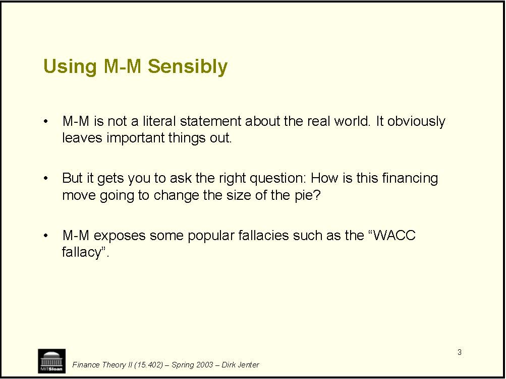

3 • • • fallacy”. Finance Theory II (15.402) – Spring 2003 – Dirk Jenter Using M-M Sensibly M-M is not a literal statement about the real world. It obviously leaves important things out. But it gets you to ask the right question: How is this financing move going to change the size of the pie? M-M exposes some popular fallacies such as the “WACC 

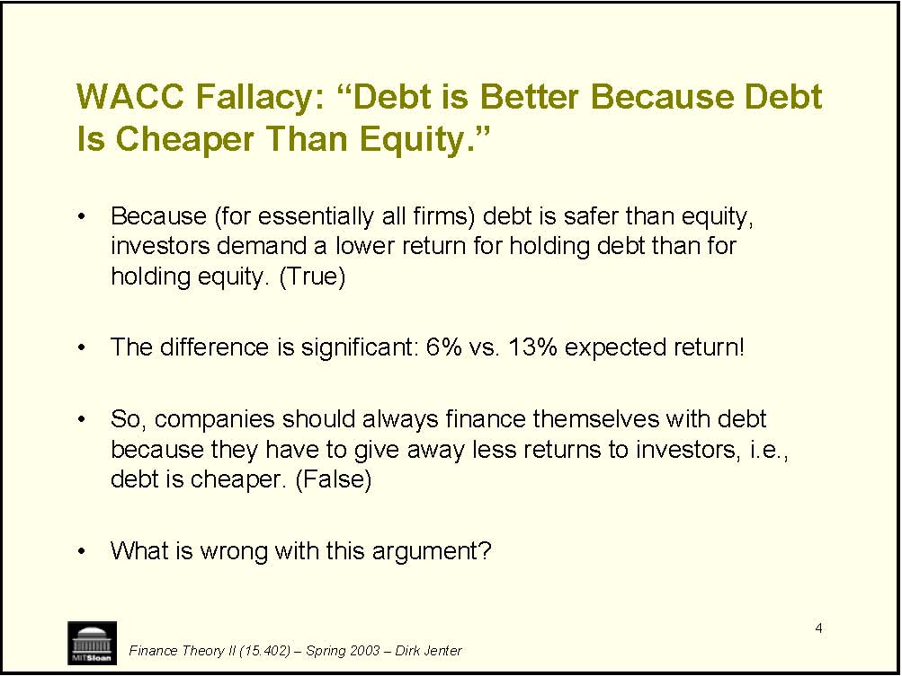

4 • ) • • i i) • Finance Theory II (15.402) – Spring 2003 – Dirk Jenter WACC Fallacy: “Debt is Better Because Debt Is Cheaper Than Equity.” Because (for essentially all firms) debt is safer than equity, investors demand a lower return for holding debt than for holding equity. (TrueThe difference is significant: 6% vs. 13% expected return! So, companies should always finance themselves with debt because they have to give away less returns tonvestors,.e., debt is cheaper. (FalseWhat is wrong with this argument? 

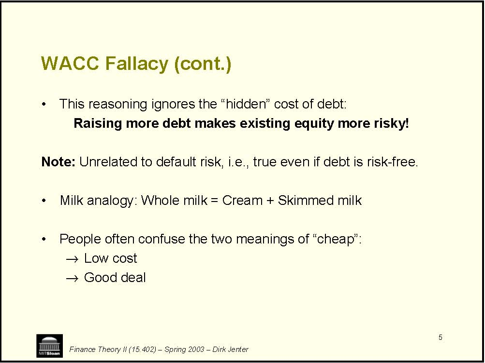

5 • • • →→Finance Theory II (15.402) – Spring 2003 – Dirk Jenter WACC Fallacy (cont.) This reasoning ignores the “hidden” cost of debt: Raising more debt makes existing equity more risky! Note: Unrelated to default risk, i.e., true even if debt is risk-free. Milk analogy: Whole milk = Cream + Skimmed milk People often confuse the two meanings of “cheap”: Low cost Good deal 

6 Practical Implications of MM • →→• →→→→Finance Theory II (15.402) – Spring 2003 – Dirk Jenter When evaluating a decision (e.g., the effect of a merger): Separate financial (RHS) and real (LHS) parts of the move MM tells that most value is created on LHS When evaluating an argument in favor of a financial decision: Understand that it is wrong under MM assumptions What departures from MM assumptions does it rely upon? If none, then this is very dubious argument. If some, try to assess their magnitude. 

7 What’s Missing from the Simple M-M Story? • →→• i• • • Finance Theory II (15.402) – Spring 2003 – Dirk Jenter Taxes: Corporate taxes Personal taxes Costs of Fnancial Distress No transaction costs for issuing debt or equity No asymmetric information about the firm’s investments Capital structure does not influence managers’ investment decisions 

8 Capital Structure and Corporate Taxes • • • →are →taxed. Finance Theory II (15.402) – Spring 2003 – Dirk Jenter Financial policy matters because it affects a firm’s tax bill. Different financial transactions are taxed differently. For a corporation: Interest payments are considered a business expense, and tax exempt for the firm. Dividends and retained earnings are 

Debt Tax Shield 

Claim: Debt increases firm value by reducing the tax burden. 

Example: XYZ Inc. generates a safe $100M annual perpetuity. Assume risk-free rate of 10%. Compare: 

- 100% debt: perpetual $100M interest 

- 100% equity: perpetual $100M dividend or capital gains 

<Table>
<TR>

<TD>100% Debt </TD>
<TD>100% Equity </TD>
</TR>
<TR>
<TD>Income before tax </TD>
<TD>Interest Income $100M </TD>
<TD>Equity income $100M </TD>
</TR>
<TR>
<TD>Corporate tax rate 35% </TD>
<TD>0 </TD>
<TD>-$35M </TD>
</TR>
<TR>
<TD>Income after tax </TD>
<TD>$100M </TD>
<TD>$65M </TD>
</TR>
<TR>
<TD>Firm value </TD>
<TD>$1,000M </TD>
<TD>$650M </TD>
</TR>
</Table>

9 

Finance Theory II (15.402) – Spring 2003 – Dirk Jenter 

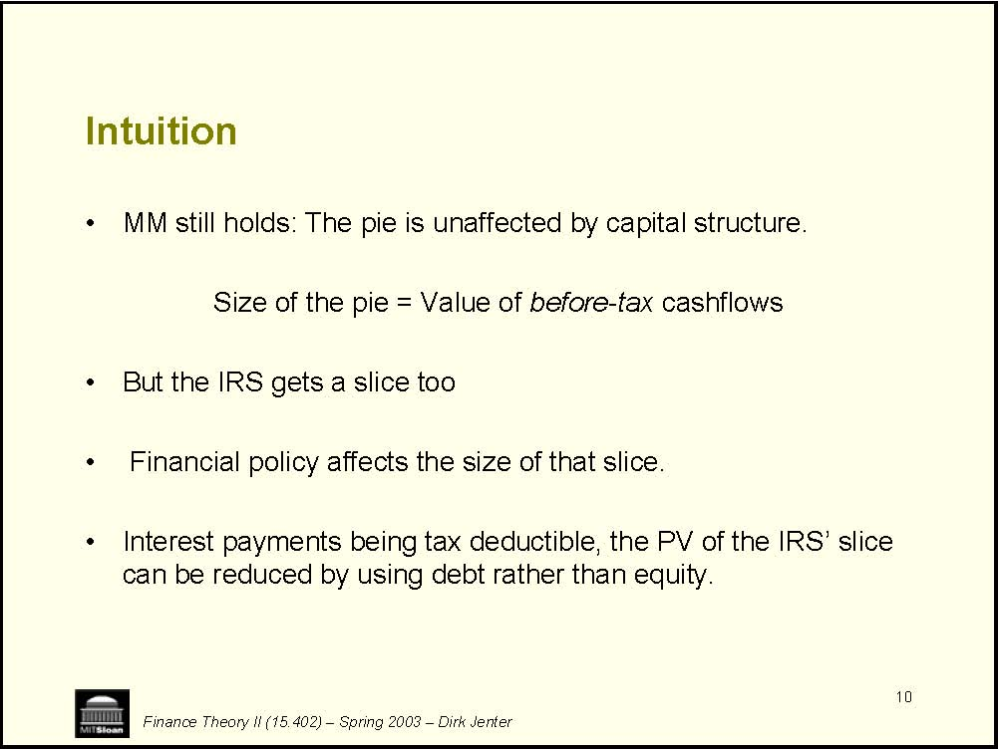

10 Intuition • l• • • Finance Theory II (15.402) – Spring 2003 – Dirk Jenter MM still holds: The pie is unaffected by capital structure. Size of the pie = Value of before-tax cashfows But the IRS gets a slice too Financial policy affects the size of that slice. Interest payments being tax deductible, the PV of the IRS’ slice can be reduced by using debt rather than equity. 

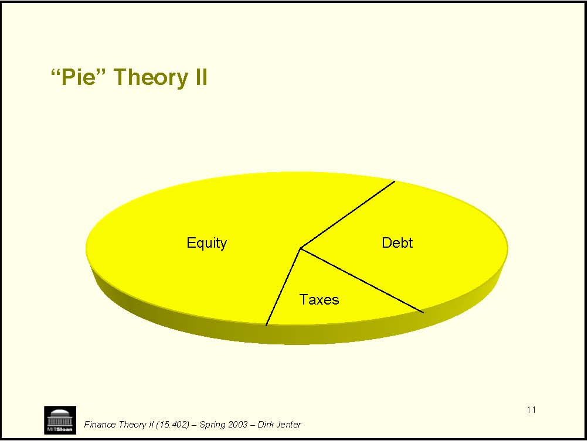

11 Debt Finance Theory II (15.402) – Spring 2003 – Dirk Jenter “Pie” Theory II Equity Taxes 

12 Tax savings of debt (interest) Interest = rd * D ) d * D d) r D d d ===PFinance Theory II (15.402) – Spring 2003 – Dirk Jenter Marginal tax rate = t Taxes for unlevered firm………………t * EBIT Taxes for levered firm………………....t * EBIT – Interest tax shield…………………….t * interest Interest tax shield (each year= t * rIf debt is a perpetuity: (Discount rate for tax shields = rD t r t rate interest year per shields tax shields) tax V(interst 

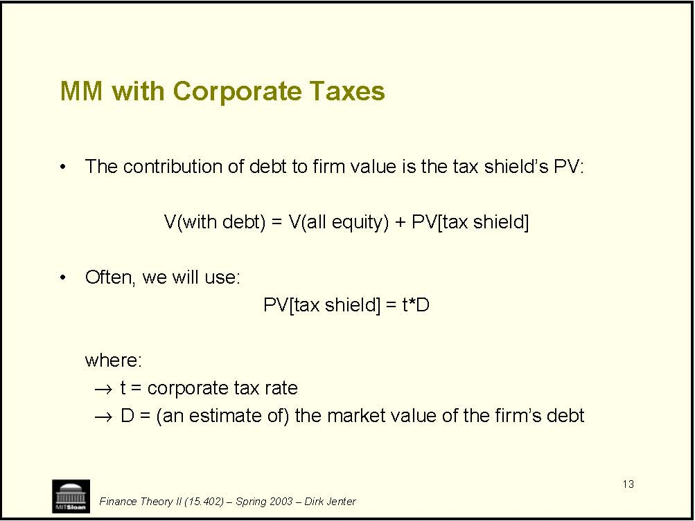

13 MM with Corporate Taxes • i(• →→) Finance Theory II (15.402) – Spring 2003 – Dirk Jenter The contribution of debt to frm value is the tax shield’s PV: V(with debt) = Vall equity) + PV[tax shield] Often, we will use: PV[tax shield] = t*D where: t = corporate tax rate D = (an estimate ofthe market value of the firm’s debt 

14 Is This Important or Negligible? • • →→• • t = 35%: →→()()()Dt1 ⋅+=Finance Theory II (15.402) – Spring 2003 – Dirk Jenter Firm A has no debt and is worth V(all equity). Suppose Firm A undertakes a leveraged recapitalization: issues debt worth D, and buys back equity with the proceeds. Its new value is: Thus, with corporate tax rate for D = 20%, firm value increases by about 7%. for D = 50%, it increases by about 17.5%. equity all V equity all V debt with V 

15 Bottom Line • • • • →→Finance Theory II (15.402) – Spring 2003 – Dirk Jenter Tax shield of debt matters, potentially quite a bit. Pie theory gets you to ask the right question: How does a financing choice affect the IRS’ bite of the corporate pie? It is standard to use t*D for the capitalization of debt’s tax break. Caveats: Not all firms face full marginal tax rate. Definitely not OK for non taxpaying companies. Personal taxes 

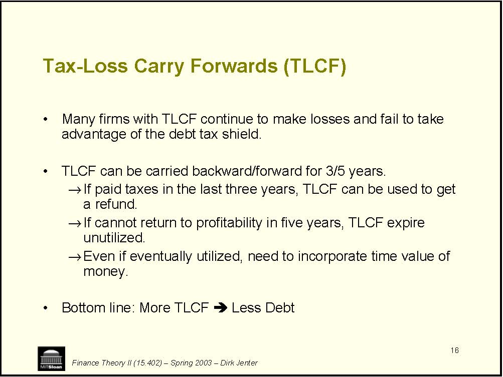

16 • • →→unutilized. →money. • Î Finance Theory II (15.402) – Spring 2003 – Dirk Jenter Tax-Loss Carry Forwards (TLCF) Many firms with TLCF continue to make losses and fail to take advantage of the debt tax shield. TLCF can be carried backward/forward for 3/5 years. If paid taxes in the last three years, TLCF can be used to get a refund. If cannot return to profitability in five years, TLCF expire Even if eventually utilized, need to incorporate time value of Bottom line: More TLCF Less Debt 

17 Personal Taxes • • (e.g., US): →→→interest) →• →• Finance Theory II (15.402) – Spring 2003 – Dirk Jenter Investors’ return from debt and equity are taxed differently Classical Tax Systems Interest and dividends are taxed as ordinary income. Capital gains are taxed at a lower rate. Capital gains can be deferred (contrary to dividends and Corporations have a 70% dividend exclusion Imputation Systems (e.g., most of Europe) Tax credit for recipients of dividends ( = fraction of corporate tax on profits) reduces the double taxation of dividends So: For personal taxes, equity dominates debt. 

Maximize After-Tax Income: 

<Table>
<TR>

<TD>Debt </TD>
<TD>Equity with </TD>
<TD>Equity with All </TD>
</TR>
<TR>

<TD>(Deferred) Capital Gains </TD>
<TD>Dividends </TD>
</TR>
<TR>
<TD>Corporate Level </TD>

</TR>
<TR>
<TD>  Start with $1 </TD>
<TD>1 </TD>
<TD>1 </TD>
<TD>1 </TD>
</TR>
<TR>
<TD>Tax: TC</TD>
<TD>0 </TD>
<TD>TC</TD>
<TD>TC </TD>
</TR>
<TR>
<TD>Net </TD>
<TD>1 </TD>
<TD>(1- TC) </TD>
<TD>(1- TC) </TD>
</TR>
<TR>
<TD>Personal Level Tax: TP and TPE </TD>
<TD>TP </TD>
<TD>TPE </TD>
<TD>TP </TD>
</TR>
<TR>
<TD>Bottom Line </TD>
<TD>(1-TP) </TD>
<TD>(1- TC)* (1-TPE) </TD>
<TD>(1- TC)* (1- TP) </TD>
</TR>
</Table>

Relative Tax Advantage of Debt: (1-Tp) / (1-TC)* (1-TPE) 

18 

Finance Theory II (15.402) – Spring 2003 – Dirk Jenter 

Post-Clinton I: 

<Table>
<TR>

<TD>Debt </TD>
<TD>Equity with Capital </TD>
<TD>Equity with All </TD>
</TR>
<TR>

<TD>Gains* </TD>
<TD>Dividends </TD>
</TR>
<TR>
<TD>Corporate Level </TD>

</TR>
<TR>
<TD>Start with $100 </TD>
<TD>100 </TD>
<TD>100 </TD>
<TD>100 </TD>
</TR>
<TR>
<TD>Tax: 35% </TD>
<TD>0 </TD>
<TD>35 </TD>
<TD>35 </TD>
</TR>
<TR>
<TD>Net </TD>
<TD>100 </TD>
<TD>65 </TD>
<TD>65 </TD>
</TR>
<TR>
<TD>Personal Level </TD>

</TR>
<TR>
<TD>Tax: 39% (20%) </TD>
<TD>39% * 100 </TD>
<TD>20% * 65 </TD>
<TD>39% * 65 </TD>
</TR>
<TR>

<TD>= 39 </TD>
<TD>= 13 </TD>
<TD>= 25.35 </TD>
</TR>
<TR>
<TD>Bottom Line </TD>
<TD>61 </TD>
<TD>52 </TD>
<TD>39.65 </TD>
</TR>
</Table>

*Extreme assumption: No deferral, 20% capital gains tax 

19 

Finance Theory II (15.402) – Spring 2003 – Dirk Jenter 

Post-Clinton II: Some deferred capital gains 

<Table>
<TR>

<TD>Debt </TD>
<TD>Equity with </TD>
<TD>Equity with All </TD>
</TR>
<TR>

<TD>Deferred Capital </TD>
<TD>Dividends </TD>
</TR>
<TR>

<TD>Gains* </TD>

</TR>
<TR>
<TD>Corporate Level </TD>

</TR>
<TR>
<TD>  Start with $100 </TD>
<TD>100 </TD>
<TD>100 </TD>
<TD>100 </TD>
</TR>
<TR>
<TD>Tax: 35% </TD>
<TD>0 </TD>
<TD>35 </TD>
<TD>35 </TD>
</TR>
<TR>
<TD>  Net </TD>
<TD>100 </TD>
<TD>65 </TD>
<TD>65 </TD>
</TR>
<TR>
<TD>Personal Level </TD>

</TR>
<TR>
<TD>Tax: 39% (10%) </TD>
<TD>39% * 100 </TD>
<TD>10% * 65 </TD>
<TD>39% * 65 </TD>
</TR>
<TR>

<TD>= 39 </TD>
<TD>= 6.50 </TD>
<TD>= 25.35 </TD>
</TR>
<TR>
<TD>Bottom Line </TD>
<TD>61 </TD>
<TD>58.5 </TD>
<TD>39.65 </TD>
</TR>
</Table>

*Assumption: Effective capital gains tax rate of 10% 

20 

Finance Theory II (15.402) – Spring 2003 – Dirk Jenter 

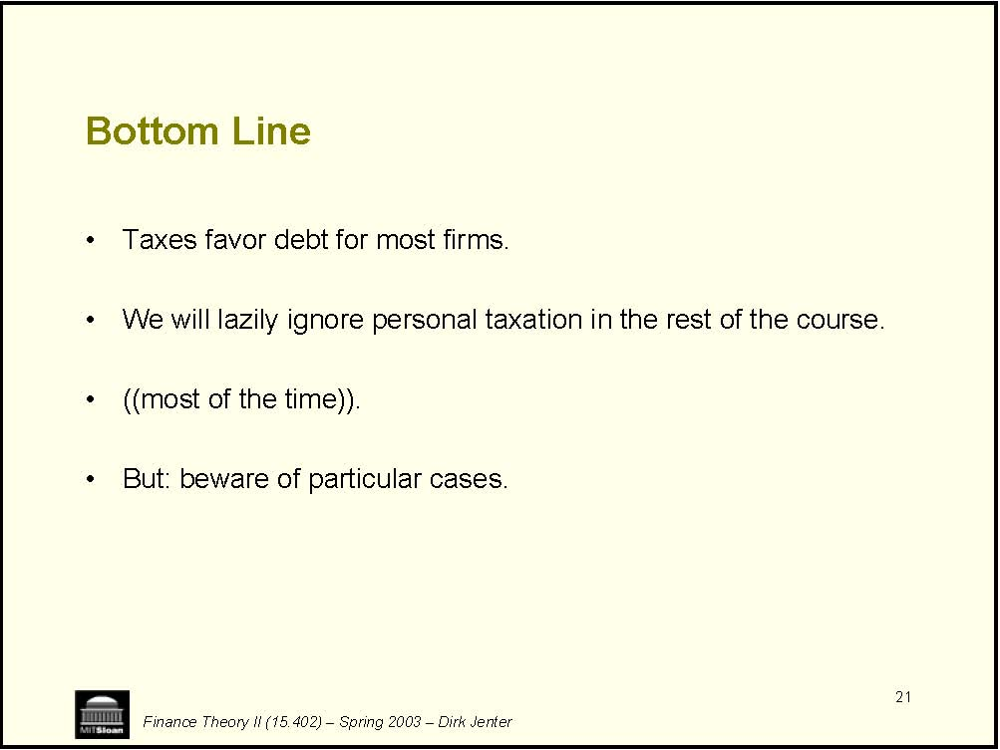

21 Bottom Line • • • (• Finance Theory II (15.402) – Spring 2003 – Dirk Jenter Taxes favor debt for most firms. We will lazily ignore personal taxation in the rest of the course. (most of the time)). But: beware of particular cases. 

22 Implications: Leverage is good? • • Finance Theory II (15.402) – Spring 2003 – Dirk Jenter Since taxes favor debt for most firms, should all firms be 100% debt financed? Why don’t all firms lever up and save on corporate taxes? 

23 Cost of Financial Distress • )• • . Finance Theory II (15.402) – Spring 2003 – Dirk Jenter The Dark Side of Debt: If taxes were the only issue, (most companies would be 100% debt financed. Common sense suggests otherwise: If the debt burden is too high, the company will have trouble paying. The result: financial distress

24 Financial Distress: Causes and Effects • wi→→→→• i• →Fi→Filiquiise? Finance Theory II (15.402) – Spring 2003 – Dirk Jenter Financial Distress – Cash flow is not sufficient to cover current obligations, which starts a process of resolving the broken contract th creditors. Private renegotiation or workout. Bankruptcy, supervised by court. Chapter 7 or Chapter 11. See BM, Appendix to Chapter 25. It is important not to confuse the causes and effects of financial distress whendentifying the potential “costs of financial distress”! Only those costs that would not arise outside financial distress should be counted: rms in financial distress perform poorly: Cause or effect? nancial distress sometimes results in partial or complete dation of the firm’s assets: Would these not occur otherw

25 Debt FiFinance Theory II (15.402) – Spring 2003 – Dirk Jenter “Pie” Theory Equity Taxes Destroyed in nancial Distress 

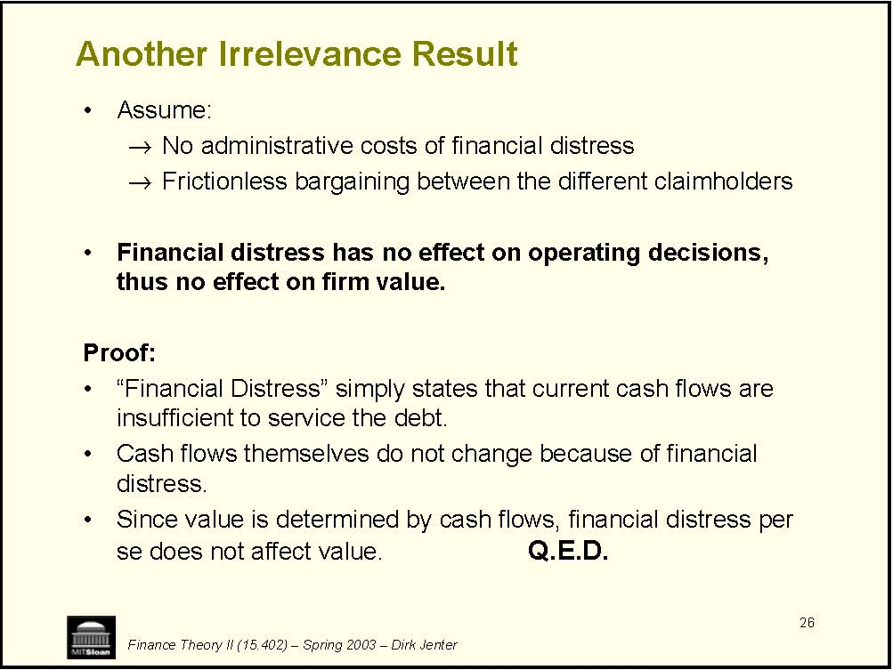

26 Another Irrelevance Result • →→lders • Proof: • i• distress. • Q.E.D. Finance Theory II (15.402) – Spring 2003 – Dirk Jenter Assume: No administrative costs of financial distress Frictionless bargaining between the different claimhoFinancial distress has no effect on operating decisions, thus no effect on firm value. “Financial Distress” simply states that current cash flows are insufficent to service the debt. Cash flows themselves do not change because of financial Since value is determined by cash flows, financial distress per se does not affect value. 

27 • • →→• i→Finance Theory II (15.402) – Spring 2003 – Dirk Jenter Using This Sensibly Like M-M, this is not a literal statement about the real world. But it provides a useful benchmark: What are the transaction costs in financial restructuring? What is preventing claimholders from reaching a mutually beneficial agreement? It also warns against hasty conclusions. Only those costs that would not arise outside financial dstress should be counted: The fact that firms in financial distress often have falling sales, bad operating and poor financial performance is usually the cause, not an effect of financial distress. 

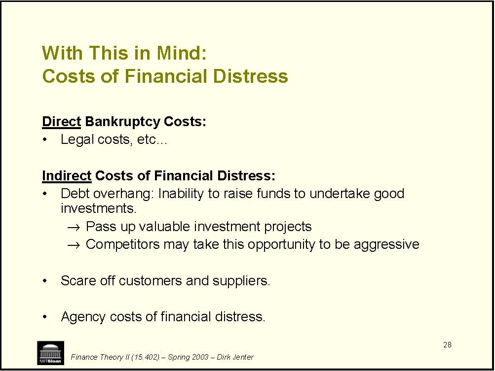

28 Costs of Financial Distress • • →→• • Finance Theory II (15.402) – Spring 2003 – Dirk Jenter With This in Mind: Direct Bankruptcy Costs: Legal costs, etc… Indirect Costs of Financial Distress: Debt overhang: Inability to raise funds to undertake good investments. Pass up valuable investment projects Competitors may take this opportunity to be aggressive Scare off customers and suppliers. Agency costs of financial distress. 

29 • ¾ ¾ • ¾ ¾ ¾ Overall, Finance Theory II (15.402) – Spring 2003 – Dirk Jenter Direct Bankruptcy Costs What are direct bankruptcy costs? Legal expenses, court costs, advisory fees… Also opportunity costs, e.g., time spent by dealing with creditors How important are direct bankruptcy costs? Direct costs represent (on average) some 2-5% of total firm value for large companies and up to 20-25% for small ones. But this needs to be weighted by the bankruptcy probability! expected direct costs tend to be small 

30 Indirect Costs: Debt Overhang • • →→• Finance Theory II (15.402) – Spring 2003 – Dirk Jenter XYZ’s assets in place (with idiosyncratic risk) worth: XYZ has a new investment project: Today: Investment outlay $15M Next year: Safe return $22M With 10% risk-free rate, XYZ should undertake the project: NPV = -15 + 22/1.1 = $5M State Probability Assets Good 1/2 100 Bad 1/2 10 

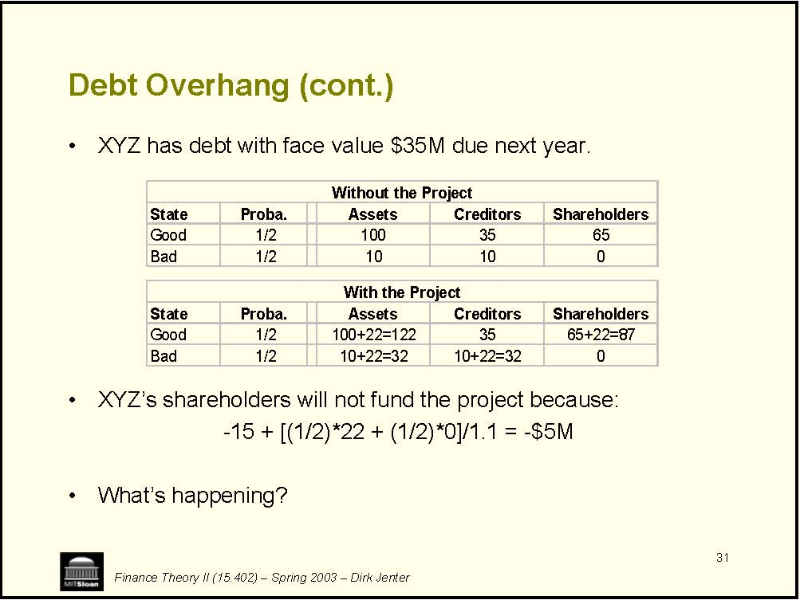

31 • • [(• 100 35 65 1/2 10 10 0 Wiject 35 1/2 0 WijFinance Theory II (15.402) – Spring 2003 – Dirk Jenter Debt Overhang (cont.) XYZ has debt with face value $35M due next year. XYZ’s shareholders will not fund the project because: -15 + 1/2)*22 + (1/2)*0]/1.1 = -$5M What’s happening? State Proba. Assets Creditors Shareholders Good 1/2 Bad thout the ProState Proba. Assets Creditors Shareholders Good 1/2 100+22=122 65+22=87 Bad 10+22=32 10+22=32 th the Proect 

32 • →→) • →→) • • • Finance Theory II (15.402) – Spring 2003 – Dirk Jenter Debt Overhang (cont.) Shareholders would: Incur the full investment cost: -$15M Receive only part of the return (22 only in the good stateExisting creditors would: Incur none of the investment cost Still receive part of the return (22 in the bad stateSo, existing risky debt acts as a “tax on investment” Shareholders of firms in financial distress are reluctant to fund valuable projects because most of the benefits go to the firm’s existing creditors. This effect becomes stronger as the debt becomes more risky and financial distress more likely. 

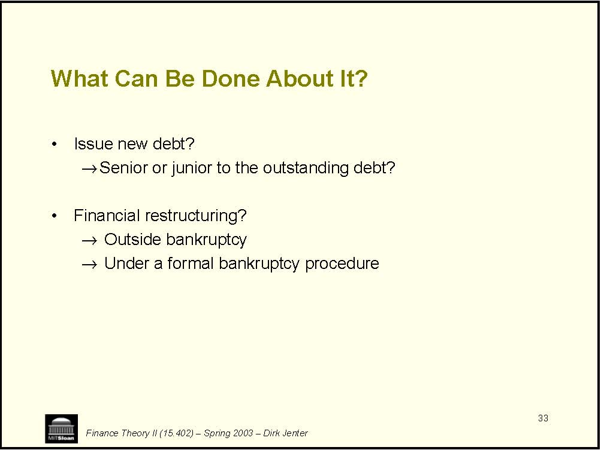

33 Finance Theory II (15.402) – Spring 2003 – Dirk Jenter What Can Be Done About It? • Issue new debt? →Senior or junior to the outstanding debt? • Financial restructuring? →Outside bankruptcy →Under a formal bankruptcy procedure 

34 Finance Theory II (15.402) – Spring 2003 – Dirk Jenter Issuing New Debt • Issuing new debt with lower senioritylower seniorityas the existing debt ¾ Will not improve things: the “tax” is unchanged • Issuing debt with same seniority ¾ Will mitigate but not solve the problem: a (smaller) tax remains • Issuing debt with higher seniority ¾ Avoids the tax on investment because gets a larger part of payoff ¾ Similar: debt with shorter maturity (de facto senior) ™ However, this is often prohibited by covenants 

35 Financial Restructuring? • →→• ). • ject? 35 65 1/2 10 0 g 24 98 1/2 32 8 g Finance Theory II (15.402) – Spring 2003 – Dirk Jenter In principle, restructuring could avoid the inefficiency: debt for equity exchange debt forgiveness or rescheduling Say creditors reduce the face value to $24M (conditionally on the firm raising new equity to fund the projectWill shareholders go ahead with the proState Proba. Assets Creditors Shareholders Good 1/2 100 Bad 10 Without RestructurinState Proba. Assets Creditors Shareholders Good 1/2 122 Bad 24 With Restructurin

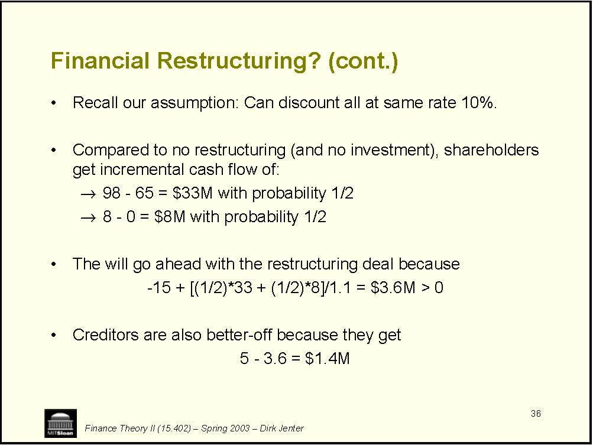

36 Financial Restructuring? (cont.) • • →→• [(• Finance Theory II (15.402) – Spring 2003 – Dirk Jenter Recall our assumption: Can discount all at same rate 10%. Compared to no restructuring (and no investment), shareholders get incremental cash flow of: 98 -65 = $33M with probability 1/2 8 -0 = $8M with probability 1/2 The will go ahead with the restructuring deal because -15 + 1/2)*33 + (1/2)*8]/1.1 = $3.6M &gt; 0 Creditors are also better-off because they get 5 -3.6 = $1.4M 

37 Financial Restructuring? (cont.) • i• • →→→→) Finance Theory II (15.402) – Spring 2003 – Dirk Jenter When evaluating financial dstress  costs, account for the possibility of (mutually beneficial) financial restructuring. In practice, perfect restructuring is not always possible. But you should ask: What are limits to restructuring? Banks vs. bonds Few vs. many banks Bank relationship vs. arm’s length finance Simple vs. complex debt structure (e.g., number of classes with different seniority, maturity, security, ….

38 • debt. • too much debt. • • ities →→Bank debt →Finance Theory II (15.402) – Spring 2003 – Dirk Jenter Debt Overhang: Preventive Measures Firms which are likely to enter financial distress should avoid too much Firms which anticipate the need to raise funds in the future should avoid Firms which expect to have valuable investment opportunities in the future should avoid too much debt. If you cannot avoid leverage, at least you should structure your liabilso that they are easy to restructure if needed: Active management of liabilities  Few banks 

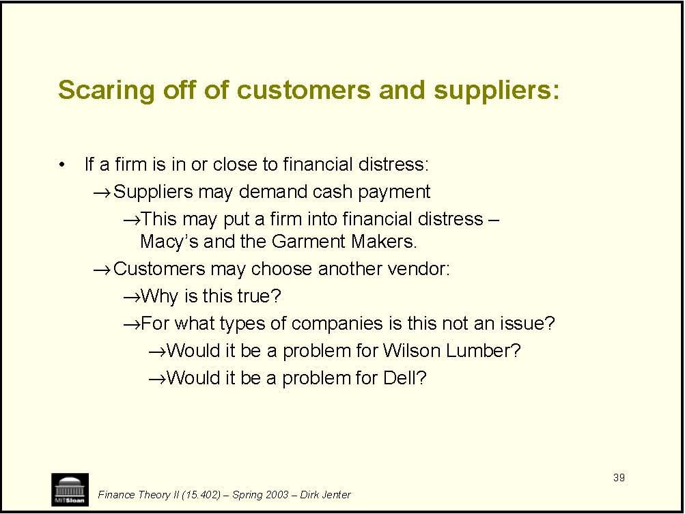

39 Scaring off of customers and suppliers: • →→→→→→→Finance Theory II (15.402) – Spring 2003 – Dirk Jenter If a firm is in or close to financial distress: Suppliers may demand cash payment This may put a firm into financial distress – Macy’s and the Garment Makers. Customers may choose another vendor: Why is this true? For what types of companies is this not an issue? Would it be a problem for Wilson Lumber? Would it be a problem for Dell? 

40 • iing ways. l→→→• →Finance Theory II (15.402) – Spring 2003 – Dirk Jenter Agency Costs of Financial Distress Financial distress may motvate managers to act in (ex-ante) value-destroy•Exampes: Excessive risk-taking (gambling for resurrection). Delay of (efficient) liquidation. Cash-in-and-run: Take money out of company. Why are these strategies costly to shareholders? Because debt-holders anticipate them and pay less for debt when issued. 

41 Textbook View of Optimal Capital Structure →Taxes →ital Finance Theory II (15.402) – Spring 2003 – Dirk Jenter 1. Start with M-M Irrelevance 2. Add two ingredients that change the size of the pie. Expected Distress Costs 3. Trading off the two gives you the “static optimum” capstructure. (“Static” because this view suggests that a company should keep its debt relatively stable over time.) 

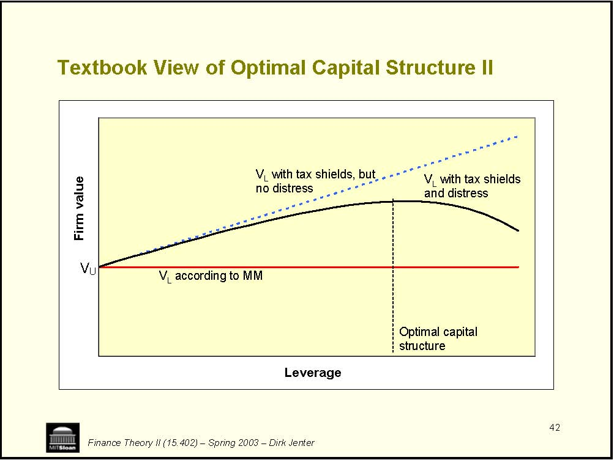

42 VU VL wiVL wiVL ilFinance Theory II (15.402) – Spring 2003 – Dirk Jenter Textbook View of Optimal Capital Structure II Leverage Firm valueth tax shields, but no distress th tax shields and distress accordng to MM Optima capital structure 

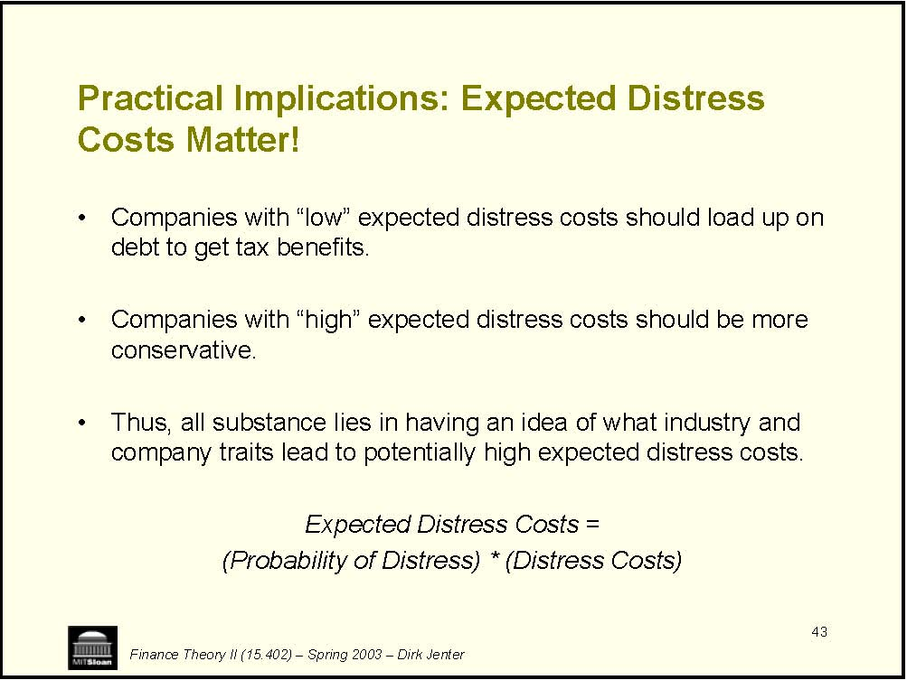

43 Practical Implications: Expected Distress Costs Matter! • • • Finance Theory II (15.402) – Spring 2003 – Dirk Jenter Companies with “low” expected distress costs should load up on debt to get tax benefits. Companies with “high” expected distress costs should be more conservative. Thus, all substance lies in having an idea of what industry and company traits lead to potentially high expected distress costs. Expected Distress Costs = (Probability of Distress) * (Distress Costs) 

44 • →lows: -i• →→→→Finance Theory II (15.402) – Spring 2003 – Dirk Jenter Identifying Expected Distress Costs Probability of Distress Volatile cash fndustry change -macro shocks -technology change -start-up -cyclical industry Distress Costs Need external funds to invest in CAPX or market share Financially strong competitors Customers or suppliers care about your financial position (e.g., because of implicit warranties or specific investments) Assets cannot be easily redeployed 

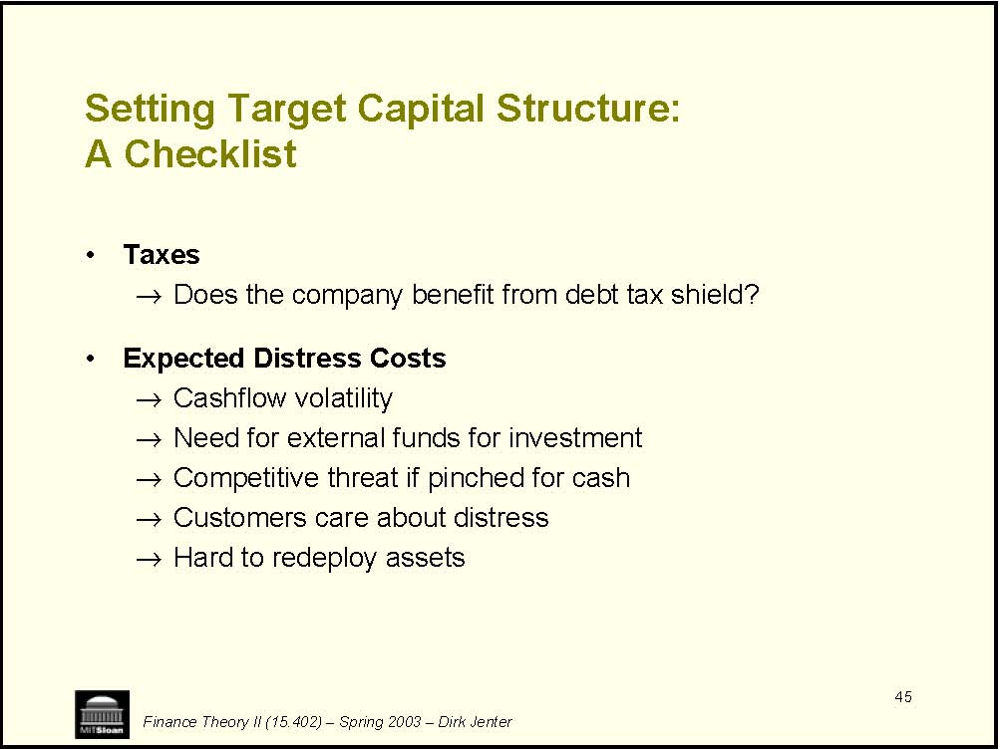

45 Setting Target Capital Structure: A Checklist • Taxes →• →Cashflow volatility →→→→Finance Theory II (15.402) – Spring 2003 – Dirk Jenter Does the company benefit from debt tax shield? Expected Distress Costs Need for external funds for investment Competitive threat if pinched for cash Customers care about distress Hard to redeploy assets 

Does the Checklist Explain Observed Debt Ratios?

<Table>
<TR>
<TH> Industry </TH>
<TH>Debt Ratio (</TH>
<TH>%)</TH>
</TR>
<TR>
<TD> Electric and Gas </TD>
<TD>43.2</TD>

</TR>
<TR>
<TD> Food Production </TD>
<TD>22.9</TD>

</TR>
<TR>
<TD> Paper and Plastic </TD>
<TD>30.4 </TD>

</TR>
<TR>
<TD>Equipment </TD>
<TD>19.1 </TD>

</TR>
<TR>
<TD>Retailers </TD>
<TD>21.7 </TD>

</TR>
<TR>
<TD>Chemicals </TD>
<TD>17.3</TD>

</TR>
<TR>
<TD> Computer Software </TD>
<TD>3.5 </TD>

</TR>
</Table>

46 

Finance Theory II (15.402) – Spring 2003 – Dirk Jenter 

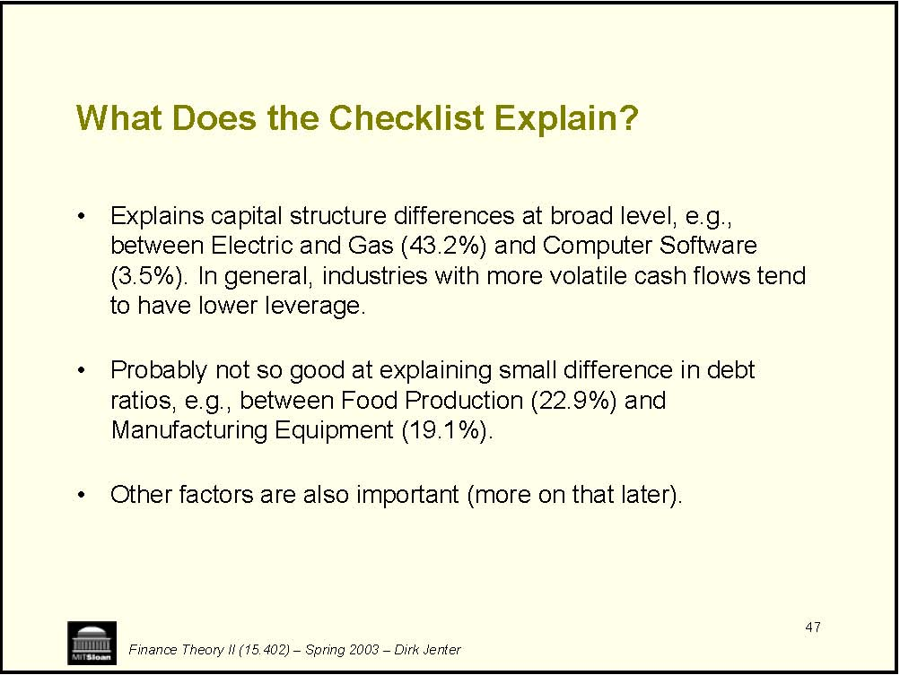

47 What Does the Checklist Explain? • il• ) • Finance Theory II (15.402) – Spring 2003 – Dirk Jenter Explains capital structure dfferences at broad level, e.g., between Electric and Gas (43.2%) and Computer Software (3.5%). In general, industries with more volatile cash fows tend to have lower leverage. Probably not so good at explaining small difference in debt ratios, e.g., between Food Production (22.9%and Manufacturing Equipment (19.1%). Other factors are also important (more on that later). 

Finance Theory II (15.402) – Spring 2003 – Dirk Jenter Appendix (for your information) 

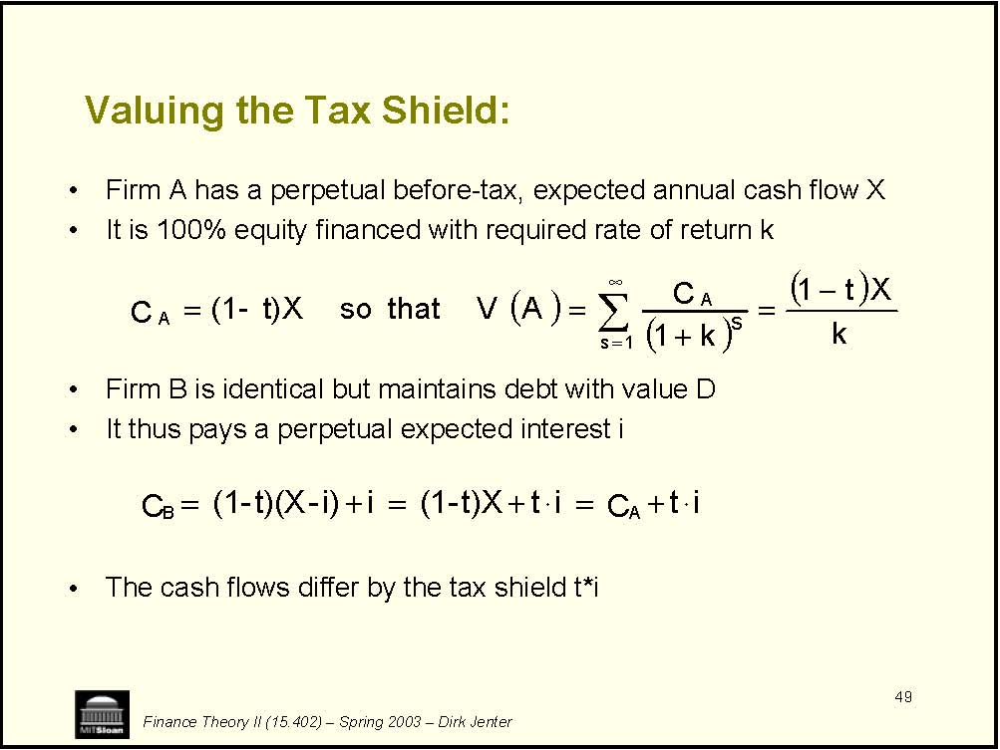

49 Valuing the Tax Shield: • • • • • ()()()∑ ∞=−=+==1s A A k 1 k1 CAVC s itCitii)C AB =Finance Theory II (15.402) – Spring 2003 – Dirk Jenter Firm A has a perpetual before-tax, expected annual cash flow X It is 100% equity financed with required rate of return k Firm B is identical but maintains debt with value D It thus pays a perpetual expected interest i The cash flows differ by the tax shield t*i X t that so t)X (1t)X (1-t)(X (1-⋅+=⋅+=+

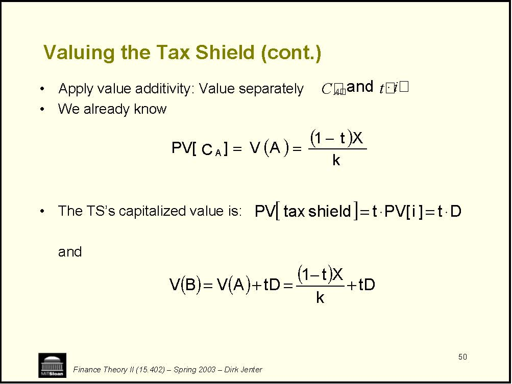

50 Valuing the Tax Shield (cont.) • • • and []]i CA⋅and ()()k 1]CPV[ A −==()()()tD k 1tD +−=+=Finance Theory II (15.402) – Spring 2003 – Dirk Jenter Apply value additivity: Value separately We already know The TS’s capitalized value is: D t PV[ t shield tax PV ⋅=⋅=itX t A V X t A V B V 

51 Tax Shields with Personal Taxes • →→→i • →→→Finance Theory II (15.402) – Spring 2003 – Dirk Jenter Every year, XYZ Inc.: generates a safe EBIT of X = $100 in perpetuity has debt paying an interest of i = $60 in perpetuity and retains the remaining X = $40 Assume the following tax rates: Corporate taxes: t = 34% Personal taxes on interests: d = 31% For simplicity, single personal tax rate on equity (dividends + retained earnings): e = 10% 

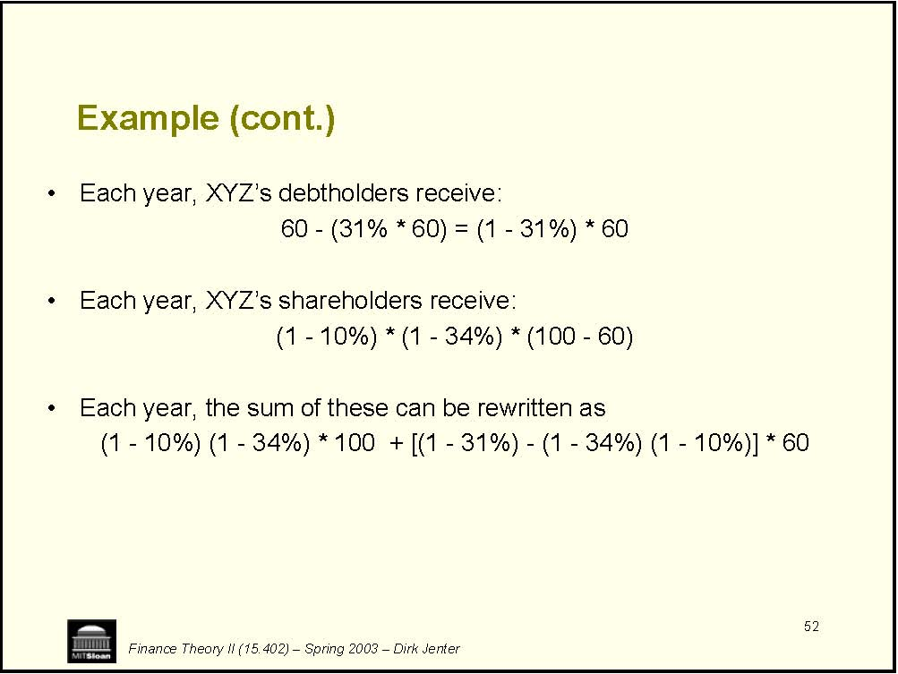

52 Example (cont.) • 60 () • () • ) * 100 + [((Finance Theory II (15.402) – Spring 2003 – Dirk Jenter Each year, XYZ’s debtholders receive: 31% * 60) = (1 -31%* 60 Each year, XYZ’s shareholders receive: (1 -10%) * 1 -34%) * (100 -60Each year, the sum of these can be rewritten as (1 -10%) (1 -34%1 -31%) 1 -34%) (1 -10%)] * 60 

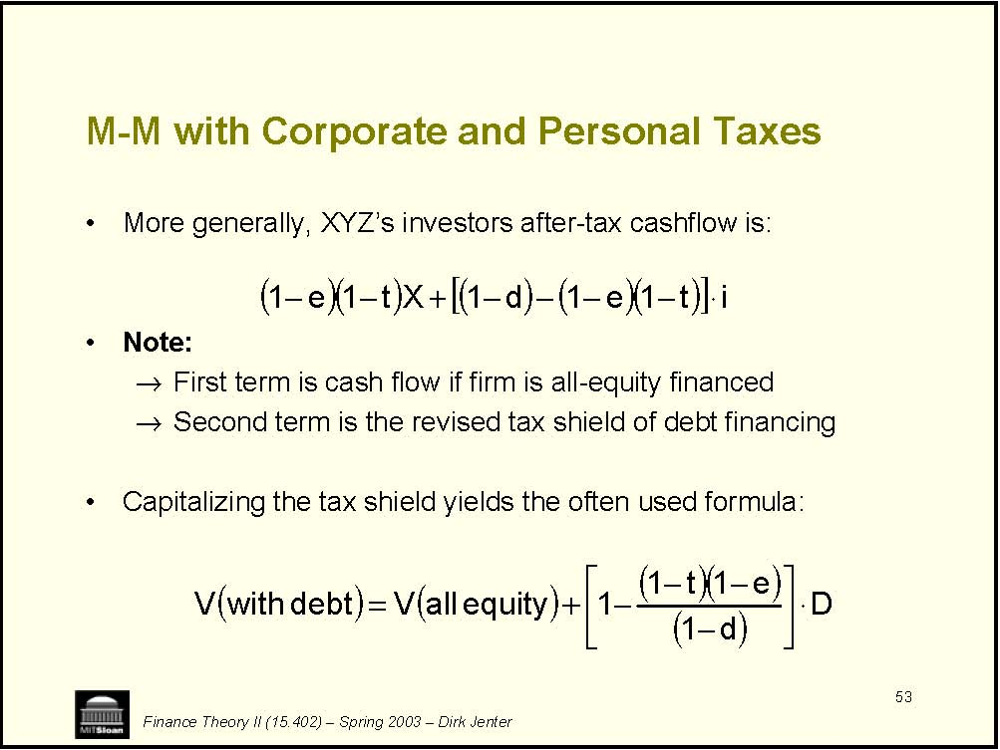

53 • • →→• ()()()()()Dd1 e11 ⋅⎥⎦⎤ ⎢⎣⎡ −−−−+=()()()()()[]it1d11 ⋅−−−−+−−Finance Theory II (15.402) – Spring 2003 – Dirk Jenter M-M with Corporate and Personal Taxes More generally, XYZ’s investors after-tax cashflow is: Note: First term is cash flow if firm is all-equity financed Second term is the revised tax shield of debt financing Capitalizing the tax shield yields the often used formula: 1 t equity all V debt with V 1 e X t 1 e 

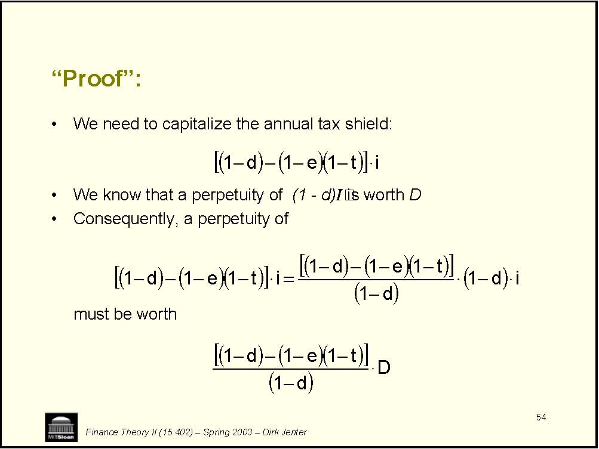

54 “Proof”: • • )ID • ()()()[]it1d1 ⋅−−−−()()()()()()id1 d1 t1d1it1d1 ⋅−⋅−−−−−=⋅−−−−()()()D d1 t1d1 ⋅−−−−−Finance Theory II (15.402) – Spring 2003 – Dirk Jenter We need to capitalize the annual tax shield: We know that a perpetuity of  (1 -dis worth Consequently, a perpetuity of must be worth 1 e 1 e 1 e 1 e 

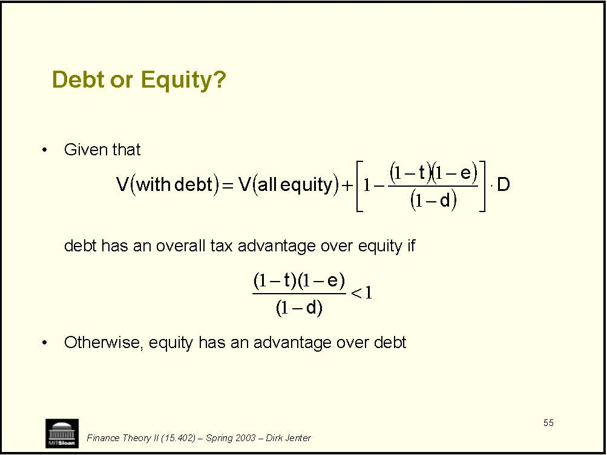

55 • • ()()()()()Dd et ⋅⎥⎦⎤ ⎢⎣⎡ −−−−+=1 111 1 1 11 &lt;−−−)d( )e( Finance Theory II (15.402) – Spring 2003 – Dirk Jenter Debt or Equity? Given that debt has an overall tax advantage over equity if Otherwise, equity has an advantage over debt equity all V debt with V )( t 

56 • d e • tD • →e = 0, ⋅+=dtif1e) &lt;&gt;−=−Finance Theory II (15.402) – Spring 2003 – Dirk Jenter Debt or Equity? (cont.) If equity pays large dividends, and and are similar, we can ignore personal taxes and debt dominates equity If equity can avoid large dividends, it does not look as bad. Indeed, with e &lt; d, the tax shield of debt is less than If shareholders can avoid capital gains taxation sufficiently (e.g., by delaying capital gains), equity can dominate debt In the extreme case D t equity) V(all debt) V(with d) (1 t) -(1 d) (1 -t)(1 -(1 
