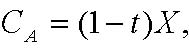

         Acrobat Distiller 6.0.1 (Windows)

         Microsoft Corporation

         D:20050428011756

         2005-04-28T09:18:25+08:00

         Acrobat PDFMaker 6.0 for Word

         2005-04-28T09:19:33+08:00

         2005-04-28T09:19:33+08:00

         uuid:5ee1cb74-41fb-4369-b0c6-8c20e674c853

         uuid:7d1ba4b1-54e1-4225-a3ec-b895580963a9

               45

         xml

               Microsoft Word - 资本结构2-A

               fxzm

资本结构 II 

课程安排概览：第一部分 -  融资 

A.  确定资金需求  

-  2月6日     案例：Wilson Lumber 1  

-  2月11日     案例：Wilson Lumber 2 

B. 最优资本结构：基本知识  

-  2月13日     讲课：资本结构 1  

- 月

-  2月25日     案例：UST Inc.(烟草公司)  

-  2月27日     案例：Massey Ferguson(农机公司)  

C. 最优资本结构：信息与代理 

-  3月4日     讲课：资本结构 3 

-  3月6日     案例：MCI 通讯公司  

-  3月11日     融资复习回顾  

-  3月13日     案例：英特尔公司 

- →220日 讲课：资本结构 2  2月20日         讲课：资本结构2 

审慎使用M-M定理  

-  MM定理并非是对真实世界确实的文字叙述。它明显地遗漏了一些重要的事情。 

-  但它可以让你提出正确的疑问：融资行为怎样才能改变“馅饼”的大小？ 

-  MM定理揭示了一些很常见的谬误如“ 加权平均资本成本谬误”。 

加权平均资本成本的谬误：“由于债务比权益廉价，因此债务优于权益” 

-  由于（基本上对所有的公司）债务比权益的安全性高。投资者对债务要求的回报要比权益的低（正确） 

-  差别非常明显，分别是：4%和13%的预期回报率。 

-  因此公司应永远以债务融资，因为这样他们支付给投资者的回报较低，即债务成本较低。（错误） 

-  这种说法错在何处？ 

加权平均资本成本的谬误（续） 

-  这一推理忽略了债务的“隐藏”成本： 

举债过多将导致已有权益的风险加大 

注：与债务违约风险无关，即，即使债务没有风险，仍然正确。 

-  牛奶类比：全脂牛奶＝奶油 + 脱脂牛奶 

-  人们经常混淆“廉价”的两种意思： 

- 低成本 

- 好买卖 

MM定理的实际含义 

-  在评价一项决策（如，合并的效果）时： 

   →要将该决策的财务方（右手方）与实际方（左手方）区分开 

   → MM定理指出大部分价值是由左手方创造的。 

-  当评估支持某一财务决策的论点时： 

   →清楚它在MM定理的假设下是站不住的 

   →论点是依靠哪些偏离MM定理假设的条件而成立的？ 

   →要是没有的话，那该论点就很可疑。 

   →要是有的话，那就要试试评估这些偏离的程度大小。 

简单的MM定理遗漏了什么？  

-  税收： 

      → 各种公司税 

      → 各种个人税 

-  财务困境成本 

-  发行债券或权益时无交易成本。 

-  对公司的投资行为不存在信息不对等情况。 

-  资本结构对管理层的投资决策不产生影响。 

资本结构与公司税 

-  财务政策关系重大因为它影响一家公司的税收 

-  对不同财务交易征收的税收不同。 

-  对一家公司而言： 

      →   利息是公司可从税项中豁免扣除的。 

      →   股息及留存收益则必须课税。 

债务税盾 

观点：债务通过减少公司的税收而使公司价值增加。 

举例：XYZ公司每年有永续性营业收益100M美元。 假设无风险利率为10%。比较： 

- 100%债务：每年100M美元利息（永续性的）。 

- 100%权益：每年100M美元股息或资本利得（永续性的）。 

<Table>

<TR>
<TD>

</TD>
<TD>

100%债务 

</TD>
<TD>

100%权益 

</TD>
</TR>
<TR>
<TD>

税前收入 

</TD>
<TD>

100M美元利息收入 

</TD>
<TD>

100M美元股息收入 

</TD>
</TR>
<TR>
<TD>

公司税率 35% 

</TD>
<TD>

0 

</TD>
<TD>

-$35M 

</TD>
</TR>
<TR>
<TD>

税后收入 

</TD>
<TD>

$100M 

</TD>
<TD>

$65M 

</TD>
</TR>
<TR>
<TD>

公司价值 

</TD>
<TD>

$100M 

</TD>
<TD>

$65M 

</TD>
</TR>

</Table>

直觉 

-  MM定理仍然适用：资本结构不影响“馅饼”大小。 

 “馅饼”大小 =  税前现金流量的价值 

-  但同时，美国税收总署（IRS）也分得了馅饼的一部分。 

-  财务政策影响的是IRS分得的那部分馅饼的大小。 

-  利息支付是免税的，与权益相比债务更能减少IRS那部分的现值。 

“馅饼”理论II 

负债带来的税收规避 

边际税率 =τ 

 无杠杆公司的税收………τ EBIT 

 有杠杆公司的税收………....τ (EBIT –利息) 

 利息税盾 ………..…..   τ利息 

------------------------------------------------------------ 

 利息 = rd D (rd：负债之利率，D：负债额) 

 利息税盾（每年） = τ rdD 

如果债务是永续性的 

(税盾的折现率 = rd) 

考虑公司税的MM定理   

-  负债对公司价值的贡献就是税盾的现值： 

       V（含债务） = V（全部权益） +  PV（税盾） 

-  通常，我们会利用：  

      PV (税盾) = t * D 

    此处： 

 → t = 公司税税率 

 → D = 公司债务的（估计）市值 

这（税盾）是十分重要还是可以忽略？ 

-  A公司没有债务，公司价值为 V（全部权益）。 

-  假如A公司利用杠杆来重新调整资本结构： 

      → 发行价值为D的债务。 

      → 利用所得收入回购部分权益。 

-  公司的新价值为 

=1+t* 

-  所以，若公司税率 t = 35%： 

      → 如D=20%，公司价值将增加约7%。 

      → 如D=50%，公司价值将增加约17.5%。 

 底线   

-  债务税盾是有影响的，并且可能是潜在的较大影响。 

-  馅饼理论让你提出正确的问题：一项融资决策是如何影响IRS所分得的那部分馅饼的？ 

-  一般标准是用 t*D表示公司债务税盾的资本贴现计算。 

-  注意： 

      →  不是所有公司都面对全额的边际税率。对那些不必交税的公司改理论并不适用。 

      → 个人税。 

税损转结（TLCF ） 

-  有许多有TLCF的公司仍然持续亏损,而没有充分利用债务税盾的好处。 

-  TLCF可以往后推3年/往前推5年   

     →  如果在过去3年有缴税，TLCF可以用来讨回退税。 

     →  如果在5年内仍不能盈利，没利用的TLCF将失效报废。 

     →  即使是最后能利用到（TLCF），仍须把现金的时间价值考虑在内。 

-  至少:  TLCF越多  债务越少  

个人税务 

-  对投资者从债券和股票所获取的报酬的课税也是不一样的。 

-  典型的税收结构（例如：美国）： 

     →     利息和股利是按一般所得缴税。 

     →     资本利得是以较低税率缴税的。 

     →     资本利得可以递延（股利和利息则不能）。  

     →     公司所得的70% 股息可获豁免。  

-  扣除利润分配中重复课税的制度（例如：大部分欧洲国家） 

     →股利的税额抵免（=公司营利税的一部分）减少了股利的双重课税。 

-  故此，就个人税务而言，权益优于债务。 

税后收入的最大化： 

<Table>

<TR>
<TD>

</TD>
<TD>

债务 

</TD>
<TD>

权益包含（递延）

资本利得 

</TD>
<TD>

权益（完全配发股利） 

</TD>
</TR>
<TR>
<TD>

公司层次 

以1美元开始 

税： 

净额 

</TD>
<TD>

1 

0 

1 

</TD>
<TD>

1 

TC

(1-TC) 

</TD>
<TD>

1 

TC

(1-TC) 

</TD>
</TR>
<TR>
<TD>

个人层次 

税： TP和TPE

</TD>
<TD>

TP

</TD>
<TD>

TPE

</TD>
<TD>

TP

</TD>
</TR>
<TR>
<TD>

最后结果 

</TD>
<TD>

(1-TP) 

</TD>
<TD>

(1-Tc)*(1-TPE) 

</TD>
<TD>

(1-Tc)*(1-TP) 

</TD>
</TR>

</Table>

债务在税收上的相对优势： (1-Tp) / (1-TC)* (1-TPE) 

后克林顿时代I： 

<Table>

<TR>
<TD>

</TD>
<TD>

债务 

</TD>
<TD>

权益（包含资本利得*）

</TD>
<TD>

权益（全部股利）

</TD>
</TR>
<TR>
<TD>

公司层次 

</TD>
<TD>

</TD>
<TD>

</TD>
<TD>

</TD>
</TR>
<TR>
<TD>

以100美元开始 

</TD>
<TD>

100 

</TD>
<TD>

100 

</TD>
<TD>

100 

</TD>
</TR>
<TR>
<TD>

税： 35% 

</TD>
<TD>

0 

</TD>
<TD>

35 

</TD>
<TD>

35 

</TD>
</TR>
<TR>
<TD>

净额  

</TD>
<TD>

100 

</TD>
<TD>

65 

</TD>
<TD>

65 

</TD>
</TR>
<TR>
<TD>

个人层次 

</TD>
<TD>

</TD>
<TD>

</TD>
<TD>

</TD>
</TR>
<TR>
<TD>

税： 39%（20%）

</TD>
<TD>

 39%×100= 39 

</TD>
<TD>

20%×65= 13 

</TD>
<TD>

39%×65= 25.35 

</TD>
</TR>
<TR>
<TD>

最后结果 

</TD>
<TD>

61 

</TD>
<TD>

52 

</TD>
<TD>

39.65 

</TD>
</TR>

</Table>

*极端假设： 沒有递延，资本利得的税率为20% 

后克林顿时代II：（有部分递延资本利得） 

<Table>

<TR>
<TD>

</TD>
<TD>

债务 

</TD>
<TD>

权益（包含递延资本利得*）

</TD>
<TD>

 权益（全部股利）

</TD>
</TR>
<TR>
<TD>

公司层次 

</TD>
<TD>

</TD>
<TD>

</TD>
<TD>

</TD>
</TR>
<TR>
<TD>

以100美元开始 

</TD>
<TD>

100  

</TD>
<TD>

100  

</TD>
<TD>

100 

</TD>
</TR>
<TR>
<TD>

税： 35%  

</TD>
<TD>

0 

</TD>
<TD>

35  

</TD>
<TD>

35  

</TD>
</TR>
<TR>
<TD>

净额  

</TD>
<TD>

100 

</TD>
<TD>

65 

</TD>
<TD>

65 

</TD>
</TR>
<TR>
<TD>

个人层次 

</TD>
<TD>

</TD>
<TD>

</TD>
<TD>

</TD>
</TR>
<TR>
<TD>

税：39%（10%） 

</TD>
<TD>

39%×100

= 39 

</TD>
<TD>

10%×65 

= 6.50 

</TD>
<TD>

39%×65 

= 25.35 

</TD>
</TR>
<TR>
<TD>

最后结果 

</TD>
<TD>

61 

</TD>
<TD>

58.5 

</TD>
<TD>

39.65 

</TD>
</TR>

</Table>

*假设： 有效资本利得税率为10% 

底线 

-  债务为大多数公司提供了税收优惠。  

-  在余下的课程里，我们暂不考虑个人税。 

-  （（大部分时间））。 

-  但：注意一些特殊案例。 

含义：杠杆有利？ 

-  既然债务为大多数公司提供了税收优惠，是否所有公司都该100%用债务来融资呢？  

-  为什么并不是所有公司都提高其杠杆率以便节省公司税收？ 

债务的负面影响：财务困境成本  

-  假如税收是唯一考虑因素，(多数)公司就该100%用债务来融资。 

-  常识告诉我们并非如此：如果公司债务过重， 公司将面临支付上的困境。  

-  结果：陷入财务困境。 

财务困境：原因与后果 

-  财政困难－—现金流量不足以支付公司短期的(利息)负担，于是展开一连串与债权人就违约的商讨事宜。 

  → 私下重新议定合约或解决方案。 

  → 破产，由法院监管。 

            →    第7章或第11章。 

            →    参阅BM，第25章的附件。 

-  重要的一点是在确定财务困境的潜在成本时，不要混淆了陷入财务困境的原因和后果。 

-  只应考虑那些要是没财务困境就不会出现的成本。 

 → 陷入财务困境的公司一般运营状况不佳：是原因还是后果？ 

→ 财务困境有时会导致公司部分或全部资产的清算。在不出现财务困境的情况下，这些情况是否会不发生？ 

“馅饼”理论 

,)1(XtCA−=

另外一个“无关紧要论”的结果 

-  假设： 

  → 财务困境的行政支出成本为零。 

  → 跟所有债权人的讨价还价都很顺利，没有摩擦。 

-  财务困境对营运决策没有影响，故而对公司价值没有影响。 

证明： 

•“财务困境”仅表明当前现金流量不足以支付债务。 

• 现金流量本身不会因为财务困境而发生变化。 

• 因为价值是取决于现金流量的，故而财务困境本身而言并不会影响公司价值。 

                                                      Q.E.D.         

审慎使用该理论  

-  和MM定理一样，这并不是对真实世界确实的文字叙述。 

-  但它提供了一些有用的指标： 

      → 财务重组中有哪些交易成本存在？ 

      → 有哪些原因妨碍债权人之间达成一个互惠互利的协议？ 

-  它也警示不要仓猝地下结论。只应考虑那些要是没财务困境就不会出现的成本： 

      → 陷入财务困境的公司通常出现销售额下降，经营状况和财务运营状况不佳，这一般被认为是财务困境的原因而非其结果。 

以此思考：财务困境的成本 

直接的破产成本： 

-  法律费用，等。 

间接的财务困境成本： 

-  债务悬空：无法筹集资金进行有利投资。 

       →  错过了有利可图的投资项目 

       → 竞争对手可能抓住这一机会而进一步侵略。 

-  使公司的客户和供应商失去信心。 

-  财务困境的代理成本 

直接破产成本： 

-  有哪些直接的破产成本？  

-  律师费，法院堂费，顾问费．．． 

-  还有机会成本，如：跟债权人协商所花费的时间 

-  直接破产成本有多大的重要性？ 

- 对大公司而言，直接破产成本大约占公司价值的2-5%，而对小公司而言则高达20-25%。 

-  但是直接破产成本需要用公司破产的概率进行加权。 

-  整体而言，预期的直接（破产）成本会比较小。 

间接成本：债务悬空 

-  当XYZ公司具有如下风险特征时其资产价值如下表：  

<Table>

<TR>
<TD>

狀況  

</TD>
<TD>

概率 

</TD>
<TD>

</TD>
<TD>

资产   

</TD>
</TR>
<TR>
<TD>

好 

</TD>
<TD>

1/2 

</TD>
<TD>

</TD>
<TD>

100 

</TD>
</TR>
<TR>
<TD>

坏   

</TD>
<TD>

1/2 

</TD>
<TD>

</TD>
<TD>

10 

</TD>
</TR>

</Table>

-  XYZ公司有一新投资项目： 

      → 当前：投资支出 1500万美元。 

      → 下一年：安全收益 2200万美元。 

-  若无风险利率为10%，则XYZ公司应投资该项目： 

      净现值（NPV）= -15 + 22/1.1 = 500万美元。 

债务悬空（续） 

-  XYZ公司明年将有面值3500万美元的债务到期。 

<Table>

<TR>
<TD>

 没有投资该项目的情况下 

</TD>
</TR>
<TR>
<TD>

狀況  

</TD>
<TD>

概率 

</TD>
<TD>

</TD>
<TD>

资产 

</TD>
<TD>

债权人 

</TD>
<TD>

股东 

</TD>
</TR>
<TR>
<TD>

好 

</TD>
<TD>

1/2 

</TD>
<TD>

</TD>
<TD>

100 

</TD>
<TD>

35 

</TD>
<TD>

65 

</TD>
</TR>
<TR>
<TD>

坏 

</TD>
<TD>

1/2 

</TD>
<TD>

</TD>
<TD>

10 

</TD>
<TD>

10 

</TD>
<TD>

0 

</TD>
</TR>
<TR>
<TD>

</TD>
<TD>

</TD>
<TD>

</TD>
<TD>

</TD>
<TD>

</TD>
<TD>

</TD>
</TR>
<TR>
<TD>

投资该项目的情况下 

</TD>
</TR>
<TR>
<TD>

狀況  

</TD>
<TD>

概率 

</TD>
<TD>

</TD>
<TD>

资产 

</TD>
<TD>

债权人 

</TD>
<TD>

股东 

</TD>
</TR>
<TR>
<TD>

好 

</TD>
<TD>

1/2 

</TD>
<TD>

</TD>
<TD>

100+22=122

</TD>
<TD>

35 

</TD>
<TD>

65+22=87 

</TD>
</TR>
<TR>
<TD>

坏 

</TD>
<TD>

1/2 

</TD>
<TD>

</TD>
<TD>

10+22=32 

</TD>
<TD>

10+22=32

</TD>
<TD>

0 

</TD>
</TR>

</Table>

-  XYZ公司股东不会为该项目融资，因为： 

     -15+[(1/2)×22 + (1/2)×0]/1.1 = -$5M 

-  这到底发生了什么？ 

债务悬空（续） 

-  股东将会： 

      → 承担全部的投资成本：-1,500万美元。 

      → 仅获得部分收益（在好的状况下收益2,200万美元）。 

-  现有债权人将会： 

      → 不必承担任何投资成本。 

      → 仍然能够获得部分收益（在坏的状况下收益2,200万美元）。 

-  所以，现有的风险债务就像是“对投资的征税”。 

-  陷入财务困境的公司的股东一般不愿为有利可图的投资项目提供融资，因为投资所得的收益大部分都归公司的债权人所有。 

-  当债务的风险增加且陷入财务困境的可能性加大时，这种效应将会更为强烈。 

对此情况有何对策？ 

-  发行新债？ 

      →优于或次于现有的未清偿债务？ 

-  财务重组？ 

→ 除破产以外 

→ 按正常破产程序破产。 

发行新债 

-  发行比现有债务具有较低优先权的新债： 

- 不会改变上述情况：＂税收＂仍然没有改变。 

-  发行跟现有债务同等优先权的新债： 

-  情况会稍有改善，但却不能解决问题：（少量的）“ 税” 依然存在。  

-  发行比现有债务较高优先权的新债：  

-  避免了“投资的税收” ，因为新的债权人获得大部分受益。 

- 同样：债务的期限更短（事实上相当于较高优先权的债权）。  

*然而，债券的限制性条款一般禁止这样做。 

财务重组？ 

-  理论上，财务重组可以避免一些无效性： 

 →    债务权益置换。 

 →    债务减免或重新制定偿还时间表。 

-  假设债权人同意将债务缩减至2400万美元（条件是公司发行新的权益为投资项目融资）。 

<Table>

<TR>
<TD>

没有财务重组  

</TD>
</TR>
<TR>
<TD>

状况  

</TD>
<TD>

概率 

</TD>
<TD>

</TD>
<TD>

资产 

</TD>
<TD>

债权人

</TD>
<TD>

股东  

</TD>
</TR>
<TR>
<TD>

好 

</TD>
<TD>

1/2 

</TD>
<TD>

</TD>
<TD>

100 

</TD>
<TD>

35 

</TD>
<TD>

65 

</TD>
</TR>
<TR>
<TD>

坏 

</TD>
<TD>

1/2 

</TD>
<TD>

</TD>
<TD>

10 

</TD>
<TD>

10 

</TD>
<TD>

0 

</TD>
</TR>
<TR>
<TD>

有财务重组 

</TD>
</TR>
<TR>
<TD>

状况  

</TD>
<TD>

概率 

</TD>
<TD>

</TD>
<TD>

资产 

</TD>
<TD>

债权人

</TD>
<TD>

股东  

</TD>
</TR>
<TR>
<TD>

好 

</TD>
<TD>

1/2 

</TD>
<TD>

</TD>
<TD>

122 

</TD>
<TD>

24 

</TD>
<TD>

98 

</TD>
</TR>
<TR>
<TD>

坏 

</TD>
<TD>

1/2 

</TD>
<TD>

</TD>
<TD>

32 

</TD>
<TD>

24 

</TD>
<TD>

8 

</TD>
</TR>

</Table>

-  股东会为该投资项目融资吗？ 

财务重组？（续） 

-  重复我们的假设：可全部用10%的折现率进行折现。 

-  与未重组（同时也没有投资）相比，股东所获现金流有所增长： 

       →9800万 – 6500万 = 3300万美元   概率为1/2 

       →800万- 0 = 800万美元            概率为 1/2 

-  股东会愿意财务重组，因为：   

       -1500万 = [(1/2)×3300万 + (1/2) ×800万]/1.1 = 360万美元 &gt; 0 

-  债权人同样受益，因为他们得到 

       500万-360万 = 140万美元 

财务重组？（续） 

-  在评估财务困境成本时，须计算财务重组（互利）的概率。 

-  在实践中，财务重组并非总是完美。 

-  但你必须要问：财务重组的限制何在？ 

      → 银行贷款 还是 债券 

      → 少数银行 还是 多家银行 

      → 与银行建立关系 还是 应急的融资 

      → 简单 还是 复杂的债务结构（如：不同等级；不同优先权，不同债券期限，不同担保，．．．） 

债务悬空：预防措施 

-  可能步入财务困境的公司应避免过多举债。 

-  预计未来有资金需求的公司应避免过多举债。 

-  预计将来具有有价值的投资机会的公司应避免过多举债。 

-  假如无法避免举债，至少你应该事先构建好负债结构，以便可以较容易的进行财务重组。 

      → 积极的负债管理。 

      → 银行贷款。 

      → 跟少数银行来往。 

使客户和供应商失去信心 

-  如果公司正处于或接近财务困境：  

      →    供应商可能要求现金交易： 

           → 这可能会促使公司进入财务困境 

－Macy's百货及其成衣制造商. 

   → 客户可能选择其他厂商： 

          →    为什么有这种可能？ 

          →    对那一类的公司来说不会出现该问题？ 

                  → Wilson Lumber公司，是否会出现这样的问题？ 

                  → Dell公司，是否会出现这样的问题？ 

财务困境的代理成本 

-  财务困境有可能导致管理层（破釜沉舟下注后）以牺牲代价的方式行事。 

-  举例： 

      → 过度冒险（作起死回生一赌）。 

      → 延误（有效的）清偿。 

      → 套现后卷款，把钱转移离开公司。 

-  为什么这些策略对股东是高成本的？ 

      → 因为债权人预期它们会发生而在债券发行时压低价格。 

课本对最优资本结构的观点  

- 1. 由MM不相关定理开始 

- 2. 加入影响＂馅饼＂大小 的两个成份。 

      → 税收。 

      → 预期财务困境成本。 

3．权衡这两者就可得到“静态最优”资本结构。（说它是“静态”是因为这一观点要求，公司在长期内得维持其债务的相对稳定。） 

课本对最优资本结构的观点II 

实际含义：预期财务困境成本并非无关紧要! 

-  具有＂低＂预期财务困境成本的公司应多举债以便取得税收的好处。 

-  具有“高”预期财务困境成本的公司应行事应更保守稳健。 

-  故此，要旨在于要掌握哪些行业和公司特征会导致潜在高的预期财务困境成本。 

        预期财务困境成本=（财务困境发生的概率）*（财务困境的成本）  

确定预期财务困境成本 

-  财务困境发生的概率 

 →   波动的现金流量： 

          －      行业变动                 －   宏观震荡 

          －      科技变动                 －   开创期 

          －      行业周期 

-  财务困境成本 

 →   需要外部资金去投资于资本支出（CAPX）或市场占有上 

 →   资金实力更强的竞争对手 

→   客户和供应商关心你公司的财务状态（如：因为不明确的担保或特殊的投资） 

 →   资产不易流通变卖 

拟定目标资本结构：核对表 

-  税收 

 →  公司是否能从债务税盾中获益？ 

-  预期财务困境成本 

 →   现金流量的波动性 

 →   需要外部资金去投资  

    →   现金抽紧会构成竞争威胁 

 →   客户关心财务困境 

 →   资产不易变卖 

核对表能解释这些观察到的债务比率吗? 

<Table>

<TR>
<TD>

行业  

</TD>
<TD>

债务比率（%） 

</TD>
</TR>
<TR>
<TD>

电力及天然气  

</TD>
<TD>

43.2 

</TD>
</TR>
<TR>
<TD>

食品生产  

</TD>
<TD>

22.9 

</TD>
</TR>
<TR>
<TD>

造纸及塑料   

</TD>
<TD>

     30.4   

</TD>
</TR>
<TR>
<TD>

机械设备  

</TD>
<TD>

19.1 

</TD>
</TR>
<TR>
<TD>

零售业   

</TD>
<TD>

21.7 

</TD>
</TR>
<TR>
<TD>

化工  

</TD>
<TD>

17.3 

</TD>
</TR>
<TR>
<TD>

电脑软件  

</TD>
<TD>

3.5 

</TD>
</TR>

</Table>

核对表解释些什么？ 

-  解释了资本结构的较大差别，如电力及天然气（43.2%）与电脑软件（3.5%）。一般来说，现金流量波动大的公司倾向利用较低的杠杆。 

-  也许对债务比率之间的微小差异解释力不强，如食品生产（22.9%）和机械设备（19.1%）。  

-  其他因素也相当重要（稍后详述）。 

附录 

（供参阅） 

税盾价值的评估 

-  A公司拥有税前永续预期现金流X。 

-  A公司为100%权益融资，要求回报率为k。 

   且  

-  B公司拥有价值为D的债务，其他情况与A公司相同。 

-  因此公司B要支付永续的预期利息i 

 CB = (1-t)(X-i) + I = (1-t) X + t . i = CA + t . i  

-  现金流量差别为税盾数额 t*i  

税盾价值的评估（续）  

-  运用价值相加特性：分别作估价 CA 和 t . i 

-  我们已知 

- 以及 

B=)(

前税前收益X = 100美元（永续性

-    →   支付债务的利

     →   剩余的X-i = 40美元为留存收益 

 假设税率如下：  

-     →  利息收入的个人所得

  →  为简便起见，对个

 ×60 

 每年，XYZ公司的股东所得： 

 每年，这两者收入之和可重新写

Z公司的投资者的税后现金流为：  +[ (1 – d) – (1 – e)(1– t)]. I 

 注意： 

-       → 

 将税盾额资本化后，就会得到常用的公

- DdVV*])1(1[)()(−−+=全部权益含债务

我们知道永续性的(1-d)i 

-  因此，永续的 

- ed−−−1)(1()1[(

- V

则在总体税收上

大，且d与e的值接近时，则

- 债务优于权益V（含债务）= V（全部权益）+ t*D  

 如果股东可以避免足够的资本利得税（如：递

-     →在e=0的极端情况下 )(1t−

     )1()1(1(ede−=−−  如果
