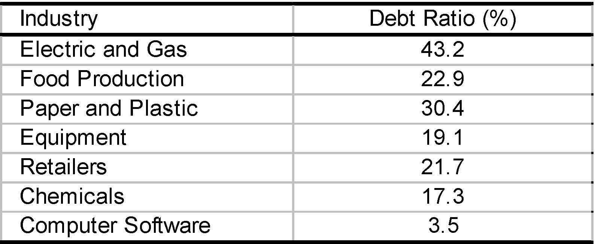

         Acrobat Distiller 6.0 (Windows)

         Compaq

         Compaq

         Acrobat PDFMaker 6.0 for PowerPoint

         2004-01-22T11:40:55+05:30

         2004-01-22T11:38:32+05:30

         2004-01-22T11:40:55+05:30

         uuid:a4e4bc1f-4946-449b-b897-63fda0e4f150

         uuid:828073eb-863b-49d6-b09a-7b95a6110e2a

         xml

               No Slide Title

               Leslie A. Larocca

Tax savings of debt: value implications

With corporate taxes (but no other complications), the value of a levered firm equals:shields) tax (interestPVVVUL+=

D   rD r   rateinterest yearper  shieldstax shields)tax V(interst Pddτ=τ==VL= VU+ τDDiscount rate for tax shields = rdIf debt is a perpetuity:

Valuing the Tax Shield (to make things clear)

Firm A: is all equity financedhas a perpetual before-tax, expected annual cash flow XFirm B: is identical but maintains debt with value DIt thus pays a perpetual expected interest rd*D )X-(1  CAτ=

⇒⋅⋅τ+τ=+τ=   Dr  )X-(1    Dr  D)r-)(X-(1CdddB

DrC  C dAB⋅⋅τ+=

Note: the cash flows differ by the tax shield τ*rd*D

To make things clear (cont.)

- We want to value firm B knowing that:

- Apply value additivity: Value separately CAand τ*rd*D

- The value of firm A is: 

- The present value of tax shields is:

- So, the value of firm B is:

DrDr )TS(PVdd⋅τ=⋅⋅τ=

DVVAB⋅τ+=

DrC  C dAB⋅⋅τ+=

AAV)C(PV=

Leverage and firm value 

VU0.000.150.300.450.60LeverageFirmvalue

Remarks

- Raising debt does not create value, i.e., you can’t create valueby borrowing and sitting on the excess cash.

- It creates value relative to raising the same amount in equity.

- Hence, value is created by the tax shield when you:

- →finance an investment with debt rather than equity

- →undertake a recapitalization, i.e., a financial transaction in which some equity is retired and replaced with debt.

Back to the Microsoft example…

What would be the value of tax shields for Microsoft?

- Interest expense = $50 ×0.07 = $3.5 billion

- Interest tax shield = $3.5 ×0.34 = $1.19 billion

- PV(taxshields) =1.19 / 0.07 = 50 ×0.34 = $17 billion

- VL= Vu+ PV(taxshields) = $440 billion

Is This Important or Negligible?

- Firm A has no debt and is worth V(all equity).

- Suppose Firm A undertakes a leveraged recapitalization:

- →issues debt worth D,

- →and buys back equity with the proceeds.

- Its new value is:

- Thus, with corporate tax rate t= 35%:

- →for D = 20%, firm value increases by about 7%.

- →for D = 50%, it increases by about 17.5%.

UULVD 1VV⋅τ+=

Bottom Line

- Tax shield of debt matters, potentially a lot.

- Pie theory gets you to ask the right question: How does this financing choice affect the IRS’ bite of the corporate pie?

- It is standard to use τ*D for the capitalization of debt’s tax break.

- Caveats:

- →Not all firms face full marginal tax rate

- →Personal taxes

Marginal tax rate (MTR)

- Present value of current and expected future taxes paid on $1 of additional income

- Why could the MTR differ from the statutory tax rate?

- Current losses

- Tax-Loss Carry Forwards (TLCF)

Tax-Loss Carry Forwards (TLCF)

- Current losses can be carried backward/forward for 3/15 years

- Can be used to offset past profitsand get tax refund

- Can be used to offset future profitsand reduce future tax bill

- Valuing TLCF, need to incorporate time value of money

- Bottom line: More TLCF Less debt

Tax-Loss Carry Forwards (TLCF): Example

MTR at time 0= PV (Additional Taxes) = 0.35/1.12 = 0.29

(assuming that r = 10%)

time (t)-3-2-1012NI100100100-500100100Carryforward0002001000Tax paid at time t353535000Tax refund00010500Suppose Net Income increases by $1 in year 0time (t)-3-2-1012NI100100100-499100100Carryforward000199990Tax paid at time t353535000.35Tax refund00010500

Marginal Tax Rates for U.S. firms

Please see the graph showing Marginal Tax Rate, Percent of 

Population, and Year in:

Graham, J.R. Debt and the Marginal Tax Rate. Journal of 

Financial Economics. May 1996, pp. 41-73.

Personal Taxes

- Investors’ return from debt and equity are taxed differently

- Interest and dividends are taxed as ordinary income

- Capital gains are taxed at a lower rate

- Capital gains can be deferred (contrary to dividends and interest)

- Corporations have a 70% dividend exclusion

- So: For personal taxes, equity dominates debt.

Pre Clinton

* Extreme assumption: No tax on capital gains

DebtEquity with deferred capital gains*Equity with dividendsCorporate levelStart with $100100100100Tax rate = 34%03434Net1006666Personal levelTax rate = 31%31020.46Botton line696645.54

Post Clinton

* Extreme assumption: No tax on capital gains

DebtEquity with deferred capital gains*Equity with dividendsCorporate levelStart with $100100100100Tax rate = 35%03535Net1006565Personal levelTax rate = 40%40026Botton line606539

Bottom Line

- Taxes favor debt for most firms

- We will lazily ignore personal taxation in the rest of the course

- But, beware of particular cases

The Dark Side of Debt: Cost of Financial Distress

- If taxes were the only issue, (most) companies would be 100% debt financed

- Common sense suggests otherwise 

- If the debt burden is too high, the company will have trouble paying

- The result: financial distress

“Pie” Theory

EquityDebtTaxesDestroyed in Financial Distress

Costs of Financial Distress

- Firms in financial distress perform poorly

- Is this poor performance an effect or a cause of financial distress?

- Financial distress sometimes results in partial or complete liquidation of the firm’s assets

- Would this not occur otherwise?

Do not confuse causes and effects of financial distress.  Only the effectsshould be counted as costs!

Costs of Financial Distress

Direct Bankruptcy Costs:

- Legal costs, etc…

Indirect Costs of Financial Distress:

- Debt overhang: Inability to raise funds to undertake good investments

- →Pass up valuable investment projects

- →Competitors may take this opportunity to be aggressive

- Risk taking behavior -gambling for salvation

- Scare off customers and suppliers

Direct bankruptcy costs

Evidence for 11 bankrupt railroads (Warner, Journal of Finance 1977)

* Bankruptcy occurs in month 0.

Costs as % of0-36-84change in valueHigh9.15.91.62.2Low1.70.40.40.4Mean5.62.61.01.3Month*

Direct bankruptcy costs and firm size

Evidence for 11 bankrupt railroads (Warner, Journal of Finance 1977)

0246810020406080100120140Market value ($ millions)Costs (% of firm value)

Direct Bankruptcy Costs

- What are direct bankruptcy costs?

- Legal expenses, court costs, advisory fees…

- Also opportunity costs, e.g., time spent by dealing with creditors

- How important are direct bankruptcy costs?

- Prior studies find average costs of 2-6% of total firm value

- Percentage costs are higher for smaller firms

- But this needs to be weighted by the bankruptcy probability!

- Overall, expecteddirect costs tend to be small

Debt Overhang

- XYZ has assets in place (with idiosyncratic risk) worth:

- In addition, XYZ has $15M in cash

- This money can be either paid out as a dividend or invested

- XYZ’sproject is:

- Today: Investment outlay $15M, next year: safe return $22M

- Should XYZ undertake the project?

- Assume: risk-free rate = 10%

- NPV= -15 + 22/1.1 = $5M

StateProbabilityAssetsGood1/2100Bad1/210

Debt Overhang (cont.)

XYZ has debt with face value $35M due next yearWill XYZ’sshareholders fund the project?→If not, they get the dividend = $15M→If yes, they get: [(1/2)*22 + (1/2)*0]/1.1 = $10What’s happening?Project?StateProba.AssetsCreditorsShareholdersNOGood1/21003565Bad1/210100YESGood1/2100+22=1223565+22=87Bad1/210+22=3210+22=320

Debt Overhang (cont.)

- Shareholders would:

- →Incur the full investment cost: -$15M

- →Receive only part of the return (22 only in the good state)

- Existing creditors would:

- →Incur none of the investment cost

- →Still receive part of the return (22 in the bad state)

- So, existing risky debt acts as a “tax on investment”

Shareholders of firms in financial distress may be reluctant to fund valuable projects because most of the benefits would go to the firm’s existing creditors.

Debt Overhang (cont.)

- What if the probability of the bad state is 2/3 instead of 1/2?

- The creditor grab part of the return even more often.

- The “tax” of investment is increased.

- The shareholders are even less inclined to invest.

Companies find it increasingly difficult to invest as financial distress becomes more likely.

What Can Be Done About It?

- New equity issue?

- New debt issue?

- Financial restructuring?

- Outside bankruptcy

- Under a formal bankruptcy procedure

Raising New Equity?

- Suppose you raise outside equity

- New shareholders must break even:

- They may be paying the investment cost

- But only because they receive a fair payment for it

- This means someone else is de facto incurring the cost:

- The existing shareholders!

- So, they will refuse again

Firms in financial distress may be unable to raise funds from new investors because most of the benefits would go to the firm’s existing creditors.

Financial Restructuring?

In principle, restructuring could avoid the inefficiency:debt for equity exchangedebt forgiveness or reschedulingSuppose creditors reduce the face value to $24Mconditionally on the firm raising new equity to fund the projectWill shareholders go ahead with the project?Restructure?StateProba.AssetsCreditorsShareholdersNOGood1/21003565Bad1/210100YESGood1/21222498Bad1/232248

Financial Restructuring? (cont.)

- Incremental cash flow to shareholders from restructuring:

- 98 -65 = $33M with probability 1/2

- 8 -0 = $8M with probability 1/2

- They will go ahead with the restructuring deal because:

- -15 + [(1/2)*33 + (1/2)*8]/1.1 = $3.6M &gt; 0

- Recall our assumption: discount everything at 10%

- Creditors are also better-off because they get:

- 5 -3.6 = $1.4M

Financial Restructuring? (cont.)

- When evaluating financial distress  costs, account for the possibility of (mutually beneficial) financial restructuring.

- In practice, perfect restructuring is not always possible.

- But you should ask: What are limits to restructuring?

- Banks vs. bonds

- Few vs. many banks

- Bank relationship vs. arm’s length finance

- Simple vs. complex debt structure (e.g., number of classes with different seniority, maturity, security, ….)

Issuing New Debt

- Issuing new debt with lower seniorityas the existing debt

- Will not improve things: the “tax” is unchanged

- Issuing debt with same seniority

- Will mitigate but not solve the problem: a (smaller) tax remains

- Issuing debt with higher seniority

- Avoids the tax on investment because gets a larger part of payoff

- Similar: debt with shorter maturity (de facto senior)

- However, this may be prohibited by covenants

Bankruptcy

- This analysis has implications which are recognized in the Bankruptcy Law.

- Bankruptcy under Chapter 11 of the Bankruptcy Code:

- Provides a formal framework for financial restructuring

- Debtor in Possession: Under control by the court, the company can issue debt senior to existing claims despite covenants

Debt Overhang: Preventive Measures

- Firms which are likely to enter financial distress should avoid too much debt

- If you cannot avoid leverage, at least you should structure your liabilities so that they are easy to restructure if needed:

- Active management of liabilities  

- Bank debt

- Few banks

Example

- Your firm has $50 in cash and is currently worth $100.  

- You have the opportunity to acquire an internet start-up for $50.

- The start-up will either be worth $0 (prob= 2/3) or $120 (prob= 1/3) in one year.  

- Assume the discount rate is 0%.

- Would you invest in the start-up if your firm is all-equity financed?

- What if the firm has debt outstanding with a face value of $80?

If all equity

Expected payoff = 0.66 ×0 + 0.33 ×120 = $40

NPV = -50 + 40 = –$10→Reject!

Example, cont.

If leveraged (debt=$80):

- Without project:  equity = $20, debt = $80

With project

Lucky (p=1/3)Unlucky (p=2/3)V=$170E=$90 D=$80V=$50E=$0 D=$50

With project:  equity = $30, debt = $60   →Accept!What is happening?

Excessive Risk-Taking

- The project is a bad gamble (NPV&lt;0) but the shareholders are essentially gambling with the creditors’ money.

- Implication: Firms in distress will adopt excessively risky strategies to “go for broke”.

- Firms will tend to liquidate assets too late and remain in business for too long.

Excessive Risk-Taking: Intuition

Equity holders have unlimited upside potential but bounded losses

051015202530051015202530Firm valueDebt-15-10-5051015EquityEquityDebtFace value

Summary: Expected costs of financial distress

0LeverageExpected distress costs

Summary: Capital structure choice

VULeverageFirm valueVLwith tax shields, but no distressVLwith tax shields and distressVLaccording to MMOptimal capital structure

Textbook View of Optimal Capital Structure

1.Start with M-M Irrelevance

2.Add two ingredients that change the size of the pie.

- →Taxes

- →Expected Distress Costs

3.Trading off the two gives you the “static optimum” capital structure. (“Static” because this view suggests that a company should keep its debt relatively stable over time.)

Practical Implications

- Companies with “low” expected distress costs should load up on debt to get tax benefits.

- Companies with “high” expected distress costs should be more conservative.

Expected Distress Costs

Thus, all substance lies in having an idea of what industry and company traits lead to potentially high expected distress costs.

Expected Distress Costs =

(Probability of Distress) * (Distress Costs)

Identifying Expected Distress Costs

- Probability of Distress

- Volatile cash flows

-industry change-macro shocks

-technology change-start-up

- Distress Costs

- Need external funds to invest in CAPX or market share

- Financially strong competitors

- Customers or suppliers care about your financial position (e.g., because of implicit warranties or specific investments)

- Assets cannot be easily redeployed

Setting Target Capital Structure:

A Checklist

- Taxes

- Does the company benefit from debt tax shield?

- Expected Distress Costs

- Cashflowvolatility

- Need for external funds for investment

- Competitive threat if pinched for cash

- Customers care about distress

- Hard to redeploy assets

Does the Checklist Explain Observed Debt Ratios?

  Industry Debt Ratio (%)  Electric and Gas43.2  Food Production22.9  Paper and Plastic30.4  Equipment19.1  Retailers21.7  Chemicals17.3  Computer Software3.5

What Does the Checklist Explain?

- Explains capital structure differences at broad level, e.g., between Electric and Gas (43.2%) and Computer Software (3.5%). In general, industries with more volatile cash flows tend to have lower leverage.

- Probably not so good at explaining small difference in debt ratios, e.g., between Food Production (22.9%) and Manufacturing Equipment (19.1%).

- Other factors, such as sustainable growth, are also important.

Key Points

- Recall the tension in Wilson Lumber between product market goals (fast growth) and financial goals (modest leverage).

- Fast growing companies reluctant to issue equity end up with debt ratios greater than the target implied by the checklist.

- Slowly growing companies reluctant to buy back equity or increase dividends end up with debt ratios below the target implied by the checklist.

Key Points

- O.K. to stray somewhat from target capital structure.

- But keep in mind: Fast growth companies that stray too far from the target with excessive leverage, risk financial distress.

- Ultimately, must have a consistent product market strategy and financial strategy.
