         Acrobat Distiller 6.0 (Windows)

         2005-04-26T08:51:07+08:00

         PScript5.dll Version 5.2

         2005-04-26T08:53:02+08:00

         2005-04-26T08:53:02+08:00

         uuid:771bff05-246c-4b26-9faf-96560ae0a082

         uuid:6defb501-bf3d-4994-893e-a95a7ee425d9

         xml

               Microsoft Word - 6-Capital Structure II——Section B

               xjtu

VL=VU+PV（税盾的收益）

税盾的折现率=rd如果债券是永久性的：

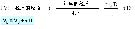

1

□A公司：全部采用股票融资——具有一个永久的税前预期年现金支出 X 

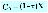

- □B公司：和 A公司完全相同，但采用的是债券融资，其价值为 D ——这样其预期的永久性利息支付为 r*D 

- □注意：现金支出由于税盾的作用而有

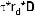

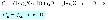

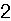

2

- □ 给出 B公司的价值，得知： 

- □ 	运用价值相加的特性：价值分别为 CA和τ*r*D ——A公司的价值为：

- ——当前税盾的价值为： 

- □ 所以，B公司的价值为：

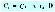

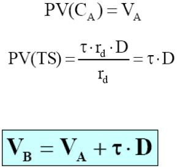

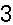

3

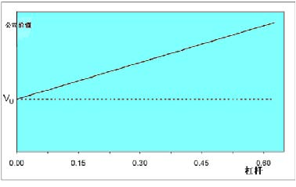

财务杠杆和公司价

- □发行债券并不能创造价值，即：不能通过借债和利用额外的现金创造价值。

- □债券所创造的价值相当于发行同样数量的股票。

- □所以，只有在进行如下的行为时，才能通过税盾的方式创造价值：——通过债券融资而不是通过股票融资进行项目的投资。——采用资本结构调整的方法，即：采用收回一部分股票而代之以发行

债券的融资行为。

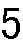

5

对微软公司而言税盾的价值？——利息支出=50×0.07=3.5亿元——税盾收益=3.5×0.34=1.19亿元 ——PV（税盾）=1.19/0.07=50×0.34=17亿元 ——VL=VU+PV（税盾）=$440亿元

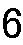

6

- □A公司没有债务，其价值为 V（全部为股票）

- □假定 A公司采用杠杆性的资本结构重组：——发行债券的价值为 D, ——利用收益回购股票。

- □其新的价值为：

- □这样，在公司税率为 t=35%的情况下：——由于 D=20%，公司的价值大约提高了 7%，——由于 D=50%，公司的价值提高了 175%。

- □债务的税收回避作用是很重要的，并且可能有更大的潜在影响

- □馅饼理论提出这样一个问题：这种融资方式的选择是否影响美国国税局从公司收益中所得的份额？

- □标准的方法是使用τ*D进行债券税收回避的资本贴现计算。 

- □提醒：——并不是所有的公司面临完全相同的边际税率——个人税的存在

- □对于额外增加 1美元的收入当前和可预期的将来所交纳税款的现值。

- □为什么边际税率不同于法定税率？——当期损失——税损转结（TLCF）

- □当前的损失能够被向后或向前扩展 3或 15年——能够被用来弥补过去的利润和进行税收的退还——能够被用来弥补将来的利润和进行税收的减免

- □提升 TLCF的价值，需要结合时间价值进行考虑

- □底线：更多的 TLCF→更少发债

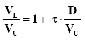

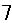

7

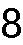

8

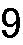

9

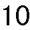

10

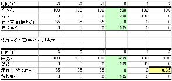

在 0时点的 MTR=PV（额外的税收）=0.35/1.12=0.29（假定 r=10%）

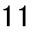

11

请看图中所示的边际税率、人口的百分比和年份

（Graham, J.R. 债券及其边际税率——金融经济杂志，1996年 5月, pp. 41-73.12）

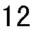

12

- □投资者从债券和股票中得到的报偿其纳税情况是不同的——利息和分红按照正常收入进行征税——资本利得按照较低的税率进行征收——资本利得能够被延期支付（相对于分红和利息）——公司有 70%的分红可以进行税收减免

- □所以：对于个人税收而言，股票高于债券

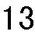

13

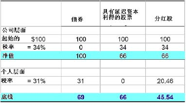

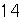

14

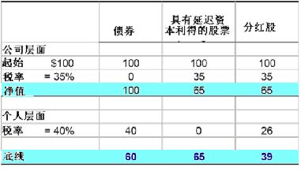

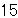

15

- □对于大多数公司来说债券更能获得税收回避的好处

- □在课程的其他部分我们将忽略个人税收的情况

- □但是，请注意这是一个特殊的例子

- □如果仅对股票征税，绝大多数公司会 100%地进行债务融资

- □常识提醒我们情况并非都是如此：——如果债务负担太重，公司会陷入支付危机——其结果是：陷入财务困难

- □陷入财务困难的公司运行艰难——运行困难是财务困难的原因还是结果？

- □财务困难有时会导致公司的部分或全部资产面临清算——这是否还会产生其他的结果？

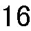

16

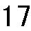

17

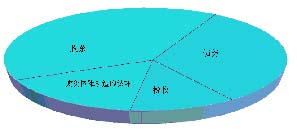

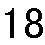

18

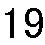

19

直接破产的成本：

- □法律成本，等等……

- 财务困难的间接成本：

- □债务悬空：没有能力筹措资金进行好的项目的投资——错过有价值的投资项目——其竞争者可能利用这个机会加紧扩张

- □冒险行为——孤注一掷

- □缺少顾客和供应商

20

来自 11个铁路公司破产的案例（Warner,金融研究 1977年）

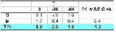

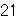

21

来自 11个铁路公司破产的案例（Warner,金融研究 1977年）

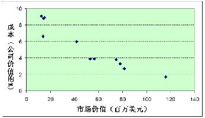

22

- □什么是直接破产的成本？——律师费，诉讼费，顾问费……——还包括机会成本，即：所花费在对付债权人身上的时间

- □直接破产的成本有多高？——长期的考察发现其平均成本为公司总价值的 2—6% ——对于小公司来说其成本所占的百分比较高——但是这需要加进破产可能性的权重！——总之，预期的直接成本不大

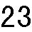

23

- □另外，XYZ公司有 15万美元的现金资产——这些现金也能进行诸如红利支付和投资等用途 

- □XYZ公司的项目情况为：——当前：投资支出为 15万美元，第二年：安全的收益为 22万美元 

- □XYZ公司是否应该进行项目的投资？——假定：无风险利率=10% ——NPV=-12+22/1.1=5M 

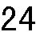

24

□ XYZ公司到第二年债务的账面价值为 35万美元 

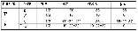

- □XYZ公司的股东会为这个项目集资吗？——如果不集资，他们得到的分红=15万美元——如果集资，他们得到：[(1/2)*22 + (1/2)*0]/1.1 =10万美元 

- □会发生什么情况？

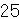

25

债务悬空（续）

- □股东将会：——负担所有的投资成本：-15万美元——仅得到收益的部分（在好的状态下为 22）

- □现有的债权人将会：——不负担任何投资的成本——仍然得到收益的一部分（在坏的状态下为 22）

- □所以，现有的风险债券发挥了“投资税”的作用

陷入财务困难公司的股东不愿意投资有价值项目，因为为此所得的大部分利润都支付给了债权人。

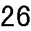

26

- □ 如果出现坏的情况的概率不是 1/2而是 2/3将会怎样？

- □ 债权人在收益中所得到的将会更多。

- □ 投资的“税”被提高了。

- □ 股东将更不愿意进行项目的投资。

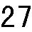

27

- □ 发行新的股票？

- □ 发行新的债券？

- □ 财务重组？——除破产以外的其他办法——进入正式的破产程序

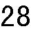

28

发行新的股票？

- □ 假定公司对外发行股票

- □ 新的股东必须打破现有的资本平衡：——他们可能支付投资的成本——但是仅仅是因为他们可能为此得到较好的回报

- □ 这就意味着相当于有人不分担新发行股票的成本：——这就是现有的股东！——所以，新股东也会拒绝购买股票

陷入财务困难的公司有可能不能通过向新的投资者融资的方法取得资金，因为公司的绝大多数利润都将支付给现有的债权人。

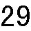

29

财务重组？

- □ 理论来讲，重组能够避免效率低下：

- □ 假定债权人减少其账面价值到 24万美元——公司新发行股票进行项目融资的条件如下：

- □ 股东会为这个项目积极运作吗？

- □ 通过重组增加了对股东的现金支付：——在概率为 1/2的情况下：98－65=33万美元——在概率为 1/2的情况下：8－0=8万美元

- □ 公司将会积极进行重组是因为： ——-15 + [(1/2)*33 + (1/2)*8]/1.1 = $3.6M &gt; 0 ——再次假设：所有的折现率为 10% 

- □ 债权人也因此而得益，因为他们得到： 

- □当评估财务困难的成本时，要考虑进行财务重组的可行性（实现多赢）

- □ 实际上，并不总是可能实现完美的重组。

- □ 但应该问一问：是什么限制了重组的进行？——银行还是债券——少数银行还是多数银行——利用银行的关系还是应急融资——简单的还是复杂的债务结构（例如：各种类型具有不同优先等

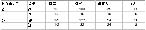

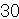

30

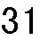

31

级、到期日、安全性的债券等）

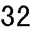

32

- □ 和现有的债务相比发行新的具有较低优先等级的债券——不会改善现有状况：“税负”没有改变

- □ 发行具有相同优先等级的债券——将会减轻但不会解决问题：还剩余较小的“税负”

- □ 发行具有较高优先等级的债券——因为得到了较大部分的清偿所以避免了投资的税负——同样：（相当于）债券具有较短的到期日

- ※然而，这种情况可能会被合同所禁止

- □ 这种分析所暗含的内容已经得到了破产法的认可。

- □ 在破产准则第 11款下的破产：——为财务重组提供一个正式的框架——财产中的债务：在法院的支配下，公司可以不受合同的限制发

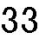

33

行优先于现有债务的债券

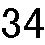

34

- □ 那些容易陷入财务困难的公司应避免较多的负债

- □如果免不了要利用财务杠杆，公司至少应该构建自己的债务

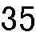

35

举例：

- □ 公司有 50美元的现金并且公司现在的价值为 100美元。

- □ 公司有机会以 50美元的价格收购一个新建的互联网公司。——这个新建的公司在一年后价值可能为 0（其概率为 2/3）或者 120（其概率为 1/3）。

——假定折现率为 10%。如果全部采用股票融资的话公司会投资这个项目吗？如果公司的外债账面价值为 80美元将会怎样？

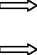

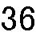

36

如果利用财务杠杆（债务=80）

- □ 不进行项目投资：股票=20，债务=80 

- □ 进行项目的投资：股票=30，债务=60——接受！ 

- □ 将会发生什么？

- □ 对这个项目的投资是一个较差的投机（因为 NPV&lt;0），股东实际上是用债权人的钱去进行赌博的冒险。

- □暗含：陷入财务困难的公司将会采取过度冒险的策略去“放手一搏”。

- □ 公司往往倾向于推迟清算的时间以便能够经营更长的时间。

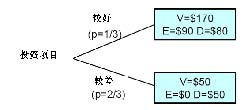

37

38

股票持有者没有获利的上限但是锁定了损失

39

40

41

1、从 M-M定理的不相关性开始 

2、增加两个改变资产规模的因素——税收——预期的困难成本 

3、考虑所给两个因素的“静态最佳”资本结构。（“静态”是因为该观点假定公司应该在一定时间内保持其债务的相对稳定）

42

- □那些具有较低预期困难成本的公司将发放更多的债务取得税收规避的收益。

- □ 那些具有较高预期困难成本的公司将趋于更加保守。

43

这样，所有的关键在于要明白什么样的行业和公司特点会导致较高的潜在预期困难成本。

预期的困难成本=发生困难的可能性*困难的损失

44

□ 发生困难的可能性——现金支出的不稳定性

<Table>
<TR>
<TD>—行业变化</TD>
<TD>—宏观波动</TD>
</TR>
<TR>
<TD>—技术改进</TD>
<TD>—新建</TD>
</TR>
<TR>
<TD>□ 困难成本</TD>

</TR>
</Table>

——顾客和供应商关心公司的财务状况（例如，因为不明确的担保或特定的投资）

——资产不易调整

45

- □ 税收

- □ 预期的困难成本——现金支出的不稳定性——需要外部融资进行投资——如果因现金紧张所带来的竞争对手的威胁——顾客关心其是否处于财务困境中——很难调整资产

46

债务比率（%） 43.2 22.9 

造纸和塑料 30.4 设备 19.1 

17.3 

47

- □ 解释了在杠杆范围较广时资本的结构差异，例如：在电器和天然气行业（ 43.2）和计算机软件行业（ 3.5）之间的差异，总的来说，现金支出越不稳定的行业倾向于拥有较低的财务杠杆比率。

- □ 可能在解释债务比率较小的差异上并不是很有效，例如：在食品生产（22.9%）和手工装备（19.1%）之间的差异。 

- □其他因素，诸如稳定的增长，也是很重要的。

- □ 回顾威尔逊公司在产品市场目标（快速增长）和财务目标（适当的杠杆比例）之间选择的压力。

- □快速增长的公司不愿发行股票来结束债务比率高于核对表中所给出的隐含目标的状况。

- □增长缓慢的公司不愿购回其发行的股票或提高其分红来结束其债务比率低于核对表中所给出的隐含目标的现状。

- □ 可以和目标资本结构有所偏差。

- □ 但是一定要记住：那些增长较快的偏离目标较多同时具有较高杠杆的公司容易陷入财务困难。

- □ 总之，一定要有一个相一致的产品市场策略和财务策略。

48

49

50
