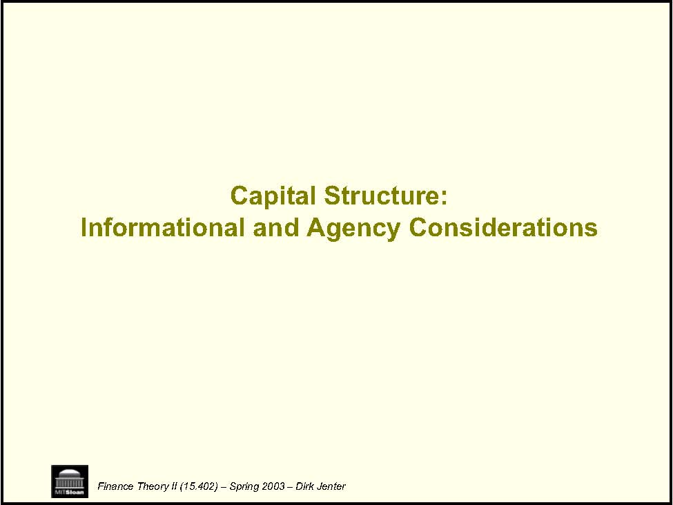
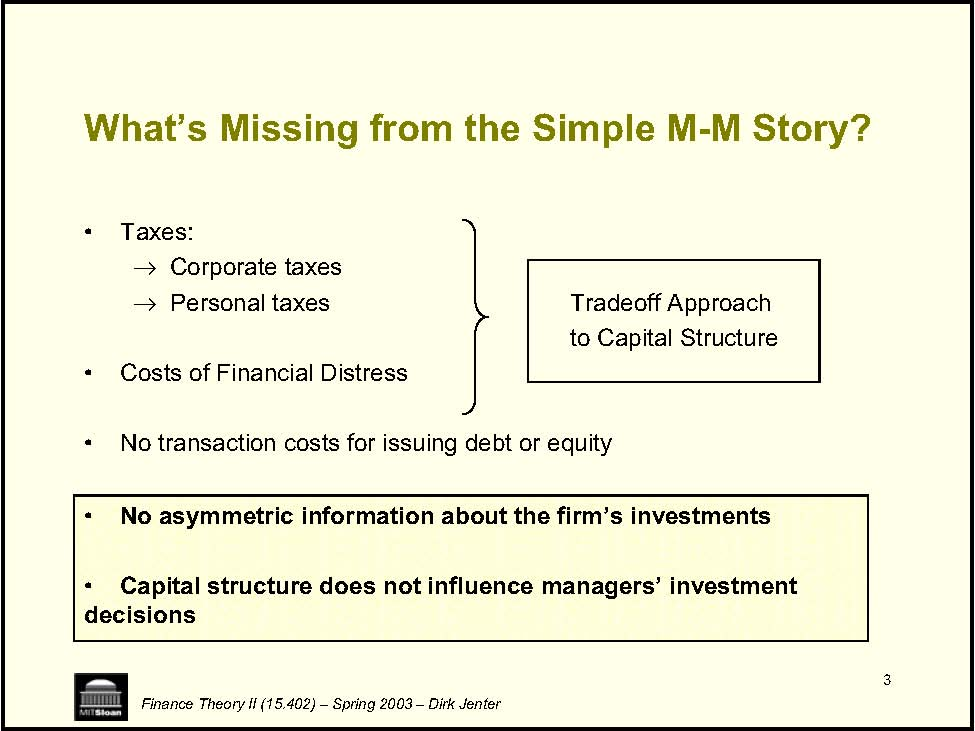
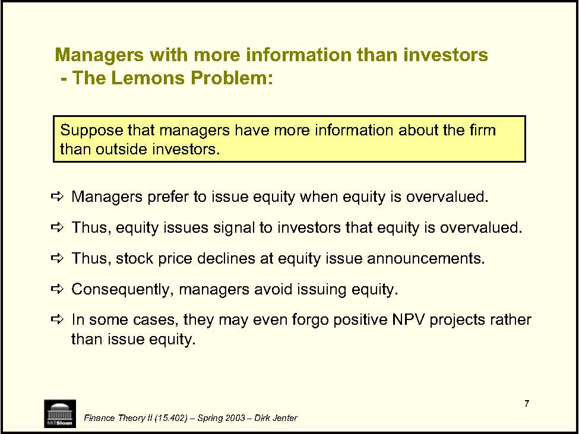
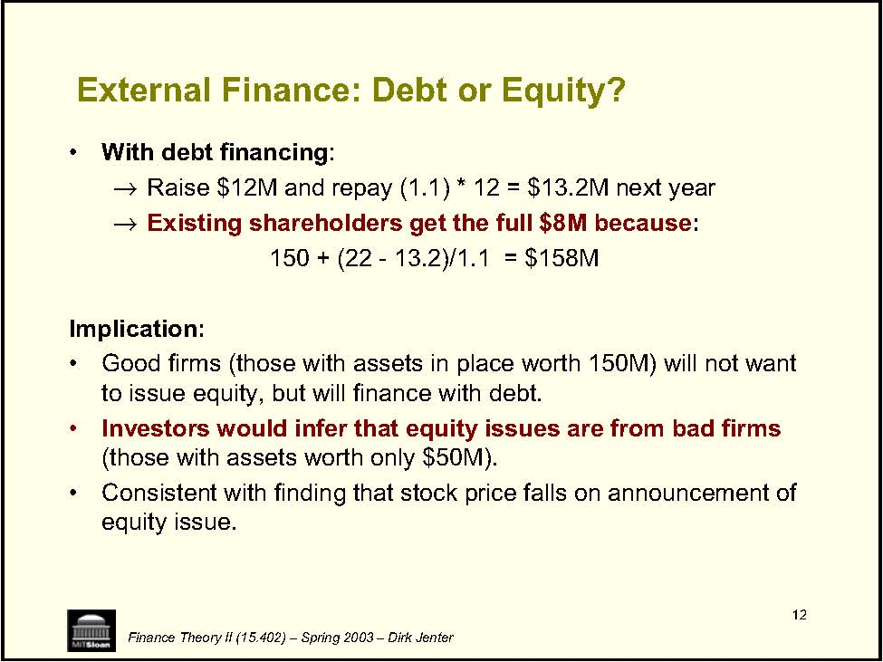
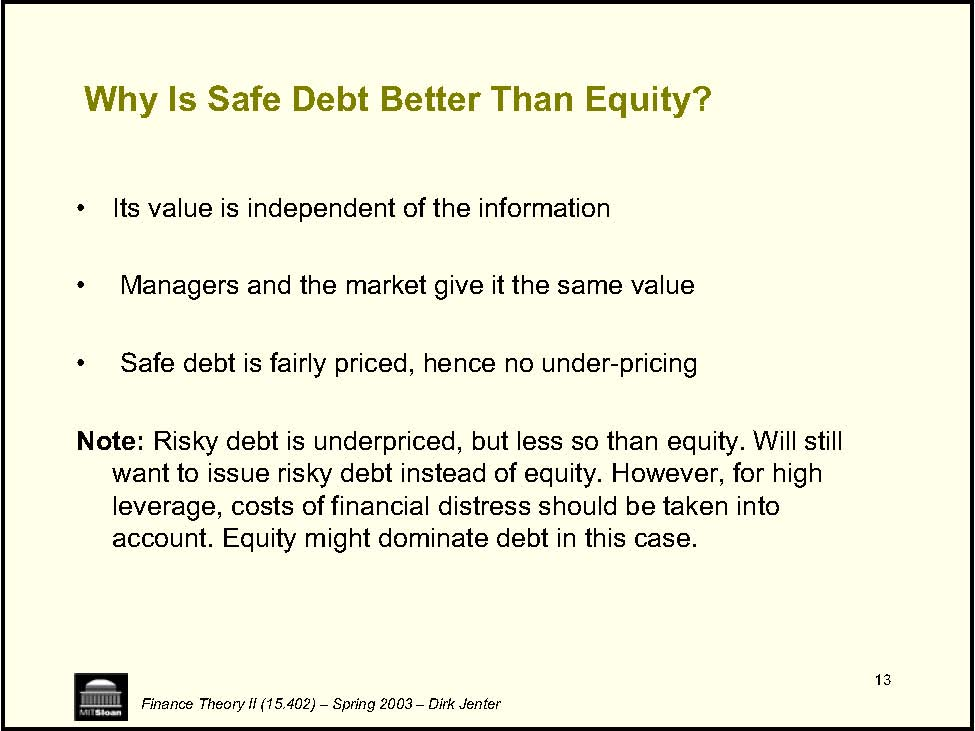
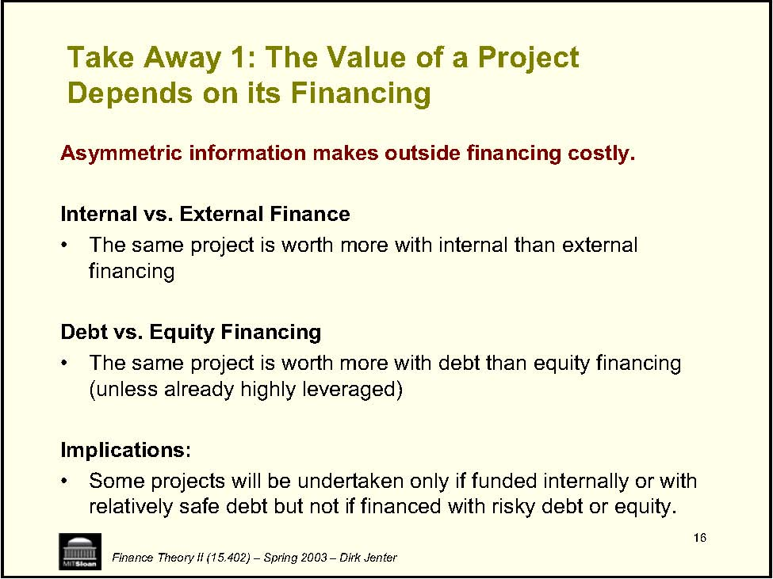

         Acrobat Distiller 6.0 (Windows)

         2004-01-21T11:08:37+05:30

         2004-01-21T11:09:28+05:30

         2004-01-21T11:09:28+05:30

         PScript5.dll Version 5.2

         uuid:ca43a9c5-f96b-43ee-914a-101b3a07bd1c

         uuid:03ab8257-aa58-4012-8630-b16958c050d6

         xml

               djenter

               Microsoft PowerPoint - LN08(CS3) shorter.ppt

Capital Structure: Finance Theory II (15.402) – Spring 2003 – Dirk Jenter Informational and Agency Considerations 

2 • • • • • • • • Financing Review Case: Intel Corporation Finance Theory II (15.402) – Spring 2003 – Dirk Jenter The Big Picture: Part I -Financing A. Identifying Funding Needs Feb 6 Case: Wilson Lumber 1 Feb 11 Case: Wilson Lumber 2 B. Optimal Capital Structure: The Basics Feb 13 Lecture: Capital Structure 1 Feb 20 Lecture: Capital Structure 2 Feb 25 Case: UST Inc. Feb 27 Case: Massey Ferguson C. Optimal Capital Structure: Information and Agency Mar 4 Lecture: Capital Structure 3 Mar 6 Case: MCI Communications •Mar 11•Mar 13

3 What’s Missing from the Simple M-M Story? • →Corporate taxes →Personal taxes to Capital Structure • • • • decisions Finance Theory II (15.402) – Spring 2003 – Dirk Jenter Taxes: Tradeoff Approach Costs of Financial Distress No transaction costs for issuing debt or equity No asymmetric information about the firm’s investments Capital structure does not influence managers’ investment 

4 Firms and Investors • • →→then with debt →and finally with equity. • • DFinance Theory II (15.402) – Spring 2003 – Dirk Jenter Part I: Asymmetric Information between In practice, companies are reluctant to issue equity. They follow a “pecking order” in which they finance investment: first with internally generated funds They may even forgo positive NPV investments because of reluctance to raise additional external financing. The willingness to issue equity fluctuates over time. Something is missing from the “trade-off theory” view 

5 Sources of Funds: International 1990-94 0 10 20 30 40 50 60 70 80 90 Finance Theory II (15.402) – Spring 2003 – Dirk Jenter US Japan UK Canada France Internal Debt Equity 

6 Where does the Pecking Order come from? • claims. →• • →→Irrational managers →Finance Theory II (15.402) – Spring 2003 – Dirk Jenter The irrelevance of financing in the Modigliani-Miller framework comes from the fact that existing shareholders (represented by managers) and new shareholders agree on the value of financial Everyone agrees on the size of the pie. This ensures that financial transactions have NPV = 0. But this may not always be a good description of reality: Inefficient markets Managers with more information than investors 

7 D D D D D than issue equity. Finance Theory II (15.402) – Spring 2003 – Dirk Jenter Managers prefer to issue equity when equity is overvalued. Thus, equity issues signal to investors that equity is overvalued. Thus, stock price declines at equity issue announcements. Consequently, managers avoid issuing equity. In some cases, they may even forgo positive NPV projects rather Managers with more information than investors -The Lemons Problem: Suppose that managers have more information about the firm than outside investors. 

8 • • →Discount rate: 10% →→NPV = -12 + 20 = $8M • →→150 50 Finance Theory II (15.402) – Spring 2003 – Dirk Jenter Example (let’s set aside taxes and financial distress) XYZ’s assets in place are subject to idiosyncratic risk: New investment project: Investment outlay: $12M Safe return next year: $22M ==&gt; PV = 22/1.1 = $20M Should undertake the project if XYZ has enough cash available? if XYZ needs to raise external funds? p=0.5 p=0.5 Asset value 

9 • →If internally financed with cash, . • in equity →→→→→D Finance Theory II (15.402) – Spring 2003 – Dirk Jenter Case 1: Managers know as much as outside investors Suppose that XYZ has $12M in cash for investment existing shareholders realize the full $8M NPV of the investmentSuppose that XYZ does not have the cash but can issue $12M Once the project funded, the firm is worth 100 + 20 = $120M Raise $12M by selling 10% of shares (after issue) Existing shareholders get 90% * 120 = $108M To be compared with $100M if did not invest Existing shareholders gain $8M With no information asymmetries, managers are indifferent between internal and external financing 

10 • . • →Existing shareholders get 90% * (150 + 20) = $153M. →. • →→Finance Theory II (15.402) – Spring 2003 – Dirk Jenter Case 2: Managers know more than outside investors Internal financing: As before, existing shareholders gain $8MEquity financing: Raise $12M by selling 10% of shares (after issue), valued by the market at 120 (i.e., 100 + 20). Existing shareholders gain only $3MWhy? 10% shares: Sold for $12M but really worth 10%*170=$17M $8M gain on investment -$5M loss from under-pricing = $3M 150 p=0.5 150 p=1 50 p=0.5 Shareholders Managers Assets value from the perspective of 

11 • current shareholders: Question: • • • →Debt? →D Finance Theory II (15.402) – Spring 2003 – Dirk Jenter Key Point: An equity issue by an undervalued firm entails a loss of value for its How does this help to understand the Pecking Order? Explains why internal funds are preferred to equity for many firms. But why is debt preferred to equity? Are other financial securities less sensitive to information asymmetries than equity? Hybrid securities (e.g. convertible debt)? When equity is undervalued, managers prefer internal financing to issuing equity to outside investors. 

12 • : →→: Implication: • • • equity issue. Finance Theory II (15.402) – Spring 2003 – Dirk Jenter External Finance: Debt or Equity? With debt financingRaise $12M and repay (1.1) * 12 = $13.2M next year Existing shareholders get the full $8M because150 + (22 -13.2)/1.1 = $158M Good firms (those with assets in place worth 150M) will not want to issue equity, but will finance with debt.  Investors would infer that equity issues are from bad firms (those with assets worth only $50M). Consistent with finding that stock price falls on announcement of 

13 • • • Finance Theory II (15.402) – Spring 2003 – Dirk Jenter Why Is Safe Debt Better Than Equity? Its value is independent of the information Managers and the market give it the same value Safe debt is fairly priced, hence no under-pricing Note: Risky debt is underpriced, but less so than equity. Will still want to issue risky debt instead of equity. However, for high leverage, costs of financial distress should be taken into account. Equity might dominate debt in this case. 

14 Example (cont.): Underinvestment • • →→• →→==&gt; Finance Theory II (15.402) – Spring 2003 – Dirk Jenter Suppose investment outlay is $18M not $12M. NPV = -18 + 22/1.1 = $2M Raising $18M requires selling 15% of shares (after issue), valued by the market at 120 (i.e., 100 + 20). Existing shareholders get 85% * (150 + 20) = $144.5M They lose $5.5M relative to $150M if did not invest. Another way to see this: Loss due to under-valuation 15%*(170-120) = $7.5M Exceeds the project’s value of $2M XYZ will not issue equity to fund project. 

15 • • • • • Finance Theory II (15.402) – Spring 2003 – Dirk Jenter Example (cont.): Market Reaction to Equity Issues Consider again the case of an investment outlay of $18M. Assume that the firm has no cash and cannot issue debt. If assets are worth $150M, the firm does not invest. Upon seeing the firm issuing equity, the market infers that it must be sitting on negative info: assets are worth only $50M. Given the market’s expectations that the firm was worth $100M, the firm’s market value drops to 50 + 20 = $70M when the firm announces the equity issue. 

16 • financing • (unless already highly leveraged) Implications: • Finance Theory II (15.402) – Spring 2003 – Dirk Jenter Take Away 1: The Value of a Project Depends on its Financing Asymmetric information makes outside financing costly. Internal vs. External Finance The same project is worth more with internal than external Debt vs. Equity Financing The same project is worth more with debt than equity financing Some projects will be undertaken only if funded internally or with relatively safe debt but not if financed with risky debt or equity. 

17 Financial Policy • • • →→Finance Theory II (15.402) – Spring 2003 – Dirk Jenter Take Away 2: Information Content of Stock issues convey negative information about the firm. This explains why the market reacts negatively to equity issues. More generally: Firms’ financial policies convey information. Stock prices will react to changes in financial policy (e.g., dividends, issues, etc.) 

18 Empirical Evidence: • not undervalued). • • Finance Theory II (15.402) – Spring 2003 – Dirk Jenter When risky securities are offered, investors infer that managers’ believe that the equity is overvalued (or at least As a result the market value of the firm falls: -3.0% for equity (25% of proceeds) -2.0% for convertible debt (9% of proceeds) 0.0% for debt +2.0% for bank loans (huh?) Stock repurchases: +4% 

19 Capital Structure: • • 1) • Finance Theory II (15.402) – Spring 2003 – Dirk Jenter Take Away 3 -The Pecking Order Theory of Financing choices are driven by the desire to minimize losses due to asymmetric information. When funding their investment projects, firms will: First use retained earnings; 2 ) Then borrow from debt markets (unless already highly leveraged); 3) As a last resort, issue equity. Firms with more information asymmetries are more reluctant to issue equity, and try to preserve borrowing capacity. 

20 Implications: • →→• • Finance Theory II (15.402) – Spring 2003 – Dirk Jenter If Pecking Order holds, a company’s leverage ratio results: not from an attempt to approach a target ratio; but rather from series of incremental financing  decisions. Contrary to the Target Capital Structure Approach, the Pecking Order implies that capital structure can move around a lot. The Pecking Order Theory also implies that profitable firms will lower their leverage ratios to build up “financial slack”. The idea is to avoid future equity issues in case unexpected funding needs arise. 
