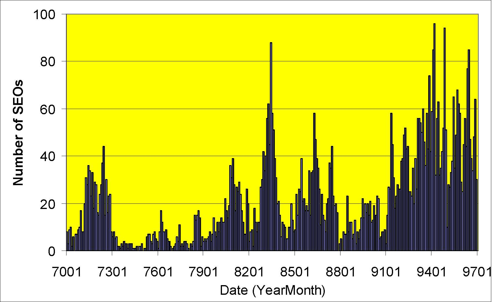

         Acrobat Distiller 6.0 (Windows)

         Sloan School of Managemt, MIT

         Sloan School of Managemt, MIT

         Acrobat PDFMaker 6.0 for PowerPoint

         2004-01-22T11:43:00+05:30

         2004-01-22T11:41:23+05:30

         2004-01-22T11:43:00+05:30

         uuid:e806e2fe-d582-40c8-add0-83baa069e665

         uuid:3561a461-4050-4207-bfed-72e21f910c3d

         xml

               Capital Structure: Informational and Dynamic Considerations

               Denis Gromb

Capital Structure, cont.

Katharina Lewellen

Finance Theory II

March 5, 2003

Target Capital Structure Approach

1.Start with M-M Irrelevance

2.Add two ingredients that change the size of the pie.

- Taxes

- Expected Distress Costs

3.Trading off the two gives you the “static optimum” capital structure. (“Static” because this view suggests that a company should keep its debt relatively stable over time.)

Target Capital Structure Approach, cont.

VULeverageFirm valueVLwith tax shields, but no distressVLwith tax shields and distressVLaccording to MMOptimal capital structure

Implications of the “target leverage” approach

- Firms should:

- Issue equity when leverage rises above the target level

- Buy back stock (or pay dividends) when leverage falls below the target capital structure

- Stock market should:

- React positively (or neutrally) to announcements  of securities issues

What really happens?

- Stock prices drop (on average) at the announcements of equity issues

- Companies are reluctant to issue equity

- They follow a “pecking order” in which they finance investment:

- first with internally generated funds

- then with debt

- and finally with equity

- Willingness to issue equity fluctuates over time

Something is missing from the “target-leverage” view

Stock price reaction to equity issue announcements

Average cumulative excess returns from 10 days before to 10 daysafter announcement for 531 common stock offerings (Asquith and Mullins (1986))

-3.5-3-2.5-2-1.5-1-0.500.5-10-8-6-4-20246810Day after announcementCumulative Excess Return (%)

Sources of Funds: US Corporations 1979-97

-40-2002040608010012079808182838485868788899091929394959697% of total financingInternalDebtEquity

Sources of Funds: International 1990-94

-40-2002040608010012079808182838485868788899091929394959697% of total financingInternalDebtEquity0102030405060708090USJapanUKCanadaFranceInternalDebtEquity

Seasoned Equity Offerings (SEOs) 1970-96

0204060801007001730176017901820185018801910194019701Date (YearMonth)Number of SEOs

Initial Public Offerings (IPOs) 1960-99

020406080100120140600163076701700774017707810184078801910795019807Date (YearMonth)Number of IPOs

Incorporating These Concerns

- The irrelevance of financing comes from the fact that existing shareholders (represented by managers) and new shareholders agree on the value of financial claims.

- Everybody agrees on the size of the “pie”

- This ensures that financial transactions have NPV = 0.

- Departing from this framework:

- Inefficient markets

- Irrational managers

- Managers with more information than investors

- Managers prefer to issue equity when equity is overvalued

- Thus, equity issues signal to investors that equity is overvalued

- Thus, stock price declines at equity issues announcements

- Consequently, managers avoid issuing equity

- In some cases, they may even forgo positive NPV projects rather than issue equity

Managers with more information than investors-The Lemons Problem

Suppose that managers have more information about the firm than outside investors. 

Equity financing: Example

Let’s set aside taxes and financial distress

- XYZ’s assets in place are subject to idiosyncratic risk:

- New investment project:

- Discount rate: 10%

- Investment outlay: $12M

- Safe return next year: $22M ==&gt; PV = 22/1.1 = $20M

NPV =  -12 + 20 = $8M

- Should XYZ undertake the project?

150p=0.550p=0.5Assets value

Case 1: Managers know as much as outside investors

- Suppose that XYZ has $12M in cash for investment

- If internally financed with cash, existing shareholders realize the full $8M NPV of the investment.

- Suppose that XYZ does not have the cash but can issue $12M in equity

- Once the project funded, the firm is worth 100 + 20 = $120M

- Raise $12M by selling 10% of shares (after issue)

- Existing shareholders get 90% * 120 = $108M

- To be compared with $100M if did not invest

- Existing shareholders gain $8M

With no information asymmetries, managers are indifferent between internal and external financing

Case 2: Managers know more than outside investors

- Internal financing

- As before, existing shareholders gain $8M

- Equity financing

- Raise $12M by selling 10% of shares (after issue), valued by themarket at 120 (i.e., 100 + 20).

- Existing shareholders get 90% * (150 + 20) = $153M.

- Existing shareholders gain only $3M

When equity is undervalued, managers prefer to finance internally than to issue equity

150p=0.5150p=150p=0.5ShareholdersManagersAssets value from the perspective of

Case 2 (cont.): How about debt financing?

- With debt financing:

- Raise $12M and repay (1.1) * 12 = $13.2M next year

- Existing shareholders get the full $8M because:

150 + (22 -13.2)/1.1  = $158M

When equity is undervalued, managers prefer to finance with debt than equity

Why Is Safe Debt Better Than Equity?

- Its value is independent of the information

- Managers and the market give it the same value

- Safe debt is fairly priced no lemon’s problem

- Risky debt is somewhere “between” safe debt and equity

- There is some lemon’s problem associated with risky debt but it is less severe than with equity

Lemon’s problem: Implications

- If your assets are worth $150M, you will not want to issue equity, but will finance internally or with debt

- If you choose to issue equity, investors will know that your assets must be worth only $50M

- Consequently, stock price will fall when you announce an equity issue

- By how much?

Example (cont.): Market Reaction

- Recall market’s expectations

- Assets are $150 (prob. = ½) or $50 (prob. = ½)

- So currently, assets are valued at $100

- Upon seeing an equity issue, the market infers that the firm is sitting on negative info:

- assets are worth only $50M

- The firm’s market value drops to 50 + 20 = $70 when equity issue is announced and new equity is issued

Evidence on equity issue announcements

Average cumulative excess returns from 10 days before to 10 daysafter announcement for 531 common stock offerings (Asquith and Mullins (1986))

-3.5-3-2.5-2-1.5-1-0.500.5-10-8-6-4-20246810Day after announcementCumulative Excess Return (%)

Evidence on announcement effects

- Stock price reaction to issues:

- Straight Debt:Little or no effect

- Convertible Debt:-2%  (9% of proceeds)

- Equity:-3%  (25% of proceeds)

- Stock repurchases:  +13%

Example (cont.): Underinvestment

- Suppose investment outlay is $18M not $12M.

NPV = -18 + 22/1.1 = $2M

- Raising $18M requires selling 15% of shares

- Existing shareholders get 85% * (150 + 20) = $144.5M

- They lose $5.5M relative to $150M if did not invest.

- XYZ will not issue equity to fund project.

Key Point: Investment Depends on Financing

- Some projects will be undertaken only if funded internally or with relatively safe debt

- Information asymmetries can lead companies to forgo good project

- Companies with less cash and more leverage will be more prone to this underinvestment problem

- Issuing safe debt is more difficult at high leverage

- Also, issuing too much debt may lead to financial distress

Pecking Order and Capital Structure

- Basic Pecking Order:

- Firms will use cash when available

- Otherwise use debt

- High cash-flow ==&gt; No need to raise debt==&gt;In fact, can repay some debt

==&gt;Leverage ratio decreases

- Low cash-flow ==&gt; Need to raise debt==&gt;Reluctance to raise equity

==&gt;Leverage ratio increases

Key Point

- If Pecking Order holds, a company’s leverage ratio results:

- not from an attempt to approach a target ratio;

- but rather from series of incremental financing  decisions.

- Contrary to the Target Capital Structure Approach, the Pecking Order implies that capital structure can move around a lot.

AIRLINES0.000.100.200.300.400.500.601980198519901995%Industry Leverage

AIRLINES0.000.100.200.300.400.500.601980198519901995%Industry LeverageIndustry ROA

Target Capital Structure Approach, cont.

VULeverageFirm valueVLwith tax shields, but no distressVLwith tax shields and distressVLaccording to MMOptimal capital structure

Key Point: Timing of Equity Issues

- There may be ''good'' and ''bad'' times to issue stock.

- Best not to issue when lots of information asymmetry --i.e., should issue when price impact of issue is lowest.

Initial Public Offerings (IPOs) 1960-99

020406080100120140600163076701700774017707810184078801910795019807Date (YearMonth)

Evidence on timing of equity issues

- Firms tend to issue more equity in booms and less in busts

- NPV of investment opportunities are higher, so firms are willingto incur the costs of issuing equity

- In fact, when lots of firms are issuing, the stock price impact of an equity issue is low

- Caveat:Is this because information problems are lower or because stock markets are inefficient --i.e., systematically mispriceequity?

Managerial Behavior and Capital Structure

- So far, we assumed that managers act in the interest of shareholders. 

- But is it always true?

- Conflicts of interests between managers and shareholders are called agency problems

Agency Problems

- Agents do not always do their job =&gt; costs to principals

- These cost are called “Agency Costs”

- They are reflected in a lower share price

- Potential problems:

- Shirking

- Empire Building

- Perks (private jets)

- Risk avoidance

Principals = Shareholders

Agents = Managers

Avoiding Agency Costs

- Compensation policy

- Monitoring managers’ actions

- Independent directors on the Board

- Banks as lenders

- Large block holders

- Market for Corporate Control (i.e. takeovers)

- Can leverage help to avoid agency costs?

A Classic Agency Problem: The Free Cash Flow Problem

- Free Cash Flow (FCF)

- Cash flow in excess of that needed to fund all positive NPV projects

- Managers may be reluctant to pay out FCF to shareholders

- Empire building through unprofitable acquisitions

- Pet projects, prestige investments, perks

- This problem is more severe for “cash cows”

- Firms with lots of cash (i.e., profitable firms)

- And few good investment opportunities

Example of FCF Problems

Evidence from the Oil Industry (Jensen, 1986)

- From 1973 to 1979: tenfold increase in crude oil prices

- Oil industry expanded

- Oil consumption fell

- The oil industry at the end of 1970s

- Lots of excess capacity

- Lots of cash (because of high prices)

- What did managers do?

Example of FCF Problems (cont.)

What did managers do?

- They did not pay out cash to shareholders

- Continued spending on exploration and development (E&amp;D)

- Stock prices reacted negatively to the announcements of increases in E&amp;D by oil companies during 1975 –81

- Invested outside of industry

- Mobile purchased Marcor(retail)

- Exxon purchased Reliance Electric (manufacturing) and Vydec(office equipment)

- These acquisitions turned out to be least successful of the decade

Can leverage reduce FCF problem?

- Debt = commitment to distribute cash flows in the future

- If managers cannot keep the promise to pay interest (principal),bondholders can shut down the firm

- Thus, debt reduces FCF available to managers

- Less opportunities for managers to waist cash

- How about commitment to pay dividends?

- Dividends also reduce FCF

- But a commitment to pay dividends cannot be enforced

Leveraged Buyouts (LBOs)

- LBO is a going-private transaction

- Typically, incumbent management acquires all publicly-traded shares

- LBOsare often financed with debt (D/E ratios of 10 are not uncommon)

- Kaplan (1989 JFE) finds in a sample of 76 LBOs:

- Debt / Value went from 18.8% to 87.8%

- 42% premium paid to shareholders to go private

- In three years after the buyout

- Operating Income / TA  increased by 15%

- Operating Income / Sales increased by 19%

- Net cash flow increased and capital expenditures decreased

- Do LBOsimprove efficiency through the control function of debt?

Capital Structure: An Extended Checklist

- Taxes

- Does the company benefit from debt tax shield?

- Information Problems

- Do outside investors understand the funding needs of the firm?

- Would an equity issue be perceived as bad news by the market?

- Agency Problems

- Does the firm have a free cash flow problem?

- Expected Distress Costs

- What is the probability of distress? (Cash flow volatility)

- What are the costs of distress? 

- Need funds for investment, competitive threat if pinched for cash,  customers care about distress, assets difficult to redeploy?
