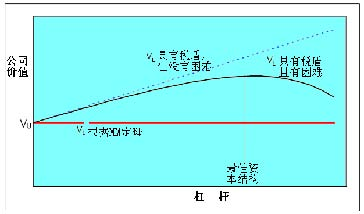
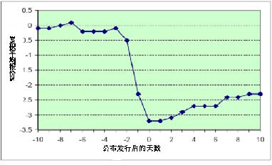
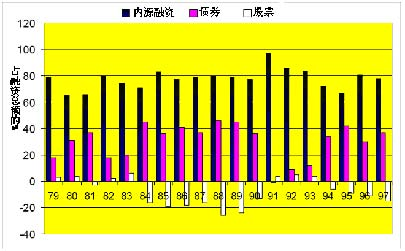
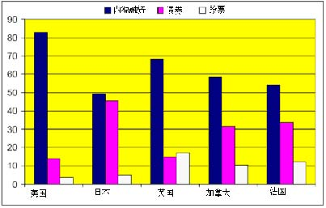
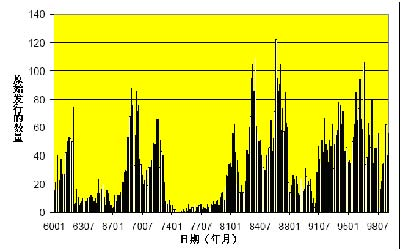
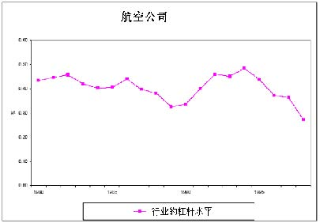
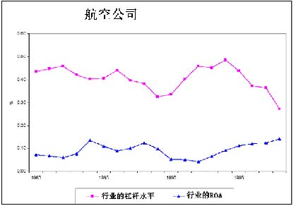

         Acrobat Distiller 6.0 (Windows)

         2005-04-26T09:31:34+08:00

         PScript5.dll Version 5.2

         2005-04-26T09:32:18+08:00

         2005-04-26T09:32:18+08:00

         uuid:a5f8976a-33a8-4072-bd88-49bf62df1255

         uuid:8ee4f854-0ec0-40df-add4-ec50a84239e8

         xml

               Microsoft Word - 8-Capital Structure

               xjtu

# 资本结构-续 

# 

# Katharina Lewellen 

# 

目标资本结构方法 

- 1．从 

- M-M定理不相关性开始介绍 

- 2. 增加改变资本“饼状”结构的两种因素

- →税收

- →预期的困难成本 

- 3. 从所给定的两个“最佳均衡”资本结构模型中选择其一。（“均衡”是基于公司应该在一定时期保持其债务相对稳定的观点而作出的假设）

“目标财务杠杆”方法给出的建议 

- □ 公司应该：

- →当财务杠杆上升超过目标杠杆时发行股票

- →当财务杠杆下降到目标资本结构时回购股票（或偿付红利） 

- □ 证券市场应该：

- →对证券发行的宣布表示积极（或是中性的）回应

- □ 股票价格在公司宣布其发行公告时下降（通常情况下如此）

- □ 因此公司不愿意发行股票

- □ 公司会选择遵循“优序原理”进行融资

- →首先使用内部盈余资金

- →然后使用债券融资

- →最后发行股票融资

- □ 公司发行股票的意愿会随时间的变化发生波动

会发生什么？

从股票宣布发行前 10天到宣布发行后 10天的 531支普通股累积平均报价(阿斯奎思和马林斯 (1986)) 

综合进行考虑

- □融资的不相关性来自于现有股东 (以经理为代表的)和新股东认同公司财务价值这一现实

- →所有的人都认同公司"资金馅饼"的大小

- □ 这个假设保证了融资交易的 NPV = 0 

- □ 偏离这种框架的情况：

- →无效率的市场

- →不理性的经理人

- →经理人比投资者拥有更多的信息

- →当股票的价值被高估时经理人更愿意发行股票

- →这样，股票的发行所传递给投资者的信息就是股票的价值被高估

- →于是，当股票发行的消息公布后股票的价格就开始下跌

- →这种后果将使经理人避免发行股票

→在一定情况下，经理人甚至宁愿放弃 NPV为正的投资项目也不愿发行股票

股票融资：例子

暂时不考虑税收和资金分配的情况 

□ XYZ公司的资产在一定情况下受特定风险的影响：

- □ 新的投资项目

- →贴现率：10% 

- →投资支出：$12M 

- →次年的稳定回报：$22M ==&gt; PV = 22/1.1 = $20M NPV = -12 + 20 = $8M 

- □ XYZ公司是否应该投资这个项目？

 案例1：经理人拥有和外部投资者一样的信息 

□假定 XYZ公司以 $12M 的现金资产进行投资

→如果采用以内部的现金资产进行融资，现有的股东认为整个项目投资的 NPV为$8M。

- □假定 XYZ公司没有现金资产但可以通过发行股票筹得$12M的资金

- →一旦项目启动，公司的价值为 100 + 20 = $120M. 

- →为筹得$12M 资金需要出售 10%的股份（股票发行之后）. 

- →现有的投资者得到 90% * 120 = $108M. 

- →和不进行项目投资的$100M相比较. 

- →现有投资者的收益为$8M. 

- ◆如果不存在信息的不对称，经理人在内部融资和外部融资之间没有偏好。

<Table>
<TR>
<TH>投资者</TH>

<TH>经理人 </TH>
</TR>
<TR>
<TH>150 </TH>

<TD>P=0.5 </TD>
<TD>150 </TD>

<TD>P=1 </TD>
</TR>
<TR>
<TH>50 </TH>

<TD>P=0.5 </TD>

</TR>
</Table>

- □内部融资

- →同以前一样，现有的投资者获益为$8M 

- □股票融资

- →通过出售 10%的股票(在发行之后)融资$12M，市场对其价值认定为 120(即：100 + 20)。

- →现有的股东得到 90% * ( 150 + 20) = $153 M。

- →现有的股东获益仅为$3M. 

案例2（续）：发行债券融资将会怎样？ 

□ 通过发行债券：

- →发行债券筹得$12M资金次年需偿还(1.1)* 12 =$13. 2M 

- →现有的股东得到全部的$8M，因为： 

150 +(22-13.2)/ 1.1 =$ 158M 

- ◆当股票价值被低估时，在股票融资和债券融资之间，经理更倾向于债券融资

- □ 无风险债券的价值不依赖信息

- □ 经理人和市场给无风险债券以相同的价值判断

- □ 无风险债券可以公平定价——不存在柠檬问题

- □ 风险债券在有些情况下介于无风险债券和股票之间

- →风险债券会存在一些“柠檬”问题，但与股票相比没有股票的问题严重

- □ 如果公司的资产价值为$150M，公司将不愿发行股票，但会进行内部融资或发行债券。

- □ 如果公司选择发行股票，投资者将会认定公司的资产只值$50M 

- □ 因此，当公司宣布发行股票时，股票的价格将会下降

- →下降多少？

- □ 对市场预期的回应

- →资产价值为$150 (其可能性为 1/2)或者为$50(其可能性为 1/2). 

- →计算得知公司资产的价值为$100 

- □ 通过市场的预期，推断出公司处于不利的市场信息下：

- →公司的资产价值只有$50 M 

- □ 当公司公布其股票发行的信息和其新的股票发行时，公司市价下降到 50 + 20 =$ 70M 

为什么说无风险债券优于股票？

柠檬问题：启示例子：市场的反应

从股票宣布发行前 10天到宣布发行后 10天的 531支普通股累积平均报价(阿斯奎思和马林斯 (1986)) 

<Table>
<TR>
<TD>→直接债券：</TD>
<TD>很少或没有影响</TD>
</TR>
<TR>
<TD>→可转换债券：</TD>
<TD>        -2% (收益的 9%) </TD>
</TR>
<TR>
<TD>→股票：</TD>
<TD>              -3% (收益的 25%) </TD>
</TR>
<TR>
<TD>□ 股票回购：</TD>
<TD>           +13% </TD>
</TR>
</Table>

例子（续）：投资不足

- □ 假定投资支出是$18M而不是$12 M。 

- □ 融资$18M需要出售股份的 15% 

- →现有股东得到 85% * (150 + 20) = $144.5 M 

- →相对于不进行投资的$150M而言，现有股东损失$5.5M。 

◆ XYZ公司将不会发行股票进行项目融资。

要点：投资依赖于融资

- □只有进行内部融资或发行无风险债券时，一些项目投资才可以进行。

- □ 信息不对称将导致公司放弃一些好的投资项目。

- □ 具有较少的现金流和较高财务杠杆的公司将面临投资不足的问题。

- →具有较高的财务杠杆会使发行无风险债券变得困难。

- →同样，发行太多债券也可能导致财务困难。

- □ 基本的优序融资顺序

- →在可能的情况下公司将优先使用现金

- →或者发行债券

- □ 具有较高的现金流时：→不需要发行债券

- →实际上，还能够偿还一些债务

- →从而使财务杠杆降低

- □ 具有较低的现金流时：→需要发行债券

- →不愿发行股票

- →从而使财务杠杆升高

- □ 如果按照优序融资理论，一个公司的杠杆比率将：

- →不是由接近目标比率的尝试所决定；

- →而是由一系列不断扩展的融资决策所决定。

- □ 和目标融资结构的方法相反，优序融资理论暗含着资本结构能够进行较大的调整。

优序融资和资本结构要点：

要点：发行股票的时机选择：

- □ 对于发行股票融资而言可能会有“好的”和“坏的”时机。

- □ 当存在较多的信息不对称时，最好不要发行股票——也就是说，发行时机应该选在对股票价格影响最小的时候。

股票发行时机选择的证据

- □ 公司倾向于在繁荣时发行较多的股票而在萧条时发行较少。

- →如果投资机会的 NPV价值较高，则公司就愿意承担发行股票的成本。

- □ 实际上，许多公司在发行股票时，股票发行对股票价格的影响是较低的。

- □ 在以前的论述中，我们假定经理人代表着股东的利益。

- □ 但这总是真实的吗？

- □ 经理人和股东之间的利益冲突被称为代理问题。

警告：这是因为信息不对称问题的影响较小，或者是因为股票交易市场是无效率的——即，股票价格的系统性失真。

经理行为和资本结构代理问题：

责任人=股东 —→代理人=经理人

- □ 代理人不总是作其应做的工作→这些就是责任人的损失

- →这些损失被称为“代理成本”

- →代理成本被更低的股票价格所体现。

- □ 潜在问题：

- →责任回避；

- →帝国大楼；

- →享乐（私人飞机）；

- →风险规避。

- □ 补偿政策

- □ 监督经理的行动

- →董事会的独立董事；

- →作为出借人的银行；

- →大股东。

- □ 共同控制(即接管)市场

- □ 这些能有助于避免代理成本吗？

- □ 自由现金流(FCF) 

- →现金支出超过为所有具有正 NPV的项目所提供资金的需要；

- □ 经理人可能不愿向股东支付 FCF，而是倾向于：

- →投资于不能带来利润的“帝国大厦”

- →进行形象工程，威望投资，职务消费

- □这个问题相对于“现金母牛”（能够产生大量稳定净现金流的公司或公司的某个部门）更严重

- →公司具有较高的现金流 (即，盈利企业) 

- →以及具有好的投资机会

避免代理成本一个最经典的代理问题：自由现金流问题

□从 1973年到 1979年：原油价格增长了十倍

- →石油工业扩张

- →石油消耗下降 

- □ 20世纪 70年代末的石油工业

- →许多生产能力过剩

- →许多现金剩余(因为居高不下的石油价格) 

- □ 经理人在做什么？

- □ 经理人没有向股东支付现金

- □ 没有继续增加在研发 (E&amp;D)上的投入

- →在 1975-1981年期间，石油公司的股票价格相对于公司在 E&amp;D投入上的增加为负相关关系

- □ 而是进行产业之外的投资

- →购买移动电话 (零售)；

- →埃克森公司购买信任电气公司的生产设施和 Vydec公司的办公设备；

- →这些投资行为被证明是近十年来最不成功的投资

- □ 债务 =分配将来现金流的承诺

- →如果经理人不能兑现支付利息的诺言，债券持有人能关闭公司。

- □ 因此，债务能够降低经理人可支配的 FCF 

- →降低了经理人能够运用现金的机会

- □ 关于股息分配？

- →股息分配也能降低 FCF 

- →但是股息分配的承诺不具有强制性

FCF问题的例子（续）—经理人在干什么？ 

财务杠杆能降低FCF 问题吗？ 

杠杆收购 (LBOs) 

- □LBO是私下交易行为

- →典型的特征是，负责收购操作的一方获得全部公开交易的股票。 

- →LBOs 的运行通常要借助于债务融资 (D/E 比率为 10的并不罕见) 

- □卡普兰(1989 年，金融经济杂志)在 76个 LBOs案例中发现：

- →债权和公司价值之比从 18. 8%上升到 87.8% 

- →在私下交易行为中向股东支付 42%的保险费

- →在杠杆收购之后的 3 年内：●营业收入/ 总资产增加了 15% 

- ●营业收入/ 销售增加了 19% 

- ●净现金流增加和资本支出减少 

- □ LBOs通过债务的控制功能实现改进效率的目标了吗？

- □ 税收：公司是否从税盾中受益？

- □ 信息问题：→外部的投资者是否清楚公司的资金需求？

- →股票发行对于市场而言是否是一个坏消息？

- □ 代理问题：公司是否存在自由现金流问题？

- □ 预期的困难成本：

- →什么是困难的可能？（现金流的不稳定）；

- →什么是困难的成本？需要资金进行投资；竞争对手在公司陷入困境时的威胁；客户关心公司的财务困难；公司资产不易重整

资本结构：一个扩展了的核对表
