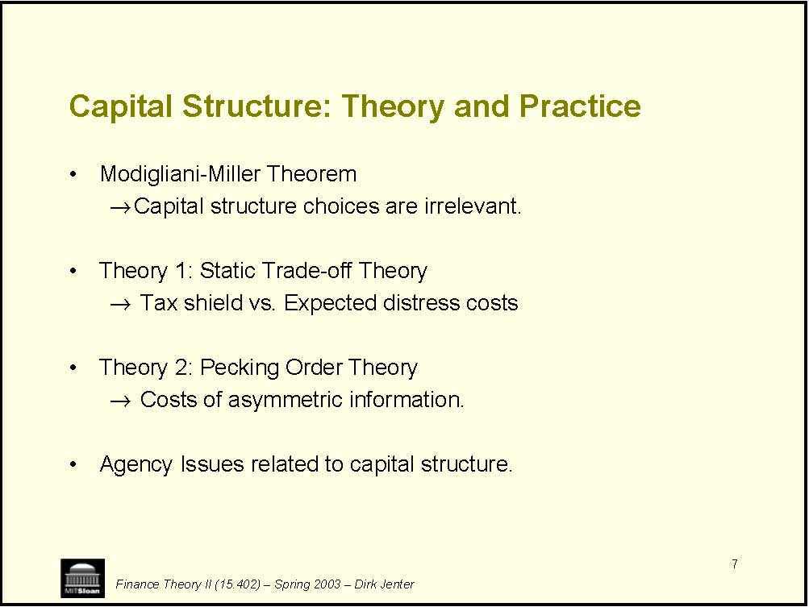
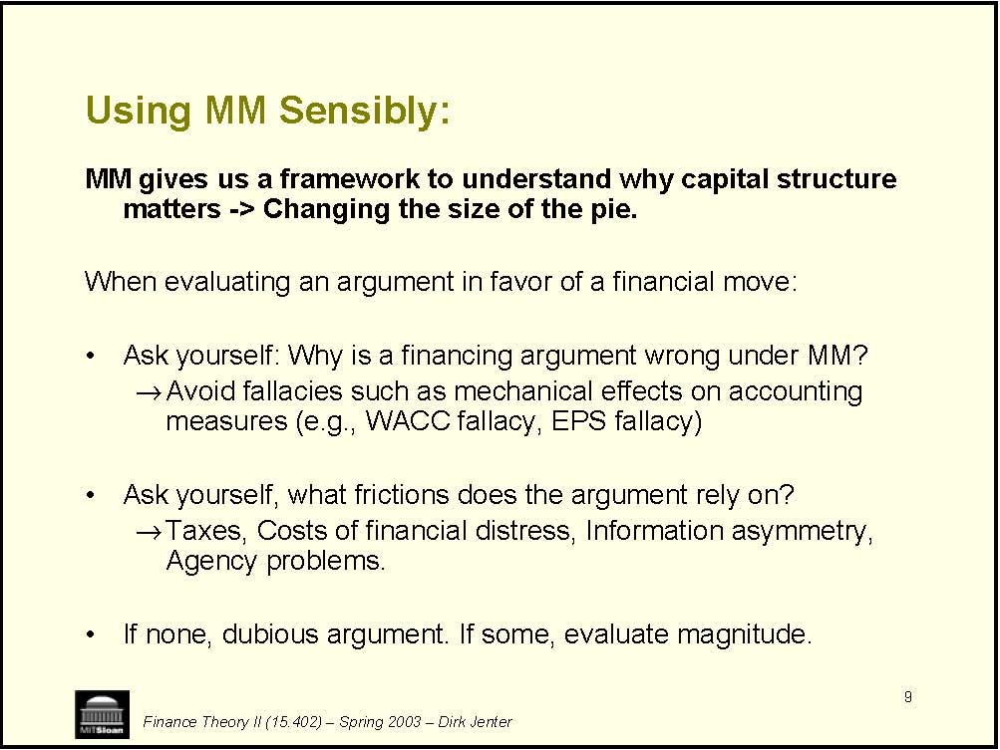

         Acrobat Distiller 5.0 (Windows)

         2003-03-13T21:53:25Z

         2004-01-21T10:24:55+05:30

         2004-01-21T10:24:55+05:30

         PScript5.dll Version 5.2

         uuid:ea5281b1-08d1-4e44-a11f-36b1f7b3a4bb

         uuid:8ab97561-4066-4668-913a-3458eb772f21

         xml

               djenter

               Microsoft PowerPoint - LN11(WrapUp)for Sloanspace.ppt

Finance Theory II (15.402) – Spring 2003 – Dirk Jenter Wrap-Up of the Financing Module 

2 • • • • • • • • • • Finance Theory II (15.402) – Spring 2003 – Dirk Jenter The Big Picture: Part I -Financing A. Identifying Funding Needs Feb 6 Case: Wilson Lumber 1 Feb 11 Case: Wilson Lumber 2 B. Optimal Capital Structure: The Basics Feb 13 Lecture: Capital Structure 1 Feb 20 Lecture: Capital Structure 2 Feb 25 Case: UST Inc. Feb 27 Case: Massey Ferguson C. Optimal Capital Structure: Information and Agency Mar 4 Lecture: Capital Structure 3 Mar 6 Case: MCI Communications Mar 11                       Financing ReviewMar 13                       Case: Intel Corporation

3 • • • i• • • • → Finance Theory II (15.402) – Spring 2003 – Dirk Jenter Overview of Financing Financial forecasting Short-term and medium-term forecasting. General dynamics: Sustainable growth. Capital structure Describing a frm’s capital structure. Benchmark: MM irrelevance. Theory 1: Static Trade-Off Theory. Theory 2: Pecking Order Theory. Agency issues related to capital structure. Pulling it all together. 

4 • • • →→Finance Theory II (15.402) – Spring 2003 – Dirk Jenter Forecasting a Firm’s Funding Needs Question: Given a firm’s operations and the forecast thereof, how much funding will be required, and when? Requires short-run and long-run forecasting. Requires an assessment of a firm’s general dynamics: The concept of sustainable growth. Distinguish “cash cows” from “finance junkies”. 

5 • • • →Dividends (d) →→/)→Finance Theory II (15.402) – Spring 2003 – Dirk Jenter General Dynamics Sustainable Growth Rate:  g* = (1-d) * ROE Give a (very rough) measure of how fast you can grow assets without increasing your leverage ratio or issuing equity. Sustainable growth rate increases when decreases Profit margins (NI/Sales) increases Asset turnover (SalesAssets increases Leverage (Assets/NW) increases 

6 • • • ) • Finance Theory II (15.402) – Spring 2003 – Dirk Jenter Key Points Key Point 0: The concept of sustainable growth does not tell you whether growing is good or not. Key Point 1: Sustainable growth is relevant only if you cannot or will not raise equity, and you cannot let D/E ratio increase. Key Point 2: Sustainable growth gives a quick idea of general dynamics: Cash cows (g &lt;&lt; g*or Finance junkies (g &gt;&gt; g*). Key Point 3: Financial and business strategies cannot be set independently. 

7 • →• →• →• Finance Theory II (15.402) – Spring 2003 – Dirk Jenter Capital Structure: Theory and Practice Modigliani-Miller Theorem Capital structure choices are irrelevant. Theory 1: Static Trade-off Theory Tax shield vs. Expected distress costs Theory 2: Pecking Order Theory Costs of asymmetric information. Agency Issues related to capital structure. 

8 Modigliani-Miller Theorem • →• →→→Dividend policy →→Finance Theory II (15.402) – Spring 2003 – Dirk Jenter MM: In frictionless markets, financial policy is irrelevant. “Proof”: Financial transactions are NPV=0. QED Corollary: All the following are irrelevant: Capital structure Long-vs. short-term debt Risk management Etc. 

9 • →• →• Finance Theory II (15.402) – Spring 2003 – Dirk Jenter Using MM Sensibly: MM gives us a framework to understand why capital structure matters -&gt; Changing the size of the pie. When evaluating an argument in favor of a financial move: Ask yourself: Why is a financing argument wrong under MM? Avoid fallacies such as mechanical effects on accounting measures (e.g., WACC fallacy, EPS fallacy) Ask yourself, what frictions does the argument rely on? Taxes, Costs of financial distress, Information asymmetry, Agency problems. If none, dubious argument. If some, evaluate magnitude. 

10 • • →→• distress: = Finance Theory II (15.402) – Spring 2003 – Dirk Jenter Theory 1: Static Trade-Off Theory The optimal target capital structure is determined by balancing Tax Shield of Debt vs. Expected Costs of Financial Distress Debt increases firm value by reducing the corporate tax bill. This is because interest payments are tax deductible. Personal taxes tend to reduce but not offset this effect. This is counterbalanced by the expected costs of financial Expected costs of financial distress (Probability of Distress) * (Costs if actually in distress) 

11 Checklist for Target Capital Structure Tax Shield: • • • • • • ). Finance Theory II (15.402) – Spring 2003 – Dirk Jenter Would the firm benefit from debt tax shield? Is it profitable? Does it have tax credits? Expected distress costs: Are cash flows volatile? Need for external funds for investment? Competitive threat if pinched for cash? Customers and suppliers care about distress? Are assets easy to re-deploy? Note: Hard to renegotiate debt structure increases distress costs  (Recall Massey’s complex debt structure

12 • • →→• →→→Finance Theory II (15.402) – Spring 2003 – Dirk Jenter Theory 2: Pecking Order The Pecking Order Theory states that firms make financing choices with the goal to minimize the losses from raising funds under asymmetric information. With information asymmetries between firms and markets: External finance is more costly than internal funds. Debt is less costly than equity (because less info-sensitive) . This implies that firms: Preferably use retained earnings, Then borrow from debt market, As a last resort, issue equity. 

13 Implications for Investment • →l• • • Finance Theory II (15.402) – Spring 2003 – Dirk Jenter The value of a project depends on how it is financed. Value = NPV of project – oss from financing Some projects will be undertaken only if funded internally or with relatively safe debt but not if financed with risky debt or equity. Companies with less cash and more leverage will be more prone to under-invest. Rationale for hoarding cash. 

14 • • • • →→Finance Theory II (15.402) – Spring 2003 – Dirk Jenter Agency Problems and Capital Structure Modigliani-Miller assumes that the real investment policy of a firm does not change as a function of capital structure. But: Managers’ incentives and hence their behavior may change with the capital structure of the firm. Managers and stockholders incentives do not always coincide. These conflicts are called agency problems Agency problems in the firm: We have Principals = Shareholders We have Agents = Managers 

15 Principal-Agent Problems • →→Perks →Empire Building • • →→maxiFinance Theory II (15.402) – Spring 2003 – Dirk Jenter Conflicts between managers and investors: Potential problems include: Reduced Effort There are also conflicts between Bondholders and Shareholders Question: Can Leverage help to avoid agency costs? Can Leverage give managers incentives to make value-mizing decisions? 

16 Some classic principal-agent problem: • i⇒ • ⇒ perform and to make operations more efficient. Finance Theory II (15.402) – Spring 2003 – Dirk Jenter The Free Cash Flow Problem: Managers in frms with lots of free cash flow (cash cows) and bad investment opportunities may be reluctant to simply give the excess cash back to shareholders. Having debt puts free cash flows to use, and reduces managers ability to squander funds on pet projects and empire building. The Lazy Managers Problem: Managers in stable firms with lots of free cash flow and without much product market competition may become lazy and complacent. Raising leverage (a lot) puts pressure on managers to 

17 )• →→• →Firms have incentives to delay liquiiefficient. →• Claim Dilution →i• ): →Finance Theory II (15.402) – Spring 2003 – Dirk Jenter Can leverage create agency costs? (Excessive) Leverage can create agency conflicts between equity holders (managers and creditors (bond holders): Looting the firm in financial distress Firms have incentives to loot the company prior to bankruptcy Drexel paid $350M in bonuses three weeks before it filed Chapter 11 Delayed liquidation dation even if immediate liqudation is Liquidation usually only helps creditors, not shareholders or managers. Firms have incentives to surprise existing creditors by borrowng more. Risk shifting (asset substitutionManagers may decide to increase the risk of the firm after they have borrowed. All these costs are anticipated by creditors and hence raise the cost of borrowing. 

18 • →→→…. • →i. →Finance Theory II (15.402) – Spring 2003 – Dirk Jenter Take Away: Agency Problems and Capital Structure Leverage can help to overcome certain agency problems: The free cash flow problem. Complacent, lazy managers. Excessive leverage can create other agency problems: These tend to kick in in actual financial dstress, hence can be regarded as additional costs of distressClever usage of covenants can eliminate many of these problems. 

19 Thinking about Capital Structure: An Extended Checklist • →i• →→• →→i• →i) →→cash, →Finance Theory II (15.402) – Spring 2003 – Dirk Jenter Taxes Does the company benefit from debt tax sheld? Information Problems Do outside investors understand the funding needs of the firm? Would an equity issue be perceived as bad news by the market? Agency Problems Does the firm have a free cash flow problem? Do the managers need additional motivation and monitorng? Expected Distress Costs What is the probability of distress? (Cash flow volatiltyWhat are the costs of distress? Need for external funds for investment, competitive threat if pinched for customers care about distress, assets difficult to redeploy? Managerial misbehavior in distress? 

20 • • • i• Finance Theory II (15.402) – Spring 2003 – Dirk Jenter Conclusion The bulk of the value is created on the LHS by making good investment decisions. You can destroy much value by mismanaging your RHS: Financial policy should be supporting your business strategy. You cannot make sound fnancial decisions without knowing the implications for the business. Finance is too serious to leave it to finance people. 
