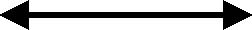
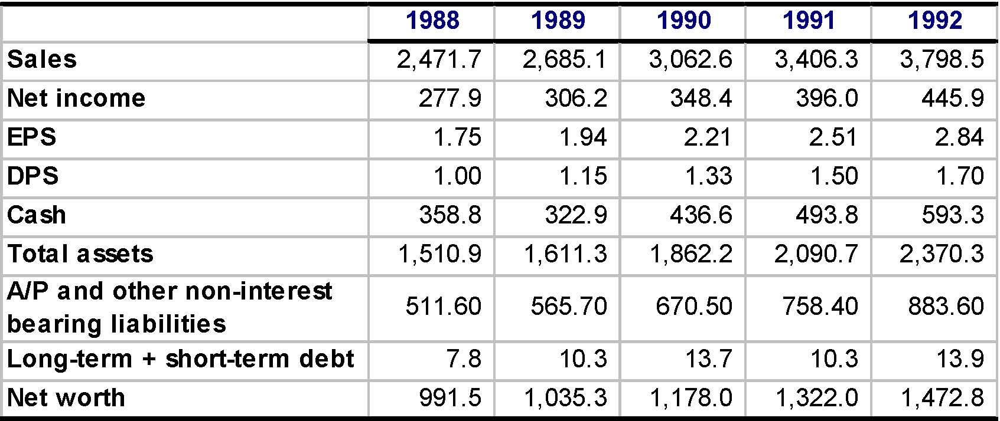
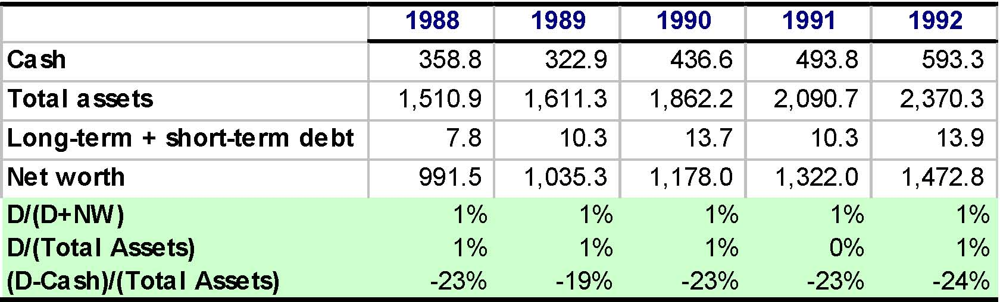
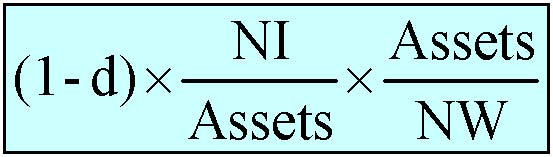
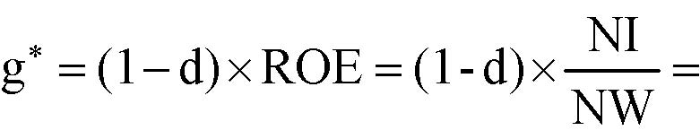

         Acrobat Distiller 6.0 (Windows)

         Compaq

         Compaq

         2004-01-22T11:24:52+05:30

         Acrobat PDFMaker 6.0 for PowerPoint

         2004-01-22T11:22:50+05:30

         2004-01-22T11:24:52+05:30

         uuid:761853d5-e515-4f66-9e9f-7981147db565

         uuid:193b7ed7-ca89-4933-9bb2-f1354d70b098

         xml

               No Slide Title

               Leslie A. Larocca

Wrap-up of Financing

Katharina Lewellen

Finance Theory II

March 11, 2003

Overview of Financing

Financial forecasting

- Short-run forecasting

- General dynamics: Sustainable growth.

Capital structure

- Describing a firm’s capital structure

- Benchmark: MM irrelevance

- Theory 1: Static Trade-Off Theory

- Theory 2: Pecking Order Theory

- An integrated approach

Note:Throughout we take “operations” as given.

Forecasting a Firm’s Funding Needs

- Question:Given our operations (and the forecast thereof), will we need funding, and how much?

- Short-run forecasting 

- General dynamics:

- The concept of sustainable growth

- Cash Cows and Finance junkies

Financial Forecasting: General Approach

- Need (a model of) the firm’s production function

- Use available data

- Common sense

- Specific knowledge of firm and industry

- Given this model forecast all items in the balance sheet except “funding needs”

- Infer the funding need from identity of Assets and Liabilities + Net Worth

Forecasting: Our approach

- Forecast Assets

- Forecast non-bank liabilities, excluding Net Worth

- Forecast Net Income

- Assume some starting value for Bank Loan = “Bank Plug”

- Forecast interest using Bank Plug

- Forecast Net Worth

- Consistency check: Assets = Liabilities + Net Worth?

- If yes, stop

- If not, adjust Bank Plug

- Recall: All we want are rough approximations

General Dynamics

- Sustainable Growth Rate:  g* = (1-d) * ROE

- Gives a (very rough) measure of how fast you can grow Assets without increasing your leverage ratio or issuing equity

- Sustainable growth rate increases when

- Dividends (d) decreases

- Profit margins (NI/Sales) increases

- Asset turnover (Sales/Assets) increases

- Leverage (Assets/NW) increases

Key Points

- Key Point 0: The concept of sustainable growth does not tell you whether growing is good or not

- Key Point 1:Sustainable growth is relevant only if you cannot or will not raise equity, and you cannot let D/E ratio increase

- Key Point 2: Sustainable growth gives a quick idea of general dynamics: Cash cows (g &lt;&lt; g*) or Finance junkies (g &gt;&gt; g*)

- Key Point 3: Financial and business strategies cannot be set independently

Capital Structure

- Describing a firm’s capital structure

- MM theorem

- Theory 1: Static Trade-off Theory

- Tax shield vs. Expected distress costs

- Theory 2: Pecking Order Theory

- Implications for investment 

- Implications for capital structure

- Pulling it all together

MM Theorem

- MM: In frictionless markets, financial policy is irrelevant.

- Finance Theory 1: Financial transactions are NPV=0. QED

- Corollary: All the following are irrelevant:

- Capital structure

- Long-vs. short-term debt

- Dividend policy

- Risk management

- Etc.

Evaluate the following statements

- Issuing equity dilutes earnings-per-share and thus hurts current shareholders.

- Equity in a levered firm is riskier than equity in an unlevered(but otherwise identical) firm.

- Currently, interest rates are high, so it is better to issue equity than debt.

- Currently, short-term interest rates are lower than long-term interest rates, so it is better to issue long-term than short-term debt.

Using MM Sensibly

When evaluating an argument in favor of a financial move:

- Ask yourself: Why is financing argument wrong under MM?

- Avoid fallacies such as mechanical effects on accounting measures (e.g., WACC, EPS, Win-win)

- Ask yourself, what frictions does the argument rely on?

- Taxes, Costs of financial distress, Information asymmetry, Agency problems

- If none, dubious argument. If some, evaluate magnitude.

Financing Choices

vs.

Equity

Debt

Theory 1: Static Trade-Off Theory

- Talks about costs and benefits of Debt relative to Equity

- The optimal target capital structure is determined by balancing

Note:The theory does not give you a precise target but rather a range, an order of magnitude.

Tax Shield of Tax Shield of DebtDebt

Expected Costs Expected Costs of Fin. Distressof Fin. Distress

Tax Shield of Debt

- Debt increases firm value by reducing corporate tax bill.

- This is because interest payments are tax deductible.

- Personal taxes tend to reduce but not offset this effect.

V(w/ debt) = V(all equity) + PV(tax shield)

- Order of magnitude for PV tax shield

- Constant debt level : t*D

- t = marginal tax rate depends on country, tax credits, etc.

Note:A move that increases firm value will increase equity value!

Expected Costs of Distress: Two Terms

Expected costs of financial distress

=

(Probability of Distress) * (Costs if actually in distress)

Probability of Distress

- Cashflowvolatility

- Is industry risky? Is firm’s strategy risky?

- Are there uncertainties induced by competition?

- Is there a risk of technological change?

- Sensitive to macroeconomic shocks, seasonal fluctuations?

- Etc.

- Use past data but also knowledge of industry.

- Beware of changes of environment.

Indirect costs of financial distress:

- Debt overhang: Inability to raise funds to undertake investments.

- Pass up valuable projects Do I need to invest?

- Rivals become aggressive Do I have aggressive rivals?

- Scare off customers and suppliers(e.g., implicit warranty or specific investment) Do other parties care?

- Asset fire salesAre assets easily re-deployable?

- Are my assets valuable to other firms? (e.g. R&amp;D)

- Who are potential buyers? How many? Will they be cash constrained when I want to sell my assets?

Checklist for Target Capital Structure

Tax Shield:

- Would the firm benefit from debt tax shield? Is it profitable? Does it have tax credits?

Expected distress costs:

- Are cashflowsvolatile?

- Need for external funds for investment?

- Competitive threat if pinched for cash?

- Customers and suppliers care about distress?

- Are assets easy to re-deploy?

- Note:Hard to renegotiate debt structure increases distress costs (Recall Massey’s complex debt structure).

Theory 2: Pecking Order

- Firms general financing choices:

- Preferably use retained earnings

- Then borrow from debt market

- As a last resort, issue equity

- Theory: Info. asymmetry between firm and market makes:

- External finance more costly than internal funds

- Debt less costly than equity (because less info-sensitive)

Implications for Investment

- The value of a project depends on how it is financed.

- Some projects will be undertaken only if funded internally or with relatively safe debt but not if financed with risky debt or equity.

- Companies with less cash and more leverage will be more prone to under-invest.

- Rationale for hoarding cash.

Implications for Capital Structure

- If a firm follows the Pecking Order, its leverage ratio results from a series of incremental decisions, not attempt to reach a target.

- High cash flow ==&gt; Leverage ratio decreases

- Low cash flow ==&gt; Leverage ratio increases

- There may be good and bad times to issue equity depending on the degree of information asymmetry.

- Rationale for hybrid instruments.

What Do We Do With Two Theories?

- Sometimes, both theories will give the same recommendation

- But sometimes, they will differ

- Consider Massey Ferguson:

- Static Trade-off theory ==&gt; Equity issue

- Pecking Order Theory ==&gt; Debt issue

- Two questions:

- Is one theory better at describing what firms do?

- Is one theory better at telling what they should be doing?

But As a Prescriptive Theory?

If firms use Pecking order blindly and ignore static trade-off:

- Cash cows will end up with too little leverage (UST).

- Good news: Never too late to lever-up

- Finance junkies will end up with too much leverage (Massey)

- Bad news: It can be too late to unlever(debt-overhang).

- ST debt is temporary relief but worsens things in fine.

DON'T TALK TO DEERE &amp; COMPANY ABOUT MARKET SIGNALING (from Higgins)

(Please see “Don’t Talk to Deere &amp; Company About Market Signaling” from the course 

textbook by Higgins.)

An Integrative Approach

- Each theory makes a statement about what is first order issue:

- STO: Tax shield and Distress costs

- PO: Information (Price of claims you issue)

- Both theories need not be incompatible:

- Use each when you think they emphasize the right issues

- When getting far away from target, STO type issues dominate

- When reasonably close to target, PO type issues dominate

An Integrative Approach (cont.)

- Establish long-run “target” capital structure

- Evaluate the true economic costs of issuing equity

- What is real cost of price hit vs. foregone investment or increase in expected cost of distress.

- If still reluctant to issue equity:

- Are there ways to reduce the cost? (e.g., give information)

- Will the cost be lower if you issue later?

- Can you use hybrids and packages to get there? But be careful. (Recall MCI might get stuck with too much debt)

An Integrative Approach (cont.)

- Straying from target may be warranted. But, be as systematic and precise as possible about justification --Are benefits from straying plausibly large relative to costs?

- Remember: Lion’s share of value is created on LHS. Don’t want to endanger operations. Beware excessive leverage. Ultimately, business strategy should drive financial strategy, not the otherway around.

- Avoid rules of thumb like: ''Never issue in a down market''; or ''Don't knock props out from under stock.'' These may make sense in some, but certainly not all circumstances.

Conclusion

- The bulk of the value is created on the LHS by making good investment decisions.

- You can destroy much value by mismanaging your RHS: Financial policy should be supporting your business strategy.

- You cannot make sound financial decisions without knowing the implications for the business.

- Finance is too serious to leave it to finance people.

Apex Drugs and Products

19881989199019911992Sales2,471.7   2,685.1   3,062.6   3,406.3   3,798.5   Net income277.9     306.2     348.4     396.0     445.9     EPS1.75       1.94       2.21       2.51       2.84       DPS1.00       1.15       1.33       1.50       1.70       Cash358.8     322.9     436.6     493.8     593.3     Total assets1,510.9   1,611.3   1,862.2   2,090.7   2,370.3   A/P and other non-interest bearing liabilities511.60    565.70    670.50    758.40    883.60    Long-term + short-term debt7.8         10.3       13.7       10.3       13.9       Net worth991.5     1,035.3   1,178.0   1,322.0   1,472.8   

Describe Apex’s capital structure.

What are the likely factors that led to this capital structure.

Different measures of leverage should give you a similar picture:

19881989199019911992Cash358.8     322.9     436.6     493.8     593.3     Total assets1,510.9   1,611.3   1,862.2   2,090.7   2,370.3   Long-term + short-term debt7.8         10.3       13.7       10.3       13.9       Net worth991.5     1,035.3   1,178.0   1,322.0   1,472.8   D/(D+NW)1%1%1%1%1%D/(Total Assets)1%1%1%0%1%(D-Cash)/(Total Assets)-23%-19%-23%-23%-24%

What are likely factors that led to this capital structure?

19881989199019911992Net income277.9     306.2     348.4     396.0     445.9     EPS1.75       1.94       2.21       2.51       2.84       DPS1.00       1.15       1.33       1.50       1.70       Total assets1,510.9   1,611.3   1,862.2   2,090.7   2,370.3   Growth in assets0.070.160.120.13Net worth991.5     1,035.3   1,178.0   1,322.0   1,472.8   ROE0.310.340.340.34Dividend payout ratio0.590.600.600.60Plowback ratio0.410.400.400.40Sustainable growth rate0.130.130.140.14

What are likely factors that led to this capital structure?

- In most years, assets grew slower than the sustainable rate

- Retained earnings more than covered the investment needs

- Apex never had to raise outside funds

- A classic “cash cow”

- What explains the high sustainable rate?

- High profit margins and asset turnover offset the mechanical effect of low leverage and the high payout ratios

- Apex management has not attempt to voluntarily increase leverage

What explains the high sustainable rate?

(Focus on year 1992)

=×=×−=∗NWNId)-(1ROEd)(1g

NWAssetsAssetsNId)-(1××

g* = 0.4 * 0.34 =g* = 0.4 * 0.34 =

0.4 * 0.21 * 1.580.4 * 0.21 * 1.58

What explains the high sustainable rate?

(Focus on year 1992)

=×=×−=∗NWNId)-(1ROEd)(1g

NWAssetsAssetsNId)-(1××

Turnover AssetMargin ProfitAssetsSalesSalesNIAssetsNIROA×==

g* = 0.4 * 0.34 =g* = 0.4 * 0.34 =

0.4 * 0.21 * 1.580.4 * 0.21 * 1.58

ROA= 0.12 * 1.82ROA= 0.12 * 1.82

Is this capital structure optimal?

USE THE CHECKLIST!

Tax shield:

- Would APEX benefit from tax shields?

- Is APEX profitable?Yes

- Does it have tax deductions?Not likely

Expected distress costs:

- Are cashflowsvolatile?No

- Need for external funds for investment?Not much

- Competitive threat if pinched for cash?Yes

- Customers and suppliers care about distress?Not much

- Are assets hard to re-deploy?Not really

Apex’s capital structure in 1993?

Sales will grow at 11%.  Profit margin will fall to 7%.

External funding needs  = -6 –14 = -20

=&gt; Apex has excess internal funds of 20.

19921993Sales3,799     4,216      Net income446        295        Profit margin0            0.07       Retained earnings178        118        NW (NW 1993 + Retained earnings 1994)1,473     1,591      Cash (remains constant)593        593        Total assets (all other assets grow at 11%)2,370     2,566      A/P and other non-interest bearing liabilities (grow at 11%)884        981        Bank plug (Total assets - NW - A/P)14          (6)           

Apex’s target capital structure in the long run?

- More uncertainty

- Potential regulation

- Technological change

- More competitive pressure

- Regulation may favor competition in generic drugs

- Apex needs to invest more

- Advances in biotechnology =&gt; more R&amp;D required

- Less internally generated funds

- Patents expire

- Bottom line:Lower target leverage.
