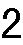
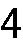
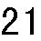
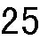
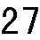
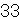
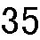
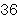

         Acrobat Distiller 6.0 (Windows)

         2005-04-25T22:30:52+08:00

         PScript5.dll Version 5.2

         2005-04-26T09:43:08+08:00

         2005-04-26T09:43:08+08:00

         uuid:82e66d0b-8b60-4a21-9f43-4bfd8030d034

         uuid:839cecec-91a0-43ac-98f0-f0210c86d7ea

         xml

               Microsoft Word - 10-Review of financing and capital strcture——section B

               xjtu

# 对融资模式的总结 

# 

1

财务预测

- ●短期和中期预测

- ●一般动态：不变增长

- 资本结构

- ●描述一个公司的资本结构

- ●基准：MM定理的不相关性

- ●定理 1：静态交易理论

- ●定理 2：优序融资理论

- ●一个综合的方法

注意：从现在起我们按照以上所列的内容逐步进行分析

2

- ● 问题：给出我们的要求（和对此的预测），公司是否需要资金？需要多少资金？

- ● 短期预测

- ● 一般增长：

- →不变增长的概念

- →现金母牛和财务垃圾

- ●需要（一个模型）有关公司的生产函数

- →使用现有的数据

- →根据一般常识

- →运用公司和行业的特殊知识

- ● 利用这个模型通过考察公司资产负债表中的全部项目来预测“资金需求”

- ● 从资产和负债 +净值的恒等式中推断资金的需求

- ● 预测资产

- ● 除了净值，预测非银行负债

- ● 预测净收入

- →假定一些新产生的价值是由于银行贷款而产生的=“银行接口”

- →预测使用银行接口的利息

- ● 预测净值

- ● 一致性检验：资产 =负债+净资产？

- →如果是，停止

- →如果不是，调整银行接口

- ● 稳定的增长率： g * = (1－d) *ROE（股东权益收益率）

- ● （粗略）给定一个在不增加公司的财务杠杆比率和发行股票的情况下如何使公司的资产快速增加的办法

- ● 当出现如下的情况时，将会提高稳定的增长率：

- →公司的分红减少

- →边际利润（NI/销售）提高

- →资产周转率（销售/资产）提高

- →财务杠杆（资产/NW）增加

- ● 要点 0：稳定增长的概念没有告诉我们是否公司的成长是好的还是有害的

- ● 要点 1：只有当公司不能或不愿发行股票时，稳定的增长前后才是相关联的，并且公司也不能让 D/E的比率增加。

- ● 要点 	2：稳定增长给人一种一般动态的简单想法：或者是现金母牛(g &lt;&lt; g*)或者是财务垃圾(g &gt;&gt; g*)。

- ● 要点 3：融资和经营策略不能够独立进行

- ● 描述一个公司的资本结构

- ● 莫迪格里安尼 -米勒定理

- ● 理论 1：静态交易理论

- →税盾与预期困难的成本

- ● 理论 2：优序融资理论

- →对投资的建议

- →对资本结构的建议将所有这些进行综合考虑

- ●MM定理：在无摩擦的市场里，融资政策是不相关的。

- →融资理论 1：融资交易行为的 NPV = 0. QED 

- ●由此得出顺理成章的结论：全部如下内容都是不相关的：

- →资本结构；

- →长期与短期债券；

- →分红政策；

- →风险管理；

- →等等。

- ● 发行股票会稀释每股净收益，这样会损害现有股东的利益。

- ● （在其他条件一致的情况下）具有较高财务杠杆的公司发行股票比具有较低财务杠杆的公司发行股票风险较高。

- ● 一般地，在利率较高时，发行股票会比发行债券有利。

- ● 一般地，短期利率比长期利率低，所以发行长期债券比发行短期债券有利。

3

4

5

6

7

8

9

10

当对融资行为进行评估衡量时：

●自我衡量一下：按照 MM定理为什么有关融资的争论是错的？

- →避免陷入诸如在机械运用计算方法上的影响（例如：WACC谬误, EPS谬误）。

- ●自我衡量一下：这些争论源于哪些摩擦？

- →税收、财务困难的成本、信息不对称、代理问题。

- ●如果没有摩擦，这些争论就值得质疑；如果有一些摩擦，则评价其影响的大小。

11

# 融资选择

# 

12

- ● 讨论债券相对于股票的成本和收益

- ● 最佳的目标资本结构是通过平衡的方法来确定的

注意：这个理论并没有给出准确的目标而是给出了一个范围，一个重要性的次序。

13

- →这是因为利息在计算税负时可以扣除。

- →个人税可以降低但不能抵消这种影响。 

V(w/ 债券) = V(所有股票) + PV(税收回避) 

● PV税盾的重要性次序

→稳定的债务杠杆：t*D 

→t=依靠国家的边际税率，税收信用，等等。注意：那些提高公司价值的行动会提高公司股票的价值！

14

15

- ● 现金流的不稳定性

- →行业是危险的吗？公司的策略是危险的吗？

- →有因为竞争引起的不确定损失吗？

- →有技术上变化的危险吗？

- →对宏观经济的震动，季节性的波动敏感吗？

- →等等。

- ● 利用过去的数据但也要有行业的知识。

- ● 注意环境的变化。

- ● 债务悬空：不能筹集资金进行项目的投资。

- →放弃有价值的项目→公司需要投资吗？

- →竞争对手变得更加主动→公司有有力的竞争对手吗？

- ● 吓跑用户和供应者 (例如：不稳定的担保或者特定的投资) →其他群体会关心吗？

- ● 资产的紧急出售→资产容易调整吗？

- →公司的资产对其他公司有价值吗？(例如研发) 

- →谁是潜在的购买者？出价多少？当公司想要出售资产时，购买者会采用现金付款吗？

16

17

税盾：

- ●公司能否从税盾中获得好处？它能带来收益吗？它能带来税收减免吗？

- ●现金流是易变的吗？

- ●需要利用外部融资来进行项目的投资吗？

- ●如果出现现金挤兑的压力会出现严重的威胁吗？

- ●客户和供应商会关心财务困难吗？

- ●资产容易进行重新调整吗？

注意：难以对债务结构增加所导致的财务困难成本进行度量（回顾 Massey复杂债务结构的情况）

18

- ● 公司一般的融资选择

- →尽可能使用留存收益；

- →其次从债券市场借入资金；

- →最后才会发行股票融资。

- ● 理论：公司和市场之间的信息不对称

- →外部融资所花费的成本高于内部融资。

- →债券融资的成本小于股票融资（因为相比而言债券具有更小的信息敏感性）

- ● 项目的价值依赖于其融资的方式。

- ● 只有当能够采用内部融资或发行相对无风险债券而不是发行高风险债券或股票融资时一些项目才可能进行投资。

- ● 具有较少现金流和较高财务杠杆的公司更容易出现投资不足的问题。

- ● 这也就是公司集聚现金的基本道理。

- ● 如果一个公司遵循优序融资理论，它的财务杠杆比率将由一系列扩展的因素所决定，而不是试图去达到某一个目标

- →较高的现金流——杠杆比率下降

- →较低的现金流——杠杆比率上升

- ● 这里可能由于依赖于信息不对称程度的不同，存在有发行股票的好的或坏的时机的选择。

- ● 理性选择混合工具。

- ● 有时，两个理论给出了相同的建议

- ● 但是有时，两个理论所给出的建议不同

- ● 考虑到马西·弗格森的建议：

- →静态交易理论 ==&gt;发行股票

- →优序融资理论 ==&gt;发行债券

- ● 两个问题：

- →两个理论中是否是一个理论更擅长描述公司做了什么？

- →两个理论中是否是一个理论更擅长告诉公司应该做什么？

19

20

21

22

如果公司盲目使用优序融资理论并且忽视静态交易：

- ● 财源稳定可靠的资金收入将会由于太小的财务杠杆而消失（ UST公司的例子）

- →好在：任何时候提升财务杠杆比率都不晚

- ● 财务垃圾将由于太高的财务杠杆比率而消失 (马西公司的例子) 

- →坏在：此时降低财务杠杆比率可能已经太晚了（债务悬空）。

- →缺乏债务的痛苦是暂时的，但由此带来的惩罚却是严重的。

23

不要与迪尔公司讨论有关市场信息的问题(从希金斯那里) 

(请参见希金斯教科书的课程“不要与迪尔公司讨论有关市场信息的问题”。) 

24

- ● 每个理论都阐明了一个关于最先发行顺序的问题：

- →静态交易理论侧重考察：税收回避和财务困难的成本

- →优序融资理论侧重考察：信息（→当公布发行信息时的价格）

- ● 两个理论并不是不相容的：

- →当你认为公司重在正确的结果时会选择哪一个理论

- ● 当和目标距离较远时，静态交易理论的观点占优势

- ● 当和目标距离较近时，优序融资理论的观点占优势

- ● 建立长期的 "目标"资本结构

- ● 评估发行股票的真实经济成本

- →什么是对价格造成冲击的真实成本或者说是对财务困难预期成本的已有投资或进一步追加。

- ● 如果仍然不愿意发行股票

- →还有办法降低成本吗？ (例如：披露信息) 

- →如果推迟发行将会降低发行成本吗？

- →公司能使用匹配和打包等手段达到目的吗？但是要小心。 ( 回顾 MCI 公司可能无法摆脱太多欠债案例)。

- ● 偏离目标的行为可能是正当的，但是，有关偏离的理由必须尽可能的系统和准确——能否从看似和成本有较大关联的偏差中获益吗？

- ● 记住：价值的重要部分是在资产负债表的左方（ LHS）产生的，不要想着去采取危险的行动，注意过高的财务杠杆。最后，经营策略将会对财务政策产生影响，而不是周围的其他因素。

- ● 避免拇指法则，像：“从来不在下降的市场中发行股票”；或者“不要撞倒股票价格下降的支柱。”这些说法可能有一些意义，但当然并非全部情形。

- ● 通过做好投资决策，公司价值的大部分建立在资产负债表左方（ LHS）项目之上。

- ● 公司可能因为对其资产负债表右方（ RHS）的项目管理不当而造成对价值的破坏：融资政策应该支持公司的经营策略。

- ● 公司不能在不知道经营暗含的东西时做出合理的融资决策。

- ● 融资行为可以为融资人留下非常严重的后果。

- ● 在绝大多数年份，资产的增长慢于最低的稳定的增长率

- →留存收益多于适用的投资需要

- →顶峰制药公司从不需要从外部融通资金 

- →一个经典的“现金母牛”

- ● 如何解释较高的增长比率？

- →较高的边际利润和资产周转率抵补了较低的杠杆率和较高的偿付比率的影响

- ● 顶峰公司的管理并没有试图主动增加杠杆比率

25

26

27

28

29

30

31

32

33

34

税收回避： 

●APEX公司能否从税盾中获益？ 

→APEX公司获益了吗？

→这是否具有税收减免的作用？财务困难的预期：

- ● 现金流是否具有易变性？

- ● 是否需要外部融资进行项目的投资？

- ● 如果收缩现金是否带来竞争威胁？

- ● 顾客和供应商关心财务困难吗？

- ● 资金很难被重新规划吗？

——是

——不像

——不是——不是太多——是的——不太关心——不总是

35

36

- ● 更多的不确定性

- →潜在的调整

- →技术的改进

- ● 更多竞争的压力

- →在生物制药方面一般的规则更倾向于竞争。

- ● 顶峰公司需要更多的投资

- →高级生物技术——需要更多的研发投入

- ● 减少内部融资

- →专利到期

- ● 底线：较低的目标杠杆

37
