         Acrobat Distiller 6.0 (Windows)

         2004-01-21T10:26:18+05:30

         2004-01-21T10:28:08+05:30

         2004-01-21T10:28:08+05:30

         PScript5.dll Version 5.2

         uuid:f2e0853f-27ed-4313-896e-e311f6b446a5

         uuid:bee995b0-907a-42f9-8893-b167c135d5be

         xml

               djenter

               Microsoft PowerPoint - LN010_Background(Div).ppt

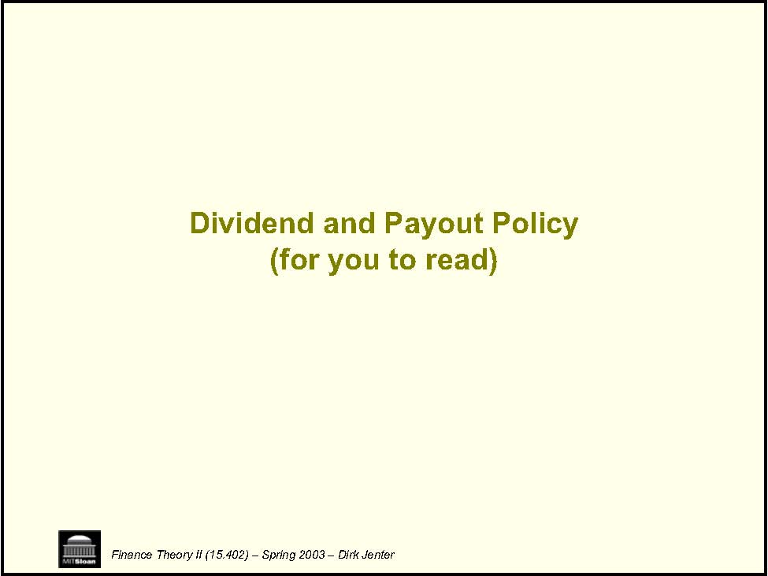

Finance Theory II (15.402) – Spring 2003 – Dirk Jenter Dividend and Payout Policy (for you to read) 

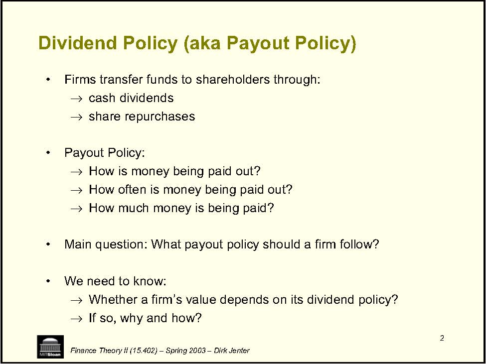

2 • →→• →→→• • →→Finance Theory II (15.402) – Spring 2003 – Dirk Jenter Dividend Policy (aka Payout Policy) Firms transfer funds to shareholders through: cash dividends share repurchases Payout Policy: How is money being paid out? How often is money being paid out? How much money is being paid? Main question: What payout policy should a firm follow? We need to know: Whether a firm’s value depends on its dividend policy? If so, why and how? 

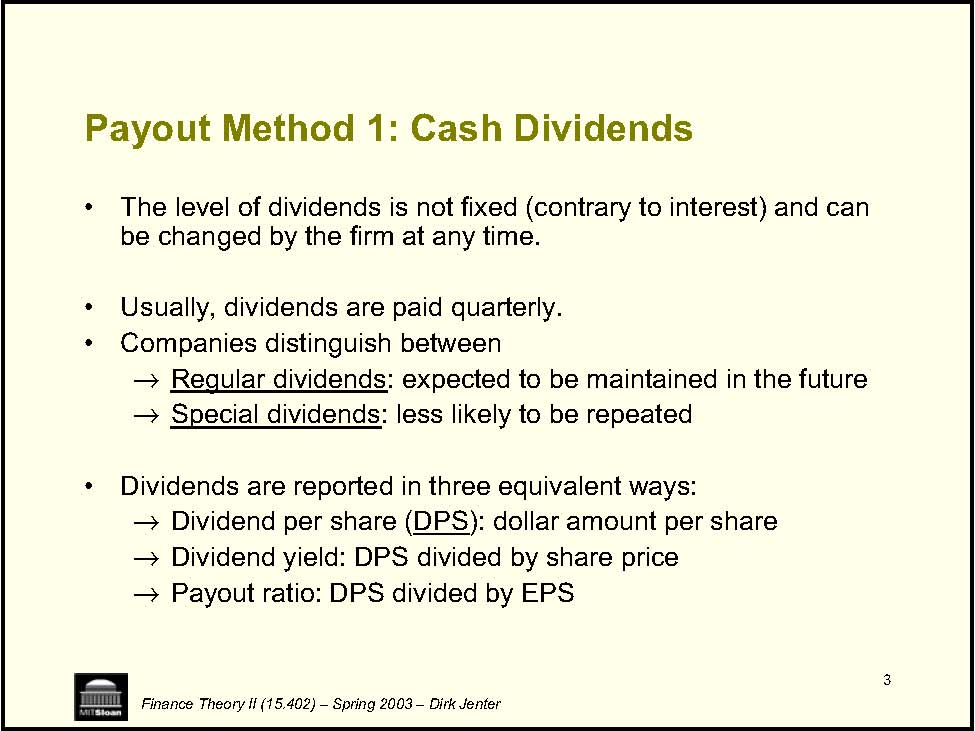

3 • • • →→• →→→Finance Theory II (15.402) – Spring 2003 – Dirk Jenter Payout Method 1: Cash Dividends The level of dividends is not fixed (contrary to interest) and can be changed by the firm at any time. Usually, dividends are paid quarterly. Companies distinguish between Regular dividends: expected to be maintained in the future Special dividends: less likely to be repeated Dividends are reported in three equivalent ways: Dividend per share (DPS): dollar amount per share Dividend yield: DPS divided by share price Payout ratio: DPS divided by EPS 

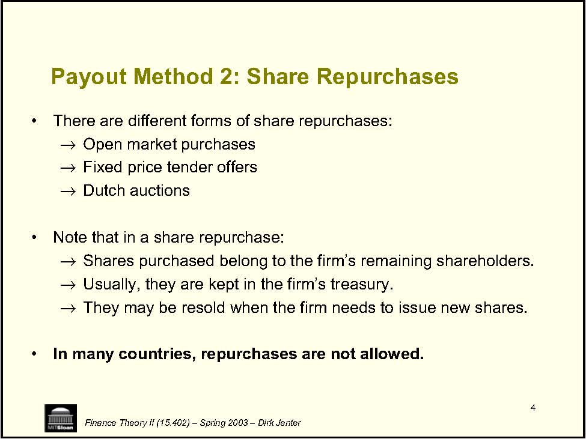

4 • →→→• →→→• Finance Theory II (15.402) – Spring 2003 – Dirk Jenter Payout Method 2: Share Repurchases There are different forms of share repurchases: Open market purchases Fixed price tender offers Dutch auctions Note that in a share repurchase: Shares purchased belong to the firm’s remaining shareholders. Usually, they are kept in the firm’s treasury. They may be resold when the firm needs to issue new shares. In many countries, repurchases are not allowed. 

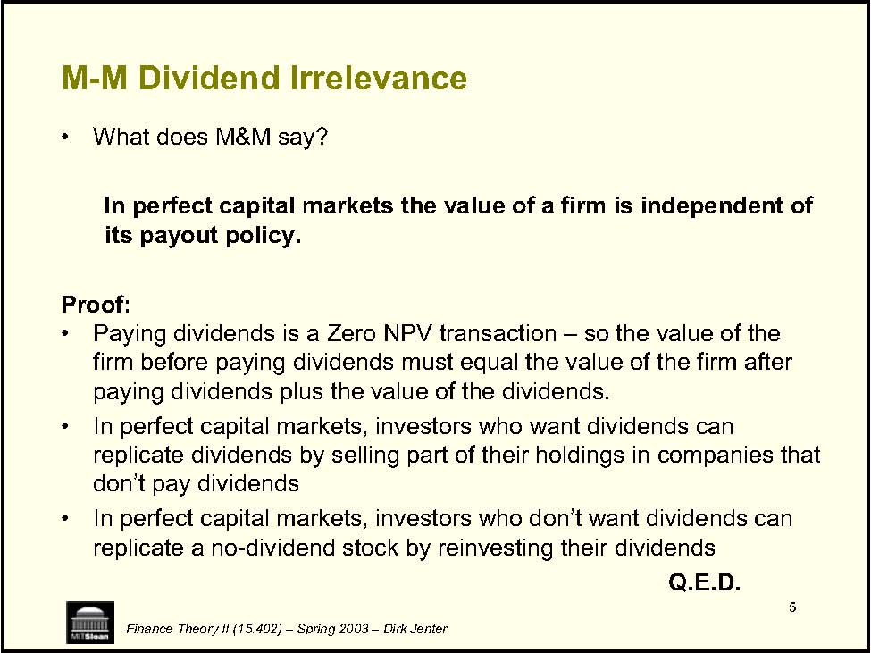

5 M-M Dividend Irrelevance • Proof: • • don’t pay dividends • Q.E.D. Finance Theory II (15.402) – Spring 2003 – Dirk Jenter What does M&amp;M say? In perfect capital markets the value of a firm is independent of its payout policy. Paying dividends is a Zero NPV transaction – so the value of the firm before paying dividends must equal the value of the firm after paying dividends plus the value of the dividends. In perfect capital markets, investors who want dividends can replicate dividends by selling part of their holdings in companies that In perfect capital markets, investors who don’t want dividends can replicate a no-dividend stock by reinvesting their dividends 

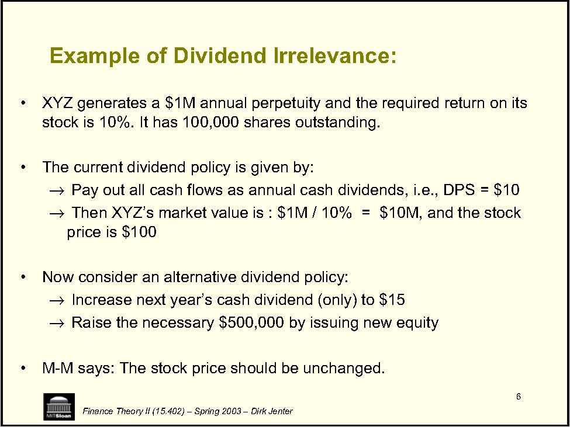

6 Example of Dividend Irrelevance: • • →→= • →→• Finance Theory II (15.402) – Spring 2003 – Dirk Jenter XYZ generates a $1M annual perpetuity and the required return on its stock is 10%. It has 100,000 shares outstanding. The current dividend policy is given by: Pay out all cash flows as annual cash dividends, i.e., DPS = $10 Then XYZ’s market value is : $1M / 10%  $10M, and the stock price is $100 Now consider an alternative dividend policy: Increase next year’s cash dividend (only) to $15 Raise the necessary $500,000 by issuing new equity M-M says: The stock price should be unchanged. 

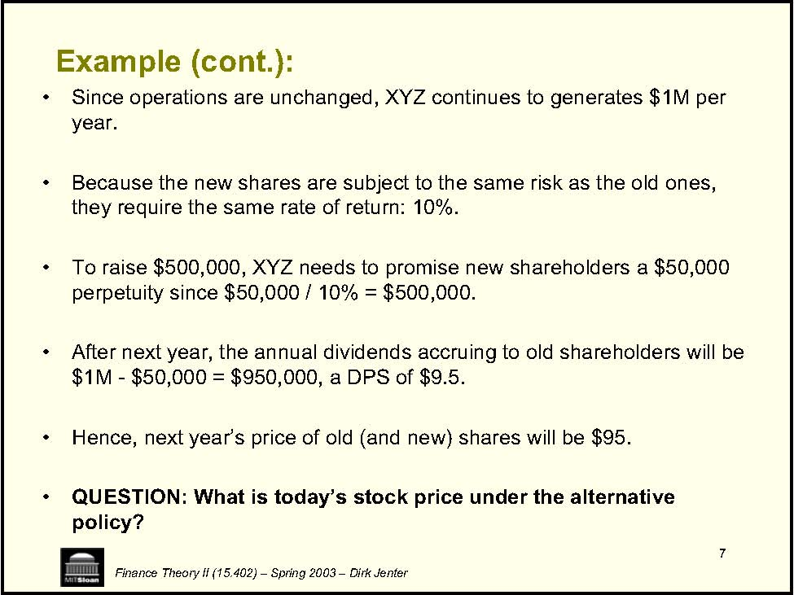

7 Example (cont.): • year. • • • • • Finance Theory II (15.402) – Spring 2003 – Dirk Jenter Since operations are unchanged, XYZ continues to generates $1M per Because the new shares are subject to the same risk as the old ones, they require the same rate of return: 10%. To raise $500,000, XYZ needs to promise new shareholders a $50,000 perpetuity since $50,000 / 10% = $500,000. After next year, the annual dividends accruing to old shareholders will be $1M -$50,000 = $950,000, a DPS of $9.5. Hence, next year’s price of old (and new) shares will be $95. QUESTION: What is today’s stock price under the alternative policy? 

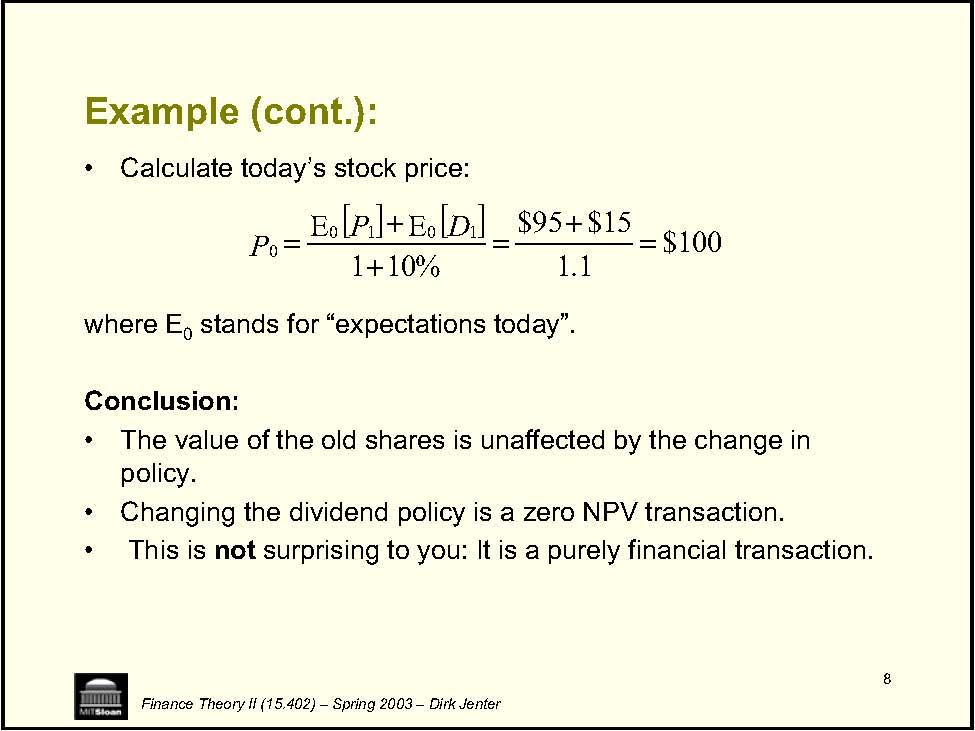

8 Example (cont.): • 0 Conclusion: • policy. • • [][]100$ 15$95$ %101 EE 1010 0 =+=++=DP P Finance Theory II (15.402) – Spring 2003 – Dirk Jenter Calculate today’s stock price: where Estands for “expectations today”. The value of the old shares is unaffected by the change in Changing the dividend policy is a zero NPV transaction. This is not surprising to you: It is a purely financial transaction. 1.1 

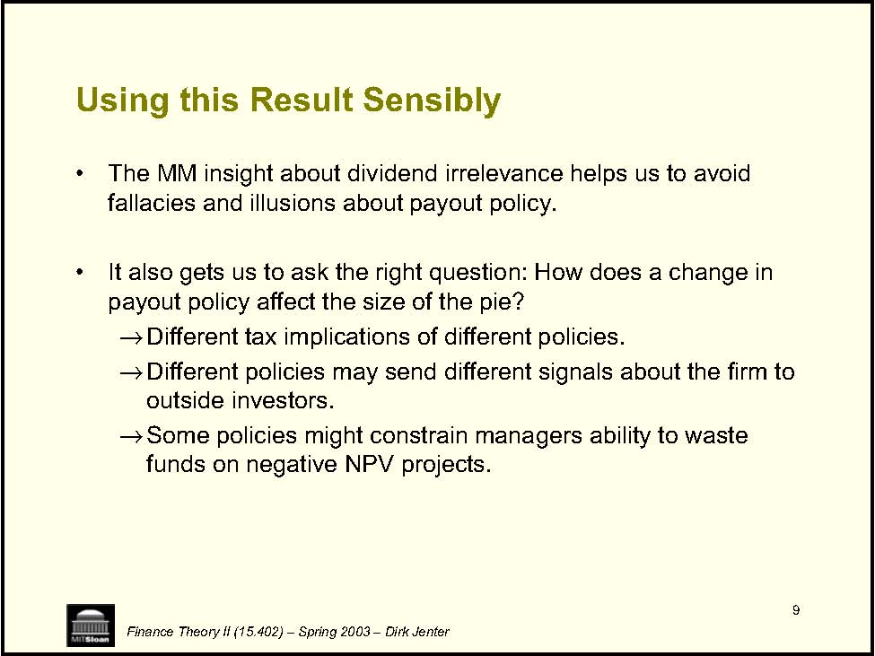

9 Using this Result Sensibly • • →→→Finance Theory II (15.402) – Spring 2003 – Dirk Jenter The MM insight about dividend irrelevance helps us to avoid fallacies and illusions about payout policy. It also gets us to ask the right question: How does a change in payout policy affect the size of the pie? Different tax implications of different policies. Different policies may send different signals about the firm to outside investors. Some policies might constrain managers ability to waste funds on negative NPV projects. 

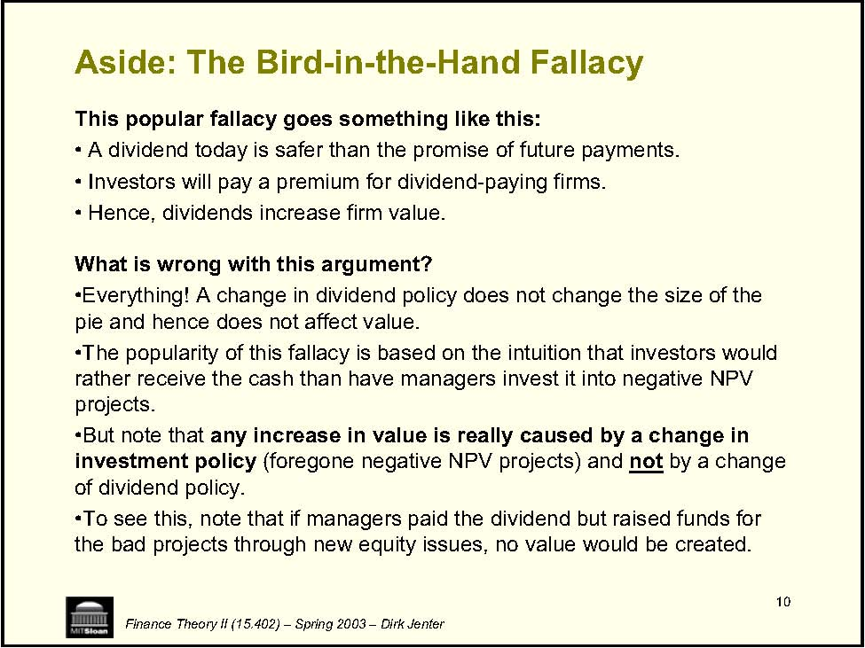

10 Aside: The Bird-in-the-Hand Fallacy projects. •But note that not Finance Theory II (15.402) – Spring 2003 – Dirk Jenter This popular fallacy goes something like this: • A dividend today is safer than the promise of future payments. • Investors will pay a premium for dividend-paying firms. • Hence, dividends increase firm value. What is wrong with this argument? •Everything! A change in dividend policy does not change the size of the pie and hence does not affect value. •The popularity of this fallacy is based on the intuition that investors would rather receive the cash than have managers invest it into negative NPV any increase in value is really caused by a change in investment policy (foregone negative NPV projects) and by a change of dividend policy. •To see this, note that if managers paid the dividend but raised funds for the bad projects through new equity issues, no value would be created. 

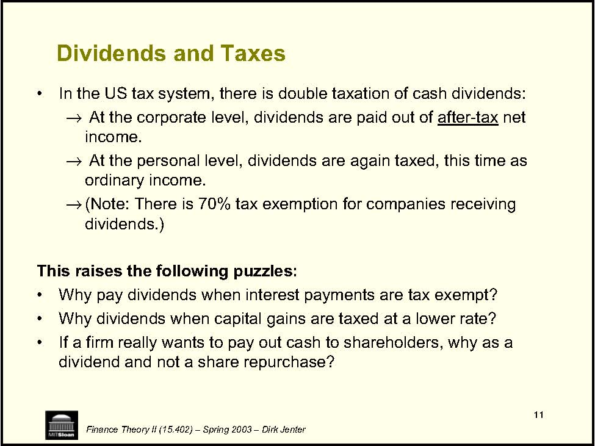

11 • →net →→• • • Finance Theory II (15.402) – Spring 2003 – Dirk Jenter Dividends and Taxes In the US tax system, there is double taxation of cash dividends: At the corporate level, dividends are paid out of after-tax income. At the personal level, dividends are again taxed, this time as ordinary income. (Note: There is 70% tax exemption for companies receiving dividends.) This raises the following puzzles: Why pay dividends when interest payments are tax exempt? Why dividends when capital gains are taxed at a lower rate? If a firm really wants to pay out cash to shareholders, why as a dividend and not a share repurchase? 

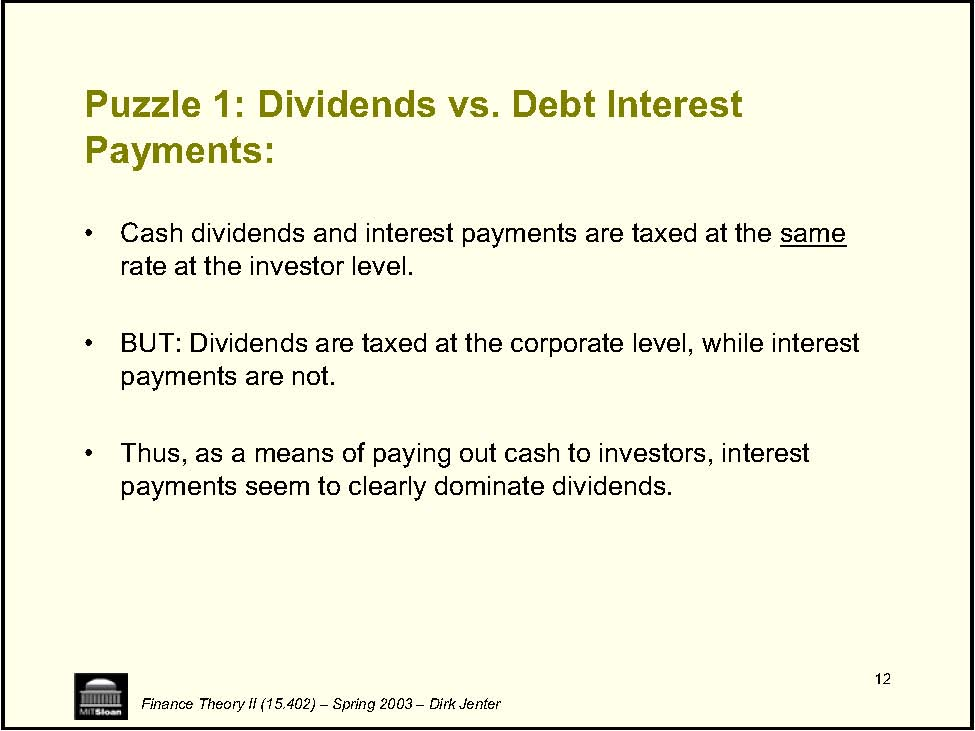

12 Puzzle 1: Dividends vs. Debt Interest • • • Finance Theory II (15.402) – Spring 2003 – Dirk Jenter Payments: Cash dividends and interest payments are taxed at the same rate at the investor level. BUT: Dividends are taxed at the corporate level, while interest payments are not. Thus, as a means of paying out cash to investors, interest payments seem to clearly dominate dividends. 

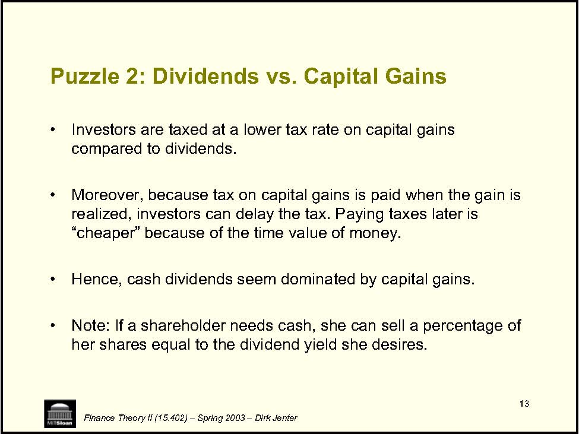

13 Puzzle 2: Dividends vs. Capital Gains • • • • Finance Theory II (15.402) – Spring 2003 – Dirk Jenter Investors are taxed at a lower tax rate on capital gains compared to dividends. Moreover, because tax on capital gains is paid when the gain is realized, investors can delay the tax. Paying taxes later is “cheaper” because of the time value of money. Hence, cash dividends seem dominated by capital gains. Note: If a shareholder needs cash, she can sell a percentage of her shares equal to the dividend yield she desires. 

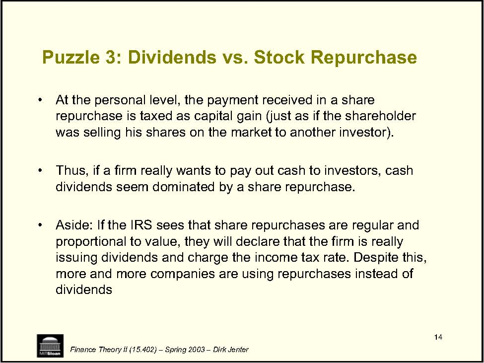

14 Puzzle 3: Dividends vs. Stock Repurchase • • • dividends Finance Theory II (15.402) – Spring 2003 – Dirk Jenter At the personal level, the payment received in a share repurchase is taxed as capital gain (just as if the shareholder was selling his shares on the market to another investor). Thus, if a firm really wants to pay out cash to investors, cash dividends seem dominated by a share repurchase. Aside: If the IRS sees that share repurchases are regular and proportional to value, they will declare that the firm is really issuing dividends and charge the income tax rate. Despite this, more and more companies are using repurchases instead of 

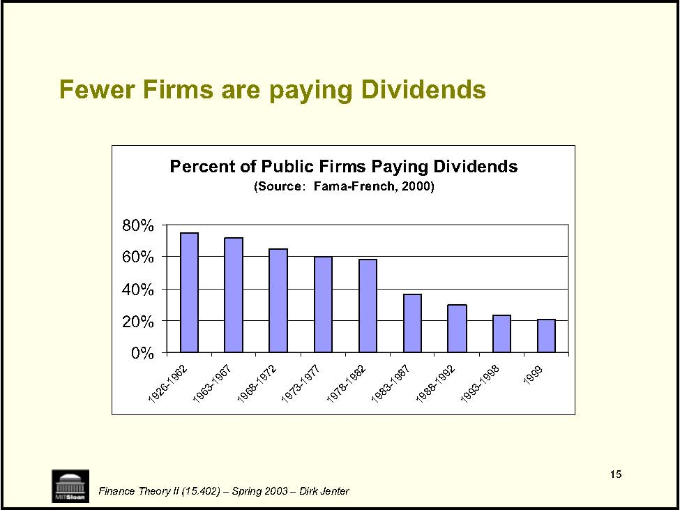

15 0% 20% 40% 60% 80% 1926-1962 1963-1967 1968-1972 1973-1977 1978-1982 1983-1987 1988-1992 1993-1998 1999 Finance Theory II (15.402) – Spring 2003 – Dirk Jenter Fewer Firms are paying Dividends Percent of Public Firms Paying Dividends (Source:  Fama-French, 2000) 

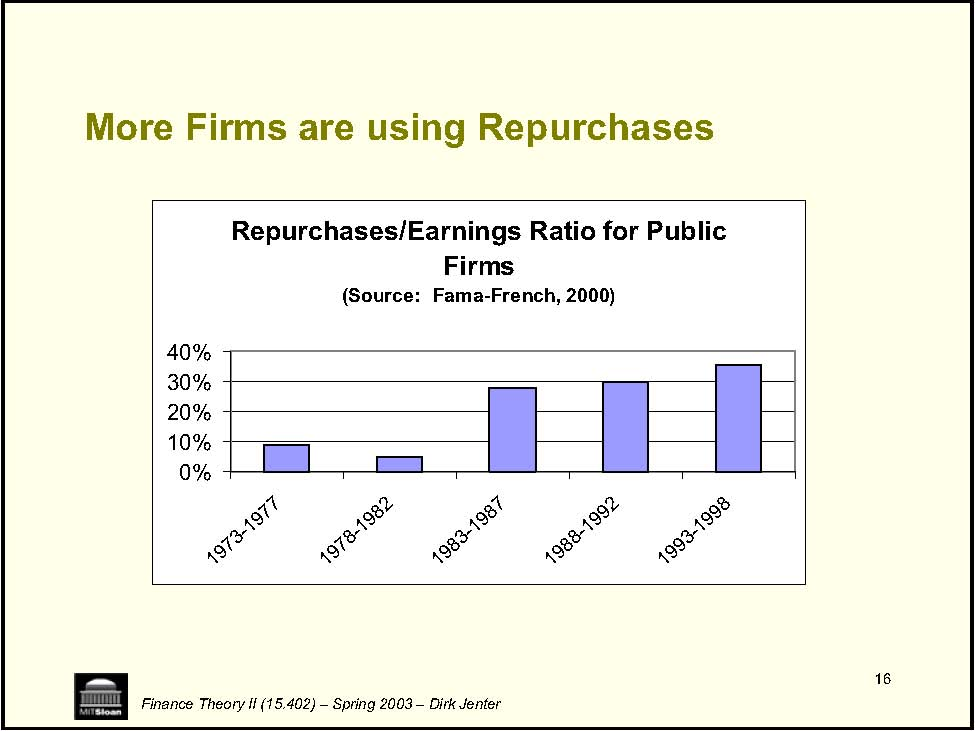

16 0% 10 % 20 % 30 % 40 % 1973-1977 1978-1982 1983-1987 1988-1992 1993-1998 Finance Theory II (15.402) – Spring 2003 – Dirk Jenter More Firms are using Repurchases Repurchases/Earnings Ratio for Public Firms (Source: Fama-French, 2000) 

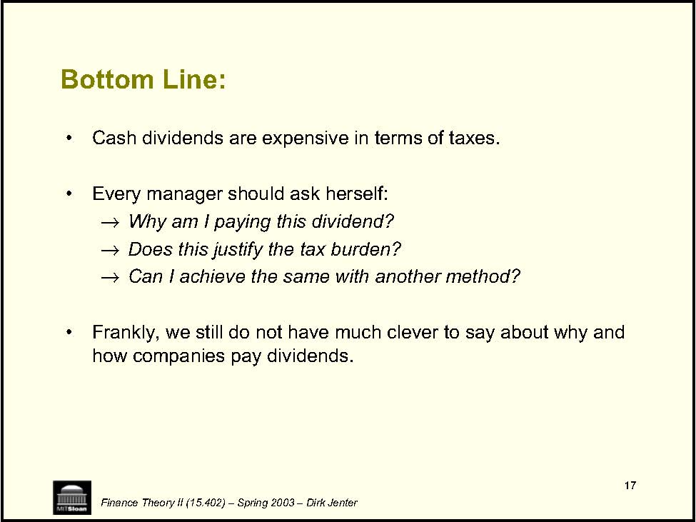

17 Bottom Line: • • →→Does this justify the tax burden? →• Finance Theory II (15.402) – Spring 2003 – Dirk Jenter Cash dividends are expensive in terms of taxes. Every manager should ask herself: Why am I paying this dividend? Can I achieve the same with another method? Frankly, we still do not have much clever to say about why and how companies pay dividends. 

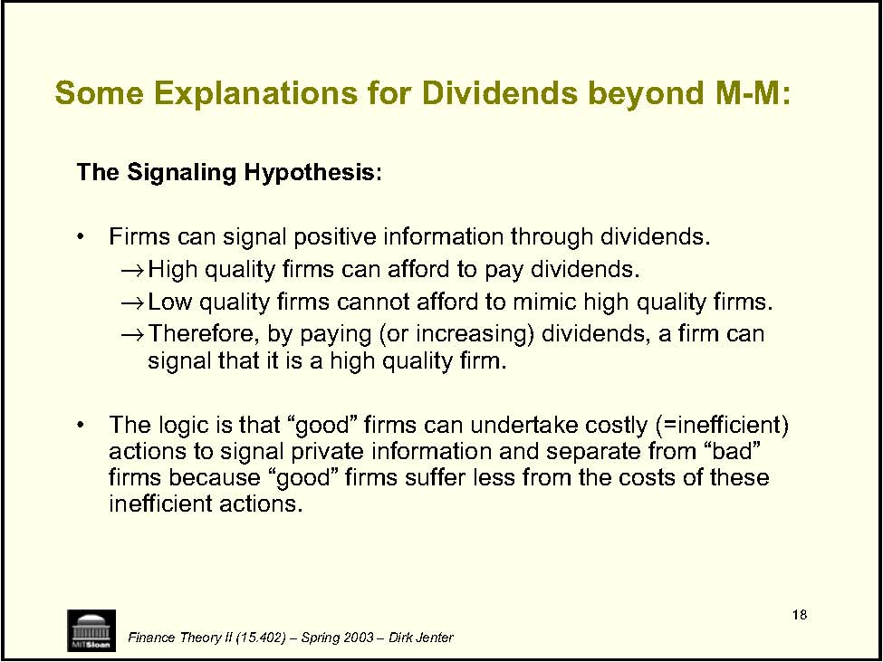

18 • →→→• Finance Theory II (15.402) – Spring 2003 – Dirk Jenter Some Explanations for Dividends beyond M-M: The Signaling Hypothesis: Firms can signal positive information through dividends. High quality firms can afford to pay dividends. Low quality firms cannot afford to mimic high quality firms. Therefore, by paying (or increasing) dividends, a firm can signal that it is a high quality firm. The logic is that “good” firms can undertake costly (=inefficient) actions to signal private information and separate from “bad” firms because “good” firms suffer less from the costs of these inefficient actions. 

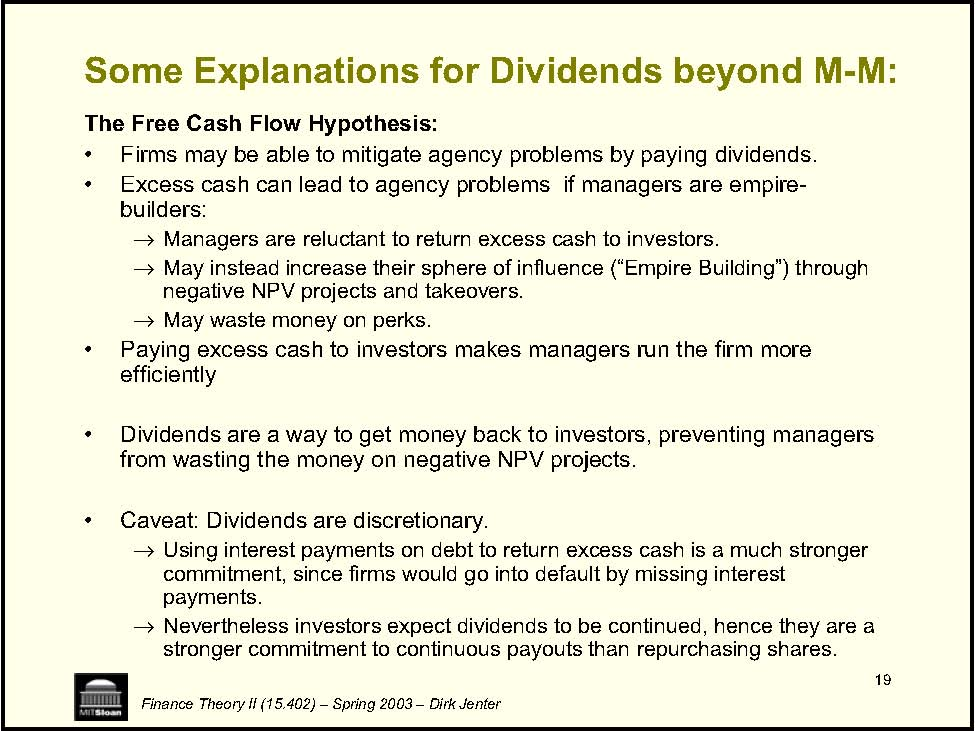

19 • • builders: →→negative NPV projects and takeovers. →• • • →→Finance Theory II (15.402) – Spring 2003 – Dirk Jenter Some Explanations for Dividends beyond M-M: The Free Cash Flow Hypothesis: Firms may be able to mitigate agency problems by paying dividends. Excess cash can lead to agency problems  if managers are empire-Managers are reluctant to return excess cash to investors. May instead increase their sphere of influence (“Empire Building”) through May waste money on perks. Paying excess cash to investors makes managers run the firm more efficiently Dividends are a way to get money back to investors, preventing managers from wasting the money on negative NPV projects. Caveat: Dividends are discretionary. Using interest payments on debt to return excess cash is a much stronger commitment, since firms would go into default by missing interest payments. Nevertheless investors expect dividends to be continued, hence they are a stronger commitment to continuous payouts than repurchasing shares. 

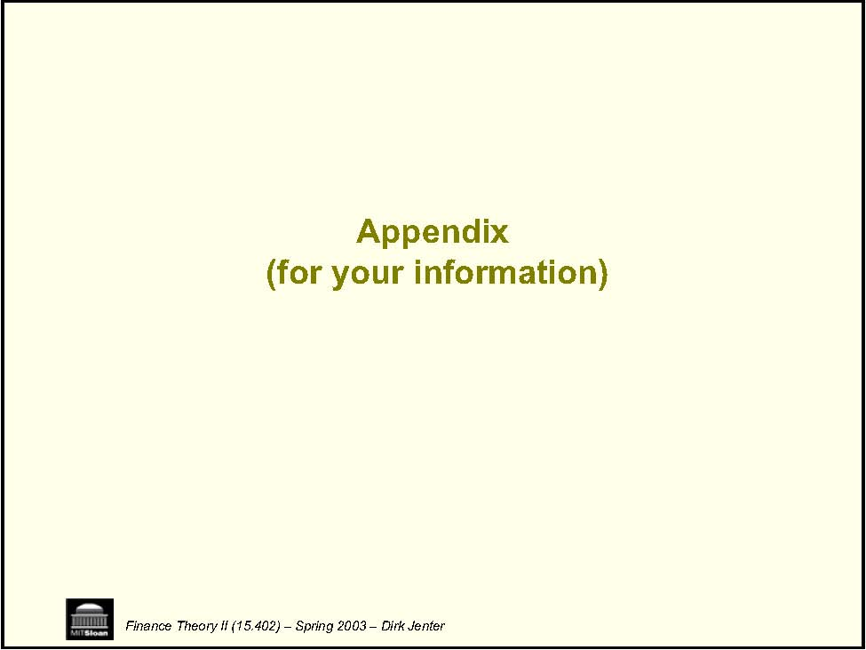

Finance Theory II (15.402) – Spring 2003 – Dirk Jenter Appendix (for your information) 

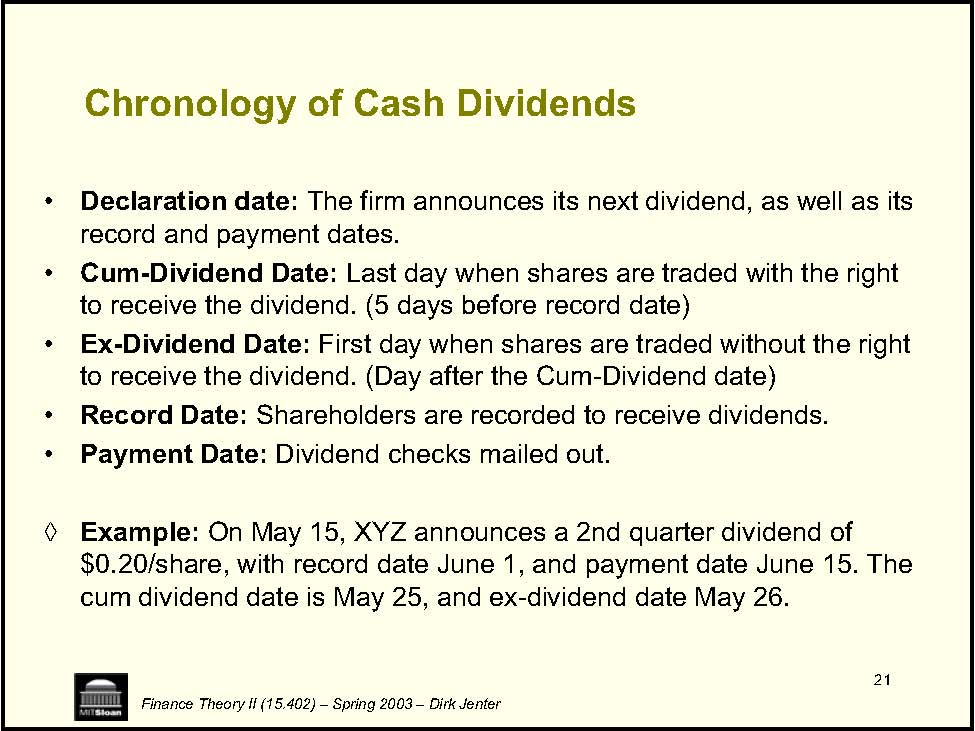

21 • • • • Record Date: • ¸ Example: Finance Theory II (15.402) – Spring 2003 – Dirk Jenter Chronology of Cash Dividends Declaration date: The firm announces its next dividend, as well as its record and payment dates. Cum-Dividend Date: Last day when shares are traded with the right to receive the dividend. (5 days before record date) Ex-Dividend Date: First day when shares are traded without the right to receive the dividend. (Day after the Cum-Dividend date) Shareholders are recorded to receive dividends. Payment Date: Dividend checks mailed out. On May 15, XYZ announces a 2nd quarter dividend of $0.20/share, with record date June 1, and payment date June 15. The cum dividend date is May 25, and ex-dividend date May 26. 

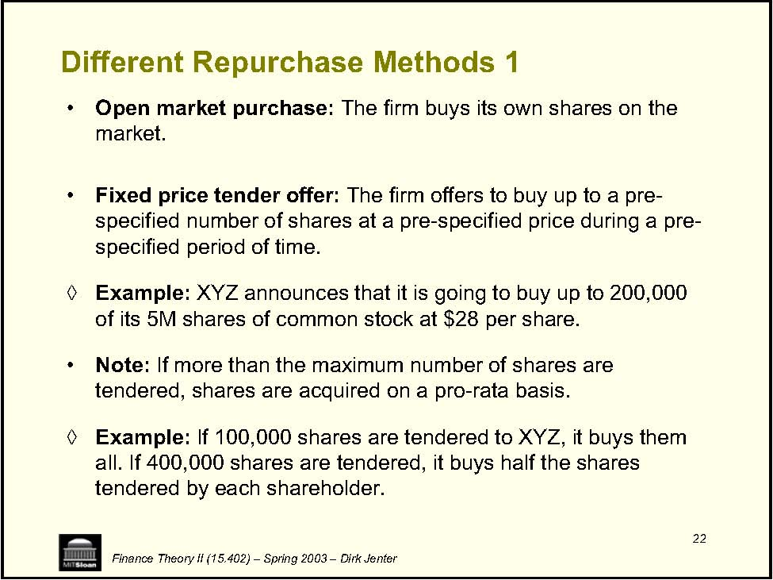

22 Different Repurchase Methods 1 • market. • ¸ Example: • ¸ Example: Finance Theory II (15.402) – Spring 2003 – Dirk Jenter Open market purchase: The firm buys its own shares on the Fixed price tender offer: The firm offers to buy up to a pre-specified number of shares at a pre-specified price during a pre-specified period of time. XYZ announces that it is going to buy up to 200,000 of its 5M shares of common stock at $28 per share. Note: If more than the maximum number of shares are tendered, shares are acquired on a pro-rata basis. If 100,000 shares are tendered to XYZ, it buys them all. If 400,000 shares are tendered, it buys half the shares tendered by each shareholder. 

23 Different Repurchase Methods 2 • ¸ Example: →→→Finance Theory II (15.402) – Spring 2003 – Dirk Jenter Dutch Auction: Each shareholder is invited to submit a bid price at which they are willing to tender (some of) their shares. The firm states the number of shares it buys during a pre-specified period of time, and sets a range of bids it accepts. The repurchase price is the lowest price necessary to acquire the number of shares sought. XYZ announces it will buy up to 200,000 of its 5M shares in a Dutch auction and invites shareholders to bid prices below $28. Suppose that: 50,000 shares were tendered at $25 150,000 shares were tendered at $26 80,000 shares were tendered at $27 Then XYZ buys at $26 all the shares tendered at or below $26. 

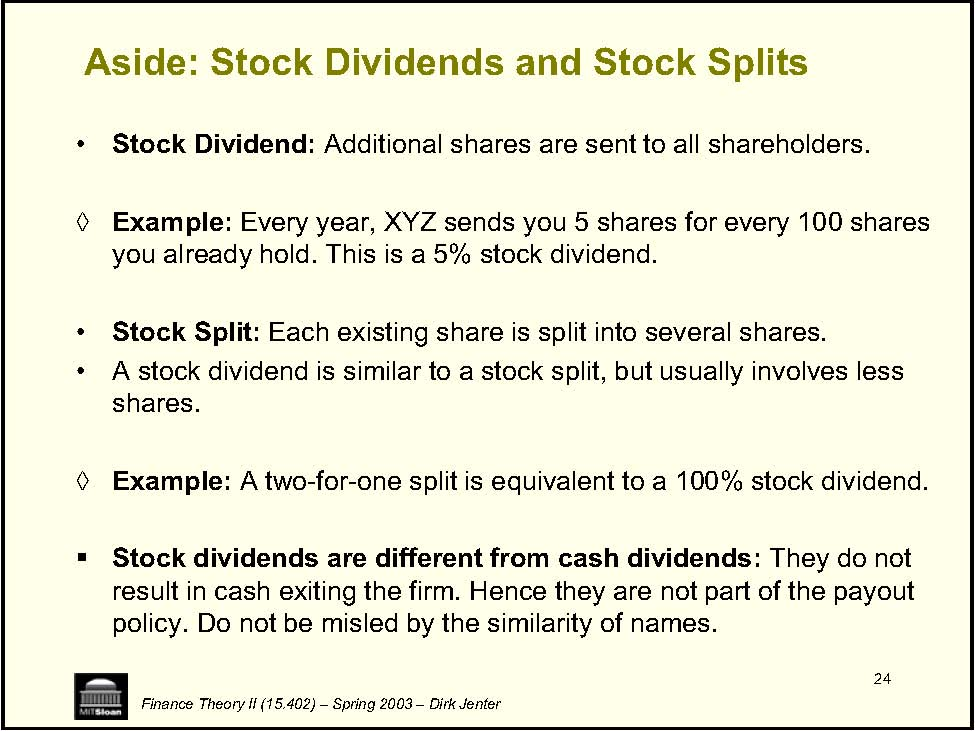

24 • ¸ Example: • • ¸ Example: ƒ Finance Theory II (15.402) – Spring 2003 – Dirk Jenter Aside: Stock Dividends and Stock Splits Stock Dividend: Additional shares are sent to all shareholders. Every year, XYZ sends you 5 shares for every 100 shares you already hold. This is a 5% stock dividend. Stock Split: Each existing share is split into several shares. A stock dividend is similar to a stock split, but usually involves less shares. A two-for-one split is equivalent to a 100% stock dividend. Stock dividends are different from cash dividends: They do not result in cash exiting the firm. Hence they are not part of the payout policy. Do not be misled by the similarity of names. 
