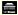
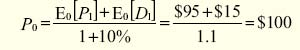
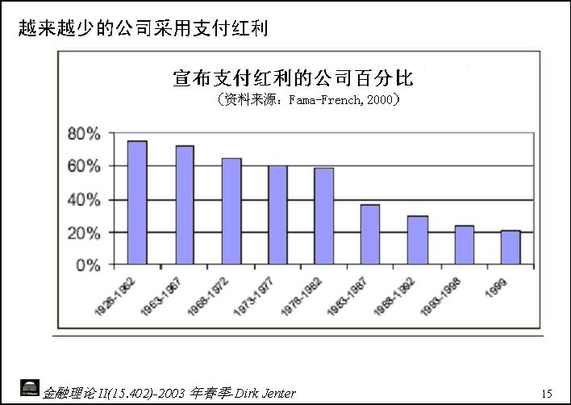
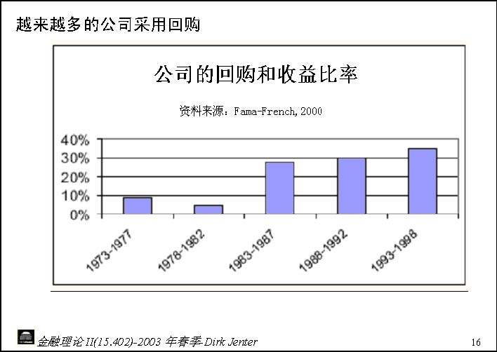

         Acrobat Distiller 6.0 (Windows)

         2005-04-24T17:39:06+08:00

         PScript5.dll Version 5.2

         2005-04-24T17:40:10+08:00

         2005-04-24T17:40:10+08:00

         uuid:7144346e-1d64-44c5-950a-d4fde673b3bc

         uuid:dee5766f-c14c-447d-8806-4f21c67b89ee

         xml

               Microsoft Word - 11-Case

               xjtu

金融理论 II(15.402)-2003年春季-Dirk Jenter 

红利政策（aka公司的分配政策） 

- ● 公司向股东转移资金通过：

- ● 分配政策：

- ● 主要问题：公司应该采用怎样的分配政策？

- ● 我们需要知道：——是否一个公司的价值依赖于其分配政策？——如果是，为什么？有什么影响？

- ● 分红的水平并不是固定的（相对于利息来说）并且公司可以在任何时候进行调整。

- ● 通常，分红是按季进行的。

- ● 公司分别有两种不同的分红形式——经常分红：可以预期在将来保持稳定——特别红利：很少重复

- ● 红利通常以下列三种等价的方法进行公布：——每股分红（DPS）：每股获得的金额——分红收益：DPS除以每股价格——分红率：DPS除以 EPS 

金融理论 II(15.402)-2003年春季-Dirk Jenter 

分配政策2：股份回购 

- ● 有几种不同的股份回购形式：

- ● 在股份回购中应注意：——所回购的股份属于公司现有的股东。——通常，他们持有公司的资产。——当公司需要发行新的股票进行融资时他们可以将这些股票再卖掉。

- ● 在许多国家，回购是不允许的。

- ● MM定理说明了什么？

在完全的资本市场，公司的价值不依赖于其分配政策。

证据：

- ● 支付红利是 NPV为零的交易行为

- ——所以，公司支付红利前的价值必须等于其在支付红利后的价值加上其所分配的红利的价值。

- ● 在完全的资本市场，那些想要进行分红的投资者可以通过出售部分其所持有的不进行分红的公司的股票的方式转换成可分红公司的股票。

- ● 在完全资本市场，那些不想要分红的投资者可以将其所分得的红利购买不分红公司的股票。

金融理论 II(15.402)-2003年春季-Dirk Jenter 

### 有关分红政策无关性的一个例子 

- ● XYZ公司获得了$1M的永久年金并且其需要按照股票的 10%给股东以回报，其发行在外的股份为 100000股

- ● 当前的分红政策如下：——将所有的现金流作为当年的现金分红，即：DPS=$10 ——于是，XYZ公司的股票市场价值为：$1M/10%=$10M，股票的价值为 

- $100 

- ● 现在考虑另外一种替代的分红政策：

- ● MM定理表明：股票的市场价格没有发生改变。

- ● 既然经营没有改变，XYZ公司继续得到每年$1M的收益。

- ●因为新发行的股票具有和老股票同样的风险，所以也要求有同样的回报率：10%。

- ● 为了增加$500000，XYZ公司需要保证给予新股东$50000的稳定收益，即： $50000/10%=$500000。

- ● 到下一年度，对老股东的年度分红将会是 

- ● 所以，下一年老股票（和新股票）的价格将会是$9.5。

- ● 问题：在可替代的分红政策下，当前的股票价格会是什么？

金融理论 II(15.402)-2003年春季-Dirk Jenter 

例子（续）

● 计算当前的股票价格：

此时 E0代表“当前期望”。

结论：

- ● 老股票的价值并不因分配政策的改变而受影响。

- ● 改变分配政策是一个 NPV为零的交易行为。

- ● 这一点也不令人奇怪：这完全是一个纯融资行为。

- ● MM定理阐明了有关分配政策的无关性原理帮助我们避免谬误和对分配政策不切实际的幻想。

- ● 同时也向我们提出一个问题：分配政策的改变对资产份额会有什么样的影

响？——不同的税收暗含了不同的政策。——不同的政策可以给公司外在的投资者传递不同的信息。——一些政策会迫使经理人投资NPV为负的项目导致公司资金的浪费。

金融理论 II(15.402)-2003年春季-Dirk Jenter 

另外：一鸟在手理论的谬误

这种常见的谬误来自于以下的理论：

- ● 今天的分红比将来承诺的分红更安全。

- ● 投资者将会为分红的公司支付额外的风险溢价。

- ● 所以，分红会提高公司的价值。

- ● 无论怎样！分配政策的改变并不能改变资产份额的规模，所以也不能影响公司的价值。

- ● 这种常见的谬误是基于这样的直觉，即投资者宁愿接受现金而不愿让经理人将其投资于 NPV为负的项目。

- ●但是要注意任何一个能够提升价值的举措都是真正由于投资政策的改变（除了那些 NPV为负的项目）而不是由于分配政策的改变所带来的。

- ● 来看这点，注意如果经理人分配红利，但是通过发行新的股票融资投资到较差的项目上，将不会创造任何价值。

- ● 在美国的税收制度中，对现金分红进行了双重征税——在公司层面，分红是在税后净收入中进行分配的。——在个人层面，分红还需要交税，这次是作为通常的收入。——（注意：对公司接受分红将会有 70%的税收免除。）

这将引发如下的困惑：

- ● 在偿付利息免税的情况下为什么还要支付红利？

- ● 在资本收益征收较低的税率时为什么还要支付红利？

- ● 如果一个公司真想给股东支付现金红利，为什么采用分红的方式而不采用股份回购？

金融理论 II(15.402)-2003年春季-Dirk Jenter 

困惑1：分红和支付债券利息 

- ● 从投资者的角度讲，现金红利和利息支付被征收同样的税率。

- ● 但是：股利是在公司的层面被征收的，而利息不是。

- ● 这样，作为对投资者支付现金的一种方式，支付利息似乎比支付红利更具有优势。

- ● 相比较分红，投资者的资本收益被征收较少的税收。

- ● 并且，由于对资本收益征税是在当收益实现时才进行的，投资者可以延迟税收。由于资金时间价值的存在使得其支付的税收较为“便宜”。

- ● 这样，现金红利好像优于资本利得。

- ● 注意：如果股东需要现金，可以通过卖出其所持有的一部分股票来获得所需的资金。

金融理论 II(15.402)-2003年春季-Dirk Jenter 

困惑3：分红和股票回购 

- ● 在个人层面上，股份回购所获得的收益采用资本利得的方式进行征税（正如股东在市场上把他的股票出售给另外的投资者一样）。

- ● 因此，如果一个公司给投资者支付现金的话，现金分红好像又优于股份回购。

- ● 另外：如果 IRS （美国国税局）看到股份回购是如此普遍的运用并且和价值相符，他们就会宣布公司真正发布了红利并要求按收入税率征税，尽管这样，越来越多的公司仍采用回购的方式来代替分红。

- ● 从税收的角度讲现金分红是比较昂贵的。

- ● 每个经理人都应该问问自己：——为什么要采用分红的形式？——为此所承担的税收负担合理吗？——通过其他的方法能获得相同的收益吗？

- ● 坦白地说，直到现在我们还没有足够的智慧来说明为什么公司要支付红利和以什么方式支付。

金融理论 II(15.402)-2003年春季-Dirk Jenter 15 越来越少的公司采用支付红利

金融理论 II(15.402)-2003年春季-Dirk Jenter 16 越来越多的公司采用回购

金融理论 II(15.402)-2003年春季-Dirk Jenter 

### 超越MM定理之外的对分红的一些解释 

信息传递假说：

- ● 公司能够通过发放红利传达有利于公司的信息。——高质量的公司能够支付红利。——低质量的公司没有能力仿效高质量的公司去发放红利。——因此，通过发放（或提高）红利，一个公司能够传递其是高质量公司

- 的信息。

- ●这个逻辑就是“好的”公司能够承担较高成本（ =无效率）的行为来传递非正式的信息以便于将其从“坏的”公司中区别开来，因为“好的”公司从事这些无效率的行动的成本上所承担的困难较小。

自由现金流假说

- ● 公司可以通过支付红利来降低代理问题。

- ● 如果经理人是帝国大厦的建造者，过多的现金能够导致代理问题。——经理人不情愿将过多的现金归还给投资者。——可以通过 NPV为负的项目的投资或接管的方式来扩大他们的影响范围

（“帝国大厦”）。——可以在津贴上耗费资金。

- ● 通过给投资者支付较多的现金可以使经理人更有效地管理公司。

- ●分配股利是偿还投资者资金的一种方式，可以阻止经理人通过投资 NPV为负的项目浪费公司的钱财。

- ● 告诫：股息是可自由支配的。——既然公司倾向于不履行利息分配的职责，采用以偿付债券利息的方式将较多的现金返还给投资者是一种更有强制力的承诺。

——无论怎样，投资者都是希望红利能够持续发放，所以，发放红利有是比股票回购更强的承诺。

金融理论 II(15.402)-2003年春季-Dirk Jenter 

- ● 股息宣布日：公司宣布其下一个分红，以及股息的登记和支付日期。

- ● 附有股息日：股票交易时所具有含有股利的昀后一个交易日 (在股息登记日的前 5天)。

- ●除息日：股票买卖时没有权利得到股息的第一天 (在附有股利日之后的一天)。

- ● 股权登记日：股东进行接受股息的登记。

- ● 股利支付日：寄出支付股息的账单。

例如：在 5月 15，XYZ公司宣布在第 2季度发放 0.20 美元的股息，股息登记日为 6月 1日，股息支付日为 6月 15日，附有股利日为 5月 26日，除息日为 5月 25日。

金融理论 II(15.402)-2003年春季-Dirk Jenter 

### 不同的回购方法1 

- ● 公开市场购买：公司从市场上购回自己的股票。

- ● 提出固定报价：在一预先指定的一定时期内，公司提出按照预先设定的价格购买一定数量的股票。

- ● 例如：XYZ公司宣布它将要以每股 28 美元的价格购买它的 5百万普通股中的 200，000份。

- ● 注意：如果所回购的股票多于其股份的昀大数量，则将按照预先的比率购买股票。

- ● 例如：如果 XYZ公司提出购买 100，000 股，他将全部购买，如果他提出购买 400，000，则其将会购买每一名股东提供的一半。

- ● 荷兰式拍卖：每名股东被邀请提交他们愿意出售(一些)他们所拥有股票的报价，公司在特定的时期之前公布其所购买的股票的数量，并且公布其所能够接收的价格的范围，成交的价格就是所能够购买股票的昀低价格。

- ● 例如：XYZ公司宣布将以荷兰式拍卖的方法购买 5 M 中的 200，000股，

XYZ公司就以 26 美元的价格够买所有等于或低于 26 美元报价的股票

金融理论 II(15.402)-2003年春季-Dirk Jenter 

附加：股票分红和股票分割

- ● 股票分红：增加的股票被分配给所有的股东。

- ● 例如：每年，XYZ公司为每个已经持有每 100 股的股东分配 5 股，这就是 5%的股息。

- ● 股票分割：现有的股票每一股被分成几股。

- ● 股票分红类似于股票分割，但是通常其与较少的股票数量相联系。

- ● 例如：一个 2分 1的股票分割就相当于 100%的股息。 

- ● 	股票分红不同于现金股息：股票分红不会导致现金退出公司，所以股票分红不是分配政策的一部分，因此不要因为名字的相象而产生误解。

