         Acrobat Distiller 6.0 (Windows)

         2004-01-21T10:28:40+05:30

         2004-01-21T10:29:25+05:30

         2004-01-21T10:29:25+05:30

         PScript5.dll Version 5.2

         uuid:793b512e-422a-4f51-ac5c-981a84b4b736

         uuid:c40e2b86-4b21-4ba9-bd49-619461098493

         xml

               djenter

               Microsoft PowerPoint - LN12(FCF).ppt

Valuation Finance Theory II (15.402) – Spring 2003 – Dirk Jenter 

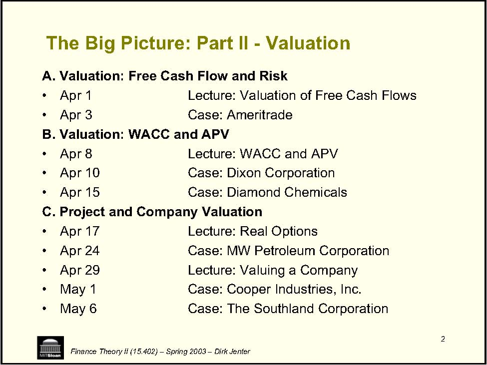

2 • • • • • • • • • • Finance Theory II (15.402) – Spring 2003 – Dirk Jenter The Big Picture: Part II -Valuation A. Valuation: Free Cash Flow and Risk Apr 1 Lecture: Valuation of Free Cash Flows Apr 3 Case: Ameritrade B. Valuation: WACC and APV Apr 8 Lecture: WACC and APV Apr 10 Case: Dixon Corporation Apr 15 Case: Diamond Chemicals C. Project and Company Valuation Apr 17 Lecture: Real Options Apr 24 Case: MW Petroleum Corporation Apr 29 Lecture: Valuing a Company May 1 Case: Cooper Industries, Inc. May 6 Case: The Southland Corporation 

3 Valuation Tools • →Is project A better than doing nothing? →Is project A better than project B? →• • for valuation. Finance Theory II (15.402) – Spring 2003 – Dirk Jenter A key task of managers is to undertake valuation exercises in order to allocate capital between mutually exclusive projects: Is the project’s version A better than its modified version A’? The process of valuation and ultimately of capital budgeting generally involves many factors, some formal, some not (experience, hard-to-formalize information, politics, etc.). We will focus on financial tools 

4 Valuation Tools (cont.) • • time and risk. • →→Versatility →Finance Theory II (15.402) – Spring 2003 – Dirk Jenter These tools provide managers with numerical techniques to “keep score” and assist in the decision-making process. They build on modern finance theory and deal with cash flows, All rely on (often highly) simplified models of the business: Technical limitations (less now with computers) Understandability and “communicatibility” 

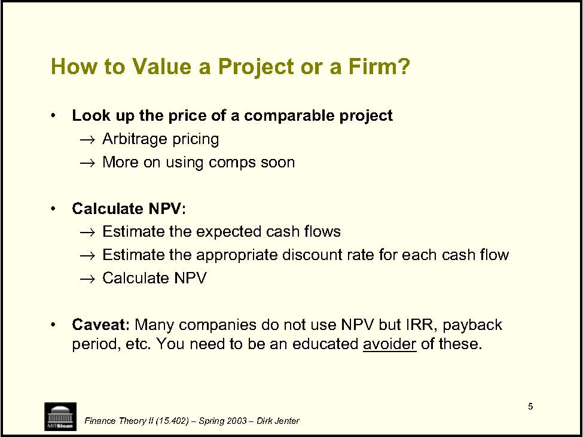

5 How to Value a Project or a Firm? • →→• →→→• of these. Finance Theory II (15.402) – Spring 2003 – Dirk Jenter Look up the price of a comparable project Arbitrage pricing More on using comps soon Calculate NPV: Estimate the expected cash flows Estimate the appropriate discount rate for each cash flow Calculate NPV Caveat: Many companies do not use NPV but IRR, payback period, etc. You need to be an educated avoider 

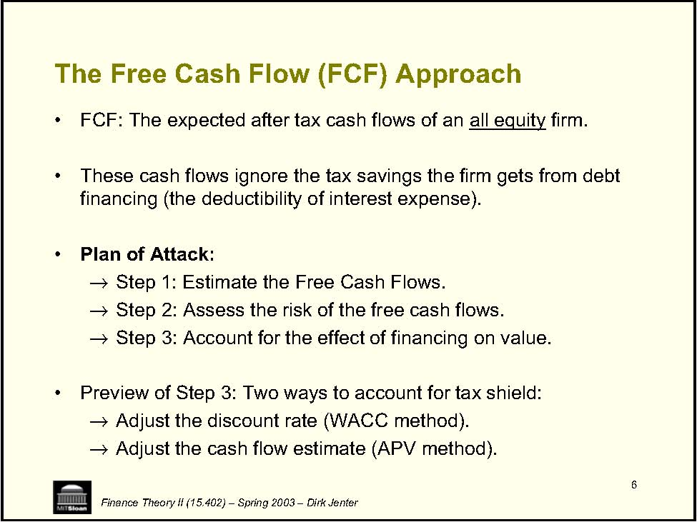

6 • firm. • • Plan of Attack: →→→• →→Finance Theory II (15.402) – Spring 2003 – Dirk Jenter The Free Cash Flow (FCF) Approach FCF: The expected after tax cash flows of an all equity These cash flows ignore the tax savings the firm gets from debt financing (the deductibility of interest expense). Step 1: Estimate the Free Cash Flows. Step 2: Assess the risk of the free cash flows. Step 3: Account for the effect of financing on value. Preview of Step 3: Two ways to account for tax shield: Adjust the discount rate (WACC method). Adjust the cash flow estimate (APV method). 

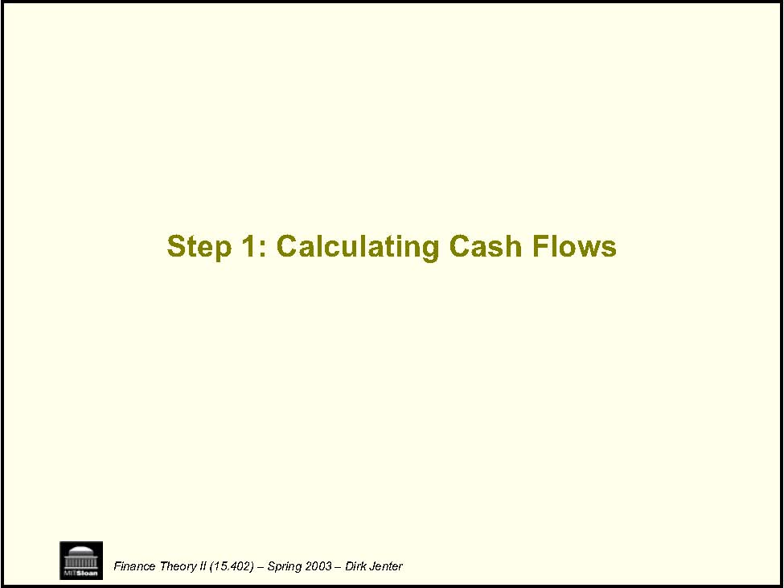

Step 1: Calculating Cash Flows Finance Theory II (15.402) – Spring 2003 – Dirk Jenter 

8 Count All incremental, after-tax cash flows allowing for reasonable inflation. • All: →→• • →→Note: • • Finance Theory II (15.402) – Spring 2003 – Dirk Jenter Don’t just look at operating profits in the out years. If project requires follow-on CAPX or additional working capital, take these into account. After-tax: The rest goes to the IRS. Be consistent in your treatment of inflation: Discount nominal cash flows at nominal discount rates. Nominal rates reflect inflation in overall economy, but inflation in cash flows may be different. In fact, some items in cash flows, e.g., depreciation, may have no inflation. 

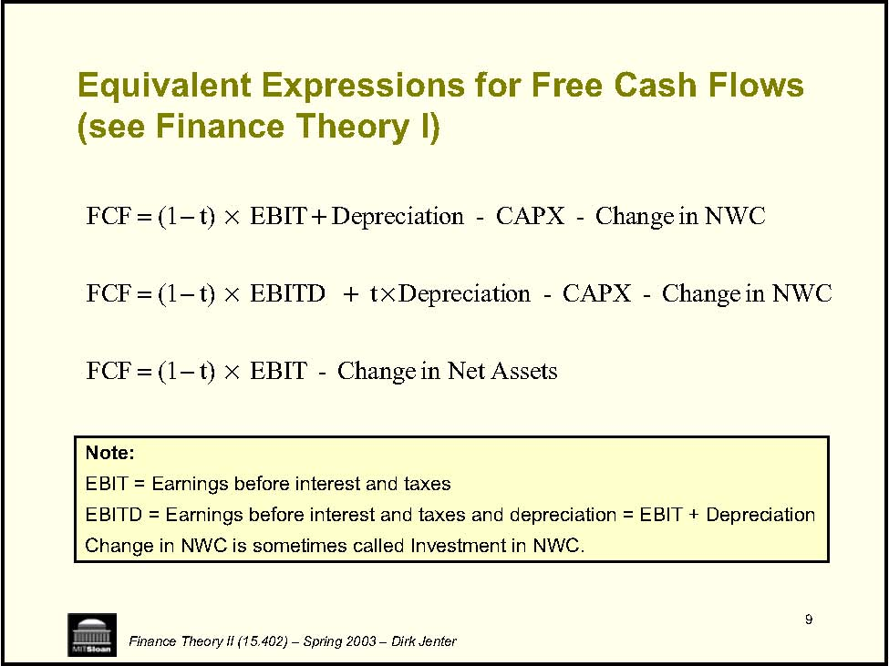

9 Equivalent Expressions for Free Cash Flows -EBITt)(1FCF -CAPX-tEBITDt)(1FCF -CAPX-EBITt)(1FCF ×−=×+×−=+×−=Finance Theory II (15.402) – Spring 2003 – Dirk Jenter (see Finance Theory I) Assets Net in Change NWC in Change onDepreciatiNWC in Change onDepreciati Note: EBIT = Earnings before interest and taxes EBITD = Earnings before interest and taxes and depreciation = EBIT + Depreciation Change in NWC is sometimes called Investment in NWC. 

# Example of Free Cash Flow Calculation

<Table>
<TR>

<TH>1998 </TH>
<TH>1999 </TH>
</TR>
<TR>
<TD>Sales </TD>

<TD>1,000 </TD>
<TD>1,200 </TD>
</TR>
<TR>
<TD>Cost of Goods Sold </TD>

<TD>700 </TD>
<TD>850 </TD>
</TR>
<TR>
<TD>Depreciation </TD>

<TD>30 </TD>
<TD>35 </TD>
</TR>
<TR>
<TD>Interest Expense </TD>

<TD>40 </TD>
<TD>50 </TD>
</TR>
<TR>
<TD>Taxes (38%) </TD>

<TD>80 </TD>
<TD>90 </TD>
</TR>
<TR>
<TD>Profit After taxes </TD>

<TD>150 </TD>
<TD>175 </TD>
</TR>
<TR>
<TD>Capital Expenditures </TD>

<TD>40 </TD>
<TD>40 </TD>
</TR>
<TR>
<TD>Accounts Receivable </TD>

<TD>50 </TD>
<TD>60 </TD>
</TR>
<TR>
<TD>Inventories </TD>

<TD>50 </TD>
<TD>60 </TD>
</TR>
<TR>
<TD>Accounts Payable </TD>

<TD>20 </TD>
<TD>25 </TD>
</TR>
</Table>

In 1999: FCF = EBIT*(1-t) + Depreciation -CAPX -Change in NWC 

ĺ EBIT = 1,200 -850 -35 = 315 ĺ t=38% ĺ Ch. NWC = (60+60-25) -(50+50-20) = 15 ĺ FCF = 315 * (1-.38) + 35 -40 -15 = 175.3 

Finance Theory II (15.402) – Spring 2003 – Dirk Jenter 

11 Beware! • →→• this stage! • →were 100% equity financed. →• Finance Theory II (15.402) – Spring 2003 – Dirk Jenter Note: We ignored interest payments We computed taxes on EBIT Do not take the effect of financing (e.g., interest) into account at Remember our plan: First, determine the expected cash flows as if the project Later, we will adjust for financing. If you count financing costs in cash flow, you count them twice. 

12 • • →→→• →→• →→→• • Finance Theory II (15.402) – Spring 2003 – Dirk Jenter Turbo Widget Example XYZ, a profitable widget producer ($100M annual after-tax profit) contemplates introducing new Turbo Widgets (TWs), developed in its labs at an R&amp;D cost of $1M over the past 3 years. New plant to produce TW would cost $20M today last 10 years with salvage value of $5M be depreciated to $0 over 5 years using straight-line depreciation TWs need painting: Use 40% of the capacity of a painting machine currently owned and used by XYZ at 30% capacity with maintenance costs of $100,000 (regardless of capacity used) Annual operating costs: $400,000 operating income generated: $42M operating income from sales of regular widgets would decrease by $2M Working capital (WC): $2M needed over the life of the project Corporate tax rate 36% 

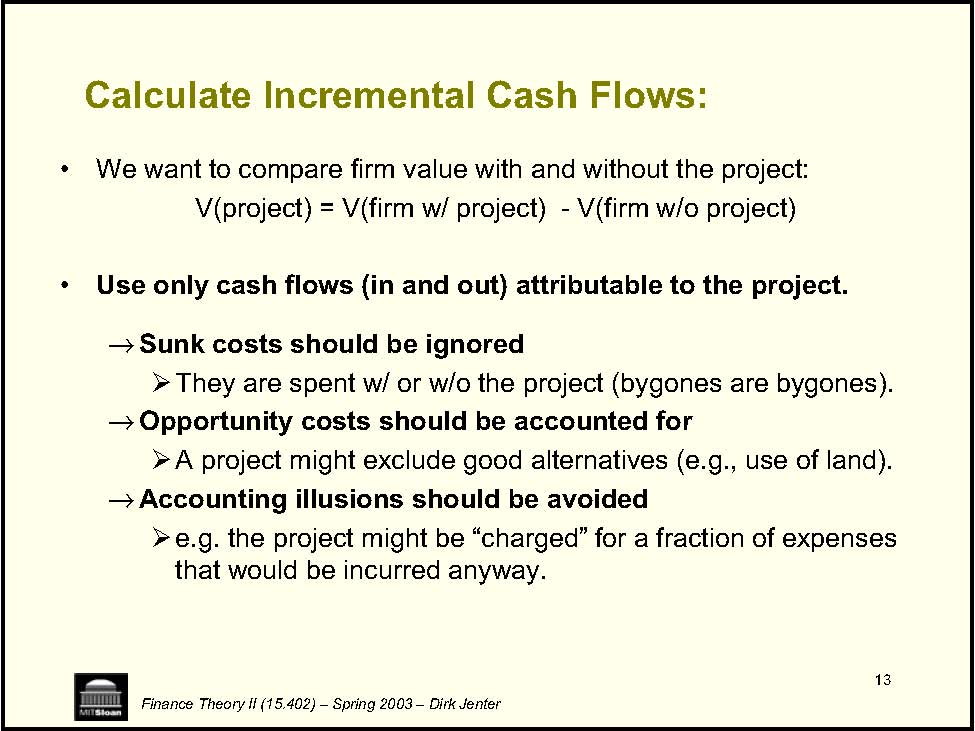

13 Calculate Incremental Cash Flows: • • →¾ →¾ →¾ Finance Theory II (15.402) – Spring 2003 – Dirk Jenter We want to compare firm value with and without the project: V(project) = V(firm w/ project)  -V(firm w/o project) Use only cash flows (in and out) attributable to the project. Sunk costs should be ignored They are spent w/ or w/o the project (bygones are bygones). Opportunity costs should be accounted for A project might exclude good alternatives (e.g., use of land). Accounting illusions should be avoided e.g. the project might be “charged” for a fraction of expenses that would be incurred anyway. 

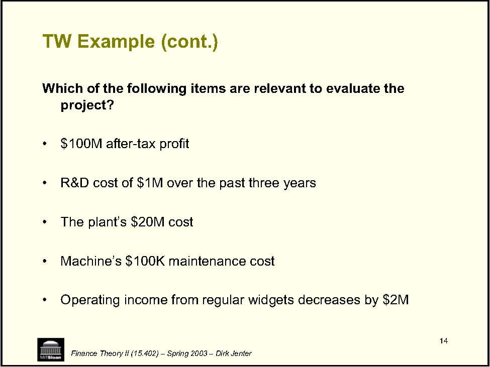

14 • • • • • Finance Theory II (15.402) – Spring 2003 – Dirk Jenter TW Example (cont.) Which of the following items are relevant to evaluate the project? $100M after-tax profit R&amp;D cost of $1M over the past three years The plant’s $20M cost Machine’s $100K maintenance cost Operating income from regular widgets decreases by $2M 

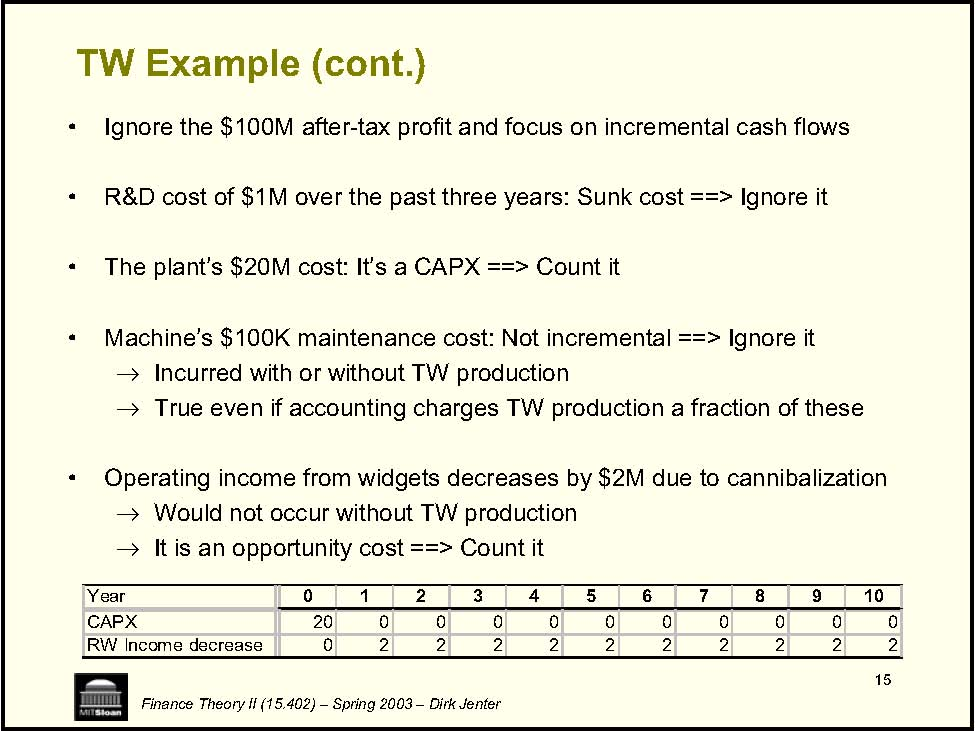

15 • • • • →→• →→0 1 2 3 4 5 6 7 8 9 0 0 0 0 0 0 0 0 0 0 0 2 2 2 2 2 2 2 2 2 2 Finance Theory II (15.402) – Spring 2003 – Dirk Jenter TW Example (cont.) Ignore the $100M after-tax profit and focus on incremental cash flows R&amp;D cost of $1M over the past three years: Sunk cost ==&gt; Ignore it The plant’s $20M cost: It’s a CAPX ==&gt; Count it Machine’s $100K maintenance cost: Not incremental ==&gt; Ignore it Incurred with or without TW production True even if accounting charges TW production a fraction of these Operating income from widgets decreases by $2M due to cannibalization Would not occur without TW production It is an opportunity cost ==&gt; Count it Year 10 CAPX 20 RW Income decrease 

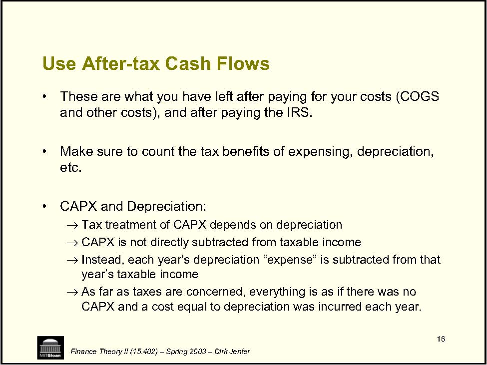

16 Use After-tax Cash Flows • • etc. • →→→→Finance Theory II (15.402) – Spring 2003 – Dirk Jenter These are what you have left after paying for your costs (COGS and other costs), and after paying the IRS. Make sure to count the tax benefits of expensing, depreciation, CAPX and Depreciation: Tax treatment of CAPX depends on depreciation CAPX is not directly subtracted from taxable income Instead, each year’s depreciation “expense” is subtracted from that year’s taxable income As far as taxes are concerned, everything is as if there was no CAPX and a cost equal to depreciation was incurred each year. 

17 • →→• • 0 1 2 3 4 5 6 7 8 9 0 0 0 0 0 0 0 0 0 0 0 4 4 4 4 4 0 0 0 0 0 0 0 0 0 0 0 0 0 0 0 5 Finance Theory II (15.402) – Spring 2003 – Dirk Jenter TW Example (cont.) Depreciation: Straight line depreciation: Flat annual depreciation Accelerated depreciation: Decreasing $20M CAPX is depreciated linearly over 5 years, down to zero. D = (20 -0) / 5 = $4M Salvage value of $5M is fully taxable since book value is zero. Year 10 CAPX 20 Depreciation Salvage Value 

# TW Example (cont.)

<Table>
<TR>
<TH>Year </TH>
<TH>0 </TH>
<TH>1 </TH>
<TH>2 </TH>
<TH>3 </TH>
<TH>4 </TH>
<TH>5 </TH>
<TH>6 </TH>
<TH>7 </TH>
<TH>8 </TH>
<TH>9 </TH>
<TH>10 </TH>
</TR>
<TR>
<TH>CAPX </TH>
<TD>20.0</TD>
<TH> </TH>
<TH>-</TH>
<TH>-</TH>
<TH>-</TH>
<TH>-</TH>
<TH>-</TH>
<TH>-</TH>
<TH>-</TH>
<TH>-</TH>
<TH>-</TH>
</TR>
<TR>
<TH>Income </TH>
<TH>-</TH>
<TD>42.0</TD>
<TD> 42.0</TD>
<TD> 42.0</TD>
<TD> 42.0</TD>
<TD> 42.0</TD>
<TD> 42.0</TD>
<TD> 42.0</TD>
<TD> 42.0</TD>
<TD> 42.0</TD>
<TD> 42.0 </TD>
</TR>
<TR>
<TH>RW Income decrease </TH>
<TH>-</TH>
<TD>2.0 </TD>
<TD>2.0 </TD>
<TD>2.0 </TD>
<TD>2.0 </TD>
<TD>2.0 </TD>
<TD>2.0 </TD>
<TD>2.0 </TD>
<TD>2.0 </TD>
<TD>2.0 </TD>
<TD>2.0 </TD>
</TR>
<TR>
<TH>Incremental income </TH>
<TH>-</TH>
<TD>40.0</TD>
<TD> 40.0</TD>
<TD> 40.0</TD>
<TD> 40.0</TD>
<TD> 40.0</TD>
<TD> 40.0</TD>
<TD> 40.0</TD>
<TD> 40.0</TD>
<TD> 40.0</TD>
<TD> 40.0 </TD>
</TR>
<TR>
<TH>Incremental cost </TH>
<TH>-</TH>
<TD>0.4 </TD>
<TD>0.4 </TD>
<TD>0.4 </TD>
<TD>0.4 </TD>
<TD>0.4 </TD>
<TD>0.4 </TD>
<TD>0.4 </TD>
<TD>0.4 </TD>
<TD>0.4 </TD>
<TD>0.4 </TD>
</TR>
<TR>
<TH>Salvage value </TH>
<TH>-</TH>
<TH>-</TH>
<TH>-</TH>
<TH>-</TH>
<TH>-</TH>
<TH>-</TH>
<TH>-</TH>
<TH>-</TH>
<TH>-</TH>
<TH>-</TH>
<TD>5.0 </TD>
</TR>
<TR>
<TH>Incremental profit </TH>
<TH>-</TH>
<TD>39.6</TD>
<TD> 39.6</TD>
<TD> 39.6</TD>
<TD> 39.6</TD>
<TD> 39.6</TD>
<TD> 39.6</TD>
<TD> 39.6</TD>
<TD> 39.6</TD>
<TD> 39.6</TD>
<TD> 44.6 </TD>
</TR>
<TR>
<TH>Depreciation </TH>
<TH>-</TH>
<TD>4.0 </TD>
<TD>4.0 </TD>
<TD>4.0 </TD>
<TD>4.0 </TD>
<TD>4.0 </TD>
<TH>-</TH>
<TH>-</TH>
<TH>-</TH>
<TH>-</TH>
<TH>-</TH>
</TR>
<TR>
<TH>EBIT </TH>
<TH>-</TH>
<TD>35.6</TD>
<TD> 35.6</TD>
<TD> 35.6</TD>
<TD> 35.6</TD>
<TD> 35.6</TD>
<TD> 39.6</TD>
<TD> 39.6</TD>
<TD> 39.6</TD>
<TD> 39.6</TD>
<TD> 44.6 </TD>
</TR>
<TR>
<TH>Incremental taxes (36%) </TH>
<TH>-</TH>
<TD>12.8</TD>
<TD> 12.8</TD>
<TD> 12.8</TD>
<TD> 12.8</TD>
<TD> 12.8</TD>
<TD> 14.3</TD>
<TD> 14.3</TD>
<TD> 14.3</TD>
<TD> 14.3</TD>
<TD> 16.1 </TD>
</TR>
<TR>
<TH>Total </TH>
<TD>-20.0 </TD>
<TD>26.8</TD>
<TD> 26.8</TD>
<TD> 26.8</TD>
<TD> 26.8</TD>
<TD> 26.8</TD>
<TD> 25.3</TD>
<TD> 25.3</TD>
<TD> 25.3</TD>
<TD> 25.3</TD>
<TD> 28.5 </TD>
</TR>
</Table>

Note: We do as if entire EBIT is taxable ==&gt; We ignore (for now) the fact that interest payments are not taxable. 

Finance Theory II (15.402) – Spring 2003 – Dirk Jenter 

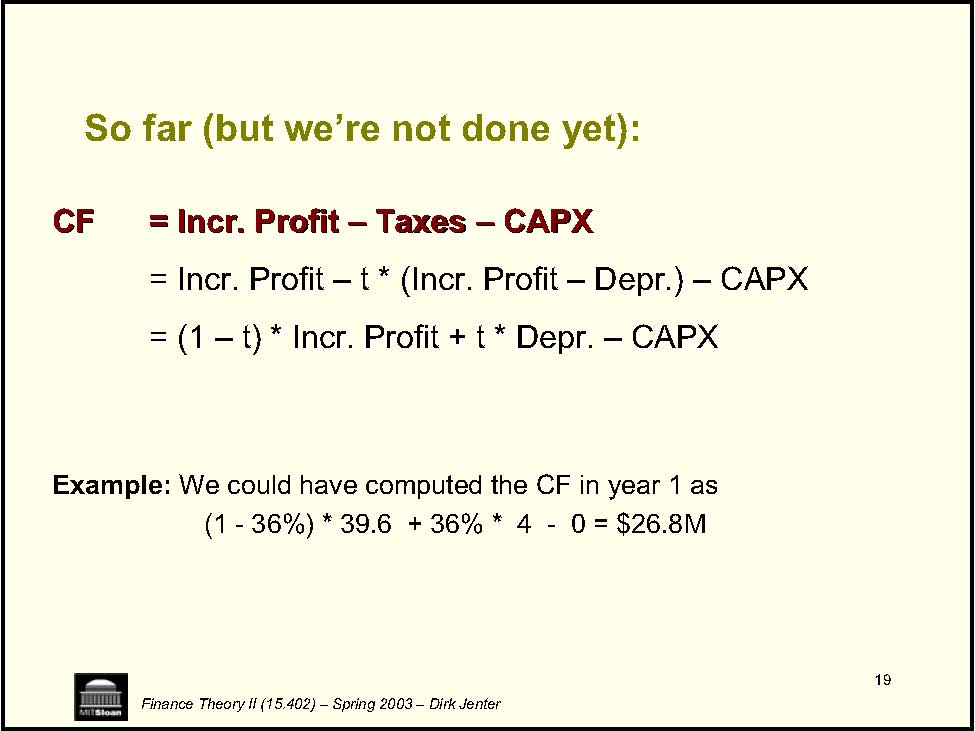

19 Finance Theory II (15.402) – Spring 2003 – Dirk Jenter So far (but we’re not done yet): Example: We could have computed the CF in year 1 as (1 -36%) * 39.6 + 36% * 4 -0 = $26.8M CFCF= Incr. Profit= Incr. Profit ––TaxesTaxes––CAPXCAPX= Incr. Profit= Incr. Profit ––t * (Incr. Profitt * (Incr. Profit ––Depr.)Depr.)––CAPXCAPX= (1= (1––t) * Incr. Profit + t * Depr.t) * Incr. Profit + t * Depr. ––CAPXCAPX

20 Finance Theory II (15.402) – Spring 2003 – Dirk Jenter Changes in (Net) Working Capital: Working Capital = Inventory + A/R -A/P Remark 1: • Many projects need some capital to be tied up (working capital) which constitutes an opportunity cost. Ÿ We need the Change in Working Capital implied by the project. Remark 2: • Accounting measure of earnings are based on: Sales -Cost of Goods Sold • But: Income and expense are reported when a sale is declared. →COGS in 2000 includes the costs of items sold in 2000 even if the cost was incurred in 1999 or hasn’t been incurred yet. →Sales in 2000 include the income from items sold in 2000 even if the payment has not been received yet. 

# TW Example (cont.)

<Table>
<TR>
<TH>Year </TH>
<TH>0 </TH>
<TH>1 </TH>
<TH>2 </TH>
<TH>3 </TH>
<TH>4 </TH>
<TH>5 </TH>
<TH>6 </TH>
<TH>7 </TH>
<TH>8 </TH>
<TH>9 </TH>
<TH>10 </TH>
</TR>
<TR>
<TH>CAPX </TH>
<TD>20.0</TD>
<TH> </TH>
<TH>-</TH>
<TH>-</TH>
<TH>-</TH>
<TH>-</TH>
<TH>-</TH>
<TH>-</TH>
<TH>-</TH>
<TH>-</TH>
<TH>-</TH>
</TR>
<TR>
<TH>Incremental profit </TH>
<TH>-</TH>
<TD>39.6</TD>
<TD> 39.6</TD>
<TD> 39.6</TD>
<TD> 39.6</TD>
<TD> 39.6</TD>
<TD> 39.6</TD>
<TD> 39.6</TD>
<TD> 39.6</TD>
<TD> 39.6</TD>
<TD> 44.6 </TD>
</TR>
<TR>
<TH>Incremental taxes (36%) </TH>
<TH>-</TH>
<TD>12.8</TD>
<TD> 12.8</TD>
<TD> 12.8</TD>
<TD> 12.8</TD>
<TD> 12.8</TD>
<TD> 14.3</TD>
<TD> 14.3</TD>
<TD> 14.3</TD>
<TD> 14.3</TD>
<TD> 16.1 </TD>
</TR>
<TR>
<TH>NWC </TH>
<TD>2.0 </TD>
<TD>2.0 </TD>
<TD>2.0 </TD>
<TD>2.0 </TD>
<TD>2.0 </TD>
<TD>2.0 </TD>
<TD>2.0 </TD>
<TD>2.0 </TD>
<TD>2.0 </TD>
<TD>2.0 </TD>
<TH>-</TH>
</TR>
<TR>
<TH>Change in NWC </TH>
<TD>2.0 </TD>
<TH>-</TH>
<TH>-</TH>
<TH>-</TH>
<TH>-</TH>
<TH>-</TH>
<TH>-</TH>
<TH>-</TH>
<TH>-</TH>
<TH>-</TH>
<TD>-2.0 </TD>
</TR>
<TR>
<TH>Total </TH>
<TD>-22.0 </TD>
<TD>26.8 </TD>
<TD>26.8 </TD>
<TD>26.8 </TD>
<TD>26.8 </TD>
<TD>26.8 </TD>
<TD>25.3 </TD>
<TD>25.3 </TD>
<TD>25.3 </TD>
<TD>25.3 </TD>
<TD>30.5 </TD>
</TR>
</Table>

Finance Theory II (15.402) – Spring 2003 – Dirk Jenter 

22 Finance Theory II (15.402) – Spring 2003 – Dirk Jenter Putting It All Together FCF = (1FCF = (1 ––t) * Incr. Profit + t * Depr.t) * Incr. Profit + t * Depr. ––CAPXCAPX––∆∆NWCNWCThis can also be rewritten as:This can also be rewritten as:FCF = (1FCF = (1 ––t) * EBIT + Depr.t) * EBIT + Depr. ––CAPXCAPX––∆∆NWCNWC

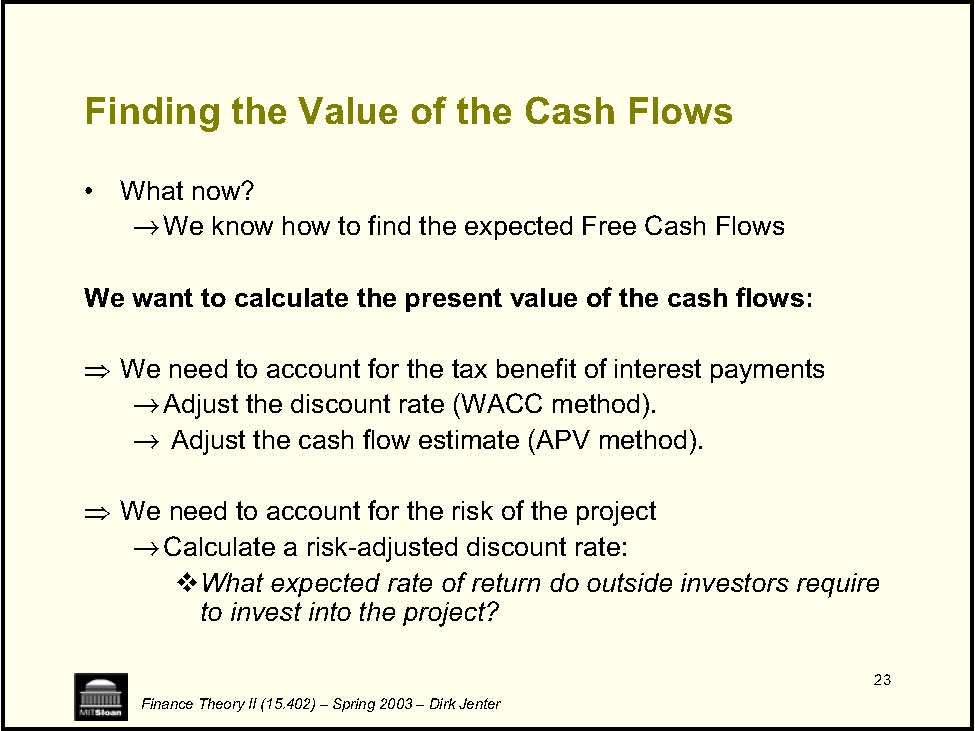

23 Finding the Value of the Cash Flows • →Ÿ →→Ÿ →™Finance Theory II (15.402) – Spring 2003 – Dirk Jenter What now? We know how to find the expected Free Cash Flows We want to calculate the present value of the cash flows: We need to account for the tax benefit of interest payments Adjust the discount rate (WACC method). Adjust the cash flow estimate (APV method). We need to account for the risk of the project Calculate a risk-adjusted discount rate: What expected rate of return do outside investors require to invest into the project? 

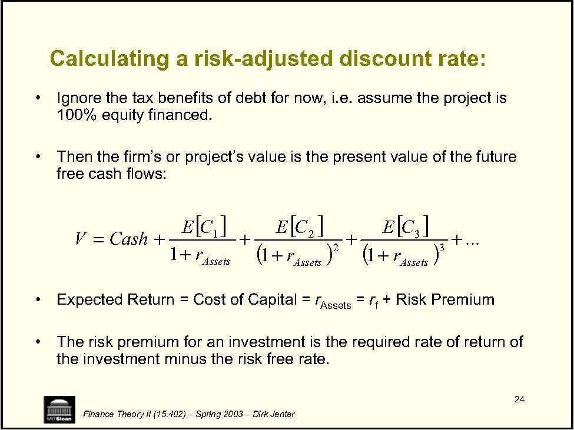

24 Calculating a risk-adjusted discount rate: • • free cash flows: • rAssets = rf • []... 111 3 3 2 21 +++++++=AssetsAssetsAssets rrr CashV Finance Theory II (15.402) – Spring 2003 – Dirk Jenter Ignore the tax benefits of debt for now, i.e. assume the project is 100% equity financed. Then the firm’s or project’s value is the present value of the future Expected Return = Cost of Capital = + Risk Premium The risk premium for an investment is the required rate of return of the investment minus the risk free rate. C E C E C E 

25 Risk Premium • • →• →the market return to get the asset beta. →asset betas. →[]fmafAssetsA rrr −+==βFinance Theory II (15.402) – Spring 2003 – Dirk Jenter How do we find the Risk Premium? CAPM is one method: Get risk premium from beta &amp; market premium How do you estimate asset betas? For an all-equity firm (project), simply regress past stock returns on For levered firms, regress past stock returns on the market return to get equity betas, then unlever the estimated equity betas to arrive at Find comparable firms with similar risk, estimate their asset betas and average across comparables. r E r E 

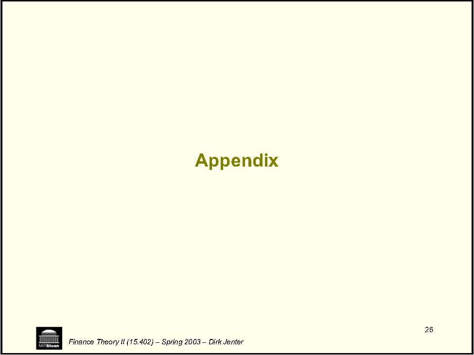

26 Finance Theory II (15.402) – Spring 2003 – Dirk Jenter Appendix 

27 Computing the CAPM asset beta: • project. • on all of the financial claims on the assets: • )()()( EquityDebtAssets ED E ED D +++=[][]fmarketEquityfEquity fmarketDebtfDebt rr rr −⋅+=−⋅+=)()( )()( ββFinance Theory II (15.402) – Spring 2003 – Dirk Jenter Definition: Measure of the systematic risk of the cash flows of the firm or Note: The expected return on the assets must equal the expected return The CAPM is a general asset-pricing model that can price any type of asset. Hence the CAPM specifies the expected returns for both the debt and equity claims: r E r E r E r E r E r E r E 

28 Cont.: • • • EquityDebtAssets ED E ED D βββ+++=Finance Theory II (15.402) – Spring 2003 – Dirk Jenter Substituting the CAPM equations above into the formula for the expected return on the assets, we see that the asset beta is just a weighted average of the debt and equity betas: Hence we need an estimate of each term on the right-hand side of this equation. Typically, we start by estimating equity betas from a regression of equity returns on stock market returns. Problem: Sometimes we need to use the betas on “comparable” firms, either because there is insufficient data on the project available, or because we try to improve the precision of the estimate in that way. This “comparable firms” procedure for the estimation of asset betas is explained on the next slide. 

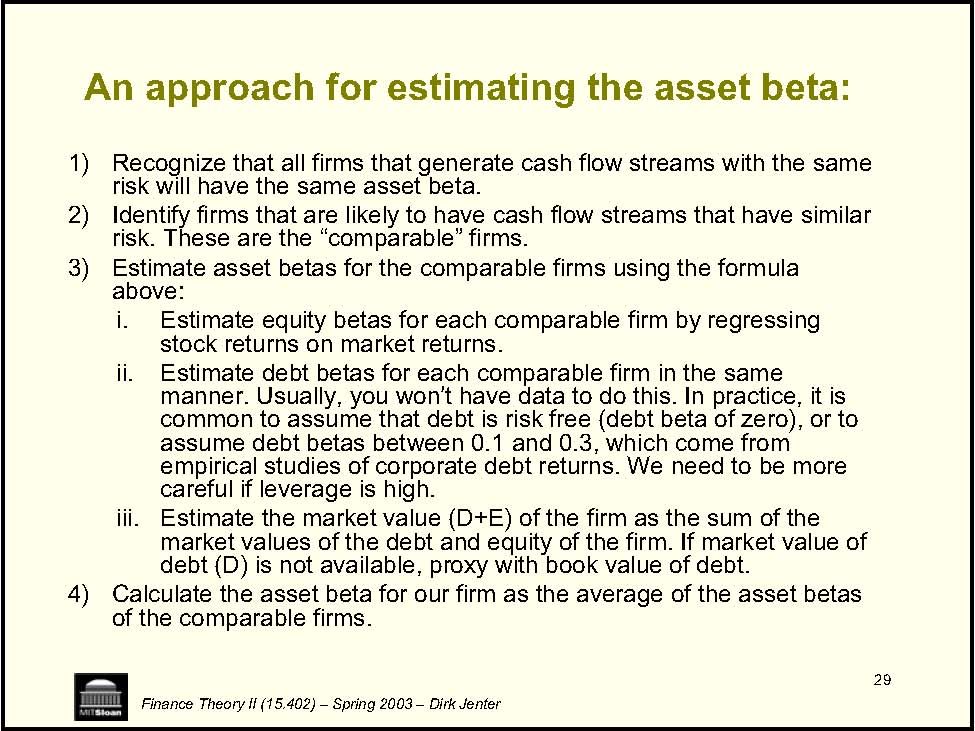

29 An approach for estimating the asset beta: 1) 2) 3) above: i. stock returns on market returns. ii. iii. 4) Calculate the asset beta for our firm as the average of the asset betas of the comparable firms. Finance Theory II (15.402) – Spring 2003 – Dirk Jenter Recognize that all firms that generate cash flow streams with the same risk will have the same asset beta. Identify firms that are likely to have cash flow streams that have similar risk. These are the “comparable” firms. Estimate asset betas for the comparable firms using the formula Estimate equity betas for each comparable firm by regressing Estimate debt betas for each comparable firm in the same manner. Usually, you won’t have data to do this. In practice, it is common to assume that debt is risk free (debt beta of zero), or to assume debt betas between 0.1 and 0.3, which come from empirical studies of corporate debt returns. We need to be more careful if leverage is high. Estimate the market value (D+E) of the firm as the sum of the market values of the debt and equity of the firm. If market value of debt (D) is not available, proxy with book value of debt. 
