         Acrobat Distiller 6.0 (Windows)

         Compaq

         Compaq

         Acrobat PDFMaker 6.0 for PowerPoint

         2004-01-22T11:26:16+05:30

         2004-01-22T11:25:14+05:30

         2004-01-22T11:26:16+05:30

         uuid:49d8a18c-cef8-4166-bd5e-68a860cef71c

         uuid:7df98c89-f14b-4ddd-a713-3ef4b3b9d1a6

         xml

               No Slide Title

               Leslie A. Larocca

Valuation

Free Cash Flows

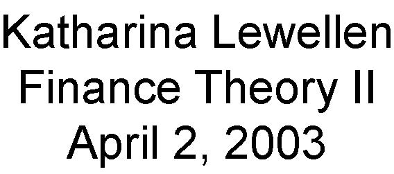

Katharina LewellenFinance Theory IIApril 2, 2003

Valuation Tools

- A key task of managers is to undertake valuation exercises in order to allocate capital between mutually exclusive projects:

- Is project A better than doing nothing?

- Is project A better than project B?

- Is the project’s version A than its modified version A’?

- The process of valuation and ultimately of capital budgeting generally involves many factors, some formal, some not (experience, hard-to-formalize information, politics, etc.).

- We will focus on financial tools for valuation.

Valuation Tools (cont.)

- These tools provide managers with numerical techniques to “keep score” and assist in the decision-making process.

- They build on modern finance theory and deal with cash flows, time, and risk.

- All rely on (often highly) simplified models of the business:

- Technical limitations (less now with computers)

- Versatility

- Understandable and discussible

How to Value a Project/Firm?

- Calculate NPV

- Estimate the expected cash-flows

- Estimate the appropriate discount rate for each cash flow

- Calculate NPV

- Look up the price of a comparable project

- Use alternative criteria (e.g., IRR, payback method)

- You need to be an educated user of these

Comparables method

- Suppose you want to value a private company going public

- EBITDA = $100 million

- For a similar public company P/E = 10

- You value the IPO company at $1,000 million

- What are the implicit assumptions?

- Suppose that P = E / (r –g)

- Then, P/E = 1 / (r –g)

- Thus, we assume that 

- Earnings are expected to grow in perpetuity at a constant rate

- Growth rates and discount rates are the same for both firms

Internal Rate of Return (IRR)

- One-period project

- Investment = 100 at time 0    Payoff = 150 at time 1

Rate of return = 150/100 –1 = 50%

NPV = -100 + 150/discount rate = 0

Discount rate =  150/100 = 50%

- Rate of return is the discount rate that makes NPV = 0

- Multiple period projects

- IRR is the discount rate that makes NPV = 0

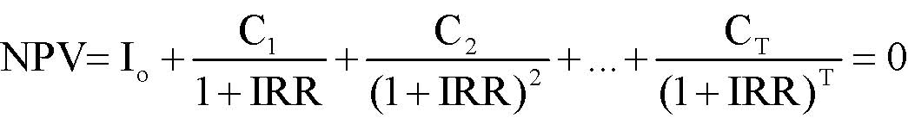

0)IRR1(C...)IRR1(CIRR1CINPVTT221o=+++++++=

 opportunity costs of capital">

Basic rule: Chose projects with IRR &gt; opportunity costs of capitBasic rule: Chose projects with IRR &gt; opportunity costs of capitalal

Internal Rate of Return (IRR), cont.

- Suppose you choose among two mutually exclusive projects

- E.g., alternative ways to use a particular piece of land

Project 1: cash flows-10 +20IRR=100%

Project 2: cash flows: -20 +35IRR=75%

- Which project would you choose? (costs of capital = 10%)

- Project 2 because it has a higher NPV

- Other pitfalls (BM, Chapter 5)

- E.g., multiple IRR, lending vs. borrowing.

- Bottom line

- NPV is easier to use than IRR

- If used properly, IRR should give you the same answer as NPV

1. Calculating Cash Flows

The Free Cash Flow (FCF) Approach

- FCF: The expected after tax cash flows of an all equity firm

- These cash flows ignore the tax savings the firm gets from debt financing (the deductibility of interest expense)

- Plan of Attack:

- Step 1: Estimating the Free Cash Flows

- Step 2: Account for the effect of financing on value

- Preview: Two ways to account for tax shield:

- Adjust the discount rate (WACC method).

- Adjust the cash-flow estimate (APV method).

Count allincremental, after-taxcash flows allowing for reasonable inflation.

- All:

- Don’t just look at operating profits in the out years.

- If project requires follow-on CAPX or additional working capital, take these into account.

- After-tax: The rest goes to the IRS.

- Be consistent in your treatment of inflation:

- Discount nominal cash flows at nominal discount rates.

- Reasons:

- Nominal rates reflect inflation in overall economy, but inflation in cash flows may be different.

- In fact, some items in cash flows, e.g., depreciation, may have no inflation.

Treatment of Inflation -Example

- T-Bill rate (nominal) = 8%

- Expected inflation rate = 6%

- Expected real rate = 1.08/1.06 = 1.9%

- Sales of widgets next year = $100 measured in today’s dollars

- You expect that the price of the widgets will go up by 6%

- What’s the PV of the widgets?

nominal cash flows:PV = $100*(1.06)/1.08 = 98.2

real cash flows:PV = $100/(1.08/1.06) = 98.2

Equivalent Expressions for Free Cash Flows (see Finance Theory I)

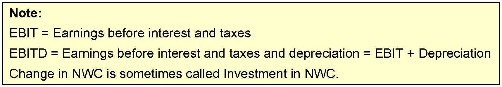

Note:EBIT = Earnings before interest and taxesEBITD = Earnings before interest and taxes and depreciation = EBIT + DepreciationChange in NWC is sometimes called Investment in NWC.

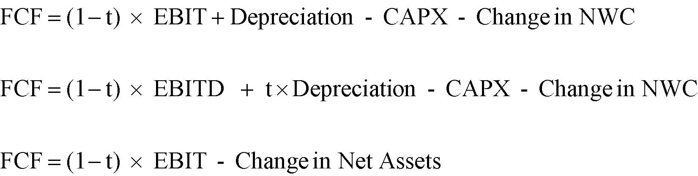

AssetsNet in  Change  -  EBIT    t)(1FCFNWCin  Change  -  CAPX  -on  Depreciati  t   EBITD    t)(1FCFNWCin  Change  -  CAPX  -on  Depreciati  EBIT    t)(1FCF×−=×+×−=+×−=

Example of Free Cash Flow Calculation

In 1999: FCF = EBIT*(1-t) + Depreciation -CAPX -Change in NWC

EBIT = 1,200 -850 -35 = 315;  Ch. NWC = (60+60-25) -(50+50-20) = 15

FCF = 315 * (1-.38) + 35 -40 -15 = 175.3

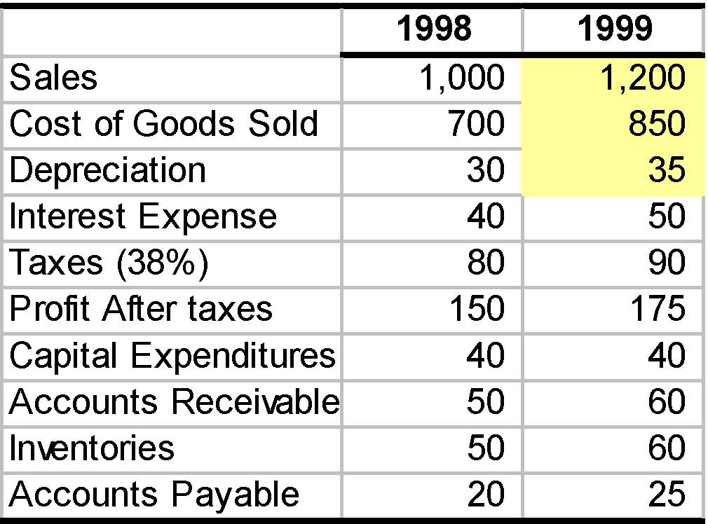

19981999Sales1,000      1,200      Cost of Goods Sold700         850         Depreciation30          35          Interest Expense40          50          Taxes (38%)80          90          Profit After taxes150         175         Capital Expenditures40          40          Accounts Receivable50          60          Inventories50          60          Accounts Payable20          25          

Beware!

- Note:

- We ignored interest payments

- We computed taxes on EBIT

- Do not take the effect of financing (e.g., interest) into account at this stage.

- Remember our plan:

- First, determine the expected cash-flows as if the project were 100% equity financed.

- Later, we will adjust for financing.

- If you count financing costs in cash-flow, you count them twice.

TW Example

- XYZ, a profitable widget producer ($100M annual after-tax profit) contemplates introducing new Turbo Widgets (TWs), developed in its labs at an R&amp;D cost of $1M over the past 3 years.

- New plant to produce TW would

- cost $20M today

- last 10 years with salvage value of $5M

- be depreciated to $0 over 5 years using straight-line

- TWsneed painting: Use 40% of the capacity of a painting machine

- currently owned and used by XYZ at 30% capacity

- with maintenance costs of $100,000 (regardless of capacity used)

- Annual

- operating costs: $400,000

- operating income generated: $42M

- operating income of regular widgets would decrease by $2M

- Working capital (WC): $2M needed over the life of the project

- Corporate tax rate 36%

TW Example (cont.)

- Ignore the $100M after-tax profit and focus on incremental cash-flows

- R&amp;D cost of $1M over the past three years: Sunk cost ==&gt; Ignore it

- The plant’s $20M cost: It’s a CAPX ==&gt; Count it

- Machine’s $100K maintenance cost: Not incremental ==&gt; Ignore it

- Incurred with or without TW production

- True even if accounting charges TW production a fraction of these

- Op. income of regular widgets decrease by $2M due to cannibalization

- Would not occur without TW production

- It is an opportunity cost ==&gt; Count it

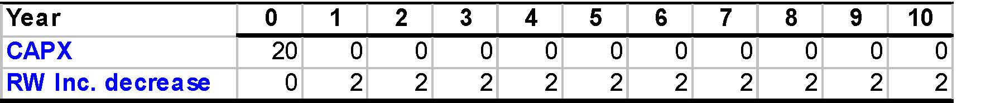

Year012345678910CAPX200000000000RW Inc. decrease02222222222

Use Incremental Cash Flows

- Compare firm value with and without the project

V(project) = V(firm w/ project)  -V(firm w/o project) 

- Use only cash flows (in and out) attributable to the project

- Sunk costsshould be ignored

- They are spent w/ or w/o the project (bygones are bygones).

- Opportunity costsshould be accounted for

- A project might exclude good alternatives (e.g., use of land).

- Accounting illusions should be avoided

- e.g. the project might be “charged” for a fraction of expenses that would be incurred anyway.

Use After-tax Cash Flows

- These are what you have left after paying capital suppliers

- Make sure to count the benefits of expensing, depreciation, etc.

- CAPX and Depreciation:

- CAPX are not directly subtracted from taxable income

- Instead, a fraction of CAPX (depreciation) is subtracted over a number of years

TW Example (cont.)

- Depreciation:

- Straight line depreciation: Flat annual depreciation

- Accelerated depreciation: Decreasing

- $20M CAPX is depreciated linearly over 5 years, down to zero.

D = (20 -0) / 5 = $4M

- Salvage value $5M is fully taxable since book value is zero.

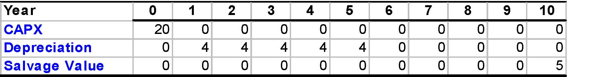

Year012345678910CAPX200000000000Depreciation04444400000Salvage Value00000000005

TW Example (cont.)

Note:We do as if entire EBIT is taxable ==&gt; We ignore (for now) the fact that interest payments are not taxable.

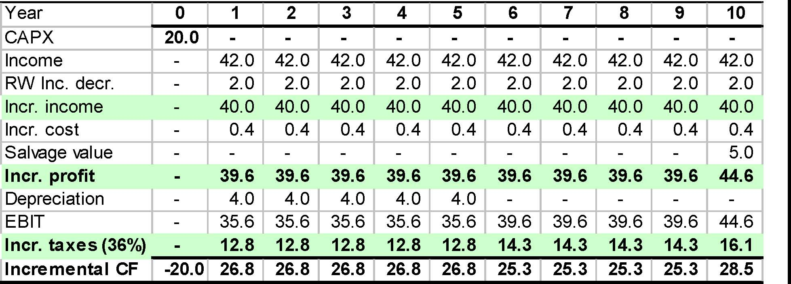

Year012345678910CAPX20.0 -   -   -   -   -   -   -   -   -   -   Income-   42.0 42.0 42.0 42.0 42.0 42.0 42.0 42.0 42.0 42.0 RW Inc. decr.-   2.0   2.0   2.0   2.0   2.0   2.0   2.0   2.0   2.0   2.0   Incr. income-   40.0 40.0 40.0 40.0 40.0 40.0 40.0 40.0 40.0 40.0 Incr. cost-   0.4   0.4   0.4   0.4   0.4   0.4   0.4   0.4   0.4   0.4   Salvage value-   -   -   -   -   -   -   -   -   -   5.0   Incr. profit-   39.6 39.6 39.6 39.6 39.6 39.6 39.6 39.6 39.6 44.6 Depreciation-   4.0   4.0   4.0   4.0   4.0   -   -   -   -   -   EBIT-   35.6 35.6 35.6 35.6 35.6 39.6 39.6 39.6 39.6 44.6 Incr. taxes (36%)-   12.8 12.8 12.8 12.8 12.8 14.3 14.3 14.3 14.3 16.1 Incremental CF-20.026.8 26.8 26.8 26.8 26.8 25.3 25.3 25.3 25.3 28.5 

So far (but we’re not done yet):

Example:We could have computed the CF in year 1 as

(1 -36%) * 39.6  + 36% *  4  -0 = $26.8M

CF = Incr. Profit –Taxes –CAPX

= Incr. Profit –t * (Incr. Profit –Depr.) –CAPX

= (1 –t) * Incr. Profit + t * Depr. –CAPX

Changes in (Net) Working Capital

Remark 1:

- Many projects need some capital to be tied up (working capital) which constitutes an opportunity cost.

- We need the Change in Working Capital implied by the project.

Remark 2:

- Accounting measure of earnings

Sales -Cost of Goods Sold

- Income and expense are reported when a sale is declared.

- COGS in 2000 includes the costs of items sold in 2000 even if the cost was incurred in 1999 or hasn’t been incurred yet.

- Sales in 2000 include the income from items sold in 2000 even ifthe payment has not been received yet.

Working Capital = Inventory + A/R -A/P

TW Example (cont.)

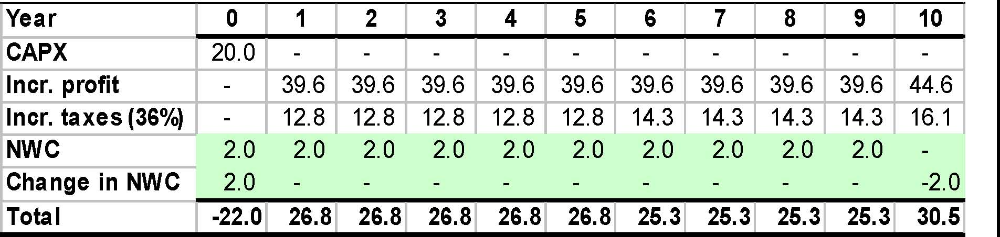

Year012345678910CAPX20.0 -   -   -   -   -   -   -   -   -   -   Incr. profit-   39.6 39.6 39.6 39.6 39.6 39.6 39.6 39.6 39.6 44.6 Incr. taxes (36%)-   12.8 12.8 12.8 12.8 12.8 14.3 14.3 14.3 14.3 16.1 NWC2.0   2.0   2.0   2.0   2.0   2.0   2.0   2.0   2.0   2.0   -   Change in NWC2.0   -   -   -   -   -   -   -   -   -   -2.0Total-22.026.826.826.826.826.825.325.325.325.330.5

Putting It All Together

FCF = (1 –t) * Incr. Profit + t * Depr. –CAPX –∆NWC

This can also be rewritten as

FCF = (1 –t) * EBIT + Depr. –CAPX –∆NWC

Finding the Value of the Cash Flows

- We know how to find the expected free cash flows

- We need to find the appropriate discount ratefor a project

- We need to account for the tax benefits of interest payments

- Ignore this for now, and assume that the project is 100% equity financed

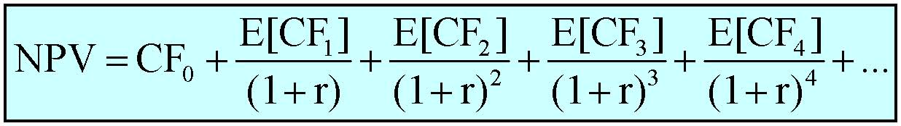

...r)(1]E[CFr)(1]E[CFr)(1]E[CFr)(1]E[CFCF  NPV44332210+++++++++=

Decision RuleAccept any project with positive NPV.  The NPV tells you how much value the project creates.

What is the appropriate discount rate for a project?

- The discount rate is the opportunity cost of capitalfor the project.

- It answers the question:  What rate can investors earn on an investments with comparable risk?

- What does comparable risk mean?

Using the CAPM

- What does ‘comparable risk’ mean?

- CAPM:  risk = β

- How does risk translate into a discount rate?

- CAPM:  E[rE] = rf+ βEE[RM–rf]

- Practical issues

- Estimating betas

- Estimating the market risk premium

- Leverage

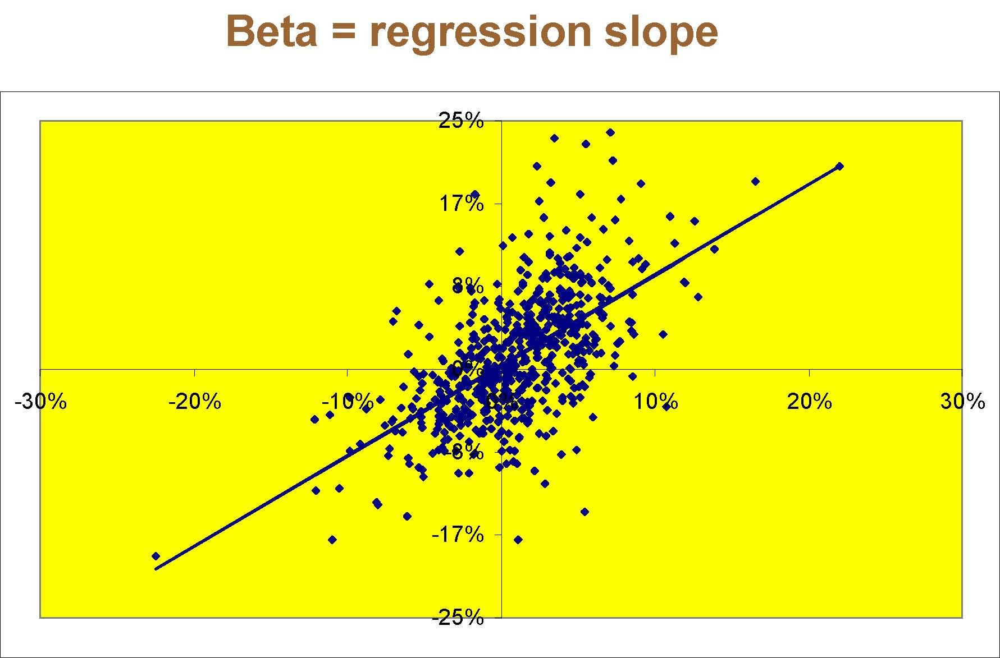

Beta = regression slope-25%-17%-8%0%8%17%25%-30%-20%-10%0%10%20%30%

Leverage, returns, and risk 

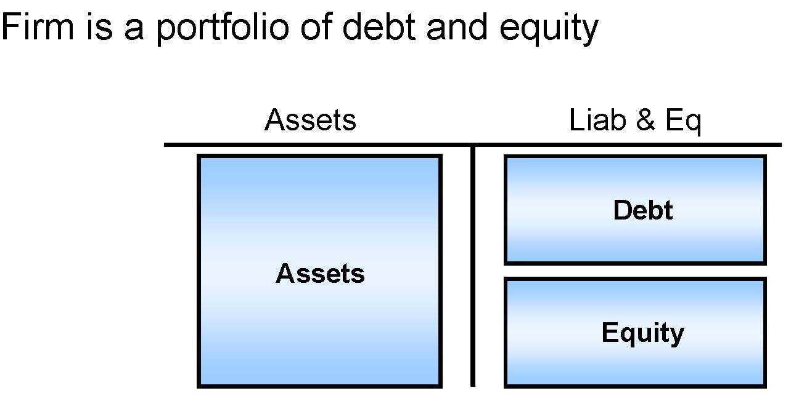

Firm is a portfolio of debt and equityAssetsAssetsDebtEquityLiab&amp; Eq

Therefore …

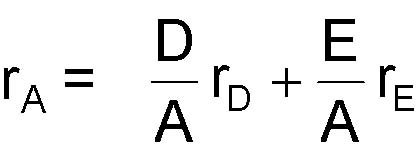

rA=EDr AE  r AD+

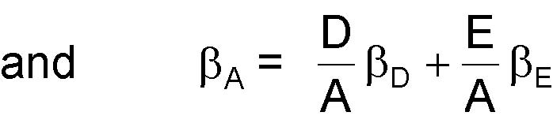

andβA=ED AE   ADβ+β

Estimating Betas

- Equity Beta

- Simply regress past stock returns on the market return

- Asset Beta

- For an all-equity firm, equity beta = asset beta

- How about levered firms?

- Hint:

- You can view the firm as a portfolio of debt and equity

- Recall: portfolio beta = weighted average of individual asset betas

- Question: What are the appropriate weights?

- You can assume that debt is risk-free or that debt beta is between 0.1 and 0.3 (based on empirical studies)
