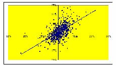

         Acrobat Distiller 6.0.1 (Windows)

         陕西省委党校

         D:20050427120254

         2005-04-27T20:03:06+08:00

         Acrobat PDFMaker 6.0 for Word

         2005-04-27T20:03:58+08:00

         2005-04-27T20:03:58+08:00

         uuid:91b90d8a-38da-4fd6-8d10-8b1ea8c84115

         uuid:4030358c-acd6-4c9e-b56f-08a682efc344

               6

         xml

               空闲现金流价值评估

               wangweihua

自由现金流价值评估 

财务理论（二） 

凯兹瑞纳·理崴伦 

2003.4.2 

价值评估工具 

◆ 为了在相互排斥的项目之间配置资本，管理者一项重要的工作是理解价值评估的运用： 

☆ 项目A是否是相对最好的项目？ 

☆ 项目A优于项目B？ 

☆ 项目的形式A是否优于修改的形式A′ 

◆ 价值评估和最终的资本预算过程一般涉及到许多因素，一些因素是标准的，一些是非标准的（经验，难以标准化的信息，政策等）。 

◆ 我们将重点介绍价值评估的财务工具 

价值评估工具（续） 

◆ 这些工具为管理者提供了“评分”的量化技巧，帮助决策过程。 

◆ 这些工具以现代财务理论为基础，主要讨论现金流、时间和风险。 

◆ 所有工具（经常极有可能）以简化的公司模型为基础： 

   ☆ 技术上的限制（现在很少受计算机的限制） 

   ☆ 多样性 

   ☆ 可以理解和进行讨论 

如何评估一个项目（公司） 

◆ 计算净现值（NPV） 

   ☆ 预测未来的现金流 

   ☆ 预测每一次现金流的适度贴现率 

   ☆ 计算NPV 

◆ 查阅可相互比较项目的价格 

◆ 选用可替代的标准（如，内部收益率，回报率方法） 

   ☆ 作为使用者，你需要接受使用这些工具的培训 

相互比较法 

- ◆ 假设你需要评估一家向公众公司转化的私有公司的价值 

☆ 折旧及摊销前的盈余EBITDA = 10亿（美元） 

☆ 相似的公众公司市盈率（P/E）= 10 

☆ 你评估的首次公开发售100亿美元公司的价值 

◆ 隐含的假设是什么？ 

   ☆ 假设P = E/(r - g) 

   ☆ 有，P/E = 1/(r - g) 

   ☆ 那么，我们假设 

      ·未来的收益以一个稳定的增长率永恒增长 

      ·两个公司有相同的增长率和贴现率 

内部收益率（IRR） 

◆ 单期项目 

   ☆ 投资 = 100（在时期0）   收益 = 150（在时期1） 

      收益率 = 150/100 - 1 = 50% 

      NPV = -100 + 150/贴现率 = 0 

      贴现率 = 150/100 = 50% 

   ☆ 收益率就是使NPV = 0的贴现率 

◆ 多期项目 

   ☆ 内部收益率就是使NPV = 0的贴现率 

()()1220111TTCCCNPVIRRIRRIRR=+++=+++L

基本法则：选择项目的IRR﹥资本的机会成本 

内部收益率（续） 

- ◆ 假定你要在彼此独立的项目之间做出选择 

☆ 如，有两种方法可用于选择投资一块土地 

方案1:现金流量    -10    +20     内部报酬率=100%  

   方案2：现金流量  -20    +35     内部报酬率=75% 

☆ 你究竟选哪一种方案 ? (资本成本=10%) 

· 选择方案2,因为 它的净现值较高 

- ◆ 其他内部报酬率法(银行业务 ,第五章 ) 

☆ 如,多种内部报酬率,象贷款与借款内部报酬率。 

- ◆ 结论 

☆ 净现值比内部报酬率更易使用 

☆ 若恰当使用，内部报酬率将会得出与净现值一样的结果 

- 1． 计算现金流量 

自由现金流（FCF）方法 

- ◆ 自由现金流量：一个完全的权益资本公司预期的税后现金流量。 

☆ 这些现金流量不考虑公司来自债务融资的税收结余（扣除利息支出）。 

- ◆ 计算步骤： 

☆ 第一步：估计现金流量 

☆ 第二步：说明融资对价值的影响。 

- ◆ 摘要：诠释税收规避的两种方法： 

☆ 调整贴现率（加权平均资本成本法） 

☆ 调整估算的现金流（现值调整法） 

根据考虑适度通货膨胀后的税后现金流量，计算所有的价值增值 

- ◆ 包括： 

☆ 不只考虑企业营运期间的经营利润。 

☆ 如果项目要求有连续的资本性支出或者额外的营运资金，应考虑这些因素。 

- ◆ 税后：其余的归入利率互换 

- ◆ 通货膨胀的处理方法应有持续性 

☆ 用名义贴现率折现名义现金流量． 

☆ 原因： 

· 名义利率已反映了整个经济的通货膨胀水平，但现金流量并没有反映通货膨胀水平。 

· 事实上，现金流量中一些项目，如折旧，也许没有反映通货膨胀。 

通货膨胀处理——例子 

- ◆ 国库券利率（名义利率）＝８％ 

- ◆ 预期通货膨胀率＝６％ 

- ◆ 预期实际利率＝１.08/1.06=1.9% 

- ◆ 下一年的装置的销售＝１００美元（按今天的美元价值测算） 

- ◆ 预计装置的价格将上涨６％ 

- ◆ 装置的现值是多少？ 

名义现金流量：现值＝﹩１００＊（１.06）/1.08=９８.２ 

实际现金流量：现值＝﹩１００／（１.０８/１.０６）=９８.２ 

对自由现金流量的等式表述（见财务理论１） 

自由现金流量（FCF）＝（１－税率t）×息税前利润(EBIT)＋折旧－资本性支出（CAPX）-净营运资金(NWC)的变化 

自由现金流量（FCF）＝（１－税率t）× 息前税前及折旧前的利润（EBITD）＋税率t×折旧－资本性支出（CAPX）－ 净营运资金(NWC)的变化 

自由现金流量（FCF）＝（１－税率t）× 息税前利润（EBITD）－净资产（NA）的变化 

注释： 

     息税前利润（EBIT）=利息、税金前的利润 

     息前税前及折旧前的利润（EBITD）＝ 息税前利润＋折旧 

     净营运资金的变化有时称为净营运资金中的投资 

计算自由现金流量的例子 

<Table>

<TR>
<TD>

</TD>
<TD>

1998

</TD>
<TD>

1999

</TD>
</TR>
<TR>
<TD>

销售收入 

</TD>
<TD>

1000

</TD>
<TD>

1200

</TD>
</TR>
<TR>
<TD>

商品销售成本 

</TD>
<TD>

700

</TD>
<TD>

850

</TD>
</TR>
<TR>
<TD>

折旧 

</TD>
<TD>

30

</TD>
<TD>

35

</TD>
</TR>
<TR>
<TD>

利息支出 

</TD>
<TD>

40

</TD>
<TD>

50

</TD>
</TR>
<TR>
<TD>

税金（38%） 

</TD>
<TD>

80

</TD>
<TD>

90

</TD>
</TR>
<TR>
<TD>

税后利润 

</TD>
<TD>

150

</TD>
<TD>

175

</TD>
</TR>
<TR>
<TD>

资本支出 

</TD>
<TD>

40

</TD>
<TD>

40

</TD>
</TR>
<TR>
<TD>

应收账款 

</TD>
<TD>

50

</TD>
<TD>

60

</TD>
</TR>
<TR>
<TD>

存货 

</TD>
<TD>

50

</TD>
<TD>

60

</TD>
</TR>
<TR>
<TD>

应付账款 

</TD>
<TD>

20

</TD>
<TD>

25

</TD>
</TR>

</Table>

１９９９年：自由现金流量＝（１－税率）＊息税前利润＋折旧－资本性支出-净营运资金的变化 

      息税前利润＝１２００－８５０－３５＝３１５     

净营运资金的变化＝（６０＋６０－２５）－（５０＋５０－２０）＝１５ 

自由现金流量＝３１５＊（１－０.３８）＋３５－４０－１５＝１７５.3 

注意！ 

- ◆ 注释： 

☆ 我们忽略利息支付 

☆ 我们依据息税前利润计算税收 

- ◆ 在这一步没有考虑资金的影响（如利息） 

- ◆ 重温步骤： 

☆ 首先，如果项目100%依靠股权融资，那么确定预期的现金流 

☆ 然后，调整资金 

- ◆ 如果在现金流中计算融资成本，应计算两次 

涡轮装置项目例子 

- ◆ XYZ,是一个盈利性的设备制造商（年税后利润是＄100，000，000），考虑引进一种过去三年在实验室投入＄1，000，000的研发出来的新涡轮装置（TWS）。 

- ◆ 建新厂房生产涡轮装置 

☆ 现在资本支出＄20，000，000 

  ☆ 10年后的残余价值为＄5，000，000 

  ☆ 5年内采用直线折旧法提完折旧 

- ◆ 涡轮装置需要喷漆：可利用喷漆设备工作能力的40% 

☆ XYZ公司拥有喷漆设备，其目前的使用率为30% 

☆ 维修费用是＄100，000（不考虑使用程度） 

- ◆ 年经营状况 

☆ 营运成本：＄400，000 

☆ 营运收入：＄42，000，000 

☆ 销售正常装置的营运收入将减少＄2，000，000 

◆ 营运资金（WC）：项目营运期间需要＄2，000，000 

- ◆ 公司税率是36% 

涡轮装置项目例子（续） 

- ◆ 忽略税后利润＄100，000，000，重点考虑增加的现金流 

- ◆ 过去三年里＄1，000，000研发费用：沉没成本-----忽略掉 

- ◆ 新厂房的支出＄20，000，000：是资本性支出-----应计入 

- ◆ 机器的维修费＄100，000：没有增加------忽略 

☆ 生产或未生产涡轮装置均应承担费用。 

☆ 生产或未生产涡轮装置均应承担费用 

- ◆ 涡轮装置营运收入减少2000000美元，是由于设备的拆卸费用所致 

☆ 不生产涡轮装置就不发生这些费用 

☆ 此费用是机会成本------应计入 

<Table>

<TR>
<TD>

年     份 

</TD>
<TD>

0 

</TD>
<TD>

1 

</TD>
<TD>

2 

</TD>
<TD>

3 

</TD>
<TD>

4 

</TD>
<TD>

5 

</TD>
<TD>

6 

</TD>
<TD>

7 

</TD>
<TD>

8 

</TD>
<TD>

9 

</TD>
<TD>

10

</TD>
</TR>
<TR>
<TD>

资本性支出 

</TD>
<TD>

20

</TD>
<TD>

0 

</TD>
<TD>

0 

</TD>
<TD>

0 

</TD>
<TD>

0 

</TD>
<TD>

0 

</TD>
<TD>

0 

</TD>
<TD>

0 

</TD>
<TD>

0 

</TD>
<TD>

0 

</TD>
<TD>

0 

</TD>
</TR>
<TR>
<TD>

营运收入的减少 

</TD>
<TD>

0 

</TD>
<TD>

2 

</TD>
<TD>

2 

</TD>
<TD>

2 

</TD>
<TD>

2 

</TD>
<TD>

2 

</TD>
<TD>

2 

</TD>
<TD>

2 

</TD>
<TD>

2 

</TD>
<TD>

2 

</TD>
<TD>

2 

</TD>
</TR>

</Table>

新增现金流的应用 

- ◆ 实施该项目和不实施该项目时公司价值比较 

项目价值 = 价值（公司实施该项目）- 价值（公司不实施该项目） 

- ◆ 仅仅考虑与该项目有关的现金流（流入和流出） 

☆ 忽略沉没成本 

      · 用于支付装置项目或用于支付非装置项目（已经发生的费用不与剔除） 

☆ 应考虑机会成本 

· 现有项目可能会排斥掉更好的项目（如土地项目） 

☆ 避免突发性支出 

· 如：该项目可能会支付一部分随时发生的费用 

税后现金流的应用 

- ◆ 这部分现金流是支付资本提供者以后的剩余部分 

- ◆ 确保计算出从费用支出、折旧中获得的利益 

- ◆ 资本性支出和折旧 

☆ 资本性支出不能直接从应税收入中扣减 

☆ 相反，一部分资本性支出（折旧）是在若干年中扣减的 

涡轮装置项目例子（续） 

- ◆ 折旧 

☆ 直线折旧法：平均年限折旧 

☆ 加速折旧法：递减折旧 

- ◆ 20，000，000万美元资本性支出5年内采用直线折旧法提完折旧，原值减至零 

           折旧（D）=（20-0）/5=＄4M 

- ◆ 当账面价值为零时，残值＄5，000，000应全部纳税 

<Table>

<TR>
<TD>

年份 

</TD>
<TD>

0 

</TD>
<TD>

1 

</TD>
<TD>

2 

</TD>
<TD>

3 

</TD>
<TD>

4 

</TD>
<TD>

5 

</TD>
<TD>

6 

</TD>
<TD>

7 

</TD>
<TD>

8 

</TD>
<TD>

9 

</TD>
<TD>

10 

</TD>
</TR>
<TR>
<TD>

资本性支出 

</TD>
<TD>

20 

</TD>
<TD>

0 

</TD>
<TD>

0 

</TD>
<TD>

0 

</TD>
<TD>

0 

</TD>
<TD>

0 

</TD>
<TD>

0 

</TD>
<TD>

0 

</TD>
<TD>

0 

</TD>
<TD>

0 

</TD>
<TD>

0 

</TD>
</TR>
<TR>
<TD>

折旧 

</TD>
<TD>

0 

</TD>
<TD>

4 

</TD>
<TD>

4 

</TD>
<TD>

4 

</TD>
<TD>

4 

</TD>
<TD>

4 

</TD>
<TD>

0 

</TD>
<TD>

0 

</TD>
<TD>

0 

</TD>
<TD>

0 

</TD>
<TD>

0 

</TD>
</TR>
<TR>
<TD>

残值 

</TD>
<TD>

0 

</TD>
<TD>

0 

</TD>
<TD>

0 

</TD>
<TD>

0 

</TD>
<TD>

0 

</TD>
<TD>

0 

</TD>
<TD>

0 

</TD>
<TD>

0 

</TD>
<TD>

0 

</TD>
<TD>

0 

</TD>
<TD>

5 

</TD>
</TR>

</Table>

涡轮装置项目的例子（续） 

<Table>

<TR>
<TD>

年份 

</TD>
<TD>

0 

</TD>
<TD>

1 

</TD>
<TD>

2 

</TD>
<TD>

3 

</TD>
<TD>

4 

</TD>
<TD>

5 

</TD>
<TD>

6 

</TD>
<TD>

7 

</TD>
<TD>

8 

</TD>
<TD>

9 

</TD>
<TD>

10 

</TD>
</TR>
<TR>
<TD>

资本性支出 

</TD>
<TD>

20 

</TD>
<TD>

0 

</TD>
<TD>

0 

</TD>
<TD>

0 

</TD>
<TD>

0 

</TD>
<TD>

0 

</TD>
<TD>

0 

</TD>
<TD>

0 

</TD>
<TD>

0 

</TD>
<TD>

0 

</TD>
<TD>

0 

</TD>
</TR>
<TR>
<TD>

收入 

</TD>
<TD>

</TD>
<TD>

42 

</TD>
<TD>

42 

</TD>
<TD>

42 

</TD>
<TD>

42 

</TD>
<TD>

42 

</TD>
<TD>

42 

</TD>
<TD>

42 

</TD>
<TD>

42 

</TD>
<TD>

42 

</TD>
<TD>

42 

</TD>
</TR>
<TR>
<TD>

营运收入的减少 

</TD>
<TD>

</TD>
<TD>

2 

</TD>
<TD>

2 

</TD>
<TD>

2 

</TD>
<TD>

2 

</TD>
<TD>

2 

</TD>
<TD>

2 

</TD>
<TD>

2 

</TD>
<TD>

2 

</TD>
<TD>

2 

</TD>
<TD>

2 

</TD>
</TR>
<TR>
<TD>

收入增加额 

</TD>
<TD>

</TD>
<TD>

40 

</TD>
<TD>

40 

</TD>
<TD>

40 

</TD>
<TD>

40 

</TD>
<TD>

40 

</TD>
<TD>

40 

</TD>
<TD>

40 

</TD>
<TD>

40 

</TD>
<TD>

40 

</TD>
<TD>

40 

</TD>
</TR>
<TR>
<TD>

成本增加额 

</TD>
<TD>

</TD>
<TD>

0.4 

</TD>
<TD>

0.4 

</TD>
<TD>

0.4 

</TD>
<TD>

0.4 

</TD>
<TD>

0.4 

</TD>
<TD>

0.4 

</TD>
<TD>

0.4 

</TD>
<TD>

0.4 

</TD>
<TD>

0.4 

</TD>
<TD>

0.4 

</TD>
</TR>
<TR>
<TD>

残值 

</TD>
<TD>

0 

</TD>
<TD>

0 

</TD>
<TD>

0 

</TD>
<TD>

0 

</TD>
<TD>

0 

</TD>
<TD>

0 

</TD>
<TD>

0 

</TD>
<TD>

0 

</TD>
<TD>

0 

</TD>
<TD>

0 

</TD>
<TD>

5 

</TD>
</TR>
<TR>
<TD>

利润增加额 

</TD>
<TD>

</TD>
<TD>

39.6 

</TD>
<TD>

39.6 

</TD>
<TD>

39.6 

</TD>
<TD>

39.6 

</TD>
<TD>

39.6 

</TD>
<TD>

39.6 

</TD>
<TD>

39.6 

</TD>
<TD>

39.6 

</TD>
<TD>

39.6 

</TD>
<TD>

44.6 

</TD>
</TR>
<TR>
<TD>

折旧 

</TD>
<TD>

0 

</TD>
<TD>

4 

</TD>
<TD>

4 

</TD>
<TD>

4 

</TD>
<TD>

4 

</TD>
<TD>

4 

</TD>
<TD>

0 

</TD>
<TD>

0 

</TD>
<TD>

0 

</TD>
<TD>

0 

</TD>
<TD>

0 

</TD>
</TR>
<TR>
<TD>

息税前利润 

</TD>
<TD>

</TD>
<TD>

35.6 

</TD>
<TD>

35.6 

</TD>
<TD>

35.6 

</TD>
<TD>

35.6 

</TD>
<TD>

35.6 

</TD>
<TD>

39.6 

</TD>
<TD>

39.6 

</TD>
<TD>

39.6 

</TD>
<TD>

39.6 

</TD>
<TD>

44.6 

</TD>
</TR>
<TR>
<TD>

税收增加额（36%） 

</TD>
<TD>

</TD>
<TD>

12.8 

</TD>
<TD>

12.8 

</TD>
<TD>

12.8 

</TD>
<TD>

12.8 

</TD>
<TD>

12.8 

</TD>
<TD>

14.3 

</TD>
<TD>

14.3 

</TD>
<TD>

14.3 

</TD>
<TD>

14.3 

</TD>
<TD>

16.1 

</TD>
</TR>
<TR>
<TD>

现金净流入 

</TD>
<TD>

-20

</TD>
<TD>

26.8 

</TD>
<TD>

26.8 

</TD>
<TD>

26.8 

</TD>
<TD>

26.8 

</TD>
<TD>

26.8 

</TD>
<TD>

25.3 

</TD>
<TD>

25.3 

</TD>
<TD>

25.3 

</TD>
<TD>

25.3 

</TD>
<TD>

28.5 

</TD>
</TR>

</Table>

注释：我们所做的似乎是所有的息税前利润都应纳税——忽略了利息支付不纳税的事实 

至此（我们仍没计算）：  

现金流量（CF）= 利润增加额－税收－资本性支出（CAPX） 

= 利润增加额—税率t×（利润增加额—折旧）—资本性支出（CAPX） 

=（1－税率t）×利润增加额＋税率×折旧—资本性支出（CAPX） 

例如：计算第1年的现金流为：（1-36%）*39.6+36%*4-0=＄26800000 

（净）营运资金的变化 

要注意的问题1： 

- ◆ 许多项目需要的资金和营运资金密切相关，这构成了机会成本 

- ◆ 我们需要改变与项目有关的营运资金 

要注意的问题2： 

- ◆ 收益的确认： 销售收入－销售成本 

- ◆ 当达成交易时，确认收入与支出 

☆ 2000年销售成本包括在2000年已售商品的成本，即使这些成本是在1999年产生的，或还未产生 

☆ 2000年的销售收入包括2000年已售商品的收入，即便这些收入还未收到 

营运资金=存货+应收账款-应付账款 

涡轮装置项目的例子（续） 

<Table>

<TR>
<TD>

年份 

</TD>
<TD>

0 

</TD>
<TD>

1 

</TD>
<TD>

2 

</TD>
<TD>

3 

</TD>
<TD>

4 

</TD>
<TD>

5 

</TD>
<TD>

6 

</TD>
<TD>

7 

</TD>
<TD>

8 

</TD>
<TD>

9 

</TD>
<TD>

10 

</TD>
</TR>
<TR>
<TD>

资本性支出 

</TD>
<TD>

20.0 

</TD>
<TD>

</TD>
<TD>

</TD>
<TD>

</TD>
<TD>

</TD>
<TD>

</TD>
<TD>

</TD>
<TD>

</TD>
<TD>

</TD>
<TD>

</TD>
<TD>

</TD>
</TR>
<TR>
<TD>

利润增加额 

</TD>
<TD>

</TD>
<TD>

39.6 

</TD>
<TD>

39.6 

</TD>
<TD>

39.6 

</TD>
<TD>

39.6 

</TD>
<TD>

39.6 

</TD>
<TD>

39.6 

</TD>
<TD>

39.6 

</TD>
<TD>

39.6 

</TD>
<TD>

39.6 

</TD>
<TD>

44.6 

</TD>
</TR>
<TR>
<TD>

税收增加额（36%） 

</TD>
<TD>

</TD>
<TD>

12.8 

</TD>
<TD>

12.8 

</TD>
<TD>

12.8 

</TD>
<TD>

12.8 

</TD>
<TD>

12.8 

</TD>
<TD>

14.3 

</TD>
<TD>

14.3 

</TD>
<TD>

14.3 

</TD>
<TD>

14.3 

</TD>
<TD>

16.1 

</TD>
</TR>
<TR>
<TD>

净营运资金 

</TD>
<TD>

2.0 

</TD>
<TD>

2.0 

</TD>
<TD>

2.0 

</TD>
<TD>

2.0 

</TD>
<TD>

2.0 

</TD>
<TD>

2.0 

</TD>
<TD>

2.0 

</TD>
<TD>

2.0 

</TD>
<TD>

2.0 

</TD>
<TD>

2.0 

</TD>
<TD>

</TD>
</TR>
<TR>
<TD>

净营运资金变化

</TD>
<TD>

2.0 

</TD>
<TD>

</TD>
<TD>

</TD>
<TD>

</TD>
<TD>

</TD>
<TD>

</TD>
<TD>

</TD>
<TD>

</TD>
<TD>

</TD>
<TD>

</TD>
<TD>

-2.0 

</TD>
</TR>
<TR>
<TD>

总计 

</TD>
<TD>

-22.0 

</TD>
<TD>

26.8 

</TD>
<TD>

26.8 

</TD>
<TD>

26.8 

</TD>
<TD>

26.8 

</TD>
<TD>

26.8 

</TD>
<TD>

25.3 

</TD>
<TD>

25.3 

</TD>
<TD>

25.3 

</TD>
<TD>

25.3 

</TD>
<TD>

30.5 

</TD>
</TR>

</Table>

总结 

自由现金流量=（1-税率）×利润增加额＋税率×折旧－资本性支出－净营运资金增加额 

也可写为： 

自由现金流量=（1-税率）×息税前利润＋折旧－资本性支出－净营运资金增加额 

找出现金流量价值  

- ◆ 决策原则 

☆ 接受净现值为正的项目，净现值告知我们项目带来的价值 

- ◆ 我们知道如何计算预期的自由现金流 

- ◆ 我们需要寻找项目的合适贴现率 

◆ 我们需要解释利息支付在税收规避方面带来的收益 

- ☆ 现在忽略这点，并假定项目是100%股权融资的 

123402341111ECFECFECFECFNPVCFrrrr=+++++++++K

一个项目合适的贴现率是什么？ 

- ◆ 贴现率是项目资本的机会成本 

- ◆ 它回答了这样的问题：哪一种利率能使投资者从风险可比较的投资中获益？ 

- ◆ 风险可比较的意思是什么？ 

资产定价模型的应用 

- ◆ “可比较的风险”是什么含义? 

☆ 资本定价模型（CAPM）:风险 = β 

- ◆ 如何把风险转换成贴现率? 

- ☆ 资本定价模型（CAPM）: 

[]EfEM

- ◆ 实际问题: 

☉估计β值 

  ☉估计市场风险溢价 

  ☉杠杆 

β= 回归直线斜率 

杠杆,收益,风险 

公司是一个负债和权益资本的投资组合 

因此， 

资产收益率（rA）=（负债╱资产）*贷款利率（rD）+（权益资本╱资产）*风险收益率(rE) 

βA= （负债╱资产）(βD)+（权益资本╱资产）*βE 

净资产 

负债与权益

权      益 

债      务 

资 产

估计贝塔值 

- ◆ 股票贝塔值 

☆ 用股票过去的回报对市场回报作简单回归 

- ◆ 资产贝塔值 

☆ 对一个全资公司，股票贝塔值=资产贝塔值 

☆ 公司如何利用杠杆效应？ 

☆ 提示： 

把公司看作一个负债和权益资本的投资组合 

回顾一下：资产组合的贝塔值=各资产贝塔值的加权平均值 

问题：各资产的权重是多少？ 

可假定债务是无风险的或假定债务贝塔值在0.1—0.3之间（依据经验研究得出） 
