         Acrobat Distiller 6.0 (Windows)

         2004-01-21T10:32:11+05:30

         2004-01-21T10:33:41+05:30

         2004-01-21T10:33:41+05:30

         PScript5.dll Version 5.2

         uuid:f4d8163f-e194-4814-9bfe-c71dba228554

         uuid:0ee6a801-b3f6-40c8-96b6-9f476dccf5c7

         xml

               djenter

               Microsoft PowerPoint - LN14_15(WACC_APV)_shortened.ppt

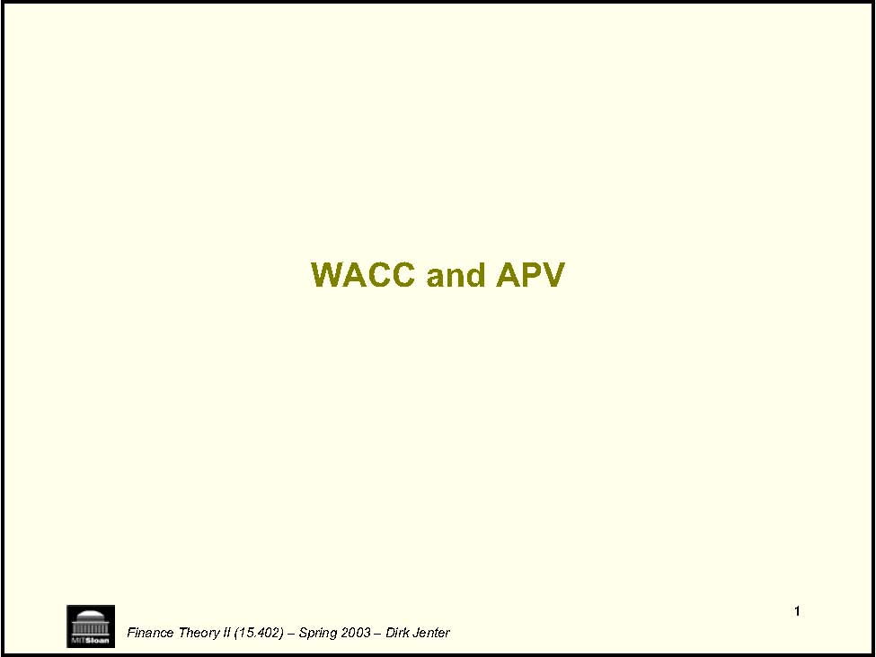

1 Finance Theory II (15.402) – Spring 2003 – Dirk Jenter WACC and APV 

2 • • • • • • • • • • Finance Theory II (15.402) – Spring 2003 – Dirk Jenter The Big Picture: Part II -Valuation A. Valuation: Free Cash Flow and Risk April 1 Lecture: Valuation of Free Cash Flows April 3 Case: Ameritrade B. Valuation: WACC and APV April 8 Lecture: WACC and APV April 10 Case: Dixon Corporation April 15 Case: Diamond Chemicals C. Project and Company Valuation April 17 Lecture: Real Options April 24 Case: MW Petroleum Corporation April 29 Lecture: Valuing a Company May 1 Case: Cooper Industries, Inc. May 6 Case: The Southland Corporation 

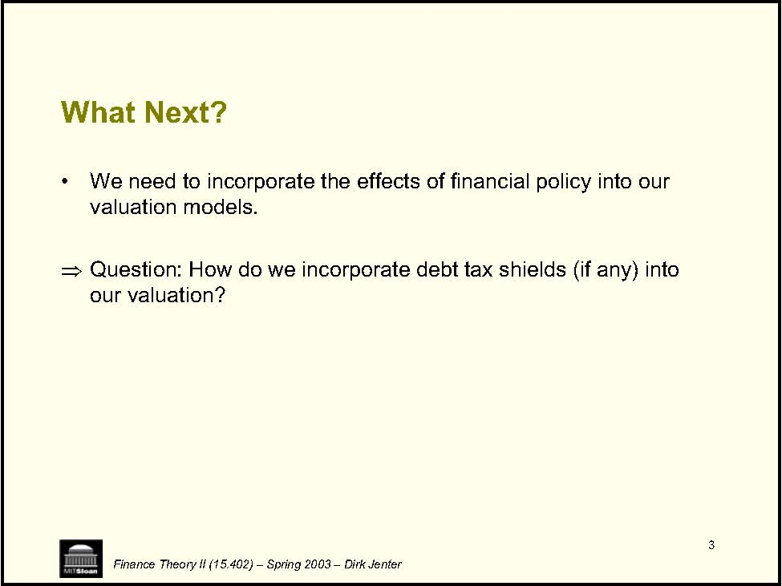

3 Finance Theory II (15.402) – Spring 2003 – Dirk Jenter What Next? • We need to incorporate the effects of financial policy into our valuation models. Ÿ Question: How do we incorporate debt tax shields (if any) into our valuation? 

4 Finance Theory II (15.402) – Spring 2003 – Dirk Jenter Two Approaches: • Weighted Average Cost of Capital (WACC): →Discount the FCF using the weighted average of after-tax debt costs and equity costs • Adjusted Present Value (APV): →Value the project as if it were all-equity financed →Add the PV of the tax shield of debt and other side effects ED E k ED D t1kWACC ED +++−=)( Recall:Recall: Free Cash Flows are cash flows available to be paid to all capital suppliers ignoring interest rate tax shields (i.e., as if the project were 100% equity financed). 

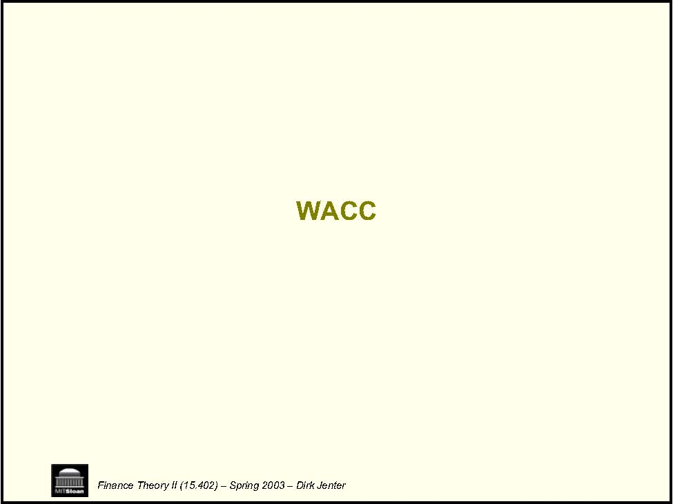

WACC Finance Theory II (15.402) – Spring 2003 – Dirk Jenter 

6 Weighted Average Cost of Capital (WACC) • • ED E k ED D t1kWACC ED +++−=)( Finance Theory II (15.402) – Spring 2003 – Dirk Jenter Step 1: Generate the Free Cash Flows (FCFs) Step 2: Discount the FCFs using the WACC 

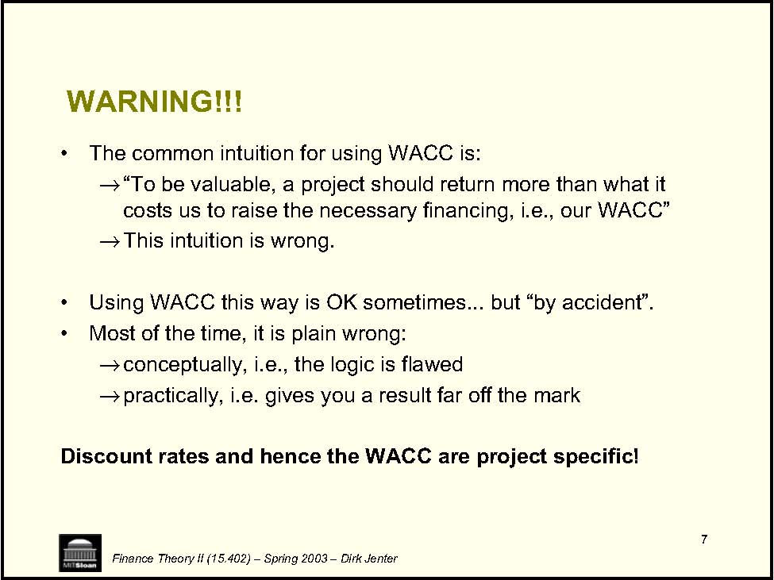

7 WARNING!!! • →→This intuition is wrong. • • →→Finance Theory II (15.402) – Spring 2003 – Dirk Jenter The common intuition for using WACC is: “To be valuable, a project should return more than what it costs us to raise the necessary financing, i.e., our WACC” Using WACC this way is OK sometimes... but “by accident”. Most of the time, it is plain wrong: conceptually, i.e., the logic is flawed practically, i.e. gives you a result far off the mark Discount rates and hence the WACC are project specific! 

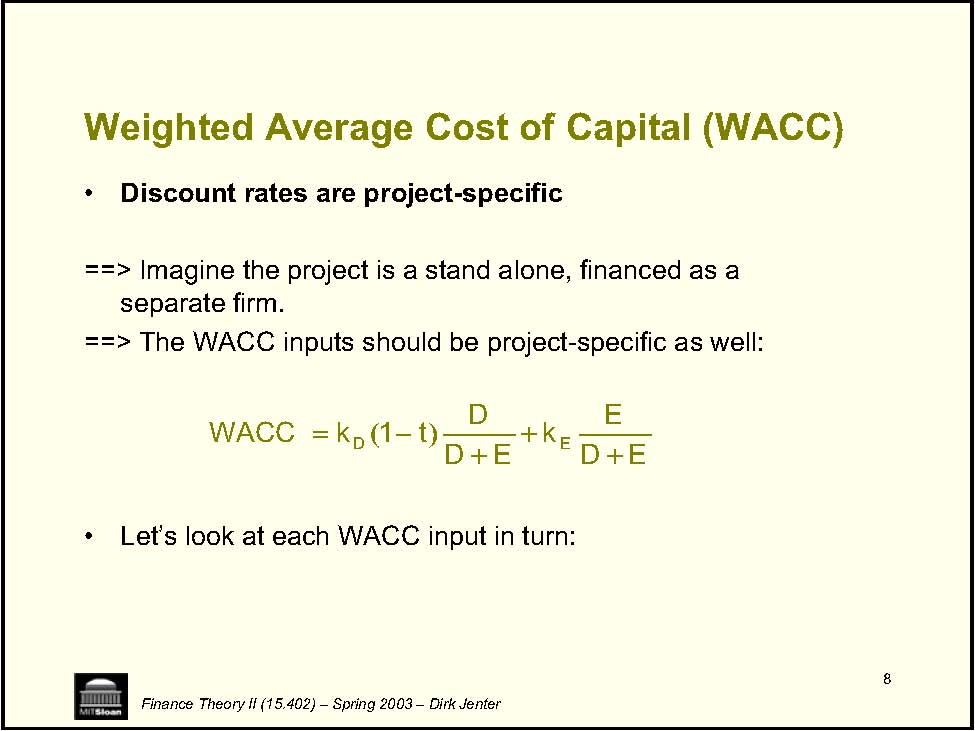

8 Weighted Average Cost of Capital (WACC) • separate firm. • ED E k ED D t1kWACC ED +++−=)( Finance Theory II (15.402) – Spring 2003 – Dirk Jenter Discount rates are project-specific ==&gt; Imagine the project is a stand alone, financed as a ==&gt; The WACC inputs should be project-specific as well: Let’s look at each WACC input in turn: 

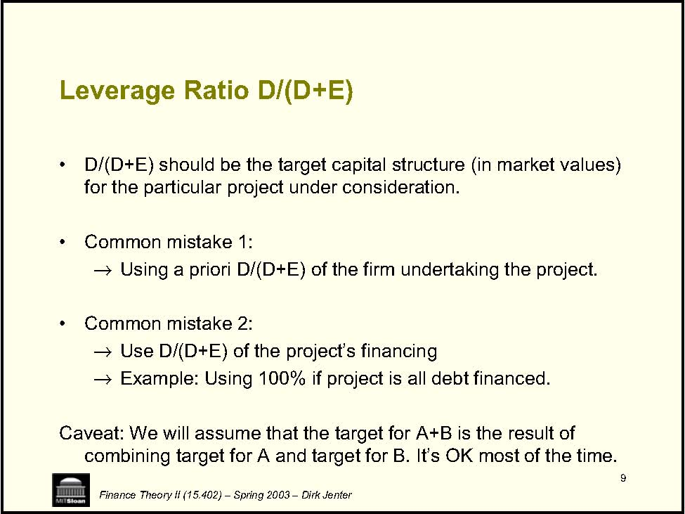

9 Leverage Ratio D/(D+E) • • →• →→Finance Theory II (15.402) – Spring 2003 – Dirk Jenter D/(D+E) should be the target capital structure (in market values)  for the particular project under consideration. Common mistake 1: Using a priori D/(D+E) of the firm undertaking the project. Common mistake 2: Use D/(D+E) of the project’s financing Example: Using 100% if project is all debt financed. Caveat: We will assume that the target for A+B is the result of combining target for A and target for B. It’s OK most of the time. 

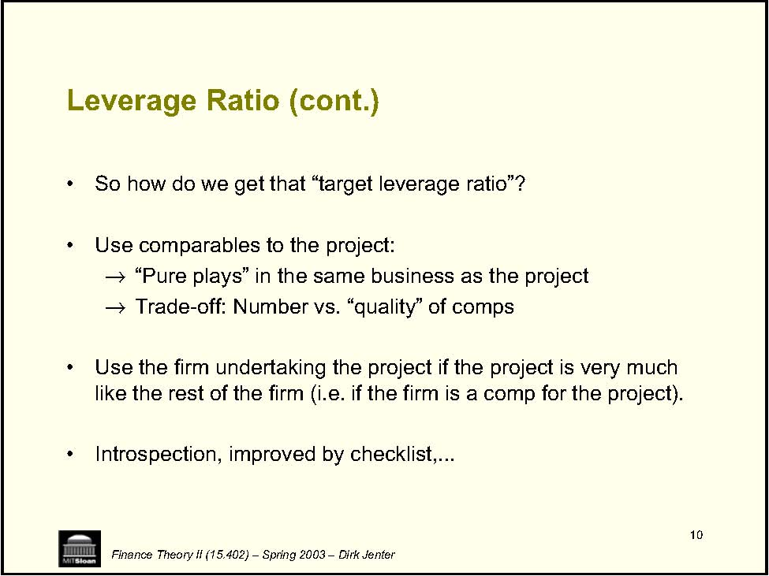

10 Leverage Ratio (cont.) • • →→• • Finance Theory II (15.402) – Spring 2003 – Dirk Jenter So how do we get that “target leverage ratio”? Use comparables to the project: “Pure plays” in the same business as the project Trade-off: Number vs. “quality” of comps Use the firm undertaking the project if the project is very much like the rest of the firm (i.e. if the firm is a comp for the project). Introspection, improved by checklist,... 

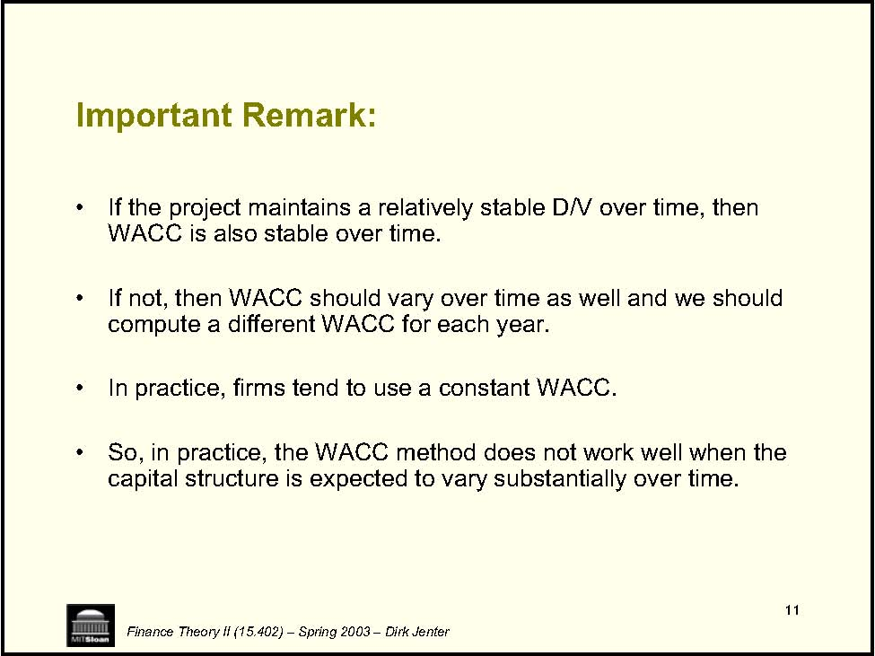

11 • • • • Finance Theory II (15.402) – Spring 2003 – Dirk Jenter Important Remark: If the project maintains a relatively stable D/V over time, then WACC is also stable over time. If not, then WACC should vary over time as well and we should compute a different WACC for each year. In practice, firms tend to use a constant WACC. So, in practice, the WACC method does not work well when the capital structure is expected to vary substantially over time. 

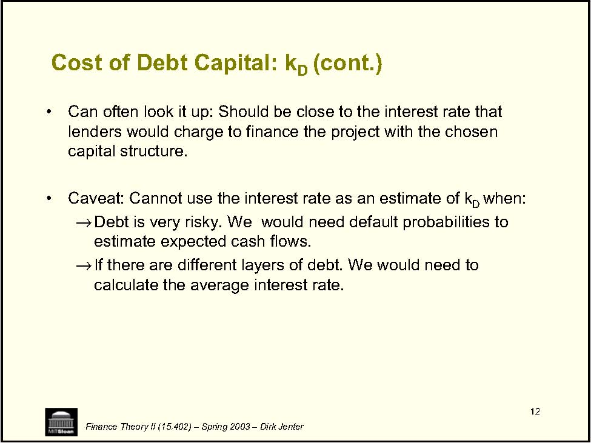

12 Cost of Debt Capital: kD (cont.) • j• D →→Finance Theory II (15.402) – Spring 2003 – Dirk Jenter Can often look it up: Should be close to the interest rate that lenders would charge to finance the proect with the chosen capital structure. Caveat: Cannot use the interest rate as an estimate of kwhen: Debt is very risky. We  would need default probabilities to estimate expected cash flows. If there are different layers of debt. We would need to calculate the average interest rate. 

13 Marginal Tax Rate: t • • • →Finance Theory II (15.402) – Spring 2003 – Dirk Jenter It’s the marginal tax rate of the firm undertaking the project (or to be more precise, of the firm including the project). Note that this is the rate that is going to determine the tax savings associated with debt. We need to use the marginal as opposed to average tax rate t. In practice, the marginal rate is often not easily observable. 

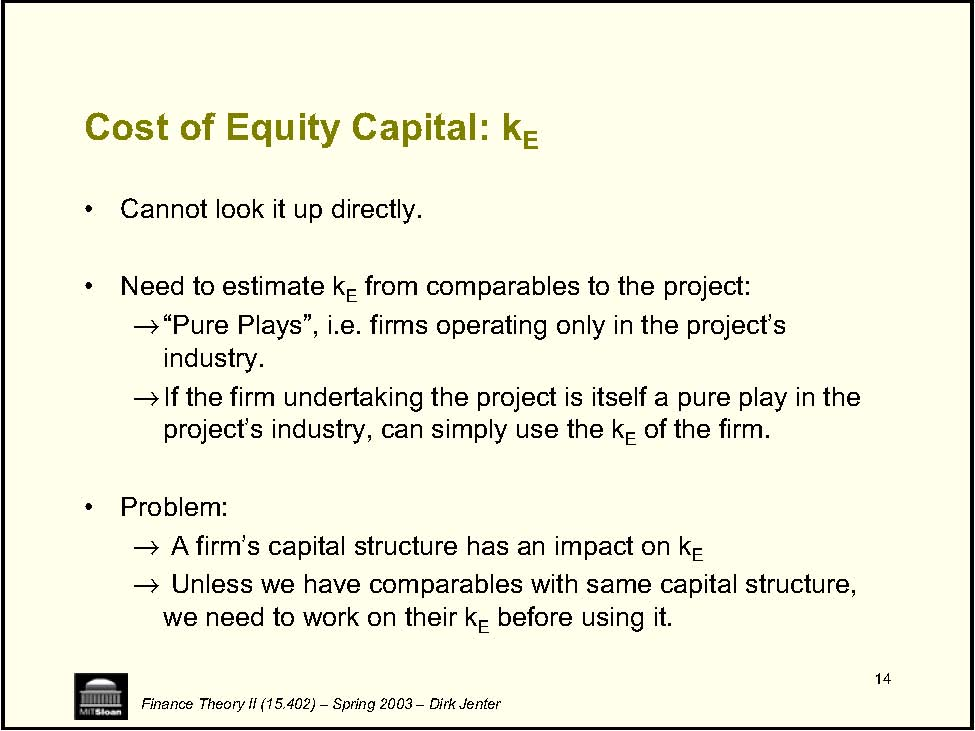

14 E • • E →→E of the firm. • →E →E before using it. Finance Theory II (15.402) – Spring 2003 – Dirk Jenter Cost of Equity Capital: kCannot look it up directly. Need to estimate kfrom comparables to the project: “Pure Plays”, i.e. firms operating only in the project’s industry. If the firm undertaking the project is itself a pure play in the project’s industry, can simply use the kProblem: A firm’s capital structure has an impact on kUnless we have comparables with same capital structure, we need to work on their k

15 Using CAPM to Estimate kE 1) 2) βE (βA. 3) βA to estimate the project’s βA 4) βA (to estimate its βE 5) Use the estimated βE E: kE = rf + βE * Market Risk Premium DE Eȕȕ EA +=AAE ȕ E Dȕ E DEȕ»¼º «¬ª +=+=1 Finance Theory II (15.402) – Spring 2003 – Dirk Jenter Finds comps for the project under consideration. Unlever each comp’s using the comp’s D/(D+E)) to estimate its When its debt is not too risky (and its D/V is stable), we can use: Use the comps’ (e.g. take the average). Relever the project’s estimated using the project’s D/(D+E) under the assumed capital structure. When the project’s debt is not too risky (and provided its D/V is stable), we can use: to calculate the project’s cost of equity k

16 →• →→Estimate one βA βA →βA. →Relever that βA. • Finance Theory II (15.402) – Spring 2003 – Dirk Jenter Remarks on Unlevering and Relevering: •Formulas: Relevering formulas are reversed unlevering formulas. Procedure: Unlever each comp, i.e., one unlevering per comp. by taking the average over all comps’ possibly putting more weight on those we like best. This is our estimate of the project’s In the course, we use mostly the formula for a constant D/(D+E). 

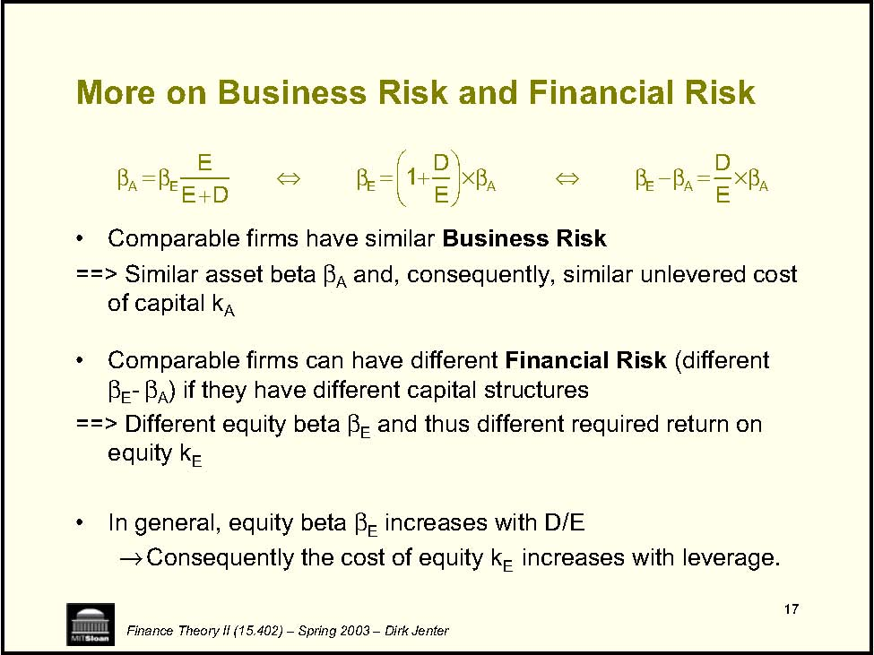

17 • ==&gt; Similar asset beta βA of capital kA • βE -βAβE equity kE • βE →E β×=β−β⇔β׸¹· ¨ © § +=β⇔+β=βAAEAEEA E D E D 1 DE E Finance Theory II (15.402) – Spring 2003 – Dirk Jenter More on Business Risk and Financial Risk Comparable firms have similar Business Risk and, consequently, similar unlevered cost Comparable firms can have different Financial Risk (different ) if they have different capital structures ==&gt; Different equity beta and thus different required return on In general, equity beta increases with D/E Consequently the cost of equity kincreases with leverage. 

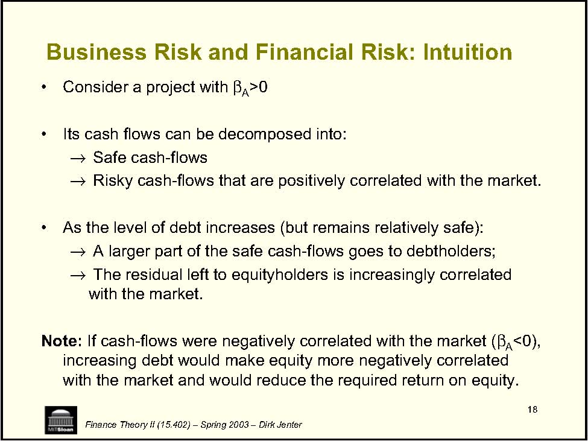

18 Business Risk and Financial Risk: Intuition • βA&gt;0 • →Safe cash-flows →• →→βAFinance Theory II (15.402) – Spring 2003 – Dirk Jenter Consider a project with Its cash flows can be decomposed into: Risky cash-flows that are positively correlated with the market. As the level of debt increases (but remains relatively safe): A larger part of the safe cash-flows goes to debtholders; The residual left to equityholders is increasingly correlated with the market. Note: If cash-flows were negatively correlated with the market (&lt;0), increasing debt would make equity more negatively correlated with the market and would reduce the required return on equity. 

19 million in perpetuity. ×After-tax WACC d + e = 0.25 ××+ ×Finance Theory II (15.402) – Spring 2003 – Dirk Jenter WACC – A simple example: You are evaluating a new project.  The project requires an initial outlay of $100 million and you forecast before-tax profits of $25 The marginal tax rate is 40%, the project has a target debt-to-value ratio of 25%, the interest rate on the project’s debt is 7%, and the cost of equity is 12%. After-tax CFs = $25 0.60 = $15 million = D/V * (1–t) * rE/V * r0.60 0.07  0.75 0.12 = 10.05% NPV = -100 + 15 / 0.1005 = $49.25 million 

20 How Firms Tend to Use WACC: • D • • E • They discount all future FCF with: • • Ÿ Finance Theory II (15.402) – Spring 2003 – Dirk Jenter They calculate their WACC using: Their current cost of debt kTheir own current capital structure D/(D+E) Their own current cost of equity capital kThe marginal tax rate they are facing this (single) discount rate maybe adjusted for other things (e.g., project’s “strategic value”) This practical approach can be very misleading, especially if the new project is very different from the firm undertaking it. 

Selected Industry Capital Structures, Betas, and WACCs 

<Table>
<TR>
<TH>Industry </TH>
<TH>Debt ratio (%) </TH>
<TH>Equity beta </TH>
<TH>Asset beta </TH>
<TH>WACC (%) </TH>
</TR>
<TR>
<TH>Electric and Gas </TH>
<TD>43.2 </TD>
<TD>0.58 </TD>
<TD>0.33 </TD>
<TD>8.1% </TD>
</TR>
<TR>
<TH>Food production </TH>
<TD>22.90 </TD>
<TD>0.85 </TD>
<TD>0.66 </TD>
<TD>11.0% </TD>
</TR>
<TR>
<TH>Paper and plastic </TH>
<TD>30.40 </TD>
<TD>1.03 </TD>
<TD>0.72 </TD>
<TD>11.4% </TD>
</TR>
<TR>
<TH>Equipment </TH>
<TD>19.10 </TD>
<TD>1.02 </TD>
<TD>0.83 </TD>
<TD>12.4% </TD>
</TR>
<TR>
<TH>Retailers </TH>
<TD>21.70 </TD>
<TD>1.19 </TD>
<TD>0.93 </TD>
<TD>13.2% </TD>
</TR>
<TR>
<TH>Chemicals </TH>
<TD>17.30 </TD>
<TD>1.34 </TD>
<TD>1.11 </TD>
<TD>14.7% </TD>
</TR>
<TR>
<TH>Computer software </TH>
<TD>3.50 </TD>
<TD>1.33 </TD>
<TD>1.28 </TD>
<TD>16.2% </TD>
</TR>
<TR>

</TR>
<TR>
<TH>Average of all industries </TH>
<TD>21.50 </TD>
<TD>1.04 </TD>
<TD>0.82 </TD>
<TD>12.3% </TD>
</TR>
<TR>

</TR>
<TR>
<TH>Assumptions: Risk-free rate 6%; market risk premium 8%; cost of debt 7.5%; tax rate 35% </TH>
</TR>
</Table>

Finance Theory II (15.402) – Spring 2003 – Dirk Jenter 

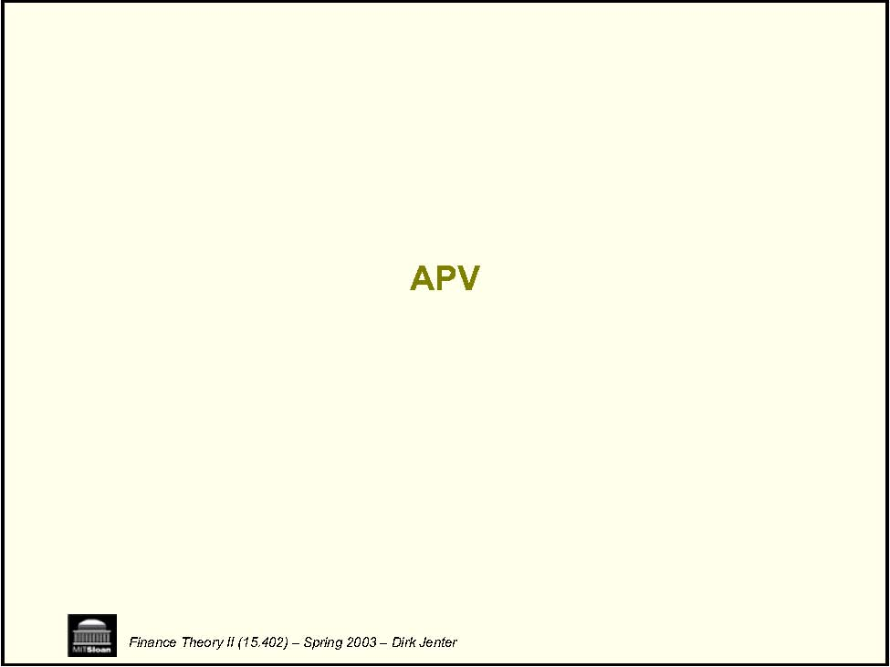

APV Finance Theory II (15.402) – Spring 2003 – Dirk Jenter 

23 Adjusted Present Value • • Step 1: financed. • Step 2: Note: • • Finance Theory II (15.402) – Spring 2003 – Dirk Jenter Separates the effects of financial structure on value from the estimation of asset values. Value the project or firm as if it were 100% equity Add the value of the tax shield of debt. This is simply applying MM-Theorem with taxes APV = Valuation by Components = ANPV 

24 • • • equity financed. • →→equity financed. Finance Theory II (15.402) – Spring 2003 – Dirk Jenter Step 1: Value as if 100% Equity Financed Cash-flows: Free Cash Flows are exactly what you need. You need the rate that would be appropriate to discount the firm’s cash flows if the firm were 100% equity financed. This rate is the expected return on equity if the firm were 100% To get it, you need to: Find comps, i.e., publicly traded firms in same business. Estimate their expected return on equity if they were 100% 

25 • βE βA • βA βA • βA A kA = rf + βA A (E Eȕȕor DE Eȕȕ EAEA −+=+=1 Finance Theory II (15.402) – Spring 2003 – Dirk Jenter Step1: Value if 100% Equity Financed (cont.) Unlever each comp’s to estimate its asset beta (or all equity or unlevered beta) using the appropriate unlevering formula Use the comps’ to estimate the project’s (e.g. average). Use the estimated to calculate the all-equity cost of capital k* Market Risk Premium •Use kto discount the project’s FCF D) t 

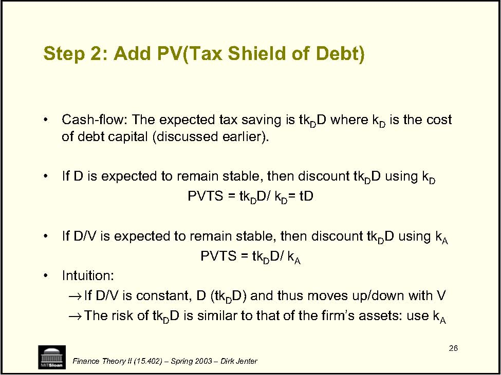

26 Step 2: Add PV(Tax Shield of Debt) • DD • DD using kD PVTS = tkDD• DA PVTS = tkDA • →D→DA Finance Theory II (15.402) – Spring 2003 – Dirk Jenter Cash-flow: The expected tax saving is tkD where kis the cost of debt capital (discussed earlier). If D is expected to remain stable, then discount tkD/ k= tD If D/V is expected to remain stable, then discount tkD using kD/ kIntuition: If D/V is constant, D (tkD) and thus moves up/down with V The risk of tkD is similar to that of the firm’s assets: use k

27 Step 2: Add PVTS (cont.) • j• • →→kD kA. Finance Theory II (15.402) – Spring 2003 – Dirk Jenter For many proects, neither D nor D/V is expected to be stable. For instance, LBO debt levels are expected to decline. In general you can estimate debt levels using: repayment schedule if one is available, financial forecasting and discount by a rate between  and  

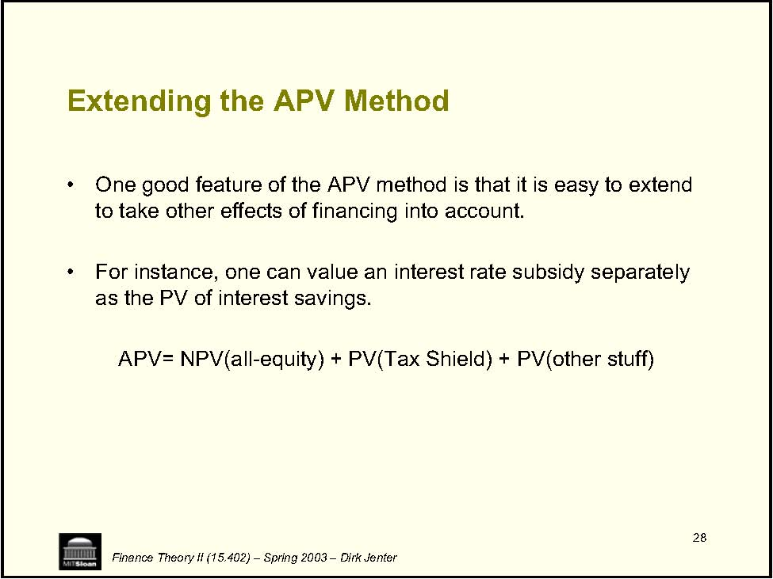

28 Extending the APV Method • • Finance Theory II (15.402) – Spring 2003 – Dirk Jenter One good feature of the APV method is that it is easy to extend to take other effects of financing into account. For instance, one can value an interest rate subsidy separately as the PV of interest savings. APV= NPV(all-equity) + PV(Tax Shield) + PV(other stuff) 

29 WACC vs. APV • • • • distress)? Non-constant debt ratios? Personal taxes? Finance Theory II (15.402) – Spring 2003 – Dirk Jenter Pros of WACC: Most widely used Less computations needed (important before computers). More literal, easier to understand and explain (?) Cons of WACC: Mixes up effects of assets and liabilities. Errors/approximations in effect of liabilities contaminate the whole valuation. Not very flexible: What if debt is risky? Cost of hybrid securities (e.g., convertibles)? Other effects of financing (e.g., costs of Note: For non-constant debt ratios, could use different WACC for each year (see appendix) but this is heavy and defeats the purpose. 

30 WACC vs. APV (cont.) • • • • • • Finance Theory II (15.402) – Spring 2003 – Dirk Jenter Advantages of APV: No contamination. Clearer: Easier to track down where value comes from. More flexible: Just add other effects as separate terms. Cons of APV: Almost nobody uses it. Overall: For complex, changing or highly leveraged capital structure (e.g., LBO), APV is much better. Otherwise, it doesn’t matter much which method you use. 

Finance Theory II (15.402) – Spring 2003 – Dirk Jenter Appendix I -Relation to MM Theorem 

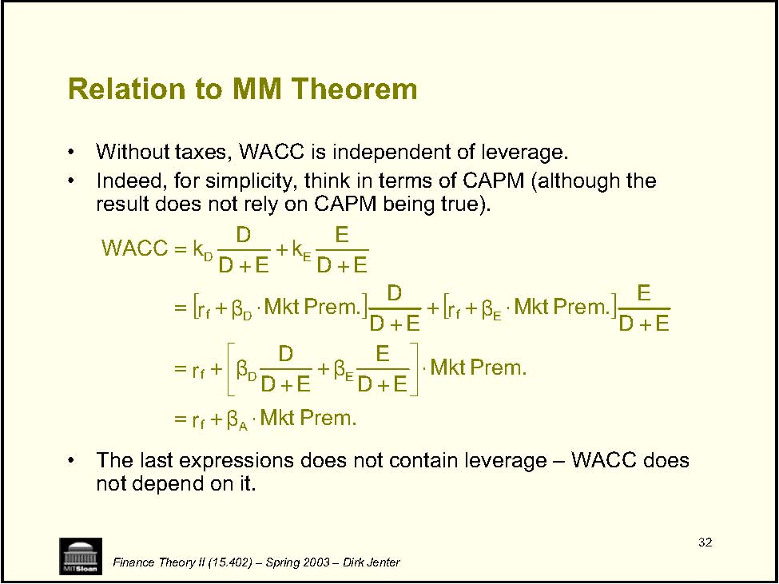

32 Relation to MM Theorem • • • not depend on it. [][]ȕr ED Eȕ ED Dȕr ED Eȕr ED Dȕr ED E k ED D kWACC Af EDf EfDf ED ⋅+=⋅»¼º «¬ª ++++=+⋅+++⋅+=+++=Finance Theory II (15.402) – Spring 2003 – Dirk Jenter Without taxes, WACC is independent of leverage. Indeed, for simplicity, think in terms of CAPM (although the result does not rely on CAPM being true). The last expressions does not contain leverage – WACC does Prem. Mkt Prem. Mkt Prem. Mkt Prem. Mkt 

33 Finance Theory II (15.402) – Spring 2003 – Dirk Jenter The WACC Fallacy (Revisited) • The cost of debt is lower than the cost of equity (true). • Does this mean that projects should be financed with debt? • No: WACC is independent • As you are tapping into cheap debt, you are increasing the cost of equity (its financial risk increases). ED E k ED D kWACC ED +++=

34 Finance Theory II (15.402) – Spring 2003 – Dirk Jenter Without taxes, WACC is independent of leverage: 6% 8% 10% 12% 14% 16% 18% 20% 0 0.2 0.4 0.6 0.8 1 1.2 Debt-to-equity rrDDrrEErrAA= WACC= WACC
