         Acrobat Distiller 6.0 (Windows)

         Compaq

         Compaq

         Acrobat PDFMaker 6.0 for PowerPoint

         2004-01-22T11:27:48+05:30

         2004-01-22T11:26:35+05:30

         2004-01-22T11:27:48+05:30

         uuid:9a716df2-5889-4fc7-97e6-7cfe61ff4105

         uuid:6712568a-b158-4313-b44d-edc3127f2efc

         xml

               No Slide Title

               Leslie A. Larocca

Cost of Capital

Katharina Lewellen

Finance Theory II

April 9, 2003

What Next?

- We want to value a project that is financed by both debt and equity

- Our approach:

- Calculate expected Free Cash Flows(FCFs) from the project

- Discount FCFs at a rate that reflects opportunity costs of capital of all capital suppliers

- Incorporate the interest tax shields

- Adjust the discount rate (WACC)

- Adjust cash flows (APV)

Recall: Recall: Free Cash Flowsare cash flows available to be paid to all capital suppliers ignoring interest rate tax shields (i.e., as if the project were 100% equity financed).

Two Approaches

- Weighted Average Cost of Capital (WACC):

- Discount the FCF using the weighted average of after-tax debt costs and equity costs

- Adjusted Present Value (APV):

- Value the project as if it were all-equity financed

- Add the PV of the tax shieldof debt and other side effects

EDEkEDDt1kWACCED+++−=)(

1. WACC

Weighted Average Cost of Capital (WACC)

- Step 1: Generate the Free Cash Flows (FCFs)

- Step 2: Discount the FCFs using the WACC

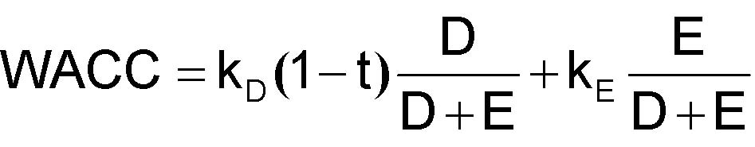

EDEkEDDt1kWACCED+++−=)(

WACC -Example

You are evaluating a new project.  The project requires an initial outlay of $100 million and you forecast before-tax profits of $25 million in perpetuity.  The tax rate is 40%, the firm has a target debt-to-value ratio of 25%, the interest rate on the firm’s debt is 7%, and the cost of equity is 12%.

After-tax CFs = $25 ×0.60 = $15 million

After-tax WACC= D/V (1–τ) rd+  E/V re

= 0.25 ×0.60 ×0.07  +  0.75 ×0.12 = 10.05%

NPV = -100 + 15 / 0.1005 = $49.25 million

WARNING!!!

- The common intuition for using WACC is:

- “To be valuable, a project should return more than what it costsus to raise the necessary financing, i.e., our WACC”

- This intuition is wrong.

- Using WACC this way is OK sometimes... but “by accident”.

- Sometimes, this is plain wrong:

- conceptually, i.e., the logic may be flawed

- practically, i.e., gives you a result far off the mark

- Need to understand this concept (more tricky than it appears).

Weighted Average Cost of Capital (WACC)

- Recall: Discount rates are project-specific==&gt; Imagine the project is a stand alone, i.e., financed as a separate firm.

- Debt worth D (i.e. market value) and with expected return kD(i.e., cost of debt) if against that project only

- Equity worth E (i.e. market value) and with expected return kE(i.e., cost of equity) if against that project only

- t is the marginal tax rate of the firm undertaking the project

Why WACC?

- Consider a one-year project (stand-alone) such that:

- expected cash-flow at the end of year 1 (BIT) = X

- Today (year 0) the projects has:

- debt outstanding with market value D0

- equity outstanding with market value E0

- project’s total value is V0 = D0 +E0

- We are looking for the discount rate r such that:

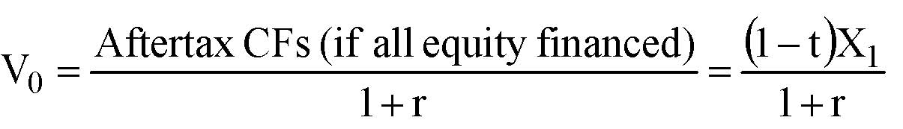

()r1Xt1r1financed)equity  all (if CFs AftertaxV10+−=+=

()001VVXt1r−−=

Why WACC? (cont.)

CF to debt-holders

CF to share-holders

r = WACC

The expected increase in value from year 0 to year 1 is:

=−+00D00EVDk)t1(VEk

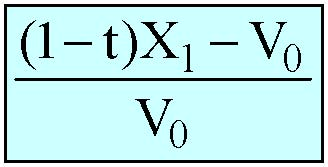

001VVX)t1(−−

=+0E0DEkDk

00D10DV)DkX)(t1(Dk−−−+

010D0EVX)t1(Dk)t1(Ek−−=−+

Leverage Ratio D/(D+E)

- D/(D+E) should be the target capital structure (in market values)  for the particular project under consideration.

- Common mistake 1:

- Using a priori D/(D+E) of the firm undertaking the project.

- Common mistake 2:

- Use D/(D+E) of the project’s financing

- Example: Using 100% if project is all debt financed.

Caveat: We will assume that the target for A+B is the result of combining target for A and target for B. It’s OK most of the time.

Leverage Ratio (cont.)

- So how do we get that ratio?

- Comparables to the project:

- “Pure plays” in the same business as the project

- Trade-off: Number vs. “quality” of comps

- The firm undertaking the project if the project is very much like the rest of the firm (i.e., if the firm is a comp for the project).

- Introspection, improved by checklist,...

Important Remark

- If the project maintains a relatively stable D/V over time, thenWACC is also stable over time.

- If not, then WACC should vary over time as well so you should compute/forecast a different WACC for each year.

- In practice, firms tend to use a constant WACC.

- So, in practice, WACC method is not great when capital structure is expected to vary substantially over time.

Cost of Debt Capital: kD

- When default probability is low

- We can estimate kDusing CAPM (empirical evidence suggests using debt betas between 0.2 and 0.3)

- kDshould be close to the interest rate that lenders would charge to finance the project with the chosen capital structure

- When default probability is high

- We would need default probabilities to estimate expected cash flows to debtholders

Marginal Tax Rate: t

- It’s the marginal tax rate of the firm undertaking the project (or to be more precise, of the firm + project).

- Indeed, this is the rate that is going to determine the tax savings associated with debt.

- Marginal as opposed to average tax rate t

Cost of Equity Capital: kE

- Need to estimate kEfrom comparables to the project:

- “Pure Plays”, i.e. firms operating only in the project’s industry

- The firm undertaking the project (if the firm is a pure play)

- Problem:

- A firm’s capital structure has an impact on kE

- Unless we have comparables with same capital structure, we need to work on their kEbefore using it.

Using CAPM to Estimate kE

1) Finds comps for the project under consideration.

2) Unlevereach comp’s βE(using the comp’sD/(D+E)) to estimate its βA: 

3) Use the comps’ βA to estimate the project’s βA(e.g. take the average).

4) Releverthe project’s estimated βA (using the project’s D/(D+E)) to estimate its βEunder the assumed capital structure:

5) Use the estimated βE to calculate the project’s cost of equity kE:

kE= rf  + βE* Market Risk Premium

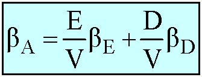

DEAβVDβVEβ+=

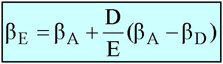

)ββ(EDββDAAE−+=

Remarks

- Formulas:

- Relevering formulas are reversed unlevering formulas.

- The appendix shows where they come from.

- Most of the time:

- Unlever each comp, i.e., one unlevering per comp.

- Estimate one βAby taking the average over all comps’ βApossibly putting more weight on those we like best.

- This is our estimate of the project’s βA

- Relever that βAonly, i.e., just one relevering.

- In the course, we use mostly the formula for a constant D/V.

More on Business Risk and Financial Risk

- Comparable firms have similar Business Risk

- Similar asset beta βAand, consequently, similar unlevered cost of capital kA

- Comparable firms can have different Financial Risk(βE-βA) if they have different capital structures 

- Different equity beta βEand thus different required return on equity kE

- In general, equity beta βEincreases with D/E

- Consequently the cost of equity kE  increases with leverage

Leverage, returns, and risk 

Asset risk is determined by the type of projects, not how the projects are financed

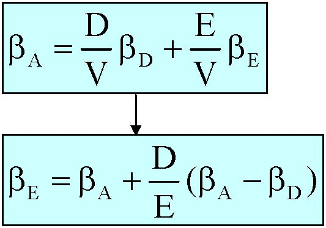

EDA VE   VDβ+β=β)  ( ED  DAAEβ−β+β=β

Changes in leverage do not affect rAor βALeverage affects rEand βE

EDAr VE  r VDr+=)r  (r ED  rrDAAE−+=

Leverage and beta 

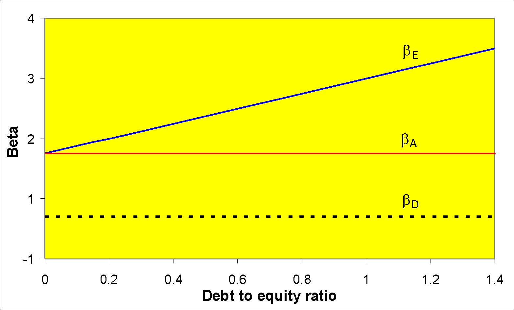

βEβAβD-1123400.20.40.60.811.21.4Debt to equity ratioBeta

Leverage and required returns

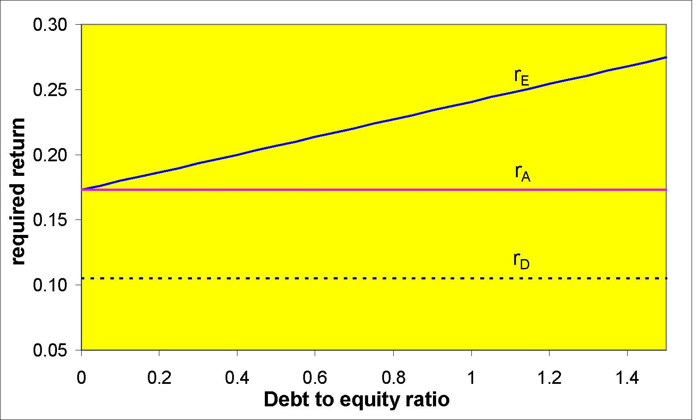

rErArD0.050.100.150.200.250.3000.20.40.60.811.21.4Debt to equity ratiorequired return

Business Risk and Financial Risk: Intuition

- Consider a project with βA&gt;0

- Its cash flows can be decomposed into:

- Safe cash-flows

- Risky cash-flows that are positively correlated with the market.

- As the level of debt increases (but remains relatively safe):

- A larger part of the safe cash-flows goes to debtholders;

- The residual left to equityholders is increasingly correlated with the market.

Note:If cash-flows were negatively correlated with the market (βA&lt;0), increasing debt would make equity more negatively correlated with the market and would reduce the required return on equity.

General Electric’s WACC

- Assume  rf = 6%

- We can get GE’s βE=1.10 which implies

kE= 6% + 1.10 * 8% = 14.8%

- kD = 7.5%

- D/(D+E) = .06

- t = 35%

WACC = .06 * 7.5% * (1-35%) + .094 * 14.8%  =  14.2%

When Can GE Use This WACC in DCF?

- When the project under consideration has the same basic risk as the rest of the company (i.e., when the company is a good comp for its project).

- And, the project will be financed in the same way as the rest of the company.

- For example, if GE is expanding the scale of entire operations then it should use its own WACC.

- But, if planning to expand in only one of its many different businesses then it’s not the right cost of capital.

- In that case: Find publicly-traded comps and do unlevering / levering.

Important Warning

- Cost of capital is an attribute of an investment, notthe company

- Few companies have a single WACC that they can use for all of their businesses.

GE’s businesses:

- Financial services

- Power systems

- Aircraft engines

- Industrial

- Engineered plastics

- Technical products

- Appliances

- Broadcasting

How Firms Tend to Use WACC

They calculate their WACC using:

- Their current cost of debt kD

- Their own current capital structure D/(D+E)

- Their own current cost of equity capital kE(more on this soon).

- The marginal tax rate they are facing

They discount all future FCF with:

- this (single) discount rate

- maybe adjusted for other things (e.g., project’s “strategic value”)

Selected Industry Capital Structures, Betas, and WACCs

IndustryDebt ratio (%)Equity betaAsset betaWACC (%)Electric and Gas43.20.580.338.1%Food production22.900.850.6611.0%Paper and plastic30.401.030.7211.4%Equipment19.101.020.8312.4%Retailers21.701.190.9313.2%Chemicals17.301.341.1114.7%Computer software3.501.331.2816.2%Average of all industries21.501.040.8212.3%Assumptions: Risk-free rate 6%; market risk premium 8%; cost of debt 7.5%; tax rate 35%

Relation to MM: 

W/o taxes, WACC is independent of leverage

6%8%10%12%14%16%18%20%00.20.40.60.811.2Debt-to-equityrrDDrrEErrA A = WACC= WACC

The WACC Fallacy (Revisited)

- The cost of debt is lower than the cost of equity (true).

- Does this mean that projects should be financed with debt?

- No: WACC is independent of leverage

- As you are tapping into cheap debt, you are increasing the cost of equity (its financial risk increases).

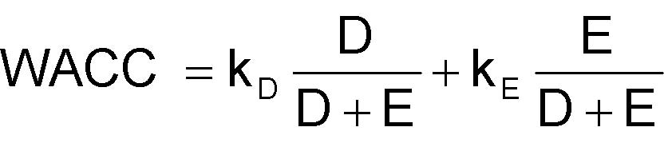

EDEkEDDkWACCED+++=

With taxes, WACC declines with leverage

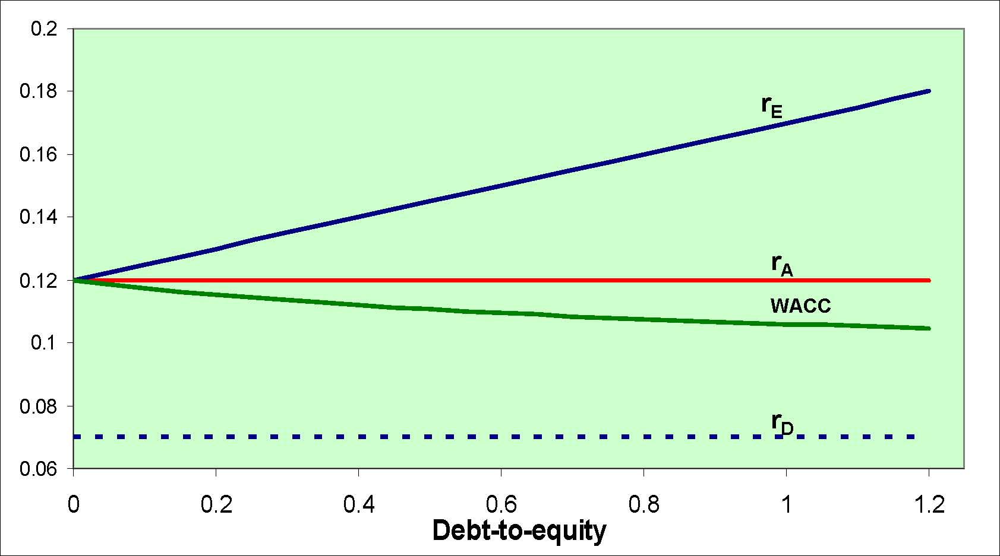

0.060.080.10.120.140.160.180.200.20.40.60.811.2Debt-to-equityrErAWACCrD

2. APV

Adjusted Present Value

- Separates the effects of financial structure from the others.

- Step 1: Value the project/firm as if it were 100% equity financed.

- Step 2: Add the value of the tax shield of debt.

Note:

- This is simply applying MM-Theorem with taxes

- APV = Valuation by Components = ANPV

Step 1: Value if 100% Equity Financed

- Cash-flows: Free Cash Flows are exactly what you need.

- You need the rate that would be appropriate to discount the firm’s cash flows if the firm were 100% equity financed.

- This rate is the expected return on equity if the firm were 100%equity financed.

- To get it, you need to:

- Find comps, i.e., publicly traded firms in same business.

- Estimate their expected return on equity if they were 100% equity financed.

Step1: Value if 100% Equity Financed (cont.)

- Unlever each comp’s βEto estimate its asset beta (or all equity or unleveredbeta) βA using the appropriate unlevering formula

- Use the comps’ βA to estimate the project’s βA(e.g. average).

- Use the estimated βA to calculate the all-equity cost of capital kA 

kA= rf  + βA* Market Risk Premium

- Use kAto discount the project’s FCF

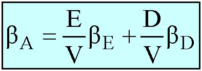

DEAβVDβVEβ+=

Example

- Johnson and Johnson operate in several lines of business: Pharmaceuticals, consumer products and medical devices.

- To estimate the all-equity cost of capital for the medical devices division, we need a comparable, i.e., a pure play in medical devices (we should really have several).

- Data for Boston Scientific:

- Equity beta = 0.98

- Debt = $1.3b

- Equity = $9.1b.

Example (cont.)

- Compute Boston Scientific’s asset beta:

- Let this be our estimate of the asset beta for the medical devices business

- Use CAPM to calculate the all-equity cost of capital for that business (assuming 6% risk-free rate, 8% market risk premium):

kA= 6% + .86 *8% = 12.9%

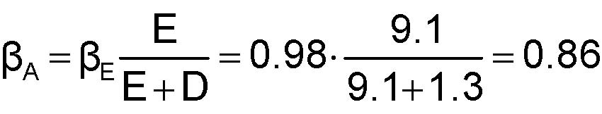

0.86 1.39.19.10.98 DEEββEA=+⋅=+=

Step 2: Add PV(Tax Shield of Debt)

- Cash-flow: The expected tax saving is tkDD where kDis the cost of debt capital (discussed earlier).

- If D is expected to remain stable, then discount tkDD using kD 

PVTS = tkDD/ kD= tD

- If D/V is expected to remain stable, then discount tkDD using kA

PVTS = tkDD/ kA

- Intuition:

- If D/V is constant, D (tkDD) moves up/down with V

- The risk of tkDD is similar to that of the firm’s assets: use kA

Step 2: Add PVTS (cont.)

- For many projects, neither D nor D/V is expected to be stable.

- For instance, LBO debt levels are expected to decline.

- In general you can estimate debt levels using:

- repayment schedule if one is available,

- financial forecasting

and discount by a rate between  kDand  kA.

Extending the APV Method

- One good feature of the APV method is that it is easy to extend to take other effects of financing into account.

- For instance, one can value an interest rate subsidy separately as the PV of interest savings.

APV= NPV(all-equity) + PV(Tax Shield) + PV(other stuff)

WACC vs. APV

Pros of WACC: Most widely used

- Less computations needed (before computers).

- More literal, easier to understand and explain (?)

Cons of WACC:

- Mixes up effects of assets and liabilities. Errors/approximations in effect of liabilities contaminate the whole valuation.

- Not very flexible:What if debt is risky? Cost of hybrid securities (e.g., convertibles)? Other effects of financing (e.g., costs of distress)? Non-constant debt ratios?

Note: For non-constant debt ratios, could use different WACC for each year (see appendix) but this is heavy and defeats the purpose.

WACC vs. APV (cont.)

Advantages of APV:

- No contamination.

- Clearer: Easier to track down where value comes from.

- More flexible: Just add other effects as separate terms. 

Cons of APV:

- Almost nobody uses it.

Overall:

- For complex, changing or highly leveraged capital structure (e.g., LBO), APV is much better.

- Otherwise, it doesn’t matter much which method you use.

Appendix

Appendix A: Unlevering Formula for a Constant Debt Ratio D/V

- Consider a firm with perpetual expected cash-flows, X.

- Capital structure: Debt worth D and equity worth E

- By definition, the all-equity cost of capital is the rate kA that is appropriate for discounting the project’s FCF, (1-t)X.

- Moreover, since the firm’s D/V is stable, PVTS= tDkD/ kA 

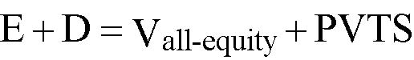

PVTSVDEequity-all+=+

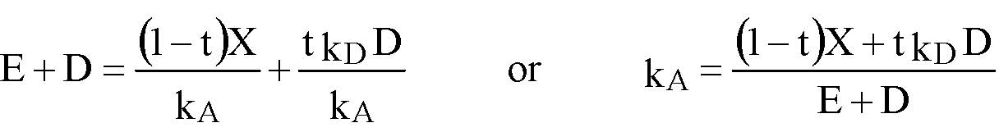

()()DEDktXt1k  or                  kDktkXt1DEDAADA++−=+−=+

Appendix A: Unlevering Formula for a Constant Debt Ratio D/V (cont.)

- Debt-and equity-holders share each year’s (expected) cash-flows

- Eliminating X, we get:

- Translating into betas (all relationships being linear) yields:

()equity payment toExpectedEdebt payment toExpectedDdebt ofshield tax AnnualDfinancedequity  100% if  cashflowtax -after Expected    Ek                Dk        Dtk                        Xt1          +=+−

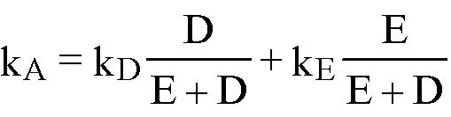

DEEkDEDkkEDA+++=

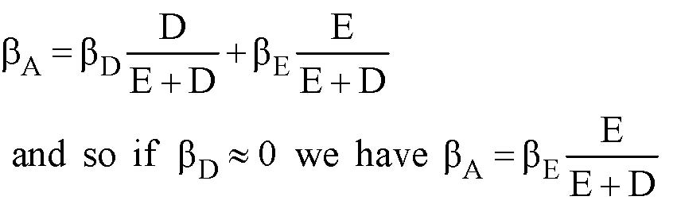

  DEEββ  have    we0β  if  so  and DEEβDEDβEADEDA+=≈+++=β

Appendix B: Unlevering Formula for a Constant Debt Level D

- Consider a firm with perpetual expected cash-flows, X.

- Capital structure: Debt worth D and equity worth E

- Since the firm’s D is constant over time, PVTS= tD

PVTSVDEequity-all+=+

()()()t1DEXt1k  or                  tDkXt1DEAA−+−=+−=+

Appendix B: Unlevering Formula for a Constant Debt Level D (cont.)

- Debt-and equity-holders share each year’s (expected) cash-flows

- Dividing both sides by (D+E), we get (see formula for kAabove):

- Translating into betas yields:

()equity payment toExpectedEdebt payment toExpectedDdebt ofshield tax AnnualDfinancedequity  100% if  cashflowtax -after Expected    Ek                Dk        Dtk                        Xt1          +=+−

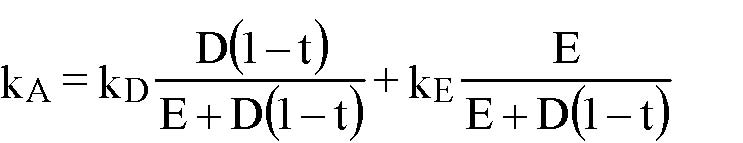

()()()t1DEEkt1DEt1DkkEDA−++−+−=

()()()()  t1DEE  have    we0  if  so  and t1DEEt1DEt1DEADEDA−+β=β≈β−+β+−+−β=β

Appendix C: WACC vs. APV: Example

Objective of the example:

- See APV and WACC in action.

- Show that, when correctly implemented, APV and WACC give identical results.

- Correctly implementing WACC in an environment of changing leverage.

- Convince you that APV is the way to go.

WACC vs. APV: Example (cont.)

AnttozInc., a Fortune 500 widget company, is planning to set up a newfactory in New Orleans with cash flows as presented on the next slide:

- The new plant will require an initial investment in PPE of $75 million, plus an infusion of $10 million of working capital (equal to 8% of first-year sales).

- Sales are projected to be $125 million in the first year of operation. Sales are projected to rise a whopping 10% over the next two years, with growth stabilizing at a 5% rate indefinitely thereafter.

- Anttoz’sarmy of financial analysts estimate that cash costs (COGS, GS&amp;Aexpenses, etc.) will constitute 50% of revenues.

- New investment in PPE will match depreciation each year, starting at 10% of the initial $75 million investment and growing in tandem with sales thereafter.

- The firm plans to maintain working capital at 8% of the following year’s projected sales.

WACC vs. APV: Example (cont.)

- With AnttozWidgets Inc. in the 35% tax bracket, FCF would approach $45 million in three years, and grow 5% per year thereafter.

- The required rate of return on the project’s assets, kA, is 20%.

- The project supports a bank loan of $80 million initially with $5 million principal repayments at the end of the first three years of operation, bringing debt outstanding at the end of the third year to $65 million.

- From that point on, the project’s debt capacity will increase by5% per year, in line with the expected growth of operating cash flows. Because of the firm’s highly leveraged position in the early years, the borrowing rate is 10% initially, falling to 8% once it achieves a stable capital structure (after year 3).

WACC vs. APV: Example (cont.)

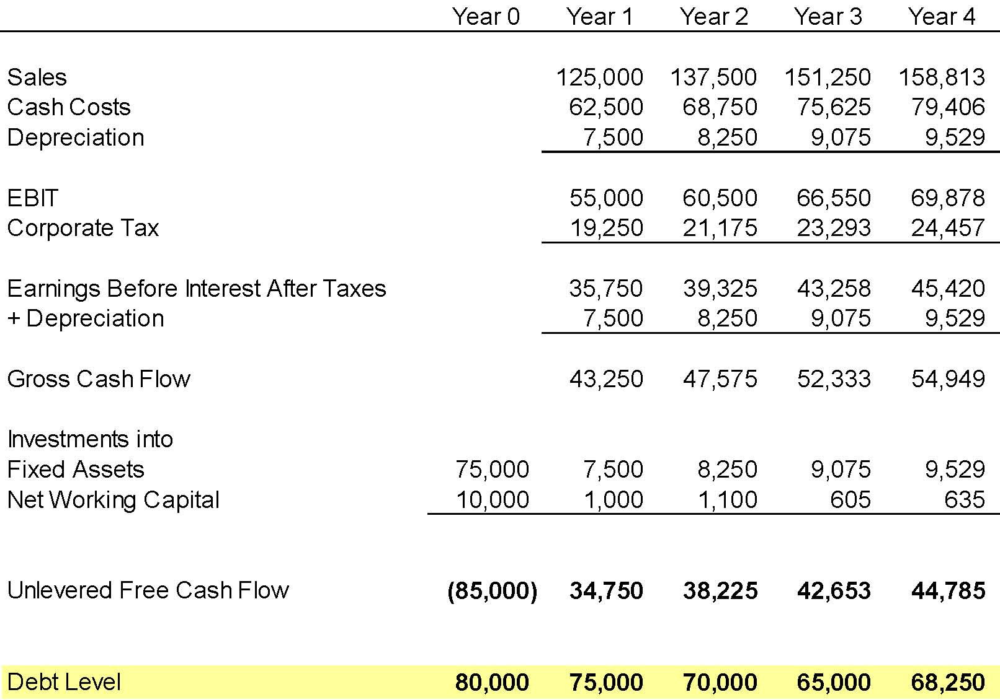

Year 0Year 1Year 2Year 3Year 4Sales125,000 137,500 151,250 158,813 Cash Costs62,500   68,750   75,625   79,406   Depreciation7,500     8,250     9,075     9,529     EBIT55,000   60,500   66,550   69,878   Corporate Tax19,250   21,175   23,293   24,457   Earnings Before Interest After Taxes35,750   39,325   43,258   45,420   + Depreciation7,500     8,250     9,075     9,529     Gross Cash Flow43,250   47,575   52,333   54,949   Investments intoFixed Assets75,000   7,500     8,250     9,075     9,529     Net Working Capital10,000   1,000     1,100     605        635        Unlevered Free Cash Flow(85,000)  34,750   38,225   42,653   44,785   Debt Level80,000   75,000   70,000   65,000   68,250   

WACC vs. APV: Example (cont.)

Year 0Year 1Year 2Year 3Year 4APVUnlevered FCF(85,000)   34,750    38,225    42,653    44,785    Unlevered Value252,969  268,813  284,350  298,568  313,496  Interest Tax Shield2,800       2,625       2,450       1,820       Discounted Value of TS52,135    54,549    57,379    60,667    63,700    Levered Value305,104  323,361  341,729  359,234  377,196  

WACC vs. APV: Example (cont.)

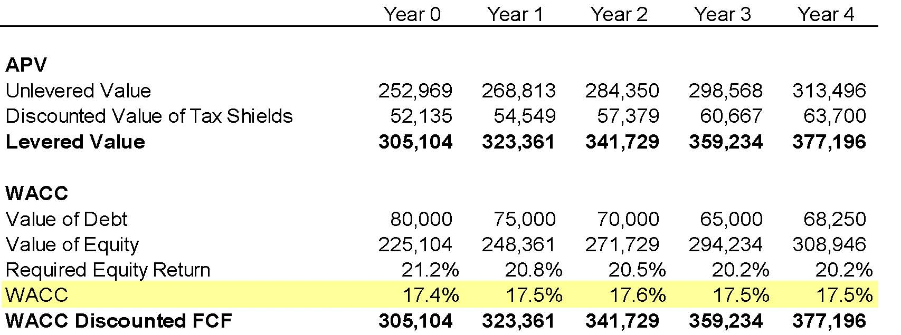

Year 0Year 1Year 2Year 3Year 4APVUnlevered Value252,969  268,813  284,350  298,568  313,496  Discounted Value of Tax Shields52,135    54,549    57,379    60,667    63,700    Levered Value305,104  323,361  341,729  359,234  377,196  WACCValue of Debt80,000    75,000    70,000    65,000    68,250    Value of Equity225,104  248,361  271,729  294,234  308,946  Required Equity Return21.2%20.8%20.5%20.2%20.2%WACC17.4%17.5%17.6%17.5%17.5%WACC Discounted FCF305,104  323,361  341,729  359,234  377,196  
