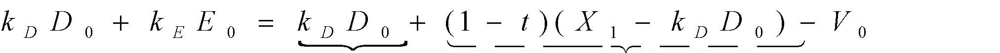

         Acrobat Distiller 6.0.1 (Windows)

         xjtu

         1

         D:20050430165454

         2005-05-01T00:56:45+08:00

         Acrobat PDFMaker 6.0 for Word

         2005-05-01T00:57:33+08:00

         2005-05-01T00:57:33+08:00

         uuid:187ee18b-d10c-4747-b34e-b2318da38d23

         uuid:3856b5fc-eced-4b3e-8326-e3806d60ff33

               3

         xml

               Part2第14部分

               xjtu

资本成本 

Katharina Lewellen 

财务理论Ⅱ 

2003年4月9日 

下来应当做什么？ 

  ■ 我们想要评估一个项目，这个项目是通过负债和权益资本来融资的 

  ■ 我们的方法： 

→ 计算项目的预期自由现金流量（FCFs） 

    → 用能够反映所有资金供给者资本机会成本的利率贴现自由现金流量  

    →考虑利息税盾 

      • 调整贴现率（WACC） 

      • 调整现金流（APV） 

复习：自由现金流量是不考虑利率的税收庇护效应（例如，如果一个项目是100%股权融资），可用来支付给所有资金供给者的现金流。 

两种方法： 

■ 加权平均资本成本（WACC）： 

  →用税后债务的成本和权益资本成本的加权平均值来贴现自由现金流 

(1)DEDEWACCKtKDEDE=−+++

■ 现值调整（APV）： 

  →评估一个全部由权益资本融资的项目 

  →将债务的税盾现值和其他作用效应加进去 

- 1、 WACC 

加权平均资本成本（WACC） 

■  第一步：自由现金流的产生 

■  第二步：用加权平均资本成本贴现自由现金流 

(1)DEDEWACCKtKDEDE=−+++

WACC—例子 

现在你要评估一个新项目。这个项目需要初始费用100百万美元，预期以后每年得到税前利润为25百万美元。边际税率为40%，项目的目标债务—价值比率为25%，项目的债务利率为7%，权益资本成本为12%。 

税后现金流＝$25*0.60=$15百万 

税后加权平均资本成本＝D/V*(1-t)*rd+E/V*re

                    =0.25*0.60*0.07+0.75*0.12=10.05% 

净现值＝-100+15/0.1005=$49.25百万 

注意！！！ 

■ 通常人们使用加权平均资本成本时的直觉是： 

  → 一个项目若要有价值，要求得到比筹集所需资金的成本，即我们所谓的加权平均资本成本，更多的收益 

  → 这种直觉是错误的。 

■ 我们经常使用加权平均资本成本法，而不是“偶然” 

■ 大部分情况，这是明显的错误： 

  → 在概念上，它的逻辑性有瑕疵 

→ 在实践中，它得出的结论远不符合理论值 

■ 我们需要理解这种理念（它的内涵远大于它的字面） 

加权平均资本成本（WACC） 

■ 复习： 贴现率与项目有关＝＝&gt; 设想有一个项目是独立的，像一个单个公司那样来筹集资金 

 ■ 如果仅为此项目负债，债务价值D（即市值）和期望收益率KD（即债务成本） 

 ■ 如果仅为此项目权益融资，权益资本价值E（即市值）和期望收益率KE（即权益资本成本） 

 ■ t是承担此项目的公司的边际税率 

为什么估算WACC？ 

■ 考虑一个一年期项目（独立）如下： 

→ 一年后预期现金流量＝X 

■ 今天（0年）项目拥有： 

→ 外部债务的市值D0 

→ 外部权益资本的市值E0 

→ 项目的总价值V0=D0+E0 

■   我们用下式可计算贴现率r： 

   V0 = 税后现金流量（如果全部是股权融资）/(1+r)=(1-t)X1/(1+r) 

  r=[(1-t)*X1-V0]/V0

为什么估算WACC？（续） 

  从0年到1年，预期价值将增加： 

{000100(1)()DEDDkDkEkDtXkDV+=+−−−144424443

                  债权人现金流      股东现金流 

KEE0+(1-t)KDD0=(1-t)X1-V0

0010000(1)(1)EDEDtXVKtKVVV−−+−=144424443

 r = 加权平均资本成本（WACC） 

杠杆比率 D/（D＋E） 

■ D/（D＋E）是所考虑的特定项目的目标资本结构（市场价值）。 

■ 常见错误1： 

→使用项目承担公司先前的D/（D＋E）比率 

■ 常见错误2： 

→使用项目融资时的D/（D＋E）比率。 

→例如：如果项目全部通过债务融资时，使用100% 

注意：我们将假定目标A＋B是把目标A和目标B相加的结果，这种假设在多数情况下都是成立的。 

杠杆比率（续） 

■ 那么，我们如何得到“目标杠杆比率”呢？ 

■ 使用项目比较法 

  →项目所在的行业是公司“明晰的主业” 

→权衡：可比较公司的数量与质量 

■如果公司承建的该项目与公司其它项目相似，那么就选用该公司作参照目标（即，这个公司是项目的可比较公司） 

■ 思考，通过核查表完善…… 

注意的重要事项： 

■ 如果项目在一段时间内一个保持相对稳定的D/V，那么加权平均资本成本在这段时间内也稳定的。 

■ 如果不是，那么加权平均资本成本应该在这段时间内相应地变化，而且，我们应该计算出每一年不同的加权平均资本成本。 

■ 实际上，公司更倾向于采用一个稳定的加权平均资本成本。 

■ 所以，实际上，在预期未来资本结构会发生相当大变化的情况下，加权平均资本成本方法常常不很奏效。 

债务资本成本：KD（续） 

- ■ 当违约率低时： 

   → 我们可以使用资本资产定价模型（CAPM）来估计KD（经验性材料表明债务贝塔值界于0.2到0.3之间） 

     → KD应该与贷方在一定资本结构下要求的利率相一致 

■ 当违约率高时： 

→我们需要用违约概率来估计预期现金流 

边际税率：t 

  ■ 它是指承担该项目的公司（或者更精确些，承建该项目的公司）的边际税率。 

  ■ 注意这个税率是决定债务税收节余的税率。 

  ■ 我们要求使用边际税率，而不是平均税率t。 

权益资本成本KE

■ 我们需要对项目进行比较来估计KE： 

  →“主业清晰”，即公司仅仅经营项目所在的行业。 

→如果承担该项目的公司本身就是同行业中的主业清晰者，就可以简单的使用这个公司的KE。 

■ 问题： 

→ 一家公司的资本结构会对KE有影响。 

→ 除非与可比较公司资本结构相同，否则我们在使用前就要计算KE。 

用CAPM估计KE

1）找出需评估项目的可比较参照公司。 

2）当目标公司的债务风险不是很高（且债务率相当稳定），通过消除可比较参照公司权益资本贝塔值βE的杠杆效应（运用D/(D+E)）来估算出其资产贝塔值βA，我们可运用： 

AE

D  

3）用目标公司的资产贝塔值βA来估算出项目的贝塔值βA（例如，用平均值） 

4）当目标公司的债务风险不是很高（且债务率相当稳定）时，在一定的资本结构假设下，通过消除估算的项目资产贝塔值βA的杠杆效应（使用项目的D/(D+E)）来估算出其权益资本贝塔值βE 

(EAA

Dβ 

- 5） 用这个估计的资产贝塔值βE来计算项目的权益资本成本kE 

KE = rf + βE×市场风险溢价 

注意事项： 

■ 公式： 

→消除杠杆效应的公式是杠杆效应公式的倒推 

→ 附录中展示了它们的推导 

■ 大多时候： 

→ 消除可比较参照公司的杠杆效应，即消除每个可比较公司的杠杆效应 

→ 利用所有可比较公司的平均资产贝塔值βA 估算一个公司的资产贝塔值βA，对其中我们偏好的公司给以更多权重 

→ 这就是我们估算的项目资产贝塔值βA 

→ 消除项目资产贝塔值βA的杠杆效应 

■ 在本课程，我们通常以稳定的D/（D＋E）比率使用该公式 

有关商业风险和财务风险的更多信息 

βA＝βEE/（E＋D） &lt;==&gt; ßE=[1+D/E]* ßA   &lt;==&gt; ßE-βA= (D/E)* ßA

■ 可比较公司之间有相似的商业风险 

＝＝&gt;相似的资产贝塔之βA和，相似的消除杠杆效应后的资本成本KA 

■ 如果可比较的公司间有不同的资本结构，那么它们的财务风险（不同的βE－βA）则不同。 

＝＝&gt;不同的权益资本贝塔值βE以及不同的权益资本目标收益KE 

■ 总体上说，权益资本贝塔值βE随着D/E的增加而增加 

→因此，权益资本成本KE随着财务杠杆的提高而提高。 

杠杆作用，收益和风险 

资产的风险由项目的类型决定，而非项目的融资方式。 

■ 杠杆变化不会影响rf或者βa 

   ■ 杠杆影响rf和βE 

AA

E            

fDEDErrrVV=+

         ↓                         ↓    

()EAADDEββββ=+−

)EADDrrrE=+−A（r

杠杆作用与β 

杠杆作用和要求的目标收益率 

债务—权益资本比 

要求的目标收益率 

商业风险和财务风险：直觉上的认识 

■ 考虑一个项目的资产贝塔值βA&gt;0 

■ 它的现金流量可以被分解为： 

→安全的现金流量 

→完全与市场相关的风险现金流量 

■ 随着债务水平的提高（但留有一定安全性）： 

→很大一部分的安全现金流量流向了债务持有者； 

→流向权益资本持有者的剩余现金流量与市场日益相关。 

注释：如果现金流量与市场负相关（βA&lt;0），不断增加的债务会使权益资本与市场负相关，也会降低权益资本要求的目标收益。 

通用电气的WACC 

■ 假定rf=6% 

■ 我们可以得到GE的βE=1.10，这表明 

               kE=6%+1.10*8%=14.8% 

■ kD=7.5% 

■ D/(D+E)= 0.06 

■ t=35% 

             WACC= 0.06*7.5%*(1-35%)+ 0.094*14.8%= 14.2% 

通用电气何时可以在现金流量贴现(DCF)中使用WACC？ 

■ 一个正在考虑中的项目何时会同公司其它项目一样拥有类似的基础风险（也就是说，何时公司可作为该项目较好的可比较参照） 

■ 而且，这个项目同公司其它项目的融资方式一样。 

→ 例如，如果通用电气打算扩展所有业务规模，那么它就应该使用自己的WACC。 

→ 但是，如果它计划扩展的仅仅涉及多个不同行业中的一个，WACC就不是合适的资本成本。 

●在那个案例中：寻找公众公司作为可比较参照，对它们进行杠杆效应和消除杠杆效应估算。 

重要提示： 

● 资本成本是一种投资属性，而不是公司属性 

● 几乎没有一家公司可以把一个单一的WACC用于其所有的业务。 

  通用电气所涉及的行业： 

→ 金融服务业 

→ 动力系统 

→ 航天发动机 

→ 工业 

→ 塑料加工 

→ 技术产品 

→ 电器 

→ 广播 

公司如何运用加权平均资本成本： 

他们是这样来计算加权平均资本成本的： 

■ 公司当前的债务成本KD 

■ 公司当前拥有的资本结构D/(D+E) 

■ 公司当前拥有的资本权益成本KE 

■ 它们所面临的边际税率 

它们贴现所有未来的自由现金流量： 

  ■ 单一贴现率 

  ■ 可调整的因素（例如，项目的“战略价值”） 

选择行业的资本结构、β与加权平均资本成本 

<Table>

<TR>
<TD>

行业 

</TD>
<TD>

负债率(%) 

</TD>
<TD>

权益资本β 

</TD>
<TD>

资产β 

</TD>
<TD>

加权平均资本成本(%) 

</TD>
</TR>
<TR>
<TD>

电力与燃气 

</TD>
<TD>

43.2 

</TD>
<TD>

0.58 

</TD>
<TD>

0.33 

</TD>
<TD>

8.1% 

</TD>
</TR>
<TR>
<TD>

食品生产 

</TD>
<TD>

22.90 

</TD>
<TD>

0.85 

</TD>
<TD>

0.66 

</TD>
<TD>

11.0% 

</TD>
</TR>
<TR>
<TD>

造纸与塑料 

</TD>
<TD>

30.40 

</TD>
<TD>

1.03 

</TD>
<TD>

0.72 

</TD>
<TD>

11.4% 

</TD>
</TR>
<TR>
<TD>

设备 

</TD>
<TD>

19.10 

</TD>
<TD>

1.02 

</TD>
<TD>

0.83 

</TD>
<TD>

12.4% 

</TD>
</TR>
<TR>
<TD>

零售 

</TD>
<TD>

21.70 

</TD>
<TD>

1.19 

</TD>
<TD>

0.93 

</TD>
<TD>

13.2% 

</TD>
</TR>
<TR>
<TD>

化工 

</TD>
<TD>

17.30 

</TD>
<TD>

1.34 

</TD>
<TD>

1.11 

</TD>
<TD>

14.7% 

</TD>
</TR>
<TR>
<TD>

计算机软件 

</TD>
<TD>

3.50 

</TD>
<TD>

1.33 

</TD>
<TD>

1.28 

</TD>
<TD>

16.2% 

</TD>
</TR>
<TR>
<TD>

</TD>
<TD>

</TD>
<TD>

</TD>
<TD>

</TD>
<TD>

</TD>
</TR>
<TR>
<TD>

所有行业平均 

</TD>
<TD>

21.50 

</TD>
<TD>

1.04 

</TD>
<TD>

0.82 

</TD>
<TD>

12.3% 

</TD>
</TR>
<TR>
<TD>

</TD>
<TD>

</TD>
<TD>

</TD>
<TD>

</TD>
<TD>

</TD>
</TR>
<TR>
<TD>

假定：无风险利率6%市场风险溢价8%；债务成本7.5%；税率35% 

</TD>
</TR>

</Table>

关于MM理论： 

   没有税收，加权平均资本成本独立于杠杆作用。 

加权平均资本成本谬论（回顾） 

■ 债务资本成本低于权益资本成本（正确）。 

■ 这是否意味着项目应该依靠债务来融资？ 

DEDEWACCKKDEDE=++++

- ■ 不，加权平均资本成本是自变量 

■ 如果你选择了便宜的债务，你增加了权益资本的成本（它的财务风险增加了）。 

有税收，WACC随着财务杠杆增加而下降 

2、现值调整(APV) 

现值调整 

■ 从资产价值评估中区分财务结构对价值的作用 

■ 第一步：如果项目或者公司是 100%股权融资，评估其价值。 

■ 第二步：将债务的税盾价值考虑进去。 

注意： 

■ 这种方法简单地把MM理论应用于税收 

■ 现值调整（APV）＝各部分价值评估＝净现值调整ANPV 

第一步:100%股权融资公司（项目）的价值评估 

■ 现金流量：自由现金流量的确是你所需要的。 

■ 如果公司是100％股权融资，那么你需要的就是可以恰好贴现其现金流的利率。 

■ 如果公司是100%股权融资，那么这个利率是权益资本的预期收益率。 

■ 为了得出它，你需要： 

  →找出可比较公司，即有同一业务的公众公司。 

→如果它们都是100%股权融资，估算它们的预期收益率。 

第一步：100%股权融资公司（项目）的价值（续） 

■ 使用适当的杠杆公式消除每一个可比较公司的权益资本贝塔值βA的杠杆效应，以估算其资产贝塔值βA（例如平均）。 

AEDEDVVβββ=+

■ 使用可比较公司的资产贝塔值βA来估计项目的资产贝塔值βA（例如平均）。 

■ 使用评估的资产贝塔值βA来计算全部权益资本的成本KA 

KA=rF+βA*市场风险溢价 

■ 用KA来贴现项目的自由现金流量 

例子： 

■ Johnson 和Johnson 业务经营涵盖了以下行业：制药业、消费品和医疗器械。 

■ 为了估计医疗器械业务的全部权益资本的成本，我们需要一个有可比较参照公司，也就是，在医疗器械行业主业清晰（确实有几个这样的公司）。 

■ 波士顿科学公司的数据： 

    →权益资本贝塔值β=0.98 

→负债=$13亿 

→权益资本=$91亿 

例子（续） 

■  计算波士顿科学公司的资产贝塔值β： 

9.10.980.869.11.3AEEEDββ===++

■  将该值作为我们估算的医疗器械行业的资产贝塔值β 

■  使用CAPM来计算该行业的全部权益资本成本（假定无风险利率6%，市场风险溢价8%）： 

KA=6%+ .86*8%=12.9% 

第二步：增加现值（债务税盾） 

■ 现金流量：预期的税收节余是tKDD，其中KD是债务资本成本（前面讨论过）。 

■ 如果预期D是稳定的，那么用KD来贴现tKDD 

            PVTS＝tKDD/KD＝tD 

■ 如果预期D/V是稳定的，那么用KA来贴现tKDD 

            PVTS＝tKDD/KA 

■ 直觉： 

→ 如果D/V是稳定的，那么D（tKDD会随着V而上下变动 

     → tKDD的风险类似于公司资产的风险：使用KA 

第二步：增加现值（续） 

■ 对许多项目而言，D和D/V并不像预期的那样稳定。 

■ 例如，预期杠杆收购债务水平下降。 

■ 一般地，你可以使用这些变量来估算债务水平： 

   → 支付计划（如果能得到） 

→ 财务预测， 

用界于KD，KA之间的贴现率折现。 

拓展APV方法 

■  APV方法的一个优点是容易拓展开来考虑更多的财务影响。 

■  例如，你可以将某一利率补贴单独地作为利息结余现值进行评估 

现值调整（APV）=NPV(所有权益资本)+PV(税盾)+PV(其它原材料) 

加权平均资本成本与现值调整 

加权平均资本成本的优点：使用广泛 

■只需要少量计算（这在无计算机时代很重要）。 

■更多使用文字表述，易于理解和解释（？） 

加权平均资本成本缺点： 

■将资产和负债的影响相混合。债务影响的误差/近似值影响了整个评估。 

■不易变通：如果债务有风险，加权平均资本成本又如何估算？混合性证券的成本是什么（可转换债）？财务的其他影响（如，财务困境成本）？非稳定的负债率？个人所得税？ 

注释：对非稳定的债务比率，每年可使用（见附录）不同的加权平均资本成本，但这么做很繁琐，而且影响了评估效果。 

加权平均资本成本与现值调整（续） 

现值调整的优点： 

  ■ 没有混淆概念。 

  ■ 更清晰：更易于捕捉价值的来源。 

  ■ 更富灵活性：仅仅把一部分影响作为独立因素考虑 

现值调整的缺点： 

■ 几乎没有人使用。 

总括： 

  ■ 对于复杂的、多变的或者杠杆比率高的的财务结构（例如杠杆收购），使用现值调整（APV）法会更好一些。 

  ■ 否则，你选择何种方法都无大碍。 

附  录 

附录：A: 负债率D/V不变时消除杠杆效应的计算公式 

·考虑一个永恒预期现金流为X的公司 

·资本结构：债务价值D与权益资本价值E 

E+D=V全部权益资本 + PVTS 

·根据定义，全部权益资本的资金成本KA即为合适的用于贴现项目自由现金流FCF的比率，（1-t）X 

·而且，由于公司的负债率D/V不变,PVTS=tDKD/KA 

(1)DAAtKDtXEDKK−+=+

   或   

(1)DAtXtKDKED−+=+

附录：A:负债率D/V不变时消除杠杆效应的计算公式（续） 

·债权人与权益资本所有者每年（预期的）现金流 

如果100%股权融资，  债务每年的    债务预期       权益资本预 

预期的税后现金流      税盾         的支付          期的支付 

（1－t）X    ＋    tkDD      =   kDD      ＋       kEE 

·消去X，我们得到：

ADEDEKKKEDED=+++

·转化为贝塔（全部存在线形关系）收益形式：

ADEDEEDE

D 

因而，若βD

≈

0,我们得到 

AEEEDββ=+

附录B：债务水平D不变时消除杠杆效应的计算公式 

·考虑一个永恒预期现金流为X的公司 

·资本结构：债务价值D与权益资本价值E 

E+D=V全部权益资本 + PVTS 

·由于公司的负债价值D长期不变,PVTS=tD 

(1)AtXEDtDK−+=+

  或 

(1)(1)AtXKEDt−=+−

附录B：债务水平D不变时消除杠杆效应的计算公式（续） 

·债权人与权益资本所有者每年（预期的）现金流 

如果100%股权融资，  债务每年的    债务预期       权益资本预 

预期的税后现金流      税盾         的支付          期的支付 

（1－t）X    ＋    tkDD      =   kDD      ＋       kEE 

·两边同时除以（D+E），我们得到（参看上面KA的公式） 

(1)(1)(1)ADEDtEKKKRDtEDt−=++−+−

·转化为贝塔收益形式：

(1)(1)(1)ADEDtEEDtEDtβββ−=++−+

− 

因而，若βD

≈

0,我们得到

(1)AEEEDtββ=+−

附录C:  加权平均资本成本（WACC）与现值调整（APV）：例子 

举例的目的： 

·了解APV与WACC的运用 

·结果显示,如果正确运用,APV与WACC给出同一结果 

·在财务杠杆变化的环境下，正确运用WACC 

·让你确信APV更有效 

加权平均资本成本（WACC）与现值调整（APV）：例子（续） 

Anttoz公司，财富500强之一的设备公司，正计划在新奥尔良开设一家新的工厂，它的现金流显示在下一个幻灯片： 

·该新工厂需要的初始投资为$7500万,以PPE表示。加上1000万$的营运资本注入（等于第一年规模的8%） 

·在第一年的经营活动中，销售目标为$1.25亿。随后两年的销售规模要增长10%，并在接下来的年份中以5%的速度稳定地增长 

·Anttoz公司的财务分析委员会估算现金成本（GOGS,GS&amp;A支付，等）将占到收入的50% 

·追加的固定资产（PPE）投资等于每年的折旧，最初的追加投资为初始投资$7500万的10%，以后则随着销售收入的增加而增加。 

·该公司计划将营运资本维持在下一年目标销售收入的8% 

加权平均资本成本（WACC）与现值调整（APV）：例子 (续) 

·Anttoz设备公司，总税率为35%，未来三年自由现金流（FCF）将达$4500万，并在随后的年份每年增长5% 

·项目资产要求的目标收益率KA为20% 

·该项目的初始银行贷款为$8000万，营运一年后用资本金偿还$500万，到第三年末，使未偿付债务降为$6500万 

·从第一次还款开始，该项目的负债能力将每年增长5%，与预期的营运现金流增长相一致。由于公司早期有较高的财务杠杆，负债比率开始时为10%，一旦达到一个稳定的资本结构（三年后），负债比率就下降到8%。 

加权平均资本成本（WACC）与现值调整（APV）：例子（续） 

<Table>

<TR>
<TD>

第0年     第1年    第二年     第三年    第四年 

</TD>
</TR>
<TR>
<TD>

销售收入 

</TD>
<TD>

</TD>
<TD>

12500

</TD>
<TD>

13750

</TD>
<TD>

15125

</TD>
<TD>

15881

</TD>
</TR>
<TR>
<TD>

现金成本 

</TD>
<TD>

</TD>
<TD>

62500 

</TD>
<TD>

68750

</TD>
<TD>

75625 

</TD>
<TD>

79406 

</TD>
</TR>
<TR>
<TD>

折旧 

</TD>
<TD>

</TD>
<TD>

7500 

</TD>
<TD>

8250 

</TD>
<TD>

9075 

</TD>
<TD>

9529 

</TD>
</TR>
<TR>
<TD>

息税前利润（EBIT） 

</TD>
<TD>

</TD>
<TD>

55000 

</TD>
<TD>

60500 

</TD>
<TD>

66550 

</TD>
<TD>

69878 

</TD>
</TR>
<TR>
<TD>

公司税 

</TD>
<TD>

</TD>
<TD>

19250 

</TD>
<TD>

21175 

</TD>
<TD>

23293 

</TD>
<TD>

24457 

</TD>
</TR>
<TR>
<TD>

息税前后利润  

</TD>
<TD>

</TD>
<TD>

35750 

</TD>
<TD>

39325 

</TD>
<TD>

43258 

</TD>
<TD>

45420 

</TD>
</TR>
<TR>
<TD>

+折旧 

</TD>
<TD>

</TD>
<TD>

7500 

</TD>
<TD>

8250 

</TD>
<TD>

9075 

</TD>
<TD>

9529 

</TD>
</TR>
<TR>
<TD>

总现金流 

</TD>
<TD>

</TD>
<TD>

43250

</TD>
<TD>

47575 

</TD>
<TD>

52333 

</TD>
<TD>

54949 

</TD>
</TR>
<TR>
<TD>

固定资产投资 

</TD>
<TD>

</TD>
<TD>

</TD>
<TD>

</TD>
<TD>

</TD>
<TD>

</TD>
</TR>
<TR>
<TD>

75000 

</TD>
<TD>

7500 

</TD>
<TD>

8250 

</TD>
<TD>

9075 

</TD>
<TD>

9529 

</TD>
</TR>
<TR>
<TD>

净营运资本 

</TD>
<TD>

10000 

</TD>
<TD>

1000 

</TD>
<TD>

1100 

</TD>
<TD>

605 

</TD>
<TD>

635 

</TD>
</TR>
<TR>
<TD>

消除杠杆效应的自由现金

</TD>
<TD>

（85000）

</TD>
<TD>

34750 

</TD>
<TD>

38225 

</TD>
<TD>

42653 

</TD>
<TD>

44785 

</TD>
</TR>
<TR>
<TD>

债务水平 

</TD>
<TD>

80000 

</TD>
<TD>

75000 

</TD>
<TD>

70000 

</TD>
<TD>

65000 

</TD>
<TD>

68250 

</TD>
</TR>

</Table>

加权平均资本成本（WACC）与现值调整（APV）：例子 (续) 

<Table>

<TR>
<TD>

第0年     第1年     第二年      第三年     第四年 

</TD>
</TR>
<TR>
<TD>

APV 

</TD>
<TD>

</TD>
</TR>
<TR>
<TD>

消除杠杆效应的自由现金流 

</TD>
<TD>

(85000) 

</TD>
<TD>

34750 

</TD>
<TD>

38225 

</TD>
<TD>

42653 

</TD>
<TD>

44785 

</TD>
</TR>
<TR>
<TD>

消除杠杆效应的价值 

</TD>
<TD>

252969 

</TD>
<TD>

268813 

</TD>
<TD>

284350 

</TD>
<TD>

298568 

</TD>
<TD>

313496 

</TD>
</TR>
<TR>
<TD>

利息税盾 

</TD>
<TD>

</TD>
<TD>

2800 

</TD>
<TD>

2625 

</TD>
<TD>

2450 

</TD>
<TD>

1820 

</TD>
</TR>
<TR>
<TD>

TS的贴现值 

</TD>
<TD>

52135 

</TD>
<TD>

54549 

</TD>
<TD>

57379 

</TD>
<TD>

60667 

</TD>
<TD>

63700 

</TD>
</TR>
<TR>
<TD>

杠杆效应价值 

</TD>
<TD>

305104 

</TD>
<TD>

323361 

</TD>
<TD>

341729 

</TD>
<TD>

359234 

</TD>
<TD>

377196 

</TD>
</TR>

</Table>

加权平均资本成本（WACC）与现值调整（APV）：例子（续) 

<Table>

<TR>
<TD>

第0年     第1年        第二年     第三年    第四年 

</TD>
</TR>
<TR>
<TD>

APV 

</TD>
<TD>

</TD>
</TR>
<TR>
<TD>

消除杠杆效应的价值 

</TD>
<TD>

252969 

</TD>
<TD>

268813 

</TD>
<TD>

284350 

</TD>
<TD>

298568 

</TD>
<TD>

313496 

</TD>
</TR>
<TR>
<TD>

税盾的贴现值 

</TD>
<TD>

52135 

</TD>
<TD>

54549  

</TD>
<TD>

57379 

</TD>
<TD>

60667 

</TD>
<TD>

637000 

</TD>
</TR>
<TR>
<TD>

杠杆效益价值 

</TD>
<TD>

305104 

</TD>
<TD>

323361 

</TD>
<TD>

341729 

</TD>
<TD>

359234 

</TD>
<TD>

377196 

</TD>
</TR>
<TR>
<TD>

WACC 

</TD>
<TD>

</TD>
<TD>

</TD>
<TD>

</TD>
<TD>

</TD>
<TD>

</TD>
</TR>
<TR>
<TD>

债务价值 

</TD>
<TD>

80000 

</TD>
<TD>

75000 

</TD>
<TD>

70000 

</TD>
<TD>

65000 

</TD>
<TD>

68250 

</TD>
</TR>
<TR>
<TD>

权益资本价值 

</TD>
<TD>

225104 

</TD>
<TD>

248361 

</TD>
<TD>

271729 

</TD>
<TD>

294234 

</TD>
<TD>

308946 

</TD>
</TR>
<TR>
<TD>

权益资本要求的目标收益 

</TD>
<TD>

21.% 

</TD>
<TD>

20.8% 

</TD>
<TD>

20.5% 

</TD>
<TD>

20.2% 

</TD>
<TD>

20.2% 

</TD>
</TR>
<TR>
<TD>

WACC 

</TD>
<TD>

17.4% 

</TD>
<TD>

17.5% 

</TD>
<TD>

17.6% 

</TD>
<TD>

17.5% 

</TD>
<TD>

17.5% 

</TD>
</TR>
<TR>
<TD>

资本加权平均成本贴现自由现金流 

</TD>
<TD>

305104 

</TD>
<TD>

323361 

</TD>
<TD>

341729 

</TD>
<TD>

359234 

</TD>
<TD>

377196 

</TD>
</TR>

</Table>
