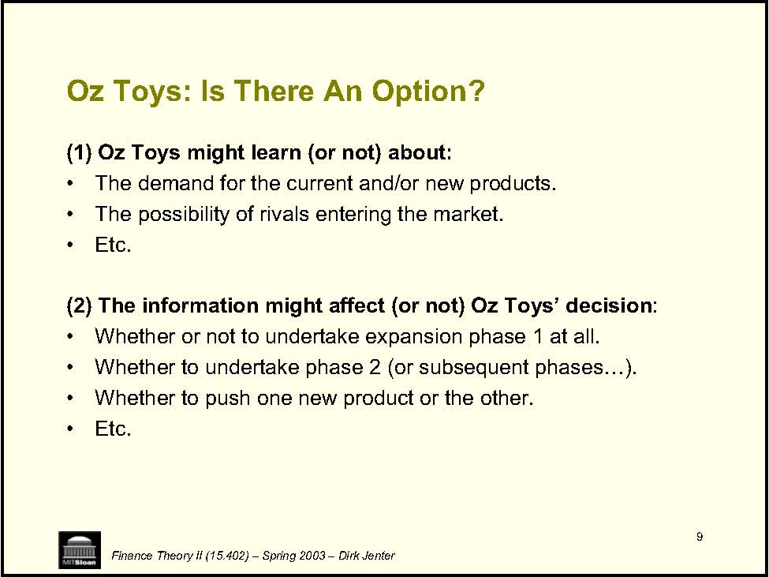

         Acrobat Distiller 6.0 (Windows)

         2004-01-21T10:35:52+05:30

         2004-01-21T10:37:55+05:30

         2004-01-21T10:37:55+05:30

         PScript5.dll Version 5.2

         uuid:547c52a0-3c81-4c51-8b6e-0fbd183c03f6

         uuid:5d3636f7-de91-41b5-8d8c-b6400f269e47

         xml

               djenter

               Microsoft PowerPoint - LN19(Options).ppt

Real Options Finance Theory II (15.402) – Spring 2003 – Dirk Jenter 

2 • • • • • • • • • • • • • Finance Theory II (15.402) – Spring 2003 – Dirk Jenter The Big Picture: Part II -Valuation A. Valuation: Free Cash Flow and Risk April 1 Lecture: Valuation of Free Cash Flows April 3 Case: Ameritrade B. Valuation: WACC and APV April 8 Lecture: WACC and APV 1 April 10 Lecture: WACC and APV 2 April 15 Case: Dixon Corporation 1 April 17 Case: Dixon Corporation 2 April 24 Case: Diamond Chemicals C. Project and Company Valuation April 29 Lecture: Real Options May 1 Case: MW Petroleum Corporation May 6 Lecture: Valuing a Company May 8 Case: Cooper Industries, Inc. May 13 Case: The Southland Corporation 

3 Real Options: Valuing Flexibility • • • Example: • Ÿ Finance Theory II (15.402) – Spring 2003 – Dirk Jenter The “Real Options Approach” assess the value of managerial flexibility in responding to new information. Managers have many options to adapt and revise decisions in response to new and unexpected developments. Such flexibility is clearly valuable and should be accounted for in the valuation of a project or firm. Often, managers can expand or contract production in response to changes in demand. The firm would be less valuable if they had to choose a fixed production level before knowing the level of demand. 

4 • • • Valuation • • • Finance Theory II (15.402) – Spring 2003 – Dirk Jenter Two Steps in Real Options Analysis: Identification Are there real options imbedded in a given project? What type of options? Are they important? How do we value the (important) options? How do we value different types of options? Why can’t we just use NPV? 

Finance Theory II (15.402) – Spring 2003 – Dirk Jenter Step 1: Identifying Real Options 

6 • • • →→• Finance Theory II (15.402) – Spring 2003 – Dirk Jenter Identifying Real Options It is important to identify the options imbedded in a project. There are options imbedded in all but the most trivial projects. The most crucial skill consists of: Identifying those options that are “significant”, if any. Ignoring those that are not. Identifying real options takes practice, and sometimes “vision”. 

# Example: Oz Toys’ Expansion Program 

- Oz Toys’ management is considering building a new plant to exploit innovations in process technology. 

- About three years out, the plant’s capacity may be expanded to allow Oz Toys’ entry into a new market. 

<Table>
<TR>
<TH>Oz Toys' Initial Calculations for Phased Expansion Program </TH>

</TR>
<TR>

<TD>2000 </TD>
<TD>2001 </TD>
<TD>2002 </TD>
<TD>2003 </TD>
<TD>2004 </TD>

<TD>2005 </TD>
<TD>2006 </TD>
</TR>
<TR>
<TH>EBIT * (1 -t) </TH>

<TD>2.2 </TD>
<TD>4.0 </TD>
<TD>-10.0 </TD>
<TD>11.5 </TD>

<TD>13.7 </TD>
<TD>17.4 </TD>
</TR>
<TR>
<TH>Depreciation </TH>

<TD>19.0 </TD>
<TD>21.0 </TD>
<TD>21.0 </TD>
<TD>46.3 </TD>

<TD>48.1 </TD>
<TD>50.0 </TD>
</TR>
<TR>
<TH>CAPX </TH>
<TD>120.0 </TD>
<TD>8.1 </TD>
<TD>9.5 </TD>
<TD>307.0 </TD>
<TD>16.0 </TD>

<TD>16.3 </TD>
<TD>17.0 </TD>
</TR>
<TR>
<TH>∆NWC </TH>
<TD>25.0 </TD>
<TD>4.1 </TD>
<TD>5.5 </TD>
<TD>75.0 </TD>
<TD>7.1 </TD>

<TD>8.0 </TD>
<TD>9.7 </TD>
</TR>
<TR>
<TH>FCF </TH>
<TD>-145.0 </TD>
<TD>9.0 </TD>
<TD>10.0 </TD>
<TD>-371.0 </TD>
<TD>34.7 </TD>

<TD>37.5 </TD>
<TD>40.7 </TD>
</TR>
<TR>
<TH>TV (5% growing perpetuity) </TH>

<TD>610.5 </TD>
</TR>
<TR>
<TH>NPV (at 12% WACC) </TH>
<TD>-19.8 </TD>

</TR>
</Table>

Finance Theory II (15.402) – Spring 2003 – Dirk Jenter 

8 Is There An Option? • • • • • information? Finance Theory II (15.402) – Spring 2003 – Dirk Jenter Two conditions: (1) News will probably arrive in the future. (2) When it arrives, the news may affect decisions. Identify the uncertainty that managers face: What is the main thing that managers will learn over time? How will they exploit the new information? What decisions will change as a function of the new 

9 • • : • • • Finance Theory II (15.402) – Spring 2003 – Dirk Jenter Oz Toys: Is There An Option? (1) Oz Toys might learn (or not) about: The demand for the current and/or new products. The possibility of rivals entering the market. •Etc. (2) The information might affect (or not) Oz Toys’ decisionWhether or not to undertake expansion phase 1 at all. Whether to undertake phase 2 (or subsequent phases…). Whether to push one new product or the other. •Etc. 

10 • • • →→→→Timing option →Finance Theory II (15.402) – Spring 2003 – Dirk Jenter Identifying Real Options (cont.) Look for clues in the project’s description: “Phases”, “Strategic investment”, “Scenarios”, … Examine the pattern of cash flows and expenditures over time. For instance, large expenditures are likely to be discretionary. Taxonomy of frequently encountered options : Growth option Abandonment option Option to expand or contract scale Option to switch (inputs, outputs, processes, etc.) 

11 • information. • • →R&amp;D Î →Î Sequel. Finance Theory II (15.402) – Spring 2003 – Dirk Jenter Growth Options An investment includes a growth option if it allows to undertake a follow on investment, and the decision whether to undertake the follow-on investment will be made later on the basis of new When valuing such an investment, one should (also) take the value of the growth option into account. Such projects are often presented as having “strategic value”. •Examples: Developing applications if R&amp;D is successful. Movie Production 

12 Growth Options (cont.) • • →Rocky 1 Î Rocky 2 Î Î … • →→j→Finance Theory II (15.402) – Spring 2003 – Dirk Jenter Growth options are akin to Call options: You have the option, not the obligation, to get something by incurring a cost. Growth options can be “nested”, i.e., series of related choices: Rocky 3 Growth options can be very valuable and account for over half of the market value of some industries. industries with heavy R&amp;D. industries with multiple proect generations (e.g. computers, pharmaceuticals). Industries with multinational operations. 

13 Abandonment Options: • • • Finance Theory II (15.402) – Spring 2003 – Dirk Jenter The Option to Shut-down An investment includes an abandonment option if, under certain circumstances, it may be preferable to shut down current operations permanently and realize the resale value of capital equipment and other assets in secondhand markets. Sometimes, abandonment options are hidden in aggregated forecasts: While it may be preferable to continue operations on average, shutting down may be better under some scenarios. Abandonment options are akin to Put options: You have the option (but no obligation) to get rid of something and receive a payment (the liquidation value). 

14 Option to Expand or Contract Scale • utilization. • • →→Finance Theory II (15.402) – Spring 2003 – Dirk Jenter If conditions are more favorable than expected, the firm can expand the scale of production or accelerate resource If conditions are less favorable than expected, the firm can contract the scale of operations. In extreme cases, production can temporarily halt and start again. Similar to growth and abandonment options. •Examples: Ability to slow the rate of mineral extraction from a mine. Ability to add a temporary third shift at a factory. 

15 Timing Options: Option to accelerate or decelerate projects • • • • Finance Theory II (15.402) – Spring 2003 – Dirk Jenter Retaining some flexibility about the timing of an investment (possibly including “never”) can be very valuable. Example: A patent’s value should account for the timing option, i.e., when buying the patent, you are buying the right to use it whenever you want (during the patent’s lifetime). Akin to an American call option: You have the option (but not the obligation) to get something at any time by paying a cost. Note: Only those investment timing problems for which relevant information is likely to arrive involve “option value”. 

16 • • • →→→Finance Theory II (15.402) – Spring 2003 – Dirk Jenter Time to Build Options (Staged Investment) Staging investment as a series of outlays creates the option to abandon the enterprise in midstream if new information is unfavorable. Each stage can be viewed as a call option on the value of subsequent stages, and valued as a compound option. Important in: all R&amp;D intensive industries, especially pharmaceuticals; long-development capital-intensive projects, e.g., large-scale construction or energy-generating plants; start-up ventures. 

<Table>
<TR>
<TH>Summary of Real Option Examples </TH>
</TR>
<TR>
<TH>Category Description Important in: Option to Defer Management has opportunity to wait to invest, and can see if markets warrant further investment. Natural resources extraction, real estate, farming, technology. Staged Investment Staging investment creates the option to reevaluate and/or abandon at each stage. R&amp;D intensive industries, energy generation, start-up ventures. Option to alter operating scale If market conditions change, the firm can expand/contract or temporarily shut down. Natural resources, fashion, real estate, consumer goods. Option to abandon If market conditions decline, management sells off assets Capital-intensive industries, new product introductions in uncertain markets. Option to switch If prices or demand change, management can change product mix (product flexibility) or switch inputs (process flexibility) Companies in volatile markets with shifting preferences, energy companies Growth options An early investment opens up future growth opportunities in the form of new products or processes, access to markets, or strengthening of core capabilities High tech; industries with multiple product generations (drug companies, computers, strategic acquisitions). Multiple Interacting Options Projects involve a collection of various options—both put and call types.  Values can differ from the sum of separate option values because they interact. Many of the industries discussed above </TH>
</TR>
<TR>
<TH>17 Finance Theory II (15.402) – Spring 2003 – Dirk Jenter </TH>
</TR>
</Table>

18 • →→• Ÿ 0 50 200 250 300 350 2002 2004 2006 0 Finance Theory II (15.402) – Spring 2003 – Dirk Jenter Oz Toys: Identifying the Option Project’s description refers to two distinct phases Phase 1: New plant Phase 2: Expansion Spike in spending: Probably discretionary Most likely an imbedded growth option! 100 150 2000 2001 2003 2005 CAPX Change in NWC FCF -400 -300 -200 -100 100 2000 2001 2002 2003 2004 2005 2006 FCF 

19 Practical Issue: Need for Simplifications • →→• →→→(especially others involved in the decision process). Finance Theory II (15.402) – Spring 2003 – Dirk Jenter Real projects, especially long-horizon ones, are complex: They often combine assets-in-place and options. Options are often nested. Simplifying assumptions are needed: To allow the technical valuation analysis. To keep the model flexible. To keep the model understandable to you and others 

20 Practical Issue: Simplifications (cont.) • • • →Examples: • • • Finance Theory II (15.402) – Spring 2003 – Dirk Jenter What should you do? Cut the project into pieces corresponding to simple options. Search for the primary uncertainty that managers face. A simplified model that dominates (is dominated by) the project gives an upper (a lower) bound for the project’s value. Using European rather than American options. Ignoring some of the options. Ignoring some adverse effects of waiting (e.g. possible entry). 

21 • • →• →→Finance Theory II (15.402) – Spring 2003 – Dirk Jenter Oz Toys: Possible simplifications Value phase 1 and phase 2 separately. Focus on the option to undertake expansion phase 2 or not. Assume all other options are “negligible”. Assume that phase 2 is to be undertaken in 2003 or never. Value as a European Call option. Make simplifying assumptions about the distribution of the project’s value. 

Step 2: Valuing Real Options Finance Theory II (15.402) – Spring 2003 – Dirk Jenter 

23 Valuation of Real Options • →• →• Finance Theory II (15.402) – Spring 2003 – Dirk Jenter The tools developed to value financial options (i.e. calls and puts on stocks and other financial assets) can be useful to estimate the value of real options embedded in some projects. Black-Scholes is often used to value real options. PROBLEM: Real options are much more complex than financial options. Need to simplify them to fit them into the valuation models for financial options. Similar to DCF analysis, the aim is to develop numerical techniques to “keep score” and assist in the decision-making process, not to replace sound business sense. 

24 • • • →the investment. →in the future). Finance Theory II (15.402) – Spring 2003 – Dirk Jenter Start with DCF Analysis: Begin by valuing the project as if there was no option involved, i.e., as if all decisions had to be taken immediately. This benchmark constitute a lower bound for the project’s value. Then introduce flexibility / optionality into the decision making process: NPV&lt;0 does not mean that you will never want to undertake NPV&gt;0 does not mean that you should go ahead immediately with the invest (nor that you will definitely invest 

25 • phases. • →→• analysis. Finance Theory II (15.402) – Spring 2003 – Dirk Jenter Oz Toys: DCF Analysis We need to disentangle the cash flows from the two This requires making judgments about: Which expenses are discretionary vs. non-discretionary, i.e. which decisions need to be made today and which can be made in the future, after new information has arrived. Which cash inflows/outflows are associated with each phase Note: Sometimes it is possible to simply retrieve the disaggregated data used to construct the summary DCF 

26 TV Finance Theory II (15.402) – Spring 2003 – Dirk Jenter 2000 2001 2002 2003 2004 2005 2006 Phase 1 Cash flow 9.0 10.0 11.0 11.6 12.1 12.7 Investment 145.0 TV (5% growing perpetuity) 191.0 NPV (at 12% WACC) -3.7 Phase 2 Cash flow 23.2 25.4 28.0 Investment 382.0 TV (5% growing perpetuity) 419.5 NPV (at 12% WACC) -16.1 Total Cash flow 9.0 10.0 11.0 34.7 37.5 40.7 Investment 145.0 382.0 610.5 NPV (at 12% WACC) -19.8 DCF Analysis of Phases 1 and 2 Separating Phases 1 and 2 

27 • • →→5.5%? 2003 2006 Finance Theory II (15.402) – Spring 2003 – Dirk Jenter Oz Toys: DCF Analysis (cont.) Both phases have negative NPV. Phase 2’s NPV is probably largely overstated: Investment ($382M) is likely to be less risky than cash flows. Should probably be using the three-year risk-free rate of 2000 2001 2002 2004 2005 Phase 2 Cash flow 23.2 25.4 28.0 Investment 382.0 TV (5% growing perpetuity) 419.5 NPV -69.5 DCF Analysis of Phase 2 Discounting the Investment at 5.5% 

28 Valuing the Option: • ™ • j• Finance Theory II (15.402) – Spring 2003 – Dirk Jenter First we recognize the option: Phase 2 will only be undertaken if it is positive NPV at the time the decision will be made. The strategy is to map the embedded option in our proect into a simple financial option and use financial valuation tools to price the option: Black-Scholes formula. Oftentimes, this involves making somewhat heroic assumptions about the project! 

29 Black-Scholes formula: • 12d1 σTσTd2 = d1 -(σT) σFinance Theory II (15.402) – Spring 2003 – Dirk Jenter The Black-Scholes formula Option value = N(d) * S – N(d) * PV(X) N(d): Cumulative normal probability density function = ln[S/PV(X)] / (1/2) + (1/2)/2 1/2S = Current stock price X = Exercise price r = Risk-free interest rate T = Time to maturity in years. = Standard deviation of stock return Question: What inputs do we need? 

# Mapping: Project Æ Call Option

<Table>
<TR>
<TH>Project </TH>

<TH>Call Option </TH>
</TR>
<TR>
<TD>Expenditure required to acquire the assets </TD>
<TD>X </TD>
<TD>Exercise price </TD>
</TR>
<TR>
<TD>Value of the operating assets to be acquired </TD>
<TD>S </TD>
<TD>Stock price (price of the underlying asset) </TD>
</TR>
<TR>
<TD>Length of time the decision may be deferred </TD>
<TD>T </TD>
<TD>Time to expiration </TD>
</TR>
<TR>
<TD>Riskiness of the operating assets </TD>
<TD>σ2 </TD>
<TD>Variance of stock return </TD>
</TR>
<TR>
<TD>Time value of money </TD>
<TD>r </TD>
<TD>Risk-free rate of return </TD>
</TR>
</Table>

Finance Theory II (15.402) – Spring 2003 – Dirk Jenter 

# Oz Toys: The 5 Variables

<Table>
<TR>
<TD>X </TD>
<TD>Investment needed in 2003 to obtain the phase 2 assets. </TD>
<TD>$382M </TD>
</TR>
<TR>
<TD>S </TD>
<TD>PV of phase 2’s cash flows. </TD>
<TD>$255.8 </TD>
</TR>
<TR>
<TD>T </TD>
<TD>It seems that phase 2 can be deferred for 3 years (Check with managers). </TD>
<TD>3 years </TD>
</TR>
<TR>
<TD>r </TD>
<TD>3-year risk-free rate (Check yield curve). </TD>
<TD>5.5% </TD>
</TR>
<TR>
<TD>σ2</TD>
<TD>Variance per year on phase 2 assets. Can’t get it from DCF spreadsheet. </TD>
<TD>Say 40% </TD>
</TR>
</Table>
<Table>
<TR>
<TD>Phase 2 </TD>
<TD>2000 </TD>
<TD>2001 </TD>
<TD>2002 </TD>
<TD>2003 </TD>
<TD>2004 </TD>
<TD>2005 </TD>
<TD>2006 </TD>
</TR>
<TR>
<TD>Cash flow </TD>

<TD>23.2 </TD>
<TD>25.4 </TD>
<TD>28.0 </TD>
</TR>
<TR>
<TD>TV </TD>

<TD>419.5 </TD>
</TR>
<TR>
<TD>PV (WACC=12%) </TD>
<TD>255.8 </TD>

</TR>
</Table>

Finance Theory II (15.402) – Spring 2003 – Dirk Jenter 

32 • σσ• βσ. • • Finance Theory II (15.402) – Spring 2003 – Dirk Jenter Practical Issue: What Volatility? Volatility () cannot be looked up in a table or newspaper. Note: Even a rough estimate of can be useful, e.g., to decide whether to even bother considering the option value. 1. Take an informed guess: Systematic and total risks are correlated: High projects tend to have a higher The volatility of a diversified portfolio within that class of assets is a lower bound. 20-30% per year is not remarkably high for a single project. 

33 • • 3. Simulation: • • σ. Finance Theory II (15.402) – Spring 2003 – Dirk Jenter Practical Issue: What Volatility? (cont.) 2. Data: For some industries, historical data on investment returns. Implied volatilities can be computed from quoted option prices for many traded stocks. Note: These data need adjustment because equity returns being levered, they are more volatile than the underlying assets. Step 1: Build a spread-sheet based (simplified) model of the project’s future cash flows and how they depend on specific items (e.g. commodity prices, interest and exchange rates, etc.) Step 2: Use Monte Carlo simulation to simulate a probability distribution for the project’s returns and infer 

# Black-Scholes Formula 

•	Two numbers suffice: S ×(1 +r) T 

A	=and B =ı ×

T 

X 

•	A table that gives the Black-Scholes’ call option value as a fraction of the stock price S (see table in handout): 

<Table>
<TR>

<TH>Black-Scholes Formula Columns: A     Rows: B </TH>

</TR>
<TR>

<TD>0.60 </TD>
<TD>0.65 </TD>
<TD>0.70 </TD>
<TD>0.75 </TD>

<TD>0.80 </TD>
<TD>0.86 </TD>
<TD>0.90 </TD>
</TR>
<TR>
<TD>0.50 </TD>
<TD>5.1 </TD>
<TD>6.6 </TD>
<TD>8.2 </TD>
<TD>10.0 </TD>

<TD>11.8 </TD>
<TD>14.2 </TD>
<TD>15.7 </TD>
</TR>
<TR>
<TD>0.55 </TD>
<TD>6.6 </TD>
<TD>8.3 </TD>
<TD>10.0 </TD>
<TD>11.9 </TD>

<TD>13.8 </TD>
<TD>16.1 </TD>
<TD>17.7 </TD>
</TR>
<TR>
<TD>0.60 </TD>
<TD>8.3 </TD>
<TD>10.1 </TD>
<TD>11.9 </TD>
<TD>13.8 </TD>

<TD>15.8 </TD>
<TD>18.1 </TD>
<TD>19.7 </TD>
</TR>
<TR>
<TD>0.65 </TD>
<TD>10.0 </TD>
<TD>11.9 </TD>
<TD>13.8 </TD>
<TD>15.8 </TD>

<TD>17.8 </TD>
<TD>20.1 </TD>
<TD>21.7 </TD>
</TR>
<TR>
<TD>0.70 </TD>
<TD>11.9 </TD>
<TD>13.8 </TD>
<TD>15.8 </TD>
<TD>17.8 </TD>

<TD>19.8 </TD>
<TD>22.1 </TD>
<TD>23.6 </TD>
</TR>
<TR>
<TD>0.75 </TD>
<TD>13.7 </TD>
<TD>15.8 </TD>
<TD>17.8 </TD>
<TD>19.8 </TD>

<TD>21.8 </TD>
<TD>24.1 </TD>
<TD>25.6 </TD>
</TR>
<TR>
<TD>0.80 </TD>
<TD>15.7 </TD>
<TD>17.7 </TD>
<TD>19.8 </TD>
<TD>21.8 </TD>

<TD>23.7 </TD>
<TD>26.0 </TD>
<TD>27.5 </TD>
</TR>
</Table>

Finance Theory II (15.402) – Spring 2003 – Dirk Jenter 

35 Black-Scholes Formula (cont.) • A could not • : • 0NPV1Aand A r)(1 X S PV(inv.) PV(cf)PI T &gt;⇔&gt;=¸¸ ¹· ¨¨ ©§ +==Finance Theory II (15.402) – Spring 2003 – Dirk Jenter The number captures phase 2’s value if the decision be delayed (but investment and cash flows still began in 2003). Indeed, in that case, A would be phase 2’s Profitability IndexThe option’s value increases with A (as shown in the table). 

36 Black-Scholes Formula (cont.) • B, is a measure of T. • →σis large →• σFinance Theory II (15.402) – Spring 2003 – Dirk Jenter The number , a.k.a. Cumulative Volatility“how much S can change” between now and the decision time Intuitively, S can change more: when S has more variance per year, i.e., when there is more time for S to change, i.e., T is large B captures the value of being able to delay the decision. Note: When B=0, only the project’s NPV matters (whether A&gt;1) because either the decision has to be taken now (T=0) or it might just as well be taken now as no news will arrive (=0). 

<Table>
<TR>
<TH>Oz Toys: Valuation </TH>
</TR>
<TR>
<TH>0.786(1.055)255.8r)(1S A 3T =×=+×=</TH>
<TD>and </TD>
<TD>B ×=σ</TD>
<TD>4. T ×=</TD>
<TD>0.6933 =</TD>
</TR>
<TR>
<TH>X </TH>
<TD>382 </TD>

</TR>
</Table>
<Table>
<TR>

<TH>Black-Scholes Formula </TH>

</TR>
<TR>

<TD>0.60 </TD>
<TD>0.65 </TD>
<TD>0.70 </TD>
<TD>0.75 </TD>

<TD>0.80 </TD>
<TD>0.86 </TD>
<TD>0.90 </TD>
</TR>
<TR>
<TD>0.50 </TD>
<TD>5.1 </TD>
<TD>6.6 </TD>
<TD>8.2 </TD>
<TD>10.0 </TD>

<TD>11.8 </TD>
<TD>14.2 </TD>
<TD>15.7 </TD>
</TR>
<TR>
<TD>0.55 </TD>
<TD>6.6 </TD>
<TD>8.3 </TD>
<TD>10.0 </TD>
<TD>11.9 </TD>

<TD>13.8 </TD>
<TD>16.1 </TD>
<TD>17.7 </TD>
</TR>
<TR>
<TD>0.60 </TD>
<TD>8.3 </TD>
<TD>10.1 </TD>
<TD>11.9 </TD>
<TD>13.8 </TD>

<TD>15.8 </TD>
<TD>18.1 </TD>
<TD>19.7 </TD>
</TR>
<TR>
<TD>0.65 </TD>
<TD>10.0 </TD>
<TD>11.9 </TD>
<TD>13.8 </TD>
<TD>15.8 </TD>

<TD>17.8 </TD>
<TD>20.1 </TD>
<TD>21.7 </TD>
</TR>
<TR>
<TD>0.70 </TD>
<TD>11.9 </TD>
<TD>13.8 </TD>
<TD>15.8 </TD>
<TD>17.8 </TD>

<TD>19.8 </TD>
<TD>22.1 </TD>
<TD>23.6 </TD>
</TR>
<TR>
<TD>0.75 </TD>
<TD>13.7 </TD>
<TD>15.8 </TD>
<TD>17.8 </TD>
<TD>19.8 </TD>

<TD>21.8 </TD>
<TD>24.1 </TD>
<TD>25.6 </TD>
</TR>
<TR>
<TD>0.80 </TD>
<TD>15.7 </TD>
<TD>17.7 </TD>
<TD>19.8 </TD>
<TD>21.8 </TD>

<TD>23.7 </TD>
<TD>26.0 </TD>
<TD>27.5 </TD>
</TR>
</Table>

V

- The value of phase 2 is (roughly)2 = 19% * S = .19 * 255.8 = $48.6M

V

- The value of the expansion program is1+ V2 = -3.7 + 48.6 = $44.9M

Finance Theory II (15.402) – Spring 2003 – Dirk Jenter 

38 Interpretation: • • →Sensitivity analysis →• Iterative process. • Finance Theory II (15.402) – Spring 2003 – Dirk Jenter Since we use simplified models, the results need to be taken with a grain of salt and interpreted. Put complexity back into the model with: Conditioning and qualifying of inferences Helps you identify the main levers of the project, and where you need to gather more data or fine tune the analysis. 
