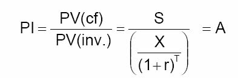
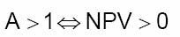

         Acrobat Distiller 6.0.1 (Windows)

         D:20050429100216

         2005-04-29T18:04:35+08:00

         Acrobat PDFMaker 6.0 for Word

         2005-04-29T18:05:42+08:00

         2005-04-29T18:05:42+08:00

         uuid:7032144e-d7f6-48d7-be70-73a1ea626030

         uuid:90fcfcfc-5ffe-4ff0-96f7-82b751e91ead

               2

         xml

               实物期权

               myn

实物期权 

概览：第二部分——价值评估 

A．价值评估：自由现金流和风险 

·4.1     讲座：自由现金流价值评估 

·4.3     案例：Ameritrade 

B. 价值评估：加权平均资本成本（WACC）和现值调整（APV） 

·4.8     讲座：加权平均资本成本（WACC）和现值调整（APV）1 

·4.10    讲座：加权平均资本成本（WACC）和现值调整（APV）2 

·4.15    案例：Dixon公司1 

·4.17    案例：Dixon公司2 

·4.24    案例：Diamond化学公司 

C. 项目和公司价值评估 

·4.29    讲座：实物期权 

·5.1     案例：MW石油公司 

·5.6     讲座：公司价值评估 

·5.8     案例：Cooper工业有限公司 

·5.13    案例：Southland公司 

实物期权：评估的灵活性 

·“实物期权方法”评估面对新信息时管理灵活性的价值 

·面对新变化和未预期到的变化，管理者面临多种选择权去修改、斟酌决策。 

·这种灵活性显然是有价值的，评估一个项目或企业时应予以考虑。 

例： 

·通常，管理者可以根据需求的变化增加或减少生产 

=&gt;如果公司在知道需求水平之前必须选择一个固定的产量水平，其价值将偏低。 

实物期权分析的二个步骤： 

界定 

·此项目是否有真实的选择权？ 

·选择权是何种类型？ 

·他们很重要吗？ 

价值评估 

·怎样给（重要的）期权定价？ 

·怎样给不同类型的期权定价？ 

·为什么我们不能只用NPV定价？ 

第一步：界定实物期权 

实物期权的界定 

·界定嵌入一个项目中的期权是重要的。 

·除了那些无足轻重的项目外，其他项目中均有期权嵌入。 

·最重要的技巧在于： 

*如果有多种期权，对那些“重要”的进行界定， 

*如果有并不重要的期权存在，则可忽略 

·界定真实期权需要经验，有时还需要“见识”。 

例子：Oz Toys 的扩张计划 

·Oz Toys的管理者正在考虑建立一个新工厂以利用生产技术的革新成果。 

·大约三年后，该工厂的生产能力将扩大到使得Oz Toys进入一个新市场。 

Oz Toys最初计算的阶段性扩张计划 

<Table>

<TR>
<TD>

</TD>
<TD>

2000 

</TD>
<TD>

2001

</TD>
<TD>

2002

</TD>
<TD>

2003 

</TD>
<TD>

2004 

</TD>
<TD>

2005 

</TD>
<TD>

2006 

</TD>
</TR>
<TR>
<TD>

息税前利润（EBIT）×(1－t) 

</TD>
<TD>

</TD>
<TD>

2.2 

</TD>
<TD>

4.0 

</TD>
<TD>

-10.0 

</TD>
<TD>

11.5 

</TD>
<TD>

13.7 

</TD>
<TD>

17.4 

</TD>
</TR>
<TR>
<TD>

折旧 

</TD>
<TD>

</TD>
<TD>

19.0

</TD>
<TD>

21.0

</TD>
<TD>

21.0 

</TD>
<TD>

46.3 

</TD>
<TD>

48.1 

</TD>
<TD>

50.0 

</TD>
</TR>
<TR>
<TD>

资本性支出 

</TD>
<TD>

120.0 

</TD>
<TD>

8.1 

</TD>
<TD>

9.5 

</TD>
<TD>

307.0 

</TD>
<TD>

16.0 

</TD>
<TD>

16.3 

</TD>
<TD>

17.0 

</TD>
</TR>
<TR>
<TD>

净运营资本变化 

</TD>
<TD>

25.0 

</TD>
<TD>

4.1 

</TD>
<TD>

5.5 

</TD>
<TD>

75.0 

</TD>
<TD>

7.1 

</TD>
<TD>

8.0 

</TD>
<TD>

9.7 

</TD>
</TR>
<TR>
<TD>

自由现金流 

</TD>
<TD>

-145.0

</TD>
<TD>

9.0 

</TD>
<TD>

10.0

</TD>
<TD>

-371.0

</TD>
<TD>

34.7 

</TD>
<TD>

37.5 

</TD>
<TD>

40.7 

</TD>
</TR>
<TR>
<TD>

终值（5%永续增长） 

</TD>
<TD>

</TD>
<TD>

</TD>
<TD>

</TD>
<TD>

</TD>
<TD>

</TD>
<TD>

</TD>
<TD>

610.5 

</TD>
</TR>
<TR>
<TD>

净现值（12%加权平均资本成本） 

</TD>
<TD>

-19.8 

</TD>
<TD>

</TD>
<TD>

</TD>
<TD>

</TD>
<TD>

</TD>
<TD>

</TD>
<TD>

</TD>
</TR>

</Table>

是否存在期权？ 

·两个条件： 

- （1） 未来很可能出现新信息； 

- （2） 当信息出现时，会对决策产生影响。 

·确认管理者所面临不确定性： 

·管理者随着时间的推移将获取的主要信息是什么？ 

  ·他们将怎样利用这一信息？ 

·什么决策将作为新信息的函数发生变动？ 

Oz Toys：是否存在期权？ 

- （1） Oz Toys可能知道（或不知道）： 

·对现有及/或新产品的需求 

·对手进入市场的可能性 

·其他 

- （2） 这些信息可能（或不会）影响Oz Toys的以下决策： 

·是否在第一阶段进行扩张 

·是否进行第二阶段（甚至是第三阶段） 

·是否开发某种新产品或是其他种类 

·其他 

实物期权的界定（续） 

·在对项目诸如“阶段”，“战略投资”，“前景”等的描述中寻求线索 

·检查现金流和支出的动态模式。 

·经常遇到的期权的类别： 

*成长期权 

*放弃期权 

*扩张或收缩规模期权 

*调整期权 

*转换期权（投入，产出，工艺等） 

成长期权 

· 如果一项投资允许后续投入并且是否进行后续投入的决定能够在获取新信息的基础上随后作出，这项投资就包含了实物期权。 

· 当评估这样的一项投资时，应该将成长期权的价值考虑在内 

· 这样的项目通常具有“战略性价值” 

· 例： 

—&gt;R&amp;D—&gt;如果R&amp;D成功则投入使用 

—&gt;生产—&gt;继续 

成长期权（续） 

· 成长期权类似于买入期权：你拥有这种权利，而不是义务，付出一定的代价获得某物。 

· 成长期权可以是“嵌套”的，即是一系列相关的选择： 

—&gt;选择1—&gt;选择2—&gt;选择3—&gt;…. 

· 成长期权很有价值，一些产业市场价值一半以上归于成长期权 

—&gt; R&amp;D占很大比重的产业 

—&gt;具有多重产品代的产业（如，计算机，制药） 

—&gt;跨国经营的产业 

放弃期权：退出的期权 

· 如果在一定条件下，永久性放弃目前的经营并在次级市场实现资本设备及其他资产转售更可取，就说此项投资包含了放弃期权， 

· 有时放弃期权隐藏于整体预测中：一般而言继续经营可能更可取，而在一些情况下终止可能更好。 

· 放弃期权类似于卖出期权：你拥有处置某物并获取收入（清算价值）的权利（而不是义务）。 

扩张或收缩规模期权 

· 如果情况比预期的好，公司会扩张生产规模或提高资源利用程度。 

· 如果情况没有预期的好，公司会收缩生产规模。在极端情况下，会暂时停止生产待以后重新开始。 

· 与成长期权和放弃期权相似。 

· 例： 

—&gt;从矿石中提取矿产的能力降低 

—&gt;在一个工厂增加临时性第三班的能力 

调整期权： 

项目增速或减速的期权 

· 拥有调整投资（可能包含“从不”）的灵活性十分有价值 

· 例：一项专利的价值依赖于调整期权，即当购买这一专利时，你买到了随时使用它的权利（在专利期限内） 

· 类似于美式买入期权：在付出一定成本后，你拥有在任何时间获取某物的权利（而不是义务） 

· 注：只有那些相关信息可能在未来获取的投资调整才涉及“期权价值” 

时间可以产生期权（分段投资） 

· 如果出现了不利的新信息，以一系列支出为特征的阶段性投资产生了在中途放弃此投资的期权 

· 每个阶段可视为一个依赖于后续阶段的看涨期权，并且可按照复合期权定价 

· 在以下情况中是重要的： 

—&gt;所有研发密集型产业，特别是制药业； 

—&gt;长期的资本密集型项目，如，大型建设或是能源工厂 

—&gt;新建的风险企业 

实物期权种类总结 

<Table>

<TR>
<TD>

种类 

</TD>
<TD>

描述 

</TD>
<TD>

重要性在于 

</TD>
</TR>
<TR>
<TD>

延期期权 

</TD>
<TD>

管理者拥有等待投资的机会并能观望市场是否支持进一步的投资 

</TD>
<TD>

自然资源开发，房地产，农业，技术 

</TD>
</TR>
<TR>
<TD>

分段投资 

</TD>
<TD>

分段投资产生了在每个阶段重估/放弃的权利 

</TD>
<TD>

研发密集型产业，能源开发，新兴企业 

</TD>
</TR>
<TR>
<TD>

改变运营规模期权 

</TD>
<TD>

如果市场情况变化，公司能扩张/收缩或暂时停止 

</TD>
<TD>

自然资源，时装，房地产，消费品 

</TD>
</TR>
<TR>
<TD>

放弃期权 

</TD>
<TD>

如果市场情况恶化，管理者出售资产 

</TD>
<TD>

资本密集型产业，不确定市场环境下引入的新产品 

</TD>
</TR>
<TR>
<TD>

转换期权 

</TD>
<TD>

如果价格或需求变化，管理者能改变产品组合（生产灵活性）或改变投入（工艺灵活性）

</TD>
<TD>

波动市场上有转移偏好的公司，能源公司 

</TD>
</TR>
<TR>
<TD>

成长期权 

</TD>
<TD>

早期的投资以新产品、新工艺、市场准入或核心竞争力的形式打开了未来的增长机会 

</TD>
<TD>

高技术，多代产品行业（药品，计算机，战略收购） 

</TD>
</TR>
<TR>
<TD>

多重交互期权 

</TD>
<TD>

包含不同种类的期权，看涨和看跌期权，其价值因交互而不同于单一期权 

</TD>
<TD>

上述公司中的多数 

</TD>
</TR>

</Table>

Oz Toys：对期权的界定 

· 对项目的描述有两个不同阶段                                                        

*阶段1：新工厂                                                              *阶段2：扩张 

· 开支的模式：可能是随机的                                              =&gt;可能内含成长期权！                                                                

实践问题：需要简化 

· 现实中的项目，尤其长期项目是复杂的： 

—&gt;它们是实际资产和期权的混合物 

—&gt;期权经常是嵌套的 

· 必要的简单假设： 

—&gt;允许价值评估的技术分析 

—&gt;使模型具有灵活性 

—&gt;使模型对你及其他人（尤其是参与决策的人员）来说是可理解的 

实践问题：简单化（续） 

应该做什么？ 

· 将项目划分为与简单期权相对应的若干部分                                           

· 寻找管理者面对的最主要的不确定性 

· 由项目决定的简化模型为该项目的价值给出了上（或下）限 

—&gt;例如： 

·用欧式期权而不是美式期权 

·忽略一些期权 

·忽略一些由等待引起的负面影响（如进入的机会） 

Oz Toys：可能的简化 

· 对阶段1和阶段2分别定价 

· 主要考虑在第二阶段是否扩张的期权 

—&gt;假定其他期权“不需要考虑” 

· 假定第二阶段将在2003年进行或不进行 

—&gt;欧式看涨期权 

—&gt;对项目价值的分布做出简单假设 

第二步：实物期权定价 

实物期权定价 

· 金融期权的定价工具（即股票及其他金融资产的买入和卖出期权）对于估算某些项目包含的实物期权的价值是有用的。 

—&gt;常用布莱克—斯科尔斯（Black-Scholes）模型给实物期权定价 

· 问题：实物期权比金融期权复杂得多 

—&gt;需要将它们进行简化以适用于金融期权的定价模型 

· 与DCF分析类似，其目的在于提供“评分”的量化技巧，以帮助决策过程，而不是来代替合理的商业判断 

从现金流贴现（DCF）分析开始： 

· 假定项目不涉及期权，对其进行估价，即所有的投资决策必须立刻做出 

· 这一基础构成了对项目评估的下限

· 然后将灵活性/选则性引入决策过程： 

—&gt;NPV&lt;0并不意味着永远不进行这项投资 

—&gt;NPV&gt;0并不意味着要立即进行这项投资（或是一定要在将来进行投资） 

Oz Toys：现金流贴现（DCF）分析 

· 我们需要分开两个阶段的现金流 

· 这要求做出以下判断: 

—&gt;哪些开支是可随意决定的,哪些不是，即哪些决策需要在现在做出，哪些可以在未来新信息获得后再做出 

—&gt;每个阶段的现金流入/流出 

· 注释:有时,简单地恢复损失的数据可用于构建简单的现金流贴现（DCF）分析。 

分开第1阶段和第2阶段 

第1阶段和第2阶段的现金流贴现（DCF）分析 

<Table>

<TR>
<TD>

</TD>
<TD>

2000 

</TD>
<TD>

2001

</TD>
<TD>

2002

</TD>
<TD>

2003 

</TD>
<TD>

2004

</TD>
<TD>

2005 

</TD>
<TD>

2006 

</TD>
</TR>
<TR>
<TD>

阶段1 

</TD>
<TD>

</TD>
<TD>

</TD>
<TD>

</TD>
<TD>

</TD>
<TD>

</TD>
<TD>

</TD>
<TD>

</TD>
</TR>
<TR>
<TD>

现金流 

</TD>
<TD>

</TD>
<TD>

9.0 

</TD>
<TD>

10.0

</TD>
<TD>

11.0 

</TD>
<TD>

11.6

</TD>
<TD>

12.1 

</TD>
<TD>

12.7 

</TD>
</TR>
<TR>
<TD>

投资 

</TD>
<TD>

145.0

</TD>
<TD>

</TD>
<TD>

</TD>
<TD>

</TD>
<TD>

</TD>
<TD>

</TD>
<TD>

</TD>
</TR>
<TR>
<TD>

终值（TV）（5%永续增长） 

</TD>
<TD>

</TD>
<TD>

</TD>
<TD>

</TD>
<TD>

</TD>
<TD>

</TD>
<TD>

</TD>
<TD>

191.0 

</TD>
</TR>
<TR>
<TD>

净现值（NPV）（WACC=12%） 

</TD>
<TD>

-3.7 

</TD>
<TD>

</TD>
<TD>

</TD>
<TD>

</TD>
<TD>

</TD>
<TD>

</TD>
<TD>

</TD>
</TR>
<TR>
<TD>

阶段2 

</TD>
<TD>

</TD>
<TD>

</TD>
<TD>

</TD>
<TD>

</TD>
<TD>

</TD>
<TD>

</TD>
<TD>

</TD>
</TR>
<TR>
<TD>

现金流 

</TD>
<TD>

</TD>
<TD>

</TD>
<TD>

</TD>
<TD>

</TD>
<TD>

23.2

</TD>
<TD>

25.4 

</TD>
<TD>

28.0 

</TD>
</TR>
<TR>
<TD>

投资 

</TD>
<TD>

</TD>
<TD>

</TD>
<TD>

</TD>
<TD>

382.0

</TD>
<TD>

</TD>
<TD>

</TD>
<TD>

</TD>
</TR>
<TR>
<TD>

终值（TV）（5%永续增长） 

</TD>
<TD>

</TD>
<TD>

</TD>
<TD>

</TD>
<TD>

</TD>
<TD>

</TD>
<TD>

</TD>
<TD>

419.5 

</TD>
</TR>
<TR>
<TD>

净现值（NPV）（WACC=12%） 

</TD>
<TD>

-16.1

</TD>
<TD>

</TD>
<TD>

</TD>
<TD>

</TD>
<TD>

</TD>
<TD>

</TD>
<TD>

</TD>
</TR>
<TR>
<TD>

总计 

</TD>
<TD>

</TD>
<TD>

</TD>
<TD>

</TD>
<TD>

</TD>
<TD>

</TD>
<TD>

</TD>
<TD>

</TD>
</TR>
<TR>
<TD>

现金流 

</TD>
<TD>

</TD>
<TD>

9.0 

</TD>
<TD>

10.0

</TD>
<TD>

11.0 

</TD>
<TD>

34.7

</TD>
<TD>

37.5 

</TD>
<TD>

40.7 

</TD>
</TR>
<TR>
<TD>

投资 

</TD>
<TD>

145.0

</TD>
<TD>

</TD>
<TD>

</TD>
<TD>

382.0

</TD>
<TD>

</TD>
<TD>

</TD>
<TD>

</TD>
</TR>
<TR>
<TD>

终值（TV） 

</TD>
<TD>

</TD>
<TD>

</TD>
<TD>

</TD>
<TD>

</TD>
<TD>

</TD>
<TD>

</TD>
<TD>

610.5 

</TD>
</TR>
<TR>
<TD>

净现值（NPV）（WACC=12%） 

</TD>
<TD>

-19.8

</TD>
<TD>

</TD>
<TD>

</TD>
<TD>

</TD>
<TD>

</TD>
<TD>

</TD>
<TD>

</TD>
</TR>

</Table>

Oz Toys：DCF分析(续) 

· 两个阶段均有负的NPV 

· 第二阶段的NPV可能大大高估： 

—&gt;投资（$382M）可能比现金流的风险低 

—&gt;是否要用3年期5.5%？的无风险利率 

第二阶段的现金流贴现（DCF）分析，按5.5%对投资折现 

<Table>

<TR>
<TD>

</TD>
<TD>

2000 

</TD>
<TD>

2001

</TD>
<TD>

2002

</TD>
<TD>

2003 

</TD>
<TD>

2004

</TD>
<TD>

2005 

</TD>
<TD>

2006 

</TD>
</TR>
<TR>
<TD>

阶段2 

</TD>
<TD>

</TD>
<TD>

</TD>
<TD>

</TD>
<TD>

</TD>
<TD>

</TD>
<TD>

</TD>
<TD>

</TD>
</TR>
<TR>
<TD>

现金流 

</TD>
<TD>

</TD>
<TD>

</TD>
<TD>

</TD>
<TD>

</TD>
<TD>

23.2

</TD>
<TD>

25.4 

</TD>
<TD>

28.0 

</TD>
</TR>
<TR>
<TD>

投资 

</TD>
<TD>

</TD>
<TD>

</TD>
<TD>

</TD>
<TD>

382.0

</TD>
<TD>

</TD>
<TD>

</TD>
<TD>

</TD>
</TR>
<TR>
<TD>

终值（TV）（5%永续增长） 

</TD>
<TD>

</TD>
<TD>

</TD>
<TD>

</TD>
<TD>

</TD>
<TD>

</TD>
<TD>

</TD>
<TD>

419.5 

</TD>
</TR>
<TR>
<TD>

净现值（NPV）（WACC=12%） 

</TD>
<TD>

-69.5

</TD>
<TD>

</TD>
<TD>

</TD>
<TD>

</TD>
<TD>

</TD>
<TD>

</TD>
<TD>

</TD>
</TR>

</Table>

期权定价 

·首先确认期权： 

* 如果在决策做出时NPV为正，阶段2才会进行 

·策略是将包含于项目中的期权演化为简单金融期权,然后使用金融价值评估工具定价: 布莱克—斯科尔斯（Black-Scholes）模型 

·这经常需要作出一些关于该项目的大胆假设。 

布莱克—斯科尔斯（Black-Scholes）模型 

·布莱克—斯科尔斯（Black-Scholes）模型： 

期权价格 =  

问题：我们需要投入什么？ 

图示：项目—&gt;看涨期权 

<Table>

<TR>
<TD>

项目 

</TD>
<TD>

</TD>
<TD>

买入期权 

</TD>
</TR>
<TR>
<TD>

获取资产需要的开支 

</TD>
<TD>

X 

</TD>
<TD>

执行价格 

</TD>
</TR>
<TR>
<TD>

获取的营运资产的价值

</TD>
<TD>

S 

</TD>
<TD>

股票价格（标底资产价格） 

</TD>
</TR>
<TR>
<TD>

可以延期决策的时间 

</TD>
<TD>

T 

</TD>
<TD>

到期时间 

</TD>
</TR>
<TR>
<TD>

营运资产的风险 

</TD>
<TD>

σ2

</TD>
<TD>

股票收益的方差 

</TD>
</TR>
<TR>
<TD>

货币的时间价值 

</TD>
<TD>

r 

</TD>
<TD>

无风险利率 

</TD>
</TR>

</Table>

N(d):累积正态概率密度函数 

d1= ln[S/PV(X)] / (T1/2) + (σ1/2)/2    d2= d1-(σ1/2) 

S =当前的股票价格                        X = 执行价格 

r =无风险利率                            T = 到期时间（年）. 

σ=股票收益的标准差 

Oz Toys：5个变量 

<Table>

<TR>
<TD>

X 

</TD>
<TD>

实施第2阶段，2003年需要的投资 

</TD>
<TD>

$382M 

</TD>
</TR>
<TR>
<TD>

S 

</TD>
<TD>

第二阶段现金流的现值 

</TD>
<TD>

4255.8 

</TD>
</TR>
<TR>
<TD>

T 

</TD>
<TD>

第二阶段似乎要延期3年（由管理者核实） 

</TD>
<TD>

3年 

</TD>
</TR>
<TR>
<TD>

r 

</TD>
<TD>

3年期无风险利率（核实收益曲线） 

</TD>
<TD>

5.5 

</TD>
</TR>
<TR>
<TD>

σ2

</TD>
<TD>

第二阶段资产每年的方差。不能从DCF电子数据表获得

</TD>
<TD>

40% 

</TD>
</TR>

</Table>

<Table>

<TR>
<TD>

阶段2 

</TD>
<TD>

2000 

</TD>
<TD>

2001

</TD>
<TD>

2002

</TD>
<TD>

2003

</TD>
<TD>

2004

</TD>
<TD>

2005 

</TD>
<TD>

2006 

</TD>
</TR>
<TR>
<TD>

现金流 

</TD>
<TD>

</TD>
<TD>

</TD>
<TD>

</TD>
<TD>

</TD>
<TD>

23.2

</TD>
<TD>

25.4 

</TD>
<TD>

28.0 

</TD>
</TR>
<TR>
<TD>

终值（TV） 

</TD>
<TD>

</TD>
<TD>

</TD>
<TD>

</TD>
<TD>

</TD>
<TD>

</TD>
<TD>

</TD>
<TD>

419.5 

</TD>
</TR>
<TR>
<TD>

现值（PV）（WACC=12%） 

</TD>
<TD>

255.8

</TD>
<TD>

</TD>
<TD>

</TD>
<TD>

</TD>
<TD>

</TD>
<TD>

</TD>
<TD>

</TD>
</TR>

</Table>

实践问题：什么是波动性？ 

· 波动性（σ）不能从表格或是报纸上查找 

注释：即便是对σ的粗略估计也可能是有用的 

1．作一个有根据的猜测： 

· 系统风险与整体风险相关：高β值的项目具有较高的σ 

· 分散化组合的波动性是这组资产波动性的下限 

· 对一个单一项目来说，每年20—30%并不是十分高的水平 

实践问题：什么是波动性？（续） 

2．数据： 

· 对一些产业来说，可用投资收益的历史数据 

· 对许多交易的股票来说，隐含的波动性可从报出的期权价格计算出来 

注释：这些数据需要调整，因为权益回报具有杠杆效应，它们比标底资产更具波动性 

3．模拟： 

·步骤1：对项目未来现金流及未来现金流如何受特定因素（如，商品价格，利率和汇率，等）影响建立一个以平面差价为基础的（简化）模型 

·步骤2：用Monte Carlo模拟法模拟项目收益和σ的可能的分布 

布莱克—斯科尔斯（Black-Scholes）模型 

·两个充分的数值： 

   and   

·下表给出了仅为股权价格S一部分的Black-Scholes买入期权的价格 

<Table>

<TR>
<TD>

布莱克—斯科尔斯（Black-Scholes）模型 

</TD>
</TR>
<TR>
<TD>

列：A     行：B 

</TD>
</TR>
<TR>
<TD>

</TD>
<TD>

0.6 

</TD>
<TD>

0.65

</TD>
<TD>

0.7

</TD>
<TD>

0.75

</TD>
<TD>

0.8

</TD>
<TD>

0.86

</TD>
<TD>

0.9 

</TD>
</TR>
<TR>
<TD>

0.5 

</TD>
<TD>

5.1 

</TD>
<TD>

6.6

</TD>
<TD>

8.2

</TD>
<TD>

10

</TD>
<TD>

11.8

</TD>
<TD>

14.2

</TD>
<TD>

15.7 

</TD>
</TR>
<TR>
<TD>

0.55 

</TD>
<TD>

6.6 

</TD>
<TD>

8.3

</TD>
<TD>

10

</TD>
<TD>

11.9

</TD>
<TD>

13.8

</TD>
<TD>

16.1

</TD>
<TD>

17.7 

</TD>
</TR>
<TR>
<TD>

0.6 

</TD>
<TD>

8.3 

</TD>
<TD>

10.1

</TD>
<TD>

11.9

</TD>
<TD>

13.8

</TD>
<TD>

15.8

</TD>
<TD>

18.1

</TD>
<TD>

19.7 

</TD>
</TR>
<TR>
<TD>

0.65 

</TD>
<TD>

10 

</TD>
<TD>

11.9

</TD>
<TD>

13.8

</TD>
<TD>

15.8

</TD>
<TD>

17.8

</TD>
<TD>

20.1

</TD>
<TD>

21.7 

</TD>
</TR>
<TR>
<TD>

0.7 

</TD>
<TD>

11.9 

</TD>
<TD>

13.8

</TD>
<TD>

15.8

</TD>
<TD>

17.8

</TD>
<TD>

19.8

</TD>
<TD>

22.1

</TD>
<TD>

23.6 

</TD>
</TR>
<TR>
<TD>

0.75 

</TD>
<TD>

13.7 

</TD>
<TD>

15.8

</TD>
<TD>

17.8

</TD>
<TD>

19.8

</TD>
<TD>

21.8

</TD>
<TD>

24.1

</TD>
<TD>

25.6 

</TD>
</TR>
<TR>
<TD>

0.8 

</TD>
<TD>

15.7 

</TD>
<TD>

17.7

</TD>
<TD>

19.8

</TD>
<TD>

21.8

</TD>
<TD>

23.7

</TD>
<TD>

26

</TD>
<TD>

27.5 

</TD>
</TR>

</Table>

布莱克—斯科尔斯（Black-Scholes）模型（续） 

· 如果决策不能延期（然而投资和现金流仍始于2003），A值表示第2阶段的价值 

· 在这个例子中，A实际上是第2阶段的盈利性指数： 

· 期权价值随着A增长（如表中所示） 

布莱克—斯科尔斯（Black-Scholes）模型（续） 

· B值，累积波动性，衡量现在和决策期T之间“S变动了多少” 

· 直观地，S的变动将更大 

—&gt;当S每年的方差较大，即σ较大时 

—&gt;当期限较长，即T较大时 

· B表示能延期做出决策的价值 

注释：当B=0，只需考虑项目的NPV值（不论A&gt;1与否），因为这时或是决策必须立刻作出（T=0）或是即使决策即时做出但没有信息出现（σ=0） 

并且 

Oz Toys：定价 

  和    

<Table>

<TR>
<TD>

布莱克—斯科尔斯（Black-Scholes）模型 

</TD>
</TR>
<TR>
<TD>

</TD>
<TD>

0.6 

</TD>
<TD>

0.65

</TD>
<TD>

0.7

</TD>
<TD>

0.75

</TD>
<TD>

0.8

</TD>
<TD>

0.86

</TD>
<TD>

0.9 

</TD>
</TR>
<TR>
<TD>

0.5 

</TD>
<TD>

5.1 

</TD>
<TD>

6.6

</TD>
<TD>

8.2

</TD>
<TD>

10

</TD>
<TD>

11.8

</TD>
<TD>

14.2

</TD>
<TD>

15.7 

</TD>
</TR>
<TR>
<TD>

0.55 

</TD>
<TD>

6.6 

</TD>
<TD>

8.3

</TD>
<TD>

10

</TD>
<TD>

11.9

</TD>
<TD>

13.8

</TD>
<TD>

16.1

</TD>
<TD>

17.7 

</TD>
</TR>
<TR>
<TD>

0.6 

</TD>
<TD>

8.3 

</TD>
<TD>

10.1

</TD>
<TD>

11.9

</TD>
<TD>

13.8

</TD>
<TD>

15.8

</TD>
<TD>

18.1

</TD>
<TD>

19.7 

</TD>
</TR>
<TR>
<TD>

0.65 

</TD>
<TD>

10 

</TD>
<TD>

11.9

</TD>
<TD>

13.8

</TD>
<TD>

15.8

</TD>
<TD>

17.8

</TD>
<TD>

20.1

</TD>
<TD>

21.7 

</TD>
</TR>
<TR>
<TD>

0.7 

</TD>
<TD>

11.9 

</TD>
<TD>

13.8

</TD>
<TD>

15.8

</TD>
<TD>

17.8

</TD>
<TD>

19.8

</TD>
<TD>

22.1

</TD>
<TD>

23.6 

</TD>
</TR>
<TR>
<TD>

0.75 

</TD>
<TD>

13.7 

</TD>
<TD>

15.8

</TD>
<TD>

17.8

</TD>
<TD>

19.8

</TD>
<TD>

21.8

</TD>
<TD>

24.1

</TD>
<TD>

25.6 

</TD>
</TR>
<TR>
<TD>

0.8 

</TD>
<TD>

15.7 

</TD>
<TD>

17.7

</TD>
<TD>

19.8

</TD>
<TD>

21.8

</TD>
<TD>

23.7

</TD>
<TD>

26

</TD>
<TD>

27.5 

</TD>
</TR>

</Table>

· 第2阶段的价值是(大约)：V                          

·  扩张计划的价值是：V1+V2=-3.7+48.6=$44.9M                                         

解释 

·  由于我们使用的是简化模型，因此要以有所保留的态度对待结果并对其做出解释 

·  将复杂性还原于模型，通过： 

—&gt;敏感性分析 

—&gt;使推论条件化和合理化 

·  迭代程序 

·  帮助你确定项目的关键所在，那是你需要收集更多数据或完善分析的地方 
