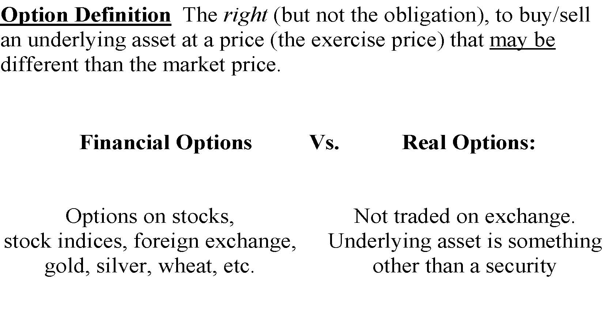
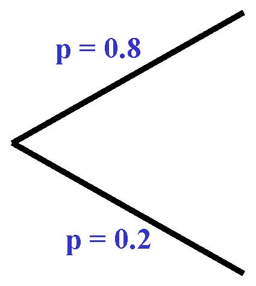
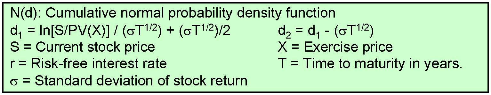
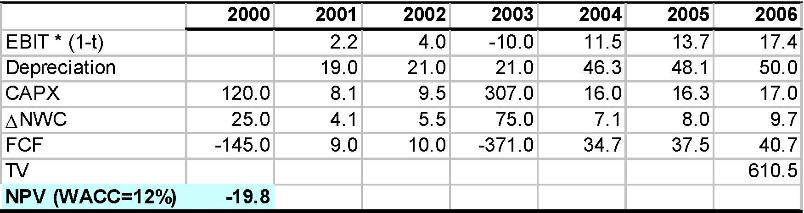
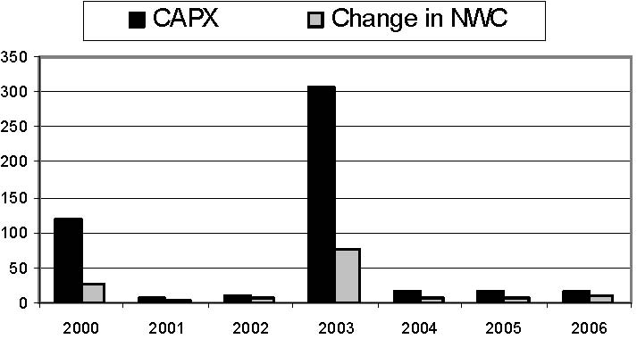
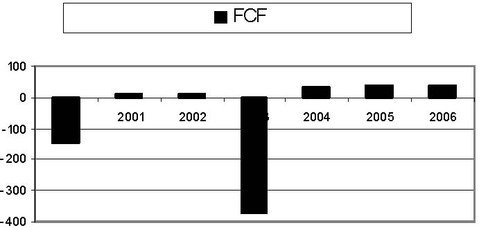
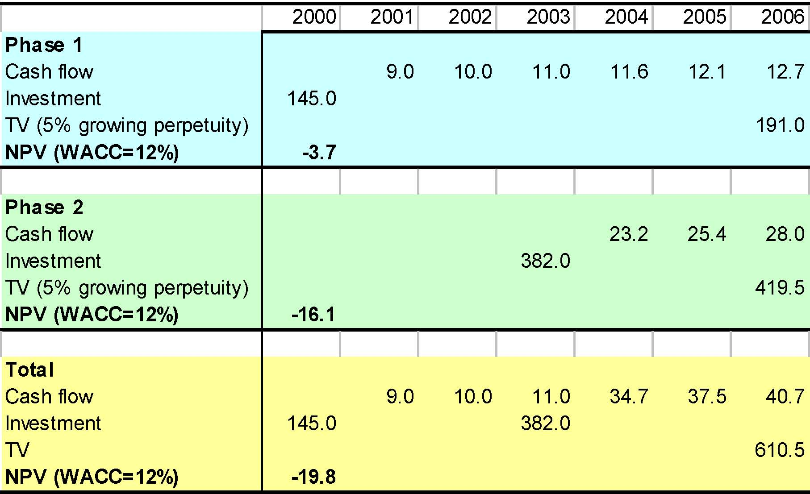
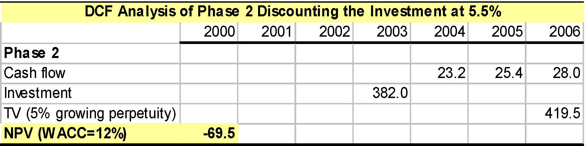
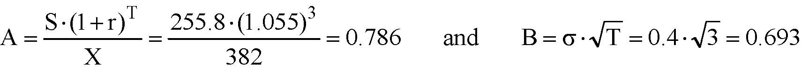

         Acrobat Distiller 6.0 (Windows)

         Compaq

         Compaq

         2004-01-22T11:29:11+05:30

         Acrobat PDFMaker 6.0 for PowerPoint

         2004-01-22T11:28:02+05:30

         2004-01-22T11:29:11+05:30

         uuid:dd61710b-925f-4e50-aebb-e4fbf76e2161

         uuid:3328e2cf-bf44-48cf-9c7d-c6a874496e55

         xml

               No Slide Title

               Leslie A. Larocca

Real Options

Katharina Lewellen

Finance Theory II

April 28, 2003

Real options

- Managers have many options to adapt and revise decisions in response to unexpected developments.

- Such flexibility is clearly valuable and should be accounted forin the valuation of a project or firm.

Real options, cont.

Imbedded options

- Follow-up investments

- Option to abandon the project

- Option to wait before investing

- Option to expand / change production methods

Key elements

- Information will arrive in the future

- Decisions can be made after receiving this information

Our plan

Last class

- Real options: basic intuition

- Simple DCF analysis of real options (decision trees)

Today

- Review of option pricing

- Why doesn’t simple DCF work quite well?

- Identifying real options

- Valuing real options using Black Scholes

1. Review of option pricing

Real options and financial options

Option Definition  The right (but not the obligation), to buy/sell an underlying asset at a price (the exercise price) that may be different than the market price.   Financial Options          Vs.           Real Options:   Options on stocks, stock indices, foreign exchange,gold, silver, wheat, etc.   Not traded on exchange. Underlying asset is something other than a security   

Pricing of a call option on stock

Stock

Option (X = 110)

?

10

0

The challengeis to find the value of the call option today

S0= 100

S1= 120

S1= 80

Pricing of a call option on stock

- Consider the following strategy:

- Borrow money (or sell a bond with face value of B)

- Buy a N shares of stock

- Choose N and B so that the payoffs from the portfolio = option payoffs

?

10 = -B + N*120

0 = -B + N*80

B = 20

N = 0.25

Pricing of a call option on stock

- Our stock / bond portfolio has exactly the same payoffas the option

- So, the option and the portfolio must have the same value today

- Otherwise: arbitrage opportunity

- What is the value of the portfolio today (assume risk-free rate =4%)?

-B / (1+r) + N * S0=      -20 / 1.04 + 0.25 * 100      =     5.77

- We just priced the option.  Option value = $5.77.

Why standard DCF doesn’t work very well?

- Let’s value our option using standard DCF

- What discount rate should we use?

- Let’s try the required return on stock E[RS]

S0= 100

S1= 120

S1= 80

E[S1] = 112   =&gt;   E[RS] = 12%

p = 0.8

p = 0.2

Why standard DCF doesn’t work very well?

- DCF gives us the following option value:

(0.8 * 10 + 0.2 * 0) / 1.12 = $7.14   ≠$5.77

What’s wrong?

- Discount rate of 12% is too low =&gt; the option is riskier than the underlying stock

Why?

- Option is a levered position in a stock. 

- Recall the analogy with firms’ financial leverage: Higher financial leverage =&gt; higher equity betas and equity returns.

Option is a levered position in a stock

- Recall our replicating portfolio: Borrow B/(1+r) and buy N shares of stock

- Suppose that stock beta = 1 and market premium = 8%

- Note that this works.  CAPM: 12% = 4% + 1 * 8%

- What is option beta?

βoption= wbond* βbond+ wstock* βstock=  4.33

0         25/5.77 * 1

So, the required return on the option is 38% = 4% + 4.33 * 8%And the option value is again:  $5.77 = 8 / 1.38

How about multiple periods?

100

96

64

T=0T=1T=2

- In principle, we can value the option the same way as before

- Start at time T=2 and move backwards

- But several things change at each node:

- Replicating portfolio, option beta, discount rate

12080144

This can become quite tediousThat’s where option pricing models such as Black-Scholescome in.

Options valuation techniques

- “Dynamic” DCF (decision trees)

- Recall our “Handheld PC” and “Copper Mine” examples

- Approximationused for real-options problems

- Not an exact answer because of problems with discounting

- Binomial model

- Similar to our one-period example from today’s class

- Requires more computations than Black-Scholes

- Can be useful when Black-Scholesdoesn’t work very well

- Black-Scholes

- We will focus on this model from now on

Black-Scholesformula

- Black-Scholesformula relies on the same valuation principles as the binomial model (replicating portfolios, no arbitrage)

Option value = N(d1) * S –N(d2) * PV(X)

- Note the similarities to the one-period binomial model

Option value = N * S –PV(B)

N(d): Cumulative normal probability density functiond1= ln[S/PV(X)] / (σT1/2) + (σT1/2)/2d2= d1-(σT1/2)S = Current stock priceX = Exercise pricer = Risk-free interest rateT = Time to maturity in years.σ= Standard deviation of stock return

Recall “Handheld PC” example

Model B NPV (t=3) = 16,557go for it

Model B NPV (t=3) = -21,148drop it

Model A turns out well =&gt; good news for Model BModel A turns out badly =&gt; bad news for Model BModel B value in t=0 ?Model B value at t=0"Static" NPV[(16,557 - 21,148)/2]/1.123-1,634"Dynamic" NPV[(16,557 + 0)/2]/1.1235,892Option pricing[(16,557 + 0)/2]/???3???

2. Identifying Real Options

Two Issues with Real Options

Identification

- Are there real options imbedded in this project?

- What type of options?

Valuation

- How do we value options?

- How do we value different types of options?

- Can’t we just use NPV?

Identifying Real Options

- It is important to identify the options imbedded in a project. 

- There are options imbedded in all but the most trivial projects.

- All the art consists in:

- Identifying those that are “significant”, if any

- Ignoring those that are not

- Identifying real options takes practice, and sometimes “vision”.

Identifying Real Options (cont.)

- Look for clues in the project’s description: “Phases”, “Strategic investment”, “Scenarios”, …

- Examine the pattern of cash flows and expenditures over time. For instance, large expenditures are likely to be discretionary.

- Taxonomy of frequently encountered options :

- Growth option

- Abandonment option

- Option to expand or contract scale

- Timing

- Option to switch (inputs, outputs, processes, etc.)

Is There An Option?

- Two conditions:

(1) News will possibly arrive in the future;

(2) When it arrives, the news may affect decisions.

- Search for the uncertainty that managers face:

- What is the main thing that managers will learn over time?

- How will they exploit that information?

Oz Toys’ Expansion Program

- Oz Toys’ management is considering building a new plant to exploit innovations in process technology.

- About three years out, the plant’s capacity may be expanded to allow Oz Toys’ entry into two new markets.

2000200120022003200420052006EBIT * (1-t)2.24.0-10.011.513.717.4Depreciation19.021.021.046.348.150.0CAPX120.08.19.5307.016.016.317.0∆NWC25.04.15.575.07.18.09.7FCF-145.09.010.0-371.034.737.540.7TV610.5NPV (WACC=12%)-19.8

Oz Toys: Is There An Option?

(1) Oz Toys might learn (or not) about:

- The demand for the current and/or new products

- The possibility of rivals entering the market

- Etc.

(2) The information might affect (or not) Oz Toys’ decision:

- Whether or not to undertake expansion phase 1 at all

- Whether to undertake phase 2 (or even phase 3,…)

- Whether to push one new product or the other

- Etc.

Oz Toys: Identifying the Option

- Project’s description refers to two distinct phases

- Phase 1: New plant

- Phase 2: Expansion

- Spike in spending: Probably discretionary

- Possibly, an imbedded growth option

0501001502002503003502000200120022003200420052006CAPXChange in NWC

FCF-400-300-200-10001002000200120022003200420052006FCF

Practical Issue #1: Simplifications

- Real projects, especially long-horizon ones, are complex:

- They often combine assets-in-place and options.

- Options are nested.

- Simplifying assumptions are needed:

- To allow the technical valuation analysis

- To keep the model flexible

- To keep the model understandable to you and others (especially others involved in the decision process)

Practical Issue #1: Simplifications (cont.)

- Cut the project into pieces corresponding to simple options.

- Search for the primaryuncertainty that managers face

- A simplified model that dominates (is dominated) by the project gives an upper (a lower) bound for the project’s value, e.g.,:

- Using European rather than American options

- Ignoring some of the options

- Ignoring some adverse effects of waiting (e.g. possible entry)

Oz Toys: Simplifications

- Value phase 1 and phase 2 separately.

- Focus on the option to undertake expansion phase 2 or not.

- Assume all other options are “negligible”

- Assume that phase 2 is to be undertaken in 2003 or never.

European Call option

3. Valuing Real Options

Valuation of Real Options

- Tools developed to value financial options can be useful to estimate the value of real options embedded in some projects.

- Real options are much more complex than financial options. 

- The aim here is to develop numerical techniques to “keep score” and assist in the decision-making process, not provide a recipe to replace sound business sense.

Options vs. DCF

- The real options approach is often presented as an alternative to DCF.

- In fact, the real options’ approach does not contradict DCF: It is a particular form that DCF takes for certain types of investments.

- Recall that option valuation techniques were developed because discounting is difficult

- I.e., due to the option, one should not use the same discount rate (e.g. WACC) for all cash flows.

Options vs. DCF (cont.)

- DCF method:

- “expected scenario” of cash flows,

- discount the expected cash flows

- This is perfectly fine as long as:

- expected cash flows are estimated properly

- discount rates are estimated properly

- Precisely, it is complex to account for options in estimating:

- expected cash flow

- discount rates

Start with the “static” DCF Analysis

- Begin by valuing the project as if there was no option involved

- Pretend that the investment decision must be takenimmediately.

- This benchmark constitute a lower boundfor the project’s value.

- NPV&lt;0 does not mean that you will never want to undertake the investment.

- NPV&gt;0 does not mean that you should go ahead immediately with the invest (nor that you will definitely invest in the future).

Oz Toys: DCF Analysis

- Disentangling the two phases.

- Requires making judgments about:

- Which expenses are discretionary vs. non-discretionary

- Which cash inflows/outflows are associated with each phase

- Note: Sometimes, simply retrieve disaggregated data used to construct the summary DCF analysis.

Oz Toys: Valuing Phases 1 and 2

2000200120022003200420052006Phase 1Cash flow9.010.011.011.612.112.7Investment145.0TV (5% growing perpetuity)191.0NPV (WACC=12%)-3.7Phase 2Cash flow23.225.428.0Investment382.0TV (5% growing perpetuity)419.5NPV (WACC=12%)-16.1TotalCash flow9.010.011.034.737.540.7Investment145.0382.0TV610.5NPV (WACC=12%)-19.8

Oz Toys: DCF Analysis (cont.)

- Both phases have negative NPV

- Phase 2’s NPV is probably largely overstated:

- Investment ($382M) is likely to be less risky than cash flows.

- Using the three-year risk-free rate of 5.5%

2000200120022003200420052006Phase 2Cash flow23.225.428.0Investment382.0TV (5% growing perpetuity)419.5NPV (WACC=12%)-69.5DCF Analysis of Phase 2 Discounting the Investment at 5.5%

Valuing the Option

- The strategy is to map the project into a simple option and use financial valuation tools to price the option: Black-Scholesformula.

- Oftentimes, this involves making somewhat heroic assumptions about the project.

Mapping: Project Call Option

<Table>
<TR>
<TD>

Project

</TD>

<TD>

Call Option

</TD>
</TR>
<TR>
<TD>

Expenditure required to acquire the assets

</TD>
<TD>

X

</TD>
<TD>

Exercise price

</TD>
</TR>
<TR>
<TD>

Value of the operating assets to be acquired

</TD>
<TD>

S

</TD>
<TD>

Stock price (price of the underlying asset)

</TD>
</TR>
<TR>
<TD>

Length of time the decision may be deferred

</TD>
<TD>

T

</TD>
<TD>

Time to expiration

</TD>
</TR>
<TR>
<TD>

Riskinessof the operating assets

</TD>
<TD>

σ2

</TD>
<TD>

Variance of stock return

</TD>
</TR>
<TR>
<TD>

Time value of money

</TD>
<TD>

r

</TD>
<TD>

Risk-free rate of return

</TD>
</TR>
</Table>

Oz Toys: The 5 Variables

<Table>
<TR>
<TD>

X

</TD>
<TD>

Investment needed in 2003 to obtain the phase 2 assets.

</TD>
<TD>

$382M

</TD>
</TR>
<TR>
<TD>

S

</TD>
<TD>

PV of phase 2’s cash flows.

</TD>
<TD>

$255.8

</TD>
</TR>
<TR>
<TD>

T

</TD>
<TD>

It seems that phase 2 can be deferred for 3 years (Check with managers).

</TD>
<TD>

3 years

</TD>
</TR>
<TR>
<TD>

r

</TD>
<TD>

3-year risk-free rate (Check yield curve).

</TD>
<TD>

5.5%

</TD>
</TR>
<TR>
<TD>

σ2

</TD>
<TD>

Variance per year on phase 2 assets. Can’t get it from DCF spreadsheet.

</TD>
<TD>

Say 40%

</TD>
</TR>
</Table>

Phase 22000200120022003200420052006Cash flow23.225.428.0TV419.5PV (WACC=12%)255.8

Practical Issue #2: What Volatility?

- Volatility (σ) cannot be looked up in a table or newspaper.

- Note: Even a rough estimate of σcan be useful, e.g., to decide whether to even bother considering the option value.

1. Take an informed guess:

- Systematic and total risks are correlated: High βprojects tend to have a higher σ.

- The volatility of a diversified portfolio within that class of assets is a lower bound.

- 20-30% per year is not remarkably high for a single project.

Practical Issue #2: What Volatility? (cont.)

2. Data:

- For some industries, historical data on investment returns.

- Implied volatilities can be computed from quoted option prices for many traded stocks

- Note: These data need adjustment because equity returns being levered, they are more volatile than the underlying assets.

Practical Issue #2: What Volatility? (cont.)

3. Simulation:

- Step 1: Build a spread-sheet based (simplified) model of the project’s future cash flows

- Model how CFs depend on specific items (e.g. commodity prices, interest and exchange rates, etc.)

- Step 2: Use Monte Carlo simulation to simulate a probability distribution for the project’s returns and infer σ.

Black-ScholesFormula

- Two numbers suffice:

- A table that gives the Black-Scholes’ call option value as a fraction of the stock price S (see handout)

TB     and      Xr)(1SAT×=+×=σ

0.600.650.700.750.800.860.505.16.68.210.011.814.20.556.68.310.011.913.816.10.608.310.111.913.815.818.10.6510.011.913.815.817.820.10.7011.913.815.817.819.822.10.7513.715.817.819.821.824.1Black-Scholes Formula:    Columns: A     Lines: B

Black-ScholesFormula (cont.)

- The number A captures phase 2’s value if the decisioncould not be delayed (but investment and cash flows still began in 2003).

- Indeed, in that case, A would be phase 2’s Profitability Index:

- The option’s value increases with A (as shown in the table).

0NPV  1 AandA   r)(1XSPV(inv.) PV(cf)PIT&gt;⇔&gt;=⎟⎟⎠⎞⎜⎜⎝⎛+==

Black-ScholesFormula (cont.)

- The number B, Cumulative Volatility, is a measure of “how much S can change” between now and the decision time T.

- Intuitively, S can change more:

- when S has more variance per year, i.e., σis large

- when there is more time for S to change, i.e., T is large

- B captures the value of being able to delay the decision.

Note:When B=0, only the project’s NPV matters (whether A&gt;1) because either the decision has to be taken now (T=0) or it might just as well be taken now as no news will arrive (σ=0).

Oz Toys: Valuation

- The value of phase 2 is (roughly): V2= 19% * S = .19 * 255.8 = $48.6M

- The value of the expansion program is: V1 + V2= -3.7 + 48.6 = $44.9M

693.034.0TB       and       786.0382)055.1(8.255X)r1(SA3T=⋅=⋅σ==⋅=+⋅=

0.600.650.700.750.800.860.505.16.68.210.011.814.20.556.68.310.011.913.816.10.608.310.111.913.815.818.10.6510.011.913.815.817.820.10.7011.913.815.817.819.822.10.7513.715.817.819.821.824.1Black-Scholes Formula:    Columns: A     Lines: B

Practical Issue #3: Checking the Model

- Formal option pricing models make distributional assumptions.

- Approach 1: Try and find a model that is close to your idea of the real distribution (More and more are available).

- Approach 2: Determine the direction in which the model biases the analysis, and use the result as an upper or lower bound.

- Approach 3: Simulate the project as a complex decision tree and solve by brute force with a computer (i.e., not analytically).

Practical Issue #4: Interpretation

- Since we use simplified models, the results need to be taken with a grain of salt and interpreted.

- Put complexity back into the model with:

- Sensitivity analysis

- Conditioning and qualifying of inferences

- Iterative process.

- Helps you identify the main levers of the project, and where youneed to gather more data or fine tune the analysis.
