         Acrobat Distiller 6.0.1 (Windows)

         D:20050429135636

         2005-04-29T21:57:53+08:00

         Acrobat PDFMaker 6.0 for Word

         2005-04-29T21:58:54+08:00

         2005-04-29T21:58:54+08:00

         uuid:a5a4f529-ef5f-4f01-af60-1cba1c7c511e

         uuid:525a5c7b-c47a-45eb-9b7d-b36ce15de4a2

               2

         xml

               实物期权

               myn

实物期权 

财务理论（二） 

凯兹瑞纳·理崴伦 

2003.4.28 

实物期权 

■ 面对未预期到的变化，管理者面临多种选择权去修改、斟酌决策。 

■这种灵活性显然是有价值的，评估一个项目或企业时应予以考虑。 

实物期权（续） 

嵌入式权利： 

■  后续投资 

■  放弃项目的期权 

■  投资前“等待”的期权 

■  扩张/改变生产方式的期权 

要点： 

■  信息在未来获取 

■  可以在获取信息后做出决策 

授课计划 

上节课： 

■  实物期权：基本知识 

■  实物期权的简单现金流贴现（DCF）分析（决策树） 

今天： 

■  期权定价的回顾 

=&gt; 为什么简单的现金流贴现（DCF）方法不够理想？ 

■  对实物期权的界定 

■  期权定价的布莱克—斯科尔斯（Black-Scholes）模型 

1.期权定价的回顾 

实物期权和金融期权 

期权的定义：按照一定的可能与市场价格不同的价格（执行价格）买/卖标的资产的权利（而不是义务）。 

金融期权                               实物期权 

股票期权、股票指数期权、外汇期权、          不在交易所交易     

黄金期权、白银期权、小麦期权等             标底资产是非证券资产 

股票买入期权的定价 

       股票                              期权（执行价格=110）

最大的困难在于发现当前买入期权的价值 

股票买入期权定价 

■  考虑以下的策略组合： 

*借款（或卖出面值为B的债券） 

*买入N股股票 

- ■ 选择N和B以使这一资产组合完全偿付 = 期权完全偿付 

股票买入期权定价（续） 

■  股票/债券组合与期权与相同的清偿程度 

*因此，期权与资产组合在当前必然有相同的价值 

*否则：就会出现套利机会 

- ■ 资产组合当前的价格应为多少（假定无风险利率=4%）？ 

■  这样我们就可以为期权定价了。期权价格$5.77 

为什么标准的现金流贴现（DCF）不够理想？ 

■  下面我们用标准的DCF来为期权定价： 

*应采用何种贴现率？ 

*我们在此用股票要求的目标回报率E[Rs]作为贴现率 

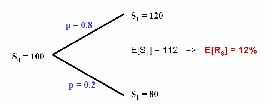

为什么标准的现金流贴现（DCF）不够理想？ 

■  DCF得出以下的期权定价： 

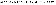

错误在哪里？ 

■  12%的折现率太低=&gt;期权比标底资产股票的风险高 

原因何在？ 

■  股票期权具有杠杆效应。 

*类似于企业的财务杠杆：财务杠杆率越高=&gt;权益资本的β值和收益越高。 

股票期权具有杠杆效应 

■  回忆一下我们复制的资产组合：借入B/(1=r）买进N股股票 

* 假定股票的β值=1，市场溢价=8% 

· 注意CAPM有效，根据CAPM：12%=4%+1×8% 

■  期权的β值为多少？ 

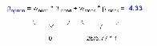

■  因此期权要求的目标收益为：38%=4%+4.33×8% 

■  期权的价格应该为：$5.77=8/1.38 

跨期的情况如何？ 

■  原则上，可以采用与前面相同的方法进行期权定价： 

*从T=2期开始后推 

■  但是在每一个节点有些变化： 

*复制的组合、期权的β值、贴现率 

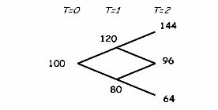

■  作法将会十分麻烦 

■  因此产生了布莱克—斯科尔斯（Black-Scholes）期权定价模型 

期权定价技巧： 

■ “动态”现金流贴现（DCF）（决策树） 

*回忆前面的“手提电脑”和“铜矿”的例子 

*近似运用实物期权问题 

*由于贴现问题并未得出确切答案 

■  二项式模型 

*类似于今天课堂讲授的单期例子 

*比布莱克—斯科尔斯（Black-Scholes）模型计算量大 

*在布莱克—斯科尔斯（Black-Scholes）模型不是很有效时较为适用 

■  布莱克—斯科尔斯（Black-Scholes）模型 

*从现在起我们将重点研究这一模型 

布莱克—斯科尔斯（Black-Scholes）模型 

■  布莱克—斯科尔斯（Black-Scholes）模型的定价原则与二项式模型相同(构建资产组合,无套利)  

期权价格 = 

()()12()NdSNdPVX×−×

■  注意它与单期的二项式模型的相似之处 

期权价格=N×S-PV（B） 

N(d):累积正态概率密度函数 

d1= ln[S/PV(X)] / (σT1/2) + (σT1/2)/2    d2= d1-(σT1/2) 

S =当前的股票价格                        X = 执行价格 

r =无风险利率                            T = 到期时间（年）. 

σ=股票收益的标准差 

回顾“手提电脑”的例子    

                                 模型B 

            模型A的结果好=&gt;                执行                                 

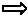

<Table>

<TR>
<TD>

</TD>
<TD>

t=0时模型B中的定价 

</TD>
<TD>

</TD>
</TR>
<TR>
<TD>

B                                                            “静态”NPV 

</TD>
<TD>

      [(16,557 - 21,148)/2]/1.123

</TD>
<TD>

-1,634

</TD>
</TR>
<TR>
<TD>

                                                               “动态”NPV 

</TD>
<TD>

     [(16,557 + 0)/2]/1.123

</TD>
<TD>

5,892 

</TD>
</TR>
<TR>
<TD>

的结果不好=&gt;                                                期权定价 

</TD>
<TD>

[(16,557 + 0)/2]/???3

</TD>
<TD>

??? 

</TD>
</TR>

</Table>

       对模型B为利好消息 

模型

t=0时的价值？                                                                    

     模型A             

       对模型B为利空消息 

                                     模型B

放弃                                       

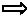

2.实物期权的界定 

关于实物期权的两个问题 ： 

界定 

■  此项目是否有真实的选择权？ 

■  选择权是何种类型？ 

价值评估 

■  怎样给期权定价？ 

■  怎样给不同类型的期权定价？ 

■  为什么我们不能只用NPV定价？ 

实物期权的界定 

■  界定嵌入一个项目中的期权是重要的。 

■  除了那些无足轻重的项目外，其他项目中均有期权嵌入。 

■  最重要的技巧在于： 

*如果有多种期权，对那些“重要”的进行界定， 

*如果有并不重要的期权存在，则可忽略 

■界定真实期权需要经验，有时还需要“见识”。 

实物期权的界定（续） 

■  在对项目诸如“阶段”，“战略投资”，“前景”等的描述中寻求线索 

■  检查现金流和支出的动态模式。 

■  经常遇到的期权的类别： 

*成长期权 

*放弃期权 

*扩张或收缩规模期权 

*调整期权 

*转换期权（投入，产出，工艺等） 

是否存在期权？ 

■  两个条件： 

（1）未来很可能出现新信息； 

（2）当信息出现时，会对决策产生影响。 

■  确认管理者所面临不确定性： 

*管理者随着时间的推移将获取的主要信息是什么？ 

*他们将怎样利用这一信息？ 

例子：Oz Toys 的扩张计划 

■  Oz Toys的管理者正在考虑建立一个新工厂以利用生产技术的革新成果。 

■  大约三年后，该工厂的生产能力将扩大到使得Oz Toys进入一个新市场。 

<Table>

<TR>
<TD>

</TD>
<TD>

2000 

</TD>
<TD>

2001

</TD>
<TD>

2002

</TD>
<TD>

2003 

</TD>
<TD>

2004

</TD>
<TD>

2005

</TD>
<TD>

2006 

</TD>
</TR>
<TR>
<TD>

息税前利润（EBIT）×(1－t) 

</TD>
<TD>

</TD>
<TD>

2.2 

</TD>
<TD>

4.0 

</TD>
<TD>

-10.0 

</TD>
<TD>

11.5

</TD>
<TD>

13.7

</TD>
<TD>

17.4 

</TD>
</TR>
<TR>
<TD>

折旧 

</TD>
<TD>

</TD>
<TD>

19.0

</TD>
<TD>

21.0

</TD>
<TD>

21.0 

</TD>
<TD>

46.3

</TD>
<TD>

48.1

</TD>
<TD>

50.0 

</TD>
</TR>
<TR>
<TD>

资本性支出 

</TD>
<TD>

120.0 

</TD>
<TD>

8.1 

</TD>
<TD>

9.5 

</TD>
<TD>

307.0 

</TD>
<TD>

16.0

</TD>
<TD>

16.3

</TD>
<TD>

17.0 

</TD>
</TR>
<TR>
<TD>

净运营资本变化 

</TD>
<TD>

25.0 

</TD>
<TD>

4.1 

</TD>
<TD>

5.5 

</TD>
<TD>

75.0 

</TD>
<TD>

7.1 

</TD>
<TD>

8.0 

</TD>
<TD>

9.7 

</TD>
</TR>
<TR>
<TD>

自由现金流 

</TD>
<TD>

-145.0

</TD>
<TD>

9.0 

</TD>
<TD>

10.0

</TD>
<TD>

-371.0

</TD>
<TD>

34.7

</TD>
<TD>

37.5

</TD>
<TD>

40.7 

</TD>
</TR>
<TR>
<TD>

终值（5%永续增长） 

</TD>
<TD>

</TD>
<TD>

</TD>
<TD>

</TD>
<TD>

</TD>
<TD>

</TD>
<TD>

</TD>
<TD>

610.5

</TD>
</TR>
<TR>
<TD>

净现值（12%加权平均资本成本）

</TD>
<TD>

-19.8 

</TD>
<TD>

</TD>
<TD>

</TD>
<TD>

</TD>
<TD>

</TD>
<TD>

</TD>
<TD>

</TD>
</TR>

</Table>

Oz Toys：是否存在期权？ 

（1）Oz Toys可能知道（或不知道）： 

■  对现有及/或新产品的需求 

■  对手进入市场的可能性 

■  其他 

（2）这些信息可能（或不会）影响Oz Toys的以下决策： 

■  是否在第一阶段进行扩张 

■  是否进行第二阶段（甚至是第三阶段） 

■  是否开发某种新产品或是其他种类 

■  其他 

Oz Toys：对期权的界定 

■  项目描述有两个不同阶段                                           

*阶段1：新工厂                                                   

*阶段2：扩张 

■  开支的模式：可能是随机的                                         

■  可能内含成长期权                                                 

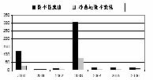

实践问题#1：简单化 

■  现实中的项目，尤其长期项目是复杂的： 

—&gt;它们是实际资产和期权的混合物 

—&gt;期权经常是嵌套的 

■  必要的简单假设： 

—&gt;允许价值评估的技术分析 

—&gt;使模型具有灵活性 

—&gt;使模型对你及其他人（尤其是参与决策的人员）来说是可理解的 

实践问题#1：简单化（续） 

■ 将项目划分为与简单期权相对应的若干部分                            

■ 寻找管理者面对的最主要的不确定性 

■ 由项目决定的简化模型为该项目的价值给出了上（或下）限 

例如： 

—&gt;用欧式期权而不是美式期权 

—&gt;忽略一些期权 

—&gt;忽略一些由“等待”引起的负面影响（如进入的机会） 

Oz Toys：可能的简化 

■ 对阶段1和阶段2分别定价 

■ 主要考虑在第二阶段是否扩张的期权 

—&gt;假定其他期权“不需要考虑” 

■ 假定第二阶段将在2003年进行或不进行 

欧式看涨期权 

3.实物期权定价 

实物期权价值评估 

■ 金融期权的定价工具（即股票及其他金融资产的买入和卖出期权）对于估算某些项目包含的实物期权的价值是有用的 

■ 实物期权比金融期权复杂得多 

■ 与DCF分析类似，其目的在于提供“评分”的量化技巧，以帮助决策过程，而不是来代替合理的商业判断 

期权与现金流贴现（DCF） 

■ 实物期权方法通常作为DCF的替代方法 

■ 实际上，实物期权方法并不与DCF相冲突：它是DCF用于特定投资类型的一种形式 

■ 回忆一下期权定价技术实际上是由于贴现的困难而发展起来的 

*即，由于期权，我们能将同一折现率（如WACC）用于所有现金流 

期权与现金流贴现（DCF）（续） 

■ DCF方法： 

*现金流的“未来预期” 

*对预期现金流贴现 

■ 在以下情况下这种方法十分完美： 

*预期现金流估算准确 

*贴现率选择正确 

■ 确切地说，依靠期权估计以下问题是复杂的： 

*预期现金流 

*贴现率 

从“静态”DCF分析开始 

■ 如果项目不涉及期权，从对其进行估价开始 

*假定投资决策必须立刻做出 

■ 这一基础构成了对项目评估的下限 

*NPV&lt;0并不意味着永远不进行这项投资 

*NPV&gt;0并不意味着要立即进行这项投资（或是一定要在将来进行投资） 

Oz Toys：DCF分析 

■ 分为两个阶段 

■ 要求做出以下判断: 

*哪些开支是可随意决定的,哪些不是 

*每个阶段的现金流入/流出 

■ 注释:有时,简单地恢复损失的数据可用于构建简单的现金流贴现（DCF）分析 

Oz Toys：对第1阶段和第2阶段进行评估 

<Table>

<TR>
<TD>

</TD>
<TD>

2000 

</TD>
<TD>

2001

</TD>
<TD>

2002 

</TD>
<TD>

2003

</TD>
<TD>

2004

</TD>
<TD>

2005

</TD>
<TD>

2006 

</TD>
</TR>
<TR>
<TD>

阶段1 

</TD>
<TD>

</TD>
<TD>

</TD>
<TD>

</TD>
<TD>

</TD>
<TD>

</TD>
<TD>

</TD>
<TD>

</TD>
</TR>
<TR>
<TD>

现金流 

</TD>
<TD>

</TD>
<TD>

9 

</TD>
<TD>

10 

</TD>
<TD>

11 

</TD>
<TD>

11.6

</TD>
<TD>

12.1

</TD>
<TD>

12.7 

</TD>
</TR>
<TR>
<TD>

投资 

</TD>
<TD>

145 

</TD>
<TD>

</TD>
<TD>

</TD>
<TD>

</TD>
<TD>

</TD>
<TD>

</TD>
<TD>

</TD>
</TR>
<TR>
<TD>

终值（TV）（5%永续增长）

</TD>
<TD>

</TD>
<TD>

</TD>
<TD>

</TD>
<TD>

</TD>
<TD>

</TD>
<TD>

</TD>
<TD>

191 

</TD>
</TR>
<TR>
<TD>

净现值（NPV）（WACC=12%）

</TD>
<TD>

-3.7 

</TD>
<TD>

</TD>
<TD>

</TD>
<TD>

</TD>
<TD>

</TD>
<TD>

</TD>
<TD>

</TD>
</TR>
<TR>
<TD>

阶段2 

</TD>
<TD>

</TD>
<TD>

</TD>
<TD>

</TD>
<TD>

</TD>
<TD>

</TD>
<TD>

</TD>
<TD>

</TD>
</TR>
<TR>
<TD>

现金流 

</TD>
<TD>

</TD>
<TD>

</TD>
<TD>

</TD>
<TD>

</TD>
<TD>

23.2

</TD>
<TD>

25.4

</TD>
<TD>

28 

</TD>
</TR>
<TR>
<TD>

投资 

</TD>
<TD>

</TD>
<TD>

</TD>
<TD>

</TD>
<TD>

382 

</TD>
<TD>

</TD>
<TD>

</TD>
<TD>

</TD>
</TR>
<TR>
<TD>

终值（TV）（5%永续增长）

</TD>
<TD>

</TD>
<TD>

</TD>
<TD>

</TD>
<TD>

</TD>
<TD>

</TD>
<TD>

</TD>
<TD>

419.5

</TD>
</TR>
<TR>
<TD>

净现值（NPV）（WACC=12%）

</TD>
<TD>

-16.1

</TD>
<TD>

</TD>
<TD>

</TD>
<TD>

</TD>
<TD>

</TD>
<TD>

</TD>
<TD>

</TD>
</TR>
<TR>
<TD>

总计 

</TD>
<TD>

</TD>
<TD>

</TD>
<TD>

</TD>
<TD>

</TD>
<TD>

</TD>
<TD>

</TD>
<TD>

</TD>
</TR>
<TR>
<TD>

现金流 

</TD>
<TD>

</TD>
<TD>

9 

</TD>
<TD>

10 

</TD>
<TD>

11 

</TD>
<TD>

34.7

</TD>
<TD>

37.5

</TD>
<TD>

40.7 

</TD>
</TR>
<TR>
<TD>

投资 

</TD>
<TD>

145 

</TD>
<TD>

</TD>
<TD>

</TD>
<TD>

382 

</TD>
<TD>

</TD>
<TD>

</TD>
<TD>

</TD>
</TR>
<TR>
<TD>

终值（TV） 

</TD>
<TD>

</TD>
<TD>

</TD>
<TD>

</TD>
<TD>

</TD>
<TD>

</TD>
<TD>

</TD>
<TD>

610.5

</TD>
</TR>
<TR>
<TD>

净现值（NPV）（WACC=12%）

</TD>
<TD>

-19.8

</TD>
<TD>

</TD>
<TD>

</TD>
<TD>

</TD>
<TD>

</TD>
<TD>

</TD>
<TD>

</TD>
</TR>

</Table>

Oz Toys：DCF分析(续) 

■ 两个阶段均有负的NPV 

■ 第二阶段的NPV可能大大高估： 

—&gt;投资（$382M）可能比现金流的风险低 

—&gt;是否要用3年期5.5%？的无风险利率 

第二阶段的现金流贴现（DCF）分析，按5.5%对投资折现 

<Table>

<TR>
<TD>

</TD>
<TD>

2000 

</TD>
<TD>

2001

</TD>
<TD>

2002 

</TD>
<TD>

2003 

</TD>
<TD>

2004

</TD>
<TD>

2005

</TD>
<TD>

2006 

</TD>
</TR>
<TR>
<TD>

阶段2 

</TD>
<TD>

</TD>
<TD>

</TD>
<TD>

</TD>
<TD>

</TD>
<TD>

</TD>
<TD>

</TD>
<TD>

</TD>
</TR>
<TR>
<TD>

现金流 

</TD>
<TD>

</TD>
<TD>

</TD>
<TD>

</TD>
<TD>

</TD>
<TD>

23.2

</TD>
<TD>

25.4

</TD>
<TD>

28.0 

</TD>
</TR>
<TR>
<TD>

投资 

</TD>
<TD>

</TD>
<TD>

</TD>
<TD>

</TD>
<TD>

382.0

</TD>
<TD>

</TD>
<TD>

</TD>
<TD>

</TD>
</TR>
<TR>
<TD>

终值（TV）（5%永续增长） 

</TD>
<TD>

</TD>
<TD>

</TD>
<TD>

</TD>
<TD>

</TD>
<TD>

</TD>
<TD>

</TD>
<TD>

419.5

</TD>
</TR>
<TR>
<TD>

净现值（NPV）（WACC=12%）

</TD>
<TD>

-69.5

</TD>
<TD>

</TD>
<TD>

</TD>
<TD>

</TD>
<TD>

</TD>
<TD>

</TD>
<TD>

</TD>
</TR>

</Table>

期权定价 

■ 策略是将包含于项目中的期权演化为简单金融期权,然后使用金融价值评估工具定价: 布莱克—斯科尔斯（Black-Scholes）模型 

■ 这经常需要作出一些关于该项目的大胆假设。 

图示：项目—&gt;看涨期权 

<Table>

<TR>
<TD>

项目 

</TD>
<TD>

</TD>
<TD>

买入期权 

</TD>
</TR>
<TR>
<TD>

获取资产需要的开支 

</TD>
<TD>

X 

</TD>
<TD>

执行价格 

</TD>
</TR>
<TR>
<TD>

获取的营运资产的价值

</TD>
<TD>

S 

</TD>
<TD>

股票价格（标底资产价格）

</TD>
</TR>
<TR>
<TD>

可以延期决策的时间 

</TD>
<TD>

T 

</TD>
<TD>

到期时间 

</TD>
</TR>
<TR>
<TD>

营运资产的风险 

</TD>
<TD>

σ2

</TD>
<TD>

股票收益的方差 

</TD>
</TR>
<TR>
<TD>

货币的时间价值 

</TD>
<TD>

r 

</TD>
<TD>

无风险利率 

</TD>
</TR>

</Table>

Oz Toys：5个变量 

<Table>

<TR>
<TD>

X 

</TD>
<TD>

实施第2阶段，2003年需要的投资 

</TD>
<TD>

$382M 

</TD>
</TR>
<TR>
<TD>

S 

</TD>
<TD>

第二阶段现金流的现值 

</TD>
<TD>

4255.8

</TD>
</TR>
<TR>
<TD>

T 

</TD>
<TD>

第二阶段似乎要延期3年（由管理者核实） 

</TD>
<TD>

3年 

</TD>
</TR>
<TR>
<TD>

r 

</TD>
<TD>

3年期无风险利率（核实收益曲线） 

</TD>
<TD>

5.5 

</TD>
</TR>
<TR>
<TD>

σ2

</TD>
<TD>

第二阶段资产每年的方差。不能从DCF电子数据表获得

</TD>
<TD>

40% 

</TD>
</TR>

</Table>

<Table>

<TR>
<TD>

阶段2 

</TD>
<TD>

2000 

</TD>
<TD>

2001

</TD>
<TD>

2002 

</TD>
<TD>

2003

</TD>
<TD>

2004

</TD>
<TD>

2005

</TD>
<TD>

2006 

</TD>
</TR>
<TR>
<TD>

现金流 

</TD>
<TD>

</TD>
<TD>

</TD>
<TD>

</TD>
<TD>

</TD>
<TD>

23.2

</TD>
<TD>

25.4

</TD>
<TD>

28.0 

</TD>
</TR>
<TR>
<TD>

终值（TV） 

</TD>
<TD>

</TD>
<TD>

</TD>
<TD>

</TD>
<TD>

</TD>
<TD>

</TD>
<TD>

</TD>
<TD>

419.5

</TD>
</TR>
<TR>
<TD>

现值（PV）（WACC=12%）

</TD>
<TD>

255

</TD>
<TD>

8

</TD>
<TD>

</TD>
<TD>

</TD>
<TD>

</TD>
<TD>

</TD>
<TD>

</TD>
</TR>

</Table>

实践问题#2：什么是波动性？ 

■ 波动性（σ）不能从表格或是报纸上查找 

注释：即便是对σ的粗略估计也可能是有用的 

1．作一个有根据的猜测： 

■ 系统风险与整体风险相关：高β值的项目具有较高的σ 

■ 分散化组合的波动性是这组资产波动性的下限 

■ 对一个单一项目来说，每年20—30%并不是十分高的水平 

实践问题#2：什么是波动性？（续） 

2．数据： 

■ 对一些产业来说，可用投资收益的历史数据 

■ 对许多交易的股票来说，隐含的波动性可从报出的期权价格计算出来 

注释：这些数据需要调整，因为权益回报具有杠杆效应，它们比标底资产更具波动性 

实践问题#2：什么是波动性？（续） 

3．模拟： 

■ 步骤1：对项目未来现金流及未来现金流如何受特定因素（如，商品价格，利率和汇率，等）影响建立一个以平面差价为基础的（简化）模型 

■ 步骤2：用Monte Carlo模拟法模拟项目收益和σ的可能的分布 

布莱克—斯科尔斯（Black-Scholes）模型 

■ 两个充分的数值： 

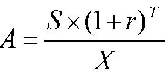

XrSAT)1(+×=

   and  

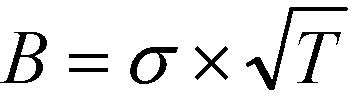

TB×=σ

■ 下表给出了仅为股权价格S一部分的Black-Scholes买入期权的价格 

<Table>

<TR>
<TD>

布莱克—斯科尔斯（Black-Scholes）模型   列：A  行：B

</TD>
</TR>
<TR>
<TD>

</TD>
<TD>

0.6

</TD>
<TD>

0.65

</TD>
<TD>

0.7

</TD>
<TD>

0.75 

</TD>
<TD>

0.8

</TD>
<TD>

0.86

</TD>
</TR>
<TR>
<TD>

0.5

</TD>
<TD>

5.1

</TD>
<TD>

6.6

</TD>
<TD>

8.2

</TD>
<TD>

10 

</TD>
<TD>

11.8

</TD>
<TD>

14.2

</TD>
</TR>
<TR>
<TD>

0.55

</TD>
<TD>

6.6

</TD>
<TD>

8.3

</TD>
<TD>

10

</TD>
<TD>

11.9 

</TD>
<TD>

13.8

</TD>
<TD>

16.1

</TD>
</TR>
<TR>
<TD>

0.6

</TD>
<TD>

8.3

</TD>
<TD>

10.1

</TD>
<TD>

11.9

</TD>
<TD>

13.8 

</TD>
<TD>

15.8

</TD>
<TD>

18.1

</TD>
</TR>
<TR>
<TD>

0.65

</TD>
<TD>

10

</TD>
<TD>

11.9

</TD>
<TD>

13.8

</TD>
<TD>

15.8 

</TD>
<TD>

17.8

</TD>
<TD>

20.1

</TD>
</TR>
<TR>
<TD>

0.7

</TD>
<TD>

11.9

</TD>
<TD>

13.8

</TD>
<TD>

15.8

</TD>
<TD>

17.8 

</TD>
<TD>

19.8

</TD>
<TD>

22.1

</TD>
</TR>
<TR>
<TD>

0.75

</TD>
<TD>

13.7

</TD>
<TD>

15.8

</TD>
<TD>

17.8

</TD>
<TD>

19.8 

</TD>
<TD>

21.8

</TD>
<TD>

24.1

</TD>
</TR>

</Table>

布莱克—斯科尔斯（Black-Scholes）模型（续） 

■ 如果决策不能延期（然而投资和现金流仍始于2003），A值表示第2阶段的价值 

■ 在这个例子中，A实际上是第2阶段的盈利性指数：

并且 

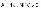

■ 期权价值随着A增长（如表中所示） 

布莱克—斯科尔斯（Black-Scholes）模型（续） 

■ B值，累积波动性，衡量现在和决策期T之间“S变动了多少” 

■ 直观地，S的变动将更大 

—&gt;当S每年的方差较大，即σ较大时 

—&gt;当期限较长，即T较大时 

■ B表示能延期做出决策的价值 

注释：当B=0，只需考虑项目的NPV值（不论A&gt;1与否），因为这时或是决策必须立刻作出（T=0）或是即使决策即时做出但没有信息出现（σ=0） 

Oz Toys：定价 

786.0382)055.1(8.255)1(3=×=+×=XrSAT

  和   

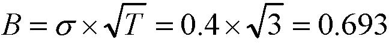

693.034.0=×=×=TBσ

<Table>

<TR>
<TD>

布莱克—斯科尔斯（Black-Scholes）模型  列：A  行：B 

</TD>
</TR>
<TR>
<TD>

</TD>
<TD>

0.6

</TD>
<TD>

0.65

</TD>
<TD>

0.7

</TD>
<TD>

0.75

</TD>
<TD>

0.8

</TD>
<TD>

0.86

</TD>
<TD>

0.9

</TD>
</TR>
<TR>
<TD>

0.5

</TD>
<TD>

5.1

</TD>
<TD>

6.6

</TD>
<TD>

8.2

</TD>
<TD>

10

</TD>
<TD>

11.8

</TD>
<TD>

14.2

</TD>
<TD>

15.7

</TD>
</TR>
<TR>
<TD>

0.55

</TD>
<TD>

6.6

</TD>
<TD>

8.3

</TD>
<TD>

10

</TD>
<TD>

11.9

</TD>
<TD>

13.8

</TD>
<TD>

16.1

</TD>
<TD>

17.7

</TD>
</TR>
<TR>
<TD>

0.6

</TD>
<TD>

8.3

</TD>
<TD>

10.1

</TD>
<TD>

11.9

</TD>
<TD>

13.8

</TD>
<TD>

15.8

</TD>
<TD>

18.1

</TD>
<TD>

19.7

</TD>
</TR>
<TR>
<TD>

0.65

</TD>
<TD>

10

</TD>
<TD>

11.9

</TD>
<TD>

13.8

</TD>
<TD>

15.8

</TD>
<TD>

17.8

</TD>
<TD>

20.1

</TD>
<TD>

21.7

</TD>
</TR>
<TR>
<TD>

0.7

</TD>
<TD>

11.9

</TD>
<TD>

13.8

</TD>
<TD>

15.8

</TD>
<TD>

17.8

</TD>
<TD>

19.8

</TD>
<TD>

22.1

</TD>
<TD>

23.6

</TD>
</TR>
<TR>
<TD>

0.75

</TD>
<TD>

13.7

</TD>
<TD>

15.8

</TD>
<TD>

17.8

</TD>
<TD>

19.8

</TD>
<TD>

21.8

</TD>
<TD>

24.1

</TD>
<TD>

25.6

</TD>
</TR>
<TR>
<TD>

0.8

</TD>
<TD>

15.7

</TD>
<TD>

17.7

</TD>
<TD>

19.8

</TD>
<TD>

21.8

</TD>
<TD>

23.7

</TD>
<TD>

26

</TD>
<TD>

27.5

</TD>
</TR>

</Table>

■ 第2阶段的价值是(大约)：

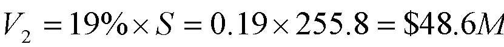

MSV6.48$8.25519.0%192=×=×=

■ 扩张计划的价值是：V1+V2=-3.7+48.6=$44.9M   

实践问题#3：模型检验 

■ 标准期权定价模型需要做出分布假设 

■ 第一步：尽量寻找一种接近于你对真实分布认识的模型（可获得的模型越来越多） 

■ 第二步：确定模型偏离分析的方向，并用得出的结果作为上限或下限 

■ 第三步：将项目视为一个复杂的决策树，用计算机进行批处理（即不进行分解）  

实践问题#4：解释 

■ 由于我们使用的是简化模型，因此要以有所保留的态度对待结果并对其做出解释 

■ 将复杂性还原于模型，通过： 

—&gt;敏感性分析 

—&gt;使推论条件化和合理化 

■ 迭代程序 

■ 帮助你确定项目的关键所在，那是你需要收集更多数据或完善分析的地方 
